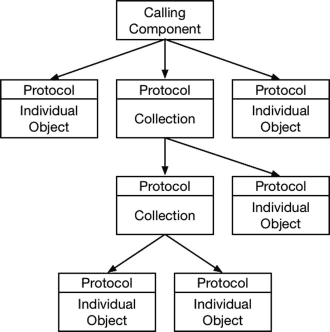
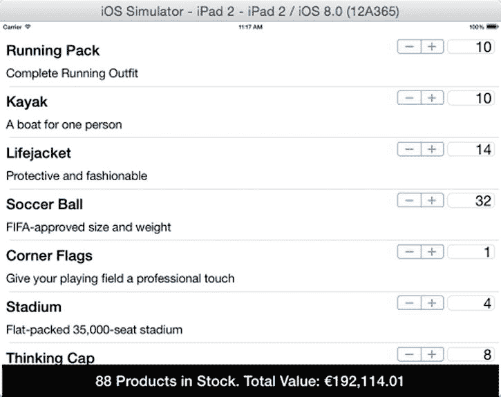

# 15. 组合模式

组合模式并不像我在本书中描述的其他一些设计模式那样具有广泛的适用性，但由于它为包含不同类型对象的数据结构提供了一致性，因此它仍然是一个重要的模式。表 15-1 将组合模式置于具体背景中。

**表 15-1.** 组合模式背景概述

| 问题 | 答案 |
| --- | --- |
| 这是什么？ | 组合模式允许将单个对象和对象集合构成的树结构进行一致处理。 |
| 有什么好处？ | 组合模式带来的一致性意味着，操作树结构的组件更简单，且无需了解所涉及的不同对象类型。 |
| 何时应使用此模式？ | 当树结构包含叶子节点和对象集合时，应使用此模式。 |
| 何时应避免此模式？ | 此模式仅适用于树形数据结构。 |
| 如何判断是否正确实现了该模式？ | 当使用树结构的组件能够通过相同类型或协议处理其中包含的所有对象时，该模式即正确实现。 |
| 有哪些常见陷阱？ | 此模式最适合创建后不再修改的树结构。添加对树结构修改的支持会削弱该模式的优势。 |
| 是否有相关模式？ | 许多结构性模式的实现方式相似但意图不同。请确保从我在这部分书中描述的模式中选择正确的模式。 |


## 准备示例项目

沿用前几章的方法，我创建了一个名为 `Composite` 的全新 OS X 命令行工具项目。我在项目中添加了一个名为 `CarParts.swift` 的文件，其内容如代码清单 15-1 所示。

代码清单 15-1. `CarParts.swift` 文件的内容

```
class Part {
    let name:String;
    let price:Float;
    init(name:String, price:Float) {
        self.name = name; self.price = price;
    }
}

class CompositePart {
    let name:String;
    let parts:[Part];
    init(name:String, parts:Part...) {
        self.name = name; self.parts = parts;
    }
}
```

我定义了两个类来表示用于维修汽车的零部件。`Part` 类代表单个独立的零件，例如火花塞或轮胎。`CompositePart` 类代表由其他零件组成且通常整体采购的部件，比如一个车轮，它通常包括轮胎、轮毂和一些固定螺母。`CompositePart` 类使用 `Part` 数组来表示其组成元素。我还添加了一个名为 `Orders.swift` 的文件，其内容如代码清单 15-2 所示。

代码清单 15-2. `Orders.swift` 文件的内容

```
import Foundation

class CustomerOrder {
    let customer:String;
    let parts:[Part];
    let compositeParts:[CompositePart];
    init(customer:String, parts:[Part], composites:[CompositePart]) {
        self.customer = customer;
        self.parts = parts;
        self.compositeParts = composites;
    }
    var totalPrice:Float {
        let partReducer = {(subtotal:Float, part:Part) -> Float in
            return subtotal + part.price};
        var total = reduce(parts, 0, partReducer);
        return reduce(compositeParts, total, {(subtotal, cpart) -> Float in
            return reduce(cpart.parts, subtotal, partReducer);
        });
    }
    func printDetails() {
        println("Order for \(customer): Cost: \(formatCurrencyString(totalPrice))");
    }
    func formatCurrencyString(number:Float) -> String {
        let formatter = NSNumberFormatter();
        formatter.numberStyle = NSNumberFormatterStyle.CurrencyStyle;
        return formatter.stringFromNumber(number) ?? "";
    }
}
```

`CustomerOrder` 类代表一个由 `Part` 和 `CompositePart` 对象组成的订单。`printDetails` 方法输出客户名称和订单总价，总价从 `totalPrice` 属性获取。代码清单 15-3 展示了我添加到 `main.swift` 文件中的代码，用于创建和填充包含 `Part` 和 `CompositePart` 对象的 `CustomerOrder` 对象。

代码清单 15-3. `main.swift` 文件的内容

```
let doorWindow = CompositePart(name: "DoorWindow", parts:
    Part(name: "Window", price: 100.50),
    Part(name: "Window Switch", price: 12));
let door = CompositePart(name: "Door", parts:
    Part(name: "Window", price: 100.50),
    Part(name: "Door Loom", price: 80),
    Part(name: "Window Switch", price: 12),
    Part(name: "Door Handles", price: 43.40));
let hood = Part(name: "Hood", price: 320);
let order = CustomerOrder(customer: "Bob", parts: [hood],
    composites: [door, doorWindow]);
order.printDetails();
```

客户是 `Bob`，他的订单包含一扇完整的车门、一个车门车窗和一个引擎盖。运行该应用程序将输出以下内容：

```
Order for Bob: Cost: $668.40
```

## 理解该模式要解决的问题

示例应用程序中的类存在两个不同的问题，这两个问题都源于在订单中使用了不同类型的对象来表示汽车零部件。

第一个问题是，我只能使用简单的层次结构来表示零部件。当我在代码清单 15-3 中创建 `CompositePart` 对象来表示一个车门时，我必须为 `Window`（车窗）创建一个 `Part` 对象，再为 `Window Switch`（车窗开关）创建另一个 `Part` 对象。尽管车门已经包含了一个车窗，但我还是得为车门车窗创建相同的 `Part` 对象。这种限制意味着我需要维护两个零件列表并保持它们同步，即使其中一个列表是另一个列表的超集。

第二个问题是，操作零部件对象的类需要了解 `CompositePart` 和 `Part` 对象的细节以及它们之间的关联方式。你可以在 `CustomerAccount` 类中看到这个问题的一个例子，该类中相当大一部分代码用于计算所有已订购 `Part` 对象的总成本。

```
...
var totalPrice:Float {
    let partReducer = {(subtotal:Float, part:Part) -> Float in
        return subtotal + part.price};
    var total = reduce(parts, 0, partReducer);
    return reduce(compositeParts, total, {(subtotal, cpart) -> Float in
        return reduce(cpart.parts, subtotal, partReducer);
    });
}
...
```

由于操作零部件对象的组件需要理解 `Part` 和 `CompositePart` 类之间的关系，这意味着我必须在每个这样的组件中重复编写这类代码。

## 理解组合模式

组合模式解决了上述问题，它通过将对象排列成树形层次结构，并定义一个协议，使得单个对象和组合对象能够被一致地处理。该协议提供给操作对象的组件，这些组件无需知道哪些对象是单个对象，哪些是集合。

该协议也在组合对象内部使用，从而使它们能够无缝地聚合代表单个对象和其他集合的对象。图 15-1 展示了使用组合模式来排列对象的方式，但这是一个通过实际实现最容易理解的模式；详情请参见下一节。



图 15-1.

组合模式

## 实现组合模式

用于表示单个对象的对象在树形数据结构中被称为叶节点。用于表示集合的对象被称为组合节点。叶节点和组合节点都实现相同的协议，该协议隐藏了消费这些集合的组件所需的集合构成细节。

实现的第一步是定义协议，这是该模式的核心。代码清单 15-4 显示了示例应用程序中协议的定义，以及使 `Part` 和 `CompositePart` 类符合该协议所需的更改。

代码清单 15-4. 在 `CarParts.swift` 文件中定义并应用协议

```
protocol CarPart {
    var name:String { get };
    var price:Float { get };
}

class Part : CarPart {
    let name:String;
    let price:Float;
    init(name:String, price:Float) {
        self.name = name; self.price = price;
    }
}

class CompositePart : CarPart {
    let name:String;
    let parts:[CarPart];
    init(name:String, parts:CarPart...) {
        self.name = name; self.parts = parts;
    }
    var price:Float {
        return reduce(parts, 0, {subtotal, part in
            return subtotal + part.price;
        });
    }
}
```

`CarPart` 协议定义了 `name` 和 `price` 属性，这与 `Part` 类已经定义的属性相对应。这意味着对于 `Part` 类，唯一的改动就是声明遵守该协议。

对于 `CompositePart` 类的改动更为深远。重要的是，组合节点对象应操作协议本身，而不是操作遵守该协议的具体类，这意味着我移除了对 `Part` 类的引用，并将其替换为对 `CarPart` 协议的引用。此外，我还实现了协议要求的 `price` 属性，其实现使用全局 `reduce` 函数来汇总它所聚合的所有 `CarPart` 对象 `price` 属性的值。


### 应用模式

下一步是更新那些操作叶节点和组合对象的类，使其依赖于协议而非其实现类。清单 15-5 展示了我对 `CustomerOrder` 类所做的更改。

**清单 15-5.** 在 `Orders.swift` 文件中应用协议

```
import Foundation

class CustomerOrder {
    let customer:String;
    let parts:[CarPart];
    init(customer:String, parts:[CarPart]) {
        self.customer = customer;
        self.parts = parts;
    }
    var totalPrice:Float {
        return reduce(parts, 0, {subtotal, part in
            return subtotal + part.price});
    }
    func printDetails() {
        println("Order for \(customer): Cost: \(formatCurrencyString(totalPrice))");
    }
    func formatCurrencyString(number:Float) -> String {
        let formatter = NSNumberFormatter();
        formatter.numberStyle = NSNumberFormatterStyle.CurrencyStyle;
        return formatter.stringFromNumber(number) ?? "";
    }
}
```

`CustomerOrder` 类不再需要了解叶节点类和组合类，它只与 `CartPart` 协议打交道。主要影响体现在 `totalPrice` 属性上，现在只需汇总 `CarPart` 对象的 `price` 属性即可得到订单总价。

最后一步是更改 `main.swift` 文件中的代码，以便能够创建和复用组合对象，如清单 15-6 所示。

**清单 15-6.** 在 `main.swift` 文件中复用组合对象

```
let doorWindow = CompositePart(name: "DoorWindow", parts:
    Part(name: "Window", price: 100.50),
    Part(name: "Window Switch", price: 12));
let door = CompositePart(name: "Door", parts:
    doorWindow,
    Part(name: "Door Loom", price: 80),
    Part(name: "Door Handles", price: 43.40));
let hood = Part(name: "Hood", price: 320);
let order = CustomerOrder(customer: "Bob", parts: [hood, door, doorWindow]);
order.printDetails();
```

> **注意：** 创建数据结构的代码（在本示例中位于 `main.swift` 文件中）仍然需要理解叶节点和组合对象之间的区别，以便构建树结构。组合模式影响的是使用树结构的组件，这些组件不再依赖于能够区分不同类型的对象。

无需重复定义车门窗所需的部件，我可以直接创建一个组合对象，并将其作为参数传递给另一个对象的初始化器。这意味着我可以在一个地方修改组成车门窗的部件集合。运行应用程序会产生与实现组合模式之前相同的输出。

```
Order for Bob: Cost: $668.40
```

## 理解组合模式的陷阱

当创建的树结构是固定不变时，组合模式的效果最佳。组合模式的主要陷阱在于，当需要在创建后改变结构时就会出现问题。清单 15-7 展示了我对 `CompositePart` 类所做的更改，以支持结构变化。

**清单 15-7.** 在 `CarParts.swift` 文件中添加对组合集合变化的支持

```
...
class CompositePart : CarPart {
    let name:String;
    private var parts:[CarPart];

    init(name:String, parts:CarPart...) {
        self.name = name; self.parts = parts;
    }
    var price:Float {
        return reduce(parts, 0, {subtotal, part in
            return subtotal + part.price;
        });
    }
    func addPart(part:CarPart) {
        parts.append(part);
    }
    func removePart(part:CarPart) {
        for index in 0 ..< parts.count {
            if (parts[index].name == part.name) {
                parts.removeAtIndex(index);
                break;
            }
        }
    }
}
...
```

这些更改非常简单。我将常量 `CarPart` 数组重新定义为变量，并添加了 `addPart` 和 `removePart` 方法。然而，这些更改意味着，修改数据结构的组件需要知道 `CompositePart` 类定义了 `addPart` 和 `removePart` 方法，并且需要理解 `CompositePart` 和 `Part` 类之间的区别，才能添加和删除部件。

清单 15-7 中的更改削弱了组合模式的优势。解决此问题的一个常见尝试是将这些方法包含在协议中，以统一叶节点和组合对象实现的 API，如清单 15-8 所示。

**清单 15-8.** 尝试在 `CarParts.swift` 文件中统一 API

```
protocol CarPart {
    var name:String { get };
    var price:Float { get };
    func addPart(part:CarPart) -> Void;
    func removePart(part:CarPart) -> Void;
}

class Part : CarPart {
    let name:String;
    let price:Float;
    init(name:String, price:Float) {
        self.name = name; self.price = price;
    }
    func addPart(part: CarPart) {
        // 不执行任何操作
    }
    func removePart(part: CarPart) {
        // 不执行任何操作
    }
}

class CompositePart : CarPart {
    // ...为了简洁起见，省略了语句...
}
```

这并不是解决问题的办法，因为 `Part` 类无法实现 `addPart` 和 `removePart` 方法。调用这些方法的组件会期望数据结构被修改，但事实上什么也不会发生，其结果要么是数据丢失，要么是出现错误。

## Cocoa 中组合模式的示例

在 Cocoa 框架中，组合模式最重要的应用是 `UIView` 类，它定义了应用布局中所有元素的通用行为。视图层次结构中的各个视图对象可以是叶节点（如标签），也可以是包含其他视图集合的组合对象（如表视图控制器）。

## 将模式应用于 SportsStore 应用

为了将组合模式应用于 SportsStore 应用，我将创建由单个产品组成、并以单一单位销售的产品套装。

### 准备示例应用

为了准备组合模式，我将简化 `Product` 类，并移除前面章节中添加的一些特性。清单 15-9 展示了我所做的更改。

**清单 15-9.** 在 `Product.swift` 文件中简化 `Product` 类

```
import Foundation

class Product : NSObject, NSCopying {
    private(set) var name:String;
    private(set) var productDescription:String;
    private(set) var category:String;
    private var stockLevelBackingValue:Int = 0;
    private var priceBackingValue:Double = 0;

    required init(name:String, description:String, category:String, price:Double,
        stockLevel:Int) {
        self.name = name;
        self.productDescription = description;
        self.category = category;
        super.init();
        self.price = price;
        self.stockLevel = stockLevel;
    }
    var stockLevel:Int {
        get { return stockLevelBackingValue;}
        set { stockLevelBackingValue = max(0, newValue);}
    }
    private(set) var price:Double {
        get { return priceBackingValue;}
        set { priceBackingValue = max(1, newValue);}
    }
    var stockValue:Double {
        get {
            return price * Double(stockLevel);
        }
    }
    func copyWithZone(zone: NSZone) -> AnyObject {
        return Product(name: self.name, description: self.description,
            category: self.category, price: self.price,
            stockLevel: self.stockLevel);
    }
    class func createProduct(name:String, description:String, category:String,
        price:Double, stockLevel:Int) -> Product {
        return Product(name:name, description: description, category: category,
            price: price, stockLevel: stockLevel);
    }
}
```

我已从 `Product.swift` 文件中移除了特定于类别的子类，并简化了 `Product` 类本身，使其不再处理销售税或追加销售机会（这些是由子类提供的特殊功能）。


### 定义组合类

当将组合模式应用于现有应用程序时，通常无法创建一个让叶节点和组合对象都遵循的协议。在这种情况下，我将现有类既视为通用功能定义，又视为叶节点的模板。这使我能够将组合类定义为一个子类，如代码清单 15-10 所示。

**代码清单 15-10.** 在`Product.swift`文件中定义组合类

```
import Foundation

class Product : NSObject, NSCopying {
    // ...为简洁起见，省略了语句...
}

class ProductComposite : Product {
    private let products:[Product];

    required init(name:String, description:String, category:String,
                  price:Double, stockLevel:Int) {
        fatalError("Not implemented");
    }

    init(name:String, description:String, category:String, stockLevel:Int,
         products:Product...) {
        self.products = products;
        super.init(name: name, description: description, category: category,
                   price: 0, stockLevel: stockLevel);
    }

    override var price:Double {
        get { return reduce(products, 0, {total, p in return total + p.price}); }
        set { /* do nothing */ }
    }
}
```

这种方法不如使用单独的协议那样优雅，但它最大程度地减少了实现该模式所需的更改次数。`ProductComposite` 类继承自 `Product`，并维护了一个不可变的 `Product` 对象数组。`price` 属性被重写，以便从收集到的 `Product` 对象计算返回值。

### 应用模式

最后一步是向 SportsStore 目录中添加一个产品集。代码清单 15-11 展示了我对 `ProductDataStore` 类所做的更改。

**代码清单 15-11.** 在`ProductDataStore.swift`文件中定义产品集

```
import Foundation

final class ProductDataStore {
    var callback:((Product) -> Void)?;
    private var networkQ:dispatch_queue_t
    private var uiQ:dispatch_queue_t;
    lazy var products:[Product] = self.loadData();

    init() {
        networkQ = dispatch_get_global_queue(DISPATCH_QUEUE_PRIORITY_BACKGROUND, 0);
        uiQ = dispatch_get_main_queue();
    }

    private func loadData() -> [Product] {
        // ...为简洁起见，省略了语句...
    }

    private var productData:[Product] = [
        ProductComposite(name: "跑步套装",
                         description: "完整的跑步装备", category: "跑步",
                         stockLevel: 10, products:
            Product.createProduct("衬衫", description: "跑步衬衫",
                                  category: "跑步", price: 42, stockLevel: 10),
            Product.createProduct("短裤", description: "跑步短裤",
                                  category: "跑步", price: 30, stockLevel: 10),
            Product.createProduct("鞋子", description: "跑步鞋",
                                  category: "跑步", price: 120, stockLevel: 10),
            ProductComposite(name: "头部装备", description: "帽子等",
                             category: "跑步", stockLevel: 10, products:
                Product.createProduct("帽子", description: "跑步帽",
                                      category: "跑步", price: 10, stockLevel: 10),
                Product.createProduct("太阳镜", description: "眼镜",
                                      category: "跑步", price: 10, stockLevel: 10))
        ),
        Product.createProduct("皮划艇", description:"单人船",
                              category:"水上运动", price:275.0, stockLevel:0),
        Product.createProduct("救生衣",
                              description:"既保护又时尚",
                              category:"水上运动", price:48.95, stockLevel:0),
        // ...为简洁起见，省略了语句...
    ]
}
```

我定义了一个名为“跑步套装”的新产品，它由多个独立产品组成。其中一个产品“头部装备”本身也是一个产品集。运行应用程序将看到该产品已添加到目录中，如图 15-2 所示。



**图 15-2.** SportsStore 目录中的产品集

## 本章小结

在本章中，我展示了如何使用组合模式，以便能够一致地处理树形数据结构中的不同类型对象。在下一章中，我将描述外观模式，该模式能够简化复杂 API，以便更轻松地执行常见任务。

