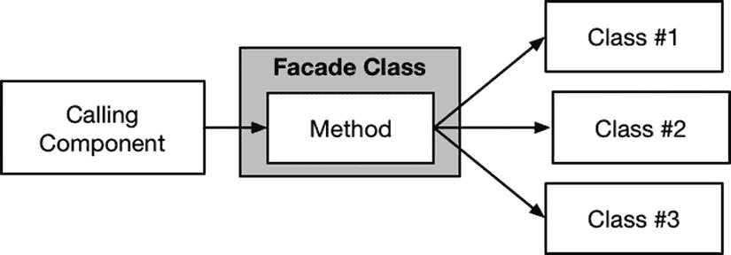
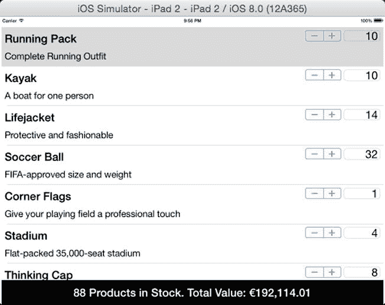

# 16. 外观模式

外观模式用于简化由一个或多个类提供的 API，以便更轻松地执行常见任务，并将使用 API 所需的复杂性集中到应用程序的一个部分。表 16-1 将外观模式置于上下文中。

**表 16-1.** 将外观模式置于上下文中

| 问题 | 答案 |
| --- | --- |
| 它是什么？ | 外观模式简化了执行常见任务时使用复杂 API 的过程。 |
| 好处是什么？ | 使用 API 所需的复杂性被集中到一个类中，从而最大限度地降低了 API 变更的影响，并简化了使用 API 功能的组件。 |
| 何时应使用此模式？ | 当处理需要一起使用但 API 不兼容的类时，应使用外观模式。 |
| 何时应避免此模式？ | 当将单个组件集成到应用程序中时，不应使用外观模式；而应使用适配器模式。 |
| 如何判断是否正确实现了该模式？ | 当无需调用组件依赖于底层对象或其支持数据类型即可执行常见任务时，即实现了外观模式。 |
| 有哪些常见的陷阱？ | 实现外观模式时的陷阱是泄漏底层对象的细节。这意味着调用组件仍然依赖于底层类或支持类型，并在它们发生变化时需要修改。 |
| 有哪些相关模式？ | 许多结构模式具有相似的实现但不同的意图。请确保从我本书本部分描述的模式中选择正确的模式。 |


## 准备示例项目

针对本章内容，我创建了一个名为`Facade`的 Xcode OS X 命令行工具项目。我将以海盗为主题创建三个类。首先创建了`TreasureMap.swift`文件，其内容如代码清单 16-1 所示。

**代码清单 16-1.**`TreasureMap.swift`文件的内容

```
class TreasureMap {

    enum Treasures {
        case GALLEON; case BURIED_GOLD; case SUNKEN_JEWELS;
    }

    struct MapLocation {
        let gridLetter: Character;
        let gridNumber: UInt;
    }

    func findTreasure(type:Treasures) -> MapLocation {
        switch type {
        case .GALLEON:
            return MapLocation(gridLetter: "D", gridNumber: 6);
        case .BURIED_GOLD:
            return MapLocation(gridLetter: "C", gridNumber: 2);
        case .SUNKEN_JEWELS:
            return MapLocation(gridLetter: "F", gridNumber: 12);
        }
    }
}
```

`TreasureMap`类定义了`findTreasure`方法，该方法接收嵌套枚举`Treasures`中的一个值，并返回一个`MapLocation`实例，表示指定类型宝藏的所在地。我创建的第二个文件名为`PirateShip.swift`，其内容如代码清单 16-2 所示。

**代码清单 16-2.**`PirateShip.swift`文件的内容

```
import Foundation;

class PirateShip {

    struct ShipLocation {
        let NorthSouth:Int;
        let EastWest:Int;
    }

    var currentPosition:ShipLocation;
    var movementQueue = dispatch_queue_create("shipQ", DISPATCH_QUEUE_SERIAL);

    init() {
        currentPosition = ShipLocation(NorthSouth: 5, EastWest: 5);
    }

    func moveToLocation(location:ShipLocation, callback:(ShipLocation) -> Void) {
        dispatch_async(movementQueue, {() in
            self.currentPosition = location;
            callback(self.currentPosition);
        });
    }
}
```

顾名思义，`PirateShip`类代表一艘可以移动到新位置的船。位置通过嵌套的`ShipLocation`结构体指定，并传递给`moveToLocation`方法。船只移动到新位置需要时间，因此`moveToLocation`方法的实现是异步的，并使用回调在船只到达指定位置时发送通知。异步实现使用了 Grand Central Dispatch 队列和块，我在第 7 章中对此进行了描述。我没有为船只移动添加任何延迟，因此回调会立即被调用；这对于本章的重点——处理复杂 API——来说已经足够了。我添加到项目中的最后一个文件名为`PirateCrew.swift`，其内容如代码清单 16-3 所示。

**代码清单 16-3.**`PirateCrew.swift`文件的内容

```
import Foundation;

class PirateCrew {

    let workQueue = dispatch_queue_create("crewWorkQ", DISPATCH_QUEUE_SERIAL);

    enum Actions {
        case ATTACK_SHIP; case DIG_FOR_GOLD; case DIVE_FOR_JEWELS;
    }

    func performAction(action:Actions, callback:(Int) -> Void) {
        dispatch_async(workQueue, {() in
            var prizeValue = 0;
            switch (action) {
            case .ATTACK_SHIP:
                prizeValue = 10000;
            case .DIG_FOR_GOLD:
                prizeValue = 5000;
            case .DIVE_FOR_JEWELS:
                prizeValue = 1000;
            }
            callback(prizeValue);
        });
    }
}
```

`PirateCrew`类代表船员，可以通过`performAction`方法为船员分配工作。要执行的工作由`Actions`枚举中的一个值表示。工作本身是异步执行的，并通过回调来通知任务已完成。回调接收一个`Int`值，代表工作所得的宝藏价值。

## 理解该模式解决的问题

示例应用中的三个类必须协同使用，才能为海盗创造收益。`TreasureMap`类提供宝藏位置信息，`PirateShip`类提供运输劳动力以获取宝藏所需的手段，而`PirateCrew`类则提供在就位后指挥劳动力的方式。

这些类必须按特定顺序使用。在从地图上获得宝藏位置之前，移动船只毫无意义；在船只就位之前，给船员分配工作也毫无意义。

更糟糕的是，这些类使用不同的数据类型来表示其输入和输出。`TreasureMap`类使用的坐标数据类型与`PirateShip`类不同，使用的枚举也与`PirateCrew`类不同。最后，这些类定义的方法具有不同的特性：有些方法立即返回结果，而另一些则是异步的。

由此产生的问题是，为了协调使用这三个类来赚钱，会带来一定的复杂性。代码清单 16-4 展示了我在`main.swift`文件中定义的演示代码。

**代码清单 16-4.**`main.swift`文件的内容

```
import Foundation;

let map = TreasureMap();
let ship = PirateShip();
let crew = PirateCrew();

let treasureLocation = map.findTreasure(TreasureMap.Treasures.GALLEON);

// convert from map to ship coordinates
let sequence:[Character] = ["A", "B", "C", "D", "E", "F", "G"];
let eastWestPos = find(sequence, treasureLocation.gridLetter);
let shipTarget = PirateShip.ShipLocation(NorthSouth:
    Int(treasureLocation.gridNumber), EastWest: eastWestPos!);

// relocate ship
ship.moveToLocation(shipTarget, callback: {location in
    // get the crew to work
    crew.performAction(PirateCrew.Actions.ATTACK_SHIP, {prize in
        println("Prize: \(prize) pieces of eight");
    });
});

NSFileHandle.fileHandleWithStandardInput().availableData;
```

`main.swift`文件中的代码创建了`map`、`ship`和`crew`对象，并按顺序使用它们来寻找并攻击一艘宝藏帆船。代码将地图使用的坐标转换为船只使用的坐标，并确保给船员下达的指令（`ATTACK_SHIP`）与船只所在位置的地图对象（`GALLEON`）相对应。这段代码为异步回调方法使用了闭包，以确保在船只就位之前不会向船员下达命令，并获取所得奖金的信息。

**提示：** 我在代码清单 16-4 中使用了`NSFileHandle`类，以防止在向`PirateShip`和`PirateCrew`对象发出异步方法调用完成之前退出应用。应用不会等待异步 GCD 操作完成，而`NSFileHandle`通过等待从控制台读取数据来保持应用存活。

每当使用`TreasureMap`、`PirateShip`和`PirateCrew`对象时，这种复杂性会在整个应用中重复出现。如果任何单个对象、它们之间的关系或它们使用的数据类型发生变化，都必须仔细修改重复的代码。这种依赖关系会导致错误，并产生难以有效测试的代码。运行应用会产生以下输出：

```
Prize: 10000 pieces of eight
```


## 理解外观模式

外观模式通过创建一个类来解决复杂性问题，该类将复杂性整合到应用程序的单一位置，并向其他组件提供简化的 API，如图 16-1 所示。



图 16-1. 外观模式

`Facade` 类负责处理复杂工作，让调用组件能够利用底层类所提供的功能，而无需了解这些类本身、它们之间的关联方式，以及它们用来支持其功能的类型。底层类中的变更只需在 `Facade` 类中体现，而调用类中的代码则更简单，更专注于其需要完成的任务。

## 实现外观模式

外观模式实现简单，需要定义一个提供简单 API 来使用复杂类的类。`Facade` 类不应暴露底层类的任何细节，也不应要求调用组件对其有任何了解。代码清单 16-5 展示了 `Facade.swift` 文件的内容，我将其添加到示例项目中以定义一个外观类。

**代码清单 16-5.** `Facade.swift` 文件的内容

```swift
import Foundation

enum TreasureTypes {
  case SHIP; case BURIED; case SUNKEN;
}

class PirateFacade {
  private let map = TreasureMap();
  private let ship = PirateShip();
  private let crew = PirateCrew();

  func getTreasure(type:TreasureTypes) -> Int? {
    var prizeAmount:Int?;
    // 选择宝藏类型
    var treasureMapType:TreasureMap.Treasures;
    var crewWorkType:PirateCrew.Actions;
    switch (type) {
      case .SHIP:
        treasureMapType = TreasureMap.Treasures.GALLEON;
        crewWorkType = PirateCrew.Actions.ATTACK_SHIP;
      case .BURIED:
        treasureMapType = TreasureMap.Treasures.BURIED_GOLD;
        crewWorkType = PirateCrew.Actions.DIG_FOR_GOLD;
      case .SUNKEN:
        treasureMapType = TreasureMap.Treasures.SUNKEN_JEWELS;
        crewWorkType = PirateCrew.Actions.DIVE_FOR_JEWELS;
    }
    let treasureLocation = map.findTreasure(treasureMapType);
    // 将地图坐标转换为船舶坐标
    let sequence:[Character] = ["A", "B", "C", "D", "E", "F", "G"];
    let eastWestPos = find(sequence, treasureLocation.gridLetter);
    let shipTarget = PirateShip.ShipLocation(NorthSouth:
      Int(treasureLocation.gridNumber), EastWest: eastWestPos!);
    let semaphore = dispatch_semaphore_create(0);
    // 重新定位船舶
    ship.moveToLocation(shipTarget, callback: {location in
      self.crew.performAction(crewWorkType, {prize in
        prizeAmount = prize;
        dispatch_semaphore_signal(semaphore);
      });
    });
    dispatch_semaphore_wait(semaphore, DISPATCH_TIME_FOREVER);
    return prizeAmount;
  }
}
```

`PirateFacade` 类定义了一个名为 `getTreasure` 的方法，它是 `TreasureMap`、`PirateShip` 和 `PirateCrew` 类的外观。`getTreasure` 方法的实现包含大致相同的代码，但有两个重要区别。

第一个区别是 `PirateFacade` 类依赖 `TreasureTypes` 枚举来确定需要哪种宝藏以及哪种船员工作。我本可以依赖外观背后类定义的其中一个枚举，但这会在这些类上产生依赖，而这是我想避免的。在外观中包含枚举使我能够完全隐藏外观背后类的实现。

另一个区别是 `getTreasure` 方法是同步的，并且会阻塞，直到对外观背后类中异步方法的调用完成。这并不是实现外观模式所必需的，外观模式完全可以包含异步方法，但我想完全隐藏底层实现细节，为此我使用了 Grand Central Dispatch 信号量。（我在第 7 章中介绍过 GCD 信号量。）

### 应用外观

剩下的工作就是修改 `main.swift` 文件中的代码以利用外观类，如代码清单 16-6 所示。

**代码清单 16-6.** 在 `main.swift` 文件中使用 `Facade` 类

```swift
let facade = PirateFacade();
let prize = facade.getTreasure(TreasureTypes.SHIP);

if (prize != nil) {
  println("Prize: \(prize!) pieces of eight");
}
```

所有涉及使用 `TreasureMap`、`PirateShip` 和 `PirateCrew` 类的复杂性都被隐藏起来，任何需要使用这些类的组件只需与外观打交道即可。运行应用程序会在 Xcode 调试控制台中产生以下输出：

```
Prize: 10000 pieces of eight
```

## 外观模式的变体

我在上一节创建的类是一个不透明外观，这意味着底层对象的任何细节都不会暴露给调用组件。该模式的一种变体是创建透明外观，在这种变体中，部分或全部底层对象会被暴露出来，供需要高级功能或更细粒度控制工作的调用组件使用。在 Swift 中，透明外观类只需提供对存储底层对象的属性的访问，如代码清单 16-7 所示。

**代码清单 16-7.** 在 `Facade.swift` 文件中创建透明外观

```swift
import Foundation

enum TreasureTypes {
  case SHIP; case BURIED; case SUNKEN;
}

class PirateFacade {
  let map = TreasureMap();
  let ship = PirateShip();
  let crew = PirateCrew();

  func getTreasure(type:TreasureTypes) -> Int? {
    // ...为简洁起见，省略了语句...
  }
}
```

我已经移除了之前保护 `map`、`ship` 和 `crew` 属性的 `private` 关键字，其效果是调用组件可以选择直接访问这些对象，而不是仅依赖 `getTreasure` 方法，如代码清单 16-8 所示。

**代码清单 16-8.** 在 `main.swift` 文件中使用透明外观

```swift
import Foundation;

let facade = PirateFacade();
let prize = facade.getTreasure(TreasureTypes.SHIP);

if (prize != nil) {
  facade.crew.performAction(PirateCrew.Actions.DIVE_FOR_JEWELS,
    callback: {secondPrize in
      println("Prize: \(prize! + secondPrize) pieces of eight");
  });
}

NSFileHandle.fileHandleWithStandardInput().availableData;
```

通过访问外观类的 `crew` 属性，我可以在不调用 `getTreasure` 方法的情况下发出第二个指令，而 `getTreasure` 方法会查询地图并移动船舶。这是一个高级操作。大多数情况下，海盗攻击一艘船后就会继续前进，但在此例中，他们还会在同一地点潜水寻找沉没的宝藏。创建透明外观使我能够处理这种高级且不常见的情况，而无需为外观类增加额外的复杂性。

这种方法的缺点是它削弱了外观类所提供的隔离性。代表此示例中调用组件的 `main.swift` 文件中的代码现在需要了解 `PirateCrew` 类是如何实现的、它对 `Actions` 枚举的依赖，以及 `performAction` 方法是异步实现的这一事实。因此，应谨慎且有限地使用外观模式的透明变体。运行应用程序会产生以下输出：

```
Prize: 11000 pieces of eight
```


## 理解外观模式的陷阱

实现外观模式时只有一个陷阱：无意中将底层对象的细节暴露给调用组件。在不透明外观类中，暴露任何细节都是问题。外观应隐藏所有细节，包括关联的数据类型、自定义错误消息，以及任何会在组件与外观所隐藏对象之间产生依赖关系的内容。

对于透明外观而言情况更为复杂，这类外观会有意暴露至少一部分实现细节。需要仔细考量底层对象的哪些方面应该被暴露，并尽一切努力将由此产生的依赖范围降至最低。

**注意**

我发现该模式的透明变体最常被用作对不透明外观进行事后追溯式的重新分类——这种不透明外观本来已被篡改，以便实现最后一刻的变更。外观应在设计阶段就归类为透明，而不应被用作掩盖因时间压力导致的应用结构问题的标签。如果为了交付产品而不得不对外观做出妥协，那就这样做吧，但不要假装它从一开始就应该是一个透明外观。你只是在自找麻烦。做出修改，交付产品，并确保在时间更充裕时以更周全的方式重新编写代码。

## Cocoa 中的外观模式示例

Cocoa 框架中有几个外观模式的示例，最常用的是 `UITextView` 类，它为用于管理文本显示的一组复杂类提供了透明外观。作为演示，我创建了一个名为 `TextFacade.playground` 的 playground，其内容如代码清单 16-9 所示。

**代码清单 16-9.** `TextFacade.playground` 文件的内容

```
import UIKit

let textView = UITextView(frame: CGRectMake(0, 0, 200, 100));

textView.text = "The Quick Brown Fox";

textView;
```

`UITextView` 类为显示文本提供了简化的 API。我指定了与视图关联的 frame，使其能在 playground 中正常工作，但除此之外，我所需要做的只是将 `text` 属性的值设置为我想要显示的文本。图 16-2 展示了文本的默认显示方式。


**图 16-2.** `UITextView` 类提供的基础文本视图

`UITextView` 类是一个透明外观，我可以利用那些提供对幕后工作对象访问权限的属性，对文本的显示方式进行更多控制。其中一个对象是 `NSLayoutManager` 类的实例，可通过 `layoutManager` 属性访问。`NSLayoutManager` 类提供了不同的配置选项，包括设置是否显示隐藏字符。在代码清单 16-10 中，你可以看到我如何通过直接访问 `NSLayoutManager` 对象，利用外观的透明性来更改隐藏字符的可见性。

**代码清单 16-10.** 访问 `TextFacade.playground` 文件中的高级功能

```
import UIKit

let textView = UITextView(frame: CGRectMake(0, 0, 200, 100));

textView.text = "The Quick Brown Fox";

textView.layoutManager.showsInvisibleCharacters = true;

textView;
```

我已将 `showInvisibleCharacters` 属性的值更改为 `true`，图 16-3 展示了其对文本显示方式的影响。


**图 16-3.** 设置高级配置对象的效果

大多数情况下，应用程序不需要显示隐藏字符，`UITextView` 外观类提供的功能已经足够。对于那些需要显示隐藏字符的情况，调用组件可以利用 `UITextView` 提供的透明性来更改布局配置，尽管代价是创建对 `NSLayoutManager` 类的依赖。

## 将模式应用于 SportsStore 应用

我将把外观模式应用于 SportsStore 应用，以简化库存总值的转换和格式化过程。目前，这需要几个不同的步骤。以下是 `ViewController` 类中的 `displayStockTotal` 方法：

```
...

func displayStockTotal() {
    let finalTotals:(Int, Double) = productStore.products.reduce((0, 0.0),
    {(totals, product) -> (Int, Double) in
        return (
            totals.0 + product.stockLevel,
            totals.1 + product.stockValue
        );
    });
    var factory = StockTotalFactory.getFactory(StockTotalFactory.Currency.EUR);
    var totalAmount = factory.converter?.convertTotal(finalTotals.1);
    var formatted = factory.formatter?.formatTotal(totalAmount!);
    totalStockLabel.text = "\(finalTotals.0) Products in Stock. "
        + "Total Value: \(formatted!)";
}

...
```

为了显示总值，组件必须获取一个工厂，然后使用转换器和格式化器来生成一个可展示给用户的字符串。我将创建一个简单的外观，隐藏工厂及其提供的实现对象的细节。

### 准备示例应用

本章无需准备，我将直接沿用第 15 章结束时 SportStore 项目的状态。

**提示** 请记住，你无需一步步地构建项目。每个示例的源代码都可以从 [`Apress.com`](https://Apress.com) 免费下载。

### 创建外观类

我在 SportsStore 项目中添加了一个名为 `StockTotalFacade.swift` 的文件，并用它来定义代码清单 16-11 中所示的类。

**代码清单 16-11.** `StockTotalFacade.swift` 文件的内容

```
class StockTotalFacade {
    enum Currency {
        case USD; case GBP; case EUR;
    }
    
    class func formatCurrencyAmount(amount:Double, currency: Currency) -> String? {
        var stfCurrency:StockTotalFactory.Currency;
        switch (currency) {
        case .EUR:
            stfCurrency = StockTotalFactory.Currency.EUR;
        case .GBP:
            stfCurrency = StockTotalFactory.Currency.GBP;
        case .USD:
            stfCurrency = StockTotalFactory.Currency.USD;
        }
        let factory = StockTotalFactory.getFactory(stfCurrency);
        let totalAmount = factory.converter?.convertTotal(amount);
        if (totalAmount != nil) {
            let formattedValue = factory.formatter?.formatTotal(totalAmount!);
            if (formattedValue != nil) {
                return formattedValue!;
            }
        }
        return nil;
    }
}
```

我定义了一个名为 `StockTotalFacade` 的不透明外观类，它提供了一个嵌套的 `Currency` 枚举以便选择货币，以及一个名为 `formatCurrencyAmount` 的类方法来执行转换和格式化操作。


### 应用外观类

应用外观类只需修改 `ViewController` 类中 `displayStockTotal` 方法的代码，如清单 16-12 所示。

**清单 16-12.** 在 ViewController.swift 文件中应用外观类

```
...
func displayStockTotal() {
    let finalTotals:(Int, Double) = productStore.products.reduce((0, 0.0),
    {(totals, product) -> (Int, Double) in
        return (
            totals.0 + product.stockLevel,
            totals.1 + product.stockValue
        );
    });
    let formatted = StockTotalFacade.formatCurrencyAmount(finalTotals.1,
        currency: StockTotalFacade.Currency.EUR);
    totalStockLabel.text = "\(finalTotals.0) Products in Stock. "
        + "Total Value: \(formatted!)";
}
...
```

我已删除了处理工厂、转换器和格式化器类的语句，并将其替换为对外观类的单一调用。应用程序仍然会转换并显示库存产品的总价值，如图 16-4 所示，但 `ViewController` 现在仅依赖于外观类，而不再依赖底层对象。



**图 16-4.** 使用外观类计算库存总价值

## 本章小结

在本章中，我展示了如何使用外观模式隐藏复杂的 API，以及执行任务所需的对象间协调。外观呈现了一个简化的 API，供调用组件使用，其效果是将复杂性整合到单个类中。外观模式可用于创建不透明外观和透明外观，它们在处理底层复杂性的方式上有所不同。不透明外观隐藏了所有复杂性，而透明外观则允许调用组件访问部分或全部底层对象，以执行高级任务。在下一章中，我将介绍享元模式，该模式允许在对象之间共享数据，以减少应用程序的内存占用。

