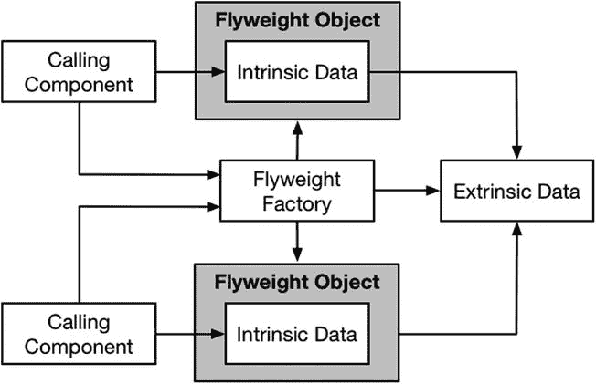

# 17. 享元模式

当多个相似对象都依赖同一组数据值时，就会应用享元模式。享元模式不会为每个对象创建一组新的数据值，而是在所有对象之间共享一组数据，从而最大限度地减少存储数据所需的内存量以及创建数据所需的工作量。表 17-1 将享元模式置于上下文中。

**表 17-1.** 享元模式上下文

| 问题 | 答案 |
| --- | --- |
| 什么是享元模式？ | 享元模式在多个调用组件之间共享公共数据对象。 |
| 有什么好处？ | 享元模式减少了创建调用组件所需数据对象所需的内存量，以及创建它们所需的工作量。实现该模式的影响随着共享数据的调用组件数量的增加而增加。 |
| 何时应使用此模式？ | 当你能够识别并隔离出调用组件使用的相同数据对象集时，使用此模式。 |
| 何时应避免此模式？ | 如果没有共享数据，或者共享数据对象数量少且易于创建，则不要使用此模式。 |
| 如何知道是否正确实现了该模式？ | 当所有调用组件都依赖同一组不可变的共享数据对象（称为外部数据）并拥有各自独立的状态数据（称为内部数据）时，该模式就正确实现了。调用组件应能安全地并发修改内部数据，且绝不能修改外部数据。 |
| 有哪些常见陷阱？ | 常见陷阱包括：无意中创建了多组外部数据对象、未保护内部数据免受并发操作影响、允许修改外部数据，以及过度优化外部对象的创建。 |
| 有哪些相关模式？ | 许多结构型模式具有相似的实现但意图不同。请确保从本书本部分描述的各个模式中选择了正确的模式。 |

## 准备示例项目

针对本章，我创建了一个名为 `Flyweight` 的 Xcode OS X 命令行工具项目。我添加了一个名为 `Spreadsheet.swift` 的文件，其内容如清单 17-1 所示。

**清单 17-1.** Spreadsheet.swift 文件的内容

```
func == (lhs: Coordinate, rhs: Coordinate) -> Bool {
    return lhs.col == rhs.col && lhs.row == rhs.row;
}

class Coordinate : Hashable, Printable {
    let col:Character;
    let row:Int;

    init(col:Character, row:Int) {
        self.col = col; self.row = row;
    }

    var hashValue: Int {
        return description.hashValue;
    }

    var description: String {
        return "\(col)(\row)";
    }
}

class Cell {
    var coordinate:Coordinate;
    var value:Int;

    init(col:Character, row:Int, val:Int) {
        self.coordinate = Coordinate(col: col, row: row);
        self.value = val;
    }
}

class Spreadsheet {
    var grid = Dictionary<Coordinate, Cell>();

    init() {
        let letters:String = "ABCDEFGHIJKLMNOPQRSTUVWXYZ";
        var stringIndex = letters.startIndex;
        let rows = 50;
        do {
            let colLetter = letters[stringIndex];
            stringIndex = stringIndex.successor();
            for rowIndex in 1 ... rows {
                let cell = Cell(col: colLetter, row: rowIndex, val: rowIndex);
                grid[cell.coordinate] = cell;
            }
        } while (stringIndex != letters.endIndex);
    }

    func setValue(coord: Coordinate, value:Int) {
        grid[coord]?.value = value;
    }

    var total:Int {
        return reduce(grid.values, 0,
            {total, cell in return total + cell.value});
    }
}
```

`Spreadsheet` 类有一个 `Dictionary` 属性，用于存储 `Cell` 对象的集合，每个 `Cell` 对象都通过 `Coordinate` 对象进行索引。`Coordinate` 存储一个列值和行值（例如 `A45`，其中 `A` 是列，`45` 是行），以创建网格。`Cell` 对象用于在网格的给定位置存储一个 `Int` 值，并且还包含其值所对应的坐标详细信息。`Spreadsheet` 类的初始化器创建一个包含 26 列和 50 行的网格，并将每个 `Cell` 的 `value` 属性设置为行索引。`setValue` 方法更改指定 `Coordinate` 处 `Cell` 的 `value` 属性，而 `total` 属性计算网格中所有 `Cell` 对象的 `value` 属性之和。

**提示：** 名为 `==` 的全局函数用于比较两个 `Coordinate` 对象是否相等，这使得它们可以作为 `Dictionary` 集合中的键使用。


好的，作为高级文档工程师和翻译员，我将遵循您的注意事项和示例，将给定的英文文本翻译成中文。


## 理解该模式解决的问题

享元模式所解决的问题在于，创建大量相同对象所带来的影响，这既体现在它们消耗的内存上，也体现在创建它们所花费的时间上。我在前一节中定义的 `Spreadsheet` 类为其维护的网格中的每个位置都创建了 `Cell` 和 `Coordinate` 对象，这意味着每个 `Spreadsheet` 对象都会生成相对大量的对象。清单 17-2 展示了我添加到 `main.swift` 文件中用于演示此问题的代码。

**清单 17-2.** `main.swift` 文件的内容

```
let ss1 = Spreadsheet();

ss1.setValue(Coordinate(col: "A", row: 1), value: 100);

ss1.setValue(Coordinate(col: "J", row: 20), value: 200);

println("SS1 Total: \(ss1.total)");

let ss2 = Spreadsheet();

ss2.setValue(Coordinate(col: "F", row: 10), value: 200);

ss2.setValue(Coordinate(col: "G", row: 23), value: 250);

println("SS2 Total: \(ss2.total)");

println("Cells created: \(ss1.grid.count + ss2.grid.count)");
```

我创建了两个 `Spreadsheet` 对象，为不同的单元格设置值，并输出总计值。然后我输出了 `Spreadsheet` 对象维护的 `Dictionary` 集合中的 `Cell` 对象总数。运行该应用程序会产生以下输出：

```
SS1 Total: 33429

SS2 Total: 33567

Cells created: 2600
```

对于如此简单的操作，我最终得到了大量的 `Cell` 对象，并且其中大多数仍具有实例化时分配的默认值。

## 理解享元模式

我在上一节中创建的 2,600 个 `Cell` 对象中的每一个都需要时间来创建，也需要内存来存储。享元模式通过识别和分离相似对象之间共有的数据并共享它，来最小化对 CPU 和内存的影响，这意味着只需创建一个共享对象。图 17-1 展示了享元模式。



**图 17-1.** 享元模式

在享元模式中，调用组件是生成并依赖大量数据对象的对象。在示例项目中，调用组件是 `Spreadsheet` 对象，它们依赖 `Cell` 数据对象。

该模式使用一个享元对象来管理调用组件所需的数据对象。享元对象将数据对象分为外部状态和内部状态两类。外部状态是所有调用组件共有的；内部状态是每个调用组件所独有的。

享元模式通过在不同享元对象之间共享外部状态，来最小化创建对象所带来的影响，这意味着所有调用组件共享同一组数据对象。由于是共享的，外部状态是不可变的，不能被享元或调用组件修改。

内部状态不能被共享，因此享元模式所产生的影响程度由外部状态与内部状态数据对象的比例决定。

享元工厂为调用组件提供了一种获取享元对象的机制，并负责让享元对象能够访问外部状态数据。

## 实现享元模式

我选择电子表格作为本章的示例，因为它带来了一些实现上的挑战。当创建一个新的 `Spreadsheet` 对象时，每个 `Cell` 对象都是相同的，并且可以轻松地作为外部状态处理。在 `Spreadsheet` 上设置的每个值对该实例来说是唯一的，并成为了内部状态。我实现该模式的目标是，使从外部状态到内部状态的转换尽可能无缝且简单。

### 创建享元协议

你不必为你的享元定义一个协议，但我喜欢这样做，因为它使得在应用程序生命周期后期引入不同的实现变得更加容易。我还发现，使用协议能让我更关注暴露给调用组件的数据，因为我必须显式地定义每个方法和属性。清单 17-3 展示了我添加到示例项目中的 `Flyweight.swift` 文件的内容。

**清单 17-3.** `Flyweight.swift` 文件的内容

```
import Foundation;

protocol Flyweight {

    subscript(index:Coordinate) -> Int? { get set };

    var total:Int { get };

    var count:Int { get };

}
```

`Spreadsheet` 类中的数据对象存储在一个 `Dictionary` 集合中，这一点在 `Flyweight` 协议中得到了体现。我定义的下标允许使用 `Coordinate` 键来获取和设置值，而 `count` 属性将返回内部状态数据对象的数量。（需要对象数量来实现该模式，但我将在 `main.swift` 文件中使用它来说明应用该模式的效果）。

我不希望使用 `Flyweight` 协议的类了解内部状态和外部状态的分离，因此我添加了一个 `total` 属性，它将用于计算内部 `Cell` 对象的 `value` 属性值的总和。

### 创建享元实现类

下一步是实现符合 `Flyweight` 协议的享元实现类。这个类将负责管理内部状态数据，并由享元工厂提供对外部状态数据的访问。清单 17-4 展示了实现类的定义。

**清单 17-4.** 在 `Flyweight.swift` 文件中定义享元实现类

```
import Foundation;

protocol Flyweight {

    subscript(index:Coordinate) -> Int? { get set };

    var total:Int { get };

    var count:Int { get };

}

class FlyweightImplementation : Flyweight {

    private let extrinsicData:[Coordinate: Cell];

    private var intrinsicData:[Coordinate: Cell];

    private init(extrinsic:[Coordinate: Cell]) {

        self.extrinsicData = extrinsic;

        self.intrinsicData = Dictionary<Coordinate, Cell>();

    }

    subscript(key:Coordinate) -> Int? {

        get {

            if let cell = intrinsicData[key] {

                return cell.value;

            } else {

                return extrinsicData[key]?.value;

            }

        }

        set (value) {

            if (value != nil) {

                intrinsicData[key] = Cell(col: key.col,

                    row: key.row, val: value!);

            }

        }

    }

    var total:Int {

        return reduce(extrinsicData.values, 0, {total, cell in

            if let intrinsicCell = self.intrinsicData[cell.coordinate] {

                return total + intrinsicCell.value;

            } else {

                return total + cell.value

            }

        });

    }

    var count:Int {

        return intrinsicData.count;

    }

}
```

> **提示:** 请注意，享元不会修改外部状态数据，也不允许调用组件修改它。这是享元模式的一个关键特征，允许修改外部状态数据是一个常见的陷阱。

`FlyweightImplementation` 类符合 `Flyweight` 协议，并将外部状态数据作为其初始化参数接收。内部状态数据作为外部状态数据之上的一个覆盖层，如果某个指定 `Coordinate` 没有对应的内部 `Cell`，则对值的请求会回退到外部状态数据。当设置一个新值时，会创建一个 `Cell` 对象作为内部状态数据的一部分。

> **注意:** 并非所有内部状态数据都必须对应于一个外部等效项。一个享元管理与其任何外部值无关的内部状态数据是完全可以接受的。话虽如此，我倾向于在调用组件中定义此类数据值，并让享元专注于那些以某种方式与外部状态数据相关的内部值。


### 添加并发保护

享元模式没有对从工厂获取享元对象后的使用方式施加任何限制。这就带来了我之前在其他模式中描述过的并发风险；一个享元可以在多个线程之间共享，每个线程都试图同时修改内在数据。我需要修改享元实现类，以防止内在数据被破坏或得到不一致的结果。清单 17-5 展示了我如何使用 Grand Central Dispatch (GCD) 来保护数据。

```
清单 17-5. 在 Flyweight.swift 文件中防范并发问题
...
class FlyweightImplementation : Flyweight  {
    private let extrinsicData:[Coordinate: Cell];
    private var intrinsicData:[Coordinate: Cell];
    private let queue:dispatch_queue_t;
    private init(extrinsic:[Coordinate: Cell]) {
        self.extrinsicData = extrinsic;
        self.intrinsicData = Dictionary<Coordinate, Cell>();
        self.queue = dispatch_queue_create("dataQ", DISPATCH_QUEUE_CONCURRENT);
    }
    subscript(key:Coordinate) -> Int? {
        get {
            var result:Int?;
            dispatch_sync(self.queue, {() in
                if let cell = self.intrinsicData[key] {
                    result = cell.value;
                } else {
                    result = self.extrinsicData[key]?.value;
                }
            });
            return result;
        }
        set (value) {
            if (value != nil) {
                dispatch_barrier_sync(self.queue, {() in
                    self.intrinsicData[key] = Cell(col: key.col,
                        row: key.row, val: value!);
                });
            }
        }
    }
    var total:Int {
        var result = 0;
        dispatch_sync(self.queue, {() in
            result = reduce(self.extrinsicData.values, 0, {total, cell in
                if let intrinsicCell = self.intrinsicData[cell.coordinate] {
                    return total + intrinsicCell.value;
                } else {
                    return total + cell.value
                }
            });
        });
        return result;
    }
    var count:Int {
        var result = 0;
        dispatch_sync(self.queue, {() in
            result = self.intrinsicData.count;
        });
        return result;
    }
}
...
```

我希望允许多个并发读取操作，但每次只允许一个写入操作。我定义了一个并发的 GCD 队列，并对读取操作（即那些不修改内在数据的操作：通过 `subscript` 获取值、获取 `total` 和 `count` 值）使用 `dispatch_sync` 函数。在通过 `subscript` 设置值时，我使用 `dispatch_barrier_sync` 函数，这确保在我修改内在数据集合时，没有其他请求被处理。

### 创建享元工厂类

我必须定义的最后一个类是享元工厂，它由调用组件用来获取可以访问外在数据的享元。清单 17-6 展示了该类的定义。

```
清单 17-6. 在 Flyweight.swift 文件中创建享元工厂类
import Foundation;

protocol Flyweight {
    subscript(index:Coordinate) -> Int? { get set };
    var total:Int { get };
    var count:Int { get };
}

extension Dictionary {
    init(setupFunc:(() -> [(Key, Value)])) {
        self.init();
        for item in setupFunc() {
            self[item.0] = item.1;
        }
    }
}

class FlyweightFactory {
    class func createFlyweight() -> Flyweight {
        return FlyweightImplementation(extrinsic: extrinsicData);
    }
    private class var extrinsicData:[Coordinate: Cell] {
        get {
            struct singletonWrapper {
                static let singletonData = Dictionary<Coordinate, Cell> (
                    setupFunc: {() in
                        var results = [(Coordinate, Cell)]();
                        let letters:String = "ABCDEFGHIJKLMNOPQRSTUVWXYZ";
                        var stringIndex = letters.startIndex;
                        let rows = 50;
                        do {
                            let colLetter = letters[stringIndex];
                            stringIndex = stringIndex.successor();
                            for rowIndex in 1 ... rows {
                                let cell = Cell(col: colLetter, row: rowIndex,
                                    val: rowIndex);
                                results.append((cell.coordinate, cell));
                            }
                        } while (stringIndex != letters.endIndex);
                        return results;
                    }
                );
            }
            return singletonWrapper.singletonData;
        }
    }
}

class FlyweightImplementation : Flyweight  {
    // ...为简洁起见，省略了语句...
}
```

`FlyweightFactory` 类定义了一个名为 `createFlyweight` 的类方法，该方法返回一个符合 `Flyweight` 协议的对象。`createFlyweight` 的实现创建了一个 `FlyweightImplementation` 对象，并将外在数据作为初始化参数传递给它。我使用第 6 章中描述的单例模式创建外在数据。这确保了外在数据以懒加载和线程安全的方式创建。

为了填充字典集合，我定义了一个扩展，该扩展提供了一个接受函数作为参数的初始化器。调用该函数生成一个键值元组数组，然后我将其添加到字典中。这种方法绕过了 Swift 对类变量支持的局限性，并确保我可以在单例初始化过程中用外在数据填充字典。

### 应用享元

最后一步是修改 `Spreadsheet` 类，使其依赖享元对象来管理其数据，如清单 17-7 所示。

```
清单 17-7. 在 Spreadsheet.swift 文件中使用享元
func == (lhs: Coordinate, rhs: Coordinate) -> Bool {
    return lhs.col == rhs.col && lhs.row == rhs.row;
}

class Coordinate : Hashable, Printable {
    // ...为简洁起见，省略了语句...
}

class Cell {
    // ...为简洁起见，省略了语句...
}

class Spreadsheet {
    var grid:Flyweight;
    init() {
        grid = FlyweightFactory.createFlyweight();
    }
    func setValue(coord: Coordinate, value:Int) {
        grid[coord] = value;
    }
    var total:Int {
        return grid.total;
    }
}
```

`Spreadsheet` 类从工厂获取一个享元，并使用它来实现其 API。清单 17-8 展示了我对 `main.swift` 文件所做的一个小改动，通过考虑外在对象来准确报告创建的 `Cell` 对象数量。

```
清单 17-8\. 在 main.swift 文件中计算外在 Cell 对象
let ss1 = Spreadsheet();
ss1.setValue(Coordinate(col: "A", row: 1), value: 100);
ss1.setValue(Coordinate(col: "J", row: 20), value: 200);
println("SS1 Total: \(ss1.total)");

let ss2 = Spreadsheet();
ss2.setValue(Coordinate(col: "F", row: 10), value: 200);
ss2.setValue(Coordinate(col: "G", row: 23), value: 250);
println("SS2 Total: \(ss2.total)");
println("Cells created: \(1300 + ss1.grid.count + ss2.grid.count)");
```

运行应用程序会产生以下输出：

```
SS1 Total: 33429
SS2 Total: 33567
Cells created: 1304
```

使用享元模式可以让每个 `Spreadsheet` 对象复用相同的外在数据，并且其影响会随着 `Spreadsheet` 对象数量的增加而增大。


## 享元模式的变体

写时复制技术是享元模式的一种变体，它依赖一个外部对象，直到调用组件想要修改该对象。此时，该外部对象会被复制并随后修改，享元不再使用该外部数据。根据应用程序的需求，可以复制外部数据的一部分或全部内容。写时复制技术将享元模式与我在第 5 章中描述的原型模式结合了起来。清单 17-9 显示了`CopyOnWrite.playground`文件的内容，我创建此文件作为演示。

```
import Foundation;

class Owner : NSObject, NSCopying {

    var name:String;
    var city:String;

    init(name:String, city:String) {
        self.name = name; self.city = city;
    }

    func copyWithZone(zone: NSZone) -> AnyObject {
        println("Copy");
        return Owner(name: self.name, city: self.city);
    }
}

class FlyweightFactory {

    class func createFlyweight() -> Flyweight {
        return Flyweight(owner: ownerSingleton);
    }

    private class var ownerSingleton:Owner {
        get {
            struct singletonWrapper {
                static let singleon = Owner(name: "Anonymous", city: "Anywhere");
            }
            return singletonWrapper.singleon;
        }
    }
}

class Flyweight {

    private let extrinsicOwner:Owner;
    private var intrinsicOwner:Owner?;

    init(owner:Owner) {
        self.extrinsicOwner = owner;
    }

    var name:String {
        get {
            return intrinsicOwner?.name ?? extrinsicOwner.name;
        }
        set (value) {
            decoupleFromExtrinsic();
            intrinsicOwner?.name = value;
        }
    }

    var city:String {
        get {
            return intrinsicOwner?.city ?? extrinsicOwner.city;
        }
        set (value) {
            decoupleFromExtrinsic();
            intrinsicOwner?.city = value;
        }
    }

    private func decoupleFromExtrinsic() {
        if (intrinsicOwner == nil) {
            intrinsicOwner = extrinsicOwner.copyWithZone(nil) as? Owner;
        }
    }
}
```

`FlyweightFactory`类使用单例模式来定义外部的`Owner`对象，该对象会被传递给新的`Flyweight`对象。`Flyweight`类使用外部的`Owner`对象来提供其`name`和`city`属性的值，直到这两个属性中的设置器被使用。此时，会应用原型模式来复制外部对象，以创建一个内部克隆，然后将设置器的值应用于该克隆。一旦属性设置器被使用，`Flyweight`对象就不再使用外部对象。

## 理解享元模式的陷阱

在实现享元模式时，有几个陷阱需要避免。享元模式并**不特别复杂**，尤其与我在第 7 章中描述的对象池等模式相比，但很容易创建出一种引发更多问题而非解决问题的实现。

### 理解外部数据重复陷阱

最容易掉入的陷阱是创建了超出预期的*过多*外部数据，从而破坏了享元模式的效率。在 Swift 中，这通常是因为创建类变量的困难以及使用结构体实现类变量的局限性所导致的。你必须确保外部数据作为单例初始化的一部分被创建，并且数据是以线程安全的方式创建的。正是出于这个原因，我为`Dictionary`类定义了一个扩展，允许我指定一个闭包，用于在示例应用中填充外部数据集合。

### 理解可变外部数据陷阱

如果你允许调用组件修改外部数据，将会产生两个不同的问题：并发访问破坏数据的风险，以及享元获取到不一致的数据。享元使用的外部数据必须是不可变的，允许其被修改是一个常见的陷阱，会导致奇怪的行为和运行时错误。

### 理解并发访问陷阱

正如本章前面所述，享元模式并未对享元对象的使用方式施加任何限制，因此，在调用组件允许享元被多个线程使用的情况下，保护内部数据免受并发访问*至关重要*。你不必使用我应用于示例享元类的那种基于屏障的方法，甚至不必使用 GCD，但你必须添加某种形式的保护，因为许多单线程应用程序在某个时候会转变为多线程应用程序。

> **提示**  
> 你无需为外部数据添加保护，这些数据应该是不可变的。外部数据出现并发问题是你的享元实现存在缺陷的一个迹象。

### 理解过度优化陷阱

很容易在优化对象创建的过程中迷失方向，以至于最终得到的实现使得修改外部数据变得困难。这种陷阱最常见的形式是，当外部对象所代表的值是由一个可预测的算法生成时。在示例应用中，我将每个`Cell`对象的值设置为行的索引，这意味着我可以在享元工厂类的实现中更进一步，仅按需创建`Cell`对象，利用行号即时生成该对象。

这种方法有几个问题。首先是缺乏*灵活性*。用于生成值的算法很少像我的例子中那样简单，而且生成值的过程可能非常复杂，以至于当实现不同算法时，生成的代码很难更改。

第二个问题是，享元类和调用组件必须能够在不知晓对象是按需创建的情况下执行业务。以我的示例应用为例，这意味着要允许享元类能够获取`Cell`对象的总数以及`value`属性的总和，而无需创建这些任务通常所需的所有对象。享元工厂只有在对外部数据有深入洞察的情况下才能提供这些信息，这进一步增加了代码的复杂性和*不*灵活性。

我的建议是，接受一组共享的外部对象已经是足够大的优化，而*进一*步优化收效甚微，但会*增加*大量复杂性和维护风险。

### 理解误用陷阱

最后一个陷阱是*在不需要*时应用享元模式。为了使额外的开发时间和测试物有所值，享元只应应用于大量相似对象依赖一组庞大公共数据集的情况。如果外部数据不大，或者创建它不需要太多工作，那么实现享元模式所需的工作可能是不值得的。


## Cocoa 中享元模式的示例

Cocoa 框架中有几个享元模式的实现。我觉得最有趣的是 `NSNumber` 类，它用于表示数值。通过管理两个使用相同值创建的 `NSNumber` 对象，该值成为了一个外在数据项——这可能会让粗心的人出错。清单 17-10 展示了我创建的用于演示的 `Numbers.playground` 文件的内容。

**清单 17-10. `Numbers.playground` 文件的内容**

```
import Foundation;

let num1 = NSNumber(int: 10);

let num2 = NSNumber(int: 10);

println("Comparison: \(num1 == num2)");

println("Identity:   \(num1 === num2)");
```

我创建了两个 `NSNumber` 对象，它们都存储了整数值 `10`。然后我打印出了使用比较运算符和身份运算符的结果。调试控制台显示以下输出：

```
Comparison: true

Identity: true
```

比较运算符的结果合乎情理，但身份运算符的结果可能会让你感到惊讶。Cocoa 通过共享 `NSNumber` 对象来最小化其所需的内存。这是一种许多语言应用于字符串值的技巧，使用一个称为字符串驻留（string interning）的进程，该进程能减少用于存储字符串的内存，并加快字符串比较的速度。Cocoa 确实为 `NSString` 类实现了字符串驻留，但在 Swift 中使用比较困难，而 `NSNumber` 类则提供了一个更简单的示例。

## 将模式应用于 SportsStore 应用程序

SportsStore 应用程序包含 `NetworkConnection` 类，我用它来模拟对库存水平数据的网络查询。每个 `NetworkConnection` 实例都包含一个库存值的字典，用于满足数据请求。以下是 `NetworkConnection` 类的定义：

```
...

class NetworkConnection {

    private let stockData: [String: Int] = [

        "Kayak" : 10, "Lifejacket": 14, "Soccer Ball": 32,"Corner Flags": 1,

        "Stadium": 4, "Thinking Cap": 8, "Unsteady Chair": 3,

        "Human Chess Board": 2, "Bling-Bling King":4

    ];

    func getStockLevel(name:String) -> Int? {

        NSThread.sleepForTimeInterval(Double(rand() % 2));

        return stockData[name];

    }

}

...
```

在本节中，我将应用享元模式，以便所有 `NetworkConnection` 对象都共享同一个字典对象。我要共享的字典创建起来并不复杂，也不占用太多内存，但它仍然为享元模式的应用提供了一个基础。

### 准备示例应用程序

本章不需要做任何准备，我将直接从第 16 章结束的地方开始，继续处理 SportsStore 项目。

### 创建享元协议和实现类

在实现享元模式时，我总是遵循相同的流程：先定义调用组件将要使用的协议，然后是享元实现类。这使我能够专注于协议中将被公开使用的 API，并在实现类中区分内在数据和外在数据。清单 17-11 展示了 `NetworkConnectionFlyweight.swift` 文件的内容，我将其添加到 SportsStore 项目中以实现享元模式。

**清单 17-11. `NetworkConnectionFlyweight.swift` 文件的内容**

```
protocol NetConnFlyweight {

    func getStockLevel(name:String) -> Int?;

}

class NetConnFlyweightImpl : NetConnFlyweight {

    private let extrinsicData:[String: Int];

    private init(data:[String: Int]) {

        self.extrinsicData = data;

    }

    func getStockLevel(name: String) -> Int? {

        return extrinsicData[name];

    }

}
```

这种模式的实现很简单，但我选择通过一个方法来暴露数据值，而不是提供一个允许访问字典的属性。我这样做是因为，这意味着我可以更改数据的存储方式，而无需更新协议（以及使用它的组件），并且这有助于确保我不会无意中允许修改外在数据（当你允许直接访问外在数据结构时，很容易发生这种情况）。

### 创建享元工厂

定义了协议和实现类之后，我通过定义工厂及其管理的外在数据来完成享元模式。清单 17-12 展示了工厂类的定义。

**清单 17-12. 在 `NetworkConnectionFlyweight.swift` 文件中定义享元工厂类**

```
protocol NetConnFlyweight {

    func getStockLevel(name:String) -> Int?;

}

class NetConnFlyweightImpl : NetConnFlyweight {

    // ...为简洁起见省略了语句...

}

class NetConnFlyweightFactory {

    class func createFlyweight() -> NetConnFlyweight {

        return NetConnFlyweightImpl(data: stockData);

    }

    private class var stockData:[String: Int] {

        get {

            struct singletonWrapper {

                static let singleton = ["Kayak" : 10, "Lifejacket": 14,

                    "Soccer Ball": 32,"Corner Flags": 1, "Stadium": 4,

                    "Thinking Cap": 8, "Unsteady Chair": 3,

                    "Human Chess Board": 2, "Bling-Bling King":4

                ];

            }

            return singletonWrapper.singleton;

        }

    }

}
```

`NetConnFlyweightFactory` 类使用单例模式来确保外在数据只被创建一次，并定义了一个 `createFlyweight` 方法，该方法使用外在数据来创建实现类的实例。

### 应用享元

最后一步是更新 `NetworkConnection` 类，使其使用享元并共享一个不可变的单一外部库存数据数组，如清单 17-13 所示。

**清单 17-13. 在 `NetworkConnection.swift` 文件中使用享元**

```
import Foundation

class NetworkConnection {

    private let flyweight:NetConnFlyweight;

    init() {

        self.flyweight = NetConnFlyweightFactory.createFlyweight();

    }

    func getStockLevel(name:String) -> Int? {

        NSThread.sleepForTimeInterval(Double(rand() % 2));

        return self.flyweight.getStockLevel(name);

    }

}
```

我移除了本地的数据数组，并修改了 `getStockLevel` 方法的实现，使其使用享元来获取数据值。

## 总结

在本章中，我解释了如何使用享元模式在对象之间共享外在数据，以减少应用程序的内存占用以及生成相同数据对象集所需的工作量。在下一章中，我将描述代理模式，当一个对象需要作为某个资源或另一个对象的代表时，会使用该模式。


