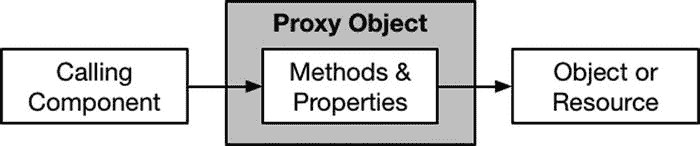
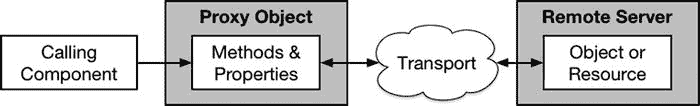
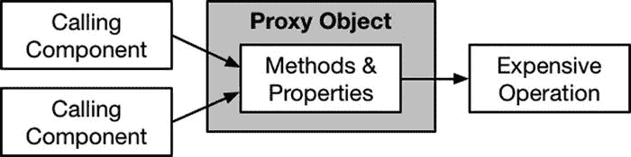
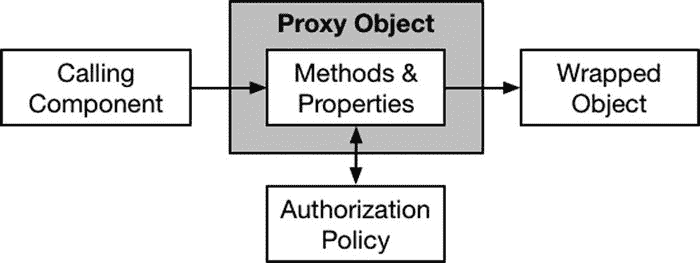

# 18. 代理模式

本章将介绍代理模式。当需要一个对象作为另一个对象或资源的接口时，通常会使用该模式。代理模式主要有三种应用方式，我将分别对它们进行阐述，并演示其实现方法。表 18-1 对代理模式进行了概述。

**表 18-1.** 代理模式概述

| 问题 | 答案 |
| --- | --- |
| 什么是代理模式？ | 代理模式定义了一个对象——即代理——该对象代表其他某些资源，例如另一个对象或远程服务。调用组件对代理进行操作，而代理则负责对底层资源进行操作。 |
| 优点是什么？ | 代理能够精确控制访问底层资源的方式，这在需要拦截或调整操作时非常有用。 |
| 何时使用该模式？ | 代理主要用于三种情况：为远程资源（如网页或 RESTful 服务）定义接口；管理耗时操作的执行；限制其他对象的方法和属性的访问权限。 |
| 何时应避免使用该模式？ | 当问题不属于本章所述三种情况时，请勿使用此模式。应改用其他结构型模式。 |
| 如何判断模式实现是否正确？ | 当代理对象能够用于对其所代表的资源执行操作时，即表示实现正确。 |
| 常见陷阱有哪些？ | 唯一陷阱是，在使用代理限制对象访问时，仍允许实例化底层类的实例。 |
| 是否有相关模式？ | 许多结构型模式具有相似的实现但意图不同。请确保从本书本部分描述的多种模式中，选择正确的模式。 |

## 准备示例项目

本章中，我创建了一个名为 `Proxy` 的 Xcode OS X 命令行工具项目。代码清单 18-1 展示了我添加到 `main.swift` 文件中为本节准备的代码。

**代码清单 18-1.** `main.swift` 文件内容

```
import Foundation;

func getHeader(header:String) {

let url = NSURL(string: "http://www.apress.com");

let request = NSURLRequest(URL: url!);

NSURLSession.sharedSession().dataTaskWithRequest(request,

completionHandler: {data, response, error in

if let httpResponse = response as? NSHTTPURLResponse {

if let headerValue

= httpResponse.allHeaderFields[header] as? NSString {

println("\(header): \(headerValue)");

}

}

}).resume();

}

let headers = ["Content-Length", "Content-Encoding"];

for header in headers {

getHeader(header);

}

NSFileHandle.fileHandleWithStandardInput().availableData;
```

`main.swift` 文件中的代码向 Apress 主页发起 HTTP 请求，并将 `Content-Length` 和 `Content-Encoding` 标头的值打印到调试控制台。运行该应用程序将产生以下输出：

```
Content-Encoding: gzip
Content-Length: 13960
```

你可能看到 `Content-Length` 标头先显示。这是因为执行 HTTP 请求的 `Foundation` 框架类是非异步的，并且请求是并发执行的，这意味着任一请求都可能先完成并将结果写入控制台。当你运行示例应用程序时，几乎肯定会看到不同的标头值，因为 Apress 经常更改其网站主页上的内容。

## 理解该模式解决的问题

代理模式用于解决三种不同的问题，我将在后续小节中逐一解释。

### 理解远程对象问题

当你处理通过网络访问的资源（例如网页或 RESTful Web 服务）时，就会出现远程对象问题。`main.swift` 文件中的代码访问了一个网页，但它并未将其提供的功能（获取 HTTP 响应标头）与用于发起请求的机制（`NSURL`、`NSURLRequest` 和 `NSURLSession` 类）分离开来。这段代码中没有抽象或封装，更改实现将影响功能被使用的方式——如果这类代码被复制到任何需要读取 HTTP 标头的组件中，情况会更糟。

### 理解耗时操作问题

诸如发起 HTTP 请求之类的任务被视为耗时操作。“耗时”一词用于指代操作中任何应尽量减少的方面，例如所需计算量、所需内存、设备电池负载、消耗的带宽以及用户必须等待的耗时。

对于 HTTP 请求，主要的开销是耗时、带宽以及服务器为生成响应必须执行的工作。`main.swift` 文件中的代码并未尝试优化 HTTP 请求的执行方式来最小化操作成本，也未考虑这对用户、网络或接收请求的服务器产生的影响。

### 理解访问受限问题

当将单用户框架集成到多用户应用程序时，通常会出现需要限制对象访问的情况。你无法更改需要保护的对象的定义，因为你无法访问其源代码，或者因为应用程序中其他位置已存在对该类型的依赖，但同样，你不能让任何用户执行该对象封装的操作。

## 理解代理模式

每当需要一个对象来表示其他某种资源时，就可以使用代理模式。如你所见，该资源可以是抽象的事物（如一个网页），也可以是应用程序本地的资源（如另一个对象）。图 18-1 展示了代理模式的一般形式。



**图 18-1.** 代理模式

代理模式的一般形式缺乏特异性，但这正是因为它可用于多种不同的情况。为了具体说明该模式，在接下来的小节中，我将解释如何使用该模式来解决本章前面描述的三种常见问题。


### 解决远程对象问题

使用代理模式来表示远程对象和资源，其根源可追溯到如 CORBA 这样的分布式系统，该系统提供了一个本地对象，该对象公开了与服务器上相应远程对象相同的方法。这个本地对象就是代理，调用其某个方法会导致在远程对象上调用相应的方法。CORBA 负责将代理对象映射到远程对象，并处理参数和结果。

CORBA 已不再广泛使用，但随着 HTTP 成为首选传输协议，RESTful 服务日益流行，代理模式重新变得重要。代理模式可用于简化对远程资源的操作，并隐藏远程资源所提供功能背后的实现细节。这正是设计模式尤其擅长解决的问题：抽象功能，使得可以在不改变功能使用方式的前提下更改实现机制；封装功能，使得实现不会在应用程序中重复。图 18-2 展示了如何使用代理来表示远程资源。


图 18-2. 使用代理模式表示远程资源

代理对象隐藏了访问远程资源的细节，仅呈现其数据，在示例应用程序中，这些数据就是 HTTP 标头的值。使用代理将远程请求的机制整合到应用程序中的单个类中，并允许在不更改使用代理的组件的情况下更改实现——例如，使用其他 Cocoa 类。

### 解决高开销操作问题

代理可以通过将操作与其使用解耦，来最大程度地降低高开销操作的成本。就示例应用程序而言，我可以将多个标头值的请求合并为单个请求，如图 18-3 所示。


图 18-3. 使用代理合并操作

显然，我占了选择适配模式的示例的便宜，但高开销操作通常可以合并，或者至少可以延迟到执行成本较低时再进行。

### 解决访问受限问题

代理可以用作对象的包装器，添加额外的逻辑以强制执行某种使用限制，如图 18-4 所示。


图 18-4. 使用代理限制访问

代理通常遵循与被包装对象共享的公共协议，这意味着可以无缝地使用代理对象进行替换，而无需修改调用组件。代理拦截对底层对象属性和方法的访问请求，并且仅在满足访问控制策略时才将这些请求传递下去。

## 实现代理模式

代理模式的实现因要解决的问题类型而异。在接下来的章节中，我将向您展示如何针对本章前面描述的三个问题分别实现该模式。

### 实现远程对象代理

实现代理模式以访问远程对象或资源的关键在于，将对调用组件提供的服务或功能与执行远程操作的机制分离开来。

对于某些应用程序，这意味着要向调用组件隐藏网络传输和协议的细节。对于表示 RESTful 服务的代理对象，代理对象可能会隐藏 HTTP 传输的细节，以及用于对远程数据对象执行操作的一组 URL。

我选择在本章的示例中读取 HTTP 标头值，因为这呈现了一种不同的情况：HTTP 传输的使用无法隐藏，因为其使用是既定事实。相反，代理对象隐藏了如何使用`Foundation`框架中的类来执行 HTTP 请求并获取标头值。

#### 定义代理协议

在实现远程对象的代理模式时，您不必非要定义一个协议，但我发现这会迫使我更清晰地思考如何向调用组件公开功能（当然，如果需要，它还可以让我创建替代实现）。清单 18-2 显示了我定义的用于表示 Web 请求的协议，该协议定义在我添加到示例项目的一个名为`Proxy.swift`的文件中。

**清单 18-2.** `Proxy.swift` 文件的内容

```swift
protocol HttpHeaderRequest {
    func getHeader(url:String, header:String) -> String?;
}
```

`HttpHeaderRequest`协议定义了一个`getHeader`方法，该方法接受目标 URL 以及所需标头值的名称。请注意，`HttpHeaderRequest`方法返回同步结果，而不是依赖回调。远程代理对象在如何呈现其功能方面拥有广泛的自由度，我将定义一个代理对象，它隐藏了我正在使用的`Foundation`框架类是异步执行请求这一事实。

#### 定义代理实现类

下一步是定义遵循该协议并实现访问远程对象机制的类。清单 18-3 显示了我定义的用于发出 HTTP 请求以获取响应标头值的代理类。

**清单 18-3.** 在 `Proxy.swift` 文件中定义实现类

```swift
import Foundation;

protocol HttpHeaderRequest {
    func getHeader(url:String, header:String) -> String?;
}

class HttpHeaderRequestProxy : HttpHeaderRequest {
    private let semaphore = dispatch_semaphore_create(0);

    func getHeader(url: String, header: String) -> String? {
        var headerValue:String?;
        let nsUrl = NSURL(string: url);
        let request = NSURLRequest(URL: nsUrl!);
        NSURLSession.sharedSession().dataTaskWithRequest(request,
            completionHandler: {data, response, error in
                if let httpResponse = response as? NSHTTPURLResponse {
                    headerValue = httpResponse.allHeaderFields[header] as? NSString;
                }
                dispatch_semaphore_signal(self.semaphore);
        }).resume();
        dispatch_semaphore_wait(self.semaphore, DISPATCH_TIME_FOREVER);
        return headerValue;
    }
}
```

`HttpHeaderRequestProxy`类遵循`HttpHeaderRequest`协议，并且是进行请求的代理。`getHeader`方法的实现使用了本章开头我曾依赖的相同的`Foundation`类，但增加了一个（现在很常见的）GCD 信号量，这使我能够向调用组件隐藏 Cocoa 类的异步特性。

**提示** 我不主张在实际项目中将异步操作隐藏在同步方法中，尤其是因为 Swift 闭包使得编写处理异步响应的代码很容易。我在此清单中这样做的目的是为了演示，代理可以根据自己的选择，暴露实现细节的多少。


#### 使用远程对象代理

剩下的工作就是更新 `main.swift` 文件中的代码，使其使用代理对象而非直接发起 HTTP 请求，如列表 18-4 所示。

**列表 18-4 在 `main.swift` 文件中使用代理对象**

```
import Foundation;

let url = "http://www.apress.com";

let headers = ["Content-Length", "Content-Encoding"];

let proxy = HttpHeaderRequestProxy();

for header in headers {

if let val = proxy.getHeader(url, header:header) {

println("\(header): \(val)");

}

}

NSFileHandle.fileHandleWithStandardInput().availableData;
```

示例应用仍然执行相同数量的 HTTP 请求，并依然使用相同的 `Foundation` 类来发起这些请求。但通过将逻辑封装到代理中，意味着我可以在整个应用中发起类似的请求，而无需重复实现逻辑——并且，正如你现在所期望的那样，这允许我在不修改依赖代理的组件的情况下，改变发起 HTTP 请求的方式。

### 实现高开销操作代理

优化高开销资源的使用并最小化高开销操作的执行次数，有许多策略。常见的例子包括缓存、懒加载，以及使用其他模式，比如我在第 17 章描述过的享元模式。

示例应用中的高开销操作是 HTTP 请求。减少应用发起的 HTTP 请求数量将产生显著影响：应用对用户的响应速度会更快，消耗更少的带宽（如果设备使用蜂窝网络，这一点尤为重要），并降低服务器端的请求吞吐量。

优化示例应用最直接的方法是为多个头信息的需求发起单个请求。这是一个故意简化的示例，但实现它所需的变化集与进行任何优化时相同。列表 18-5 展示了我对代理协议及其实现类所做的更改。

**列表 18-5 在 `Proxy.swift` 文件中优化 HTTP 请求**

```
import Foundation;

protocol HttpHeaderRequest {

func getHeader(url:String, header:String) -> String?;

}

class HttpHeaderRequestProxy : HttpHeaderRequest {

private let queue = dispatch_queue_create("httpQ", DISPATCH_QUEUE_SERIAL);

private let semaphore = dispatch_semaphore_create(0);

private var cachedHeaders = [String:String]();

func getHeader(url: String, header: String) -> String? {

var headerValue:String?;

dispatch_sync(self.queue, {() in

if let cachedValue = self.cachedHeaders[header] {

headerValue = "\(cachedValue) (cached)";

} else {

let nsUrl = NSURL(string: url);

let request = NSURLRequest(URL: nsUrl!);

NSURLSession.sharedSession().dataTaskWithRequest(request,

completionHandler: {data, response, error in

if let httpResponse = response as? NSHTTPURLResponse {

let headers

= httpResponse.allHeaderFields as [String: String];

for (name, value) in headers {

self.cachedHeaders[name] = value;

}

headerValue

= httpResponse.allHeaderFields[header] as? NSString;

}

dispatch_semaphore_signal(self.semaphore);

}).resume();

dispatch_semaphore_wait(self.semaphore, DISPATCH_TIME_FOREVER);

}

});

return headerValue;

}

}
```

`getHeader` 方法创建了一个响应头部值的缓存，用于满足后续请求，提供了一种减少 HTTP 请求数量的机制。运行应用可以看到，其中一个头部是从缓存获取的值中得到的：

```
Content-Length: 13960
Content-Encoding: gzip (cached)
```

对 `HttpHeaderRequestProxy` 类的更改依赖一个 GCD 队列，以确保当一个回调尝试读取缓存数据的字典时，另一个回调正在更新它。

#### 延迟执行操作

另一种常见的实现方式是尽可能推迟高开销操作的执行，通常是寄希望于用户可能会取消任务，从而使得该操作不再需要执行。

这种方法的好处是可能避免执行高开销操作，但缺点是需要修改 API，以便调用组件能够指示操作应该开始。列表 18-6 展示了我对代理及其协议所做的更改，以实现 HTTP 请求的延迟执行。

**列表 18-6 在 `Proxy.swift` 文件中延迟 HTTP 请求**

```
import Foundation;

protocol HttpHeaderRequest {

init(url:String);

func getHeader(header:String, callback:(String, String?) -> Void );

func execute();

}

class HttpHeaderRequestProxy : HttpHeaderRequest {

let url:String;

var headersRequired:[String: (String, String?) -> Void];

required init(url: String) {

self.url = url;

self.headersRequired = Dictionary<String, (String, String?) -> Void>();

}

func getHeader(header: String, callback: (String, String?) -> Void) {

self.headersRequired[header] = callback;

}

func execute() {

let nsUrl = NSURL(string: url);

let request = NSURLRequest(URL: nsUrl!);

NSURLSession.sharedSession().dataTaskWithRequest(request,

completionHandler: {data, response, error in

if let httpResponse = response as? NSHTTPURLResponse {

let headers = httpResponse.allHeaderFields as [String: String];

for (header, callback) in self.headersRequired {

callback(header, headers[header]);

}

}

}).resume();

}

}
```

我改变了代理的使用方式，使得调用组件为每个所需的头部调用 `getHeader` 方法，并为每个头部提供一个回调。我暴露了底层发起 HTTP 请求的类的异步特性，因为这很好地契合了对请求本身执行延迟操作的想法。

当所有头部及其回调都已注册后，调用 `execute` 方法来执行请求并触发回调。如果在调用 `execute` 方法之前用户取消了流程，则不会执行 HTTP 请求，也就不会产生该操作的开销。`HttpHeaderRequest` 协议的更改迫使调用组件也进行相应的修改，如列表 18-7 所示。

**列表 18-7 在 `main.swift` 文件中使用修改后的协议**

```
import Foundation;

let url = "http://www.apress.com";

let headers = ["Content-Length", "Content-Encoding"];

let proxy = HttpHeaderRequestProxy(url: url);

for header in headers {

proxy.getHeader(header, callback: {header, val in

if (val != nil) {

println("\(header): \(val!)");

}

});

}

proxy.execute();

NSFileHandle.fileHandleWithStandardInput().availableData;
```

运行应用会产生以下输出：

```
Content-Encoding: gzip
Content-Length: 13960
```

### 实现访问限制代理

限制对对象访问的代理被定义为该对象的包装器，这提供了一条与其他代理类型不同的实现路径。


### 创建授权源

第一步是定义一个用于检查访问权限的授权源。将授权检查与代理分离，使得代理能够采用其所包装对象的 API，这意味着可以在无需将授权策略的细节传播到整个应用程序的情况下限制访问。代码清单 18-8 展示了我添加到示例项目中的`Auth.swift`文件的内容。

**代码清单 18-8.** `Auth.swift`文件的内容

```swift
class UserAuthentication {

    var user:String?;

    var authenticated:Bool = false;

    private init() {
        // 不执行任何操作 - 阻止实例被创建
    }

    func authenticate(user:String, pass:String) {
        if (pass == "secret") {
            self.user = user;
            self.authenticated = true;
        } else {
            self.user = nil;
            self.authenticated = false;
        }
    }

    class var sharedInstance:UserAuthentication {
        get {
            struct singletonWrapper {
                static let singleton = UserAuthentication();
            }
            return singletonWrapper.singleton;
        }
    }
}
```

`UserAuthentication`类使用单例模式提供了一种简单的用户认证机制——事实上，如此简单以至于任何密码为`simple`的用户都将通过认证。在实际项目中，认证通常由远程服务处理，而该服务本身可能也有自己的代理。在本示例中，任何通过认证的用户都被授权发送 HTTP 请求。

### 创建代理对象

下一步是定义代理对象，使其可以作为所包装对象的无缝替代品，同时强制实施授权策略，如代码清单 18-9 所示。

**代码清单 18-9.** 在`Proxy.swift`文件中定义访问限制代理类

```swift
import Foundation;

protocol HttpHeaderRequest {
    init(url:String);
    func getHeader(header:String, callback:(String, String?) -> Void );
    func execute();
}

class AccessControlProxy : HttpHeaderRequest {
    private let wrappedObject: HttpHeaderRequest;

    required init(url:String) {
        wrappedObject = HttpHeaderRequestProxy(url: url);
    }

    func getHeader(header: String, callback: (String, String?) -> Void) {
        wrappedObject.getHeader(header, callback: callback);
    }

    func execute() {
        if (UserAuthentication.sharedInstance.authenticated) {
            wrappedObject.execute();
        } else {
            fatalError("Unauthorized");
        }
    }
}

private class HttpHeaderRequestProxy : HttpHeaderRequest {
    let url:String;
    var headersRequired:[String: (String, String?) -> Void];
    // ...为简洁起见省略了方法...
}
```

`AccessControlProxy`类遵循`HttpHeaderRequest`协议，并包装了`HttpHeaderRequestProxy`类的一个实例（代理可以被用作其他代理对象的替代品，这并不违反规定）。`AccessControlProxy`对`execute`方法的实现调用了`UserAuthentication`类以判断是否提供了有效的凭据。如果用户已通过认证，则调用被包装对象的`execute`方法；否则调用`fatalException`方法。

> **提示**  
> 请注意我对`HttpHeaderRequestProxy`类应用了`private`关键字。如果可以通过创建底层类的实例来绕过代理，那么实施访问限制就毫无意义。

### 应用代理

最后一步是更新调用组件，使其使用新的代理类。在实际项目中，我通常会提供一个工厂方法来向调用组件隐藏代理类的细节（如第 9 章所述），但在本例中，我将直接实例化代理，如代码清单 18-10 所示。

**代码清单 18-10.** 在`main.swift`文件中使用访问限制代理

```swift
import Foundation;

let url = "http://www.apress.com";
let headers = ["Content-Length", "Content-Encoding"];

let proxy = AccessControlProxy(url: url);

for header in headers {
    proxy.getHeader(header, callback: {header, val in
        if (val != nil) {
            println("\(header): \(val!)");
        }
    });
}

UserAuthentication.sharedInstance.authenticate("bob", pass: "secret");
proxy.execute();

NSFileHandle.fileHandleWithStandardInput().availableData;
```

请注意，我是在调用`execute`方法之前提供用户凭据的。在实际项目中，凭据通常是在应用程序首次启动时由用户提供，而执行受限操作的组件并不知晓认证/授权状态。


## 代理模式的变体

代理类可用于实现引用计数，当资源需要主动管理，且需要在引用数达到特定值（通常为零）时执行某种操作时，这种技术非常有用。为了演示这种代理，我创建了另一个名为 `ReferenceCounting` 的 Xcode OS X 命令行项目。我在项目中添加了一个名为 `NetworkRequest.swift` 的文件，并用它定义清单 18-11 中展示的类型。

**清单 18-11.** `NetworkRequest.swift` 文件的内容

```
import Foundation;

protocol NetworkConnection {

func connect();

func disconnect();

func sendCommand(command:String);

}

class NetworkConnectionFactory {

class func createNetworkConnection() -> NetworkConnection {

return NetworkConnectionImplementation();

}

}

private class NetworkConnectionImplementation : NetworkConnection {

typealias me = NetworkConnectionImplementation;

func connect() { me.writeMessage("Connect"); }

func disconnect() { me.writeMessage("Disconnect"); }

func sendCommand(command:String) {

me.writeMessage("Command: \(command)");

NSThread.sleepForTimeInterval(1);

me.writeMessage("Command completed: \(command)");

}

private class func writeMessage(msg:String) {

dispatch_async(self.queue, {() in

println(msg);

});

}

private class var queue:dispatch_queue_t {

get {

struct singletonWrapper {

static let singleton = dispatch_queue_create("writeQ",

DISPATCH_QUEUE_SERIAL);

}

return singletonWrapper.singleton;

}

}

}
```

`NetworkConnection` 协议定义了用于对一个假设的服务器的网络连接进行操作的方法。`connect` 方法用于建立连接，`sendCommand` 方法用于向服务器发送任务，`disconnect` 方法用于在工作完成后关闭连接。

`NetworkConnectionImplementation` 类遵循该协议，并通过向调试控制台写入消息来实现这些方法。我使用了单例模式来定义一个 GCD 队列，该队列在该类的所有实例之间共享，这样当两个对象同时写入时，写入控制台的消息就不会被破坏。`sendCommand` 方法的实现会引入一秒的延迟，以模拟服务器执行已发送的命令。

我使用工厂方法模式来提供对 `NetworkConnectionImplementation` 类实例的访问，该类使用 `private` 关键字标注，在其定义文件之外无法访问。清单 18-12 展示了我添加到 `main.swift` 文件中的语句，用于创建多个并发网络请求。

**清单 18-12.** `main.swift` 文件的内容

```
import Foundation;

let queue = dispatch_queue_create("requestQ", DISPATCH_QUEUE_CONCURRENT);

for count in 0 ..< 3 {

let connection = NetworkConnectionFactory.createNetworkConnection();

dispatch_async(queue, {() in

connection.connect();

connection.sendCommand("Command: \(count)");

connection.disconnect();

});

}

NSFileHandle.fileHandleWithStandardInput().availableData;
```

我创建了三个网络请求，对每个请求我都调用 `connect` 方法来建立连接，调用 `sendCommand` 方法向服务器发送任务，然后调用 `disconnect` 方法。运行该应用程序会产生类似于下面的结果：

```
Connect
Connect
Connect
Command: Command: 0
Command: Command: 1
Command: Command: 2
Command completed: Command: 0
Command completed: Command: 1
Command completed: Command: 2
Disconnect
Disconnect
Disconnect
```

你可能会看到略有不同的结果，因为连接的处理顺序可能不同。从输出中需要注意的重要一点是，网络连接是重叠的，并且发送给服务器的每个命令都使用了单独的连接。

### 实现引用计数代理

在这种情况下，可以使用引用计数代理来管理网络连接的生命周期，以便它能够服务于多个请求。清单 18-13 展示了代理类的定义。

**清单 18-13.** 在 `NetworkRequest.swift` 文件中定义引用计数代理

```
import Foundation;

protocol NetworkConnection {

func connect();

func disconnect();

func sendCommand(command:String);

}

class NetworkConnectionFactory {

class func createNetworkConnection() -> NetworkConnection {

return connectionProxy;

}

private class var connectionProxy:NetworkConnection {

get {

struct singletonWrapper {

static let singleton = NetworkRequestProxy();

}

return singletonWrapper.singleton;

}

}

}

private class NetworkConnectionImplementation : NetworkConnection {

typealias me = NetworkConnectionImplementation;

// ...为简洁起见，方法已省略...

}

class NetworkRequestProxy : NetworkConnection {

private let wrappedRequest:NetworkConnection;

private let queue = dispatch_queue_create("commandQ", DISPATCH_QUEUE_SERIAL);

private var referenceCount:Int = 0;

private var connected = false;

init() {

wrappedRequest = NetworkConnectionImplementation();

}

func connect() { /* 什么也不做 */ }

func disconnect() { /* 什么也不做 */ }

func sendCommand(command: String) {

self.referenceCount++;

dispatch_sync(self.queue, {() in

if (!self.connected && self.referenceCount > 0) {

self.wrappedRequest.connect();

self.connected = true;

}

self.wrappedRequest.sendCommand(command);

self.referenceCount--;

if (self.connected && self.referenceCount == 0) {

self.wrappedRequest.disconnect();

self.connected = false;

}

});

}

}
```

我修改了工厂方法类，使其使用单例模式返回一个 `NetworkRequestProxy` 类的共享实例。`NetworkRequestProxy` 类遵循 `NetworkRequest` 协议，并且是 `NetworkConnectionImplementation` 对象的一个包装器。

这种引用计数代理的目标是将 `connect` 和 `disconnect` 方法的控制权从调用组件手中接管过来，并在有待发送命令时保持连接打开。我使用了一个串行 GCD 队列来确保一次只处理一个命令，并确保引用计数不受多个并发访问的影响。运行该应用程序会产生类似于下面的输出：

```
Connect
Command: Command: 0
Command completed: Command: 0
Command: Command: 1
Command completed: Command: 1
Command: Command: 2
Command completed: Command: 2
Disconnect
```

现在，命令通过单个连接串行处理，这体现为存在一条 `Connect` 消息和一条 `Disconnect` 消息。这种代理用一种昂贵的操作换取了另一种。没有代理时，代价是并发请求的数量，以及这给客户端、网络和服务器带来的压力。代理降低了请求的并发性，但它将发送给服务器的命令串行化了，这意味着总工作负载需要更长时间才能完成。总体效果是用带宽和服务器容量换取了用户的时间。


## 理解代理模式的陷阱

代理模式的相关陷阱取决于其实现方式，但共同原则是不允许将实现细节从代理类泄露到调用组件中。对于远程对象代理，这意味着确保不会暴露访问远程对象所用机制的任何不必要细节。对于用于管理昂贵操作的代理，应尽可能避免暴露操作成本如何被降低的细节。对于访问限制代理，应注意不让调用组件绕过代理直接访问底层对象。

如果使用代理模式实现引用计数变体，有两个特定陷阱。首先，不要使用代理管理对象的生命周期。将此任务留给 Swift 内置的自动引用计数（ARC）支持，它能确保对象在不再需要时被销毁。

其次，不要使用代理实现锁和信号量等并发保护。如果你使用的语言没有并发特性，这样做是合理的，但 Swift 提供了对 Grand Central Dispatch 的高级并发控制访问权限；如果你不喜欢 GCD，还可以访问一系列更底层的并发机制。编写自己的并发代码是愚蠢、危险且几乎不可能正确的。如果你认为自己需要创建自定义并发保护，那么要么是你误解了内置特性，要么是误解了项目中面临的问题。

## Cocoa 中的代理模式示例

框架通过`NSProxy`类为代理模式提供了出色支持，但它仅适用于 Objective-C 程序员，不能在 Swift 中使用。

在 Objective-C 代码中，你不调用方法，而是向对象发送消息。在大多数情况下，这种区别并无实际意义，许多 Objective-C 程序员甚至不知道其中的差异。`NSProxy`类用于创建接收消息并将其转发给代理所代表的资源或对象的类，这提供了一种可以在运行时动态更改或重定向消息的绝佳机制。

遗憾的是，Swift 程序员无法使用这些功能，尝试从`NSProxy`派生 Swift 类会生成编译器错误，因为无法从派生类调用`super.init`（因为`NSProxy`未定义初始化器）。

## 将模式应用于 SportsStore 应用

为了演示代理模式在 SportsStore 应用中的使用，我将创建一个表示远程服务器上产品数据的代理对象，然后使用该代理发送库存水平更新，并整合应用启动时获取初始库存数据的代码。

### 准备示例应用

本章无需准备，我将从第 17 章结束时的 SportsStore 应用继续。别忘了你可以从`Apress.com`下载本书所有代码示例，包括每个章节对应 SportsStore 应用版本的项目。

### 定义协议、工厂方法和代理类

如前所述，创建代理时并不需要定义协议，但我通常会这样做。这既是习惯使然，更主要的原因是它让我能清晰地将暴露给调用组件的功能与代理类的实现分隔开。清单 18-14 展示了添加到 SportsStore 项目中的`Proxy.swift`文件内容。

**清单 18-14.** `Proxy.swift`文件内容

```
protocol StockServer {
    func getStockLevel(product: String, callback: (String, Int) -> Void);
    func setStockLevel(product: String, stockLevel: Int);
}

class StockServerFactory {
    class func getStockServer() -> StockServer {
        return server;
    }
    private class var server: StockServer {
        struct singletonWrapper {
            static let singleton: StockServer = StockServerProxy();
        }
        return singletonWrapper.singleton;
    }
}

class StockServerProxy : StockServer {
    func getStockLevel(product: String, callback: (String, Int) -> Void) {
        // TODO - 实现此方法
    }
    func setStockLevel(product: String, stockLevel: Int) {
        // TODO - 实现此方法
    }
}
```

我定义了包含`getStockLevel`和`setStockLevel`方法的`StockServer`协议，并创建了作为远程服务器代理的`StockServerProxy`类。协议与代理类之间的粘合剂是`StockServerFactory`类，它使用单例模式为调用者提供对单个代理对象的引用。我尚未实现代理方法，待其他更改就绪后我将完成代理类。

### 更新产品数据存储

`ProductDataStore`类为应用其他部分提供产品数据，这是集成代理的自然切入点，用以替代当前直接访问`NetworkConnection`和`NetworkPool`类的方式。清单 18-15 展示了如何更新`ProductDataStore`类，使其从代理获取初始库存数据。

**清单 18-15.** 在`ProductDataStore.swift`文件中集成代理

```
import Foundation

final class ProductDataStore {
    var callback: ((Product) -> Void)?;
    private var networkQ: dispatch_queue_t
    private var uiQ: dispatch_queue_t;
    lazy var products: [Product] = self.loadData();

    init() {
        networkQ = dispatch_get_global_queue(DISPATCH_QUEUE_PRIORITY_BACKGROUND, 0);
        uiQ = dispatch_get_main_queue();
    }

    private func loadData() -> [Product] {
        var products = [Product]();
        for product in productData {
            var p: Product = LowStockIncreaseDecorator(product: product);
            if (p.category == "Soccer") {
                p = SoccerDecreaseDecorator(product: p);
            }
            dispatch_async(self.networkQ, {() in
                StockServerFactory.getStockServer().getStockLevel(p.name,
                    callback: { name, stockLevel in
                        p.stockLevel = stockLevel;
                        dispatch_async(self.uiQ, {() in
                            if (self.callback != nil) {
                                self.callback!(p);
                            }
                        })
                });
            });
            products.append(p);
        }
        return products;
    }

    private var productData: [Product] = [
        ProductComposite(name: "Running Pack",
            description: "Complete Running Outfit", category: "Running",
            stockLevel: 10, products:
            // ... 为简洁起见省略语句...
    ]
}
```

`loadData`方法的变更使用代理对象获取数据值，清单 18-16 展示了我如何更新代理的`getStockLevel`方法，使其通过`NetworkPool`和`NetworkConnection`类获取库存数据。

**清单 18-16.** 在`Proxy.swift`文件中实现`getStockLevel`方法

```
...
class StockServerProxy : StockServer {
    func getStockLevel(product: String, callback: (String, Int) -> Void) {
        let stockConn = NetworkPool.getConnection();
        let level = stockConn.getStockLevel(product);
        if (level != nil) {
            callback(product, level!);
        }
        NetworkPool.returnConnecton(stockConn);
    }
    func setStockLevel(product: String, stockLevel: Int) {
        // TODO - 实现此方法
    }
}
...
```


### 发送库存水平更新

为了使用代理发送库存水平变更，我需要更新 `NetworkConnection` 类，如代码清单 18-17 所示。

**代码清单 18-17.** 在 `NetworkConnection.swift` 文件中添加新命令

```
import Foundation

class NetworkConnection {

    private let flyweight:NetConnFlyweight;

    init() {
        self.flyweight = NetConnFlyweightFactory.createFlyweight();
    }

    func getStockLevel(name:String) -> Int? {
        NSThread.sleepForTimeInterval(Double(rand() % 2));
        return self.flyweight.getStockLevel(name);
    }

    func setStockLevel(name:String, level:Int) {
        println("Stock update: \(name) = \(level)");
    }

}
```

我没有真实的服务器可更新，因此 `setStockLevel` 方法的实现仅向调试控制台输出一条消息。完成 `NetworkConnection` 类的更新后，我就可以完善代理类的实现了，如代码清单 18-18 所示。

**代码清单 18-18.** 在 `Proxy.swift` 文件中完成代理类

```
...

class StockServerProxy : StockServer {

    func getStockLevel(product: String, callback: (String, Int) -> Void) {
        let stockConn = NetworkPool.getConnection();
        let level = stockConn.getStockLevel(product);
        if (level != nil) {
            callback(product, level!);
        }
        NetworkPool.returnConnecton(stockConn);
    }

    func setStockLevel(product: String, stockLevel: Int) {
        let stockConn = NetworkPool.getConnection();
        stockConn.setStockLevel(product, level: stockLevel);
        NetworkPool.returnConnecton(stockConn);
    }

}

...
```

最后一步，当用户进行修改时，需要从 `ViewController` 类中调用代理的 `setStockLevel` 方法，如代码清单 18-19 所示。

**代码清单 18-19.** 在 `ViewController.swift` 文件中使用代理

```
...

@IBAction func stockLevelDidChange(sender: AnyObject) {
    if var currentCell = sender as? UIView {
        while (true) {
            currentCell = currentCell.superview!;
            if let cell = currentCell as? ProductTableCell {
                if let product = cell.product? {
                    if let stepper = sender as? UIStepper {
                        product.stockLevel = Int(stepper.value);
                    } else if let textfield = sender as? UITextField {
                        if let newValue = textfield.text.toInt()? {
                            product.stockLevel = newValue;
                        }
                    }
                    cell.stockStepper.value = Double(product.stockLevel);
                    cell.stockField.text = String(product.stockLevel);
                    productLogger.logItem(product);
                    StockServerFactory.getStockServer()
                        .setStockLevel(product.name, stockLevel: product.stockLevel);
                }
                break;
            }
        }
    }
    displayStockTotal();
}

...
```

我在 `stockLevelDidChange` 方法中添加了一条语句，用于通过代理更新库存水平。定义代理的效果是，（模拟的）网络连接的实现只有代理类知道，并且可以在不修改 `ProductDataStore` 或 `ViewController` 类的情况下进行更改。要测试这些更改，请启动应用程序并更改某个库存水平。你将在 Xcode 调试控制台中看到类似下面的输出：

`Stock update: Thinking Cap = 9`

## 总结

在本章中，我描述了如何使用代理模式为对象和资源创建替代者。我解释了代理的三种不同应用方式，并向你展示了每种方式的示例实现。在本书的下一部分，我将介绍行为型模式，这些模式增加了对象之间协作方式的灵活性。

