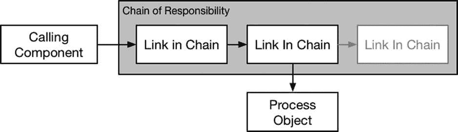

# 19. 责任链模式

当有多个对象可以处理请求，但你不想向调用组件暴露这些对象的细节时，责任链模式非常有用。表 19-1 将责任链模式置于上下文中。

**表 19-1.** 责任链模式上下文

| 问题 | 答案 |
| --- | --- |
| 它是什么？ | 责任链模式将一组可能处理调用组件请求的对象按顺序组织起来。这组对象被称为“链”，链中的每个对象会被请求是否要处理该请求。请求沿着链依次传递，直到某个对象处理了请求，或者到达链的末端。 |
| 有什么好处？ | 责任链模式允许将能够处理请求的对象按照优先顺序排列，该顺序可以重新排列、扩展或缩减，而不会对调用组件产生任何影响，因为调用组件并不了解构成链的对象。 |
| 何时使用此模式？ | 当有多个对象可以处理某个请求，且仅应使用其中一个时，使用此模式。 |
| 何时应避免此模式？ | 当只有一个对象可以处理请求，或者调用组件需要选择对象时，不要使用此模式。 |
| 如何判断是否正确实现了该模式？ | 当能够处理请求的一组对象按顺序排列，并且每个对象都依次获得处理请求的机会时，该模式就正确实现了。链中的各个对象彼此之间互不了解（除了链中的下一个链接）。 |
| 是否有常见的陷阱？ | 陷阱在于泄露链中对象的细节，无论是泄露给彼此还是泄露给调用组件。 |
| 是否有相关模式？ | 责任链模式与第 20 章中描述的命令模式有一些共同概念。 |


## 准备示例项目

本章我创建了一个名为 `ChainOfResp` 的 Xcode 命令行工具项目。我在项目中添加了一个名为 `Message.swift` 的文件，并用它来定义清单 19-1 中展示的代码。

**清单 19-1.** `Message.swift` 文件的内容

```
struct Message {
    let from:String;
    let to:String;
    let subject:String;
}
```

我定义了一个名为 `Message` 的结构体，它包含代表通用消息不同属性的常量：消息的发件人、收件人以及主题。我没有为消息正文定义常量，因为演示职责链模式不需要它。清单 19-2 展示了 `Transmitters.swift` 文件的内容，其中我定义了一对类，它们能够处理 `Message` 对象以便将其传输到其他地方。

**清单 19-2.** `Transmitters.swift` 文件的内容

```
class LocalTransmitter {
    func sendMessage(message: Message) {
        println("Message to \(message.to) sent locally");
    }
}

class RemoteTransmitter {
    func sendMessage(message: Message) {
        println("Message to \(message.to) sent remotely");
    }
}
```

这些类代表了消息发送的机制，可以是公司内部本地发送，也可以远程发送到更广阔的世界。每个发射器类都定义了一个 `sendMessage` 方法，用于处理 `Message` 对象。我无需实现消息路由来演示职责链模式，因此 `sendMessage` 方法向 Xcode 调试控制台输出一条消息。清单 19-3 展示了我添加到 `main.swift` 文件中以使用示例类的代码。

**清单 19-3.** `main.swift` 文件的内容

```
let messages = [
    Message(from: "bob@example.com", to: "joe@example.com",
        subject: "Free for lunch?"),
    Message(from: "joe@example.com", to: "alice@acme.com",
        subject: "New Contracts"),
    Message(from: "pete@example.com", to: "all@example.com",
        subject: "Priority: All-Hands Meeting"),
];

let localT = LocalTransmitter();
let remoteT = RemoteTransmitter();

for msg in messages {
    if let index = find(msg.from, "@") {
        if (msg.to.hasSuffix(msg.from[Range<String.Index>(start:
            index, end: msg.from.endIndex)])) {
            localT.sendMessage(msg);
        } else {
            remoteT.sendMessage(msg);
        }
    } else {
        println("Error: cannot send message to \(msg.from)");
    }
}
```

我定义了一个 `Message` 对象数组，并使用 `for` 循环检查每个对象，根据 `to` 和 `from` 地址是否共享相同的后缀，在 `LocalTransmitter` 对象和 `RemoteTransmitter` 对象之间进行选择。运行示例应用会得到以下结果：

```
Message to joe@example.com sent locally
Message to alice@acme.com sent remotely
Message to all@example.com sent locally
```

## 理解模式要解决的问题

示例应用中的问题在于，使用发射器类处理 `Message` 对象的组件必须了解这些类，并理解何时应该使用它们。这使得添加新的消息处理程序、更改现有处理程序之间的关系以及整体测试和维护代码变得困难。为了演示这个问题，我定义了一个新的发射器类，如清单 19-4 所示。

**清单 19-4.** 在 `Transmitters.swift` 文件中定义一个新的发射器类

```
class LocalTransmitter {
    func sendMessage(message: Message) {
        println("Message to \(message.to) sent locally");
    }
}

class RemoteTransmitter {
    func sendMessage(message: Message) {
        println("Message to \(message.to) sent remotely");
    }
}

class PriorityTransmitter {
    func sendMessage(message: Message) {
        println("Message to \(message.to) sent as priority");
    }
}
```

为了正确处理 `Message` 对象，需要更新组件以反映新的 `PriorityTransmitter` 类，并了解何时使用它。清单 19-5 展示了 `main.swift` 文件中所需的更改，但在实际项目中，这些更改会在整个应用中重复出现。

**清单 19-5.** 在 `main.swift` 文件中反映新发射器类的定义

```
let messages = [
    Message(from: "bob@example.com", to: "joe@example.com",
        subject: "Free for lunch?"),
    Message(from: "joe@example.com", to: "alice@acme.com",
        subject: "New Contracts"),
    Message(from: "pete@example.com", to: "all@example.com",
        subject: "Priority: All-Hands Meeting"),
];

let localT = LocalTransmitter();
let remoteT = RemoteTransmitter();
let priorityT = PriorityTransmitter();

for msg in messages {
    if (msg.subject.hasPrefix("Priority")) {
        priorityT.sendMessage(msg);
    } else if let index = find(msg.from, "@") {
        if (msg.to.hasSuffix(msg.from[Range<String.Index>(start:
            index, end: msg.from.endIndex)])) {
            localT.sendMessage(msg);
        } else {
            remoteT.sendMessage(msg);
        }
    } else {
        println("Error: cannot send message to \(msg.from)");
    }
}
```

更改本身很简单，但调用组件需要深入了解发射器类之间的关系以及何时使用它们，这本身就是一个问题。

## 理解职责链模式

职责链模式通过将发射器排列成一个链（这也是其名称的由来）来解决这些问题。每个发射器是链中的一个环节，能够检查 `Message` 对象以确定是否可以承担对该请求的责任。如果链中的某个环节能够处理 `Message` 请求，则进行处理。如果不能，则将请求传递给链中的下一个环节，重复此过程，直到请求被处理或到达链中的最后一个环节。图 19-1 展示了职责链模式。



**图 19-1.** 职责链模式

调用组件只与链中的第一个环节交互，对后续环节以及每个环节如何决定是否承担请求的依据一无所知。在图中，我展示了一个包含三个环节的链，其中第二个环节承担了请求的责任。在这种情况下，链中的第三个环节不参与此过程，也不知道来自调用组件的请求。


## 实现责任链模式

责任链模式的实现依赖于向调用组件隐藏构成链条的各个独立环节的细节——最简便的方式是通过定义协议或基类来实现。我通常倾向于使用基类，因为我想通过可选属性来处理链条中的下一个环节，而协议定义的属性无法被赋予新值。清单 19-6 展示了我定义并应用于发送器类的基类。

**清单 19-6.** 在`Transmitters.swift`文件中定义并实现基类

```
class Transmitter {
    var nextLink:Transmitter?;
    required init() {}
    func sendMessage(message:Message) {
        if (nextLink != nil) {
            nextLink!.sendMessage(message);
        } else {
            println("End of chain reached. Message not sent");
        }
    }
    private class func matchEmailSuffix(message:Message) -> Bool {
        if let index = find(message.from, "@") {
            return message.to.hasSuffix(message.from[Range<String.Index>(start:
                index, end: message.from.endIndex)]);
        }
        return false;
    }
}

class LocalTransmitter : Transmitter {
    override func sendMessage(message: Message) {
        if (Transmitter.matchEmailSuffix(message)) {
            println("Message to \(message.to) sent locally");
        } else {
            super.sendMessage(message);
        }
    }
}

class RemoteTransmitter : Transmitter {
    override func sendMessage(message: Message) {
        if (!Transmitter.matchEmailSuffix(message)) {
            println("Message to \(message.to) sent remotely");
        } else {
            super.sendMessage(message);
        }
    }
}

class PriorityTransmitter : Transmitter {
    override func sendMessage(message: Message) {
        if (message.subject.hasPrefix("Priority")) {
            println("Message to \(message.to) sent as priority");
        } else {
            super.sendMessage(message);
        }
    }
}
```

`Transmitter`类定义了发送器的基本行为，包括将请求转发至链条中的下一个环节。我将检查电子邮件后缀的代码也定义在这个类中。（`required`初始化器的作用是让我能够根据发送器的类型创建其实例，这一点将在下一节中展示。）

每个独立的发送器类都继承自`Transmitter`，并重写了`sendMessage`方法。每个实现都会检查该发送器是否能承担对`Message`请求的责任。如果发送器无法承担责任，它会调用基类实现，从而将请求传递给链条中的下一个环节；若没有更多环节，则报告错误。

### 创建并提供责任链

下一步是创建责任链，实例化所需的对象，并按它们将被询问承担`Message`责任的顺序排列。你可以使用本书第二部分描述的多种设计模式来创建链条，但我会保持示例简洁，实现一个每次调用时创建新链条的类方法。清单 19-7 展示了我为创建链条而对`Transmitter`类所做的修改。

**清单 19-7.** 在`Transmitters.swift`文件中创建链条

```
...
class Transmitter {
    var nextLink:Transmitter?;
    required init() {}

    func sendMessage(message:Message) {
        if (nextLink != nil) {
            nextLink!.sendMessage(message);
        } else {
            println("End of chain reached. Message not sent");
        }
    }

    class func createChain() -> Transmitter? {
        let transmitterClasses:[Transmitter.Type] = [
            PriorityTransmitter.self,
            LocalTransmitter.self,
            RemoteTransmitter.self
        ];
        var link:Transmitter?;
        for tClass in transmitterClasses.reverse() {
            let existingLink = link;
            link = tClass();
            link?.nextLink = existingLink;
        }
        return link;
    }

    private class func matchEmailSuffix(message:Message) -> Bool {
        if let index = find(message.from, "@") {
            return message.to.hasSuffix(message.from[Range<String.Index>(start:
                index, end: message.from.endIndex)]);
        }
        return false;
    }
}
...
```

我定义了一个`Transmitter`类型的数组，以便轻松添加新的发送器或改变它们在链条中的顺序。创建链条时，我从最后一个环节开始，逆向遍历类数组，依次创建每个环节并建立它们之间的关联关系。

> **提示** 你不需要使用元类型来创建链条中的对象。我认为这是表达链条中类型集合最清晰的方式，但也可以直接创建对象并显式设置`nextLink`属性值。

### 应用责任链模式

最后一步是使用责任链来处理`Message`对象。清单 19-8 展示了我在`main.swift`文件中所做的修改。

**清单 19-8.** 在`main.swift`文件中使用责任链

```
let messages = [
    Message(from: "bob@example.com", to: "joe@example.com",
        subject: "Free for lunch?"),
    Message(from: "joe@example.com", to: "alice@acme.com",
        subject: "New Contracts"),
    Message(from: "pete@example.com", to: "all@example.com",
        subject: "Priority: All-Hands Meeting"),
];

if let chain = Transmitter.createChain() {
    for msg in messages {
        chain.sendMessage(msg);
    }
}
```

应用该模式简化了调用组件中的代码，并隐藏了哪些对象将被询问承担`Message`责任的细节。当需要向应用程序添加新的发送器时，只需修改`Transmitter`类的`createChain`方法即可，调用组件无需任何改动。运行示例应用程序将产生以下输出：

```
Message to joe@example.com sent locally
Message to alice@acme.com sent remotely
Message to all@example.com sent as priority
```

## 责任链模式的变体

责任链模式存在几种常见的变体，我将在以下各节中逐一描述。


  
### 应用工厂方法模式

目前，所有对 `Transmitters.createChain` 方法的调用都会获得一条包含相同链接对象集合的责任链。然而，我可以将责任链模式与工厂方法或抽象工厂模式（在第 9 章和第 10 章中描述）结合使用，以针对不同请求改变链中的链接。代码清单 19-9 展示了我对 `Transmitter` 类所做的更改，以支持不同的链配置。

**代码清单 19-9.** 在 `Transmitters.swift` 文件中改变责任链

```
...
class func createChain( localOnly:Bool ) -> Transmitter? {
    let transmitterClasses:[Transmitter.Type]
        = localOnly ? [PriorityTransmitter.self, LocalTransmitter.self]
        : [PriorityTransmitter.self, LocalTransmitter.self, RemoteTransmitter.self];
    var link:Transmitter?;
    for tClass in transmitterClasses.reverse() {
        let existingLink = link;
        link = tClass();
        link?.nextLink = existingLink;
    }
    return link;
}
...
```

改变链中链接的方法有很多，但我最终决定为 `createChain` 方法添加一个参数，允许调用者指定该链是否仅配置为处理本地消息。该参数的作用是决定链中是否包含 `RemoteTransmitter`，不过这一差异对调用组件是透明的。代码清单 19-10 展示了我在 `main.swift` 文件中如何使用这个 `localOnly` 参数。

**代码清单 19-10.** 在 `main.swift` 文件中指定责任链的配置

```
let messages = [
    Message(from: "bob@example.com", to: "joe@example.com",
        subject: "Free for lunch?"),
    Message(from: "joe@example.com", to: "alice@acme.com",
        subject: "New Contracts"),
    Message(from: "pete@example.com", to: "all@example.com",
        subject: "Priority: All-Hands Meeting"),
];

if let chain = Transmitter.createChain(true) {
    for msg in messages {
        chain.sendMessage(msg);
    }
}
```

我调用 `createChain` 方法时传入了 `localOnly` 值为 `true`，这意味着我创建的 `Message` 对象之一将不会被处理。你可以通过运行应用程序看到效果，输出如下：

```
Message to joe@example.com sent locally
End of chain reached. Message not sent
Message to all@example.com sent as priority
```

### 指示是否已处理请求

目前，调用组件无法了解责任链是否处理了某个请求。一种常见的变体是向调用组件提供反馈，这样责任链就不会成为一个“黑洞”。代码清单 19-11 展示了我为向调用组件提供结果所做的更改。

**代码清单 19-11.** 在 `Transmitters.swift` 文件中指示是否已处理请求

```
class Transmitter {
    var nextLink:Transmitter?;
    required init() {}

    func sendMessage(message:Message) -> Bool {
        if (nextLink != nil) {
            return nextLink!.sendMessage(message);
        } else {
            println("End of chain reached. Message not sent");
            return false;
        }
    }
    // ...为简洁起见，省略了方法...
}

class LocalTransmitter : Transmitter {
    override func sendMessage(message: Message) -> Bool {
        if (Transmitter.matchEmailSuffix(message)) {
            println("Message to \(message.to) sent locally");
            return true;
        } else {
            return super.sendMessage(message);
        }
    }
}

class RemoteTransmitter : Transmitter {
    override func sendMessage(message: Message) -> Bool {
        if (!Transmitter.matchEmailSuffix(message)) {
            println("Message to \(message.to) sent remotely");
            return true;
        } else {
            return super.sendMessage(message);
        }
    }
}

class PriorityTransmitter : Transmitter {
    override func sendMessage(message: Message) -> Bool {
        if (message.subject.hasPrefix("Priority")) {
            println("Message to \(message.to) sent as priority");
            return true;
        } else {
            return super.sendMessage(message);
        }
    }
}
```

链中的每个链接只知道它自己能否处理该消息，对其他链接的能力一无所知。这种隔离带来的效果是，要得出一个确定的 `false` 结果（表示没有任何链接处理该请求），需要征询链中的所有链接。而一旦某个链接接手并处理了 `Message` 对象，则会立即生成一个确定的 `true` 结果。代码清单 19-12 展示了我在 `main.swift` 文件中如何使用 `sendMessage` 方法返回的结果。

**代码清单 19-12.** 在 `main.swift` 文件中接收来自责任链的响应

```
let messages = [
    Message(from: "bob@example.com", to: "joe@example.com",
        subject: "Free for lunch?"),
    Message(from: "joe@example.com", to: "alice@acme.com",
        subject: "New Contracts"),
    Message(from: "pete@example.com", to: "all@example.com",
        subject: "Priority: All-Hands Meeting"),
];

if let chain = Transmitter.createChain(true) {
    for msg in messages {
        let handled = chain.sendMessage(msg);
        println("Message sent: \(handled)");
    }
}
```

运行该应用程序会产生以下输出，展示了向调用组件提供响应的效果：

```
Message to joe@example.com sent locally
Message sent: true
End of chain reached. Message not sent
Message sent: false
Message to all@example.com sent as priority
Message sent: true
```


### 通知链中的所有节点

在责任链模式的标准实现中，链中的节点只有在其中一个节点承担请求责任时才会被查询。承担责任节点之后的链中节点并不知晓该请求。

标准实现的一种变体是，通知链中所有节点某个请求的相关信息，即使这些节点位于接受该请求的节点之后。这是一种我很少使用但很有用的变体，当链中的节点需要知道自己是否被抢占时尤为实用。代码清单 19-13 展示了我对 `Transmitter` 及其子类所做修改的实现方式。

**代码清单 19-13.** 在 `Transmitters.swift` 文件中通知链中所有节点

```
class Transmitter {
    var nextLink:Transmitter?;
    required init() {}
    func sendMessage(message:Message, handled: Bool = false) -> Bool {
        if (nextLink != nil) {
            return nextLink!.sendMessage(message, handled: handled);
        } else if (!handled) {
            println("End of chain reached. Message not sent");
        }
        return handled;
    }
    // ...为简洁起见省略方法...
}

class LocalTransmitter : Transmitter {
    override func sendMessage(message: Message, var handled:Bool) -> Bool {
        if (!handled && Transmitter.matchEmailSuffix(message)) {
            println("Message to \(message.to) sent locally");
            handled = true;
        }
        return super.sendMessage(message, handled: handled);
    }
}

class RemoteTransmitter : Transmitter {
    override func sendMessage(message: Message, var handled: Bool) -> Bool {
        if (!handled && !Transmitter.matchEmailSuffix(message)) {
            println("Message to \(message.to) sent remotely");
            handled = true;
        }
        return super.sendMessage(message, handled: handled);
    }
}

class PriorityTransmitter : Transmitter {
    var totalMessages = 0;
    var handledMessages = 0;
    override func sendMessage(message: Message, var handled:Bool) -> Bool {
        totalMessages++;
        if (!handled && message.subject.hasPrefix("Priority")) {
            handledMessages++;
            println("Message to \(message.to) sent as priority");
            println("Stats: Handled \(handledMessages) of \(totalMessages)");
            handled = true;
        }
        return super.sendMessage(message, handled: handled);
    }
}
```

我修改了 `sendMessage` 方法的签名，定义了一个 `handled` 参数，用于指示链中某个节点是被要求承担请求责任，还是因其他节点已承担该请求责任而被通知。我还修改了 `PriorityTransmitter` 类，使其能跟踪自己处理的请求数量以及处理的总请求数。运行应用程序会产生以下输出：

```
Message to joe@example.com sent locally
Message sent: true
End of chain reached. Message not sent
Message sent: false
Message to all@example.com sent as priority
Stats: Handled 1 of 3
Message sent: true
```

### 理解该模式的潜在缺陷

实现该模式时唯一的缺陷是，将链中对象的详细信息泄露给调用组件或链中其他节点。该模式通过将链的创建方式封装在单个方法或类中来工作，而泄露实现细节会导致对特定链配置产生依赖，从而使后续修改链变得困难。请确保向调用组件提供基类或协议，并在设置链中节点的 `nextLink` 属性时使用相同的基类或协议。

如果你实现了向调用组件返回结果的变体，则必须确保不会无意中在结果中泄露链的相关信息。责任链模式最适合使用简单的结果类型（例如我示例中使用的 `Bool`），但如果你使用更复杂的类型，则一定不要包含对已承担请求责任的链中节点的引用。

### Cocoa 中的模式示例

Cocoa 依靠责任链模式来处理用户界面事件。所有 UI 组件都派生自 `UIResponder` 类（对于 OS X 应用则对应 `NSResponder` 类）。链中的节点是独立的 UI 组件，其排列方式反映了界面组件的层级结构，顶层视图作为链中的最后一个节点。

当用户与某个组件交互时（例如点击鼠标），Cocoa 会将交互事件发送到代表被点击组件的链中节点。该组件有机会承担处理事件的责任，事件会沿着链传递，直到找到能够处理该事件的组件，或到达链末尾（这意味着应用程序不希望或不需要处理该事件，因此可以忽略）。

## 将模式应用于 SportsStore 应用程序

为了演示责任链模式的使用，我将定义一组类，用于格式化 SportsStore 应用中显示产品的表格单元格的背景颜色。

### 准备示例应用

我接续第 18 章中 SportsStore 项目的进度，本章无需其他准备。


### 定义责任链及其链节

我的责任链将由一组对象组成，这些对象将根据其所显示的产品类别，负责格式化表格单元格。清单 19-14 显示了我添加到 SportsStore 项目中并用于实现该模式的 `FormatterChain.swift` 文件的内容。

**清单 19-14.** `FormatterChain.swift` 文件的内容

```
import UIKit;

class CellFormatter {
    var nextLink:CellFormatter?;

    func formatCell(cell: ProductTableCell) {
        nextLink?.formatCell(cell);
    }

    class func createChain() -> CellFormatter {
        let formatter = ChessFormatter();
        formatter.nextLink = WatersportsFormatter();
        formatter.nextLink?.nextLink = DefaultFormatter();
        return formatter;
    }
}

class ChessFormatter : CellFormatter {
    override func formatCell(cell: ProductTableCell) {
        if (cell.product?.category == "Chess") {
            cell.backgroundColor = UIColor.lightGrayColor();
        } else {
            super.formatCell(cell);
        }
    }
}

class WatersportsFormatter : CellFormatter {
    override func formatCell(cell: ProductTableCell) {
        if (cell.product?.category == "Watersports") {
            cell.backgroundColor = UIColor.greenColor();
        } else {
            super.formatCell(cell);
        }
    }
}

class DefaultFormatter : CellFormatter {
    override func formatCell(cell: ProductTableCell) {
        cell.backgroundColor = UIColor.yellowColor();
    }
}
```

该模式的所有实现看起来都很相似，上述清单展示了与前一个示例共有的公共基础。我定义了一个基类（`CellFormatter`），它提供了一个用于创建责任链的类方法，并提供了遍历责任链的默认行为。责任链中的链节派生自 `CellFormatter` 类，并根据产品类别承担责任。它们执行的格式化操作是更改单元格的背景颜色。`DefaultFormatter` 类始终将单元格背景设置为黄色，并且必须用于创建责任链中的最后一个链节。清单 19-15 展示了如何在 `ViewController` 类中使用责任链模式。

**清单 19-15.** 在 `ViewController.swift` 文件中使用责任链模式

```
...
func tableView(tableView: UITableView,
    cellForRowAtIndexPath indexPath: NSIndexPath) -> UITableViewCell {
    let product = productStore.products[indexPath.row];
    let cell = tableView.dequeueReusableCellWithIdentifier("ProductCell")
        as ProductTableCell;
    cell.product = productStore.products[indexPath.row];
    cell.nameLabel.text = product.name;
    cell.descriptionLabel.text = product.productDescription;
    cell.stockStepper.value = Double(product.stockLevel);
    cell.stockField.text = String(product.stockLevel);
    CellFormatter.createChain().formatCell(cell);
    return cell;
}
...
```

您可以通过运行应用程序来查看应用格式化责任链的效果。效果虽然俗气，但清晰地显示了责任链中的哪个链节接受了每个表格单元格的责任，如图 19-2 所示。


**图 19-2.** 格式化表格单元格

## 本章小结

在本章中，我描述了责任链模式，并解释了如何使用它来找到一个愿意为请求承担责任的对象，同时隐藏了选择哪个对象以及选择方式的细节。在下一章中，我将介绍命令模式，该模式用于封装执行方法所需的细节。

