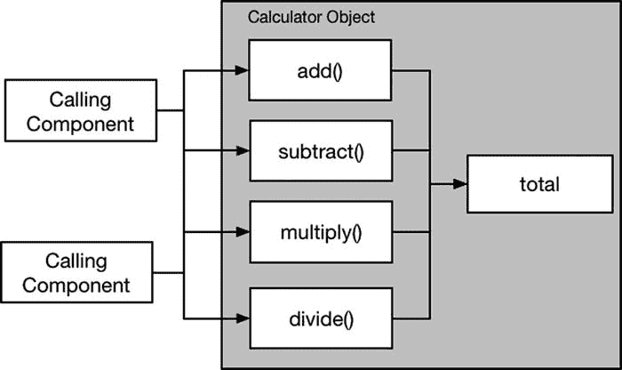
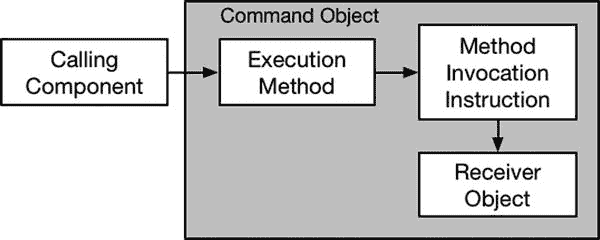
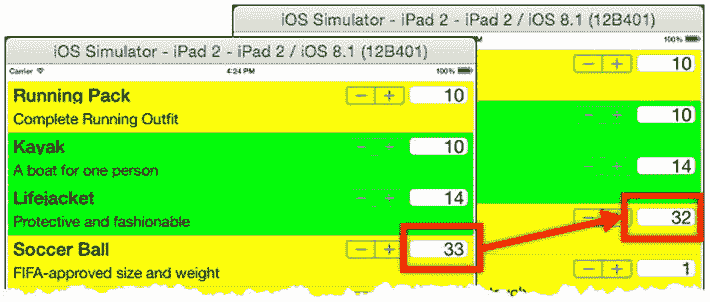

# 20. 命令模式

命令模式提供了一种机制，通过该机制可以封装如何调用方法的细节，以便稍后或由不同的组件调用该方法。表 20-1 将命令模式置于上下文中。

**表 20-1.** 将命令模式置于上下文中

| 问题 | 答案 |
| --- | --- |
| 它是什么？ | 命令模式用于封装在对象上调用方法的细节，其方式允许在不同时间或由不同组件调用该方法。 |
| 有哪些好处？ | 有很多情况下使用命令是有用的，但最常见的是支持撤销操作和创建宏。 |
| 何时应该使用此模式？ | 当你希望允许那些对将要使用的对象、将要调用的方法或将要提供的参数一无所知的组件调用方法时，请使用此模式。 |
| 何时应避免使用此模式？ | 不要将此模式用于常规的方法调用。 |
| 如何知道正确实现了该模式？ | 当组件可以使用命令在对象上调用方法，而无需了解该对象或方法本身的细节时，就说明该模式被正确实现了。 |
| 有哪些常见的陷阱？ | 主要的陷阱是要求执行命令的组件了解将要使用的方法或对象。 |
| 有哪些相关的模式？ | 备忘录模式提供了一种模型，可以用对象整个状态的快照来代替单个操作。 |

## 准备示例项目

为了演示命令模式，我创建了一个名为 Command 的 Xcode OS X 命令行工具项目。我添加了一个名为 `Calculator.swift` 的文件，其内容如清单 20-1 所示。

**清单 20-1.** `Calculator.swift` 文件的内容

```
class Calculator {
    private(set) var total = 0;

    func add(amount:Int) {
        total += amount;
    }

    func subtract(amount:Int) {
        total -= amount;
    }

    func multiply(amount:Int) {
        total = total * amount;
    }

    func divide(amount:Int) {
        total = total / amount;
    }
}
```

`Calculator` 类定义了一个名为 `total` 的存储型 `Int` 属性，其值通过调用 `add`、`subtract`、`multiply` 和 `divide` 方法来更改。清单 20-2 显示了我添加到 `main.swift` 文件中的代码，该代码使用 `Calculator` 类来确定多个运算产生的值。

**清单 20-2.** `main.swift` 文件的内容

```
let calc = Calculator();
calc.add(10);
calc.multiply(4);
calc.subtract(2);
println("Total: \(calc.total)");
```

运行应用程序会产生以下输出：

```
Total: 38
```


## 理解该模式所解决的问题

当需要将方法调用封装成对象，以便能够在日后执行或由其他组件执行，且无需该组件了解被调用方法及其所属对象的细节时，就会产生命令模式所要解决的问题。

假设你正在构建一个应用程序，其中两个组件对同一个对象执行操作，比如我在示例应用中定义的 `Calculator` 类实例。图 20-1 展示了该应用的基本结构，其中每个组件都调用更新 `Calculator` 总值的方法。



图 20-1. 两个组件对同一个公共对象执行操作

现在假设你需要实现撤销先前操作的功能。一种实现方法是让每个组件跟踪自己已执行的操作，以便将来能够撤销。问题在于，每个组件并不知道另一个组件执行了哪些操作，而在缺少这一信息的情况下执行撤销操作，可能会破坏共享对象的状态，因为操作会以错误的顺序被撤销。

我本可以让这些组件相互协调，但这只会造成组件间的耦合，并使应用程序的设计复杂化。我需要的是：一种独立于执行操作的组件来表达撤销操作的方式，以便能够以可控的方式调用它们，逐步回滚共享对象的状态。而这，正是命令模式可以发挥作用的地方。

## 理解命令模式

命令模式将方法调用表示为一个对象，从而可以用来解决撤销问题以及我在“命令模式的变体”一节中描述的一系列相关问题。图 20-2 展示了命令模式。



图 20-2. 命令模式

命令模式的核心是命令对象，通常简称为命令。在它的内部实现中，命令持有对接收者对象的引用，以及关于如何在接收者上调用方法的指令。在示例应用的上下文中，接收者对象就是 `Calculator` 类的一个实例，而方法调用指令则包含应调用哪个 `Calculator` 方法（`add`、`subtract`、`multiply` 或 `divide`）以及方法参数的值的详细信息。

接收者和调用指令是私有的，使用命令的组件无法访问它们。命令对象唯一公开的方面是一个执行方法，当需要对接收者对象执行方法调用指令时（即，使用指定的参数值调用指定的方法），调用组件会调用该方法。用命令模式的术语来说，调用组件被称为调用者，因为它会调用执行方法。

如果这看起来过于抽象，不必担心。命令模式应用场景非常广泛，只有在具体情境中才能真正理解它。需要牢记的重要一点是：在调用者调用执行方法之前，方法调用指令并不会在接收者对象上执行。如果你记住了这一点，那么在看到该模式如何实现时，其他一切就都水到渠成了。

## 实现命令模式

对大多数人来说，理解命令模式最简单的方法就是用它来解决一个具体问题。在接下来的几节中，我将应用该模式为我的示例应用创建一个撤销功能。你可能需要阅读实现步骤好几次才能理解模式是如何组合在一起的，但请坚持下去，因为命令模式值得花时间去理解。

### 定义命令协议

命令模式的起点是定义一个协议，该协议为调用者提供一个执行方法。清单 20-3 展示了 `Commands.swift` 文件的内容，我已将其添加到示例项目中。

清单 20-3. Commands.swift 文件的内容

```
protocol Command {

    func execute();

}
```

命令允许调用者执行它，但不能看到接收者对象或调用方法的指令的细节。为此，清单中定义的 `Command` 协议定义了一个 `execute` 方法，但没有透露任何其他细节。

> **提示：** 通常约定使用 `execute` 作为执行方法的名称，但你可以使用任何你喜欢的名称。

### 定义命令实现类

命令模式的实现类在 Swift 中很容易实现，因为执行接收者方法的指令可以表示为一个闭包。清单 20-4 展示了我为示例项目定义的实现类。

清单 20-4. 在 Commands.swift 文件中定义命令实现类

```
protocol Command {

    func execute();

}

class GenericCommand<T> : Command {

    private var receiver: T;
    private var instructions: T -> Void;

    init(receiver:T, instructions: T -> Void) {
        self.receiver = receiver; self.instructions = instructions;
    }

    func execute() {
        instructions(receiver);
    }

    class func createCommand(receiver:T, instuctions: T -> Void) -> Command {
        return GenericCommand(receiver: receiver, instructions: instuctions);
    }

}
```

我定义了一个名为 `GenericCommand` 的泛型实现类，该类定义了存储接收者对象和调用指令的私有属性。该类遵循 `Command` 协议，`execute` 方法在接收者对象上执行调用指令。我还定义了一个名为 `createCommand` 的类方法（仅作为便利方法），用于创建 `GenericCommand` 的实例。


### 应用命令模式

为了应用命令模式，我扩展了 `Calculator` 类，使其能生成一个由 `Command` 对象组成的数组，这些对象构成了过去撤消操作的序列。代码清单 20-5 显示了我所做的修改。

**代码清单 20-5.** 在 `Calculator.swift` 文件中添加撤消支持

```swift
class Calculator {
    private(set) var total = 0;
    private var history = [Command]();

    func add(amount:Int) {
        addUndoCommand(Calculator.subtract, amount: amount);
        total += amount;
    }

    func subtract(amount:Int) {
        addUndoCommand(Calculator.add, amount: amount);
        total -= amount;
    }

    func multiply(amount:Int) {
        addUndoCommand(Calculator.divide, amount: amount);
        total = total * amount;
    }

    func divide(amount:Int) {
        addUndoCommand(Calculator.multiply, amount: amount);
        total = total / amount;
    }

    private func addUndoCommand(method:Calculator -> Int -> Void, amount:Int) {
        self.history.append(GenericCommand<Calculator>.createCommand(self,
            instuctions: {calc in
                method(calc)(amount);
            }));
    }

    func undo() {
        if self.history.count > 0 {
            self.history.removeLast().execute();
            // 临时措施 - 执行命令会添加到历史记录中
            self.history.removeLast();
        }
    }
}
```

> **提示**  
> 在此示例中，接收者对自己执行命令。这并不是命令模式的要求，我将在“命令模式的变体”一节中演示这一点。

四个操作方法（`add`、`subtract` 等）中的每一个都调用了 `addUndoCommand` 方法，传入了用于撤消该操作的方法以及应作为参数传递给该方法的数值。`addUndoCommand` 方法会创建 `Command` 对象，并将其添加到一个名为 `history` 的数组中。我还定义了一个 `undo` 方法，该方法从 `history` 数组中移除最近的 `Command` 并执行它，从而使 `Calculator` 对象恢复到较早的状态。执行撤消 `Command` 会导致一个新的 `Command` 被添加到历史记录中，这不是我想要的效果。因此，在 `undo` 方法中执行 `Command` 之后，我会移除并丢弃 `history` 数组中的最后一项。这是一个临时措施，我将在下一节中移除它。

### 使用方法引用

在代码清单 20-5 中，我将方法引用作为参数传递给 `addUndoCommand` 方法，如下所示：

```
...
addUndoCommand(Calculator.add, amount: amount);
...
```

第一个参数是对 `Calculator` 类定义的 `add` 方法的引用。为了接收这个引用，我这样定义了 `addUndoCommand` 的签名：

```
...
private func addUndoCommand(method:Calculator -> Int -> Void, amount:Int) {
...
```

名为 `method` 的参数被定义为一个函数，该函数接受一个 `Calculator` 对象并返回另一个函数。第二个函数接受一个 `Int` 并且不返回结果。这可能会令人困惑，但这是由 Swift 实例方法在幕后实现的方式决定的。考虑以下代码：

```swift
class Printer {
    func printMessage(message:String) {
        println(message);
    }
}

let printerObject = Printer();
printerObject.printMessage("Hello");
```

我定义了一个名为 `Printer` 的类，它有一个 `printMessage` 方法。要使用 `Printer` 类，我需要创建一个新实例，然后用这个实例来调用方法。最后一条语句的结构如下：

```
<对象引用>.<实例方法名>(<参数值>)
```

这是调用方法的常规方式，但还有一种替代方式：

```
...
Printer.printMessage(printerObject)("Hello");
...
```

这与通过对象引用调用方法的效果相同。这种技术结构如下：

```
<类>.<实例方法名>(<对象引用>)(<参数值>)
```

柯里化（Currying）是创建一个函数的过程，该函数固定传递给另一个函数的一个或多个参数。在这种情况下，第一个函数返回一个柯里化函数，该函数在指定对象上调用实例方法。这种方法的好处是对象引用作为参数传递给第一个函数，这意味着我可以动态地为我的命令选择接收者，并将方法引用作为对象传递——当你想要更改命令所针对的接收者时，这一点变得很重要（参见“命令模式的变体”一节中的示例）。

### 应用并发保护

我在本章开头描述的问题包括多个组件操作单个 `Calculator` 对象，现在我在 `Calculator` 类中有了一个数组，我需要添加并发保护以避免数据损坏。代码清单 20-6 展示了如何使用 Grand Central Dispatch 序列化对 `history` 数组的访问。

**代码清单 20-6.** 在 `Calculator.swift` 文件中应用并发保护

```swift
import Foundation;

class Calculator {
    private(set) var total = 0;
    private var history = [Command]();
    private var queue = dispatch_queue_create("arrayQ", DISPATCH_QUEUE_SERIAL);
    private var performingUndo = false;

    func add(amount:Int) {
        addUndoCommand(Calculator.subtract, amount: amount);
        total += amount;
    }

    func subtract(amount:Int) {
        addUndoCommand(Calculator.add, amount: amount);
        total -= amount;
    }

    func multiply(amount:Int) {
        addUndoCommand(Calculator.divide, amount: amount);
        total = total * amount;
    }

    func divide(amount:Int) {
        addUndoCommand(Calculator.multiply, amount: amount);
        total = total / amount;
    }

    private func addUndoCommand(method:Calculator -> Int -> Void, amount:Int) {
        if (!performingUndo) {
            dispatch_sync(self.queue, {() in
                self.history.append(GenericCommand<Calculator>.createCommand(self,
                    instuctions: {calc in
                        method(calc)(amount);
                    }));
            });
        }
    }

    func undo() {
        dispatch_sync(self.queue, {() in
            if self.history.count > 0 {
                self.performingUndo = true;
                self.history.removeLast().execute();
                self.performingUndo = false;
            }
        });
    }
}
```

> **注意**  
> 在实现命令模式时，你不必添加并发保护，但我建议你至少考虑一下。随着应用程序的成熟，对接收者执行命令的组件数量可能会增加，从而增加并发访问和数据损坏的几率。

我创建了一个串行队列，并在 `addUndoCommand` 和 `undo` 方法中使用 `dispatch_sync` 方法，以确保 `history` 数组不会被并发修改。我定义了一个名为 `performingUndo` 的变量，在执行撤消 `Command` 时设置该变量，以防止 `addUndoCommand` 方法在从某个操作方法中调用时向 `history` 数组添加另一个命令。

> **提示**  
> 使用变量来标识我是否正在执行撤消命令，可以防止应用程序锁死。Grand Central Dispatch 不支持递归锁，这意味着如果我从一个也已通过 `dispatch_sync` 函数放入队列的块内部调用某个使用了 `dispatch_sync` 函数的方法，应用程序就会冻结。第二次对 `dispatch_async` 的调用会一直阻塞，直到第一次调用完成，而第一次调用由于等待第二次调用而无法完成，这是一个经典的并发错误。


### 使用撤销功能

最后一步是演示我添加到`Calculator`类中的撤销功能，如代码清单 20-7 所示。

代码清单 20-7. 在`main.swift`文件中使用撤销功能

```
let calc = Calculator();
calc.add(10);
calc.multiply(4);
calc.subtract(2);
println("Total: \(calc.total)");
for _ in 0 ..< 3 {
    calc.undo();
    println("Undo called. Total: \(calc.total)");
}
```

我使用一个`for`循环对`Calculator`对象调用三次`undo`方法，并将`total`属性的新值写入调试控制台。运行应用程序会产生以下输出：

```
Total: 38
Undo called. Total: 40
Undo called. Total: 10
Undo called. Total: 0
```

## 命令模式的变体

命令模式可以广泛应用于各种场景，但你会遇到该模式的三种主要变体，我将在以下各节中逐一描述。

### 创建复合命令

我在`Calculator`对象中创建的命令仅能撤销单一操作，但利用`Command`协议的不透明性，可以轻松创建通过包装两个或更多其他命令来执行多项操作的命令。代码清单 20-8 展示了如何定义一个遵循`Command`协议、作为其他命令包装器的类。

代码清单 20-8. 在`Commands.swift`文件中定义命令包装器

```
protocol Command {
    func execute();
}

class CommandWrapper : Command {
    private let commands:[Command];
    init(commands:[Command]) {
        self.commands = commands;
    }
    func execute() {
        for command in commands {
            command.execute();
        }
    }
}

class GenericCommand<T> : Command {
    private var receiver: T;
    private var instructions: T -> Void;
    init(receiver:T, instructions: T -> Void) {
        self.receiver = receiver; self.instructions = instructions;
    }
    func execute() {
        instructions(receiver);
    }
    class func createCommand(receiver:T, instuctions: T -> Void) -> Command {
        return GenericCommand(receiver: receiver, instructions: instuctions);
    }
}
```

`CommandWrapper`类定义了一个由`Command`对象组成的常量数组，这些对象会按顺序执行。代码清单 20-9 展示了如何在`Calculator`类中使用`CommandWrapper`来提供撤销命令的快照。

代码清单 20-9. 在`Calculator.swift`文件中创建复合命令

```
import Foundation;

class Calculator {
    // ...为简洁起见省略属性和方法...
    func getHistorySnaphot() -> Command? {
        var command:Command?;
        dispatch_sync(queue, {() in
            command = CommandWrapper(commands: self.history.reverse());
        });
        return command;
    }
}
```

`getHistorySnapshot`方法返回一个`Command`对象，该对象将撤销所有按时间顺序执行的操作。该方法的实现创建了一个`CommandWrapper`类的实例，该实例复制了撤销命令的本地数组。（关于 Swift 和 Cocoa 数组如何复制的详细信息，请参阅第 5 章。）

提示

请注意，我将传递给`CommandWrapper`初始化器的命令数组进行了反转。这是因为`Calculator`类以尾优先的顺序处理其数组，而`CommandWrapper`类则使用头优先的顺序。反转数组顺序意味着撤销命令将按照与通过`undo`方法单独执行时相同的序列进行应用。

代码清单 20-10 展示了我对`main.swift`文件所做的更改，以获取并执行复合命令。

代码清单 20-10. 在`main.swift`文件中使用复合命令

```
let calc = Calculator();
calc.add(10);
calc.multiply(4);
calc.subtract(2);
let snapshot = calc.getHistorySnaphot();
println("Pre-Snapshot Total: \(calc.total)");
snapshot?.execute();
println("Post-Snapshot Total: \(calc.total)");
```

运行示例应用程序会产生以下输出，这证明了每个单独的撤销命令都已通过复合命令执行：

```
Pre-Snapshot Total: 38
Post-Snapshot Total: 0
```


### 将命令用作宏

命令常用于创建宏，这样就能对不同的接收对象执行同一组操作。要将命令用作对象，接收者必须传递给 `execute` 方法，而不是命令对象的初始化器。代码清单 20-11 展示了我所做的修改，使接收者可以作为一个参数指定。

**代码清单 20-11.** 在 `Commands.swift` 文件中修改命令协议和实现类

```
protocol Command {
    func execute(receiver:Any);
}

class CommandWrapper : Command {
    private let commands:[Command];
    init(commands:[Command]) {
        self.commands = commands;
    }
    func execute(receiver:Any) {
        for command in commands {
            command.execute(receiver);
        }
    }
}

class GenericCommand<T> : Command {
    private var instructions: T -> Void;
    init(instructions: T -> Void) {
        self.instructions = instructions;
    }
    func execute(receiver:Any) {
        if let safeReceiver = receiver as? T {
            instructions(safeReceiver);
        } else {
            fatalError("Receiver is not expected type");
        }
    }
    class func createCommand(instuctions: T -> Void) -> Command {
        return GenericCommand(instructions: instuctions);
    }
}
```

我在 `Command` 协议定义的 `execute` 方法中添加了一个 `Any` 参数。如果传递给 `execute` 方法的对象与泛型类型参数不匹配，我会在 `GenericCommand` 类的 execute 方法中通过调用全局 `fatalError` 函数来强制进行类型一致性检查。这并不理想，因为错误将在运行时而非编译时报告，但 Swift 很难创建和应用泛型协议。

在代码清单 20-12 中，你可以看到我如何修改 `Calculator` 类以移除撤销功能，并替换为支持生成宏命令，该宏命令将应用已执行的操作。

**代码清单 20-12.** 在 `Calculator.swift` 文件中添加宏支持

```
import Foundation;

class Calculator {
    private(set) var total = 0;
    private var history = [Command]();
    private var queue = dispatch_queue_create("arrayQ", DISPATCH_QUEUE_SERIAL);
    func add(amount:Int) {
        addMacro(Calculator.add, amount: amount);
        total += amount;
    }
    func subtract(amount:Int) {
        addMacro(Calculator.subtract, amount: amount);
        total -= amount;
    }
    func multiply(amount:Int) {
        addMacro(Calculator.multiply, amount: amount);
        total = total * amount;
    }
    func divide(amount:Int) {
        addMacro(Calculator.divide, amount: amount);
        total = total / amount;
    }
    private func addMacro(method:Calculator -> Int -> Void, amount:Int) {
        dispatch_sync(self.queue, {() in
            self.history.append(GenericCommand<Calculator>.createCommand(
                { calc in method(calc)(amount); }
            ));
        });
    }
    func getMacroCommand() -> Command? {
        var command:Command?;
        dispatch_sync(queue, {() in
            command = CommandWrapper(commands: self.history);
        });
        return command;
    }
}
```

每个操作方法现在都调用 `addMacro` 方法，该方法构建了在 `Calculator` 实例上执行过的操作历史（而不是撤销功能所需的逆向操作）。重要的区别在于，`Calculator` 对象本身并未包含在创建并由 `getMacroCommand` 方法随后打包的 `Command` 对象中。相反，每个命令包含了将被调用的操作方法的详细信息以及将传递给它的参数，而指定将成为命令接收者的 `Calculator` 对象是调用组件的职责。代码清单 20-13 展示了我在 `main.swift` 文件中如何使用宏功能。

**代码清单 20-13.** 在 `main.swift` 文件中创建和应用宏

```
let calc = Calculator();
calc.add(10);
calc.multiply(4);
calc.subtract(2);
println("Calc 1 Total: \(calc.total)");

let macro = calc.getMacroCommand();
let calc2 = Calculator();
macro?.execute(calc2);
println("Calc 2 Total: \(calc2.total)");
```

我对一个 `Calculator` 对象应用一系列操作，然后将这些命令作为宏，用于对另一个不同的 `Calculator` 对象执行相同的操作。运行示例应用程序会产生以下结果：

```
Calc 1 Total: 38
Calc 2 Total: 38
```

### 使用闭包作为命令

命令模式指定使用命令对象，这也是我在本章目前所有实现中所采用的方式。然而，命令只是一个容器，用于存储要调用的方法的详细信息、其参数值，以及（可选）目标接收者。所有这些细节都可以封装在 Swift 闭包中，而无需定义和使用 `Command` 协议及其实现。

我更喜欢使用 `Command` 对象。我发现这能更清晰地体现模式的目的，并生成更易于阅读和维护的代码。不过，你可能会有不同的看法。在代码清单 20-14 中，你可以看到我如何修改 `Calculator` 类，使其使用闭包来表达命令，并且不再依赖 `Command` 协议和 `GenericCommand` 类。

**代码清单 20-14.** 在 `Calculator.swift` 文件中使用闭包作为命令

```
import Foundation;

class Calculator {
    private(set) var total = 0;
    typealias CommandClosure = (Calculator -> Void);
    private var history = [CommandClosure]();
    private var queue = dispatch_queue_create("arrayQ", DISPATCH_QUEUE_SERIAL);
    func add(amount:Int) {
        addMacro(Calculator.add, amount: amount);
        total += amount;
    }
    func subtract(amount:Int) {
        addMacro(Calculator.subtract, amount: amount);
        total -= amount;
    }
    func multiply(amount:Int) {
        addMacro(Calculator.multiply, amount: amount);
        total = total * amount;
    }
    func divide(amount:Int) {
        addMacro(Calculator.divide, amount: amount);
        total = total / amount;
    }
    private func addMacro(method:Calculator -> Int -> Void, amount:Int) {
        dispatch_sync(self.queue, {() in
            self.history.append({ calc in method(calc)(amount)});
        });
    }
    func getMacroCommand() -> (Calculator -> Void) {
        var commands = [CommandClosure]();
        dispatch_sync(queue, {() in
            commands = self.history
        });
        return { calc in
            if (commands.count > 0) {
                for index in 0 ..< commands.count {
                    commandsindex;
                }
            }
        };
    }
}
```

此清单中的更改可能看起来不大，但编写这类代码非常烧脑，因为你需要在想要闭包的变量和不想要的变量之间进行梳理，并弄清楚是否需要从 `Calculator -> Int -> Void` 柯里化到 `Calculator -> Void` 或 `Int -> Void`。

如果你坚持使用这种命令风格，那么请注意我使用了 `typealias` 关键字为数组中的使用定义了一个别名，如下所示：

```
...
typealias CommandClosure = (Calculator -> Void);
private var history = [CommandClosure]();
...
```

Swift 编译器不喜欢将闭包签名作为数组的数据类型，但可以通过别名来安抚它。代码清单 20-15 展示了在 `main.swift` 文件中的更改，以使用基于闭包的 `Calculator` 类。

**代码清单 20-15.** 在 `main.swift` 文件中使用基于闭包的 Calculator 类

```
let calc = Calculator();
calc.add(10);
calc.multiply(4);
calc.subtract(2);
println("Calc 1 Total: \(calc.total)");

let macro = calc.getMacroCommand();
let calc2 = Calculator();
macro(calc2);
println("Calc 2 Total: \(calc2.total)");
```

唯一的更改是直接调用 `getMacroCommand` 方法返回的闭包，而不是调用由 `Command` 对象定义的 execute 方法。运行应用程序会产生以下输出，表明闭包的工作方式与单独的命令对象完全相同：

```
Calc 1 Total: 38
Calc 2 Total: 38
```


好的，作为一名高级文档工程师和翻译员，我将严格遵循您的注意事项和示例格式，将以下英文文本翻译成中文。


## 理解命令模式的陷阱

只要不将接收者对象或方法调用指令的细节暴露给调用组件，命令模式的实现就相对简单。在实现细节方面，如果命令可能被多个组件使用，请确保添加并发保护，并确保你的闭包在你期望的对象上运行，而不是错误地关闭了错误的接收者对象。

## Cocoa 中命令模式的示例

`Foundation` 框架包含了 `NSInvocation` 类，它用于在 Objective-C 中实现命令模式。然而，由于 Swift 和 Objective-C 调用其方法的方式不同，`NSInvocation` 类无法在 Swift 代码中使用。命令模式的一个更具体的实现可以通过 `NSUndoManager` 类获得，我将在下一节中使用它。

## 将模式应用于 SportsStore 应用程序

我将把命令模式应用于 SportsStore 应用程序，以实现库存水平变化的撤销功能。iOS 包含一个内置的易于使用的撤销管理框架，该框架使用了命令模式。

### 准备示例应用程序

触发 iOS 撤销操作的标准机制是摇晃设备。为了准备使用命令模式，我将添加支持，以便在识别到摇晃动作时接收通知。代码清单 20-16 显示了我对 `ViewController` 类所做的更改。

**代码清单 20-16.** 在 ViewController.swift 文件中添加摇晃动作支持

```
class ViewController: UIViewController, UITableViewDataSource {

@IBOutlet weak var totalStockLabel: UILabel!

@IBOutlet weak var tableView: UITableView!

let productStore = ProductDataStore();

override func viewDidLoad() {

super.viewDidLoad()

displayStockTotal();

let bridge = EventBridge(callback: updateStockLevel);

productStore.callback = bridge.inputCallback;

}

override func motionEnded(motion: UIEventSubtype, withEvent event: UIEvent) {

if (event.subtype == UIEventSubtype.MotionShake) {

println("Shake motion detected");

}

}

// ...methods omitted for brevity...

}
```

我重写了 `motionEnded` 方法，以便检查检测到的运动类型，如果运动是摇晃，则在 Xcode 调试控制台中打印出一条消息。要测试此更改，请启动 SportsStore 应用程序，然后从 iOS 模拟器的硬件菜单中选择摇晃手势。你将在 Xcode 控制台中看到以下信息：

```
Shake motion detected
```

### 实现撤销功能

实现命令模式最直接的方式是使用 `NSUndoManager` 类。`NSUndoManager` 类通过 UI 组件类遵循 `NSResponder` 协议的 `undoManager` 属性自动管理，这意味着为你处理了 `NSUndoManager` 实例的创建。使用撤销管理器有两个阶段，第一个是注册当用户请求撤销操作时将调用的命令。代码清单 20-17 显示了我对 `ViewController` 类所做的更改。

**代码清单 20-17.** 在 ViewController.swift 文件中注册撤销命令

```
...

@IBAction func stockLevelDidChange(sender: AnyObject) {

if var currentCell = sender as? UIView {

while (true) {

currentCell = currentCell.superview!;

if let cell = currentCell as? ProductTableCell {

if let product = cell.product? {

let dict = NSDictionary(objects: [product.stockLevel],

forKeys: [product.name]);

undoManager?.registerUndoWithTarget(self,

selector: "undoStockLevel:",

object: dict);

if let stepper = sender as? UIStepper {

product.stockLevel = Int(stepper.value);

} else if let textfield = sender as? UITextField {

if let newValue = textfield.text.toInt()? {

product.stockLevel = newValue;

}

}

cell.stockStepper.value = Double(product.stockLevel);

cell.stockField.text = String(product.stockLevel);

productLogger.logItem(product);

StockServerFactory.getStockServer()

.setStockLevel(product.name,

stockLevel: product.stockLevel);

}

break;

}

}

displayStockTotal();

}

}

func undoStockLevel(data:[String:Int]) {

let productName = data.keys.first;

if (productName != nil) {

let stockLevel = data[productName!];

if (stockLevel != nil) {

for nproduct in productStore.products {

if nproduct.name == productName! {

nproduct.stockLevel = stockLevel!;

}

}

updateStockLevel(productName!, level: stockLevel!);

}

}

}

...
```

`undoManager` 属性是可选的，命令通过 `registerUndoWithTarget` 方法注册。此方法的参数是命令的接收者、将被调用的方法以及将传递给该参数的对象。

```
...

undoManager?.registerUndoWithTarget(self, selector: "undoStockLevel:", object: dict);

...
```

我将视图控制器指定为接收者，并指定了一个名为 `undoStockLevel` 的新方法。对于方法参数，我创建了一个 `NSDictionary`，其中包含了被修改的产品名称和旧的库存水平。

`NSUndoManager` 暴露了它的一些 Objective-C 根源。首先，当我指定要调用方法的名称时，我需要在名称后面跟一个冒号，像这样：

```
...

undoManager?.registerUndoWithTarget(self, selector: " undoStockLevel: ", object: dict);

...
```

这与在 Objective-C 代码中选择方法的方式有关，省略冒号将在执行命令时导致异常。另一个需要注意的问题是，我必须使用 `NSDictionary` 作为传递给方法的参数，因为 Swift 内置的字典不受支持。我必须定义 `undoStockLevel` 方法，因为撤销命令只能提供一个对象。我解包字典中的数据，并用它来更新存储库中的产品对象，并调用 `updateStockLevel` 方法，该方法接受两个参数，因此不能被撤销管理器直接调用。

#### 触发撤销命令

调用 `registerUndoWithTarget` 方法的结果是在后台创建了一个命令，等待用户在摇晃设备时执行。代码清单 20-18 显示了我对 `ViewController` 类的 `motionEnded` 方法所做的更改。

**代码清单 20-18.** 在 ViewController.swift 文件中触发撤销命令

```
...

override func motionEnded(motion: UIEventSubtype, withEvent event: UIEvent) {

if (event.subtype == UIEventSubtype.MotionShake) {

println("Shake motion detected");

undoManager?.undo();

}

}

...
```

`NSUndoManager` 类定义的 `undo` 方法会触发由 `registerUndoWithTarget` 方法创建的最新的撤销命令。要测试这些更改，请启动应用程序，更改其中一个产品的值，然后从 iOS 模拟器的硬件菜单中选择摇晃手势。你所做的更改将被撤销，如图 20-3 所示。



**图 20-3.** 撤销库存水平变更

## 小结

在本章中，我描述了命令模式，它用于封装方法调用，以便稍后或由另一个组件执行。我演示了如何使用命令模式来实现撤销操作，并创建了充当宏的调用序列。在下一章中，我将描述中介者模式，它用于管理对等对象组之间的通信。


