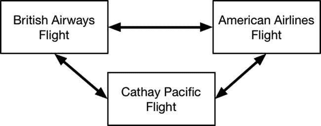
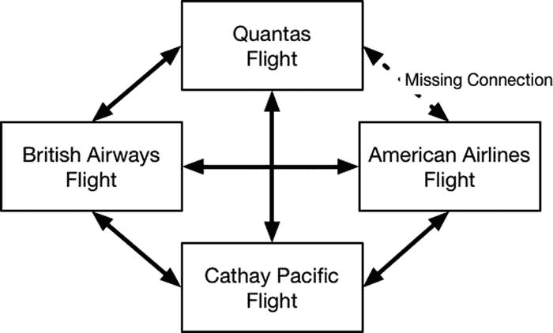
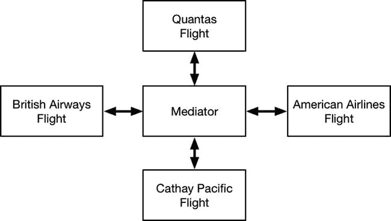

# 21. 中介者模式

中介者模式用于简化和优化对象组之间的通信。这是最不为人知的设计模式之一，但它解决了一个常见问题，并能显著简化应用程序的设计。表 21-1 将中介者模式置于上下文中。

**表 21-1.** 中介者模式上下文

| 问题 | 答案 |
| --- | --- |
| 是什么？ | 中介者模式通过引入一个作为对象间通信代理的中介者对象，来简化对象之间的点对点通信。 |
| 有哪些优点？ | 对象只需与中介者打交道，而无需单独跟踪并与其所有对等方通信。 |
| 何时应使用此模式？ | 当处理一组需要彼此自由通信的对象时，请使用此模式。 |
| 何时应避免此模式？ | 如果你有一个对象需要向一系列不同的对象发送通知，则不要使用此模式；应改用第 22 章中描述的观察者模式。 |
| 如何判断是否正确实现了该模式？ | 当每个对象只与中介者打交道，并且对其对等方没有直接认知时，中介者模式就正确实现了。 |
| 有哪些常见陷阱？ | 中介者绝不能为对等方提供互相访问的权限，这一点非常重要，否则它们可能会变得相互依赖。 |
| 是否有相关模式？ | 该模式与我在第 22 章中描述的观察者模式密切相关，并且经常与之结合使用。 |

## 准备示例项目

在本章中，我创建了一个名为 `Mediator` 的 Xcode 命令行工具项目，并向其中添加了一个名为 `Airplane.swift` 的文件，其内容如列表 21-1 所示。

**列表 21-1.** `Airplane.swift` 文件的内容

```
struct Position {
    var distanceFromRunway:Int;
    var height:Int;
}

func == (lhs:Airplane, rhs:Airplane) -> Bool {
    return lhs.name == rhs.name;
}

class Airplane : Equatable {
    var name:String;
    var currentPosition:Position;
    private var otherPlanes:[Airplane];

    init(name:String, initialPos:Position) {
        self.name = name;
        self.currentPosition = initialPos;
        self.otherPlanes = [Airplane]();
    }

    func addPlanesInArea(planes:Airplane...) {
        for plane in planes {
            otherPlanes.append(plane);
        }
    }

    func otherPlaneDidLand(plane:Airplane) {
        if let index = find(otherPlanes, plane) {
            otherPlanes.removeAtIndex(index);
        }
    }

    func otherPlaneDidChangePosition(plane:Airplane) -> Bool {
        return plane.currentPosition.distanceFromRunway
            == self.currentPosition.distanceFromRunway
            && abs(plane.currentPosition.height
                - self.currentPosition.height) < 1000;
    }

    func changePosition(newPosition:Position) {
        self.currentPosition = newPosition;
        for plane in otherPlanes {
            if (plane.otherPlaneDidChangePosition(self)) {
                println("\(name): Too close! Abort!");
                return;
            }
        }
        println("\(name): Position changed");
    }

    func land() {
        self.currentPosition = Position(distanceFromRunway: 0, height: 0);
        for plane in otherPlanes {
            plane.otherPlaneDidLand(self);
        }
        println("\(name): Landed");
    }
}
```

`Airplane` 类表示飞机接近机场时的状态，并使用 `Position` 结构体跟踪其当前位置。可能还有其他飞机正在接近机场，因此每个 `Airplane` 对象都会跟踪其周围的飞机，并确保其移动不会离另一架飞机太近。列表 21-2 显示了我添加到 `main.swift` 文件中的语句，用于创建和操作 `Airplane` 类的一个实例。

**列表 21-2.** `main.swift` 文件的内容

```
// initial setup
let british = Airplane(name: "BA706", initialPos: Position(distanceFromRunway: 11, height: 21000));

// plane approaches airport
british.changePosition(Position(distanceFromRunway: 8, height: 10000));
british.changePosition(Position(distanceFromRunway: 2, height: 5000));
british.changePosition(Position(distanceFromRunway: 1, height: 1000));

// plane lands
british.land();
```

我创建了一个 `Airplane` 对象来表示英国航空公司的航班，然后多次调用 `changePosition` 方法来反映其向机场的进近过程，最后调用 `land` 方法。运行示例应用程序会产生以下输出：

```
BA706: Position changed
BA706: Position changed
BA706: Position changed
BA706: Landed
```

## 理解该模式要解决的问题

当使用多个 `Airplane` 对象来表示机场进近时，示例应用程序的问题就变得明显了。列表 21-3 显示了我对 `main.swift` 文件所做的更改，以添加两个额外的 `Airplane` 对象。

**列表 21-3.** 在 `main.swift` 文件中使用额外的 `Airplane` 对象

```
// initial setup
let british = Airplane(name: "BA706", initialPos:
    Position(distanceFromRunway: 11, height: 21000));

// new plane arrives
let american = Airplane(name: "AA101", initialPos: Position(distanceFromRunway: 12, height: 22000));
british.addPlanesInArea(american);
american.addPlanesInArea(british);

// plane approaches airport
british.changePosition(Position(distanceFromRunway: 8, height: 10000));
british.changePosition(Position(distanceFromRunway: 2, height: 5000));
british.changePosition(Position(distanceFromRunway: 1, height: 1000));

// new plane arrives
let cathay = Airplane(name: "CX200", initialPos: Position(distanceFromRunway: 13, height: 22000));
british.addPlanesInArea(cathay);
american.addPlanesInArea(cathay);
cathay.addPlanesInArea(british, american);

// plane lands
british.land();

// plane moves too close
cathay.changePosition(Position(distanceFromRunway: 12, height: 22000));
```

运行应用程序会产生以下输出：

```
BA706: Position changed
BA706: Position changed
BA706: Position changed
BA706: Landed
CX200: Too close! Abort!
```

这里只有三个 `Airplane` 对象，但 `main.swift` 文件中代码的复杂性却急剧增加，因为每个 `Airplane` 都必须跟踪其他所有 `Airplane`。考虑到在 `Airplane` 对象内部跟踪其他飞机所需的代码量，应用程序的很大一部分都被用于管理 `Airplane` 对象之间的通信。这导致了一组 `Airplane` 对象相互了解，并通过直接调用彼此的方法进行通信，如图 21-1 所示。



**图 21-1.** 对等通信问题

随着对象数量的增加，这个问题会变得更糟，因为每个 `Airplane` 对象都必须知晓所有其他实例，从而创建出日益复杂的依赖关系，在这种关系下很容易忘记建立新的连接，如图 21-2 所示。



**图 21-2.** 忘记建立新连接的影响

这种遗漏非常讨厌，因为当某个功能依赖于缺失的连接时，它就会表现为一个问题。在本例中，除非澳洲航空的航班试图进入美国航空航班占据的空间，否则 `changePosition` 方法中的防撞代码将始终有效。如果发生这种情况，美国航空航班的位置将不会被检查，防撞措施就会失败。


## 理解中介者模式

中介者模式通过引入一个中介者对象来解决这个问题，该对象用于简化两个或多个对等对象（通常称为同事）之间的通信。中介者负责跟踪对等对象并促进它们之间的通信，以打破对象间的依赖关系，避免因疏忽关系而引发的问题，并简化整个应用程序。图 21-3 展示了中介者模式如何转换`Airplane`问题。



图 21-3.

中介者模式

每个`Airplane`都与中介者建立关系，而不是与其对等对象建立关系。它将消息发送给中介者，中介者负责跟踪其他`Airplane`对象，并将消息转发给它们。中介者减少了应用程序中的依赖数量，并确保所有消息都能发送给所有对等对象，从而避免了连接遗漏的问题。

## 实现中介者模式

中介者模式的核心是一对协议：一个定义对等对象提供的功能，另一个定义中介者的功能。你可以在清单 21-4 中看到我如何定义这些协议，该清单显示了我添加到示例项目中的`Mediator.swift`文件的内容。

清单 21-4. Mediator.swift 文件的内容

```
protocol Peer {
    var name:String {get};
    func otherPlaneDidChangePosition(position:Position) -> Bool;
}
protocol Mediator {
    func registerPeer(peer:Peer);
    func unregisterPeer(peer:Peer);
    func changePosition(peer:Peer, pos:Position) -> Bool;
}
```

`Peer`协议定义了一个用于标识的`name`属性，以及一个`otherPlaneDidChangePosition`方法，该方法被调用以检查另一架飞机移动是否安全。`Mediator`协议定义了`registerPeer`和`unregisterPeer`方法，用于在其中介的对象集合中添加和移除对象，并定义了一个`changePosition`方法，该方法将调用其中介的所有对等对象的`otherPlaneDidChangePosition`方法。

### 定义中介者类

下一步是定义一个符合`Mediator`协议的类，该类可用于中介一组`Peer`对象之间的通信。清单 21-5 显示了我定义的类。

清单 21-5. 在 Mediator.swift 文件中定义中介者实现

```
protocol Peer {
    var name:String {get};
    func otherPlaneDidChangePosition(position:Position) -> Bool;
}
protocol Mediator {
    func registerPeer(peer:Peer);
    func unregisterPeer(peer:Peer);
    func changePosition(peer:Peer, pos:Position) -> Bool;
}
class AirplaneMediator : Mediator {
    private var peers:[String:Peer];
    init() {
        peers = [String:Peer]();
    }
    func registerPeer(peer: Peer) {
        self.peers[peer.name] = peer;
    }
    func unregisterPeer(peer: Peer) {
        self.peers.removeValueForKey(peer.name);
    }
    func changePosition(peer:Peer, pos:Position) -> Bool {
        for storedPeer in peers.values {
            if (peer.name != storedPeer.name
                && storedPeer.otherPlaneDidChangePosition(pos)) {
                return true;
            }
        }
        return false;
    }
}
```

`AirplaneMediator`类的实现很简单。我使用字典存储`Peer`对象的集合，这简化了`changePosition`方法的实现，该方法必须确保方法的调用者不会因为自身位置变化而被调用其`otherPlaneDidChangePosition`方法。

### 符合 Peer 协议

下一步是更新`Airplane`类，使其符合`Peer`协议，并且不再管理其对等对象的列表。清单 21-6 显示了我所做的更改。

清单 21-6. 在 Airplane.swift 文件中符合 Peer 协议

```
struct Position {
    var distanceFromRunway:Int;
    var height:Int;
}
class Airplane : Peer {
    var name:String;
    var currentPosition:Position;
    var mediator:Mediator;
    init(name:String, initialPos:Position, mediator: Mediator) {
        self.name = name;
        self.currentPosition = initialPos;
        self.mediator = mediator;
        mediator.registerPeer(self);
    }
    func otherPlaneDidChangePosition(position:Position) -> Bool {
        return position.distanceFromRunway
            == self.currentPosition.distanceFromRunway
            && abs(position.height - self.currentPosition.height) < 1000;
    }
    func changePosition(newPosition:Position) {
        self.currentPosition = newPosition;
        if (mediator.changePosition(self, pos: self.currentPosition) == true) {
            println("\(name): Too close! Abort!");
            return;
        }
        println("\(name): Position changed");
    }
    func land() {
        self.currentPosition = Position(distanceFromRunway: 0, height: 0);
        mediator.unregisterPeer(self);
        println("\(name): Landed");
    }
}
```

总体效果是让类专注于自身状态，并依赖中介者来管理其与其他对等对象的关系。清单 21-7 显示了我如何更新`main.swift`文件中的代码以使用中介者。

清单 21-7. 在 main.swift 文件中使用中介者

```
let mediator:Mediator = AirplaneMediator();
// initial setup
let british = Airplane(name: "BA706", initialPos:
    Position(distanceFromRunway: 11, height: 21000), mediator:mediator);
// new plane arrives
let american = Airplane(name: "AA101", initialPos: Position(distanceFromRunway: 12, height: 22000), mediator:mediator);
// plane approaches airport
british.changePosition(Position(distanceFromRunway: 8, height: 10000));
british.changePosition(Position(distanceFromRunway: 2, height: 5000));
british.changePosition(Position(distanceFromRunway: 1, height: 1000));
// new plane arrives
let cathay = Airplane(name: "CX200", initialPos: Position(distanceFromRunway: 13, height: 22000), mediator:mediator);
// plane lands
british.land();
// plane moves too close
cathay.changePosition(Position(distanceFromRunway: 12, height: 22000));
```

创建另一个`Airplane`实例时，我不再需要通知每一个`Airplane`，因为中介者会自动为我跟踪，并确保我不会忘记在应用中介者之前创建所有必需的连接。运行该应用程序会生成以下输出：

```
BA706: Position changed
BA706: Position changed
BA706: Position changed
BA706: Landed
CX200: Too close! Abort!
```

### 实现并发保护

与我在这本书中描述的许多模式一样，实现中介者模式意味着需要考虑对等对象是否需要并发地相互通信，或者是否需要同时注册或注销对等对象。并非所有应用程序都会出现这种情况，但如果可能存在并发使用的情况，则需要并发保护，如下面几节所述。


#### 在调解器中实现并发保护

调解器中的并发保护确保对同伴集合的操作不会导致数据损坏，并且调解器方法返回的结果保持一致。代码清单 21-8 展示了如何使用 Grand Central Dispatch (GCD) 来保护调解器类。

**代码清单 21-8. 在 Mediator.swift 文件中实现并发保护**

```
import Foundation;

protocol Peer {

var name:String {get};

func otherPlaneDidChangePosition(position:Position) -> Bool;

}

protocol Mediator {

func registerPeer(peer:Peer);

func unregisterPeer(peer:Peer);

func changePosition(peer:Peer, pos:Position) -> Bool;

}

class AirplaneMediator : Mediator {

private var peers:[String:Peer];

private let queue = dispatch_queue_create("dictQ", DISPATCH_QUEUE_CONCURRENT);

init() {

peers = [String:Peer]();

}

func registerPeer(peer: Peer) {

dispatch_barrier_sync(self.queue, { () in

self.peers[peer.name] = peer;

});

}

func unregisterPeer(peer: Peer) {

dispatch_barrier_sync(self.queue, { () in

let removed = self.peers.removeValueForKey(peer.name);

});

}

func changePosition(peer:Peer, pos:Position) -> Bool {

var result = false;

dispatch_sync(self.queue, { () in

for storedPeer in self.peers.values {

if (peer.name != storedPeer.name

&& storedPeer.otherPlaneDidChangePosition(pos)) {

result = true;

}

}

});

return result;

}

}
```

我希望在不对 `peers` 字典进行修改时，允许多个操作同时读取其中的数据。为此，我使用了一个并发 GCD 队列：对于读取操作，调用 `dispatch_sync` 函数；在 `registerPeer` 和 `unregisterPeer` 方法中，则调用 `dispatch_barrier_sync` 函数，以获得对字典进行修改的独占访问权限。

> **提示**  
> 请注意，在 `unregisterPeer` 方法的实现中，我将 `removeValueForKey` 方法的调用结果赋值给了一个常量。Swift 会试图提供帮助，它将字典方法调用的返回结果视为闭包的返回结果——但这是一个问题，因为用作 GCD 块的闭包不能返回结果。将结果赋值给一个常量可以捕获该值，并防止它被当作闭包的返回结果。

#### 在同伴中实现并发保护

我为调解器添加的并发保护并未对同伴对象的实现作出任何假设，并允许多个同时调用 `otherPlanDidChangePosition` 方法。这意味着我需要修改 `Airplane` 类，以保护其内部状态数据的完整性，如代码清单 21-9 所示。

**代码清单 21-9. 在 Airplane.swift 文件中添加并发保护**

```
import Foundation

struct Position {

var distanceFromRunway:Int;

var height:Int;

}

class Airplane : Peer {

var name:String;

var currentPosition:Position;

var mediator:Mediator;

let queue = dispatch_queue_create("posQ", DISPATCH_QUEUE_CONCURRENT);

init(name:String, initialPos:Position, mediator: Mediator) {

self.name = name;

self.currentPosition = initialPos;

self.mediator = mediator;

mediator.registerPeer(self);

}

func otherPlaneDidChangePosition(position:Position) -> Bool {

var result = false;

dispatch_sync(self.queue, {() in

result = position.distanceFromRunway

== self.currentPosition.distanceFromRunway

&& abs(position.height - self.currentPosition.height) < 1000;

});

return result;

}

func changePosition(newPosition:Position) {

dispatch_barrier_sync(self.queue, {() in

self.currentPosition = newPosition;

if (self.mediator.changePosition(self, pos:

self.currentPosition) == true) {

println("\(self.name): Too close! Abort!");

return;

}

println("\(self.name): Position changed");

});

}

func land() {

dispatch_barrier_sync(self.queue, { () in

self.currentPosition = Position(distanceFromRunway: 0, height: 0);

self.mediator.unregisterPeer(self);

println("\(self.name): Landed");

});

}

}
```

我为该类添加的并发保护允许多个同时调用 `otherPlaneDidChangePosition` 方法，但对 `changePosition` 和 `land` 方法的调用则使用屏障，以确保它们拥有进行修改的独占访问权限。

## 调解器模式的变体

调解器模式的标准实现侧重于管理与同伴的关系，但常见的变体扩展了调解器的角色，如下所述。

### 将更多逻辑放入调解器

第一种变体是将逻辑添加到调解器实现类中，以更积极地管理同伴之间的消息流，或提供额外的功能。为了演示这种变体，我将在调解器的 `changePosition` 方法中添加一些基本逻辑，用于过滤掉那些比要改变位置的飞机距离机场更远的同伴对象（前提是所有飞机都试图降落并朝同一方向移动）。第一步是扩展 `Peer` 协议所暴露的信息，使调解器能够访问其位置数据，如代码清单 21-10 所示。

**代码清单 21-10. 在 Mediator.swift 文件中暴露额外信息**

```
...

protocol Peer {

var name:String {get};

var currentPosition:Position {get};

func otherPlaneDidChangePosition(position:Position) -> Bool;

}

...
```

暴露 `currentPosition` 属性使得调解器可以更有选择性地调用同伴的方法，如代码清单 21-11 所示。

**代码清单 21-11. 在 Mediator.swift 文件中选择性定位同伴**

```
...

func changePosition(peer:Peer, pos:Position) -> Bool {

var result = false;

dispatch_sync(self.queue, { () in

let closerPeers = self.peers.values.filter({p in

return p.currentPosition.distanceFromRunway

<= pos.distanceFromRunway;

});

for storedPeer in closerPeers {

if (peer.name != storedPeer.name

&& storedPeer.otherPlaneDidChangePosition(pos)) {

result = true;

}

}

});

return result;

}

...
```

我使用 `filter` 方法剔除那些距离较远的飞机，然后对剩余的对象调用 `otherPlaneDidChangePosition` 方法。运行应用程序会产生以下输出，与之前的示例相同：

```
BA706: Position changed
BA706: Position changed
BA706: Position changed
BA706: Landed
CX200: Too close! Abort!
```

这种变体的好处是减少了对同伴对象的调用次数，从而希望加快飞机改变位置的过程。这种方法的缺点在于，我现在将一种行为固化到了调解器中，如果应用程序扩展到包含从机场起飞的飞机（而不仅仅是降落的飞机），则需要更改该行为。

### 泛化调解器-同伴关系

调解器模式的标准实现意味着调解器需要了解同伴定义的方法，以便在需要时调用这些方法。这使得将调解器类重用于不同的同伴集变得困难。

如果你预计在应用程序中需要多个调解器，一种常见的变体是泛化模式的实现，创建一个不要求了解其使用同伴的任何信息的调解器类。解决这个问题有两种主要方法，不过，如下所述，它们都有各自的局限性。


## 用命令模式泛化中介者

一种方法是将中介者模式与命令模式结合，让中介者扮演我在第 20 章中描述的调用者角色。代码清单 21-12 展示了如何在`CommandMediator.swift`文件中定义一个泛化的基于命令的**中介者**类，我已将其添加到示例项目中。

**代码清单 21-12. 在`CommandMediator.swift`文件中定义泛化中介者类**

```swift
protocol CommandPeer {
    var name:String { get };
}

class Command {
    let function:CommandPeer -> Any;
    init(function:CommandPeer -> Any) {
        self.function = function;
    }
    func execute(peer:CommandPeer) -> Any {
        return function(peer);
    }
}

class CommandMediator {
    private var peers = [String:CommandPeer]();
    func registerPeer(peer:CommandPeer) {
        peers[peer.name] = peer;
    }
    func unregisterPeer(peer:CommandPeer) {
        peers.removeValueForKey(peer.name);
    }
    func dispatchCommand(caller:CommandPeer, command:Command) -> [Any] {
        var results = [Any]();
        for peer in peers.values {
            if (peer.name != caller.name) {
                results.append(command.execute(peer));
            }
        }
        return results;
    }
}
```

`Peer`必须遵循`CommandPeer`协议，这既是为了辅助`Command`类的实现，也是为了能够使用`name`属性防止中介者在创建它的对象上执行命令。

> **注意**
> 
> 为简单起见，我实现的`CommandMediator`类没有包含并发保护。使用命令模式并不能保护`peers`集合，如果可能发生并发使用，你应该对所有中介者应用保护。详情请参阅“实现并发保护”一节。

`Command`类表示每个`Peer`将被要求执行的命令。如你在第 20 章中所见，有不同方式来安排命令的定义和执行。我选择的这种方式意味着**中介者**将调用该命令，将每个`Peer`传递给`Command`对象的`execute`方法。我这样做是因为我想捕获执行命令的结果值，并将这些结果的数组呈现给调用方`Peer`。

`CommandMediator`类是我在标准模式实现中所用中介者的变体，它提供了一个`dispatchCommand`方法，该方法接受一个`Command`对象，并将每个`CommandPeer`传递给它对应的函数。在每个`Peer`上执行命令的结果被收集到一个数组中，并作为结果返回给调用方`Peer`。

代码清单 21-13 展示了如何更新`Airplane`类以使用基于命令的中介者。

**代码清单 21-13. 在`Airplane.swift`文件中使用`CommandMediator`**

```swift
import Foundation

struct Position {
    var distanceFromRunway:Int;
    var height:Int;
}

class Airplane : CommandPeer {
    var name:String;
    var currentPosition:Position;
    var mediator:CommandMediator;
    let queue = dispatch_queue_create("posQ", DISPATCH_QUEUE_CONCURRENT);

    init(name:String, initialPos:Position, mediator: CommandMediator) {
        self.name = name;
        self.currentPosition = initialPos;
        self.mediator = mediator;
        mediator.registerPeer(self);
    }

    func otherPlaneDidChangePosition(position:Position) -> Bool {
        var result = false;
        dispatch_sync(self.queue, {() in
            result = position.distanceFromRunway
                == self.currentPosition.distanceFromRunway
                && abs(position.height - self.currentPosition.height) < 1000;
        });
        return result;
    }

    func changePosition(newPosition:Position) {
        dispatch_barrier_sync(self.queue, {() in
            self.currentPosition = newPosition;
            let c = Command(function: {peer in
                if let plane = peer as? Airplane {
                    return plane.otherPlaneDidChangePosition (self.currentPosition);
                } else {
                    fatalError("Type mismatch");
                }
            });
            let allResults = self.mediator.dispatchCommand(self, command: c);
            for result in allResults {
                if result as? Bool == true {
                    println("\(self.name): Too close! Abort!");
                    return;
                }
            }
            println("\(self.name): Position changed");
        });
    }

    func land() {
        dispatch_barrier_sync(self.queue, { () in
            self.currentPosition = Position(distanceFromRunway: 0, height: 0);
            self.mediator.unregisterPeer(self);
            println("\(self.name): Landed");
        });
    }
}
```

这种方法创建了一个**中介者**，它可以处理任何实例化自遵循`CommandPeer`协议的类的对象组，但需要谨慎，因为`Peer`创建的`Command`对象必须假设命令将对其执行的`Peer`类型。由于任何`Peer`都可以发送命令，这意味着所有`Peer`必须派生自同一个基类，并且你不能使用`CommandMediator`类来调解不同类型的对象，即使它们都是实例化自遵循`CommandPeer`协议的类。

`Airplane`类中`changePosition`方法的实现创建了一个命令，该命令将`Peer`对象转换为`Airplane`类型并调用`otherPlaneDidChangePosition`方法。如果`Peer`无法转换为`Airplane`，我会调用全局的`fatalError`函数，因为在这种情况下中介者的行为是未定义的。

最后的更改在`main.swift`文件中，我必须创建一个`CommandMediator`类的实例，如代码清单 21-14 所示。

**代码清单 21-14. 在`main.swift`文件中使用`CommandMediator`类**

```swift
let mediator = CommandMediator();

// initial setup
let british = Airplane(name: "BA706", initialPos:
    Position(distanceFromRunway: 11, height: 21000), mediator:mediator);

// new plane arrives
let american = Airplane(name: "AA101", initialPos:
    Position(distanceFromRunway: 12, height: 22000), mediator:mediator);

// plane approaches airport
british.changePosition(Position(distanceFromRunway: 8, height: 10000));
british.changePosition(Position(distanceFromRunway: 2, height: 5000));
british.changePosition(Position(distanceFromRunway: 1, height: 1000));

// new plane arrives
let cathay = Airplane(name: "CX200", initialPos:
    Position(distanceFromRunway: 13, height: 22000), mediator:mediator);

// plane lands
british.land();

// plane moves too close
cathay.changePosition(Position(distanceFromRunway: 12, height: 22000));
```

你可以运行应用程序以测试更改是否影响输出，输出如下：

```
BA706: Position changed
BA706: Position changed
BA706: Position changed
BA706: Landed
CX200: Too close! Abort!
```


### 使用消息泛化中介者

另一种方法是对等对象中的单个方法，并提供足够的信息，让对等对象能确定需要何种响应。这避免了对等对象类型的假设，允许将不同类型的对等对象与同一个中介者配合使用，但这意味着所有对等对象都需要对将要发送的消息范围有相同的理解，这本身也会带来问题。清单 21-15 展示了如何在一个新文件 `MessageMediator.swift`（已添加到示例项目）中定义基于消息的中介者所需的协议和实现类。

**清单 21-15.** `MessageMediator.swift` 文件的内容

```
protocol MessagePeer {
    var name:String { get };
    func handleMessage(messageType:String, data:Any?) -> Any?;
}

class MessageMediator {
    private var peers = [String:MessagePeer]();
    
    func registerPeer(peer:MessagePeer) {
        peers[peer.name] = peer;
    }
    
    func unregisterPeer(peer:MessagePeer) {
        peers.removeValueForKey(peer.name);
    }
    
    func sendMessage(caller:MessagePeer, messageType:String, data:Any) -> [Any?] {
        var results = [Any?]();
        for peer in peers.values {
            if (peer.name != caller.name) {
                results.append(peer.handleMessage(messageType, data: data));
            }
        }
        return results;
    }
}
```

`MessagePeer` 协议定义了一个 `name` 属性，以便中介者能够识别消息的发送者，并定义了一个 `handleMessage` 方法，该方法接收一个描述消息类型的字符串和一个可选的 `Any` 类型数据值，用于向对等对象提供消息相关的数据。`MessageMediator` 类负责跟踪对等对象，还定义了一个 `sendMessage` 方法，对等对象可以调用此方法向其他对等对象发送消息。中介者收集来自各对等对象的结果集，并以数组形式返回给调用者。清单 21-16 展示了如何修改 `Airplane` 类的实现，以使用基于消息的中介者。

**清单 21-16.** 在 `Airplane.swift` 文件中使用基于消息的中介者

```
import Foundation

struct Position {
    var distanceFromRunway:Int;
    var height:Int;
}

class Airplane : MessagePeer {
    var name:String;
    var currentPosition:Position;
    var mediator:MessageMediator;
    let queue = dispatch_queue_create("posQ", DISPATCH_QUEUE_CONCURRENT);
    
    init(name:String, initialPos:Position, mediator: MessageMediator) {
        self.name = name;
        self.currentPosition = initialPos;
        self.mediator = mediator;
        mediator.registerPeer(self);
    }
    
    func handleMessage(messageType: String, data: Any?) -> Any? {
        var result:Any?;
        switch (messageType) {
            case "changePos":
            if let pos = data as? Position {
                result = otherPlaneDidChangePosition(pos);
            }
            default:
            fatalError("Unknown message type");
        }
        return result;
    }
    
    func otherPlaneDidChangePosition(position:Position) -> Bool {
        var result = false;
        dispatch_sync(self.queue, {() in
            result = position.distanceFromRunway
            == self.currentPosition.distanceFromRunway
            && abs(position.height - self.currentPosition.height) < 1000;
        });
        return result;
    }
    
    func changePosition(newPosition:Position) {
        dispatch_barrier_sync(self.queue, {() in
            self.currentPosition = newPosition;
            let allResults = self.mediator.sendMessage(self,
                messageType: "changePos", data: newPosition);
            for result in allResults {
                if result as? Bool == true {
                    println("\(self.name): Too close! Abort!");
                    return;
                }
            }
            println("\(self.name): Position changed");
        });
    }
    
    func land() {
        dispatch_barrier_sync(self.queue, { () in
            self.currentPosition = Position(distanceFromRunway: 0, height: 0);
            self.mediator.unregisterPeer(self);
            println("\(self.name): Landed");
        });
    }
}
```

这种方法的优势在于 `Airplane` 类无需对其他对等对象做出任何假设——但代价是需要确保所有对等对象都了解同一套消息类型，并能以一致且有用的方式对消息做出响应。在复杂应用中，这比听起来要困难得多，而且随着应用变得复杂，很容易出现多个对等类型的消息处理方式相互偏离的情况。为了完成这个实现，我需要在 `main.swift` 文件中使用 `MessageMediator` 类，如清单 21-17 所示。

**清单 21-17.** 在 `main.swift` 文件中使用 `MessageMediator` 类

```
let mediator = MessageMediator();

// 初始设置
let british = Airplane(name: "BA706", initialPos:
    Position(distanceFromRunway: 11, height: 21000), mediator:mediator);

// 新飞机到达
let american = Airplane(name: "AA101", initialPos:
    Position(distanceFromRunway: 12, height: 22000), mediator:mediator);

// 飞机接近机场
british.changePosition(Position(distanceFromRunway: 8, height: 10000));
british.changePosition(Position(distanceFromRunway: 2, height: 5000));
british.changePosition(Position(distanceFromRunway: 1, height: 1000));

// 新飞机到达
let cathay = Airplane(name: "CX200", initialPos:
    Position(distanceFromRunway: 13, height: 22000), mediator:mediator);

// 飞机着陆
british.land();

// 飞机移动得过近
cathay.changePosition(Position(distanceFromRunway: 12, height: 22000));
```

## 理解中介者模式的陷阱

最重要的陷阱是避免向一个对等对象暴露另一个对等对象的细节。中介者应保持其对等对象集合的私有性，除通过中介者间接交互外，不允许对等对象定位或依赖彼此。例如，如果你正在实现返回结果的方法，则必须确保对等对象不会将 `self` 作为结果返回，或者如果它们这样做了，中介者不会将该引用传回给调用方对等对象。程序员喜欢走捷径，允许直接的对等对象间联系，会让懒惰的程序员绕过中介者，从而破坏模式的实现。

### 单一协议陷阱

一个常见的陷阱是让对等对象和中介者都遵循同一个通用协议，这样对等对象就不会意识到使用了中介者，而误以为它们是在与一个单一的对等对象通信。这看似是个巧妙的主意，但最终会导致代码混乱且难以理解，因为中介者提供的方法与对等对象必须暴露的方法之间，很少存在一对一的映射关系。我的建议是为对等对象和中介者使用独立的协议，这可以确保实现类不必实现虚假的方法，也不必在方法之间创建扭曲的映射关系。


## Cocoa 中中介者模式的示例

`Foundation` 框架包含一个名为 `NSNotificationCenter` 的现成中介者，可用于在对象之间发送通知。`NSNotificationCenter` 类是一个基于消息的中介者；该类允许对等体指定它们想要接收的消息类型，并限制消息来源的对等体——但不支持接收来自对等体的响应。消息仅单向流动。我创建了一个名为 `Notfications.playground` 的 Xcode playground，用于演示 `NSNotificationCenter` 类的使用，如代码清单 21-18 所示。

**代码清单 21-18.** `Notifications.playground` 文件的内容

```
import Foundation;

let notifier = NSNotificationCenter.defaultCenter();

@objc class NotificationPeer {
    let name:String;
    init(name:String) {
        self.name = name;
        NSNotificationCenter.defaultCenter().addObserver(self,
            selector: "receiveMessage:", name: "message", object: nil);
    }
    func sendMessage(message:String) {
        NSNotificationCenter.defaultCenter().postNotificationName("message",
            object: message);
    }
    func receiveMessage(notification:NSNotification) {
        println("Peer \(name) received message: \(notification.object)");
    }
}

let p1 = NotificationPeer(name: "peer1");
let p2 = NotificationPeer(name: "peer2");
let p3 = NotificationPeer(name: "peer3");
let p4 = NotificationPeer(name: "peer4");
p3.sendMessage("Hello!");
```

> **注意：** `NSNotificationCenter` 类也实现了观察者模式，我将在第 22 章中对此进行描述。

通过类的 `defaultCenter` 属性可以获取 `NSNotificationCenter` 类的一个实例，该实例既用于注册对等体以接收消息，也用于发送消息。注册通过 `addObserver` 方法执行，如下所示：

```
NSNotificationCenter.defaultCenter().addObserver(self,
    selector: "receiveMessage:", name: "message", object: nil);
```

第一个参数是消息将发送到的对象，这里我指定了当前对象。`selector` 参数指定消息将发送到的方法，以 Objective-C 风格的 selector 形式表示，这意味着方法名后应跟一个冒号字符。`name` 参数用于仅选择使用特定标签发送的消息，而 `object` 参数可用于将消息限制为仅来自特定来源的消息。我将 `name` 设置为 `message`，并将 `object` 参数设置为 `nil`，表示我想接收所有标签为 `message` 的消息，无论标签和来源如何。

> **提示：** 由 `selector` 参数指定的方法必须使用 `@objc` 属性进行注解，或包含在使用 `@objc` 注解的类中。

消息通过 `postNotificationName` 方法发送，指定一个标签和一个将发送给对等体的对象，如下所示：

```
NSNotificationCenter.defaultCenter()
    .postNotificationName("message", object: message);
```

在 playground 中，我定义了一个名为 `NotificationPeer` 的类，该类调用 `addObserver` 方法注册消息，以便将消息发送到 `receiveMessage` 方法，并使用 `sendMessage` 方法通过 `NSNotificationCenter` 发送消息，并使用标签 `message`。

当你注册接收消息时，由 `selector` 参数指定的方法必须接受一个 `NSNotification` 类型的单一参数，该类型用于表示消息，并定义了表 21-2 中所示的属性。

**表 21-2.** `NSNotification` 类定义的属性

| 名称 | 描述 |
|------|------|
| `name` | 用于发送消息的标签，示例中设置为 `message` |
| `object` | 与消息关联的可选数据对象，示例中设置为传递给 `sendMessage` 方法的 `message` 参数 |
| `userInfo` | 一个可选的数据值，以字典形式表达，可以通过 `postNotificationName` 方法的重载版本发送，未在示例中使用 |

我在 playground 中创建了四个 `NotificationPeer` 对象，然后对其中的一个调用 `sendMessage` 方法，这会在控制台中产生以下输出：

```
Peer peer1 received message: Optional(Hello!)
Peer peer2 received message: Optional(Hello!)
Peer peer3 received message: Optional(Hello!)
Peer peer4 received message: Optional(Hello!)
```

`NSNotificationCenter` 可以是一个有用的类，但我发现在许多项目中无法从对等体获取响应是一个限制，因此我通常会实现自己的替代方案，正如本章“中介者模式的变体”一节中所描述的那样。

## 将模式应用于 SportsStore 应用

对于本章，没有现成的示例可以单独将中介者模式应用于 SportsStore。相反，在第 22 章中，我将演示如何将中介者模式和命令模式结合使用，这是一种常见的组合。

## 总结

在本章中，我描述了中介者模式，并解释了如何使用它来处理对等体对象之间的通信，以降低应用程序的复杂性并确保没有对等体对象被遗漏。在下一章中，我将描述观察者模式，该模式用于当一个对象需要在发生有趣的事情时通知其他对象。

