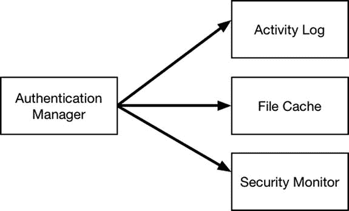
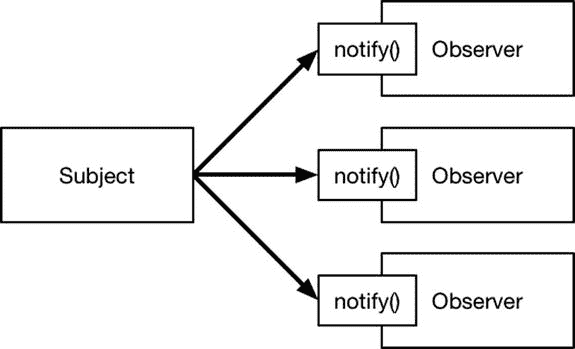
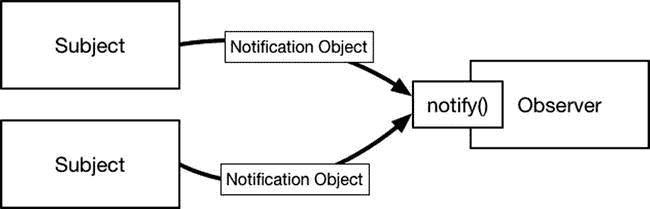

# 22. 观察者模式

观察者模式用于管理一个对象对另一个对象的变化表示兴趣并接收通知的过程。观察者模式允许庞大而复杂的对象组彼此协作，且它们之间的依赖关系很少，并且应用如此广泛，以至于如果你曾使用现代 UI 组件框架开发过应用程序，很可能已经遇到过它。表 22-1 将观察者模式置于上下文中。

**表 22-1.** 将观察者模式置于上下文

| 问题 | 答案 |
|----------|--------|
| 它是什么？ | 观察者模式允许一个对象注册以接收关于另一个对象变化的通知，而无需依赖于该对象的实现。 |
| 有什么好处？ | 该模式通过允许提供通知的对象以统一方式执行此操作而简化了应用程序设计，无需了解接收方如何处理和执行这些通知。 |
| 何时应使用此模式？ | 每当一个对象需要接收关于另一个对象变化的通知，但通知的发送方不依赖于接收方来完成其工作时，使用此模式。 |
| 何时应避免使用此模式？ | 除非通知的发送方在功能上独立于接收方，使得接收方可以从应用程序中移除而不妨碍发送方执行其工作，否则不要使用此模式。 |
| 如何判断是否正确实现了该模式？ | 当一个对象可以接收通知而无需与发送通知的对象紧密耦合时，观察者模式就正确实现了。 |
| 是否有常见的陷阱？ | 该模式最大的陷阱是允许发送和接收通知的对象变得相互依赖。 |
| 是否有相关模式？ | 没有。 |


## 准备示例项目

本章我创建了一个名为 `Observer` 的 Xcode OS X 命令行工具项目。我在项目中添加了一个名为 `SystemComponents.swift` 的文件，并利用它定义了清单 22-1 中所示的类。

**清单 22-1. `SystemComponents.swift` 文件的内容**

```
class ActivityLog {
    func logActivity(activity:String) {
        println("Log: \(activity)");
    }
}

class FileCache {
    func loadFiles(user:String) {
        println("Load files for \(user)");
    }
}

class AttackMonitor {
    var monitorSuspiciousActivity: Bool = false {
        didSet {
            println("Monitoring for attack: \(monitorSuspiciousActivity)");
        }
    }
}
```

我定义的这三个类代表了通用的应用组件。为了演示模式，我无需详细实现这些组件，因此它们都向调试控制台写入消息以表明被调用。`ActivityLog` 代表一个日志系统，用于接收系统事件的详细信息；`FileCache` 类代表一个缓存，用于加载属于特定用户的文件；`AttackMonitor` 类则代表一个安全服务，用于在发生可疑事件时监控系统行为。清单 22-2 显示了 `Authentication.swift` 文件的内容，我在此文件中定义了一个使用这些系统组件的类。

**清单 22-2. `Authentication.swift` 文件的内容**

```
class AuthenticationManager {
    private let log = ActivityLog();
    private let cache = FileCache();
    private let monitor = AttackMonitor();

    func authenticate(user:String, pass:String) -> Bool {
        var result = false;
        if (user == "bob" && pass == "secret") {
            result = true;
            println("User \(user) is authenticated");
            // 调用系统组件
            log.logActivity("Authenticated \(user)");
            cache.loadFiles(user);
            monitor.monitorSuspiciousActivity = false;
        } else {
            println("Failed authentication attempt");
            // 调用系统组件
            log.logActivity("Failed authentication: \(user)");
            monitor.monitorSuspiciousActivity = true;
        }
        return result;
    }
}
```

`AuthenticationManager` 类代表一个通过密码进行用户认证的服务。用户的凭据由调用组件传递给 `authenticate` 方法，该方法会认证用户并向调试控制台写入消息。为简化示例，`AuthenticationManager` 类只允许一个用户名/密码组合：用户名为 `bob`，密码为 `secret`。清单 22-3 显示了我添加到 `main.swift` 文件中用于使用 `AuthenticationManager` 类的代码。

**清单 22-3. `main.swift` 文件的内容**

```
let authM = AuthenticationManager();
authM.authenticate("bob", pass: "secret");
println("-----");
authM.authenticate("joe", pass: "shhh");
```

`AuthenticationManager` 类的 `authenticate` 方法会检查凭据并认证用户。认证过程完成后，会调用各个组件类来为用户设置系统环境：记录日志消息、加载用户文件以及禁用安全监视器。 `main.swift` 文件中的代码两次调用了 `authenticate` 方法：一次使用可认证通过的凭据，另一次使用会导致认证失败的凭据。运行该应用会产生以下结果：

```
User bob is authenticated
Log: Authenticated bob
Load files for bob
Monitoring for attack: false
-----
Failed authentication attempt
Log: Failed authentication: joe
Monitoring for attack: true
```

## 理解模式要解决的问题

示例应用中代码的结构在实际项目中很常见。某事件发生，继而触发一系列后续操作。在示例中，起始事件是用户认证请求，后续操作是记录日志、加载文件和配置监控服务，如图 22-1 所示。



**图 22-1. 初始事件及其后续操作**

问题在于，处理初始活动（本例中的 `AuthenticationManager` 类）的类必须详细了解所需的后续操作、负责这些操作的类以及这些操作是如何执行的。系统组件中的任何一个发生变更，都需要修改认证管理器类，这就带来了本书一直在提及的维护和测试问题。更广泛地说，认证管理器类中的代码超越了认证本身的范畴，涉足了完全不同的活动，这使得该类变得比实际需要更复杂，也更难以修改。

## 理解观察者模式

观察者模式通过将对象划分为主题和观察者来改变它们之间的关系。主题对象维护着依赖对象（即观察者）的集合，并在发生重要变更或动作时通知它们。在示例应用中，主题将是认证管理器类，观察者则是系统组件类。

在没有观察者模式的情况下，像 `AuthenticationManager` 这样的类必须知道当认证请求成功或失败时需要调用哪些系统组件、应对每个组件应用哪些变更，以及这些变更应如何执行。

观察者模式重塑了这种模型，使得主题仅通知其观察者初始事件已发生——即一个认证请求被做出——而将如何响应交由观察者自行决定。主题无需知道观察者对象做了什么或如何做——只需知道它们希望被告知重要事件即可。

观察者模式标准化了观察者接收通知的方式，因此无需了解单个观察者的任何细节。每个主题只知道有观察者希望接收通知，并且仅负责将通知发送给所有观察者都实现的、定义良好的方法（通常命名为 `notify`）。图 22-2 展示了观察者模式，尽管该模式的影响最好通过具体实现来观察。



**图 22-2. 观察者模式**


## 实现观察者模式

实现观察者模式的关键在于使用协议（protocols）来定义主体（subjects）与观察者（observers）之间的交互。清单 22-4 展示了我在一个名为`Observer.swift`的新文件中定义的协议。

清单 22-4. `Observer.swift`文件的内容

```
protocol Observer : class {
    func notify(user:String, success:Bool);
}

protocol Subject {
    func addObservers(observers:Observer...);
    func removeObserver(observer:Observer);
}
```

协议的名称反映了遵循它们的类在观察者模式中所扮演的角色。遵循`Observer`协议的类通过实现`notify`方法来接收来自遵循`Subject`协议的类的通知。在观察者模式中，主体负责跟踪其观察者，因此我定义了`addObservers`和`removeObserver`方法，允许观察者注册和注销接收主体通知的意向。请注意，`addObservers`方法可以接受多个`Observer`对象。这使得设置`Subject`对象更加容易，你将在“消费该模式”部分看到这一点。

**提示：** 请注意，在定义`Observer`协议时，我使用了`class`关键字。这使得我在遵循`Subject`协议的类中管理观察者时，能够比较实现了该协议的对象，如清单 22-5 所示。

### 创建基础主体类

在观察者模式中，主体负责跟踪其观察者。为了避免重复编写创建和管理观察者集合的代码，我创建了一个基础类，该类负责管理观察者，并提供一种方法供具体的主体实现类发送通知。由于 Swift 集合并非线程安全，且观察者集合存在被并发访问的可能性，我使用 Grand Central Dispatch（GCD）来保护观察者集合，如清单 22-5 所示。

清单 22-5. 在`Observer.swift`文件中定义基础主体类

```
import Foundation;

protocol Observer : class {
    func notify(user:String, success:Bool);
}

protocol Subject {
    func addObservers(observers:Observer...);
    func removeObserver(observer:Observer);
}

class SubjectBase : Subject {
    private var observers = [Observer]();
    private var collectionQueue = dispatch_queue_create("colQ",
        DISPATCH_QUEUE_CONCURRENT);
    
    func addObservers(observers: Observer...) {
        dispatch_barrier_sync(self.collectionQueue, { () in
            for newOb in observers {
                self.observers.append(newOb);
            }
        });
    }
    
    func removeObserver(observer: Observer) {
        dispatch_barrier_sync(self.collectionQueue, { () in
            self.observers = filter(self.observers, {$0 !== observer});
        });
    }
    
    func sendNotification(user:String, success:Bool) {
        dispatch_sync(self.collectionQueue, { () in
            for ob in self.observers {
                ob.notify(user, success: success);
            }
        });
    }
}
```

### 遵循 Subject 协议

下一步是更新`AuthenticationManager`类，使其遵循`Subject`协议，并移除对执行后续操作的系统组件类的直接引用。清单 22-6 展示了我的修改，这些修改依赖于上一节定义的`SubjectBase`类。

清单 22-6. 在`Authentication.swift`文件中应用该模式

```
class AuthenticationManager : SubjectBase {
    func authenticate(user:String, pass:String) -> Bool {
        var result = false;
        if (user == "bob" && pass == "secret") {
            result = true;
            println("User \(user) is authenticated");
        } else {
            println("Failed authentication attempt");
        }
        sendNotification(user, success: result);
        return result;
    }
}
```

其作用是简化类并使其专注于用户身份验证。对各个组件类的引用已被替换为对`sendNotification`方法的单一调用，该方法进而调用通过`SubjectBase`类提供的`addObservers`方法注册的每个`Observer`对象所定义的`notify`方法。

### 遵循 Observer 协议

下一步是更新各个组件类，使其遵循`Observer`协议，从而能够接收来自`Subject`的通知。清单 22-7 展示了我所做的修改。

清单 22-7. 在`SystemComponents.swift`文件中遵循 Observer 协议

```
class ActivityLog : Observer {
    func notify(user: String, success: Bool) {
        println("Auth request for \(user). Success: \(success)");
    }
    
    func logActivity(activity:String) {
        println("Log: \(activity)");
    }
}

class FileCache : Observer {
    func notify(user: String, success: Bool) {
        if (success) {
            loadFiles(user);
        }
    }
    
    func loadFiles(user:String) {
        println("Load files for \(user)");
    }
}

class AttackMonitor : Observer {
    func notify(user: String, success: Bool) {
        monitorSuspiciousActivity = !success;
    }
    
    var monitorSuspiciousActivity: Bool = false {
        didSet {
            println("Monitoring for attack: \(monitorSuspiciousActivity)");
        }
    }
}
```

这些新增内容使每个类负责自己对身份验证请求成功或失败的响应，从而打破了与身份验证管理器的紧密耦合。

### 消费该模式

剩下的工作是更新`main.swift`文件中的代码，以创建观察者并将它们注册到主体，如清单 22-8 所示。

清单 22-8. 在`main.swift`文件中消费观察者模式

```
let log = ActivityLog();
let cache = FileCache();
let monitor = AttackMonitor();

let authM = AuthenticationManager();

authM.addObservers(log, cache, monitor);
authM.authenticate("bob", pass: "secret");
println("-----");
authM.authenticate("joe", pass: "shhh");
```

我创建了各个观察者的实例，并将它们传递给`AuthenticationManager`类的`addObservers`方法。`AuthenticationManager`类仅通过`Observer`协议及其定义的`notify`方法来处理观察者，并不了解各个具体类及其在`notify`方法被调用时的行为。运行该应用程序将产生以下结果：

```
User bob is authenticated
Auth request for bob. Success: true
Load files for bob
Monitoring for attack: false
-----
Failed authentication attempt
Auth request for joe. Success: false
Monitoring for attack: true
```

使用`Observer`协议使得扩展应用程序变得很容易，而无需修改主体；只需将新的`Observer`对象传递给主体的`addObservers`方法即可。

## 观察者模式的变体

观察者模式有许多有用的变体，我将在以下章节中逐一描述。


### 通用化通知

我在上一节创建的标准模式实现专门用于处理身份验证请求。这一点可以通过 `Observer` 协议中定义的 `notify` 方法的签名看出来。

```
func notify(user:String, success:Bool);
```

`notify` 方法只能用于处理身份验证请求的通知，这在同一应用程序中存在多个主题时可能成为问题，因为每个主题最终会定义自己版本的 `Observer` 协议和 `notify` 方法。

一种常见的变体是通用化 `Observer` 协议，使其能够接收更广泛的通知，每个通知可能来自不同的主题。最稳健的方法是定义一个表示通知的类，并封装通知类型及任何相关数据的详细信息，如图 22-3 所示。



**图 22-3.** 观察者接收来自多个主题的通知对象

清单 22-9 展示了如何向示例应用程序中添加对通知对象的支持。

**清单 22-9.** 在 `Observer.swift` 文件中添加通知对象

```
import Foundation;

enum NotificationTypes : String {
    case AUTH_SUCCESS = "AUTH_SUCCESS";
    case AUTH_FAIL = "AUTH_FAIL";
}

struct Notification {
    let type:NotificationTypes;
    let data:Any?;
}

protocol Observer : class {
    func notify(notification:Notification);
}

protocol Subject {
    func addObservers(observers:Observer...);
    func removeObserver(observer:Observer);
}

class SubjectBase : Subject {
    private var observers = [Observer]();
    private var collectionQueue = dispatch_queue_create("colQ", DISPATCH_QUEUE_CONCURRENT);

    func addObservers(observers: Observer...) {
        dispatch_barrier_sync(self.collectionQueue, { () in
            for newOb in observers {
                self.observers.append(newOb);
            }
        });
    }

    func removeObserver(observer: Observer) {
        dispatch_barrier_sync(self.collectionQueue, { () in
            self.observers = filter(self.observers, {$0 !== observer});
        });
    }

    func sendNotification(notification:Notification) {
        dispatch_sync(self.collectionQueue, { () in
            for ob in self.observers {
                ob.notify(notification);
            }
        });
    }
}
```

我定义了一个名为 `Notification` 的结构体，它通过 `NotificationTypes` 枚举中的值来指明其类型，并通过一个名为 `data` 的可选常量向观察者提供处理通知所需的数据。我更新了 `Observer` 协议，使 `notify` 方法接收一个 `Notification` 对象，并更新了 `SubjectBase` 类中的 `sendNotification` 方法，使其也接收一个 `Notification` 对象。清单 22-10 展示了如何更新观察者类，使其符合修改后的协议。

> **提示：** 在应用程序中，你无需必须使用枚举来详细描述通知类型。另一种选择是使用 `String` 来提供通知的名称。我通常从枚举开始，因为它能减少在观察者中错误输入通知名称的可能性，从而避免导致意外的响应。对于较大的项目，我通常会改用字符串值，因为使用单一的枚举来定义所有通知可能会变得难以管理，尤其是在多个开发人员在同一个项目中定义不同通知的情况下。

**清单 22-10.** 在 `SystemComponents.swift` 文件中符合修订后的观察者协议

```
class ActivityLog : Observer {
    func notify(notification:Notification) {
        println("Auth request for \(notification.type.rawValue) " + "Success: \(notification.data!)");
    }

    func logActivity(activity:String) {
        println("Log: \(activity)");
    }
}

class FileCache : Observer {
    func notify(notification:Notification) {
        if (notification.type == NotificationTypes.AUTH_SUCCESS) {
            loadFiles(notification.data! as String);
        }
    }

    func loadFiles(user:String) {
        println("Load files for \(user)");
    }
}

class AttackMonitor : Observer {
    func notify(notification: Notification) {
        monitorSuspiciousActivity = (notification.type == NotificationTypes.AUTH_FAIL);
    }

    var monitorSuspiciousActivity: Bool = false {
        didSet {
            println("Monitoring for attack: \(monitorSuspiciousActivity)");
        }
    }
}
```

最后，我修改了主题类，使其使用 `Notification` 结构体，如清单 22-11 所示。

**清单 22-11.** 在 `AuthenticationManager.swift` 文件中使用通知对象

```
class AuthenticationManager : SubjectBase {
    func authenticate(user:String, pass:String) -> Bool {
        var nType = NotificationTypes.AUTH_FAIL;
        if (user == "bob" && pass == "secret") {
            nType = NotificationTypes.AUTH_SUCCESS;
            println("User \(user) is authenticated");
        } else {
            println("Failed authentication attempt");
        }
        sendNotification(Notification(type: nType, data: user));
        return nType == NotificationTypes.AUTH_SUCCESS;
    }
}
```

运行示例应用程序将产生以下输出：

```
User bob is authenticated
Auth request for AUTH_SUCCESS Success: bob
Load files for bob
Monitoring for attack: false
-----
Failed authentication attempt
Auth request for AUTH_FAIL Success: joe
Monitoring for attack: true
```


### 理解通知对象陷阱

这些改动似乎不大，但在应用这种变体时存在一个潜在陷阱。观察者必须知道与通知关联的数据类型，而主体必须遵守这一约定。

以示例应用为例，主体——`AuthenticationManager`类——会发送以`String`值形式表示的、已请求认证的用户名，而观察者必须知道主体使用的类型，以及（同样重要的是）该值的含义。当两个主体使用相同的通知类型但附带不同的数据类型，或者更危险的情况——使用相同的数据类型但意图表达不同的含义时，陷阱就出现了。

避免此问题最可靠的方法是为每个通知定义子类，以明确相关数据值的含义。这并不能保证故意滥用的情况不会发生，但确实能防范意外问题。清单 22-12 展示了我在示例应用中如何定义一个通知子类。

**清单 22-12.** 在`Observers.swift`文件中定义通知子类

```
import Foundation;

enum NotificationTypes : String {
  case AUTH_SUCCESS = "AUTH_SUCCESS";
  case AUTH_FAIL = "AUTH_FAIL";
  case SUBJECT_CREATED = "SUBJECT_CREATE";
  case SUBJECT_DESTROYED = "SUBJECT_DESTROYED";
}

class Notification {
  let type:NotificationTypes;
  let data:Any?;
  init(type:NotificationTypes, data:Any?) {
    self.type = type; self.data = data;
  }
}

class AuthenticationNotification: Notification {
  init(user:String, success:Bool) {
    super.init(type: success ? NotificationTypes.AUTH_SUCCESS
      : NotificationTypes.AUTH_FAIL, data: user);
  }
  var userName : String? {
    return self.data? as String?;
  }
  var requestSuccessed : Bool {
    return self.type == NotificationTypes.AUTH_SUCCESS;
  }
}

protocol Observer : class {
  func notify(notification:Notification);
}

protocol Subject {
  func addObservers(observers:Observer...);
  func removeObserver(observer:Observer);
}

class SubjectBase : Subject {
  // ...为简洁起见，省略语句...
}
```

我将`Notification`从`struct`改为`class`，以便从中派生出`AuthenticationNotification`类，并定义计算属性，以更有用的形式呈现属性值。

你可以创建`Observer`协议更专门的版本，使其仅传递特定于通知的对象，但我发现，接收来自多个主体的多种通知类型的实现类会很快变得复杂，难以实现和测试。相反，我更倾向于使用通用型的`Observer`协议，让实现类自行检测接收到的类型，如清单 22-13 所示。

**清单 22-13.** 在`SystemComponents.swift`文件中接收特定于通知的对象

```
...
class FileCache : Observer {
  func notify(notification:Notification) {
    if let authNotification = notification as? AuthenticationNotification {
      if (authNotification.requestSuccessed && authNotification.userName != nil) {
        loadFiles(authNotification.userName!);
      }
    }
  }
  func loadFiles(user:String) {
    println("Load files for \(user)");
  }
}
...
```

这种方法意味着任何观察者仍然可以通过单一方法接收任何通知，但同时可以选择检查更专门化的类型，并在需要时加以利用。`SystemComponents.swift`文件中的其他两个类不会检查`AuthenticationNotification`类型，但它们仍然能够完美地接收和处理认证管理器类发送的通知。

### 处理短生命周期主体

观察者模式的标准实现假设应用达到某种稳定状态，即观察者和主体对象已创建并相互关联，从而允许在应用生命周期内稳定地发送通知。

当然，情况并非总是如此。一种常见的变体是调整该模式，使得观察者能够自动从生命周期相对较短的主体接收通知。在这种情况下，安排观察者在新的主体被创建时收到通知会很有帮助。我处理这种情况的方式是将观察者模式与我在第 21 章中描述的调解员模式结合起来。调解员提供了一种便捷的机制，主体可以通过该机制通知观察者它们已被创建——这是一种元观察者模式。第一步是定义两种新的通知类型，我将用它们来指示主体何时被创建和销毁，如清单 22-15 所示。

**清单 22-15.** 在`Observer.swift`文件中定义新的通知类型

```
...
enum NotificationTypes : String {
  case AUTH_SUCCESS = "AUTH_SUCCESS";
  case AUTH_FAIL = "AUTH_FAIL";
  case SUBJECT_CREATED = "SUBJECT_CREATE";
  case SUBJECT_DESTROYED = "SUBJECT_DESTROYED";
}
...
```

清单 22-16 显示了我添加到示例项目中的`MetaObserver.swift`文件的内容，我使用该文件来定义自动处理短生命周期主体所需的协议和类。

**清单 22-16.** `MetaObserver.swift`文件的内容

```
protocol MetaObserver : Observer {
  func notifySubjectCreated(subject:Subject);
  func notifySubjectDestroyed(subject:Subject);
}

class MetaSubject : SubjectBase, MetaObserver {
  func notifySubjectCreated(subject: Subject) {
    sendNotification(Notification(type: NotificationTypes.SUBJECT_CREATED,
      data: subject));
  }
  func notifySubjectDestroyed(subject: Subject) {
    sendNotification(Notification(type: NotificationTypes.SUBJECT_DESTROYED,
      data: subject));
  }
  class var sharedInstance:MetaSubject {
    struct singletonWrapper {
      static let singleton = MetaSubject();
    }
    return singletonWrapper.singleton;
  }
  func notify(notification:Notification) {
    // 不做任何操作 - 为满足 Observer 协议要求
  }
}

class ShortLivedSubject : SubjectBase {
  override init() {
    super.init();
    MetaSubject.sharedInstance.notifySubjectCreated(self);
  }
  deinit {
    MetaSubject.sharedInstance.notifySubjectDestroyed(self);
  }
}
```

这种变体的核心是`MetaObserver`协议，它扩展了`Observer`并添加了在新的短生命周期主体被创建和销毁时会被调用的方法。我需要一个机制来跟踪元观察者并向它们分发通知，因此我以`MetaSubject`类的形式创建了调解员。该类派生自`SubjectBase`（因此继承了线程安全的观察者跟踪功能），并遵循`MetaObserver`协议（以便单个主体可以宣布其创建和销毁）。最后添加的是`ShortLivedSubject`类，它派生自`SubjectBase`，并实现了初始化和反初始化方法，这些方法会调用`MetaSubject`类的方法。清单 22-17 展示了我如何更新`AuthenticationManager`类，使其参与到新的功能中。

**清单 22-17.** 在`Authentication.swift`文件中创建一个短生命周期主体

```
class AuthenticationManager : ShortLivedSubject {
  func authenticate(user:String, pass:String) -> Bool {
    var nType = NotificationTypes.AUTH_FAIL;
    if (user == "bob" && pass == "secret") {
      nType = NotificationTypes.AUTH_SUCCESS;
      println("User \(user) is authenticated");
    } else {
      println("Failed authentication attempt");
    }
    sendNotification(Notification(type: nType, data: user));
    return nType == NotificationTypes.AUTH_SUCCESS;
  }
}
```


### 我只需要修改基类，因为所需的所有行为都已继承。清单 22-18 展示了我将一个观察者类转变为元观察者所做的修改。

**清单 22-18.** 在`SystemComponents.swift`文件中创建元观察者

```
...
class AttackMonitor : MetaObserver {
    func notifySubjectCreated(subject: Subject) {
        if (subject is AuthenticationManager) {
            subject.addObservers(self);
        }
    }
    func notifySubjectDestroyed(subject: Subject) {
        subject.removeObserver(self);
    }
    func notify(notification: Notification) {
        monitorSuspiciousActivity
            = (notification.type == NotificationTypes.AUTH_FAIL);
    }
    var monitorSuspiciousActivity: Bool = false {
        didSet {
            println("监控攻击行为：\(monitorSuspiciousActivity)");
        }
    }
}
...
```

`notifySubjectCreated`方法的实现会检查新创建主题的类型，并仅针对`AuthenticationManager`类的实例注册通知。最后一步是修改`main.swift`文件中观察者的创建和应用方式，如清单 22-19 所示。

**清单 22-19.** 在`main.swift`文件中使用元观察者

```
// 创建元观察者
let monitor = AttackMonitor();
MetaSubject.sharedInstance.addObservers(monitor);

// 创建常规观察者
let log = ActivityLog();
let cache = FileCache();
let authM = AuthenticationManager();

// 仅注册常规观察者
authM.addObservers(cache, monitor);
authM.authenticate("bob", pass: "secret");
println("-----");
authM.authenticate("joe", pass: "shhh");
```

`AttackMonitor`对象被注册为`MetaSubject`类的元观察者。这确保了当主题对象被创建时，`AttackMonitor`对象会收到通知，并可以选择注册通知。运行应用程序会产生以下输出，表明元观察者确实收到了来自主题的通知：

```
监控攻击行为：false
用户 bob 已验证通过
监控攻击行为：false
-----
认证尝试失败
监控攻击行为：true
```

## 理解观察者模式的陷阱

观察者模式的标准实现没有严重的陷阱，只要确保观察者仅通过`notify`方法接收通知，并且主题不会试图将观察者强制转换为其实现类型即可。

在创建观察者模式的变体时，应确保不忽视主题与观察者之间的职责划分；很容易创建一种模糊主题与观察者界限的实现，从而削弱该模式的简洁性和直接性。

## Cocoa 框架中的观察者模式示例

Cocoa 框架中有几个观察者模式的示例。在第 21 章中，我将`NSNotificationCenter`类描述为中介者协议的一个示例，但该类同样实现了观察者模式。这与我在本章前面处理短暂生命周期主题时使用的组合相同。实际上，您可以使用`NSNotificationCenter`来通知元观察者主题已被创建或销毁。在本章后面，我将使用`NSNotificationCenter`将中介者和命令模式应用于 SportsStore 应用程序。

### 用户界面事件

大多数程序员遇到的 Cocoa 观察者模式实现是在 UI 框架中，其中用户交互和 UI 组件状态的变化通过事件（即通知的另一种称呼）来表达。在 Cocoa 框架内，针对不同类别的事件有不同的协议，每个协议都有其对应的`notify`方法——即我在本章"实现观察者模式"部分中定义在`Observer`协议中的方法。例如，以下是我添加到 SportsStore 应用程序中的方法，用于响应用户摇晃 iOS 设备执行撤销操作：

```
...
override func motionEnded(motion: UIEventSubtype, withEvent event: UIEvent) {
    if (event.subtype == UIEventSubtype.MotionShake) {
        println("检测到摇晃动作");
        undoManager?.undo();
    }
}
...
```

`motionEnded`方法由`UIResponder`协议定义，`ViewController`类通过其基类遵循该协议。`UIResponder`协议并非通过单一的`notify`方法发送所有 UI 通知，而是为每种主要类型的用户交互定义了相应的方法，并使用`UIEventSubtype`枚举来指示已执行的具体动作。在所有使用 UI 组件的应用程序中，您都会遇到事件，但通常您只需实现观察者部分，并将组件作为主题。

### 观察属性变化

Objective-C 有一个名为键值观察（KVO）的特性，允许一个对象在另一个对象的属性值发生变化时接收通知。只要两个对象都派生自`NSObject`，并且使用`dynamic`关键字定义被观察的属性，就可以在 Swift 对象之间使用 KVO 进行通信。

为了演示如何在 Swift 中使用 KVO，我创建了一个名为 KVO 的新 Xcode 命令行工具项目，并使用`main.swift`文件定义了清单 22-20 所示的代码。

**清单 22-20.** 在`main.swift`文件中使用 KVO

```
import Foundation;

class Subject : NSObject {
    dynamic var counter = 0;
}

class Observer : NSObject {
    init(subject:Subject) {
        super.init();
        subject.addObserver(self, forKeyPath: "counter",
            options: NSKeyValueObservingOptions.New, context: nil);
    }
    override func observeValueForKeyPath(keyPath: String, ofObject object: AnyObject,
        change: [NSObject : AnyObject], context: UnsafeMutablePointer<Void>) {
        println("通知：\(keyPath) = \(change[NSKeyValueChangeNewKey]!)");
    }
}

let subject = Subject();
let observer = Observer(subject: subject);
subject.counter++;
subject.counter = 22;
```

**提示：** 我必须为此简单示例使用 Xcode 项目，因为 Playground 的限制会导致 KVO 无法正常工作。

`Subject`类使用`dynamic`关键字定义了一个名为`counter`的变量。这是我打算使用 KVO 观察的属性，`dynamic`关键字可防止编译器对该属性的实现进行优化，从而使 KVO 特性能够在运行时将其替换为等效的计算属性，以便在属性变化时通知其观察者。

`Observer`类使用`addObserver`方法注册其对属性的兴趣，如下所示：

```
...
subject.addObserver(self, forKeyPath: "counter",
    options: NSKeyValueObservingOptions.New, context: nil);
...
```

`addObserver`方法的参数指定了观察者、要观察的属性，以及来自`NSKeyValueObservingOptions`枚举的一个值，该值指定属性变化时应包含在通知中的值。我指定了`New`值，表示应使用分配给主题属性的值。

通知被发送到观察者的`observeValueForKeyPath`方法，包含主题、发生变化的属性以及新值的详细信息。在本例中，我输出了属性名称及其值。运行示例会在 Xcode 控制台中产生以下输出：

```
通知：counter = 1
通知：counter = 22
```

## 将模式应用于 SportsStore 应用程序

在本章中，我打算使用`NSNotificationCenter`类将中介者模式和命令模式应用于 SportsStore 应用程序。


### 准备示例应用

SportsStore 应用无需额外准备，我将直接从第 20 章结束时的项目状态继续开发。如果你不想手动输入所有修改，别忘了可以从 [`Apress.com`](https://Apress.com) 获取本书配套的免费源代码下载，其中包含了 SportsStore 项目。

### 应用观察者模式

我将把观察者模式应用于产品类，使其充当主体，在库存水平发生变化时发送通知。我将使用 `NSNotificationCenter` 类来处理通知并扮演中介角色，而不是自定义协议和类，这样主体和观察者就能相互找到对方。清单 22-21 展示了我对 `Product` 类所做的修改，使其能够发送通知。

**清单 22-21.** 在 `Product.swift` 文件中发送通知

```
...
var stockLevel:Int {
    get { return stockLevelBackingValue;}
    set {
        stockLevelBackingValue = max(0, newValue);
        NSNotificationCenter.defaultCenter().postNotificationName("stockUpdate",
            object: self);
    }
}
...
```

使用 `NSNotificationCenter` 类的优点在于，可以以最小的代价向应用添加通知，但仍需注意确保应用中不同部分发送的通知不会相互冲突。现在 `Product` 类正在发送通知，我可以在任何关注库存水平信息的地方观察这些通知。清单 22-22 展示了我如何修改 `ProductTableCell` 类，使其能够响应库存水平通知并更新其 UI 组件。

**清单 22-22.** 在 `ViewController.swift` 文件中响应通知

```
...
class ProductTableCell : UITableViewCell {
    @IBOutlet weak var nameLabel: UILabel!
    @IBOutlet weak var descriptionLabel: UILabel!
    @IBOutlet weak var stockStepper: UIStepper!
    @IBOutlet weak var stockField: UITextField!
    var product:Product?;
    required init(coder aDecoder: NSCoder) {
        super.init(coder: aDecoder);
        NSNotificationCenter.defaultCenter().addObserver(self,
            selector: "handleStockLevelUpdate:", name: "stockUpdate", object: nil);
    }
    func handleStockLevelUpdate(notification:NSNotification) {
        if let updatedProduct = notification.object as? Product {
            if updatedProduct.name == self.product?.name {
                stockStepper.value = Double(updatedProduct.stockLevel);
                stockField.text = String(updatedProduct.stockLevel);
            }
        }
    }
}
...
```

当正在显示的 `Product` 对应的通知到来时，`ProductTableCell` 类会设置 `UIStepper` 和 `UITextField` 组件的值。这意味着我可以从 `ViewController` 类的 `stockLevelDidChange` 方法中删除那些显式更改 UI 组件的语句，如清单 22-23 所示。

**清单 22-23.** 从 `ViewController.swift` 文件中删除语句

```
...
@IBAction func stockLevelDidChange(sender: AnyObject) {
    if var currentCell = sender as? UIView {
        while (true) {
            currentCell = currentCell.superview!;
            if let cell = currentCell as? ProductTableCell {
                if let product = cell.product? {
                    let dict = NSDictionary(objects: [product.stockLevel],
                        forKeys: [product.name]);
                    undoManager?.registerUndoWithTarget(self,
                        selector: "undoStockLevel:", object: dict);
                    if let stepper = sender as? UIStepper {
                        product.stockLevel = Int(stepper.value);
                    } else if let textfield = sender as? UITextField {
                        if let newValue = textfield.text.toInt()? {
                            product.stockLevel = newValue;
                        }
                    }
                    //                  cell.stockStepper.value = Double(product.stockLevel);
                    //                  cell.stockField.text = String(product.stockLevel);
                    productLogger.logItem(product);
                    StockServerFactory.getStockServer()
                        .setStockLevel(product.name,
                            stockLevel: product.stockLevel);
                }
                break;
            }
        }
    }
    displayStockTotal();
}
...
```

## 本章小结

在本章中，我描述了观察者模式，该模式用于标准化对象表达对其他对象变化的兴趣并接收相应通知的过程。观察者模式是一个强大的工具，因为它允许组件在保持松散耦合的同时相互协作，进而使得对这些组件进行测试和修改更加容易。在下一章中，我将介绍备忘录模式，该模式用于管理对象的状态。

