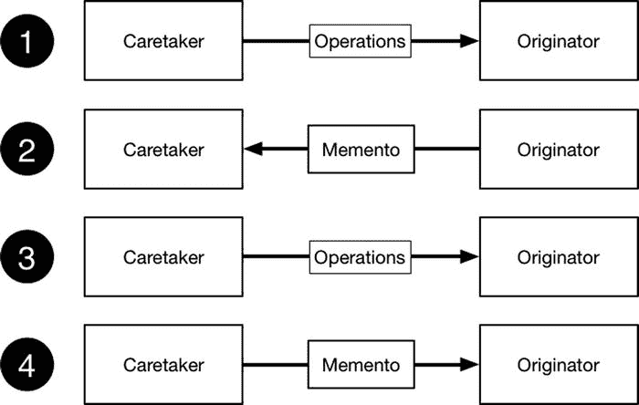

# 23. 备忘录模式

备忘录模式与我之前在第 20 章中描述的命令模式关系密切，其重要区别在于它用于捕获对象的完整状态，以便后续可以重置该状态。表 23-1 给出了备忘录模式的背景信息。

**表 23-1.** 将备忘录模式置于上下文中

| 问题 | 答案 |
| --- | --- |
| 它是什么？ | 备忘录模式将对象的完整状态捕获到备忘录中，该备忘录可用于稍后重置对象。 |
| 有什么好处？ | 备忘录模式允许完全重置对象，而无需跟踪和应用单个撤销命令。 |
| 何时应该使用此模式？ | 当对象生命周期中存在一个你可能希望在将来某个时刻返回的“已知良好”点时，使用此模式。 |
| 何时应避免使用此模式？ | 此模式仅在你需要将对象恢复到较早状态时使用。如第 20 章所述，如果你需要支持仅撤销最近一次操作的效果，请使用命令模式。 |
| 如何判断是否正确实现了该模式？ | 如果对象可以从任何起始位置恢复到较早状态，则说明模式实现正确。 |
| 是否有常见的陷阱？ | 最常见的陷阱是未能完全捕获或设置状态。 |
| 是否有相关模式？ | 备忘录模式和命令模式共享共同的理念。 |


## 准备示例项目

我为本章创建了一个名为 `Memento` 的 Xcode 命令行工具项目，并在其中添加了一个名为 `Ledger.swift` 的文件，其内容如代码清单 23-1 所示。

**代码清单 23-1.** `Ledger.swift` 文件的内容

```
class LedgerEntry {
    let id:Int;
    let counterParty:String;
    let amount:Float;
    init(id:Int, counterParty:String, amount:Float) {
        self.id = id; self.counterParty = counterParty; self.amount = amount;
    }
}

class LedgerCommand {
    private let instructions:Ledger -> Void;
    private let receiver:Ledger;
    init(instructions:Ledger -> Void, receiver:Ledger) {
        self.instructions = instructions; self.receiver = receiver;
    }
    func execute() {
        self.instructions(self.receiver);
    }
}

class Ledger {
    private var entries = [Int:LedgerEntry]();
    private var nextId = 1;
    var total:Float = 0;
    func addEntry(counterParty:String, amount:Float) -> LedgerCommand {
        let entry = LedgerEntry(id: nextId++, counterParty: counterParty, amount: amount);
        entries[entry.id] = entry;
        total += amount;
        return createUndoCommand(entry);
    }
    private func createUndoCommand(entry:LedgerEntry) -> LedgerCommand {
        return LedgerCommand(instructions: {target in
            let removed = target.entries.removeValueForKey(entry.id);
            if (removed != nil) {
                target.total -= removed!.amount;
            }
        }, receiver: self);
    }
    func printEntries() {
        for id in entries.keys.array.sorted(<) {
            if let entry = entries[id] {
                println("#\(id): \(entry.counterParty) $\(entry.amount)");
            }
        }
        println("Total: $\(total)");
        println("----");
    }
}
```

`Ledger` 类代表一种账本类型的账户记录，类似于银行用于记录交易的账本，尽管已被大幅度简化。`Ledger` 类定义了一个 `addEntry` 方法，该方法接受交易对手的详细信息和一个金额，并用它们创建一个 `LedgerEntry` 对象。每次调用 `addEntry` 方法时，都会构建一个 `LedgerEntry` 对象的字典，该字典由唯一 ID 索引。

`Ledger` 类提供对撤销操作的支持，使用的是我在第 20 章中描述的命令模式。调用 `addEntry` 方法会返回一个 `LedgerCommand` 对象，该对象的 `execute` 方法会定位并移除一个 `LedgerEntry` 对象。最后，`Ledger` 类定义了一个 `total` 属性，该属性在添加或撤销条目时更新。代码清单 23-2 显示了我添加到 `main.swift` 文件中以使用 `Ledger` 类的代码。

**代码清单 23-2.** `main.swift` 文件的内容

```
let ledger = Ledger();
ledger.addEntry("Bob", amount: 100.43);
ledger.addEntry("Joe", amount: 200.20);
let undoCommand = ledger.addEntry("Alice", amount: 500);
ledger.addEntry("Tony", amount: 20);
ledger.printEntries();
undoCommand.execute();
ledger.printEntries();
```

`main.swift` 文件中的语句创建了一个 `Ledger` 对象，并调用 `addEntry` 方法创建了四个条目。然后我打印出账本的内容，对四个条目中的一个执行撤销命令，并再次打印内容以观察效果。运行应用程序会产生以下输出：

```
#1: Bob $100.43
#2: Joe $200.2
#3: Alice $500.0
#4: Tony $20.0
Total: $820.63
----
#1: Bob $100.43
#2: Joe $200.2
#4: Tony $20.0
Total: $320.63
```

## 理解模式要解决的问题

在示例应用程序中，我使用命令模式为 `Ledger` 类实现了撤销功能，所用技术与我在第 20 章中描述的一致。我喜欢命令模式，因为它功能强大且灵活，但我应用该模式创建撤销功能的方式存在一个潜在缺陷，限制了它在某些应用程序中的适用性。

目前看来，我可以撤销单个操作。当我为交易对手是 `Alice` 的 `LedgerEntry` 执行撤销命令时，效果是逆转对 `addEntry` 方法的一次调用。然而，我很难做到的是将 `Ledger` 恢复到更早的状态，从而使我已撤销的条目以及所有后续条目都被移除。我已经移除了 `Alice` 条目，但这并没有移除 `Tony` 条目。

在某些应用程序中，仅撤销单个操作是不够的；你需要能够将对象的状态恢复到某个特定点，这一过程称为展开或回滚对象状态。这在交易数据（如账本）中很常见，为了确保应用程序及其数据的完整性，需要能够返回到一个检查点或快照。

一种方法是让调用组件跟踪它收到的所有撤销命令，并按照相反的顺序执行它们以撤销每个操作的效果，如代码清单 23-3 所示。

**代码清单 23-3.** 在 `main.swift` 文件中手动展开 `Ledger` 的状态

```
let ledger = Ledger();
ledger.addEntry("Bob", amount: 100.43);
ledger.addEntry("Joe", amount: 200.20);
let aliceUndoCommand = ledger.addEntry("Alice", amount: 500);
let tonyUndoCommand = ledger.addEntry("Tony", amount: 20);
ledger.printEntries();
tonyUndoCommand.execute();
aliceUndoCommand.execute();
ledger.printEntries();
```

这是一种混乱的方法，因为它依赖于一个组件能够访问所有撤销命令并知道它们应该被应用的顺序，这在多个组件操作同一个 `Ledger` 对象时很难实现。每个组件只会有部分撤销命令，而它们的应用顺序是未知的。

简而言之，尝试使用单个撤销命令来展开或重置对象的状态是有问题的；我需要一种更灵活的方法，不必将跟踪需要应用的更改以恢复到可信快照或检查点的责任全部压在调用组件身上。


## 理解备忘录模式

备忘录模式包含两个参与者：原发器和管理者。原发器是其状态可以被回滚的对象，例如示例应用中的 `Ledger`。管理者是负责通知原发器何时应回滚其状态的调用组件，在示例中对应 `main.swift` 文件中的代码。

原发器会向管理者提供一个备忘录，该备忘录是一个包含将原发器恢复到先前状态所需指令或数据的对象。备忘录的细节对管理者是隐藏的，管理者无法修改或操作其中包含的状态。在未来的某个时间点，管理者将备忘录返还给原发器，原发器利用其中的指令或数据来回滚其状态。图 23-1 展示了备忘录模式。



图 23-1. 备忘录模式

理解备忘录模式最简单的方法是关注支撑该模式的四个阶段，如图中编号所示。

在第一阶段，管理者对原发器执行常规操作，每次操作都会修改其状态。在第二阶段，管理者向原发器请求一个备忘录。创建备忘录对象不会改变原发器的状态；它只是捕捉当前状态，以便原发器将来能恢复到该状态。

在第三阶段，管理者对原发器执行进一步操作，这些操作会继续修改其状态。在第四阶段（即最后阶段），管理者将备忘录对象返还给原发器，原发器利用它将状态恢复到创建备忘录时的那个时间点。

通过将原发器状态的一个快照封装到对象中，备忘录模式避免了我在使用撤销命令回滚状态时遇到的问题。管理者无需追踪已执行的操作，也无需担心其他组件执行的操作；当它想要回滚状态时，只需将备忘录返还给原发器即可。

使用备忘录提供了极大的灵活性。备忘录对象可以被不同于原始管理者的其他组件使用，可以用于反复将状态恢复到同一时间点，还可以用于将一个对象的状态转移到另一个对象。

## 实现备忘录模式

备忘录模式的实现基于两个协议：一个用于原发器，一个用于备忘录。管理者不需要自己的协议，因为它只是一个利用原发器提供功能的调用组件。清单 23-4 展示了 `Memento.swift` 文件的内容，我已将其添加到示例项目中。

**清单 23-4. Memento.swift 文件的内容**

```
import Foundation

protocol Memento {

// 未定义任何方法或属性

}

protocol Originator {

func createMemento() -> Memento;

func applyMemento(memento:Memento);

}
```

`Memento` 协议未定义任何方法或属性，这是因为其所有实现细节都是私有的，意味着该协议的唯一目的就是表明某个对象是一个备忘录。

`Originator` 协议定义了一个 `createMemento()` 方法，用于生成当前状态的备忘录；以及一个 `applyMemento()` 方法，该方法接收一个备忘录并利用它将原发器恢复到该备忘录所定义的状态。

### 实现备忘录类

备忘录的实现细节完全由原发器决定，只要满足两个基本条件即可。第一个条件是管理者不得以任何方式修改备忘录中包含的状态。第二个条件是无论原发器当前状态如何，备忘录都应始终有效。

在实践中，这意味着原发器要么包含状态数据的静态快照，要么由一组操作组成，这些操作先重置状态，然后按顺序应用，这与我在第 20 章中描述的命令宏类似。清单 23-5 展示了我在示例项目中实现该模式的方式。（我还移除了撤销命令以保持示例简单，但命令模式和备忘录模式完全可以在一个应用中共存）。

**清单 23-5. 在 Ledger.swift 文件中创建备忘录和原发器**

```
import Foundation

class LedgerEntry {

let id:Int;

let counterParty:String;

let amount:Float;

init(id:Int, counterParty:String, amount:Float) {

self.id = id; self.counterParty = counterParty; self.amount = amount;

}

}

class LedgerMemento : Memento {

private let entries = [LedgerEntry]();

private let total:Float;

private let nextId:Int;

init(ledger:Ledger) {

self.entries = ledger.entries.values.array;

self.total = ledger.total;

self.nextId = ledger.nextId;

}

func apply(ledger:Ledger) {

ledger.total = self.total;

ledger.nextId = self.nextId;

ledger.entries.removeAll(keepCapacity: true);

for entry in self.entries {

ledger.entries[entry.id] = entry;

}

}

}

class Ledger : Originator {

private var entries = [Int:LedgerEntry]();

private var nextId = 1;

var total:Float = 0;

func addEntry(counterParty:String, amount:Float) {

let entry = LedgerEntry(id: nextId++, counterParty: counterParty, amount: amount);

entries[entry.id] = entry;

total += amount;

}

func createMemento() -> Memento {

return LedgerMemento(ledger: self);

}

func applyMemento(memento: Memento) {

if let m = memento as? LedgerMemento {

m.apply(self);

}

}

func printEntries() {

for id in entries.keys.array.sorted(<) {

if let entry = entries[id] {

println("#\(id): \(entry.counterParty) $\(entry.amount)");

}

}

println("Total: $\(total)");

println("----");

}

}
```

重要的是，备忘录必须设置或重新创建原发器状态的每个方面。在示例应用的情况下，这意味着我需要直接设置 `nextId` 和 `total` 属性，并填充分类账条目字典。

### 使用备忘录

最后一步是在 `main.swift` 文件中获取并使用备忘录，该文件在示例中扮演管理者的角色。清单 23-6 展示了我所做的更改。

**清单 23-6. 在 main.swift 文件中使用备忘录**

```
let ledger = Ledger();

ledger.addEntry("Bob", amount: 100.43);

ledger.addEntry("Joe", amount: 200.20);

let memento = ledger.createMemento();

ledger.addEntry("Alice", amount: 500);

ledger.addEntry("Tony", amount: 20);

ledger.printEntries();

ledger.applyMemento(memento);

ledger.printEntries();
```

备忘录将分类账恢复到其较早的状态。运行应用会产生以下输出：

```
#1: Bob $100.43

#2: Joe $200.2

#3: Alice $500.0

#4: Tony $20.0

Total: $820.63

----

#1: Bob $100.43

#2: Joe $200.2

Total: $300.63
```

效果与我使用命令模式创建单个撤销命令时相同，但实现更加健壮和灵活。


### 备忘录模式的变体

备忘录模式唯一的常见变体是表示发起者的状态，以便能够持久化存储。这使得备忘录数据可以发送到远程服务器或存储在数据库中，直到再次需要时使用。

你可以使用任何适合项目的的数据格式，但我倾向于使用 JSON，因为它已成为表示对象的事实标准，尤其是在 Web 服务中。Apple 通过 `NSJSONSerialization` 类提供了 JSON 支持，但将 Swift 对象与 JSON 相互转换的过程很繁琐。清单 23-7 展示了我对 `LedgerMemento` 类所做的修改，使其能够将状态数据表示为 JSON。

**清单 23-7.** 在 `Ledger.swift` 文件中将状态表示为 JSON

```
...

class LedgerMemento : Memento {
    let jsonData:String?;

    init(ledger:Ledger) {
        self.jsonData = stringify(ledger);
    }

    init(json:String?) {
        self.jsonData = json;
    }

    private func stringify(ledger:Ledger) -> String? {
        var dict = NSMutableDictionary();
        dict["total"] = ledger.total;
        dict["nextId"] = ledger.nextId;
        dict["entries"] = ledger.entries.values.array;
        var entryArray = [NSDictionary]();
        for entry in ledger.entries.values {
            var entryDict = NSMutableDictionary();
            entryArray.append(entryDict);
            entryDict["id"] = entry.id;
            entryDict["counterParty"] = entry.counterParty;
            entryDict["amount"] = entry.amount;
        }
        dict["entries"] = entryArray;
        if let jsonData = NSJSONSerialization.dataWithJSONObject(dict,
            options: nil, error: nil) {
            return NSString(data: jsonData, encoding: NSUTF8StringEncoding);
        }
        return nil;
    }

    func apply (ledger:Ledger) {
        if let data = jsonData?.dataUsingEncoding(NSUTF8StringEncoding,
            allowLossyConversion: false) {
            if let dict = NSJSONSerialization.JSONObjectWithData(data, options: nil,
                error: nil) as? NSDictionary {
                ledger.total = dict["total"] as Float;
                ledger.nextId = dict["nextId"] as Int;
                ledger.entries.removeAll(keepCapacity: true);
                if let entryDicts = dict["entries"] as? [NSDictionary] {
                    for dict in entryDicts {
                        let id = dict["id"] as Int;
                        let counterParty = dict["counterParty"] as String;
                        let amount = dict["amount"] as Float;
                        ledger.entries[id] = LedgerEntry(id: id,
                            counterParty: counterParty, amount: amount);
                    }
                }
            }
        }
    }
}

...
```

不幸的是，`NSJSONSerialization` 类仅能操作 Foundation 类型，这意味着我必须将 `Ledger` 对象的状态转换为一个包含每个数据项键值对的 `NSMutableDictionary`。我为 `total` 和 `nextId` 定义了键并直接赋值。为了表示分类账条目，我创建了一个 `NSMutableDictionary` 对象数组，每个对象都包含 `id`、`counterParty` 和 `amount` 属性的键值对。结果是一个如下所示的 JSON 字符串，我对其进行了格式化以便于阅读：

```
{ "total": 300.63,
  "nextId": 3,
  "entries": [
    { "id": 2, "counterParty": "Joe", "amount": 200.2 },
    { "id": 1,"counterParty": "Bob", "amount": 100.43}]
}
```

解析 JSON 字符串以重新创建 `Ledger` 对象状态的过程同样繁琐。字符串被转换为一个字典，然后对其进行处理以提取数据值。总的来说，这个过程困难且容易出错，但我期待 Swift 的 JSON 支持在未来的版本中有所改进，因为它作为一种数据格式已经变得如此普遍。清单 23-8 展示了我对 `main.swift` 文件所做的更改，以获取 JSON 数据并使用它来设置发起者对象的状态。

**清单 23-8.** 在 `main.swift` 文件中使用持久化备忘录

```
let ledger = Ledger();
ledger.addEntry("Bob", amount: 100.43);
ledger.addEntry("Joe", amount: 200.20);

let memento = ledger.createMemento() as LedgerMemento;
let newMemento = LedgerMemento(json: memento.jsonData);

ledger.applyMemento(newMemento);
ledger.printEntries();
```

我使用了两个 `LedgerMemento` 对象来演示如何将 JSON 字符串用作对象状态的持久化表示。运行示例应用程序将产生以下输出：

```
#1: Bob $100.43
#2: Joe $200.2
Total: $300.63
```

### 理解备忘录模式的陷阱

备忘录模式的大多数问题出现在实现不遵循我本章前面列出的两条规则时，即负责人能够更改备忘录存储的状态，或者备忘录未能正确设置发起者状态的每个方面。只要你牢记这两条规则，在实现备忘录模式时就不会遇到任何问题。

如果你使用 JSON 等数据格式来持久化存储备忘录，请仔细测试。如清单 23-7 所示，即使对于简单对象，生成和解析其持久化表示也可能很复杂，并会产生难以阅读的代码。


## Cocoa 中备忘录模式的示例

Cocoa 通过`NSCoding`协议提供了备忘录模式的实现。发起人对象遵循该协议，并与`NSCoder`对象协作，生成其状态的快照。`NSCoder`可被子类化以支持不同的数据格式，也可以使用内置的实现。代码清单 23-9 展示了如何修改`Ledger`类，使其遵循该协议。

**代码清单 23-9. 在 Ledger.swift 文件中遵循 NSCoding 协议**

```
import Foundation;

class LedgerEntry {
    let id:Int;
    let counterParty:String;
    let amount:Float;

    init(id:Int, counterParty:String, amount:Float) {
        self.id = id; self.counterParty = counterParty; self.amount = amount;
    }
}

class LedgerMemento : Memento {
    let data:NSData;
    init(data:NSData) { self.data = data;}
}

class Ledger : NSObject, Originator, NSCoding {
    private var entries = [Int:LedgerEntry]();
    private var nextId = 1;
    var total:Float = 0;

    override init() {
        // 不做任何操作 - 允许在无编码器的情况下创建实例
    }

    required init(coder aDecoder: NSCoder) {
        self.total = aDecoder.decodeFloatForKey("total");
        self.nextId = aDecoder.decodeIntegerForKey("nextId");
        self.entries.removeAll(keepCapacity: true);
        if let entryArray = aDecoder.decodeDataObject()
            as AnyObject? as? [NSDictionary] {
                for entryDict in entryArray {
                    let id = entryDict["id"] as Int;
                    let counterParty = entryDict["counterParty"] as String;
                    let amount = entryDict["amount"] as Float;
                    self.entries[id] = LedgerEntry(id: id, counterParty: counterParty,
                        amount: amount);
                }
        }
    }

    func encodeWithCoder(aCoder: NSCoder) {
        aCoder.encodeFloat(total, forKey: "total");
        aCoder.encodeInteger(nextId, forKey: "nextId");
        var entriesArray = [NSMutableDictionary]();
        for entry in self.entries.values {
            var dict = NSMutableDictionary();
            dict["id"] = entry.id;
            dict["counterParty"] = entry.counterParty;
            dict["amount"] = entry.amount;
            entriesArray.append(dict);
        }
        aCoder.encodeObject(entriesArray);
    }

    func createMemento() -> Memento {
        return LedgerMemento(data:
            NSKeyedArchiver.archivedDataWithRootObject(self));
    }

    func applyMemento(memento: Memento) {
        if let lmemento = memento as? LedgerMemento {
            if let obj = NSKeyedUnarchiver.unarchiveObjectWithData(lmemento.data)
                as? Ledger {
                    self.total = obj.total;
                    self.nextId = obj.nextId;
                    self.entries = obj.entries;
            }
        }
    }

    func addEntry(counterParty:String, amount:Float) {
        let entry = LedgerEntry(id: nextId++, counterParty: counterParty,
            amount: amount);
        entries[entry.id] = entry;
        total += amount;
    }

    func printEntries() {
        for id in entries.keys.array.sorted(<) {
            if let entry = entries[id] {
                println("#\(id): \(entry.counterParty) $\(entry.amount)");
            }
        }
        println("Total: $\(total)");
        println("----");
    }
}
```

注意

`NSCoding`协议并非苹果支持对象持久化的唯一方式。你还可以使用 Core Data 框架，该框架允许对象被持久化存储和操作。维基百科提供了关于 Core Data 的出色概述，参见[`http://en.wikipedia.org/wiki/Core_Data`](http://en.wikipedia.org/wiki/Core_Data)。

使用`NSCoding`协议意味着将发起人的状态编码为`NSData`对象，因此第一个改动是让`LedgerMemento`类成为`NSData`对象的封装器。我不想向负责人暴露发起人表示其状态的技术，最简单的方法是继续使用`Memento`协议。

一个遵循`NSCoding`协议的类必须继承自`NSObject`，后者提供了创建备忘录所需的一些特性。该协议定义了用于创建备忘录的`encodeWithEncoder`方法。与我本章前面使用的 JSON 序列化类似，我必须将发起人的内部状态表示为一组键值对，你可以看到方法实现中明显的相似之处，尽管单个对象是通过编码器的方法添加到备忘录中的。

在我定义的`Originator`协议的`createMemento`方法中，我选择了用于表示数据的编码器，如下所示：

```
...
func createMemento() -> Memento {
    return LedgerMemento(data: NSKeyedArchiver.archivedDataWithRootObject(self));
}
...
```

`NSKeyedArchiver`是苹果提供的内置编码器实现之一，调用其`archivedDataWithRootObject`方法会将发起人的状态编码到`NSData`对象中，我用`LedgerMemento`封装该对象并作为方法结果返回。

`NSCoding`协议指定了一个用于解码备忘录的必需初始化器。该初始化器从备忘录创建发起人类的新实例，而不是设置现有对象的状态，因此我必须在`applyMemento`方法中显式复制数据值，如下所示：

```
...
func applyMemento(memento: Memento) {
    if let lmemento = memento as? LedgerMemento {
        if let obj = NSKeyedUnarchiver.unarchiveObjectWithData(lmemento.data)
            as? Ledger {
                self.total = obj.total;
                self.nextId = obj.nextId;
                self.entries = obj.entries;
        }
    }
}
...
```

我调用`NSKeyedUnarchiver`类的`unarchiveObjectWithData`方法会触发该必需初始化器，该方法接受`NSData`备忘录进行解码，以便我能读取键值对并提取其中包含的状态数据。代码清单 23-10 展示了我在`main.swift`文件中为使用修改后的备忘录所做的改动。

**代码清单 23-10. 在 main.swift 文件中使用编码**

```
let ledger = Ledger();
ledger.addEntry("Bob", amount: 100.43);
ledger.addEntry("Joe", amount: 200.20);
let memento = ledger.createMemento();
ledger.applyMemento(memento);
ledger.printEntries();
```

运行示例应用程序会得到以下结果：

```
#1: Bob $100.43
#2: Joe $200.2
Total: $300.63
```

## 将模式应用于 SportsStore 应用

在本节中，我将结合命令模式和备忘录模式，用完全重置应用的功能替换我在第 20 章中添加的撤销功能。

大多数备忘录模式的实现都基于获取和恢复到多个快照，但这只是备忘录工作方式的一种解释。正如我所解释的，备忘录的工作方式完全取决于具体实现，它不必包含对象曾包含的数据值。它也可以触发其他类型的操作，包括丢弃用户所做的任何更改并重新加载原始数据。在本例中，备忘录将是一个命令，调用一个重置应用数据的方法。

### 准备示例应用

为应用该模式，我需要向`ProductDataStore`类添加一个方法，用于重置数据并丢弃用户所做的任何更改。代码清单 23-11 展示了我所做的添加。

**代码清单 23-11. 在 ProductDataStore.swift 文件中添加重置方法**

```
import Foundation

final class ProductDataStore {
    var callback:((Product) -> Void)?;
    private var networkQ:dispatch_queue_t
    private var uiQ:dispatch_queue_t;
    lazy var products:[Product] = self.loadData();

    init() {
        networkQ = dispatch_get_global_queue(DISPATCH_QUEUE_PRIORITY_BACKGROUND, 0);
        uiQ = dispatch_get_main_queue();
    }

    func resetState() {
        self.products = loadData();
    }

    // ...为简洁起见，省略方法和语句...
}
```


### 实现模式

为了支持重置应用功能，我只需定义一个方法，该方法会在设备被摇动时由 `NSUndoManager` 调用，进而执行我在代码清单 23-11 中定义的 `resetState` 方法。代码清单 23-12 展示了我在 `ViewController` 类中所做的更改。

**代码清单 23-12.** 在 ViewController.swift 文件中添加对重置应用的支持

```
...
class ViewController: UIViewController, UITableViewDataSource {
    @IBOutlet weak var totalStockLabel: UILabel!
    @IBOutlet weak var tableView: UITableView!
    let productStore = ProductDataStore();
    // ...为简洁起见省略了方法...
    @IBAction func stockLevelDidChange(sender: AnyObject) {
        if var currentCell = sender as? UIView {
            while (true) {
                currentCell = currentCell.superview!;
                if let cell = currentCell as? ProductTableCell {
                    if let product = cell.product? {
                        // let dict = NSDictionary(objects: [product.stockLevel],
                        //     forKeys: [product.name]);
                        undoManager?.registerUndoWithTarget(self,
                            selector: "resetState",
                            object: nil);
                        if let stepper = sender as? UIStepper {
                            product.stockLevel = Int(stepper.value);
                        } else if let textfield = sender as? UITextField {
                            if let newValue = textfield.text.toInt()? {
                                product.stockLevel = newValue;
                            }
                        }
                        // cell.stockStepper.value = Double(product.stockLevel);
                        // cell.stockField.text = String(product.stockLevel);
                        productLogger.logItem(product);
                        StockServerFactory.getStockServer()
                            .setStockLevel(product.name,
                                stockLevel: product.stockLevel);
                    }
                    break;
                }
            }
        }
        displayStockTotal();
    }

    func resetState() {
        self.productStore.resetState();
    }

    // func undoStockLevel(data:[String:Int]) {
    //     let productName = data.keys.first;
    //     if (productName != nil) {
    //         let stockLevel = data[productName!];
    //         if (stockLevel != nil) {
    //             for nproduct in productStore.products {
    //                 if nproduct.name == productName! {
    //                     nproduct.stockLevel = stockLevel!;
    //                 }
    //             }
    //             updateStockLevel(productName!, level: stockLevel!);
    //         }
    //     }
    // }

    func displayStockTotal() {
        let finalTotals:(Int, Double) = productStore.products.reduce((0, 0.0),
            {(totals, product) -> (Int, Double) in
                return (
                    totals.0 + product.stockLevel,
                    totals.1 + product.stockValue
                );
            });
        let formatted = StockTotalFacade.formatCurrencyAmount(finalTotals.1,
            currency: StockTotalFacade.Currency.EUR);
        totalStockLabel.text = "\(finalTotals.0) Products in Stock. "
            + "Total Value: \(formatted!)";
    }
}
...
```

我更改了撤销管理器回调的选择器，使其调用 `resetState` 方法，这样一来，摇动设备就会触发产品数据的重新加载，从而丢弃用户所做的任何更改。要测试这些更改，请启动应用并对库存级别进行一些修改。从 iOS 模拟器的 **Hardware** 菜单中选择 **Shake Gesture**，这些值将被重置。

## 本章小结

在本章中，我向您展示了如何使用备忘录模式来描述和应用对象的状态。这是最少使用的模式之一，并且往往被更通用的命令模式所掩盖，但描述对象整个状态的概念可能非常强大。在下一章中，我将介绍策略模式，该模式定义了可以在不被修改或子类化的情况下进行扩展的类。

