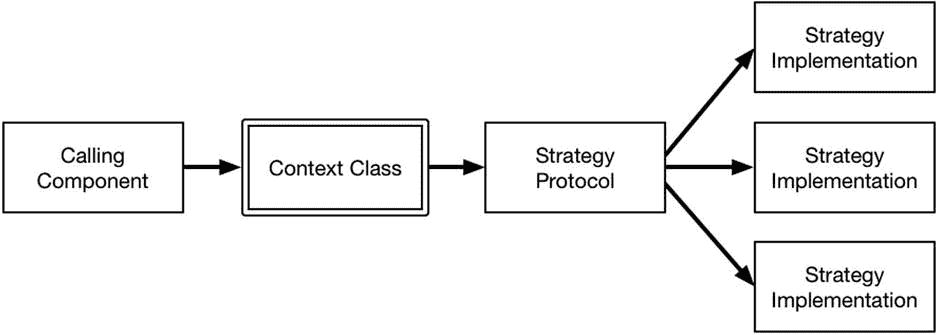
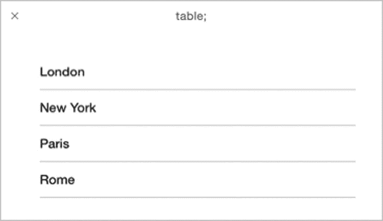

# 24. 策略模式

策略模式用于创建功能可以在不被修改或子类化的情况下进行扩展的类，这在您向第三方开发者交付框架时，或者当对关键类进行任何（无论多小的）更改都会触发广泛且昂贵的测试和验证流程时非常有用。表 24-1 将策略模式置于上下文中。

**表 24-1.** 策略模式的上下文

| 问题 | 答案 |
| --- | --- |
| 它是什么？ | 策略模式用于创建无需修改即可扩展的类，通过应用符合明确定义协议的算法对象来实现。 |
| 有什么好处？ | 策略模式允许第三方开发者在不修改类的情况下更改其行为，并且可以在那些对特定类有昂贵且冗长的验证流程的项目中实现低成本的更改。 |
| 何时应使用此模式？ | 当您需要可以扩展且无需修改的类时，请使用此模式。 |
| 何时应避免此模式？ | 没有理由避免此模式。 |
| 如何判断是否正确实现了该模式？ | 当您可以通过定义和应用新策略来扩展类的行为，而无需对类本身进行任何更改时，就说明策略模式已正确实现。 |
| 有什么常见的陷阱吗？ | 没有。策略模式实现起来很简单。 |
| 有没有相关的模式？ | 策略模式和访问者模式经常一起使用。 |

## 准备示例项目

在本章中，我创建了一个名为 `Strategy` 的 Xcode OS X 命令行工具项目。我添加了一个名为 `Sequence.swift` 的文件，并用于定义代码清单 24-1 中所示的类。

**代码清单 24-1.** `Sequence.swift` 文件的内容

```
class Sequence {
    private var numbers:[Int];
    init(_ numbers:Int...) {
        self.numbers = numbers;
    }
    func addNumber(value:Int) {
        self.numbers.append(value);
    }
    func compute() -> Int {
        return numbers.reduce(0, combine: {$0 + $1});
    }
}
```

`Sequence` 类维护一个 `Int` 值的数组，这些值通过初始化器定义，并通过 `addNumber` 方法添加。`compute` 方法使用 `reduce` 函数对值进行求和并返回结果。代码清单 24-2 显示了我添加到 `main.swift` 文件中以使用 `Sequence` 类的代码。

**代码清单 24-2.** `main.swift` 文件的内容

```
let sequence = Sequence(1, 2, 3, 4);
sequence.addNumber(10);
sequence.addNumber(20);
let sum = sequence.compute();
println("Sum: \(sum)");
```

我创建了一个 `Sequence` 对象，调用了两次 `addNumber` 方法，然后调用 `compute` 方法计算总和，并将其写入 Xcode 控制台。运行该应用程序会产生以下输出：

```
Sum: 40
```


## 理解该模式要解决的问题

我在示例应用中定义的 `Sequence` 类包含一个简单的算法。当 `compute` 方法被调用时，会使用 `reduce` 方法将集合中的所有 `Int` 值相加。

如果我想添加另一个算法，就需要做出选择。我既可以修改 `Sequence` 类的代码，在现有算法旁添加新算法，也可以创建一个新的子类，覆盖并有效替换现有算法。

通过修改或创建子类来添加功能，违背了开闭设计原则。该原则指出，类应该对扩展开放，对修改封闭。换句话说，更可取的做法是能够在不修改类或创建新子类的前提下，扩展类所提供的功能。

修改源代码或创建新子类本身并无本质上的错误，但对于某些项目而言，这样做可能会触发需求，即在将变更部署到生产系统之前，需要进行大量的单元测试、系统测试和集成测试。这一流程通常由监管要求驱动，有时则是因为公司政策更强调质量而非上市速度。为了给本章内容做铺垫，清单 24-3 展示了对 `Sequence` 类进行的一项简单修改，以定义第二个算法。

**清单 24-3.** 在 `Sequence.swift` 文件中定义新算法

```
enum ALGORITHM {
    case ADD; case MULTIPLY;
}

class Sequence {
    private var numbers:[Int];
    init(_ numbers:Int...) {
        self.numbers = numbers;
    }
    func addNumber(value:Int) {
        self.numbers.append(value);
    }
    func compute(algorithm:ALGORITHM) -> Int {
        switch (algorithm) {
        case .ADD:
            return numbers.reduce(0, combine: {$0 + $1});
        case .MULTIPLY:
            return numbers.reduce(1, combine: {$0 * $1});
        }
    }
}
```

我本可以用很多种方式添加新算法，但我选择了定义一个枚举来指定算法，然后在 `compute` 方法中通过 `switch` 语句使用它。在那些测试和验证流程繁重的项目中，仅仅添加一个乘法算法，就可能触发长达数周且成本高昂的测试。为了完整性起见，清单 24-4 展示了 `main.swift` 文件中相应的更改，以使用新的 `Sequence` 功能。

**清单 24-4.** 在 `main.swift` 文件中使用新的 Sequence 算法

```
let sequence = Sequence(1, 2, 3, 4);
sequence.addNumber(10);
sequence.addNumber(20);
let sum = sequence.compute(ALGORITHM.ADD);
println("Sum: \(sum)");
let multiply = sequence.compute(ALGORITHM.MULTIPLY);
println("Multiply: \(multiply)");
```

运行示例应用会得到以下结果：

```
Sum: 40
Multiply: 4800
```

## 理解策略模式

策略模式通过定义一个协议（不同的算法类可以遵循该协议）来支持开闭原则。这使得算法可以在运行时被选择和更改，并且可以在不修改使用算法的类的前提下，将新算法添加到应用程序中。图 24-1 展示了策略模式。



**图 24-1.** 策略模式

在策略模式中，被扩展的类被称为上下文类。上下文类不直接实现某个功能，而是将其实现委托给一个遵循策略协议的类。策略模式并未指定如何选择特定的策略实现类，但最常见的方法是让调用组件来做这个选择。

## 实现策略模式

策略模式的核心是用于指定算法的协议。清单 24-5 展示了 `Strategies.swift` 文件的内容，我已将其添加到示例项目中。

**清单 24-5.** `Strategies.swift` 文件的内容

```
protocol Strategy {
    func execute(values:[Int]) -> Int;
}
```

策略协议除了指定输入和输出之外，并不规定算法的任何其他方面。在这个案例中，策略操作的是一个 `Int` 数组，并生成一个单一的 `Int` 值。

### 定义策略和上下文类

下一步是为应用程序所需的每个算法定义策略类。清单 24-6 展示了我为示例应用定义的类。

**清单 24-6.** 在 `Strategies.swift` 文件中定义策略类

```
protocol Strategy {
    func execute(values:[Int]) -> Int;
}

class SumStrategy: Strategy {
    func execute(values: [Int]) -> Int {
        return values.reduce(0, combine: {$0 + $1});
    }
}

class MultiplyStrategy: Strategy {
    func execute(values: [Int]) -> Int {
        return values.reduce(1, combine: {$0 * $1});
    }
}
```

我定义了求和与求乘积 `Int` 值的策略，两者都遵循 `Strategy` 协议。你可以从清单 24-7 中看到策略协议在上下文类中是如何使用的，该清单展示了我如何将直接实现的算法替换为委托给一个作为 `compute` 方法参数的策略。

**清单 24-7.** 在 `Sequence.swift` 文件中委托给策略

```
final class Sequence {
    private var numbers:[Int];
    init(_ numbers:Int...) {
        self.numbers = numbers;
    }
    func addNumber(value:Int) {
        self.numbers.append(value);
    }
    func compute(strategy:Strategy) -> Int {
        return strategy.execute(self.numbers);
    }
}
```

实现策略模式的目标是定义一个无需修改或创建子类的上下文类。除了修改 `compute` 方法，我还将这个类标记为 `final`。

### 使用该模式

最后一步是修改调用组件，以便它能选择策略。在我的实现中，我采用了最常见的方法，即由调用组件创建策略实现对象的实例，并将它们传递给上下文类，如清单 24-8 所示。

**清单 24-8.** 在 `main.swift` 文件中选择并使用策略

```
let sequence = Sequence(1, 2, 3, 4);
sequence.addNumber(10);
sequence.addNumber(20);
let sumStrategy = SumStrategy();
let multiplyStrategy = MultiplyStrategy();
let sum = sequence.compute(sumStrategy);
println("Sum: \(sum)");
let multiply = sequence.compute(multiplyStrategy);
println("Multiply: \(multiply)");
```

运行示例应用会得到以下输出：

```
Sum: 40
Multiply: 4800
```


## 策略模式的变体

Swift 使得将策略定义为闭包而非遵循协议的对象变得非常简单。使用闭包的优点在于，调用组件可以封装其自身的方法和属性，以定义更复杂的策略。闭包的缺点是可能较难阅读，并且将闭包作为对象传递时需要密切关注细节。

一种折衷方法是创建一个遵循策略协议，但依赖闭包作为其实现的类。代码清单 24-9 展示了我在 `Strategies.swift` 文件中添加的内容，用于定义这样一个类。

**代码清单 24-9.** 在 `Strategies.swift` 文件中定义一个闭包策略类

```
protocol Strategy {
    func execute(values:[Int]) -> Int;
}

class ClosureStrategy : Strategy {
    private let closure:[Int] -> Int;
    init(_ closure:[Int] -> Int) {
        self.closure = closure;
    }
    func execute(values: [Int]) -> Int {
        return self.closure(values);
    }
}

class SumStrategy: Strategy {
    func execute(values: [Int]) -> Int {
        return values.reduce(0, combine: {$0 + $1});
    }
}

class MultiplyStrategy: Strategy {
    func execute(values: [Int]) -> Int {
        return values.reduce(1, combine: {$0 * $1});
    }
}
```

`ClosureStrategy` 类遵循了 `Strategy` 协议，并接受一个闭包作为其初始化参数，该闭包随后被用于 `execute` 方法的实现中。代码清单 24-10 展示了如何在 `main.swift` 文件中使用 `ClosureStrategy` 类来捕获一个属性。

**代码清单 24-10.** 在 `main.swift` 文件中使用闭包

```
let sequence = Sequence(1, 2, 3, 4);
sequence.addNumber(10);
sequence.addNumber(20);

let sumStrategy = SumStrategy();
let multiplyStrategy = MultiplyStrategy();

let sum = sequence.compute(sumStrategy);
println("Sum: \(sum)");

let multiply = sequence.compute(multiplyStrategy);
println("Multiply: \(multiply)");

let filterThreshold = 10;
let cstrategy = ClosureStrategy({values in
    return values.filter({ $0 < filterThreshold }).reduce(0, {$0 + $1});
});
let filteredSum = sequence.compute(cstrategy);
println("Filtered Sum: \(filteredSum)");
```

我使用 `ClosureStrategy` 类来捕获 `filterThreshold` 常量，并利用它选择一部分值进行求和。运行应用程序，产生如下结果：

```
Sum: 40
Multiply: 4800
Filtered Sum: 10
```

## 理解策略模式的陷阱

策略模式没有与之相关的陷阱，它易于实现和使用。

## Cocoa 中的策略模式示例

策略模式在 Cocoa 中被广泛使用，允许在不修改框架类或创建子类的情况下改变其行为。Cocoa 的策略实现通常分为两类：由协议定义的和由选择器定义的。在接下来的章节中，我将各举一个例子说明。

### Cocoa 基于协议的策略

Cocoa 使用协议为其 UI 组件定义策略，其中一个经典示例便是使用协议来定义在表视图中生成行的策略。实现表视图的类叫做 `UITableView`，它依赖于一个遵循 `UITableViewDataSource` 协议的类来实现提供数据的策略，从而允许第三方开发者在无需修改 `UITableView` 类或创建其子类的情况下扩展其行为。作为简单演示，我创建了一个名为 `ProtocolStrategy.playground` 的 Xcode iOS playground，并用它定义了如代码清单 24-11 所示的代码。

**代码清单 24-11.** `ProtocolStrategy.playground` 文件的内容

```
import UIKit

class DataSourceStrategy : NSObject, UITableViewDataSource {
    let data:[Printable];
    init(_ data:Printable...) {
        self.data = data;
    }
    func tableView(tableView: UITableView,
        numberOfRowsInSection section: Int) -> Int {
        return data.count;
    }
    func tableView(tableView: UITableView,
        cellForRowAtIndexPath indexPath: NSIndexPath) -> UITableViewCell {
        let cell = UITableViewCell();
        cell.textLabel.text = data[indexPath.row].description;
        return cell;
    }
}

let dataSource = DataSourceStrategy("London", "New York", "Paris", "Rome");
let table = UITableView(frame: CGRectMake(0, 0, 400, 200));
table.dataSource = dataSource;
table.reloadData();
// required for display in assistant editor
table;
```

我定义了一个名为 `DataSourceStrategy` 的类，它遵循 `UITableViewDataSource` 协议，并实现了从 `Printable` 对象数组中提供数据值所需的两个方法。我创建了一个策略类的实例，并将其用作 `UITableView` 对象的数据源，得到了如图 24-2 所示的结果。



图 24-2. 使用基于协议的 UIKit 策略

### Cocoa 基于选择器的策略

并非所有 Cocoa 类都依赖协议来定义策略。有些类使用选择器来指定被调用的方法，以扩展类的功能。作为演示，我创建了一个名为 `SelectorStrategy.playground` 的 Xcode OS X playground，如代码清单 24-12 所示。

**代码清单 24-12.** `SelectorStrategy.playground` 文件的内容

```
import Foundation;

@objc class City {
    let name:String;
    init(_ name:String) {
        self.name = name;
    }
    func compareTo(other:City) -> NSComparisonResult {
        if (self.name == other.name) {
            return NSComparisonResult.OrderedSame;
        } else if (self.name < other.name) {
            return NSComparisonResult.OrderedDescending;
        } else {
            return NSComparisonResult.OrderedAscending;
        }
    }
}

let nsArray = NSArray(array: [City("London"), City("New York"), City("Paris"), City("Rome")]);
let sorted = nsArray.sortedArrayUsingSelector("compareTo:");
for city in sorted {
    println(city.name);
}
```

`NSArray` 类可以使用选择器来引用定义比较两个对象策略的方法，从而对其内容进行排序。在示例中，我定义了一个名为 `City` 的对象，它有一个名为 `compareTo` 的方法。`compareTo` 方法接受另一个 `City` 对象，并将其与当前实例进行比较，返回 `NSComparisonResult` 枚举中的一个值。

我定义了一个包含 `City` 对象的 `NSArray`，并通过调用 `sortedArrayUsingSelector` 方法对该数组进行排序，指定 `compareTo` 方法中包含比较 `City` 对象的策略。结果是排序后的对象数组输出到控制台，如下所示：

```
Rome
Paris
New York
London
```

## 将模式应用于 SportsStore 应用

SportsStore 应用已经依赖于策略模式，因为 `ViewController` 类实现了 `UITableViewDataSource` 协议，以便向 `UITableView` 组件提供数据项。

```
...
class ViewController: UIViewController, UITableViewDataSource {
...
```

## 小结

本章我描述了策略设计模式，它用于在不修改类或创建新子类的情况下扩展类的功能。在下一章中，我将介绍访问者模式，它允许在不修改集合类或创建子类的情况下扩展其行为。


