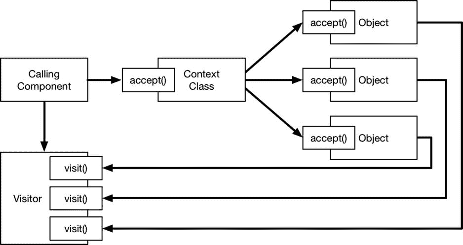

# 25. 访问者模式

访问者模式与策略模式类似，都允许在不修改类源代码或创建新子类的情况下扩展类的行为，区别在于访问者模式应用于异构对象的集合。表 25-1 将访问者模式置于上下文中进行阐述。

**表 25-1.** 访问者模式上下文一览

| 问题 | 答案 |
| --- | --- |
| 这是什么？ | 访问者模式允许新的算法对异构对象集合进行操作，而无需修改或继承集合类。 |
| 有哪些优点？ | 当您希望将集合类作为框架的一部分提供，但又不要求第三方开发者修改源代码时，访问者模式非常有用。在修改核心类会触发昂贵测试流程的项目中，此模式也同样适用。 |
| 何时应使用此模式？ | 当您的类管理着类型不匹配的对象集合，并且您希望对它们执行操作时，可以使用此模式。 |
| 何时应避免此模式？ | 当所有对象都属于同一类型，或者可以轻松修改集合类时，则无需使用此模式。 |
| 如何判断是否已正确实现该模式？ | 当访问者类能够通过定义处理集合中每种对象类型的方法来扩展集合类的行为时，即表示已正确实现该模式。 |
| 是否有常见陷阱？ | 唯一的陷阱是试图避免使用双重分派技术，我将在“理解双重分派”边栏中进行描述。 |
| 是否有相关模式？ | 访问者模式是遵循开闭原则的另一种方式，该原则同样由我在第 24 章中描述的策略模式所支持。 |

## 准备示例项目

在本章中，我创建了一个名为 `Visitor` 的 OS X 命令行工具项目。我添加了一个名为 `Shapes.swift` 的文件，并使用它定义了清单 25-1 中所示的类。

**清单 25-1.** `Shapes.swift` 文件的内容

```
import Foundation;

class Circle {
    let radius:Float;
    init(radius:Float) {
        self.radius = radius;
    }
}

class Square {
    let length:Float;
    init(length:Float) {
        self.length = length;
    }
}

class Rectangle {
    let xLen:Float;
    let yLen:Float;
    init(x:Float, y:Float) {
        self.xLen = x;
        self.yLen = y;
    }
}

class ShapeCollection {
    let shapes:[Any];
    init() {
        shapes = [
            Circle(radius: 2.5), Square(length: 4), Rectangle(x: 10, y: 2)
        ];
    }
    func calculateAreas() -> Float {
        return shapes.reduce(0, combine: {total, shape in
            if let circle = shape as? Circle {
                println("Found Circle");
                return total + (3.14 * powf(circle.radius, 2));
            } else if let square = shape as? Square {
                println("Found Square");
                return total + powf(square.length, 2);
            } else if let rect = shape as? Rectangle {
                println("Found Rectangle");
                return total + (rect.xLen * rect.yLen);
            } else {
                // unknown type - do nothing
                return total;
            }
        });
    }
}
```

我定义了三个表示形状的类——`Circle`、`Square` 和 `Rectangle`——以及一个名为 `ShapeCollection` 的类，用于管理形状对象的集合。`ShapeCollection` 类包含一个名为 `calculateAreas` 的方法，该方法枚举集合并计算其中包含的形状的总面积。清单 25-2 展示了我在 `main.swift` 文件中定义的用于演示示例类的代码。

**清单 25-2.** `main.swift` 文件的内容

```
let shapes = ShapeCollection();
let area = shapes.calculateAreas();
println("Area: \(area)");
```

运行该应用程序将产生以下结果：

```
Found Circle
Found Square
Found Rectangle
Area: 55.625
```

## 理解该模式要解决的问题

在示例应用程序中，`ShapeCollection` 类管理着一个异构对象集合，这些对象既没有共同的基类，也不符合共同的协议。要对集合中的对象执行操作，我必须尝试将每个对象转换为不同的类型，这就导致了像 `calculateAreas` 方法中那样的一组条件语句。

```
...
func calculateAreas() -> Float {
    return shapes.reduce(0, combine: {total, shape in
        if let circle = shape as? Circle {
            println("Found Circle");
            return total + (3.14 * powf(circle.radius, 2));
        } else if let square = shape as? Square {
            println("Found Square");
            return total + powf(square.length, 2);
        } else if let rect = shape as? Rectangle {
            println("Found Rectangle");
            return total + (rect.xLen * rect.yLen);
        } else {
            // unknown type - do nothing
            return total;
        }
    });
}
...
```

每当我添加一个新功能，我就得修改或继承 `ShapeCollection` 类，并创建另一组条件语句来转换集合中的每个对象。这不仅会在某些项目中触发全面且昂贵的测试，还会产生重复、不灵活且容易出错的代码。清单 25-3 展示了我是如何向 `ShapeCollection` 类添加另一个方法的。

**清单 25-3.** 在 `Shapes.swift` 文件中向 `ShapeCollection` 类添加新方法

```
...
class ShapeCollection {
    let shapes:[Any];
    init() {
        shapes = [
            Circle(radius: 2.5), Square(length: 4), Rectangle(x: 10, y: 2)
        ];
    }
    func calculateAreas() -> Float {
        return shapes.reduce(0, combine: {total, shape in
            if let circle = shape as? Circle {
                println("Found Circle");
                return total + (3.14 * powf(circle.radius, 2));
            } else if let square = shape as? Square {
                println("Found Square");
                return total + powf(square.length, 2);
            } else if let rect = shape as? Rectangle {
                println("Found Rectangle");
                return total + (rect.xLen * rect.yLen);
            } else {
                // unknown type - do nothing
                return total;
            }
        });
    }
    func countEdges() -> Int {
        return shapes.reduce(0, combine: {total, shape in
            if let circle = shape as? Circle {
                println("Found Circle");
                return total + 1;
            } else if let square = shape as? Square {
                println("Found Square");
                return total + 4;
            } else if let rect = shape as? Rectangle {
                println("Found Rectangle");
                return total + 4;
            } else {
                // unknown type - do nothing
                return total;
            }
        });
    }
}
...
```

新方法名为 `countEdges`，它计算集合中形状的边总数。清单 25-4 展示了我在 `main.swift` 文件中添加的用于测试新方法的语句。

**清单 25-4.** 在 `main.swift` 文件中使用新方法

```
let shapes = ShapeCollection();
let area = shapes.calculateAreas();
println("Area: \(area)");
println("---");
let edges = shapes.countEdges();
println("Edges: \(edges)");
```

运行该应用程序将产生以下结果：

```
Found Circle
Found Square
Found Rectangle
Area: 55.625
---
Found Circle
Found Square
Found Rectangle
Edges: 9
```

每次枚举集合中的对象以添加新功能时，都会面临同样的问题，从而产生同样丑陋的代码。


## 理解访问者模式

访问者模式通过将作用于集合的算法分离到独立的对象中，并确保该对象定义了能处理每种集合类型的方法，从而解决了这个问题。这使得算法可以在运行时被选择，这意味着无需修改或子类化维护集合的类型即可定义新的行为，这遵循了我在第 23 章中描述的开闭原则。

确保算法对象拥有处理每种集合类型的方法，可以避免使用条件类型转换代码，并依靠 Swift 的内置类型管理特性来选择处理集合对象的正确方法。图 25-1 展示了访问者模式。



图 25-1. 访问者模式

访问者是一个定义了名为 `visit` 方法的类，这些方法接收由上下文类管理的集合中的每一种类型。调用组件将访问者提供给上下文类，上下文类再将其传递给集合中每个对象定义的 `accept` 方法。每个对象在收到访问者后，调用 `visit` 方法，并依靠 Swift 来选择该方法的正确版本；这是一种称为双重分派的技术。如果这种双重方法调用让你感到困惑，不必担心；当你看到下一节中的实现代码时，它会变得更加清晰，我将在“理解双重分派”边栏中解释双重分派有效的原因。

## 实现访问者模式

实现访问者模式的起点是创建定义访问者的协议，并确保集合中的对象实现一个 `accept` 方法。清单 25-5 展示了我添加到示例项目中的 `Visitor.swift` 文件的内容。

**清单 25-5.** `Visitor.swift` 文件的内容

```
import Foundation;

protocol Shape {

    func accept(visitor:Visitor);

}

protocol Visitor {

    func visit(shape:Circle);

    func visit(shape:Square);

    func visit(shape:Rectangle);

}
```

`Shape` 协议定义了 `accept` 方法，`Visitor` 协议定义了接受应用程序中每种形状类型的 `visit` 方法，这对于双重分派的实现至关重要。

### 理解双重分派

双重分派是访问者模式的基础，它依靠 Swift 根据参数类型选择方法。考虑以下协议和类：

```
...

protocol MyProtocol {

    func dispatch(handler:Handler);

}

class FirstClass : MyProtocol {

    func dispatch(handler: Handler) {

        handler.handle(self);

    }

}

class SecondClass : MyProtocol {

    func dispatch(handler: Handler) {

        handler.handle(self)

    }

}

...
```

`FirstClass` 和 `SecondClass` 都遵循 `MyProtocol` 协议。由协议定义并由这些类实现的 `dispatch` 方法是双重分派技术的关键，尽管理解双重分派的最佳方式是看看没有它会发生什么。以下是 `dispatch` 方法接受的 `Handler` 类的定义：

```
...

class Handler {

    func handle(arg:MyProtocol) {

        println("Protocol");

    }

    func handle(arg:FirstClass) {

        println("First Class");

    }

    func handle(arg:SecondClass) {

        println("Second Class");

    }

}

...
```

考虑当我创建一个包含 `FirstClass` 和 `SecondClass` 对象的数组，并将它们传递给一个 `Handler` 对象时会发生什么，就像这样：

```
...

let objects:[MyProtocol] = [FirstClass(), SecondClass()];

let handler = Handler();

for object in objects {

    handler.handle(object);

}

...
```

这是常规的单重分派，我只是针对数组中的每个对象调用 `Handler` 对象的方法。为了能够将 `FirstClass` 对象和 `SecondClass` 对象存储在同一个数组中，我必须将其类型指定为 `MyProtocol`，这会影响 Swift 在 `for` 循环中选择的 `handle` 方法版本，并产生以下结果：

```
Protocol
Protocol
```

两个对象都使用数组的类型进行处理。为了启用双重分派，我必须更改 `for` 循环中的方法调用，如下所示：

```
...

for object in objects {

    object.dispatch(handler);

}

...
```

`dispatch` 方法的实现导致从类内部调用 `Handler.handle` 方法，但参数是 `self`。其效果是调用了具有最具体类型的 `handle` 方法版本，并产生以下结果：

```
First Class
Second Class
```

从对象方法内部调用 `handle` 方法的效果是，无需执行任何类型转换，就能调用具有最具体参数类型的方法版本，这是访问者模式的核心技术。

### 遵循 Shape 协议

下一步是更新形状类，使它们遵循 `Shape` 协议。如清单 25-6 所示，每个形状类对 `accept` 方法都有相同的实现。

**清单 25-6.** 在 `Shapes.swift` 文件中遵循 `Shape` 协议

```
import Foundation;

class Circle : Shape {

    let radius:Float;

    init(radius:Float) {

        self.radius = radius;

    }

    func accept(visitor: Visitor) {

        visitor.visit(self);

    }

}

class Square : Shape {

    let length:Float;

    init(length:Float) {

        self.length = length;

    }

    func accept(visitor: Visitor) {

        visitor.visit(self);

    }

}

class Rectangle : Shape {

    let xLen:Float;

    let yLen:Float;

    init(x:Float, y:Float) {

        self.xLen = x;

        self.yLen = y;

    }

    func accept(visitor: Visitor) {

        visitor.visit(self);

    }

}

class ShapeCollection {

    let shapes:[Shape];

    init() {

        shapes = [

            Circle(radius: 2.5), Square(length: 4), Rectangle(x: 10, y: 2)

        ];

    }

    func accept(visitor: Visitor) {

        for shape in shapes {

            shape.accept(visitor);

        }

    }

}
```

**提示：** 我直接修改了集合类以遵循协议，但别忘了你可以使用 Swift 扩展来为类添加协议遵循，而无需修改它们。

我还为 `ShapeCollection` 类添加了一个 `accept` 方法，该方法接收一个 `Visitor` 对象，并调用集合中每个对象的 `accept` 方法，我已将集合改为 `Shape` 数组。

### 创建访问者

有了基本的基础设施，我就可以创建操作形状对象集合的访问者类了，如清单 25-7 所示。

**清单 25-7.** 在 `Visitor.swift` 文件中定义访问者

```
import Foundation;

protocol Shape {

    func accept(visitor:Visitor);

}

protocol Visitor {

    func visit(shape:Circle);

    func visit(shape:Square);

    func visit(shape:Rectangle);

}

class AreaVisitor : Visitor {

    var totalArea:Float = 0;

    func visit(shape: Circle) {

        totalArea += (3.14 * powf(shape.radius, 2));

    }

    func visit(shape: Square) {

        totalArea += powf(shape.length, 2);

    }

    func visit(shape: Rectangle) {

        totalArea += (shape.xLen * shape.yLen);

    }

}

class EdgesVisitor : Visitor {

    var totalEdges = 0;

    func visit(shape: Circle) {

        totalEdges += 1;

    }

    func visit(shape: Square) {

        totalEdges += 4;

    }

    func visit(shape: Rectangle) {

        totalEdges += 4;

    }

}
```

使用双重分派意味着将为集合中的每个对象调用相应版本的 `visit` 方法。这意味着我可以访问形状类定义的特定于类型的属性，而无需从一种类型转换到另一种类型。


### 应用访问者模式

最后一步是更新调用组件，创建并使用 `Visitor` 对象对集合进行操作。清单 25-8 展示了我对 `main.swift` 文件所做的更改。

**清单 25-8.** 在 `main.swift` 文件中使用访问者模式

```
let shapes = ShapeCollection();

let areaVisitor = AreaVisitor();

shapes.accept(areaVisitor);

println("Area: \(areaVisitor.totalArea)");

println("---");

let edgeVisitor = EdgesVisitor();

shapes.accept(edgeVisitor);

println("Edges: \(edgeVisitor.totalEdges)");
```

运行应用程序将产生以下结果：

```
Area: 55.625

---

Edges: 9
```

通过创建新的访问者并将其传递给 `accept` 方法，可以定义新的算法。这样一来，无需修改集合类或其子类，即可创建新的行为和功能。

## 访问者模式的变体

访问者模式没有常见的变体。

## 理解访问者模式的陷阱

实现访问者模式时，唯一的陷阱是试图绕过双重分发。虽然这种技术看起来有些笨拙，但如果不使用它，就无法实现访问者模式。

## Cocoa 中的访问者模式示例

Cocoa 框架中没有包含访问者模式的示例。

## 将模式应用于 SportsStore 应用

SportsStore 应用中没有适合应用访问者模式的异构集合。

## 总结

我在本章中描述了访问者模式，并解释了如何使用它来扩展异构集合的行为，而无需修改集合类或其子类。在第 26 章中，我将描述模板方法模式，该模式允许有选择地替换算法中的步骤。

