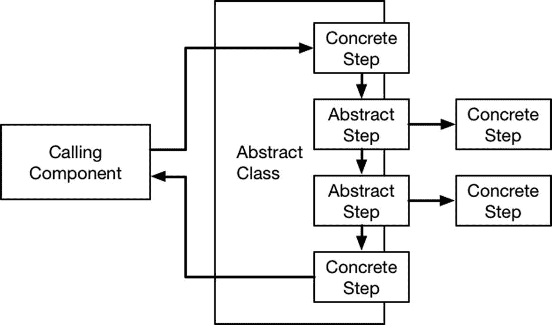

# 26. 模板方法模式

模板方法模式允许更改算法中的各个步骤，当你在编写具有默认行为的类并希望允许其他开发人员更改这些行为时，此模式非常有用。这个模式易于理解和实现，但被广泛使用，可在大多数公共框架中找到，包括 Apple 提供的框架。表 26-1 将模板方法模式置于上下文中。

**表 26-1.** 将模板方法模式置于上下文中

| 问题 | 答案 |
| --- | --- |
| 它是什么？ | 模板方法模式允许通过第三方提供的实现来替换算法中的特定步骤，这些实现可以通过将函数指定为闭包或通过创建子类来实现。 |
| 它有什么好处？ | 当你在编写希望允许其他开发人员扩展和自定义的框架时，此模式非常有用。 |
| 何时应使用此模式？ | 当你希望在不修改原始类的情况下，有选择地允许更改算法中的任何步骤时，使用此模式。 |
| 何时应避免此模式？ | 如果整个算法都可以更改，则不要使用此模式。请参阅本书这部分中的其他模式以获取替代方案。 |
| 如何知道是否正确实现了该模式？ | 当算法中的选定步骤可以在不修改定义算法的类的情况下被更改时，即正确实现了此模式。 |
| 是否有常见的陷阱？ | 没有。 |
| 是否有相关模式？ | 此模式与我之前在第 24 章和第 25 章中描述的策略模式和访问者模式具有相似的目标。 |

## 准备示例项目

在本章中，我创建了一个名为 `TemplateMethod` 的 Xcode OS X 命令行工具项目。我创建了一个名为 `Donors.swift` 的文件，其内容如清单 26-1 所示。

**清单 26-1.** `Donors.swift` 文件的内容

```
struct Donor {

    let title:String;

    let firstName:String;

    let familyName:String;

    let lastDonation:Float;

    init (_ title:String, _ first:String, _ family:String, _ last:Float) {

        self.title = title;

        self.firstName = first;

        self.familyName = family;

        self.lastDonation = last;

    }

}

class DonorDatabase {

    private var donors:[Donor];

    init() {

        donors = [

            Donor("Ms", "Anne", "Jones", 0),

            Donor("Mr", "Bob", "Smith", 100),

            Donor("Dr", "Alice", "Doe", 200),

            Donor("Prof", "Joe", "Davis", 320)];

    }

    func generateGalaInvitations(maxNumber:Int) -> [String] {

        // 步骤 1 - 过滤掉非捐赠者

        var targetDonors:[Donor] = donors.filter({$0.lastDonation > 0});

        // 步骤 2 - 按最近捐赠金额对捐赠者排序

        targetDonors.sort({ $0.lastDonation > $1.lastDonation});

        // 步骤 3 - 限制受邀者人数

        if (targetDonors.count > maxNumber) {

            targetDonors = Array(targetDonors[0..<maxNumber]);

        }

        // 步骤 4 - 生成邀请函

        return targetDonors.map({ donor in

            return "Dear \(donor.title). \(donor.familyName)";

        })

    }

}
```

本章的示例基于一个虚构的慈善机构，该机构向捐赠者募集捐款。每个捐赠者由一个 `Donor` 对象表示，一组对象由 `DonorDatabase` 类收集。

`DonorDatabase` 类定义了一个 `generateGalaInvitations` 方法，该方法处理 `Donor` 对象以生成盛大音乐会的邀请函称谓。清单 26-2 展示了我添加到 `main.swift` 文件中用于生成称谓集合的代码。

**清单 26-2.** `main.swift` 文件的内容

```
let donorDb = DonorDatabase();

let galaInvitations = donorDb.generateGalaInvitations(2);

for invite in galaInvitations {

    println(invite);

}
```

运行示例会在 Xcode 控制台中产生以下输出：

```
Dear Prof. Davis

Dear Dr. Doe
```

## 理解模式解决的问题

生成盛大活动问候语的算法有四个不同的阶段：

- 过滤掉那些未进行捐赠的捐赠者
- 按最近的捐赠金额对捐赠者进行排序
- 选择有邀请函的捐赠者人数
- 生成邀请函的称谓

这些是慈善机构在生成与捐赠者进行任何沟通的问候语时需要执行的四个相同的基本步骤：过滤、排序、选择和生成。模板方法模式解决的问题是我在第 24 章和第 25 章中描述的策略模式和访问者模式所解决问题的变体：如何在不修改类的情况下扩展类的行为。

在这种情况下，该问题应用于具有明确定义步骤的算法，这些步骤可以更改以产生不同的结果，例如 `DonorDatabase` 类中用于生成称谓的算法。然而，与其他模式不同，当你需要确保算法的某些部分可以更改而其他部分保持不变时，模板方法模式非常有用，例如，确保排序和选择总是以相同的方式处理，但过滤和生成步骤可以更改，从而为不同类型的捐赠者沟通创建新的结果。

## 理解模板方法模式

模板方法依赖于一个算法的实现，该实现仅定义要保持不变的部分。算法的其余部分由调用组件提供，以完成算法并生成所需的结果，如图 26-1 所示。



**图 26-1.** 模板方法模式


## 实现模板方法模式

在其他语言中，模板模式通过定义一个类来实现，该类要求子类完成算法并提供缺失的步骤。Swift 不支持抽象类，但它允许将函数视为对象来处理，这使得无论如何都能创建该模式的实现。

第一步是泛化包含算法的类，使其仅定义算法的固定部分，而将可变部分指定为可通过属性设置的函数。清单 26-3 显示了对 `Donors.swift` 文件所做的修改。

**清单 26-3.** 在 `Donors.swift` 文件中重新定义算法

```
struct Donor {
    let title:String;
    let firstName:String;
    let familyName:String;
    let lastDonation:Float;

    init (_ title:String, _ first:String, _ family:String, _ last:Float) {
        self.title = title;
        self.firstName = first;
        self.familyName = family;
        self.lastDonation = last;
    }
}

class DonorDatabase {
    private var donors:[Donor];
    var filter: ([Donor] -> [Donor])?;
    var generate: ([Donor] -> [String])?;

    init() {
        donors = [
            Donor("Ms", "Anne", "Jones", 0),
            Donor("Mr", "Bob", "Smith", 100),
            Donor("Dr", "Alice", "Doe", 200),
            Donor("Prof", "Joe", "Davis", 320)];
    }

    func generate(maxNumber:Int) -> [String] {
        // 第 1 步 - 过滤掉非捐赠者
        var targetDonors:[Donor] = filter?(donors)
            ?? donors.filter({$0.lastDonation > 0});
        // 第 2 步 - 按最近捐赠额排序
        targetDonors.sort({ $0.lastDonation > $1.lastDonation});
        // 第 3 步 - 限制受邀人数
        if (targetDonors.count > maxNumber) {
            targetDonors = Array(targetDonors[0..<maxNumber]);
        }
        // 第 4 步 - 生成邀请函
        return generate?(targetDonors) ?? targetDonors.map({ donor in
            return "Dear \(donor.title). \(donor.familyName)";
        })
    }
}
```

我定义了 `filter` 和 `generate` 属性，它们可用于覆盖算法中过滤和生成步骤的默认行为。我将算法方法的名称修改为 `generate`，如果未设置新属性，则会回退到默认步骤。

清单 26-4 显示了对 `main.swift` 文件所做的修改，以使用修改后的 `DonorDatabase` 类并定义新的算法。

**清单 26-4.** 在 `main.swift` 文件中使用模板方法模式

```
let donorDb = DonorDatabase();
let galaInvitations = donorDb.generate(2);
for invite in galaInvitations {
    println(invite);
}

donorDb.filter = { $0.filter({$0.lastDonation == 0})};
donorDb.generate = { $0.map({ "Hi \($0.firstName)"})};
let newDonors = donorDb.generate(Int.max);
for invite in newDonors {
    println(invite);
}
```

我先运行算法的标准版本，然后使用闭包定义了 `filter` 和 `generate` 属性的新函数，选择尚未捐款的捐赠者，并生成更随意的问候语。运行应用程序将产生以下输出：

```
Dear Prof. Davis
Dear Dr. Doe
Hi Anne
```

## 模板方法模式的变体

你可以通过将算法的每一步都实现为一个方法，并允许子类覆盖这些方法，来创建模板方法模式的更传统实现，如清单 26-5 所示。

**清单 26-5.** 在 `Donors.swift` 文件中使用方法定义算法步骤

```
...
class DonorDatabase {
    private var donors:[Donor];

    init() {
        donors = [
            Donor("Ms", "Anne", "Jones", 0),
            Donor("Mr", "Bob", "Smith", 100),
            Donor("Dr", "Alice", "Doe", 200),
            Donor("Prof", "Joe", "Davis", 320)];
    }

    func filter(donors:[Donor]) -> [Donor] {
        return donors.filter({$0.lastDonation > 0});
    }

    func generate(donors:[Donor]) -> [String] {
        return donors.map({ donor in
            return "Dear \(donor.title). \(donor.familyName)";
        })
    }

    func generate(maxNumber:Int) -> [String] {
        // 第 1 步 - 过滤掉非捐赠者
        var targetDonors = filter(self.donors);
        // 第 2 步 - 按最近捐赠额排序
        targetDonors.sort({ $0.lastDonation > $1.lastDonation});
        // 第 3 步 - 限制受邀人数
        if (targetDonors.count > maxNumber) {
            targetDonors = Array(targetDonors[0..<maxNumber]);
        }
        // 第 4 步 - 生成邀请函
        return generate(targetDonors);
    }
}
...
```

我将 `filter` 和 `generate` 步骤定义为可被子类覆盖的独立方法，如清单 26-6 所示。

**清单 26-6.** 在 `main.swift` 文件中创建子类

```
let donorDb = DonorDatabase();
let galaInvitations = donorDb.generate(2);
for invite in galaInvitations {
    println(invite);
}

class NewDonors : DonorDatabase {
    override func filter(donors: [Donor]) -> [Donor] {
        return donors.filter({ $0.lastDonation == 0});
    }
    override func generate(donors: [Donor]) -> [String] {
        return donors.map({ "Hi \($0.firstName)"});
    }
}

let newDonor = NewDonors();
for invite in newDonor.generate(Int.max) {
    println(invite);
}
```

我更喜欢基于闭包的技术，但这属于个人偏好，你应该选择更符合自己编码风格的方法。

## 理解该模式的陷阱

模板方法模式没有相关的陷阱，它易于实现和测试。如果你选择实现我在上一节中展示的变体，请注意仅将你希望允许更改的步骤定义为方法。

## 模板方法模式在 Cocoa 中的示例

模板方法模式在 Cocoa 中广泛使用，在 UI 组件中尤为明显。你可以在 SportsStore 应用中看到示例，其中 `ViewController` 类派生自 `UIViewController` 类并覆盖了 `viewDidLoad` 方法，该方法在用户界面创建时被调用，如下所示：

```
...
override func viewDidLoad() {
    super.viewDidLoad();
    displayStockTotal();
    let bridge = EventBridge(callback: updateStockLevel);
    productStore.callback = bridge.inputCallback;
}
...
```

你可能不认为用户界面初始化是一种算法，但它是你将在所有 iOS 项目中以某种形式使用的方法，它允许 Apple 定义一组固定的具有默认行为的类，这些行为可以被第三方开发者覆盖。

## 将模式应用于 SportsStore 应用

如上一节所述，SportsStore 应用已经依赖于模板方法模式。

## 总结

在本章中，我描述了模板方法模式，并解释了如何使用它来允许修改算法中的某些步骤，既可以通过使用闭包定义新函数，也可以通过创建子类来实现。在本书的下一部分中，我将把注意力转向最重要且最容易被误解的模式之一：模型/视图/控制器（MVC）模式。

