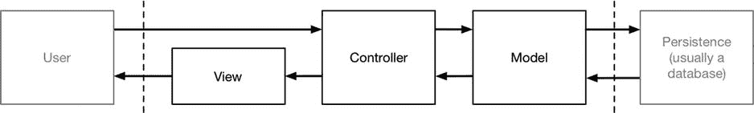

# 27. 模型/视图/控制器模式

模型/视图/控制器（MVC）模式近年来日益普及，是现代软件开发（包括 iOS 应用项目）的重要基础。本章将介绍 MVC 模式的背景，阐述其重要性，并说明它与我书中其他设计模式的关系。表 27-1 对 MVC 模式进行了背景说明。

**表 27-1. MVC 模式背景说明**

| 问题 | 答案 |
| --- | --- |
| 这是什么？ | MVC 模式为整个应用程序，而非单个组件，增加了结构。 |
| 有什么好处？ | 应用程序的各部分可以更轻松地进行开发、测试和维护。 |
| 何时使用此模式？ | 任何复杂项目都适合使用此模式。 |
| 何时应避免使用此模式？ | 对于短期或简单项目，实施此模式所需的规划和基础设施成本不划算。 |
| 如何判断是否正确实施了该模式？ | 实施 MVC 模式很大程度上依赖判断和个人偏好，因此很难给出确切的判断标准。通常来说，应用程序的各个部分（模型、视图和控制器）应松散耦合，以便能够轻松独立出来进行测试，并且对某一部分的实现进行更改时，无需对其他部分进行相应修改。 |
| 有哪些常见陷阱？ | 唯一陷阱是将功能放入错误的部分，导致实施效果欠佳。判断正确的部分取决于经验和偏好，很少有绝对的对错之分。 |
| 有哪些相关模式？ | MVC 模式的实现通常依赖于本书其他章节描述的模式。 |

## 准备示例项目

在本章中，我创建了一个名为 `MVC` 的 Xcode OS X 命令行工具项目。除了创建项目外，无需其他准备工作。

## 理解该模式解决的问题

MVC 模式为项目增加结构，以简化开发、测试和维护。然而，MVC 模式并非专注于特定对象或类型之间的关系或交互，而是应用于整个应用程序。

## 理解 MVC 模式

如果你有空闲时间且想做个实验，可以找两三个开发者，请他们描述 MVC 模式。深入了解细节后，你会发现关于 MVC 模式的两个重要事实。第一个事实是，每位开发者对 MVC 模式的理解都不同。第二个事实是，大多数开发者对 MVC 的理解由一系列模糊的概念组成，通常围绕“关注点分离”这一说法展开。

MVC 模式在不同平台和框架中的表现形式极其多样。使用微软 MVC 框架构建过 Web 应用的开发者，与使用苹果 `UIKit` 框架构建过 iOS 应用的开发者，他们的理解会有所不同。这两个框架都遵循 MVC 模式，但在如何安排组件以构建设计良好的应用程序方面，却有着不同的视角。而且，构建 Web 应用所需的组件与构建 iOS 应用所需的组件不同，这导致了更多差异。MVC 模式有如此多的不同表现形式和变体，难怪十几个开发者会得出（至少）十几种不同的解释。

**注意**

争论 MVC 模式的应用，是任何不想写代码的开发者首选的消遣活动。如果不加以控制，这种争论可能会导致你成为软件架构师，极端情况下甚至成为企业架构师。作为一个曾领导过一些全球最大公司的企业架构工作的人，我只想说，写代码远比整天谈论代码有趣得多。

MVC 模式的核心是关注点分离，这就是为什么这个短语经常被提及。关注点分离就是将应用程序的不同部分彼此分开，目的是让这些部分更容易开发、维护和测试。

此时，关注点分离对你来说应该是一个熟悉的概念，因为它是我在本书中描述的许多设计模式中共同的主题。MVC 模式遵循在应用程序中使用四个不同部分的惯例：

-   模型（Model），即 MVC 中的 M。模型包含应用程序的数据。
-   视图（View），即 MVC 中的 V。视图根据模型生成输出，显示给用户。
-   控制器（Controller），即 MVC 中的 C。控制器响应用户交互，并负责更新模型和视图，以反映应用程序状态的变化。
-   横切关注点（Cross-cutting concerns）。正如你将了解到的，并非所有内容都能完美地归入模型的模型、视图和控制器部分，横切关注点是跨越两个或多个其他部分的应用程序部分。

正如你将了解到的，当将模式应用于实际项目时，我为 MVC 模式每个部分给出的清晰定义会变得模糊得多，但牢记这些简单的定义会有所帮助，理解各个部分之间的交互也是如此，如图 27-1 所示。



**图 27-1. 模型/视图/控制器模式**

用户的交互由控制器接收，控制器包含更新模型中数据以反映交互所需的逻辑。更新后的应用程序状态由控制器传递给视图，视图生成显示给用户的表示，反映原始交互的效果。

举一个简单的例子，想象一个显示姓名列表的应用程序。一切都得有个开头，所以用户的第一个指令是列出所有姓名。这将产生以下序列：


控制器接收来自用户的指令。控制器向模型请求所有名称。模型从其存储机制中获取所请求的数据并将其返回给控制器。控制器将名称列表提供给视图，并请求其向用户呈现这些名称。视图生成列表的表示以及可对其执行的命令的详细信息。

每个交互都会执行相同的基本操作序列。假设用户执行从列表中删除名称的操作。以下是执行的操作序列：

控制器接收来自用户的指令，其中包含要删除的名称的详细信息。控制器请求模型删除指定的名称。模型从存储机制中删除该名称，并将修改后的列表返回给控制器。控制器将修订后的名称列表提供给视图，并请求其向用户呈现这些名称。视图生成列表的表示以及可对其执行的命令的详细信息。

关注点分离意味着应用程序的每个部分都有特定的角色，并与其他部分有明确界定的关系。每个部分都依赖其他部分来执行其角色，但对其实现方式没有任何了解或依赖，这意味着一个部分的实现可以更改，而无需对其他部分进行相应更改。最好的例子是模型用于持久化存储应用程序数据的机制。这通常是一个关系数据库，但具体是哪一个以及数据如何表示是模型实现的一部分，并且对控制器和视图部分完全不可知。关系数据库可以替换为完全不同的存储类型，而无需对控制器进行任何更改（控制器仅处理数据对象，不关心它们如何存储），也无需对视图进行任何更改（视图根本不直接与模型交互）。

### 理解 MVC 应用程序的组成部分

应用 MVC 模式起初可能是一个令人生畏的过程，但如果你始终关注 MVC 模式试图实现的目标，就不必如此。MVC 模式的目标——与本书中描述的所有设计模式一样——是创建更易于编写、修改和维护的代码。实现这一目标是在实施 MVC 模式时唯一的宗旨。它不是为了遵从他人对 MVC 含义的僵化定义。关于如何决定应用程序的哪些部分属于模型、视图和控制器部分，并没有固定的规则——只有指导原则，你需要根据这些原则做出最佳判断。

与本书中描述的所有模式一样，有效应用 MVC 需要灵活性和对当前项目的适应。应用程序中的某些部分会比其他部分更容易处理，但每个项目都有一些功能或特性可以合理地放置在至少两个部分中。

> **提示**
>
> 如果以下部分不能立即理解，请不要担心。理解 MVC 模式的结构可能需要一些时间。你可能会发现我在“实现 MVC 模式”部分创建的简单示例应用程序有助于将一些概念置于上下文中。

#### 理解模型

模型包含用户处理的数据。模型有两种广泛的类型。第一种模型类型是领域模型（`domain model`），它包含应用程序数据以及用于创建、存储和操作这些数据的操作、转换和规则，这些统称为模型逻辑（`model logic`）。这是图 27-1 中所示的模型类型，通常是提到“模型”一词时所指的对象。

许多刚接触 MVC 模式的开发人员会对在数据模型中包含逻辑感到困惑，认为 MVC 模式的目标是将数据与逻辑分离。这是一种误解；MVC 框架的目标是将应用程序划分为三个功能区域，每个区域都可能包含逻辑和数据。目标不是从模型中消除逻辑。相反，是确保模型仅包含用于创建和管理模型数据的逻辑。使用 MVC 模式构建的应用程序中的领域模型应执行以下操作：

*   包含领域数据
*   包含用于创建、管理和修改领域数据的逻辑（即使这意味着通过 Web 服务执行远程逻辑）
*   提供一个干净的 API，用于暴露模型数据及其操作

领域模型不应执行以下操作：

*   暴露模型数据的获取或管理方式的细节（即，数据存储机制或远程 Web 服务的细节不应暴露给控制器和视图）
*   包含基于用户交互转换模型的逻辑（这是控制器的工作）
*   包含向用户显示数据的逻辑（这是视图的工作）

确保领域模型与控制器和视图隔离的好处是，你可以更轻松地测试逻辑，并且增强和维护整个应用程序更简单、更容易。

**搞错方向**

许多开发人员对应用 MVC 模式犹豫不决，因为他们担心“搞错方向”，这通常意味着将特性放到了错误的部分。换句话说，本应属于控制器的代码最终出现在了视图中。

我的建议是不要担心。直接开始尝试，并尽快犯错误。你能够对 MVC 模式形成扎实理解的唯一方法是权衡关于特定应用程序结构的决策，当你做出后来意识到会做出不同选择的决定时，同样会学到很多东西。

代码是流动且可塑的，在大多数项目中你都有机会重构应用程序。这可能是一个繁琐的过程，但这不是世界末日，也能给你带来有用的见解。即使你没有时间重构也不必担心，因为你希望修改的决定的影响很小，而且大多数“错误”的决定实际上只是与你不断变化的偏好和经验相悖的决定。

第二种模型是视图模型（`view model`），它表示从控制器传递给视图的数据，以便向用户呈现。通常，视图模型只是领域模型数据的一个子集，例如查询结果，但视图模型也可以包含视图需要的、不属于领域模型的额外信息，例如关于当前用户会话状态的提示。

#### 理解控制器

控制器是 MVC 应用中的连接组织，负责响应用户交互，并在模型和视图之间充当管道。使用 MVC 构建的控制器应执行以下操作：

*   包含初始化模型所需的逻辑
*   包含视图呈现模型数据所需的逻辑/行为
*   包含基于用户交互更新模型所需的逻辑/行为

控制器不应执行以下操作：

*   包含向用户显示数据的逻辑（这是视图的工作）
*   包含管理数据持久化的逻辑（这是模型的工作）
*   在范围之外操作数据

控制器实现应用程序的逻辑，通常称为领域逻辑（`domain logic`）或业务逻辑（`business logic`）。此逻辑被分解为用户可以调用的操作（`actions`）或命令（`commands`），这些操作对模型执行操作，然后使用视图向用户呈现操作的效果。


### 理解视图

视图负责向用户展示视图模型。实现这一目标的方式多种多样，可能涉及生成 HTML 页面，也可能根据应用程序的需要创建或更新一组 `UIKit` 组件。

视图通常通过框架创建，例如 `UIKit`，因为构建显示数据所需的基础设施是一个复杂的过程，不需要为每个应用程序从头开始重新创建。视图应执行以下操作：

*   包含向用户呈现数据所需的逻辑和标记

视图不应执行以下操作：

*   包含复杂的逻辑（这更适合放在控制器中）
*   包含创建、存储或操作模型的逻辑

视图可以包含逻辑，但逻辑应简洁明了，并谨慎使用。在视图中放置除最简单的函数调用或表达式之外的任何内容，都会使整个应用程序更难以测试和维护。

### 理解横切关注点

横切关注点是应用程序中不属于其他部分的那些部分。经典的例子是日志记录和授权，它们通常是整个应用程序所必需的。为不同部分创建重复的日志记录或安全功能是没有意义的，因此多个部分会使用同一个实现，例如，一旦用户通过身份验证，用户身份就可以在不同部分之间传播，而无需进一步的验证。

横切关注点的风险在于，那些本来更适合放在模型、视图或控制器中的功能和特性最终被定义为横切关注点，这会扭曲应用程序的形态，并破坏应用程序各部分之间的清晰分离。

在任何应用程序中，真正的横切关注点都很少，这意味着一旦你实现了日志记录和安全功能，就应该对其他作为横切关注点实现的任何特性持怀疑态度，并考虑该特性实际上是否应该属于模型、视图或控制器。

## 实现 MVC 模式

学习 MVC 模式的最佳方式就是实现它。你在将应用程序中的关注点分离为模型、视图和控制器方面积累的经验越多，这个过程就会变得越自然。在接下来的几个小节中，我将使用 MVC 模式创建一个简单的命令行应用程序。我会逐步讲解整个过程，并解释沿途所做的决策。正如我之前提到的，MVC 模式为个人风格和诠释留下了很大空间，并且实现方式不可避免地会反映我对软件和开发的思考方式，并受到我通常从事的项目类型的影响。这并不意味着你应该盲目遵循我的方法。相反，你应该随意走自己的路，做出对你的开发环境和你开发的项目类型最有利的决策。

示例应用程序将管理一个人员名单及其所在的城市。作为一个独立的应用程序，它本身并不是特别有用，但其复杂性恰好足够让我实现 MVC 模式，同时应用程序的特性不会造成干扰。

### 定义公共代码

在任何项目中，都有些函数需要在应用程序中全局使用。公共代码与横切关注点不同。根据经验法则，为避免重复而定义的函数和静态方法是公共代码；跨部分具有公共状态的特性是横切关注点。

我开始通过定义一些扩展来构建应用程序，这些扩展将用于将字符串拆分为数组、移除数组中的重复对象以及查找数组中第一个匹配指定测试的对象。我向示例项目添加了一个名为 `Extensions.swift` 的文件，其内容如列表 27-1 所示。

**列表 27-1.** `Extensions.swift` 文件的内容

```
import Foundation

extension String {

func split() -> [String] { 
return self.componentsSeparatedByCharactersInSet(
NSCharacterSet.whitespaceAndNewlineCharacterSet())
.filter({$0 != ""});
}

}

extension Array {

func unique<T: Equatable>() -> [T] {
var uniqueValues = [T]();
for value in self {
if !contains(uniqueValues, value as T) {
uniqueValues.append(value as T);
}
}
return uniqueValues;
}

func first<T>(test:T -> Bool) -> T? {
for value in self {
if test(value as T) {
return value as? T;
}
}
return nil;
}

}
```

这些扩展与 MVC 模式的结构无关，我定义它们是为了避免项目中的代码重复。

### 定义框架

模型、视图和控制器并非孤立存在。它们需要某种框架来将各个部分连接起来，接收和处理用户的交互，并在屏幕上显示内容。如果没有底层框架，每个应用程序都必须重新创建同一组底层函数，这将极其繁琐。作为 Swift 开发者，你最常使用的框架可能是 `UIKit` 和 `AppKit`，它们包含了所有底层特性，例如将鼠标点击转换为事件并在屏幕上绘制复杂的 UI 组件。

命令行工具项目没有现成的 MVC 框架，所以我需要自己创建一个。在实际项目中，这将是一项严肃（且不明智）的任务，但书籍示例的优势之一就是简单，创建一个基础框架是展示 MVC 模式各部分如何协同工作的有用方法。

示例应用程序将从 Xcode 控制台读取命令，该控制台也将用于向用户显示数据。列表 27-2 显示了 `Commands.swift` 文件的内容，我用它来定义应用程序将支持的命令。

**列表 27-2.** `Commands.swift` 文件的内容

```
import Foundation

enum Command : String { 
case LIST_PEOPLE = "L: 列出人员";
case ADD_PERSON = "A: 添加人员";
case DELETE_PERSON = "D: 删除人员";
case UPDATE_PERSON = "U: 更新人员";
case SEARCH = "S: 搜索";

static let ALL = [Command.LIST_PEOPLE, Command.ADD_PERSON,
Command.DELETE_PERSON, Command.UPDATE_PERSON, Command.SEARCH];

static func getFromInput(input:String) -> Command? {
switch (input.lowercaseString) {
case "l":
return Command.LIST_PEOPLE;
case "a":
return Command.ADD_PERSON;
case "d":
return Command.DELETE_PERSON;
case "u":
return Command.UPDATE_PERSON;
case "s":
return Command.SEARCH;
default:
return nil;
}
}
}
```

`Command` 枚举为应用程序将支持的每个命令定义了值，允许用户列出应用程序中的所有人员、添加或删除人员、修改人员的详细信息以及执行简单的搜索。

Swift 枚举不容易获取所有已定义值的列表，所以我定义了一个名为 `ALL` 的静态常量，它被设置为一个包含枚举值的数组。我还定义了一个名为 `getFromInput` 的静态方法，它将一个 `String` 映射到一个枚举值。我将使用 `getFromInput` 方法根据从命令行读取的值来选择命令。


### 创建模型

我已经建立了足够的基础设施，可以开始实现 MVC 的各部分。在实现 MVC 时，模型是最佳的起点，因为模型类型会在整个应用程序中使用。清单 27-3 展示了我添加到示例项目中的 `Model.swift` 文件的内容。

**清单 27-3.** `Model.swift` 文件的内容

```
import Foundation

func == (lhs:Person, rhs:Person) -> Bool {
    return lhs.name == rhs.name && lhs.city == rhs.city;
}

class Person : Equatable, Printable {
    var name:String;
    var city:String;
    
    init(_ name:String, _ city:String) {
        self.name = name;
        self.city = city;
    }
    
    var description: String {
        return "Name: \(self.name), City: \(self.city)";
    }
}
```

在一个真实项目中，可能会有多种模型类型来表示应用程序处理的不同数据对象，但示例应用中只有 `Person` 这一种模型类型。`Person` 类定义了两个存储属性，我将分别用于存储人员姓名及其所在城市。

#### 实现仓储模式

在编写 MVC 应用程序时，我喜欢实现仓储模式，在这种模式下，数据类型与存储和检索数据的机制（即模型仓储）是分开定义的。这就是 `Person` 类如此简单的原因：它只需要存储数据值，无需关注这些值是如何获取或持久化的。

仓储模式的优势在于，它允许更改存储机制，而无需对应用程序的模型类型进行相应修改。这对于测试应用程序很有帮助，因为你可以将真实的仓储替换为使用内存中预定义测试值的仓储。在开始一个新的 MVC 应用程序时，我通常会先创建一个内存仓储，只有当应用程序的核心功能就绪后，才会将其替换为将数据持久化到数据库的实现。

一个好的仓储的关键在于从一个协议入手，应用程序中的其他组件将通过该协议执行数据操作。清单 27-4 展示了我在示例应用程序中定义的仓储协议。

**清单 27-4.** 在 `Model.swift` 文件中定义仓储协议

```
import Foundation

func == (lhs:Person, rhs:Person) -> Bool {
    return lhs.name == rhs.name && lhs.city == rhs.city;
}

class Person : Equatable, Printable {
    var name:String;
    var city:String;
    
    init(_ name:String, _ city:String) {
        self.name = name;
        self.city = city;
    }
    
    var description: String {
        return "Name: \(self.name), City: \(self.city)";
    }
}

protocol Repository {
    var People:[Person] { get };
    func addPerson(person:Person);
    func removePerson(name:String);
    func updatePerson(name:String, newCity:String);
}
```

**提示** 清单 27-4 中定义的 `Person` 类实现了 `Equatable` 和 `Printable` 协议。`Equatable` 协议与我在清单中创建的 `==` 函数配合使用，使得 `Person` 对象之间可以相互比较。当对象被传递给 `println` 函数时，会使用 `Printable` 协议，该函数会输出 `description` 属性的值。

我定义了一个名为 `People` 的只读属性，它将返回仓储中存储的所有 `Person` 对象，同时还定义了添加、删除和修改对象的方法。

**提示** 将所有的模型对象以集合（如数组）的形式暴露出来，可以方便应用程序的其他部分消费这些数据，但这样做的前提是数据能够被高效检索。只有在应用程序中数据量较小，或者存储机制仅在访问集合中元素时才提供内容的情况下，才应采用此方法。

在本章中，我将仅实现一个非持久化的内存仓储，其优点是简单，且每次应用程序重启时都会重置为已知状态。清单 27-5 展示了我是如何定义仓储实现类的。

**清单 27-5.** 在 `Model.swift` 文件中定义仓储实现

```
...

protocol Repository {
    var People:[Person] { get };
    func addPerson(person:Person);
    func removePerson(name:String);
    func updatePerson(name:String, newCity:String);
}

class MemoryRepository : Repository {
    private var peopleArray:[Person];
    
    init() {
        peopleArray = [
            Person("Bob", "New York"),
            Person("Alice", "London"),
            Person("Joe", "Paris")];
    }
    
    var People:[Person] {
        return self.peopleArray;
    }
    
    func addPerson(person: Person) {
        self.peopleArray.append(person);
    }
    
    func removePerson(name: String) {
        let nameLower = name.lowercaseString;
        self.peopleArray = peopleArray.filter({$0.name.lowercaseString != nameLower});
    }
    
    func updatePerson(name: String, newCity: String) {
        let nameLower = name.lowercaseString;
        let test:Person -> Bool = {p in return p.name.lowercaseString == nameLower};
        if let person = peopleArray.first(test) {
            person.city = newCity;
        }
    }
}

...
```

该仓储使用标准的 Swift 数组来存储模型对象，并在类的初始化方法中填充了一些示例对象。正如我在第 5 章中解释的，Swift 数组是值类型，这意味着当调用组件将 `People` 属性返回的数组赋值给局部变量或常量时，会创建该数组的一份拷贝。正因如此，我实现了独立的添加、删除或修改数据对象的方法，因为调用组件所操作的数组将是不同的拷贝。

**注意** 我在本书的许多章节中都解释了并发保护的重要性。本项目的应用是一个罕见的无需并发保护的例子。它每次只会被一个线程访问，因为我将从命令行读取指令然后执行它们。然而，在真实项目中，你必须确保你的仓储是线程安全的——要么通过在你的实现类中使用 Grand Central Dispatch 等机制，要么因为你所依赖的存储机制本身是线程安全的。


### 定义视图（View）

视图用于向用户展示数据，通常还会为用户提供用于交互的控件或命令，例如按钮和文本字段。让视图显示这些控件通常是合理的，因为允许的交互操作集取决于当前显示的数据。一个用于收集创建新模型对象所需值的视图，可能会显示“创建”和“取消”按钮；而一个用于显示模型对象列表的视图，可能只需要一个“重新加载”按钮。

我在示例应用中采用了不同的方法，因为用户在应用的整个生命周期中都能使用同一套交互操作——这之所以可行，纯粹是因为这个项目非常简单。这意味着应用中的视图仅负责向用户显示数据。我首先定义了一个协议，应用中所有视图都将遵循该协议。清单 27-6 展示了我在一个名为 `Views.swift` 的新文件中定义的协议。

**清单 27-6.** `Views.swift` 文件的内容

```
protocol View {
    func execute();
}
```

`View` 协议定义了一个名为 `execute` 的单个方法，该方法将被调用来向用户显示内容。一个项目通常包含以不同方式显示应用数据的多个视图，视图由控制器根据用户交互来选择。这个过程在我于“定义控制器（Controller）”一节中定义控制器后就会变得清晰明了。

我只需一个视图即可开始，这个视图将用于显示 `Person` 对象列表。清单 27-7 展示了我创建的视图类。

**清单 27-7.** 在 `Views.swift` 文件中定义一个视图类

```
protocol View {
    func execute();
}

class PersonListView : View {
    private let people:[Person];
    init(data:[Person]) {
        self.people = data;
    }
    func execute() {
        for person in people {
            println(person);
        }
    }
}
```

`PersonListView` 类很简单：它接受一个 `Person` 对象数组作为初始化参数，`execute` 方法会使用全局的 `println` 函数依次打印每一个对象。（`Person` 类遵循 `Printable` 协议，这意味着 `description` 属性返回的 `String` 会通过 `println` 函数输出到控制台。）

请注意，视图并不直接与仓库打交道；它对所操作的 `Person` 对象的全部了解都来自初始化参数。这体现了关注点分离原则，并且意味着同一个类可以用于显示不同的数据集——在我于下一节实现控制器时，您将会看到这一点。

### 定义控制器（Controller）

MVC 模式中最后一个要实现的部分是控制器。但实际上，我在应用开发中往往倾向于同时开发初始的视图和控制器，在两者之间来回切换，直到达到我所寻找的基本行为。书本章节不太适合描述这种开发过程，而且会让示例项目看起来是线性的，但我发现，当我先实现模型，然后同时处理其他部分时，实现 MVC 模式最为简单。不过，按照线性书本章节的风格，我定义了一个控制器，它充当模型和视图之间的连接组织。清单 27-8 展示了 `Controllers.swift` 文件的内容，我在其中为示例应用中的控制器定义了一个公共基类。

**清单 27-8.** `Controllers.swift` 文件的内容

```
class ControllerBase {
    private let repository:Repository;
    private let nextController:ControllerBase?;
    init(repo:Repository, nextController:ControllerBase?) {
        self.repository = repo;
        self.nextController = nextController;
    }
    func handleCommand(command:Command, data:[String]) -> View? {
        return nextController?.handleCommand(command, data:data);
    }
}
```

我使用了基类而非协议，是因为我将采用职责链模式（如第 19 章所述）来寻找能够处理用户所选命令的控制器。初始化器接受一个 `Repository` 对象，以便控制器能够访问模型数据以及职责链中的下一个控制器。

当用户选择一条命令时，将调用 `handleCommand` 方法。控制器可以选择处理该命令，或者将其传递给职责链中的下一个控制器。如果职责链中没有控制器处理该命令，则 `handleCommand` 方法的基类实现将返回 `nil`。`handleCommand` 方法返回一个 `View`，这正是控制器充当模型（通过仓库初始化参数）与视图之间链接的方式。控制器选定的 `View` 对象将由框架执行，我将在“完成框架（Completing the Framework）”部分中进行设置。

**提示**

应用框架用于查找响应命令的控制器所采用的机制，取决于所构建的应用类型。在 Web 应用中，通常有一个预定义的 URL 到控制器的映射；而在原生 GUI 应用中，命令通常会被发送到与当前显示视图最紧密关联的控制器。

定义了控制器的基本功能后，我现在可以创建一个具体的实现，用于响应我在 `Command` 枚举中定义的命令。我将从一个单一的控制器开始，该控制器将处理 `Command` 枚举中定义的所有命令。但我将在“完成框架”部分为添加更多控制器打下基础，并在“扩展应用（Extending the Application）”部分添加遵循相同模式的第二个控制器。清单 27-9 展示了我创建的控制器。

**清单 27-9.** 在 `Controllers.swift` 文件中定义一个具体的控制器

```
class ControllerBase {
    private let repository:Repository;
    private let nextController:ControllerBase?;
    init(repo:Repository, nextController:ControllerBase?) {
        self.repository = repo;
        self.nextController = nextController;
    }
    func handleCommand(command:Command, data:[String]) -> View? {
        return nextController?.handleCommand(command, data:data);
    }
}

class PersonController : ControllerBase {
    override func handleCommand(command: Command, data:[String]) -> View? {
        switch command {
            case .LIST_PEOPLE:
                return listAll();
            case .ADD_PERSON:
                return addPerson(data[0], city: data[1]);
            case .DELETE_PERSON:
                return deletePerson(data[0]);
            case .UPDATE_PERSON:
                return updatePerson(data[0], newCity:data[1]);
            case .SEARCH:
                return search(data[0]);
            default:
                return super.handleCommand(command, data: data);
        }
    }
}
```


`private func listAll() -> View {`

`return PersonListView(data:repository.People);`

`}`

`private func addPerson(name:String, city:String) -> View {`

`repository.addPerson(Person(name, city));`

`return listAll();`

`}`

`private func deletePerson(name:String) -> View {`

`repository.removePerson(name);`

`return listAll();`

`}`

`private func updatePerson(name:String, newCity:String) -> View {`

`repository.updatePerson(name, newCity: newCity);`

`return listAll();`

`}`

`private func search(term:String) -> View {`

`let termLower = term.lowercaseString;`

`let matches = repository.People.filter({ person in`

`return person.name.lowercaseString.rangeOfString(termLower) != nil`

`|| person.city.lowercaseString.rangeOfString(termLower) != nil});`

`return PersonListView(data: matches);`

`}`

`}`

`PersonController`类派生自`ControllerBase`，`handleCommand`方法的实现包含一个`switch`语句，该语句将`Command`枚举中定义的所有命令请求路由到其定义的某个`private`方法。

`private`方法的基本模式相同：对模型执行操作，然后选择将由`PersonListView`视图显示的数据。`addPerson`、`deletePerson`和`updatePerson`方法显示所有模型数据，因此返回调用`listAll`方法的结果，该方法使用`repository`的`People`属性来初始化`PersonListView`对象。`search`方法稍微复杂一些，它过滤仓库中的对象，以定位那些`name`或`city`属性包含指定术语的`Person`对象。

### 完成框架

我已经实现了模型、控制器和视图，现在是时候完成框架了，以便从用户处收集命令、选择处理这些命令的控制器，并执行控制器选择的视图。清单 27-10 展示了对`main.swift`文件所做的添加，以完成应用程序。

```
import Foundation

let repository = MemoryRepository();
let controllerChain = PersonController(repo: repository, nextController: nil);
var stdIn = NSFileHandle.fileHandleWithStandardInput();
var command = Command.LIST_PEOPLE;
var data = [String]();
while (true) {
    if let view = controllerChain.handleCommand(command, data:data) {
        view.execute();
        println("--Commands--");
        for command in Command.ALL {
            println(command.rawValue);
        }
    } else {
        fatalError("No view");
    }
    let input:String = NSString(data: stdIn.availableData,
        encoding: NSUTF8StringEncoding) ?? "";
    let inputArray:[String] = input.split();
    if (inputArray.count > 0) {
        command = Command.getFromInput(inputArray.first!) ?? Command.LIST_PEOPLE;
        if (inputArray.count > 1) {
            data = Array(inputArray[1...inputArray.count - 1]);
        } else {
            data = [];
        }
    }
    println("Command \(command.rawValue) Data \(data)");
}
```

我添加的代码从标准输入读取字符串，并将其分解为命令（转换为`Command`枚举中的一个值）和数据值。命令和数据值都传递给职责链中的第一个控制器，尽管目前只有一个控制器。

这种交互、控制器选择和视图选择的循环是 MVC 模型的核心，尽管它很少被看到，因为很少有项目需要创建托管 MVC 部分的框架。

### 运行应用程序

运行项目以测试应用程序。框架将在 Xcode 控制台中显示模型中的初始数据对象集，以及可选择的命令集，如下所示：

```
Name: Bob, City: New York
Name: Alice, City: London
Name: Joe, City: Paris
--Commands--
L: List People
A: Add Person
D: Delete Person
U: Update Person
S: Search
```

您可以通过在 Xcode 控制台中单击并键入上一条输出中显示的某个命令字母，后跟命令所使用的数据来输入命令。表 27-2 展示了使用应用程序所支持的每个命令的示例。

**表 27-2.** 使用示例应用程序支持的命令

| 命令 | 示例 | 说明 |
| --- | --- | --- |
| `L` | `L` | 打印模型中所有`Person`对象 |
| `A <name> <city>` | `A Anne Berlin` | 使用指定的`name`和`city`属性值向模型添加一个新的`Person` |
| `D <name>` | `D Joe` | 删除`name`属性与指定值匹配的`Person` |
| `U <name> <city>` | `U Joe Paris` | 更改`name`属性具有指定值的`Person`对象的`city`属性 |
| `S <term>` | `S ari` | 搜索`name`或`city`属性包含指定术语的`Person`对象 |

无法清除 Xcode 控制台中显示的文本，因此每个命令都会增加应用程序显示的输出。以下是使用搜索命令时的输出：

```
s n
Command S: Search Data [n]
Name: Bob, City: New York
Name: Alice, City: London
--Commands--
L: List People
A: Add Person
D: Delete Person
U: Update Person
S: Search
```

我输入了`s n`并按回车键，这指定了搜索字母 N。搜索结果匹配了`Bob`和`Alice`这两个模型对象，它们的`city`属性都包含搜索词。

### 扩展应用程序

MVC 模式的全部意义在于创建易于测试和维护的应用程序。我不打算在本书中详细介绍有效测试的细节，但我将演示如何扩展示例应用程序，使其包含多个控制器和视图。我将添加到项目中的新功能将聚焦于`Person`类定义的`city`属性。

#### 定义新命令

第一步是扩展应用程序支持的命令集，如清单 27-11 所示。

```
import Foundation

enum Command : String {
    case LIST_PEOPLE = "L: List People";
    case ADD_PERSON = "A: Add Person";
    case DELETE_PERSON = "D: Delete Person";
    case UPDATE_PERSON = "U: Update Person";
    case SEARCH = "S: Search";
    case LIST_CITIES = "LC: List Cities";
    case SEARCH_CITIES = "SC: Search Cities";
    case DELETE_CITY = "DC: Delete City";
    
    static let ALL = [Command.LIST_PEOPLE, Command.ADD_PERSON,
        Command.DELETE_PERSON, Command.UPDATE_PERSON, Command.SEARCH,
        Command.LIST_CITIES, Command.SEARCH_CITIES, Command.DELETE_CITY];
    
    static func getFromInput(input:String) -> Command? {
        switch (input.lowercaseString) {
        case "l":
            return Command.LIST_PEOPLE;
        case "a":
            return Command.ADD_PERSON;
        case "d":
            return Command.DELETE_PERSON;
        case "u":
            return Command.UPDATE_PERSON;
        case "s":
            return Command.SEARCH;
        case "lc":
            return Command.LIST_CITIES;
        case "sc":
            return Command.SEARCH_CITIES;
        case "dc":
            return Command.DELETE_CITY;
        default:
            return nil;
        }
    }
}
```

我添加了新的命令：搜索城市、删除所有具有特定`city`值的`Person`对象，以及列出模型中所有唯一的城市值。


#### 定义新视图

新视图将接受一个 `Person` 对象集合，并在执行时输出 `city` 属性值的列表，如清单 27-12 所示。

**清单 27-12：在 Views.swift 文件中添加视图**

```
protocol View {
    func execute();
}

class PersonListView : View {
    private let people:[Person];
    init(data:[Person]) {
        self.people = data;
    }
    func execute() {
        for person in people {
            println(person);
        }
    }
}

class CityListView : View {
    private let cities:[String];
    init(data:[String]) {
        self.cities = data;
    }
    func execute() {
        for city in self.cities {
            println("City: \(city)");
        }
    }
}
```

#### 定义新控制器

我在上一节创建的视图用于显示城市信息，但我需要一个控制器来处理我定义的新命令，如清单 27-13 所示。

**清单 27-13：在 Controllers.swift 文件中定义新控制器**

```
class ControllerBase {
    private let repository:Repository;
    private let nextController:ControllerBase?;
    init(repo:Repository, nextController:ControllerBase?) {
        self.repository = repo;
        self.nextController = nextController;
    }
    func handleCommand(command:Command, data:[String]) -> View? {
        return nextController?.handleCommand(command, data:data);
    }
}

class PersonController : ControllerBase {
    // ...为简洁起见，省略语句...
}

class CityController : ControllerBase {
    override func handleCommand(command: Command, data: [String]) -> View? {
        switch command {
        case .LIST_CITIES:
            return listAll();
        case .SEARCH_CITIES:
            return search(data[0]);
        case .DELETE_CITY:
            return delete(data[0]);
        default:
            return super.handleCommand(command, data: data);
        }
    }
    private func listAll() -> View {
        return CityListView(data: repository.People.map({$0.city}).unique());
    }
    private func search(city:String) -> View {
        let cityLower = city.lowercaseString;
        let matches:[Person] = repository.People
            .filter({ $0.city.lowercaseString == cityLower });
        return PersonListView(data: matches);
    }
    private func delete(city:String) -> View {
        let cityLower = city.lowercaseString;
        let toDelete = repository.People.filter({ $0.city.lowercaseString == cityLower });
        for person in toDelete {
            repository.removePerson(person.name);
        }
        return PersonListView(data: repository.People);
    }
}
```

`CityController` 类遵循与现有控制器相同的模式，并使用 `handleCommand` 方法来选择特定的 `private` 命令处理方法，这些方法通过仓库对模型进行操作并选择一个视图。

请注意，只有 `listAll` 方法使用了新定义的视图，而 `search` 和 `delete` 方法仍然依赖于原始的 `PersonListView` 类。视图和控制器之间没有绑定关系，在大多数 MVC 应用程序中，控制器可以选择任何能够显示所处理命令生成数据的视图。

#### 更新框架

最后一步是将新控制器添加到 `main.swift` 文件中由框架维护的责任链中，以便 `CityController` 对象有机会处理命令，如清单 27-14 所示。

**清单 27-14：在 main.swift 文件中扩展责任链**

```
...
let repository = MemoryRepository();
let controllerChain = PersonController(repo: repository, nextController:
    CityController(repo: repository, nextController: nil));
var stdIn = NSFileHandle.fileHandleWithStandardInput();
var command = Command.LIST_PEOPLE;
var data = [String]();
...
```

#### 测试更改

你可以通过运行应用程序并在 Xcode 调试控制台中输入命令来测试这些更改。例如，以下是我搜索 `city` 值时显示的输出：

```
sc london
Command SC: Search Cities Data [london]
Name: Alice, City: London
--Commands--
L: List People
A: Add Person
D: Delete Person
U: Update Person
S: Search
LC: List Cities
SC: Search Cities
DC: Delete City
```

请注意，我能够扩展示例应用程序的功能，而无需更改任何现有的模型、视图或控制器代码。我定义了一组新命令，然后添加新代码来响应这些命令并显示生成的数据。应用程序中的每个组件都专注于狭窄的任务范围，并且与其他组件松散耦合，从而可以轻松隔离组件进行测试，或添加/更改功能。

## MVC 模式的变体

MVC 模式的实现方式有很多种变体，模式本身也存在变体。对于 Swift 开发者而言，唯一重要的变体是使用预定义的 MVC 框架。最常用的框架是 `UIKit` 和 `AppKit`。创建自己的 MVC 框架是一个有趣的实验，它会揭示模式的各个部分如何协同工作，但对于实际应用，请坚持使用 Apple 提供的 MVC 框架，这些框架提供了大量现成的功能，并且经过了充分测试。

## 理解 MVC 模式的陷阱

最常见的陷阱是将本应属于另一部分的代码定义在错误的部分。正如我在本章开头所解释的，这并非总是界限分明的事情，避免这个陷阱的最佳方法是通过经验积累。成功实现 MVC 模式取决于理解你的开发流程是如何运作的，并且你应用 MVC 模式的次数越多，就越能理解什么对你的项目有效，什么无效。花时间思考你正在做什么，准备好在改变对某个功能的看法时进行重构，并给自己留下尝试的机会。

## Cocoa 中的 MVC 模式示例

MVC 模式最明显的例子是 `AppKit` 和 `UIKit` 框架，它们使用 MVC 来强制 UI 应用程序的结构化。

## 总结

在本章中，我描述了 MVC 模式，并解释了如何用它来为完整的应用程序添加结构。我解释了构成 MVC 模式的不同部分，并创建了一个示例应用程序和框架作为实现示例。

这就是我要教给你的关于设计模式的全部内容。我描述了每个你可以应用到 Swift 项目中的最重要的设计模式，并解释了你应该将我提供的实现作为你自己应用程序的起点，根据需要调整模式以适合你的需求、偏好和编码风格。祝愿你在 Swift 项目中一切顺利，我只希望你和我一样享受阅读这本书的乐趣。


