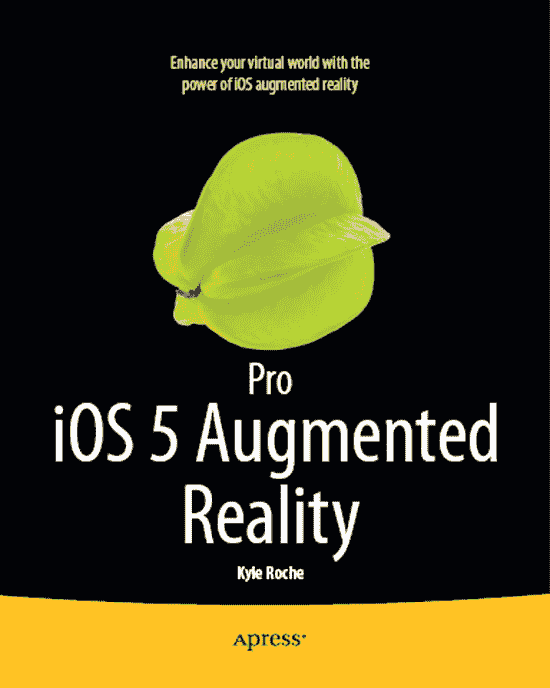
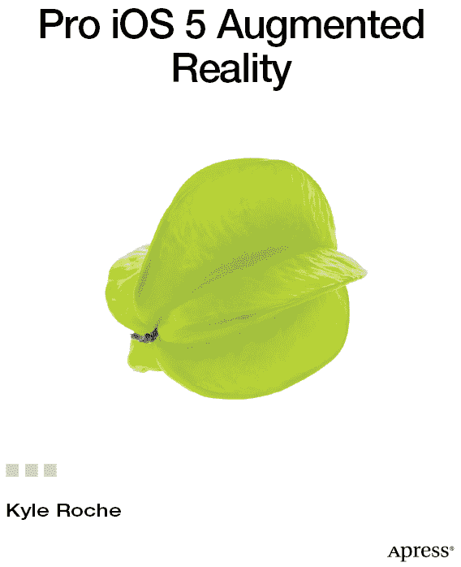

**精通 iOS 5 增强现实**

版权所有 © 2011 Kyle Roche

本作品受版权保护。出版商保留所有权利，无论涉及材料的全部或部分，具体包括翻译、重印、重用插图、朗诵、广播、以缩微胶片或任何其他物理方式复制，以及信息存储与检索的传输、电子改编、计算机软件，或现在已知或日后开发的任何类似或不同方法的权利。与本评论或学术分析相关的简短摘录，或为在计算机系统上输入和执行而专门提供的材料（仅供本作品的购买者独家使用）除外，不受此法律保留的限制。本出版物或其部分的复制，仅允许在出版商所在地现行版权法的规定下进行，且使用许可必须始终从 Springer 获取。使用许可可通过版权清算中心的 RightsLink 获取。违反行为将根据相应版权法受到起诉。

国际标准书号-13（平装）：978-1-4302-3912-3

国际标准书号-13（电子版）：978-1-4302-3913-0

本书中可能出现商标名称、徽标和图像。我们不会在每个商标名称、徽标或图像出现时都使用商标符号，而是仅以编辑方式使用这些名称、徽标和图像，以利于商标所有者，且无意侵犯商标权。

本出版物中使用的商号、商标、服务标志及类似术语，即使未明确标识，也不应被视为对其是否受所有权保护的看法。

尽管本书中的建议和信息在出版时被认为是真实和准确的，但作者、编辑和出版商均不对可能存在的任何错误或遗漏承担法律责任。出版商对书中所含内容不作任何明示或暗示的保证。

总裁与出版人：Paul Manning
首席编辑：Kate Blackham
技术审阅人：Yosun Chang, Peter Ma, Graham Wood
编辑委员会：Steve Anglin, Mark Beckner, Ewan Buckingham, Gary Cornell, Morgan Ertel, Jonathan Gennick, Jonathan Hassell, Robert Hutchinson, Michelle Lowman, James Markham, Matthew Moodie, Jeff Olson, Jeffrey Pepper, Douglas Pundick, Ben Renow-Clarke, Dominic Shakeshaft, Gwenan Spearing, Matt Wade, Tom Welsh
协调编辑：Corbin Collins
文字编辑：Vanessa Moore
排版：MacPS, LLC
索引编制：BIM Indexing & Proofreading Services
美术：SPi Global
封面设计：Anna Ishchenko

本书通过 Springer Science+Business Media, LLC 在全球图书贸易中发行，地址：233 Spring Street, 6th Floor, New York, NY 10013。电话：1-800-SPRINGER，传真：(201) 348-4505，电子邮件：[`http://orders-ny@springer-sbm.com`](http://orders-ny@springer-sbm.com)，或访问 [`www.springeronline.com`](http://www.springeronline.com)。

有关翻译信息，请发送电子邮件至 [`rights@apress.com`](http://rights@apress.com)，或访问 [`www.apress.com`](http://www.apress.com)。

Apress 及 friends of ED 的书籍可批量购买用于学术、企业或促销用途。大多数书籍也提供电子书版本和许可证。如需更多信息，请参考我们的特殊批量销售–电子书许可网页，网址为 [`http://www.apress.com/info/bulksales`](http://www.apress.com/info/bulksales)。

作者在本文中引用的任何源代码或其他补充材料，读者可在 [`www.apress.com`](http://www.apress.com) 获取。有关如何查找本书源代码的详细信息，请访问 [`www.apress.com/source-code/`](http://www.apress.com/source-code/)。

## 内容概览

 目录

 关于作者

 关于技术审阅人

 致谢

 前言

 第 1 章：引言

 第 2 章：硬件对比

 第 3 章：使用定位服务

 第 4 章：iOS 传感器

 第 5 章：声音与用户反馈

 第 6 章：摄像头与视频捕获

 第 7 章：使用 cocos2D 实现增强现实

 第 8 章：构建 cocos2D 增强现实游戏

 第 9 章：第三方增强现实工具包

 第 10 章：使用 OpenGL ES 构建基于标记的增强现实应用

 第 11 章：构建社交增强现实应用

 第 12 章：面部识别技术

 第 13 章：构建面部识别增强现实应用

索引

