# 目录

- 视频捕捉
- 在视频预览上构建基础
- 构建帧捕获的基础
- 总结
- 使用 cocos2D 进行增强现实
- 概述
- 安装
- 安装项目模板
- 创建项目
- 你好，增强现实世界
- 调整默认视图
- 添加摄像头视图
- 缩放摄像头视图
- cocos2D 概念
- 场景
- 导演
- 图层
- 添加特效
- 处理触摸事件
- 视觉效果
- 添加音效
- 添加 HUD 图层
- 总结
- 构建 cocos2D 增强现实游戏
- 概述
- 创建项目
- 摄像头视图
- 创建游戏菜单
- 美术资源
- 辅助代码目录
- 完成菜单界面
- 添加菜单选项
- 启用摄像头支持
- 完成动作层
- 南瓜来了
- 结束游戏
- 总结
- 第三方增强现实工具包
- 概述
- 由 String 驱动
- String 的基本工作流程
- 额外功能
- Unity 集成
- 高级着色器和 OpenGL 特性
- 高通 SDK
- 构建我们自己的 QCAR 演示
- 创建 Xcode 项目
- EAGLView
- 重定向 UIView
- ARKit
- 总结
- 使用 OpenGL ES 构建基于标记的增强现实应用
- 构建一个标记
- 我们的标记
- OpenGL ES
- 创建项目
- 添加 String SDK
- EAGLView
- 创建 AR 视图控制器
- 总结
- 构建社交增强现实应用
- 准备工作
- 创建 Facebook 应用
- 克隆 Facebook iOS SDK
- 词汇课
- 方位角
- 修正方向
- 构建应用
- 致谢
- 所需框架
- 添加 Facebook iOS SDK
- 出发！
- 监听传感器更新
- 存储坐标
- 添加社交背景
- 好友图谱
- 总结
- 面部识别技术
- 面部识别的选择
- OpenCV
- iOS 5 CIDetector 类
- Face.com
- 使用 OpenCV 方法
- 捕获测试图像
- Haar 级联
- OpenCV 回顾
- 使用 CIDetector 类方法
- CIDetector 回顾
- 使用 Face.com API 方法
- Faces.detect API 调用
- 为示例添加 Face.com 支持
- Face.com API 密钥
- 添加 Face.com 标注
- 性能测量
- 总结
- 构建面部识别增强现实应用
- 应用目的
- 所用技术
- 准备工作
- Face.com
- cocos2D
- 设置我们的 Twilio 账户
- 下载 ASI-HTTP-Request 库
- JSON 框架
- 项目结构
- 设置主场景
- 启用摄像头
- Face.com API
- 使用 ASI-HTTP-Request 库
- 创建 POST 请求方法
- 创建 NSTimer
- 解析输出
- 构建我们的 HUD 层
- 添加 Twilio 标注
- 总结
- 索引

## 关于作者

 **凯尔·罗奇**自 2000 年以来一直专注于新兴技术。在 Appirio 任职期间，他领导了一些全球首批且规模最大的 Google 和[`Force.com`](http://Force.com)云平台迁移项目。他是 RingDNA（[`ringdma.com`](http://ringdna.com)）的首席架构师，也是 2lemetry（[`2lemetry.com`](http://2lemetry.com)）的联合创始人。移动应用和联网电子设备（M2M）是凯尔所有项目的主要关注点。增强现实和游戏框架在这些应用的视觉呈现中扮演着重要角色。凯尔曾学习数学，并曾是新墨西哥大学摔跤队的一员。他目前与妻子杰西卡以及四个孩子——奥丹、艾弗里、凯莉和蒂米——居住在科罗拉多州丹佛市。如果在家庭生活之外有空闲时间，凯尔会用来打冰球或为当地非营利组织开发 iOS 应用。你可以在[`kyleroche.com`](http://kyleroche.com)找到他。


## 关于技术审校者

 **张耀森**自 2009 年初便开始为 iOS 和 Android 平台开发应用，目前正在参与一家名为 nusoy 的创业公司，致力于下一代 3D 与增强现实移动游戏的研发。在此之前，自 1999 年起，她一直从事基于 LAMP 架构和 Flash 的 Web 开发工作。她还曾以艺名 Ina Centaur 在多个虚拟世界、戏剧及增强现实会议上发表演讲。她在加州大学圣地亚哥分校和加州大学伯克利分校拥有物理学和哲学的研究生学历。她是一位热忱的读者，其编程技艺多源自技术书籍（例如本书），因此在审校章节时，她仔细阅读了每一个字——并核实了资料来源。可在 Twitter 上通过`@yosunchang`联系她。

 **马彼得**自 2007 年起便从事 Web、iOS、Android、WebOS 和 WP7 的开发工作。他参与的项目涵盖从数据库设计到移动端演示的方方面面。彼得曾多次赢得黑客马拉松和开发者挑战赛，且全部使用原生工具完成。他曾赢得一项 TED Prize 赞助的挑战赛，并在 TEDGlobal2010 期间发表了一场关于构建移动应用的 TED 演讲。移动应用 Pickup Sports 是 Spotvite 的基础，并拥有超过 80,000 名注册用户。彼得还积极参与众多开源项目；他开创了 TEDx 应用，帮助组织者构建自己的 iOS 和 Android 应用程序。可通过 Twitter 上的`@Nyceane`联系他。

 **格雷厄姆·伍德**是一名移动应用开发者，主要专注于 iOS 平台。他拥有 11 年的软件开发经验，其中大部分时间用于为商用飞机编写安全关键型嵌入式系统软件。格雷厄姆拥有明尼苏达大学计算机科学理学学士学位。他的公司 Wood App Developers LLC 为客户开发移动应用程序，并拥有自己的 iOS 应用套件。可通过[`graham@woodappsllc.com`](http://graham@woodappsllc.com)联系他，或在 Twitter 上关注`@woodappsllc`。

## 前言

撰写这本书既有趣又令人兴奋！增强现实是一个迷人的新领域，拥有重塑我们如何将技术融入日常生活的巨大潜力。每周都有新的公司和工具包涌现，试图在这个新兴市场中分得一杯羹。

本书旨在为您快速构建这类应用程序提供入门指导。我从讨论应用程序的基础构成（如指南针和加速度计）开始，然后深入到图像处理背后更高级的理念。

本书面向有经验的 iOS 开发者。您应具备使用`Xcode`和`Objective-C`的中等经验。我将使用第三方框架以及一些新的`iOS5` API，向您展示如何构建用于位置、社交和游戏目的的增强现实应用程序。

您可以从 Apress.com 上本书的页面下载本书的源代码，或访问[`www.apress.com/source-code/`](http://www.apress.com/source-code/)。

## 第 1 章

### 引言

欢迎阅读*Pro iOS 5 Augmented Reality*。增强现实（AR）已在科幻电影中存在了数十年，在军事上用于平视显示器（HUD），而直到最近，它一直是未来的事物。随着 iPhone 和 Android 操作系统问世以来移动应用的蓬勃发展，诸如`Layar`（[`www.layar.com`](http://www.layar.com)）、`Metaio's Junaio`（[`www.junaio.com`](http://www.junaio.com)）和`Wikitude`（[`www.wikitude.com`](http://www.wikitude.com)）等应用已让增强现实走进了普通消费者的手中。在本书中，我将引导您了解如何为 iOS 创建自己的增强现实应用程序。

*时代*杂志将增强现实列为 2010 年十大技术趋势之一。*时代*杂志仅仅触及了 AR 潜在应用的皮毛。他们选择了一些供应商应用平台，如`Layar`，并讨论了一些更贴近日常的应用，例如美国邮政服务（USPS）所采用的应用。

### 现实世界与网络世界中的增强现实

USPS 于 2010 年在其网站上推出了一款增强现实应用。如果你曾从邮局寄过东西，你就能证明，要快速选择一个既满足需求又不耽误排队的箱子几乎是不可能完成的任务。你要么被迫使用一个浪费大量空间的大箱子，要么在身后 20 个人排着队的情况下，费力地把所有物品塞进一个*几乎*能装下所有东西的箱子里。USPS 尝试让这个过程变得更简单，且无需你离开家或办公室。基本上，你只需访问 USPS 网站（[`www.prioritymail.com`](http://www.prioritymail.com)），在出发去邮局之前，使用虚拟箱子模拟器和你的网络摄像头来尝试不同的箱子尺寸。其工作原理如下：

打印出一个特殊图标（USPS 鹰徽），以便模拟器知道在哪里放置虚拟箱子的全息投影。见图 1–1。

1. 确保你的网络摄像头已启用。
2. 启动虚拟箱子模拟器。将打印好的图像放在网络摄像头的视野中，模拟器便会围绕该图像放置代表不同运输容器选项的全息投影。见图 1–2。


**图 1–1.** *打印此鹰徽图标，USPS 用它来在你的摄像头画面中叠加一个模拟的运输容器。*

创建用于识别的图标或标记时，需要遵循几条基本原则。对于传统标记，你需要使用高对比度的物体，这些物体应具有一定独特性，并且在常见场景中不易出现。实际上，随机的图像往往更有效。此外，你应使用具有一定旋转角度且水平或垂直方向都不对称的图像。这有助于 AR 程序识别方向并进行相应调整。USPS 的标记就是这些原则的一个很好的例子。

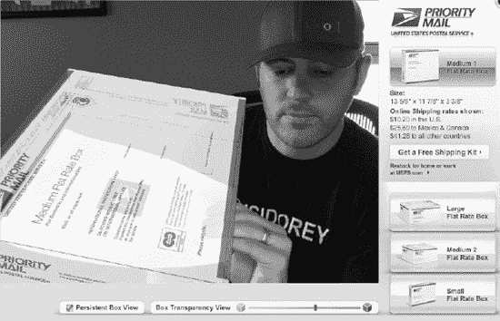

**图 1–2.** *全息投影叠加在打印的图标之上。*

注意图 1–2 中，模拟器允许你调整透明度，以不同角度和旋转方式移动待寄物品，并准确体验你需要哪种运输容器来寄送你的物品。USPS 使用该标记并通过某种识别算法在实时摄像头画面中找到它，追踪其方向，并用你当前选中的箱子来增强画面。


#### 流行文化

增强现实技术在广告、房地产、汽车行业，尤其是消费领域有着数百种应用。据维基百科统计，尽管数据显示超过半数的美国民众尝试过网购，但其收入仅占消费支出的 8%。显然，关于这项技术为何未能占据更大市场份额存在多种理论解释，其中既包括对在线隐私与安全的基本担忧，也不乏因缺乏实体互动体验而无法了解产品本身的观点。以服装为例，有些商品确实需要亲眼所见、亲手触摸才能决定购买。

大约在 2010 年末，我们开始看到多种 AR 体验渗入零售市场。作为 70 年代末成长起来的一代人，我记得简·杰特森只需按下按钮就能尝试新发型，或者卢克·天行者通过全息 3D 显示屏聆听关于死星接近方案的简报。如今这种体验已向消费者开放。从试穿新衣饰到查看杂货店苹果的产地，不妨看看以下近期案例：

*   *乐高数字展示台：* 乐高推出的店内交互终端，让孩子将心仪的套装盒放在摄像头前，系统随即在盒子上叠加显示完整的组装模型。孩子可以旋转、翻转模型，感受这是否真是他们想列入圣诞愿望清单的套装。
*   *Zugara：* Zugara 的"魔镜"让网购者无需鼠标键盘，只需站在摄像头前就能试穿不同款式的服装。除了叠加在线目录中的衣物，Zugara 还在摄像头画面中叠加控制界面，用户可通过手势操作菜单选项，或在社交网络分享新造型。
*   *FoodTracer：* 朱塞佩·科斯塔纳的这个项目利用 AR 图像识别技术，为杂货购物者提供所购食品的更多信息。只需在货架前挥动智能手机摄像头，相关信息便会即刻呈现。

互动体验的优势与吸引力显而易见。然而，还需考虑 AR 的一些附加价值：多数此类应用的后端都运行在云端。图像识别算法和摄像头解析功能主要在设备端运行，但广告数据、场景信息、位置目录以及与 AR 视图关联的其他动态内容均可从云端加载——这些集中存储的内容可实现无缝更新，使应用始终保持最新状态。

#### 游戏与基于位置的 AR

零售和店内交互终端并非 AR 成为趋势的唯一领域。社交网络、基于位置的服务以及游戏领域也在利用 AR 技术。想象一下游戏场景中通过摄像头与真实世界互动的情景。最近在某场会议上，我看到一个演示：iPhone 的 AR 视图中渲染出立体僵尸模型，用户只需轻点屏幕即可射击。这催生了如 iPhone 枪托等配件的二级市场，相关报道见[`www.augmentedplanet.com`](http://www.augmentedplanet.com)。这种步枪大小的配件可将 iPhone 固定在瞄准镜上，让用户以 AR 方式获得逼真的 3D 僵尸射击体验。

本书将介绍创建 AR 游戏的基础知识，包括加快产品上市速度的多种方案及可用 SDK。

### 准备工作就绪

你需要完成若干步骤，确保设备为 iOS 编程做好准备。本书将仅使用 Xcode 4.2，所有项目都存放在 GitHub 上。由于 Xcode 已内置原生的 Git 集成功能用于源代码管理，我们将利用这一特性简化操作并节省设置时间。

#### 注册 GitHub 账号

若已有 GitHub 账号可跳过本节。若无账号，则需要注册一个以获取各章节的素材和起始文件。打开浏览器访问[`www.github.com`](http://www.github.com)，点击页面中央的"注册"大按钮，如图 1-3 所示。


**图 1-3.** *GitHub 上的注册按钮清晰易见。*

本书中，我们将访问我为各章节预先配置的 Git 仓库；如果你乐于分享，也可以将任何个性化版本上传供其他读者参考。因此，我们只需选择"开源项目免费"账户类型。点击**创建免费账户**按钮并填写信息即可。


### 从你的电脑访问 GitHub

如果你以前用过 GitHub，可以跳过本节，本节面向尚未创建用于 GitHub 的 SSH 密钥的用户。

从你的电脑访问 GitHub 远程仓库有几种方式。我们将使用 SSH 访问，这意味着需要生成一个令牌并将其发布到 GitHub。从 Mac 上打开 **终端**（**应用程序**  **实用工具**  **终端**）。请参阅列表 1–1。按照同样的模式在你的终端窗口中操作。接下来我将解释具体步骤。

**列表 1–1.** *在你的 Mac 上创建 SSH 密钥*

```
Kyle-Roches-MacBook-Pro-2:~ kyleroche$ cd ~/.ssh
Kyle-Roches-MacBook-Pro-2:.ssh kyleroche$ ls
known_hosts
Kyle-Roches-MacBook-Pro-2:.ssh kyleroche$ ssh-keygen -t rsa -C "kyle@isidorey.com"
Generating public/private rsa key pair.
Enter file in which to save the key (/Users/kyleroche/.ssh/id_rsa):
Enter passphrase (empty for no passphrase): [enter a passphrase here]
Enter same passphrase again: [enter your passphrase again]
Your identification has been saved in /Users/kyleroche/.ssh/id_rsa.
Your public key has been saved in /Users/kyleroche/.ssh/id_rsa.pub.
The key fingerprint is:
26:9d:3a:82:fe:r9:gf:ba:39:30:6b:98:16:fe:3b:2c kyle@isidorey.com
The key's randomart image is:
+--[ RSA 2048]----+
|                 |
|                 |
|                 |
| .     . . 4      |
|. . . ..N        |
|.  o ..+r        |
| .. ...-|=.        |
|  ..+.-E.o       |
|   +.==oooo      |
+-----------------+
Kyle-Roches-MacBook-Pro-2:.ssh kyleroche$ ls
id_rsa          id_rsa.pub          known_hosts
```

如果你已经有现有密钥，目录列出命令的结果可能会有所不同。在这种情况下，为了安全起见，你可能希望备份密钥目录。首先，我们要使用 `ssh-keygen` 工具来创建一对 RSA 公钥/私钥。该工具会要求我们输入一个密码短语。这是可选的，但密码短语确实能增强安全性。我们大多数人都意识到，密码本身并不那么安全。不设置密码短语生成密钥对，相当于将密码以纯文本形式保存在你的电脑上。任何获得访问权限的人都能使用你的密钥。如果你比较懒，不想每次都输入密码，也别担心。钥匙串（因为大家用的都是 Mac）可以让你在第一次使用这对密钥后将其存储起来。

这样，我们就拥有了一对密钥。它存储在你目录列表中看到的新创建的 `id_rsa.pub` 文件中。在你喜欢的纯文本编辑器中打开这个文件，并复制其所有内容。务必复制所有内容，包括头部信息。

回到 GitHub，你的浏览器中应该已经打开了你的账户页面。从左上角的导航菜单中打开**账户设置**页面。然后打开左侧名为**SSH 公钥**的子选项卡。你应该会看到类似图 1–4 的内容。

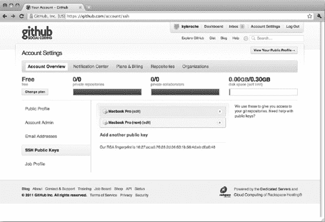

**图 1–4.** *在 GitHub 上打开 SSH 公钥对话框。*

找到页面中间的**添加另一个公钥**链接。这将打开一个对话框，你可以在其中粘贴我们刚刚创建的 `id_rsa.pub` 文件的内容。就这样！现在你已经在 GitHub 上设置好了，你的电脑可以通过 SSH 访问你的仓库了。

由于在本书中我们将使用 SSH 访问，让我们在继续之前先快速设置好默认偏好。

我们需要配置本地 Git 客户端，使其使用我们在注册 GitHub 时获得的凭据。首先，在终端窗口中运行列表 1–2 中的以下命令，为 Git 设置一些全局标志。这结合你的 SSH 密钥，将能让你的 Git 客户端向远程仓库进行身份验证。

**列表 1–2.** *在你的 Mac 上创建 SSH 密钥*

```
Kyle-Roches-MacBook-Pro-2: kyleroche$ git config --global user.name "Kyle Roche"
Kyle-Roches-MacBook-Pro-2: kyleroche$ git config --global user.email "kyle@isidorey.com"
```

### 设置 Xcode 4.2 和你的开发者账户

如果你已经设置好了 Xcode 4.2，可以跳过本节。

要将应用发布到 App Store，你需要 Xcode 和一个 Apple 开发者账户。我们可以同时处理这两个步骤。打开浏览器，访问 [`http://developer.apple.com/programs/register/`](http://developer.apple.com/programs/register/) 并点击顶部的**开始使用**按钮。这里有几种路径可供选择。如果你想使用现有的 Apple ID，可以填写并继续。参见图 1–5。或者，你也可以为 iOS 开发创建一个新 ID。这看起来可能不太合理，但使用一个账户存在一些隐患。

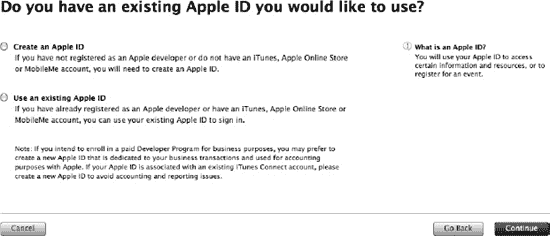

**图 1–5.** *使用现有 Apple ID 还是创建一个新 ID？*

**注意：** 选择合并你的 Apple ID 还是创建第二个，取决于你未来发布应用的意图。Apple 对账户可以关联的发布类型有限制。有两种发布应用的方式：通过 App Store 和通过 Apple 的企业分发计划。一个 Apple ID 不能同时关联这两种发布方式。如果你计划涉及这两种场景，请确保决定好哪个 ID 负责哪种发布方式。

如果你只想使用账户进行开发和调试，那么使用现有账户即可。这可能是最简单的路径。注册完成后，登录到 **iOSDev 中心**。找到**下载**链接。在撰写本文时，只有两个选项：**下载 Xcode 4.2** 和一串关于 iAd Producer 1.1 的链接。将 Xcode 4.2 下载到你的电脑上。下载文件相当大。这是 Xcode 的缺点之一。自从 iOS 以来，每个升级版本（其发布频率越来越快）都需要重新完整下载整个 IDE。

现在我们已设置好 IDE 和源代码管理策略。让我们将两者连接起来，确保我们已经准备好开始。


### 将 Xcode 项目关联到 GitHub

在浏览器中返回 GitHub。点击左上导航栏中的**仪表盘（Dashboard）**，然后找到**新建仓库（New Repository）**按钮。对于**项目名称（Project Name）**，我将使用 `iOS_AR_Ch1_Introduction`。你也可以自由选择自己的名称，或者如果你是有经验的 GitHub 用户，可以从 `https://github.com/kyleroche` 仓库 `fork` 我的项目。我所选择的选项可参见图 1-6。

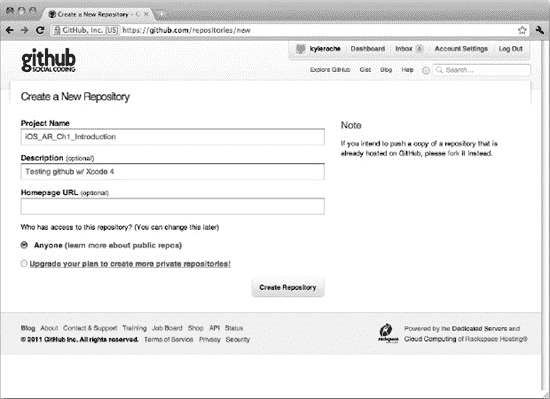

**图 1-6.** *在 GitHub 上创建新仓库。*

接下来，记下你的仓库的 SSH 网址。你会在确认页面的标题栏中看到它。其格式类似于 `git@github.com:kyleroche/iOS_AR_Ch1_Introduction.git`。下一步中你需要用到这个地址。

在你的本地机器上启动 Xcode。在启动时出现的**欢迎使用 Xcode（Welcome to Xcode）**对话框中，左侧应该有一个名为**连接到仓库（Connect to a Repository）**的选项。点击此选项，并输入你的 GitHub 仓库的 SSH 网址。我的配置可参见图 1-7。

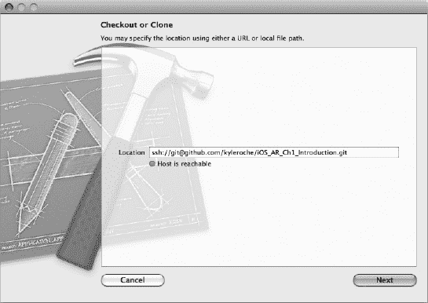

**图 1-7.** *克隆你的 GitHub 仓库以供本地访问。*

Xcode 会验证你的位置和克隆仓库的能力。等待片刻，直到指示器变为绿色且消息显示**主机可达（Host is reachable）**，然后点击**下一步（Next）**。

系统会提示你为新建项目命名。为简单起见，我使用与 GitHub 仓库相同的名称 `iOS_AR_Ch1_Introduction`。确保**类型（Type）**设置为**Git**，然后点击**克隆（Clone）**。

接下来，为你的本地仓库选择一个位置，并点击**下一步（Next）**。

**注意：** 在撰写本文时，Xcode 4.2 在使用 Git 方面仍存在一些错误。第一个错误应该会在上一步中显现出来。如果你的版本仍有问题，你将收到一个类似图 1-8 所示的错误。如果遇到这种情况，只需点击**重试（Try Again）**，选择相同的位置，选择**替换（Replace）**，一切就会恢复正常。

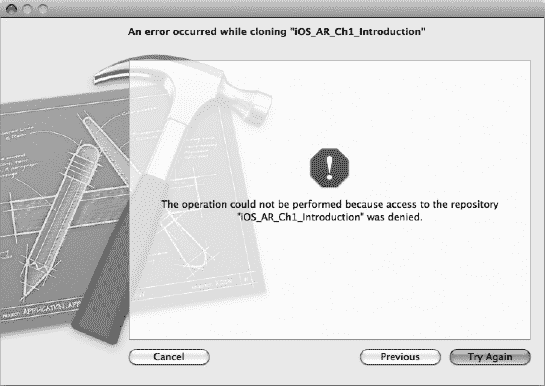

**图 1-8.** *Xcode 4.2 早期版本中的一个缺陷导致无效错误。只需点击重试即可消除。*

### 创建我们的 Xcode 项目

在 Xcode 的**欢迎使用 Xcode（Welcome to Xcode）**界面中，选择**创建一个新的 Xcode 项目（Create a New Xcode Project）**。我们这个项目不会有太多编码工作，因此模板类型并不那么重要。为简单起见，我将选择基于 Windows 的应用程序模板。下一个界面有一些更重要的选项。系统会要求你输入**产品名称（Product Name）**。这将作为你完整**捆绑标识符（Bundle Identifier）**的后缀。从这里开始情况会有所不同。除非你参与团队开发，否则此选项将是你的机器独有的。同样，为了简单起见，我将使用与我的 GitHub 仓库相同的名称。我的选项显示在图 1-9 中。

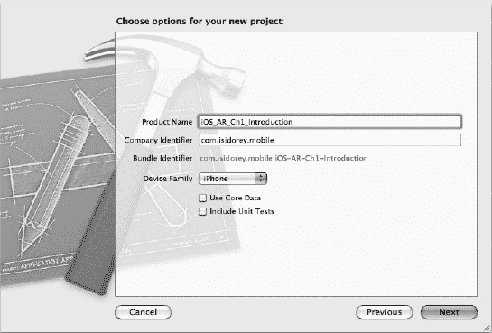

**图 1-9.** *选择你的新项目选项。*

你的**公司标识符（Company Identifier）**也会不同。在我们讨论通过 App Store 或企业分发选项分发应用程序之前，**公司标识符**可以使用反向 DNS 格式。填写完所有内容后，点击**下一步（Next）**。

最后，系统会提示你为该项目选择一个本地位置。确保你选择的是与克隆 GitHub 仓库相同的目录。另外，确保**为此项目创建本地 git 仓库（Create local git repository for this project）**选项*没有*被选中，如图 1-10 所示。

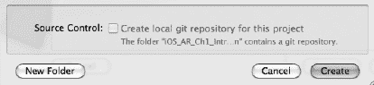

**图 1-10.** *不要创建本地 Git 仓库。*

太好了！我们刚刚创建了第一个项目。只剩下几步，我们就能开始在 GitHub 上更新代码了。以下步骤可能可以按不同顺序完成。我遵循这条路径是因为我觉得它更容易。随着 Xcode 4.2 的成熟，我相信我们会看到基于 GUI 的功能有所改进。

### 将项目连接到远程仓库

网上有很多关于集成 Xcode 和 GitHub 的教程。要开始连接你的项目并了解最新功能与变更，请访问 [`http://help.github.com/mac-set-up-git/`](http://help.github.com/mac-set-up-git/)。

### 接下来是什么？

以下是本书一些关键章节的快速预览。

#### 定位服务

大多数 AR 用例（至少早期的用例）都包含与用户位置相关的元素。无论是通过 AR 视图显示附近的餐厅，还是寻找朋友对夜生活的推荐，基于位置的 AR 都引领了这一潮流。在第 3 章中，我们将通过可在我们自己 AR 应用中使用的真实示例，学习 iOS 的地图和地理定位功能。

#### 传感器编程

创建 AR 应用需要大量与 iPhone 或 iPad 原生传感器的集成。传感器包括加速度计、数字罗盘和陀螺仪。在第 4 章中，我将通过小型项目向你介绍传感器开发，这些项目演示了我们将要在 AR 应用中复用的关键功能。

#### 灯光，摄像机，开拍……

在第 5 章中，我会介绍声音和用户反馈。声音在 AR 应用中并非最突出的功能，但它能带来更好的用户体验。之后，在第 6 章中，我们将深入探讨摄像头和视频编程。由于 AR 应用都是叠加在摄像头视图之上的，因此在我们开始构建本书结尾处的大型 AR 项目之前，本章是必不可少的基础章节。

#### 游戏框架

我选择使用 Cocos2D 来演示 AR 游戏功能。在第 7 章中，你将了解 Cocos2D 的基础知识，然后我们将在第 8 章中跟进一个实际应用。

#### 第三方框架

在第 9 章中，我会介绍几个能让基于标记的增强现实应用开发变得更简单的第三方框架。接下来我们将通过一个实际例子进行说明，然后转向更复杂的框架，例如 OpenCV（开源计算机视觉库），这是一个用于面部或复杂物体识别的开源库。在设备上进行面部识别存在一些限制。这些限制主要与硬件能力有关。我们将讨论利用公开 API 来补充面部识别的一些更具创意的方法。

### 总结

我希望你能从本书中学到很多。AR 在移动应用中是一个非常新的概念，拥有无限的可能性。开发者社区才刚刚开始探索这些可能性的表面。我希望这本书能为你开启进入 AR 世界的旅程提供一个良好的开端。

让我们从回顾一些应用布局选项和构建自己 AR 应用的框架开始吧。在下一章中，我们将讨论本书中会使用的硬件以及不同型号的主要功能。

## 第 2 章

## 硬件对比

每位移动开发者都会担心硬件兼容性问题。然而，为苹果 iOS 系列产品进行开发的主要好处在于硬件之间的标准化。诚然，设备存在不同的迭代版本，但厂商只有一家：苹果！对于其他移动操作系统，你还必须担心 OEM 厂商及其无限制的硬件配置变化。让我们来深入了解一下最新 iOS 设备的内部构造。


### 告别旧设备

我们将在示例项目中使用 iPhone 和 iPad。不过，只要代码在两个平台上完全可移植，我们就只针对 iPhone 进行编码。图 2–1 展示了 iPhone 4 的物理尺寸。

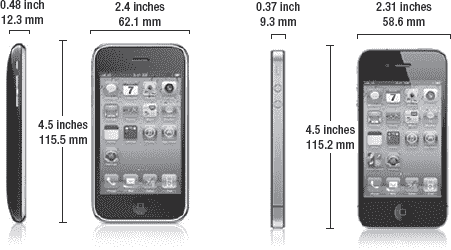

**图 2–1.** *这里展示了 iPhone 4 的物理尺寸。*

iPad 上市时间虽不如 iPhone 长，但其应用场景的吸引力毫不逊色。在本书中，我们仅以 iPad 2 为例。原因有几条。最重要的是，第一代 iPad 缺少前置摄像头，而本书后续会涉及一些人脸识别编程。图 2–2 展示了 iPad 2 的物理特性。

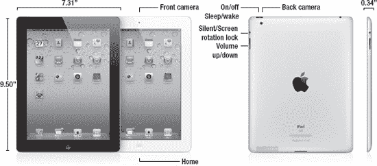

**图 2–2.** *这里展示了 iPad 2 的物理特性。*

### 硬件组件

我们不要仅仅罗列这些设备的硬件规格，而是花点时间讨论增强现实应用可能需要什么。首先，也是最明显的，设备需要摄像头。大多数增强现实用例都对位置和方向有所要求，因此 GPS 和指南针会很有用。可能还需要监听声音或输出声音，所以我们应该考虑麦克风和扬声器支持。我们会在示例中融入一些游戏功能，因此可能需要一些硬件加速能力和图形工具包。让我们将这些需求转化为苹果的术语，并逐步了解如何检测这些不同的硬件组件。

**注意：** 在查看 iOS 设备的不同硬件组件时，我会贴出一些小代码片段。在本章中，这些代码将脱离示例项目的上下文。不过，如果你想跟着操作，本章的所有代码都存放在以下 GitHub 仓库中：

[`https://github.com/kyleroche`](https://github.com/kyleroche)

#### 摄像头支持

自苹果推出 iPhone 3GS 以来，摄像头已经取得了长足的进步。与一些以摄像头为差异化特色的其他硬件型号相比，它仍有不少改进空间，但足以满足我们的需求。

在手机的视频能力上构建增强现实应用有两种方式。首先，你可以主动检查视频捕获中的元素、可识别对象等。或者，你可以将视频捕获作为应用的背景，同时完全忽略其内容。我们在增强现实浏览器中经常看到这种方法，因为持续检查视频捕获涉及繁重的处理。在本书中，我们将逐步介绍这两种方法的示例。

表 2–1 详细介绍了本书将使用的硬件关于摄像头和视频能力的规格。

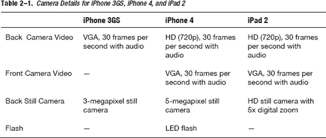

##### 检测摄像头

我们可以通过使用 `UIImagePickerController` 类以编程方式检测设备上可用的摄像头。有一个名为 `isSourceTypeAvailable:` 的方法，我们可以用它来确定设备上是否有我们想要使用的摄像头。代码清单 2–1 展示了如何使用 `isSourceTypeAvailable:` 方法的示例。

**代码清单 2–1.** *检测摄像头，然后检测前置摄像头*

```
BOOL cameraAvailable = [UIImagePickerController isSourceTypeAvailable:UIImagePickerControllerSourceTypeCamera];
    BOOL frontCameraAvailable = [UIImagePickerController isSourceTypeAvailable:UIImagePickerControllerCameraDeviceFront];

    if (cameraAvailable) {
        UIAlertView *alert = [[UIAlertView alloc] initWithTitle:@"Camera"
                                                        message:@"Camera Available"
                                                       delegate:self
                                              cancelButtonTitle:@"OK"
                                              otherButtonTitles:nil, nil];
        [alert show];
        [alert release];
    } else {
        UIAlertView *alert = [[UIAlertView alloc] initWithTitle:@"Camera"
                                                        message:@"Camera NOT Available"
                                                       delegate:self
                                              cancelButtonTitle:@"OK"
                                              otherButtonTitles:nil, nil];
        [alert show];
        [alert release];
    }

    if (frontCameraAvailable) {
        UIAlertView *alert = [[UIAlertView alloc] initWithTitle:@"Camera"
                                                        message:@"Front Camera Available"
                                                       delegate:self
                                              cancelButtonTitle:@"OK"
                                              otherButtonTitles:nil, nil];
        [alert show];
        [alert release];
    } else {
        UIAlertView *alert = [[UIAlertView alloc] initWithTitle:@"Camera"
                                                        message:@"Front Camera NOT Available"
                                                       delegate:self
                                              cancelButtonTitle:@"OK"
                                              otherButtonTitles:nil, nil];
        [alert show];
        [alert release];
    }
```

这段代码将通过快速弹出的 `UIAlertView` 来展示结果。实际上，你会从这个示例中得到两个弹窗。你可以在代码清单 2–1 的开头几行看到，我们正在检查 `UIImagePickerControllerSourceTypeCamera` 是否存在，以确定摄像头是否可用。接下来，我们使用 `UIImagePickerControllerCameraDeviceFront` 参数检查前置摄像头是否存在。`isSourceTypeAvailable:` 方法返回一个 `BOOL` 值。我们在 `if/else` 语句中使用该值，并为每次检查显示相应的 `UIAlertView`。

那么，既然我们只使用 iPhone 3GS、iPhone 4 和 iPad 2，为什么还要检查摄像头呢？它们不都有摄像头吗？是的，它们都有摄像头。然而，我们也会在 Xcode 中使用模拟器进行编码。与其他一些移动操作系统的 IDE 不同，Xcode 模拟器不支持摄像头。

看看图 2–3。这两张截图均来自运行上述示例代码块的 iPhone 4 设备。由于代码块中两个 `if/else` 都会执行，所以我们得到了两个 `UIAlertView` 对话框。从对话框中可以看到，两次检查都返回了 `True`，这意味着摄像头和前置摄像头都可用。

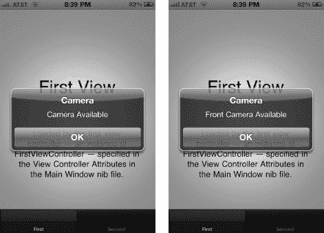


### 硬件功能检测

**图 2–3.** *我们首先检测摄像头（左图），然后在 iPhone 4 上检测前置摄像头（右图），得到了这些结果。*

为了证明这些函数确实会检测摄像头的可用性，我在 Xcode 的 iPhone 4.3 模拟器上运行了相同的代码。结果弹出的对话框相反，如图 2–4 所示。

我们本可以使用其他选项来检测摄像头。从技术上讲，我们的第一次检测是检查是否有任何摄像头可用。我们也可以使用 `UIImagePickerControllerCameraDeviceRear` 作为源类型参数，专门检测后置摄像头。或者，我们可以检查设备当前闪光灯设置的几个选项。这个选项略有不同。我们要么专门检查我们想要验证的模式，例如 `UIImagePickerControllerCameraFlashModeOn`，要么使用 `isFlashAvailableForCameraDevice` 方法。

关于如何使用摄像头拍摄照片和视频，我们将在第 8 章中详细讨论。

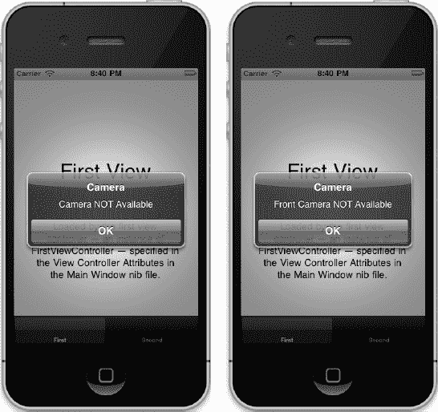

**图 2–4.** *我们在 iPhone 4.3 模拟器上检测摄像头（左图），然后检测前置摄像头（右图）。*

#### 检测定位能力

iOS 提供了 `Core Location Framework` 用于与设备上的基于位置的服务和硬件进行交互。不幸的是，`Core Location Framework` 没有提供任何检测 GPS 是否存在的方法。相反，你应该在应用程序本身上强制这些硬件要求（参见本章后面的“强制硬件要求”）。

现在，需要明确的是，你仍然可以检查位置服务是否已启用。尽管每个版本的 iOS 都提供位置服务，但在某些情况下它们可能对你的应用程序不可用。例如：

*   用户可以在“设置”应用程序中禁用位置服务。
*   用户可以拒绝特定应用程序的位置服务。
*   设备可能处于飞行模式，无法为必要的硬件供电。

基于这些原因，在尝试使用任何位置服务之前，你应该始终调用 `CLLocationManager` 的 `locationServicesEnabled` 类方法。如果用户故意禁用了这些服务，当你尝试使用位置服务时自动弹出的提示可能不是你的应用程序受欢迎的功能。

有两种方法可用于确定用户的位置：

*   **标准定位服务** 是一种可配置、通用的解决方案，所有版本的 iOS 都支持。
*   **重大变化位置服务** 为具有蜂窝无线电的设备提供低功耗位置服务。此服务仅在 iOS 4.0 及更高版本中可用，可以唤醒已挂起或未运行的应用程序。

我们将在第 4 章中详细讨论如何启动和使用定位服务。

#### 数字指南针

我们之前提到，增强现实应用程序也可能从方向航向中受益。实际上，对于任何基于位置的 AR 应用程序来说，这都是一项要求，否则你将无法确定用户面对的方向。检测磁力计（数字指南针）相当直接。在使用 `Core Location Framework` 之前，必须执行两个步骤来准备项目。

首先，必须将应用程序二进制文件与 `Core Location` 库链接。点击 Xcode **项目导航器** 中的项目名称。将视图切换到应用程序目标的 **构建阶段** 选项卡。有一个名为 **链接二进制文件与库** 的部分。展开此部分，点击 `+` 按钮添加一个新库。在图 2–5 中，你可以看到我们正在添加到项目中的 `Core Location Framework`。

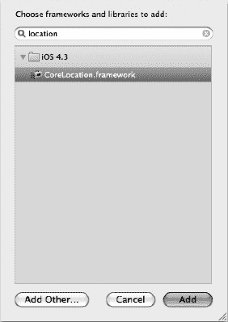

**图 2–5.** *将 Core Location Framework 添加到应用程序二进制文件中。*

其次，确保将清单 2–2 中的 `import` 语句添加到你的头文件中。

**清单 2–2.** *引入 Core Location Framework*

```
#import <CoreLocation/CoreLocation.h>
```

添加 `Core Location Framework` 后，你可以将清单 2–3 添加到清单 2–1 的代码片段中，以检测磁力计的存在。所有这些代码都属于 `.m` 文件。请注意，我们使用的是 `headingAvailable` 类方法，而不是属性。该属性最近已被弃用，而类方法是检测航向是否可用的首选方式。

在 GitHub 上发布的示例中，我将所有这些代码保留在 `viewDidLoad` 方法中，以确保在视图呈现时运行。

**清单 2–3.** *检测磁力计*

```
BOOL magnetometerAvailable = [CLLocationManager headingAvailable];
    if (magnetometerAvailable) {
        UIAlertView *alert = [[UIAlertView alloc] initWithTitle:@"Magnetometer"
                                                        message:@"Magnetometer Available"
                                                       delegate:self
                                              cancelButtonTitle:@"OK"
                                              otherButtonTitles:nil, nil];
        [alert show];
        [alert release];
    } else {
        UIAlertView *alert = [[UIAlertView alloc] initWithTitle:@"Magnetometer"
                                                        message:@"Magnetometer NOT Available"
                                                       delegate:self
                                              cancelButtonTitle:@"OK"
                                              otherButtonTitles:nil, nil];
        [alert show];
        [alert release];
    }
```

与摄像头一样，磁力计是另一种在模拟器上不可用的硬件组件。图 2–6 展示了清单 2–3 中的代码在 iPhone 4.3 模拟器上运行的情况。

如果你在物理 iPhone 设备或 iPad 上运行相同的代码块，你将得到相反的消息。

请记住，如果磁力计不可用，你仍然可以使用硬件要求来阻止应用程序在特定设备上启动。有关此主题的更多详细信息和说明，请参阅“强制硬件要求”部分。我们将在第 7 章中介绍数字指南针的更高级用法。

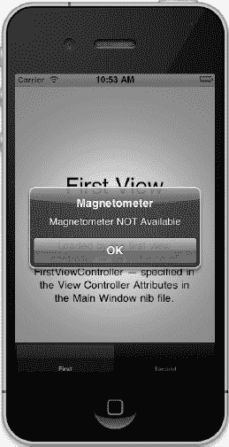

**图 2–6.** *在 iPhone 4.3 模拟器上检测磁力计*


#### 音频检测

检测音频功能的方式与检测其他组件相同。检查音频需要用到 AVFoundation 框架。按照本章前面链接 Core Location 框架的方式，将此框架链接到你的应用程序二进制文件中。接着，在头文件中添加适当的 `import` 语句，如代码清单 2-4 所示。

**代码清单 2-4.** *添加 Import 语句*

```
#import <AVFoundation/AVFoundation.h>
```

最后，切换到 `.m` 文件，取消注释 `viewDidLoad` 方法。或者，如果你将此代码添加到与位置服务和磁力计检测相同的文件中，可以直接附加代码清单 2-5 中的代码。

**代码清单 2-5.** *导入 AVFoundation 框架*

```
AVAudioSession *audioSession = [AVAudioSession sharedInstance];
BOOL audioAvailable = audioSession.inputIsAvailable;

    if (audioAvailable) {
        UIAlertView *alert = [[UIAlertView alloc] initWithTitle:@"音频"
                                                        message:@"音频可用"
                                                       delegate:self
                                              cancelButtonTitle:@"确定"
                                              otherButtonTitles:nil, nil];
        [alert show];
        [alert release];
    } else {
        UIAlertView *alert = [[UIAlertView alloc] initWithTitle:@"音频"
                                                        message:@"音频不可用"
                                                       delegate:self
                                              cancelButtonTitle:@"确定"
                                              otherButtonTitles:nil, nil];
        [alert show];
        [alert release];
    }
```

#### 检测视频功能

我们已经确认构建增强现实应用所需的大多数组件都已存在于设备上。然而，有摄像头可用并不一定意味着它能进行视频捕捉。而正是视频捕捉功能让增强现实应用如此吸引人。

检测摄像头的视频功能比单纯检测摄像头是否存在要复杂一些。为此，我们需要将 Mobile Core Services 框架添加到项目中。按照之前检测磁力计时添加 Core Location 框架的模式操作，但这次添加的是名为 `MobileCoreServices.framework` 的框架。在你的头文件中，在其他 `import` 语句之后添加代码清单 2-6 中的代码。然后，在 `@end` 之前添加代码清单 2-7 中的代码。

**代码清单 2-6.** *导入 Mobile Core Services 框架*

```
#import <MobileCoreServices/UTCoreTypes.h>
```

**代码清单 2-7.** *声明 isVideoCameraAvailable 方法*

```
- (BOOL) isVideoCameraAvailable;
```

在代码清单 2-7 中，我们声明了一个方法签名，以便使用辅助函数来检测视频功能。切换到类的 `.m` 文件，并添加代码清单 2-8 中的辅助函数。

**代码清单 2-8.** *在 .m 文件中添加辅助函数*

```
- (BOOL) isVideoCameraAvailable
{
    UIImagePickerController *picker = [[UIImagePickerController alloc] init];
    NSArray *sourceTypes = [UIImagePickerController availableMediaTypesForSourceType:picker.sourceType];
    [picker release];

    if (![sourceTypes containsObject:(NSString *)kUTTypeMovie]){

        return NO;
    }

    return YES;
}
```

在这段代码中，我们简单地检查所有可用的媒体源类型，然后检查该数组是否包含值为 `kUTTypeMovie` 的 `NSString` 对象。如果找到这个值，则说明设备摄像头支持视频功能。现在，这个方法已经声明并对我们的类可用，我们可以采用与检测其他组件相同的模式。在检查摄像头支持的代码之后，添加代码清单 2-9 中的代码。

**代码清单 2-9.** *调用新的辅助函数来检测视频功能*

```
if ([self isVideoCameraAvailable]) {
        UIAlertView *alert = [[UIAlertView alloc] initWithTitle:@"视频"
                                                        message:@"视频可用"
                                                       delegate:self
                                              cancelButtonTitle:@"确定"
                                              otherButtonTitles:nil, nil];
        [alert show];
        [alert release];
    } else {
        UIAlertView *alert = [[UIAlertView alloc] initWithTitle:@"视频"
                                                        message:@"视频不可用"
                                                       delegate:self
                                              cancelButtonTitle:@"确定"
                                              otherButtonTitles:nil, nil];
        [alert show];
        [alert release];
    }
```

正如你所料（因为我们之前已经确定模拟器上没有摄像头），在模拟器上你同样找不到视频功能。


#### 加速度计与陀螺仪

许多应用场景（如虚拟试衣间或我在第 1 章中提到的邮局示例）都利用了固定位置摄像头的增强现实功能。然而，在大多数移动应用场景中，用户将能够移动设备、改变方向或四处走动来与应用程序交互。为了响应用户的移动，我们需要结合使用陀螺仪和加速度计的数据。在开始验证它们是否存在于设备上之前，让我们花点时间来了解这两个组件之间的区别。

加速度计通过测量三个轴上的数据来评估静止平台相对于地球表面的方向。如果设备仅朝一个特定方向加速，则无法与地球引力产生的加速度区分开。仅凭这种测量方式的问题在于，它无法提供足够的信息来维持特定的方向。

陀螺仪最早出现在 iPhone 4 中，它对加速度计进行了补充，因为它能够测量绕某个轴的旋转速率。使用同样的例子，陀螺仪可以测量绕轴旋转的恒定状态，并在旋转停止或改变时进行报告。通常，陀螺仪可在六个轴上工作。iPhone 4 配备的是三轴陀螺仪。

简而言之，陀螺仪测量并维持方向，而加速度计测量振动。我们将在后面的章节中了解在何时何地使用这些组件。首先，让我们看看如何在自己的应用中检测它们的存在。

检测陀螺仪的存在需要添加另一个框架。在这种情况下，我们需要向应用程序添加 Core Motion 框架。将框架链接到应用程序二进制文件，就像我们在本章中对之前的框架所做的操作一样。接下来，打开你想要检测陀螺仪是否存在的头文件。在最后一个`import`语句下，将代码清单 2-10 中的代码添加到头文件中。

**代码清单 2-10.** *导入 Core Motion 框架*

```
#import <CoreMotion/CoreMotion.h>
```

接下来，在头文件的`@end`上方添加代码清单 2-11 中的代码，以声明我们新的辅助方法。

**代码清单 2-11.** *声明辅助方法*

```
- (BOOL) isGyroscopeAvailable;
```

接下来，我们将构建辅助函数，以便我们可以在`if/else`语句中引用它，就像我们对其他硬件检查所做的那样。将代码清单 2-12 中的代码复制到该类的`.m`文件中。

**代码清单 2-12.** *辅助方法检查陀螺仪是否可用*

```
- (BOOL) isGyroscopeAvailable
{
#ifdef __IPHONE_4_0
    CMMotionManager *motionManager = [[CMMotionManager alloc] init];
    BOOL gyroscopeAvailable = motionManager.gyroAvailable;
    [motionManager release];
    return gyroscopeAvailable;
#else
    return NO;
#endif
}
```

我们使用`CMMotionManager`类的`gyroAvailable`属性来检查陀螺仪是否存在。请注意，我们将其包裹在对`__IPHONE_4_0`宏的检查中。由于陀螺仪在 iPhone 4 之前的版本中不可用，因此我们无需检查它。

最后，我们需要在`viewDidLoad`方法中调用这个新方法，并将其与我们的其他验证放在一起。在检查摄像头的代码下方，添加代码清单 2-13 中的代码。

**代码清单 2-13.** *调用陀螺仪辅助方法*

```
if ([self isGyroscopeAvailable]) {
        UIAlertView *alert = [[UIAlertView alloc] initWithTitle:@"陀螺仪"
                                                        message:@"陀螺仪可用"
                                                       delegate:self
                                              cancelButtonTitle:@"确定"
                                              otherButtonTitles:nil, nil];
        [alert show];
        [alert release];
    } else {
        UIAlertView *alert = [[UIAlertView alloc] initWithTitle:@"陀螺仪"
                                                        message:@"陀螺仪不可用"
                                                       delegate:self
                                              cancelButtonTitle:@"确定"
                                              otherButtonTitles:nil, nil];
        [alert show];
        [alert release];
    }
```

你可能已经猜到了，模拟器上并不提供陀螺仪。所以，如果你想测试它，需要将应用程序部署到你的设备上。

### 强制执行硬件要求

在你的应用中，在使用所需硬件之前检查其是否存在始终很重要，但如果你的应用不满足硬件要求，你也可以阻止它启动。配置应用的`Info.plist`文件即可实现这一点。`Info.plist`文件是所有 iOS 模板的标准组件。Xcode 4.2 模板会在项目中的`Supporting Files`目录下生成此文件。它将命名为`ProjectName-Info.plist`，其中`ProjectName`是你的 Xcode 项目名称。

要为应用添加硬件要求，首先需要在`Info.plist`文件中添加另一个键。如果在 Xcode 中打开了该文件，你可以从右键上下文菜单中选择**添加行**。Xcode 4.2 使用描述来选择新键，因此请查找**所需设备功能**。此键是一个值的数组，对应于 iOS 设备的各种硬件组件。例如，你可以添加`telephony`键来要求电话应用程序，或者添加`front-facing-camera`来要求设备具有前置摄像头。

使用硬件要求需要谨慎，并且在提交到 App Store 时会产生一些影响。你需要确保要求所有将要使用的组件，但不要限制你的设备选项。在 GitHub 上的示例项目中（参见本章开头的注释），我为`wifi`和`still-camera`添加了硬件要求，这样你就有了一个可运行的示例。

表 2-2 列出了`UIRequiredDeviceCapabilities`键（例如**所需设备功能**）可用的其他各种键。

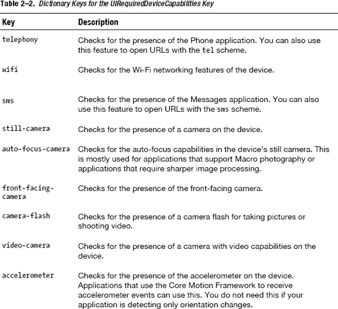

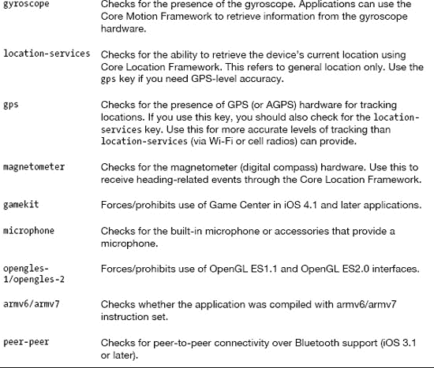

### 本章小结

在本章中，我们回顾了增强现实应用程序中常用的硬件组件。我们还逐步介绍了在设备上检测这些硬件的必要步骤，甚至在先决条件不满足时限制应用程序启动的方法。在接下来的几章中，我们将深入探讨如何使用这些组件中的每一个，并从硬件获取信息。所有这些都将为我们编写一个功能齐全的增强现实应用程序奠定基础。

在下一章中，我们将从 iOS 中可用的视图和布局开始，以及我们将在示例应用程序中使用的那些视图和布局。

## 第 3 章

## 使用定位服务

尽管本书主要讨论增强现实，但地图和定位服务的编程构成了成功 AR 应用所需的许多基础方面。在本章中，我们将探讨 iOS 的地图功能以及一些将定位服务集成到 AR 应用中的高级技术。

如果你过于兴奋地直接跳到本章而跳过了第 2 章，我建议你返回去快速浏览一下“检测定位功能”这一节。其中涵盖了如何确保定位服务可用，以及如何防止你的应用尝试访问用户可能已禁用的服务。如果你准备好深入学习了，那就让我们开始吧。


### 您现在的位置

我们先从一个示例开始。首先，打开 Xcode 并创建一个新项目。选择 `Tab Bar Application` 作为模板，并将项目命名为 `iOS_AR_Ch3_LocationServices`。确保设备系列设置为 `iPhone`。本章介绍的所有内容都可以轻松复用到你的 iPad 应用中。因此，为简单起见，本章仅使用 iPhone 进行演示。

此步骤为可选项。我为这个 Xcode 项目创建了一个本地 Git 仓库。在终端中，我导航到新项目的目录，并运行了清单 3–1 中所示的命令。本章的完成项目可在 `github.com/kyleroche` 获取。

**清单 3–1.** *将本地仓库连接到 GitHub*

```
Kyle-Roches-MacBook-Pro-2:iOS_AR_Ch3_LocationServices kyleroche$ git remote add origin git@github.com:kyleroche/iOS_AR_Ch3_LocationServices.git
Kyle-Roches-MacBook-Pro-2:iOS_AR_Ch3_LocationServices kyleroche$ git push -u origin master
Counting objects: 19, done.
Delta compression using up to 8 threads.
Compressing objects: 100% (17/17), done.
Writing objects: 100% (19/19), 10.78 KiB, done.
Total 19 (delta 5), reused 0 (delta 0)
To git@github.com:kyleroche/iOS_AR_Ch3_LocationServices.git
 * [new branch]      master -> master
Branch master set up to track remote branch master from origin.
```

我们选择了标签栏应用，这样我们可以继续构建本章中的概念，而不会在后续过程中过度覆盖它们。首先，在 Xcode 中打开 `FirstViewController.h` 文件。我们将声明构建此演示所需的一些插座变量。在 Xcode 中打开 `FirstViewController.h` 文件，并在 `@interface` 代码块中添加清单 3–2 中的代码。

**清单 3–2.** *在接口中声明 UITextView*

```
UITextView *locationTextView;
```

现在，在头文件的 `@end` 之前，添加清单 3–3 中的代码。

**清单 3–3.** *将属性添加到类中*

```
@property (nonatomic, retain) IBOutletUITextView *locationTextView;
```

我们将使用这个 `UITextView` 插座变量来打印将要审查的位置服务信息。在使用此插座变量之前，我们必须在 `.m` 文件中对其进行 `synthesize`（合成）和释放。切换到 Xcode 中的 `FirstViewController.m`，并添加清单 3–4 中加粗的行。

**清单 3–4.** *合成并释放 UILabel*

````
#import "FirstViewController.h"

@implementation FirstViewController
@synthesize locationTextView; // 合成 *locationTextView

/*
// Implement viewDidLoad to do additional setup after loading the view, typically from a nib.
- (void)viewDidLoad
{

    [superviewDidLoad];
}
*/

- (BOOL)shouldAutorotateToInterfaceOrientation:(UIInterfaceOrientation)interfaceOrientation
{
    // Return YES for supported orientations
    return (interfaceOrientation == UIInterfaceOrientationPortrait);
}

- (void)didReceiveMemoryWarning
{
    // Releases the view if it doesn't have a superview.
    [super didReceiveMemoryWarning];

    // Release any cached data, images, etc. that aren't in use.
}

- (void)viewDidUnload
{
    [super viewDidUnload];

    // Release any retained subviews of the main view.
    // e.g. self.myOutlet = nil;
}

- (void)dealloc
{
    [locationTextView release];  // 释放 UITextView
    locationTextView = nil; // 释放后设置为 nil 是良好实践
    [superdealloc];
}
@end
````

你可能注意到我释放了变量，然后又将其设置为 `nil`。在大多数情况下，这是内存管理的好习惯。本书不侧重于这些主题，但我们会在适当的时候指出一些与增强现实和内存管理相关的细节。增强现实应用在类中使用了大量代理，而内存管理是正确构建 AR 应用结构的一个重要方面。

既然我们已经定义了一个可用于文本更新的 `UITextView`，接下来我们在 XIB 文件中创建该组件。在 Xcode 的 `Project Navigator` 中点击 `FirstView.xib` 以打开设计视图。你应该能看到类似于图 3–1 所示的内容。

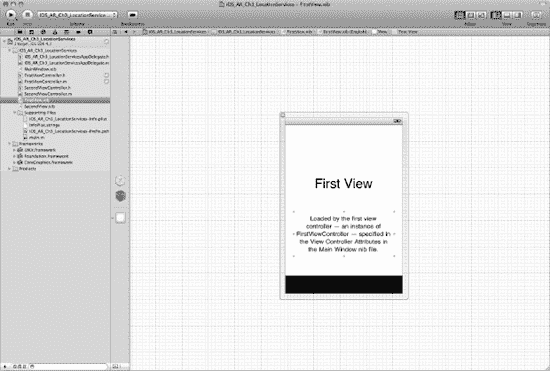

**图 3–1.** *在设计视图中打开 FirstView.xib。*

你会注意到布局中已经有一些组件了。这就是我们选择添加 `UITextView` 的原因。我们将直接使用已存在的某个组件。在设计窗口的左侧，有一个半透明立方体的图标。按住 Ctrl 键，从该图标点击并拖动到 iPhone 屏幕上的 `UITextView` 插座变量上。请参考图 3–2。

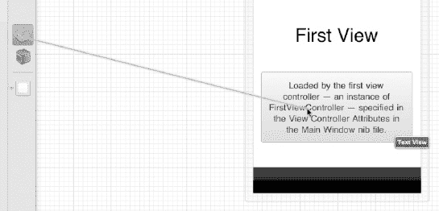

**图 3–2.** *按住 Ctrl 键并从 File's Owner 图标拖动到 UITextView。*

当你在 `UITextView` 上释放鼠标按钮时，会弹出一个上下文菜单。你会看到有两个插座变量可供选择。它们是：

- `locationTextView`（我们刚刚创建的）
- `View`

从列表中选择 `locationTextView`。现在，我们已经将 UI 组件连接到了 `ViewController` 类中的 `IBOutlet`。返回 Xcode 中的 `FirstViewController.m` 文件，并取消注释 `viewDidLoad` 方法。我们将向此方法添加一些代码，以启动位置服务，并用最新的位置信息更新我们的 `UITextView` 元素。


### 标准定位服务

我们可以启动两种服务来监听位置变化。首先来看标准定位服务。这是获取用户当前位置的较常见方式，因为它适用于所有 iOS 设备。标准定位服务可以配置为指定位置数据所需的精确度，以及报告新位置前必须移动的距离。该服务启动后，会确定开启哪些无线电模块，随后开始向指定的服务代理报告位置。

在启动标准定位服务之前，我们需要将 Core Location 框架添加到项目中。如果你没有跳过第 2 章，可能会觉得这一步多余。在 Xcode 中，点击**项目导航器**中的项目名称，然后转到**构建阶段**标签页。展开**链接二进制文件与库**部分，将 Core Location 框架添加到项目中。请参考图 3–3。

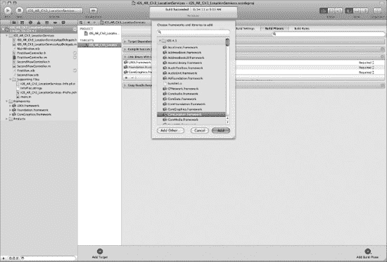

**图 3–3.** *将 Core Location 框架添加到项目中。*

返回到 `FirstViewController.h` 文件。将 Core Location 框架导入头文件，并声明该类遵循 `CLLocationManagerDelegate` 协议。你的头文件现在应如代码清单 3–5 所示。

**代码清单 3–5.** *FirstViewController 的新头文件*

```objc
#import <UIKit/UIKit.h>
#import <CoreLocation/CoreLocation.h>

@interface FirstViewController : UIViewController <CLLocationManagerDelegate> {
    UITextView *locationTextView;
}

@property (nonatomic, retain) IBOutlet UITextView *locationTextView;
@end
```

`CLLocationManagerDelegate` 协议将信息发送给其代理的 `locationManager:didUpdateToLocation:fromLocation:` 方法。如果调用此方法时出现错误，代理将调用 `locationManager:didFailWithError:` 方法。切换回 `FirstViewController.m` 文件。将代码清单 3–6 所示的方法添加到你的类中。

**代码清单 3–6.** *`CLLocationManagerDelegate` 的代理方法*

```objc
- (void)locationManager:(CLLocationManager *)manager didUpdateToLocation:(CLLocation *)newLocation
         fromLocation:(CLLocation *)oldLocation
{
      locationTextView.text = [NSString stringWithFormat:@"latitude %+.6f, longitude %+.6f\n",
            newLocation.coordinate.latitude,
            newLocation.coordinate.longitude];
}
```

这个方法做的事情并不多。基本上，我们将 `UITextView` 的文本设置为包含新经纬度坐标的字符串。名为 `newLocation` 的 `CLLocation` 引用将这些坐标传递给我们。我们使用其 `coordinate` 属性来查找新位置的纬度和经度。

Apple 建议我们检查新位置的时间戳，因为标准定位服务有时向代理方法传递数据会有延迟。在我们的演示中，这并非必需；不过，作为参考，你可以扩展我们的方法，先检查位置更新事件的时间，如代码清单 3–7 所示。

**代码清单 3–7.** *首先检查位置更新的时间（代码清单 3–5 的变体）*

```objc
- (void)locationManager:(CLLocationManager *)manager
    didUpdateToLocation:(CLLocation *)newLocation
           fromLocation:(CLLocation *)oldLocation
{
    NSDate* eventDate = newLocation.timestamp;
    NSTimeInterval howRecent = [eventDate timeIntervalSinceNow];
    if (abs(howRecent) < 15.0)
    {
        locationTextView.text = [NSString stringWithFormat:@"latitude %+.6f, longitude %+.6f\n",
               newLocation.coordinate.latitude,
               newLocation.coordinate.longitude];
    } else {
         locationTextView.text = @"Update was old";
        // 你很可能在此处什么都不做，忽略该事件
    }
}
```

现在我们的监听器已就位，可以接收位置更新了。让我们继续启动服务。切换到头文件（`FirstViewController.h`），在 `@end` 之前添加代码清单 3–8 中的代码。

**代码清单 3–8.** *声明启动定位服务的方法*

```objc
- (void)startStandardUpdates;
```

现在切换回 `.m` 文件，添加代码清单 3–9 中的方法。

**代码清单 3–9.** *`startStandardUpdates` 方法*

```objc
- (void)startStandardUpdates
{
    CLLocationManager *locationManager = [[CLLocationManager alloc] init];
    locationManager.delegate = self;
    locationManager.desiredAccuracy = kCLLocationAccuracyKilometer;
    locationManager.distanceFilter = 500;

    [locationManager startUpdatingLocation];
}
```

这个方法有几个重要方面。首先，在声明 `CLLocationManager` 对象后，我们将代理设置为 `self`。如果我们之前在代码清单 3–5 中没有声明该类为 `CLLocationManagerDelegate`，这会产生一个警告。接下来，我们设置一些配置选项，以便标准定位服务知道我们何时想要接收更新。我们将期望精度设置为千米级别，并告诉位置管理器在检测到超过 500 千米的变化时才更新代理。

最后，从代码清单 3–10 中添加以粗体标记的代码，在 `viewDidLoad:` 方法中，在 `[super viewDidLoad];` 之前启动服务。

**代码清单 3–10.** *新的 `viewDidLoad` 方法*

```objc
- (void)viewDidLoad
{
    [self startStandardUpdates];
    [super viewDidLoad];
}
```

现在我们可以测试演示程序了。在 Xcode 左上角有一个名为 `Scheme` 的下拉菜单。确保你选择了 iPhone 4.3 模拟器，然后点击最左侧的 `Run` 按钮。模拟器将启动，并自动打开我们的演示应用程序。

你应该会立刻看到一个如图 3–4 所示的模态对话框，请求允许检查你的位置。

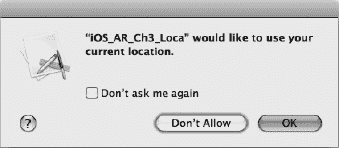

**图 3–4.** *允许你的应用程序使用定位服务来确定你的位置。*

如果你不希望此对话框再次出现，请选择“不再询问”。无论如何，请确保点击**确定**，否则演示程序将无法正常运行。图 3–5 展示了运行中的应用程序。你可以看到 `UITextView` 现在已填充了我们构建的包含经纬度的字符串。

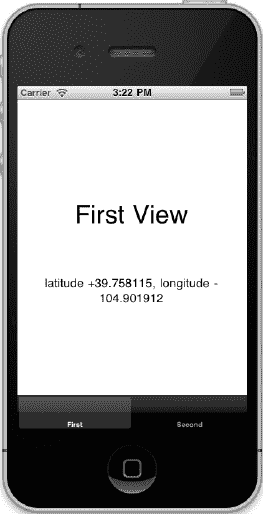

**图 3–5.** *在 iPhone 模拟器上运行演示程序。*


### 重大位置变化（Significant-Change Location）服务

到目前为止一直在使用的“标准位置服务”是获取设备位置最常见的方式。然而，在 iOS 4.0 之后，如果你愿意牺牲精度以换取省电，可以使用“重大位置变化服务”。对于大多数应用而言，重大位置变化服务的精度已经足够。该服务使用设备的蜂窝无线电（而非 GPS 无线电）来确定位置，这使得设备能够更激进地管理功耗。重大位置变化服务还能够唤醒已挂起的应用，以便传送新的坐标。

一旦你确定了最适合应用需求的位置服务，编码上的差异就相当小了。将代码清单 3–11 中的方法添加到 `FirstViewController.m` 中，以启动重大位置变化服务。

**代码清单 3–11.** 启动重大位置变化服务

```
- (void)startSignificantChangeUpdates
{
    CLLocationManager *locationManager = [[CLLocationManager alloc] init];
    locationManager.delegate = self;
    [locationManager startMonitoringSignificantLocationChanges];
}
```

因为我们指定了该类作为 `CLLocationManagerDelegate`，并且将 `CLLocationManager` 的 `delegate` 属性设置为 `self`，运行此方法（而非我们在代码清单 3–9 中添加的方法）在模拟器中应该会产生相同的屏幕（至少我们是这么认为的）。将代码清单 3–12 中的代码添加到头文件中，并按照代码清单 3–13 所示修改 `viewDidLoad` 方法。

**代码清单 3–12.** 在 `FirstViewController.h` 中声明新方法

```
- (void)startSignificantChangeUpdates;
```

**代码清单 3–13.** 新的 `viewDidLoad` 方法调用重大位置变化服务

```
- (void)viewDidLoad
{
    // [self startStandardUpdates];
    [self startSignificantChangeUpdates];
    [super viewDidLoad];
}
```

如果你启动模拟器并运行新版本，你会发现有些不同。具体来说，什么都不会发生。`UITextView` 从未更新。如果你将此应用部署到物理设备上，结果将会随着你的位置变化而改变。暂时不必为此担心。在下一节“地理区域监控”中，我将介绍一种在模拟器中测试位置的新方法。

### 地理区域监控（Geographic Region Monitoring）服务

在某些情况下，监控精确位置并不能完全解决问题。相反，我们只想了解是否（或何时）靠近某个特定的坐标。iOS 提供了一套用于区域监控服务的特性。在大多数方面，它的工作方式与其他位置服务类似。它提供了一些需要处理的关键委托方法，以便对区域变化做出恰当的响应。我们将使用 `didEnterRegion:` 和 `didExitRegion:` 这两个委托方法来演示其功能。

本示例中的代码在物理设备上可以正常工作。但是，为了在模拟器上演示，我将展示如何在运行 Xcode 4.2 测试版的 iOS 5 模拟器上进行操作。Xcode 4.2 引入了一种在调试器中模拟位置变化的方法，这将很好地演示我们的功能。首先，将代码清单 3–14 中的方法添加到 `FirstViewController.m` 中。

**代码清单 3–14.** 在 `FirstViewController.m` 中添加新方法

```
- (void)startRegionMonitoring
{
    NSLog(@"Starting region monitoring");
    CLLocationManager *locationManager = [[CLLocationManager alloc] init];
    locationManager.delegate = self;

    CLLocationCoordinate2D coord = CLLocationCoordinate2DMake(37.787359, -122.408227);
    CLRegion *region = [[CLRegion alloc] initCircularRegionWithCenter:coord
                    radius:1000.0 identifier:@"San Francisco"];

    [locationManager startMonitoringForRegion:region
            desiredAccuracy:kCLLocationAccuracyKilometer];
}
```

这段代码与我们之前跟踪位置的其他方法看起来非常相似，除了最后一行启动了区域监控服务之外。我们使用旧金山的 GPS 坐标创建了一个 `CLLocationCoordinate2D`。我选择旧金山的原因是，它是 Xcode 4.2 测试版中预加载的 GPS 坐标之一，如图 3–6 所示。

不要忘记在头文件中声明你的新方法。将代码清单 3–15 中的代码添加到 `FirstViewController.h` 中，紧贴 `@end` 的上方。

**代码清单 3–15.** 在 `FirstViewController.h` 中声明新方法

```
- (void)startRegionMonitoring;
```

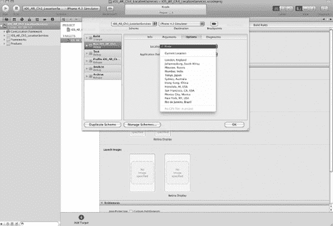

**图 3–6.** 在 Xcode 4.2 测试版中选择预加载的 GPS 坐标。

既然区域监控服务已经启动，我们需要处理当用户进入或离开我们正在监控的区域时所调用的委托方法。将代码清单 3–16 中的方法添加到 `FirstViewController.m` 中。

**代码清单 3–16.** 在 `FirstViewController.m` 中声明新方法

```
- (void)locationManager:(CLLocationManager *)manager didEnterRegion:(CLRegion *)region {
    UIAlertView *alert = [[UIAlertView alloc] initWithTitle:@"Region Alert"
                                                    message:@"You entered the region"
                                                   delegate:self
                                          cancelButtonTitle:@"OK"
                                          otherButtonTitles:nil, nil];
    [alert show];
    [alert release];
}

- (void)locationManager:(CLLocationManager *)manager didExitRegion:(CLRegion *)region {
    UIAlertView *alert = [[UIAlertView alloc] initWithTitle:@"Region Alert"
                                                    message:@"You exited the region"
                                                   delegate:self
                                          cancelButtonTitle:@"OK"
                                          otherButtonTitles:nil, nil];
    [alert show];
    [alert release];
}
```


测试区域监控服务的最后一步是调用我们刚刚创建的 `startRegionMonitoring` 方法。在第 2 章中，我们讨论了如何在使用现有服务和支持的硬件之前对其进行检查。在本场景中，我们也应执行同样的操作。`CLLocationManager` 提供了一种方法来检查区域监控服务是否可用以及该服务是否实际启用。请更新您的 `viewDidLoad:` 方法，如代码清单 3-17 所示。

**代码清单 3-17.** *新的 viewDidLoad 方法*

```
- (void)viewDidLoad
{
    [self startStandardUpdates];
    //[self startSignificantChangeUpdates];

    if ([CLLocationManager regionMonitoringAvailable]) { // 检查服务是否可用
        [self startRegionMonitoring];
    }  // 否则执行其他操作
    [super viewDidLoad];
}
```

我们的新方法启动了标准定位服务和区域监控服务。当您在新的 Xcode 4.2 调试器中运行此代码时，将看到一个略有不同的权限对话框，询问是否允许使用您设备的位置信息。这是 iOS 5 模拟器的另一项更新。您可以在图 3-7 中看到新权限对话框的示例。

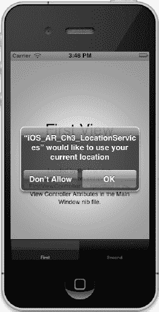

**图 3-7.** *来自新的 iOS5 授权对话框的权限允许。*

在对话框中点击**确定**以加载视图并启动我们的服务。

Xcode 4.2 的另一个新功能是在应用程序运行时能够更改模拟器的位置。在 Xcode 的`控制台`窗口中，您将看到一个用于选择位置的新下拉菜单，如图 3-8 所示。

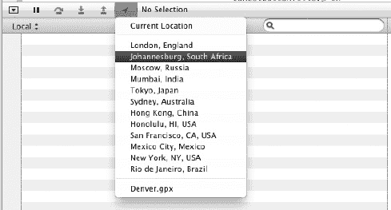

**图 3-8.** *在调试器中使用新的 Xcode 4.2 beta 位置模拟器。*

当我们初始化区域监控服务时，我们围绕旧金山的一个坐标启动了该服务。因此，为了测试我们的代码，我们需要进入并离开该区域。如果您已安装 Xcode 4.2，请使用调试器中的下拉菜单选择 `San Francisco, CA, USA` 作为您的位置。模拟器会在后台更改其坐标；标准定位服务会检测到此更改并将其报告给我们的委托方法。此外，由于我们已进入定义的区域，因此 `didEnterRegion:` 方法也会被触发。您将看到类似于图 3-9 所示的内容。

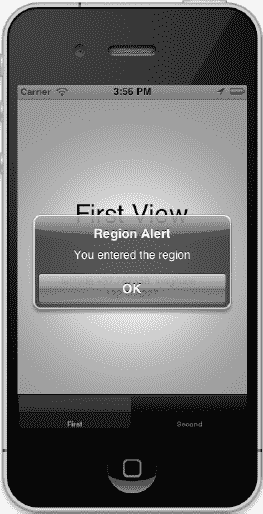

**图 3-9.** *didEnterRegion: 方法被触发。*

我们也可以使用调试器来测试 `didExitRegion:` 方法。将您的位置更改为除 `San Francisco, CA, USA` 以外的任何地方，您将触发另一个委托方法，如图 3-10 所示。

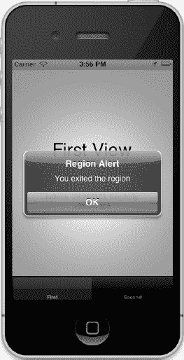

**图 3-10.** *didExitRegion: 方法被触发。*

到目前为止，我们已经了解了用于监控设备位置的不同定位服务，并为设备进入或离开地理区域时设置了一些警报选项。在增强现实应用程序中可视化感兴趣的点还要求我们知道从设备到某些感兴趣的点之间的距离。为此，让我们快速修改一下我们在本章前面定义的 `didUpdateToLocation:` 方法。请按代码清单 3-18 所示更新该方法。

**代码清单 3-18.** *新的 didUpdateToLocation 方法*

```
- (void)locationManager:(CLLocationManager *)manager
    didUpdateToLocation:(CLLocation *)newLocation
           fromLocation:(CLLocation *)oldLocation
{
    NSDate* eventDate = newLocation.timestamp;
    NSTimeInterval howRecent = [eventDate timeIntervalSinceNow];
    if (abs(howRecent) < 15.0)
    {
        //locationTextView.text = [NSString stringWithFormat:@"latitude %+.6f, longitude %+.6f\n",
        //                       newLocation.coordinate.latitude,
        //                       newLocation.coordinate.longitude];

        CLLocationDistance dist = [newLocation distanceFromLocation:oldLocation] / 1000;
        locationTextView.text = [NSString stringWithFormat:@"distance %5.1f traveled"];
    } else {
        locationTextView.text = @"Update was old";
        // 这里你可能只是什么都不做，忽略该事件
    }
}
```

在 Xcode 4 的模拟器中，您将得到类似于图 3-11 所示的结果。如果您在模拟器上使用 Xcode 4.2 beta 和 iOS 5，可以强制生成一些有趣的数值。测试此功能的另一种方法是传入一个新的 `CLLocation` 坐标来替代 `oldLocation`。

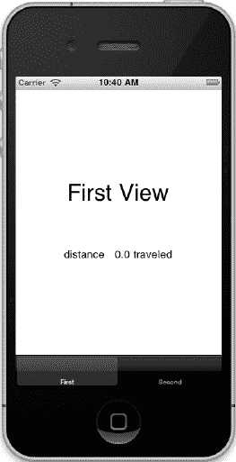

**图 3-11.** *检查更新之间的距离。*

### 海拔高度

在增强现实中，检查海拔高度有助于确保摄像头的角度适合您呈现给用户的视图。获取设备的海拔高度起始于与获取位置相同的过程。苹果建议我们先检查海拔高度读数的可用性，然后再尝试从 GPS 或蜂窝无线电中获取它。目前，要确定设备是否能够提供海拔高度，请使用代码清单 3-19 中的代码。

**代码清单 3-19.** *检查海拔高度是否可用*

```
If (signbit(newLocation.verticalAccuracy)) {
        // 获取海拔高度
}
```

海拔高度读数存在几个陷阱。首先，较旧的 iPhone（初代和 iPhone 3Gs）的精度要差得多。在一些参考资料中，指出它们的误差几乎是 iPhone 4 的十倍。其次，正如我们在本章前面的定位服务示例中所看到的，Core Location 仅在设备移动一定距离（非竖直方向）时才会更新。因此，我们需要要么强制 GPS 重置，要么让用户在海拔高度发生变化时自动告知我们。要检查 GPS 读数，请添加代码清单 3-20 中的代码。

**代码清单 3-20.** *检查 GPS 读数*

```
locationTextView.text = [NSString stringWithFormat:@"%6.2f m. ", newLocation.altitude];
```

通常情况下，即使在新设备上，海拔高度读数也不够精确。还有其他一些方法以及公开可用的 Web 服务可以根据 GPS 坐标来确定海拔高度。我们将在后续章节的示例中再次讨论这个主题。在继续学习如何在地图上可视化位置信息之前，让我们回顾一下本章中使用的类。它们最常用的方法和属性列在表 3-1 中。

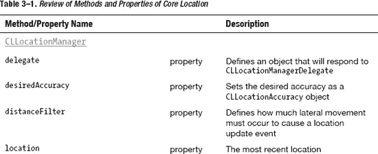

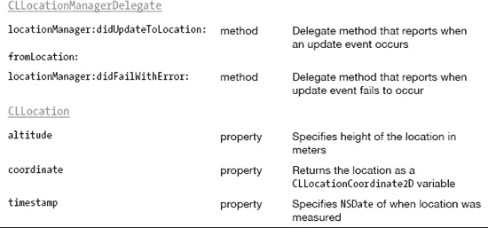


### 在地图上查看

我们已经探索了获取用户位置的不同方法。接下来看看如何将这些位置渲染到地图上。在增强现实应用中，通常不需要使用地图。但它能为我们在 AR 应用中所使用的坐标和位置测试提供良好的调试与可视化支持。本章将讲解这部分内容，以便你将其纳入技术工具箱。

首先在演示项目中设置`SecondViewController`类。这是标签视图模板中的第二个标签页。如果你已跟随本章内容进行操作，这个类应该尚未使用。打开`SecondViewController.h`文件，确保为`MKMapView`声明`IBOutlet`，如代码清单 3-21 所示。

**代码清单 3-21.** *声明 MKMapViewIBOutlet*

```
#import <UIKit/UIKit.h>
#import <MapKit/MapKit.h>

@interface SecondViewController : UIViewController <MKMapViewDelegate>{
    IBOutlet MKMapView *mapView;
}

@property (nonatomic, retain) IBOutlet MKMapView *mapView;
@end
```

代码清单 3-21 中加粗显示的代码是我们对默认模板类所做的修改。首先导入`Mapkit.h`头文件，同时将类声明为`MKMapViewDelegate`委托，这样该类就能处理来自`MKMapView`的消息和更新。

接下来打开`SecondViewController.m`文件，合成新的属性。另外，使用完毕后不要忘记释放它。将代码清单 3-22 中的代码添加到`SecondViewController.m`中。

**代码清单 3-22.** *合成与释放 mapView*

```
@synthesize mapView;

- (void)dealloc
{
    [mapView release];
    mapView = nil;
    [super dealloc];
}
```

在 Xcode 中打开`SecondView.xib`，移除默认存在的`UITextView`和`UITextLabel`。从**对象库**中将**Map View**拖拽到视图上，稍等片刻让其自动缩放以填满可用空间。接着按住 Ctrl 键，从编辑器左侧的立方体（文件所有者图标）点击并拖拽出一条线连接到新的`MKMapView`上。此时应出现类似图 3-12 所示的上下文菜单。在菜单中选择`mapView`属性。

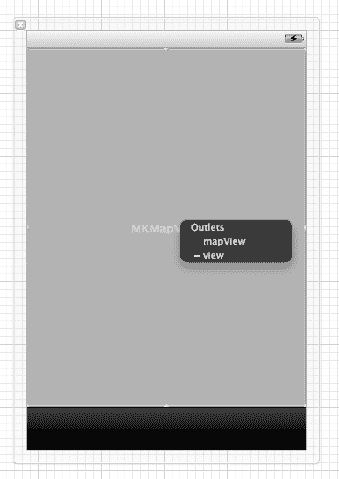

**图 3-12.** *配置我们的 MKMapView。*

#### 居中地图与设置显示区域

回到`SecondView.m`文件，首先取消`viewDidLoad:`方法的注释，并添加代码清单 3-23 中的代码。

**代码清单 3-23.** *启动新线程设置地图*

```
- (void)viewDidLoad
{
    mapView.delegate=self;
    [self.view addSubview:mapView];

    [NSThread detachNewThreadSelector:@selector(displayMap) toTarget:self withObject:nil];
    [super viewDidLoad];
}
```

首先将`MKMapView`的`delegate`设置为`self`。回想一下，我们此前已将此类声明为`MKMapViewDelegate`。最后，我们并没有直接在`viewDidLoad:`方法中加载地图，而是分离了一个新线程用于设置。虽然这个示例中使用这种方式有些大材小用，但这是了解多线程的好方法，后续在 AR 示例应用中会用到。该线程调用了一个尚未创建的`displayMap`方法。在`viewDidLoad:`方法下方添加代码清单 3-24 中的代码来创建此方法。

**代码清单 3-24.** *创建新的 displayMap 方法*

```
- (void)displayMap {
    NSAutoreleasePool *pool = [[NSAutoreleasePool alloc] init];

    CLLocationCoordinate2D coords;
    coords.latitude = 37.33188;
    coords.longitude = -122.029497;
    MKCoordinateSpan span = MKCoordinateSpanMake(0.002389, 0.005681);
    MKCoordinateRegion region = MKCoordinateRegionMake(coords, span);
    [mapView setRegion:region animated:YES];

    [pool drain];
}
```

这个方法中有几个要点需要讨论。首先运行一下看看效果。图 3-13 展示了该应用在 iPhone 模拟器中的运行情况。暂时忽略上面加粗的代码，稍后会再提及。我们手动创建了一个`CLLocationCoordinate2D`结构体，并将经纬度设置为苹果总部的位置。设置好坐标后，创建了一个`MKCoordinateSpan`结构体来设定显示区域中经纬度的跨度。最后，使用新的坐标和创建的跨度设置`MKCoordinateRegion`。

在此示例中，我们使用`MKMapView`的`setRegion`方法来设置地图的默认显示区域。还可以添加其他选项进行更多自定义设置。例如设置`mapType`属性（稍后会介绍），以及使用`zoomEnabled`和`scrollEnabled`方法控制用户能否缩放和滚动地图。

为了实验效果，注释掉加粗的代码并重新运行应用。Xcode 控制台会迅速被警告信息填满，提示没有线程池以及应用`Just Leaking`。由于此方法运行在新线程上，我们需要设置一个新的`NSAutoReleasePool`来处理新线程的内存管理。

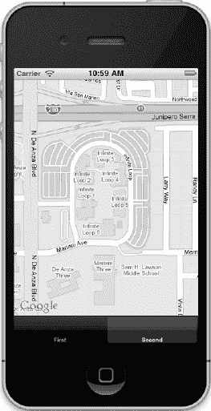

**图 3-13.** *模拟器在地图上显示苹果总部（无论是否泄漏，显示效果相同）。*

`NSAutoreleasePool`类用于支持引用计数的内存管理系统。iOS 模板（我们使用的是标签视图模板）在`Supporting Files`目录下的`main.m`文件中创建了一个自动释放池。这些自动释放池包含已收到 autorelease 消息的对象。当释放池时（就像我们在新`viewDidLoad`方法的最后一行所做的那样），`NSAutoReleasePool`会向每个对象发送 release 消息。由于我们不再处于主线程，如果不创建这个池，任何自动释放的对象都不会收到 release 消息，从而可能导致内存泄漏，并在控制台中产生警告信息。


#### 更改地图类型

上一节中提到，可以使用 `mapType` 属性来更改我们正在显示的地图类型。返回 `SecondViewController.h` 并声明一个新的 `IBOutlet`，如代码清单 3-25 所示。

**代码清单 3–25.** *声明 UISegmentedControl*

```
@interface SecondViewController : UIViewController <MKMapViewDelegate>{
    IBOutlet MKMapView *mapView;
    UISegmentedControl *buttonBarSegmentedControl;
}

@property (nonatomic, retain) IBOutlet MKMapView *mapView;
@property (nonatomic, retain) IBOutlet UISegmentedControl *buttonBarSegmentedControl;
```

我们不必手动将其添加到 XIB 文件中，而是动态创建它。在增强现实应用中，我们也会做类似的事情，以便在用户视图上叠加控件。将代码清单 3-26 中的方法添加到我们之前创建的 `displayMap` 方法下方。

**代码清单 3–26.** *创建用于更改地图类型的 UISegmentedControl*

```
- (void)setupSegmentedControl {
    buttonBarSegmentedControl = [[UISegmentedControl alloc] initWithItems:[NSArray arrayWithObjects:@"Standard", @"Satellite", @"Hybrid", nil]];

    [buttonBarSegmentedControl setFrame:CGRectMake(30, 50, 280-30, 30)];
    buttonBarSegmentedControl.selectedSegmentIndex = 0.0;        // 初始显示普通选择器

    [buttonBarSegmentedControl addTarget:self action:@selector(toggleToolBarChange:)
                        forControlEvents:UIControlEventValueChanged];

    buttonBarSegmentedControl.segmentedControlStyle = UIScrollViewIndicatorStyleWhite;
    buttonBarSegmentedControl.backgroundColor = [UIColor clearColor];
    buttonBarSegmentedControl.tintColor = [UIColor blackColor];
    [buttonBarSegmentedControl setAlpha:0.8];

    [self.view addSubview:buttonBarSegmentedControl];
}
```

此方法也需要在头文件中声明。确保在运行应用程序之前完成此操作。

此方法首先使用一个包含新项目的数组来初始化 `UISegmentedControl`。我们为菜单选项使用了三个字符串：`Standard`、`Satellite` 和 `Hybrid`。它们分别对应 `MKMapView.mapType` 属性的不同选项。

接下来，我们调用 `CGRectMake` 方法来为分段控件在视图中设置区域。分段控件在 iOS 中的工作原理与按钮类似。我们需要能够添加一个目标并正确响应所引发的事件。代码清单 3-27 中加粗的代码将目标设置为 `self`，并将 `action` 设置为一个名为 `toggleToolBarChange` 的新方法。我们接下来将创建这个方法。最后，在 `setupSegmentedControl` 方法中，我们为控件设置了一些基本偏好设置，包括风格、背景颜色和色调。这些显然都是可选的，但我想演示一些可能与本章一直在使用的标签栏模板默认样式相匹配的选项。如果我们不设置这些选项，控件默认会显示为蓝色。

我提到过，我们的操作被设置为一个名为 `toggleToolBarChange` 的新方法。该方法的代码在代码清单 3-27 中。将其添加到类中。

**代码清单 3–27.** *处理 UISegmentedControl 的动作*

```
- (void)toggleToolBarChange:(id)sender
{
    UISegmentedControl *segControl = sender;

    switch (segControl.selectedSegmentIndex)
    {
        case 0:        // 地图模式 (Map)
        {
            [mapView setMapType:MKMapTypeStandard];
            break;
        }
        case 1: // 卫星模式 (Satellite)
        {
            [mapView setMapType:MKMapTypeSatellite];
            break;
        }
        case 2: // 混合模式 (Hybrid)
        {
            [mapView setMapType:MKMapTypeHybrid];
            break;
        }
    }
}
```

在测试这个新控件之前的最后一步，是在 `viewDidLoad` 方法中调用 `setupSegmentedControl` 方法。在您分离新线程来设置地图之后，立即添加代码清单 3-28 中的代码。

**代码清单 3–28.** *调用 setupSegmentedControl*

```
[self setupSegmentedControl];
```

现在，您已准备好测试新功能。在 iPhone 模拟器中运行我们组合好的代码。切换到第二个标签页，并尝试操作分段控件按钮。图 3-14 显示了模拟器运行地图并选择卫星地图类型时的画面。

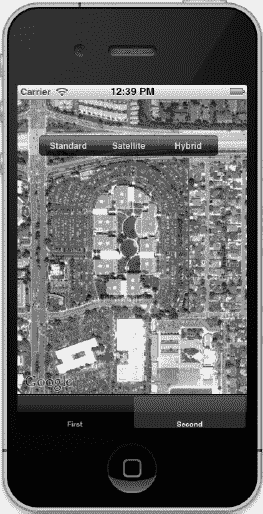

**图 3-14.** *选择了卫星地图类型。*

至此，我们已向视图添加了地图，学会了如何根据静态位置坐标居中显示地图，并且动态地向视图中添加了一个 `UISegmentedControl` 来即时切换地图类型。

接下来，让我们看看如何向地图添加标注。标注提供了一种标记特定位置的方法。与它们在谷歌地图或必应地图上的工作方式大致相同，您可以添加弹出式显示来向用户展示更多上下文信息。图标本身以及它们响应的操作都可以进行自定义。


### 为地图添加标注

要设置标注，我们将使用一个新类来保存标注的自定义属性。在`Project Navigator`中任意位置右键，从上下文菜单中选择`New File`。在`Cocoa Touch`类别下，选择`Objective-C class`模板。保持该类为`NSObject`的子类，并将新类命名为`MapAnnotation`。地图上的标注有几个主要特征：标题、副标题和坐标。我们将为这些特征向新类添加属性，并提供一些方法以便从地图类中设置它们。首先，将代码清单 3-29 中的声明添加到`MapAnnotation.h`中。

**代码清单 3-29.** *MapAnnotation.h 的修改*

```
#import <Foundation/Foundation.h>
#import <MapKit/MapKit.h>

@interface MapAnnotation : NSObject<MKAnnotation> {
    CLLocationCoordinate2D coordinate;
    NSString *subtitletext;
    NSString *titletext;
}
@property (nonatomic, readonly) CLLocationCoordinate2D coordinate;
@property (readwrite, retain) NSString *titletext;
@property (readwrite, retain) NSString *subtitletext;
-(id)initWithCoordinate:(CLLocationCoordinate2D) coordinate;
- (NSString *)subtitle;
- (NSString *)title;
-(void)setTitle:(NSString*)strTitle;
-(void)setSubTitle:(NSString*)strSubTitle;

@end
```

同样，我们从导入`MapKit.h`开始。我们声明了初始坐标位置（标注将放置的位置）以及标注标题和副标题的属性。我们还为类添加了一些方法：一个用于坐标的初始化方法，以及一组用于标题和副标题的 getter 和 setter 方法。

切换到`MapAnnotation.m`，并从代码清单 3-30 中添加对应的属性和方法实现。

**代码清单 3-30.** *MapAnnotation.m 的修改*

```
@implementation MapAnnotation
@synthesize coordinate, titletext, subtitletext;

- (NSString *)subtitle{
        return subtitletext;
}
- (NSString *)title{
        return titletext;
}

-(void)setTitle:(NSString*)strTitle {
        self.titletext = strTitle;
}

-(void)setSubTitle:(NSString*)strSubTitle {
        self.subtitletext = strSubTitle;
}

-(id)initWithCoordinate:(CLLocationCoordinate2D) c{
        coordinate=c;
        return self;
}
@end
```

这个类并不复杂。它通过基本重构来充当标注属性的占位符。在`SecondViewController.h`中，为`MapAnnotation.h`头文件添加一条`import`语句。然后，打开`SecondViewController.m`，在`displayMap`方法中调用`setRegion`方法的代码之前，添加代码清单 3-31 中的代码。请注意来自`MapAnnotation`类的三个方法及其调用方式。

**代码清单 3-31.** *在 displayMap 方法中创建标注*

```
MapAnnotation *addAnnotation = [[[MapAnnotation alloc] initWithCoordinate:coords] retain];
[addAnnotation setTitle:@"My Annotation Title"];
[addAnnotation setSubTitle:@"this is my subtitle property"];
[mapView addAnnotation:addAnnotation];
```

首先，创建`MapAnnotation`对象时，我们调用`initWithCoordinate`方法来设置标注的默认位置。接下来的两行调用我们为标题和副标题属性编写的 getter 方法。最后，我们将标注添加到`MKMapView`中。

现在继续在模拟器中运行。切换到第二个标签页，你会看到地图视图以及在 Apple 总部（与我们之前将地图居中显示的坐标相同）上的一个红色标注。如果点击该标注，你会看到类似图 3-15 的内容。


**图 3-15.** *默认标注显示了已填充的标题和副标题。*

你会看到标题和副标题都已填充，并且标注显示在正确的坐标上。有许多选项可用于自定义标注。例如，让标注动起来并改变它的颜色怎么样？要自定义标注的外观，我们会使用另一个名为`viewForAnnotation`的委托方法。这个方法在标注创建时被调用，让你有机会通过一个可重用的对象引用来自定义该特定视图。将代码清单 3-32 中的方法添加到类中以处理这个委托方法。

**代码清单 3-32.** *处理 viewForAnnotation 委托方法*

```
- (MKAnnotationView *) mapView:(MKMapView *)mapView viewForAnnotation:(id <MKAnnotation>) annotation{
    MKPinAnnotationView *annView=[[MKPinAnnotationView alloc] initWithAnnotation:annotation reuseIdentifier:@"MyPin"];
    annView.animatesDrop=TRUE;
    annView.canShowCallout = YES;
    [annView setSelected:YES];
    annView.pinColor = MKPinAnnotationColorPurple;
    annView.calloutOffset = CGPointMake(-50, 5);
    return annView;
}
```

我们对标注做了一些修改。如果在模拟器中再次运行，你会看到类似图 3-16 的内容。

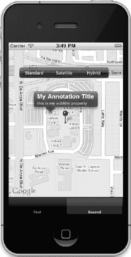

**图 3-16.** *模拟器现在显示了自定义后的标注。*

当模拟器切换到第二个标签页时，你会注意到的第一个变化是标注现在带有动画效果。它会以一种友好的方式掉落到位。我们通过`animatesDrop`属性实现了这一点。现在它也是紫色的。我们使用`pinColor`属性设置了标注的颜色。最后，你会注意到提示框是偏离中心的。我们使用`calloutOffset`属性设置了一个偏移量。当你使用并非像默认大头针那样平衡的自定义标注图片时，这个属性会很有用。

接下来，让我们快速了解一下如何获取特定坐标的更多信息。


### 反向地理编码

最后，我们来讲反向地理编码。反向地理编码是通过经纬度获取地址或位置信息的过程，而地理编码则是通过地址获取经纬度。iOS 提供了一个类，让开发者能轻松实现反向地理编码。让我们扩展当前示例，记录我们一直使用坐标的实际信息。

我们将使用一个名为 `MKReverseGeocoder` 的类。需要重点关注这个类的几个属性和方法，如表 3-2 所示。但在使用这些方法之前，我们需要将 `SecondViewController` 类指定为 `MKReverseGeocoderDelegate`。这一步非常重要，否则反向地理编码将毫无反应。

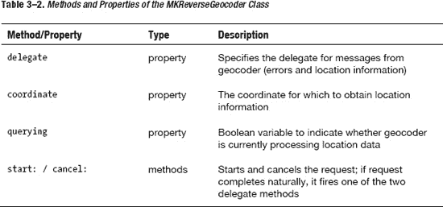

为了简单起见，不重构整个示例，我们直接对一直使用的坐标进行反向地理编码。找到 `toggleToolBarChange` 方法，并按照代码清单 3-33 所示修改该方法。之所以使用此方法，是因为我们希望通过用户操作来启动反向地理编码以演示该功能。当你点击分段按钮时会调用此方法，因此正好满足需求。

**代码清单 3-33.** *更新后的 `toggleToolBarChange` 方法调用反向地理编码*

```
…
case 1: // 卫星
{
CLLocationCoordinate2D coords;
                  coords.latitude = 37.33188;
                  coords.longitude = -122.029497;

                  MKReverseGeocoder *geoCoder = [[MKReverseGeocoder alloc] initWithCoordinate:coords];
                  [geoCoder setDelegate:self];
                  [geoCoder start];
          [mapView setMapType:MKMapTypeSatellite];
          break;
}
…
```

首先，我们有点草率地重复了 `CLLocationCoordinate2D` 的代码。在实际应用中，这个值要么是派生而来，要么在更高作用域内设置。重新创建坐标后，我们用同一坐标初始化了 `MKReverseGeocoder`。这是使用反向地理编码类所必需的。接着将 `delegate` 设置为 `self`，最后启动地理编码过程。

如你所料，由于我们将类设置为 `MKReverseGeocoderDelegate`，委托实现还需要几个额外的方法。参考代码清单 3-34，将委托方法添加到 `SecondViewController.m` 中。

**代码清单 3-34.** *`MKReverseGeocoderDelegate` 方法*

```
- (void)reverseGeocoder:(MKReverseGeocoder *)geocoder didFindPlacemark:(MKPlacemark *)placemark {
      NSLog(@"return %@", placemark.addressDictionary);
}
- (void)reverseGeocoder:(MKReverseGeocoder *)geocoder didFailWithError:(NSError *)error {
      NSLog(@"fail %@", error);
}
```

这段代码的关键部分已加粗。如果在指定坐标上找到任何信息，`MKPlacemark` 对象会返回给委托方法。图 3-17 展示了 Xcode 控制台中的输出结果。

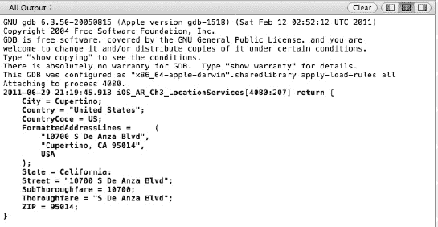

**图 3-17.** *Xcode 控制台显示反向地理编码输出*

### 本章小结

本章我们深入探讨了定位服务。首先了解了跟踪位置的各种选项，例如标准定位服务、重大变化定位服务、地理区域监控服务以及海拔高度测量。我们还探讨了如何在地图上可视化定位服务，以及如何通过反向地理编码获取上下文信息。本章还包含一些细微的知识点，比如介绍了基础线程（我们将在后续示例中继续扩展），以及动态叠加层（在增强现实章节中，我们将以 HUD（抬头显示器）的形式更多地使用它）。

我们正在构建全面开发 AR 应用所需的工具。接下来，我们将通过陀螺仪和加速计来探索 iOS 传感器编程。

## 第 4 章：iOS 传感器

增强现实编程需要利用多种硬件组件来构建有效的应用。这些组件通常被称为传感器。陀螺仪和加速计等传感器能帮助我们确定应用运行时设备的朝向和位置变化。由于我们进行 AR 编程，需要将应用叠加在设备摄像头的实景视图上，因此跟踪朝向以保持应用现实的朝向方式至关重要。

### 朝向传感器

加速计和陀螺仪的用途相似，但两者之间存在细微差别，大多数应用需要结合两者的读数才能达到最佳效果。我们来看看这两个组件的异同。

首先从加速计开始。iPhone 4 中的三轴加速计用于测量设备相对于地球表面的朝向。如果设备处于自由落体状态或在某个方向上有恒定加速度，则加速度返回零（或应该返回零），因为此时无法将其与地球引力提供的加速度区分开。

陀螺仪能够测量绕特定轴的旋转速率。旋转是加速计无法测量的，因此飞行计算机不能仅依赖加速计，还需要陀螺仪来防止飞机翻滚。

区分这两者的一个简单方法是：陀螺仪有助于测量朝向，而加速计测量振动。以此为基础，陀螺仪可以提供角速度（或旋转），而加速计只能测量线性加速度（跨越所有三个轴）。

我们先分别了解每个组件及其使用方法，然后结合两者以获得更好的测量效果。本章我们将再次使用标签栏应用模板，以尽量减少示例应用的数量。在 Xcode 中使用标签栏应用模板创建一个新项目，目标设备选择 iPhone。将项目命名为 `iOS_AR_Ch4_Sensors`，或者从 `github.com/kyleroche/Professional_iOS_AugmentedReality` 或 Apress 网站（[`www.apress.com`](http://www.apress.com)）的源代码/下载区域下载本章的完整代码。


### 使用加速计

我们先从加速计开始。在 Xcode 中，打开 `FirstViewController.h` 文件并更新它，如代码清单 4-1 所示。

**代码清单 4-1.** *更新后的 FirstViewController.h*

```
#import <UIKit/UIKit.h>

@interface FirstViewController : UIViewController {
    UIAccelerometer *accelerometer;

    UILabel *xLabel;
    UILabel *yLabel;
    UILabel *zLabel;

    UIProgressView *xProgressView;
    UIProgressView *yProgressView;
    UIProgressView *zProgressView;
}

@property (nonatomic, retain) UIAccelerometer *accelerometer;

@property (nonatomic, retain) IBOutlet UILabel *xLabel;
@property (nonatomic, retain) IBOutlet UILabel *yLabel;
@property (nonatomic, retain) IBOutlet UILabel *zLabel;

@property (nonatomic, retain) IBOutlet UIProgressView *xProgressView;
@property (nonatomic, retain) IBOutlet UIProgressView *yProgressView;
@property (nonatomic, retain) IBOutlet UIProgressView *zProgressView;

@end
```

让我们更新 `FirstViewController.m` 文件，然后逐步了解新代码。在 Xcode 中切换到 `FirstViewController.m`，并添加代码清单 4-2 中的代码。

**代码清单 4-2.** *更新后的 FirstViewController.m*

```
// 在 @implementation 之后
@synthesize xLabel, yLabel, zLabel, xProgressView, yProgressView, zProgressView, accelerometer;
// 替换自动生成代码中的现有 dealloc 方法
- (void)dealloc
{
    [xLabel release];
    xLabel = nil;
    [yLabel release];
    yLabel = nil;
    [zLabel release];
    zLabel = nil;
    [xProgressView release];
    xProgressView = nil;
    [yProgressView release];
    yProgressView = nil;
    [zProgressView release];
    zProgressView = nil;
    [accelerometer release];
    accelerometer = nil;
    [super dealloc];
}
```

从顶部开始，我们声明了一些 UI 元素，用于显示来自加速计的实时读数。我们将使用三个标签和三个进度条，每个对应加速计的一个轴。图 4-1 展示了 X、Y 和 Z 坐标轴。

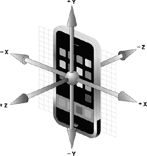

**图 4-1.** *加速计使用 X、Y 和 Z 坐标轴。*

在 Xcode 中打开 `FirstView.xib`。将标签和进度条元素添加到界面画布上。你应该会看到类似图 4-2 所示的内容。

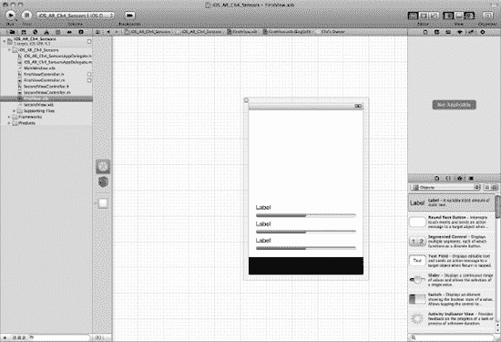

**图 4-2.** *为加速计读数设置 XIB 文件。*

为简单起见，我们按水平顺序将这三组值分配给输出口。X 在顶部，Z 在底部。由于 Xcode 4.2 对某些人来说还比较新，我们再回顾一下。要将输出口分配给头文件中的属性，请在按住 Ctrl 键的同时，从 **File's Owner** 图标拖拽到画布上的输出口。会弹出一个对话框，显示可分配的属性。选择相应的输出口。图 4-3 展示了一个示例。

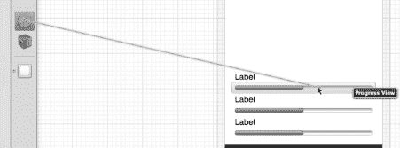

**图 4-3.** *将 IBOutlet 链接到 FirstViewController.h 中的属性。*

对每个 `UILabel` 输出口和 `UIProgressView` 组件重复此过程。

我们通过 `UIAccelerometer` 类访问加速计。这个类使用了与第 3 章定位服务相同的委托模式。这个类使用一个共享的 `UIAccelerometer` 单例，不能直接访问。因此，你会注意到在这些示例中处理内存的方式略有不同（更具体地说，是我们处理硬件消息订阅的方式）。

### UIAccelerometerDelegate 类

在开始监控加速计的更新之前，我们必须将此类指定为 `UIAccelerometerDelegate`。相应地更新 `FirstViewController.h`。切换回 `FirstViewController.m`，并添加代码清单 4-3 中的方法。

**代码清单 4-3.** *UIAccelerometerDelegate 类的委托方法*

```
- (void)accelerometer:(UIAccelerometer *)accelerometer didAccelerate:(UIAcceleration *)acceleration {
    xLabel.text = [NSString stringWithFormat:@"%@%f", @"X: ", acceleration.x];
    yLabel.text = [NSString stringWithFormat:@"%@%f", @"Y: ", acceleration.y];
    zLabel.text = [NSString stringWithFormat:@"%@%f", @"Z: ", acceleration.z];

    xProgressView.progress = ABS(acceleration.x);
    yProgressView.progress = ABS(acceleration.y);
    zProgressView.progress = ABS(acceleration.z);
}
```

每当加速计在其更新间隔内测量到新值时，就会调用委托类的 `didAccelerate` 方法。我们来看看代码。第一组方法为三个 `UILabel` 的 `text` 属性格式化一个 `NSString` 值。这个字符串值由每个特定轴的加速度值填充。第二段代码根据相同的值设置 `UIProgressView` 输出口的数值。你会注意到，我们还把值设置成了测量值的绝对值（`ABS`）。这是因为进度条无法显示负值。如果有负的测量值，你会从 `UILabel` 上看到。

在运行项目之前，我们必须设置加速计的更新间隔并为其指定一个委托。正如我之前提到的，`UIAccelerometer` 类是一个单例类。我们需要创建一个对 `sharedAccelerometer` 对象的引用来开始接收测量值。取消注释 `viewDidLoad` 方法并进行调整，如代码清单 4-4 所示。

**代码清单 4-4.** *新的 viewDidLoad 方法*

```
- (void)viewDidLoad
{
    accelerometer = [UIAccelerometer sharedAccelerometer];
    accelerometer.updateInterval = .5;
    accelerometer.delegate = self;

    [super viewDidLoad];
}
```

此方法中的第一行将我们的 `UIAccelerometer` 对象分配给 `sharedAccelerometer` 对象。接下来，你选择 `updateInterval`，单位是秒。我选择了 .5 秒（每秒两次）。你可以随意调整并测试响应时间。最后，将 `delegate` 设置为 `self`，这样我们就能接收测量值了。

确保你已连接物理设备，并在 Xcode 的 Scheme 下拉菜单中选中它。在设备上运行项目。你应该会看到类似图 4-4 所示的内容。

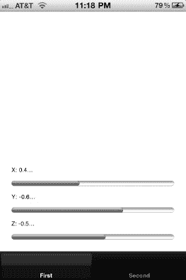

**图 4-4.** *获取 UIAccelerometer 的 X、Y 和 Z 测量值。*

在测试应用程序时，尝试几种不同的场景。尝试向下用力甩动设备，观察轴上的快速变化。尝试将设备水平侧放，这会使 X 轴达到最大值（负值或正值取决于侧放方向）。接下来，将设备竖直放置。此时 Y 轴应达到满量程，而其他读数趋近于零。将设备平放，屏幕朝上。你应该会看到 Z 轴接近 1.0，而其他两个轴的测量值趋近于零。熟悉设备的方向。在本书后续内容中，我们需要将这些类型的读数整合到我们的应用程序中。


### 摇动检测

你也可以使用加速度计来测量用户的动作。App Store 上一些流行的 iOS 应用（如 Facebook）会利用摇动检测实现刷新操作。而其他原生应用（如短信）则将摇动检测作为用户取消操作的一种方式。

返回到 `FirstViewController.m` 的 `didAccelerate` 委托方法中，将代码清单 4-5 中的代码添加至该方法底部。

**代码清单 4-5.** *添加到 `didAccelerate` 委托方法*

```
double const kThreshold = 2.0; // 2Gs 是检测摇动的典型阈值
    if (   ABS(acceleration.x) > kThreshold
        || ABS(acceleration.y) > kThreshold
        || ABS(acceleration.z) > kThreshold) {
        // 如果检测到任意轴有摇动
        NSLog(@"检测到摇动！"); // 记录日志！
    }
```

首先，我们定义一个常量作为摇动检测的阈值。如果任一轴测得的震动幅度超过 2Gs，该方法将在控制台记录我们设定的消息。在设备上运行更新后的项目，并在应用启动时摇动设备。在 Xcode 控制台中，你应该能看到类似图 4-5 所示的内容。

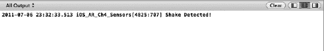

**图 4-5.** *检测用户的摇动操作。*

在第 5 章中，我们将讨论声音和用户反馈，并展示如何使设备振动。本章主要聚焦于收集传感器数据。

### 低通滤波

我们将在示例中使用的一种技术称为低通滤波。基本上，当接收到加速度计数据时，我们会过滤掉除重力读数之外的所有数据。这有助于我们在增强现实视图中保持三维物体的朝向。代码清单 4-6 展示了设置低通滤波器的示例代码。

我们将在讨论三维物体和增强现实时更详细地介绍这一主题。

**代码清单 4-6.** *设置低通滤波器*

```
accel[0] = acceleration.x * kFilteringFactor + accel[0] * (1.0 - kFilteringFactor);
accel[1] = acceleration.y * kFilteringFactor + accel[1] * (1.0 - kFilteringFactor);
accel[2] = acceleration.z * kFilteringFactor + accel[2] * (1.0 - kFilteringFactor);
```

### 使用陀螺仪

实际上，读取陀螺仪的数据要稍微简单一些。无需设置委托类或委托方法来处理更新。启动陀螺仪后，你可以直接通过 `CMMotionManager` 类请求测量数据。该类充当设备硬件的接口网关。

现在，让我们使用演示项目中的第二个标签页来测量陀螺仪。打开 Xcode，选择 `SecondView.xib`，并按图 4-6 所示设置画布。我们将根据陀螺仪的三个 `attitude` 属性（即 `roll`、`pitch` 和 `yaw`）进行可视化显示。

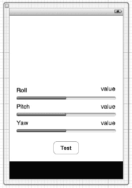

**图 4-6.** *设置用于监测陀螺仪的画布。*

在连接这些输出口之前，我们必须向项目添加一个新的框架。与陀螺仪交互需要使用 Core Motion 框架。通过在你的 Xcode **项目导航器**中选择项目名称，并在应用目标的 **Build Phases** 标签页的 **Link Binary With Libraries** 部分添加该框架，即可将其添加到项目中。打开 `SecondViewController.h`，并添加属性，用于将信息发送到我们刚刚创建的 `IBOutlet`。请参考代码清单 4-7 中的代码。

**代码清单 4-7.** *新的 `SecondViewController.h`*

```
#import <UIKit/UIKit.h>
#import <CoreMotion/CoreMotion.h>

@interface SecondViewController : UIViewController {
    CMMotionManager *motionManager;

    UILabel *rollLabel;
    UILabel *pitchLabel;
    UILabel *yawLabel;

    UIProgressView *rollProgressView;
    UIProgressView *pitchProgressView;
    UIProgressView *yawProgressView;

}

@property (nonatomic, retain) CMMotionManager *motionManager;

@property (nonatomic, retain) IBOutlet UILabel *rollLabel;
@property (nonatomic, retain) IBOutlet UILabel *pitchLabel;
@property (nonatomic, retain) IBOutlet UILabel *yawLabel;

@property (nonatomic, retain) IBOutlet UIProgressView *rollProgressView;
@property (nonatomic, retain) IBOutlet UIProgressView *pitchProgressView;
@property (nonatomic, retain) IBOutlet UIProgressView *yawProgressView;

- (IBAction)readGyroscope;

@end
```

在我们深入之前，快速过一下这段代码。从顶部开始，你会看到我们为刚刚添加到应用中的 Core Motion 框架添加的 `import` 语句。接下来，在 `interface` 块中，你会注意到我们并没有像处理加速度计那样将此类指定为任何委托。陀螺仪类充当硬件传感器的接口网关，它不像加速度计类那样向委托方法报告。

`UILabel` 和 `UIProgressBar` 属性应该不足为奇，它们与加速度计示例中使用的相同。不过，在这个示例中我们有一个新属性。`CMMotionManager` 是我们将用来与陀螺仪交互的类。

最后，我们为按钮声明了一个 `IBAction` 方法。我们不会像处理加速度计那样依赖委托方法，而是手动调用一个方法来查询陀螺仪的当前测量值。

在 Xcode 中切换到 `SecondViewController.m`，并 `synthesize` 我们的新属性；别忘了更新你的 `dealloc` 方法以释放这些属性并将其设置为 `nil`，如代码清单 4-8 所示。

**代码清单 4-8.** *合成并释放新属性*

```
// 在 @implementation 之后
@synthesize motionManager;
@synthesize rollLabel, rollProgressView, pitchLabel, pitchProgressView, yawLabel, yawProgressView;

// 新的 dealloc 方法
- (void)dealloc
{
    [motionManager release];
    motionManager = nil;
    [rollLabel release];
    rollLabel = nil;
    [rollProgressView release];
    rollProgressView = nil;
    [pitchLabel release];
    pitchLabel = nil;
    [pitchProgressView release];
    pitchProgressView = nil;
    [yawLabel release];
    yawLabel = nil;
    [yawProgressView release];
    yawProgressView = nil;
    [super dealloc];
}
```

取消注释 `viewDidLoad` 方法并更新它，如代码清单 4-9 所示。

**代码清单 4-9.** *取消注释并更新 `viewDidLoad` 方法*

```
- (void)viewDidLoad
{
    self.motionManager = [[[CMMotionManager alloc] init] autorelease];
    motionManager.deviceMotionUpdateInterval = 1.0/60.0;
    if (motionManager.isDeviceMotionAvailable) {
        [motionManager startDeviceMotionUpdates];
    }
    [super viewDidLoad];
}
```

首先，我们将 `motionManager` 属性设置为 `CMMotionManager` 类的一个新实例。接着，我们设置更新的时间间隔。最后，如果运动管理器可用，我们就开始更新。如果你还记得第 2 章中验证传感器可用性的内容，这里看起来会很熟悉。如果你跳过了第 2 章，只需注意，在尝试访问传感器之前先验证其是否可用是一种良好的实践。


#### 姿态

在用数值更新 UI 之前，我们先将其输出到控制台，确保能成功访问硬件。将代码清单 4–10 中的代码复制到`SecondViewController.m`，添加我们在头文件中声明的`IBAction`方法。

**代码清单 4–10.** *添加 IBAction 方法——readGyroscope*

```
- (void)readGyroscope {
    CMDeviceMotion *currentDeviceMotion = motionManager.deviceMotion;
    CMAttitude *currentAttitude = currentDeviceMotion.attitude;

    NSLog(@"Attitude: %@", currentAttitude);
}
```

该方法创建一个`CMDeviceMotion`对象，并从陀螺仪读取`CMAttitude`值。切换到`SecondView.xib`，将`UIButton`的`IBAction`设置为`readGyroscope`方法。`CMAttitude`读数包含一组关键参数（参见表 4–1），我们将在本书后续的示例应用中使用这些参数。

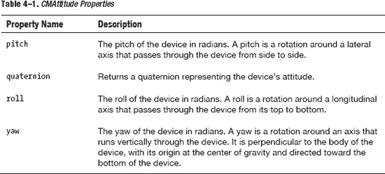

在实体设备上运行应用。切换到第二个标签页，点击 Test 按钮。沿不同方向旋转设备，持续测试这些数值。在 Xcode 控制台中，您应能看到类似代码清单 4–11 所示的日志输出。

**代码清单 4–11.** *记录设备姿态的 NSLog 输出*

```
2011-07-08 20:38:31.955 iOS_AR_Ch4_Sensors[6144:707] Attitude: Pitch: -41.931169, Roll:
-57.704060, Yaw: -177.801492 @ 0.000000
2011-07-08 20:38:33.572 iOS_AR_Ch4_Sensors[6144:707] Attitude: Pitch: -17.880685, Roll:
-62.436956, Yaw: 167.555800 @ 0.000000
2011-07-08 20:38:49.238 iOS_AR_Ch4_Sensors[6144:707] Attitude: Pitch: 28.940916, Roll:
11.359928, Yaw: -45.087161 @ 0.000000
```

`Attitude`是设备`Pitch`、`Roll`和`Yaw`的组合。若单独访问这些属性，将得到各自的弧度值。通常，我们需要将其转换为角度用于基础增强现实场景，例如了解设备的视角和旋转角度。将代码清单 4–12 中的代码添加到`readGyroscope`方法的末尾。

**代码清单 4–12.** *添加到 readGyroscope 方法末尾*

```
    rollLabel.text = [NSString stringWithFormat:@"ROLL: %f", currentAttitude.roll];
    rollProgressView.progress = ABS(currentAttitude.roll);
    pitchLabel.text = [NSString stringWithFormat:@"PITCH: %f", currentAttitude.pitch];
    pitchProgressView.progress = ABS(currentAttitude.pitch);
    yawLabel.text = [NSString stringWithFormat:@"YAW: %f", currentAttitude.yaw];
    yawProgressView.progress = ABS(currentAttitude.yaw);
```

刚添加的代码块应该看起来很熟悉。我们只是设置 UI 元素中的可视化值以便快速调试。运行应用，您应能看到类似于图 4–7 所示的效果。

可以看到，Xcode 控制台中显示的数值与屏幕上的值并不完全一致。格式相同，但我们现在看到的是每个轴上旋转的弧度测量值。

在进入本书后续的示例之前，我们先介绍一个名为 cocos2D 的框架。我们将使用该框架实现动画和 2D 游戏功能。cocos2D 提供了一些非常简单的函数，用于将弧度转换为角度。

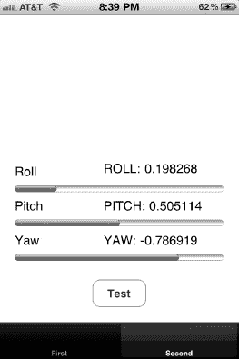

**图 4–7.** *从 CMMotionManager 读取陀螺仪数据*

运动管理器会自动融合加速度计和陀螺仪数据。这种方法缺失的一个读数是旋转速率。让我们快速构建一个示例，演示如何获取该指标并将其与 UI 元素关联。这将是增强现实编程中的常见任务。大多数情况下，当手机旋转时，您需要保持叠加在视图上的元素方向正确。

#### 旋转速率

在 Xcode 中打开`SecondView.xib`。在视图已有内容的上方添加一个`UIImageView`对象。为该元素分配一个更偏向水平方向的图像。本章的 GitHub 仓库中附带了一张战斗机图片，可供使用。在头文件中定义`UIImageView`，并在实现文件中合成/释放该对象。将代码清单 4–13 中的代码添加到`readGyroscope`方法的末尾。

**代码清单 4–13.** *添加到 readGyroscope 方法末尾*

```
float rotation;
    float rate = motionManager.gyroData.rotationRate.z;
        if (fabs(rate) > .2) {
            float direction = rate > 0 ? 1 : -1;
            rotation += direction * M_PI/90.0;
imageView.transform = CGAffineTransformMakeRotation(rotation);
            NSLog(@"Rotation: %f", rotation);
        }
```

该方法将使用运动管理器的`gyroData`属性获取 Z 轴的旋转速率。这里使用了一个新函数，根据 Z 轴的旋转来旋转图像。我们将在本书后续的深入示例中更详细地探讨此类任务的各种实现方法。当然，我们尚未开始实际监控陀螺仪，因此在看到有用结果之前需要先进行设置。按代码清单 4–14 所示更新`viewDidLoad`方法。

**代码清单 4–14.** *更新后的 viewDidLoad 方法*

```
- (void)viewDidLoad
{
    self.motionManager = [[[CMMotionManager alloc] init] autorelease];
    motionManager.deviceMotionUpdateInterval = 1.0/60.0;

    if (motionManager.isDeviceMotionAvailable) {
        [motionManager startDeviceMotionUpdates];
        [motionManager startGyroUpdates];
    }
    [super viewDidLoad];
}
```

在继续深入之前，务必注意这段代码并未停止监听陀螺仪读数。实现合理的开始/停止监听传感器读数的例程非常重要。

继续运行项目。您会发现测试有些困难。我们需要验证的是：当我们按下 Test 按钮时，若 Z 轴旋转速率显著增加，图像是否会旋转到与 Z 轴相同的角度。主要难点在于我们必须同时按下按钮并移动设备，这只会导致旋转速率的微小变化，如图 4–8 所示。

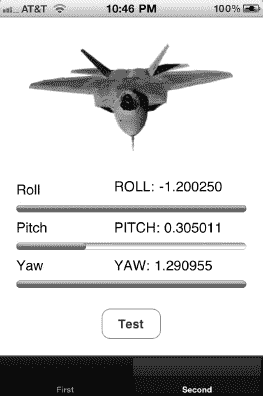

**图 4–8.** *测试陀螺仪数据的手动读取（注意图像的轻微滚动效果）*

与其通过按钮点击手动获取读数，不如使用`NSTimer`类设置时间间隔并回调另一个方法。

将代码清单 4–13 中的代码块重构为一个新方法，如代码清单 4–15 所示。

**代码清单 4–15.** *重构后的代码——新方法 doGyroUpdate*

```
-(void)doGyroUpdate {
    float rotation;
    float rate = motionManager.gyroData.rotationRate.z;
    if (fabs(rate) > .2) {
       float direction = rate > 0 ? 1 : -1;
       rotation += direction * M_PI/90.0;
       imageView.transform = CGAffineTransformMakeRotation(rotation);
        NSLog(@"Rotation: %f", rotation);
    }
}
```

开始监听陀螺仪事件后，创建一个`NSTimer`来调用我们的新方法。首先在头文件中声明`NSTimer`（我将其命名为`timer`）。在`viewDidLoad`方法中创建定时器。代码应类似于代码清单 4–16。再次提醒，本示例中我们没有进行资源清理，因为我们的目标是读取数据。该应用没有 UI 流程。

**代码清单 4–16.** *设置 NSTimer*


```objective-c
timer = [NSTimer scheduledTimerWithTimeInterval:1/30.0
                 target:self
                 selector:@selector(doGyroUpdate)
                 userInfo:nil
                 repeats:YES];
```

如果再次运行项目，你会在控制台中看到更多输出，同时设备对旋转的响应也会更平滑。陀螺仪类正在以亚秒级频率更新数据，我们随之旋转图像来匹配这些读数。

### 磁力计

磁力计是一种用于测量设备周围磁场强度的传感器。假设设备附近没有强磁场，该读数将与地球的环境磁场相关，从而让我们能够利用这些读数来确定设备的方向。设备的方向是指其相对于北极的地磁方向。苹果在其开发者文档中指出（大多数其他相关参考资料也持相同观点），地磁方向与相对于地理北极的真实方向可能因您的位置不同而有很大差异。

测量设备的地磁方向与我们测量陀螺仪或加速度计读数的方式类似。让我们扩展项目，使其也显示设备方向。

在 Xcode 中，向项目添加一个新的 `UIViewController` 类。将其命名为 `headingViewController`，并确保通过 XIB 文件创建界面。我使用谷歌图片搜索找到了一张无版权的指南针图片。该图片包含在 GitHub 上的项目中，也可从 Apress 网站 (`www.apress.com`) 的“源代码/下载”区域获取。如果您使用自己的图片，请确保“北”位于图片顶部中央。我们将根据设备方向旋转这张图片，因此希望从与垂直轴成 0 度的角度开始，以尽可能简化操作。准备好图片后，将其添加到 Xcode 项目中。

#### 磁力计可用性

正如我们在第 3 章中讨论的，`CLLocationManager` 需要用户启用位置更新才能正常运行。位置管理器还能返回设备的真实方向和地磁方向。然而，只有当用户启用了位置更新时，设备的真实方向才可用。而无论用户是否偏好启用位置更新，地磁方向更新始终可用。这是因为方向信息本身不会损害用户隐私，因此无需获得批准。

简而言之，您无需像使用其他传感器那样，在使用磁力计前检查其可用性。

#### 校准

由于很可能存在两个读数（地磁方向与真实方向），iOS 提供了相应功能，允许我们校准设备以确定两者之间的差异。`CLLocationManager` 定义了一个名为 `locationManagerShouldDisplayHeadingCalibration` 的委托方法。该方法会覆盖显示一个方向图像，指示用户以 8 字形模式旋转设备，直到位置管理器能够区分任何局部磁场与地球磁场。位置管理器以真实方向作为参考。

#### 看看我们指向何方

在 Interface Builder 中打开 `headingViewController.xib`。添加一个 `UIImage` 输出口和两个 `UILabel` 输出口。你可以在图 4-9 中看到示例界面的设置方式。

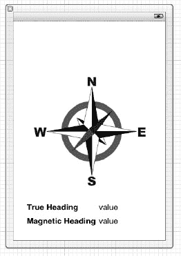

**图 4-9.** *此为磁力计界面（`headingViewController.xib`）的设置。*

在辅助编辑器中打开 `headingViewController.h`，按住 Ctrl 键，将 `UIImage` 和一组 `UILabel` 从 Interface Builder 拖拽到接口文件中，如图 4-10 所示。

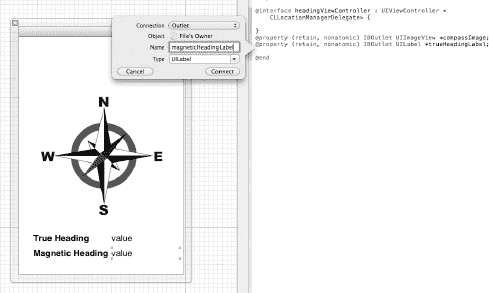

**图 4-10.** *此为 IBOutlets 的设置属性。*

确保导入 `<CoreLocation/CoreLocation.h>` 头文件，并将 `headingViewController` 声明为 `CLLocationManagerDelegate`。

完成上述步骤后，在 Xcode 中切换到 `headingViewController.m`。用代码清单 4-17 中的代码更新 `viewDidLoad` 方法。

**代码清单 4-17.** *新的 `viewDidLoad` 方法*

```objective-c
- (void)viewDidLoad
{
    [super viewDidLoad];
    // Do any additional setup after loading the view from its nib.

    CLLocationManager *locationManager = [[CLLocationManager alloc] init];
    locationManager.delegate = self;
    locationManager.headingFilter = 5;
    if ([CLLocationManager locationServicesEnabled] && [CLLocationManager headingAvailable]) {
        [locationManager startUpdatingHeading];
        [locationManager startUpdatingLocation];
    } else {
        NSLog(@"Error starting location updates");
    }
}
```

在继续之前，我们先简单梳理一下这段代码。首先，我们设置 `CLLocationManager` 实例。这应该与我们在第 3 章中的操作类似。按预期将 `delegate` 设置为 `self`，然后引入了一个新属性。`headingFilter` 属性定义了更新委托方法所需的变化阈值。我们将该值设置为 5（度），因此位置管理器仅在方向变化超过 5 度时更新委托。

我之前提到过，你无需检查磁力计的可用性。那么，为什么我在 `viewDidLoad` 中包含了检查呢？方向信息仅在 iPhone 3Gs 及更高版本中可用。此验证可确保用户使用的是较新的硬件。另外，值得注意的是，我使用的是类方法 `locationServicesEnabled` 和 `headingAvailable`。网上许多示例应用程序使用实例方法进行此检查。实例方法在 iOS 4 中已被弃用。请确保在您的应用程序中使用类方法。

最后，一旦确认读数可用，我们便启用了位置和方向更新。

接下来，我们必须添加委托方法来处理更新，并在界面中反映变化。在 `viewDidLoad` 方法之后，添加代码清单 4-18 中的方法。

**代码清单 4-18.** *`didUpdateHeading` 委托方法*

```objective-c
- (void)locationManager:(CLLocationManager *)manager didUpdateHeading:(CLHeading *)newHeading {
    if (newHeading.headingAccuracy > 0) {
        float magneticHeading = newHeading.magneticHeading;
        float trueHeading = newHeading.trueHeading;

        magneticHeadingLabel.text = [NSString stringWithFormat:@"%f", magneticHeading];
        trueHeadingLabel.text = [NSString stringWithFormat:@"%f", trueHeading];

        float heading = -1.0f * M_PI * newHeading.magneticHeading / 180.0f;
        compassImage.transform = CGAffineTransformMakeRotation(heading);
    }
}
```

你可以看到，我们首先检查了 `headingAccuracy` 的值，然后再执行其他操作。如果位置更新未启用，`headingAccuracy` 的值将被设置为 -1。检查该值是否大于零可确保我们从磁力计和位置管理器都获得了正确的读数。我们只是简单地将两个 `UILabel` 设置为读数中的值，这样你可以看到它们之间的细微差别，然后旋转图片。我们使用 `CGAffineTransformMakeRotation` 方法来旋转图片。我们将其乘以负常数，再乘以 pi，然后除以 180。之所以用 180，是因为方向始终相对于设备的顶部，无论其朝向如何。我们将在下一部分讨论这一点。

在物理设备上运行项目。你将看到类似于图 4-11 的结果。

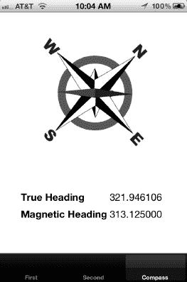

**图 4-11.** *同时检索真实方向和地磁方向的值。*


### 处理方向变化

当您运行示例应用时，请测试设备处于横屏模式时会发生什么。您会看到“北”对应的是设备的顶部，而非可见屏幕的顶部。如果您在不改变航向的情况下将设备横置，设备报告的航向将指向您的左侧或右侧（具体取决于您旋转的方向）。我们可以通过快速修改类来解决这个问题。

在 Interface Builder 中打开 `headingViewController.xib`。为界面添加另一个 `UILabel IBOutlet`。将属性命名为 `orientationLabel`，并像处理其他输出口一样，将其添加到 `headingViewController.h` 中。在接口文件中声明代码清单 4–19 所示的方法。

**代码清单 4–19.** *辅助方法*

```
- (float)heading:(float)heading fromOrientation:(UIDeviceOrientation) orientation;
- (NSString *)stringFromOrientation:(UIDeviceOrientation) orientation;
```

切换到 `headingViewController.m`，添加代码清单 4–20 中所示的两个方法。

**代码清单 4–20.** *基于方向获取角度的方法*

```
- (float)heading:(float)heading fromOrientation:(UIDeviceOrientation)orientation {
    float correctedHeading = heading;

    switch (orientation) {
        case UIDeviceOrientationPortrait:
            break;
        case UIDeviceOrientationPortraitUpsideDown:
            correctedHeading = heading + 180.0f;
            break;
        case UIDeviceOrientationLandscapeLeft:
            correctedHeading = heading + 90.0f;
            break;
        case UIDeviceOrientationLandscapeRight:
            correctedHeading = heading - 90.0f;
            break;
        default:
            break;
    }
    while ( heading > 360.0f ) {
        correctedHeading = heading - 360;
    }
    return correctedHeading;
}

- (NSString *)stringFromOrientation:(UIDeviceOrientation) orientation {
    NSString *orientationString;
    switch (orientation) {
        case UIDeviceOrientationPortrait:
            orientationString = @"Portrait";
            break;
        case UIDeviceOrientationPortraitUpsideDown:
            orientationString = @"Portrait Upside Down";
            break;
        case UIDeviceOrientationLandscapeLeft:
            orientationString = @"Landscape Left";
            break;
        case UIDeviceOrientationLandscapeRight:
            orientationString = @"Landscape Right";
            break;
        case UIDeviceOrientationFaceUp:
            orientationString = @"Face Up";
            break;
        case UIDeviceOrientationFaceDown:
            orientationString = @"Face Down";
            break;
        case UIDeviceOrientationUnknown:
            orientationString = @"Unknown";
            break;
        default:
            orientationString = @"Not Known";
            break;
    }
    return orientationString;
}
```

第一个方法根据设备的方向调整航向。这是一种相当基础的校正方式。您可以结合陀螺仪和方向信息，实现更复杂、更精确的校正。就本示例而言，我们假设设备完全旋转为竖屏或横屏模式，因此我们依据 90 度的倍数进行校正。

第二个方法根据设备的方向构建一个人类可读的字符串。我在几篇在线文章中找到了这个函数。我不确定这个函数归功于谁，但它非常实用。

我们需要对 `didUpdateHeading` 代理方法进行调整，然后就可以测试我们校正后的示例应用了。用代码清单 4–21 中的代码更新 `didUpdateHeading` 方法。

**代码清单 4–21.** *新的 didUpdateHeading 方法*

```
- (void)locationManager:(CLLocationManager *)manager didUpdateHeading:(CLHeading *)newHeading {
    if (newHeading.headingAccuracy > 0) {
//float magneticHeading = newHeading.magneticHeading;
        //float trueHeading = newHeading.trueHeading;
        UIDevice *device = [UIDevice currentDevice];
        orientationLabel.text = [self stringFromOrientation:device.orientation];

        float magneticHeading = [self heading:newHeading.magneticHeading fromOrientation:device.orientation];
        float trueHeading = [self heading:newHeading.trueHeading fromOrientation:device.orientation];

        magneticHeadingLabel.text = [NSString stringWithFormat:@"%f", magneticHeading];
        trueHeadingLabel.text = [NSString stringWithFormat:@"%f", trueHeading];

        float heading = -1.0f * M_PI * newHeading.magneticHeading / 180.0f;
        compassImage.transform = CGAffineTransformMakeRotation(heading);
    }
}
```

让我们过一遍其中加粗的代码块。首先，我们初始化了一个代表用户实际手机的 `UIDevice` 实例。然后，我们使用辅助方法构建了一个人类可读的字符串，并设置了方向标签的值。接着，我们使用辅助方法，根据设备的方向计算了校正后的航向值。方法的其余部分保持不变。

在您的实体设备上运行该项目。图 4–12 和 图 4–13 展示了结果。请密切关注方向标签。您会看到，在横屏模式下，航向已经被校正。

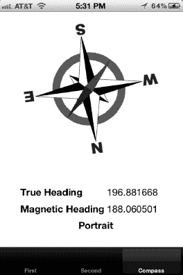

**图 4–12.** *在竖屏模式下显示航向。*

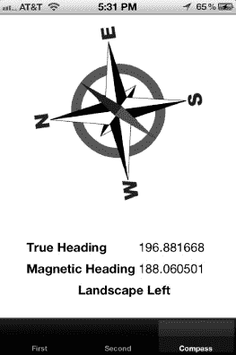

**图 4–13.** *在横屏模式下显示航向。*

### 总结

在本章中，我们在访问各种传感器方面做了大量工作。在阅读过程中，这看起来可能有点底层或偏离主题，但当我们开始构建自己的 AR 应用时，这会变得非常有用。

我们讨论了加速度计、陀螺仪以及它们与 Core Motion 框架的结合。然后，我们介绍了磁力计，并整合了一个能帮助我们保持方向感的示例应用。我们正在逐步完成构建我们自己的 AR 应用所需的一切工具。

接下来，在第 5 章中，我们将探讨声音和用户反馈。

## 第 5 章

## 声音与用户反馈

无声电影至今仍具有怀旧价值，是娱乐史上至关重要的一部分。然而，无声电子游戏或无声交互式应用似乎并不属于这一类。用户体验需要具有吸引力。辅助功能选项有助于确保所有用户都能体验到相同水平的交互。在本章中，我们将讨论如何为事件添加效果，以及如何在您的应用中添加主动反馈，例如振动。

### 音频数据格式

让我们从基础开始。iOS 中有大量的声音选项可供选择。我们将首先讨论不同的格式及其细微差别，然后讨论如何在不同格式之间进行转换。请查看表 5–1，其中概述了不同的支持格式。


#### 那么，哪种数据格式适合我？

遗憾的是，对这个问题的答案是“视情况而定”。您的实际使用场景将决定哪种声音格式最适合您的应用。例如，如果空间不是问题，您可以使用线性 PCM。这将是播放音频最快的方式，并且在播放期间不会影响 CPU 性能（因为它不必同时解压文件）。然而，如果空间是个问题，您可能希望为背景音乐或较大的文件使用 AAC，以利用其压缩优势；而为音效和小文件使用 IMA4，以利用其对 16 位文件的优势。


#### 关于文件格式

数据格式是一回事，但我们在哪里以及如何存储这些文件呢？iOS 支持多种不同的文件格式，包括 MPEG-1 (`.mp3`)、MPEG-2 (`.aac`)、AIFF、WAVE 和 CAF。CAF 是 iOS 上首选的格式，因为它可以包含我们在表 5–1 中列出的任何数据格式。

#### 比特率与音质

音频播放的场景决定了该特定事件所需的音质。例如，语音应用与播放交响乐团表演的应用有着截然不同的声音要求。

音质可以通过使用称为比特率的变量来调整音频文件。比特率是文件每秒使用的字节数。只有表 5–1 中提到的少数几种格式支持比特率的配置。表 5–2 展示了一些常见的比特率。


#### 采样率

音频的采样率定义了每单位时间的样本数。通常，它以每秒样本数来度量，或者更常见地，用赫兹（Hz）作为速率单位。如果你不知道，采样频率的倒数就是采样间隔，即样本之间的时间。

表 5–3 描述了一些常见的采样率。


#### 转换音频以便在 iOS 中使用

你可以从互联网上的各个地方下载样本。诸如 `audiomicro.com` 和 `soundsnap.com` 之类的网站提供各类声音的免版税样本。在 `freesound.org` 上也有知识共享许可的声音。大多数情况下，这些样本的格式可能并非你增强应用所需的精确格式。因此，你应该熟悉可用的工具，以帮助你转换其中的一些媒体格式。

让我们来演练一下关于测试媒体文件的三个典型活动。首先，我们将获取我们考虑使用的文件的信息，然后将文件转换为另一种格式，最后测试并播放该文件。

本章的示例代码可在 GitHub 上获取，地址为 [`https://github.com/kyleroche/Professional_iOS_AugmentedReality`](https://github.com/kyleroche/Professional_iOS_AugmentedReality)。如果你的本地机器上没有示例音频文件，你可以跟随 GitHub 上的 Xcode 项目中的示例进行操作。

##### 获取媒体文件信息

Mac OS X 中有一个名为 `afinfo` 的实用工具。该工具可从终端（Terminal）使用。代码清单 5–1 显示了我将本章 GitHub 仓库中的示例文件传入此命令后的输出。

**代码清单 5–1.** *`afinfo waterfall.caf`*

```
Kyle-Roches-MacBook-Pro-2:iOS_AR_Ch5_SoundUserFeedback kyleroche$ afinfo waterfall.caf
File:           waterfall.caf
File type ID:   caff
Data format:     1 ch, 44100 Hz, 'lpcm' (0x0000000C) 16-bit little-endian signed integer
                no channel layout.
estimated duration: 1.950204 sec
audio bytes: 172008
audio packets: 86004
audio 86004 valid frames + 0 priming + 0 remainder = 86004
bit rate: 705600 bits per second
packet size upper bound: 2
audio data file offset: 4096
optimized
source bit depth: I16
sound check:
    approximate duration in seconds         1.95
----
```

输出的关键部分已用粗体高亮显示。其中一项是 `Data format`（数据格式）。这就是我们之前提到的采样率。`44100 Hz` 常用于 CD 音质音频，并推荐在 iOS 应用中使用。接下来，**比特率**被高亮显示。这并非我们之前提到的特定每秒速率，但它属于标准音频质量的范围。最后，在最后一行，`afinfo` 返回了**以秒为单位的近似持续时间**。如果你将声音用于游戏或时间线导向的方式，这一点很重要。

尝试使用 `afinfo` 做些实验。我曾针对我的 iTunes 资料库运行它，以查看我导入的旧音乐与从 iTunes 下载的新音乐之间的不同采样。代码清单 5–2 显示了一首下载歌曲的输出示例。

**代码清单 5–2.** *iTunes 文件的 `afinfo` 结果*

```
Kyle-Roches-MacBook-Pro-2:Ukulele Songs kyleroche$ afinfo 10\ You\'re\ True.m4a
File:           10 You're True.m4a
File type ID:   m4af
Data format:     2 ch,  44100 Hz, 'aac ' (0x00000000) 0 bits/channel, 0 bytes/packet, 1024 frames/packet, 0 bytes/frame
Channel layout: Stereo (L R)
estimated duration: 203.333333 sec
audio bytes: 6491497
audio packets: 8759
audio 8967000 valid frames + 2112 priming + 104 remainder = 8969216
bit rate: 255340 bits per second
packet size upper bound: 1197
audio data file offset: 594724
optimized
format list:
[ 0] format:     2 ch,  44100 Hz, 'aac ' (0x00000000) 0 bits/channel, 0 bytes/packet, 1024 frames/packet, 0 bytes/frame
     Channel layout: Stereo (L R)
source bit depth: I16
sound check:
    sc ave perceived power coeff             2973 3040
    sc max perceived power coeff             16060 12146
    sc peak amplitude msec                   26006 25263
    sc max perceived power msec              25263 24520
    sc peak amplitude                        32766 32766
----
```

查看输出，最大的区别是 `sound check` 部分的信息量增加了。显然，更高质量的音频文件拥有更多可用信息。

现在我们有了一个可以用来验证媒体文件的比特率、采样率和格式的工具。接下来，让我们看看如何将声音文件转换为适当的格式。

##### 转换文件类型

我们使用 GitHub 项目中的同一个示例文件进行初步测试。是时候介绍一个名为 Audio File Convert（即 `afconvert`）的新工具了。Audio File Convert 会将源音频文件转换为具有指定文件和数据类型的新音频文件。代码清单 5–3 显示了 `afconvert` 的用法说明。

**代码清单 5–3.** *`afconvert` 用法说明*

```
Usage:
afconvert [option...] input_file [output_file]
    Options may appear before or after the direct arguments. If output_file
    is not specified, a name is generated programmatically and the file
    is written into the same directory as input_file.
afconvert input_file [-o output_file [option...]]...
    Output file options apply to the previous output_file. Other options
    may appear anywhere.
Help options:
    { -hf | --help-formats }
        print a list of supported file/data formats
    { -h | --help }
        print help
```

你可以使用 `afconvert` 来切换文件格式、媒体格式，或以不同的比特率保存文件。让我们通过比特率和示例文件进行实验，以熟悉 `afconvert`。在终端窗口中运行代码清单 5–4 中显示的命令。

**代码清单 5–4.** *使用 `afconvert` 更改比特率*

```
afconvert -d aac -f 'caff' -b 32768 waterfall.caf waterfallNew.caf
```

如果你检查目录，你会注意到一个名为 `waterfallNew.caf` 的新文件已被创建。我们使用了 `-d` 选项来设置数据格式，`-f` 选项来设置文件格式，`-b` 选项来设置比特率。我们先将要转换的现有文件传递给 `afconvert`，然后是目标文件。如果你在新文件上运行 `afinfo` 工具，你将看到比特率上的差异。

##### 测试你的新声音

我想提到的最后一个实用工具是 `afplay`。这是另一个命令行实用工具，可以让你快速测试音频文件。只需传递你想要播放的文件名，它就会通过你的默认输出硬件播放该文件。


### 在 iOS 应用中播放声音

让我们将其中一些文件添加到 iOS 应用中。同样，本章的代码可在 GitHub 上获取，但如果你希望从头开始实践，请创建一个以 **iPhone** 为目标设备的标签栏应用。

打开 `FirstView.xib` 并设置界面，如图 5-1 所示。


**图 5-1.** *这里我们看到了两个 `UIButton`，用于触发我们将要创建的操作。*

我们将演示在 iOS 应用后台播放音频的两种不同方法。界面很简单。清除默认控件，创建两个新的 `UIButton` 元素。使用类似 图 5-1 中所示的标题。

我们将讨论的两种方法都相对直接且易于实现。我们将在第 7 章中介绍一种更高级的、以游戏为中心的方法。

### 系统声音服务

系统声音服务是在设备上播放音效的绝佳选择。它专为短音效而设计，例如按钮点击声、错误提示音或游戏动作。使用系统声音服务播放的声音无法通过你的音频会话进行配置。因此，你无法使系统声音服务的音频行为与应用中的其他音频行为保持一致。这是避免将系统声音服务用于其预期用途之外的任何音频的最重要原因。使用系统声音服务需要将 `AudioToolbox` 框架添加到你的项目中。

为了确保其作为快速声音播放器的用途，系统声音服务存在一些限制。你的声音文件必须满足以下条件：

-   持续时间不超过 30 秒
-   采用线性 PCM 或 IMA4 (IMA/ADPCM) 格式
-   打包在 `.caf`、`.aif` 或 `.wav` 文件中

此外，当你使用 `AudioServicesPlaySystemSound` 函数时：

-   声音以当前系统音频音量播放，无法通过编程方式控制音量
-   声音立即播放
-   不支持循环和立体声定位
-   不支持同时播放；一次只能播放一个声音

### AVAudioPlayer 类

`AVAudioPlayer` 更加灵活，但也有其自身的局限性。`AVAudioPlayer` 最受限制的特性是在排队和播放文件时存在明显的延迟。因此，它最适合长时间播放的背景音乐及类似场景。使用 `AVAudioPlayer` 需要你的项目中包含 `AVFoundation` 框架。使用 `AVAudioPlayer`，你可以：

-   播放任意持续时间的声音
-   播放来自文件或内存缓冲区的声音
-   循环播放声音
-   同时播放多个声音（尽管不能精确同步）
-   控制正在播放的每个声音的相对播放电平
-   跳转到声音文件中的特定点，从而支持快进和快退等应用功能
-   获取可用于音频电平测量的音频功率数据

### 试验多个音频播放器

好了，让我们开始吧。你已经创建了包含两个 `UIButton` 的界面。在简要介绍了不同的声音播放方法之后，我使用的标题将更有意义。在开始之前，我们需要将本节中提到的两个框架都添加到我们的项目中。打开应用目标的“构建阶段”选项卡，并添加 `AVFoundation` 和 `AudioToolbox` 框架。

将代码清单 5-5 中的代码添加到 `FirstViewController.h` 中。

**代码清单 5-5.** *新的 `FirstViewController.h`*

```
#import <UIKit/UIKit.h>
#import <AudioToolbox/AudioToolbox.h>
#import <AVFoundation/AVFoundation.h>

@interface FirstViewController : UIViewController <AVAudioPlayerDelegate>{
    SystemSoundID _systemSound;
    AVAudioPlayer *_audioPlayer;
}

- (IBAction)systemSoundAction;
- (IBAction)avAudioPlayerAction;

@end
```

我们首先将 `AudioToolbox` 和 `AVFoundation` 库导入到头文件中。然后，我们将类声明为 `AVAudioPlayerDelegate`。本书并非真正构建一个多媒体应用，因此我不打算深入讨论这个委托及其方法。但是，如果你想在音频播放时处理事件，这将是进一步研究的内容。

在接口中，我们为两种使用场景声明了两个实例变量。`AVAudioPlayer` 需要一个指针，因为我们将在该类中创建实例。最后，我们声明了两个新方法来处理我们添加到用户界面中的 `UIButton` 的点击事件。

接下来，返回 Xcode 中的 `FirstView.xib` 文件，并将这两个 `IBAction` 方法连接到我们的两个按钮上。

切换到 `FirstViewController.m`。在此示例中，我们仅使用实例变量，因此无需合成任何内容。将代码清单 5-6 中的代码添加到你的实现文件中。

**代码清单 5-6.** *处理系统声音服务方法*

```
- (void)systemSoundAction {
    NSString *soundFilePath = [[NSBundle mainBundle] pathForResource:@"waterfall"
ofType:@"caf"];
    NSURL *soundFileURL = [NSURL fileURLWithPath:soundFilePath];
    AudioServicesCreateSystemSoundID((CFURLRef)soundFileURL, &_systemSound);
    AudioServicesPlaySystemSound(_systemSound);
}
- (void) avAudioPlayerAction {
  // 我们接下来将实现此方法
}
```

我引用了我们 GitHub 示例项目中的 CAFF 文件。如果你有想要使用的其他文件，请确保名称匹配。需要注意的是，`pathForResource` 参数接受文件名的核心部分，而不是完整文件名。在你的 iOS 模拟器上运行项目，然后点击“系统声音操作”按钮。你会注意到响应非常迅速（即时），并且文件将开始播放。

关闭模拟器。在完成第二个方法之前，我们还有一些工作要做。由于 `AVAudioPlayer` 更适合背景音乐，我想找一个比瀑布声更合适的素材，因为我不是瀑布爱好者（这并没有什么不妥）。瀑布样本来自 cocos2D 示例（我们将在第 7 章中介绍）。获取音乐样本的另一个地方是 audiomicro.com，我搜索了他们免费的背景音乐样本，寻找更合适的素材。

打开你的终端，进入下载的 MP3 文件所在目录。如果你使用的是示例中的 MP3，请导航到本地克隆的 GitHub 目录。运行代码清单 5-7 中的命令。

**代码清单 5-7.** *将 MP3 转换为 CAFF*

```
afconvert -d aac -f 'caff' "007.mp3" backgroundMusic.caf
```

我们使用音频文件转换器将我们的 MP3 文件转换为可在项目中使用的 CAFF 格式。直接播放 MP3 是可行的，但这无助于我们演示这些实用工具何时有用，对吧？


