# 排版后的文档

回到 Xcode 项目中的 `FirstViewController.m` 文件。我们使用代码清单 5-8 中的代码来填充 `avAudioPlayerAction` 方法的剩余部分。

**代码清单 5-8.** *完整的 avAudioPlayerAction 方法*

```
- (void)avAudioPlayerAction {
    NSError *setCategoryError = nil;
        [[AVAudioSession sharedInstance] setCategory:AVAudioSessionCategoryAmbient
error:&setCategoryError];

        NSString *backgroundMusicPath = [[NSBundle mainBundle] pathForResource:@"backgroundMusic" ofType:@"caf"];
        NSURL *backgroundMusicURL = [NSURL fileURLWithPath:backgroundMusicPath];
        NSError *error;

        _audioPlayer = [[AVAudioPlayer alloc] initWithContentsOfURL:backgroundMusicURL
error:&error];
[_audioPlayer play];
}
```

关于如何结束这个方法，有很多不同的方式。我选择了最简单的一种，那就是直接播放文件。你可以将文件加入队列以便稍后播放，或者从委托方法开始指导如何处理该文件。

在你的 iPhone 模拟器上启动项目。现在，播放这两个文件。你会注意到 `AVAudioPlayer` 方法存在显著的延迟。

### 播放位置音效

对于用户移动屏幕以获取不同视角的增强现实应用，偶尔播放位置音效可能会很有用。你也可以通过 cocos2D 实现位置音效。不过，我们不打算在本章中介绍这部分内容，而且因为还没有引入 cocos2D，我们将其留到第 7 章再进行讲解。

### 通过振动提供用户反馈

我们有一些非听觉选项可用于向用户提供反馈。最常用的是振动效果。实际上，这简单得令人沮丧。在你的 `FirstViewController` 类中创建一个名为 `vibrate` 的新方法。添加代码清单 5-9 中的代码。

**代码清单 5-9.** *完整的 vibrate 方法*

```
- (void)vibrate {
  AudioServicesPlaySystemSound (kSystemSoundID_Vibrate);
}
```

就这样。在示例项目中，我创建了另一个按钮并关联了此方法，这样你就可以看到它在工作状态下的表现。如果你在运行它时遇到任何问题，请确保你的 iPhone 在“设置”面板中已将“振动”开启。

### 录制声音

在本章中，到目前为止，我们已经了解了支持的音频类型及其一些复杂性，以及在 iOS 应用中播放文件的几种方法。接下来，让我们花点时间来理解如何录制和保存在设备上获取的声音。

我们将使用与之前播放音频示例中相同的 `AVFoundation` 框架，但现在用于简单的音频录制。我们已经将框架添加到了项目中，所以不必担心这一步。如果你是从一个新项目开始，你需要像之前一样添加框架。

#### 初始化音频录制器

让应用程序准备录制音频的第一步是设置一个新的 `AVAudioRecorder` 对象。你可以手动创建这个对象及其设置，但 Apple 的文档和大多数在线教程都建议从其他 `init` 选项开始。

在 Xcode 中打开 `SecondViewController.h` 并更新它，如代码清单 5-10 所示。

**代码清单 5-10.** *新的 SecondViewController.h 头文件*

```
#import <UIKit/UIKit.h>
#import <AVFoundation/AVFoundation.h>

@interface SecondViewController : UIViewController <AVAudioRecorderDelegate,
AVAudioPlayerDelegate>{
AVAudioRecorder *_soundRecorder;
}

- (IBAction)setupRecorder;
- (IBAction)stopRecorder;
- (IBAction)playAudioRecording;

@end
```

逐行查看代码，我们声明了一个 `AVAudioRecorder` 实例对象以及三个方法。在最终的应用程序中，你可能希望整合一些音频录制操作，或者利用委托方法，但我们在这里将它们分开以便参考。你可能注意到了另外两个在本章中已经见过几次的内容。我们正在导入 `AVFoundation` 头文件，并将此类指定为 `AVAudioRecorderDelegate` 和 `AVAudioPlayerDelegate`。

在 Xcode 中切换到 `SecondView.xib`，并将 `IBActions` 关联到几个新的 `UIButton`。我按照图 5-2 所示布置了我的屏幕。布局上有三个 `UIButton`。每个按钮都将连接到它们自己的 `IBAction`。

我将 `setupRecorder` 关联到了**录制音频**按钮。接着，我将 `stopRecorder` 关联到了**停止音频**按钮。最后，我将 `playAudioRecording` 方法关联到了**播放录音**按钮。

接下来，我们必须在 `SecondViewController.m` 中实现这些方法。

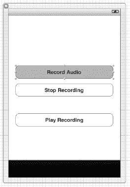

**图 5-2.** *这里我们看到的是用于测试音频录制的屏幕布局。*

在 Xcode 中打开 `SecondViewController.m`。我们必须实现已经声明的方法。让我们从第一个方法 `setupRecorder` 开始。将代码清单 5-11 中的方法添加到你的实现文件中。

**代码清单 5-11.** *setupRecorder 方法*

```
- (void)setupRecorder {
    NSString *filePath = [NSHomeDirectory()
stringByAppendingPathComponent:@"Documents/recording.caf"];
    NSDictionary *recordSettings = [[NSDictionary alloc] initWithObjectsAndKeys:
                                    [NSNumber numberWithFloat: 44100.0],
AVSampleRateKey,
                                    [NSNumber numberWithInt: kAudioFormatAppleLossless],
AVFormatIDKey,
                                    [NSNumber numberWithInt: 1], AVNumberOfChannelsKey,
                                    [NSNumber numberWithInt: AVAudioQualityMax],
AVEncoderAudioQualityKey,nil];

    _soundRecorder = [[AVAudioRecorder alloc] initWithURL:[NSURL
fileURLWithPath:filePath]
                                                                 settings:
recordSettings error: nil];
    _soundRecorder.delegate = self;
    [_soundRecorder record];
}
```

这个方法首先声明了一个 `NSString` 来表示我们将要保存的文件的路径。接着，我们设置了 `NSDictionary` 对象，它保存了我们的 `AVAudioRecorder` 的设置。最后，我们将 `AVAudioRecorder` 的 `delegate` 设置为 `self`，并使用 `record` 方法开始录制。

在 `setupRecorder` 之后，复制代码清单 5-12 中的下一个方法。

**代码清单 5-12.** *stopRecorder 方法*

```
- (void)stopRecorder {
    [_soundRecorder stop];
}
```

这个方法不难理解。我们只是停止了录制。

现在，在我们完成最后一个方法之前，将代码清单 5-13 中的以下方法添加到 `stopRecorder` 下方。

**代码清单 5-13.** *AVAudioRecorder 的委托方法*


```objc
- (void)audioRecorderDidFinishRecording:(AVAudioRecorder *)recorder
                         successfully:(BOOL)flag {
    NSLog(@"录音完成");
}

- (void)audioRecorderBeginInterruption:(AVAudioRecorder *)recorder {
    NSLog(@"录音被中断");
}

- (void)audioRecorderEndInterruption:(AVAudioRecorder *)recorder {
    NSLog(@"中断结束...返回录音");
}
```

我们之前设置的 `AVAudioRecorderDelegate` 定义了几个与 `AVAudioRecorder` 交互的方法。我们在每个方法中仅进行日志记录，以便观察事件的触发时机。在目前的操作集合中，唯一会触发的方法是 `audioRecorderDidFinishRecording`。另外两个方法则适合用于测试。如果你在 iPhone 上进行测试，可以在调试应用的过程中给自己打电话；当电话响起时，`audioRecorderBeginInterruption` 方法会被触发。一旦你挂断电话，`audioRecorderEndInterruption` 方法就会被触发。这些事件都属于委托接口的一部分。

我们正在录制音频会话并将其存储到本地文件系统。最后一步是从本地磁盘回放音频。请在我们刚刚定义的三个委托方法之后，添加代码清单 5–14 所示的方法。

**代码清单 5–14.** *回放文件*

```objc
- (void)playAudioRecording {
    NSString * filePath = [NSHomeDirectory() stringByAppendingPathComponent:
                           @"Documents/recording.caf"];
    AVAudioPlayer *newPlayer = [[AVAudioPlayer alloc] initWithContentsOfURL: [NSURL
                                fileURLWithPath:filePath] error: nil];
    newPlayer.delegate = self;
    [newPlayer play];
}
```

这段代码应该看起来很熟悉。在本章前面部分，我们学习了同样的音频播放流程。现在我们可以开始测试应用了。为了正确测试，你应该使用物理测试设备，而不是模拟器。虽然大多数功能在模拟器上也能运行，但从真实设备上录制声音再进行测试效果更好。

运行应用并切换到第二个标签页。从顶部开始，点击**录制音频**按钮。对着麦克风说话，或者确保有足够的背景噪音来获取真实的样本录音。完成后，点击**停止录制**按钮。在控制台中，你应该会看到日志消息：“**录音完成**”。最后，点击**播放录音**，你就能听到扬声器播放的声音。请确保你的手机没有被强制静音。

### 总结

在本章中，我们学习了 iOS 音频格式的不同内部细节。我们讨论了比特率和文件格式，以及 iOS 支持并推荐使用的格式。我们还了解了一些实用工具，当你需要测试文件或将其转换为其他格式时可以使用。

下一章，我们将从音频转向视频，并为增强现实编程奠定基础。至此，本书各章节已经涵盖了我们将要构建的应用的基本组件。在下一章，我们实际上将开始看到类似于增强现实应用的内容。

## 第 6 章

## 摄像头与视频捕获

增强现实应用通常有一个共同点：它们都建立在实时视频流的基础上。

在本章中，我们将从使用摄像头的基本概念开始，然后迅速转向更高级的视频捕获示例，并逐帧分析视频。

在后续章节中，我们将利用这些概念来构建在视频流上叠加内容的应用程序。

### 快速回顾

在第 2 章中，我们讨论了在代码中访问传感器或硬件组件之前，检查其是否存在及可用性的重要性。

你可以使用 `UIImagePickerController` 类以编程方式检测设备上可用的摄像头。有一个名为 `isSourceTypeAvailable` 的方法，我们可以用来判断我们想使用的摄像头是否可用。代码清单 6–1 展示了我们在第 2 章中用于检测摄像头并在可用时使用前置摄像头的示例方法。

**代码清单 6–1.** *检查摄像头，然后检查前置摄像头*

```objc
BOOL cameraAvailable = [UIImagePickerController
                        isSourceTypeAvailable:UIImagePickerControllerSourceTypeCamera];
    BOOL frontCameraAvailable = [UIImagePickerController
                                 isSourceTypeAvailable:UIImagePickerControllerCameraDeviceFront];

    if (cameraAvailable) {
        UIAlertView *alert = [[UIAlertView alloc] initWithTitle:@"摄像头"
                                                        message:@"摄像头可用"
                                                       delegate:self
                                              cancelButtonTitle:@"确定"
                                              otherButtonTitles:nil, nil];
        [alert show];
        [alert release];
    } else {
        UIAlertView *alert = [[UIAlertView alloc] initWithTitle:@"摄像头"
                                                        message:@"摄像头不可用"
                                                       delegate:self
                                              cancelButtonTitle:@"确定"
                                              otherButtonTitles:nil, nil];
        [alert show];
        [alert release];
    }

    if (frontCameraAvailable) {
        UIAlertView *alert = [[UIAlertView alloc] initWithTitle:@"摄像头"
                                                        message:@"前置摄像头可用"
                                                       delegate:self
                                              cancelButtonTitle:@"确定"
                                              otherButtonTitles:nil, nil];
        [alert show];
        [alert release];
    } else {
        UIAlertView *alert = [[UIAlertView alloc] initWithTitle:@"摄像头"
                                                        message:@"前置摄像头不可用"
                                                       delegate:self
                                              cancelButtonTitle:@"确定"
                                              otherButtonTitles:nil, nil];
        [alert show];
        [alert release];
    }
```

这段代码块将以 `UIAlertView` 弹出窗口的形式快速显示结果。实际上，你会从这个示例中得到两个弹出窗口。你可以在代码清单 6–1 的前几行中看到，我们首先检查是否存在 `UIImagePickerControllerSourceTypeCamera`，以判断摄像头是否可用。接着，我们使用 `UIImagePickerControllerCameraDeviceFront` 参数检查前置摄像头的存在性。`isSourceTypeAvailable` 方法返回一个 `BOOL` 值。我们将其用于 `if`/`else` 语句中，并为每次检查显示相应的 `UIAlertView`。

你还会记得第 2 章中提到，Xcode 模拟器不支持摄像头或视频捕获。因此，本章中的所有示例必须在物理设备上运行。

在进入视频部分之前，我们先从捕获基本照片开始。


### 照片拍摄

从 iOS 以编程方式拍摄照片并非一项特别困难的任务。我们之前用来检测相机是否可用的 `UIImagePickerController` 类，提供了一个简便的方法来访问相机、拍照，甚至预览结果。

为本章新建一个 Xcode 项目。我创建了一个名为 `Ch6` 的项目，其源代码可以从 Apress 网站的源代码/下载区（[`www.apress.com`](http://www.apress.com)）获取，也可以从 [`https://github.com/kyleroche/Professional_iOS_AugmentedReality`](https://github.com/kyleroche/Professional_iOS_AugmentedReality) 进行分支。确保你使用的是标签栏应用程序模板，并且设备系列设置为 `Universal`。我的配置界面如图 6-1 所示。请注意，本章我们通过选中 `Use Automatic Reference Counting` 复选框，使用了自动引用计数（iOS 5 的新特性）。

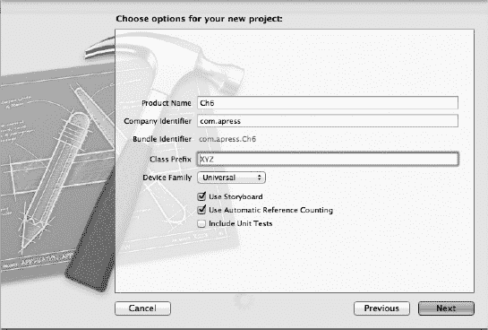

**图 6-1.** *为本章创建 Xcode 项目设置。*

#### 使用故事板

在此之前，我们还没有讨论过故事板。现在花点时间快速概述一下。故事板为你的所有应用程序视图提供了一个统一的 XIB 文件。你仍然可以从独立的界面构建器类中以编程方式加载 XIB 文件，但使用故事板界面可以带来更多的灵活性和节省时间的机会。例如，图 6-2 展示了默认的基于标签栏界面的故事板。

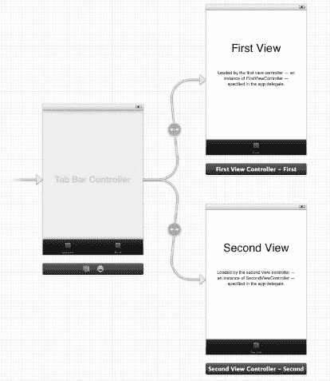

**图 6-2.** *为标签栏界面模板使用故事板。*

如果没有故事板，将会有三个独立的界面文件，它们需要集成不同类型的链接。而使用故事板，我们可以清晰地看到应用程序流程将如何呈现，无需切换上下文。

我们可以直接复用默认提供的布局。但为了更好地理解故事板，让我们删除它们，从头开始。从 Xcode 项目中删除 `FirstViewController.h`、`FirstViewController.m`、`SecondViewController.h` 和 `SecondViewController.m`。同时删除每个视图关联的 `.png` 文件。

打开两个故事板文件。在设计窗口中点击 `FirstViewController` 和 `SecondViewController` 界面。按两次 Delete 键。第一次按 Delete 键时，你将从视图中移除该类，留下一个带有蓝色轮廓的高亮空视图。第二次 Delete 则完全移除该视图。对两个视图控制器重复此操作。

你应该会在界面构建器视图中留下一个空的标签栏控制器。你的项目中应该只剩下 `AppDelegate`、两个故事板文件和 `Supporting Files` 目录。现在我们已经有了一个干净的项目，让我们手动将其重新构建起来。

我们将从拍摄照片并将其保存到相册开始。因此，让我们为此示例添加一个视图控制器，并将其加载到标签栏控制器的某个标签中。右键点击项目文件夹，从上下文菜单中选择 **New File**。选择 `UIViewController` 子类作为该文件的模板。点击 `Next`。在选项界面上，确保没有选择任何选项，并将类命名为 `PhotoViewController`。在点击 `Next` 之前，确保你的选项界面看起来像图 6-3。

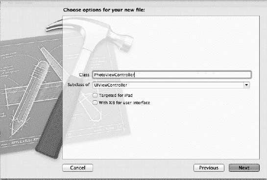

**图 6-3.** *创建 PhotoViewController 类。*

从 `Objects` 库中，将一个 `View Controller` 拖拽到界面中。点击新的 `View Controller`，切换到标识检查器，并将 `Custom Class` 修改为 `PhotoViewController`。这三步操作的结果如图 6-4 所示。

在进行下一步之前，请确保将 `PhotoViewController` 设置为遵循 `UINavigationControllerDelegate` 和 `UIImagePickerControllerDelegate` 协议。

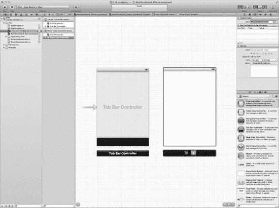

**图 6-4.** *添加 PhotoViewController。*

在界面构建器中右键点击 `Tab Bar Controller` 视图。在 `StoryboardSeques` 类别下，有一个名为 `Relationship – viewControllers` 的项。按住 Ctrl 键并点击+拖拽该项右侧的加号图标，连接到界面中的 `PhotoViewController` 视图。你将看到类似于图 6-5 的画面。

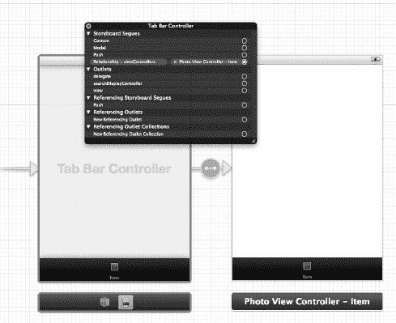

**图 6-5.** *将 Relationship Storyboard Seque 链接到 PhotoViewController。*

如果你使用 iPad 进行测试，或者希望应用程序能在两种设备上运行，请为 iPad 的故事板重复此过程。

要更改我们刚才启用的标签栏项的图标、名称或徽章，你需要在关联的视图中进行操作。你不能再从父级标签栏控制器中编辑这些项目。

接下来，在界面构建器中，将一个 `UIButton` 拖拽到 `PhotoViewController` 的中间位置。确保辅助编辑器已启用且 `PhotoViewController.h` 已打开，按住 Ctrl 键并拖拽 `UIButton` 到头文件中，为此插座创建一个动作。请参考图 6-6。

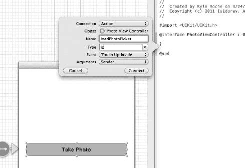

**图 6-6.** *为 UIButton 创建一个动作。*

将动作命名为 `loadPhotoPicker`，然后点击 `Connect`。如果你使用的是 iPad，或者希望实现通用性，你需要（再次）在 iPad 的故事板中重复此步骤。不过，将动作连接到已创建的事件略有不同。打开 iPad 的故事板，在界面中添加一个类似的 `UIButton`。我将两个 `UIButton` 的标题都设置为 `Take Photo`。要将 `UIButton` 连接到现有动作，你必须按住 Ctrl 键并点击+拖拽 `UIButton` 到故事板中视图下方的视图控制器图标上。如果读到这里你感觉不太明白，可以参考图 6-7 获得一些指导。

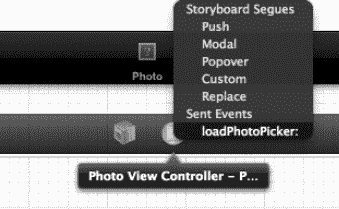

**图 6-7.** *将插座连接到现有动作时使用此菜单。*

仅仅为了连接一个按钮，这指令确实不少，不是吗？我想详细地讲解一次这个过程，以便你在后续章节构建更复杂的示例时，有份参考资料。让我们继续。


#### 使用相机

在 Xcode 中切换到 `PhotoViewController.m`。在文件底部，我们在前面步骤中添加的操作方法目前为空。按照代码清单 6-2 所示展开该方法。

**代码清单 6-2.** *loadPhotoPicker 方法*

```
- (IBAction)loadPhotoPicker:(id)sender {
    UIImagePickerController *imagePicker = [[UIImagePickerController alloc] init];
    imagePicker.sourceType =  UIImagePickerControllerSourceTypeCamera;
    // uncomment for front camera
    // imagePicker.cameraDevice = UIImagePickerControllerCameraDeviceFront;
    imagePicker.delegate = self;
    imagePicker.allowsEditing = NO;
    [self presentModalViewController:imagePicker animated:YES];
}
```

该方法首先创建 `UIImagePickerController` 类的实例。该类实质上会打开我们在 iOS 系统中熟悉的相机界面。我们将 `sourceType` 属性设置为后置摄像头。如果你希望将其设置为前置摄像头（再次提醒，首先应确认设备支持前置摄像头），可以取消注释该行下方的代码。

接下来，我们将 `delegate` 设置为 `self`，并禁止对图片选择器进行编辑。然后，我们以模态对话框的形式将 `UIImagePickerController` 呈现给 `PhotoViewController`。

如果现在运行此代码，图片选择器（相机）会显示出来，但不会保存任何内容。将代码清单 6-3 中的方法添加到实现文件中。

**代码清单 6-3.** *保存照片图像的方法*

```
- (void) imagePickerController:(UIImagePickerController *)picker didFinishPickingMediaWithInfo:(NSDictionary *)info
{
    UIImage *image = [info objectForKey:@"UIImagePickerControllerOriginalImage"];
    UIImageWriteToSavedPhotosAlbum(image, self,
                                   @selector(image:didFinishSavingWithError:contextInfo:), nil);
}

- (void)image:(UIImage *)image didFinishSavingWithError:(NSError *)error contextInfo:(void *)contextInfo
{
    UIAlertView *alert;
    if (error) {
        alert = [[UIAlertView alloc] initWithTitle:@"错误"
                                           message:@"无法将图像保存到相册。"
                                          delegate:self cancelButtonTitle:@"确定"
                                 otherButtonTitles:nil];
    } else {
        alert = [[UIAlertView alloc] initWithTitle:@"成功"
                                           message:@"图像已保存到相册。"
                                          delegate:self cancelButtonTitle:@"确定"
                                 otherButtonTitles:nil];
    }
    [alert show];
    [self dismissModalViewControllerAnimated:YES];
}
```

第一个方法是 `UIImagePickerController` 类的委托方法。当从控制器中选择图像时，该方法会被触发。我们为此图像分配一个对象，并将其传递给代码清单 6-3 中所示的第二个方法。

第二个方法，即文件保存后设置的 selector 方法，会检查是否存在错误，并通过 `UIAlertView` 控件显示成功或失败消息。你可能会注意到我没有释放 `UIAlertView` 实例。当我们在本章前面创建项目时，启用了自动引用计数（Automatic Reference Counting）。自动引用计数（iOS5 新增特性）禁止显式调用 `release` 方法。

现在可以测试项目了。在 iPhone 或 iPad 设备上启动它。由于我们使用的是相机，该项目无法在模拟器上运行。

点击界面中间的按钮，拍摄一张照片，然后点击“使用”按钮来选择该照片。你将看到一个 `UIAlertView` 对话框，确认文件已正确保存。打开用于测试的 iPad 或 iPhone 上的“照片”应用，你会发现照片已保存在其中。

#### 以不同格式保存图像

到目前为止，我们已经将图像保存到了照片库中。那么，如何将图像用于其他用途，比如物体识别或人脸识别呢？在本书后面的人脸识别章节中，我们将使用来自视频缓冲区的图像。UIKit 包含几个 C 函数，可帮助将图像导出到 iOS 设备上的文件中。用于导出的两种最常用格式是 JPEG 和 PNG，因此我们先重点介绍这两种格式。

在 Xcode 中打开 `PhotoViewController.m`。找到 `didFinishPickingMediaWithInfo` 方法，并在方法末尾添加代码清单 6-4 中的代码。

**代码清单 6-4.** *转换并保存 UIImage 对象*

```
// start saving files
    NSString  *pngPath = [NSHomeDirectory() stringByAppendingPathComponent:@"Documents/ConvertedPNG.png"];
    NSString  *jpgPath = [NSHomeDirectory() stringByAppendingPathComponent:@"Documents/ConvertedJPEG.jpg"];
    [UIImageJPEGRepresentation(image, 1.0) writeToFile:jpgPath atomically:YES];
    [UIImagePNGRepresentation(image) writeToFile:pngPath atomically:YES];
    // optional (check for files)
    NSError *error;
    NSFileManager *fileMgr = [NSFileManager defaultManager];
    NSString *documentsDirectory = [NSHomeDirectory() stringByAppendingPathComponent:@"Documents"];
    NSLog(@"Documents: %@", [fileMgr contentsOfDirectoryAtPath:documentsDirectory error:&error]);
```

首先，我们设置两个字符串，分别指向文件最终全路径的值。接着，我们使用 C 函数（`UIImageJPEGRepresentation` 和 `UIImagePNGRepresentation`）将文件写入相应路径。我们将图像压缩质量作为参数集的一部分传入。图像压缩质量按 0.0 到 1.0 的等级衡量。因此，我们正在以最高质量和最低压缩比保存图像。

使用实体设备运行该项目。确保控制台已打开，以便查看输出结果。图像保存后，你会看到类似图 6-8 的内容。

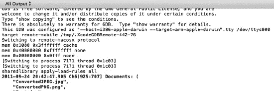

**图 6-8.** *图像已保存、转换并存储。*


### 通过电子邮件发送图片

仅存储文件可能还不够，你可能希望将其作为附件添加到电子邮件中。如果你想以编程方式发送邮件，首先需要导入 `MessageUI` 框架。

在 Xcode 导航器中单击你的项目名称。切换到 `Build Phases` 选项卡并导入 `MessageUI` 框架。接着，在 Xcode 中打开 `PhotoViewController.h`，并按照代码清单 6–5 所示更新接口。

**代码清单 6–5.** *PhotoViewController 的更新接口*

```
#import <UIKit/UIKit.h>
#import <MessageUI/MessageUI.h>
#import <MessageUI/MFMailComposeViewController.h>

@interface PhotoViewController : UIViewController <UINavigationControllerDelegate, UIImagePickerControllerDelegate, MFMailComposeViewControllerDelegate> {
}
- (IBAction)loadPhotoPicker:(id)sender;

@end
```

我们导入了一些头文件，并将该类指定为 `MFMailComposeViewControllerDelegate`，以便处理用户发送消息时的事件回调。将代码清单 6–6 中的方法添加到实现文件中。

**代码清单 6–6.** *PhotoViewController 的更新接口*

```
- (void)sendEmailMessage:(UIImage *)image
{
    NSLog(@"Sending Email");

    MFMailComposeViewController *picker = [[MFMailComposeViewController alloc] init];
    picker.mailComposeDelegate = self;

    [picker setSubject:@"iOS Augmented Reality - Chapter 6"];

    [picker setToRecipients:[NSArray arrayWithObjects:@"kyle.m.roche@gmail.com", nil]];

    NSString *emailBody = @"Hi Kyle, this stuff actually works.";

    [picker setMessageBody:emailBody isHTML:NO];

    NSData *data = UIImagePNGRepresentation(image);

    [picker addAttachmentData:data mimeType:@"image/png" fileName:@"Ch6ScreenShot"];

    [self presentModalViewController:picker animated:YES];
}

- (void)mailComposeController:(MFMailComposeViewController*)controller didFinishWithResult:(MFMailComposeResult)result error:(NSError*)error
{
    [self dismissModalViewControllerAnimated:YES];
}
```

让我们逐行分析每个方法。先从 `sendEmailMessage` 方法开始。首先，我们分配一个 `MFMailComposeViewController` 对象，并将 `delegate` 设置为 `self`，以便处理回调事件。接下来，设置邮件的 `Subject`（主题）、`ToRecipients`（收件人）地址和 `MessageBody`（邮件正文）。最后，将照片附加到邮件中，并以模态对话框的形式向用户展示草稿邮件。

接着，我们定义另一个名为 `didFinishWithResult` 的方法。该方法是 `MFMailComposeViewControllerDelegate` 协议的委托方法，在用户实际发送邮件后被调用。当此事件触发时，我们将移除模态对话框，因为它不再需要了。

现在，我们基本可以测试这段代码了。首先，需要声明 `sendEmailMessage` 方法，以便在实现文件中调用它。在 `PhotoViewController.m` 的 `import` 语句之后，添加代码清单 6–7 中的代码。

**代码清单 6–7.** *将 sendEmailMessage 声明为私有方法*

```
@interface PhotoViewController (Private)
- (void)sendEmailMessage:(UIImage *)image;
@end
```

在 `didFinishSavingWithError` 方法的末尾添加对 `sendEmailMessage` 方法的调用。如果现在尝试运行代码，你会得到一个有趣的结果。一切看起来都按预期工作，但当电子邮件对话框应该出现时，会收到类似代码清单 6–8 的错误。

**代码清单 6–8.** *错误消息*

```
2011-09-24 21:35:32.153 Ch6[1128:707] Sending Email
[Switching to process 9731 thread 0x2603]
wait_fences: failed to receive reply: 10004003
```

这个错误并不算最描述性的，对吧？以下是其含义。通常，`wait_fences` 消息表示正在运行的动画与一个新请求的动画冲突。在我们的案例中，当我们试图创建一个 `withAnimation` 属性设置为 `YES` 的新模态对话框时，刚刚关闭了一个同样 `withAnimation` 属性设置为 `YES` 的模态对话框。无论你尝试运行该项目多少次，它都无法成功执行那一行代码。

因此，在测试之前，我们需要对之前的代码做一些调整。按照代码清单 6–9 所示更新 `didFinishSavingWithError` 消息。

**代码清单 6–9.** *更新后的 didFinishSavingWithError*

```
- (void)image:(UIImage *)image didFinishSavingWithError:(NSError *)error contextInfo:(void *)contextInfo
{
    /*UIAlertView *alert;
    if (error) {
        alert = [[UIAlertView alloc] initWithTitle:@"Error"
                                           message:@"Unable to save image to Photo Album."
                                          delegate:self cancelButtonTitle:@"Ok"
                                 otherButtonTitles:nil];
    } else {
        alert = [[UIAlertView alloc] initWithTitle:@"Success"
                                           message:@"Image saved to Photo Album."
                                          delegate:self cancelButtonTitle:@"Ok"
                                 otherButtonTitles:nil];
    }
    [alert show];*/
    [self dismissModalViewControllerAnimated:NO];

    [self sendEmailMessage:image];
}
```

你可以看到，粗体显示的代码现在位于注释块中。第二个改动（同样以粗体显示）是，我们将动画标志设置为 `NO`，这样就不会发生冲突。我需要指出的是，对于更高级的读者，有办法绕过这个问题。然而，在大量动画的情况下，它们会留下痕迹问题或像素化及其他复杂问题，而像这样的微小改动可以轻松避免这些问题。

图 6–9 展示了项目成功执行的结果，以及格式正确的电子邮件对话框。

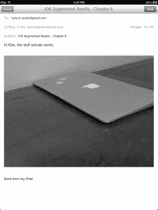

**图 6–9.** *现在我们收到了一封格式正确的电子邮件。*

### 视频捕获

在视频流之上构建应用程序主要有两种方法。第一种是不需要分析视频帧的方法。这种方法出现在一些基于位置的增强现实应用中，我们将在第 11 章中进一步了解。它们使用航向和定位类以及陀螺仪来确定 AR 目标的朝向位置。然而，视频只是一种噱头。查看视频之上基于位置的对象，会给你一种所有内容都已集成的感觉。这种方法（为了节省时间和计算资源）只是简单地在应用程序中将视频预览作为基础层打开。

第二种是需要分析视频流的方法。这种方法出现在基于标记的增强现实应用（如我们将在第 10 章中看到的）和面部识别增强现实应用（如我们将在第 13 章中看到的）中。这两种应用都要求每一帧视频都可被访问以进行分析。


#### 在视频预览上构建基础

在第 7 章中，我们将讨论如何在视频预览上叠加 cocos2D 图层，以构建增强现实游戏。因此，本节将简要介绍一些核心概念。

在 Xcode 中打开`PhotoViewController.m`，找到`loadPhotoPicker`方法。该方法会打开`UIImagePickerController`对象，允许用户拍照。请按照代码清单 6-10 所示更新该方法。

**代码清单 6-10.** *更新后的 loadPhotoPicker*

```
- (IBAction)loadPhotoPicker:(id)sender {
    UIImagePickerController *imagePicker = [[UIImagePickerController alloc] init];
    imagePicker.sourceType =  UIImagePickerControllerSourceTypeCamera;
    // 取消注释以使用前置摄像头
    // imagePicker.cameraDevice = UIImagePickerControllerCameraDeviceFront;
    imagePicker.cameraDevice = UIImagePickerControllerCameraCaptureModeVideo;
    imagePicker.showsCameraControls = NO;
    imagePicker.toolbarHidden = YES;
    imagePicker.navigationBarHidden = YES;
    imagePicker.wantsFullScreenLayout = YES;

    imagePicker.delegate = self;
    imagePicker.allowsEditing = NO;
    [self presentModalViewController:imagePicker animated:YES];
}
```

我们为`UIImagePickerController`对象设置了几个新选项。首先，将设备类型设为摄像机。然后，隐藏了摄像机的控制项、工具栏和导航栏。最后，指示视图控制器让`UIImagePickerController`以全屏模式渲染。

完成此更改后，如果运行代码，你将得到类似于图 6-10 的效果。

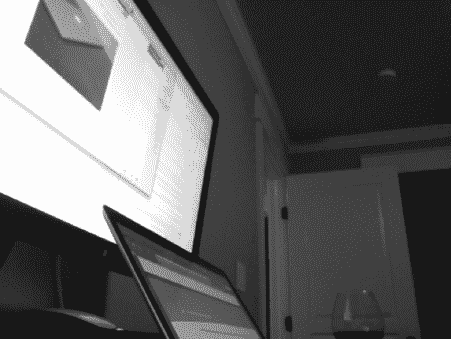

**图 6-10.** *我们获得了全屏视频。没有任何控制项！*

这个简洁的视频界面为构建增强现实应用提供了完美的背景。

如果我们想要分析这些视频帧，就必须设置一个`NSTimer`，并定时捕获和保存预览屏幕。或者，我们也可以设置某种用户操作来触发图像保存，或者使用某种程序化循环。这些方案都不理想，正如你可能已从本章前面的示例中注意到的，手动保存图像会占用处理器一两秒的时间。让我们探索一种更好的方式来捕获视频帧以供分析。

#### 构建帧捕获的基础

帧捕获会话的工作方式略有不同。为了演示这一点，我们将使用一个名为`AVCaptureSession`的新类。让我们在示例应用中将其放入一个单独的标签页中，以便日后参考对比。

首先，添加使用 AV Foundation 库所需的框架。请将以下框架添加到你的项目中。

*   `CoreVideo`
*   `CoreMedia`
*   `AVFoundation`
*   `ImageIO`

接下来，向项目中添加一个新的 Cocoa Touch 文件，使用`UIViewController`子类。请确保不要将此类设置为 iPad 专用，并且不要为界面使用 XIB 文件。将此类命名为`VideoViewController`。

我们将像之前示例中那样，创建另一个标签栏项，并将其链接到 iPad 和 iPhone 故事板。打开两个故事板文件，按照之前相同的步骤将它们链接到标签栏。完成后，你应该会在 iPhone 故事板中看到类似于图 6-11 的内容。

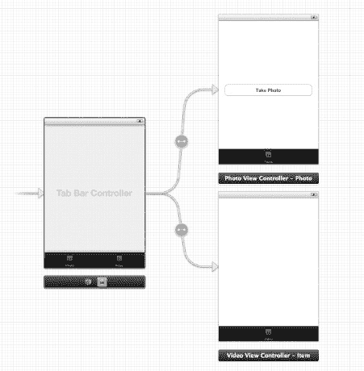

**图 6-11.** *你已在 iPhone 故事板中添加了新的标签栏项。*

对 iPad 故事板重复这些步骤。在这两个界面中，我们将添加几个输出口（outlet）。首先，向`VideoViewController`的 NIB 中添加一个`UIView`。将其命名为`videoPreview`。确保将该输出口连接到`VideoViewController`的头文件。在助理编辑器中打开`VideoViewController.h`时，导入`AVFoundation.h`和`ImageIO/CGImageProperties.h`头文件。你的新接口文件应如代码清单 6-11 所示。

**代码清单 6-11.** *更新后的 VideoViewController.h*

```
#import <UIKit/UIKit.h>
#import <AVFoundation/AVFoundation.h>
#import <ImageIO/CGImageProperties.h>

@interface VideoViewController : UIViewController {

}
@property (strong, nonatomic) IBOutlet UIView *videoPreview;
@end
```

接下来，我们将向`VideoViewController`布局中添加一个`UIImageView`输出口和一个`UIButton`。将`UIImageView`命名为`videoImage`，并将一个名为`captureScreen`的操作连接到该`UIButton`。

为了从视频预览中保存静态图像，我们将使用`AVCaptureStillImageOutput`对象。为此对象创建一个名为`stillImageOutput`的属性。

现在，`VideoViewController.h`应如代码清单 6-12 所示。

**代码清单 6-12.** *更新后的 VideoViewController.h*

```
#import <UIKit/UIKit.h>
#import <AVFoundation/AVFoundation.h>
#import <ImageIO/CGImageProperties.h>

@interface VideoViewController : UIViewController {

}
@property(nonatomic, retain) AVCaptureStillImageOutput *stillImageOutput;

@property (strong, nonatomic) IBOutlet UIView *videoPreview;
@property (strong, nonatomic) IBOutlet UIImageView *videoImage;
- (IBAction)captureScreen:(id)sender;
@end
```

在 Xcode 中切换到`VideoViewController.m`。我们需要创建一个`viewDidAppear`方法来启动相机预览会话。使用代码清单 6-13 所示的代码创建该方法。

**代码清单 6-13.** *viewDidAppear 方法*

```
- (void)viewDidAppear:(BOOL)animated {
    AVCaptureSession *session = [[AVCaptureSession alloc] init];
    session.sessionPreset = AVCaptureSessionPresetMedium;

    AVCaptureVideoPreviewLayer *captureVideoPreviewLayer = [[AVCaptureVideoPreviewLayer alloc] initWithSession:session];
    captureVideoPreviewLayer.frame = self.videoPreview.bounds;
        [self.videoPreview.layer addSublayer:captureVideoPreviewLayer];

        AVCaptureDevice *device = [AVCaptureDevice defaultDeviceWithMediaType:AVMediaTypeVideo];

        NSError *error = nil;
        AVCaptureDeviceInput *input = [AVCaptureDeviceInput deviceInputWithDevice:device error:&error];
        if (!input) {
                NSLog(@"ERROR: trying to open camera: %@", error);
        }
        [session addInput:input];
        // 占位符
        [session startRunning];
}
```


好的，作为一名高级文档工程师和翻译员，我将遵循您提供的注意事项和示例，将以下英文文本翻译成中文。


在继续测试应用程序之前，我们先来梳理一下。首先，我们创建了一个`AVCaptureSession`的实例。在本应用中，我们将视频质量设置为中等。接着，我们创建了一个`AVCaptureVideoPreviewLayer`的实例，它将用于存储视频缓冲区的实时预览。

然后，我们将该图层的框架设置为填充`videoPreviewUIView`的大小。接下来，我们初始化`AVCaptureDevice`（之前的示例中已经介绍过），并检查其是否可用。

最后几行代码非常重要。如果你没有使用`startRunning`方法来启动你的`AVCaptureSession`，你的视图中将不会显示任何内容。

你可以将应用程序运行到这一步。你应该会看到你的`UIView`已被摄像头的预览画面填满。这没什么好激动的，对吧？我们在照片示例中已经实现过这个功能了。现在，让我们扩展这个示例，让我们的`UIButton`能够调用一个例程，在不影响实时预览的情况下，从视频缓冲区中捕捉静态图像。

回到 Xcode 中的 `VideoViewController.m` 文件。在 `viewDidAppear` 方法的末尾，我们留下了一条标记为 `// Placeholder` 的注释。找到该部分，并用代码清单 6–14 中的代码替换它。

**代码清单 6–14.** *替换占位注释*

```
stillImageOutput = [[AVCaptureStillImageOutput alloc] init];
    NSDictionary *outputSettings = [[NSDictionary alloc] initWithObjectsAndKeys: AVVideoCodecJPEG, AVVideoCodecKey, nil];
    [stillImageOutput setOutputSettings:outputSettings];

    [session addOutput:stillImageOutput];
```

这段代码有特定的用途。它从摄像头捕捉静态图像，并将其保存到我们之前创建的 `AVCaptureStillImageOutput` 对象中。

找到 `captureScreenIBAction` 方法。使用代码清单 6–15 中的代码更新此方法。

**代码清单 6–15.** *`captureScreen` 方法*

```
- (IBAction)captureScreen:(id)sender {
    AVCaptureConnection *videoConnection = nil;
        for (AVCaptureConnection *connection in stillImageOutput.connections)
        {
                for (AVCaptureInputPort *port in [connection inputPorts])
                {
                        if ([[port mediaType] isEqual:AVMediaTypeVideo] )
                        {
                                videoConnection = connection;
                                break;
                        }
                }
                if (videoConnection) { break; }
        }

        NSLog(@"about to request a capture from: %@", stillImageOutput);
        [stillImageOutput captureStillImageAsynchronouslyFromConnection:videoConnection completionHandler: ^(CMSampleBufferRef imageSampleBuffer, NSError *error)
     {
                CFDictionaryRef exifAttachments = CMGetAttachment( imageSampleBuffer,
kCGImagePropertyExifDictionary, NULL);
                if (exifAttachments)
                {
             // Do something with the attachments.
             NSLog(@"attachements: %@", exifAttachments);
                 }
         else
             NSLog(@"no attachments");

        NSData *imageData = [AVCaptureStillImageOutput jpegStillImageNSDataRepresentation:imageSampleBuffer];
        UIImage *image = [[UIImage alloc] initWithData:imageData];

        self.videoImage.image = image;
        }];
}
```

该方法包含两个主要的代码块。第一个代码块检查`AVCaptureStillImageOutput`对象中的`AVCaptureConnection`。我们验证这是一个视频输出，并设置一个指向`AVCaptureConnection`实例的本地引用。

接下来，我们（异步地）从摄像头捕捉图像。我们设置一个图像缓冲区来存储图像。之后，我们使用 ImageIO 框架来捕获图像的 EXIF 附件。这对于设置滤镜或存储用于其他目的的图像质量值可能很有用。

最后，我们设置`UIImageView`的出口（outlet）来显示捕捉到的视频帧。如果你运行项目，你将看到类似于图 6–12 的效果。

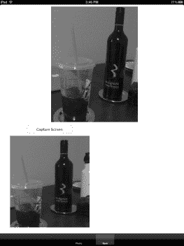

**图 6–12.** *我们轻松地捕捉到了红酒和冰咖啡的视频证据。*

我们的示例完美运行。你会注意到，当捕捉屏幕时，扬声器会发出快门声。这是因为我们抓取静态图像的方式所致。在第 13 章的应用程序示例中，我们将略微调整这种方法以消除该影响。

最后，让我们快速浏览一下我们的静态图像附带的 EXIF 附件。代码清单 6–16 显示了控制台的输出。

**代码清单 6–16.** *EXIF 附件*

```
2011-09-25 15:46:40.751 Ch6[183:707] attachments: {
    ApertureValue = "2.526068811667588";
    BrightnessValue = "-1.04630972052318";
    ExposureMode = 0;
    ExposureProgram = 2;
    ExposureTime = "0.04166666666666666";
    FNumber = "2.4";
    Flash = 32;
    FocalLenIn35mmFilm = 32;
    FocalLength = "2.03";
    ISOSpeedRatings =     (
        800
    );
    MeteringMode = 5;
    PixelXDimension = 640;
    PixelYDimension = 480;
    SceneType = 1;
    SensingMethod = 2;
    Sharpness = 0;
    ShutterSpeedValue = "4.584985584026477";
    WhiteBalance = 0;
}
```

### 总结

在本章中，我们学习了 iOS 设备上视频摄像头的核心概念及其特性。我们从基础的照片功能开始。我们设置了一个`UIImageViewController`对象来捕捉用户选择的图片。接下来，我们学习了如何将这些图片保存并转换到本地文件系统。最后，我们以附件形式通过电子邮件发送了文件。在此过程中，我们介绍了 iOS 5 中新增的 Storyboarding 功能。

接着，我们介绍了视频捕捉功能。这将是本书剩余大部分章节的主要内容。我们学习了如何移除摄像头控件，并使用一个占据全屏布局的视频预览。此外，我们设置了一个视频捕捉会话，以便为标记识别或面部识别等应用分析帧图像。

在下一章中，我们将介绍 cocos2D，这是一个用于构建游戏的优秀框架。我将向您展示如何使用 cocos2D 以及本章的概念，来为您的第一款增强现实游戏打下基础。

## 第 7 章

## 使用 cocos2D 实现增强现实

我们已经讨论了增强现实应用程序的不同用例。除了呈现基于位置的信息之外，游戏应用程序占据了增强现实市场空间的很大一部分。

在本章中，我将介绍用于 iPhone 的 cocos2D。用于 iPhone 的 cocos2D 是一个用于构建 2D 游戏和图形交互应用程序的框架。它基于 cocos2D 框架，您可以在 [`www.cocos2d.org`](http://www.cocos2d.org) 了解更多信息。

### 概述

正是开源的 cocos2D 框架为用于 iPhone 的 cocos2D 提供了基础。原始项目是用 Python 编写的。显然，这对 iOS 程序员来说并不那么有用。用于 iPhone 的 cocos2D 是该框架到 Objective-C 的一个移植版本。

cocos2D 有几个关键特性，例如易于使用、速度快、灵活性强，并且是开源的。cocos2D 恰好是拥有强大社区支持和广泛采用的开源项目之一。cocos2D 的最后一个，也是最重要的特性（如果你要发布应用的话）是它已获准在 App Store 上使用。


### 安装

首先，我们需要配置好开发环境。本章将指导您完成环境搭建、核心概念介绍，并引入一个简短的增强现实示例应用。在第 8 章中，我们将使用 cocos2D 构建一个完整的增强现实游戏。

访问[`www.cocos2d-iphone.org/download`](http://www.cocos2d-iphone.org/download)并下载适用于 iPhone 的最新稳定版 cocos2D。下载完成后，在访达中双击该文件以解压缩存档。

在新目录中，有一个名为`cocos2D-ios.xcodeproj`的文件。这是用于测试 cocos2D 下载及前置依赖项的 Xcode 项目。在 Xcode 中打开此项目，其中应包含近 70 个目标。大多数目标用于测试 cocos2D for iPhone 的特定功能。请切换您的 Scheme 指向一个测试目标，以确保您的安装已具备所有必需条件。调整 Xcode Scheme 的示例可参见图 7–1。

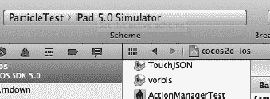

**图 7–1.** *从 Scheme 下拉菜单中选择 ParticleTest（或其他目标）。*

为稳妥起见，请逐一运行几个目标，并在模拟器上执行项目。它们大多是展示特定功能的一系列点击式示例。

#### 安装项目模板

cocos2D 附带了 Xcode 的项目模板。下载包中包含安装模板所需的所有文件。这些模板为您的项目提供了必需的组件，节省了设置时间。共有三个主要项目模板：

- cocos2D 独立模板
- cocos2D + box2D 模板
- cocos2D + chipmunk 模板

在运行这些脚本之前，请确认已将解压目录放置在您满意的位置。打开终端应用程序并导航至该目录。若要安装模板，请运行代码清单 7–1 所示的命令。

**代码清单 7–1.** *安装模板（失败）*

```
cocos2d-iphone-1.0.1$ ./install-templates.sh -u
cocos2d-iphone template installer
Installing Xcode 4 cocos2d iOS template
----------------------------------------------------

templates already installed. To force a re-install use the '-f' parameter
```

如果您已使用过 cocos2D，可能会收到与我类似的消息（如代码清单 7–1 所示）。若是如此，请按照错误提示添加`-f`选项。代码清单 7–2 显示了执行结果。如果您从未使用过 cocos2D，输出结果应与代码清单 7–2 类似，且无需使用`-f`选项。

**代码清单 7–2.** *使用-f 选项安装*

```
cocos2d-iphone-1.0.1$ ./install-templates.sh -f -u
cocos2d-iphone template installer

Installing Xcode 4 cocos2d iOS template
----------------------------------------------------

removing old libraries: /Users/kyleroche/Library/Developer/Xcode/Templates/cocos2d/
...creating destination directory: /Users/kyleroche/Library/Developer/Xcode/Templates/cocos2d/
...copying cocos2d files
...copying cocoslive files
...copying TouchJSON files
...copying CocosDenshion files
...copying CocosDenshionExtras files
...copying FontLabel files
...copying template files
[much more of this type of stuff… then…]
done!
```

为简洁起见，我缩短了代码清单 7–2 的输出。安装程序将依次处理 Xcode 4 的各种模板，最后还会处理 Xcode 3 的模板，以备您仍在使用这两个版本。

### 创建项目

打开 Xcode。如果您已正确安装模板，启动屏幕上应显示与图 7–2 类似的内容。

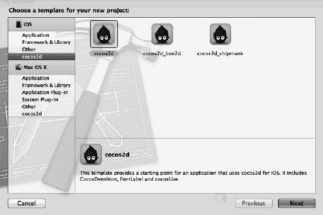

**图 7–2.** *您已成功安装新的 cocos2D 模板！*

选择 cocos2D 模板并创建一个新项目。将项目命名为`Ch7`。该项目的代码可在[`www.github.com/kyleroche`](http://www.github.com/kyleroche)以及 Apress 网站的源代码/下载区（[`www.apress.com`](http://www.apress.com)）获取。

以默认形式运行项目。您可以使用 iPad 或 iPhone 模拟器。您将获得与图 7–3 类似的结果。这是所有 cocos2D 模板的默认项目。

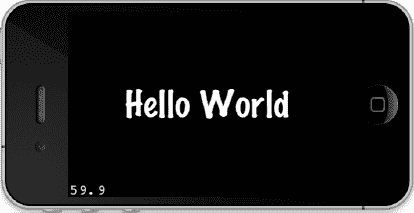

**图 7–3.** *运行 cocos2D 的默认项目 Hello World。*

接下来，让我们将这个 Hello World 程序改造成增强现实版 Hello World 应用，然后讨论 cocos2D 中可用的一些特性。

### 增强现实版 Hello World

如您所知，增强现实应用建立在实时摄像头视图的背景之上。在我们的示例项目中，背景是黑色屏幕。这是我们需要替换的第一个元素。

我在引言中曾简要提到，cocos2D for iPhone 基于 cocos2D，后者为 2D 世界提供 OpenGL 渲染。OpenGL 是这两个源代码库的基础。因此，我们需要修改所谓的可绘制层，将其替换为摄像头视图。OpenGL 的可绘制层实现了`EAGLDrawable`协议，该协议用作渲染表面，并将`EAGLContext`对象显示到屏幕上。我们将在第 10 章构建基于标记的 AR 应用时，进一步了解`EAGLContext`。目前，我们必须意识到，无法使用 cocos2D 模板默认的 16 位缓冲区格式来显示摄像头。我们需要将其切换为使用 32 位颜色格式。


#### 调整默认视图

在 Xcode 中打开 `AppDelegate.h`。如代码清单 7-3 所示，向接口中添加一个 `UIView`。

**代码清单 7-3.** *为相机叠加视图添加一个 UIView*

```
UIView  *cameraView;
```

切换到 `AppDelegate.m`，我们开始工作。首先，必须将缓冲区切换为 32 位缓冲区。这在 cocos2D 模板中应是一个被注释掉的值，因为这是开发者常见的修改操作。找到类似代码清单 7-4 所示的那一行代码。

**代码清单 7-4.** *更改 EAGLView 的像素格式（pixelFormat）*

```
//
// 手动创建 EAGLView
//  1. 创建 RGB565 格式。备用选项：RGBA8
//  2. 深度格式为 0 位。对于 3D 效果（如 CCPageTurnTransition）请使用 16 位或 24 位
//
EAGLView *glView = [EAGLView viewWithFrame:[window bounds]
                               pixelFormat:kEAGLColorFormatRGB565        // kEAGLColorFormatRGBA8
                               depthFormat:0];
```

可以看到注释解释了部分内容。由于相机视图不能使用 RGB565 这种 16 位格式，请将 `pixelFormat` 的值替换为注释中的那个值。修改后，你的代码块现在应如代码清单 7-5 所示。我们将 `depthFormat` 保留为 0，因为我们目前还不涉及 3D 处理。

**代码清单 7-5.** *更改 pixelFormat*

```
EAGLView *glView = [EAGLView viewWithFrame:[window bounds]
                               pixelFormat:kEAGLColorFormatRGBA8 depthFormat:0];
```

接下来，我们将在屏幕中添加新声明的 `UIView`，用来取代默认的单调黑色背景。找到如代码清单 7-6 所示的代码段。

**代码清单 7-6.** *主视图接收一个子视图*

```
// 使视图控制器成为主窗口的子视图
[window addSubview: viewController.view];
```

在这行代码下方，添加代码清单 7-7 中的代码。接下来我会逐行为你解释。

**代码清单 7-7.** *为相机准备叠加视图*

```
[CCDirector sharedDirector].openGLView.backgroundColor = [UIColor clearColor];
[CCDirector sharedDirector].openGLView.opaque = NO;

glClearColor(0.0, 0.0, 0.0, 0.0);

cameraView = [[UIView alloc] initWithFrame:[[UIScreen mainScreen] bounds]];
cameraView.opaque = NO;
cameraView.backgroundColor=[UIColor clearColor];
[window addSubview:cameraView];
```

首先，我们将 OpenGL 视图的背景色设置为 `clearColor`。这可以启用透明效果，以便我们仍然可以在相机视图之上向屏幕绘制对象和文本。接着，我们确保此图层不透明（出于同样的目的）。我们使用 `glClearColor` 方法来确保我们定义的“清除”确实是透明的。你可以对此稍作调整，以形成一个朦胧的半透明图层，而不是我们本章正在构建的完全不可见图层。第二部分看起来类似。我们获取新的 `UIView`，将其拉伸至屏幕边界，并使其也变得透明。最后，我们将新的 `UIView` 添加到窗口中。

如果现在再次运行项目，你不会看到明显变化。我们尚未添加任何有影响的内容。让我们继续。

#### 添加相机视图

就在我们从代码清单 7-7 添加的代码下方，我们将添加用于创建 `UIImagePicker` 并以相机模式显示的代码。其中部分内容在第 6 章中已经熟悉。请在代码清单 7-7 的代码下方，添加代码清单 7-8 中的代码。

**代码清单 7-8.** *创建 UIImagePicker 并添加到屏幕*

```
UIImagePickerController *imagePicker;

@try {
        imagePicker = [[[UIImagePickerController alloc] init] autorelease];
        imagePicker.sourceType = UIImagePickerControllerSourceTypeCamera;
        imagePicker.showsCameraControls = NO;
        imagePicker.toolbarHidden = YES;
        imagePicker.navigationBarHidden = YES;
        imagePicker.wantsFullScreenLayout = YES;
}
@catch (NSException * e) {
        [imagePicker release];
        imagePicker = nil;
}
@finally {
        if(imagePicker) {
            [cameraView addSubview:[imagePicker view]];
            [cameraView release];
        }
}

[window bringSubviewToFront:viewController.view];
```

在运行项目之前，我们先来了解一下这段代码。首先，我们创建 `UIImagePicker`，进行设置，并确保源类型设置为相机，这样我们就能看到实时视频内容。我们隐藏了控件、工具栏和导航栏，以便获得相机的全屏视图。

还剩最后一件事。切换到 `HelloWorldLayer.m`，并按代码清单 7-9 所示更改标签的文本和字号。

**代码清单 7-9.** *更改标签文本*

```
// 创建并初始化一个标签
CCLabelTTF *label = [CCLabelTTF labelWithString:@"Hello Augmented World" fontName:@"Marker Felt" fontSize:48];
```

和第 6 章中的示例一样，我们必须在真实设备上运行，因为模拟器不支持相机类。在设备上启动项目。你会注意到有些不对劲。查看图 7-4 了解我的意思。

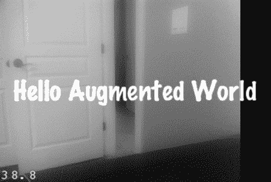

**图 7-4.** *这是相机视图，但缺少了一部分。*

相机没有覆盖整个屏幕！边缘有一条黑色条，似乎是模板应用程序遗留下来的。等等，我们已经将 `wantsFullScreenLayout` 设置为 `YES`。发生了什么？

#### 缩放相机视图

那么，为什么我们的界面中会出现这条奇怪的黑色条呢？这与屏幕和相机（横屏模式下）之间宽高比的差异有关。基本上，iPhone 屏幕的宽高比为 3:4，而 iPhone 相机的宽高比为 4:3。因此，我们需要缩放相机图像以匹配。这解释了图 7-4 中的黑色条。

要解决这个问题，我们需要缩放 `UIImagePicker` 以匹配设备的宽高比。回到 Xcode 中的 `AppDelegate.m`。找到你从代码清单 7-8 添加的代码段，并在其中添加代码清单 7-10 中的加粗行。

**代码清单 7-10.** *缩放 UIImagePickerController*

```
@try {
        imagePicker = [[[UIImagePickerController alloc] init] autorelease];
        imagePicker.sourceType = UIImagePickerControllerSourceTypeCamera;
        imagePicker.showsCameraControls = NO;
        imagePicker.toolbarHidden = YES;
        imagePicker.navigationBarHidden = YES;
        imagePicker.wantsFullScreenLayout = YES;
        imagePicker.cameraViewTransform = CGAffineTransformScale(imagePicker.cameraViewTransform, 1.0, 1.3);
}
```

再次运行项目。你应该会看到我们已经成功移除了黑色条，且相机现在已占据全屏，如图 7-5 所示。

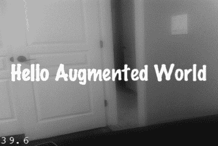

**图 7-5.** *黑色条消失了！*

### cocos2D 概念

让我们为应用程序增添一点活力。目前，它无法响应触摸或执行任何有趣的操作。首先，让我们了解 cocos2D 应用程序是如何设置的。


#### 场景

场景是 cocos2D 视图的基础。你的应用可以包含多个场景，但在任何给定时刻，只有一个场景处于活跃状态。在我们的示例应用中，我们将摄像头视图添加到了 `HelloWorldLayer` 场景的下方。

场景是 cocos2D 中 `CCScene` 对象的实现。它们是应用整体工作流程中相互独立的组成部分。在典型的游戏中，场景用于菜单、不同关卡，以及关卡之间或玩家通关/失败后播放的视频过场动画。每个 `CCScene` 对象都包含一个或多个图层。在我们的示例应用中，有一个带标签的透明图层，以及一个包含 `UIImagePickerController` 的透明图层。

你也可以使用场景进行场景之间的过渡。这类场景是 `CCTransitionScene` 对象的实现。

#### 导演

不出所料，导演负责处理当前哪个场景处于活跃状态的选择。导演是 `CCDirector` 单例对象的一个实例。它在内存中维护着当前活跃场景的详细信息，并处理一个场景栈，以便推入新场景、暂停当前场景以及返回原始场景。`CCDirector` 单例会实际切换 `CCScene`。该单例还会初始化 OpenGL ES 环境。来自 `AppDelegate.m` 的代码清单 7–11 中的代码，会从单例（即共享）类中初始化导演。

**代码清单 7–11.** *创建导演单例实例*

`CCDirector *director = [CCDirector sharedDirector];`

#### 图层

`CCLayer` 的大小与整个可绘制区域相同。它可以是半透明的（为下方的图层提供空洞），也可以是完全透明的（正如我们在应用中已经做的那样）。图层定义了场景的外观和行为。

`CCLayer` 还定义了事件处理程序。当事件被传播时，它会从前端的图层开始向上传递，直到某个图层捕获并接受该事件。因此，图层在栈中的位置越靠后，就会有越多的图层有机会拦截并处理该事件。

cocos2D 定义了一系列预置的图层，我们可以在游戏中使用。通常很少需要自己创建自定义的 `CCLayer` 扩展或类。

### 添加特效

cocos2D 拥有大量内建的特效和过渡效果，我们可以在游戏中加以利用。对于我们的增强现实示例，在展示任何视觉效果之前，我们将使用触摸事件来处理用户的交互。因此，我们首先需要学习如何处理触摸事件。

#### 处理触摸事件

还有另一个单例对象 `CCTouchDispatcher`，它会发送屏幕上触摸事件的通知。为了在应用中处理触摸事件，我们必须启用触摸、注册 `CCTouchDispatcher`，然后处理触摸事件本身。

在之前的概述中，我简要提到事件在每个单独的图层上处理。它们从前端的图层开始，向后端的图层逐级传递，直到某个图层接受并处理该事件。

到目前为止，我们的示例构建方式与普通 2D 游戏略有不同。我们有一个底层图层（摄像头视图），它始终位于栈的底部。我们使用了一个简单图层（标签视图的图层）来驱动屏幕上的内容。在典型的 2D 游戏中，你会在静态图形图层或基于瓦片的地图上构建。而将实时摄像头视图作为基础，正是使这款游戏成为增强现实游戏的原因。我们将在第 8 章构建的示例应用中添加更高级的增强现实概念。话虽如此，理解了触摸事件是如何逐级传递的，那么在 `HelloWorldLayer` 图层处处理事件就显得最为合理。

在 Xcode 中打开 `HelloWorldLayer.m`，找到 `init` 方法。在 `if` 循环的底部，添加来自代码清单 7–12 的语句。

**代码清单 7–12.** *启用触摸*

`self.isTouchEnabled = YES;`

接下来，我们必须向 `CCTouchDispatcher` 注册为一个接受此类事件的图层。在 `init` 方法结束之后，添加来自代码清单 7–13 的代码。

**代码清单 7–13.** *注册 CCTouchDispatcher*

```
- (void)registerWithTouchDispatcher {
    [[CCTouchDispatcher sharedDispatcher] addTargetedDelegate:self priority:0 swallowsTouches:YES];
}
```

我们将代理设置为 self，并启用了“吞并触摸”，这样在我们决定该图层能否处理并接受事件之前，其他图层不会做出响应。要接受事件，请使用 `ccTouchBegan` 方法。在 `registerWithTouchDispatcher` 方法之后，添加来自代码清单 7–14 的代码。

**代码清单 7–14.** *接受并处理事件*

```
- (BOOL)ccTouchBegan:(UITouch *)touch withEvent:(UIEvent *)event {
    return YES;
}

- (void)ccTouchEnded:(UITouch *)touch withEvent:(UIEvent *)event {
    CGPoint location = [self convertTouchToNodeSpace:touch];
    NSLog(@"触摸位置 %@: ", NSStringFromCGPoint(location));
}
```

第一个方法向分发器返回 `YES`，告知它自己将接受该事件，并且分发器无需再继续查找响应。第二个方法通过记录触摸点在屏幕上的位置来响应触摸事件。我们使用 `NSStringFromCGPoint` 方法将 C 结构体正确转换为字符串。

在设备上再次运行应用程序。在屏幕上随机触摸几个位置。在你的调试器窗口中，应该会看到类似于图 7–6 所示的输出。

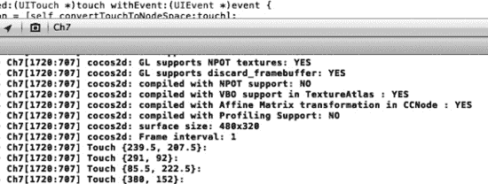

**图 7–6.** *我们现在能够记录触摸事件了。*

稍后，我们可以利用这个 `CGPoint` 来做一些更令人兴奋的事情。让我们简要讨论一下特效，然后为我们的场景添加一个特效。


#### 视觉效果

cocos2D 提供了各种开箱即用的图形效果，可供我们在应用程序中使用。例如，以下列表包含了 cocos2D 发行版中可用的粒子发射器类型：

*   `CCParticleFire`
*   `CCParticleFireworks`
*   `CCParticleSun`
*   `CCParticleGalaxy`
*   `CCParticleFlower`
*   `CCParticleMeteor`
*   `CCParticleSpiral`
*   `CCParticleSmoke`
*   `CCParticleExplosion`
*   `CCParticleSnow`
*   `CCParticleRain`

还有设计自己粒子系统的方法。有一个名为 Particle Designer 的工具（可在 [`http://particledesigner.71squared.com/`](http://particledesigner.71squared.com/) 获取），它允许你创建自己的视觉效果，并能访问一个由社区创建的效果组成的共享库。在撰写本书时，该工具的价格不到 10 美元。

图形效果并非本书的重点，因此如果你需要更多信息，请参考 Apress 出版的任何 cocos2D 相关书籍（[`www.apress.com`](http://www.apress.com)）。

回到我们的项目。在 Xcode 中打开 `HelloWorldLayer.m`。由于我们已经处理了触摸事件（通过在控制台中记录它们），因此扩展此功能并添加一些粒子效果是合理的。这里的目标是让用户的触摸在屏幕上引发一次爆炸或类似效果。

找到 `ccTouchEnded` 方法。在设置了 `location` 变量之后，添加来自 代码清单 7-15 的代码。

**代码清单 7-15.** *添加一个 CCParticleSystem*

```
CCParticleSystem* emitter = [CCParticleExplosion node];
emitter.position = ccp(location.x, location.y);
emitter.life = 3.0f;
emitter.duration = 2.7f;
emitter.lifeVar = 0.1f;
emitter.totalParticles = 200;
[self addChild:emitter z:20];
```

快速回顾一下本节开头我列出的 cocos2D 中提供的粒子系统。在这段代码的第一行，你会注意到我们使用了 `CCParticleExplosion` 类。当你尝试本节的示例时，可以随意将其更改为我在本节中列出的任何其他类型。

在声明了我们的 `CCParticleSystem` 之后，我们将其位置设置为触摸事件的 x、y 坐标，定义粒子系统的生命期和持续时间，并设置其粒子总数。同样，这些都非常值得尝试和学习。

最后，我们将 `CCParticleSystem` 添加到我们的层中。如果你运行项目并点击屏幕，你会看到类似 图 7-7 所示的效果。

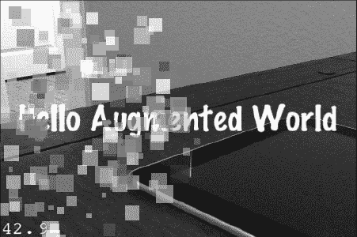

**图 7-7.** *点击即可创建触摸爆炸效果！*

#### 添加音效

没有声音的爆炸总感觉少了点什么。你同意吗？让我们制造点噪音吧。在第 5 章中，我们讨论了如何为 iOS 应用程序添加声音。我介绍了一些可以下载免费音效的网站。我下载了一个 MP3 文件，然后使用我在第 5 章中向你展示的 `afconvert` 工具将其转换为 CAF 文件。该示例文件包含在 GitHub 上的源代码中，也可以从 Apress 网站的源代码/下载区域（[`www.apress.com`](http://www.apress.com)）获取。我将文件命名为 `explosion.caf`。如果你使用自己的音效，请确保在以下代码块中名称匹配。

在 Xcode 中打开 `HelloWorldLayer.m`，并导入 `SimpleAudioEngine` 头文件，如 代码清单 7-16 所示。

**代码清单 7-16.** *导入 SimpleAudioEngine 头文件*

```
#import "SimpleAudioEngine.h"
```

接下来，找到 `init` 方法。就在我们设置 `isTouchEnabled` 为 YES 的代码之后，添加来自 代码清单 7-17 的代码。

**代码清单 7-17.** *预加载音效*

```
[[SimpleAudioEngine sharedEngine] preloadEffect:@"explosion.caf"];
```

这将预加载音效，以便在需要时更快地访问。最后，找到 `ccTouchEnded` 事件处理程序。在我们已将粒子效果添加到层之后，添加来自 代码清单 7-18 的代码。

**代码清单 7-18.** *播放音效*

```
[[SimpleAudioEngine sharedEngine] playEffect:@"explosion.caf"];
```

在你的设备上运行项目。你应该会在触摸事件时听到很棒的爆炸音效。这有助于让游戏对用户来说更有趣、更愉快。


### 添加 HUD 层

在 cocos2D 游戏中，“世界”通常比设备当前渲染的视图要大。因此，如果你只是将元素渲染到屏幕上，根据场景当前的焦点位置，它们可能会出现轻微的对齐偏差。HUD（平视显示器）层通常用于解决这个问题。HUD 层是在我们场景的动作层之上的另一个半透明层。在游戏中，我们经常看到它用于显示分数、剩余生命等。

让我们为当前示例添加一个 HUD 层，用于统计用户引发的爆炸次数。向项目中添加一个新的 Objective-C 类。该类应该是 `NSObject` 的子类。将类命名为 `HUDLayer.mm`。`.mm` 扩展名并非笔误。对于混合了 Objective-C 和 C++ 的文件，使用 `.mm` 是一种推荐的约定。这比告诉编译器单独处理某个文件要简单，并且能让将来阅读你代码的开发者知道该实现使用了 C++。

打开 `HUDLayer.h`，用 代码清单 7-19 中所示的代码替换其内容。

**代码清单 7-19.** *新的 HUDLayer.h*

```
#import "cocos2d.h"
@interface HUDLayer : CCLayer {
    CCLabelTTF *_counterLabel;
}
- (void)incrementCounter;
@end
```

我们将子类改为 `CCLayer`，并创建了一个私有的 `CCLabelTTF` 对象，用于在屏幕上保存一个标签。我们还创建了一个名为 `incrementCounter` 的实例方法。触摸事件将调用此方法，以通知 HUD 层发生了新的触摸，并递增标签显示的计数。

在 Xcode 中切换到 `HudLayer.mm`。首先，导入 `HelloWorldLayer` 头文件。接下来，我们将创建一个局部变量来保存当前计数的值，并为 `HUDLayer` 创建 `init` 方法。将代码清单 7-20 中的代码复制到 `HUDLayer.mm` 中。

**代码清单 7-20.** *HUDLayer.mm 的 Init 方法*

```
int counter = 0;
- (id)init {
    if ((self = [super init])) {
        _counterLabel = [CCLabelTTF labelWithString:[NSString stringWithFormat:@"Explosions: %d", counter] fontName:@"Marker Felt" fontSize:24];

        CGSize size = [[CCDirector sharedDirector] winSize];

        _counterLabel.position =  ccp( size.width * 0.85 , size.height * 0.9 );

        [self addChild: _counterLabel z:10];
   }
   return self;
}
```

`init` 方法使用了我们 `HelloWorldLayer` 类中的一些代码。我们只是简单地创建了一个新的标签并将其添加到屏幕上。在这里，我们将其添加到屏幕的右上角，z 轴值为 10，这样所有的爆炸效果都会渲染在标签之后。

通过在新 `init` 方法之后添加代码清单 7-21 中的代码来实现 `incrementCounter` 方法。

**代码清单 7-21.** *`incrementCounter` 方法*

```
- (void)incrementCounter {
   counter++;
    _counterLabel.string = [NSString stringWithFormat:@"Explosions: %d", counter];
}
```

这个方法应该很容易理解。我们只是递增计数器（该计数器将存储在 HUD 层中，而非游戏层），并更新我们已经添加到视图中的标签。

关于 HUD 层的内容就这些了。现在，我们必须在我们的 `HelloWorldLayer` 层中使用它。在 Xcode 中切换到 `HelloWorldLayer.h`，首先导入 `HUDLayer.h` 文件。接下来，声明一个类型为 `HUDLayer` 的私有变量 `_hud`。最后，我们将创建一个名为 `initWithHUD` 的新方法。你新的 `HelloWorldLayer.h` 文件应该如代码清单 7-22 所示。

**代码清单 7-22.** *新的 HelloWorldLayer.h*

```
#import "cocos2d.h"
#import "CCTouchDispatcher.h"
#import "HUDLayer.h"

// HelloWorldLayer
@interface HelloWorldLayer : CCLayer {
HUDLayer *_hud;
}

// 返回一个 CCScene，其唯一子节点是 HelloWorldLayer
+(CCScene *) scene;
- (id)initWithHUD:(HUDLayer *)hud;
@end
```

切换到 `HelloWorldLayer.m`，将你的静态 scene 方法修改为如代码清单 7-23 所示。

**代码清单 7-23.** *新的 Scene 方法*

```
+(CCScene *) scene
{
    CCScene *scene = [CCScene node];

    HUDLayer *hud = [HUDLayer node];
    [scene addChild:hud z:1];

    // 'layer' 是一个自动释放对象。
    //HelloWorldLayer *layer = [HelloWorldLayer node];
HelloWorldLayer *layer = [[[HelloWorldLayer alloc] initWithHUD:hud] autorelease];

    // 将 layer 添加为 scene 的子节点
    [scene addChild: layer];

    // 返回 scene
    return scene;
}
```

我们来讨论一下高亮显示的代码行。首先，我们声明了一个新的 `HUDLayer` 变量并将其添加到场景中。我们注释掉了旧的 `init` 方法，并用一个名为 `initWithHUD` 的方法代替（我们还没有实现这个方法，但别担心，接下来就做）。

找到 `HelloWorldLayer.m` 中的 `init` 方法。将其签名从 `init` 改为 `initWithHUD:(HUDLayer *)hud`。按照代码清单 7-24 所示替换该方法。

**代码清单 7-24.** *用以下代码块替换 init 方法*

```
-(id) initWithHUD:(HUDLayer *)hud
{
    // 总是先调用"super"的 init
    // Apple 建议将"self"重新赋值为"super"的返回值
    if( (self=[super init])) {
_hud = hud;
        // 创建并初始化一个标签
        CCLabelTTF *label = [CCLabelTTF labelWithString:@"Hello Augmented World" fontName:@"Marker Felt" fontSize:48];

        // 询问 director 窗口大小
        CGSize size = [[CCDirector sharedDirector] winSize];

        // 将标签放置在屏幕中央
        label.position =  ccp( size.width /2 , size.height/2 );

        // 将标签添加为此 Layer 的子节点
        [self addChild: label];

            self.isTouchEnabled = YES;
            [[SimpleAudioEngine sharedEngine] preloadEffect:@"explosion.caf"];
    }
    return self;
}
```

除了方法签名外，我们只向该方法添加了一行代码。我们将私有变量 `_hud` 设置为我们之前在静态 scene 方法中创建的新 `HUDLayer` 对象。

在测试应用程序之前，还有最后一件事要做。找到 `ccTouchEnded` 方法，并在我们的 `NSLog` 语句之前添加代码清单 7-25 中的代码。

**代码清单 7-25.** *调用 HUDLayer 的 incrementCounter 方法*

```
[_hud incrementCounter];
```

就这样。我们新的 HUD 层应该被加载到场景中，并负责递增屏幕右上角当前计数标签的值。在你的设备上运行项目。声音和粒子效果应该保持不变。但是，你应该会看到屏幕顶部显示触摸次数的标签。点击几次；你最终会看到类似图 7-8 的效果。

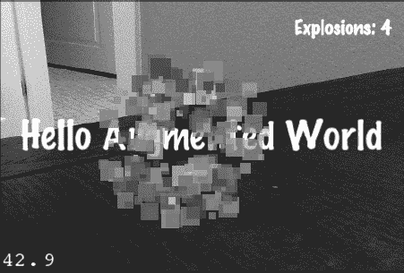

**图 7-8.** *你现在可以在屏幕的右上角看到 HUD 层。*

你可以添加更复杂的 HUD 层，它们能自行处理用户输入，例如按钮或选择选项。本书将不涉及这部分内容。有关 cocos2D 或高级游戏主题的更多信息，请参考 Apress 出版的任何一本关于 cocos2D 的书籍。

### 本章小结

在本章中，我介绍了 cocos2D。我们设置了示例模板，并将 Hello World 项目从一个简单的标签扩展为一个简单的增强现实游戏。我们将相机视图缩放以适应设备在横屏模式下的宽高比。然后，我们为用户触摸事件设置了事件处理程序。

我们这个简单的小游戏处理用户的触摸事件，创建并启动粒子系统以实现视觉效果，甚至还包含了爆炸音效。我们甚至构建了一个独立的 HUD 层，它独立于游戏层，用于统计指标并将其显示给用户。

在下一章中，我们将把增强现实游戏提升到一个新的水平，利用陀螺仪创建一个 360 度的第一人称增强现实射击游戏。

