# 构建 cocos2D AR 游戏

本章将扩展我们在第 7 章中学到的知识，构建一个功能完备的增强现实（AR）游戏。增强现实游戏可以拥有众多场景或故事线。虽然本游戏的情节略显荒诞，但它将展示 AR 游戏的一些重要能力。我们将学习如何构建一个带有菜单和启动选项的 cocos2D 游戏结构，并处理计分和游戏结束场景。整个游戏将在相机视图之上进行。

### 概述

每个游戏都始于一个故事。我们的故事是：外星南瓜占领了地球。星际警察发布了一种特殊设备，让我们能够看到这些南瓜，并通过相机点击它们将其摧毁。这个设备当然就是我们的 iPad 或 iPhone。

游戏启动时，我们将使用一个 iOS 5 新增的类——`CIDetector`。这个类将在第 12 章中详细讨论。现在你只需要知道，它能识别相机视图中的人脸，并允许我们在人的头部位置叠加南瓜图像。当相机视图中检测到人脸时，你会看到类似图 8-1 的效果。

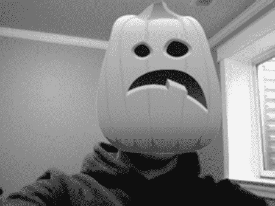

**图 8-1.** *我们的南瓜示例，叠加在人脸上。*

我们现在应该已经具备了开始编码所需的一切。在第 7 章中，我们配置了 cocos2D 并运行了一个简单示例。本章将使用我们在安装 cocos2D 时一同安装的模板。更准确地说，我们将使用包含 cocos2D 和 chipmunk 物理库的模板。我们不会在游戏中使用太多 chipmunk 功能，而是利用它让菜单屏幕对用户来说更有趣。

本游戏的计分会有一定难度。由于我们是在人脸上随机放置南瓜并炸毁它们，因此需要考虑南瓜重新出现的速度。为了避免游戏无法获胜，我们将使用一组固定的南瓜。这些南瓜很可能会多次覆盖同一个人（除非你能在人群中测试）。当用户消灭所有外星南瓜后，我们就判定玩家获胜。我们还会设置一个计时器，让外星人有公平的机会继续存在。

### 创建项目

如果你跳过了第 7 章，请返回并确保你已完成“安装”部分的步骤。本章绝对需要 cocos2D 框架。

在 Xcode 中创建一个新项目。确保选择 `cocos2d_chipmunk` 模板，如图 8-2 所示。

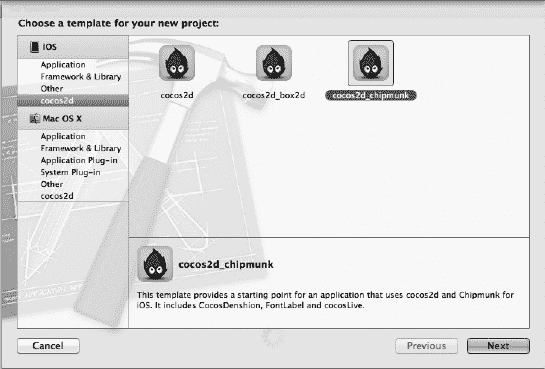

**图 8-2.** *选择 cocos2d_chipmunk 模板。*

为项目命名。我将其命名为 `Ch8`，这样你可以轻松在 GitHub 仓库或 Apress 网站（[`www.apress.com`](http://www.apress.com)）的“源代码/下载”区找到它。确保将项目设置为**通用项目**。将**支持的设备方向**仅设置为**横向右**，如图 8-3 所示。这样做是为了最小化南瓜放置的逻辑。

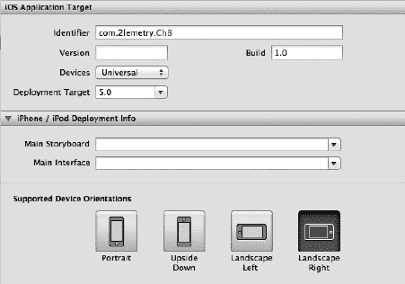

**图 8-3.** *将支持的设备方向设置为横向右。*

运行项目并确保一切正常。有时 chipmunk 会带来一些难以追踪的麻烦，尤其是在项目深入之后。Chipmunk 的 Hello World 风格与标准 cocos2D 模板不同。你会看到一个画面中的人物，他叫 Grossini，以防你好奇。

这是一个非常酷的 Hello World 项目。如果你点击屏幕，一个新的 Grossini 会出现，并将其他人物推开。应用程序也会对加速度计和方向变化做出响应。所以，如果你想快速了解 chipmunk 的能力，请在真机（而非模拟器）上运行它。

在屏幕点击几次后，我会看到类似图 8-4 的效果。

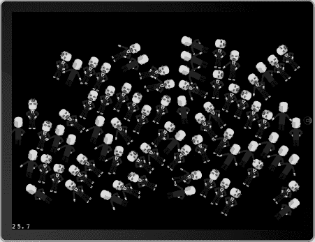

**图 8-4.** *点击屏幕几次，观察 Grossini 的增殖。*

关闭应用程序并返回 Xcode。让我们删除不会用到的文件，从头重建这个项目。从项目中删除 `HelloWorldLayer.h`、`HelloWorldLayer.m` 和 `grossini_dance_atlas.png`。

打开 `AppDelegate.m`。删除我们刚删除的类的 `import` 语句。然后注释掉代码清单 8-1 中显示的那行代码。该代码可以在 `applicationDidFinishLaunching` 方法的末尾找到。

**代码清单 8-1.** *注释掉 HelloWorld 场景*

```
//[[CCDirector sharedDirector] runWithScene: [HelloWorldLayer scene]];
```

好的，确保应用程序可以构建。现在不需要运行它，但应该能无错误地编译。


#### 相机视图

首先，像我们在第 7 章中所做的那样，将相机视图设置为基础层。在项目中添加以下框架：

- CoreImage
- CoreMedia
- CoreVideo

在 Xcode 中打开 `AppDelegate.h`。按照代码清单 8-2 所示更新头文件。

**代码清单 8-2.** *新的 AppDelegate.h*

```
#import <UIKit/UIKit.h>
#import <AVFoundation/AVFoundation.h>

@class RootViewController;

@interface AppDelegate : NSObject <UIApplicationDelegate,
AVCaptureVideoDataOutputSampleBufferDelegate> {
    UIWindow *window;
    RootViewController *viewController;

AVCaptureSession *_session;
UIView *_cameraView;
UIImageView *_imageView;
}

@property (nonatomic, retain) UIWindow *window;

@end
```

与我们在第 7 章中的做法非常相似，我们正在设置 `UIView` 和 `UIImageView` 来处理并向用户显示相机视图。切换到 `AppDelegate.m`。将代码清单 8-3 中的方法添加到实现中。

**代码清单 8-3.** *AppDelegate.m 的新方法*

```
-(AVCaptureDevice *)frontFacingCameraIfAvailable
{
    NSArray *videoDevices = [AVCaptureDevice devicesWithMediaType:AVMediaTypeVideo];
    AVCaptureDevice *captureDevice = nil;
    for (AVCaptureDevice *device in videoDevices)
    {
        if (device.position == AVCaptureDevicePositionFront)
        {
            captureDevice = device;
            break;
        }
    }

    //  如果找不到前置摄像头，就获取默认视频设备。
    if ( ! captureDevice)
    {
        captureDevice = [AVCaptureDevice defaultDeviceWithMediaType:AVMediaTypeVideo];
    }

    return captureDevice;
}

- (void)setupCaptureSession {
    NSError *error = nil;

    _session = [[AVCaptureSession alloc] init];
    _session.sessionPreset = AVCaptureSessionPresetMedium;

    //AVCaptureDevice *device = [AVCaptureDevice defaultDeviceWithMediaType:AVMediaTypeVideo];
    AVCaptureDevice *device = [self frontFacingCameraIfAvailable]; // 用于调试
    AVCaptureDeviceInput *input = [AVCaptureDeviceInput deviceInputWithDevice:device error:&error];

    if (!input) {
        NSLog(@"出现了某种错误... 在此处处理");
    }

    [_session addInput:input];

    AVCaptureVideoDataOutput *output = [[AVCaptureVideoDataOutput alloc] init];
    [_session addOutput:output];

    dispatch_queue_t queue = dispatch_queue_create("pumpkins", NULL);
    [output setSampleBufferDelegate:self queue:queue];
    dispatch_release(queue);

    output.videoSettings =
    [NSDictionary dictionaryWithObject:
     [NSNumber numberWithInt:kCVPixelFormatType_32BGRA]
                                forKey:(id)kCVPixelBufferPixelFormatTypeKey];

    [_session startRunning];
}
```

第一个方法 `frontFacingCameraIfAvailable` 仅用于调试目的。如果你不是在人群中编码，这会很方便，这样你就可以使用前置摄像头进行测试。如果你不在调试状态，应该交换显示为粗体的两行代码。也就是说，注释掉其中一个来强制使用前置摄像头（如果可用的话）。每次只使用其中一个。因为我不是在人群中编码，并且需要使用前置摄像头，所以我将保留当前状态。

在我们真正将相机添加到视图之前，让我们先使用 Chipmunk 物理引擎设置一个菜单界面，以便用户在等待游戏开始时消遣。

### 创建游戏菜单

使用 cocos2D 的 `CCNode` 模板创建新文件，如图 8-5 所示。

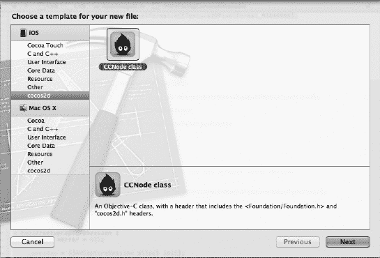

**图 8-5.** *使用 CCNode 模板*

确保文件是 `CCLayer` 的子类，并且名称为 `MenuLayer.m`。在 Xcode 中打开 `MenuLayer.h`。按照代码清单 8-4 所示更新头文件。

**代码清单 8-4.** *更新 MenuLayer.h*

```
#import <Foundation/Foundation.h>
#import "cocos2d.h"

@interface MenuLayer : CCLayer {

}
+ (id)scene;
@end
```

切换到 `MenuLayer.m`。将代码清单 8-5 中的方法添加到实现中。

**代码清单 8-5.** *MenuLayer.m 的 Scene 和 init 方法*

```
+ (id)scene {
    CCScene *scene = [CCScene node];
    MenuLayer *layer = [MenuLayer node];
    [scene addChild:layer];
    return scene;
}

- (id)init {
    if ((self = [super init])) {        
        CGSize winSize = [CCDirector sharedDirector].winSize;

        CCLabelBMFont *label = [CCLabelBMFont labelWithString:@"你好，Chipmunk!" fntFile:@"Arial.fnt"];
        label.position = ccp(winSize.width/2, winSize.height/2);
        [self addChild:label];
    }
    return self;
}  
```

到目前为止，我们还没有做任何与游戏相关的事情。我们正在设置一个类似 Hello World 的示例，以确保一切正常运行。你会注意到，在这个示例中我们使用了一个自定义字体文件和 `CCLabelBMFont` 类。你可以在 GitHub 仓库或 Apress 网站（[`www.apress.com`](http://www.apress.com)）的源代码/下载区域找到相关代码。这些字体由 Ray Wenderlich（[`www.raywenderlich.com`](http://www.raywenderlich.com)）提供。在尝试运行项目之前，你需要等待字体被添加到项目中。如果你现在就想运行项目，可以现在就添加它们。

让我们回到 `AppDelegate.m`。我们需要再添加一些内容，以确保菜单能够显示给用户。将代码清单 8-6 中的 `import` 语句添加到项目中。

**代码清单 8-6.** *额外的 import 语句*

```
#import "chipmunk.h"
#import "MenuLayer.h"
```

找到 `AppDelegate.m` 中 `applicationDidFinishLaunching` 方法的底部。添加代码清单 8-7 中的代码。

**代码清单 8-7.** *添加到 applicationDidFinishLaunching 底部*

```
cpInitChipmunk();
[[CCDirector sharedDirector] runWithScene: [MenuLayer scene]];
```

继续在 iPad 模拟器上运行项目。如果一切正确，你将看到类似图 8-6 的内容。

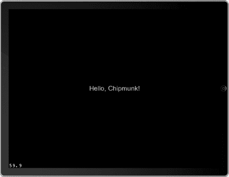

**图 8-6.** *运行项目，看到“你好，Chipmunk!”*

好了，让我们让这个更有趣一些。菜单层的想法是，当用户决定是否开始新游戏时，我们可以给他们一些事情做。由于这是一个关于南瓜的游戏，我们将添加一个南瓜到屏幕上，用户可以通过触摸交互来抛掷它。


#### 美术资源

对于 cocos2D 游戏开发，最好使用精灵表。更进一步，如果能将图片合并到少数几个优化过空间占用的精灵表中，效果更佳。由于本书是关于增强现实而非 iOS 游戏开发的，我已经为您创建并优化好了精灵表。它们可以在 GitHub 上的`Art`目录中找到，或者从 Apress 网站（[`www.apress.com`](http://www.apress.com)）的源代码/下载区域获取。在继续教程之前，请将`Art`目录复制到您的 Xcode 项目中。您应该会得到以下四个新文件：

- `particleTexture.png`
- `PumpkinExplosion.plist`
- `Pumpkins.plist`
- `Pumpkins.png`

前两个文件是我为此项目创建的粒子发射器。它能在我们摧毁南瓜时，赋予它们一种橘色溶解的效果。第二对文件是合并后的 PNG 文件，包含了我们将使用的不同南瓜。完整的精灵表如图 8-7 所示。

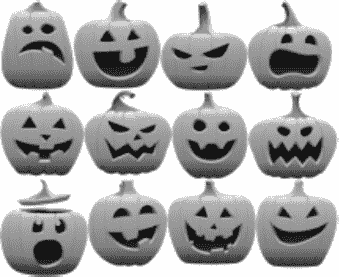

**图 8-7.** *为我们的项目使用南瓜精灵表。*

此精灵表中的南瓜被命名为`pumpkin_#_.png`，其中`#`是 5 到 16 之间的数字。南瓜 1 到 4 没有脸，所以我们不打算使用它们。

我们将把其中一个南瓜添加到菜单屏幕上，并允许用户稍微抛掷它。使用任意模板创建一个新文件。反正我们后续会覆盖整个内容。将新类命名为`CPSprite`。

用代码清单 8-8 中的代码覆盖头文件。

**代码清单 8-8.** *CPSprite.h*

```
#import "cocos2d.h"
#import "chipmunk.h"

typedef enum {
    kCollisionTypeGround = 0x1,
    kCollisionTypeCat,
    kCollisionTypeBed
} CollisionType;

@interface CPSprite : CCSprite {
    cpBody *body;
    cpShape *shape;
    cpSpace *space;
    BOOL canBeDestroyed;
}

@property (assign) cpBody *body;

- (void)update;
- (void)createBoxAtLocation:(CGPoint)location;
- (id)initWithSpace:(cpSpace *)theSpace location:(CGPoint)location spriteFrameName:(NSString *)spriteFrameName;
- (void)destroy;

@end
```

我们无需过分担心这个类的具体作用。本质上，我们是在为`CCSprite`类建立一个包装器，以便更容易地与屏幕上的对象进行交互。在我们的场景中，这将帮助我们创建一个可以在屏幕上抛掷的南瓜。

切换到`CPSprite.m`，并用代码清单 8-9 中的代码替换其实现。

**代码清单 8-9.** *CPSprite.m*

```
#import "CPSprite.h"

@implementation CPSprite
@synthesize body;

- (void)update {    
    self.position = body->p;
    self.rotation = CC_RADIANS_TO_DEGREES(-1 * body->a);
}

- (void)createBoxAtLocation:(CGPoint)location {

    float mass = 1.0;
    body = cpBodyNew(mass, cpMomentForBox(mass, self.contentSize.width, self.contentSize.height));
    body->p = location;
    body->data = self;
    cpSpaceAddBody(space, body);

    shape = cpBoxShapeNew(body, self.contentSize.width, self.contentSize.height);
    shape->e = 0.3;
    shape->u = 1.0;
    shape->data = self;
    shape->group = 1;
    cpSpaceAddShape(space, shape);

}

- (id)initWithSpace:(cpSpace *)theSpace location:(CGPoint)location spriteFrameName:(NSString *)spriteFrameName {

    if ((self = [super initWithSpriteFrameName:spriteFrameName])) {

        space = theSpace;
        canBeDestroyed = YES;
        [self createBoxAtLocation:location];

    }
    return self;

}

- (void)destroy {

    if (!canBeDestroyed) return;

    cpSpaceRemoveBody(space, body);
    cpSpaceRemoveShape(space, shape);
    [self removeFromParentAndCleanup:YES];
}

@end
```

实现文件设置了我们将在菜单中使用的属性。在大多数情况下，您无需过分担心这个文件中的具体实现。这个文件和其他两个文件一起包含在`Helper Code`目录下的源代码中。它们是一些工具方法，旨在使实现文件更容易阅读。

#### 辅助代码目录

在继续之前，您还需要从源代码目录复制另外四个文件。它们位于 GitHub 上的`Helper Code`目录中，或者 Apress 网站（[`www.apress.com`](http://www.apress.com)）的源代码/下载区域。

这些文件是：

- `cpMouse.c`
- `cpMouse.h`
- `drawSpace.h`
- `drawSpace.c`

将这些文件复制到您的 Xcode 项目中。如果您尝试构建项目，将会出现编译器错误。在 Xcode 导航器中点击`cpMouse.c`。在右侧面板中，打开**Identity and Type**视图，并将**File Type**设置为**Objective-C source**，如图 8-8 所示。

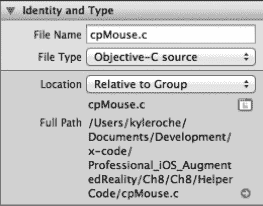

**图 8-8.** *设置`cpMouse.c`的文件类型。*

对`drawSpace.c`重复此过程。此时，您的项目应该能够无错误地构建。

### 完成菜单屏幕

回到`MenuLayer.h`。现在我们的项目中有了辅助类，事情会顺利得多。像代码清单 8-10 所示更新头文件。

**代码清单 8-10.** *更新后的 MenuLayer.h*

```
#import <Foundation/Foundation.h>
#import "cocos2d.h"
#import "chipmunk.h"

@interface MenuLayer : CCLayer {
    cpSpace *space;
    cpBody *ground;
}

+ (id)scene;

@end
```

导入 chipmunk 库之后，我们声明了两个新的私有变量。首先，为 chipmunk 设置一个`cpSpace`实例变量。这定义了 chipmunk 追踪物理动作的空间。然后，我们向类添加了一个`cpBody`。这将代表我们屏幕的底部，作为某种意义上的地面。如果没有这个地面，南瓜可能会飞向屏幕的各个方向。拥有地面也有助于 chipmunk 更容易地理解重力和摩擦力。

#### 使用 Chipmunk

切换到`MenuLayer.m`。从我们的辅助代码类中导入`drawSpace.h`头文件。将代码清单 8-11 中的方法添加到实现中。

**代码清单 8-11.** *`createSpace`方法*

```
- (void)createSpace {
    space = cpSpaceNew();
    space->gravity = ccp(0, -750);
    cpSpaceResizeStaticHash(space, 400, 200);
    cpSpaceResizeActiveHash(space, 200, 200);
}
```

此方法定义了 chipmunk 的空间。我们将重力设置为在 X 轴上无作用（无左右重力），而在 Y 轴上施加一个相当强的拉力。您可以在自己的实现中调整这些数值，以获得您想要的感觉。接下来的两行代码用于优化 chipmunk 的碰撞检测。它将 chipmunk 划分为网格，并告诉框架忽略不在同一网格中的对象。在`createSpace`方法正下方，添加代码清单 8-12 中的方法。

**代码清单 8-12.** *`createGround`方法*

```
- (void)createGround {    

    CGSize winSize = [CCDirector sharedDirector].winSize;
    CGPoint lowerLeft = ccp(0, 0);
    CGPoint lowerRight = ccp(winSize.width, 0);

    ground = cpBodyNewStatic();

    float radius = 10.0;
    cpShape *groundShape = cpSegmentShapeNew(ground, lowerLeft, lowerRight, radius);

    groundShape->e = 0.5; // 弹性系数
    groundShape->u = 1.0; // 摩擦系数

     cpSpaceAddShape(space, groundShape);    
}
```

正如我之前提到的，我们正在创建一个地面效果，以防止南瓜完全掉出屏幕。我们还设置了摩擦力和弹性系数。如果您想用南瓜找点乐子，可以将弹性系数设低，摩擦系数设为 0，从而获得类似冰面的效果。或者，您可以增加弹性和摩擦系数，以获得更像蹦床的效果。


### 在 Chipmunk 中创建对象

将代码清单 8–13 中的方法添加到实现部分。

**代码清单 8–13.** *`createBoxAtLocation` 和 `draw`（覆写）方法*

```
- (void)createBoxAtLocation:(CGPoint)location {
    float boxSize = 60.0;
    float mass = 1.0;
    cpBody *body = cpBodyNew(mass, cpMomentForBox(mass, boxSize, boxSize));
    body->p = location;
    cpSpaceAddBody(space, body);

    cpShape *shape = cpBoxShapeNew(body, boxSize, boxSize);
    shape->e = 1.0;
    shape->u = 1.0;
    cpSpaceAddShape(space, shape);
}

- (void)draw {
    drawSpaceOptions options = {
        0, // drawHash
        0, // drawBBs,
        1, // drawShapes
        4.0, // collisionPointSize
        4.0, // bodyPointSize,
        2.0 // lineThickness
    };

    drawSpace(space, &options);
}
```

第一个方法仅在此处使用一次。我们将创建几个方框并将其丢到屏幕上，以确保 Chipmunk 运行正常。第二个方法用于启用 Chipmunk 的调试绘制功能。没有它，就很难确切知道你在屏幕上渲染了什么。如果你继续从事游戏开发，这个方法会派上用场。更新 `init` 方法并添加一个名为 `update` 的新方法，如代码清单 8–14 所示。

**代码清单 8–14.** *新的 `init` 方法和 `update` 方法*

```
- (id)init {
    if ((self = [super init])) {        
        CGSize winSize = [CCDirector sharedDirector].winSize;

        [self createSpace];
        [self createGround];
        [self createBoxAtLocation:ccp(100,100)];
        [self createBoxAtLocation:ccp(200,200)];

        [self scheduleUpdate];
    }
    return self;
}  

- (void)update:(ccTime)dt {
    cpSpaceStep(space, dt);
}
```

好了，事情变得更有趣了。通过这些新代码，我们设置了 Chipmunk 空间、地面物体，并在不同坐标处创建了两个方框。`update` 方法会逐步处理自上次迭代以来 Chipmunk 空间中的变化。Chipmunk 会为你处理其空间内所有对象的更新。现在就去用模拟器运行该项目，看看我说的效果。你应该会看到类似图 8–9 的画面。

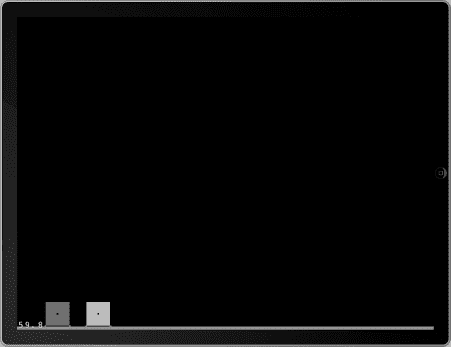

**图 8–9** *运行项目，查看屏幕上的方框。*

再说一次，是不是并不令人兴奋？让我们添加一个所谓的*鼠标关节*，这样我们就可以抓住并投掷这些方框了。关节是 Chipmunk 中的一种约束类型。在本示例中，我们将使用两种类型的关节。我们会用鼠标关节让用户抓取方框，还会用 `cpDampedSprint` 关节让南瓜在被抛来抛去时弹跳起来。

切换到 `MenuLayer.h` 文件，并从我们的 Helper Code 目录导入 `cpMouse.h` 头文件。然后声明一个 `cpMouse` 类的私有实例变量，命名为 `mouse`。

将代码清单 8–15 中的以下行添加到 `init` 方法中，放在运行 `scheduleUpdates` 方法之前。

**代码清单 8–15.** *添加到 `init` 方法*

```
mouse = cpMouseNew(space);
self.isTouchEnabled = YES;
```

第一行设置了新的 `mouse` 实例变量，用于处理我们 Chipmunk 空间中的鼠标事件。第二行启用了我们类的触摸事件。

启用触摸事件是一回事；处理它们则稍微复杂一些。在 cocos2D 中有两种基本方法处理触摸事件。本示例只需要单点触摸事件（而非多点触摸事件）。奇怪的是，这些需要的代码比多点触摸处理还要多。将代码清单 8–16 中的代码添加到实现部分。

**代码清单 8–16.** *处理触摸事件*

```
- (void)registerWithTouchDispatcher {
    [[CCTouchDispatcher sharedDispatcher] addTargetedDelegate:self priority:0 swallowsTouches:YES];
}

- (BOOL)ccTouchBegan:(UITouch *)touch withEvent:(UIEvent *)event {
    CGPoint touchLocation = [self convertTouchToNodeSpace:touch];
    cpMouseGrab(mouse, touchLocation, false);
    return YES;
}

- (void)ccTouchMoved:(UITouch *)touch withEvent:(UIEvent *)event {
    CGPoint touchLocation = [self convertTouchToNodeSpace:touch];
    cpMouseMove(mouse, touchLocation);
}

- (void)ccTouchEnded:(UITouch *)touch withEvent:(UIEvent *)event {
    cpMouseRelease(mouse);
}

- (void)ccTouchCancelled:(UITouch *)touch withEvent:(UIEvent *)event {
    cpMouseRelease(mouse);    
}

- (void)dealloc {
    cpMouseFree(mouse);
    cpSpaceFree(space);
    [super dealloc];
}
```

这一系列事件让 Chipmunk 知道用户想要抓取与触摸坐标碰撞的任何对象。Chipmunk 会更新对象的位置，直到用户释放触摸事件。到那时，重力、摩擦力以及任何其他 Chipmunk 环境变量会起作用，对象将回到自然的运动轨迹。再次在模拟器上运行项目。你现在可以在屏幕上抛掷这些对象了。不过要小心——你实际上可以将其抛出屏幕，而且再也拿不回来了！

那么，屏幕上的方框并不是我们目标的一部分，对吗？要把这些方框变成南瓜，我们需要将一个精灵图片附着到方框上，并确保当 Chipmunk 更新形状位置时，图片能跟着移动。而且，由于现在的状况没什么用，因为用户可以把南瓜完全抛出屏幕，所以我们要为屏幕上的南瓜添加一个沟槽关节。可以把沟槽关节想象成一根旗杆或固定的轨道。与关节相连的对象可以沿着路径移动，但不能偏离旗杆/轨道。

回到 Xcode 中的 `MenuLayer.h` 文件。按代码清单 8–17 所示更新头文件。

**代码清单 8–17.** *更新后的 `MenuLayer.h`*

```
#import <Foundation/Foundation.h>
#import "cocos2d.h"
#import "chipmunk.h"
#import "cpMouse.h"
#import "CPSprite.h"

@interface MenuLayer : CCLayer {
    cpSpace *space;
    cpBody *ground;
    cpMouse *mouse;

    CCSpriteBatchNode *pumpkinBatchNode;
    CPSprite *menuPumpkin1;
}

+ (id)scene;

@end
```

首先，我们导入之前创建的 `CPSprite` 类。这将帮助我们轻松地将南瓜添加到屏幕上。接下来，我们声明一个私有的 `CCSpriteBatchNode` 变量，以及一个 `CCSprite` 变量。

**注意：** 在使用 cocos2D 开发游戏时，最好使用 `CCSpriteBatchNode` 和精灵表来节省内存。我们需要尽可能多的内存，因为人脸识别对处理能力的要求很高。


好的，这是根据您的要求翻译的中文版本：


### 在 Chipmunk 中创建弹簧关节

切换到 `MenuLayer.m` 文件，并按照代码清单 8–18 所示更新 `init` 方法。

**代码清单 8–18.** *更新后的 init 方法*

```
- (id)init {
    if ((self = [super init])) {        
        CGSize winSize = [CCDirector sharedDirector].winSize;
        [self createSpace];
        [self createGround];
        //[self createBoxAtLocation:ccp(100,100)];
        //[self createBoxAtLocation:ccp(200,200)];
        [self scheduleUpdate];
        mouse = cpMouseNew(space);
        self.isTouchEnabled = YES;
        [[CCSpriteFrameCache sharedSpriteFrameCache] addSpriteFramesWithFile:@"pumpkins.plist"];
        pumpkinBatchNode = [CCSpriteBatchNode batchNodeWithFile:@"pumpkins.png"];
        [self addChild:pumpkinBatchNode];
        menuPumpkin1 = [[[CPSprite alloc] initWithSpace:space location:ccp(347, 328) spriteFrameName:@"pumpkin15.png"] autorelease];
        [pumpkinBatchNode addChild:menuPumpkin1];
        cpConstraint *pumpkin1 = cpDampedSpringNew(menuPumpkin1.body, ground, ccp(-100,100), ccp(250,700), 100, 5, 1);
        cpSpaceAddConstraint(space, pumpkin1);
    }
    return self;
}
```

首先，我们使用共享的精灵表单创建一个 `CCSpriteFrameCache`。我们使用的是我为您创建的 PLIST 文件，因此 `CCSpriteFrameCache` 能够了解我们精灵表单的内容。稍后我们会在动作层中再次用到它。接下来，我们将批次节点设置为我们南瓜 PNG 文件的内容。

接下来的两条语句更有趣一些。我们将 `CPSprite menuPumpkin1` 设置为 `CCSprite` 的一个新实例，并为其指定了一个位置和一张默认的南瓜图像。

最后，按照我们之前讨论的，使用 `cpDampedSpringNew` 宏设置了一个新的 `cpDampedSpring` 约束。如果您愿意，可以调整我在这里设置的值。它们会增大/减小弹簧的强度及其偏移量。请记住，我们启用了调试绘制，因此您将能看到弹簧的实际效果。

**注意：** 如果您无法在 iPad 上测试，需要根据 iPhone 的屏幕尺寸调整代码清单 8–18 中的 x、y 坐标。将它们全部减半即可。

更改 `update` 方法以反映代码清单 8–19 中的变化。

**代码清单 8–19.** *更新后的 update 方法*

```
- (void)update:(ccTime)dt {
    cpSpaceStep(space, dt);
    for (CPSprite *sprite in pumpkinBatchNode.children) {
        [sprite update];
    }
}
```

这段代码量很少，但影响巨大。尝试分别运行有和没有我们刚添加的代码的项目。使用我们的新代码，加载游戏菜单时，我们将看到类似图 8–10 的画面。

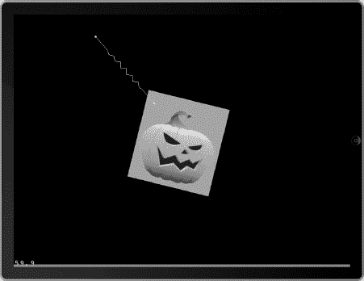

**图 8–10** *运行包含更新后 update 方法的代码，以显示正确的游戏菜单。*

请注意弹簧关节和南瓜周围的方框。当被鼠标拖拽或在屏幕上抛掷时，精灵会与容器保持一致。现在，如果您省略我们刚添加的那个 update 代码块，您将得到类似图 8–11 的结果。

如您所见，我们的容器仍然按预期工作。但是，精灵已经掉出了屏幕。从这个练习中，您首先应该认识到的是，debug 绘制是救星。如果没有启用 debug 绘制，要试图弄清楚为什么那个南瓜会跑到屏幕外面去，将是一项非常艰巨的任务。您应该领会的第二件事是，当发生任何变化时，您必须始终更新您的场景。相信 chipmunk 或 cocos2D 会处理好细节，但请务必确保您尊重这些更新。

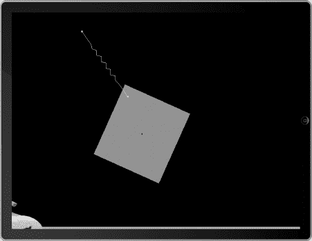

**图 8–11** *如果没有精灵更新代码，您将在屏幕上看到这个结果。*

### 添加菜单选项

这将是一个基础游戏，但我们仍然需要一个开始游戏选项。在我们将其添加到 `MenuLayer` 之前，让我们先创建一个基础类，这样当我们启动游戏时就能知道它是否在工作。

再次使用 `CCNode` 模板创建一个新文件。这次将类命名为 `ActionLayer`。确保它是 `CCLayer` 的子类。在 Xcode 中打开 `ActionLayer.h` 并按照代码清单 8–20 所示进行更新。

**代码清单 8–20.** *更新后的 ActionLayer.h*

```
#import <Foundation/Foundation.h>
#import "cocos2d.h"

@interface ActionLayer : CCLayer {

}

+(CCScene *) scene;

@end
```

就像我们的 `MenuLayer` 类一样，我们声明了静态的 `CCScene` 方法。这在 cocos2D 场景类中很常见。`CCDirector` 使用它来显示一个新场景。

切换到 `ActionLayer.m` 文件，并按照代码清单 8–21 所示更新实现。

**代码清单 8–21.** *更新后的 ActionLayer.m*

```
#import "ActionLayer.h"

@implementation ActionLayer

+(CCScene *) scene
{
    // 'scene' 是一个自动释放对象。
    CCScene *scene = [CCScene node];

    // 'layer' 是一个自动释放对象。
    ActionLayer *layer = [ActionLayer node];

    // 将 layer 作为子节点添加到 scene
    [scene addChild: layer];
    // 返回 scene
    return scene;
}

- (id)init {
    if ((self = [super init])) {        
        CGSize winSize = [CCDirector sharedDirector].winSize;
        CCLabelBMFont *label = [CCLabelBMFont labelWithString:@"Game on pumpkins!" fntFile:@"Arial.fnt"];
        label.position = ccp(winSize.width/2, winSize.height/2);
        [self addChild:label];
    }
    return self;
}

@end
```

我们稍后会替换掉这段代码的大部分内容。现在，它将显示一个标签，上面有一条给南瓜们的小信息，让我们知道准备工作已经就绪，可以开始加载我们的游戏场景了。

返回到 `MenuLayer.m`。导入新的 `ActionLayer.h` 类。找到我们向屏幕添加弹簧约束的代码。就在那行代码下面，添加代码清单 8–22 中的代码。

**代码清单 8–22.** *在 init 方法末尾，弹簧约束之后添加*

```
CCLabelBMFont *newGame;
if (UI_USER_INTERFACE_IDIOM() == UIUserInterfaceIdiomPad) {
    newGame = [CCLabelBMFont labelWithString:@"New Game" fntFile:@"Arial-hd.fnt"];
} else {
    newGame = [CCLabelBMFont labelWithString:@"New Game" fntFile:@"Arial.fnt"];    
}

CCMenuItemLabel *newGameItem = [CCMenuItemLabel itemWithLabel:newGame target:self selector:@selector(newGameTapped:)];
newGameItem.position = ccp(winSize.width * 0.8, winSize.height * 0.3);

CCMenu *menu = [CCMenu menuWithItems:newGameItem, nil];
menu.position = CGPointZero;
[self addChild:menu];
```

这段代码块为用户创建了一个 cocos2D 菜单。我们根据设备类型加载一个字体，然后为用户提供一个选项，即开始新游戏。如果点击了新游戏标签，我们将触发选择器 `newGameTapped`。这是一个我们尚未创建的方法。我们现在就来创建它。将代码清单 8–23 中的方法添加到实现中。

**代码清单 8–23.** *newGameTapped 方法*

```
- (void)newGameTapped:(id)sender {
    [[CCDirector sharedDirector] replaceScene:[CCTransitionRadialCCW transitionWithDuration:1.0 scene:[ActionLayer node]]];
}
```

当用户点击新游戏选项时，我们将使用一个 cocos2D 过渡动画，以一种时尚的方式呈现游戏。使用 iPad 模拟器运行项目。启动后，您将看到一个如图 8–12 所示的新菜单。

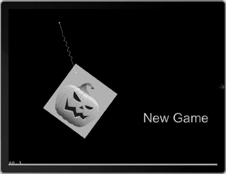

**图 8–12** *运行项目以查看新游戏菜单。*

如果您点击 New Game，您将看到一个快速放大文本的效果，然后屏幕会过渡到 `ActionLayer`，如图 8–13 所示。

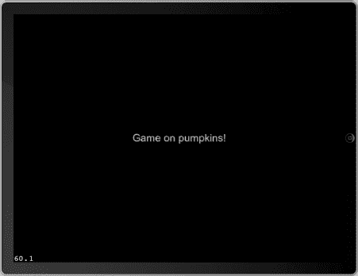


