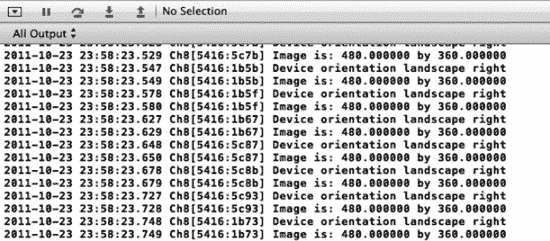
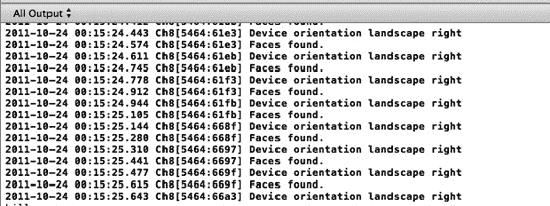
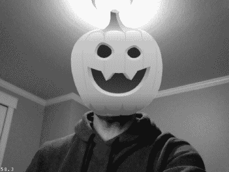
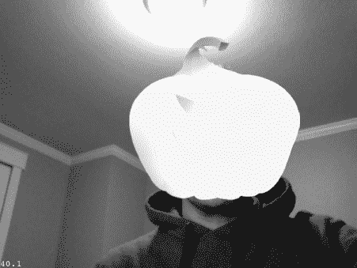

# 排版后的内容

**图 8–13** *点击“新游戏”可切换屏幕并召唤南瓜。*

至此，添加游戏逻辑的大部分工作已准备就绪。让我们回到 `AppDelegate` 类，启用之前添加的摄像头支持。从现在开始，你需要使用实体设备而非模拟器来测试项目。

### 启用摄像头支持

让我们完成之前开始的摄像头支持工作，显示摄像头视图，替换当前显示的黑色背景。在 Xcode 中打开 `AppDelegate.h` 并更新 `AppDelegate.h`，如代码清单 8–24 所示。

**代码清单 8–24.** *更新后的 AppDelegate.h*

```objc
#import <UIKit/UIKit.h>
#import <AVFoundation/AVFoundation.h>
#import "ActionLayer.h"

@class RootViewController;

@interface AppDelegate : NSObject <UIApplicationDelegate, AVCaptureVideoDataOutputSampleBufferDelegate> {
    UIWindow *window;
    RootViewController *viewController;

    AVCaptureSession *_session;
    UIView *_cameraView;
    UIImageView *_imageView;
    BOOL _settingImage;
}

@property (nonatomic, retain) UIWindow *window;
@property (nonatomic) BOOL isPlaying;
@property (nonatomic, retain) ActionLayer *actionLayer;

@end
```

导入 `ActionLayer.h` 头文件后，我们声明了两个新属性。首先，是一个布尔属性，用于追踪用户是否正在玩游戏。其次，我们保存了对游戏 `ActionLayer` 的引用。这将用于确保人脸识别请求仅发送到当前活跃的游戏图层。如果你计划将此游戏发布到 App Store，最好将其重构为另一个单例类来管理状态。就本需求而言，我们采用的方法足够了。

最后，我们添加了一个布尔值，用于追踪是否正在使用摄像头缓冲区设置图像视图。

切换到 `AppDelegate.m`。在 `applicationDidFinishLaunching` 方法中找到 `EAGLView` 的声明。按代码清单 8–25 所示进行更新。

**代码清单 8–25.** *更改 OpenGL ES 视图的 pixelFormat*

```objc
EAGLView *glView = [EAGLView viewWithFrame:[window bounds]
    pixelFormat:kEAGLColorFormatRGBA8
    depthFormat:0];
```

这应该在第 7 章中已经熟悉了。找到调用 `window` 实例的 `makeKeyAndVisible` 函数的代码行。在该函数调用之前，添加代码清单 8–26 中的代码。

**代码清单 8–26.** *将背景设置为摄像头的透明视图*

```objc
[CCDirector sharedDirector].openGLView.backgroundColor = [UIColor clearColor];
    [CCDirector sharedDirector].openGLView.opaque = NO;

    glClearColor(0.0, 0.0, 0.0, 0.0);
    _cameraView = [[UIView alloc] initWithFrame:[[UIScreen mainScreen] bounds]];
    _cameraView.opaque = NO;
    _cameraView.backgroundColor = [UIColor clearColor];

    [window addSubview:_cameraView];

    _imageView = [[UIImageView alloc] initWithFrame:[[UIScreen mainScreen] bounds]];
    [_cameraView addSubview:_imageView];
    [window bringSubviewToFront:viewController.view];
```

同样，这段代码对我们来说并不陌生。我们在第 7 章中学过这种方法。需要注意的是，iOS 5 引入了一种构建增强现实应用的新方法。你基本上可以将 OpenGL ES 视图的背景设置为显示摄像头视图的纹理。然而，由于 cocos2D 构建在 OpenGL 之上，存在一些尚未完全解决的版本冲突。这是撰写本文时的最佳方法。

在继续图像处理之前，还有一些未完成的整理工作。确保合成了 `isPlaying` 属性。然后，在 `applicationDidFinishLaunching` 方法中初始化 chipmunk 库之后，添加代码清单 8–27 中的代码。

**代码清单 8–27.** *初始设置*

```objc
cpInitChipmunk(); // 应已存在
 [[CCDirector sharedDirector] runWithScene: [MenuLayer scene]]; // 应已存在
isPlaying = NO;
 [self setupCaptureSession];
```

我们的 `AppDelegate` 类已被指定为实现 `AVCaptureVideoDataOutputSampleBufferDelegate` 协议的类。我们尚未实现任何委托方法。现在让我们将这些方法添加到 `AppDelegate` 实现中。添加代码清单 8–28 中的代码。

**代码清单 8–28.** *图像处理方法*

```objc
- (UIImage *) imageFromSampleBuffer:(CMSampleBufferRef) sampleBuffer
{
    // 获取 CMSampleBuffer 的 Core Video 图像缓冲区中的媒体数据
    CVImageBufferRef imageBuffer = CMSampleBufferGetImageBuffer(sampleBuffer);
    // 锁定像素缓冲区的基地址
    CVPixelBufferLockBaseAddress(imageBuffer, 0);

    // 获取像素缓冲区的每行字节数
    void *baseAddress = CVPixelBufferGetBaseAddress(imageBuffer);

    // 获取像素缓冲区的每行字节数
    size_t bytesPerRow = CVPixelBufferGetBytesPerRow(imageBuffer);
    // 获取像素缓冲区的宽度和高度
    size_t width = CVPixelBufferGetWidth(imageBuffer);
    size_t height = CVPixelBufferGetHeight(imageBuffer);

    // 创建设备相关的 RGB 颜色空间
    CGColorSpaceRef colorSpace = CGColorSpaceCreateDeviceRGB();

    // 使用样本缓冲区数据创建位图图形上下文
    CGContextRef context = CGBitmapContextCreate(baseAddress, width, height, 8,
                                                 bytesPerRow, colorSpace, kCGBitmapByteOrder32Little | kCGImageAlphaPremultipliedFirst);
    // 从位图图形上下文中的像素数据创建 Quartz 图像
    CGImageRef quartzImage = CGBitmapContextCreateImage(context);
    // 解锁像素缓冲区
    CVPixelBufferUnlockBaseAddress(imageBuffer,0);

    // 释放上下文和颜色空间
    CGContextRelease(context);
    CGColorSpaceRelease(colorSpace);

    // 从 Quartz 图像创建图像对象
    UIImage *image = [UIImage imageWithCGImage:quartzImage];

    // 释放 Quartz 图像
    CGImageRelease(quartzImage);

    return (image);
}

- (void)captureOutput:(AVCaptureOutput *)captureOutput didOutputSampleBuffer:(CMSampleBufferRef)sampleBuffer fromConnection:(AVCaptureConnection *)connection
{
    UIImage *image = [self imageFromSampleBuffer:sampleBuffer];

    if(_settingImage == NO){
        _settingImage = YES;
        [NSThread detachNewThreadSelector:@selector(setImageToView:) toTarget:self withObject:image];
    }
}

-(void)setImageToView:(UIImage*)image {
    //UIImage * capturedImage = [self rotateImage:image orientation:UIImageOrientationRight ];
    UIImage * capturedImage = [self rotateImage:image orientation:UIImageOrientationLeftMirrored ];
    _imageView.image = capturedImage;
    _settingImage = NO;
}
```


```
    if (isPlaying) {
        //NSLog(@"Playing. Send to Pumpkin layer");
if (!actionLayer.isProcessingRequest) {
            UIImage * image = [_imageView.image retain];
            if(image!=nil){
                UIInterfaceOrientation orient =  [UIApplication sharedApplication].statusBarOrientation;
                UIImage * rotatedImage = image;
                switch (orient) {
                    case UIInterfaceOrientationPortrait:
                            NSLog(@"Device orientation portrait");
                            rotatedImage = [self rotateImage:image orientation: UIImageOrientationRight];
                        break;
                    case UIInterfaceOrientationPortraitUpsideDown:
                        rotatedImage = [self rotateImage:image orientation: UIImageOrientationLeft];
NSLog(@"Device orientation portrait upside down");
break;
                    case UIInterfaceOrientationLandscapeLeft:
                        rotatedImage = [self rotateImage:image orientation: UIImageOrientationRight];
                        NSLog(@"Device orientation landscape left");
                            break;
                    case UIInterfaceOrientationLandscapeRight:
                        rotatedImage = [self rotateImage:image orientation: UIImageOrientationLeft];
                        NSLog(@"Device orientation landscape right");
                            break;
                };
[actionLayer facialRecognitionRequest:rotatedImage];
        }
        }
    }
}

- (UIImage *) rotateImage:(UIImage*)image orientation:(UIImageOrientation) orient {
    CGImageRef imgRef = image.CGImage;
    CGAffineTransform transform = CGAffineTransformIdentity;
    //UIImageOrientation orient = image.imageOrientation;
    CGFloat scaleRatio = 1;
    CGFloat width = image.size.width;
    CGFloat height = image.size.height;    
    CGSize imageSize = image.size;
    CGRect bounds = CGRectMake(0, 0, width, height);
    CGFloat boundHeight;

    switch(orient) {
        case UIImageOrientationUp:
            transform = CGAffineTransformIdentity;
            break;
        case UIImageOrientationUpMirrored:
            transform = CGAffineTransformMakeTranslation(imageSize.width, 0.0);
            transform = CGAffineTransformScale(transform, -1.0, 1.0);
            break;
        case UIImageOrientationDown:
            transform = CGAffineTransformMakeTranslation(imageSize.width, imageSize.height);
            transform = CGAffineTransformRotate(transform, M_PI);
break;
        case UIImageOrientationDownMirrored:
            transform = CGAffineTransformMakeTranslation(0.0, imageSize.height);
            transform = CGAffineTransformScale(transform, 1.0, -1.0);
            break;
        case UIImageOrientationLeftMirrored:
            boundHeight = bounds.size.height;
            bounds.size.height = bounds.size.width;
            bounds.size.width = boundHeight;
            transform = CGAffineTransformMakeTranslation(imageSize.height, imageSize.height);
            transform = CGAffineTransformScale(transform, -1.0, 1.0);
            transform = CGAffineTransformRotate(transform, 3.0 * M_PI / 2.0);
break;
        case UIImageOrientationLeft:
            boundHeight = bounds.size.height;
            bounds.size.height = bounds.size.width;
            bounds.size.width = boundHeight;
            transform = CGAffineTransformMakeTranslation(0.0, imageSize.width);
            transform = CGAffineTransformRotate(transform, 3.0 * M_PI / 2.0);
break;
        case UIImageOrientationRightMirrored:
            boundHeight = bounds.size.height;
            bounds.size.height = bounds.size.width;
            bounds.size.width = boundHeight;
            transform = CGAffineTransformMakeScale(-1.0, 1.0);
            transform = CGAffineTransformRotate(transform, M_PI / 2.0);
break;
        case UIImageOrientationRight:
            boundHeight = bounds.size.height;
            bounds.size.height = bounds.size.width;
            bounds.size.width = boundHeight;
            transform = CGAffineTransformMakeTranslation(imageSize.height, 0.0);
            transform = CGAffineTransformRotate(transform, M_PI / 2.0);
            break;
        default:
             [NSException raise:NSInternalInconsistencyException format:@"Invalid image orientation"];
    }
    UIGraphicsBeginImageContext(bounds.size);
    CGContextRef context = UIGraphicsGetCurrentContext();
    if (orient == UIImageOrientationRight || orient == UIImageOrientationLeft) {
        CGContextScaleCTM(context, -scaleRatio, scaleRatio);
        CGContextTranslateCTM(context, -height, 0);
    } else {
        CGContextScaleCTM(context, scaleRatio, -scaleRatio);
        CGContextTranslateCTM(context, 0, -height);
    }
    CGContextConcatCTM(context, transform);
    CGContextDrawImage(UIGraphicsGetCurrentContext(), CGRectMake(0, 0, width, height), imgRef);
UIImage *imageCopy = UIGraphicsGetImageFromCurrentImageContext();
    UIGraphicsEndImageContext();

    return imageCopy;
}
```

这是我们单个新增内容中最大的代码块。其中大部分代码我们在第 7 章中已经见过。不过，在将图像设置到屏幕视图的处理方式上存在一个差异。当我们将图像设置到屏幕时，我们还会在向动作层发送新的图像请求之前，检查它是否正忙。我们尚未在动作层中实现此功能。这将是下一步的工作。

如下清单 8-29 所示，更新`AppDelegate.m`中的`Private`方法声明。

**清单 8-29.** *更新后的私有方法声明*

```
@interface AppDelegate (Private)
- (void)setupCaptureSession;
- (UIImage *) rotateImage:(UIImage*)image orientation:(UIImageOrientation) orient;
@end
```


你的 `AppDelegate` 类中应该会出现两个编译器错误。它们是由动作层中缺少的属性和方法引起的。请切换到 `ActionLayer.h`，并将代码清单 8-30 中的代码添加到头文件中。

**代码清单 8-30.** *添加到 ActionLayer.h*

```objc
@property (nonatomic) BOOL isProcessingRequest;
- (void)facialRecognitionRequest:(UIImage *)image;
```

这两个元素正是我们的 `AppDelegate` 中所缺失的。切换到 `ActionLayer.m`。导入 `AppDelegate.h` 并合成 `isProcessingRequest` 布尔属性。按代码清单 8-31 所示更新 `init` 方法。

**代码清单 8-31.** *更新后的 init 方法*

```objc
- (id)init {
    if ((self = [super init])) {        
        isProcessingRequest = NO;
        [AppDelegate instance].actionLayer = self;
        [AppDelegate instance].isPlaying = YES;
    }
    return self;
}  
```

我们移除了向南瓜发送消息的代码，并添加了几个默认变量。你会注意到，这个来自 `AppDelegate` 类的新实例方法显示了一个警告。我们尚未实现那个静态方法，所以暂时忽略它。如果你尝试编译，还会因为缺少静态的 `instance` 方法而出现错误，我们稍后会实现它。按代码清单 8-32 所示实现 `facialRecognitionRequest` 方法。

**代码清单 8-32.** *facialRecognitionRequest 方法*

```objc
- (void)facialRecognitionRequest:(UIImage *)image {
    NSLog(@"Image is: %f by %f", image.size.width, image.size.height);
}   
```

目前，我们只是记录该事件的一些详细信息，以确保我们接收到的是正确的图像。在 Xcode 中打开 `AppDelegate.h`，并声明代码清单 8-33 中所示的静态方法。

**代码清单 8-33.** *AppDelegate.h 的静态 instance 方法*

```objc
+ (AppDelegate *)instance;
```

这个方法对于本项目的目标来说并不重要，更多是我个人实现习惯的体现。它提供了一种无需太多功夫就能获取 `AppDelegate` 单例的简单方式。切换到 `AppDelegate.m`，并添加代码清单 8-34 中的方法。

**代码清单 8-34.** *AppDelegate.m 的静态 instance 方法*

```objc
+ (AppDelegate *)instance {
    return (AppDelegate *)[[UIApplication sharedApplication] delegate];
}
```

在 `AppDelegate.m` 文件中，请确保已合成了我们之前设置的 `actionLayer` 属性。继续在实体设备（最好是 iPad 2）上运行项目。你将看到一个欢迎菜单，如图 8-14 所示。


**图 8-14** *再次运行项目，查看带有相机背景的游戏菜单。*

如果你点击“新游戏”菜单，可以观察调试控制台的更新。你应该会看到大量消息输出，如图 8-15 所示。



**图 8-15** *观察屏幕缓冲日志信息。*

你可以看到，我们对动作层的调用非常频繁。实际上，这是一个很好的优化点。降低进入动作层的处理频率，有助于让我们的游戏运行得更高效。

### 完成动作层

让我们思考一下，为了让这个游戏具备一定结构，我们还需要什么。显然，我们缺少南瓜。但除此之外，我们应该实现某种计数器，用来追踪已经消灭了多少个外星南瓜。我们的精灵表单中有 12 张不同的南瓜图像。让我们将其设置为倒计时类型的游戏，即用户必须在游戏结束前消灭全部 12 个南瓜。

首先，我们来解决面部识别问题。我们将使用 iOS 5 中新增的一个类——`CIDetector`。我们将在第 12 章中更详细地讨论它。在 `ActionLayer.h` 中，添加代码清单 8-35 中的属性。

**代码清单 8-35.** *CIDetector 属性*

```objc
@property (nonatomic, retain) CIDetector *detector;
```

打开 `ActionLayer.m` 并合成该属性。在 `init` 方法的 `if` 块内部，添加代码清单 8-36 中的代码。

**代码清单 8-36.** *设置 CIDetector*

```objc
NSDictionary *detectorOptions = [NSDictionary dictionaryWithObjectsAndKeys:CIDetectorAccuracyLow, CIDetectorAccuracy, nil];
        self.detector = [CIDetector detectorOfType:CIDetectorTypeFace context:nil options:detectorOptions];
```

正如我所提到的，我们将在第 12 章中更详细地讨论这个类。现在，你只需要知道 `CIDetector` 会追踪它在图像中识别到的面部的 x、y 坐标。在我们的案例中，我们将用它来追踪相机视图中的面部。按代码清单 8-37 所示更新 `facialRecognitionRequest` 方法。

**代码清单 8-37.** *更新后的 facialRecognitionRequest 方法*

```objc
- (void)facialRecognitionRequest:(UIImage *)image {
    if (!isProcessingRequest) {
        isProcessingRequest = YES;
        NSArray *arr = [detector featuresInImage:[CIImage imageWithCGImage:[image CGImage]]];

        if ([arr count] > 0) {
            NSLog(@"Faces found.");
        } else {
            NSLog(@"No faces found");
        }    
    }
    isProcessingRequest = NO;
}
```

我知道我说过稍后再讨论，但处理图像进行面部识别所需的代码量之少，实在令人印象深刻。加粗的那一行代码就是全部所需。如果我们在相机视图中找到了面部，就记录到控制台；如果没找到，也同样记录。

继续在实体设备上再次运行应用程序。你应该会看到类似图 8-16 所示的控制台输出。



**图 8-16** *查看屏幕缓冲日志信息，并注意“Faces found.”消息。*

看起来一切正常。让我们添加逻辑，将南瓜显示在目标的面部上。


### 南瓜登场

我们只允许同时存在一个外星南瓜。基本规则是：第一个被检测到的人脸，就会不幸成为南瓜寄生的目标。

为了实现这一机制，我们需要先在屏幕上添加一个南瓜，并将其设置为不可见状态。当我们检测到人脸时，将南瓜移动到人脸的坐标位置，并重新将其设置为不透明，这样它就会出现在摄像头画面中。

打开 `ActionLayer.h`。声明如代码清单 8-38 所示的私有变量。

**代码清单 8-38.** *新的私有变量*

```
CCSpriteBatchNode *pumpkinBatchNode;
CCSprite *pumpkin;
int pumpkin_count;
```

这些变量将用于初始化我们的南瓜图像。和之前一样，我们会使用 `CCSpriteBatchNode` 来管理图片。整数 `pumpkin_count` 用于从 12 开始倒计数，这样我们就能知道还剩多少个外星南瓜需要消灭。切换到 `ActionLayer.m` 文件。按照代码清单 8-39 所示更新 `init` 方法。

**代码清单 8-39.** *新的 init 方法*

```
- (id)init {
    if (self = [super init]) {
        //CGSize winSize = [CCDirector sharedDirector].winSize;

        NSDictionary *detectorOptions = [NSDictionary dictionaryWithObjectsAndKeys:CIDetectorAccuracyLow, CIDetectorAccuracy, nil];
        self.detector = [CIDetector detectorOfType:CIDetectorTypeFace context:nil options:detectorOptions];

        pumpkinBatchNode = [CCSpriteBatchNode batchNodeWithFile:@"pumpkins.png"];
        [self addChild:pumpkinBatchNode];

        pumpkin = [CCSprite spriteWithSpriteFrameName:@"pumpkin5.png"];
        pumpkin.position = ccp(0,0);
        pumpkin.opacity = 0;
        [self addChild:pumpkin];

        // 开始游戏
        isProcessingRequest = NO;
        pumpkin_count = 12;
        [AppDelegate instance].actionLayer = self;
        [AppDelegate instance].isPlaying = YES;

        self.isTouchEnabled = YES;
    }
    return self;
}
```

这里，我们使用之前用过的精灵表初始化了 `CCSpriteBatchNode`。然后，通过精灵表中的 `pumpkin5.png` 帧初始化了 `pumpkin` 变量，将其作为一个新的 `CCSprite`。接着，我们将其设置为透明，并添加到场景中。

确保项目仍然能无报错地构建。目前还看不出什么新效果，所以把项目跑在设备上也没用。按照代码清单 8-40 所示，更新 `facialRecognitionRequest` 方法。

**代码清单 8-40.** *新的 facialRecognitionRequest 方法*

```
- (void)facialRecognitionRequest:(UIImage *)image {
    //NSLog(@"Image is: %f by %f", image.size.width, image.size.height);

    if (!isProcessingRequest) {
        isProcessingRequest = YES;
        //NSLog(@"Detecting Faces");
        NSArray *arr = [detector featuresInImage:[CIImage imageWithCGImage:[image CGImage]]];

        if ([arr count] > 0) {
            //NSLog(@"Faces found.");
            for (int i = 0; i < 1; i++) { //< [arr count]; i++) {
                CIFaceFeature *feature = [arr objectAtIndex:i];
                double xPosition = (feature.leftEyePosition.x + feature.rightEyePosition.x+feature.mouthPosition.x)/(3*image.size.width) ;
                double yPosition = (feature.leftEyePosition.y + feature.rightEyePosition.y+feature.mouthPosition.y)/(3*image.size.height);

                double dist = sqrt(pow((feature.leftEyePosition.x - feature.rightEyePosition.x),2)+pow((feature.leftEyePosition.y - feature.rightEyePosition.y),2))/image.size.width;

                yPosition += dist;
                CGSize size = [[CCDirector sharedDirector] winSize];
                pumpkin.opacity = 255;
                pumpkin.scale = 5*(size.width*dist)/256.0;

              [pumpkin setDisplayFrame:[[CCSpriteFrameCache sharedSpriteFrameCache]
spriteFrameByName:[NSString stringWithFormat:@"pumpkin%d.png", pumpkin_count + 4]]];
                CCMoveTo *moveAction = [CCMoveTo actionWithDuration:0
position:ccp((size.width * (xPosition)), (size.height * ((yPosition))))];
                [pumpkin runAction:moveAction];
            }
        } else {
            pumpkin.opacity = 0;
        }    
    }
    isProcessingRequest = NO;
}
```

这是整款游戏中最关键的代码块，让我们逐步仔细分析。首先，我们检查当前是否正在处理请求。如果没有，则调用 `CIDetector` 的方法来找出摄像头图像中的人脸。如果至少找到一张脸，我们再继续执行后续操作。

在这里，我实际上硬编码了一个不超过一次迭代的循环。如果你想扩展这个游戏，这里也是一个可以改进的地方。可以用一个随机生成器来替换这个循环，从摄像头画面中随机选择一个目标，并随机分配一个南瓜。跟踪哪个用户的头上顶着哪个南瓜可能会需要大量的处理工作，但这会让游戏体验更丰富、更强大。

接着，我们会对 `CIDetector` 找到的眼睛的 X 和 Y 坐标进行三倍处理。这样做的目的是让南瓜更好地定位在实际显示的屏幕图像上方，而不是我们正在处理的比例较小的图像上。

我们使用经典的勾股定理计算距离，并将其除以屏幕的宽度。这有助于我们缩放图像，以便在你远离屏幕时，南瓜能贴合你的脸部。你可以在运行应用时亲自尝试一下。南瓜会随着你靠近或远离屏幕而相应地缩放。

最后，我们将 `opacity`（不透明度）重新设为 `255`（使其可见），并将精灵移动到检测到人脸的位置。我们使用了两个 cocos2D 宏来简化这一步。首先将精灵帧设置为`pumpkin_count` 对应的图像（我们稍后会回看这一步），然后使用 `CCMoveTo` 动作将精灵移动到人脸所在的 X、Y 坐标位置。

在实体设备上运行应用程序。从菜单选项中选择“新游戏”来开始游戏。你会看到类似于图 8-17 的画面。



**图 8-17** *伙计，我变成南瓜了！*

我不太确定我喜不喜欢变成南瓜。之前，我们将 `ActionLayer` 类设置为支持触摸，但我们从未实现过响应方法。在 `ActionLayer.h` 文件中声明一个名为 `emitter` 的 `CCParticleSystemQuad` 类新私有变量。打开 `ActionLayer.m`，添加代码清单 8-41 中的方法。

**代码清单 8-41.** *触摸方法*

```
- (void)registerWithTouchDispatcher {
    [[CCTouchDispatcher sharedDispatcher] addTargetedDelegate:self priority:0 swallowsTouches:YES];
}

- (BOOL)ccTouchBegan:(UITouch *)touch withEvent:(UIEvent *)event {
    return YES;
}

- (void)ccTouchEnded:(UITouch *)touch withEvent:(UIEvent *)event {
    CGPoint location = [self convertTouchToNodeSpace:touch];
    if (CGRectContainsPoint(pumpkin.boundingBox, location)) {
        pumpkin_count--;

        emitter = [CCParticleSystemQuad particleWithFile:@"PumpkinExplosion.plist"];
        emitter.position = ccp(location.x, location.y);
        [self addChild:emitter z:1];

        if (pumpkin_count == 0) {
            NSLog(@"You won");
        }
    }
    //NSLog(@"Touch %@: ", NSStringFromCGPoint(location));
}
```

在本章前面，我们已经从示例项目中导入了“Art”目录。我还使用 Particle Designer（来自 [`www.71squared.com`](http://www.71squared.com)）创建了一个粒子特效，用于南瓜的“蒸发”。

当一个南瓜被“蒸发”时，我们需要从剩余的南瓜数量中减一，并更换南瓜的图像（这样我们在游戏中每次看到的南瓜都不同）。


我们在清单 8-41 中添加的代码首先检查触摸位置。我们使用`convertTouchToNodeSpace`宏获取触摸事件的屏幕坐标。在某些 cocos2D 游戏中，“游戏世界”超出了屏幕的边界（例如，像《塞尔达传说》这样的瓦片地图游戏），因此我们需要将其转换为设备屏幕的坐标。接下来，我们检查触摸位置是否在我们南瓜的边界框内。如果是，我们设置粒子发射器（以添加蒸发效果），减少`pumpkin_count`，并刷新场景。如果你摧毁了足够多的南瓜，控制台将显示“You won”消息。被蒸发的南瓜应具有类似于图 8-18 的效果。



**图 8-18** *现在，我是一个被蒸发的南瓜。*

### 结束游戏

永不结束的游戏毫无乐趣。我们在蒸发南瓜时已经减少了南瓜计数变量。让我们在游戏中添加一个场景来处理游戏结束状态，并在用户感兴趣时提供重新开始功能。

创建一个名为`EndLayer`的新类。确保它使用`CCNode`模板，并且是`CCLayer`的子类。在 Xcode 中打开`EndLayer.h`并更新头文件，如图 8-42 所示。

**清单 8-42.** *更新后的 EndLayer.h 文件*

```objectivec
#import <Foundation/Foundation.h>
#import "cocos2d.h"

@interface EndLayer : CCLayer {

}

+(CCScene *) scene;

@end
```

看起来很熟悉吧？我们再次向新图层添加了静态的`CCScene`方法。切换到`EndLayer.m`。首先导入`ActionLayer.h`文件。然后，将清单 8-43 中的方法添加到实现中。

**清单 8-43.** *EndLayer.m 中的新方法*

```objectivec
+(CCScene *) scene
{
    // 'scene' is an autorelease object.
    CCScene *scene = [CCScene node];

    // 'layer' is an autorelease object.
    EndLayer *layer = [EndLayer node];

    // add layer as a child to scene
    [scene addChild: layer];

    // return the scene
    return scene;
}

- (id)init {

    if ((self = [super init])) {

        CGSize winSize = [CCDirector sharedDirector].winSize;

        CCLabelBMFont *titleLabel;
        if (UI_USER_INTERFACE_IDIOM() == UIUserInterfaceIdiomPad) {
            titleLabel = [CCLabelBMFont labelWithString:@"New Game" fntFile:@"Arial-hd.fnt"];
        } else {
            titleLabel = [CCLabelBMFont labelWithString:@"New Game" fntFile:@"Arial.fnt"];    
        }

        CCMenuItemLabel *newGameItem = [CCMenuItemLabel itemWithLabel:titleLabel target:self selector:@selector(playTapped:)];
        newGameItem.position = ccp(winSize.width * 0.8, winSize.height * 0.3);

        CCMenu *menu = [CCMenu menuWithItems:newGameItem, nil];
        menu.position = CGPointZero;

        [self addChild:menu];

    }
    return self;
}

- (void)playTapped:(id)sender {
    [[CCDirector sharedDirector] replaceScene:[CCTransitionRadialCCW transitionWithDuration:1.0 scene:[ActionLayer scene]]];
}
```

`scene`和`init`方法应该没有意外。在`init`方法中，我们设置了另一个游戏菜单，允许用户重新开始游戏。在显示`EndLayer`场景之前，我们需要清除`ActionLayer`中的一些变量。返回到`ActionLayer.m`。首先导入`EndLayer.h`头文件。

找到清单 8-44 所示的代码。将其替换为清单 8-45 中的代码。

**清单 8-44.** *找到这段代码……*

```objectivec
if (pumpkin_count == 0) {
            NSLog(@"You won");
}
```

**清单 8-45.** *替换为这段代码……*

```objectivec
if (pumpkin_count == 0) {
            NSLog(@"You won");
            isProcessingRequest = YES;
            [AppDelegate instance].isPlaying = NO;
            [[CCDirector sharedDirector] replaceScene:[EndLayer scene]];
}
```

当我们的`ActionLayer`类被初始化时，我们将`isProcessingRequest`设置为`YES`。我们还将`AppDelegate`的`isPlaying`布尔值设置为`NO`。在我们可以结束游戏并允许用户重新开始之前，我们必须重置我们的环境。处理完毕后，我们告诉`CCDirector`播放`EndLayer scene`。

在你摧毁了十几个南瓜后，你将看到一个重新开始菜单，如图 8-19 所示。


**图 8-19** *所有南瓜都被蒸发，并显示新游戏菜单。*

如果你选择新游戏菜单，游戏将以其默认状态（剩余 12 个南瓜需要消灭）重新开始。

**注意：** 在将游戏带出去参加派对之前，你可能希望将其从前置摄像头切换为默认视频设备。同时，确保你换回旋转效果。`CIDetector`在处理非垂直图像时会有问题。此外，你可以从`MenuLayer`中移除调试绘制方法，使菜单看起来不那么像程序员风格。

### 总结

这是一个非常有趣的章节。我们从一个默认的 cocos2D chipmunk 模板开始，构建了一个功能完整的游戏。我们首先让菜单对用户来说更有趣。我们拿了一个南瓜，并将其连接到一个弹簧约束上，这样我们就可以折腾它，而不会让它飞到屏幕外。

我们构建了游戏菜单，用来启动动作场景并开始接收面部识别请求。我们学习了精灵表单和批次节点，以及一些处理叠加效果的简单方法，如`CCMoveTo`和设置精灵的不透明度。

我们引入了`CIDetector`，我们将在第 12 章中学习它，用于查找面部，以便将南瓜移动到正确的位置。最后，我们使用粒子效果来蒸发外星入侵者，并构建了一个结束游戏菜单。

正如我们在过去两章中看到的，cocos2D 框架使得游戏开发比在 OpenGL ES 中从头构建这些功能要容易得多。

在第 9 章中，我们将介绍一些可用于增强现实项目的其他第三方框架和 SDK。这些框架大多专注于基于位置的 AR 或基于标记的 AR。我们将在第 13 章中看到更多游戏风格的示例。

