# 第 9 章

## 第三方增强现实工具包

在本书中，我们将介绍许多可用于帮助您进行 AR 开发的技术。将应用程序快速推向市场的关键部分是不重复造轮子。对于 AR 来说，即使这是一个新领域，这一点仍然成立。有一些工具包可供开发人员用于基于标记的应用程序、基于位置的应用程序，甚至 3D 绘图应用程序。

在本章中，我们将讨论其中的一些工具及其优缺点。在此过程中，我们还将构建一些示例应用程序。

### 概览

在本章中，我们将讨论表 9-1 中列出的工具包。

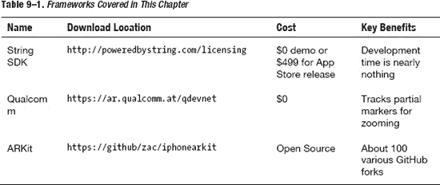

每个工具包都有其独特的优势，并且在某些情况下，与其他工具包相比，也存在一些缺点。我们将逐一讨论这些工具包，并查看一些示例。


### 基于 String 开发

让我们从 Powered by String SDK 开始。打开浏览器，访问 [`http://poweredbystring.com/developers/register`](http://poweredbystring.com/developers/register)。你应该会看到注册页面，请填写所需信息。

注册并登录后，转到 [`http://poweredbystring.com/licensing`](http://poweredbystring.com/licensing) 下载该工具包的演示版。系统会要求你提供更多信息，然后你会进入一个类似图 9-1 的页面。

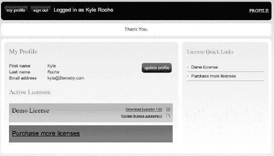

**图 9–1.** *前往 Powered by String 下载页面获取演示版。*

下载最新版本的 SDK。在本地机器上解压缩归档文件，找到 `OGL Tutorial` 目录。打开 Xcode 项目并在物理设备上运行。在电脑屏幕上打开 `Marker1.png` 文件。应用启动后，将摄像头对准标记物使其进入焦点。图 9-2 展示了运行结果。

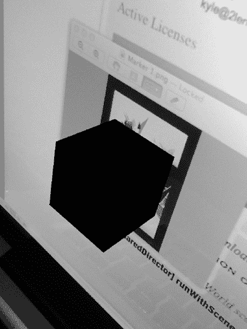

**图 9–2.** *在 String SDK 示例应用中查看标记物。*

我们将在第 10 章 中深入探讨这个应用，因此目前你不必过于担心其内容。但如果这是你第一个基于标记的增强现实应用，它可能会相当有趣。仅需几行代码，String 就能从摄像头视野中加载并捕获标记物。

### String 的基本工作流程

同样，我们将在下一章中介绍 String 的完整教程，但以下是使用 String SDK 实现 OpenGL AR 应用所需的基本步骤。

首先，你需要从源代码下载文件（即你找到示例应用的位置）中添加 `Libraries` 和 `Headers` 文件夹。你还需要 `AVFoundation`、`CoreGraphics`、`CoreMedia` 和 `CoreVideo` 框架。

String SDK 的一大优点是它可以添加到任何视图控制器（甚至其他类）中。你只需创建一个 `StringOGL` 类的实例，并实现 `StringOGLDelegate` 协议。该协议仅要求你实现一个 `render` 方法。

在初始化 String 之前，你应该像在普通 OpenGL 应用中一样设置好 `framebuffer`、`renderbuffer`、投影矩阵、视口和其他初始状态。这些工作大多由 Xcode 提供的 OpenGL ES 游戏模板为你处理。你将添加用于初始化 String 的代码，如代码清单 9-1 所示。

**代码清单 9–1.** *String 示例初始化代码*

```
stringOGL = [[StringOGL alloc] initWithDelegate: self context: myEAGLContext
frameBuffer: myFrameBuffer leftHanded: NO];
[stringOGL setProjectionMatrix: myProjectionMatrix viewport: myViewport
orientation: [self interfaceOrientation] reorientIPhoneSplash: NO];
```

String 建议你不要允许应用旋转。在我们的一些示例应用中，我们实际上也遵循了这一建议，尽管并非每个工具包都要求或推荐这样做。

String 需要使用标记物。相比之下，String 对标记物的要求最为宽松。标记物应以 PNG 文件的形式包含在你的主包中。令人惊讶的是，标记物越小，效果越好。这主要与工具包的加载时间有关，而非你想象的标记物分辨率。包含 PNG 文件后，你可以像代码清单 9-2 所示那样加载它们。

**代码清单 9–2.** *加载 String 标记物*

```
myMarkerID = [stringOGL loadImageMarker: @"MyMarker" ofType: @"png"];
```

String 在高对比度（接近白色背景上的接近黑色）标记物上表现非常出色，并且不需要高细节水平。此外，在付费版本中，String 可以同时追踪无数个标记物。String 标记物识别算法的缺点是无法追踪部分遮挡的标记物。如果标记物被任何遮挡或移出视野，String 将完全丢失该标记物。另外，String 的对象比例是基于标记物的百分比尺度设置的。例如，String 认为所有标记物的对角线长度为一个单位。因此，如果你希望标记物的对角线长度为五，则需要在投影图像之前将追踪位置乘以五。这些设置可以应用于标准的 OpenGL 变换。

正如我所提到的，协议中只有一个必需的委托方法。你需要在你的类中实现 `render` 方法。代码清单 9-3 展示了该方法的推荐格式。

**代码清单 9–3.** *render 方法的推荐格式*

```
- (void)render
{
// 读取当前帧检测到的标记物的数据
const int maxMarkerCount = 10;
struct MarkerInfoMatrixBased markerInfo[10];
!
int markerCount = [stringOGL getMarkerInfoMatrixBased: markerInfo
maxMarkerCount: maxMarkerCount];
// 遍历检测到的标记物
for (int i = 0; i < markerCount; i++)
{
// 为此图像标记物绘制相应的内容
}
}
```

要让框架运行起来，所需编写的代码并不多。你只需追踪标记物，然后遍历标记物信息。如果你使用的许可支持追踪多个标记物，你可能需要为每个标记物设置不同的操作。你可以使用 `markerInfo` 类来识别正在追踪的是哪个标记物。

每个标记物都有特定的颜色、`imageID` 和 `uniqueInstanceID`。如果你有多个相同的标记物，`uniqueInstanceID` 会很有帮助。利用此属性可以分别追踪它们。

### 额外功能

String 还为增强现实应用中可能需要的实用函数提供了一些简单的包装器。在某些情况下，例如本书后面的人脸识别示例中，我们需要直接访问帧缓冲区。String 实际上“拥有”屏幕缓冲区的委托，因此我们需要使用 `getCurrentVideoBuffer` 方法从 String 请求每一帧。该方法如代码清单 9-4 所示。

**代码清单 9–4.** *获取当前帧缓冲区*

```
- (void)getCurrentVideoBuffer: (unsigned *)buffer viewToVideoTextureTransform:
(float *)viewToVideoTextureTransform;
```

该方法会检索当前的视频纹理以及一个用于将坐标从视图空间转换到 OpenGL 纹理空间的矩阵。在我们的其他示例中，实际上并不需要所有这些信息。如果你决定要追踪标记物并分析帧缓冲区，则应在每一帧调用此方法，因为视频流是双缓冲的。

第二个有用的功能是 String 提供的用于获取屏幕缓冲区快照的便捷方法。这对于通过电子邮件发送应用截图或发布到 Facebook 等操作非常有用。代码清单 9-5 展示了这个简单的方法。

**代码清单 9–5.** *获取帧缓冲区快照*

```
- (void)takeSnapshotAndPause;
```

此方法的设置几乎类似于异步回调方法。你需要等待，直到 `handleSnapshot` 方法（你还需要实现此方法）完成后再调用 `resume` 方法。

### Unity 集成

Unity 3D 并非本书涉及的内容，但 Apress 有许多关于该主题的书籍。Unity 是一个非常强大的 3D 游戏引擎，它原生集成了 String。如果你对 Unity 感兴趣，可以直接从他们的入门项目开始，用零行代码构建一个增强现实应用。


### 高级着色器与 OpenGL 特性

如果你想了解用 `String` 可以构建出怎样的应用示例，请访问其官网上的展示页面，或从 App Store 下载示例应用程序。

`String` 能够很好地兼容更高级的着色器和光照效果。它能快速加载对象，并对标记的呈现做到近乎即时的响应。

图 9–3 展示了使用 `String` 构建的演示应用截图。该应用从标记处加载了一个 3D 台灯，并允许用户通过 Open GL ES 着色和光照效果来开关灯光。

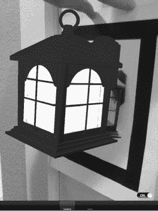

**图 9–3.** *演示版 String 应用加载了一个可开关的 3D 台灯。*

这个演示项目扩展了 `Cube` 示例（请注意图 9–3 中的第二个标签页），并为 `Lantern` 标签页渲染了一个不同的对象。源代码将在本书的 GitHub 补充资料中提供，也可从 Apress 网站的源代码/下载区域获取（[`www.apress.com`](http://www.apress.com)）。

#### Qualcomm SDK

高通在 2011 年夏末，即 iOS 5 发布前夕，推出了一个 AR SDK。高通 SDK 与 Powered by `String` SDK 截然不同，这也是我选择介绍这两个框架的原因之一。

访问高通的网站 [`https://ar.qualcomm.at`](https://ar.qualcomm.at)，注册一个免费账户。注册完成后，您可以如图 图 9–4 所示，从 `Android` 标签页切换到 `iOS` 标签页，并下载适用于 Mac 的 QCAR SDK。

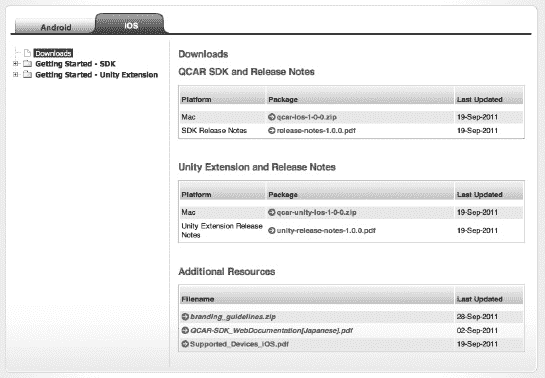

**图 9–4.** *下载 QCAR SDK。*

与 `String`（它是一个静态库加一组文件）不同，QCAR 实际上提供了一个安装程序，使库文件与您的代码保持分离。这样，当 SDK 更新时，您可以更轻松地进行升级。

**注意：** 在安装程序启动之前，您可能需要升级 Java。

解压归档文件并启动安装程序。您将看到一个类似图 9–5 所示的界面。

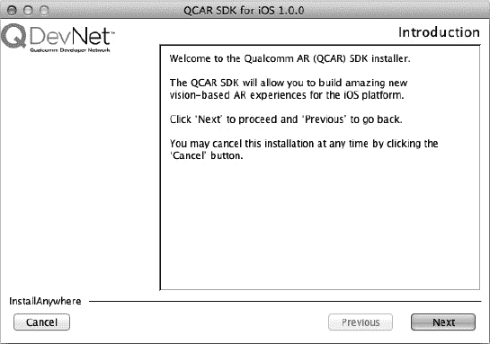

**图 9–5.** *启动安装程序。*

点击 `Next`。您应该会看到一个对话框，要求您选择工具包的安装位置。我已将其移动到我安装同类工具包的目录中，但如果您愿意，也可以选择默认位置。

接受许可协议并点击 `Next`。准备好继续后，点击 `Install`。当库安装完成后，点击 `Done` 退出安装程序。

值得提一下该库的目录结构。SDK 中包含了一些非常令人印象深刻的演示程序。请查看表 9–2，以了解包含的内容及其在安装目录中的位置。

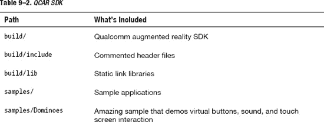

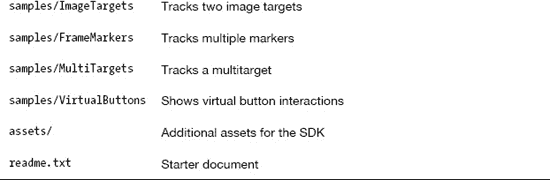

我们先从 `Dominoes` 应用开始。这个应用背后有大量的代码和数学运算，但它展示了该框架的所有功能。在 Xcode 中启动该项目，并在物理设备上运行。

确保您打印或屏幕上显示项目 `Media` 子目录中的 `stones.jpg` 文件。这是该应用的标记。将标记放在摄像头的视野内。应用会提示您缓慢地在屏幕上拖动手指。随着您的手指移动，它会构建出一组多米诺骨牌。

这就是令人惊叹之处。您可以使用菜单启用一个虚拟按钮，然后在混合现实空间中拨弄多米诺骨牌（当摄像头投影增强场景时，您的手指会出现在摄像头视野中）。

运行中的项目如图 9–6 所示。

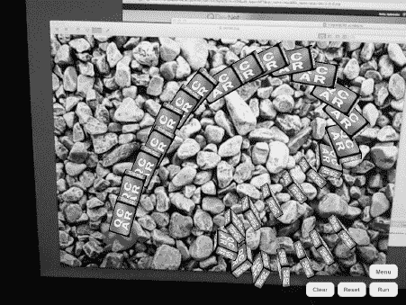

**图 9–6.** *运行 Dominoes 演示程序。*

您可以看到左侧 1 号多米诺骨牌下方有一个绿点。那就是虚拟按钮。如果用户用手指击打它，SDK 会检测到并处理该事件。在本例中，事件是让多米诺骨牌按顺序倒下。

这是一个非常了不起的 Hello World 应用程序，不是吗？让我们从头开始构建一个不那么令人印象深刻的应用，这样您就能熟悉 SDK 了。

### 构建我们自己的 QCAR 演示

在我们从头开始构建之前，先为我们的应用创建一个标记。点击 Qualcomm 网站上的 `My Trackables` 链接。点击 `New Project` 链接创建一个新项目。我将项目命名为 `Apress`。

您将进入一个类似于图 9–7 所示的界面。

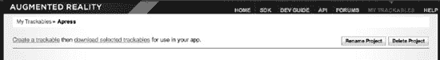

**图 9–7.** *使用 New Project 链接创建新项目。*

点击 `Create a trackable` 链接。将可追踪对象命名为 `Apress Trackable`，并将类型设置为单图像类型。将宽度设置为 `100`。

需要注意的是，宽度并不对应标记的实际宽度，标记也不会被调整为这个宽度。在标记周围的 AR 空间中，您将加载到场景中的 3D 对象相对于标记有一个尺寸比例。将此值设为 `100` 是为其他对象设定初始比较标准。您的可追踪对象应该看起来像图 9–8。

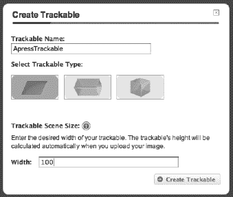

**图 9–8.** *我们创建了一个新的可追踪对象。*

现在，高通期望的标记与 `String` 截然不同。高通更倾向于使用高分辨率、细节丰富的标记，以增加其可追踪的特征点数量。标记必须包含大量微小的细节。类似教程中附带的河石示例那样的图片效果最佳。

为了对比图片，我随机在谷歌图片中搜索了“免费高分辨率壁纸”，找到了一些我认为细节度很高的图片。

我通过高通的追踪测试对其中几张进行了测试。结果通常类似图 9–9 所示。

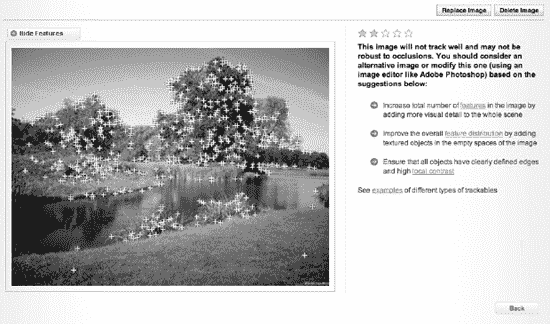

**图 9–9.** *新的可追踪对象失败了！*

如果您想设计自己的图片，请继续尝试。确保找到一张在大部分区域内都有细节的图片。我重新加载了名为 `stones.jpg` 的图片。你可以在 `Dominos` 示例应用的 `Media` 子目录中找到它。结果好了很多，如图 9–10 所示。

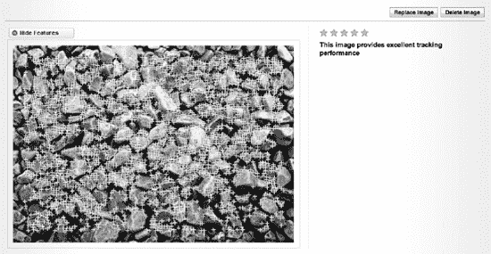

**图 9–10.** *下一个可追踪对象成功了！*

通过点击 `Back` 按钮保存可追踪对象，您将返回到 `My Trackables` 页面。现在，您的可追踪对象列表中会出现一张新图片。点击该图片，您将进入一个界面，您可以在其中选择该可追踪对象并下载它以供我们的应用使用。该界面看起来类似于图 9–11。

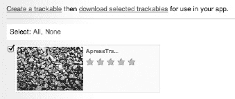

**图 9–11.** *下载可追踪对象。*

使用选择窗口顶部的链接下载可追踪对象。请确保您选择的是 SDK 下载版本，而不是 Unity 版本。该归档文件包含以下两个文件：

* `config.xml`
* `qcar-resources.dat`


##### 创建 Xcode 项目

在 Xcode 中创建一个新项目。使用“单视图应用”模板。将项目命名为 `Ch9`。确保使用自动引用计数。我的设置如图 9-12 所示。

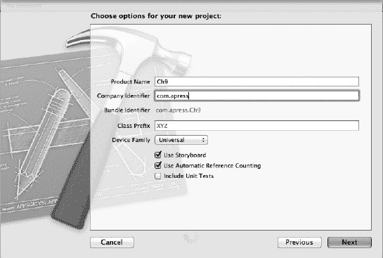

**图 9-12.** *设置项目设置。*

打开 Finder。导航至你安装 QCAR SDK 的位置。其中有一个名为 `build` 的子目录。在 Finder 中打开该目录。复制此目录（`lib` 和 `include` 文件夹）的内容到项目目录下。

打开 Xcode 项目设置页面中的 **Build Settings** 选项卡。更新 Header Paths，使其包含 `$(SRCROOT)/Ch9/include`。现在，在 Finder 中打开项目目录。将 `lib` 目录拖放到 Xcode 项目中。确保你没有选择复制资源（因为它们已经存在）。

从 GitHub 或 Apress（位于 [`www.apress.com`](http://www.apress.com) 的源代码/下载区域）上的本书源代码仓库中，将 `GLProgram.h` 和 `GLProgram.m` 复制到项目中。这些文件最初由 Jeff LaMarche 编写。它们已针对 iOS 5 自动引用计数进行了适配。

同样从源代码仓库复制 `Cube.h`。该文件由高通编写，用于测试 OpenGL ES 绘图。

最后，将 `SimpleLightShader.vsh` 和 `SimpleLightShader.fsh` 文件复制到项目中。打开 **Build Phases** 选项卡，确保这两个文件都作为 Bundle 资源被复制，如图 9-13 所示。

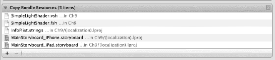

**图 9-13.** *复制 Bundle 资源。*

我们需要在项目中添加几个框架。在 Xcode 中添加以下框架：

- `OpenGLES.framework`
- `Security.framework`
- `AVFoundation.framework`
- `CoreVideo.framework`
- `CoreMedia.framework`
- `SystemConfiguration.framework`
- `QuartzCore.framework`

好了，现在我们准备添加标记文件。将从高通网站下载的两个文件复制到项目中。

正如我们在处理 String 时所见，通常建议在增强现实应用中限制设备的动态方向旋转，尤其是那些使用第三方 SDK 的应用。打开项目的 **Summary** 选项卡，确保应用仅启用 **横屏右向** 方向。

##### EAGLView

创建一个继承自 `UIView` 的新类。将其命名为 `EAGLView`。在 Xcode 中打开 `EAGLView.h`，并导入代码清单 9-6 中所示的头文件。

**代码清单 9-6.** *import 声明*

```objc
#import <OpenGLES/EAGL.h>
#import <OpenGLES/ES1/gl.h>
#import <OpenGLES/ES1/glext.h>
#import <OpenGLES/ES2/gl.h>
#import <OpenGLES/ES2/glext.h>
#import <QCAR/Tool.h>
#import <QCAR/UIGLViewProtocol.h>
#import "GLProgram.h"
```

在 `import` 声明下方，设置一个枚举来跟踪应用当前运行的状态。复制代码清单 9-7 中的代码。

**代码清单 9-7.** *状态枚举*

```objc
typedef enum _status {
    APPSTATUS_UNINITED,
    APPSTATUS_INIT_APP,
    APPSTATUS_INIT_QCAR,
    APPSTATUS_INIT_APP_AR,
    APPSTATUS_INIT_TRACKER,
    APPSTATUS_INITED,
    APPSTATUS_CAMERA_STOPPED,
    APPSTATUS_CAMERA_RUNNING,
    APPSTATUS_ERROR
} status;
```

在更新实现块之前，将 `EAGLView.m` 重命名为 `EAGLView.mm`。高通的 SDK 基于 C++，我们需要这个扩展名来访问 C++ 类。

更新 `interface` 块，如代码清单 9-8 所示。

**代码清单 9-8.** *EAGLView 接口*

```objc
@interface EAGLView : UIView <UIGLViewProtocol> {
    EAGLContext *context;    
    GLint framebufferWidth;
    GLint framebufferHeight;

    GLuint defaultFramebuffer;
    GLuint colorRenderbuffer;
    GLuint depthRenderbuffer;

    QCAR::Matrix44F projectionMatrix;
    CGRect screenRect;
    int QCARFlags;
    status appStatus;
    GLProgram *shader;
    GLint shaderPositionAttribute, shaderNormalAttribute, shaderModelViewMatrixUniform, shaderProjectionMatrixUniform, shaderColorUniform;
}
@end
```

在这里，我们首先为 OpenGL 上下文设置了一个实例变量。然后为帧缓冲区的宽度和高度，以及默认缓冲区句柄设置了一些变量。接着，我们设置了投影矩阵，用于乘以我们的 3D 坐标。正是这一行导致需要将文件名改为 `.mm`。如果你想尝试，可以改回去，但会导致构建错误。

最后，我们为屏幕尺寸、QCAR 标志以及（来自枚举的）应用状态保存了一些变量。

在头文件中声明代码清单 9-9 中的方法。

**代码清单 9-9.** *新方法声明*

```objc
- (void)renderFrameQCAR;
- (void)onCreate;
- (void)onDestroy;
- (void)onResume;
- (void)onPause;
```

第一个方法将用于渲染由 QCAR SDK 调用的帧。当应用状态发生变化时，视图控制器将调用其他方法。

在 Xcode 中切换到 `EAGLView.mm`，并添加代码清单 9-10 中的 `import` 声明。

**代码清单 9-10.** *新的 import 声明*

```objc
#import <QuartzCore/QuartzCore.h>
#import <QCAR/QCAR.h>
#import <QCAR/CameraDevice.h>
#import <QCAR/Tracker.h>
#import <QCAR/VideoBackgroundConfig.h>
#import <QCAR/Renderer.h>
#import <QCAR/Tool.h>
#import <QCAR/Trackable.h>

#import "Cube.h"
```

我们几乎需要 SDK 提供的所有功能。这意味着这里会有大量的 `import` 声明。你已经可以看出高通与 String 在使用便捷性和所需时间上的差异。不过，如果你需要 QCAR SDK 更高级的追踪功能，那么付出这些努力是值得的。

将代码清单 9-11 中的 `Private` 方法声明块添加到类中。

**代码清单 9-11.** *私有方法*

```objc
@interface EAGLView (PrivateMethods)
- (void)setFramebuffer;
- (BOOL)presentFramebuffer;
- (void)createFramebuffer;
- (void)deleteFramebuffer;
- (void)updateApplicationStatus:(status)newStatus;
- (void)bumpAppStatus;
- (void)initApplication;
- (void)initQCAR;
- (void)initApplicationAR;
- (void)loadTracker;
- (void)startCamera;
- (void)stopCamera;
- (void)configureVideoBackground;
- (void)initRendering;
@end
```


将 Listing 9–12 中的静态方法添加到实现中。OpenGL 需要此方法在图层上绘制。

**Listing 9–12.** `layerClass` 静态方法

```
+ (Class)layerClass
{
    return [CAEAGLLayer class];
}
```

我们将从故事板的视图控制器 NIB 文件加载此类，因此需要实现 `initWithCoder` 方法。复制 Listing 9–13 中的方法。

**Listing 9–13.** `initWithCoder`

```
- (id)initWithCoder:(NSCoder*)coder
{
    self = [super initWithCoder:coder];

        if (self) {
        NSLog(@"Initialising EAGLView");
        CAEAGLLayer *eaglLayer = (CAEAGLLayer *)self.layer;

        eaglLayer.opaque = TRUE;
        eaglLayer.drawableProperties = [NSDictionary dictionaryWithObjectsAndKeys:
                                        [NSNumber numberWithBool:FALSE], kEAGLDrawablePropertyRetainedBacking,
                                        kEAGLColorFormatRGBA8, kEAGLDrawablePropertyColorFormat,
                                        nil];

        context = [[EAGLContext alloc] initWithAPI:kEAGLRenderingAPIOpenGLES2];
QCARFlags = QCAR::GL_20;

NSLog(@"QCAR OpenGL flag: %d", QCARFlags);

        if (!context) {
            NSLog(@"Failed to create ES context");
        }
    }

    return self;
}
```

此代码与我们在 OpenGL ES 模板或其他 OpenGL 应用程序中通常看到的代码之间的关键区别在于 `QCAR` 标志。我们在此处设置它们，以便 SDK 知道预期什么。

复制 Listing 9–14 中的方法到实现中。

**Listing 9–14.** `createFrameBuffer` 方法

```
- (void)createFramebuffer
{
    if (context && !defaultFramebuffer) {
        [EAGLContext setCurrentContext:context];

        // Create default framebuffer object
        glGenFramebuffers(1, &defaultFramebuffer);
        glBindFramebuffer(GL_FRAMEBUFFER, defaultFramebuffer);

        // Create colour render buffer and allocate backing store
        glGenRenderbuffers(1, &colorRenderbuffer);
        glBindRenderbuffer(GL_RENDERBUFFER, colorRenderbuffer);

        // Allocate the renderbuffer's storage (shared with the drawable object)
        [context renderbufferStorage:GL_RENDERBUFFER fromDrawable:(CAEAGLLayer
*)self.layer];
        glGetRenderbufferParameteriv(GL_RENDERBUFFER, GL_RENDERBUFFER_WIDTH,
&framebufferWidth);
        glGetRenderbufferParameteriv(GL_RENDERBUFFER, GL_RENDERBUFFER_HEIGHT,
&framebufferHeight);

        // Create the depth render buffer and allocate storage
        glGenRenderbuffers(1, &depthRenderbuffer);
        glBindRenderbuffer(GL_RENDERBUFFER, depthRenderbuffer);
        glRenderbufferStorage(GL_RENDERBUFFER, GL_DEPTH_COMPONENT16, framebufferWidth,
framebufferHeight);

        // Attach colour and depth render buffers to the frame buffer
        glFramebufferRenderbuffer(GL_FRAMEBUFFER, GL_COLOR_ATTACHMENT0, GL_RENDERBUFFER,
colorRenderbuffer);
        glFramebufferRenderbuffer(GL_FRAMEBUFFER, GL_DEPTH_ATTACHMENT, GL_RENDERBUFFER,
depthRenderbuffer);

        // Leave the colour render buffer bound so future rendering operations will act
on it
        glBindRenderbuffer(GL_RENDERBUFFER, colorRenderbuffer);

        if (glCheckFramebufferStatus(GL_FRAMEBUFFER) != GL_FRAMEBUFFER_COMPLETE) {
            NSLog(@"Failed to make complete framebuffer object %x",
glCheckFramebufferStatus(GL_FRAMEBUFFER));
        }
    }
}
```

此方法以及后续的一些方法取自 OpenGL 模板。我们从 Listing 9–14 复制的方法设置了帧缓冲区，使 OpenGL 能够在图层上开始绘制。

我们还需要帧缓冲区的拆卸方法。当帧缓冲区不再需要内存时，Listing 9–15 中的方法会释放内存。

**Listing 9–15.** `deleteFrameBuffer` 方法

```
- (void)deleteFramebuffer
{
    if (context) {
        [EAGLContext setCurrentContext:context];
        if (defaultFramebuffer) {
            glDeleteFramebuffers(1, &defaultFramebuffer);
            defaultFramebuffer = 0;
        }

        if (colorRenderbuffer) {
            glDeleteRenderbuffers(1, &colorRenderbuffer);
            colorRenderbuffer = 0;
        }

        if (depthRenderbuffer) {
            glDeleteRenderbuffers(1, &depthRenderbuffer);
            depthRenderbuffer = 0;
        }
    }
}
```

复制 Listing 9–16 中的方法。此方法设置我们之前声明的 `defaultFramebuffer` 实例变量。

**Listing 9–16.** `setFrameBuffer`

```
- (void)setFramebuffer
{
    if (context) {
        [EAGLContext setCurrentContext:context];

        if (!defaultFramebuffer) {
            // Perform on the main thread to ensure safe memory allocation for
            // the shared buffer. Block until the operation is complete to
            // prevent simultaneous access to the OpenGL context
            [self performSelectorOnMainThread:@selector(createFramebuffer) withObject:self waitUntilDone:YES];
        }
        glBindFramebuffer(GL_FRAMEBUFFER, defaultFramebuffer);

    }
}
```

繁琐的工作快完成了。复制 Listing 9–17 中的方法到实现中。

**Listing 9–17.** `presentFramebuffer` 和 `layoutSubviews` 方法

```
- (BOOL)presentFramebuffer
{
    BOOL success = FALSE;

    if (context) {
        [EAGLContext setCurrentContext:context];

        glBindRenderbuffer(GL_RENDERBUFFER, colorRenderbuffer);

        success = [context presentRenderbuffer:GL_RENDERBUFFER];
    }

    return success;
}

- (void)layoutSubviews
{
    [self deleteFramebuffer];
}
```

我们刚复制的第一个方法为我们的类持有 `colorRenderbuffer` 上下文。第二个方法在 `EAGLView` 的子视图发生更改并且视图被重绘时调用。当这种情况发生时，我们要释放当前图像使用的内存。

在设置接口文件时，我们讨论过此类很可能会从外部视图控制器调用。下一组事件就是针对该视图控制器的。复制 Listing 9–18 中的方法。

**Listing 9–18.** 视图控制器的外部方法

```
- (void)onCreate
{
    NSLog(@"EAGLView onCreate()");
    appStatus = APPSTATUS_UNINITED;
    [self updateApplicationStatus:APPSTATUS_INIT_APP];
}

- (void)onDestroy
{
    NSLog(@"EAGLView onDestroy()");

    // Deinitialise QCAR SDK
    QCAR::deinit();
}

- (void)onResume
{
    NSLog(@"EAGLView onResume()");
    // QCAR-specific resume operation
    QCAR::onResume();

    if (APPSTATUS_CAMERA_STOPPED == appStatus) {
        [self updateApplicationStatus:APPSTATUS_CAMERA_RUNNING];
    }
}

- (void)onPause
{
    NSLog(@"EAGLView onPause()");
    // QCAR-specific pause operation
    QCAR::onPause();

    if (APPSTATUS_CAMERA_RUNNING == appStatus) {
        [self updateApplicationStatus:APPSTATUS_CAMERA_STOPPED];
    }
}
```

这些方法中的每一个都会在应用程序生命周期的不同时间点被调用。它们都不是很详细。每个方法都将状态更改为枚举中的特定值，并暂停、启动或恢复 `QCAR` SDK 操作。

现在，当应用程序状态发生变化时，我们也需要处理这种情况。复制 Listing 9–19 中的方法来处理应用程序状态更改。

**Listing 9–19.** 处理状态更新

```
- (void)updateApplicationStatus:(status)newStatus
{
    if (newStatus != appStatus && APPSTATUS_ERROR != appStatus) {
        appStatus = newStatus;
```


```objective-c
        switch (appStatus) {
            case APPSTATUS_INIT_APP:
                [self initApplication];
                [self updateApplicationStatus:APPSTATUS_INIT_QCAR];
                break;

            case APPSTATUS_INIT_QCAR:
                [self performSelectorInBackground:@selector(initQCAR) withObject:nil];
                break;

            case APPSTATUS_INIT_APP_AR:
                [self initApplicationAR];
                [self updateApplicationStatus:APPSTATUS_INIT_TRACKER];
                break;

            case APPSTATUS_INIT_TRACKER:
                [self performSelectorInBackground:@selector(loadTracker) withObject:nil];
                break;

            case APPSTATUS_INITED:
                QCAR::setHint(QCAR::HINT_IMAGE_TARGET_MULTI_FRAME_ENABLED, 1);
                QCAR::setHint(QCAR::HINT_IMAGE_TARGET_MILLISECONDS_PER_MULTI_FRAME, 25);
                [self updateApplicationStatus:APPSTATUS_CAMERA_RUNNING];
                break;

            case APPSTATUS_CAMERA_RUNNING:
                [self startCamera];
                break;

            case APPSTATUS_CAMERA_STOPPED:
                [self stopCamera];
                break;

            default:
                NSLog(@"updateApplicationStatus: invalid app status");
                break;
        }
    }

    if (APPSTATUS_ERROR == appStatus) {
        UIAlertView* alert = [[UIAlertView alloc] initWithTitle:@"错误"
message:@"应用程序初始化失败。" delegate:self cancelButtonTitle:@"确定"
otherButtonTitles:nil];

        [alert show];
    }
}
```

请特别注意加粗的行。第一行调用一个后台线程来初始化 QCAR。第二行在后台加载标记图像。我们尚未实现这两个方法。接下来就来完成它们。

从代码清单 9–20 中复制这两个方法。

**代码清单 9–20.** *加载标记（或可追踪对象）*

```objective-c
- (void)bumpAppStatus
{
    [self updateApplicationStatus:(status)(appStatus + 1)];
}

- (void)loadTracker
{
    int nPercentComplete = 0;

    // 后台线程必须有自己的自动释放池
    // 加载追踪器数据
    do {
        nPercentComplete = QCAR::Tracker::getInstance().load();
    } while (0 <= nPercentComplete && 100 > nPercentComplete);

    if (0 > nPercentComplete) {
        appStatus = APPSTATUS_ERROR;
    }

    // 在主线程上继续执行
    [self performSelectorOnMainThread:@selector(bumpAppStatus) withObject:nil
waitUntilDone:NO];

}
```

这些方法用于加载标记。当标记加载完成后，如加粗行所示，我们将应用状态切换到枚举中的下一项。我们引用但尚未实现的另一个选择器是 QCAR 的初始化方法。现在一次性为整个类添加这三个初始化方法。从代码清单 9–21 中将方法复制到实现中。

**代码清单 9–21.** *各种初始化方法*

```objective-c
- (void)initApplication
{
    screenRect = [[UIScreen mainScreen] bounds];

    NSLog(@"屏幕矩形 %@",screenRect);

    QCAR::onSurfaceCreated();
    QCAR::onSurfaceChanged(screenRect.size.height, screenRect.size.width);
}

- (void)initQCAR
{
    QCAR::setInitParameters(QCARFlags);

    int nPercentComplete = 0;

    do {
        nPercentComplete = QCAR::init();
    } while (0 <= nPercentComplete && 100 > nPercentComplete);

    NSLog(@"QCAR::init 百分比: %d", nPercentComplete);

    if (0 > nPercentComplete) {
        appStatus = APPSTATUS_ERROR;
    }    

    [self performSelectorOnMainThread:@selector(bumpAppStatus) withObject:nil waitUntilDone:NO];  
}

- (void)initApplicationAR
{
    [self initRendering];
}
```

第一个方法获取屏幕尺寸，为 QCAR 创建表面，并将其调整为与屏幕尺寸匹配。完成后通知 SDK（`onSurfaceCreated`）。


接下来，我们初始化 Qualcomm SDK。这一步将在后台线程中执行。完成后，我们再次推进状态枚举。

我们刚刚实现的最后一个方法用于初始化渲染。这是应用程序增强现实部分的主要 `init` 方法。

我们需要两个方法，它们将从暂停和恢复例程中被调用，用来启动和停止摄像头。这些方法见代码清单 9-22。

**代码清单 9-22.** *启动和停止摄像头视图*

```
- (void)startCamera
{
    NSLog(@"Start Camera!");
    // Initialise the camera
    if (QCAR::CameraDevice::getInstance().init()) {
        // Configure video background
        [self configureVideoBackground];

        // Select the default mode
        if (QCAR::CameraDevice::getInstance().selectVideoMode(QCAR::CameraDevice::MODE_DEFAULT)) {
            // Start camera capturing
            if (QCAR::CameraDevice::getInstance().start()) {
                // Start the tracker
                QCAR::Tracker::getInstance().start();

                // Cache the projection matrix
                const QCAR::CameraCalibration& cameraCalibration = QCAR::Tracker::getInstance().getCameraCalibration();
                projectionMatrix = QCAR::Tool::getProjectionGL(cameraCalibration, 2.0f,
2000.0f);
                [self onResume];
            }
        }
    }
}

- (void)stopCamera
{
    QCAR::Tracker::getInstance().stop();
    QCAR::CameraDevice::getInstance().stop();
    QCAR::CameraDevice::getInstance().deinit();
}
```

这些都是来自 QCAR 库的 C++ 函数。其结构与我们在 Objective-C 中使用 OpenGL 纹理处理视频的方式非常相似，但这些方法是 SDK 特定的。

我们几乎准备好测试应用程序了。在没有进行任何测试的情况下，这已经写了不少代码。

现在，让我们将视频配置为图层的背景。从代码清单 9-23 中复制该方法。

**代码清单 9-23.** *将视频配置为背景图像*

```
- (void)configureVideoBackground
{
    // Get the default video mode
    QCAR::CameraDevice& cameraDevice = QCAR::CameraDevice::getInstance();
    QCAR::VideoMode videoMode =
cameraDevice.getVideoMode(QCAR::CameraDevice::MODE_DEFAULT);

    // Configure the video background
    QCAR::VideoBackgroundConfig config;
    config.mEnabled = true;
    config.mSynchronous = true;
    config.mPosition.data[0] = 0.0f;
    config.mPosition.data[1] = 0.0f;

    // Compare aspect ratios of video and screen. If they are different
    // we use the full screen size while maintaining the video's aspect
    // ratio, which naturally entails some cropping of the video.
    // Note: screenRect is portrait but videoMode is always landscape,
    // which is why "width" and "height" appear to be reversed.
    float arVideo = (float)videoMode.mWidth / (float)videoMode.mHeight;
    float arScreen = screenRect.size.height / screenRect.size.width;

    if (arVideo > arScreen)
    {
        // Video mode is wider than the screen. We'll crop the left and right edges of
the video
        config.mSize.data[0] = (int)screenRect.size.width * arVideo;
        config.mSize.data[1] = (int)screenRect.size.width;
    }
    else
    {
        // Video mode is taller than the screen. We'll crop the top and bottom edges of the video.
        // Also used when aspect ratios match (no cropping).
        config.mSize.data[0] = (int)screenRect.size.height;
        config.mSize.data[1] = (int)screenRect.size.height / arVideo;
    }

    // Set the config
    QCAR::Renderer::getInstance().setVideoBackgroundConfig(config);
}
```

此方法直接从一个示例中复制而来。Qualcomm 将视频设置为与屏幕匹配，然后绘制摄像头所见的画面作为我们的背景。

接下来，为 OpenGL 的光照设置加载着色器。从代码清单 9-24 中复制该方法。

**代码清单 9-24.** *加载测试着色器*

```
-(void)loadShaders {
    // Loading shaders for light only

    shader = [[GLProgram alloc] initWithVertexShaderFilename:@"SimpleLightShader"
fragmentShaderFilename:@"SimpleLightShader"];
    [shader addAttribute:@"a_position"];
    [shader addAttribute:@"a_texCoord"];
    [shader addAttribute:@"a_normal"];

    if (![shader link])
    {
        // Compilation failed
        NSLog(@"light shader link failed");
        NSString *progLog = [shader programLog];
        NSLog(@"Program Log: %@", progLog);
        NSString *fragLog = [shader fragmentShaderLog];
        NSLog(@"Frag Log: %@", fragLog);
        NSString *vertLog = [shader vertexShaderLog];
        NSLog(@"Vert Log: %@", vertLog);
        shader = nil;
    } else {
        NSLog(@"Light Shader compiled successfuly!");
    }

    shaderPositionAttribute = [shader attributeIndex:@"a_position"];
    shaderNormalAttribute   = [shader attributeIndex:@"a_normal"];
    shaderColorUniform = [shader uniformIndex:@"a_color"];
    shaderModelViewMatrixUniform = [shader uniformIndex:@"modelViewMatrix"];
    shaderProjectionMatrixUniform = [shader uniformIndex:@"projectionMatrix"];
}
```

在将 `EAGLView` 类接入替换应用程序的 `UIView` 之前，我们还有两个任务需要完成。我们需要初始化 OpenGL 渲染，然后渲染帧。你可以在代码清单 9-25 中找到这两个方法。

**代码清单 9-25.** *初始化 OpenGL 渲染并渲染帧*

```
- (void)initRendering
{
    // Define the clear colour
    glClearColor(0.0f, 0.0f, 0.0f, QCAR::requiresAlpha() ? 0.0f : 1.0f);

    [self loadShaders];
}

- (void)renderFrameQCAR
{
    [self setFramebuffer];

    // Clear colour and depth buffers
    glClear(GL_COLOR_BUFFER_BIT | GL_DEPTH_BUFFER_BIT);

    QCAR::State state = QCAR::Renderer::getInstance().begin();

    glEnable(GL_DEPTH_TEST);
    glEnable(GL_CULL_FACE);

    for (int i = 0; i < state.getNumActiveTrackables(); ++i) {
        // Get the trackable
        const QCAR::Trackable* trackable = state.getActiveTrackable(i);
        QCAR::Matrix44F modelViewMatrix = QCAR::Tool::convertPose2GLMatrix(trackable-
>getPose());

        [shader use];

        float Sash_Kd [] = {0.589414,0.042139,0.042139};
        // Set the sampler texture unit to 0
        glUniformMatrix4fv(shaderProjectionMatrixUniform, 1, 0, &projectionMatrix.data[0]);
        glUniformMatrix4fv(shaderModelViewMatrixUniform, 1, 0, &modelViewMatrix.data[0]);
        glUniform3fv(shaderColorUniform, 1, Sash_Kd);

        glVertexAttribPointer(shaderPositionAttribute, 3, GL_FLOAT, GL_FALSE, 0, (const
GLvoid*)&cubeVertices[0]);
        glVertexAttribPointer(shaderNormalAttribute, 3, GL_FLOAT, GL_FALSE, 0, (const
GLvoid*)&cubeNormals[0]);

        glEnableVertexAttribArray(shaderPositionAttribute);
        glEnableVertexAttribArray(shaderNormalAttribute);

        glDrawElements(GL_TRIANGLES, NUM_CUBE_INDEX, GL_UNSIGNED_SHORT, (const GLvoid*)&cubeIndices[0]);
    }

    glDisable(GL_DEPTH_TEST);
    glDisable(GL_CULL_FACE);

    QCAR::Renderer::getInstance().end();
    [self presentFramebuffer];

}
```

第一个方法加载着色器并定义一个清除颜色，供我们在图层中引用。OpenGL 渲染初始化完成后，我们就可以绘制 QCAR 帧了。

在此方法中，我们遍历已找到的可追踪物体数组，这与我们在 String SDK 中所做的十分相似，然后在可追踪物体正上方的 3D 空间中渲染立方体。你可以将此代码块替换为任何 OpenGL 渲染例程。


### 重定向 `UIView`

将 `ViewController.m` 的文件名改为 `ViewController.mm`。我们之前对 `EAGLView` 类也做过同样的操作。由于我们需要访问 Qualcomm SDK 的 C++ 函数，因此编译器要求使用此文件名。

打开 `ViewController.mm`，导入 `EAGLView.h` 头文件。更新 `viewDidLoad` 方法，如代码清单 9-26 所示。

**代码清单 9–26.** *新的 `viewDidLoad`*

```objectivec
- (void)viewDidLoad
{
    [super viewDidLoad];

    EAGLView * eaglview = (EAGLView*) self.view;
    [eaglview onCreate];
    // 加载视图后的其他设置，通常来自 nib 文件
}
```

我们创建了一个新的 `EAGLView` 实例，并通知该类它已被创建。更新 `viewWillAppear` 和 `viewWillDisappear` 方法，如代码清单 9-27 所示。

**代码清单 9–27.** *新的 `viewWillAppear` 和 `viewWillDisappear`*

```objectivec
- (void)viewWillAppear:(BOOL)animated
{
    [super viewWillAppear:animated];
    EAGLView * eaglview = (EAGLView*) self.view;
    [eaglview onResume];
}

- (void)viewWillDisappear:(BOOL)animated
{
    [super viewWillDisappear:animated];
    EAGLView * eaglview = (EAGLView*) self.view;
    [eaglview onPause];
}
```

呼！我们成功了。好了，我们还需要做一些额外工作来确保我们的类确实被用到了。打开一个（或两个）故事板，将背景中的 `UIView` 的类更新为 `EAGLView`，如图 9-14 所示。

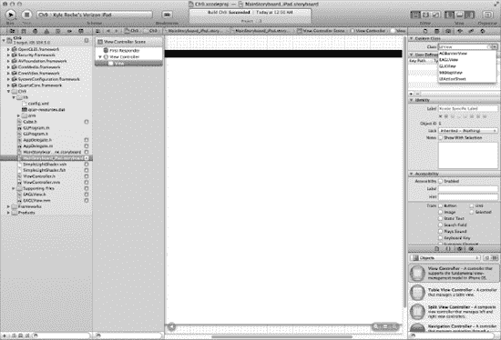

**图 9–14.** *将 `UIView` 的类更新为 `EAGLView`。*

好了，现在你可以运行项目了。别忘了打印标记，或者将其显示在屏幕上。如果你只是从本书的源代码仓库中加载了配置文件，可以在 Qualcomm 下载目录下的 `/Samples/Dominos/media` 中找到该标记。

应用程序应以单个视图启动，显示一个全屏摄像头。将摄像头对准标记，你将看到类似于图 9-15 的画面。

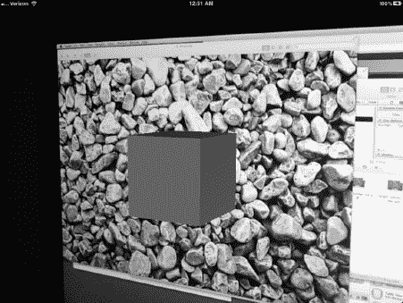

**图 9–15.** *演示应用成功了！*

老实说，我运行这个程序时还挺紧张的。在测试之前，从一章中复制了这么多代码。恭喜你！如果你想让这个应用更有趣一些，可以用其他示例应用中的 OpenGL 渲染方法来替换。如果你想学习更多关于 OpenGL 的知识，可以查阅 Apress 出版社的相关书籍（[`www.apress.com`](http://www.apress.com)）。

### ARKit

ARKit 是一个由 Zac White 发起的古老 GitHub 项目。我之所以提到这个项目，是因为我（和其他 100 个人）因它的一些实用功能而 fork 了该仓库。我在第 11 章的基于位置的 AR 中使用了它的一些片段。如果你打算从头开始构建一些东西，可以浏览 [`www.github.com`](http://www.github.com) 上的各种 fork。此外，社会化编程也很有趣。

### 总结

还有很多我没提到的其他 SDK 和工具包。这主要是因为它们的文档已经非常完善了。例如，Metaio 在网上已有大量的示例项目和文档。String 于 2011 年夏季发布，但（在撰写本文时）其网站上仍然没有文档。Qualcomm 在 iOS 5 发布前发布了他们的 SDK。他们在开发者门户网站上提供了一些文档，SDK 中也包含一些很棒的示例，但这只是刚刚开始。

我希望你通过本章了解了一些可用的辅助库，从而缩短你的应用开发时间。在第 10 章中，我们将使用 String 构建另一个基于标记的 AR 应用。你将有机会比较两个出色的工具包及其截然不同的实现风格。

## 第 10 章

## 使用 OpenGL ES 构建基于标记的 AR 应用

在第 9 章中，我们了解了一些可用于 iOS 开发者构建增强现实应用的不同 SDK。在本章中，我们将从其中一个 SDK，即 String SDK for iOS 开始，构建一个基于标记的增强现实应用。

增强现实标记是物理标识符，用于指示应用如何根据物理世界进行定位和缩放。例如，在第 1 章中，我展示了一个示例，说明美国邮政服务如何使用标记来定位和缩放运输容器。你也可以在自己的应用中实现同样的功能。

在你的应用中使用标记的优势在于，你可以为物理世界中已存在的事物增加价值。例如，考虑你有一个预算有限的客户，他运营纸质期刊。使用现有的广告或徽标之一，你可以将 3D 广告带入现实。除了增加价值之外，这还为客户提供了进一步将其广告客户货币化的机会。

广告是基于标记的增强现实的一个绝佳用例。我们将通过一个真实示例来扩展这个用例。

### 构建标记

标记具有一些特性，以确保使用它们的应用能正确运行。首先，AR 标记应该只有一个正确的方向。你应该能够清楚地分辨标记是倒置的还是侧向的。方形标记效率不高，因为应用将无法确定其正确的方向。其次，AR 标记应由高对比度、独特的图像构成。使用黑白，或任何在低光环境下能相互区分的颜色。在大多数情况下，如果你打印标记，应注意眩光和反光表面。

#### 我们的标记

对于这个示例，我已将标记包含在我们的 GitHub 仓库中。本章的所有代码都可以在 [`https://github.com/kyleroche/Professional_iOS_AugmentedReality`](https://github.com/kyleroche/Professional_iOS_AugmentedReality) 找到。源代码也可以从 Apress 网站的源代码/下载区域获取，网址是 [`www.apress.com`](http://www.apress.com)。

我们将使用本书的封面作为我们的 AR 标记。假设在印刷过程中图像没有更改，这应该会使测试稍微容易一些，因为你将无需打印任何东西。

为了投影 3D 模型，我们将使用 OpenGL ES（嵌入式系统 OpenGL）。Xcode 提供了一个现成的 OpenGL 游戏模板。然而，出于教学目的，让我们从头开始构建这个应用。在开始之前，让我们先了解一下 OpenGL 的基本特性。

#### OpenGL ES

OpenGL ES 是一种底层、轻量级的 API，用于使用定义良好的 OpenGL 子集配置文件进行高级嵌入式图形处理。它在软件应用程序与硬件或软件图形引擎之间提供了一个底层 API。

作为开发者，使用 OpenGL ES 有很多优势：

*   **行业标准且免版税：** 任何人都可以下载 OpenGL ES 规范，并基于 OpenGL ES 实现和交付产品。
*   **占用空间小且功耗低：** 嵌入式空间在处理能力上各不相同。OpenGL ES 通过要求最小的占用空间和最小的数据存储来适应这些差异。
*   **可扩展且持续演进：** OpenGL 的扩展机制可在 OpenGL ES 中运行，因此你可以随着新硬件配置文件的出现而添加它们。
*   **易于使用且文档完善：** OpenGL 是 OpenGL ES 的基础。网上和出版物中有大量的培训材料。

无论是本书还是本章，都不会让你成为 OpenGL ES 的专家。但是，我们会记录用于构建此应用的功能特性，如果你还想了解有关 iOS 上 3D 编程的更多信息，我会推荐一些你可以查阅的资料。


### 创建项目

打开 Xcode 并新建一个项目。使用`Single View Application`模板可以获得一些默认的项目设置。请确保选择`Universal`作为`设备系列`。`自动引用计数`选项保持启用即可。

### 添加 String SDK

将从 String 下载的压缩包解压到本地计算机的某个目录中。从`Libraries`文件夹中，将`libStringOGL*.a`复制到你的 Xcode 项目中。从`Headers`文件夹中，将`StringOGL.h`和`TrackerOutput.h`复制到你的 Xcode 项目中。这就是使用 String SDK 所需的全部内容。接下来我们添加项目依赖项，然后会回来介绍如何使用 String SDK。

#### 项目依赖项

我们需要向 Xcode 项目添加几个框架，以确保 String SDK 拥有所需的资源。在 Xcode 导航器中点击项目名称。切换到`构建阶段`选项卡，并在`与二进制文件链接`部分添加`QuartzCore`、`OpenGLES`、`AVFoundation`、`CoreGraphics`、`CoreMedia`和`CoreVideo`框架。

从`构建阶段`选项卡切换到`构建设置`选项卡。找到名为`其他链接器标志`的配置项。输入`–lstdc++`作为其值。参考图 10–1 查看我们目前完成的设置。

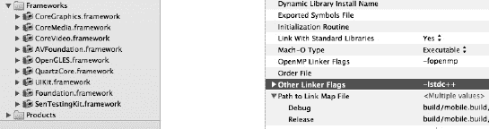

**图 10–1.** *我们已正确设置框架和链接器标志。*

##### EAGLView

在之前版本的 Xcode 中，OpenGL 模板包含`EAGLView`模板。Xcode 4.2 与 iOS 5 一起引入了一个新的 OpenGL 游戏模板，并移除了之前的 OpenGL 应用程序模板。这个新模板不再提供旧版本中使用的`EAGLView`文件。因此，我们需要自己创建这些文件。在 iOS 4.3 模板中，自动引用计数尚不可用。我们也需要将其添加到项目中。

在 Xcode 项目中新建一个 Objective-C 类。将类命名为`EAGLView`。暂时将其设为`NSObject`的子类。稍后我们会修改这一点。

在 Xcode 中打开`EAGLView.h`，移除现有的`import`语句。添加代码清单 10–1 中的新`import`语句。

**代码清单 10–1.** *import 语句*

```
#import <UIKit/UIKit.h>
#import <OpenGLES/ES1/gl.h>
#import <OpenGLES/ES1/glext.h>
#import <OpenGLES/ES2/gl.h>
#import <OpenGLES/ES2/glext.h>
@class EAGLContext;
```

接下来，修改接口声明，使`EAGLView`继承自`UIView`而非`NSObject`。我们将声明一些与用于渲染 3D 对象的帧缓冲区相关的属性。将`EAGLView.h`类更新为代码清单 10–2 中的代码。

**代码清单 10–2.** *EAGLView 的更新后@interface*

```
@interface EAGLView : UIView {
    GLint framebufferWidth;
    GLint framebufferHeight;

    GLuint defaultFramebuffer, colorRenderbuffer;
    GLuint depthRenderbuffer;
}

@property (nonatomic, retain) EAGLContext *context;
@property (nonatomic, readonly) GLuint defaultFramebuffer;
@property (nonatomic, readonly) GLint framebufferWidth;
@property (nonatomic, readonly) GLint framebufferHeight;

- (void)setFrameBuffer;
```

大部分代码与之前的 iOS 4.3 模板非常接近。为了简洁起见，我们做了一些精简。切换到`EAGLView.m`，并添加代码清单 10–3 中的`import`语句。

**代码清单 10–3.** *导入 QuartzCore 库*

```
#import <QuartzCore/QuartzCore.h>
```

接下来，我们需要为类声明几个私有方法。在`import`语句下方、实现块上方，添加代码清单 10–4 中的代码。

**代码清单 10–4.** *私有方法*

```
@interface EAGLView (PrivateMethods)
- (void)createFramebuffer;
- (void)deleteFramebuffer;
@end
```

稍后我们会实现这些方法。首先，让我们设置类的基本结构。我们需要合成添加到接口中的属性。在`EAGLView.m`的实现块内，添加代码清单 10–5 中的代码。

**代码清单 10–5.** *合成属性*

```
@synthesize context;
@synthesize framebufferWidth;
@synthesize framebufferHeight;
@synthesize defaultFramebuffer;
```

`CAEGLLayer`类负责支持 iOS 应用中 OpenGL 内容的绘制。由于我们使用 OpenGL 渲染 3D 对象，因此需要引用`CAEGLLayer`类。在`@synthesize`语句之后，创建代码清单 10–6 中的静态方法。

**代码清单 10–6.** *OpenGL 应用所需的 layerClass 方法*

```
+ (Class)layerClass {
    return [CAEAGLLayer class];
}
```

在设置图层的关联视图之前，我们必须更改要使用的渲染属性。`drawableProperties`属性允许你配置渲染表面和内容的颜色格式。我们将在`init`方法中设置此属性的值。将代码清单 10–7 中的方法复制到实现中。

**代码清单 10–7.** *initWithCoder 方法*

```
- (id)initWithCoder:(NSCoder*)coder
{
    self = [super initWithCoder:coder];
        if (self) {
        CAEAGLLayer *eaglLayer = (CAEAGLLayer *)self.layer;
```


```objectivec
eaglLayer.opaque = TRUE;
eaglLayer.drawableProperties = [NSDictionary dictionaryWithObjectsAndKeys:
                                [NSNumber numberWithBool:FALSE], kEAGLDrawablePropertyRetainedBacking,
                                kEAGLColorFormatRGBA8, kEAGLDrawablePropertyColorFormat,
                                nil];
}

return self;
}
```

加粗的代码是我们为此渲染设置`drawableProperties`的部分。有关 OpenGL 颜色和格式选项的更多信息，请参考 *Pro OpenGL ES for iOS*（Apress），该书可在 [www.apress.com/mobile/ios/9781430238409](http://www.apress.com/mobile/ios/9781430238409) 找到。

由于渲染表面是通过 Core Animation 呈现给用户的，因此你应用的任何效果或动画都会影响将渲染给用户的 3D 内容。苹果文档推荐以下最佳实践：

- 将图层的 `opaque` 属性设置为 `TRUE`。
- 将图层的 `bounds` 设置为与显示尺寸匹配。
- 确保图层未变形。
- 避免在 `CAEGLLayer` 对象之上绘制其他图层。其他非 OpenGL 内容可能会对性能产生负面影响。
- 在竖屏显示器上绘制横屏内容时，应自行旋转内容，而不是使用 `CAEGLLayer` 的 transform 属性。

既然我们已经了解了一些基本原理和最佳实践，让我们来创建 OpenGL 图层。我们在接口文件中声明了几个方法。将代码清单 10–8 中的代码添加到实现中。

**代码清单 10–8.** *setContext 方法*

```objectivec
- (void)setContext:(EAGLContext *)newContext
{
    if (context != newContext) {
        [self deleteFramebuffer];

        context = newContext;

        [EAGLContext setCurrentContext:nil];
    }
}
```

此方法将从父`UIViewController`中的`viewDidLoad`方法调用。在设置帧缓冲区之前，我们将使用它来设置 OpenGL 上下文。复制代码清单 10–9 中的代码来设置帧缓冲区。

**代码清单 10–9.** *createFrameBuffer 方法*

```objectivec
- (void)createFramebuffer
{
    if (context && !defaultFramebuffer) {
        [EAGLContext setCurrentContext:context];

        // 1
        if ([self respondsToSelector:@selector(setContentScaleFactor:)]) {
            float screenScale = [UIScreen mainScreen].scale;

            self.contentScaleFactor = screenScale;
        }

        // 2
        glGenFramebuffers(1, &defaultFramebuffer);
        glBindFramebuffer(GL_FRAMEBUFFER, defaultFramebuffer);

        // 3
        glGenRenderbuffers(1, &colorRenderbuffer);
        glBindRenderbuffer(GL_RENDERBUFFER, colorRenderbuffer);
        [context renderbufferStorage:GL_RENDERBUFFER fromDrawable:(CAEAGLLayer *)self.layer];
        glGetRenderbufferParameteriv(GL_RENDERBUFFER, GL_RENDERBUFFER_WIDTH, &framebufferWidth);
        glGetRenderbufferParameteriv(GL_RENDERBUFFER, GL_RENDERBUFFER_HEIGHT, &framebufferHeight);

        glFramebufferRenderbuffer(GL_FRAMEBUFFER, GL_COLOR_ATTACHMENT0, GL_RENDERBUFFER, colorRenderbuffer);

        // 4
        glGenRenderbuffers(1, &depthRenderbuffer);
        glBindRenderbuffer(GL_RENDERBUFFER, depthRenderbuffer);
        glRenderbufferStorage(GL_RENDERBUFFER, GL_DEPTH_COMPONENT16, framebufferWidth, framebufferHeight);

        glFramebufferRenderbuffer(GL_FRAMEBUFFER, GL_DEPTH_ATTACHMENT, GL_RENDERBUFFER, depthRenderbuffer);

        if (glCheckFramebufferStatus(GL_FRAMEBUFFER) != GL_FRAMEBUFFER_COMPLETE)
            NSLog(@"无法完成帧缓冲区对象 %x", glCheckFramebufferStatus(GL_FRAMEBUFFER));
    }
}
```

这个方法稍微复杂一些。请查看加粗的注释，我们将逐一解析每个部分。标记为“1”的注释用于处理 OpenGL 图层的缩放。我们基本上将其设置为与屏幕缩放比例一致。第“2”部分创建了默认的 `Framebuffer` 对象。第“3”部分创建了一个颜色缓冲区，并为上下文分配了缓冲区存储空间。最后一部分，第“4”部分，创建了深度缓冲区并将其附加。

对于基于标记的增强现实应用，这段代码大部分是相同的。通常只需替换标记图像以及渲染层中的一些矩阵即可。

我们已经创建了处理帧缓冲区的方法。还需要设置一些方法来清理这些对象。将代码清单 10–10 中的代码添加到实现中。

**代码清单 10–10.** *deleteFramebuffer（和 dealloc）方法*

```objectivec
- (void)deleteFramebuffer
{
    if (context) {
        [EAGLContext setCurrentContext:context];

        if (defaultFramebuffer) {
            glDeleteFramebuffers(1, &defaultFramebuffer);
            defaultFramebuffer = 0;
        }

        if (colorRenderbuffer) {
            glDeleteRenderbuffers(1, &colorRenderbuffer);
            colorRenderbuffer = 0;
        }
    }
}
- (void)dealloc
{
    [self deleteFramebuffer];
}
```

这些包装方法会检查上下文以确定应移除哪种类型的缓冲区，然后移除该特定缓冲区。我们还在`dealloc`中添加了对该方法的调用。最后，我们需要一个将帧缓冲区绑定到视图的方法。复制代码清单 10–11 中的代码。

**代码清单 10–11.** *setFramebuffer 方法*

```objectivec
- (void)setFramebuffer
{
    if (context) {
        [EAGLContext setCurrentContext:context];

        if (!defaultFramebuffer)
            [self createFramebuffer];

        glBindFramebuffer(GL_FRAMEBUFFER, defaultFramebuffer);

        glViewport(0, 0, framebufferWidth, framebufferHeight);
    }
}
```

此方法的最后两行是唯二需要注意的行。第一行将帧缓冲区绑定到图层。第二行设置图层的定位，从屏幕左上角 (0,0) 开始，并扩展到已定义帧缓冲区的宽度和高度。

这就是我们需要在 `EAGLView` 类中更改的全部内容。接下来，确保我们的视图使用了这个新类。

对于我们的每个故事板文件，`MainStoryboard_iPhone.storyboard` 和 `MainStoryboard_iPad.storyboard`，我们需要将 `View` 设置为自定义类 `EAGLView`。具体设置方法请参见图 10–2 的详细说明。

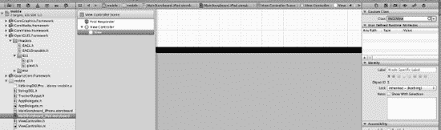

**图 10–2.** *将视图设置为我们的 EAGLView 类。*

在左侧的导航器中，我选择了故事板。然后展开 `View Controller` 并选择其默认的 `View`。在右侧的 `Identity Inspector` 选项卡中，我们为此 `View` 选择了新的 `EAGLView` 类。请确保对两个故事板都重复此步骤。

既然我们已经确认视图设置正确，让我们进行必要的更改。


#### 创建 AR 视图控制器

在 Xcode 中打开 `ViewController.h`。首先，我们需要导入所需的头文件来设置视图。列表 10–12 显示了该类所需的 `import` 语句。

**列表 10–12.** *ViewController 的 import 语句*

```
#import "StringOGL.h"
#import <OpenGLES/EAGL.h>
#import <OpenGLES/ES1/gl.h>
#import <OpenGLES/ES1/glext.h>
#import <OpenGLES/ES2/gl.h>
#import <OpenGLES/ES2/glext.h>
```

接下来，我们必须将 `ViewController` 指定为 `StringOGLDelegate` 类。在这样做的同时，让我们也定义实例变量。将列表 10–13 的代码复制到接口块中。

**列表 10–13.** *实例变量*

```
@interface ViewController : UIViewController <StringOGLDelegate> {
    EAGLContext *context;
    StringOGL *stringOGL;
    float projectionMatrix[16];
    BOOL animating;
}
```

接下来，定义列表 10–14 中所示的方法。

**列表 10–14.** *实例方法*

```
- (void)startAnimation;
- (void)stopAnimation;
```

我将在本章后面实现这些方法时解释它们及其作用。切换到 `ViewController.m`。我们需要添加的第一个方法是为我们的 3D 对象创建一个标准投影矩阵。这个方法几乎是可能的最基本的投影矩阵。它稍微模仿了 `glFrustum` 规范。`glFrustum` 描述了一个产生透视投影的透视矩阵。这是通过将当前矩阵乘以 `glFrustum` 矩阵，然后用结果矩阵替换当前矩阵来完成的。在 `didReceiveMemoryWarning` 方法之前，添加列表 10–15 中的代码。

**列表 10–15.** *创建投影矩阵*

```
- (void)createProjectionMatrix: (float *)matrix verticalFOV: (float)verticalFOV aspectRatio: (float)aspectRatio nearClip: (float)nearClip farClip: (float)farClip
{
        memset(matrix, 0, sizeof(*matrix) * 16);

        float tan = tanf(verticalFOV * M_PI / 360.f);

        matrix[0] = 1.f / (tan * aspectRatio);
        matrix[5] = 1.f / tan;
        matrix[10] = (farClip + nearClip) / (nearClip - farClip);
        matrix[11] = -1.f;
        matrix[14] = (2.f * farClip * nearClip) / (nearClip - farClip);
}
```

关于此方法的具体细节，我再次推荐您参考 Apress 出版的 iOS OpenGL 编程书籍 (*Pro OpenGL ES for iOS*)。然而，在阅读此方法时，请记住深度缓冲区精度会受到 `nearClip` 和 `farClip` 值的影响。随着 `farClip` 与 `nearClip` 的比率增加，深度缓冲区对于视图中彼此接近的表面之间的区分度会降低。`nearClip` 永远不能设置为零，因为当 `nearClip` 接近零时，乘数会接近无穷大。

我们在头文件中定义了两个方法，接下来将完成它们。但是，在继续之前，将 `EAGLView` 头文件导入到 `ViewController.h` 中。然后，将列表 10–16 中的代码添加到 `ViewController`。

**列表 10–16.** *动画开始和停止方法*

```
- (void)startAnimation
{
    if (!animating) {
        [stringOGL resume];
        animating = TRUE;
    }
}

- (void)stopAnimation
{
    if (animating) {
        [stringOGL pause];
        animating = FALSE;
    }
}
```

对于实现 `StringOGLDelegate` 协议的类，只有一个必需的方法，那就是渲染方法。此方法处理 String SDK 在识别到潜在标记后将要执行的操作。将列表 10–17 中的方法添加到 `ViewController`。

**列表 10–17.** *渲染 3D 对象*

```
- (void)render
{
    [(EAGLView *)self.view setFramebuffer];

    static const GLfloat squareVertices[] = {
        -0.33f, -0.33f,
        0.33f, -0.33f,
        -0.33f,  0.33f,
        0.33f,  0.33f,
    };

    static const GLubyte squareColors[] = {
        255, 255,   0, 255,
        0,   255, 255, 255,
        0,     0,   0,   0,
        255,   0, 255, 255,
    };

        const int maxMarkerCount = 10;
        struct MarkerInfoMatrixBased markerInfo[10];

        int markerCount = [stringOGL getMarkerInfoMatrixBased: markerInfo maxMarkerCount: maxMarkerCount];
    for (int i = 0; i < markerCount; i++)
{
        glMatrixMode(GL_PROJECTION);
        glLoadMatrixf(projectionMatrix);

        glMatrixMode(GL_MODELVIEW);
        glLoadIdentity();
        glMultMatrixf(markerInfo[i].transform);

        glVertexPointer(2, GL_FLOAT, 0, squareVertices);
        glEnableClientState(GL_VERTEX_ARRAY);
        glColorPointer(4, GL_UNSIGNED_BYTE, 0, squareColors);
        glEnableClientState(GL_COLOR_ARRAY);

        glDrawArrays(GL_TRIANGLE_STRIP, 0, 4);        

    }
}
```

这个方法有几个用途。首先，我们设置渲染位置的顶点以及颜色。接下来，我们设置 String SDK 将识别的标记的数量限制。我们将其设置为 10。我们创建一个 `struct` 来在识别到 `MarkerInfo` 时与其联系，然后我们循环遍历 `getMarkerInfoMatrixBased` 方法的结果。此方法将使用我们项目中加载的任何图像文件，并尝试在摄像头视图中识别它们。

在循环中，我们有标准的 OpenGL 代码。此示例打印出一个标准的 OpenGL 立方体，就像我们在 iOS 4.3 模板中看到的那样。在更新我们的 `viewDidLoad` 方法之前，更改类使其仅在竖屏模式下渲染。如列表 10–18 所示更新 `shouldAutorotateToInterfaceOrientation` 方法。

**列表 10–18.** *仅允许竖屏方向*

```
return (interfaceOrientation == UIInterfaceOrientationPortrait);
```

我们快完成了。但是，在测试应用程序之前，我们需要更新 `viewDidLoad` 方法。使用列表 10–19 中的代码更新该方法。

**列表 10–19.** *更新后的 viewDidLoad*

```
- (void)viewDidLoad
{
    [super viewDidLoad];
    animating = NO;

    EAGLContext *aContext = [[EAGLContext alloc] initWithAPI:kEAGLRenderingAPIOpenGLES1];

    if (!aContext)
        NSLog(@"Failed to create ES context");
    else if (![EAGLContext setCurrentContext:aContext])
        NSLog(@"Failed to set ES context current");

    context = aContext;

    EAGLView *eaglView = (EAGLView *)self.view;

    [(EAGLView *)self.view setContext:context];
    [(EAGLView *)self.view setFrameBuffer];

    int viewport[4] = {0, 0, eaglView.framebufferWidth, eaglView.framebufferHeight};
    viewport[1] = (eaglView.framebufferHeight - viewport[3]) / 2;

    glViewport(viewport[0], viewport[1], viewport[2], viewport[3]);

    float aspectRatio = viewport[2] / (float)viewport[3];

    [self createProjectionMatrix: projectionMatrix verticalFOV: 47.22f aspectRatio: aspectRatio nearClip: 0.1f farClip: 100.f];

// Initialize String
stringOGL = [[StringOGL alloc] initWithDelegate: self context: aContext
frameBuffer:[eaglView defaultFramebuffer] leftHanded: NO];

[stringOGL setProjectionMatrix:projectionMatrix viewport:viewport orientation:[self interfaceOrientation] reorientIPhoneSplash:YES];

// Load image markers
[stringOGL loadImageMarker: @"bookcover" ofType: @"png"];

}
```

此方法的前半部分使用我们在本章中已创建的方法设置 OpenGL 上下文。粗体代码行特定于 String SDK。首先，我们使用 `self` 作为 `delegate` 初始化 String，并创建适当的帧缓冲区。接下来，我们设置投影矩阵。最后，我们加载标记。如果您有多个标记，可以在此处全部添加。


### 最终代码更新

我们的最终代码更新涉及`viewWillAppear`和`viewWillDisappear`方法。按照列表 10–20 所示更新它们。

**列表 10–20.** *启动和停止动画*

```objc
- (void)viewWillAppear:(BOOL)animated
{
    [self startAnimation];

    [super viewWillAppear:animated];
}

- (void)viewWillDisappear:(BOOL)animated
{
    [self stopAnimation];

    [super viewWillDisappear:animated];
}
```

`String`实际上不会启动，直到第一次调用`resume`方法。如果你还记得，我们在`startAnimation`包装器中引用了这个方法。这就是我们将其放在`viewWillAppear`方法中的原因。

在物理设备上运行项目。因为我们将其构建为通用程序，它应该可以在 iPad 或 iPhone 设备上正常运行。确保将相机对准书籍或屏幕上的图像。你将看到类似于图 10–3 的效果。

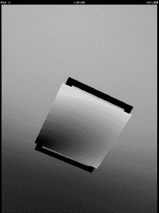

**图 10–3.** *查看我们的 AR 标记应用运行效果。*

### 总结

在第 9 章中，我们讨论了市场上可用于构建增强现实应用的开发工具包。在大多数情况下，围绕对象识别重新发明轮子并不是资源的最佳利用方式。这些工具包的价值主张在于处理基础性工作，让你专注于应用中的业务层或功能。

在本章中，我们从单视图应用开始，构建了一个基于标记的增强现实应用，该应用由 String 的 AR SDK 驱动。我们只是浅尝了 OpenGL 和 3D 建模，但学到的知识足以为进一步开发更复杂的应用奠定基础。

在第 11 章中，我们将转向社交媒体，构建一个基于地理坐标渲染社交数据的增强现实应用。

