# 构建社交 AR 应用

在第 10 章中，我们讨论了使用 String SDK 的基于标记的增强现实应用。由于手持设备识别标记需要处理能力，基于位置的 AR 应用比基于标记的 AR 应用出现得更早。

在本章中，我们将以更传统的方式审视 AR 应用，并构建一个更接近最初在 AppStore 和 Android Market 上引发革命的原生应用。

我们将构建一个支持 GPS 的 AR 应用，用于查找附近的 Facebook 地点。

### 开始设置

首先，我们需要确保已经为围绕 Facebook Open Graph 开发应用做好了准备。这个过程有几个步骤。它们主要包括：

*   创建一个 Facebook 应用
*   克隆 Facebook iOS SDK GitHub 仓库
*   为应用启用单点登录

#### 创建 Facebook 应用

为 Facebook 创建应用可以为 API 和你的用户提供权限和数据的上下文。如果没有应用，你通过 Open Graph API 检索的内容将没有边界。Facebook 应用允许你的用户决定他们将为你的应用授予何种访问权限。

访问[`https://developers.facebook.com/apps`](https://developers.facebook.com/apps)。如果你之前使用过 Facebook API，应该已经准备好创建新的 Facebook 应用了。在开发者仪表板的右上角有一个标有`Create New App`的按钮。点击此按钮并按照说明设置你的应用。我将我的应用命名为*kyleroche*。设置完成后，你应该会在应用仪表板上看到类似图 11–1 的内容。

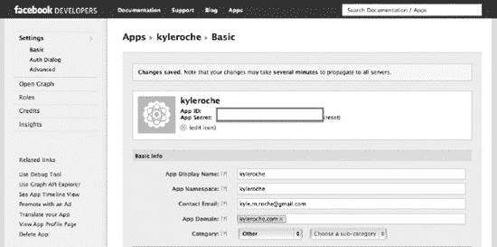

**图 11–1.** *设置 Facebook 应用。*

记下你的`App ID`和`App Secret`。在设置 Xcode 项目时，你将需要你的`App ID`。

#### 克隆 Facebook iOS SDK

使用浏览器访问[`https://github.com/facebook/facebook-ios-sdk`](https://github.com/facebook/facebook-ios-sdk)下载最新版本的 Facebook iOS SDK。将仓库克隆到本地机器。如果你感兴趣，可以运行一些示例应用。打开位于`samples`子目录中的 Xcode 项目。在 Xcode 中打开`DemoAppViewController.m`，找到列表 11–1 中显示的代码段。

**列表 11–1.** *设置你的 Facebook App ID*

```objc
// Your Facebook APP Id must be set before running this example
// See http://www.facebook.com/developers/createapp.php
// Also, your application must bind to the fb[app_id]:// URL
// scheme (substitute [app_id] for your real Facebook app id).
static NSString* kAppId = nil;
```

确保将`nil`改为你的 Facebook App ID。还有一步需要完成才能测试 SDK 提供的演示应用。打开应用的`.plist`文件，找到 URL Schemes 条目。该数组中的项目 0 需要设置为`fb[`*`你的应用 ID`*`]`才能正常运行。当从原生 iOS 应用进行身份验证时，Facebook 通过 URL Scheme 验证本地应用的真实性。在 iOS 中，URL Scheme 用于在上下文中启动其他原生应用。前缀（现在是你的应用 ID）用于唯一标识该应用。例如，如果我的应用 ID 是 123456，我会将 URL Scheme 设置为`fb123456`，身份验证后，Facebook 将验证原生应用是否绑定到 URL Scheme`fb123456://[action]`。

此时，除非同一设备上安装了 Facebook 应用，否则该应用将无法运行。

### 词汇课

到目前为止，在本书中，我们已经为基于标记的增强现实和增强现实游戏场景构建了应用示例。我们还没有讨论与基于位置的 AR 的一些区别。在本节中，我们将讨论在本应用中会用到的一些新术语。

### 方位角

方位角（Azimuth）是一个源自阿拉伯语的词汇。其字面翻译是“方向”。方位角是一种用于球面坐标系的角度测量，例如在空间计算中。方位角是投影向量与定义明确的参考平面上的参考向量之间的角度。例如，考虑一个包含兴趣点的基于位置的应用。如果我们想知道需要面向哪个方向才能指向该兴趣点，我们可能会计算该点相对于北极的方位角。我们会（比喻性地）从当前位置画一个垂直于北极的平面，再从兴趣点画一个垂直于海平面（或我们位置下方的等位面）的平面。这两个平面之间的角度就是方位角。

俗话说，“一图胜千言”。请参见图 11–2 获取更详细的解释。

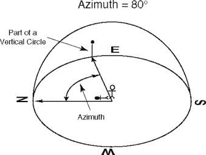

**图 11–2.** *计算方位角。该点与北极的方位角为 80 度。*

在我们将要构建的示例应用中，我们将讨论用于计算从我们的视点到另一个 GPS 坐标视点的方位角的公式。但是，如果你等不及了，这里有一个例子：如果我们站在纬度φ[1]、经度零的位置，并且想找到从我们的视点到纬度φ[2]、经度 L（向东为正）的 Point 2 的方位角，公式如图 11–3 所示。

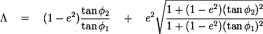

**图 11–3.** *这是一个计算方位角的公式示例。*


#### 修正后的标题

实际上，我们已经在书中讨论过这个概念。我不确定是否有标准术语来定义它，但回想一下我们在第 4 章中关于磁力计的讨论，当时我们聊到了方向变化。假设一部 iPhone 处于竖屏模式且朝向正北。如果你将 iPhone 侧放，此时它变成了横屏右向模式（举例来说），虽然你仍然面向正北，但 iPhone 的朝向可能会错误地认为你已转向正西。

当 AR 应用（尤其是基于位置信息的应用）中的方向发生变化时，你必须注意相应地调整朝向。

### 构建应用程序

让我们开始吧。打开 Xcode 并创建一个名为 `Ch11` 的项目，使用`空应用程序`模板。此模板将使用单个窗口构建一个简单的应用程序。

#### 鸣谢

`github.com`、`stackoverflow.com`、苹果开发者论坛以及其他各种在线社区上有很多关于基于位置的 AR 的讨论。有一些工具包，例如 ARKit（[`https://github.com/zac/iphonearkit`](https://github.com/zac/iphonearkit)），它拥有来自贡献者的近 100 个不同分支变体。本章中的工作基于其中一些变体。因此，我要特别感谢 Zac White 和 Niels Hansen，他们为我们提供了可以在此基础上构建的起点。

#### 必需的框架

我们正在构建一个基于位置的应用程序。你可能已经猜到，我们需要将`CoreLocation`框架添加到项目中。在继续之前，请确保已包含该框架。

#### 添加 Facebook iOS SDK

我们之前下载 SDK 时，里面附带了示例应用程序。由于我们现在从一个干净的应用开始，我们需要将 SDK 重新添加到此项目中。

在 Finder 中打开已归档的 SDK 目录。将 SDK 中的 `src` 目录拖入你的 Xcode 项目。确保选择了将资源复制到项目目录的选项。我们将在本章后面部分继续讨论这一点。

#### 好了，开始吧！

好的，准备就绪。让我们开始编码。在你的 Xcode 项目中创建一个名为 `ARController` 的组。我们将把 AR 特定的代码放在这里，以便你以后可以在自己的项目中复用它们。

在 `ARController` 组中创建一个名为 `ARController.m` 的新类。确保此类继承自 `NSObject` 而不是 `UIViewController`。在 Xcode 中打开 `ARController.h`。按照代码清单 11–2 所示更新接口。

**代码清单 11–2.** *更新后的 ARController.h*

```
#import <Foundation/Foundation.h>
#import <CoreLocation/CoreLocation.h>
#import <UIKit/UIKit.h>

@interface ARController : NSObject <UIAccelerometerDelegate, CLLocationManagerDelegate>
{

}

@property (nonatomic, retain) UIViewController *rootViewController;
@property (nonatomic, retain) UIImagePickerController *pickerController;
@property (nonatomic, retain) UIView *hudView;
@property (nonatomic, retain) CLLocationManager *locationManager;
@property (nonatomic, retain) UIAccelerometer *accelerometer;

- (id)initWithViewController:(UIViewController *)viewController;
- (void)presentModalARControllerAnimated:(BOOL)animated;

@end
```

我们正在为后续使用设置一些属性。我将在实现文件中详细解释每一个。切换到 `ARController.m` 并添加代码清单 11–3 中的代码。

**代码清单 11–3.** *ARController.m*

```
#import "ARController.h"

@implementation ARController
@synthesize rootViewController = _rootViewController;
@synthesize pickerController = _pickerController;
@synthesize hudView = _hudView;
@synthesize locationManager = _locationManager;
@synthesize accelerometer = _accelerometer;

- (id)initWithViewController:(UIViewController *)viewController {
    self.rootViewController = viewController;
    CGRect screenBounds = [[UIScreen mainScreen] bounds];
    self.hudView = [[UIView alloc] initWithFrame:screenBounds];
    self.rootViewController.view = self.hudView;

    self.pickerController = [[[UIImagePickerController alloc] init] autorelease];
        self.pickerController.sourceType = UIImagePickerControllerSourceTypeCamera;
        self.pickerController.cameraViewTransform = CGAffineTransformScale(
self.pickerController.cameraViewTransform, 1.13f,  1.13f);

        self.pickerController.showsCameraControls = NO;
        self.pickerController.navigationBarHidden = YES;
        self.pickerController.cameraOverlayView = _hudView;

        self.locationManager = [[CLLocationManager alloc] init];
        self.locationManager.headingFilter = kCLHeadingFilterNone;
        self.locationManager.desiredAccuracy = kCLLocationAccuracyBest;
        self.locationManager.delegate = self;
        [self.locationManager startUpdatingHeading];
        [self.locationManager startUpdatingLocation];

        _accelerometer = [UIAccelerometer sharedAccelerometer];
        _accelerometer.updateInterval = 0.25;
        _accelerometer.delegate = self;

    [[NSNotificationCenter defaultCenter] addObserver:self selector:@selector(deviceOrientationDidChange:) name:UIDeviceOrientationDidChangeNotification object:nil];
    [[UIDevice currentDevice] beginGeneratingDeviceOrientationNotifications];

    return self;
}

- (void)presentModalARControllerAnimated:(BOOL)animated {
    [self.rootViewController presentModalViewController:[self pickerController] animated:animated];
    _hudView.frame = _pickerController.view.bounds;
}

- (void)deviceOrientationDidChange:(NSNotification *)notification {

}

@end
```

在我们深入之前，先逐步过一下这一部分。首先，我们需要在实现文件中合成我们定义的属性。到目前为止，这个类中有三个方法。首先，`initWithViewController` 方法用于将一个 `UIImagePicker`（就像我们在第 7 章中所做的那样）添加到视图中，然后用一种新型的 HUD 层覆盖它。


随后我们设置位置管理器和加速度计，并启动更新服务。这与我们在第 4 章尝试 iOS 传感器编程时创建的代码非常相似。仅凭这个类本身并非特别实用。现在开始构建一些能利用现有成果的新类。

在 Xcode 项目中创建一个名为`RootViewController`的新文件，使其继承`UIViewController`模板。确保取消勾选`With XIB for user interface`选项。在 Xcode 中打开`RootViewController.h`，按照代码清单 11-4 所示进行修改。

**代码清单 11-4.** *更新后的 RootViewController.h*

```
#import <UIKit/UIKit.h>
@class ARController;

@interface RootViewController : UIViewController {
}

@property (nonatomic, retain) ARController *arController;
@end
```

我们引用了`ARController`类，并设置了同类型的新属性。在 Xcode 中切换到`RootViewController.m`，按照代码清单 11-5 所示更新该类。

**代码清单 11-5.** *更新后的 RootViewController.m*

```
#import "RootViewController.h"
#import "ARController.h"

@implementation RootViewController
@synthesize arController = _arController;

- (id)initWithNibName:(NSString *)nibNameOrNil bundle:(NSBundle *)nibBundleOrNil
{
    self = [super initWithNibName:nibNameOrNil bundle:nibBundleOrNil];
if (self) {
        // 自定义初始化
    }
    return self;
}

- (void)didReceiveMemoryWarning
{
    // 如果视图没有父视图则释放它
    [super didReceiveMemoryWarning];

    // 释放所有未使用的缓存数据、图像等
}

#pragma mark - 视图生命周期

// 实现 loadView 以编程方式创建视图层次结构，而不使用 nib 文件
- (void)loadView
{
_arController = [[ARController alloc] initWithViewController:self];
}

- (void)viewDidAppear:(BOOL)animated {
[super viewDidAppear:animated];
[self.arController presentModalARControllerAnimated:NO];
}

- (void)viewWillAppear:(BOOL)animated {
        [super viewWillAppear:animated];
}

/*
// 实现 viewDidLoad 以在加载视图后进行额外设置（通常从 nib 文件加载）
- (void)viewDidLoad
{
    [super viewDidLoad];
}
*/

- (void)viewDidUnload
{
    [super viewDidUnload];
    // 释放主视图的所有保留子视图
    // 例如 self.myOutlet = nil;
}

- (BOOL)shouldAutorotateToInterfaceOrientation:(UIInterfaceOrientation)interfaceOrientation
{
    // 返回 YES 表示支持的方向
        return YES;
}

@end
```

我们在这里做了几处小改动。在`viewDidAppear`方法中，我们呈现了模态 AR 控制器。这使得我们可以在其他应用中复用正在构建的代码，而无需重新创建基础`UIViewController`。在`loadView`方法中，我们用`UIImagePickerController`和 HUD 层分配了新的`arController`实例。

在基础项目通过用户界面配置好`UIImagePicker`（相机视图）之前，还有一步操作。在 Xcode 中打开`AppDelegate.h`，按照代码清单 11-6 所示更新头文件。

**代码清单 11-6.** *更新后的 AppDelegate.h*

```
#import <UIKit/UIKit.h>

@class RootViewController;
@interface AppDelegate : UIResponder <UIApplicationDelegate> {

}

@property (strong, nonatomic) UIWindow *window;
@property (nonatomic, retain) RootViewController *rootViewController;
@end
```

在 Xcode 中打开`AppDelegate.m`。我们将重写`didFinishLaunchingWithOptions`方法，以便将`RootViewController`添加到视图栈中。按照代码清单 11-7 所示的修改更新`AppDelegate.m`。

**代码清单 11-7.** *更新后的 AppDelegate.m*

```
#import "AppDelegate.h"
#import "RootViewController.h"

@implementation AppDelegate

@synthesize window = _window;
@synthesize rootViewController = _rootViewController;

- (void)dealloc
{
    [_window release];
    [super dealloc];
}

- (BOOL)application:(UIApplication *)application didFinishLaunchingWithOptions:(NSDictionary *)launchOptions
{
    self.window = [[[UIWindow alloc] initWithFrame:[[UIScreen mainScreen] bounds]] autorelease];
    // 应用启动后的自定义覆盖点
_rootViewController = [[RootViewController alloc] init];
[_window addSubview:_rootViewController.view];

self.window.backgroundColor = [UIColor clearColor];
    [self.window makeKeyAndVisible];
    return YES;
}
```

再次强调，这些都是我们熟悉的内容。我们导入了新的`RootViewController`类，合成了变量，并将其作为子视图添加到`UIWindow`中。

在支持 Core Location 的物理设备（iPhone 或 iPad）上运行该应用。由于我们使用了相机，无法使用模拟器进行调试。系统应会像图 11-4 所示弹出位置管理器的提示，请求允许将您当前的位置共享给该应用。

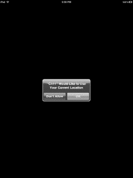

**图 11-4.** *通过位置管理器权限允许位置共享。*

接受该提示后，您将进入全屏相机视图，如图 11-5 所示。希望您能拥有更优美的景色。

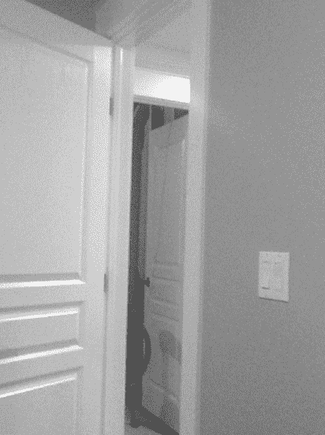

**图 11-5.** *授予位置共享权限后将显示相机视图。*


#### 监听传感器更新

我们已启用了航向和位置更新，但目前尚未对这些数据执行任何操作。此外，我们也没有对设备方向的改变做出响应。在第 7 章中，我们讨论了弧度与度数的转换，以及这在计算屏幕角度时的重要性。为此，我们设置一些便捷方法。打开`Ch11_Prefix.pch`，并添加代码清单 11-8 中的代码。

**代码清单 11-8.** *度数与弧度互相转换*

```
#define degreesToRadians(x) (M_PI * (x) / 180.0)
#define radiansToDegrees(x) ((x) * 180.0/M_PI)
```

既然已经解决了这个问题，我们需要再定义几个变量。打开`ARController.h`，添加代码清单 11-9 中的变量。

**代码清单 11-9.** *更新后的 ARController.h*

```
@property (nonatomic) UIDeviceOrientation deviceOrientation;
@property (nonatomic) double range;
```

切换到`ARController.m`，并按照代码清单 11-10 所示合成这些属性。

**代码清单 11-10.** *合成属性*

```
@synthesize deviceOrientation = _deviceOrientation;
@synthesize range = _range;
```

现在我们有了一个位置来存储当前设备方向和视野范围。`range`变量将用于存储屏幕所对应的视角角度。图 11-6 展示了一个计算对应角度的示例。在点 A 处，树木对应的角度为 25 度。我们将通过计算屏幕全宽对应的视角来计算一个可接受的视野，假设视角窗口约为 15 度。

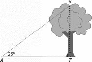

**图 11-6.** *通过对应角度计算可接受视野。*

在`ARController.m`中，使用代码清单 11-11 中的代码更新`deviceOrientationDidChange`方法。

**代码清单 11-11.** *新的 deviceOrientationDidChange 方法*

```
- (void)deviceOrientationDidChange:(NSNotification *)notification {
    UIDeviceOrientation orientation = [[UIDevice currentDevice] orientation];
    UIApplication *app = [UIApplication sharedApplication];

    if ( orientation != UIDeviceOrientationUnknown &&
        orientation != UIDeviceOrientationFaceUp &&
        orientation != UIDeviceOrientationFaceDown) {

                CGAffineTransform transform =
CGAffineTransformMakeRotation(degreesToRadians(0));
                CGRect bounds = [[UIScreen mainScreen] bounds];
                [app setStatusBarHidden:YES];
                [app setStatusBarOrientation:UIInterfaceOrientationPortrait animated:
NO];

                if (orientation == UIDeviceOrientationLandscapeLeft) {
                        transform                   =
CGAffineTransformMakeRotation(degreesToRadians(90));
                        bounds.size.width  = [[UIScreen mainScreen] bounds].size.height;
                        bounds.size.height = [[UIScreen mainScreen] bounds].size.width;
                        [app
setStatusBarOrientation:UIInterfaceOrientationLandscapeRight animated: NO];

                } else if (orientation == UIDeviceOrientationLandscapeRight) {
                        transform                   =
CGAffineTransformMakeRotation(degreesToRadians(-90));
                        bounds.size.width  = [[UIScreen mainScreen] bounds].size.height;
                        bounds.size.height = [[UIScreen mainScreen] bounds].size.width;
                        [app setStatusBarOrientation:UIInterfaceOrientationLandscapeLeft
animated: NO];

                } else if (orientation == UIDeviceOrientationPortraitUpsideDown) {
                        transform =
CGAffineTransformMakeRotation(degreesToRadians(180));
                        [app setStatusBarOrientation:UIInterfaceOrientationPortraitUpsideDown animated: NO];

                }
                _hudView.transform = transform;
                _hudView.bounds = bounds;
                _range = _hudView.bounds.size.width / 12;

        }
        _deviceOrientation = orientation;
}
```

让我们从头逐步分析这段代码。首先，我们声明了几个变量来引用更多的全局应用程序对象。我们设置了对设备方向的引用，以及我们的`sharedApplication`单例。

接下来，我们使用在预编译头文件中定义的转换方法，将度数转换为弧度，并针对非“面部朝上”或“面部朝下”的旋转情况（我们也忽略未知方向）转换屏幕。

最后，我们将变换应用到了 HUD 图层，并设置了屏幕的`range`。请记住，尽管`range`的函数看起来是静态的，但根据方向和设备的不同，它的分子会有所变化。

返回`ARController.h`，设置更多的变量来管理位置更新和航向更新。添加代码清单 11-12 中所示的属性。

**代码清单 11-12.** *用于航向和位置的属性*

```
@property (nonatomic, retain) CLLocation *deviceLocation;
@property (nonatomic, retain) CLHeading *deviceHeading;
```

按照代码清单 11-13 所示合成这些属性。

**代码清单 11-13.** *合成属性*

```
@synthesize deviceHeading = _deviceHeading;
@synthesize deviceLocation = _deviceLocation;
```

我们将在后面的示例中使用这些变量。


好的，作为一名高级文档工程师和翻译员，我将严格遵守您的格式要求，将给定的英文文本翻译成中文。


#### 存储坐标

我们已经非常接近拥有存储设备位置、屏幕视野范围和朝向所需的一切了。然而，我们还没有定义一个用于存储兴趣点坐标的地方。本节内容经过了修改，但其基础是 Alasdair Allan 的工作，而他的工作又基于 Zac White 的 `ARKit`。

创建一个名为 `ARCoordinate` 的新类，它继承自 `NSObject`。打开头文件，并添加 代码清单 11–14 中的代码。

**代码清单 11–14.** `ARCoordinate.h`

```
#import <Foundation/Foundation.h>

@interface ARCoordinate : NSObject {

}

@property (nonatomic, retain) NSString *name;
@property (nonatomic, retain) NSString *place;
@property (nonatomic) double distance;
@property (nonatomic) double inclination;
@property (nonatomic) double azimuth;

- (id)initWithRadialDistance:(double)distance inclination:(double)inclination
azimuth:(double)azimuth;
@end
```

我们最终将从社交网络中拉取一些 Facebook 地点。我们将把坐标与人员名字以及 Facebook 地点名称叠加在一起。其他属性则存储我们正在追踪的地点的距离、倾斜角和方位角。

我们定义的方法将用于创建一个具有指定属性的新坐标实例。

切换到 `ARCoordinate.m` 并完成这个类的实现。将 代码清单 11–15 中的代码添加到 `ARCoordinate.m` 中。

**代码清单 11–15.** `ARCoordinate.m`

```
#import "ARCoordinate.h"

@implementation ARCoordinate

@synthesize name = _name;
@synthesize place = _place;
@synthesize distance = _distance;
@synthesize inclination = _inclination;
@synthesize azimuth = _azimuth;

- (id)initWithRadialDistance:(double)distance inclination:(double)inclination
azimuth:(double)azimuth {
    if (self = [super init]) {
        _distance = distance;
        _inclination = inclination;
        _azimuth = azimuth;
    }
    return self;
}

- (void)dealloc {
    [_name release];
    _name = nil;
    [_place release];
    _place = nil;
}

@end
```

这里应该没有什么令人惊讶的地方。我们只是在设置我们的类，以便检索和存储坐标的属性。我们还需要一个继承自 `ARCoordinate` 的类来添加位置信息。

创建一个名为 `ARGeoCoordinate` 的新类。在 Xcode 中打开这个新类，并添加 代码清单 11–16 中所示的代码。

**代码清单 11–16.** `ARGeoCoordinate.h`

```
#import <Foundation/Foundation.h>
#import <CoreLocation/CoreLocation.h>
#import "ARCoordinate.h"

@interface ARGeoCoordinate : ARCoordinate {

}

@property (nonatomic, retain) CLLocation *geoLocation;

- (id)initWithCoordinate:(CLLocation *)location name:(NSString *)name place:(NSString *)
place;
- (id)initWithCoordinateAndOrigin:(CLLocation *)location name:(NSString *)name
place:(NSString *)place origin:(CLLocation *)origin;
- (float)angleFromCoordinate:(CLLocationCoordinate2D)first
second:(CLLocationCoordinate2D)second;
- (void)calibrateUsingOrigin:(CLLocation *)origin;
@end
```

我们首先导入 `CoreLocation` 框架和我们刚刚创建的 `ARCoordinate` 类。然后我们将父类从 `NSObject` 改为 `ARCoordinate`。

最后，我们声明一个属性来保存兴趣点的 `CLLocation`，并定义了几个方法，稍后我们将讨论这些方法。切换到 `ARGeoCoordinate.m` 并添加 代码清单 11–17 中的代码。

**代码清单 11–17.** `ARGeoCoordinate.m`

```
#import "ARGeoCoordinate.h"

@implementation ARGeoCoordinate
@synthesize geoLocation = _geoLocation;

- (id)initWithCoordinate:(CLLocation *)location name:(NSString *)name place:(NSString *)place {
    if (self = [super init]) {
        self.geoLocation = location;
        // 基类的属性
        self.name = name;
        self.place = place;
    }
    return self;
}

- (id)initWithCoordinateAndOrigin:(CLLocation *)location name:(NSString *)name place:(NSString *)place origin:(CLLocation *)origin {
    if (self = [super init]) {
        self.geoLocation = location;
        // 基类的属性
        self.name = name;
        self.place = place;
        [self calibrateUsingOrigin:origin];
    }
    return self;
}

- (float)angleFromCoordinate:(CLLocationCoordinate2D)first second:(CLLocationCoordinate2D)second {
    float longDiff = second.longitude - first.longitude;
    float latDiff = second.latitude - second.latitude;
    float aprxAziumuth = (M_PI *.5f) - atan(latDiff / longDiff);

    if (longDiff > 0) {
        return aprxAziumuth;
    } else if (longDiff < 0) {
        return aprxAziumuth + M_PI;
    } else if (latDiff < 0) {
        return M_PI;
    }

    return 0.0f;
}

- (void)calibrateUsingOrigin:(CLLocation *)origin {
    double baseDistance = [origin distanceFromLocation:_geoLocation];
    self.distance = sqrt(pow([origin altitude] - [_geoLocation altitude], 2) + pow(baseDistance, 2));
    float angle = sin(ABS([origin altitude] - [_geoLocation altitude]) / self.distance);

    if ([origin altitude] > [_geoLocation altitude]) {
        angle = -angle;
    }

    self.inclination = angle;
    self.azimuth = [self angleFromCoordinate:[origin coordinate] second:[_geoLocation coordinate]];
}

@end
```

让我们暂停一下，回顾一下我们刚刚添加的内容。首先，我们合成了声明的属性。接下来，我们创建了一个名为 `initWithCoordinate` 的方法。该方法接收坐标的名称和地点，并设置基类 `ARCoordinate` 的属性，以便我们稍后在可视化层中使用它们。

然后，我们创建了一个名为 `initWithCoordinateAndOrigin` 的方法。该方法的用途与 `initWithCoordinate` 相同，但允许您同时定义一个原点。主要区别在于，此方法会调用一个我们接下来要讨论的新内部方法。

`calibrateUsingOrigin` 方法获取两点（您的设备和兴趣点）之间的距离，并计算原始距离、角度（考虑海拔变化）和方位角。这些属性设置在基类中，以便我们稍后在示例中引用它们。

最后，我们创建了一个名为 `angleFromCoordinate` 的方法。该方法计算两点之间角度的距离。

返回到 `ARController.h` 中，在 `import` 语句之后立即插入 代码清单 11–18 中的代码。

**代码清单 11–18.** `ARController.h`

```
@class ARCoordinate;
@class ARGeoCoordinate;
```

接下来，声明一个 `ARCoordinate` 的属性，如 代码清单 11–19 所示。

**代码清单 11–19.** `ARCoordinate` 属性

```
@property (nonatomic, retain) ARCoordinate *coordinate;
```

切换到 `ARController.m` 并合成这个新属性。使用本章一直使用的带下划线的私有变量模式。按照 代码清单 11–20 所示调整 `initWithViewController` 方法。这段代码位于该方法的底部。

**代码清单 11–20.** 更新后的 `initWithViewController` 方法

```
…….
_coordinate = [[ARCoordinate alloc] initWithRadialDistance:1.0 inclination:0 azimuth:0];
return self;
}
```

将 代码清单 11–21 中的以下代码添加到 `ARController` 实现文件的顶部，紧跟在 `import` 语句之后。

**代码清单 11–21.** `ARController` 的导入和私有方法

```
#import "ARCoordinate.h"
#import "ARGeoCoordinate.h"
```


`@interface ARController (Private)`
`- (void)updateCurrentLocation:(CLLocation *)newLocation;`
`- (void)updateLocations;`
`- (void)updateCurrentCoordinate;`
`@end`

在 Listing 11–22 中，我们声明了一个新的私有方法，用于更新位置数组。同时，我们导入了之前创建的`ARGeoCoordinate`和`ARCoordinate`类。将 Listing 11–22 中的方法添加到实现文件中。

**Listing 11–22.** *位置与朝向方法*

```objc
- (void)updateCurrentLocation:(CLLocation *)newLocation {
        self.deviceLocation = newLocation;

        for (ARGeoCoordinate *geoLocation in _coordinates ) {
                if ( [geoLocation isKindOfClass:[ARGeoCoordinate class]]) {
                        [geoLocation calibrateUsingOrigin:self.deviceLocation];
                }
        }

}

- (void)updateCurrentCoordinate {

        double adjustment = 0;
        if (_deviceOrientation == UIDeviceOrientationLandscapeLeft)
                adjustment = degreesToRadians(270);
        else if (_deviceOrientation == UIDeviceOrientationLandscapeRight)
                adjustment = degreesToRadians(90);
        else if (_deviceOrientation == UIDeviceOrientationPortraitUpsideDown)
                adjustment = degreesToRadians(180);

        _coordinate.azimuth =
    degreesToRadians(_deviceHeading.magneticHeading) - adjustment;

        [self updateLocations];
}

- (void)updateLocations {
        // we'll get to this one later
}
```

我们稍后会解释这些方法及其作用。现在还有一些变量尚未声明，我们先处理这个问题。切换到`ARController.h`，按照 Listing 11–23 调整头文件。

**Listing 11–23.** *更新后的 ARController.h*

```objc
#import <Foundation/Foundation.h>
#import <CoreLocation/CoreLocation.h>
#import <UIKit/UIKit.h>

@class ARCoordinate;
@class ARGeoCoordinate;

@interface ARController : NSObject <UIAccelerometerDelegate, CLLocationManagerDelegate> {
    NSMutableArray *_coordinates;
}

@property (nonatomic, retain) UIViewController *rootViewController;
@property (nonatomic, retain) UIImagePickerController *pickerController;
@property (nonatomic, retain) UIView *hudView;
@property (nonatomic, retain) CLLocationManager *locationManager;
@property (nonatomic, retain) UIAccelerometer *accelerometer;

@property (nonatomic) UIDeviceOrientation deviceOrientation;
@property (nonatomic) double range;

@property (nonatomic, retain) CLLocation *deviceLocation;
@property (nonatomic, retain) CLHeading *deviceHeading;

@property (nonatomic, retain) ARCoordinate *coordinate;
@property (nonatomic) double viewAngle;

- (id)initWithViewController:(UIViewController *)viewController;
- (void)presentModalARControllerAnimated:(BOOL)animated;

- (void)addCoordinate:(ARCoordinate *)coordinate animated:(BOOL)animated;
- (void)removeCoordinate:(ARCoordinate *)coordinate animated:(BOOL)animated;

@end
```

加粗部分是新内容。切换到`ARController.m`来合成属性并创建新方法，添加 Listing 11–24 中的代码。

**Listing 11–24.** *更新后的 ARController.m*

```objc
// other synthesize statements
@synthesize viewAngle = _viewAngle;

// other methods
- (void)addCoordinate:(ARCoordinate *)coordinate animated:(BOOL)animated {
        [_coordinates addObject:coordinate];
}

- (void)removeCoordinate:(ARCoordinate *)coordinate animated:(BOOL)animated {
        [_coordinates removeObject:coordinate];
}
```

这些目前只是方法存根，我们很快就会实现其功能。查看现有代码，你会发现`updateLocations`方法仍然没有实际功能。在实现该方法之前，我们需要先实现一个基于`UIView`的类，用于在每个坐标点上显示叠加层。

创建一个新的 Objective-C 类，继承自`UIView`，命名为`ARAnnotation`。打开`ARAnnotation.h`并按照 Listing 11–25 进行更新。

**Listing 11–25.** *ARAnnotation.h*

```objc
#import <UIKit/UIKit.h>

@class ARCoordinate;
@interface ARAnnotation : UIView {

}

- (id)initWithCoordinate:(ARCoordinate *)coordinate;

@end
```

切换到`ARAnnotation.m`，删除文件中的所有代码，替换为 Listing 11–26 所示的内容。

**Listing 11–26.** *ARAnnotation.m*

```objc
#import "ARAnnotation.h"
#import "ARCoordinate.h"

#define ANNOTATION_WIDTH 150
#define ANNOTATION_HEIGHT 100

@implementation ARAnnotation

- (id)initWithCoordinate:(ARCoordinate *)coordinate
{
    CGRect annotationFrame = CGRectMake(0, 0, ANNOTATION_WIDTH, ANNOTATION_HEIGHT);

    if (self = [super initWithFrame:annotationFrame]) {
        UILabel *nameLabel = [[UILabel alloc] initWithFrame:CGRectMake(0, 0,
ANNOTATION_WIDTH, 20.0)];
        nameLabel.backgroundColor = [UIColor whiteColor];
        nameLabel.textAlignment = UITextAlignmentCenter;
        nameLabel.text = coordinate.name;
        [nameLabel sizeToFit];
        [nameLabel setFrame:CGRectMake(0, 0, nameLabel.bounds.size.width + 8.0,
nameLabel.bounds.size.height + 8.0)];
        [self addSubview:nameLabel];

        UILabel *placeLabel = [[UILabel alloc] initWithFrame:CGRectMake(25, 0,
ANNOTATION_WIDTH, 20.0)];
        placeLabel.backgroundColor = [UIColor whiteColor];
        placeLabel.textAlignment = UITextAlignmentCenter;
        placeLabel.text = coordinate.place;
        [placeLabel sizeToFit];
        [placeLabel setFrame:CGRectMake(25, 0, placeLabel.bounds.size.width + 8.0, placeLabel.bounds.size.height + 8.0)];
        [self addSubview:placeLabel];
    }
    return self;
}

@end
```

虽然我们复制了不少代码，但逻辑并不复杂：只是创建了两个标签（一个用于名称，一个用于位置），并将它们放置在一个 150×100 像素的矩形内。每个坐标点上都会创建这个矩形并放置到 HUD 层。在 Xcode 中打开`ARCoordinate.h`，添加 Listing 11–27 中的代码。

**Listing 11–27.** *ARCoordinate.h 的更新*

```objc
// Declare the class
@class ARAnnotation;
// create this property
@property (nonatomic, retain) ARAnnotation *annotation;
```

在实现文件中，使用私有实例变量合成该属性，并确保在`dealloc`方法中释放它。

切换到`ARController.m`，导入`ARAnnotation.h`头文件。按照 Listing 11–28 调整`addCoordinate`方法。

**Listing 11–28.** *addCoordinate 方法的更新*

```objc
- (void)addCoordinate:(ARCoordinate *)coordinate animated:(BOOL)animated {
    ARAnnotation *annotation = [[ARAnnotation alloc] initWithCoordinate:coordinate];
    coordinate.annotation = annotation;
    [annotation release];

    [_coordinates addObject:coordinate];
}
```

这次更新为坐标点创建了一个新的`ARAnnotation`实例。在完成`updateLocations`方法之前，我们还需要创建几个方法。将 Listing 11–29 中的声明复制到`ARController.m`顶部的私有接口块中。

**Listing 11–29.** *新的私有方法*

```objc
- (BOOL)viewportContainsCoordinate:(ARCoordinate *)coordinate;
- (double)deltaAzimuthForCoordinate:(ARCoordinate *)coordinate;
- (CGPoint)pointForCoordinate:(ARCoordinate *)coordinate;
- (BOOL)isNorthForCoordinate:(ARCoordinate *)coordinate;
```

我们逐一实现这些方法，并讲解它们的作用。首先，复制 Listing 11–30 中的方法。

**Listing 11–30.** *viewportContainsCoordinate 方法*

```objc
- (BOOL)viewportContainsCoordinate:(ARCoordinate *)coordinate {
```


```objectivec
double deltaAzimuth = [self deltaAzimuthForCoordinate:coordinate];
BOOL result        = NO;
if (deltaAzimuth <= degreesToRadians(_range)) {
    result = YES;
}

return result;
```

此方法用于检查我们先前定义的范围（屏幕可见区域），并验证传入的坐标是否位于指定范围内。该方法将帮助我们忽略可视屏幕范围之外的坐标。接下来，复制列表 11–31 中的代码。

**列表 11–31.** *deltaAzimuthForCoordinateMethod*

```objectivec
- (double)deltaAzimuthForCoordinate:(ARCoordinate *)coordinate {

    double currentAzimuth = _coordinate.azimuth;
    double pointAzimuth   = coordinate.azimuth;

    double deltaAzimith = ABS(pointAzimuth - currentAzimuth);

    if (currentAzimuth < degreesToRadians(_range) &&
        pointAzimuth > degreesToRadians(360-_range)) {
        deltaAzimith = (currentAzimuth + ((M_PI * 2.0) - pointAzimuth));
    } else if (pointAzimuth < degreesToRadians(_range) &&
               currentAzimuth > degreesToRadians(360-_range)) {
        deltaAzimith = (pointAzimuth + ((M_PI * 2.0) - currentAzimuth));
    }
    return deltaAzimith;
}
```

此方法计算我们当前位置的方位角与传入坐标的方位角之间的差值。这将帮助我们在 360 度视图中定位目标点。我们还对正北方向的正负角度进行了调整。将列表 11–32 中的方法添加到实现文件中。

**列表 11–32.** *pointForCoordinate 和 isNorthForCoordinate 方法*

```objectivec
-(BOOL)isNorthForCoordinate:(ARCoordinate *)coordinate {

    BOOL isBetweenNorth = NO;
    double currentAzimuth = _coordinate.azimuth;
    double pointAzimuth   = coordinate.azimuth;

    if (currentAzimuth < degreesToRadians(_range) &&
        pointAzimuth > degreesToRadians(360-_range)) {
        isBetweenNorth = YES;
    } else if (pointAzimuth < degreesToRadians(_range) &&
               currentAzimuth > degreesToRadians(360-_range)) {
        isBetweenNorth = YES;
    }
    return isBetweenNorth;
}

- (CGPoint)pointForCoordinate:(ARCoordinate *)coordinate {

    CGPoint point;
    CGRect viewBounds = _hudView.bounds;

    double currentAzimuth = _coordinate.azimuth;
    double pointAzimuth   = coordinate.azimuth;
    double pointInclination = coordinate.inclination;

    double deltaAzimuth = [self deltaAzimuthForCoordinate:coordinate];
    BOOL isBetweenNorth = [self isNorthForCoordinate:coordinate];

    if ((pointAzimuth > currentAzimuth && !isBetweenNorth) ||
        (currentAzimuth > degreesToRadians(360-_range) &&
         pointAzimuth < degreesToRadians(_range))) {

        // 右侧方位角
        point.x = (viewBounds.size.width / 2) + ((deltaAzimuth / degreesToRadians(1)) * 12);
    } else {

        // 左侧方位角
        point.x = (viewBounds.size.width / 2) - ((deltaAzimuth / degreesToRadians(1)) * 12);
    }
    point.y = (viewBounds.size.height / 2)
        + (radiansToDegrees(M_PI_2 + _viewAngle) * 2.0)
        + ((pointInclination / degreesToRadians(1)) * 12);

    return point;
}
```

第一个方法 `isNorthForCoordinate` 遵循了我们之前检查两个坐标方位角差值时的相同逻辑。现在我们正在对坐标与正北方向之间执行相同的操作。

在 `pointForCoordinate` 方法中，我们将 `ARCoordinate` 类转换为可在视图中使用的 `CGPoint`。我们需要了解坐标在方位角数值上的差异，以及该点是否位于我们与正北方向之间。我们返回这个点，以便在视图中更新它——我们稍后将执行此操作。

让我们完成 `ARController.m` 实现中的 `updateLocations` 方法。按照列表 11–33 所示更新该方法。

**列表 11–33.** *更新后的 updateLocations 方法*

```objectivec
- (void)updateLocations {
    if (!_coordinates || [_coordinates count] == 0) return;

    int totalDisplayed = 0;

    for (ARCoordinate *item in _coordinates) {

        UIView *viewToDraw = item.annotation;

        if ([self viewportContainsCoordinate:item]) {

            CGPoint point = [self pointForCoordinate:item];
            float width   = viewToDraw.bounds.size.width;
            float height  = viewToDraw.bounds.size.height;

            viewToDraw.frame = CGRectMake(point.x - width / 2.0, point.y - (height / 2.0), width, height);

            if (!([viewToDraw superview])) {
                [_hudView addSubview:viewToDraw];
                [_hudView sendSubviewToBack:viewToDraw];
            }
            totalDisplayed++;

        } else {
            [viewToDraw removeFromSuperview];
        }
    }
}
```

新的 `updateLocations` 方法遍历 `_coordinates` 数组，并从 `pointForCoordinate` 方法中获取 `CGPoint` 对象。如果这些点位于视图范围内（由 `viewportContainsCoordinate` 方法验证），则将其布局在屏幕上。

我们快完成了。在测试应用之前，我们需要添加位置和方向更新的方法处理程序。将列表 11–34 中的方法复制到实现文件中。

**列表 11–34.** *处理位置与方向*

```objectivec
- (void)locationManager:(CLLocationManager *)manager didUpdateHeading:(CLHeading *)newHeading {
    if (newHeading.headingAccuracy > 0) {
        _deviceHeading = newHeading;
        [self updateCurrentCoordinate];
    }
}

- (BOOL)locationManagerShouldDisplayHeadingCalibration:(CLLocationManager *)manager {
    return YES;
}

- (void)locationManager:(CLLocationManager *)manager didUpdateToLocation:(CLLocation *)newLocation fromLocation:(CLLocation *)oldLocation {
    if (newLocation != oldLocation) {
        [self updateCurrentLocation:newLocation];
    }
}

- (void)locationManager:(CLLocationManager *)manager didFailWithError:(NSError *)error {
    [self.locationManager stopUpdatingLocation];
}
```

这些方法应该相当容易理解。当我们收到更新的方向数据时，我们更新当前坐标。当我们收到位置变化时，我们更新位置信息。如果收到错误，我们停止位置管理器的更新。

在 `ARController.m` 文件中找到 `initWithViewController` 方法。添加列表 11–35 中的代码，为我们的属性设置一些初始值。

**列表 11–35.** *设置初始值*

```objectivec
_coordinates = [[NSMutableArray alloc] init];
_range = _hudView.bounds.size.width / 12;
_deviceLocation = [[CLLocation alloc] initWithLatitude:39.75 longitude:-104.86];
```

切换到 `RootViewController.m` 文件。导入 `ARGeoCoordinate` 头文件。在 `loadView` 方法中，添加列表 11–36 中的代码。

**列表 11–36.** *使用我的位置进行初始化*

```objectivec
_arController = [[ARController alloc] initWithViewController:self];

ARGeoCoordinate *tempCoordinate;
CLLocation        *tempLocation;
```


`tempLocation = [[CLLocation alloc] initWithLatitude:39.550051 longitude:-105.782067];`
`tempCoordinate = [[ARGeoCoordinate alloc] initWithCoordinate:tempLocation name:@"Kyle Roche" place:@"Denver"];`
`[self.arController addCoordinate:tempCoordinate animated:NO];`

我们终于可以测试这个功能了。与其他示例应用一样，你不能使用模拟器进行测试。在你的物理设备上，你应该会看到类似于图 11-7 的内容。


**图 11-7.** *这是我们目前构建的成果。*

### 添加社交上下文

应用已经初具雏形。我们已经构建了处理位置和方向更新以及在屏幕上显示标签的功能。目前，我们硬编码了一个位置（我的位置）来调试功能。现在，让我们加入 Facebook 上下文，并获取部分 Facebook 好友的位置。

如果你没有跳过本章的那一节，你会记得 Facebook iOS SDK 使用 URL Scheme 来管理其原生应用中的 oAuth 回调。我们已经将 Facebook SDK 复制到项目中，因此在使用之前，我们需要在`.plist`文件中设置 URL Scheme。

在 Xcode 中，找到`Resources`分组下的`Ch11–Info.plist`文件。

1.  打开文件并添加一个新行。
2.  将键（Key）设置为`URL Types`。
3.  展开新分组。添加一个子行。
4.  将键命名为`URL Schemes`。
5.  展开新键。将第 0 项的值设置为`fb[appID]`，其中`appID`是你的 Facebook 应用 ID。

我们在随 SDK 一起下载的 Facebook 演示应用中已经测试过这个流程。

打开`RootViewController.h`。更新接口文件，如代码清单 11-37 所示。

**代码清单 11-37.** *将 Facebook Connect 添加到 RootViewController*

```
#import <UIKit/UIKit.h>
#import "FBConnect.h"

@class ARController;

@interface RootViewController : UIViewController <FBRequestDelegate, FBDialogDelegate,
FBSessionDelegate> {
NSArray *_permissions;
}

@property (nonatomic, retain) Facebook *facebook;
@property (nonatomic, retain) ARController *arController;

@end
```

权限数组实际上并非必需。我们可以将其本地化到登录方法中，但我遵循了演示应用和文档中的代码，以便你更轻松地将此功能迁移到未来的应用中。

检查你的项目，确保它能够正确编译。在`import`语句之后，如果你没有正确包含 Facebook SDK，将会出现编译错误。

切换到`RootViewController.m`。在你最后的`synthesize`语句之后，添加代码清单 11-38 中的代码。显然，请将其替换为你自己的应用 ID。

**代码清单 11-38.** *为 Facebook 应用 ID 创建变量*

```
@synthesize facebook = _facebook;
static NSString* kAppId = @"your app id";
```

在`loadView`方法的末尾，添加代码清单 11-39 中的代码。

**代码清单 11-39.** *启动 Facebook oAuth 对话框*

```
_permissions =  [[NSArray arrayWithObjects:@"read_stream", @"publish_stream", @"offline_access", @"friends_checkins", nil] retain];
_facebook = [[Facebook alloc] initWithAppId:kAppId andDelegate:self];
 [_facebook authorize:_permissions];
```

如你所见，对 Facebook 进行身份验证有三个基本步骤。首先，设置你的应用所需的权限列表。其次，使用应用 ID 和委托（此处我们使用`self`）初始化`facebook`类。接着，使用`authorize`实例方法在 Web 浏览器中启动 oAuth 对话框。请记住，Facebook 随后会使用我们之前设置的 URL Scheme 回调你的应用。

Facebook 平台建立在 Graph API 之上。它提供了一种简单且一致的机制来检索和更新用户社交图谱的信息。然而，对我们来说，缺点是我们需要查询一个数据交集。具体来说，我们需要一部分好友及其最后已知的签到位置。这对于标准的 Graph API 来说过于复杂。因此，我们将通过一种更高级的媒介——FQL（Facebook 查询语言）来查询 Graph API。FQL 通过类似 SQL 的接口暴露 Graph API 中的数据。

为了演示 Graph API 调用和 FQL 调用，我们将从标准 Graph API 拉取好友列表，然后使用 FQL 调用拉取每位好友的最后签到位置。让我们开始吧。


### 面向朋友的图形

打开`RootViewController.m`。由于这是我们示例中设置 GPS 坐标的位置，因此扩展示例以查询 Facebook 位置是合理的。

Facebook 的 iOS SDK 使用一个委托协议（已添加到`RootViewController.h`中）来处理 API 调用的结果。在调用 Graph API 之前，我们需要创建委托方法。将清单 11-40 中的代码添加到`RootViewController.m`。

**清单 11-40.** *Facebook 请求委托方法*

```
/**
 * Called when the Facebook API request has returned a response. This callback
 * gives you access to the raw response. It's called before
 * (void)request:(FBRequest *)request didLoad:(id)result,
 * which is passed the parsed response object.
 */
- (void)request:(FBRequest *)request didReceiveResponse:(NSURLResponse *)response {
    NSLog(@"received response");
}

/**
 * Called when a request returns and its response has been parsed into
 * an object. The resulting object may be a dictionary, an array, a string,
 * or a number, depending on the format of the API response. If you need access
 * to the raw response, use:
 *
 * (void)request:(FBRequest *)request
 *      didReceiveResponse:(NSURLResponse *)response
 */
- (void)request:(FBRequest *)request didLoad:(id)result {
    NSLog(@"RESULT: %@", result);
};

/**
 * Called when an error prevents the Facebook API request from completing
 * successfully.
 */
- (void)request:(FBRequest *)request didFailWithError:(NSError *)error {
    NSLog(@"ERROR: %@", [error localizedDescription]);
};
```

这些方法直接复制自 SDK 附带的示例应用程序。它们处理调用 Facebook 后可能发生的三种事件：收到响应、加载响应以及响应出错。现在，让我们记录这些结果。

认证的回调委托也需要一些方法。将清单 11-41 中的方法添加到`RootViewController.m`。

**清单 11-41.** *Facebook 授权委托方法*

```
- (void)fbDidLogin {
    NSLog(@"LOGGED IN");
}

-(void)fbDidNotLogin:(BOOL)cancelled {
    NSLog(@"did not login");
}

- (void)fbDidLogout {
    NSLog(@"LOGOUT");
}
```

在 Xcode 中打开`AppDelegate.m`。添加清单 11-42 所示的方法。

**清单 11-42.** *处理来自 oAuth 对话框的 URLScheme*

```
- (BOOL)application:(UIApplication *)application handleOpenURL:(NSURL *)url {
    return [[_rootViewController facebook] handleOpenURL:url];
}
```

现在，我们已具备响应查询、URL Scheme 和身份验证请求所需的一切。让我们启动身份验证对话框。首次访问应用程序时，您将看到类似图 11-8 的画面。在后续的身份验证尝试中，您将看到类似图 11-9 的画面。在此过程中，请观察控制台。您应该能看到身份验证回调被调用的记录。

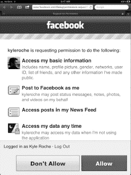

**图 11-8.** *初始身份验证对话框启动。*

如您所见，应用程序尚未获得我们请求的权限（传递给`authorize`方法的`NSArray`）的授权。您只需在应用程序首次登录时执行此操作。

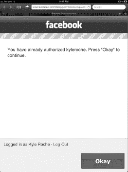

**图 11-9.** *后续登录尝试会弹出不同的对话框。*

有一些方法可以完全避免这个弹出消息（即在后续登录时）。如果您持久化从 oAuth 回调返回的访问令牌，可以将其传递给`authorize`方法以获取刷新后的令牌。但这对于我们的目的来说已经足够。

在`RootViewController.h`中，添加两个私有的`FBRequest`变量，分别命名为`_friendsRequest`和`_checkinRequest`。在回调中，Facebook 会发送一个对发起调用的`FBRequest`对象的引用。这是我们在解析响应时区分不同 Graph API 调用的唯一方式。

在 Xcode 中打开`RootViewController.m`。让我们调用 Graph API 并在控制台中查看结果。更新`fbDidLogin`方法，如清单 11-43 所示。

**清单 11-43.** *更新后的 fbDidLogin 方法*

```
- (void)fbDidLogin {
    NSLog(@"LOGGED IN");
    _friendsRequest = [_facebook requestWithGraphPath:@"me/friends" andDelegate:self];
}
```

此调用使用预定义路径向 Graph API 发起请求。我们使用了`me`关键字，它代表当前用户。`friends`路由返回朋友列表的 JSON 表示。您会注意到此调用现在引用了我们创建的私有`_friendsRequest`对象。

如果您再次运行应用程序，控制台中应显示类似清单 11-44 的内容。

**清单 11-44.** *来自 me/friends 的结果（名称和 ID 已更改）*

```
2011–10-08 10:14:55.281 Ch11[1302:707] RESULT: {
    data =     (
                {
            id = 12345;
            name = "Bob Smith";
        },
                {
            id = 12345;
            name = "Bob Smith";
        },
                {
            id = 12345;
            name = "Bob Smith";
        },
```

我们继续使用前十个返回的结果，并在 AR 视图中加载他们最近的一次签到。更新 Facebook 查询委托方法，如清单 11-45 所示。

**清单 11-45.** *更新后的 didLoad 方法*

```
- (void)request:(FBRequest *)request didLoad:(id)result {
    if (request == _friendsRequest) {
        for (int i = 0; i < 1; i++) { // change this to whatever number you like
            [_facebook requestWithGraphPath:[NSString stringWithFormat:@"%@/checkins", [[[result objectForKey:@"data"] objectAtIndex:i] objectForKey:@"id"]] andDelegate:self];
        }
    } else {
        NSLog(@"RESULT: %@", [[result objectForKey:@"data"] objectAtIndex:1]);
    }
};
```

让我们花点时间分析一下这段代码块。我们正在检查引用的`FBRequest`对象是否是我们的`_friendsRequest`对象。如果是，我们设置一个`for`循环（如果要扩展，请更改`i < #`），以创建对 Graph API 的第二次调用来拉取用户的签到记录。我们正在记录该调用的结果。

清单 11-46 显示了一个示例响应。（再次声明，名称已更改。）

**清单 11-46.** *示例 JSON 响应*


`2011–10-08 10:49:01.573 Ch11[1523:707] RESULT: {`
`    application =     {`
`        id = 350685531728;`
`        name = "Facebook for Android";`
`    };`
`    comments =     {`
`        data =         (`
`                        {`
`                "created_time" = "2011–10-03T21:43:16+0000";`
`                from =                 {`
`                    id = 345435;`
`                    name = "Bob Smith";`
`                };`
`                id = "42_4";`
`                message = "Can't wait to hear all about the new assignment.";`
`            },`
`                        {`
`                "created_time" = "2011–10-04T01:33:16+0000";`
`                from =                 {`
`                    id = 345345;`
`                    name = "Dustin Smith";`
`                };`
`                id = "602267025184_841815";`
`                message = "Maybe do this one faster?";`
`            }`
`        );`
`    };`
`    "created_time" = "2011–10-03T19:52:47+0000";`
`    from =     {`
`        id = 34534435;`
`        name = "Jason Smith";`
`    };`
`    id = 602267025184;`
`    likes =     {`
`        data =         (`
`                        {`
`                id = 09870928;`
`                name = "Bob Barbin";`
`            }`
`        );`
`    };`
`    message = "Starting the next project. Should be fun!";`
`    place =     {`
`        id = 110506962309835;`
`        location =         {`
`            city = "Palo Alto";`
`            country = "United States";`
`            latitude = "37.41761460129";`
`            longitude = "-122.15007660582";`
`            state = CA;`
`            street = "1601 S California Ave";`
`            zip = 94304;`
`        };`
`        name = "Facebook HQ";`
`    };`
`}`

幸运的是，我们有一个与 Facebook 相关的签到数据。这使得它至少在表面上看起来相关。如果你分析数据结构，会发现有一个名为 `place` 的元素，其中包含了将新 GPS 坐标发送到 `ARView` 所需的大部分内容。我们将签到消息而不是名字附加到标注上，这样我们就可以使用一些真实数据了。

调整 `didLoad` 委托方法，如代码清单 11–47 所示。

**代码清单 11–47.** *更新后的 didLoad 方法*

```
- (void)request:(FBRequest *)request didLoad:(id)result {
    if (request == _friendsRequest) {
        for (int i = 0; i < 10; i++) {
            [_facebook requestWithGraphPath:[NSString stringWithFormat:@"%@/checkins", [[[result objectForKey:@"data"] objectAtIndex:i] objectForKey:@"id"]] andDelegate:self];
        }
    } else {
        if ([[result objectForKey:@"data"] count] > 0) {
            NSString *placeName = [[[[result objectForKey:@"data"]
objectAtIndex:0] objectForKey:@"place"] objectForKey:@"name"];
            NSString *placeLat = [[[[[result objectForKey:@"data"] objectAtIndex:0]
objectForKey:@"place"] objectForKey:@"location"] objectForKey:@"latitude"];
            NSString *placeLong = [[[[[result objectForKey:@"data"] objectAtIndex:0]
objectForKey:@"place"] objectForKey:@"location"] objectForKey:@"longitude"];
            NSString *checkinMessage = [[[result objectForKey:@"data"] objectAtIndex:0]
objectForKey:@"message"];

            ARGeoCoordinate *tempCoordinate;
            CLLocation                *tempLocation;

            tempLocation = [[CLLocation alloc] initWithLatitude:[placeLat floatValue] longitude:[placeLong floatValue]];
            tempCoordinate = [[ARGeoCoordinate alloc] initWithCoordinate:tempLocation name:checkinMessage place:placeName];
            [self.arController addCoordinate:tempCoordinate animated:NO];
            [tempLocation release];
        }
    }
}
```

新代码设置了几个新的临时变量，用于存储 JSON 响应中的值。这些临时变量被传递给 `addCoordinate` 方法，以便它们会出现在我们的 AR 视图中。一旦 JSON 被转换为像我们这样的 `NSDictionary`，解析它就相当简单了。你只需使用 `objectForKey` 方法沿着结构向下追踪路径。

再次运行应用程序。如果你的大多数朋友签到的地方在地理位置上比较接近，你可能需要调整视图一次显示的地点的数量。我们的控制台示例在 AR 视图中显示的结果如图 11–10 所示。

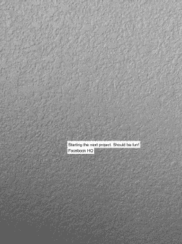

**图 11–10.** *Facebook HQ 显示为一个 Facebook 地点。*

我们也许可以改进一下，添加一些交互功能。不如我们添加一个启动 Facebook 分享对话框的 `UIButton` 怎么样？

打开 `ARAnnotation.m`。调整类文件的顶部部分，如代码清单 11–48 所示。

**代码清单 11–48.** *更新后的 ARAnnotation*

```
#import "ARAnnotation.h"
#import "ARCoordinate.h"
#import "AppDelegate.h"
#import "RootViewController.h"
#import "FBConnect.h"

#define ANNOTATION_WIDTH 150
#define ANNOTATION_HEIGHT 200

@implementation ARAnnotation
static NSString* kAppId = @"your app id";
```

我们需要导入 `RootViewController` 以及 `AppDelegate`。这是因为 `RootViewController` 拥有对我们 Facebook 类的引用，并将作为我们分享对话框的委托。

将代码清单 11–49 中的方法添加到该类中。

**代码清单 11–49.** *shareButtonClicked 方法*

```
- (IBAction)shareButtonClicked:(id)sender {
    AppDelegate *_appDelegate = (AppDelegate *)[[UIApplication sharedApplication]
delegate];
    RootViewController *_rootViewController = _appDelegate.rootViewController;

    NSMutableDictionary* params = [NSMutableDictionary dictionaryWithObjectsAndKeys:
                                   kAppId, @"app_id",
                                   @"http://amzn.com/1430239123", @"link",
                                   @"http://bit.ly/qILSZh", @"picture",
                                   @"Facebook Places AR App", @"name",
                                   @"Sharing information on a Facebook Place",
@"caption",
                                   @"Look, All my Facebook places are in Augmented
Reality view.", @"description",
                                   @"Buy the book",  @"message",
                                   nil];

    [_rootViewController.facebook dialog:@"feed"
            andParams:params
          andDelegate:_rootViewController];
}
```

这个方法将从我们即将添加到弹出窗口的 `UIButton` 插座中调用。它会找到对应用程序正在运行的 `RootViewController` 实例的引用，然后创建一个 `NSMutableDictionary`，其中包含调用 Facebook API 所需的 POST 参数。接着，我们从 `RootViewController` 的 `facebook` 属性调用 dialog 方法。这将启动一个对话框，提示我们在分享帖子时添加评论。

更新 `initWithCoordinate` 方法，如代码清单 11–50 所示。

**代码清单 11–50.** *对 initWithCoordinate 的更新*

```
- (id)initWithCoordinate:(ARCoordinate *)coordinate
{
    CGRect annotationFrame = CGRectMake(0, 0, ANNOTATION_WIDTH, ANNOTATION_HEIGHT);

    if (self = [super initWithFrame:annotationFrame]) {
        UIButton *shareButton = [UIButton buttonWithType:UIButtonTypeCustom];
        [shareButton setFrame:CGRectMake(0, 0, 32, 32)];
        [shareButton setBackgroundImage:[UIImage imageNamed:@"Facebook-Places.png"]
forState:UIControlStateNormal];
        [shareButton addTarget:self action:@selector(shareButtonClicked:)
forControlEvents:UIControlEventTouchUpInside];
        [self addSubview:shareButton];
}


```objc
UILabel *nameLabel = [[UILabel alloc] initWithFrame:CGRectMake(40, 0, ANNOTATION_WIDTH, 20.0)];
nameLabel.backgroundColor = [UIColor clearColor];
nameLabel.textAlignment = UITextAlignmentCenter;
nameLabel.text = coordinate.name;
[nameLabel sizeToFit];
[nameLabel setFrame:CGRectMake(40, 0, nameLabel.bounds.size.width + 8.0, nameLabel.bounds.size.height + 8.0)];
[self addSubview:nameLabel];

UILabel *placeLabel = [[UILabel alloc] initWithFrame:CGRectMake(40, 0, ANNOTATION_WIDTH, 20.0)];
placeLabel.backgroundColor = [UIColor clearColor];
placeLabel.textAlignment = UITextAlignmentCenter;
placeLabel.text = coordinate.place;
[placeLabel sizeToFit];
[placeLabel setFrame:CGRectMake(40, 25, placeLabel.bounds.size.width + 8.0, placeLabel.bounds.size.height + 8.0)];
[self addSubview:placeLabel];

[self setBackgroundColor:[UIColor clearColor]];
}
return self;
}
```

我们将现有的输出口向右移动了 40 像素，以便为我们的`UIButton`腾出空间。我使用的是从谷歌图片搜索中找到的图片。任何同名的图片都可以用于此演示。我们还将标签的背景色设置为透明，并将`UIButton`的`UIControlEventTouchUpInside`事件连接到`shareButtonClicked`方法。

请记住，我们将分享对话框的代理设置为`RootViewController`，因此我们也需要快速更新一下该类。

打开`RootViewController.m`文件，并添加 Listing 11–51 中的方法。

**清单 11–51.** *FBDialogDelegate 协议中的 dialogDidComplete 方法*

```objc
- (void)dialogDidComplete:(FBDialog *)dialog {
    NSLog(@"publish successful");
}
```

该方法是`FBDialogDelegate`协议中的代理方法。它会在对话框完成并关闭后被调用。运行应用程序。首先，你会看到一个略微更新过的界面。我在自己的 AR 视图中找到了相同的签到点，以便进行并排对比。请参见 Figure 11–11 中的图示。

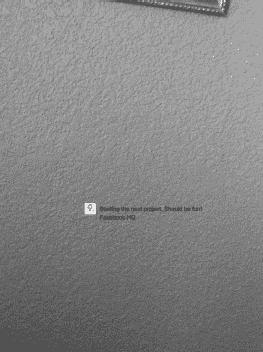

**图 11–11.** *我们已将 Facebook 总部更新为 Facebook 地点。*

你可以看到，我们的字体现在有了透明背景，并且我们在标签左侧为`UIButton`腾出了空间。如果点击该按钮，会启动一个分享对话框，如 Figure 11–12 所示。

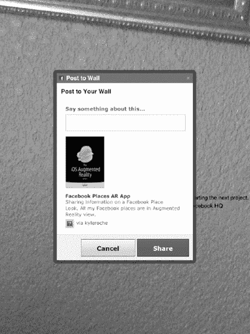

**图 11–12.** *启动分享对话框。*

你可以为帖子添加评论，或直接分享，如图所示。将内容发布到你的时间线后，你就可以在动态中看到它，如 Figure 11–13 所示。

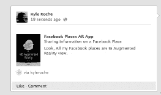

**图 11–13.** *我们已将分享对话框发布到了时间线。*

### 总结

恭喜！这是一个非常复杂的示例。我们基于现有的开源项目（即`ARKit`）进行了构建，并将其扩展为一个功能完整的社交 AR 应用。得益于 Zac、Neil 和 Alasdair 的工作，我们为应用程序的搭建打下了良好的基础。

我们扩展了设置，以处理自定义应用程序视图和注释。我们通过代码改变了它们的外观，并用一个`UIButton`扩展了它们，以实现交互功能。

在通过 Facebook iOS SDK 将示例连接到 Facebook 之后，我们能够使用 Graph API 拉取好友列表，并为他们最近的签到位置添加坐标。

我们为 AR 视图中每个签到点添加了一个带模板的按钮，这样你就知道如何将帖子分享回用户的墙上了。

本章内容非常有趣。我期待未来在 GitHub 上进一步扩展这个示例。同时也希望看到大家提交的 GitHub 改进版本。为 AR 增加社交背景有着无限的可能性。

在第 12 章中，我们将讨论人脸识别的方法和技术。我们将研究在 AR 应用中识别人脸的三种方式。然后，在第 13 章中，我们将选择一种方法，并将其转化为一个完整的应用示例。

## 第 12 章

## 人脸识别技术

增强现实应用编程中最令人印象深刻的技术之一就是人脸识别。无论是能识别友方与已知威胁的安全应用，还是在人群中扫描你的 Facebook 好友的社交应用，亦或是允许你试戴太阳镜或预览不同发型的零售应用，面部 AR 技术都令人惊叹。

传统上，人脸识别编程的挑战在于机器实时处理图像所需的资源量。这自然使其很难应用于移动设备。这就是为什么我们看到大多数面部识别算法是通过浏览器或可安装程序运行的原因。

随着 iOS 以及更新版本移动设备的出现，这种情况已经改变。iPad 2 拥有足够强大的处理能力，来应对面部识别应用对 CPU 较高强度的要求。

在本章中，我们将讨论在 iOS 移动环境中进行人脸识别的一些较新的方法。

### 人脸识别的选择

为应用添加人脸识别功能有多种方法。我们将介绍其中的三种。第一种方法历史最悠久，并且关于该主题的资料也最为丰富。这种方法被称为“开源计算机视觉库”（OpenCV）。

#### OpenCV

OpenCV 最初由英特尔开发，并于 2006 年左右发布到开源社区。它获得了 Willow Garden 公司的企业支持，并且在撰写本书时仍在积极开发中。

OpenCV 的原始代码库是 C 语言，这使得它易于移植到大多数平台。从 C#到 Java，都有对应的移植版本。当然，也有针对 iOS 的移植版本。

OpenCV 是我们本章将要讨论的主题中最复杂、最先进的。由于其历史悠久且基于 C 语言，它最不“对开发者友好”。然而，与其他方法相比，它的优势在于网上有大量的示例和教程。在撰写本书时，我在网上找不到另外两种方法的示例。

#### iOS 5 CIDetector 类

iOS 5 在 CoreImage 框架下引入了一组用于人脸检测的新类。我们将使用`CIDetector`和`CIFeature`类来在实时摄像头视图中定位人脸。

`CIDetector`类是 iOS 5 的一部分。该类使用一组预定义的检测器来查找图像中的特征。iOS 5 为面部识别定义了一个单一的检测器。可以推测，这个类的结构设计是为了将来能扩展到其他常见的物体映射。

正如我们将要讨论的，设置检测器时可用的选项并不多。基本上，你可以设置检测类型（目前唯一可用的类型是`CIDetectorTypeFace`），以及设置检测精度（高或低）。

不过我要提一下，使用`CIDetector`的速度明显快于 OpenCV。

#### Face.com

可以将其视为“第三方 API 方法”。随着互联网连接的普及速度如此之快，我们能够探索以前不可能实现的方案。像 face.com 这样的平台提供免费的 REST API，用于处理图像中的人脸检测。

在本章中，我将介绍该 API 及其一些功能，然后在第 13 章中我们将进一步深入这种方法，并构建一个功能完整的应用。


### 使用 OpenCV 方法

让我们从一个 OpenCV 示例开始。在创建 Xcode 项目之前，我们需要下载并安装该库。请将浏览器指向 [`http://www.eosgarden.com/en/opensource/opencv-ios/download/`](http://www.eosgarden.com/en/opensource/opencv-ios/download/)。这是为 iOS 构建的 OpenCV 编译分发版。其源代码可以在 [`https://github.com/macmade/OpenCV-iOS`](https://github.com/macmade/OpenCV-iOS) 找到，如果您有兴趣重新构建二进制文件的话。

在这个示例中，我们将使用来自 eosgarden 的 iPad 预编译分发版。下载标记为 **iPad** 的文件。在 Finder 中导航到下载目录并打开存档。我们将直接在此分发版的基础上构建示例。

首先，检查下载文件的目录结构。展开下载项目的主要子目录后，您会看到类似 图 12-1 的内容。

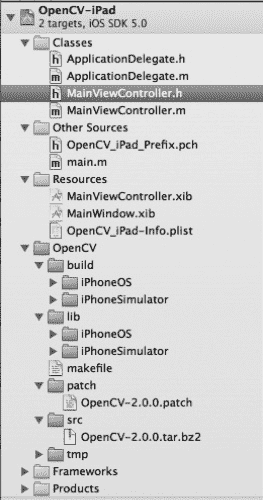

**图 12-1.** *下载并展开 OpenCV-iPad 示例应用程序的目录。*

需要注意的主要文件位于 **OpenCV** 目录下。如果您要下载并构建自己的分发版，则只需 **src** 和 **patch** 目录下的文件。**lib** 和 **bin** 目录是分别为 iOS 模拟器和 iOS 物理设备系列提供的预编译分发版。

#### 捕获用于测试的图像

在界面生成器中打开`MainViewController.xib`。目前这个文件还没有什么内容。如果您启动应用程序，它只会显示 图 12-2 中所示的标题和链接标签。

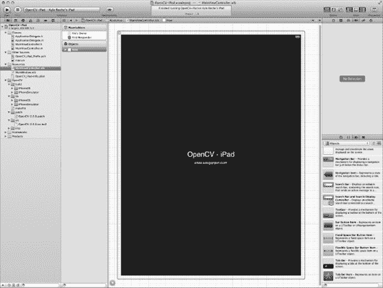

**图 12-2.** *启动应用程序会显示`MainViewController`的默认状态。*

在第 13 章中，我们将讨论分析实时摄像头画面以进行面部识别。为了介绍一些可用于面部识别的技术，我们将使用静态摄像头图像，以便在性能和易用性方面更容易衡量。

按照 图 12-3 所示调整`MainViewController`。我们正在向视图中添加一个工具栏、一个`UIImageView`、一个`UILabel`和一个条形按钮项（带有相机标识符）。

在`MainViewController.h`中为`UIToolbar`创建一个名为`toolbar`的属性。同时，将一个名为`cameraButtonClicked`的`IBAction`方法链接到条形按钮项。此外，将`UIImageView`链接到一个名为`cameraView`的属性，并将计时器标签（右下角）链接到一个名为`timerLabel`的属性。我创建的`UIImageView`尺寸为 600 × 800，以匹配 iPad 摄像头的宽高比，这样我们就不必重新缩放图像来显示它们。在第 13 章中，我们将讨论如何动态缩放摄像头视图，以正确的宽高比显示原始摄像头画面。

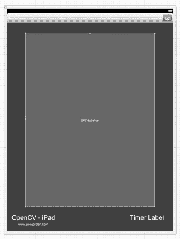

**图 12-3.** *调整`MainViewController`布局。*

当您在 Xcode 中仍打开`MainViewController.h`时，声明一个名为`_imagePicker`的`UIImagePickerController` ivar。此外，将该类指定为`UINavigationControllerDelegate`、`UIImagePickerControllerDelegate`、`UIPopoverControllerDelegate`和`UIActionSheetDelegate`。

最后，创建一个`UIPopoverController`类的 ivar，名为`_imagePopover`。我们将用它来存放照片库或已保存照片应用程序的弹出窗口。

您的新`MainViewController.h`应该如代码清单 12-1 所示。

**代码清单 12-1.** *新`MainViewController.h`*

```
#import <UIKit/UIKit.h>
@interface MainViewController : UIViewController <UINavigationControllerDelegate,
UIImagePickerControllerDelegate, UIActionSheetDelegate, UIPopoverControllerDelegate> {
    UIImagePickerController *_imagePicker;
    UIPopoverController *_imagePopover;
}

@property (retain, nonatomic) IBOutlet UIImageView *cameraView;
@property (retain, nonatomic) IBOutlet UILabel *timerLabel;
@property (retain, nonatomic) IBOutlet UIToolbar *toolbar;
- (IBAction)cameraButtonClicked:(id)sender;
@end
```

切换到`MainViewController.m`。如果您使用界面生成器链接了`IBOutlet`，则无需在实现中添加任何 synthesize 或 release 语句。无论哪种方式，您都应在实现的`dealloc`方法中释放`_imagePicker`。

**注意:** 本类包含两个源自 [`https://github.com/macmade/facedetect`](https://github.com/macmade/facedetect) 的方法。GitHub 和 Apress ([`www.apress.com`](http://www.apress.com)) 上的源代码在头文件中包含相应的许可文本。

找到`viewDidLoad`方法，并按代码清单 12-2 所示更新它。

**代码清单 12-2.** *`MainViewController.h` 中的新`viewDidLoad`*

```
- (void)viewDidLoad
{
    [super viewDidLoad];
    // 在此添加从 nib 加载视图后的任何额外设置。
    _imagePicker = [[UIImagePickerController alloc] init];
    _imagePicker.delegate = self;
}
```

我们需要确保在尝试以模态视图呈现`UIImagePickerController`之前先分配它，否则会因为显示一个 nil 的`ViewController`而导致错误。接下来，我们只需将`delegate`设置为`self`，以便在我们的类中处理`didFinishPickingImage`委托方法。


找到接口构建器为咱们声明的`cameraButtonClicked`方法，添加代码清单 12-3 中所示的代码。

**代码清单 12–3.** *更新后的`cameraButtonClicked`方法*

```
- (IBAction)cameraButtonClicked:(id)sender {
    UIActionSheet *_sheet = [[UIActionSheet alloc] initWithTitle:@"Choose Source"
delegate:self cancelButtonTitle:@"Cancel" destructiveButtonTitle:nil
otherButtonTitles:@"Camera", @"Library", @"Photo Album", nil];
    [_sheet showInView:self.view];
    [_sheet release];
}
```

此方法仅将控制权转交给`UIActionSheet`。我们将在`UIActionSheet`的委托方法中处理用户的选择。接下来实现它。将代码清单 12-4 所示的方法添加到实现中。

**代码清单 12–4.** *`UIActionSheet` 委托方法*

```
- (void)actionSheet:(UIActionSheet *)actionSheet
clickedButtonAtIndex:(NSInteger)buttonIndex {
    if (buttonIndex == 0) {
        _imagePicker.sourceType = UIImagePickerControllerSourceTypeCamera;
        [self presentModalViewController:_imagePicker animated:YES];
        return;
    } else if (buttonIndex == 1) {
        _imagePicker.sourceType = UIImagePickerControllerSourceTypePhotoLibrary;
    } else {
        _imagePicker.sourceType = UIImagePickerControllerSourceTypeSavedPhotosAlbum;
    }
// only for iPad
    _imagePopover = [[UIPopoverController alloc] initWithContentViewController:_imagePicker];
    _imagePopover.delegate = self;
    [_imagePopover presentPopoverFromRect:toolbar.frame
                                   inView:self.view
                 permittedArrowDirections:UIPopoverArrowDirectionAny
                                 animated:YES];
    [_imagePicker release];
}
```

此方法为`UIImagePickerController`提供了三种不同的源选择。我们可以简单地默认显示摄像头，但如果您想在模拟器上测试此应用程序，您需要能够将源类型更改为相册或照片图库。

请记住，这是一个 iPad 应用程序。iPad 要求`UIImagePickerController`显示在`UIPopoverController`中，而不是`ModalViewController`中。这与 iPhone 或 iPod touch 不同，因此如果您不是在 iPad 上测试，请确保在一个模态对话框中启动所有的`UIImagePickerController`，而不是在`UIPopoverController`中。

用户选择图像后，`UIImagePickerController`类（正如您可能从第 6 章回忆的那样）会调用其`didFinishPickingImage`委托方法。我们将使用代码清单 12-5 中的代码来处理该方法。

**代码清单 12–5.** *`UIImagePickerController` 委托方法*

```
- (void)imagePickerController:(UIImagePickerController *)picker
didFinishPickingImage:(UIImage *)image editingInfo:(NSDictionary *)editingInfo {
    [self dismissModalViewControllerAnimated:YES];
    cameraView.image = image;
}
```

您的应用程序现在应该可以在模拟器或物理设备上进行测试。运行应用程序。点击工具栏中的摄像头按钮，您将看到一个`UIActionSheet`，如图 12–4 所示。

如果您在模拟器上运行，请确保选择**Library**或**Photo Album**。您将看到一个类似于图 12–5 的弹出窗口。如果您选择**Camera**视图，您将看到摄像头全屏显示。

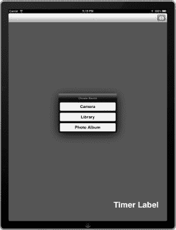

**图 12–4.** *从`UIActionSheet`中选择摄像头源。*

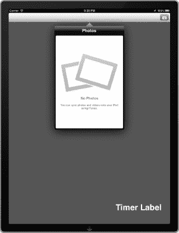

**图 12–5.** *`UIPopoverController`在 iPad 上显示`UIImagePickerController`。*

#### Haar 级联

在我们对 OpenCV 进行操作之前，需要向项目中添加几个 Haar 级联。Haar 级联是一组用于物体识别的组织化的分类器级联或数字图像特征。其名称来源于最早用于人脸检测系统的 Haar 小波。

在 Haar 小波出现之前，图像识别分析每个像素 RGB 值的强度，这需要相当多的时间和计算资源。Haar 级联用于分析检测窗口的相邻矩形区域，并对这些区域的像素强度进行求和，以便相互比较，而不是逐像素比较。Viola 和 Jones 在 2001 年发表的论文《使用简单特征的增强级联进行快速物体检测》（已在 2001 年计算机视觉与模式识别会议上被接受）中记录了这种方法。^(1)

如果您想进一步研究这个主题，该算法背后的数学原理有详尽的文档记录。我们将使用 OpenCV 源代码发行版中自带的 Haar 级联。您可以在[`http://opencv.willowgarage.com/wiki/`](http://opencv.willowgarage.com/wiki/)找到该发行版。如果您不想再下载另一个版本的 OpenCV（准确地说，这是原始版本），您可以只需从本书在 GitHub 上的示例代码或 Apress 网站（[`www.apress.com`](http://www.apress.com)）的源代码/下载区域复制这些文件。

找到您将要使用的级联目录，并将它们拖放到您的 Xcode 项目中。确保选择了按需复制资源的选项。

**注意：** 如果您已经为 iOS 5 编译了自己的 OpenCV 发行版，可以跳过下一节。将您编译好的库添加到项目中，一切就绪。

切换到`MainViewController.m`。在`import`语句之后，添加代码清单 12-6 中的代码。

**代码清单 12–6.** *私有方法*

```
@interface MainViewController (Private)
- (IplImage *)createIplImage:(UIImage *)image;
- (void)openCVFaceDetect;
@end
```

我们只是声明了几个将用于分析图像的私有方法。现在让我们实现这些方法，然后我们逐步讲解它们。

__________

¹ 你可以在[`http://research.microsoft.com/enus/um/people/viola/Pubs/Detect/violaJones_CVPR2001.pdf`](http://research.microsoft.com/enus/um/people/viola/Pubs/Detect/violaJones_CVPR2001.pdf)找到整篇论文。

首先，将代码清单 12-7 中的方法添加到实现中。正如我之前提到的，这两个实用方法来自 eosgarden 示例项目。它们按原样在 iOS 5 上无法工作，但我们稍后会修复这个问题。

**代码清单 12–7.** *`createIplImage` 方法*

```
- ( IplImage * )createIplImage: ( UIImage * )image
{
    CGImageRef      imageRef;
    CGColorSpaceRef colorSpaceRef;
    CGContextRef    context;
    IplImage      * iplImage;
    IplImage      * returnImage;

    imageRef      = image.CGImage;
    colorSpaceRef = CGColorSpaceCreateDeviceRGB();
    iplImage      = cvCreateImage( cvSize( image.size.width, image.size.height ),
IPL_DEPTH_8U, 4 );
    context       = CGBitmapContextCreate
    (
     iplImage->imageData,
     iplImage->width,
     iplImage->height,
     iplImage->depth,
     iplImage->widthStep,
     colorSpaceRef,
     kCGImageAlphaPremultipliedLast | kCGBitmapByteOrderDefault
     );

    CGContextDrawImage( context, CGRectMake( 0, 0, image.size.width, image.size.height
), imageRef );
    CGContextRelease( context );
    CGColorSpaceRelease( colorSpaceRef );

    returnImage = cvCreateImage( cvGetSize( iplImage ), IPL_DEPTH_8U, 3 );

    cvCvtColor( iplImage, returnImage, CV_RGBA2BGR );
    cvReleaseImage( &iplImage );

    return returnImage;
}
```


#### OpenCV 与 iOS 图像处理

当我们从相机或相册获取所选图像后，会将其存储在`UIImageView`中。由于 OpenCV 无法直接使用`UIImage`格式，因此需要将图像转换为它能处理的格式。OpenCV 使用名为`IplImage`的格式，该格式属于 Intel 图像处理库（Intel Image Processing Library）的一部分。对于本演示而言，我们只需了解这些基本信息即可。互联网上提供了许多类似的辅助函数，例如来自`eosgarden`的函数。

我们的转换方法将在 OpenCV 处理块内部调用，该方法接收`UIImage`并绘制一个具有相同表示的新`IplImage`。其尺寸和颜色将足够接近，使我们仍能使用 x,y 坐标在检测到的每张人脸周围叠加一个半透明矩形。

接下来，将列表 12–8 中的方法复制到实现部分。

**列表 12–8.** `openCVFaceDetect`方法

```
- ( void )openCVFaceDetect
{
    NSInteger                 i;
    NSUInteger                scale;
    NSAutoreleasePool       * pool;
    IplImage                * image;
    IplImage                * smallImage;
    NSString                * xmlPath;
    CvHaarClassifierCascade * cascade;
    CvMemStorage            * storage;
    CvSeq                   * faces;
    UIAlertView             * alert;
    CGImageRef                imageRef;
    CGColorSpaceRef           colorSpaceRef;
    CGContextRef              context;
    CvRect                    rect;
    CGRect                    faceRect;

    pool  = [ [ NSAutoreleasePool alloc ] init ];
    scale = 2;

    cvSetErrMode( CV_ErrModeParent );

    xmlPath    = [ [ NSBundle mainBundle ] pathForResource: @"haarcascade_frontalface_default" ofType: @"xml" ];
    image      = [ self createIplImage: cameraView.image ];
    smallImage = cvCreateImage( cvSize( image->width / scale, image->height / scale ),
IPL_DEPTH_8U, 3 );

    cvPyrDown( image, smallImage, CV_GAUSSIAN_5x5 );

    cascade = ( CvHaarClassifierCascade * )cvLoad( [ xmlPath cStringUsingEncoding:
NSASCIIStringEncoding ], NULL, NULL, NULL );
    storage = cvCreateMemStorage( 0 );
    faces   = cvHaarDetectObjects( smallImage, cascade, storage, ( float )1.2, 2,
CV_HAAR_DO_CANNY_PRUNING, cvSize( 20, 20 ) );

    cvReleaseImage( &smallImage );

    imageRef      = cameraView.image.CGImage;
    colorSpaceRef = CGColorSpaceCreateDeviceRGB();
    context       = CGBitmapContextCreate
    (
     NULL,
     cameraView.image.size.width,
     cameraView.image.size.height,
     8,
     cameraView.image.size.width * 4,
     colorSpaceRef,
     kCGImageAlphaPremultipliedLast | kCGBitmapByteOrderDefault
     );

    CGContextDrawImage
    (
     context,
     CGRectMake( 0, 0, cameraView.image.size.width, cameraView.image.size.height ),
     imageRef
     );

    CGContextSetLineWidth( context, 1 );
    CGContextSetRGBStrokeColor( context, ( CGFloat )0, ( CGFloat )0, ( CGFloat )0, (
CGFloat )0.5 );
    CGContextSetRGBFillColor( context, ( CGFloat )1, ( CGFloat )1, ( CGFloat )1, (
CGFloat )0.5 );

    if( faces->total == 0 )
    {
        alert = [ [ UIAlertView alloc ] initWithTitle: @"No faces" message: @"No faces
were detected in the picture. Please try with another one." delegate: NULL
cancelButtonTitle: @"OK" otherButtonTitles: nil ];

        [ alert show ];
        [ alert release ];
    }
    else
    {
        for( i = 0; i < faces->total; i++ )
        {
            rect     = *( CvRect * )cvGetSeqElem( faces, i );
            faceRect = CGContextConvertRectToDeviceSpace( context, CGRectMake( rect.x *
scale, rect.y * scale, rect.width * scale, rect.height * scale ) );

            CGContextFillRect( context, faceRect );
            CGContextStrokeRect( context, faceRect );
        }

        cameraView.image = [ UIImage imageWithCGImage: CGBitmapContextCreateImage(
context ) ];
    }
```


`CGContextRelease( context );`  
`CGColorSpaceRelease( colorSpaceRef );`  
`cvReleaseMemStorage( &storage );`  
`cvReleaseHaarClassifierCascade( &cascade );`  
`cvReleaseImage( &smallImage );`  
`[pool release];`  
`}`

让我们逐步分析这段代码。首先，我们设置了一个 `NSAutoReleasePool` 来处理图像处理过程中的内存分配和释放。然后从文件路径加载 Haar 级联分类器，并为检测器设置一些基本信息，如尺寸、宽度和缩放比例。

使用新的辅助方法将 `UIImage` 转换为 `IplImage` 后，我们调用 `cvHaarDetectObjects` 函数来检测图片中的人脸。接下来，方法有几个分支路径：如果没有检测到人脸，我们会触发一个 `UIAlertView` 通知用户选择新图片；如果检测到人脸，则遍历它们，并在图像上覆盖一个半透明矩形。

这里有几个有趣的方法，如果你之前深入学习了本书中 cocos2D 的内容，可能会认出它们。`DeviceSpace`（设备空间）和 `WorldSpace`（世界空间）的概念在游戏编程中很常见。有时候，你可能在处理图像上的像素坐标，而这些坐标可能与 CGPoints 或其他系统中的百分比有所不同。这些基于 C 语言的转换函数能让你在不同坐标系之间轻松切换。

好了，两个处理方法都已就位。我们需要在从相册或相机获取 `UIImage` 之后调用它们。找到 `didFinishPickingImage` 委托方法，并在该例程末尾添加列表 12–9 中的代码行。

**列表 12–9.** *调用 OpenCV 例程*

`[self openCVFaceDetect];`

现在可以测试该例程了。在模拟器或物理设备上启动应用。我选择**相册**选项来选取图片。选择图片后，发生了意外情况：控制台输出了列表 12–10 中的内容。

**列表 12–10.** *不理想的输出*

`Detected an attempt to call a symbol in system libraries that is not present on the iPhone: strtod$UNIX2003 called from function _ZL10icv_strtodP13CvFileStoragePcPS1_ in image OpenCV-iPad.`

幸运的是，我们知道问题所在。在大多数可用的 OpenCV 发行版中，都没有为设备和模拟器的架构进行适当编译。本例中使用的静态库需要更新。我们来更新并重试。

OpenCV 有很多优秀的开源构建脚本。我使用最多的版本是由 YoshimasaNiwa 贡献的（[`https://github.com/niw`](https://github.com/niw)）。我们将按照这个建议来修复示例项目。从此链接下载 OpenCV 2.2.0 源码：[`http://sourceforge.net/projects/opencvlibrary/files/opencv-unix/2.2/OpenCV-2.2.0.tar.bz2/download`](http://sourceforge.net/projects/opencvlibrary/files/opencv-unix/2.2/OpenCV-2.2.0.tar.bz2/download)。

**注意：** 可能有更新版本的 OpenCV 可用。该例程应能正常使用。如果找不到 2.2.0 版本，请尝试使用较新版本。

在 Mac 上打开命令行工具。导航到下载存档文件的目录。运行列表 12–11 中的命令。

**列表 12–11.** *解压 OpenCV*

```
Kyle-Roches-MacBook-Pro-2:Downloads kyleroche$ tar xjvf OpenCV-2.2.0.tar.bz2
x OpenCV-2.2.0/.DS_Store
x OpenCV-2.2.0/3rdparty/CMakeLists.txt
x OpenCV-2.2.0/3rdparty/ilmimf/LICENSE
x OpenCV-2.2.0/3rdparty/ilmimf/README
…… 等等更多……
```

现在解压了库，我们需要打一个快速补丁，确保能为 iOS 构建。从 [`https://github.com/niw/iphone_opencv_test`](https://github.com/niw/iphone_opencv_test) 下载补丁文件。为方便起见，我下载了整个 GitHub 仓库，并将 OpenCV 发行版移到该目录。运行列表 12–12 中的命令。

**列表 12–12.** *为 OpenCV 打补丁*

```
Kyle-Roches-MacBook-Pro-2:OpenCV-2.2.0 kyleroche$ patch -p1 < ../OpenCV-2.2.0.patch
patching file CMakeLists.txt
patching file modules/CMakeLists.txt
```

**注意：** 下一节中我们需要使用 cmake。如果尚未安装，可以从 Macports 或 Homebrew 获取。如果必须安装 cmake，可能需要启动后去喝杯咖啡，因为安装过程相当耗时。

现在有了打过补丁的 OpenCV 版本，我们可以为当前架构重新构建它。运行列表 12–13 中的命令。

**列表 12–13.** *为模拟器构建 OpenCV 静态库*

```
Kyle-Roches-MacBook-Pro-2:build_simulator kyleroche $ export IPHONEOS_VERSION_MIN="4.0"
Kyle-Roches-MacBook-Pro-2:build_simulator kyleroche$ ../opencv_cmake.sh Simulator
../OpenCV-2.2.0
Kyle-Roches-MacBook-Pro-2:build_simulator kyleroche$ make -j 4
Kyle-Roches-MacBook-Pro-2:build_simulator kyleroche$ make install
```

你可以重复相同的过程为设备构建 OpenCV。只需将 `opencv_cmake.sh` 的参数改为 `Device` 而非 `Simulator`（在列表 12–13 中用粗体显示）。

好了，现在应该有一个新的构建目录，用来替换当前项目中无法正常工作的那个。打开 Xcode，从项目中删除**OpenCV**目录。添加新构建的目录，其中包含 `Simulator` 和 `Device`（如果你计划在设备上测试）的目标。

**注意：** 如果在模拟器上测试，需要将 Accelerate 框架添加到项目中。示例项目中未包含此框架。

让我们再次尝试运行此项目。使用相机或从相册选择文件。你应该会看到类似图 12–6 的结果。

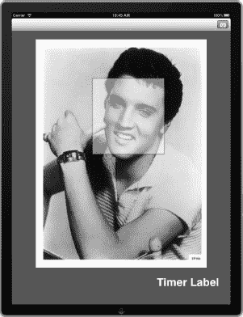

**图 12–6.** *OpenCV 现在可以在 iPad 模拟器上正常工作。*

我们在相册的图片中找到了猫王（Elvis）。

#### OpenCV 回顾

事实证明 OpenCV 并不那么用户友好。虽然文档齐全，但主要的示例尚未适配 iOS 5，也未针对当前架构进行编译。OpenCV 功能强大，但需要大量工作才能运行起来。作为练习，请使用 `UILabel` 测量 OpenCV 分析图像所需的时间。你可以对比接下来两种方法的结果。


### 使用 CIDetector 类方法

`CIDetector` 类是 iOS 5 新增的。在 iOS 5 发布时，只有一种检测器可用，即用于面部识别。让我们看看使用原生类和使用 OpenCV 之间的区别。

为了尽可能公平地进行比较，我们使用同一个应用程序，并添加一些方法，利用 `CIDetector` 替代 OpenCV 来分析面部信息。

再次打开 OpenCV-iPad 项目，并将 `CoreImage` 框架添加到项目中。我们需要它来访问 `CIDetector` 类。打开 `MainViewController.h` 并按照代码清单 12-14 所示进行更新。

**代码清单 12-14.** *更新后的 MainViewController.h*

```
#import <UIKit/UIKit.h>
#import <CoreImage/CoreImage.h>

#define DETECT_IMAGE_MAX_SIZE  1024

@interface MainViewController : UIViewController <UINavigationControllerDelegate,
UIImagePickerControllerDelegate, UIActionSheetDelegate, UIPopoverControllerDelegate> {
    UIImagePickerController *_imagePicker;
    UIPopoverController *_imagePopover;
}

@property (nonatomic, retain) CIDetector *detector;
@property (retain, nonatomic) IBOutlet UIImageView *cameraView;
@property (retain, nonatomic) IBOutlet UILabel *timerLabel;
@property (retain, nonatomic) IBOutlet UIToolbar *toolbar;
- (IBAction)cameraButtonClicked:(id)sender;
@end
```

我们需要一个 `CIDetector` 类型的属性来分析图像。切换到 `MainViewController.m` 并合成新的检测器属性。接着，在 `import` 语句下方的 `Private` 块中添加代码清单 12-15 中的声明。

**代码清单 12-15.** *CIDetectorFaceDetect 的私有方法声明*

```
-(void) CIDetectorFaceDetect {
    NSLog(@"CI 面部检测开始");
    NSArray *arr = [self.detector featuresInImage:[CIImage
imageWithCGImage:[cameraView.image CGImage]]];
    NSLog(@"设置数组");
    if([arr count]>0){
        for(int i=0;i<[arr count];i++){
            NSLog(@"发现第 %d 张脸！",i + 1);
            CIFaceFeature * feature = [arr objectAtIndex:i];
            if(feature.hasLeftEyePosition){
                NSLog(@"左眼位置: (%f, %f)",feature.leftEyePosition.x,feature.leftEyePosition.y);
            }
            if(feature.hasRightEyePosition){
                NSLog(@"右眼位置: (%f, %f)",feature.rightEyePosition.x,feature.rightEyePosition.y);
            }
            if(feature.hasMouthPosition){
                NSLog(@"嘴巴位置: (%f, %f)",feature.mouthPosition.x,feature.mouthPosition.y);
            }

        }
    } else {
        NSLog(@"未检测到任何内容");
    }
}
```

确保在实现文件中合成并释放该属性。最后，我们需要更新 `didFinishPickingImage` 委托方法，如代码清单 12-16 所示。

**代码清单 12-16.** *更新后的 didFinishPickingImage*

```
- (void)imagePickerController:(UIImagePickerController *)picker
didFinishPickingImage:(UIImage *)image editingInfo:(NSDictionary *)editingInfo {
    [self dismissModalViewControllerAnimated:YES];
    cameraView.image = image;

    //[self openCVFaceDetect];
    [self CIDetectorFaceDetect];
}
```

就是这样。这与 OpenCV 截然不同，尤其是当你是一位不喜欢在项目中混杂大量 C 代码的 Objective-C 开发者时。这个方法非常易于理解。我们调用 `CIDetector` 类的 `featuresInImage` 实例方法来分析 `UIImage`。无需像使用 OpenCV 那样将图像转换为 `IplImage` 格式。`CIDetector` 可以直接分析原生 `UIImage` 格式的图像。

在模拟器或实体设备上运行项目。观察控制台，你应该会看到类似图 12-7 的输出。

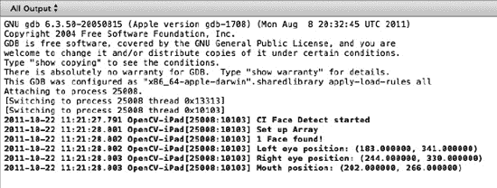

**图 12-7.** *CIDetector 在 iPad 模拟器上运行。*

你可以扩展这个示例，在图像周围重新绘制一个框，如果你愿意的话。如果将坐标与我用于测试的埃尔维斯照片进行比较，你可以大致了解 x,y 坐标。你可以看到左眼位于 (183,341)，右眼位于 (244,330)。重要的是要意识到图像是镜像的。因此，在我们观看模拟器时位于右侧的右眼，其位置比我们观看模拟器时位于左侧的眼睛更靠右且略低。考虑到埃尔维斯脸部的角度，这个检测结果相当准确。

`CIDetector` 返回一个 `CIFaceFeature` 对象，这个对象具有一些我们在控制台中已记录下来的属性。希望随着时间的推移，我们能见证这个类不断扩展，增加诸如情绪检测等新功能。

#### CIDetector 回顾

只需不到 15 行的实际代码（排除日志记录代码），我们就能分析照片中的人脸。无需添加第三方库或手动构建任何静态库。它能与 iOS 5 无缝协作。

另外，如果你将这个功能连接到实时摄像头视图，你会看到它能够跟上摄像头缓冲区的速度。作为练习，如果是在学习 OpenCV 之后进行此操作，可以使用 `timerLabel` 来比较我们目前讨论的这两种方法的性能。

### 使用 Face.com API 方法

在前面的示例中，我们受益于原生处理的速度和强大功能。然而，我们要么牺牲了配置的简便性，要么缺少关于已识别面部对象的信息。

如果有一种简单的方法不仅能检测人脸，还能检测其情绪以及任何其他可以从照片中提取的有用信息，那该多好？

Face.com 正是通过 REST API 实现了这一点。对我们移动开发者来说，不利之处在于始终需要连接互联网。但如今，这可能并不算一个太大的缺点。

#### Faces.detect API 调用

这个来自 face.com 的 API 调用，会返回一张或多张照片中检测到的人脸标签，其中包括标签、眼睛、鼻子和嘴巴的几何信息，以及性别、是否戴眼镜、是否微笑等多种属性。

照片也可以直接在 API 请求中上传。上传照片的请求必须构建为使用 POST 数据发送的 MIME 多部分消息。每个参数（包括原始图像数据）都应指定为表单数据的一个独立块。

使用 face.com API 时需要注意以下几点：

*   所有坐标都以百分比值提供，以支持任何照片比例。照片的高度和宽度（相对于标签的高度/宽度）以像素为单位提供。偏航角、翻滚角和俯仰角以 -90° 到 90° 的范围提供。
*   照片的最大宽度或高度为 900 像素。你可以 POST 或发送更高尺寸照片的链接，但这些照片会在内部调整大小以提高性能。
*   我们返回的每个标签都包含一组属性。其中最重要的是面部属性。它包含该标签是人脸的置信度水平。如开发者工具演示所示，我建议使用置信度超过 50% 的标签。置信度较低的标签可能也是人脸，但误检为阳性的概率更高。

为了比较面部识别算法，我们将用一个调用 face.com API 的方法来扩展我们的示例。我们将在第 13 章中更详细地探讨这种方法。


#### 为示例添加 Face.com 支持  

在 Xcode 中再次打开 `OpenCV-iPad` 项目。从 GitHub 仓库或 Apress 网站（`www.apress.com`）的“源代码/下载”区域复制以下文件。你也可以从 `http://allseeing-i.com/ASIHTTPRequest` 自行下载这些文件。我们将在第 13 章中详细讨论这个库。目前只需将这些文件复制到项目中即可。  

- `ASIHTTPRequestConfig.h`  
- `ASIHTTPRequestDelegate.h`  
- `ASIProgressDelegate.h`  
- `ASICacheDelegate.h`  
- `ASIHTTPRequest.h`  
- `ASIHTTPRequest.m`  
- `ASIDataCompressor.h`  
- `ASIDataCompressor.m`  
- `ASIDataDecompressor.h`  
- `ASIDataDecompressor.m`  
- `ASIFormDataRequest.h`  
- `ASIInputStream.h`  
- `ASIInputStream.m`  
- `ASIFormDataRequest.m`  
- `ASINetworkQueue.h`  
- `ASINetworkQueue.m`  
- `ASIDownloadCache.h`  
- `ASIDownloadCache.m`  
- `ASIAuthenticationDialog.h`  
- `ASIAuthenticationDialog.m`  
- `Reachability.h`（位于 `External/Reachability` 文件夹中）  
- `Reachability.m`（位于 `External/Reachability` 文件夹中）  

此外，你需要将 `CFNetwork`、`SystemConfiguration`、`MobileCoreServices` 和 `libz.dylib` 框架添加到项目中。在继续之前，请确保项目能够无错误地构建。  

#### Face.com API 密钥  

在浏览器中打开 [`http://www.face.com`](http://www.face.com)。右上角应该有一个名为 **开发者** 的链接。点击该链接后，再点击页面中央巨大的 **开始使用** 图片。face.com 的注册流程相当简单，只需提供姓名、电子邮件和密码即可。如果你愿意，还可以填写其余信息。无论如何，完成验证码以证明你是人类，然后点击 **注册**。按照确认邮件中的说明验证你的账户。  

登录后，转到 **API 密钥** 选项卡。创建一个新的应用程序。应用程序的名称无关紧要，我使用了 `iOS AR Demo` 作为应用程序名。你将看到一个类似于图 12-8 的页面。  

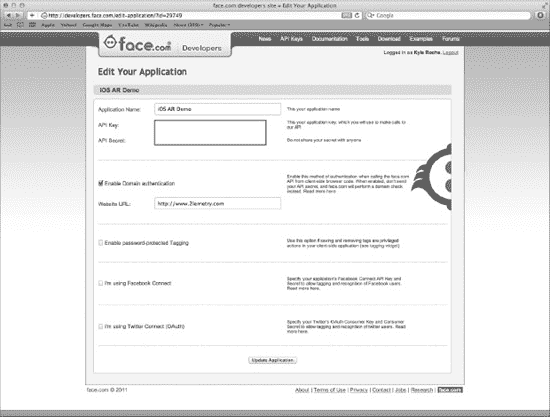  

**图 12-8.** *设置你的 face.com 应用程序。*  

这里有两个设置项，在开始构建应用程序时会用到：**API 密钥** 和 **API 密钥密文**。  

#### 添加 Face.com 调用  

在 Xcode 中打开 `MainViewController.h`。在头文件中导入 `ASIFormDataRequest.h`。切换到 `MainViewController.m`。在私有块的 `import` 语句之后，声明一个名为 `FaceDotComFaceDetect` 的私有方法。  

添加代码清单 12-17 中的方法。  

**代码清单 12-17.** *FaceDotComFaceDetect 方法*  

```objc
- (void)FaceDotComFaceDetect {  
    NSAutoreleasePool * pool = [[NSAutoreleasePool alloc] init];  
    NSData * imageData = UIImageJPEGRepresentation(cameraView.image, 90);  

    NSURL * url = [NSURL URLWithString:@"http://api.face.com/faces/detect.json"];  

    ASIFormDataRequest *request = [ASIFormDataRequest requestWithURL:url];  
    [request addPostValue:@"" forKey:@"api_key"];  
    [request addPostValue:@"" forKey:@"api_secret"];  
    [request addPostValue:@"all" forKey:@"attributes"];  
    [request addData:imageData withFileName:@"image.jpg" andContentType:@"image/jpeg"  
            forKey:@"filename"];  

    [request startSynchronous];  

    NSError *error = [request error];  
    if (!error) {  
        NSString *response = [request responseString];  
        NSDictionary *feed = [NSJSONSerialization JSONObjectWithData:[request responseData]  
                                                             options:kNilOptions  
                                                               error:&error];  

        NSLog(@"RETURN: %@", [feed allKeys]);  
        NSLog(@"%@",response);  
    } else {  
        NSLog(@"An error occured %d",[error code]);  
    }  

    [pool drain];  
}
```

在逐步分析之前，请确保将代码中**加粗显示**的 face.com 凭据替换为实际值。稍后我们将讨论第二个加粗部分。  

该方法与我们之前用于面部识别的另外两种方法类似。首先，我们为内存管理设置了一个 `NSAutoreleasePool`。接着，我们从 `cameraViewUIImageView` 获取 `UIImage`。不过，这次我们为 face.com API 设置了一个 HTTP POST 请求。我们将原始 JPEG 数据作为空参数添加到 POST 请求体中。  

然后，我们分析响应以确保未抛出异常。如果没有错误，我们将 JSON 响应序列化并转换为 `NSDictionary`。  

最后，我们只需将响应打印到控制台。最后一次更新 `didFinishPickingImage` 方法，注释掉之前的方法，并调用我们的新方法。更新后的方法应如代码清单 12-18 所示。  

**代码清单 12-18.** *更新后的 `didFinishPickingImage`*  

```objc
- (void)imagePickerController:(UIImagePickerController *)picker  
didFinishPickingImage:(UIImage *)image editingInfo:(NSDictionary *)editingInfo {  
    [self dismissModalViewControllerAnimated:YES];  
    cameraView.image = image;  

    //[self openCVFaceDetect];  
    //[self CIDetectorFaceDetect];  
    [self FaceDotComFaceDetect];  
}
```

在运行应用程序之前，我们先讨论一下代码清单 12-17 中的第二个加粗代码段。iOS 5 引入了对框架对象的原生 JSON 支持。你可以使用新的 `NSJSONSerialization` 类将 JSON 转换为 Foundation 对象，或将 Foundation 对象转换为 JSON。  

可转换为 JSON 的对象必须满足以下属性：  

- 顶层对象是 `NSArray` 或 `NSDictionary`。  
- 所有对象都是 `NSString`、`NSNumber`、`NSArray`、`NSDictionary` 或 `NSNull` 的实例。  
- 所有字典键都是 `NSString` 的实例。  
- 数字不能是 NaN 或无穷大。  

好了，运行项目。为了保持一致性，我再次选择同一张埃尔维斯图片。新请求的控制台输出如代码清单 12-19 所示。  

**代码清单 12-19.** *face.com 请求的控制台输出*


`2011-10-22 14:41:08.392 OpenCV-iPad[25731:10103] RETURN: (  
    status,  
    photos,  
    usage  
)  
2011-10-22 14:41:08.393 OpenCV-iPad[25731:10103]  
{  
   "photos":[  
      {  
         "url":"http:\/\/face.com\/images\/ph\/f1a498f5c46aab132f4a1d980297698f.jpg",  
         "pid":"F@daa96ea9dcce39470a09ea5648c87356_cd31b28498224cf9ccb39f9194569af8",  
         "width":380,  
         "height":481,  
         "tags":[  
            {  

"tid":"TEMP_F@daa96ea9dcce39470a09ea5648c87356_cd31b28498224cf9ccb39f9194569af8_53.68_35  
.55_0_0",  
               "recognizable":true,  
               "threshold":null,  
               "uids":[  
               ],  
               "gid":null,  
               "label":"",  
               "confirmed":false,  
               "manual":false,  
               "tagger_id":null,  
               "width":32.11,  
               "height":25.36,  
               "center":{  
                  "x":53.68,  
                  "y":35.55  
               },  
               "eye_left":{  
                  "x":48.95,  
                  "y":27.54  
               },  
               "eye_right":{  
                  "x":63.83,  
                  "y":32.24  
               },  
               "mouth_left":{  
                  "x":45.09,  
                  "y":39.27  
               },  
               "mouth_center":{  
                  "x":49.54,  
                  "y":41.74  
               },  
               "mouth_right":{  
                  "x":56.75,  
                  "y":42.99  
               },  
               "nose":{  
                  "x":50.21,  
                  "y":37.12  
               },  
               "ear_left":null,  
               "ear_right":null,  
               "chin":null,  
               "yaw":-14.78,  
               "roll":21.81,  
               "pitch":-7.49,  
               "attributes":{  
                  "glasses":{  
                     "value":"false",  
                     "confidence":88  
                  },  
                  "smiling":{  
                     "value":"true",  
                     "confidence":83  
                  },  
                  "face":{  
                     "value":"true",  
                     "confidence":92  
                  },  
                  "gender":{  
                     "value":"male",  
                     "confidence":33  
                  },  
                  "mood":{  
                     "value":"happy",  
                     "confidence":76  
                  },  
                  "lips":{  
                     "value":"parted",  
                     "confidence":92  
                  }  
               }  
            }  
         ]  
      }  
   ],  
   "status":"success",  
   "usage":{  
      "used":1,  
      "remaining":4999,  
      "limit":5000,  
      "reset_time_text":"Sat, 22 Oct 2011 21:41:07 +0000",  
      "reset_time":1319319667  
   }  
}`

除了 Elvis 被判定为男性的置信度只有 33%之外，其余结果与我们之前所见类似。在数据结构上存在一些差异值得注意。Face.com 使用百分比来表示 x、y 坐标，而非像素值。此外，y 坐标的起点是屏幕顶部而非底部。

花些时间分析一下 Face.com 返回结果中的细节。Face.com 不仅能够检测用户的情绪，还能识别一些可分辨的特征，比如用户是否戴眼镜、嘴唇是否张开。许多应用都能从这种精细程度的数据中获益。希望未来我们能在`CIDetector`类中也看到类似功能。

#### 性能测量

以上方法各有不同，但我们可以对比一下它们的速度以供参考。在项目中新建一个名为`CodeTimestamps.m`的类，使其继承自`NSObject`。更新头文件以使其与代码清单 12-20 中的代码保持一致。

直接从 GitHub 或 Apress 网站（[`www.apress.com`](http://www.apress.com)）上的项目中复制这些文件可能会更简单。本书的代码仓库中包含了相应的头文件和版权声明。

**代码清单 12–20.** *CodeTimestamps.h*

```
#import <Foundation/Foundation.h>

// 注释掉此行可禁用时间戳日志记录。
#define USE_TIMESTAMPS 1

// 计时数据输出到日志的频率。
#define kLogTimeInterval 10.0

// 宏，用于实现高效的一次性函数调用。
// 令牌拼接技巧来源于：
// http://bit.ly/fQ6Glh
#define TokenPasteInternal(x,y) x ## y
#define TokenPaste(x,y) TokenPasteInternal(x,y)
#define UniqueTokenMacro TokenPaste(unique,__LINE__)
#define OneTimeCall(x) \
{ static BOOL UniqueTokenMacro = NO; \
if (!UniqueTokenMacro) {x; UniqueTokenMacro = YES; }}

// 用于性能调优的函数与宏。
void LogTimeStampInMethod(const char *fnName, int lineNum);
void LogTimestampChunkInMethod(const char *fnName, int lineNum, BOOL isStart, BOOL
isEnd);
void printAllLogs();
#ifdef USE_TIMESTAMPS

#define LogTimestamp LogTimeStampInMethod(__FUNCTION__, __LINE__)
#define LogTimestampStartChunk LogTimestampChunkInMethod(__FUNCTION__, __LINE__, YES,
NO)
#define LogTimestampMidChunk LogTimestampChunkInMethod(__FUNCTION__, __LINE__, NO, NO)
#define LogTimestampEndChunk LogTimestampChunkInMethod(__FUNCTION__, __LINE__, NO, YES)

#else

#define LogTimestamp
#define LogTimestampStartChunk
#define LogTimestampMidChunk
#define LogTimestampEndChunk

#endif

#ifndef PrintName
#define PrintName NSLog(@"%s", __FUNCTION__)
#endif
```

在 Xcode 中打开`CodeTimestamps.m`，并添加代码清单 12–21 中的代码。

**代码清单 12–21.** *CodeTimestamps.m*

```
#import "CodeTimestamps.h"

#import <mach/mach.h>
#import <mach/mach_time.h>

#define kNumSlowestChunks 5
#define kNumMidPoints 5

static NSMutableArray *chunkData = nil;

@class ChunkTimeInterval;

@interface LogHelper : NSObject {
@private
    NSTimer *logTimer;
    NSMutableArray *pendingLines;
    NSMutableArray *slowestChunks;
}

+ (LogHelper *)sharedInstance;

- (void)startLoggingTimer;
- (void)printOutTimingData:(NSTimer *)timer;
- (void)addLogString:(NSString *)newString;

- (void)maybeAddTimeIntervalAsSlowest:(ChunkTimeInterval *)timeInterval;
- (void)logSlowestChunks;

- (void)consolidateTimeIntervals:(NSMutableArray *)timeIntervals;

@end

@interface ChunkStamp : NSObject {
@public
    const char *fnName;
    int lineNum;
    uint64_t timestamp;
    NSThread *thread;
    BOOL isStart;
    BOOL isEnd;
}

- (NSComparisonResult)compare:(id)other;

@end

void printAllLogs() {
        [[LogHelper sharedInstance] printOutTimingData:nil];
}

uint64_t NanosecondsFromTimeInterval(uint64_t timeInterval) {
    static struct mach_timebase_info timebase_info;
    OneTimeCall(mach_timebase_info(&timebase_info));
    timeInterval *= timebase_info.numer;
    timeInterval /= timebase_info.denom;
    return timeInterval;
}
```


```objectivec
// 此函数需要 _ 快速 _ 执行，以尽量减少对时序数据的干扰。
// 因此我们实际上不会在函数内部使用 NSLog，而是使用 LogHelper。
void LogTimeStampInMethod(const char *fnName, int lineNum) {
    OneTimeCall([[LogHelper sharedInstance] startLoggingTimer]);
    static uint64_t lastTimestamp = 0;
    uint64_t thisTimestamp = mach_absolute_time();
    NSString *logStr = nil;
    if (lastTimestamp == 0) {
        logStr = [NSString stringWithFormat:@"* %s:%4d", fnName, lineNum];
    } else {
        uint64_t elapsed = NanosecondsFromTimeInterval(thisTimestamp - lastTimestamp);
        logStr = [NSString stringWithFormat:@"* %s:%4d - %9llu nsec since last timestamp",
                  fnName, lineNum, elapsed];
    }
    [[LogHelper sharedInstance] addLogString:logStr];
    lastTimestamp = thisTimestamp;
}

void InitChunkData() {
    if (chunkData) return;
    chunkData = [NSMutableArray new];
}

void LogTimestampChunkInMethod(const char *fnName, int lineNum, BOOL isStart, BOOL isEnd) {
    OneTimeCall(InitChunkData());
    OneTimeCall([[LogHelper sharedInstance] startLoggingTimer]);
    ChunkStamp *stamp = [[ChunkStamp new] autorelease];
    stamp->fnName = fnName;
    stamp->lineNum = lineNum;
    stamp->timestamp = mach_absolute_time();
    stamp->thread = [NSThread currentThread];
    stamp->isStart = isStart;
    stamp->isEnd = isEnd;
    @synchronized(chunkData) {
        [chunkData addObject:stamp];
    }
}

@interface ChunkTimeInterval : NSObject {
@public
    NSString *intervalName;  // strong
    uint64_t nanoSecsElapsed;
}
- (id)initFromStamp:(ChunkStamp *)stamp1 toStamp:(ChunkStamp *)stamp2;
@end

@implementation ChunkTimeInterval
- (id)initFromStamp:(ChunkStamp *)stamp1 toStamp:(ChunkStamp *)stamp2 {
    if (![super init]) return nil;
    intervalName = [[NSString stringWithFormat:@"%s:%d - %s:%d",
                     stamp1->fnName, stamp1->lineNum, stamp2->fnName, stamp2->lineNum] retain];
    nanoSecsElapsed = NanosecondsFromTimeInterval(stamp2->timestamp - stamp1->timestamp);
    return self;
}
- (void)dealloc {
    [intervalName release];
    [super dealloc];
}
- (NSString *)description {
    return [NSString stringWithFormat:@"<%@ %p> %@ %llu", [self class], self, intervalName, nanoSecsElapsed];
}
@end

@implementation LogHelper

+ (LogHelper *)sharedInstance {
    static LogHelper *instance = nil;
    if (instance == nil) instance = [LogHelper new];
    return instance;
}

- (id)init {
    if (![super init]) return nil;
    pendingLines = [NSMutableArray new];
    slowestChunks = [NSMutableArray new];
    return self;
}

- (void)startLoggingTimer {
    if (logTimer) return;
    logTimer = [NSTimer scheduledTimerWithTimeInterval:kLogTimeInterval
                                                target:self
                                              selector:@selector(printOutTimingData:)
                                              userInfo:nil
                                               repeats:YES];
}
- (void)printOutTimingData:(NSTimer *)timer {
    BOOL didLogAnything = NO;

    // 处理待处理的行。
    if ([pendingLines count]) {
        NSLog(@"==== 开始非块时间戳数据（来自 \"LogTimestamp\"）====");
        for (NSString *logString in pendingLines) {
            NSLog(@"%@", logString);
        }
        [pendingLines removeAllObjects];
        didLogAnything = YES;
    }

    // 处理块数据。
    if ([chunkData count]) {
        NSLog(@"==== 开始块时间戳数据（来自 \"LogTimestamp{Start,Mid,End}Chunk\"）====");
        @synchronized(chunkData) {
            [chunkData sortUsingSelector:@selector(compare:)];
            NSThread *thread = nil;
            NSMutableArray *timeIntervals = [NSMutableArray array];
            uint64_t totalNanoSecsThisChunk;
            uint64_t totalNanoSecsThisThread;
            int numRunsThisThread;
            BOOL thisThreadHadChunks = NO;
            BOOL midChunk = NO;
            ChunkStamp *lastStamp = nil;
            NSString *chunkName = nil;
            for (ChunkStamp *chunkStamp in chunkData) {
                if (chunkStamp->thread != thread) {
                    if (thisThreadHadChunks) {
                        NSLog(@"++ 块 = %@，平均时间 = %.4fs", chunkName,
                              (float)totalNanoSecsThisThread / numRunsThisThread / 1e9);
                    }

                    thread = chunkStamp->thread;
                    NSLog(@"--- 线程 %p 的数据 ---", thread);
                    [timeIntervals removeAllObjects];
                    midChunk = NO;
                    thisThreadHadChunks = NO;
                    totalNanoSecsThisChunk = 0;
                    totalNanoSecsThisThread = 0;
                    numRunsThisThread = 0;
                }
                if (chunkStamp->isStart) {
                    if (midChunk) {
                        NSLog(@"错误：LogTimestampStartChunk 在没有对应的 LogTimestampEndChunk 的情况下被连续触发了两次。");
                    }
                    midChunk = YES;
                    thisThreadHadChunks = YES;
                    chunkName = [NSString stringWithFormat:@"%s:%d", chunkStamp->fnName, chunkStamp->lineNum];
                } else if (midChunk) {
                    ChunkTimeInterval *timeInterval = [[[ChunkTimeInterval alloc] initFromStamp:lastStamp toStamp:chunkStamp] autorelease];
                    [timeIntervals addObject:timeInterval];
                    totalNanoSecsThisChunk += timeInterval->nanoSecsElapsed;
                    if (chunkStamp->isEnd) {
                        totalNanoSecsThisThread += totalNanoSecsThisChunk;
                        numRunsThisThread++;
                        chunkName = [NSString stringWithFormat:@"%@ - %s:%d", chunkName, chunkStamp->fnName, chunkStamp->lineNum];
                        NSLog(@"+ 块 = %@，时间 = %.4fs", chunkName, (float)totalNanoSecsThisChunk/1e9);

                        [self consolidateTimeIntervals:timeIntervals];
                        for (int i = 0; i < [timeIntervals count] && i < kNumMidPoints; ++i) {
                            ChunkTimeInterval *timeInterval = [timeIntervals objectAtIndex:i];
                            int percentTime = (int)round(100.0 * (float)timeInterval->nanoSecsElapsed / totalNanoSecsThisChunk);
                            NSLog(@"    %2d%% 位于 %@", percentTime, timeInterval->intervalName);
                        }

                        ChunkTimeInterval *totalInterval = [[ChunkTimeInterval new] autorelease];
                        totalInterval->intervalName = [chunkName retain];
                        totalInterval->nanoSecsElapsed = totalNanoSecsThisChunk;
                        [self maybeAddTimeIntervalAsSlowest:totalInterval];

                        [timeIntervals removeAllObjects];
                        totalNanoSecsThisChunk = 0;
                        midChunk = NO;
                    }
```

```objc
                }
                lastStamp = chunkStamp;
            }
            if (thisThreadHadChunks) {
                NSLog(@"++ Chunk = %@, avg time = %d nsec", chunkName,
                      totalNanoSecsThisThread / numRunsThisThread);
            }
            [chunkData removeAllObjects];
        }
        didLogAnything = YES;
    }
    if (didLogAnything) {
        [self logSlowestChunks];
        NSLog(@"==== 结束时间戳数据 ====");
    }
}

- (void)addLogString:(NSString *)newString {
    [pendingLines addObject:newString];
}

- (void)maybeAddTimeIntervalAsSlowest:(ChunkTimeInterval *)timeInterval {
    if ([slowestChunks count] < kNumSlowestChunks ||
        ((ChunkTimeInterval *)[slowestChunks lastObject])->nanoSecsElapsed <
timeInterval->nanoSecsElapsed) {
        [slowestChunks addObject:timeInterval];
        NSSortDescriptor *sortByTime = [[[NSSortDescriptor alloc]
initWithKey:@"nanoSecsElapsed" ascending:NO] autorelease];
        [slowestChunks sortUsingDescriptors:[NSArray arrayWithObject:sortByTime]];
        if ([slowestChunks count] > kNumSlowestChunks) [slowestChunks removeLastObject];
    }
}

- (void)logSlowestChunks {
    if ([slowestChunks count] == 0) return;
    NSLog(@"==== 目前最慢的代码块 ====");
    for (ChunkTimeInterval *timeInterval in slowestChunks) {
        NSLog(@"# Chunk = %@, time = %.4fs", timeInterval->intervalName,
(float)timeInterval->nanoSecsElapsed/1e9);
    }
}

- (void)consolidateTimeIntervals:(NSMutableArray *)timeIntervals {
    NSSortDescriptor *sortByName = [[[NSSortDescriptor alloc]
initWithKey:@"intervalName" ascending:YES] autorelease];
    [timeIntervals sortUsingDescriptors:[NSArray arrayWithObject:sortByName]];

    NSMutableArray *consolidatedIntervals = [NSMutableArray array];
    NSString *lastName = nil;
    ChunkTimeInterval *thisInterval = nil;
    for (ChunkTimeInterval *timeInterval in timeIntervals) {
        if ([lastName isEqualToString:timeInterval->intervalName]) {
            thisInterval->nanoSecsElapsed += timeInterval->nanoSecsElapsed;
        } else {
            thisInterval = [[ChunkTimeInterval new] autorelease];
            thisInterval->intervalName = [timeInterval->intervalName retain];
            thisInterval->nanoSecsElapsed = timeInterval->nanoSecsElapsed;
            [consolidatedIntervals addObject:thisInterval];
        }
        lastName = timeInterval->intervalName;

    }
    [timeIntervals removeAllObjects];
    [timeIntervals addObjectsFromArray:consolidatedIntervals];

    NSSortDescriptor *sortByTime = [[[NSSortDescriptor alloc]
initWithKey:@"nanoSecsElapsed" ascending:NO] autorelease];
    [timeIntervals sortUsingDescriptors:[NSArray arrayWithObject:sortByTime]];
}

@end

@implementation ChunkStamp

- (NSComparisonResult)compare:(id)other {
    ChunkStamp *otherStamp = (ChunkStamp *)other;
    if (thread != otherStamp->thread) {
        return (thread < otherStamp->thread ? NSOrderedAscending : NSOrderedDescending);
    }
    if (strcmp(fnName, otherStamp->fnName) != 0) {
        return (strcmp(fnName, otherStamp->fnName) < 0 ? NSOrderedAscending :
NSOrderedDescending);
    }
    if (timestamp == otherStamp->timestamp) return NSOrderedSame;
    return (timestamp < otherStamp->timestamp ? NSOrderedAscending :
NSOrderedDescending);
}

@end
```

这段代码是 Pulse 公司开源 `moriarty` 库的一部分。你可以在他们的网站 ([www.pulse.me](http://www.pulse.me)) 上阅读更多相关信息。基本上，你需要在想要测量的方法开头和结尾插入对 `LogTimestamp` 宏的函数调用。它能精确到纳秒级计时，因此你可以准确记录项目中每个方法的执行耗时。

回到 `MainViewController.m` 并导入我们刚刚创建的新类。在人脸识别方法的起始和结束位置，添加代码清单 12–22 中的代码。

**代码清单 12–22.** *`LogTimestamp` 宏*

```
LogTimestamp;
```

更新 `didFinishPickingImage` 方法，如代码清单 12–23 所示。

**代码清单 12–23.** *更新后的 `didFinishPickingImage` 方法*

```objc
- (void)imagePickerController:(UIImagePickerController *)picker
didFinishPickingImage:(UIImage *)image editingInfo:(NSDictionary *)editingInfo {
    [self dismissModalViewControllerAnimated:YES];
    cameraView.image = image;

    [self openCVFaceDetect];
    //[self CIDetectorFaceDetect];
    //[self FaceDotComFaceDetect];
}
```

运行项目。你应该会在控制台看到类似代码清单 12–24 的输出。输出结果需要几秒钟才能打印出来，请耐心等待。

**代码清单 12–24.** *控制台输出*

```
2011-10-22 15:12:27.753 OpenCV-iPad[26058:10103] ==== 开始非代码块时间戳数据（来自 "LogTimestamp"） ====
2011-10-22 15:12:27.754 OpenCV-iPad[26058:10103] * -[MainViewController
openCVFaceDetect]:  76
2011-10-22 15:12:27.754 OpenCV-iPad[26058:10103] * -[MainViewController
openCVFaceDetect]: 163 -  664215125 nsec since last timestamp
2011-10-22 15:12:27.755 OpenCV-iPad[26058:10103] ==== 结束时间戳数据 ====
```

看起来使用 OpenCV 处理这张图像花费了 61231366 纳秒。对其他方法重复此过程。我的测试结果显示，`CIDetector` 的耗时仅为 OpenCV 的约 29%。此外，如果对应用程序启动时间进行测量，你会发现 OpenCV 的启动耗时远超其他方法。

`CIDetector` 的耗时仅为 face.com 的 18%。这当然可以理解，因为 face.com 涉及网络请求和大量响应数据的返回与解析（使用了原生 JSON 序列化类）。

对比 OpenCV 和 face.com 很有意思。OpenCV 虽然应用程序启动耗时多了整整几秒钟，但在实际处理速度上比完整的 face.com 事务快了约 35%。这种亚秒级的差异对用户来说几乎是无感的。

### 本章小结

本章我们学习了很多内容。早期的人脸识别方法（如 OpenCV）存在一些痛点。这些库已经存在多年，缺少我们在原生 Objective-C 函数和宏中习以为常的便捷性。然而，它们是功能强大的库，为我们在更新的人脸识别方法中所展示的创新铺平了道路。

我们讨论了新的 iOS 5 `CIDetector` 类，以及它无需加载 Haar 级联分类器或用样本训练库，即可分析原生 `UIImage` 对象中面部模式的能力。

最后，我们介绍了一种使用免费 REST API 的非原生方法，该 API 能够分析原始 JPEG 数据。这种方法也帮助我们引入了 iOS 5 新增的原生 JSON 解析功能。

所有这些方法都各有优缺点。我们使用 iPad 2 快速对比了这些事务的速度性能，发现新的 iOS 5 `CIDetector` 类在性能上显著优于其他两种方法。需要注意的是，face.com 确实需要进行完整的网络请求和响应，其速度几乎赶上了原生方法。此外，如果你正在开发跨平台应用，或者你的 Web API 具备额外功能，那么 face.com 的方法可能比纯原生方法更适合你的需求。

在第 13 章中，我们将更深入地研究 face.com 的方法。我们会分析屏幕缓冲区，每隔几秒向 face.com 发送一次请求，并使用 `cocos2D` 在屏幕上叠加显示响应相关信息。

## 第 13 章


# 构建人脸识别增强现实应用

在第 12 章中，我们介绍了几种将人脸和物体识别引入应用的方法。其中有些方法比其他方法更复杂。在本章中，我们将选择其中一种方法，利用人脸识别以及本书已讨论过的其他技术，构建一个功能完备的增强现实应用。

### 应用目的

为这个应用设想一个具体用途有点困难。我并非试图解决某个非常实际的问题，而是想演示到目前为止我们在本书中学到的一些关键概念。

话虽如此，这个应用的初衷是客户服务。诚然，这有点夸大其词，但做起来还是会很有趣。在这个项目中，设想一台 iPad 安装在餐厅的桌子上方，或酒吧的公共区域。我们将分析 iPad 摄像头中人物的情绪，如果发现他/她情绪愤怒，就向客服发出警报。

顺便提一下，我们将基于目前从书中学到的知识来构建这个应用。不幸的是，我们目前学到的方法可能无法如愿奏效。我想提前提醒你这一点。当应用在章节进行到一半时看起来像是坏了，那是故意的。这并非你做错了什么！我们将在后续修复它，并在此过程中了解一些 OpenGL 及其对线程不友好的特性。

### 使用的技术

起初，我们只会在屏幕上叠加一些关于用户的信息。这将是使用 cocos2D 构建更复杂 HUD 层的好练习。我们将扩展此应用，使其能够实际向客服代表发送短信（短消息服务）并报告事件。

我们将使用的核心技术是`face.com` REST API。正如我们在第 12 章中讨论的，`face.com` API 通过 REST 请求接收 JPEG 图像，并返回识别出的人脸的`x,y`坐标，以及关于人物情绪、眼镜和嘴部位置的信息。这是一个非常有用且快速的 API。

### 准备工作

让我们整理一下示例应用所需的技术。要进入有趣的部分，你需要完成三个主要的注册流程。

#### Face.com

打开浏览器访问[`www.face.com`](http://www.face.com)。在右上角应该有一个名为`开发人员`的链接。点击该链接，然后点击页面中央巨大的`开始使用`图片。`face.com`的注册流程相当简单。它只要求你提供姓名、电子邮件和密码。如果你更慷慨一些，可以填写其余信息。无论如何，通过完成验证码证明你是人类，然后点击`注册`。按照确认邮件中的说明验证你的账户。

登录后，转到`API 密钥`选项卡。点击`点击此处设置新应用`的链接来创建一个新应用。你为应用取什么名字并不重要。我用了`iOS AR 演示`作为我的应用名称。你会看到一个类似于图 13-1 的页面。

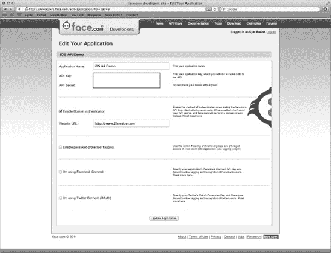

**图 13–1.** *完成`face.com`应用页面。*

在开始构建应用时，你会用到这里的两个设置：`API 密钥`和`API 密钥密码`。关于`face.com`目前就这些。

#### cocos2D

如果你还没有`cocos2D`，请访问[`www.cocos2d-iphone.org/download`](http://www.cocos2d-iphone.org/download)下载适用于 iPhone 的最新稳定版`cocos2D`，在撰写本文时版本为`1.0.1`。我们曾在第 7 章中介绍过在 Xcode 4.2 中安装`cocos2D`，所以如果你是那种会跳过章节的人，现在应该翻回去看看。

#### 设置我们的 Twilio 账户

Twilio 是一个云通信平台，支持短信、语音甚至 VoIP 通信。注册过程也很简单。访问[`www.twilio.com/try-twilio`](http://www.twilio.com/try-twilio)设置你的免费试用账户。

设置好账户后，登录，你会看到仪表盘页面顶部类似于图 13-2 的内容。


**图 13–2.** *登录并进入你的`Twilio`仪表盘页面。*

**注意：** 与`face.com`的凭证类似，你需要记住你的`账户 SID`和`认证令牌`，以便在我们的演示应用中访问`Twilio`的 API。没有`认证令牌`，你的`账户 SID`将毫无用处。因此，切勿分享`认证令牌`！

#### 下载 ASI-HTTP-Request 库

有几个库可用于处理来自 iOS 的 HTTP 请求。事实上，大多数功能都可以直接从头编写。但是，我们将通过 HTTP 以多部分表单上传的形式发送原始图像数据。针对这个特定目的，有一个非常好用的第三方库。

`ASI-HTTP-Request`是一个开源库，可在 GitHub 上的`pokeb/asi-http-request`找到。我已将本例中使用的版本分支到`kyleroche/asi-http-request`，以防你在使用更新版本时遇到任何问题。请将其保存在本地机器上的某个位置。

#### JSON-Framework

我们还需要一些帮助来解析 JSON（JavaScript 对象表示法）消息，因为这是`face.com` API 的首选输出格式（同样也非常适用于`Twilio`）。与`ASI-HTTP-Request`类似，GitHub 上有一个开源项目`stig/json-framework`，我已将其分支到`kyleroche/json-framework`以供参考。请将其保存在本地机器上的某个位置。


### 项目结构

我们来创建项目。打开 Xcode，并使用 cocos2D 模板创建一个新项目，如图 13-3 所示。

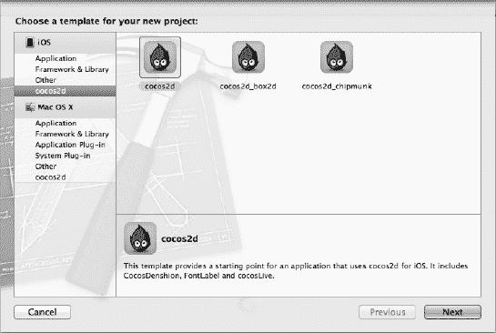

**图 13-3.** *创建一个新的 cocos2D 项目。*

将项目命名为 `Ch13`。如果需要参考可运行的源代码，可以从 [`https://github.com/kyleroche/Professional_iOS_AugmentedReality`](https://github.com/kyleroche/Professional_iOS_AugmentedReality) 或 [`www.apress.com`](http://www.apress.com) 获取。

首先，确保我们拥有运行此应用程序所需的所有引用。添加如图 13-4 所示的框架和库。

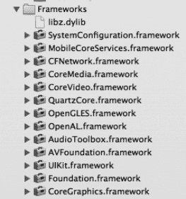

**图 13-4.** *添加必需的框架。*

在继续之前，你应该确保项目在构建时没有错误。cocos2D 通常会有一些警告信息。如果看到任何警告（与我们所编写的代码无关的警告），可以忽略它们。

在你的 Xcode 项目中创建一个名为 `HUD` 的新组。我们将把 HUD 叠加层的资源存储在这个文件夹中。在此组中创建一个新文件。使用 cocos2D 集合中的 `CCNode` 类模板。确保新文件使用 `CCLayer` 子类。将文件命名为 `HUDLayer.m`。

在 GitHub 仓库中（位于 Ch13 目录下）有一个名为 `crosshair.png` 的文件。将此文件复制到你的项目中。通常，你应该将其放在项目的 Resources 文件夹中。确保在将文件复制到项目时，选择了“`如果需要，将项目复制到目标组文件夹中`”。`crosshair.png` 文件如图 13-5 所示。我们将把它放置在摄像头视图中被识别人脸的 x、y 坐标上。


**图 13-5.** *将 `crosshair.png`（用于人脸叠加）复制到你的项目中。*

接下来，我们需要创建一个类来保存人脸识别例程的逻辑。将这个类命名为 `FaceDetectionLayer`。使用 `CCNode` 模板创建另一个类，并确保它也是 `CCLayer` 的子类。此文件应命名为 `FaceDetectionLayer.m`。

现在，因为我有点洁癖，我要对默认设置做一个快速更改，删除一些我们不会用到的文件。删除 `HelloWorldLayer.h` 和 `HelloWorldLayer.m`。在提示时，可以永久删除这些文件。

在 Xcode 中打开 `FaceDetectionLayer.h`，让我们开始构建。

### 设置主场景

删除 `HelloWorldLayer` 对于清理工作很有帮助，但这导致我们的项目中没有主场景。此时，项目将无法构建。在 AppDelegate 中，我们引用了 `HelloWorldLayer` 场景。

你应该已经在 Xcode 中打开了 `FaceDetectionLayer.h`。导入 `HUDLayer.h` 头文件，以便稍后在项目中引用它。创建一个名为 `_hud` 的私有变量来引用 HUD 层类。同时，声明一个静态方法来返回 `scene` 对象，并创建一个名为 `initWithHUD` 的新方法，就像我们在第 7 章的示例中所做的那样。

新的 `FaceDetectionLayer.h` 文件应如代码清单 13-1 所示。

**代码清单 13-1.** *更新后的 `FaceDetectionLayer.h`*

`#import <Foundation/Foundation.h>`
`#import "cocos2d.h"`
**`#import "HUDLayer.h"`**

`@interface FaceDetectionLayer : CCLayer {`
**`HUDLayer *_hud;`**
`}`

**`+ (CCScene *)scene;`**
**`- (id)initWithHUD:(HUDLayer *)hud;`**

`@end`

切换到 `FaceDetectionLayer.m`。添加代码清单 13-2 中的方法。

**代码清单 13-2.** *静态场景方法*

```
+ (CCScene *)scene {
    CCScene *scene = [CCScene node];

    HUDLayer *hud = [HUDLayer node];
    [scene addChild:hud z:1];

    FaceDetectionLayer *layer = [[[FaceDetectionLayer alloc] initWithHUD:hud] autorelease];
    [scene addChild:layer];

    return scene;
}
```

这个方法应该看起来很熟悉（除非你跳过了第 7 章）。我们正在为 cocos2D 创建一个新场景。然后，创建一个额外的 `HUDLayer` 实例，其 `z` 索引高于主场景。这将使我们能够轻松地在摄像头视图（将处理人脸检测）上叠加一些有用的图形，例如十字准线 PNG 文件或关于目标情绪（快乐、悲伤、中性）的文本信息。

最后，我们调用 `initWithHUD` 方法。说到这个方法，我们也需要添加该代码。在静态场景方法之后，添加代码清单 13-3 中的方法。

**代码清单 13-3.** *`initWithHUD` 方法*

```
- (id)initWithHUD:(HUDLayer *)hud {
    if (self = [super init]) {
        _hud = hud;
    }
    return self;
}
```

此方法仅替代 cocos2D 模板提供的默认 `init` 方法。我们使用 HUD 实例创建自己的层，而不是单独的基础层。

最后一项要添加到 `FaceDetectionLayer.m` 中的是 `dealloc` 方法。在实现文件的末尾添加代码清单 13-4 中的方法。

**代码清单 13-4.** *`dealloc` 方法*

```
- (void)dealloc {
    [super dealloc];
}
```

如果现在尝试构建项目，你应该仍然会收到一个错误。它会是某种关于在 `AppDelegate` 类中引用 `HelloWorldLayer` 的 mach-o 链接错误。在 Xcode 中打开 `AppDelegate.m`，将 `HelloWorldLayer` 的导入语句更改为导入 `FaceDetectionLayer.h`。

找到代码清单 13-5 中的代码，并将其替换为代码清单 13-6 中的代码。

**代码清单 13-5.** *找到这段代码……*

```
// 运行介绍场景
[[CCDirector sharedDirector] runWithScene: [HelloWorldLayer scene]];
```

**代码清单 13-6.** *将其替换为……*

```
// 运行介绍场景
 [[CCDirector sharedDirector] runWithScene: [FaceDetectionLayer scene]];
```

此时，你的项目应该可以无错误地构建了。这里仍然完全没有功能，但我们至少已经准备好开始向前推进了。

我应该指出，我们刚刚添加的一些内容实际上在最终应用程序中并不会被用到。这是项目中典型应用程序可能开始的地方。我们有一个 `CCNode` 类，它有一个用于返回主主题的静态方法。但是，在这个示例中，我们需要稍微以不同的方式处理事情。当我们稍后删除刚刚添加的一些代码时，这将更有意义。


#### 启用摄像头

我确信你正期待着查看摄像头视图，那么我们就开始吧。在 Xcode 中打开 `AppDelegate.h`。导入 `AVFoundation` 头文件和 `FaceDetectionLayer` 头文件。接着，将 `AppDelegate` 声明为遵守 `AVCaptureVideoDataOutputSampleBufferDelegate` 协议。

我们还需要声明一个名为 `_session` 的私有 `AVCaptureSession` 变量，并创建一个名为 `setupCaptureSession` 的 `void` 方法，用于存储我们采集会话的偏好设置。

修改后的 `AppDelegate.h` 文件应如代码清单 13-7 所示。

**代码清单 13-7.** *更新后的 AppDelegate.h*

```
#import <UIKit/UIKit.h>
#import <AVFoundation/AVFoundation.h>
#import "FaceDetectionLayer.h"

@class RootViewController;

@interface AppDelegate : NSObject <UIApplicationDelegate,
AVCaptureVideoDataOutputSampleBufferDelegate> {
    UIWindow           *window;
    RootViewController *viewController;

AVCaptureSession *_session;
}

@property (nonatomic, retain) UIWindow *window;
- (void)setupCaptureSession;

@end
```

切换到 `AppDelegate.m`。现在可以移除对 `FaceDetectionLayer` 的引用了，因为我们已在头文件中包含了它。找到代码清单 13-8 中所示的代码段，并用代码清单 13-9 中的代码替换它。

**代码清单 13-8.** *找到这段代码 . . .*

```
EAGLView *glView = [EAGLView viewWithFrame:[window bounds]
                 pixelFormat:kEAGLColorFormatRGB565 // kEAGLColorFormatRGBA8
        depthFormat:0
                                                        // GL_DEPTH_COMPONENT16_OES
        ];
```

**代码清单 13-9.** *替换为这段代码 . . .*

```
EAGLView *glView = [EAGLView viewWithFrame:[window bounds]
                 pixelFormat:kEAGLColorFormatRGBA8 // kEAGLColorFormatRGBA8
        depthFormat:0
                                                       // GL_DEPTH_COMPONENT16_OES
        ];
```

我们在第 7 章中也简要讨论过这一点。如果希望将应用图层覆盖在摄像头上而不是静态背景上，就需要更改默认的 `pixelFormat`。

我准备在这里添加一个实用方法，以便简化调试过程。如果你在人群中测试，或者有大量测试对象可供 iPad 摄像头对准，可以跳过此步骤。否则，对于独狼式开发者来说，在此示例中使用前置摄像头或许会很有帮助。在 `dealloc` 方法上方添加代码清单 13-10 中的代码。

**代码清单 13-10.** *检查前置摄像头*

```
-(AVCaptureDevice *)frontFacingCameraIfAvailable
{
    NSArray *videoDevices = [AVCaptureDevice devicesWithMediaType:AVMediaTypeVideo];
    AVCaptureDevice *captureDevice = nil;
    for (AVCaptureDevice *device in videoDevices)
    {
        if (device.position == AVCaptureDevicePositionFront)
        {
            captureDevice = device;
            break;
        }
    }

    if ( ! captureDevice)
    {
        captureDevice = [AVCaptureDevice defaultDeviceWithMediaType:AVMediaTypeVideo];
    }

    return captureDevice;
}
```

此方法仅检查前置摄像头，如果存在则返回其引用。如果不存在，则返回后置摄像头。我们在设置采集设备时将用到此方法。

在头文件中，我们声明了一个名为 `setupCaptureSession` 的方法。现在就来创建它。在刚添加的 `frontFacingCameraIfAvailable` 方法下方，添加代码清单 13-11 中的方法。

**代码清单 13-11.** *设置采集会话*

```
- (void)setupCaptureSession
{
    NSError *error = nil;

    // 创建会话。
    _session = [[AVCaptureSession alloc] init];

    // 如果处理算法能够应对，则将会话配置为生成较低分辨率的视频帧。
    // 我们将为所选设备指定中等质量。
    _session.sessionPreset = AVCaptureSessionPresetMedium;

    // 查找合适的 AVCaptureDevice。
    AVCaptureDevice *device = [self frontFacingCameraIfAvailable];/*[AVCaptureDevice

defaultDeviceWithMediaType:AVMediaTypeVideo];*/

    // 使用该设备创建设备输入并将其添加到会话中。
    AVCaptureDeviceInput *input = [AVCaptureDeviceInput deviceInputWithDevice:device
                                                                        error:&error];
    if (!input) {
        // 妥善处理错误。
    }
    [_session addInput:input];

    // 创建一个 VideoDataOutput 并将其添加到会话中。
    AVCaptureVideoDataOutput *output = [[AVCaptureVideoDataOutput alloc] init];
    [_session addOutput:output];

    // 配置输出。
    dispatch_queue_t queue = dispatch_queue_create("chapter13", NULL);
    [output setSampleBufferDelegate:self queue:queue];
    dispatch_release(queue);

    // 指定像素格式。
    output.videoSettings =
    [NSDictionary dictionaryWithObject:
     [NSNumber numberWithInt:kCVPixelFormatType_32BGRA]
                                forKey:(id)kCVPixelBufferPixelFormatTypeKey];

    // 若希望将帧率限制到一个已知值，例如 15 fps，请设置
    // minFrameDuration。

    //output.minFrameDuration = CMTimeMake(1, 15);

    // 启动会话运行以开始数据流。
    [_session startRunning];
}
```

其中部分代码直接来自苹果开发者文档。我们从顶部开始逐步说明。在设置好一个用于存放任何不可预见错误的占位符之后，我们创建了一个 `AVCaptureSession` 的新实例。正如我们在第 6 章中讨论的，该类用于从摄像头采集视频帧。它比向用户显示 `UIImagePicker` 更灵活一些。

接着，我们使用之前创建的实用方法来检测是否有前置摄像头可用。如果你没有前置摄像头，或者你确实在人群中测试此应用，我在代码注释中留下了默认选项供你使用。利用我们的摄像头设备，我们设置了 `AVCaptureDeviceInput` 对象，并将该输入添加到我们的 `AVCaptureSession` 中。

在这个示例中，我们还将使用视频输出。因此，接下来我们分配了一个新的 `AVCaptureVideoDataOutput` 对象，并将其添加到 `AVCaptureSession` 中。

下一步对我们来说是新的。我们需要设置一个 `dispatch_queue_t` 实例变量来存放我们排队等待的视频帧。在此示例中我们不讨论 GCD（Grand Central Dispatch），但扩展本章内容以使用 GCD 来代替我们设置的普通 `dispatch_queue_t` 实例变量会很有趣。

最后，我们设置了 `AVCaptureVideoDataOutput` 实例的 `pixelFormat`，然后就可以启动采集会话了。

所以，我想我们已经同步了。找到 `applicationDidFinishLaunching` 方法的最后一行，并添加代码清单 3-12 中的代码。

**代码清单 13–12.** *调用我们的新方法*

```
[self setupCaptureSession];
```

如果你现在运行该应用程序，只会看到黑屏。这是因为我们的背景从未设置为透明。找到代码清单 13-13 中所示的代码行。它位于 `applicationDidFinishLaunching` 方法的中间位置。

**代码清单 13–13.** *找到这段代码 . . .*

```
// 将视图控制器设为主窗口的子视图
 [window addSubview: viewController.view];
```


接下来，我们要将视图设为透明，以便能看到底部的摄像头画面。在此之前，先在 `AppDelegate.h` 文件中声明一个类型为 `UIView` 的私有变量，命名为 `_cameraView`。实际上，既然已经打开这个文件，不妨再添加一个名为 `_imageView` 的 `UIImageView` 实例。然后，切换回 `AppDelegate.m` 文件，并在 代码清单 13–13 的下方添加 代码清单 13–14 中的代码。

**代码清单 13–14.** *将视图设为透明*

```
// 将视图设为透明。
    [CCDirector sharedDirector].openGLView.backgroundColor = [UIColor clearColor];
    [CCDirector sharedDirector].openGLView.opaque = NO;

    glClearColor(0.0, 0.0, 0.0, 0.0);

    // 准备覆盖层视图并将其添加到窗口。
    _cameraView = [[UIView alloc] initWithFrame:[[UIScreen mainScreen] bounds]];
    _cameraView.opaque = NO;
    _cameraView.backgroundColor = [UIColor clearColor];

    [window addSubview:_cameraView];

    _imageView = [[UIImageView alloc] initWithFrame:[[UIScreen mainScreen] bounds]];
    [_cameraView addSubview:_imageView];

    [window bringSubviewToFront:viewController.view];
```

首先，我们从单例类 `CCDirector` 中取出 `sharedDirector`，并设置其 `backgroundColor` 和 `opaque` 属性，使两者均对屏幕透明。

现在，直接运行当前的项目。当我们使用 `UIImagePickerViewController` 处理类似的 cocos2D 项目时，曾采用同样的步骤，并成功在摄像头视图之上构建图层。然而，你运行应用后会发现，屏幕上仍然一片漆黑。这是因为（如 第 6 章 所述）使用 `AVCaptureSession` 涉及两个步骤：将图像从缓冲区排入队列，但同时还需要对这些图像进行实际处理。

要从缓冲区获取图像，我们可以使用 `AVCaptureVideoDataOutputSampleBufferDelegate` 类中的委托方法 `didOutputSampleBuffer`。此方法允许我们在图像被捕获时将其从缓冲区提取出来。

在引入委托方法之前，再次切换到 `AppDelegate.h` 文件，声明一个名为 `_settingImage` 的 `BOOL` 类型标志，以便跟踪当前是否正处于该处理过程中。将 代码清单 13–15 中的工具方法添加到你的实现文件中。

**代码清单 13–15.** *setImageToView 方法*

```
-(void)setImageToView:(UIImage*)image {
    _imageView.image = image;
    _settingImage = NO;
}
```

*这个方法很简单，只是将 `UIImageView` 设置为方法传入的图像。接下来，将其与接收缓冲图像的委托方法关联起来。在 `setImageToView` 方法下方添加 代码清单 13–16 中的方法。面部识别：📷*

**代码清单 13–16.** *从缓冲区提取图像的方法*

```
- (UIImage *) imageFromSampleBuffer:(CMSampleBufferRef) sampleBuffer
{
    // 获取 CMSampleBuffer 的核心视频图像缓冲区
    CVImageBufferRef imageBuffer = CMSampleBufferGetImageBuffer(sampleBuffer);
    // 锁定像素缓冲区的基地址
    CVPixelBufferLockBaseAddress(imageBuffer, 0);

    // 获取像素缓冲区的每行字节数
    void *baseAddress = CVPixelBufferGetBaseAddress(imageBuffer);

    // 获取像素缓冲区的每行字节数
    size_t bytesPerRow = CVPixelBufferGetBytesPerRow(imageBuffer);
    // 获取像素缓冲区的宽度和高度
    size_t width = CVPixelBufferGetWidth(imageBuffer);
    size_t height = CVPixelBufferGetHeight(imageBuffer);

    // 创建设备相关的 RGB 色彩空间
    CGColorSpaceRef colorSpace = CGColorSpaceCreateDeviceRGB();

    // 使用样本缓冲区数据创建位图图形上下文
    CGContextRef context = CGBitmapContextCreate(baseAddress, width, height, 8,
                                                 bytesPerRow, colorSpace, kCGBitmapByteOrder32Little | kCGImageAlphaPremultipliedFirst);
    // 从位图图形上下文中的像素数据创建 Quartz 图像
    CGImageRef quartzImage = CGBitmapContextCreateImage(context);
    // 解锁像素缓冲区
    CVPixelBufferUnlockBaseAddress(imageBuffer,0);

    // 释放上下文和色彩空间
    CGContextRelease(context);
    CGColorSpaceRelease(colorSpace);

    // 从 Quartz 图像创建 UIImage 对象
    UIImage *image = [UIImage imageWithCGImage:quartzImage];

    // 释放 Quartz 图像
    CGImageRelease(quartzImage);

    return (image);
}

- (void)captureOutput:(AVCaptureOutput *)captureOutput
didOutputSampleBuffer:(CMSampleBufferRef)sampleBuffer
fromConnection:(AVCaptureConnection *)connection
{
    UIImage *image = [self imageFromSampleBuffer:sampleBuffer];

    if(_settingImage == NO){
        _settingImage = YES;
        [NSThread detachNewThreadSelector:@selector(setImageToView:) toTarget:self withObject:image];
    }
}
```

我们复制的第一个方法同样直接来自 Apple 开发者文档。该方法从 `CMSampleBufferRef` 缓冲区返回一个 `UIImage` 对象。我们在 `didOutputSampleBuffer` 委托方法的第一行调用它。接着，在 `didOutputSampleBuffer` 方法中，检查我们是否已经在为 `UIImageView` 设置图像。如果尚未开始，则为我们之前创建的 `setImageToView` 工具方法分离一个新线程。

再次运行项目。视频虽然显示出来了，但效果并不符合预期。我的屏幕画面如 图 13–6 所示。

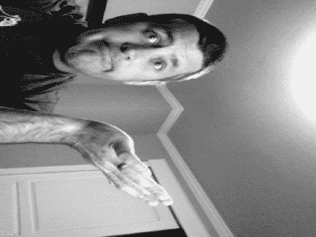

**图 13–6.** *画面倒过来了！ *

以 cocos2D 模板中的数字覆盖层作为参考。对于本示例（虽然完成后会旋转），我在所有截图中均使用横向右侧模式进行测试。

好的，我们需要将画面旋转 90 度进行调整，同时防止图像拉伸。将 代码清单 13–17 中的工具方法添加到 `AppDelegate.m` 文件中。请确保将其放在 `setImageToView` 方法之前，否则编译项目时会收到警告信息。

**代码清单 13–17.** *rotateImage 工具方法*

```
-(UIImage *) rotateImage:(UIImage*)image orientation:(UIImageOrientation) orient {
    CGImageRef imgRef = image.CGImage;
    CGAffineTransform transform = CGAffineTransformIdentity;
    //UIImageOrientation orient = image.imageOrientation;
    CGFloat scaleRatio = 1;
    CGFloat width = image.size.width;
    CGFloat height = image.size.height;    
    CGSize imageSize = image.size;
    CGRect bounds = CGRectMake(0, 0, width, height);
    CGFloat boundHeight;
```


```objective-c
switch(orient) {
    case UIImageOrientationUp:
        transform = CGAffineTransformIdentity;
        break;
    case UIImageOrientationUpMirrored:
        transform = CGAffineTransformMakeTranslation(imageSize.width, 0.0);
        transform = CGAffineTransformScale(transform, -1.0, 1.0);
        break;
    case UIImageOrientationDown:
        transform = CGAffineTransformMakeTranslation(imageSize.width,
                                                     imageSize.height);
        transform = CGAffineTransformRotate(transform, M_PI);
        break;
    case UIImageOrientationDownMirrored:
        transform = CGAffineTransformMakeTranslation(0.0, imageSize.height);
        transform = CGAffineTransformScale(transform, 1.0, -1.0);
        break;
    case UIImageOrientationLeftMirrored:
        boundHeight = bounds.size.height;
        bounds.size.height = bounds.size.width;
        bounds.size.width = boundHeight;
        transform = CGAffineTransformMakeTranslation(imageSize.height, imageSize.height);
        transform = CGAffineTransformScale(transform, -1.0, 1.0);
        transform = CGAffineTransformRotate(transform, 3.0 * M_PI / 2.0);
        break;
    case UIImageOrientationLeft:
        boundHeight = bounds.size.height;
        bounds.size.height = bounds.size.width;
        bounds.size.width = boundHeight;
        transform = CGAffineTransformMakeTranslation(0.0, imageSize.width);
        transform = CGAffineTransformRotate(transform, 3.0 * M_PI / 2.0);
        break;
    case UIImageOrientationRightMirrored:
        boundHeight = bounds.size.height;
        bounds.size.height = bounds.size.width;
        bounds.size.width = boundHeight;
        transform = CGAffineTransformMakeScale(-1.0, 1.0);
        transform = CGAffineTransformRotate(transform, M_PI / 2.0);
        break;
    case UIImageOrientationRight:
        boundHeight = bounds.size.height;
        bounds.size.height = bounds.size.width;
        bounds.size.width = boundHeight;
        transform = CGAffineTransformMakeTranslation(imageSize.height, 0.0);
        transform = CGAffineTransformRotate(transform, M_PI / 2.0);
        break;
    default:
        [NSException raise:NSInternalInconsistencyException
                    format:@"Invalid image orientation"];
}
UIGraphicsBeginImageContext(bounds.size);
CGContextRef context = UIGraphicsGetCurrentContext();
if (orient == UIImageOrientationRight || orient == UIImageOrientationLeft) {
    CGContextScaleCTM(context, -scaleRatio, scaleRatio);
    CGContextTranslateCTM(context, -height, 0);
} else {
    CGContextScaleCTM(context, scaleRatio, -scaleRatio);
    CGContextTranslateCTM(context, 0, -height);
}
CGContextConcatCTM(context, transform);
CGContextDrawImage(UIGraphicsGetCurrentContext(), CGRectMake(0, 0, width, height), imgRef);
UIImage *imageCopy = UIGraphicsGetImageFromCurrentImageContext();
UIGraphicsEndImageContext();

return imageCopy;
}
```

我们在第 7 章中见过这个方法的片段。基本上，我们是在检查设备的旋转方向，然后相应地调整图像的方向和缩放。请按照代码清单 13-18 所示修改`setImageToView`方法。

**代码清单 13-18.** *更新后的 setImageToView 方法*

```objective-c
-(void)setImageToView:(UIImage*)image {
    UIImage * capturedImage = [self rotateImage:image orientation:UIImageOrientationLeftMirrored ];
    _imageView.image = capturedImage;
    _settingImage = NO;
}
```

这个方法不再直接设置`UIImage`，而是先通过我们刚刚创建的工具方法对图像进行正确旋转，然后将返回的（调整后的）`UIImage`赋值给调用方。

重新运行项目，你会看到更好的结果。我的 iPad 截图如图 13-7 所示。


**图 13-7.** *我们不再倒置了！！*

好了，世界又恢复正位了。接下来，既然我们已经捕获并正确旋转了图像，该拿它做什么呢？记住，我们的目标是将相机缓冲区的图像发送到 face.com，并获取图片中检测到的所有面部的坐标。

我们需要决定这个功能的具体实现方式。有多种方法可以解决这个问题，每种方法都有其优势和缺点。首先，我们来回顾一下 face.com 的 API 及其所需参数，以便决定如何处理图像发送。

### Face.com API

face.com 的 API 是一个出奇简单的 REST API，它接受一个多部分表单上传，其中包含你希望分析的图像的原始数据，放在请求体中。

我们只使用 face.com API 中的一个调用。`faces.detect`调用会返回一张或多张照片中检测到的面部的标签，包含标签、眼睛、鼻子和嘴部的几何信息，以及各种属性，如性别、是否戴眼镜、是否微笑。

该调用的使用说明（来自在线文档）包括以下内容：

* 所有坐标都以百分比值提供，以支持任意比例的图片。照片的高度和宽度（相对于标签的高度/宽度）以像素为单位提供。偏航角、滚动角和俯仰角以-90 度到 90 度的范围提供。
* 照片的最大宽度或高度为 900 像素。你可以上传或发送更大尺寸照片的链接，但内部会调整大小以提升性能。
* 每个返回的标签都包含一组属性。其中最重要的是面部属性，它包含了该标签是人脸的置信度。等等，不要使用置信度低于 50%的标签。
* 人脸检测是将用户训练集数据添加到识别索引中的前提步骤。（我们不会进行此操作。）

该 API 也有限速。在撰写本文时，同一应用的请求限制为每分钟 5000 次。所以，我认为这个示例不会有问题。

该调用的 REST URL 是`http://api.face.com/faces/detect.[format]`。对于我们来说，我们会将格式设置为 JSON。POST 请求的输入参数如表 13-1 所述。

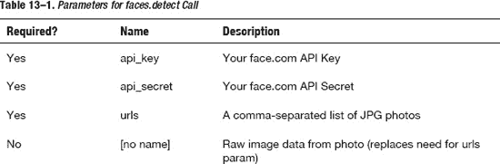

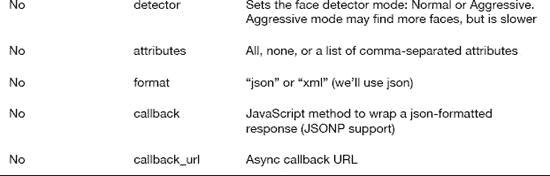

如果你查看参数列表，会发现这个调用实际上相当简单。我们的选择是：要么将图像上传到某个地方并发送一个引用 URL，让 face.com 获取并分析它；要么直接在 POST 请求中上传原始图像数据。不经过实际测试，我猜想先将图像上传到其他地方，再让 face.com 下载并分析，其效率远不如直接在 POST 请求中上传。因此，我们选择后一种方式。

既然有了方案，我们来考虑时机问题。我们已经有了`UIImage`对象，可以将其转换为 JPEG 格式并在请求传入时附加到 POST 请求中，但这很容易导致请求相互叠加以及大量不必要的 CPU 占用。我建议使用`NSTimer`定期抓取屏幕图像，然后在后台线程中将其发送到 face.com 进行分析。当结果返回时，我们将在 HUD 层上绘制，以提供找到的属性的相关信息，然后淡出到背景中，直到下一次请求发送。


#### 使用 ASI-HTTP-Request 库

在进一步推进之前，我们需要用到本章前文下载的那个库。找到之前存放的下载存档，将以下文件复制到你的项目中。由于我喜欢保持项目结构整洁清晰，我创建了一个名为 `ASI` 的新分组来存放这些文件。

*   `ASIHTTPRequestConfig.h`
*   `ASIHTTPRequestDelegate.h`
*   `ASIProgressDelegate.h`
*   `ASICacheDelegate.h`
*   `ASIHTTPRequest.h`
*   `ASIHTTPRequest.m`
*   `ASIDataCompressor.h`
*   `ASIDataCompressor.m`
*   `ASIDataDecompressor.h`
*   `ASIDataDecompressor.m`
*   `ASIFormDataRequest.h`
*   `ASIInputStream.h`
*   `ASIInputStream.m`
*   `ASIFormDataRequest.m`
*   `ASINetworkQueue.h`
*   `ASINetworkQueue.m`
*   `ASIDownloadCache.h`
*   `ASIDownloadCache.m`
*   `ASIAuthenticationDialog.h`
*   `ASIAuthenticationDialog.m`
*   `Reachability.h`（位于 `External/Reachability` 文件夹中）
*   `Reachability.m`（位于 `External/Reachability` 文件夹中）

该库还需要一些引用，但因为我提前考虑到了，我们已经在章节前文添加了它们。

让我们先退一步，思考一下 HTTP POST 请求的最佳放置位置。请记住，cocos2D 应用与其他 iOS 应用一样，都是基于视图层次结构构建的。我们在 OpenGL 视图和相机图层之上叠加了两个自己的场景。请参考图 13–8。（这是一个逻辑模型，并非类的精确表示。）

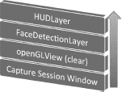

**图 13-8.** *场景的逻辑层次结构展示了叠加的视图。*

向 face.com 发送的 POST 请求将在单独的线程上执行。因此，我们希望返回代码能在可以与 HUD 层交互的层级进行解析。HUD 层正是我们实际创建叠加在界面上的图像和文本的地方，因此我们将公开一些方法来处理这些操作。

看来处理 POST 请求的最佳候选是 `FaceDetectionLayer`。如果我们能在那里处理 POST 请求，就无需从 `AppDelegate` 穿越两个层级。

让我们创建发送 POST 请求的方法，并用 `NSLog` 输出响应。然后，我们将创建 `NSTimer`，最后解析 JSON 响应。

#### 创建 POST 请求方法

在 Xcode 中打开 `FaceDetectionLayer.m`。导入 `ASIFormDataRequest.h` 和 `AppDelegate.h` 头文件。声明一个名为 `_sendingRequest` 的私有 `BOOL` 变量，用于跟踪 POST 请求是否正在进行中，并创建一个名为 `facialRecognitionRequest` 的 `void` 方法，该方法接收一个 `UIImage` 作为参数。更新后的 `FaceDetectionLayer.h` 文件应该如代码清单 13–19 所示。

**代码清单 13–19.** *更新后的 FaceDetectionLayer.h*

```
#import <Foundation/Foundation.h>
#import "cocos2d.h"
#import "HUDLayer.h"
#import "ASIFormDataRequest.h"
#import "AppDelegate.h"

@interface FaceDetectionLayer : CCLayer {
    HUDLayer *_hud;
    BOOL _sendingRequest;
}

+ (CCScene *)scene;
- (id)initWithHUD:(HUDLayer *)hud;
- (void)facialRecognitionRequest:(UIImage *)image;
@end
```

切换到 `FaceDetectionLayer.m`。创建如代码清单 13–20 所示的方法。

**代码清单 13–20.** *facialRecognitionRequest 方法*

```
- (void)facialRecognitionRequest:(UIImage *)image {
    NSLog(@"Image width = %f height = %f",image.size.width, image.size.height);

    if (!_sendingRequest) {   
        _sendingRequest = YES;

        NSAutoreleasePool * pool = [[NSAutoreleasePool alloc] init];

        NSData * imageData = UIImageJPEGRepresentation(image, 90);

        NSURL * url = [NSURL URLWithString:@"http://api.face.com/faces/detect.json"];

        ASIFormDataRequest *request = [ASIFormDataRequest requestWithURL:url];
        [request addPostValue:@"your face.com api_key" forKey:@"api_key"];
        [request addPostValue:@"your face.com api_secret" forKey:@"api_secret"];
        [request addData:imageData withFileName:@"image.jpg"
andContentType:@"image/jpeg" forKey:@"filename"];

        [request startSynchronous];

        NSError *error = [request error];
        if (!error) {
            NSString *response = [request responseString];

            NSLog(@"Response: %@",response);
        } else {
            NSLog(@"Error: %d",[error code]);
        }

        _sendingRequest = NO;

        [pool drain];
    }   
}
```

从该方法顶部开始，我们首先通过引用 `_sendingRequest` 这个 `BOOL` 变量来检查是否有另一个调用正在进行。如果没有正在进行的当前调用，我们将标志设置为 `YES`，以防止任何其他调用（在单独的线程上）与此事务冲突。

接下来，我们分配一个 `NSAutoreleasePool`。`NSAutoreleasePool` 类（来自 Apple 开发者文档）用于支持 Cocoa 的引用计数内存管理系统。自动释放池存储那些在池本身被排空时会收到释放消息的对象。

在引用计数环境中（与使用垃圾回收的环境相对），一个 `NSAutoreleasePool` 对象包含那些已收到自动释放消息的对象，当池被排空时，它会向每个这些对象发送一条释放消息。因此，向对象发送 `autorelease` 而不是 `release` 会将该对象的生命周期至少延长到池本身被排空为止（如果对象随后被保留，则可能更长）。一个对象可以被多次放入同一个池中，在这种情况下，它每次被放入池中时都会收到一条释放消息。

在我们设置好 `NSAutoreleasePool` 之后，我们创建一个 `NSData` 对象来保存来自 JPEG 图像的原始图像数据。我们设置好目标为 face.com 的 `NSURL` REST 端点、HTTP POST 值（其中之一是原始图像数据），然后开始向 face.com 进行同步调用。

稍后我们会添加 JSON 解析逻辑。目前，我们只是记录输出。

为了从 `FaceDetectionLayer` 发送 POST 请求，我们需要从 `AppDelegate` 引用该类。如果你现在这样做，我们就会在两个头文件之间创建循环依赖。这很容易修复，因为我们的解决方案目前还不算复杂。将 `import AppDelegate.h` 语句从 `FaceDetectionLayer.h` 移动到 `FaceDetectionLayer.m`，我们就不会遇到这个问题了。如果你遇到以 `expected specifier-qualifier-list before...` 开头的编译器错误，说明你在项目中的其他地方仍然存在循环引用。

让我们创建 `NSTimer` 以及从 `AppDelegate` 向 `FaceDetectionLayer` 发送 `UIImage` 对象的过程，这样我们就为 POST 请求做好了准备。


#### 创建 `NSTimer`

在 Xcode 中打开 `AppDelegate.h`。创建一个类型为 `FaceDetectionLayer` 的私有变量 `_layer`，以及另一个类型为 `NSTimer` 的私有变量 `_timer`。我们对头文件所做的更改如代码清单 13-21 所示。

**代码清单 13-21.** *对 `AppDelegate.h` 的更改*

```
@interface AppDelegate : NSObject <UIApplicationDelegate,
AVCaptureVideoDataOutputSampleBufferDelegate> {
    …
FaceDetectionLayer *_layer;
NSTimer *_timer;
}
…
```

切换到 `AppDelegate.m`。找到代码清单 13-22 中所示的那一行。

**代码清单 13-22.** *在 `AppDelegate.m` 中找到这一行……*

```
[[CCDirector sharedDirector] runWithScene: [FaceDetectionLayer scene]];
```

这一行使用了 `CCDirector` 单例来启动一个默认的 `FaceDetectionLayer` 场景。我们在 `FaceDetectionLayer` 中有一个静态方法，用于创建场景。该方法会连同 `HUDLayer` 一起启动场景。为了避免管理太多实例或创建另一组单例类，我们将把部分功能从静态的 `scene` 方法移到 `AppDelegate` 中。

用代码清单 13-23 中的代码替换代码清单 13-22 中的那一行。

**代码清单 13-23.** *以不同方式启动 `FaceDetectionLayer`*

```
CCScene *scene = [CCScene node];
HUDLayer *hud = [HUDLayer node];
[scene addChild:hud z:1];
_layer = [[[FaceDetectionLayer alloc] initWithHUD:hud] autorelease];
 [scene addChild:_layer];

 [[CCDirector sharedDirector] runWithScene: scene];
```

这段代码取自 `FaceDetectionLayer` 类中的静态 `scene` 方法。如果现在运行应用程序，它看起来应该和之前差不多。你会看到相机视图，方向正确，并且占满整个屏幕。

将代码清单 13-24 中的方法添加到 `AppDelegate.m` 中。

**代码清单 13-24.** *添加后台方法*

```
-(void)backgroundRequest:(UIImage * ) image{
    NSAutoreleasePool * pool = [[NSAutoreleasePool alloc] init];

    UIInterfaceOrientation orient =  [UIApplication sharedApplication].statusBarOrientation;
    UIImage * rotatedImage = image;
    switch (orient) {
        case UIInterfaceOrientationPortrait:
            NSLog(@"设备方向为竖屏");
            break;
        case UIInterfaceOrientationPortraitUpsideDown:
            NSLog(@"设备方向为倒竖屏");
            break;
        case UIInterfaceOrientationLandscapeLeft:
            rotatedImage = [self rotateImage:image orientation: UIImageOrientationRight];
            NSLog(@"设备方向为左横屏");
            break;
        case UIInterfaceOrientationLandscapeRight:
            rotatedImage = [self rotateImage:image orientation: UIImageOrientationLeft];
            NSLog(@"设备方向为右横屏");
            break;
    };

    [_layer facialRecognitionRequest:rotatedImage];

    [pool drain];
}
```

这个方法将是我们之前在 `FaceDetectionLayer` 类中创建的 `facialRecognitionRequest` 方法的调用者。我们再次使用 `NSAutoReleasePool` 来管理对象从内存中的自动释放。接着，我们检查设备的方向。同样，我所有测试都使用横向右方向，但这个方法应该足以正确地重新调整图像以适配其他方向。基本上，我们必须这样做，以便将正立的图像发送给 face.com。如果我们发送侧向或倒立的图像，face.com 将无法识别图片中的人脸。

完成图像旋转后，我们将更新后的图像对象发送给 `FaceDetectionLayer` 的 `facialRecognitionRequest` 方法。好了，让我们创建定时器回调，然后再创建我们的 `NSTimer`。回调将是每次定时器超时时触发的事件（我并非有意押韵，只是事实如此）。这应该是一个简单的方法。我们只需每隔几秒在新线程上调用新的 `backgroundRequest` 方法。将代码清单 13-25 中的方法复制到 `backgroundRequest` 方法上方。

**代码清单 13-25.** *定时器回调方法*

```
-(void) timerCallback {
    [NSThread detachNewThreadSelector:@selector(backgroundRequest:) toTarget:self withObject:_imageView.image];
}
```

我们只是分离一个新线程来运行 `backgroundRequest` 方法，并将 `delegate` 分配给 `self`。

因此，此过程的最后一步是启动定时器。在 `applicationDidFinishLaunching` 方法的最后一行，我们启动了 `AVCaptureSession`。就在那一行之前，添加代码清单 13-26 中的代码。

**代码清单 13-26.** *启动一个五秒定时器*

```
_timer = [NSTimer scheduledTimerWithTimeInterval:5.0 target:self
selector:@selector(timerCallback) userInfo:nil repeats:YES];
```

粗体代码指示了在两次执行之间重置计时应在何处进行。如果你的网络连接速度非常慢，可能需要增加此设置。

如果你现在运行这个项目，并让它运行几秒钟，你应该会在调试控制台中看到类似图 13-9 的内容。

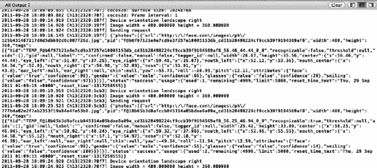

**图 13-9.** *输出显示了 face.com 请求的循环执行情况。*

#### 解析输出

接下来，我们需要解析来自 face.com 的输出。为此，我们将使用本章早些时候从 GitHub 下载的 JSON-Framework 库。

找到你解压下载文件的目录。其中有一个名为 `Classes` 的子目录。打开该目录。与 ASI-HTTP-Request 库一样，Xcode 中的组织方式取决于个人偏好。我在 Xcode 项目中创建了一个名为 `JSON` 的 `Group`，但这并非必需。将 `Classes` 目录中的所有文件复制到 Xcode 项目中。确保勾选**将项目复制到目标组的文件夹中（如果需要）**选项。

在 Xcode 中打开 `FaceDetectionLayer.h` 并导入 `SBJson.h` 头文件。切换到 `FaceDetectionLayer.m`，找到代码清单 13-27 中所示的代码行。

**代码清单 13-27.** *找到这一部分……*

```
if (!error) {
            NSString *response = [request responseString];
```

在代码清单 13-27 中的代码之后，我们将添加逻辑来解析 JSON 响应。在开始之前，让我们再看一下来自 face.com 的响应。我执行后得到的示例回复如代码清单 13-28 所示。

**代码清单 13-28.** *来自 face.com 的示例回复*


```json
{
  "photos": [
    {
      "url": "http:\/\/face.com\/images\/ph\/90e76f377f93e949df78b552903a48b0.jpg",
      "pid": "F@6f518683514fac2eebe8d749b6121cc3_cd31b28498224cf9ccb39f9194569af8",
      "width": 480,
      "height": 360,
      "tags": [
        {
          "tid": "TEMP_F@6f518683514fac2eebe8d749b6121cc3_cd31b28498224cf9ccb39f9194569af8_62.50_41.11_0_0",
          "recognizable": true,
          "threshold": null,
          "uids": [],
          "gid": null,
          "label": "",
          "confirmed": false,
          "manual": false,
          "tagger_id": null,
          "width": 28.75,
          "height": 38.33,
          "center": {
            "x": 62.5,
            "y": 41.11
          },
          "eye_left": {
            "x": 58.63,
            "y": 30.98
          },
          "eye_right": {
            "x": 71.52,
            "y": 33.14
          },
          "mouth_left": {
            "x": 58.34,
            "y": 49.64
          },
          "mouth_center": {
            "x": 64.25,
            "y": 51.62
          },
          "mouth_right": {
            "x": 69.34,
            "y": 50.91
          },
          "nose": {
            "x": 66.49,
            "y": 44.14
          },
          "ear_left": null,
          "ear_right": null,
          "chin": null,
          "yaw": 26.25,
          "roll": 7.16,
          "pitch": -1.99,
          "attributes": {
            "glasses": {
              "value": "false",
              "confidence": 16
            },
            "smiling": {
              "value": "true",
              "confidence": 96
            },
            "face": {
              "value": "true",
              "confidence": 87
            },
            "gender": {
              "value": "male",
              "confidence": 46
            },
            "mood": {
              "value": "happy",
              "confidence": 51
            },
            "lips": {
              "value": "parted",
              "confidence": 98
            }
          }
        }
      ]
    }
  ],
  "status": "success",
  "usage": {
    "used": 31,
    "remaining": 4969,
    "limit": 5000,
    "reset_time_text": "Thu, 29 Sep 2011 02:40:10 +0000",
    "reset_time": 1317264010
  }
}
```

我高亮了一些章节，这些章节将用于完成此示例。让我们从尝试捕获`status`值开始。

借助 **SBJson** 库，解析 JSON 变得非常简单。首先，创建一个新的`SBJsonParser`对象，然后从 face.com 返回的 JSON 字符串中创建一个`NSDictionary`。在代码清单 13–27 中找到的代码之后，添加代码清单 13–29 中的代码。

**代码清单 13–29.** *识别 JSON 数组中的键*

```objectivec
SBJsonParser *jsonParser = [SBJsonParser new];
NSDictionary *feed = [jsonParser objectWithString:response error:nil];
NSLog(@"RETURN: %@", [feed allKeys]);
```

由于我们可以将 JSON 字符串转换为`NSDictionary`，因此通常最好验证期望在`NSDictionary`根目录中找到的键是否与解析器认为存在于字典根目录中的键相匹配。我们通过`NSDictionary`的`allKeys`属性来实现这一点。如果添加此代码后再次运行项目，您将在控制台中看到类似于图 13–10 的输出。

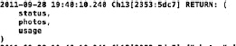

**图 13–10.** *控制台显示`allKeys`的返回值。*

可以看到`status`元素（即我们正在查找的元素）直接位于字典的顶层。由于这是一个单一元素，我们可以直接获取该键的值并将其记录到控制台。在记录`allKeys`输出之后，添加代码清单 13–30 中的代码。

**代码清单 13–30.** *记录状态消息*

```objectivec
if ([[feed valueForKey:@"status"] isEqualToString:@"success"]) {
        NSLog(@"face.com request = success");
}
```

如果再次运行项目，您将在控制台中看到成功消息。接下来，我们将继续向此`if`块的主体中添加代码，以捕获识别出的人脸的 x、y、width（宽度）和 height（高度）值。

在成功块内部添加代码清单 13–31 中的代码。

**代码清单 13–31.** *查找图片中人脸的位置*

```objectivec
double xPosition = [[[[[photo objectForKey:@"tags"] objectAtIndex:0]
valueForKey:@"center"] valueForKey:@"x"] doubleValue];
double yPosition = [[[[[photo objectForKey:@"tags"] objectAtIndex:0]
valueForKey:@"center"] valueForKey:@"y"] doubleValue];
NSString *mood = [[[[[photo objectForKey:@"tags"] objectAtIndex:0]
objectForKey:@"attributes"] objectForKey:@"mood"] valueForKey:@"value"];
NSDictionary *photo = [[feed objectForKey:@"photos"] objectAtIndex:0];
```

因此，这些代码行解析剩余的 JSON 元素，以查找我们在代码清单 13–28 中加粗的值。接下来，我们将使用它们来构建我们 HUD 层。


### 构建 HUD 层

到目前为止，如果你是一名开发者，这个应用本身看起来非常酷。然而，从用户的角度来看，我们无法真正了解正在发生什么。接下来，我们将通过本章第一部分创建的 HUD 层添加一些反馈信息来改变这一状况。请记住，HUD 层是透明的，但它位于场景堆栈的其余部分之上。因此，我们可以在这一层叠加所有内容。

还记得本章引言中我曾提到事情不会如预期般顺利吗？这部分内容就从这里开始。如果你愿意，可以快速浏览一下，不过这只是一段小插曲；所以，如果你乐意的话，就跟着代码继续往下看吧。

打开 `HUDLayer.h`，声明 代码清单 13–32 中所示的方法。

**代码清单 13–32.** *加载准星和情绪标签*

`- (void)loadCrosshair:(NSString *)mood x:(double)x y:(double)y;`

切换到 `HUDLayer.m`，实现 代码清单 13–33 中的 `loadCrosshair` 方法。

**代码清单 13–33.** *实现 loadCrosshair 方法*

`- (void)loadCrosshair:(NSString *)mood x:(double)x y:(double)y {`
`    CGSize size = [[CCDirector sharedDirector] winSize];`
`    CCLabelTTF *label = [CCLabelTTF labelWithString:@"test" fontName:@"Marker Felt" fontSize:48];`
`    // 将标签定位在屏幕中央`
`    label.position =  ccp( size.width /2 , size.height/2 );`
`    // 将标签作为子节点添加到此层`
`    [self addChild: label];`
`    CCSprite *crosshair = [CCSprite spriteWithFile:@"crosshair.png" rect:CGRectMake(0,0,390,390)];`
`    crosshair.position = ccp((size.width * (x/100)), (size.height * (1 - (y/100))));`
`    [self addChild:crosshair];`
`}`

在此方法中，我们使用了一些基本函数来将 PNG 文件添加到屏幕上，并设置一个标签来显示用户的情绪。`label` 对象的 `position` 属性是使用 cocos2D 中的 `ccp` 宏设置的。这个宏为我们创建了一个锚点，用于将图像放置在屏幕上。我们将锚点的位置设置为屏幕中央（宽度的一半，高度的一半）。

接下来，我们从 PNG 文件加载一个精灵，并将其放置在屏幕上。Face.com 作为其响应的一部分，会返回所识别人脸的位置（中心）。该位置以屏幕的百分比表示，这样如果你发送的是缩小后的图像（正如本章我们所做的），就无需重新计算像素。由于这些百分比是整数，我们将它们除以 100，并为精灵创建一个与 Face.com 识别人脸位置相同的锚点。

切换到 `FaceDetectionLayer.m`，找到 代码清单 13–31 中的代码（该代码解析了 Face.com 请求返回的情绪、x 和 y 值）。在这些代码行之后，添加 代码清单 13–34 中的代码。

**代码清单 13–34.** *调用 loadCrosshair 方法*

`[_hud loadCrosshair:mood x:xPosition y:yPosition];`

我们将使用 HUD 层来调用这个新方法。回想一下我们堆叠视图的示意图，这应该能正常工作。运行项目。结果应该类似于 图 13–11。

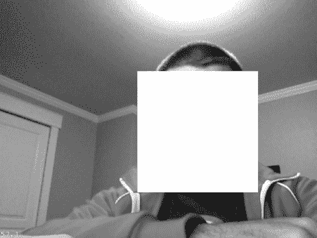

**图 13–11.** *等等，这不对！*

好消息是，图像似乎被放置在了正确的位置。坏消息是，你看不到图像。屏幕上看起来像是一个不透明的块。

这是由于 OpenGL 处理线程的方式导致的。我们分离了一个线程来处理 HTTP 请求，而 OpenGL 要求我们通过主线程与屏幕交互。关于处理 OpenGL 线程问题有多种方法，网上也有大量相关文章。这是一个基本示例，说明了在 cocos2D 应用程序中需要更有序的线程管理。如果你想了解更多关于 OpenGL 和线程的知识，可以查阅 Apress 出版社的 Mike Smithwick 所著的 *Pro OpenGL for iOS*。

让我们解决这个问题。事实证明，这个应用其实并不需要一个 HUD 层。因为我们的基本逻辑在 `AppDelegate` 中，所以 `FaceDetectionLayer` 充当了 HUD 层的角色。让我们将绘图函数向下移动一层，并使用主线程来调用屏幕上的标签更改。

与其动态创建标签和精灵，不如创建一个属性，这样我们就能在类外部访问它。此外，我们还需要一个属性来引用我们的 `RootViewController`。

按 代码清单 13–35 所示调整 `FaceDetectionLayer.h` 文件。我已经注释掉了不再需要的行。

**代码清单 13–35.** *对 FaceDetectionLayer 的修改*

```
#import <Foundation/Foundation.h>
#import "cocos2d.h"
#import "HUDLayer.h"
#import "ASIFormDataRequest.h"
#import "SBJson.h"

@interface FaceDetectionLayer : CCLayer {
    //HUDLayer *_hud;
    BOOL _sendingRequest;
    CCSprite *crosshair;
}

@property (retain) UIViewController * root;
@property (retain) CCLabelTTF * label;

//+ (CCScene *)scene;
//- (id)initWithHUD:(HUDLayer *)hud;
- (void)facialRecognitionRequest:(UIImage *)image;
@end
```

切换回 `FaceDetectionLayer.m`，按 代码清单 13–36 所示合成新的属性。

**代码清单 13–36.** *合成新属性*

```
@synthesize root;
@synthesize label = _label;
```

同样注释掉 `scene` 和 `initWithHUD` 方法。我们将不再使用它们。使用 代码清单 13–37 中的代码创建一个新的 `init` 方法。

**代码清单 13–37.** *新的 init 方法*

```
-(id) init {
    if(self = [super init]){
        CGSize size = [[CCDirector sharedDirector] winSize];
        crosshair =  [CCSprite spriteWithFile:@"crosshair.png" ];
        crosshair.position = ccp((size.width * (50.0/100)), (size.height * (1 - (50.0/100))));
        crosshair.opacity = 0;
        [self addChild:crosshair];
        _label = [CCLabelTTF labelWithString:@"" fontName:@"Marker Felt" fontSize:48];
        _label.position =  ccp( size.width /2 , size.height/2 );
        [self addChild: _label];
    }
    return self;
}
```

我们只是将部分 `HUDLayer` 代码移到了 `FaceDetectionLayer` 的 `init` 方法中。这段代码唯一真正的区别是我们还没有设置标签的文本。我们稍后将在 `RootViewController` 中设置它。

用 代码清单 13–39 中的代码替换 代码清单 13–38 中的代码行。

**代码清单 13–38.** *找到这行代码……*

`[_hud loadCrosshair:mood x:xPosition y:yPosition];`

**代码清单 13–39.** *替换为以下代码……*

```
CGSize size = [[CCDirector sharedDirector] winSize];
crosshair.opacity = 255;
crosshair.position = ccp((size.width * (xPosition/100)), (size.height * (1 - (yPosition/100))));
[root performSelectorOnMainThread:@selector(updateMood:) withObject:mood waitUntilDone:YES];
```

我们没有将请求发送到 `HUDLayer` 类，而是使用 `ccp` 宏移动精灵，并将标签的更新发送回主线程。`updateMood` 函数尚不存在。我们接下来将创建它。

打开 `RootViewController.h`。导入 `FaceDetectionLayer.h` 头文件，并添加 代码清单 13–40 中所示的属性和方法。

**代码清单 13–40.** *更新后的 RootViewController*

```
#import <UIKit/UIKit.h>
#import "FaceDetectionLayer.h"

@interface RootViewController : UIViewController {
}
@property (retain) FaceDetectionLayer* fdLayer;
-(void)updateMood:(NSString*)mood;
@end
```

切换到 `RootViewController.m`，合成我们刚创建的属性。然后创建 代码清单 13–41 中的方法。

**代码清单 13–41.** *updateMood 方法*

```
-(void)updateMood:(NSString *) mood {
    [[[self fdLayer] label] setString:mood];
}
```


在 Xcode 中打开 `AppDelegate.m`。使用代码清单 13–42 中的代码更新 `applicationDidFinishLaunching` 方法。

**代码清单 13–42.** *已更新的 applicationDidFinishLaunching 方法*

```
// 消除启动时的闪烁
 [self removeStartupFlicker];
// 运行介绍场景
CCScene *scene = [CCScene node];
_layer =[[[FaceDetectionLayer alloc] init] autorelease];
[scene addChild:_layer];
viewController.fdLayer = _layer;
_layer.root = viewController;
 [[CCDirector sharedDirector] runWithScene: scene];

_timer = [NSTimer scheduledTimerWithTimeInterval:5.0 target:self selector:@selector(timerCallback) userInfo:nil repeats:YES];
[self setupCaptureSession];
}
```

我们没有运行 `initWithHUD` 方法，而是使用新的 `init` 方法实例化 `FaceDetectionLayer`。这段代码的另一个区别是，我们将 `viewController`（即 `RootViewController`）的 `fdLayer` 属性设置为了我们的 `FaceDetectionLayer`。

如果你直接运行项目，在请求解析完毕后，屏幕上应该会显示正确的叠加层和心情标签。这部分内容我得到了孩子们的帮助。结果如图 13–12 至图 13–14 所示。

请注意表情变化时心情标签的更新。Face.com 在识别每次请求之间的表情方面做得非常出色。我们的程序正确地将 PNG 文件移动到了面部的 x、y 坐标位置，并且由于我们将部分逻辑移回了主线程，一切看起来进展顺利。

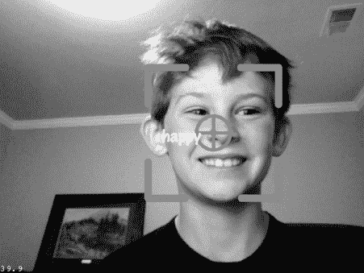

**图 13–12.** *Aodhan 很开心！*


**图 13–13.** *Avery 很生气！*


**图 13–14.** *Avery 很惊讶！*

我们要构建到应用程序中的最后一个功能是短信功能，用于在检测到愤怒或悲伤表情时通知客服人员。

请记住，如果你希望将此功能扩展用于实际目的，摄像头视野中可能不止一个人。你唯一需要做的调整是遍历 face.com 的 JSON 响应中返回的所有照片。我们硬编码了 `objectAtIndex:0`，只选取第一个被识别的人脸。因此，如果你想要分析人群，就需要进行这种调整。

### 添加 Twilio 调用

Twilio 使用 REST 发起外呼或发送短信。我们使用短信的原因之一是它只需要 REST 调用。我们无需在 Web 服务器上托管任何代码。将代码清单 13–43 中的方法添加到 `FaceDetectionLayer.m` 文件中。

**代码清单 13–43.** *发送短信*

```
- (void)sendSMS {
    NSAutoreleasePool * pool = [[NSAutoreleasePool alloc] init];

    NSLog(@"发送请求");
    NSString *accountSid = @"在此处输入您的账户 SID";
    NSString *authToken = @"在此处输入您的 AuthToken";
    NSString *urlString = [NSString
stringWithFormat:@"https://%@:%@@api.twilio.com/2010-04-01/Accounts/%@/SMS/Messages",
accountSid, authToken, accountSid];

    NSURL *url = [NSURL URLWithString:urlString];

    ASIFormDataRequest *request = [ASIFormDataRequest requestWithURL:url];
    [request addPostValue:@"在此处输入您的目标号码" forKey:@"To"];
    [request addPostValue:@"检测到愤怒表情" forKey:@"Body"];
    [request addPostValue:@"有效的 Twilio 号码" forKey:@"From"];

    [request startSynchronous];

    NSError *error = [request error];
    if (!error) {
        NSString *response = [request responseString];
        NSLog(@"%@",response);
    } else {
        NSLog(@"发生错误 %d; %@",[error code], [request responseString]);
    }

    [pool drain];
}
```

这简单多了。正如你所见，Twilio 提供了一个非常简单的 API，可以快速为你的应用增加价值。你可以从 `facialRecognitionRequest` 方法中引用这个新函数。只需将其包装在一个简单的检查中，以匹配“愤怒”心情，一切就准备就绪了。

短信如图 13–15 所示。

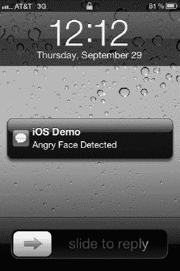

**图 13–15.** *短信已成功发送。*

### 总结

本章非常有趣。我们像第 7 章一样，从创建一个 HUD 层开始。经过一些实验后，我们意识到这并非必要。通过逐步操作，我们了解了 OpenGL 的多线程技术（这是 cocos2D 的基础）。

我们扩展了示例，创建了 `AVCaptureSession` 并将 `UIImages` 发送到 face.com 的 REST API。我们使用了两个不同的开源库来为演示添加功能。ASI-HTTP-Request 帮助我们以简短的代码封装了 REST 调用，而 SBJson 库则帮助我们解析来自 face.com 的响应。

我们使用 cocos2D 在目标人脸叠加了一个精灵，并用一个标签显示了来自 face.com 的心情结果。最后，我们使用 Twilio 简单的 REST API 通过短信向客服人员发出通知，告知检测到了愤怒的表情。

在将人脸识别示例用于自己的应用程序之前，你应该检查当地的隐私法律。在某些地区，捕获或存储面部模式可能构成隐私侵犯。

希望你从本书的示例中学到了很多。请查阅书末的补充材料，了解一些更有帮助的主题。如果对演示有任何疑问或反馈，欢迎在 Twitter 上联系我 @kylemroche，也可以在 GitHub 上与我交流。


### A, B

加速计，26，64–67

`afconvert`，91–92

`afinfo`，90–91

`afplay`，92

`AppleDeveloper`，7–8

### AR 应用

`ARController`

`ARController.m`，229–230

`initWithViewController` 方法，230

位置共享，234，235

`RootViewController`，231

更新后的 `AppDelegate.h`，232

更新后的 `AppDelegate.m`，233

更新后的 `ARController.h`，229

更新后的 `RootViewController.h`，231

更新后的 `RootViewController.m`，231–232

致谢，228

Facebook 应用（*参见* Facebook 应用）

Facebook iOS SDK，229

框架，228

#### 传感器更新

角度转弧度，235–236

`deviceOrientationDidChange` 方法，236–237

朝向和位置属性，237

更新后的 `ARController.h`，236

社交语境（*参见* Facebook 语境）

#### 存储坐标

`addCoordinate` 方法，245

`angleFromCoordinate` 方法，241

`ARAnnotation.h`，243

`ARAnnotation.m`，244

`ARController.h`，241

`ARCoordinate` 属性，241

`ARCoordinate.h`，238，244

`ARCoordinate.m`，238–239

`ARGeoCoordinate.h`，239

`ARGeoCoordinate.m`，239–240

`calibrateUsingOrigin` 方法，241

`deltaAzimuthForCoordinate` 方法，245–246

处理位置和朝向，248

导入和私有方法，241

`initWithCoordinate` 方法，241

`initWithCoordinateAndOrigin` 方法，241

`isNorthForCoordinate` 方法，246

位置和朝向方法，242

新的私有方法，245

`pointForCoordinate` 方法，246–247

设置初始值，248

更新后的 `ARController.h`，242

更新后的 `ARController.m`，243

更新后的 `initWithViewController` 方法，241–242

`updateLocations` 方法，247

`viewportContainsCoordinate` 方法，245

### ARKit 工具包

`ARKit` 工具包，181，208

`ASI-HTTP-Request` 库，300，314–315

音频文件转换，91

### 增强现实 (AR)

应用（*参见* AR 应用）

`ARKit`，181，208

2D 游戏构建框架（*参见* Cocos2D 框架，iPhone）

面部识别（*参见* 面部识别技术，移动 iOS 环境）

游戏与基于位置的 AR，4

#### 标记

正确方向，211

`EAGLView`，213

高对比度、独特图像，211

String SDK，213

`ViewController`，219

#### 由 String SDK 驱动

异步回调方法，186

演示版本，182

帧缓冲区，185–186

`getCurrentVideoBuffer` 方法，185

`handleSnapshot` 方法，186

初始化代码，184

基于标记的应用，183

标记，184

OpenGL AR 应用，实施步骤，184–185

`render` 方法，185

`resume` 方法，186

屏幕缓冲区委托，185

着色器和光照效果，186–187

Unity 3D 集成，186

#### QCAR 演示

创建新项目，190

创建新的可追踪链接，190–192

创建 Xcode 项目，192–194

下载可追踪链接，192

`EAGLView`（*参见* `EAGLView`）

重定向 `UIView`（*参见* `UIView`）

高通，181

#### Qualcomm SDK

多米诺骨牌应用，189

多米诺骨牌演示，189

下载 QCAR SDK，187–188

安装目录，188–189

混合现实空间，虚拟按钮，189–190

QCAR SDK，188–189

String SDK，181

工具包，181–209

### `AVAudioPlayer` 类

`AVAudioPlayer` 类，93–94

### AVFoundation 框架

`AVFoundation` 框架，24，194

### 方位角

计算，227

公式，228

方向变化，228


### C

摄像头捕捉

前置摄像头，101–102

`isSourceTypeAvailable` 方法，101–102

照片捕捉

通过电子邮件发送图像，111–114

以不同格式保存图像，110–111

使用摄像头，109–110

使用故事板，103–108

`UIImagePickerController` 类，101

`UIImagePickerControllerCameraDeviceFront` 参数，102

`UIImagePickerControllerSourceTypeCamera`，102

`CCLayer`，Cocos2D，131

Chipmunk

`cpDampedSprint` 关节，156

`createBoxAtLocation` 方法，154

`createGround` 方法，153–154

`createSpace` 方法，153

`draw`（重写）方法，154

`init` 和 `update` 方法，155

关节，155

鼠标关节，155

`scheduleUpdates` 方法，156

弹簧关节

`CCspriteFrameCache`，158

`cpDampedSpring` 约束，158

`CPSprite menuPumpkin1`，158

更新后的 `init` 方法，158

更新后的 `update` 方法，159

触摸事件，156–157

更新后的 `MenuLayer.h`，157

Cocos2D 框架，iPhone，299

添加摄像头视图，128–129

添加效果

声音效果，135

触摸效果，131，133

视觉效果，133

添加 HUD 层

`HelloWorldLayer.h`，137

`HUDLayer.h`，136

`HUDLayer.mm`，`init` 方法，136

`incrementCounter` 方法，136，138

替换 `init` 方法，137

`Scene` 方法，137

调整默认视图

更改 `pixelFormat`，127

`EAGLView`，127

主视图和子视图，127

覆盖视图，127

`UIView`，126

`CCLayer`，131

导演，130–131

`EAGLContext` 对象，126

安装

创建项目，125–126

Xcode 项目模板，124–125

OpenGL 渲染，126

缩放摄像头视图，129–130

场景，130

Cocos2D 游戏

`applicationDidFinishLaunching` 方法，144

美术资源

`CPSprite.h`，150

`CPSprite.m`，151–152

`particleTexture.png`，149

`PumpkinExplosion.plist`，149

`Pumpkins.plist`，149

`Pumpkins.png`，149

南瓜精灵表，150

摄像头支持，163–170

摄像头视图

`AppDelegate.h`，145

`AppDelegate.m`，145–146

`CoreImage`，145

`CoreMedia`，145

`CoreVideo`，145

`frontFacingCameraIfAvailable`，146

`CCNode` 模板，147

Chipmunk（*参见* Chipmunk）

`CIDetector` 类，141

`CIDetector` 属性，171

`cocos2d_chipmunk` 模板，142–143

`Endlayer.h` 文件，177

`EndLayer.m` 文件，177–178

`facialRecognitionRequest` 方法，169

游戏菜单，`applicationDidFinishLaunching`，148

GitHub 仓库，143

Grossini 乘法，144

Hello World 项目，144

辅助代码目录

`cpMouse.c`，152

`cpMouse.h`，152

`drawSpace.c`，152

`drawSpace.h`，152

图像处理方法，165–168

导入语句，148

`MenuLayer.h`，147，153

`MenuLayer.m`，147

菜单选项，160–163

`newGameTapped` 方法，162

OpenGL ES 视图，`pixelFormat`，164

项目创建，142–144

南瓜

`facialRecognitionRequest` 方法，173–174

`init` 方法，172–173

私有变量，172

触摸方法，175

`static instance` 方法，169

更新后的 `ActionLayer.h`，160

更新后的 `ActionLayer.m`，161

更新后的 `AppDelegate.h`，163–164

更新后的 `facialRecognitionRequest` 方法，171

更新后的 `init` 方法，168–169

更新后的私有方法声明，168

`CoreMedia.framework`，194

`CoreVideo.framework`，194

### D

2D 游戏应用程序。*参见* Cocos2D 框架，iPhone；Cocos2D 游戏

`didUpdateHeading` 委托方法，80

`didUpdateHeading` 方法，83

数字指南针，21–23

导演，Cocos2D，130–131

3D 灯，186


### E

`EAGLView`

- 将视频配置为背景图像，204
- `createFrameBuffer` 方法，197–198，216–217
- `deleteFrameBuffer` 方法，198，217
- `ViewController` 的外部方法，199–200
- 处理状态更新，200–201
- 导入语句，194，214
- 初始化方法，202
- 初始化 OpenGL 渲染和渲染帧，205–206
- `initWithCoder`，197
- `initWithCoder` 方法，215
- 接口，195
- `layerClass` 方法，215
- `layerClass` 静态方法，196
- 加载标记/可追踪对象，201–202
- 加载测试着色器，204–205
- 新增导入语句，196
- 新增方法声明，195
- `presentFramebuffer` 和 `layoutSubviews` 方法，199
- 私有方法，196，214
- QuartzCore 库，214
- `setContext` 方法，216
- `setFrameBuffer` 方法，199，218
- 启动和停止相机视图，203
- 状态枚举，195
- 综合属性，215
- 更新后的 `@interface`，214

**效果，Cocos2D**

- 音效，135
- 触摸效果，131–133
- 视觉效果
  - `CCParticleSystem`，134
  - 图形效果，134
  - 粒子设计器，133
  - 粒子效果，134

### F

**Face.com**

- Face.com，264，280，298–299
- API，313–314
- API 密钥选项卡，282–283
- 控制台输出，285–287
- `didFinishPickingImage` 方法，284
- `FaceDotComFaceDetect` 方法，283–284
- `Faces.detect` API 调用，280–281
- REST API，280
- 支持，281–282

**Facebook 应用程序**

- 认证代理方法，252
- `dialogDidComplete` 方法，259
- `FBDialogDelegate` 协议，259
- 初始认证对话框，252
- JSON 响应，254–255
- 登录尝试，253
- 请求代理方法，251
- `shareButtonClicked` 方法，257–258
- 分享对话框，261
- 更新后的 `ARAnnotation`，257
- 更新后的 `didLoad` 方法，254–256
- 更新后的 `fbDidLogin` 方法，253
- 更新后的 `initWithCoordinate` 方法，258–259
- URL 模式，252

**Facebook 上下文**

- FB 应用 ID，250
- oAuth 对话框，250
- `RootViewController`，250

**Facebook iOS SDK**，226–227

**人脸识别**

- ASI-HTTP-Request 库，314–315
- 下载 ASI-HTTP-Request 库，300
- **相机**
  - 更新后的 `AppDelegate.h`，304–305
  - 调用我们的新方法，307
  - 前置摄像头，305–306
  - 从缓冲区提取图像，308–309
  - `rotateImage` 工具方法，310–312
  - `setImageToView` 方法，308
  - 设置 `CaptureSession`，306–307
  - 透明视图，307–308
  - 更新后的 `setImageToView` 方法，312
- cocos2D，299
- `dealloc` 方法，304
- Face.com，298–299
- face.com API，313–314
- **HUD 层构建**
  - `FaceDetectionLayer`，325–326
  - `loadCrosshair` 方法，323–325
  - 新的 init 方法，326
  - Twilio 标注，330–331
  - 更新后的 `applicationDidFinishLaunching` 方法，327
  - 更新后的 `RootViewController`，327
  - `updateMood` 方法，327
- `initWithHUD` 方法，303
- JSON-framework，300
- 创建 `NSTimer`，317–320
- 解析输出，320–323
- POST 请求方法，316–317
- 项目结构，300–302
- 目的，297
- 静态场景方法，303


技术，297–298

`Twilio` 账户，299–300

已更新 `FaceDetectionLayer.h`，303

面部识别技术，移动 iOS 环境

`Face.com`，264，280

`API Keys` 标签页，282–283

控制台输出，285–287

`didFinishPickingImage` 方法，284

`FaceDotComFaceDetect` 方法，283–284

`Faces.detect` API 调用，280–281

REST API，280

支持，281–282

iOS 5 `CIDetector` 类，264，277

优势，280

`CIDetectorFaceDetect`，278

`didFinishPickingImage`，279

iPad 模拟器，279

`MainViewController.h`，278

开放计算机视觉库（`OpenCV`），263–264

用于测试的图像采集，265–270

Haar 级联，271–277

iPad，265

性能测量

`CodeTimestamps.h`，287–288

`CodeTimestamps.m`，288–294

控制台输出，294

`didFinishPickingImage` 方法，294

`LogTimestamp` 宏，294

### G

基于游戏的定位增强现实，4

地理区域监控服务

`didEnterRegion` 方法，43–44

`didExitRegion` 方法，44–45

`didUpdateToLocation` 方法，45–46

位置更新间隔距离，46

`FirstViewController.h`，40

`FirstViewController.m`，39–41

iOS 5 授权对话框，42

预加载的 GPS 坐标，Xcode 4.2 beta，40

`startRegionMonitoring` 方法，40–41

`viewDidLoad` 方法，41

Xcode 4.2 beta 位置模拟器，43

GitHub，5–6

陀螺仪，26–27，63，69–72

### H

硬件组件

加速度计，26

摄像头，16–17

检测声音，24

检测视频功能，24–25

检测摄像头，17–20

检测定位功能，20–21

数字指南针，21–23

陀螺仪，26–27

### I

`IBAction` 方法，72–74

图像压缩

JPEG，110

PNG，110

iOS 5 授权对话框，42

iOS 5 `CIDetector` 类，264，277

优势，280

`CIDetectorFaceDetect`，278

`didFinishPickingImage`，279

iPad 模拟器，279

`MainViewController.h`，278

iOS 传感器

加速度计，64–67

陀螺仪，69–72

`IBAction` 方法，72–74

低通滤波，69

磁力计

可用性，77

校准，78

在界面生成器中打开 `headingViewController.xib`，78–81

方向变化，81–84

方向传感器，81–84

旋转速率，74–77

摇动检测，68–69

iPhone 模拟器，38

### J, K

JPEG 格式，110

`JSON-framework`，300


### L

`LoadPhotoPicker` 方法，109

定位服务，iPhone

- 向地图添加注释
- 自定义，58
- 默认，57
- `displayMap` 方法，56
- `MapAnnotation.h` 变更，55
- `MapAnnotation.m` 变更，55
- `viewForAnnotation` 委托方法，57
- 更改地图类型
- `CGRectMake` 方法，52
- 卫星地图类型，54
- `setupSegmentedControl` 方法，52–53
- `UISegmentedControl`，52–53
- 检查海拔高度
- `altitude` 属性，48
- `CLLocation` 方法，48
- `CLLocationManager` 方法，47
- `CLLocationManagerDelegate` 方法，48
- `coordinate` 属性，48
- `delegate` 属性，47
- `desiredAccuracy` 属性，47
- `distanceFilter` 属性，47
- GPS 读数，47
- `location` 属性，47
- `locationManager didFailWithError` 方法，48
- `locationManager didUpdateToLocation fromLocation` 方法，48
- `timestamp` 属性，48
- `FirstView` 控制器，33
- 地理区域监测服务
- `didEnterRegion` 方法，43–44
- `didExitRegion` 方法，44–45
- `didUpdateToLocation` 方法，45–46
- 位置更新间隔，46
- `FirstViewController.h`，40
- `FirstViewController.m`，39–41
- iOS 5 授权对话框，42
- 预加载的 GPS 坐标，Xcode 4.2 beta，40
- `startRegionMonitoring` 方法，41
- `viewDidLoad` 方法，41
- Xcode 4.2 beta 位置模拟器，43
- GitHub，31
- 内存管理，33
- 反向地理编码，58
- `MKReverseGeocoder` 类，59
- `MKReverseGeocoderDelegate` 方法，60
- `toggleToolBarChange` 方法，59
- Xcode 控制台，60
- 重大变化定位服务
- 蜂窝无线电，38
- `viewDidLoad` 方法，39
- 标准定位服务
- `CLLocationManagerDelegate` 方法，36
- Core Location 框架，34–35
- `FirstViewController` 头文件，35
- iPhone 模拟器，38
- `modaldialog`，37
- `startStandardUpdates` 方法，36–37
- `viewDidLoad` 方法，37
- `UILabel`，32–33
- `UITextView`，32–34
- 上下文菜单，34
- 在地图上查看
- 苹果总部，51
- 居中地图并设置显示区域，50–51
- 配置 `MKMapView`，49
- `displayMap` 方法，50
- `MKCoordinateRegion`，50
- `MKMapView` `IBOutlet`，48
- `MKMapViewDelegate`，48
- `NSAutoreleasePool` 类，51
- `synthesize` 和 `release` `mapView`，49
- 线程选择器，50

低通滤波，69

### M

磁力计，21–23，77

标记

- 优点，211
- 特性，211
- GitHub 仓库，212
- 高对比度、独特图像，211
- OpenGL ES，212

### N

`NSAutoreleasePool` 类，51

### O

物体识别。*参见* 面部识别

开源计算机视觉 (OpenCV)

- 捕获用于测试的图像
- 摄像头来源，270
- `cameraButtonClicked` 方法，268
- `MainViewController`，266–267
- `MainViewController.h`，267–268
- `UIActionSheet Delegate` 方法，268
- `UIImagePickerController`，270
- `UIImagePickerController Delegate` 方法，269
- Haar 级联
- 构建 OpenCV 静态库，276
- 调用 OpenCV 例程，275–276
- `createIplImage` 方法，272
- 提取 OpenCV 例程，275–276
- iPad 模拟器，277
- 局限性，277
- `openCVFaceDetect` 方法，273–274
- 修补 OpenCV 例程，276
- 私有方法，271
- iPad，265

在界面构建器中打开 `headingViewController.xib`，78–81

OpenCV。*参见* 开源计算机视觉 (OpenCV)

OpenGL ES。*参见* OpenGL 嵌入式系统 (OpenGL ES)

OpenGL 特性。*参见* 着色器和光照效果

OpenGL 嵌入式系统 (OpenGL ES)，212

框架，194

方向传感器，81–84


### P

#### 性能测量

`CodeTimestamps.h`，287–288

`CodeTimestamps.m`，288–294

控制台输出，294

`didFinishPickingImage` 方法，294

`LogTimestamp` 宏，294

#### 照片捕捉

#### 邮件发送图片

`didFinishSavingWithError`，113

错误信息，113

格式化邮件，114

`PhotoViewController` 接口，111–112

`sendEmailMessage` 方法，112–113

#### 以不同格式保存图像

`UIImage` 对象，110

`UIImageJPEGRepresentation`，111

`UIImagePNGRepresentation`，111

#### 使用相机

`loadPhotoPicker` 方法，109

保存照片图像的方法，109–110

选择器方法，110

`UIAlertView` 对话框，110

`UIImagePickerController` 类，110

#### 使用故事板

菜单，108

`PhotoViewController` 类的创建，105

标签栏界面，104

`UIButton` 动作，108

`UIImagePickerControllerDelegate`，105

`UINavigationControllerDelegate`，105

`PNG` 格式，110

`POST` 请求方法，314–315

### Q

#### QCAR 演示

##### 创建新项目

190

##### 创建新的可追踪链接

190

##### 创建 Xcode 项目

192–194

##### 下载可追踪链接

192

### `EAGLView`

配置视频为背景图像，204

`createFrameBuffer` 方法，197–198

`deleteFrameBuffer` 方法，198

`ViewController` 的外部方法，199–200

处理状态更新，200–201

导入语句，194

初始化方法，202

初始化 OpenGL 渲染和渲染帧，205–206

`initWithCoder`，197

接口，195

`layerClass` 静态方法，196

加载标记/可追踪对象，201–202

加载测试着色器，204–205

新的导入语句，196

新的方法声明，195

`presentFramebuffer` 和 `layoutSubviews` 方法，199

私有方法，196

`setFrameBuffer` 方法，199

启动和停止相机视图，203

状态枚举，195

### 重定向 `UIView`

演示应用，208

新的 `viewDidLoad`，206–207

新的 `viewWillAppear` 和 `viewWillDisappear`，207

将 `UIView` 类更新为 `EAGLView`，207

#### Qualcomm SDK

多米诺骨牌应用演示，189

下载 QCAR SDK，187–188

安装目录，188–189

混合现实空间，虚拟按钮，189

QCAR SDK，188–189

Qualcomm 工具包，181

`QuartzCore.framework`，194

### R

引用计数内存系统，51

REST API，280

反向地理编码，58

### `MKReverseGeocoder` 类

`coordinate` 属性，59

`delegate` 属性，59

`querying` 属性，59

`start`/`cancel` 方法，59

`MKReverseGeocoderDelegate` 方法，60

`toggleToolBarChange` 方法，59

Xcode 控制台，60

### S

场景，Cocos2D，130

`Security.framework`，194

着色器和光照效果，186–187

3D 灯，186

摇动检测，68–69

#### 重要变更位置服务

蜂窝无线电，38

`viewDidLoad` 方法，39

注册按钮，4

#### 声音与主动反馈

音频转换，89–90

音频数据格式，87–88

音频录制器初始化，96–100

`AVAudioPlayer` 类，93–94

比特率与质量，88–89

转换文件类型，91–92

文件格式，87–88

媒体文件，90–91

多个音频播放器，94–96

播放位置音效，96

播放声音，92

录制声音，96

采样率，89

系统声音服务，93

测试，92

振动效果，96

#### 标准位置服务

`CLLocationManagerDelegate` 方法，36

Core Location 框架，34–35

`FirstViewController` 头文件，35

iPhone 模拟器，38

模态对话框，37

`startStandardUpdates` 方法，36–37

`viewDidLoad` 方法，37

#### 故事板

菜单，108

`PhotoViewController` 类的创建，105

标签栏界面，104

`UIButton` 动作，108

`UIImagePickerControllerDelegate`，105

`UINavigationControllerDelegate`，105

String SDK 工具包，181

系统声音服务，93

`SystemConfiguration.framework`，194

### T

标签栏界面，104

第三方工具包。*见* 增强现实（AR），工具包

Twilio 账户，299–300


### U

`UIAccelerometerDelegate` 类，第 67–68 页

`UIImagePickerController` 类，第 101–102 页

`UIRequiredDeviceCapabilities` 键，第 28–29 页

`UIView`

- 演示应用程序，第 208 页
- 新的 `viewDidLoad`，第 206–207 页
- 新的 `viewWillAppear` 和 `viewWillDisappear`，第 207 页
- 将 `UIView` 类更新为 `EAGLView`，第 207 页

`Use Automatic Reference Counting` 复选框，第 103 页

USPS，鹰形图标

- 创建，第 1–2 页
- 全息图，第 2–3 页
- 原理，第 2 页

### V, W

振动，第 96 页

视频捕捉

- 帧捕捉
  - `AVCaptureSession` 类，第 116 页
  - `captureScreen` 方法，第 119–120 页
  - `EXIF` 附件，第 121 页
  - iPhone 故事板，第 116–117 页
  - 占位注释，第 119 页
  - `VideoViewController.h`，第 117–118 页
  - `viewDidAppear` 方法，第 118 页
- 视频预览
  - 全屏视频，第 115 页
  - `loadPhotoPicker` 方法，第 115 页
  - `UIImagePickerController` 对象，第 115 页

`ViewController`，增强现实

- `Animation Start` 和 `Stop` 方法，第 220 页
- 导入语句，第 219 页
- 实例方法，第 219 页
- 实例变量，第 219 页
- `Portrait` 方向，第 221 页
- `Projection Matrix`，第 219 页
- `render` 方法，第 220 页
- `Start` 和 `Stop` 动画，第 222 页
- 更新后的 `viewDidLoad` 方法，第 221–222 页

### X, Y, Z

`Xcode4.2`

- Beta 版位置模拟器，第 43 页
- 创建项目，第 10–11 页
- 关联 `GitHub`，第 8–10 页
- 设置，第 7–8 页

`Xcode` 项目创建，`QCAR` 演示

- `AVFoundation.framework`，第 194 页
- `Build Phases` 标签页，第 193 页
- `Build Settings` 标签页，第 193 页
- Bundle 资源，第 194 页
- `CoreMedia.framework`，第 194 页
- `CoreVideo.framework`，第 194 页
- `OpenGLES.framework`，第 194 页
- 项目设置，第 193 页
- `QuartzCore.framework`，第 194 页
- `Security.framework`，第 194 页
- `SystemConfiguration.framework`，第 194 页
