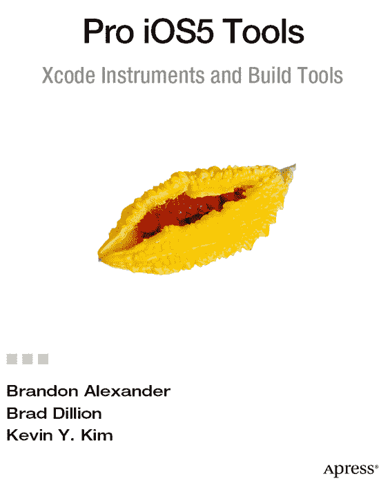

**iOS 5 专业工具：Xcode、Instruments 与构建工具**

版权所有 © 2011， Brandon Alexander、J. Bradford Dillon 与 Kevin Y. Kim

保留所有权利。未经版权所有者及出版商事先书面许可，本作品的任何部分均不得以任何形式或任何方式（包括电子或机械方式，如影印、录制，或通过任何信息存储或检索系统）进行复制或传播。

国际标准书号（平装）：978-1-4302-3608-5  
国际标准书号（电子版）：978-1-4302-3609-2

本书中可能出现商标名称、标识和图像。我们并非在每次出现商标名称、标识或图像时都使用商标符号，而是仅以编辑方式使用这些名称、标识和图像，以维护商标所有者的利益，且无意侵犯其商标权。

本出版物中使用的商品名、商标、服务标记及类似术语（即使未明确标识为商标），不应被视作对其是否受专有权利保护的表达。

总裁与出版商：Paul Manning  
首席编辑：Steve Anglin 与 Michelle Lowman  
技术审校：Anselm Bradford  
编辑委员会：Steve Anglin、Mark Beckner、Ewan Buckingham、Gary Cornell、Morgan Ertel、Jonathan Gennick、Jonathan Hassell、Robert Hutchinson、Michelle Lowman、James Markham、Matthew Moodie、Jeff Olson、Jeffrey Pepper、Douglas Pundick、Ben Renow-Clarke、Dominic Shakeshaft、Gwenan Spearing、Matt Wade、Tom Welsh  
协调编辑：Anita Castro  
文字编辑：Heather Lang 与 Mary Behr  
排版：MacPS, LLC  
索引编制：SPI Global  
美术设计：SPI Global  
封面设计：Anna Ishchenko

本书通过 Springer Science+Business Media, LLC. 向全球图书贸易发行，地址：233 Spring Street, 6th Floor, New York, NY 10013。电话：1-800-SPRINGER，传真：(201) 348-4505，电子邮件：`orders-ny@springer-sbm.com`，或访问：`www.springeronline.com`。

有关翻译信息，请发送电子邮件至：`rights@apress.com`，或访问：`www.apress.com`。

Apress 及 friends of ED 图书可批量采购用于学术、公司或促销用途。大多数图书也提供电子版及许可证。更多信息，请参阅我们的特殊批量销售-电子版许可网页：`www.apress.com/bulk-sales`。

本书中的信息按“原样”分发，不提供任何担保。尽管在编写本书时已采取一切预防措施，但作者和 Apress 均不对因使用本书所含信息而直接或间接导致的任何损失或损害向任何人或实体承担责任。

作者在本文中引用的任何源代码或其他补充材料，读者均可从 `www.apress.com` 获取。关于如何查找本书源代码的详细信息，请访问：`http://www.apress.com/source-code/`。

*献给 Erin 和 Sage，我生命中最美丽的女孩。爱你们。*  
——Brandon Alexander

*献给我的妻子 Jennifer，以及我们的孩子 Nevaeh 和 Jack。*  
——J. Bradford Dillon

*献给 Annie，感谢她所有的爱与支持。*  
——Kevin Y. Kim

## 内容速览

目录  
关于作者  
关于技术审校  
致谢  
引言

 第 1 章：上蜡，擦蜡  
 第 2 章：一流工具  
 第 3 章：三个屏幕……嗯，能运行  
 第 4 章：内存管理与诊断  
 第 5 章：核心动画与平滑滚动  
 第 6 章：网络、缓存与电源管理  
 第 7 章：准备 Beta 版！  
 第 8 章：为什么出问题了？  
 第 10 章：现在，他们想要一个 iPad 版本  
 第 11 章：我该如何分享这些？  
 第 12 章：还有一件事  
索引

