# 目录

目录概览

关于作者

关于技术审校

致谢

引言

 第 1 章：空手道小子，学以致用

本书的读者对象

本书内容概述

开始前的准备工作

本书章节简介

让我们开始吧

 第 2 章：一流工具

环顾四周

这么多窗格！

编辑器及其配套工具

跳转栏

组织器

选项卡、选项卡、更多选项卡

回归代码

更新核心数据模型

添加新的视图控制器

回顾当前进展

Instruments 工具登场

直接上手 Instruments

各式各样的 Instruments

调优性能

本章小结

 第 3 章：三个屏幕… 嗯，跑起来了

使用 GitHub

连接到 Super Checkout

环顾四周

运行 Super Checkout

浏览项目（以及 Xcode）

本章小结

 第 4 章：内存管理与诊断

分支是我们的朋友

自动引用计数

转换为 ARC

识别循环引用

回归手动引用计数

养成健康的编码习惯

是否保留，这是一个问题

连接属性与多态点

执行静态分析

僵尸——不是你以为的那种僵尸

其他线程中的僵尸（某种程度上）

内存泄漏

重温循环引用

GDB 功夫

GDB，此刻别让我失望

GDB 入门

确定上下文——我在哪里？

检查数据——我有什么？

断点设置并不难

综合运用

修复我们的 Bug

当其他方法都失效时

海森堡 Bug

求助朋友

重新开始

我们快完成了…… 几乎

本章小结

 第 5 章：核心动画与流畅滚动

利用主线程

探索事件循环

优化代码执行

改进产品列表界面

探究滚动视图的背后原理

懒加载图片

告别糟糕的滚动体验

核心图形初探


回到工具

向苹果学习

总结

 第 6 章：网络、缓存与电源管理

理解网络与缓存控制

探索客户端 API

探索服务端 API

使用 Network Link Conditioner 模拟网络延迟

控制缓存

了解电源管理

硬件相关

编码技巧

总结

 第 7 章：准备 Beta 版！

管理 Beta 测试

定义 Beta 版

获取 Beta 测试者

给出指引

创建 Ad Hoc 构建

证书、配置文件与分发，天哪！

Alpha、Beta、Gamma？

总结

 第 8 章：为什么东西会坏掉？

测试驱动开发

我应该何时开始测试？

Xcode 让测试更简单

优化测试

在你的应用中应用测试

测试 SCJSONParser

模拟对象

负面测试

负面测试与有用的失败

UI 测试与自动化工具

入门指南

编写用户界面测试脚本

引入一个 Bug

自动化的力量

无论如何，都需要测试

第 9 章：我们能将其中一些自动化吗？

持续集成

认识 Jenkins

启动并运行 Jenkins

Jenkins 界面

驱逐 Jenkins 守护进程

领取任务

编写 Xcode 脚本

谁破坏了构建？

质量控制

更简单的分发

PackageApplication 在哪里？

XCRun

直接归档吧

导出到 Jenkins 之外

难道不能让别人来处理所有这些吗？

创建每日构建

让你的构建面向未来

我们还能做什么？

 第 10 章：现在，他们想要一个 iPad 版本

在开始编码之前

为 iPad 进行设计

实现 iPad 版本

修改目标

应用委托与起始 UI

更新库存和产品详情

修改购物车视图控制器

收尾工作

总结

 第 11 章：如何分享其中的一部分？

将代码拆分为静态库

创建静态库

使用静态库

在 GitHub 上分享

登录 GitHub

创建一个共享仓库

提交我们的更改

使用 GitHub 功能

明智地选择你的许可证

 第 12 章：还有一件事

自定义 Xcode

行为

字体与颜色

文本编辑

快捷键绑定

下载

文档

位置

分布式构建

键盘快捷键及更多

从 Xcode 3 迁移到 Xcode 4

快把快捷键给我！

查看文档

总结

 索引

## 关于作者

 **布兰登·亚历山大**是一位 iOS 开发者、写作者和会议演讲者，与妻子和女儿居住在乔治亚州迪凯特。布兰登于 2008 年开始 iOS 开发，并在多个会议上发表过演讲。作为一名开发者，他喜欢让技术对用户透明且优雅实用；作为演讲者和写作者，他乐于向他人传授技术知识，以便他们也能做到这一点。在不编写代码、写作或出席会议时，布兰登喜欢魔术和摄影。你可以在 Twitter 上通过`@whilethis`找到他，或通过邮件联系[`brandon.alexander@gmail.com`](http://brandon.alexander@gmail.com)。

 **布拉德·狄龙**自学成才，自学了其行业所需的技术，经历了 Web 开发、动画和其他基于桌面的交互式平台，最终在触屏界面开发中找到了归宿。自 iPhone SDK 发布以来，布拉德一直全职为 iOS 设备构建应用。凭借对用户体验的热情和对相关技术的深刻理解，布拉德帮助构建了弥合设备、用户与全球品牌之间差距的解决方案。你可以在[`http://jbradforddillon.com`](http://jbradforddillon.com)找到他，并在 Twitter 上关注`@jbradforddillon`。

 **凯文·Y·金**是 AppOrchard LLC 的创始合伙人，该公司是 Tipping Point Partners 旗下专注于可持续 iOS 开发的企业。他毕业于卡内基梅隆大学，在匹兹堡超级计算中心担任程序员时首次接触 NeXTStep 计算机（当今 iPhone 的前身），并从此着迷。他的职业生涯跨越了金融、政府、生物技术和科技领域，包括在苹果公司任职，负责管理纽约大都会区的苹果企业服务团队。他与妻子以及一群获救的猫咪居住在纽约市字母城地区。

## 关于技术审校

 **安塞尔姆·布拉德福德**是新西兰奥克兰理工大学（AUT）的数字媒体讲师，研究方向包括交互式媒体、网络媒体和视觉传达。他与互联网相关的开发经验可以追溯到 1996 年，当时他手动编写了第一个网站。他可以在 Twitter 上通过`@anselmbradford`找到，并偶尔在[`AnselmBradford.com`](http://AnselmBradford.com)上写博客。


## 简介

近年来，iOS 平台人气飙升，并且丝毫没有放缓的迹象。应用市场竞争变得异常激烈，用户对优秀体验也习以为常。这使得我们作为应用开发者的工作变得非常困难。是什么让一款出色的应用从其他应用中脱颖而出？我们将通过本书来尝试回答这个问题。

### 为什么要写一本关于工具的书？

常言道：“工匠的手艺好坏，取决于他/她的工具。”这对大多数行业来说基本都是如此。作为开发者，我们通常只需要一个文本编辑器和编译器。虽然这种配置也能完成工作，但一套优秀的工具——从 IDE（集成开发环境）到性能分析和调试工具——能极大地提升开发者在开发和调试过程中的效率。开发者面临的主要问题，尤其是在这些工具不断推出新版本的情况下，是如何有效地使用它们。这正是本书的定位所在。本书将全面介绍如何运用 Apple 提供的出色开发者工具，以及如何利用它们来打造卓越的应用。

### 本书的组织结构

本书的核心是流程。正如你将在第 1 章中读到的那样，无论你处于哪个阶段，本书都将帮助你在成为更优秀开发者的道路上不断前行。本书开头的几章主要涉及调试和性能调优。我们将把一个急需改进的项目推进到可以进入 Beta 测试的阶段。接着，我们会探讨如何提升开发者自身的效率，并让工具为我们完成大部分工作。我们甚至会将很多流程自动化，以便专注于更重要的问题。本书的最后部分将介绍如何与测试人员共享应用、如何回应反馈，以及最终如何在我们的应用之间共享代码。最后一章则聚焦于如何导航和自定义 Xcode，以适应我们自己的工作流程。

### 支持与贡献

如果你遇到任何问题，或者发现了对本书读者有帮助的实用技巧，请访问 [`http://proiostools.com/forum/`](http://proiostools.com/forum/) 并参与讨论！我们的目标是建立一个出色的社区，并与已有的庞大 iOS 开发社区相互交融。我们在此提供帮助，也热切期待看到你在阅读本书过程中发现的各类技巧与诀窍。

## 第 1 章

## 蜡上蜡，蜡下蜡

到现在为止，你应该已经编写过一两个 iOS 应用了。你也懂得了打造一款出色的应用绝非易事。从突如其来的崩溃，到内存泄漏，再到引发其他 Bug 的 Bug，即使最简单的应用也可能迅速演变成一场噩梦。幸运的是，借助我们手中的工具，这些问题很容易诊断。

这正是本书的主要内容。作为 iOS 开发者，我们拥有一套工具箱。但随之而来的核心问题很快变成了：对于手头的任务，哪种工具是最佳选择？本书将为你的大部分情况解答这个问题。对于那些没有明确答案的情况，你也会学到一些能为你指明正确方向的方法和技巧。

### 本书面向哪些读者？

在大多数技艺中，从完全新手到能够胜任的转变通常非常迅速。这一转变的目标仅仅是能够熟练使用工具，并理解工匠们的行话。这个转变过程也能建立新从业者的信心。在这个转变结束时，从业者已经能够完全胜任大部分任务，并解决大多数抛给他们的难题。

然而，大多数人停留在“熟练”这个阶段。作为一名魔术师，我相对较快地从一名艺术新手成长为一名熟练的业余爱好者。每当我学到一项新技术或一个新效果时，我都非常兴奋地练习。但随着技艺的提升，练习的欲望减弱了，甚至对反复排练同一个效果或技巧感到厌倦。我的技艺陷入了瓶颈。我知道要进入下一阶段需要做什么，但当下我不想去做。我觉得这样也挺好。

这与软件开发有何关联？首先，和任何技艺一样，一套特定的编程技能可以很快习得，包括学习语言语法、理解流程控制、使用基本的软件设计模式、通过标准输出进行调试以及基本使用提供的调试器。开发者在走向精通之路的下一阶段，是更深入地学习语言和平台的工作原理、更多的设计模式及其恰当用法，以及更深入地掌握调试器。最后的、永无止境的阶段，就是不断微调所有这些技能，为现有问题找到更优解，并学习如何更多地复用代码。这个学习路径并非对每个开发者都相同。有时，开发的某些部分会比另一些更容易掌握。

我要表达的重点是，当你没有像期望的那样快速进步时，我不希望你感到沮丧。软件开发很难。区分爱好者与专业人士的是投入程度。从一名熟练的爱好者转变为专业人士，通常会使你进入职业模式。这种投入程度需要的不仅仅是练习的时间。你必须开始审视其他软件是如何制作的。让自己身边围绕着为同一个平台进行开发的人，尤其是那些比你更优秀的人，这对成长至关重要。购买这本书，也说明你认同自己希望成为一名更优秀的开发者。我的目标是帮助你至少学会一项新技能。如果你做到了，我的任务就完成了；如果你学到的更多，那就更棒了！

那么，这本书是写给谁的呢？这本书是写给那些准备好迈向更高层次的读者的。无论你目前处于何种技能水平，本书都能让你有所收获。也许你已经精通面向对象编程，而性能调优是你想学习的方向。或者你想知道，如何在不重写一半应用代码的情况下，为 iOS 创建一个通用应用。唯一的先决条件是，你对 iOS 开发和 Objective-C 有一定了解。

### 本书是什么

本书是一本指南，它将带领你从一个 Alpha 质量的应用起步，最终打造出一个功能完备、经过测试、可提交至 App Store 的应用。本书包含了众多行业技巧，从诊断内存问题到调整滚动视图以榨取设备的最后一丝性能。最后，你会希望把这本书放在办公桌上，标记好相应的页面，以便快速查阅常见问题的解决方法。

这本书能解决你所有的问题吗？恐怕不能，但你将学到一些用非常系统化的方式解决问题的方法。从本质上讲，我们是科学家，而运用科学方法来解决软件问题，最终将帮助我们学会如何在下一次避免问题的发生。

本书还遵循一个真实的软件生命周期。我们将在开发接近尾声时接手一个项目，带领它经过 Beta 测试阶段，最终交付一个可以发布的产品。我们会遇到一些常见障碍，并探究 iOS 的工作方式；我们甚至会解决一些有趣的问题。我们还会发现一些由热心人编写的有用库，他们慷慨地分享了自己针对特定问题的解决方案。


### 开始前的准备工作

要充分利用本书，你需要在 iOS 开发者中心拥有一个付费开发者账号。这样你才能在实际的 iOS 设备上进行测试，并针对设备运行性能分析工具。我们将在设备上完成多项操作，因此如果你还没有付费账号，最好立即注册一个。截至本书撰写时，iOS 开发者项目的年费为 **99 美元**。

如果无法创建账号，你也可以从 Mac App Store 下载 `Xcode 4`。安装后即可获得 Xcode IDE 和 Instruments 工具。你将能够在 iOS 模拟器中开发和调试应用，并对其运行部分性能分析工具。但本书后续介绍的某些调试和性能测试将无法进行。

要配置 iOS 开发者中心，请访问 [`http://developer.apple.com/ios/`](http://developer.apple.com/ios/)。图 1-1 展示了主页的样式。点击顶部的“注册”链接即可开始。如果你希望将应用部署到 iOS 设备，这是最佳途径。若你是企业开发者，请查阅企业开发者计划。

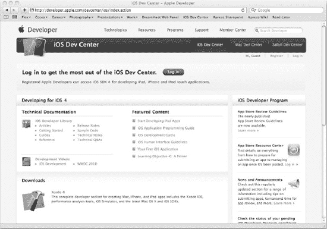

**图 1-1.** *iOS 开发者中心主页*

下载并安装最新开发工具后，启动 Xcode 并熟悉一下界面。如果你习惯使用 Xcode 3，会发现 Xcode 4 的界面完全不同。别担心，在阅读本书各章节时，我们会逐步介绍各项功能。如果你是 iOS 平台新手，不妨和 Xcode 打个招呼。相信你们很快就能成为朋友（放心，朋友之间偶尔也会闹别扭）。无论如何，你将开启一段精彩的旅程，学习如何充分利用苹果提供的工具箱以及一些优秀的第三方工具。

### 本书内容概览

本书将围绕一个项目展开。我们会从项目初期的 Alpha 阶段开始，准备进行 Beta 测试。接着，我们将经历 Beta 测试阶段，通过错误报告和功能请求收集测试者提供的宝贵反馈。你将学习如何通过自动化优化工作流程，并将项目迁移为通用应用。最后，我们将探讨如何与开发者社区共享代码，并介绍如何充分发挥 Xcode 4 及其他实用工具的作用。

以下是各章节的快速概览：

- *第 2 章，顶级的工具集（Xcode、Interface Builder 与 Instruments）*：在本章中，你将认识 Xcode 4 以及 iOS 开发工具包中的其他工具。我们将讨论 Xcode 的新布局以及集成 Interface Builder 带来的好处。我们还将打开 Instruments，让你熟悉这款用于性能测试和调试的工具。
- *第 3 章，三个界面…嗯，它能运行了*：在这里，我们将深入检查一个现有项目，学习如何直接在 Xcode 中使用 Git 和 GitHub。我们还将完成本书项目的首次构建：Super Checkout。
- *第 4 章，内存管理与诊断*：本章将诊断并解决应用崩溃的首要原因。我们会讨论 Objective-C 的内存管理及最佳实践，并首次使用 Instruments 来帮助诊断这些棘手的内存问题。
- *第 5 章，核心动画与流畅滚动*：解决内存问题后，我们将深入优化核心动画，让表格的滚动丝般顺滑。你将学习第二款工具的使用，并了解 iOS 渲染模型的一些有趣特性。
- *第 6 章，网络、缓存与电源管理*：在本章中，你将全面了解网络知识以及内置 iOS 网络 API 的工作原理。我们将考察一个流行的网络库，并替换现有的网络层以增强应用功能。我们还会探讨缓存技术及其利弊。本章最后将聚焦电源管理，介绍 iOS 设备上的不同无线模块、它们对电池消耗的影响以及如何检测问题。
- *第 7 章，准备 Beta 测试！*：在解决 Super Checkout 的一些重大问题后，我们将为 Beta 测试做准备。我们会了解一些 Beta 分发技术和管理测试的思路。
- *第 8 章，为什么总是出问题？*：我们收到了错误报告，服务器 API 发生了变化，各种问题层出不穷。本章将研究如何将应用分解为可测试的组件，以减少代码中的错误数量。你还将学习如何让 Instruments 自动驱动应用并报告错误。最后，我们将建立一套测试套件，确保应用稳定运行，并在后续修改中保持稳定。
- *第 9 章，我们能实现自动化吗？*：距离实现完全自动化的构建系统只差一步，该系统能在每次向源代码仓库推送新代码时自动运行测试。我们将介绍选用的可靠构建管理工具，以及如何自动向测试者推送新版应用。
- *第 10 章，现在他们想要 iPad 版本*：随着功能请求逐渐减少，我们发现需要开发与 iPad 兼容的 Super Checkout 版本。在本章中，你将学习如何将 Super Checkout 迁移为通用二进制文件，以及在不同尺寸的 iOS 设备间共享代码的不同技术。
- *第 11 章，如何分享部分代码？*：我们的应用已准备发布，但我们还创建了一些出色的功能，希望将其提取为静态库，以便在多个项目甚至整个开发者社区中共享代码。我们将探讨如何在 GitHub 上分享代码，并简要讨论开源许可证问题。
- *第 12 章，还有一件事*：到现在为止，我们已经将一个充满崩溃和错误的应用打磨成了可以发布的产品。本章将介绍 Xcode 的其他功能，以及如何加速工作流程。我们还将了解一些出色的第三方工具，它们能提升开发效率并减少需要编写的样板代码。

### 让我们开始吧

准备好开始了吗？很好！在翻页深入项目之前，先提醒一点：本书涵盖的信息量很大，试图一次性消化所有内容并非明智之举。建议一次只读一章，必要时可反复阅读相关章节。相信我，书中的某些主题在成文之前也经过多次反复推敲。

如果遇到困难或感到困倦，不妨暂时放下书本，甚至小睡片刻。这能让你头脑清醒，大脑会在你做其他事情时继续处理这些信息。重新阅读时，你会豁然开朗，发现自己对内容的理解更深入了。学习是一个主动的过程，正如 Aaron Hillegass 在《Cocoa Programming for Mac OS X》中所说：“咖啡因不能替代睡眠。”

现在，启动 Xcode 4，打开笔记本，翻页开始吧。让我们一起来享受这个过程。

## 第 2 章


## 一流工具

Xcode 经历了又一次重大更新。这一次，Xcode 采用了一个带有标签页的巨大窗口。此版本中的大量新功能让开发者的工作更加轻松。其中一些新功能包括：

- 单一、统一的窗口，将所有功能整合在一起。
- 跳转栏可以更快速地浏览项目以及单个源文件，且不会占用太多空间。
- Interface Builder 完全集成到 Xcode 中，使 nib 文件和源代码之间的集成更加紧密。
- Xcode 助理是一个双窗格编辑器，启用后，它会为你当前编辑的文件在旁边选择一个合适的文件进行查看。
- LLVM 3.0 完全集成到 Xcode 中，这意味着更好的语法高亮、代码补全以及 LLVM 提供的许多其他功能。
- 修复工具利用 LLVM 的一些功能，不仅能显示编译错误，还能建议快速修复。
- Xcode 与一些常见的版本控制系统集成得更好：Git 和 Subversion (SVN)。
- 全新的调试器：LLDB 之于 GDB 就如同 LLVM 之于 GCC。
- Instruments 拥有一个采用跳转栏和从 Xcode 界面借鉴的其他功能的新界面。

有了这些新功能和增强的工作流程，当你习惯了 Xcode 3 时，可能会感觉有些不知所措。本章的计划是了解 Xcode 的一些新特性，并查看一些常见功能被移动到了哪里。

### 环顾四周

首先，我们创建一个简单的项目，并将其中一些功能付诸实践。我们现在还不会创建什么有意义的东西；精彩的内容将在下一章开始。我们将了解在 Xcode 4 中完成一些常见任务的位置，以及一些新的用户界面增强功能。

首先，启动 Xcode 4。我们将创建一个新项目，因此单击图 2–1 中显示的 `Create a new Xcode project` 按钮。


**图 2–1.** *启动 Xcode 时映入眼帘的熟悉画面*

在本章中，我们将创建一个基于导航的应用程序。选择该选项，然后单击 `Next`。在下一个屏幕中，我们为项目命名，声明我们的公司标识符，并选择任何其他项目偏好设置。继续，将项目命名为 `Super Hello World`，并以反向 DNS 形式填写公司标识符。在本练习中，我们将使用 `com.example`。同时选中 `Use Core Data` 和 `Include Unit Tests` 复选框。你的屏幕应类似于图 2–2 所示。

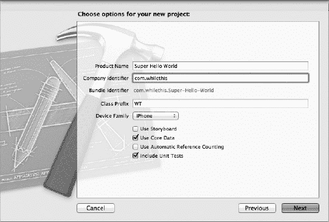

**图 2–2.** *项目命名屏幕现在包含了创建单元测试目标的功能。*

单击 `Next` 将弹出一个工作表，询问我们将项目保存到哪里。继续为项目选择一个位置，并选中创建本地 Git 存储库的复选框。单击 `Create` 将创建项目，并直接将你带入 `Super Hello World` 的项目设置中。

首先显示的是项目详细信息（参见图 2–3）。中间列选中的项目是项目的默认目标。你还会注意到单元测试目标位于其下方。如果你想更改项目编译和打包的方式，请修改特定的目标。如果你习惯于在 Xcode 3 中执行此操作的方式，你会注意到修改目标现在集中到这一个区域了；你不再需要像在 Xcode 3 中那样进入信息窗格来修改目标。

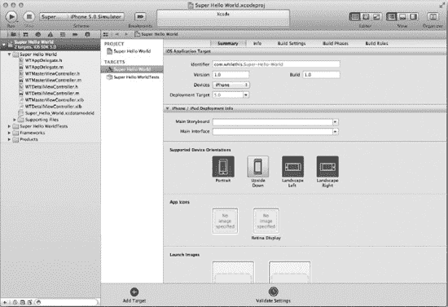

**图 2–3.** *现在 Xcode 有一个默认编辑器用于修改项目元数据和目标。*

现在我们的项目已经创建好了，你可以看到一些在 Xcode 3 中熟悉的视图——只是有一些新的项目。

图 2–4 显示了应用程序的以下主要部分：

- 顶部，工具栏
- 左侧，导航器区域
- 底部，调试器区域
- 右侧，实用工具区域
- 中间，编辑器区域

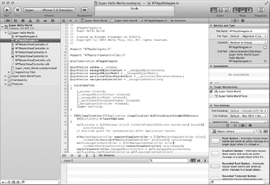

**图 2–4.** *所有窗格都打开的 Xcode 工作区窗口*

#### 这么多窗格！

你首先注意到的可能是宝贵的编辑器空间很容易丢失。好消息是，我们可以关闭所有窗格，只专注于代码。在我们过于深入之前，要不要先看看 Xcode 的每个部分，看看它们为我们带来了什么？

顶部是工具栏。在工具栏中，你可以选择活动的部署目标并运行你的应用程序。你也可以为你选择合适的编辑器，以及打开和关闭窗格。最右边的按钮启动 Organizer 窗口，允许你管理 iOS 设备和所有项目。

左侧的窗格是导航器区域。在这个窗格中，你可以选择多个导航器之一进行交互。可用于你的导航器有 `Project`、`Symbol`、`Search`、`Issue`、`Debug`、`Breakpoint` 和 `Log`。`Project` 导航器是默认导航器，允许你浏览项目中的文件。`Symbol` 导航器以层次结构或平面视图显示项目中的符号。`Search` 导航器允许你在项目中搜索文本，并在下方显示结果。`Issue` 导航器借助 Xcode 内置的新编译器技术，近乎实时地显示任何编译器错误或警告。

接下来的两个导航器用于调试。`Debug` 导航器仅在调试会话期间处于活动状态。你可以根据线程或队列查看信息。按队列查看可以让你深入了解不同的调度队列，并显示你正在查看的队列类型。`Breakpoint` 窗格是你管理应用程序中断点的位置。与 Xcode 3 一样，你可以创建新的断点，移动它们，禁用它们，以及删除它们。

最后一个导航器是 `Log` 导航器。你执行的任何通常会被记录的操作都将放在这里，包括构建、静态分析、源代码控制操作和调试会话。


### 编辑器及配套的实用工具

你绝大部分时间都会在编辑器区域中度过。Xcode 提供了多种文件编辑器供你使用：

- 源代码
- 项目和构建设置
- 属性列表（`plist`）文件
- 富文本文件
- Core Data 数据模型
- Core Data 映射模型
- XIB（XML nib）文件
- AppleScript
- 脚本字典文件

此外，还包含一些文件查看器，可用于查看图形、视频以及其他多种文件。

你还可以选择三种不同类型的编辑器。你可以从工具栏访问这些编辑器类型。**标准编辑器** 是最基本的编辑器，你可以像往常一样编辑文件。**辅助编辑器**（参见图 2–5）是一种新型编辑器，它允许你在编辑源文件时，旁边会有一个辅助视图显示相关的文件。例如，当你编辑一个源文件并选择辅助编辑器时，头文件会显示在它的旁边。如果你打开一个 nib 文件，辅助编辑器允许你查看关联的头文件（来自 nib 的“文件所有者”属性）并与其交互。从这里，你实际上可以将 nib 中的元素通过 Control 拖拽到源代码编辑器中，Xcode 会将相应的属性放入你放置的代码位置。

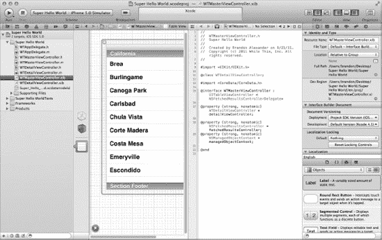

**图 2–5.** *辅助编辑器显示一个 nib，旁边是与之对应的文件所有者头文件。*

某些文件类型可能没有对应的文件可以通过辅助编辑器打开。如果出现这种情况，你可以手动选择要在所选文件旁边显示的编辑器。为此，你需要使用辅助编辑器中的**跳转栏**来选择要显示的文件。你可以通过前往**视图  辅助编辑器**来修改辅助编辑器的位置，并指定辅助编辑器是位于标准编辑器的右侧还是下方。

另一种编辑器选项是**版本编辑器**。如果你开启了源代码控制，此编辑器将显示你对所选文件所做的更改。在撰写本书时，Xcode 4 仅支持 Git 和 Subversion 作为源代码控制工具。通过版本编辑器，你可以点击差异查看器下方的时间按钮来查看文件的历史记录。在同一屏幕中，你还可以查看追溯历史以及带有日志注释的文件历史视图（参见图 2–6）。

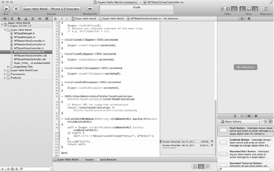

**图 2–6.** *版本编辑器让你能够查看文件历史记录以及版本注释，俗称责备视图。*

在图 2–6 中，你还可以看到编辑器右侧的**实用工具**区域。这个面板会根据你的选择显示上下文相关的信息。在图 2–5 中，我们选择了 `RootViewController` nib，你可以看到实用工具区域与旧版 Xcode 中 Interface Builder 的检查器窗口相似。如果你选择了一个源文件，你会看到与在 Xcode 3 中点击“获取信息”时相同的信息。在该区域，你可以选择源文件所属的目标，以及关于该文件的许多其他细节信息。

当你浏览源文件时，可以点击实用工具区域的**显示快速帮助**按钮，查看光标所在任意符号的简要信息。在该区域，你可以点击任何一个蓝色条目，根据点击的上下文，它可能会打开头文件、其他文档或示例代码。花点时间尝试不同的编辑器，熟悉新的界面。别担心，我在这儿等你回来。

### 跳转栏

在你熟悉编辑器的过程中，有没有注意到顶部的栏？它叫做**跳转栏**，可以让你快速浏览文件。图 2–7 显示了我们创建的`项目`中 `RootViewController` 文件的跳转栏。


**图 2–7.** *跳转栏是一种导航工具，始终位于其对应的编辑器上方。它也出现在 Instruments 中，用于执行相同类型的任务。*

使用跳转栏是在项目中快速导航的一种方式，无需使用项目导航栏查找文件。**相关文件按钮**（看起来像一个等号）会弹出一个列表，让你查看最近文件、未保存的文件，以及与当前查看文件相关的许多其他列表。

**后退**和**前进**按钮允许你在已打开的编辑器中的文件历史记录中导航。用双指左右滑动可以快速浏览文件，就像在 Lion 系统中的 Safari 浏览器中一样。

右侧其余部分是一个面包屑导航路径，从项目开始，显示如何到达你正在编辑的方法。在图 2–7 中，你可以看到我们从项目开始，在“Super Hello World”组中是文件 `RootViewController.m`，我们正在查看 `fetchedResultsController` 选择器。点击任何一项都会显示同级项列表，并允许你深入到每一个后续层级。

### 管理器

Xcode 4 引入了一个新管理器，它的功能名副其实：**管理**你的开发工作空间。你可以通过点击工具栏上的**管理器**按钮或按下  2 来打开它。图 2–8 显示了打开到“项目”选项卡的管理器。管理器有以下五项主要功能：

- 管理开发设备
- 管理源代码控制仓库
- 管理最近项目
- 管理归档构建
- 显示文档

查看一下**设备**部分。如果你是注册开发者，你可以在此部分管理你的所有开发者配置文件、预置描述文件、旧的 iOS 软件镜像、设备日志和屏幕截图。你还可以查看 Xcode 在你连接每台设备时收集的特定设备信息。当连接设备时，你可以截取屏幕截图（用于 App Store 提交），甚至可以将屏幕截图保存为启动图像。

接下来要看的是**仓库**选项卡。它显示了已设置源代码控制的最近项目的仓库。如果有要签出的现有项目，你可以设置仓库链接并签出仓库的新工作副本。如前所述，Xcode 仅支持 Git 和 Subversion。任何其他源代码控制都必须通过外部工具进行管理。

图 2–8 显示了**项目**选项卡。此选项卡会显示 Xcode 已知的项目。它显示了哪些项目当前处于打开状态，以及关于项目的其他基本信息。此视图还允许你管理项目快照。

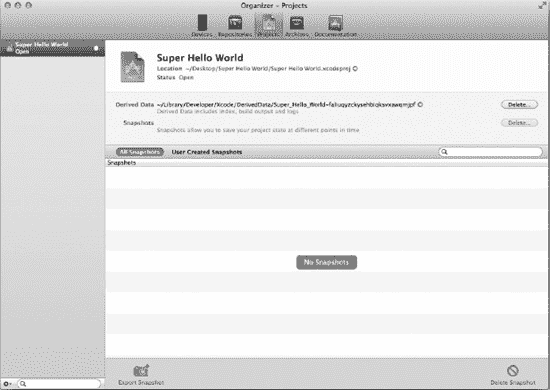

**图 2–8.** *显示你曾处理过的项目列表的管理器*

接下来的选项卡允许你管理已归档的应用程序。应用程序归档功能是在 Xcode 3 中引入的，旨在为 iOS 开发者提供一种简化的方式来提交应用进行审批。归档应用程序后，你可以验证二进制文件以检查是否有常见遗漏项，然后再将应用程序提交到商店、与测试人员共享临时构建版本，或者将应用程序提交到商店。

管理器中的最后一个选项卡是**文档**选项卡。这是你访问 iOS、Mac OS 和 Xcode 4 文档的门户。查看任何文档时，你都会在顶部找到一个跳转栏，它的工作方式与源代码编辑器中的跳转栏完全相同。


#### 标签页，标签页，更多的标签页

在回到我们的项目之前，让我们先看看最后一个项目：标签页。Xcode 的标签页允许你在同一个窗口中同时打开多个编辑器。图 2-9 展示了打开三个标签页的 Xcode。

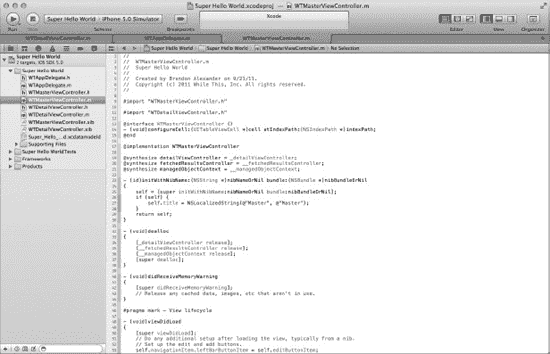

**图 2-9.** *Xcode 中的多个标签页*

这些标签页带来的不仅仅是多个编辑器。你可以将标签页从窗口中拖出，并以该配置打开一个全新的窗口。这意味着你可以有一个窗口用于编辑源代码，另一个窗口用于编辑 nib 文件。每个标签页都可以独立配置，并拥有自己的历史记录管理。如果只打开了一个标签页，你可以通过 **视图  显示/隐藏标签页栏** 来显示或隐藏标签页栏。

你不妨继续浏览 Xcode 中的不同视图？当你回来时，我还会在这里。

### 回到代码

既然我们已经更深入地了解了 Xcode，现在就对我们的项目进行一些基本修改，并开始将更改提交到本地 Git 仓库。在本章中，我们将构建一个非常简单的数据收集应用程序。我们将修改核心数据模型，添加一个新的视图控制器，然后将所有更改检入源代码控制。

在开始之前，先构建应用程序以确保它能编译。转到 **产品  构建** 或按下 B。项目应该能成功编译，没有错误。通过转到 **产品  清理** 或按下  K 来清理项目，清除所有构建产物。

#### 更新核心数据模型

我们要做的第一件事是修改核心数据模型。首先在 Xcode 中打开数据模型（在项目管理器窗格中点击 `Super_Hello_World.xcdatamodeld`），然后更新模型，如图 2-10 所示。

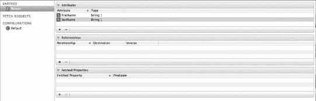

**图 2-10.** *Super Hello World 的非常简单模型*

如你所见，我们使用 Person 实体替换了 Event 实体，该实体包含两个属性：`firstName` 和 `lastName`。完成后，我们将通过选择 Person 实体，然后在菜单栏中转到 **编辑器 ** **创建 NSManagedObject 子类…** 来创建一个 `NSManagedObject` 子类。将出现一个工作表询问你保存模型类的位置，点击“创建”，你将在项目导航器中看到全新的 Person 头文件和实现文件。

我们的示例应用程序将显示一个名称列表，因此让我们修改 `Person` 类，使其具有以下头文件：

```
#import <Foundation/Foundation.h>
#import <CoreData/CoreData.h>
@interface Person : NSManagedObject {
@private
}
@property (nonatomic, retain) NSString * firstName;
@property (nonatomic, retain) NSString * lastName;

-(NSString *) fullName;

@end
```

这是它的实现：

```
#import "Person.h"

@implementation Person
@dynamic firstName;
@dynamic lastName;

-(NSString *) fullName {
     return [NSString stringWithFormat:@"%@ %@", [self firstName], [self lastName]];
}

@end
```

我们在这里所做的只是添加一个 `fullName` 方法来计算人的全名。

既然我们已经修改了模型，就需要用这些更改更新 `RootViewController`，并更新表格中显示的内容。我们只需要在几个地方更新该类；代码清单 2-1 展示了受影响的方法。

**代码清单 2-1.** *修改 RootViewController 以反映新模型*

```
- (void)configureCell:(UITableViewCell *)cell atIndexPath:(NSIndexPath *)indexPath
{
    Person *person = (Person *)[self.fetchedResultsController objectAtIndexPath:indexPath];
    cell.textLabel.text = [person fullName];
}
- (void)insertNewObject
{
    // 创建由抓取结果控制器管理的实体的新实例。
    NSManagedObjectContext *context = [self.fetchedResultsController managedObjectContext];
    NSEntityDescription *entity = [[self.fetchedResultsController fetchRequest] entity];
    Person *newManagedObject = (Person *)[NSEntityDescription insertNewObjectForEntityForName:
    [entity name] inManagedObjectContext:context];

    // 如果合适，配置新的托管对象。
    // 通常你应该使用存取方法，但在这里使用 KVC 可以避免为模板添加自定义类。
    [newManagedObject setFirstName:@"Jonny"];
         [newManagedObject setLastName:@"Appleseed"];

    // 保存上下文。
    NSError *error = nil;
    if (![context save:&error])
    {
        /*
         请用处理错误的代码替换此实现。

         abort() 会导致应用程序生成崩溃日志并终止。你*不应该*在正式发布的应用程序中使用此函数，尽管它在开发过程中可能有用。如果无法从错误中恢复，请显示一个提示面板，指导用户通过按下 Home 按钮来退出应用程序。
         */
        NSLog(@"未解决的错误 %@, %@", error, [error userInfo]);
        abort();
    }
}

- (NSFetchedResultsController *)fetchedResultsController
{
    if (__fetchedResultsController != nil)
    {
        return __fetchedResultsController;
    }
```


```objective-c
/*
 设置抓取结果控制器。
*/
// 为实体创建抓取请求。
NSFetchRequest *fetchRequest = [[NSFetchRequest alloc] init];
// 根据实际情况编辑实体名称。
NSEntityDescription *entity = [NSEntityDescription entityForName:@"Person"
    inManagedObjectContext:self.managedObjectContext];

[fetchRequest setEntity:entity];

// 将批量大小设置为合适的数值。
[fetchRequest setFetchBatchSize:20];

// 根据实际情况编辑排序键。
NSSortDescriptor *sortDescriptor = [[NSSortDescriptor alloc] initWithKey:@"lastName" ascending:YES];
NSArray *sortDescriptors = [[NSArray alloc] initWithObjects:sortDescriptor, nil];

[fetchRequest setSortDescriptors:sortDescriptors];

// 根据实际情况编辑分区名称键路径和缓存名称。
// 分区名称键路径设为 nil 表示“无分区”。
NSFetchedResultsController *aFetchedResultsController = [[NSFetchedResultsController alloc]
    initWithFetchRequest:fetchRequest
     managedObjectContext:self.managedObjectContext
         sectionNameKeyPath:nil
                            cacheName:@"Root"];
aFetchedResultsController.delegate = self;
self.fetchedResultsController = aFetchedResultsController;

[aFetchedResultsController release];
[fetchRequest release];
[sortDescriptor release];
[sortDescriptors release];

    NSError *error = nil;
    if (![self.fetchedResultsController performFetch:&error])
    {
        /*
         将此处实现替换为适当处理错误的代码。

         abort() 会导致应用程序生成崩溃日志并终止。在生产应用程序中不应使用此函数，尽管它在开发过程中可能有用。如果无法从错误中恢复，请显示一个警告面板，指导用户通过按下 Home 键退出应用程序。
         */
        NSLog(@"未解决的错误 %@, %@", error, [error userInfo]);
        abort();
    }

return __fetchedResultsController;
}
```

最后要做的一件事是在头文件导入语句下方添加 `#import "Person.h"`。到目前为止，我们只更新了 `RootViewController` 来显示每个人的全名。我们还更新了它，以便在点击 Add 按钮时输入一个虚拟名称。既然我们已经做了一些更新并添加了一项功能，让我们将这些更改提交到 Git 仓库。

首先，看一下项目导航器。你应该会看到类似于图 2–11 的内容。

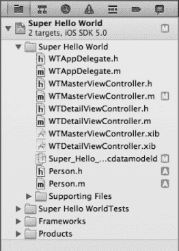

**图 2–11.** *项目导航器使用你的源代码控制系统来跟踪文件，并显示哪些文件已被修改、哪些是新文件。*

现在，我们将所有修改过的文件作为一个 Git 提交（commit）的一部分进行提交。有多种方式可以实现此目的：选择 **文件  源代码控制  提交**，或者选择要添加到提交中的修改文件，右键单击，然后选择**源代码控制  提交所选文件...**。无论哪种方式，你都会看到如图 2–12 所示的视图。

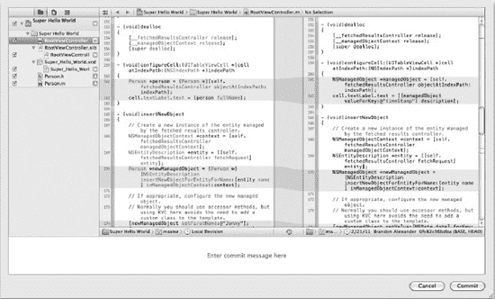

**图 2–12.** *提交表单允许你检查待推送的更改并输入提交信息。*

因为我们希望所有更改都进入此提交，所以不会取消选中项目视图中的任何文件。花点时间查看待推送更改的不同视图：项目视图、文件视图和平铺视图。项目视图按组结构显示项目中的更改上下文。文件视图按文件在文件系统中的实际存在方式显示文件。平铺视图则去掉列表中的任何结构，让你看到文件的原始列表。现在看一下内置的差异查看器，它会显示即将提交的更改。你可以通过右键单击任一编辑器视图来复制源代码更改，这样会以补丁格式的差异内容放入剪贴板。

作为优秀的开发者，我们将在提交信息中填写一些有意义的内容，比如：“changes”或“Continued development”。继续输入提交信息并点击提交。


### 添加一个新的视图控制器

现在，我们的应用已经拥有了一个经过修改的模型，并且能够添加一些托管对象。接下来，让我们创建一个模态视图控制器，用于插入来自用户输入的新对象。在添加文件之前，请在 Super Hello World 组下创建一个名为 `NewPersonViewController` 的新组（通过右键点击 Super Hello World 并选择 `New Group`）。接着，通过右键点击该组并选择 `New File`，向该组添加一个新文件。选择 `UIViewController` 子类，然后点击 Next。将其设置为 `UITableViewController` 的子类，并勾选“附带 XIB 用户界面”。点击 Next，将文件命名为 `NewPersonViewController.m`，然后点击 Save。

让我们添加一些自定义单元格。打开 `NewPersonViewController.xib` 文件，开启辅助编辑器模式，并确保头文件打开在 `.xib` 文件的右侧。我们将为 XIB 添加一些自定义表格单元格，并将它们连接到新的视图控制器中。可拖入 XIB 的用户界面（UI）元素库位于工具面板的底部。点击“显示对象库”，拖入两个 `UITableViewCell` 元素（在列表中显示为 Table View Cell）。在每个单元格内拖入一个 `UITextField`（列表中的 Text Field），并将其边框样式修改为不可见（通过点击工具面板中的“显示属性检查器”按钮，并在边框样式标签页中选择第一个按钮）。分别将占位文本设置为**名字**和**姓氏**。关闭工具面板，然后按住 Control 键将名字单元格（`UITableViewCell`，而非 `UITextField`）拖拽到头文件（在右侧编辑器面板中打开），将光标置于您通常会放置属性的位置——接口声明的闭合花括号下方。将该属性命名为 `firstName`。对姓氏单元格执行相同操作，将其命名为 `lastName`。

您已经为这些单元格创建了输出口属性；现在，我们要为文本字段创建输出口属性。按住 Control 键拖拽文本字段本身，并分别命名为：`firstNameInput` 和 `lastNameInput`。图 2–13 展示了最终成果。

到目前为止，我们已经创建了一个新的视图控制器，修改了 XIB 以包含一些新的界面元素，并将 XIB 与类关联了起来。现在，让我们填充详细信息。代码清单 2–2 展示了我们对新人视图控制器头文件所做的更新。

**代码清单 2–2.** *对 NewPersonViewController.h 的修改*

```
#import <UIKit/UIKit.h>

#define kSectionCount    1
#define kRowCount          2

@class Person;

@class NewPersonViewController;

@protocol NewPersonViewControllerDelegate <NSObject>

@required
-(void) viewController:(NewPersonViewController *)vc didSaveWithPerson:(Person *)p;
-(void) viewControllerDidCancel:(NewPersonViewController *)vc;

@end

@interface NewPersonViewController : UITableViewController {
    id<NewPersonViewControllerDelegate> delegate;
    UITableViewCell *firstNameCell;
    UITableViewCell *lastNameCell;
    UITextField *firstNameInput;
    UITextField *lastNameInput;

    NSManagedObjectContext *managedObjectContext;
}
@property (nonatomic, assign) id<NewPersonViewControllerDelegate> delegate;
@property (nonatomic, retain) IBOutlet UITableViewCell *firstNameCell;
@property (nonatomic, retain) IBOutlet UITableViewCell *lastNameCell;
@property (nonatomic, retain) IBOutlet UITextField *firstNameInput;
@property (nonatomic, retain) IBOutlet UITextField *lastNameInput;
@property (nonatomic, retain) NSManagedObjectContext *managedObjectContext;

@end
```

代码清单 2–3 展示了 `NewPersonViewController` 类实现文件的修改版本。

**代码清单 2–3.** *更新后的 NewPersonViewController.m*

```
#import "NewPersonViewController.h"
#import "Person.h"

@implementation NewPersonViewController
@synthesize delegate;
@synthesize firstNameCell;
@synthesize lastNameCell;
@synthesize firstNameInput;
@synthesize lastNameInput;
@synthesize managedObjectContext;

- (void)dealloc
{
        delegate = nil;
        [firstNameCell release], firstNameCell = nil;
        [lastNameCell release], lastNameCell = nil;
        [firstNameInput release], firstNameInput = nil;
        [lastNameInput release], lastNameInput = nil;
        [managedObjectContext release], managedObjectContext = nil;
        [super dealloc];
}

- (void)didReceiveMemoryWarning
{
    // 释放视图（如果它没有父视图）。
    [super didReceiveMemoryWarning];

    // 释放任何未使用的缓存数据、图像等。
}

#pragma mark - 视图生命周期

- (void)viewDidLoad
{
    [super viewDidLoad];

    // 取消注释以下行以在切换视图之间保留选择状态。
    // self.clearsSelectionOnViewWillAppear = NO;

    // 取消注释以下行以为此视图控制器在导航栏中显示编辑按钮。
    UIBarButtonItem *saveButton = [[UIBarButtonItem alloc]    
        initWithBarButtonSystemItem:UIBarButtonSystemItemSave target:self action:@selector(savePressed:)];
    self.navigationItem.rightBarButtonItem = saveButton;
    [saveButton release];

    UIBarButtonItem *cancelButton = [[UIBarButtonItem alloc]
        initWithBarButtonSystemItem:UIBarButtonSystemItemCancel target:self
        action:@selector(cancelPressed:)];
    self.navigationItem.leftBarButtonItem = cancelButton;
    [cancelButton release];
}

- (void)viewDidUnload
{
    [self setFirstNameCell:nil];
    [self setLastNameCell:nil];
    [self setFirstNameInput:nil];
    [self setLastNameInput:nil];
    [super viewDidUnload];
    // 释放主视图的任何保留子视图。
    // 例如：self.myOutlet = nil;
}

- (void)viewWillAppear:(BOOL)animated
{
    [super viewWillAppear:animated];
}

- (void)viewDidAppear:(BOOL)animated
{
    [super viewDidAppear:animated];
}

- (void)viewWillDisappear:(BOOL)animated
{
    [super viewWillDisappear:animated];
}

- (void)viewDidDisappear:(BOOL)animated
{
    [super viewDidDisappear:animated];
}

- (BOOL)shouldAutorotateToInterfaceOrientation:(UIInterfaceOrientation)interfaceOrientation
{
    // 返回 YES 以支持的方向
    return (interfaceOrientation == UIInterfaceOrientationPortrait);
}

#pragma mark - 表格视图数据源

- (NSInteger)numberOfSectionsInTableView:(UITableView *)tableView
{
    // 返回分区数量。
    return kSectionCount;
}

- (NSInteger)tableView:(UITableView *)tableView numberOfRowsInSection:(NSInteger)section
{
    // 返回分区中的行数。
    return kRowCount;
}

- (UITableViewCell *)tableView:(UITableView *)tableView cellForRowAtIndexPath:(NSIndexPath *)indexPath
{
        if([indexPath row] == 0) {
                return firstNameCell;
        } else {
                return lastNameCell;
        }
}

#pragma mark - 表格视图代理

- (void)tableView:(UITableView *)tableView didSelectRowAtIndexPath:(NSIndexPath *)indexPath
{
    // 此处无需操作，继续
}

#pragma mark - 接收的操作

-(void) savePressed:(id)sender {
    NSManagedObjectContext *context = [self managedObjectContext];

    Person *newPerson = (Person *)[NSEntityDescription insertNewObjectForEntityForName:@"Person"   
        inManagedObjectContext:context];

    [newPerson setFirstName:[firstNameInput text]];
    [newPerson setLastName:[lastNameInput text]];

        NSError *error = nil;
    if (![context save:&error])
    {
        /*
         将此处实现替换为处理错误的代码。
```


`abort()` 会导致应用程序生成崩溃日志并终止。虽然此函数在开发过程中可能有用，但你不应在正式发布的应用程序中使用它。如果无法从错误中恢复，请显示一个警示面板，指示用户通过按下 Home 键来退出应用程序。

```
NSLog(@"Unresolved error %@, %@", error, [error userInfo]);
abort();
```

```
[delegate viewController:self didSaveWithPerson:newPerson];
```

```
-(void) cancelPressed:(id)sender {
    [delegate viewControllerDidCancel:self];
}
```

`@end`

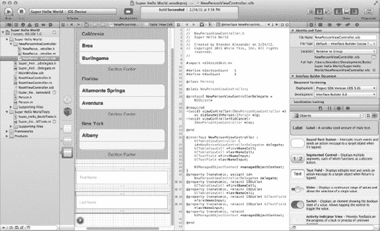

**图 2–13.** 在代码中创建一些 `UITableViewCells` 的最终产物。现在不再需要在代码中创建然后再通过 Interface Builder 进行连接——只需一步即可通过 Interface Builder 创建你的用户界面。

现在我们需要修改我们的 `RootViewController` 来启动新的视图控制器。如果你在头文件中注意到了，我们正在为委托声明一个协议。我们还需要告诉 `RootViewController` 它符合该协议，以便在模态视图控制器完成后能接收到相应的消息。

让我们首先修改头文件以遵循该协议：

`@interface RootViewController : UITableViewController <NSFetchedResultsControllerDelegate, NewPersonViewControllerDelegate>`

现在我们将更新实现中的 `insertNewObject` 方法，如代码清单 2–4 所示，以弹出新的视图控制器。我们不要忘记导入 `NewPersonViewController.h`。

**代码清单 2–4.** 处理显示新创建的 `NewPersonViewController` 的 `insertNewObject` 选择器。

```
- (void)insertNewObject
{
    NewPersonViewController *newPersonVC = [[NewPersonViewController alloc] initWithNibName:@"NewPersonViewController" bundle:nil];
    [newPersonVC setDelegate:self];
    [newPersonVC setManagedObjectContext:[self.fetchedResultsController managedObjectContext]];

    UINavigationController *navController = [[UINavigationController alloc] initWithRootViewController:newPersonVC];

    [self presentModalViewController:navController animated:YES];
    [navController release];
    [newPersonVC release];
}
```

最后一步是实现协议方法，如代码清单 2–5 所示。

**代码清单 2–5.** `NewPersonViewControllerDelegate` 协议实现

```
#pragma mark - NewPersonViewControllerDelegate Methods
-(void) viewController:(NewPersonViewController *)vc didSaveWithPerson:(Person *)p {
    [self dismissModalViewControllerAnimated:YES];
}

-(void) viewControllerDidCancel:(NewPersonViewController *)vc {
    [self dismissModalViewControllerAnimated:YES];
}
```

我们已完成为该项目添加新的视图控制器。将更改提交到源代码控制，然后继续。

### 回顾我们目前的进展

我们创建了一个超级简单的应用程序，它向 Core Data 存储中添加数据，并使用通过 Interface Builder 构建的界面。大部分代码都是由系统为我们生成的，而且我们从未离开 Xcode。现在我们已经有了一个可以正常工作的应用程序和由源代码管理工具管理的源代码，让我们花点时间回顾一下我们所做的工作。

我们简要了解了新的开发工具，并且你已经看到了 Apple 为改进开发工作流程所做的一些增强。还有许多其他功能我们尚未触及，因此多花些时间熟悉环境并学习一些键盘快捷键。

我们在本章中创建的项目是一个极其简单的项目，不需要引用任何静态库。Xcode 4 支持一个工作区中的多个项目，而我们只使用了工作区中的一个项目。

既然我们的应用程序可以工作了，让我们来看看如何启动我们的应用程序以使用 Instruments 进行分析。

### Instruments 时间

我们不会深入探讨 Instruments；那是本书剩余部分要讨论的主题。在本章中，我们将了解如何从 Xcode 启动 Instruments，以及有哪些不同的 Instruments 可用。

你可以通过 **Product  Profile** 来启动 Instruments，但我们将重点放在构建方案上，看看在构建应用程序时有哪些选项。图 2–13 显示了 Xcode 窗口中工具栏的左侧部分。在中间，你会看到用于启动应用程序的活动方案。如果单击下拉菜单，你会看到可用的方案，以及在每个方案内部的部署类型。目前，我们使用 iPhone 模拟器来运行所有内容。

首先，一个方案是一个构建目标集合、一个要使用的配置以及一组要运行的测试的集合。方案可以在每个项目的基础上定义，也可以定义工作区范围的方案。如何设置这些取决于你的项目。在我们的 `Super Hello World` 项目中，我们有一个方案可以针对三个不同的目标运行。我们将在后面的章节中深入介绍方案。目标是指项目的构建和运行所针对的架构，图 2–14 显示了在 iPhone 4 上构建的 `Super Hello World` 目标。

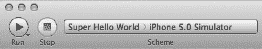

**图 2–14.** 方案下拉菜单指向项目可用的构建方案。

继续在下拉菜单中点击 **Edit Schemes…**，查看运行应用程序的配置选项。可以对应用程序执行六种不同的操作：构建、运行、测试、分析、性能分析和归档。构建操作在你构建项目时执行。你可以根据方案修改构建的目标，并选择哪些其他操作可以在指定目标上运行。运行操作（参见图 2–15）会将应用程序安装并运行在你选择的任何目标上。测试操作只是针对所选目标构建并执行单元测试目标。性能分析操作将在本节后面解释。分析操作会对你的代码运行静态分析器；我们将在后面的章节中介绍静态分析器。归档操作会构建适当的配置，打包构建产物以进行归档，并将其发送到 Organizer 的 Archives 部分以供进一步处理。

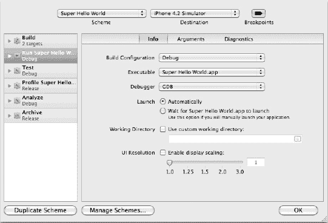

**图 2–15.** 方案编辑器工作表显示在不同上下文中启动应用程序的不同选项。

现在，我们来处理性能分析操作。图 2–16 显示了展开性能分析操作后的方案编辑器。与所有其他操作一样，这里可以执行前置操作和后置操作；例如运行脚本或发送电子邮件。能够在性能分析操作前后执行操作在自动化构建过程中会非常有帮助。

看看图 2–16，它显示了用于性能分析而构建和运行应用程序的设置。在信息（Info）选项卡中，你可以更改使用的构建配置，使用不同的可执行文件，定义在成功构建后将启动的特定 Instruments，更改应用程序的工作目录，以及在应用程序运行期间更改 UI 分辨率。在参数（Arguments）选项卡中，你可以选择使用运行操作的参数，或者为性能分析定义特定的参数。

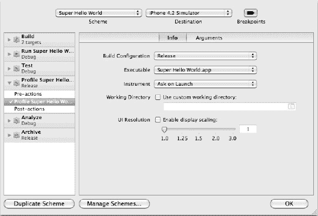

**图 2–16.** 方案编辑器中性能分析操作的配置工作表。


#### 进入“ Instruments ”工具

好吧，我知道，我们还没进入 Instruments 工具；我们正在靠近它。如果方案编辑器窗口还开着，请点击“好”。现在，通过依次选择 `Product  Profile` 来启动 Instruments，Xcode 会构建项目并启动 Instruments。启动后，您将看到如图 2–17 所示的启动界面。

如果您是在 iOS 设备上启动，您会看到更多可用的工具。在本例中，我们将对模拟器使用 `Leaks` 工具。在对话框中选择 `Leaks`，然后点击 Profile。

Instruments 将会启动，并运行 `Leaks` 和 `Allocations` 工具。应用程序启动后，您会看到 `Allocations` 工具中出现一些峰值，这是对象在内存中被分配的表现。我们暂时不深入探讨这意味着什么，但您现在知道了如何从 Xcode 启动 Instruments。

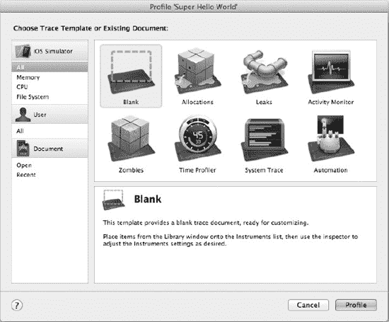

**图 2–17.** *Instruments 的启动界面允许通过模拟器进行分析。在真实设备上进行分析将显示更多工具。*

#### 众多的 Instruments 工具

`Instruments` 是一个诊断应用程序问题的强大工具。然而，学会如何有效使用其各种工具，才是调优应用程序使其高效运行的关键。在深入后续章节的众多工具之前，让我们先简要了解一下 `Instruments` 的用户界面，并对各种可用工具进行一个快速概览。

图 2–18 展示了对本章应用程序的一次运行。顶部的工具栏让您可以开始或停止数据收集、连接到系统上运行的不同应用程序，以及执行其他高级任务来精简您收集的数据。“Instruments”部分显示了每个工具所收集数据的各种图表。在我们的示例中，检测到零泄漏，并且在应用程序启动初期内存分配有一个峰值。

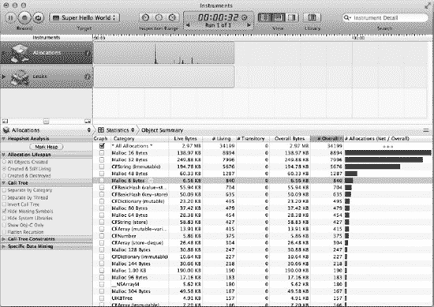

**图 2–18.** *Instruments 对我们的“Super Hello World”应用程序运行了 `Allocations` 和 `Leaks` 工具*

Instruments 窗格下方的区域显示了当前活动的工具，右侧是跳转栏。跳转栏下方的详细信息是来自所选工具的具体数据。点击 Instruments 窗格中的工具或在活动工具下拉菜单中选择它，都会改变数据的视图。请自行尝试，看看 `Leaks` 工具如果检测到泄漏会显示什么样的数据。

我们已经了解了 `Allocations` 和 `Leaks` 工具。还有其他许多工具可供使用：

- **Activity Monitor（活动监视器）**：此工具监视系统整体活动和统计信息。这些统计信息包括 CPU、内存、磁盘和网络使用情况。它还会监视其他进程，以了解整个系统在不同条件下的运行状况。
- **Time Profiler（时间分析器）**：此工具以低开销的方式对系统在任意时刻运行的进程进行基于时间的采样。
- **Automation（自动化）**：此工具执行一个脚本，模拟用户对从 `Instruments` 启动的 iOS 应用程序的交互。
- **Energy Diagnostics（能耗诊断）**：此工具监视设备不同组件的开/关状态，并提供应用程序运行时的能耗使用情况。
- **System Usage（系统使用情况）**：此工具记录单个进程与文件、套接字和共享内存相关的 I/O 系统活动。
- **Core Animation（核心动画）**：此工具测量应用程序的图形性能以及进程的 CPU 使用率。
- **OpenGL ES Driver（OpenGL ES 驱动）**：此工具测量 `OpenGL ES` 的性能。本书不会涵盖此工具。
- **OpenGL ES Analysis（OpenGL ES 分析）**：此工具测量并分析 `OpenGL ES` 活动，以检测正确性和性能问题。本书不会涵盖此工具。

### 性能调优

本书的其余部分将使用本节概述的流程来查找性能瓶颈。在诊断性能问题时，无论问题是什么，其过程基本上是相同的。遵循这些原则将避免很多麻烦，并减少您可能引入到应用程序中的错误数量。

性能调优是一个相当科学的过程。首先，找出应用程序中您认为可能需要调优的部分，并围绕该部分收集数据。您的假设可能是正确的，您会找到瓶颈所在。然而，您正在测试的应用程序方面可能并非问题所在。请始终为此做好准备。始终准备好改变假设并适应您的数据。如果数据显示某个部分运行得并不差，那么它很可能就不是问题。

当您找到瓶颈或性能低下之处时，找出一两个指标来衡量。调优的关键始终是度量指标。确保您所做的更改只调整了这一个指标，这将带来一次成功的调优会话。

另一个经验法则是每次只更改一件事。同时更改多件事可能会引发问题，因为这两个更改可能会相互抵消，或引入未知的错误。我们通常处理的是具有许多活动部件的复杂系统，引入更改就可能引入错误。一个不错的做法是事先准备好单元测试，以确保您在提高性能的同时没有改变原有功能。我曾在一个高性能计算课程中遇到过这个问题。任务是编写一个进化算法来求解一个复杂的多变量代数方程。我有了一个可运行的算法，但我觉得它有点慢，于是开始调整。调整完成后，我进行了测试，结果它只有一半的时间能正常工作，而原始版本是 100%可以工作的。我最终意识到我改动太多了，无法追踪到底是哪个改动破坏了算法。那时，我真切地感激版本控制的存在。

当您阅读本书的剩余部分时，请记住，我们真正关心的是性能的大幅提升（但仍要努力实现零泄漏——用户讨厌有泄漏的应用程序）。您认为花几个小时去调整一项可能提升不到 1%速度的改动值得吗？您的用户会注意到您每秒多压榨出两帧以达到每秒 80 帧吗？我不这么认为。我们关注的是用户能注意到的、大规模的性能改进。

### 本章小结

本章我们涵盖了很多内容。我们从全新的项目开始，使用 Xcode 内置的新 Interface Builder 组件添加了一些新的类和用户界面。我们还修改了数据模型并生成了模型类，以创建一个稍微更复杂的应用程序。

最后，我们查看了方案编辑器，以了解构建配置在 Xcode 中的存放位置。最后一步是启动 Instruments，并看到这些优秀工具之间的出色集成。本章涵盖的所有内容一开始可能让人应接不暇，但您会掌握它的。苹果公司确实为开发者提供了一些顶级的工具，它们不会妨碍我们将一些伟大的想法转化为为用户带来的精彩体验。

现在是时候投入到本书剩余项目的开发中了。您已经了解了这些工具的作用；现在让我们使用它们吧。

## 第 3 章


### 三个屏幕……嗯，它能跑起来

上一章，我们介绍了如何使用新版 iOS 开发工具的一些亮点。接下来的章节将以此为基础，展示一些出色的技巧，让你的应用能够吸引用户反复使用。为此，我们将在接下来的几章中逐步剖析一个应用，这个应用嘛，可以说存在一些问题。有些问题显而易见，而另一些则需要深入挖掘才能发现。我们将要使用的应用是一个虚拟水果摊。该应用的需求包括：展示包含产品图片的产品库存、查看产品详情、添加到购物车、查看购物车以及结算。目前该应用处于 Alpha 阶段；它已满足基本需求，但在性能方面需要改进，并且存在一些崩溃问题。

### 使用 GitHub

对于这个项目，我们将从一个现有仓库中拉取源代码。该项目托管在一个名为 GitHub 的社交编程网站上。前往 [`www.github.com/signup/free`](http://www.github.com/signup/free) 并创建一个免费账户。在撰写本文时，注册表单如图 3-1 所示。

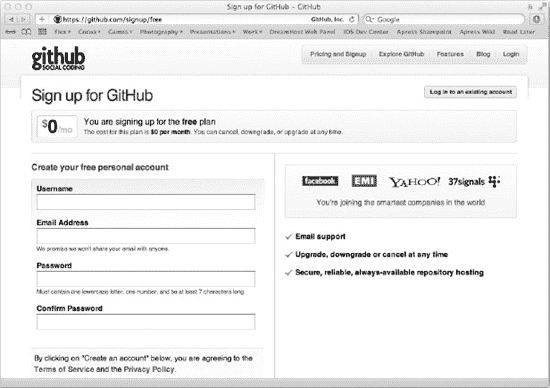

**图 3-1.** *GitHub 注册界面*

GitHub 提供的免费账户允许你创建无限数量（在撰写本文时）的公共 Git 仓库。付费账户则可以邀请其他开发者参与私有仓库的协作。本书中我们将要使用的应用托管在一个公共仓库中。

**注意：** Git 是一个分布式版本控制系统。它已随 Xcode 一同打包，因此无需额外安装。在本书中，我们将利用 Xcode 内置的 Git 支持来跟踪我们的更改。Git 拥有非常强大的命令行界面，因此掌握一些 Git 命令行技巧将提升你作为开发者的生产力。

从 GitHub 检出代码的下一步是设置你的 SSH 公钥。前往 [`https://github.com/account/ssh`](https://github.com/account/ssh)，点击“添加另一个公钥”（见图 3-2）。

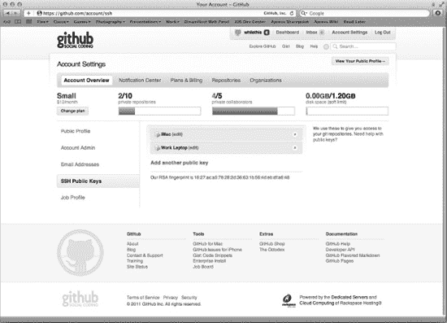

**图 3-2.** *我们将要添加一个公钥，以便通过 SSH 安全地检出代码。*

设置 SSH 公钥非常简单。事实上，GitHub 的友好团队已经发布了如何设置 SSH 密钥的说明：[`http://help.github.com/mac-set-up-git/`](http://help.github.com/mac-set-up-git/)（见图 3-3）。

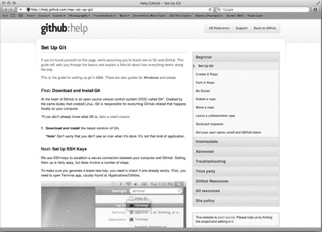

**图 3-3.** *在 OS X 上设置 SSH 密钥*

一旦在你的机器上设置好 Git 并配置好 SSH 密钥，你就可以继续执行分支项目并浏览应用了。

### 连接到 Super Checkout

现在，让我们分支项目，以便将其拉取下来并开始进行修改。主项目位于 [`https://github.com/whilethis/Super-Checkout`](https://github.com/whilethis/Super-Checkout)。当你分支项目后，你将拥有该仓库的个人副本，可以进行检出、推送或拉取操作。要创建分支，请点击主项目网页右上角的 Fork 按钮（见图 3-4）。

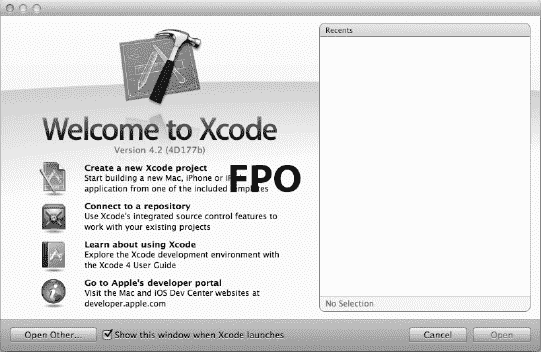

**图 3-4.** *在原始项目界面上，点击 Fork 按钮将创建你个人专属的 Git 仓库副本。*

从分支项目的站点，复制如图 3-5 所示的 URL。


**图 3-5.** *你的项目 URL 中将包含你的 github.com 用户名，而非 whilethis*

现在，启动 Xcode 4，会出现如图 3-6 所示的“欢迎使用 Xcode”界面。上一章我们从头创建了一个新项目。这一次，我们将连接到一个仓库。

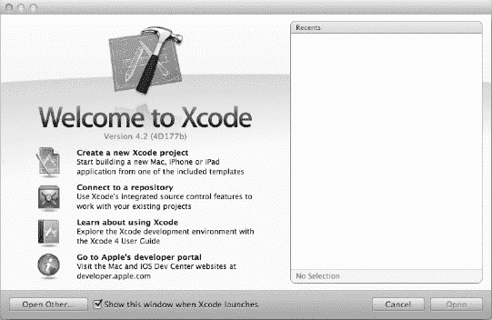

**图 3-6.** *“欢迎使用 Xcode”界面让你可以创建新项目或连接到源代码仓库。*

点击“连接到仓库”按钮。系统会提示你输入仓库的位置，如图 3-7 所示。输入从 GitHub 复制的仓库 URL，Xcode 会自动检查主机是否可达，并允许你继续操作。点击“下一步”，我们将把代码保存到磁盘上。

如果在配置 SSH 密钥之前尝试连接到 GitHub，系统会提示你确认 Git 服务器的身份，并要求输入用户名和密码。我们设置 SSH 密钥的全部原因就是为了防止这些问题发生。但是，如果你已经设置了 SSH 密钥但没有执行 `ssh -T` 命令，则会弹出图 3-8 所示的身份确认界面。

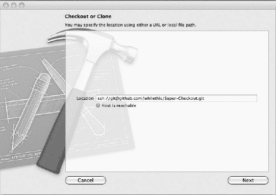

**图 3-7.** *Xcode 4 在从现有仓库检出代码时会自动检测仓库类型。*

**注意：** 直接连接到远程仓库时，请确保选择了正确的仓库类型。Xcode 将尝试使用图 3-8 中选择的类型所对应的协议来克隆或检出仓库。

接下来，告诉 Xcode 项目名称和仓库类型（见图 3-8）。将项目命名为 `Super Checkout`，然后点击“克隆”。

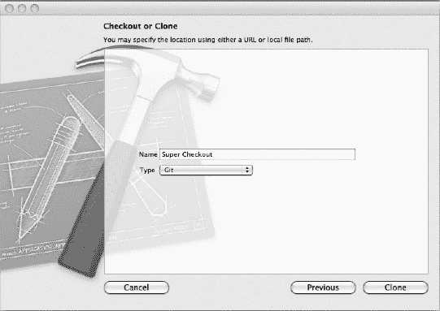

**图 3-8.** *命名项目并选择仓库类型*

下一个界面会询问你将工作副本存放在何处。在磁盘上选择一个位置，然后点击“克隆”。如果克隆操作完成，你将看到“打开项目”和“不打开”选项（见图 3-9）。点击“打开项目”，我们就准备开始工作了。如果你跳过了之前介绍的公钥创建步骤，你会看到一些确认对话框和其他身份验证问题。如果遇到任何问题，请回到公钥创建步骤并重试。

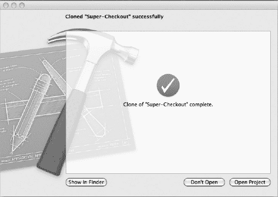

**图 3-9.** *成功克隆我们的 Super Checkout 项目*

### 四处看看

这个应用非常简单。它包含一个带有表格视图控制器的导航控制器，用于展示产品库存；一个产品详情视图控制器，作为产品库存的下钻视图；以及一个购物车控制器，以翻转模式视图控制器的形式呈现。与服务通信的模块是一个简单的引擎，采用了与 Matt Gemmell ([`http://instinctivecode.com/`](http://instinctivecode.com/)) 在其 Twitter 引擎中相同的思路。

API 引擎负责处理与服务器的通信，并调用解析器来解析来自服务器的数据。服务器使用 JSON（JavaScript 对象表示法）进行通信，该项目使用 SBJSON 库 ([`https://github.com/stig/json-framework/`](https://github.com/stig/json-framework/)) 将数据解析为原生的 Cocoa Touch 类。每个视图控制器都拥有该引擎的一个独立实例，并使用委托来确保服务器通信是异步的。

用户界面主要由表格视图以及一些在 Interface Builder 中设计的自定义单元格组成。


### 运行超级结账应用

在模拟器或测试设备上运行该应用。你的屏幕应显示为图 3-10 所示。首先你会注意到图片加载存在延迟；我们将在后续章节解决该问题。点击产品可进入详情界面，点击"加入购物车"按钮可将商品添加至订单。而"购物车"按钮则会翻转视图，显示你的购物车内容。

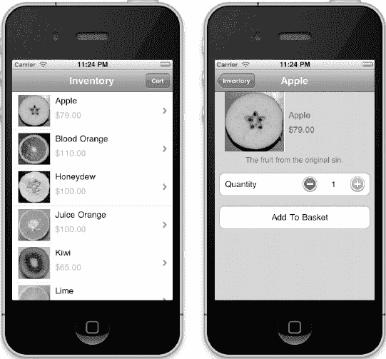

**图 3-10.** *处于 Alpha 版本的超级结账应用*

在浏览和熟悉应用的过程中，你会发现如果快速连续地从商品详情页返回库存列表，应用很可能会闪退。正是这类崩溃及其他问题，表明该应用仍处于 Alpha 阶段，需要进一步优化调整。

### 项目导航（与 Xcode）

在 Xcode 中管理工作流是高效开发和优化任何项目的关键。学会在不离开键盘的情况下导航编辑器，不仅能提升开发速度，还能显得很酷。Xcode 4 新增了一些实用特性来充分利用新界面，同时也改变了 Xcode 3 中的部分常用快捷键。

Xcode 4 中最实用的快捷键之一当属`J`。按下该组合键会弹出"将焦点移至..."编辑器窗口（见图 3-11）。高亮区域即为按下回车键后焦点所至位置。使用方向键移动选择即可轻松切换标签页。将选择移至当前编辑器侧边（带加号的区域）可创建新的助手编辑器。

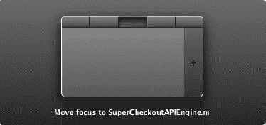

**图 3-11.** *"将焦点移至..."功能让你在标签页间切换并创建助手编辑器*

此前在实现文件与头文件间切换需要按下`command-option-上方向键`。Xcode 4 将其改为`command-control-上方向键`，或在触控板上使用三指向上/向下滑动手势（前提是该手势未被操作系统占用——Lion 系统大量使用三指滑动）。

`Option-点击`符号可弹出显示该符号详细信息的小浮窗。通过浮窗可查看类的头文件，若为框架类则可查阅文档。

`Command-点击`符号可跳转至其声明处。若符号为变量，该变量声明将被高亮；若为类，编辑器将显示声明该符号的头文件。

`Option-command-点击`符号可打开助手编辑器并执行与`command-点击`相同的操作。

按下`command-shift-O`会弹出"快速打开"对话框。在该对话框中输入文件名开头，匹配的文件便会显示在下方。这是快速打开文件的便捷方式。

上述快捷键（及其他快捷键）可在第 12 章快速查阅。

### 本章小结

本章所展示的应用旨在模拟一个 Alpha 质量的应用，以便我们找到大量性能优化空间。最终产品将是一个不闪退、具备合理架构性能的应用。随着本书性能调优章节的推进，我们将对应用的不同方面进行分析、重构和重写。这将是一段精彩的旅程，现在翻页开始吧！

## 第 4 章

## 内存管理与诊断

上一章我们接触了一个功能基本完备但仍需大量优化的应用。我们已经建立了基于 Github 的源代码控制项目，并准备开始修复该应用使其达到 Beta 测试标准。有趣的内容将从本章开始。

目前应用闪退的可能性极高。我们知道 App Store 拒绝应用的主要原因之一就是闪退。本章你将学习如何修复与内存相关的闪退问题，并在内存泄漏影响设备性能之前发现它们。我们将采用系统化的方法解决这些问题，以便你将来在其他项目中也能套用这些步骤。随着逐步深入硬件层面，每一步的技术含量都会递增。幸运的是，我们有强大工具可用，能够解决大量内存相关问题。

本章的应用采用手动引用计数开发。最新工具引入了名为自动引用计数（ARC）的新技术。我们首先会创建 ARC 分支来转换应用，之后讨论 ARC 可能引发的问题，并探究如何使用 Instruments 解决这些问题。不过本书后续内容将默认使用手动引用计数。

本章剩余部分将聚焦于手动引用计数下的内存闪退修复与内存泄漏解决。首先我们会创建本地仓库分支来隔离修改，便于最终与主分支合并。接着讨论预防技术以避免问题发生。本章后半部分将从宏观层面切入，处理超级结账应用中的内存闪退问题。随着深入排查闪退原因，我们也会更深入地探讨如何诊断此类问题。

本章最后将重点讨论内存泄漏。你将学习如何使用 Instruments 检测和定位内存泄漏。完成这部分学习后，你将掌握在应用上架 App Store 前应对内存闪退和堵塞内存泄漏的工具与知识。


### 分支是我们的好帮手

“尽早提交、频繁提交”是开发者应当奉行的准则。借助 Git 或 Mercurial 这类分布式版本控制系统，这一准则得以更好地实现。具体做法是：为某个功能创建一个本地分支，待功能完成后，再将这组变更合并到 `master` 分支。简而言之，这样我们就能拥有一个功能分支，从而可以快速切换回 `master` 分支处理其他任务，而不会丢失任何更改。由于我们使用的是 Git，可以利用它与 Xcode 的一些基本集成，同时将更强大的功能留给命令行（或你选择的 GUI 工具）来处理。那种因一次提交导致构建失败、惹怒团队并被迫买甜甜圈道歉的日子，已经一去不复返了。

**注意：** 我们也可以用 Subversion 为项目创建分支。区别在于，Subversion 的分支也会在服务器上创建。概念上与 Git 相同，但所有内容的存放位置略有不同。

在开始对应用程序进行改动之前，我们先创建一个分支，待本轮应用程序更新迭代完成后，再将其合并。要创建分支，请打开 Xcode 4，转到 `File`  `Source Control`  `Repositories`，这将打开“Organizer”窗口。点击 `Repositories` 标签页。在左侧列表中找到 `Super Checkout`，点击 `Branches`，列表中会显示一个分支。点击窗口底部的 `Add Branch` 按钮。此时会显示一个如 图 4-1 所示的操作表，供您创建分支。在分支名称处输入 `ARC_Transition`，并将起始点设置为“master”，使其基于 `master` 分支。勾选自动切换到该分支的选项，这样分支创建完成后我们就可以立即开始修改。

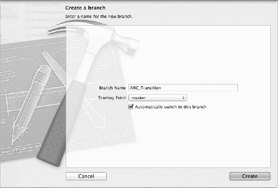

**图 4-1.** *通过 Xcode 4 新的源代码管理 GUI 创建新分支非常容易。*

最后，点击 `Create`。现在，我们已经切换到了新创建的分支，可以开始在这个分支上进行重大改造，而不会影响其他内容（最多只影响当前分支）。我们已准备好开始将 `Super Checkout` 迁移到自动引用计数。每一章都会创建一个或多个分支，这样我们就可以将每一组更新都收集到仓库中。虽然这并不完全符合真实开发场景，但我们会尽可能贴近实际。

### 自动引用计数

自动引用计数（ARC）是苹果在最新的 LLVM 编译器中提供的一项全新特性。当编译器启用了 ARC 标志后，所有内存管理代码都会自动为您生成。这意味着源代码中任何类型的内存管理代码都可以被移除。简单来说，所有对 `release`、`copy`、`retain` 或 `autorelease` 的调用都会被直接删除。

然而，内存管理并非如此简单。必须引入一些新的生命周期限定符，为编译器提供关于内存管理方面所需操作的提示。这些限定符包括：

*   `__strong`：对于强引用（保留），编译器会生成对应的 release 或 autorelease 操作。
*   `__weak`：对于弱引用，当所指对象被释放时，指针会自动被设置为 `nil`。
*   `__unsafe_unretained`：这只是一个普通的引用。这个限定符很危险，因为仍然可能出现悬垂指针。
*   `__autoreleasing`：该限定符告诉编译器，该参数将通过引用（`id *`）传递，并在返回时自动释放。

在声明属性时，有三个新的属性特性；其中两个可用于 iOS 4 及以上版本，一个仅可用于 iOS 5：

*   `strong`：这是一个强引用；其作用类似于 `__strong` 限定符，可用于 iOS 4 及以上版本。
*   `weak`：一个自动置 nil 的引用，类似于 `__weak` 限定符，仅可用于 iOS 5。
*   `unsafe_unretained`：这只是一个普通的引用，类似于 `__unsafe_unretained` 限定符，可用于 iOS 4 及以上版本。

这份列表并不详尽，在启用 ARC 进行开发时，还有许多其他新事项需要注意。其中之一就是自动释放池。简而言之，使用 ARC 后，不再有 `NSAutoreleasePool` 对象。取而代之的是新的 `@autorelease` 块。效果如 代码清单 4-1 所示。

**代码清单 4-1.** *全新且改进的自动释放池*

```
@autoreleasepool {
        // 长时间循环，创建并销毁大量对象
}
```

使用 ARC 编码时，另一个需要牢记的重点是：永远不要调用 `retain`、`release` 或 `autorelease`。永远不要。如果你调用了，编译器甚至会报错。ARC 还强制执行其他一些规则，苹果开发者文档中的“Programming with ARC”一文是很好的入门资料。当我们将项目转换为 ARC 时，在转换过程中可能会遇到其中一些规则。如果遇到了，我们会进行讨论。


### 转换为 ARC

现在我们要将 Super Checkout 转换为 ARC。这次转换需要对代码库进行一些重大修改，这也是我们创建分支的原因。那么，闲话少说，让我们开始转换吧。首先打开项目，进入 Edit → Refactor → Convert to Objective-C ARC。执行此操作后，会显示一个表单（参见图 4-2）。勾选两个复选框以转换单元测试和应用目标。如果任何目标当前使用的是旧版编译器，编译器版本将更新为 LLVM 3.0。

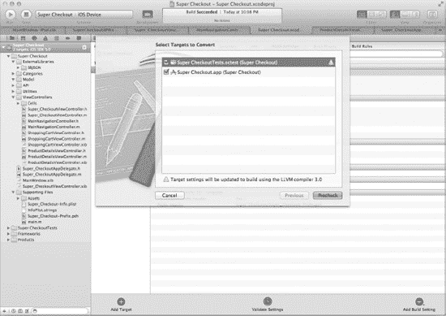

**图 4-2.** *执行预检查前显示的目标选择表单。*

点击 Precheck 按钮将执行编译，并告知您项目是否可以转换。如图 4-3 所示，Super Checkout 尚未完全准备好进行 ARC 转换。我们需要先修复一些错误。

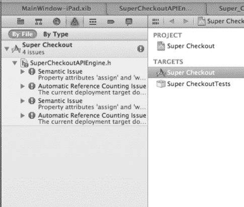

**图 4-3.** *预检查运行返回的错误。*

点击列表中的第一项，我们会跳转到 `SuperCheckoutAPIEngine.h`，您会发现该文件已被修改，属性声明中添加了 `__weak`。要修复此问题，请移除 `__weak`，并将 assign 替换为 `unsafe_unretained`。我们这样做是因为目标平台是 iOS 4 及更高版本。如果目标平台是 iOS 5，我们会使用 `weak` 属性。现在这行代码应该如下所示：

```
@property (nonatomic, unsafe_unretained) NSObject<SuperCheckoutAPIEngineDelegate> *delegate;
```

在此实例中，之前还声明了一个 `ivar`。由于 `ivar` 已声明且属性已设置，我们有两个选择。第一个是将委托 `ivar` 标记为 `__unsafe_unretained`。第二个是直接删除该行，让编译器合成 `ivar`。既然我们采用现代方式，就完全删除该行。这样类的 `ivar` 块将如下所示：

```
@interface SuperCheckoutAPIEngine : NSObject<SCJSONParserDelegate> {
    NSMutableDictionary *connections;   // MGTwitterHTTPURLConnection 对象
    NSString *APIDomain;
}
```

还有一些剩余的 `ivar`。由于 ARC 的默认行为是强引用，我们无需更新它们。现在，再次执行转换。这次，您遇到的错误是一个 `NSString` 被强制转换为 `CFStringRef`。我们知道可以进行此操作，因为 `NSString` 在 CF 对象和 Objective-C 对象之间是免费桥接的。如果您注意到，Xcode 会建议使用 Fix-It 功能在 `CFStringRef` 强制转换前放置 `__bridge`。继续操作，让 Xcode 完成此操作。

再次执行转换。这次会带来一组新的错误。这些错误存在于一些外部库代码中。由于我们在分支中，让我们继续修改代码。这些问题都不特别棘手。要么让 Fix-It 添加适当的代码，要么删除对内存管理代码的调用。完成这些编辑后，再次运行转换工具，如果所有问题都已解决，您将看到图 4-4 的界面。这个表单告诉您转换将成功。点击 Next 继续。

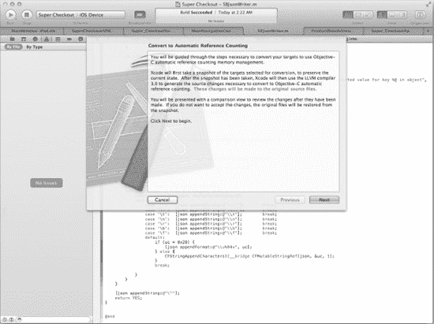

**图 4-4.** *预检查已通过，现在，我们准备最终转换为 ARC。*

点击 Next 后，Xcode 会建议创建快照。快照非常适合快速保存当前配置的快照，以防转换过程中出现问题。点击 Enable，Xcode 将在创建新快照后继续转换。

转换完成后，Xcode 会显示更改内容，并允许您在某些更改看起来过于极端时撤销（参见图 4-5）。点击 Continue，然后使用有意义的提交信息提交您的代码。

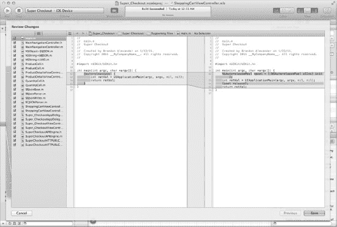

**图 4-5.** *转换为 ARC 已完成，Xcode 向您展示其成果。*

### 识别保留循环

尽管 ARC 非常出色，我们仍然需要关注应用程序内部的情况。您可能会说，“都 2011 年了，我还需要担心内存泄漏吗？”答案是肯定的。无论我们的工具变得多么复杂，它们也无法捕获所有问题。我们在使用 ARC 时最可能遇到的错误是保留循环。

保留循环被定义为包含封闭循环保留引用的对象图。图 4-6 显示了一个典型的保留循环。如果我们释放对象 A 和 B，ARC 会认为其余对象仍在使用中，并且不会插入适当的释放语句。


**图 4-6.** *在这个常见的保留循环中，数字显示了在释放 A 和 B 之前的保留计数。*

那么我们如何修复保留循环呢？这取决于具体情况。如果目标平台是 iOS 5 及以上版本，将循环中的一个引用设为弱引用以打破循环。图 4-7 显示了将适当引用设为弱引用后的对象图。

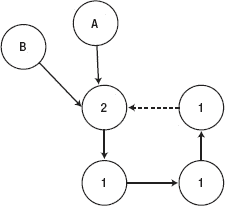

**图 4-7.** *打破循环需要设置正确的引用。*

通过将对象图中的父节点引用设为弱引用，当 A 和 B 被释放时，该图会被回收。

我们如何检测这些循环？幸运的是，Instruments 有一个新功能可以检测保留循环，并以可视化方式向您展示循环的样子。当我们介绍使用 Instruments 检测泄漏时，我们将通过一个非常简单的示例来看看 Instruments 如何向您展示这些循环。

### 回到手动引用计数

我们将回到 `release`、`retain` 和 `autorelease` 的世界。ARC 很好，但通过手动引用计数可以学到很多东西。由于我们为 ARC 转换创建了一个分支，我们可以做同样的事情，将我们在本章中修复的内存相关问题保存下来。将此新分支命名为 `Memory_Fixes`，基于主分支创建，并记得在创建后切换到新分支！

### 建立健康的编码实践

本杰明·富兰克林曾说过：“一分预防胜于十分治疗。”因此，在我们深入修改代码之前，让我们花点时间讨论一些关于正确内存管理的最佳实践，以及您在开发应用程序时可以用来预防内存相关错误和崩溃的方法。这些实践涵盖了语言和运行时的工作原理、良好的编码实践以及通用准则。

关于内存管理，尤其是在 iOS 开发中，首先要了解的是保留计数。由于 iOS 平台没有垃圾回收机制，我们必须适当地手动管理内存。理解何时保留内存以及何时释放内存的概念，对于成为 iOS 设备上的良好公民是绝对必要的。我们不会花太多时间讨论保留计数的细微差别等内容，但有必要提一些要点。


#### 保留还是释放，这是个问题

在 Objective-C 开发应用中，一个常见错误是没有释放已保留的内存。大多数情况下，未能释放内存是一个错误，因此养成一些好习惯总是有益的。未释放的内存会导致泄漏，简单明了。判断何时释放内存的一个好用经验法则是缩略词 NARC：

- `New`
- `Alloc`
- `Retain`
- `Copy`

每当这些消息之一被发送给对象时，你就拥有了该对象，因此使用完后必须释放它。然而，这一规则总有例外。当一个方法需要返回对象时，必须向该对象发送 `autorelease` 消息。不过，使用 `autorelease` 时也有一些性能方面的考量。由于 `autorelease` 将对象放入当前作用域块的自动释放池中，因此将成千上万个对象送入这样一个池子将是个糟糕的主意，尤其是在较旧的 iOS 设备上。我们所说的一个典型例子就是创建一个快速循环来生成一百万个字符串（代码清单 4–2）。

**代码清单 4–2.** *一百万个自动释放的字符串！*

```
for(int i = 0; i < 1000000; i++) {
     string = [[[NSString alloc] initWithFormat:@"String %i", i] autorelease];
     //处理字符串并创建其他自动释放的对象….
}
```

上面的代码创建了一百万个字符串并自动释放它们。针对此代码运行 Allocations 工具，你会得到如 图 4–7 所示的图表。

解决此问题的合适方法见 代码清单 4–3。

**代码清单 4–3.** *一百万个字符串各自拥有独立的自动释放池*

```
for(int i = 0; i < 1000000; i++) {
     NSAutoreleasePool *pool = [[NSAutoreleasePool alloc] init];
     string = [[[NSString alloc] initWithFormat:@"String %i", i] autorelease];
     //处理字符串并创建其他自动释放的对象….
     [pool release];
}
```

对比 图 4–8 和 图 4–9 中的图表。这些图表没有显示的是比例尺。由于我们创建了一百万个字符串，每个字符串在运行循环的下一次迭代时被分配并自动释放。如 图 4–8 所示，通过创建自动释放池，系统会更频繁地回收内存，从而更好地利用可用资源。


**图 4–8.** *一百万个字符串释放到同一个池中的内存分配图*


**图 4–9.** *一百万个字符串在各自池中自动释放的内存分配图*

由于设备的内存有限，使用自动释放池对于防止应用触发内存警告、避免操作系统终止应用以及保持应用响应迅速是绝对必要的。在紧密循环中手动释放对象代价高昂。

在管理内存时保持记忆和自律是减少内存泄漏的关键。审视你的方法，决定哪种内存管理技术最适合你。如果你正在创建离散对象并对它们进行操作，使用完毕后立即释放它们。如果你正在创建大量对象，那么创建一个自动释放池并在使用完毕后排空它是最佳选择。执行后者操作的最佳时机是在进行大量字符串操作时，因为大多数字符串操作都会返回自动释放的字符串实例。

总体而言，记住何时释放或自动释放对象并不太难。只要在初次编写代码时就完成内存管理，内存泄漏就能被控制在最低限度，这样你就能腾出手来追踪其他类型的问题。

#### 连接属性与多态点语法

接下来在我们关于内存管理的讨论中，需要谈谈 Objective-C 2.0 的属性。这个非常流行的特性随新的 Objective-C 运行时而来，并为 Objective-C 语言带来了一个新概念——点语法。

让我们快速了解一下属性为我们提供了什么，以及它们如何融入内存管理的范畴。为了便于讨论，我们来谈谈在代码清单 4–4 和 4–5 中定义的一个对象。

**代码清单 4–4.** *Foo 的头文件*

```
@interface Foo : NSObject {
     NSDictionary *bar;
}

@property (retain, nonatomic) NSDictionary *bar;

@end
```

**代码清单 4–5.** *Foo 的实现文件*

```
#import "Foo.h"
@implementation Foo
@synthesize bar;

- (id) init {
    self = [super init];

    if(self) {
        self.bar = [NSDictionary dictionary];
    }

    return self;
}

-(void) setBar:(NSDictionary *)newBar {
     NSDictionary *oldDictionary = self.bar;
     bar = [newBar retain];
     [oldDictionary release];

     NSNotification *note = [NSNotification notificationWithName:@"barUpdated" object:self];
     [[NSNotificationCenter defaultCenter] postNotification:note];
}

-(void) dealloc {
     self.bar = nil;
     [super dealloc];
}

@end
```

`Foo` 对象有一个属性，即名为 `bar` 的 `NSDictionary`。我们合成了访问器并提供了自己的设置器。该设置器的设计意图是在属性发生变化时发送一条通知。在 `init` 方法中，我们使用属性将 `bar` 初始化为 nil。还需注意，在 `dealloc` 方法中，该属性被设置为 nil。

现在，让我们看看此代码执行时实际发生了什么。当代码被编译时，使用属性的代码基本上被转换成方法调用。发生以下转换：

`{symbol}.foo`

被转换为

`[{sybmol} foo]`

类似地，下面这行代码

`{symbol}.foo = {some new object}`

被转换为

`[{symbol} setFoo:{some new object}]`

很容易忘记这种转换的发生。因此，当调用 `init` 时，新实例实际上是在调用 `[self setFoo:[NSDictionary dictionary]]`。这意味着当对象被创建时会发送一条通知。`dealloc` 方法做了同样的事情，因此当对象被释放时也会发送一条通知。后一种情况可能比前一种引起更多问题，因为通知携带了一个指向刚释放内存的指针。

解决这些问题的一个简单方法是在 `init` 和 `dealloc` 方法中直接使用实例变量。这降低了在 `Foo` 实例上更新 `bar` 时引入 `EXEC_BAD_ACCESS` 错误的可能性。这也使得 `Foo` 的任何子类在重写 `setBar` 方法时可以自由地做它们想做的事情。

关于内存管理和属性，一个非常微妙的话题是理解底层发生了什么。在上面的 `init` 方法中，编译后的代码是 `[self setBar:[NSDictionary dictionary]]`，因此该方法接收到的是一个自动释放的对象，然后由 `setBar` 方法将其保留。如果传入的是 `[[NSDictionary alloc] init]`，那么当 `bar` 被赋值为一个新对象或 `Foo` 实例被释放时，该字典就会泄漏。这大概能节省一个小时调试某个泄漏问题的时间。

这就引出了一个关于属性使用的有趣话题，主要是点语法的使用。虽然这未必是内存管理的话题，但此话题关于点语法的使用和良好的编码实践。属性是一个很棒的机制；它们使得访问器和设置器的生成快速且容易，因为大多数都是非常繁琐且耗时的基本样板代码。能够控制生成的代码类型（例如，保留、赋值或复制，原子性或非原子性，可读写或只读）也是一个很大的帮助。


当你在 Objective-C 的属性中混用 C 语言的 `struct` 时，问题就出现了。点语法在两者之间会很快变得令人困惑。一个使源代码意图清晰的好建议是：在你的 Objective-C 代码中不要使用点语法。这为多态的点赋予单一含义。请看以下示例：

```
UIView *newView = [[UIView alloc] init];
CGRect viewRect;

viewRect.origin.x = 0;
viewRect.origin.y = 0;
viewRect.size.height = 100;
viewRect.size.width = 100;

newView.frame = viewRect;

UIColor *color = [[UIColor alloc] initWithPatternImage:{some image}];
newView.backgroundColor = color;
[color release];

[self.view addSubview:newView];
[newView release];
```

我们正在创建一个新视图，设置其 `frame`，并在将其添加到当前视图之前设置其背景颜色。这相当直接明了，但刚接触该平台的新手不会完全理解代码的意图。看看设置背景颜色的代码。在将其设置到新视图上后，很容易忘记释放正在设置的颜色，因为意图不够清晰。借鉴前面的建议，我们可以将代码重写为如下形式：

```
UIView *newView = [[UIView alloc] init];
CGRect viewRect;

viewRect.origin.x = 0;
viewRect.origin.y = 0;
viewRect.size.height = 100;
viewRect.size.width = 100;

[newView setFrame:viewRect];

UIColor *color = [[UIColor alloc] initWithPatternImage:image];
[newView setBackgroundColor:color];
[color release];

[self.view addSubview:newView];
[newView release];
```

完整的意图更容易理解了。创建并设置在所创建视图上的背景颜色，显然由该视图拥有，并在设置后被释放。操作视图 `frame` 的代码清楚地表明是在操作一个 C 语言的 `struct`，而其余代码则是 Objective-C。

**注意**：讨论代码结构总是一个敏感话题，因此关于不使用点语法的想法仅仅是一个建议。这些并非硬性规定；可以把它们视为关于花括号位置以及使用空格而非制表符的规则。虽然就使用哪种方式的优点在喝咖啡时争论一番可能很有趣，但我们的目标是开发应用程序。用户并不关心源代码长什么样。

### 执行静态分析

在应用程序运行之前，有一些方法可以发现常见的编码错误。新的 LLVM 编译器将这一能力带给了我们。经常对源码运行静态分析器总是一个好主意。它可以在应用程序实际运行之前就指出代码中的问题。

Xcode 4 集成了静态分析器，允许你在问题出现之前分析代码并发现它们。要运行静态分析器，请转到 ProductAnalyze。这会构建应用程序，并将构建产物通过静态分析器运行，然后将结果返回给你。图 4-10 显示了在导航器区域的“问题”标签中静态分析运行的结果。

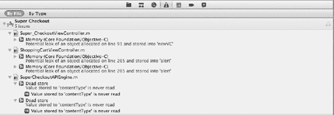

**图 4-10.** *静态分析展示了不同类型的问题，从死代码到内存泄漏。*

在开发过程中经常运行静态分析器是一个好主意，可以防止代码中最常见的错误。这些结果为你提供了足够的信息来了解问题所在，以及如何着手修复它们。其中一些项目可能非常复杂。例如，在方法顶部声明的一个对象，经过一系列复杂的循环和条件判断后，可能会使该对象处于泄漏状态。另一个例子是过度释放一个对象。一个对象被实例化，然后被指示 `autorelease`，最后在方法内部被释放，这会触发静态分析错误。

让我们来看 图 4-9 中的两个案例。

图 4-9 列表中的第一项位于 `Super_CheckoutViewController.m` 的第 91 行。让我们看看有问题的那个方法：

```
- (void)tableView:(UITableView *)tableView didSelectRowAtIndexPath:(NSIndexPath *)indexPath {
    ProductDetailsViewController *newVC = [[ProductDetailsViewController alloc]
         initWithNibName:@"ProductDetailsViewController" bundle:nil];

    [newVC setSelectedProduct:[inventory objectAtIndex:[indexPath row]]];

    [self.navigationController pushViewController:newVC animated:YES];
}
```

静态分析器告诉我们，该方法退出时一个对象具有“+1 的保留计数”。你能找出有问题的代码吗？基于 NARC 系统，我们有一个已分配的对象，现在缺少一个对应的释放。添加 `[newVC release];` 作为最后一行将解决这个问题。

下一个例子是使用静态分析器来查找死代码。在 `SuperCheckoutAPIEngine.m` 中，我们可以看到分析器发现了一个“Dead store”问题。点击该问题，编辑器将向你展示代码中的错误位置。这是有问题的那个方法：

```
- (NSMutableURLRequest *)_baseRequestWithMethod:(NSString *)method
                                           path:(NSString *)path
                                    requestType:(SuperCheckoutRequestType)requestType
                                queryParameters:(NSDictionary *)params
{
    NSString *contentType = [params objectForKey:@"Content-Type"];
    if(contentType){
        params = [params MGTE_dictionaryByRemovingObjectForKey:@"Content-Type"];
    }else{
        contentType = @"application/x-www-form-urlencoded";
    }

    // Construct appropriate URL string.
    NSString *fullPath = [path
 stringByAddingPercentEscapesUsingEncoding:NSNonLossyASCIIStringEncoding];
    if (params && ![method isEqualToString:HTTP_POST_METHOD]) {
        fullPath = [self _queryStringWithBase:fullPath parameters:params prefixed:YES];
    }

    NSString *connectionType = @"http";
```

静态分析器将焦点放在了 `contentType` 对象未被读取上。似乎分析器发现该方法后面某处的代码被移除了，但它的部分设置却没有被移除。移除包含 `contentType` 对象的代码块将满足静态分析器的要求。

你为什么不自己检查一下静态分析器的其余结果，并修复它发现的问题呢？


### 排版后内容

以消除编辑器中所有蓝色（静态分析器警告的颜色）为最终目标。总会有一些情况是静态分析器显示误报，但这种情况相当罕见。静态分析器可能显示误报的一个例子是常见的`init`方法形式：

```
if(self = [super init]) {
    //Do something
}

return self;
```

静态分析器会注意到你在条件语句内进行了赋值。它并不真正喜欢这样，然而这段代码是完全有效的。我想花点时间提一个我们之前讨论过的话题。虽然这段代码是有效的，但它清晰吗？当然，你可以将赋值语句用括号括起来以满足分析器，但这并不一定能让代码更易读。我采用了以下`init`风格：

```
self = [super init];

if(self) {
    //Do stuff
}

return self;
```

这不仅通过了静态分析，还清晰地展示了正在发生的事情。通篇修改整个代码库以采用这种新风格将花费很长时间，因此不推荐这样做。所以这里的教训是，一开始就要经常问自己：“这段代码清晰吗？”清晰性能够带来更好的代码和更少的问题，尤其是在维护和为现有应用添加新功能时。

通过这些主动预防内存泄漏的技术，大多数与内存泄漏相关的常见问题都将被避免。代码的清晰性是确保代码库保持整洁的关键，尤其是在团队环境中。通过偷工减料积累技术债务在短期内可能卓有成效，但在维护周期中，它可能是一个巨大的障碍。

归根结底，软件必须交付，所以学习如何在技术债务与完全正确的做事方式之间取得平衡是一生的课程。希望这些技术以及后续的技术能减少你在应用程序中调试和追踪这些问题所花费的时间。

### 僵尸——不，不是那种僵尸

由于我们继承了一个已有的代码库，我们必须手动查找问题，以便移除所有内存泄漏并找到与内存管理直接相关的崩溃问题。为此，我们将启动`Instruments`并启用`NSZombie`检测。

僵尸？不，我们不是在寻找“我们要吃掉你的大脑”的僵尸。那是完全另一本书的内容。我们要找的那种僵尸是指向垃圾内存的指针。当一个对象被最终释放且其引用计数为零时，该对象被解除分配，内存会被系统迅速回收。但指向该内存块的指针仍然有效。

我们如何检测僵尸？首先，我们需要创建一个名为`NSZombieEnabled`的环境变量并将其设置为`YES`。我们可以通过打开方案编辑器来做到这一点。前往`Product``Edit Scheme`或按`+ <`。打开方案编辑器后，在左侧选择`Run Super Checkout`选项，然后选择`Arguments`标签页。添加一个名为`NSZombieEnabled`、值为`YES`的环境变量。你的方案应该看起来像图 4-11 所示的那样。

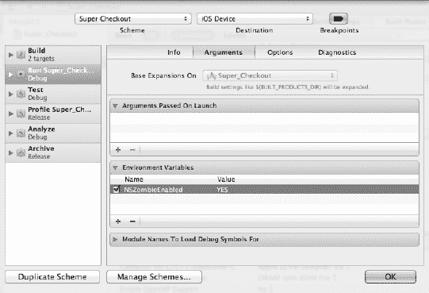

**图 4-11.** *使用方案编辑器启用 NSZombie 检测*

我们将使用`Profile`操作来运行我们的应用程序，因此点击`Profile Super Checkout`。确保在`Arguments`标签页下勾选了“使用运行操作的选项”复选框。现在，你已经准备好对应用程序进行性能分析并查找一些僵尸了。

确保在方案选择器中将模拟器选为目标目标，点击`OK`，然后前往`Product``Profile`来启动该过程。`Instruments`将启动并提供一个选择众多模板之一的选项。我们在寻找僵尸，所以选择`Zombies`选项，然后点击`Profile`（参见图 4-12）。

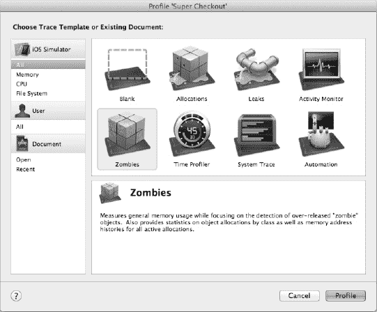

**图 4-12.** *iOS 模拟器启动前的 Instruments 模板屏幕*

iOS 模拟器将启动该应用程序，你会看到`Instruments`在后台运行，`Allocations`工具正在监视内存分配。该工具已经配置好用于检测`NSZombie`对象，因此我们现在需要做的就是与应用程序交互。让我们继续运行一个测试用例，看看是否能找到一个`NSZombie`。

我们要运行的测试用例是向购物车添加一种水果并查看购物车。继续选择一种水果，配置数量，然后点击`Add to Basket`。物品被添加到购物车后，库存列表会重新出现。点击右上角的`Cart`按钮，你会注意到应用程序崩溃了。如图 4-13 所示，`Instruments`检测到一条消息被传递给了`NSZombie`实例。

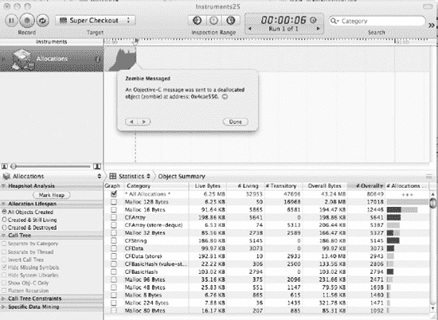

**图 4-13.** *Instruments 检测到一条消息被传递给了 NSZombie 实例。*

我们知道我们遇到了一个相当严重的错误，因为应用程序崩溃了。我们使用`Instruments`检测到了它，现在，我们需要修复它。点击弹出的消息旁边的箭头，会出现有关违规对象引用计数变化的详细信息。在这些细节中，我们可以看到发生了以下事件（参见图 4-14）：

1. `malloc`方法在该对象上运行。
2. 然后该对象被添加到自动释放池中。
3. 该对象被保留。
4. 该对象被释放，两次。

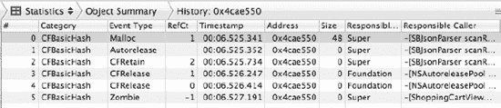

**图 4-14.** *违规对象的引用计数历史*


图 4–14 同时还展示了这些事件的发生时间、对应的库以及调用方。我们主要关注的是调用方。查看 Instruments 提供的信息，我们可以看到对 `SBJsonParser` 类的三次调用、两次 `NSAutoreleasePool` 的排空操作，以及在 `ShoppingCartViewController` 中发生的僵尸对象调用。查看僵尸对象调用的调用栈：打开 Instruments 窗口的右侧面板（使用窗口顶部工具栏“查看”上方的右侧按钮），然后在事件列表中选择 Zombie 调用。

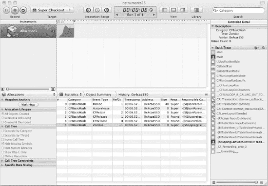

**图 4–15.** *导致消息被发送给僵尸引用的调用栈。*

图 4–15 展示了如何检查导致消息被发送给僵尸对象并最终导致应用崩溃的调用栈。我们看到的这个调用栈中包含了一些 Objective-C 运行时和框架的调用。我们对这些调用不太感兴趣，因此双击调用栈中的 `ShoppingCartViewController` 调用。这会带我们定位到有问题的代码。有问题的代码行就在这里：

```
NSDictionary *cartItem = [[shoppingCart objectForKey:@"items"] objectAtIndex:[indexPath
row]];
```

这段代码看起来很简单。我们从一个字典中获取一个数组，然后从该数组中取出一项。那么这里的僵尸对象是什么呢？我们唯一操作的对象就是 `shoppingCart`，所以问题肯定出在它身上。但为什么它会成为僵尸引用呢？线索在于这个对象的历史。该对象始于 `SBJsonParser`，最终辗转到了 `ShoppingCartViewController`。为什么视图控制器没有对它进行持有（retain）呢？问得好！让我们看看其中一个委托回调方法，确切地说是 `cartContentsReceived:forRequest:`。方法如下：

```
-(void) cartContentsReceived:(NSDictionary *)cart forRequest:(NSString
*)connectionIdentifier {
    shoppingCart = cart;

    NSNotification *note = [NSNotification notificationWithName:@"CartUpdated"
object:[NSNumber
numberWithInt:[[shoppingCart objectForKey:@"items"] count]]];

    [[NSNotificationCenter defaultCenter] postNotification:note];

    [self.tableView reloadData];

    if([[shoppingCart objectForKey:@"items"] count] == 0) {
        [self setEditing:NO];
    }
}
```

你能发现问题所在吗？没错，问题就出在方法的第一行。要修复它，我们只需将该行代码改为：

```
shoppingCart = [cart retain];
```

现在，让我们运行应用并重复之前的操作步骤。当你进入购物车界面时，应用还会崩溃吗？不崩溃了？很好。恭喜！我们已经修复了应用中第一个明显的 bug。

#### 其他线程中的僵尸对象（大致如此）

到目前为止，我们已经修复了一系列问题，从静态分析器发现的简单内存泄漏到查找 `NSZombie` 实例。然而这个应用中还有更多问题。假设在这个例子中，质量保证（QA）部门反馈了一个崩溃 bug，描述如下：“当用户查看详情屏幕并快速导航回产品屏幕时，应用崩溃。该问题在通过 3G 网络连接的 iPhone 上（比) 在 Wi-Fi 连接上更常见。”

QA 工程师随 bug 报告发送了一个崩溃日志（实际的崩溃日志更长，但我们只关注主线程，因为崩溃就发生在这里）：

```
Thread 0 name:  Dispatch queue: com.apple.main-thread
Thread 0 Crashed:
0   libobjc.A.dylib               0x00002c9a objc_msgSend + 18
1   Foundation                    0x000122ee -[NSURLConnection(NSURLConnectionReallyInternal)
 sendDidFinishLoading] + 62
2   Foundation                    0x00012270 _NSURLConnectionDidFinishLoading + 72
3   CFNetwork                     0x0000f40a URLConnectionClient::_clientDidFinishLoading(URLConnectionClient::ClientConnectionEventQueu
e*) + 130
4   CFNetwork                     0x00003f42
 URLConnectionClient::ClientConnectionEventQueue::processAllEventsAndConsumePayload(XCo
nnectionEventInfo<XClientEvent, XClientEventParams>*, long) + 94
5   CFNetwork                     0x00003e34 URLConnectionClient::processEvents() + 64
6   CFNetwork                     0x00003de6
 URLConnection::multiplexerClientPerform(RunLoopMultiplexer*) + 30
7   CFNetwork                     0x00003d58 MultiplexerSource::perform() + 120
8   CFNetwork                     0x00003cd6 MultiplexerSource::_perform(void*) + 2
9   CoreFoundation                0x00075a72
 __CFRUNLOOP_IS_CALLING_OUT_TO_A_SOURCE0_PERFORM_FUNCTION__ + 6
10  CoreFoundation                0x00077758 __CFRunLoopDoSources0 + 376
11  CoreFoundation                0x000784e4 __CFRunLoopRun + 224
12  CoreFoundation                0x00008ebc CFRunLoopRunSpecific + 224
13  CoreFoundation                0x00008dc4 CFRunLoopRunInMode + 52
14  GraphicsServices              0x00004418 GSEventRunModal + 108
15  GraphicsServices              0x000044c4 GSEventRun + 56
16  UIKit                         0x0002ed62 -[UIApplication _run] + 398
17  UIKit                         0x0002c800 UIApplicationMain + 664
18  Super Checkout                0x00002648 0x1000 + 5704
19  Super Checkout                0x00002608 0x1000 + 5640
```

没什么帮助，对吧？查看崩溃日志，我们可以确定是 `objc_msgSend` 调用失败了。嗯，消息发送失败，这是一个相当重要的线索；最可能的原因似乎是某条消息被发送给了僵尸对象。所以我们现在要做的就是使用 Zombie 仪器启动应用。但这里有个问题。根据 bug 报告，这个问题是间歇性的，并且在 3G 连接上更常见。有一种方法可以减慢你的网络连接速度，但我们将在后面章节中介绍。目前，我们将绕过使用 Instruments，而是连接一台设备，让 Xcode 在出问题的代码处中断。

**注意：** 如果你没有可以连接到 Mac 的设备，你可以按照第 6 章中的步骤来减慢你的连接速度。由于你是在模拟器中运行，你可以使用 Zombies 仪器运行应用，并得到与我们修复购物车屏幕 bug 时相同的结果。


设备是否已连接？请确保设备未连接 Wi-Fi（如果
*是 iPhone）。现在，通过 **方案选择器（Scheme selector）** 选择设备部署目标，在设备上运行应用程序（参见图 4-16）。然后，通过转到 `Product` > `Run` 在设备上运行应用程序。当应用程序开始在单元格中加载图像时，开始快速选择一个产品并点击返回。在某个时刻，应用程序将会崩溃，Xcode 将接管控制权，您会看到 GDB 提示符，并且应用程序停止在图 4-1 所示的位置。

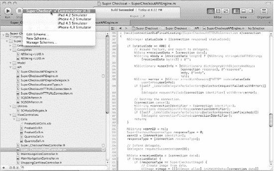

**图 4-16.** *Xcode 会显示您的设备在 iTunes 中的名称。在此例中，设备名为 Communicator。*

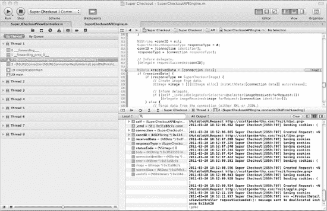

**图 4-17.** *Super Checkout 已停止运行，调试器已接管控制权，并向您显示有问题的代码。*

查看控制台，您会在 GDB 提示符前看到以下文本：

```
2011-03-20 18:54:01.276 Super Checkout[2859:707] *** -[ProductDetailsViewController
 respondsToSelector:]: message sent to deallocated instance 0x13a620
```

我们的猜测是正确的！我们正在向一个已释放的 `ProductDetailsViewController` 类型的对象发送消息。崩溃的代码位于 `SuperCheckoutAPIEngine.m` 中，我们可以看到断点停在了对该类委托（delegate）的调用之后。为了验证委托是否是罪魁祸首，请在控制台旁边的变量视图中展开 `self` 指针，如图 4-18 所示。如果看不到变量视图，请点击“清除”按钮上方、控制台右侧的按钮，该按钮可同时显示变量视图和控制台。

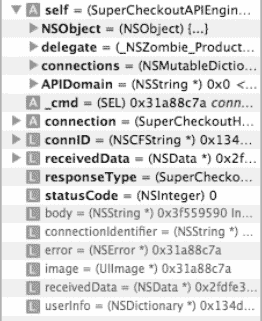

**图 4-18.** *Xcode 中的变量列表，显示委托是一个 NSZombie*

通过展开 `self` 变量，我们可以看到委托是 `NSZombie` 的一个实例。现在，让我们看看幕后发生了什么。通过快速选择一个产品并返回产品列表，我们每次都会分配一个新的视图控制器。由于产品详情屏幕会加载图像，它使用 API 引擎来获取图像。打开 `ProductDetailsViewController.m` 文件查看 `dealloc` 方法：

```
- (void)dealloc {
    [apiEngine release];
    [selectedProduct release];
    [productDetailsHeader release];
    [productImage release];
    [productNameLabel release];
    [productPriceLabel release];
    [addToBasketCell release];
    [quantityCell release];
    [super dealloc];
}
```

缺少了一些东西。在释放 `apiEngine` 之前，我们没有清除其委托。继续操作，在释放 `apiEngine` 之前添加 `[apiEngine setDelegate:nil];`。提交该更改后，我们又修复了一个崩溃错误。

这个 Bug 更难发现和重现，因为它位于一些异步网络代码中——很容易看出这类问题变得多么复杂。这是针对内存相关 Bug 的第二道防线。

#### 泄露（Leaks）

现在，假设 QA 提交了一份报告，指出应用程序使用时间越长，运行越缓慢。在上下滚动几分钟后，应用程序最终崩溃。这个问题听起来像内存泄漏，所以让我们看看能发现什么。

请注意，这个问题是在一次部署后出现的，那次部署更新了一些其他代码，并对 `Super_CheckoutViewController.m` 中的 `imageReceived:forRequest:` 方法做出了以下更改：

```
-(void) imageReceived:(UIImage *)image forRequest:(NSString *)connectionIdentifier {
    ProductCell *cell = (ProductCell *)[self.tableView
cellForRowAtIndexPath:[imageIndexPaths
 objectForKey:connectionIdentifier]];

    CGFloat target = 64;

    CGImageRef oldImage = [image CGImage];
    CGFloat imageWidth = (CGFloat)CGImageGetWidth(oldImage);
    CGFloat imageHeight = (CGFloat)CGImageGetHeight(oldImage);

    CGFloat widthFactor = target / imageWidth;
    CGFloat heightFactor = target / imageHeight;
    CGFloat factor = 1.0;

    if (widthFactor > 1.0 && heightFactor > 1.0) {
        factor = 1.0;
    } else {
        if (widthFactor >= heightFactor) {
            factor = widthFactor;
        } else {
            factor = heightFactor;
        }
    }

    CGColorSpaceRef colorSpace = CGColorSpaceCreateDeviceRGB();
    CGContextRef imageContext = CGBitmapContextCreate(NULL, imageWidth, imageHeight, 8, 4
 * imageWidth, colorSpace, kCGImageAlphaPremultipliedFirst);
    CGContextDrawImage(imageContext, CGRectMake(0, 0, imageWidth, imageHeight), oldImage);
    CGContextScaleCTM(imageContext, imageWidth * factor, imageHeight * factor);
    CGImageRef newImage = CGBitmapContextCreateImage(imageContext);

    UIImage *resizedImage = [[UIImage alloc] initWithCGImage:newImage];

    [cell.productImage setImage:resizedImage];

    [imageIndexPaths removeObjectForKey:connectionIdentifier];
}
```

需求是将图像调整为与要显示的图像尺寸匹配。新代码有一些非常明显的问题，但我们将通过 Instruments 运行它并定位代码中的问题。

我们不需要在设备上运行应用程序，因此使用方案选择器切换到模拟器。对应用程序进行性能分析（Profile），这次在 Instruments 启动并询问您使用哪个模板时，选择“Leaks”（参见图 4-19）。

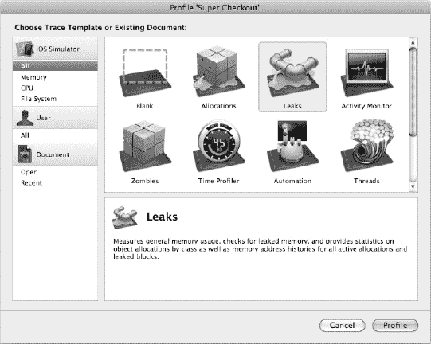

**图 4-19.** *使用 Leaks 模板启动 Instruments*

当应用程序在模拟器中启动后，在表视图中上下滚动几次，您会看到“Leaks”工具图表中出现一些泄漏。退出 iOS 模拟器，将 Instruments 置于前台以分析数据。点击“Leaks”图表，即可看到如图 4-20 所示的视图。

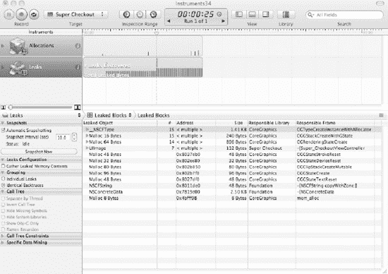

**图 4-20.** *Instruments 显示几处泄漏以及检测到泄漏的内存位置*

让我们花点时间看看这些数据。Instruments 告诉我们有几处内存泄漏。引入最新版本代码中的一些 Core Graphics 代码以及一些 `UIImage` 实例似乎正在泄漏。Instruments 证实了怀疑，但我们不知道泄漏的细节。展开 `UIImage` 树，选择顶部的 `UIImage` 实例。接着，点击内存地址旁边的箭头以显示泄漏的详细信息。这类似于向僵尸对象发送消息时的分配工具。图 4-21 展示了此示例。

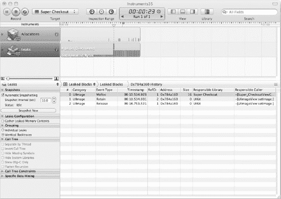

**图 4-21.** *在此 Instruments 单次泄漏的详细信息视图中，请注意引用计数视图及其计数剩余为 1 的情况。*


### 扩展详细窗格

展开“扩展详细”窗格（点击工具栏中的右侧主视图按钮），然后根据泄漏历史记录中的任意一项查看调用堆栈。您之前已经见过此视图，因此双击出现在我们代码中的某个调用堆栈项。这将打开有问题的源代码文件，文件上带有一些注释，让您了解哪些变量正在泄漏以及泄漏了多少。图 4–22 显示了相同的视图。

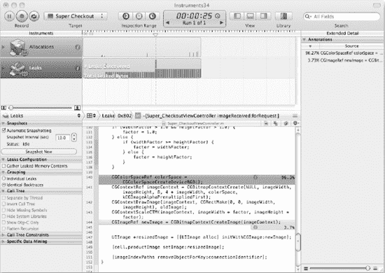

**Figure 4–22.** *检查源代码可以找到一些可能的罪魁祸首*

我们已经能够通过变更追踪到哪些对象被泄漏了，所以让我们修复这些泄漏。点击编辑器中的 Xcode 图标，将打开 Xcode 并显示有问题的代码。由于部分代码使用了 C 语言 API，我们需要记住：几乎所有名称中包含“create”的 C 函数都会创建一个新的引用；我们需要通过释放操作来平衡它。

在 Xcode 中打开该文件，并修改`if`语句下的代码段，使其与以下内容匹配：

```
    CGColorSpaceRef colorSpace = CGColorSpaceCreateDeviceRGB();
    CGContextRef imageContext = CGBitmapContextCreate(NULL, imageWidth, imageHeight, 8, 4
* imageWidth, colorSpace, kCGImageAlphaPremultipliedFirst);
    CGContextDrawImage(imageContext, CGRectMake(0, 0, imageWidth, imageHeight), oldImage);
    CGContextScaleCTM(imageContext, imageWidth * factor, imageHeight * factor);
    CGImageRef newImage = CGBitmapContextCreateImage(imageContext);

    CGColorSpaceRelease(colorSpace);
    CGContextRelease(imageContext);

    UIImage *resizedImage = [[UIImage alloc] initWithCGImage:newImage];

    [cell.productImage setImage:resizedImage];

    CGImageRelease(newImage);  
    [resizedImage release];
```

现在，在泄漏检测工具中重新运行应用程序，并多滚动一些内容。这修复了问题吗？Instruments 仍然检测到了一些泄漏。好吧，我们将深入探究这些泄漏。我们已经修复了最初的问题，但在所有泄漏都处理完毕之前，我不会感到满意。图 4–23 显示了 Instruments 中一个它认为正在泄漏的项目：


**Figure 4–23.** *在自动释放池中发现的一个泄漏示例*

图 4–23 显示了在自动释放池中检测到的一个泄漏示例（列表中的最后一个）。如果我们追踪该对象的内存历史记录，会看到以下内容：

*   *Malloc*：引用计数为 1
*   *Autorelease*：添加到当前的自动释放池
*   *Retain*：引用计数为 2
*   *Release*：引用计数为 1

我们现在有一个位于自动释放池中、准备被释放的对象。那它为什么还没有被释放呢？答案在于我们的`main`函数。当应用程序启动时，会创建一个自动释放池。如果没有创建另一个自动释放池，并且代码在主线程上执行，那么这些对象会被添加到为应用程序创建的自动释放池中。这意味着这些内存会一直存在，直到应用程序终止，最顶层的自动释放池被清空。有关自动释放池的更多信息，请查看 Apple 开发者库中的“内存管理编程指南”。

不过，不要觉得你可以随意在任何地方创建自动释放池。作为 iOS 开发者，我们生活在一个内存受限的世界中，需要做好本分，清理自己产生的垃圾。创建自动释放池可能会引起意外后果，所以只有在绝对必要时才使用自动释放池。一个使用自动释放池的好时机是在一个非常紧凑的循环中，这种循环很容易快速产生大量临时对象。

### 重新审视保留循环

在本章前面部分，我们讨论了如何使用 Instruments 检测保留循环。由于 Super Checkout 没有任何保留循环，我们需要人为制造一个。我不需要引导您从头构建一个新项目并制造保留循环，而是已经为您完成了这些艰苦的工作。这个示例与在 Instruments 中使用泄漏检测工具的工作流程相同。

Instruments 中显示保留循环的新功能可以在泄漏检测工具的跳转栏中找到。图 4–24 显示了制造出来的保留循环，并在跳转栏中选中了相应的项目。

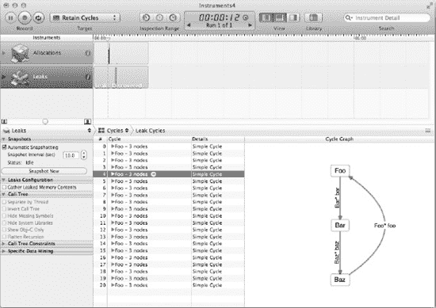

**Figure 4–24.** *Instruments 显示一个简单的保留循环*

在图 4–17 中，首先要注意的是右侧的图表。它显示了内存中的确切循环以及引用之间的关系。所讨论的循环展示了一个典型的子对象持有父对象的情况。在左侧的列表中，您可以看到本次运行中的各种循环。在这个例子中它们都是相同的，并且工作流程是查找堆栈跟踪以确定循环是在哪里创建的。

在这个示例中，点击循环旁边的箭头将会调出图 4–25（右侧区域已展开以显示更多细节）。结果显示的视图能更好地展示保留循环以及导致该循环的堆栈跟踪。点击每个节点会显示不同的堆栈跟踪，因此您可以确定循环真正在代码中的哪个位置被创建并打破它。

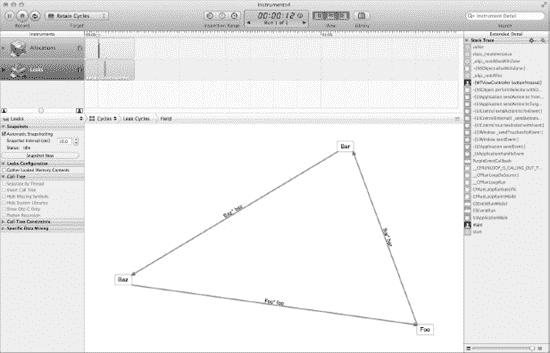

**Figure 4–25.** *循环详情，堆栈跟踪显示了循环开始的位置*

处理完循环问题后，我们就能够熟练地使用我们手中的工具来查找和修复与内存相关的问题了。

### GDB 功夫

当其他方法都失败时，你遇到的就是一个非常有趣的 Bug。正如你在前面的示例中发现的那样，异步代码极难调试。再加上多线程代码会修改相同的对象（无论加锁与否），你就会创造出一些有趣的问题去解决。计算机科学中甚至有专门的分支来应对这些类型的问题。

Super Checkout 是一个非常简单的应用程序。输入和输出定义明确，网络通信也相当简单。你的应用程序很可能不会这么简单。你可能会遇到死锁（两个线程相互等待对方完成对资源的操作）或竞态条件。如果不使用非常底层的工具进行介入，这两个问题很难诊断。

#### GDB，现在别让我失望

我成长过程中最喜欢的歌曲之一是 Little Feat 的《Don't Fail Me Now》。这首歌发行的时候，差不多也是理查德·斯托曼开始推动他的 GNU 就是 Unix（GNU's Not Unix）自由软件运动的时候。那时，C 语言是任何 Unix 编程的事实标准。他的调试器是 GDB，即 GNU 调试器。

GDB 是 Xcode 和 Instruments 调试工具的核心与灵魂。许多漂亮的图表、直方图和菜单都是苹果在 GDB 的基础上应用其精美的设计和营销能力的结果。

然而，图形用户界面有时也会碍事。如果你读到了本章的这个阶段，仍然没有找到你的 Bug，那么真的是时候活动一下指关节，甩甩手，深入命令行 GDB 工具套件了。你可能会对自己哼唱：“GDB，现在别让我失望。”


##### GDB 入门指南

为了让你熟悉 GDB，请在 `Super_CheckoutViewController.m` 文件的 `viewDidLoad:` 方法中放置一个可视断点（参见 图 4–26）。要创建可视断点，只需点击编辑器装订线中的任意位置即可。

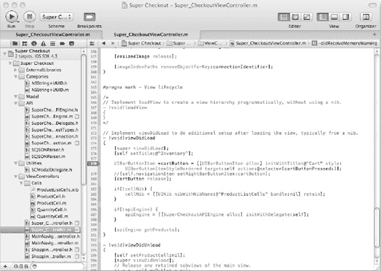

**图 4–26.** *在 `Super_CheckoutViewController.m` 文件的第 178 行放置的可视断点*

运行应用，当应用中断时，按下  + shift + Y 调出调试控制台（如果尚未显示）。你会看到三个不起眼的蓝色字母，它们被括在圆括号中，如 图 4–27 所示。

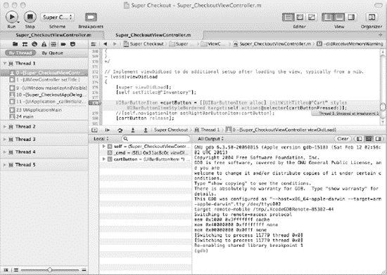

**图 4–27.** *GDB 在可视断点处中断后等待你的命令*

图 4–27 显示了 GDB 调试器的默认提示符。不必害怕，它很友好。它知道如何进行加法、乘法以及执行任何 C 表达式。点击 `(gdb)` 提示符旁边。我们经常使用 `p` 命令后跟一个表达式来进行快速求值。尝试输入 `p 2+2` 并按回车键。你应该会看到以下输出：

```
(gdb) p 2+2
$1 = 4
```

你可以基于结果继续构建。GDB 会为你输入的表达式设置美元符号变量。让我们用这个数字加上 10：

```
(gdb) p $1+10
$2 = 14
```

玩一下这个功能。很快你可能会觉得无聊。GDB 的真正价值在于能够动态评估表达式、检查变量、设置断点，以及在追踪内存错误时实时调整变量的值。

通过将断点从装订线拖到其他空间来移除可视断点。断点会像 OS X 中从 Dock 移除图标一样“噗”地消失。你可以通过在 Xcode 工具栏中选中或取消选中方案选择器旁边的断点按钮来启用或禁用断点。

##### 确定上下文——我在哪里？

现在你已经熟悉了一些基本命令，让我们找一个需要更多调试帮助的地方。运行应用，并向购物车添加一个水果。进入购物车视图，尝试通过点击编辑按钮或滑动单元格来删除该商品。应用会因表视图的异常而崩溃。这是深入了解 GDB 的好时机，因为这是一个运行时异常，而不是内存问题。该异常发生在第 170 行，因此在第 168 行放置一个可视断点，即我们调用 `[tableView beginUpdates]` 的地方。

停止应用，然后重新运行并执行相同步骤。这次应用会在我们的断点处暂停。让我们看看断点在代码中的位置。点击控制台面板，输入 `l` 命令（即“列表”），然后按回车键：

```
(gdb) l
163        // 从数据源中删除该行
164        NSDictionary *item = [[shoppingCart objectForKey:@"items"] objectAtIndex:[indexPath row]];
165
166        [apiEngine removeProductFromCart:[item objectForKey:@"id"] withQuantity:[item objectForKey:@"quantity"]];
167       
168        [tableView beginUpdates];
169        [tableView deleteRowsAtIndexPaths:[NSArray arrayWithObject:indexPath] withRowAnimation:UITableViewRowAnimationRight];
170        [tableView endUpdates];
171       
172    }
(gdb)
```

GDB 显示了一段围绕当前断点的代码块。你可以使用 `backtrace` 命令了解更多关于 GDB 为何停止的信息，并请求查看堆栈中的第一个项目。那将是最近一次函数调用。

```
(gdb) bt 1
#0  -[ShoppingCartViewController tableView:commitEditingStyle:forRowAtIndexPath:]
(self=0x12e080, _cmd=0x31ab6e38, tableView=0x9c0c00,
editingStyle=UITableViewCellEditingStyleDelete, indexPath=0x1b6750) at
/Users/brandon/Development/iOS/Super Checkout/Super Checkout/../Super
Checkout/ShoppingCartViewController.m:168
(More stack frames follow...)
(gdb)
```

我们看到调试器停在了源代码的第 168 行。列表显示了一个视觉上下文，即它停止位置的前后几行。这是代码的静态部分。它让你了解应用即将做什么。调试器还显示了动态上下文，即最初引导你到达这里的活动函数调用堆栈。

现在让我们深入一点。输入命令 `bt 5`，意思是“向我显示堆栈中的五个函数调用”；这个命令被称为反向跟踪：

```
(gdb) bt 5
#0  -[ShoppingCartViewController tableView:commitEditingStyle:forRowAtIndexPath:]
(self=0x12e080, _cmd=0x31ab6e38, tableView=0x9c0c00, editingStyle=UITableViewCellEditingStyleDelete, indexPath=0x1b6750) at /Users/brandon/Development/iOS/Super Checkout/Super Checkout/../Super Checkout/ShoppingCartViewController.m:168
#1  -[ShoppingCartViewController tableView:commitEditingStyle:forRowAtIndexPath:] (self=0x1b6750, _cmd=0x318bb84b, tableView=0x2fdfdcac, editingStyle=10226688, indexPath=0x12e080) at /Users/brandon/Development/iOS/Super Checkout/Super Checkout/../Super Checkout/ShoppingCartViewController.m:168
#2  0x3193dfb4 in -[UITableViewCell(UITableViewCellInternal) deleteConfirmationControlWasClicked:] ()
#3  0x330da570 in -[NSObject(NSObject) performSelector:withObject:withObject:] ()
#4  0x31766ec8 in -[UIApplication sendAction:to:from:forEvent:] ()
(More stack frames follow...)
(gdb)
```

这是一种手动显示 Xcode 在导航区域中的调试导航器中提供的相同信息的方式。你可以直观地浏览堆栈反向跟踪，如果代码是你自己的，你会看到代码变化为其他源代码，或者如果是进入框架代码，则会看到汇编代码（参见 图 4–28）。


**图 4–28.** *使用调试导航器直观地浏览堆栈反向跟踪*

##### 检查数据——我有什么？

我们还应该看看运行时值，以了解发生了什么。GDB 提供了丰富的工具来检查值。使用 `info args` 检查方法的参数。使用 `info locals` 查看当前堆栈帧中的所有局部变量：

```
(gdb) info args
self = (ShoppingCartViewController *) 0x12e080
_cmd = (SEL) 0x31ab6e38
tableView = (UITableView *) 0x9c0c00
editingStyle = UITableViewCellEditingStyleDelete
indexPath = (NSIndexPath *) 0x1b6750
(gdb) info locals
item = (NSDictionary *) 0x126f00
(gdb)
```

这很不错。

`whatis` 命令检查参数的运行时类型，对于 `NSDictionary` 条目、委托（类型为 `id`）和多态参数非常有用。当出现类型不匹配时——也就是说，当你对错误类型执行你认为安全的操作时——可能会发生内存错误。这里我们检查 `item` 的类型：

```
(gdb) whatis item
type = NSDictionary *
(gdb)
```

好的，这与预期一致。我们可以窥视结构内部。当你要求在你的控制台上打印一个参数时，Xcode 就会使用这个命令。输入 `po` 后跟变量名；`po` 是“print object”（打印对象）的缩写：

```
(gdb) po item
{
    id = 3;
    name = "Blood Orange";
    price = 110;
    quantity = 1;
    subtotal = 110;
}
(gdb)
```

在这里，我们可以在应用崩溃之前检查其状态。不过，我们还没有仔细查看之前遇到的错误。在 GDB 提示符下输入 `c` 以继续执行，并让应用再次崩溃。让我们更深入地检查这个问题。控制台显示如下：


```
(gdb) c
Continuing.
2011-03-21 01:00:28.681 Super Checkout[3550:707] *** Assertion failure in -[UITableView
_endCellAnimationsWithContext:], /SourceCache/UIKit/UIKit-1448.89/UITableView.m:995
2011-03-21 01:00:28.711 Super Checkout[3550:707] *** Terminating app due to uncaught
exception 'NSInternalInconsistencyException', reason: 'Invalid update: invalid number of rows in
section 0.  The number of rows contained in an existing section after the update (1) must be equal
to the number of rows contained in that section before the update (1), plus or minus the number of
rows inserted or deleted from that section (0 inserted, 1 deleted).'
*** Call stack at first throw:
(
        0   CoreFoundation               0x3316a64f __exceptionPreprocess + 114
        1   libobjc.A.dylib              0x32b60c5d objc_exception_throw + 24
        2   CoreFoundation               0x3316a491 +[NSException raise:format:arguments:] + 68
        3   Foundation                   0x338b7573 -[NSAssertionHandler
handleFailureInMethod:object:file:lineNumber:description:] + 62
        4   UIKit                        0x31879379 -[UITableView(_UITableViewPrivate)
_endCellAnimationsWithContext:] + 4500
        5   UIKit                        0x318832f9 -[UITableView endUpdatesWithContext:] + 28
        6   UIKit                        0x318832d5 -[UITableView endUpdates] + 16
        7   Super Checkout               0x00004287 -[ShoppingCartViewController
tableView:commitEditingStyle:forRowAtIndexPath:] + 314
        8   UIKit                        0x318bb84b -[UITableView(UITableViewInternal)
animateDeletionOfRowWithCell:] + 58
        9   UIKit                        0x3193dfb5 -[UITableViewCell(UITableViewCellInternal) deleteConfirmationControlWasClicked:] + 28
        10  CoreFoundation               0x330da571 -[NSObject(NSObject)
performSelector:withObject:withObject:] + 24
        11  UIKit                        0x31766ec9 -[UIApplication sendAction:to:from:forEvent:] + 84
        12  UIKit                        0x31766e69 -[UIApplication
sendAction:toTarget:fromSender:forEvent:] + 32
        13  UIKit                        0x31766e3b -[UIControl sendAction:to:forEvent:] + 38
        14  UIKit                        0x31766b8d -[UIControl(Internal)
_sendActionsForEvents:withEvent:] + 356
        15  UIKit                        0x31767423 -[UIControl touchesEnded:withEvent:] + 342
        16  UIKit                        0x31765bf5 -[UIWindow _sendTouchesForEvent:] + 368
        17  UIKit                        0x3176556f -[UIWindow sendEvent:] + 262
        18  UIKit                        0x3174e313 -[UIApplication sendEvent:] + 298
        19  UIKit                        0x3174dc53 _UIApplicationHandleEvent + 5090
        20  GraphicsServices             0x32861e77 PurpleEventCallback + 666
        21  CoreFoundation               0x33141a97
__CFRUNLOOP_IS_CALLING_OUT_TO_A_SOURCE1_PERFORM_FUNCTION__ + 26
        22  CoreFoundation               0x3314383f __CFRunLoopDoSource1 + 166
        23  CoreFoundation               0x3314460d __CFRunLoopRun + 520
        24  CoreFoundation               0x330d4ec3 CFRunLoopRunSpecific + 230
        25  CoreFoundation               0x330d4dcb CFRunLoopRunInMode + 58
        26  GraphicsServices             0x3286141f GSEventRunModal + 114
        27  GraphicsServices             0x328614cb GSEventRun + 62
        28  UIKit                        0x31778d69 -[UIApplication _run] + 404
        29  UIKit                        0x31776807 UIApplicationMain + 670
        30  Super Checkout               0x00002351 main + 92
        31  Super Checkout               0x000022f0 start + 40
)
terminate called after throwing an instance of 'NSException'

Program received signal SIGABRT, Aborted.
0x343e0a1c in __pthread_kill ()
(gdb)
```

至少异常信息描述得很清楚。看起来我们没能正确更新购物车。现在来实现这个功能。

我们将在 `ShoppingCartViewController` 类中实现一个私有方法，为了消除编译器警告，我们准备为该类创建一个类别。所以在 `ShoppingCartViewController.m` 文件的顶部，添加以下**加粗**的代码：

```
#import "ShoppingCartViewController.h"
#import "ProductCell.h"

@interface ShoppingCartViewController (PrivateMethods)
-(void) removeItemFromCart:(NSDictionary *) item;
@end

@implementation ShoppingCartViewController
```

现在添加该方法的实现。在文件底部添加以下内容：

```objc
#pragma mark - Private Methods
-(void) removeItemFromCart:(NSDictionary *) itemToRemove {
    NSMutableArray *newItemsArray = [NSMutableArray array];

    for(NSDictionary *item in [shoppingCart objectForKey:@"items"]) {
        if([item valueForKey:@"id"] == [itemToRemove valueForKey:@"id"]) {
            continue;
        }

        [newItemsArray addObject:item];
    }
}
```

现在测试我们的代码。禁用断点：可以从编辑器中移除断点，或使用切换按钮将其关闭（建议暂时关闭断点；不要移除断点，因为代码尚未经过测试）。运行应用，向购物车添加一个商品，然后将其从购物车中移除。

运行结果不太理想，对吧？重新启用断点（现在明白为什么我们没有把所有断点都移除的原因了吧？）。我们来调试代码以调查问题。但我们要用更聪明的方法——设置一个条件断点。

条件断点只在程序的运行时出现特定值时才停止。这对于频繁变化的值非常有用，例如触摸位置、长循环中的值，或者当某些值变为 null 或达到临界点时出现的间歇性故障。

在本例中，我们要向购物车添加多个商品，在循环代码中设置一个断点，看看它是否会停下来。


##### 分手并不难

我们要做的第一件事，是在刚创建的循环条件中设置一个断点（位于`ShoppingCartViewController.m`的第 247 行）。再次运行应用程序，这次向购物车中添加几个商品。进入购物车界面，移除其中一个商品以触发第一个断点。输入`info break`命令查看 GDB 分配的内部断点编号。

```
(gdb) info break
Num Type           Disp Enb Address    What
1   breakpoint     keep y   0x00003fd2 in -[ShoppingCartViewController
tableView:commitEditingStyle:forRowAtIndexPath:] at /Users/brandon/Development/iOS/Super
Checkout/Super Checkout/../Super Checkout/ShoppingCartViewController.m:172
breakpoint already hit 1 time
2   breakpoint     keep y   0x00004622 in -[ShoppingCartViewController removeItemFromCart:] at
/Users/brandon/Development/iOS/Super Checkout/Super Checkout/../Super
Checkout/ShoppingCartViewController.m:247
(gdb)
```

你可能会看到其他断点被列出。找到对应我们想要中断一次的循环的那个断点。我在前面的代码片段中已经摘录了它。我们需要最左侧列中的数字，即 2。我们只想在字典中的`id`值等于要移除商品的`id`值时，才停止该例程。由于该变量在作用域内，让我们通过输入`po item`来查看`item`变量是什么样的。本次运行的输出如下：

```
(gdb) po item
{
    id = 3;
    name = "Blood Orange";
    price = 110;
    quantity = 1;
    subtotal = 110;
}
(gdb)
```

我们关心的`id`是 3。对应的 Objective-C 代码如下：

```
[[item objectForKey: @" id"] intValue] == 3
```

编译器通常会解析这条语句，确定我们发送的每条消息的值的类型，并计算表达式。GDB 也能帮助我们即时评估这个表达式。不过，我们需要稍微帮它一把。每条消息都必须有强类型。必须消除所有歧义。我们可以通过类型转换来实现。

通过类型转换来修改条件中的每条消息传递调用。我们在这里这样做：

```
((int) [[item objectForKey: @"id"] intValue] ==3)
```

让 GDB 将 14 号断点设置为条件断点，即 GDB 仅在条件为真时才停止。语法是`condition NN code`：

```
(gdb) condition 2 ((int) [[item objectForKey: @"id"] intValue] == 3)
(gdb)
```

就是这样！使用`c`命令（代表“continue”）继续执行我们的程序：

```
(gdb) c
```

很快，当条件满足时，你的调试器就会停止。

有没有办法在 Xcode 中做到这一点？当然有！你需要做的是，在导航区域中前往断点导航器（Breakpoint Navigator），或者右键点击你想要编辑的断点，然后从上下文菜单中选择“Edit Breakpoint”。图 4-29 展示了直接从编辑器中编辑的方式。由于这仅仅是 GDB 之上的一个图形用户界面，因此挑剔性依然有效。将所有内容进行类型转换！


**图 4-29.** *直接从 Xcode 中编辑断点*

了解两种设置条件断点的方法都很重要。有时数据可能快速变化，你需要直接与 GDB 交互。

##### 融会贯通

为了完成我们的 GDB 训练，我们将暂时离开这个 bug，讨论 GDB 的最后一个话题。

利用类型转换来评估表达式的技巧，除了用于评估条件断点之外，同样适用于操作实时数据。让我们结合到目前为止所学的内容。在这里，我们向一个局部参数追加一个字符串，让 GDB 用一个美元符号变量为我们创建一个新字符串，然后用`po`来检查它：

```
(gdb) p (NSString *) [caption stringByAppendingString: @" foo"]
$6 = (NSString *) 0x3d9ef0
(gdb) po $6
Seen near Searching... foo
```

我们也可以将这些值塞入局部变量中。我们使用`set <arg>=<value>`命令来改变一个值。让我们修改一下`caption`：

```
(gdb) set caption=$6
(gdb) po caption
Seen near Searching... foo
```

学习使用 GDB 的最佳方法就是动手实验。在调试特别棘手的问题时，我手边总会放着一份 GDB 快速参考指南的副本（虽然有点皱巴巴的）；你可以从这里下载：

`http://refcards.com/docs/peschr/gdb/gdb-refcard-a4.pdf`

##### 修复我们的 Bug

既然你现在已经掌握了 GDB 的白带功夫，让我们尝试解决这个问题。我们设置好了断点，并且具备了修改实时数据和检查内存的能力。让我们来处理这个 bug，看看发生了什么。

运行应用程序，向购物车中添加一些商品；确保其中一个是你在条件断点中设置要中断的那个商品。尝试从购物车中移除该商品，然后让我们逐步执行代码。

不要输入`c`来继续，而是使用`n`来逐步执行并跳过函数调用。输入`s`则会进入函数调用，让你跟随代码穿过不同的函数调用；这可能会让你进入汇编代码。当应用程序中断时，输入`n`，逐行跳过，直到我们停在跳过正在被移除商品的代码行上。

当我们中断在相关的循环中时，在继续之前，让我们确保该商品被跳过，然后我们可以比较两个数组，以确保该商品确实被移除了。为此，继续逐步执行，直到方法即将返回（或者在右花括号处设置一个断点并继续执行）。打印出`shoppingCart`和`newItemsArray`的内容。示例如下：

```
(gdb) po shoppingCart
{
    items =     (
                {
            id = 1;
            name = Apple;
            price = 79;
            quantity = 1;
            subtotal = 79;
        },
                {
            id = 3;
            name = "Blood Orange";
            price = 110;
            quantity = 1;
            subtotal = 110;
        },
                {
            id = 2;
            name = Honeydew;
            price = 100;
            quantity = 1;
            subtotal = 100;
        }
    );
    total = 289;
}
(gdb) po newItemsArray
<__NSArrayM 0x4ce8260>(
{
    id = 1;
    name = Apple;
    price = 79;
    quantity = 1;
    subtotal = 79;
},
{
    id = 2;
    name = Honeydew;
    price = 100;
    quantity = 1;
    subtotal = 100;
}
)
```

该商品在新数组中不见了，但购物车并没有被更新。等等！我们并没有修改购物车。好吧，这是一个愚蠢的错误；让我们通过在循环结束后添加以下几行代码来修复这个问题：

```
NSMutableDictionary *newCart = [NSMutableDictionary dictionaryWithDictionary:shoppingCart];
[newCart setValue:newItemsArray forKey:@"items"];
shoppingCart = newCart;
```

现在，关闭断点，测试应用程序。运行完美！如果没有 GDB，我们可能就不得不在各处使用`NSLog`语句了。

#### 当所有方法都失败时

如果你已经到了调试问题的这一步，仍然没有解决方案，并且在 Google 上搜索你的问题得到的都是你已经访问过多次的相同网站，那么是时候放弃了。不，我不是说把你的电脑扔了。那样会伤到你的脚，你还得买一台新电脑；医药费和新电脑并不能修复这个 bug。不过说真的，至此我们已经用尽了所有选项，因为我们已经完成了以下步骤：

- 排除了消息发送到已释放内存的情况
- 排除了异步代码调用已释放内存的情况
- 防止了内存耗尽并消除了内存泄漏
- 重现了问题并使用 GDB 逐步调试了代码

哇，我们已经完成了一系列不错的故障排查步骤，并走到了最后。那么接下来呢？


##### 海森堡虫

如果问题是竞态条件（尤其是在多线程环境下），你可能会忍不住在代码里到处插入 `NSLog` 语句来检查状态。别这样做。我再说一遍：别这么做。添加 `NSLog` 语句会改变竞态条件的条件，甚至可能完全消除它。

等等，我猜你肯定在问：“他是说不要消除竞态条件吗？”是的，我确实这么说了。虽然这在短期内或许是个可接受的解决方案，但应用程序中很可能存在一个根本性的设计问题，之后会再次暴露出来。

我们把这类 bug 称为“海森堡虫”，因为它们遵循海森堡测不准原理。该原理指出，测量某种现象这一行为本身就会完全改变其行为。想了解更多，可以读一读“双缝衍射实验”的资料，你就会明白这其中的微妙之处了。

##### 求助同事

你很可能是在团队中工作，所以随时可以向队友求助。让一双新的眼睛审视问题，往往能找到 bug 的根本原因，尤其是当对方问出“你为什么用这种方式处理？”时。这一个问题就能带来全新的视角，并在解决难题时揭示出那些错误的假设。

被你拉来审查代码的人，对某些 API 的熟练程度也可能不同。如果问题出在你使用 API 的方式上，他们很可能会发现不对劲。他们或许还遇到过类似类型的 bug。利用团队的专业知识，是解决棘手问题并在团队内部建立信任的好方法。真的，这是双赢的局面。

##### 推倒重来

现在，我们来到了列表的末尾。你已经用尽一切办法对付这个问题，但它仍然时不时冒出来。如果已经折腾了很长时间，那就休息一下，或者睡一觉。有时候，好好睡一晚上能让大脑潜意识地思考问题，醒来时或许就有了可能的解决方案。

如果问题牵涉时间紧迫，也许是时候举白旗，重新设计那段代码了。先从用图表和其他具体的形式勾勒出系统应有的行为开始，然后列出所有可能导致失败的边界情况。请记住，现在不是重新设计整个系统或模块的时候。重新评估你的方法，然后想出一个解决方案。

在问题上推倒重来并非真正的放弃；你只是发现了一种行不通的方法而已。经历过这次之后，你将有绝佳的故事可以分享，并在调试这类问题方面获得宝贵的经验。

### 我们快完成了……几乎

哇，这一章我们真是经历了一段漫长的旅程。我们从一款存在严重内存问题的应用程序开始。它在一些简单操作上就会崩溃，而我们已经解决了这些问题。应用还有一些其他问题，我们将继续迭代应用，朝着发布 Super Checkout 的 beta 版本迈进。

还剩下什么？我们必须将分支合并回主分支，以便继续在主分支上开发。在修改应用的过程中，你是否逐步提交了更改？是的？很好。如果没有，对这个应用来说也不是什么大事。我建议尽早并频繁地提交，尤其是在将修改推送到远程仓库之前，Git 仓库只在本地修改。

如果还没做，请对项目执行最终提交到 `memory` 分支，然后打开 Organizer（管理器）的 Repositories（仓库）标签页。在仓库导航器中，选中仓库下的工作副本。我们要切换回 `master` 分支，因为它将是合并的目标。你可以点击工作副本底部的“Switch Branch”（切换分支）按钮来完成此操作（参见图 4–30）。


**图 4–30.** *查看工作副本的变更历史*

当你点击“Switch Branch”按钮时，会弹出一个工作表，要求你选择要切换到的分支（参见图 4–31）。选择 `master` 分支，然后点击 OK。


**图 4–31.** *切换分支工作表*

现在，回到 Xcode，我们要合并来自另一个分支的更改，因此需要选择 File（文件）Source Control（源代码控制）Merge（合并）。会显示一个工作表（见图 2–32），询问你要合并哪个分支；选择 `Memory_Fixes`，然后点击 Choose（选择）。


**图 4–32.** *选择要合并的分支*

**提示：** 确保你的工作副本是你想要合并到的目标分支。

接下来你会看到最终的合并确认。这个工作表允许你决定要包含哪些差异，并在左侧显示本地副本的预览。如果遇到实际冲突，底部的按钮让你选择如何处理冲突（参见图 4–33）。


**图 4–33.** *合并工作表是在提交前直观查看合并结果的好工具*

点击 Merge（合并）会触发 Xcode 按照你的配置方式执行合并，并将更改提交到该分支。合并完成，切换回 Organizer 查看工作副本的修订历史，会反映出已合并的提交（参见图 4–34）。


**图 4–34.** *Xcode 自动将合并提交到仓库*

合并完成，我们可以继续处理剩下的优化工作了。

### 总结

本章我们涉及了大量内容！我们讨论了最新的编译器技术以及如何解决内存相关问题。现在，你可以把自己看作僵尸杀手和内存管工了。然而，这些成就只是解决 Super Checkout 问题的第一步。接下来要处理的是缓慢的用户界面，并优化我们的应用以实现流畅的转场和快速表格。是时候学习如何使用下一组可用的工具了。准备好了吗？很好，翻过这一页，开始吧！

## 第 5 章

## 核心动画与平滑滚动

没有什么比缓慢的用户界面更让人恼火的了。作为开发者，我们的职责是确保应用响应迅速且交互灵敏。这并非总是易事。算法可能变得复杂，运行时间超出预期。设计师会设计带有大量图形元素的复杂视图。两者结合，就很容易出现滚动时界面卡顿的情况。`UITableView` 尤其容易出现这类问题。

在本章中，你将学习如何设计高效运行的算法（或者说是模拟高效），以及如何设计视图以帮助设备自行计算动画，而非让视图本身承担计算负担。到本章结束时，Super Checkout 的产品列表屏幕将滚动得飞快，而且你将掌握一些绝佳的视图设计技巧，避免图形处理器在渲染这些视图到屏幕时出现瓶颈。

你即将踏上一段精彩的旅程。我们将涉及一些相当复杂的内容，所以请冲杯咖啡，准备出发。


### 利用主线程

应用程序最重要的部分就是主线程，它是应用的心跳。了解主线程（也称为事件循环或运行循环）的工作方式及其在应用生命周期中的位置，是设计响应式应用的关键。为此，让我们看看应用是如何启动的，以及`UIApplication`实例创建和管理的运行循环。

我们首先要看的是`main.m`文件。在代码清单 1-1 中，你会看到 Super Checkout 中现有的`main.m`文件：

**代码清单 5–1.** *Super Checkout 的 main.m 文件*

```
#import <UIKit/UIKit.h>

int main(int argc, char *argv[]) {
    NSAutoreleasePool *pool = [[NSAutoreleasePool alloc] init];
    int retVal = UIApplicationMain(argc, argv, nil, nil);
    [pool release];
    return retVal;
}
```

好吧，这个你已经见过很多次了。这是 Xcode 创建新项目时生成的默认代码。但它到底做了什么？我们逐行来看：

`NSAutoreleasePool *pool = [[NSAutoreleasePool alloc] init];` 为应用创建了一个自动释放池。

`int retVal = UIApplicationMain(argc, argv, nil, nil);` 为应用创建了一个`UIApplication`的单例实例，加载`MainWindow` nib 文件，最后启动主运行循环。加载 nib 文件会创建应用委托的实现实例，这样应用就能在生命周期中接收相应的通知。

`[pool release];` 释放自动释放池，以收回已分配并被自动释放的剩余内存。我们在第 4 章中讨论过这类自动释放池的相关问题。

`return retVal;` 从函数返回，允许应用退出并向调用者发送返回码。

这些都是相当简单的内容，但我们的重点在于调用`UIApplicationMain()`。如前所述，这个方法创建了`UIApplication`单例实例，并连接好一切，使得应用委托被调用以设置初始视图，并将其添加到应用窗口中。之后，Cocoa Touch 和 UIKit 接管，开始监听输入并绘制用户界面。


**图 5–1.** *应用流程图，概述应用生命周期中的一些重要环节。*

#### 探索事件循环

在开始查找性能不佳的代码之前，让我们详细看看事件循环。当你的应用启动时，会创建一个进程，并为该进程创建一个单线程。事件循环在这个线程中运行。如图 5–1 所示，事件循环执行两项任务：响应输入和响应定时器。这个概念非常简单，但在实践中，当你想要创建一个保持响应性的应用时，事情就会变得复杂。定时器与输入源不同，它们基于时间计算触发，并由事件循环特殊处理。运行循环的第二个职责是响应输入源。像`NSURLConnection`这样的 API 在主线程上运行，并且在异步模式下运行时与事件循环关联。

当某些事件发生时，比如调用`viewDidLoad:`或`touchesBegan:withEvent:`方法，你的代码会在主线程上执行，从而占用事件循环。通常，执行的代码很快，控制权会迅速交回它所属的地方。然而，有时这些代码可能需要相当长的时间来执行。

一直以来都有一条准则：“不要阻塞主线程。”在创建具有响应式用户界面的应用时，这绝对正确。但这种思维模式的一个注意事项是避免过早优化。唐纳德·克努斯曾说过：“我们应该忘记小的效率提升，大约 97%的情况下都是如此：过早优化是万恶之源。”

记住这一点，让我们深入看看 Super Checkout 出了什么问题。

#### 优化代码执行

在本章的这部分，我们将深入探讨一些诊断（并希望修复）运行时间过长的代码的技术。为此，我们需要花点时间讨论如何解决这类问题。由于我们关注的是性能问题，我们需要在应用预期的运行环境中运行它。这意味着要在将要作为主要部署目标的设备上运行应用。

之后，我们需要编译应用并准备以发布配置运行。理想情况下，这意味着没有`NSLog`语句，并且是完全准备好发布的构建版本。获得这种受控环境是进行良好性能调优的关键。

那么如何设置呢？很高兴你问到！启动 Xcode，按照步骤创建一个名为 Performance Tuning 的新“主-从应用”项目。你不需要创建项目面板中的其他选项；我们只是将这个项目作为快速演示应用。

创建应用后，点击项目导航面板中的项目名称，在编辑器中打开项目设置。接着，点击这个新面板中的项目名称以显示项目设置。在“信息”标签页中，点击“配置”部分的加号，复制发布配置。将此配置命名为 Profile（见图 5–2）。


**图 5–2.** *创建 Profile 配置*

我们这样做的目的是将 Release 配置（用于分发，如临时发布或 App Store 发布）与我们用于测试设备上运行的 Profile 配置分开。现在点击“构建设置”标签页。在“代码签名”部分，确保 Profile 条目设置了 iPhone Developer 设置。注意图 5–3 中，选择了“全部”项和“组合”项。


**图 5–3.** *为新 Profile 配置设置代码签名配置*

**提示：** 为调试、性能分析、临时发布和分发发布设置不同的配置，确实有助于确保你使用的是合适的构建版本。调试配置可能定义了一些在发布配置中不需要使用的预处理器宏。此外，发布配置会设置一些编译器优化标志，从而生成运行更快的编译代码。通过复制发布配置来创建 Profile 配置，你可以确保编译器优化设置也被复制，从而能够看到你的代码在实际场景中的性能表现。


##### 小插曲——关于目标（Targets）的一切

当我们在构建设置里摸索时，先简要聊聊项目设置、目标和方案之间的区别。在图 5-3 所示的构建设置中，你选择了“合并”选项。这将定义项目的构建配置。你可以在目标中覆盖这些设置。目标是构建的配置。它继承了项目级构建设置，你可以通过点击“构建设置”选项卡中的“层级”视图来查看。现在点击“性能调优”目标，然后点击“构建设置”选项卡。接着点击“层级”，并确保选中“全部”。在图 5-4 中，你将看到生成的界面以及每个构建设置的继承关系。


**图 5-4.** *目标直至最终解析（最终）设置的继承链*

你现在看到的是每个设置最终如何被 Xcode 解析。最右边是默认设置。当你向左扫描时，你会看到项目级设置，然后是带有最终解析值的目标设置。在这个视图中，项目和目标设置是可编辑的。

如前所述，我们简要地谈谈方案。我们之前打开过方案编辑器，即将再次打开它。我们还没有定义的是方案本身。方案是一个或多个目标如何组合在一起生成最终构建产物的方式。在这个层面上，关于方案需要了解的大致就是这些。

##### 回到性能分析

继续下一步。现在，分析配置已经准备就绪，我们需要告诉分析方案使用这个配置。像我们在第 4 章中那样打开方案编辑器（通过**产品**  **编辑方案**）。点击“分析”操作，然后在“信息”选项卡中修改“构建配置”选项，使其使用我们刚刚创建的新配置（参见图 5-5）。点击“确定”，我们就准备好开始了。

**注意：** 在第 4 章中，我们通过 Instruments 运行了应用程序，但没有经历创建新构建配置的步骤。我们这样做是因为我们不是在设备上运行应用程序。所有测试都是通过模拟器进行的，所以不必担心代码签名问题。我们将要在设备上运行所有测试以获取真实的性能数据，因此需要担心在准备发布应用（ad hoc 或上架 App Store）时会出现代码签名问题。这将会减少你遇到的麻烦。


**图 5-5.** *修改通过性能分析器运行应用程序的构建配置*

现在配置问题已经解决，让我们实现一些代码来展示阻塞主线程的例子。打开 `MasterViewController.m` 文件（由于 Xcode 的自动前缀功能，前缀可能有所不同），并将其修改为代码清单 5-2 所示。

**代码清单 5-2.** *更新后的根视图控制器（用你的 MasterViewController 替换 RootViewController）*

```
#import "RootViewController.h"

@interface RootViewController()
-(NSInteger) fibonacci:(NSInteger) term;
@end

@implementation RootViewController

- (void)viewDidLoad
{
    [super viewDidLoad];
}

- (void)viewWillAppear:(BOOL)animated
{
    [super viewWillAppear:animated];
}

- (void)viewDidAppear:(BOOL)animated
{
    [super viewDidAppear:animated];
}
- (void)viewWillDisappear:(BOOL)animated
{
    [super viewWillDisappear:animated];
}

- (void)viewDidDisappear:(BOOL)animated
{
    [super viewDidDisappear:animated];
}

// 自定义表视图中的分区数量。
- (NSInteger)numberOfSectionsInTableView:(UITableView *)tableView
{
    return 1;
}

- (NSInteger)tableView:(UITableView *)tableView numberOfRowsInSection:(NSInteger)section
{
    return 35;
}

// 自定义表视图单元格的外观。
- (UITableViewCell *)tableView:(UITableView *)tableView
               cellForRowAtIndexPath:(NSIndexPath *)indexPath
{
    static NSString *CellIdentifier = @"Cell";

    UITableViewCell *cell = [tableView dequeueReusableCellWithIdentifier:CellIdentifier];
    if (cell == nil) {
        cell = [[[UITableViewCell alloc] initWithStyle:UITableViewCellStyleDefault
reuseIdentifier:CellIdentifier] autorelease];
    }

    [[cell textLabel] setText:[NSString stringWithFormat:@"%i", [self
fibonacci:[indexPath row]]]];

    // 配置单元格。
    return cell;
}

- (void)tableView:(UITableView *)tableView didSelectRowAtIndexPath:(NSIndexPath
*)indexPath
{
}

- (void)didReceiveMemoryWarning
{
    // 如果视图没有父视图，则释放它。
    [super didReceiveMemoryWarning];

    // 放弃对任何未使用缓存数据、图像等的所有权。
}

- (void)viewDidUnload
{
    [super viewDidUnload];

    // 放弃对任何可在 viewDidLoad 或按需重新创建的内容的所有权。
    // 例如：self.myOutlet = nil;
}

- (void)dealloc
{
    [super dealloc];
}

#pragma mark - 私有方法
-(NSInteger) fibonacci:(NSInteger) term {
    if(term == 0) {
        return 0;
    } else if(term == 1) {
        return 1;
    } else {
        return [self fibonacci:term - 1] + [self fibonacci:term - 2];
    }
}

@end
```


在运行应用之前，我们先简要了解一下当前的情况。简而言之，我们正在显示斐波那契数列的前 35 项。我选择斐波那契数列主要是因为前几项计算起来相对较快。随着项数增加，算法的递归性质会让表格变得有些迟缓。如果你的设备没有被选为部署目标，请在方案选择器中进行选择。试着在设备上运行该应用，并查看表格视图底部的性能表现。

底部的性能表现很糟糕，对吧？我们知道问题所在，现在来考虑如何使用 Instruments 诊断问题。在设备选中的情况下运行应用，然后像第 4 章那样，通过 **Product**  **Profile** 或按下 I 附加 Instruments。另一种运行应用的方法是单击并按住窗口顶部的运行按钮，然后选择 Profile，如图 5-6 所示。


**图 5-6.** *当前方案可用的操作。*

这将在应用启动前启动 Instruments，你会看到欢迎界面。选择 Time Profiler 模板，然后点击 Profile。应用在你的设备上启动后，向下滚动并观察 Instruments 窗口，它会显示一个直观的图表，展示正在发生的情况。查看图 5-7 以查看为我生成的图表。


**图 5-7.** *Time Profiler 显示每个方法所耗费的时间。*

现在我们有了一个直观的图表，具体在看什么呢？Time Profiler 工具会定时暂停你的应用，以记录每个线程的堆栈跟踪信息。这些收集到的信息能让你深入了解应用将大部分时间花在了哪些操作上，从而确定性能瓶颈。知道这一点后，我们再来看看图 5-7 中呈现的信息。该表格显示了两列主要信息（请注意，右键单击表头可以启用其他列）。最左边一列显示了最右边一列中方法的运行时间。查看从上数起的第二项，我们可以看到大量时间花费在了 `fibonacci:` 方法上。

我们预料到了这一点，收集到的数据也证实了这个假设。如果数据没有指示这一点，我们也可以解读数据来弄清楚具体情况。

那么，为什么 `fibonacci:` 方法会花费如此多的时间呢？按住 Option 键并单击 `[RootViewController fibonacci:]` 左侧的展开指示器，查看递归的深度有多深。相当令人惊讶，不是吗？这让我们了解到该算法在此场景下的表现有多糟糕。那么，我们该如何修复呢？

**提示：** Option 单击展开三角形会展开该三角形的所有子项。这是一个操作系统级别的功能。

解决这类问题有多种方法。问题可能纯粹是算法层面的，通过调整以改善运行时间或空间即可解决。也可能是方法层面的问题。如果算法无法改进且运行时间确实很糟糕，可将长时间运行的代码从主线程中分离出来（或交给 Grand Central Dispatch 处理），并显示加载指示器。你的用户会感谢你的。

这不是一本关于算法和计算机科学的书，因此我们将跳过所有理论内容，直接给出答案，并附上简要的解释。首先，返回 Xcode，将 `fibonacci:` 方法更新为代码清单 5-3 所示。

**代码清单 5-3.** *迭代式斐波那契实现不会产生递归实现中会遇到的堆栈问题*

```objc
#pragma mark - 私有方法
-(NSInteger) fibonacci:(NSInteger) term {
    NSInteger first = 0;
    NSInteger second = 1;

    if(term == 0) {
        return first;
    } else if(term == 1) {
        return second;
    } else {
        NSInteger actualTerm = 0;
        for(int t = 1; t < term; t++) {
            actualTerm = first + second;

            first = second;
            second = actualTerm;
        }

        return actualTerm;
    }
}
```

我们在这里所做的，是将递归算法转换为迭代算法。这是解决该问题的一种纯算法方法。现在，既然我们有了一个潜在的解决方案，就再次通过 Time Profiler 分析应用。如果你仍然开着旧的 Instruments 会话，并且 Time Profiler 图标处于切换状态，请在 Instruments 面板中打开，即可在当前运行的下方看到旧的运行记录。这样，你就可以执行相同的测试并查看最终结果。查看图 5-8 了解第二次运行的情况。


**图 5-8.** *这次运行看起来好多了。*

从图 5-8 可以清楚地看到，`fibonacci:` 方法完全没有阻塞主线程。这验证了我们的解决方案，现在我们可以继续解决代码中的其他问题了。


### 改进产品屏幕

Super Checkout 中的产品屏幕滚动效果不佳。既然你之前已经学会了如何诊断类似问题，那我们不妨运行一下时间分析器，看看能否找出应用中的问题所在。

在此之前，我们需要在 `Memory_Fixes` 分支的基础上创建一个新分支，命名为 `Scrolling_Enhancements`。按照我们在第 4 章中遵循的相同步骤操作，并确保你的工作副本位于新创建的分支上。Xcode 完成分支创建并且你可以编辑代码后，请确保设备已连接，并在方案选择器中将其选为部署目标。通过 Profile 操作运行应用，然后在 Instruments 中选择时间分析器工具。

在 Instruments 中，上下滚动产品列表几次后看到的结果有点令人困惑（参见图 5-9）。


**图 5-9.** *我的代码在哪里被执行？*

在斐波那契数列的例子中，我们的代码在哪里出了问题一目了然。但在图 5-9 中，我们无法看到代码是在哪里执行的。为了排除所有后台运行的内容，请勾选调用树部分左侧的 `隐藏系统库` 复选框。这样你将看到一个类似于图 5-10 所示的视图。


**图 5-10.** *有问题的代码已被高亮显示。*

通过选择 `隐藏系统库` 复选框，我们过滤掉了所有干扰信息，从而能够发现哪一行代码行为异常。如图 5-10 所示，`imageReceived:forRequest:` 选择器存在问题。接下来，我们查看代码清单 5-4 来分析该方法。

**代码清单 5-4.** *你能在这个有问题的代码中找出瓶颈吗？*

```
-(void) imageReceived:(UIImage *)image forRequest:(NSString *)connectionIdentifier {
    ProductCell *cell =
        (ProductCell *)[self.tableView
cellForRowAtIndexPath:[imageIndexPathsobjectForKey:connectionIdentifier]];

    CGFloat target = 64;

    CGImageRef oldImage = [image CGImage];
    CGFloat imageWidth = (CGFloat)CGImageGetWidth(oldImage);
    CGFloat imageHeight = (CGFloat)CGImageGetHeight(oldImage);

    CGFloat widthFactor = target / imageWidth;
    CGFloat heightFactor = target / imageHeight;
    CGFloat factor = 1.0;

    if (widthFactor > 1.0 && heightFactor > 1.0) {
        factor = 1.0;
    } else {
        if (widthFactor >= heightFactor) {
            factor = widthFactor;
        } else {
            factor = heightFactor;
        }
    }

    CGColorSpaceRef colorSpace = CGColorSpaceCreateDeviceRGB();
    CGContextRef imageContext = CGBitmapContextCreate(NULL,

imageWidth,

imageHeight,

8,

4 * imageWidth,

colorSpace,

kCGImageAlphaPremultipliedFirst);
    CGContextDrawImage(imageContext, CGRectMake(0, 0, imageWidth, imageHeight),
oldImage);
    CGContextScaleCTM(imageContext, imageWidth * factor, imageHeight * factor);
    CGImageRef newImage = CGBitmapContextCreateImage(imageContext);

    CGColorSpaceRelease(colorSpace);
    CGContextRelease(imageContext);

    UIImage *resizedImage = [[UIImage alloc] initWithCGImage:newImage];

    CGImageRelease(newImage);
    [cell.productImage setImage:resizedImage];

    [resizedImage release];

    [imageIndexPaths removeObjectForKey:connectionIdentifier];
}
```

这是第 4 章中添加的代码。它执行了大量操作，并且每次返回图片时都会被调用。此外，每当创建一个单元格时，都会加载产品的图片。由于这是一个有两个可能原因导致的复杂问题，我们不妨先解决其中一个。执行网络请求是最耗资源（也是最耗时的操作，我们将在第 6 章中进一步讨论），因此我们将更改图片的加载方式。在此之前，我们需要更深入地了解 `UITableView` 和 `UIScrollView` 实例的工作原理。因此，在实施修复之前，我们先来谈谈用户滚动表格视图时 Cocoa Touch 框架做了什么。

### 探究滚动视图的幕后机制

当滚动视图正在滚动时，它会将当前运行循环置于一种特殊模式。这种模式会阻止几乎所有内容的执行，只留下绘制正在移动的滚动视图的相关部分。`NSURLConnection` 就是一个很好的例子，它在滚动视图滚动时会被阻塞。当视图滚动时，从已打开的 socket 返回的任何数据都会被排队，直到运行循环从 `UITrackingRunLoopMode` 切换到默认模式。

了解这一点将有助于你设计一个解决方案，确保在视图滚动时不会发起请求。理想情况下，当滚动结束时，任何打开的 `NSURLConnection` 排队的请求数据都不会涌入应用，并且对委托方法的多次调用可以在同一时间完成。这将需要一个相当大的更新。你准备好了吗？


### 图片懒加载

以下更新将在滚动停止时触发相应的图片请求。为此，我们需要创建一个实际的模型对象，解析商品列表并保留已下载的图片。新建一个 `NSObject` 子类，命名为 `Product`。

打开 `Product.h`，为其添加代码清单 5–5 所示的接口。

**代码清单 5–5.** *Product 的接口*

```objc
#import <Foundation/Foundation.h>
@interface Product : NSObject {
    NSString *productId;
    NSString *name;
    NSNumber *price;
    NSString *description;
    NSString *image;
    NSString *thumb;

    UIImage *productImage;
}

@property (nonatomic, retain) NSString *productId;
@property (nonatomic, retain) NSString *name;
@property (nonatomic, retain) NSNumber *price;
@property (nonatomic, retain) NSString *description;
@property (nonatomic, retain) NSString *image;
@property (nonatomic, retain) NSString *thumb;
@property (nonatomic, retain) UIImage *productImage;

- (id) initWithDictionary:(NSDictionary *)data;

@end
```

实现文件如代码清单 5–6 所示。

**代码清单 5–6.** *Product 的实现*

```objc
#import "Product.h"

@implementation Product
@synthesize productId;
@synthesize name;
@synthesize price;
@synthesize description;
@synthesize image;
@synthesize thumb;
@synthesize productImage;

- (void)dealloc {
    [productId release], productId = nil;
    [name release], name = nil;
    [price release], price = nil;
    [description release], description = nil;
    [image release], image = nil;
    [thumb release], thumb = nil;
    [productImage release], productImage = nil;

    [super dealloc];
}

- (id) initWithDictionary:(NSDictionary *)data {
    self = [super init];
    if(self) {
        productId = [[data objectForKey:@"id"] copy];
        name = [[data objectForKey:@"name"] copy];
        price = [[data objectForKey:@"price"] copy];
        description = [[data objectForKey:@"description"] copy];
        image = [[data objectForKey:@"image"] copy];
        thumb = [[data objectForKey:@"thumb"] copy];
    }

    return self;
}

@end
```

现在我们已经定义了 `Product` 模型，需要更新多个文件，从解析代码到数据展示都要修改。

打开 `SuperCheckoutAPIEngine.m`，找到 `parsingSucceededForRequest:ofResponseType:parsedObjects:` 选择器，将其更新为代码清单 5–7 所示。别忘了在文件顶部导入 `Product` 头文件！

**代码清单 5–7.** *是时候加速了！*

```objc
-(void)parsingSucceededForRequest:(NSString *)identifier
    ofResponseType:(SuperCheckoutResponseType)responseType
                    parsedObjects:(NSDictionary *)parsedObject {
    switch (responseType) {
        case SuperCheckoutProductList:
            if([self
_isValidDelegateForSelector:@selector(productListReceived:forRequest:)]) {
                NSArray *result = [parsedObject objectForKey:@"result"];
                NSMutableArray *newResult = [NSMutableArray arrayWithCapacity:[result
count]];

                for(NSDictionary *obj in result) {
                    Product *prod = [[Product alloc] initWithDictionary:obj];
                    [newResult addObject:prod];

                    [prod release];
                }

                [delegate productListReceived:[NSArray arrayWithArray:newResult]
forRequest:identifier];
            }
            break;
        case SuperCheckoutCartContents:
            if([self
_isValidDelegateForSelector:@selector(cartContentsReceived:forRequest:)]) {
                [delegate cartContentsReceived:[parsedObject objectForKey:@"result"]
forRequest:identifier];
            }

        default:
            break;
    }
}
```


接下来，更新 `ProductCell.h`，并在文件顶部导入 `Product.h`。将

`@property (nonatomic, retain) NSDictionary *productInformation;`

替换为以下代码行

`@property (nonatomic, retain) Product *productInformation;`

在 `ProductCell.m` 中，将 `setProductInformation:` 选择器替换为

```
-(void) setProductInformation:(Product *)newProductInformation {
    Product *oldInfo = productInformation;
    [oldInfo removeObserver:self forKeyPath:@"productImage"];

    productInformation = [newProductInformation retain];
    [productInformation addObserver:self forKeyPath:@"productImage"
options:NSKeyValueObservingOptionNew context:NULL];

    [productNameLabel setText:[productInformation name]];

    [productPriceLabel setText:[NSString stringWithFormat:@"$%1.2f",
[[productInformation price] floatValue]]];

    [oldInfo release];
}
```

同时，添加以下键值观察方法：

```
- (void)observeValueForKeyPath:(NSString *)keyPath
                                                ofObject:(id)object
                                                   change:(NSDictionary *)change
                                                  context:(void *)context {
    if ([keyPath isEqual:@"productImage"]) {
        [productImage setImage:[change objectForKey:NSKeyValueChangeNewKey]];
    }
}
```

下一个更新位于 `Super_CheckoutViewController.h`。针对这个文件，请使其内容如下：

```
#import <UIKit/UIKit.h>
#import "SuperCheckoutAPIEngineDelegate.h"
@class SuperCheckoutAPIEngine;
@class ProductCell;

@interface Super_CheckoutViewController :
UITableViewController<SuperCheckoutAPIEngineDelegate, UIScrollViewDelegate> {
    NSArray *inventory;
    SuperCheckoutAPIEngine *apiEngine;

    UINib *cellNib;
    ProductCell *productCell;

    NSMutableDictionary *imageIndexes;
    NSMutableDictionary *imageDownloadsInProgress;
}

@property (nonatomic, retain) IBOutlet ProductCell *productCell;

@end
```

对于 `Super_CheckoutViewController.m`，请将其内容更新为：

```
#import "Super_CheckoutViewController.h"
#import "SuperCheckoutAPIEngine.h"
#import "ProductCell.h"
#import "ProductDetailsViewController.h"
#import "Product.h"
@interface Super_CheckoutViewController(Private)
- (void)loadImagesForOnscreenRows;
@end

@implementation Super_CheckoutViewController
@synthesize productCell;
- (id)initWithNibName:(NSString *)nibNameOrNil bundle:(NSBundle *)nibBundleOrNil{
    self = [super initWithNibName:nibNameOrNil bundle:nibBundleOrNil];
    if (self) {
        // 自定义初始化
    }
    return self;
}

// 我们从 nib 文件加载，因此使用 initWithCoder:
- (id) initWithCoder:(NSCoder *)aDecoder {
    self = [super initWithCoder:aDecoder];

    if(self) {
        imageIndexes = [[NSMutableDictionary alloc] init];
    }
    return self;
}

- (void)dealloc{
    [productCell release];
    [imageIndexes release];
    [super dealloc];
}

- (void)didReceiveMemoryWarning{
    // 如果视图没有父视图，则释放它。
    [super didReceiveMemoryWarning];
}

#pragma mark - UITableViewDataSource 方法
- (NSInteger)numberOfSectionsInTableView:(UITableView *)tableView {
    return 1;
}

- (NSInteger)tableView:(UITableView *)tableView numberOfRowsInSection:(NSInteger)section
{
    return [inventory count];
}

// 自定义表格视图单元格的外观。
- (UITableViewCell *)tableView:(UITableView *)tableView
cellForRowAtIndexPath:(NSIndexPath *)indexPath {
    ProductCell *cell = (ProductCell *)[tableView dequeueReusableCellWithIdentifier:
[ProductCell reuseIdentifier]];

    if(cell == nil) {
        [cellNib instantiateWithOwner:self options:nil];
        cell = productCell;
    }
    Product *item = (Product *)[inventory objectAtIndex:[indexPath row]];
    [cell setProductInformation:item];
    [self setProductCell:nil];

    // 获取单元格的图片
    if([item productImage] == nil) {
        if (self.tableView.dragging == NO && self.tableView.decelerating == NO) {
            NSString *requestId = [apiEngine getImageForProduct:[item thumb]];

            [imageIndexes setObject:[NSNumber numberWithInt:[indexPath row]]
forKey:requestId];
        }
    }

    return cell;
}

#pragma mark - UITableViewDelegate
- (void)tableView:(UITableView *)tableView didSelectRowAtIndexPath:(NSIndexPath
*)indexPath {
    ProductDetailsViewController *newVC =
        [[ProductDetailsViewController alloc]
initWithNibName:@"ProductDetailsViewController"
bundle:nil];
    [newVC setSelectedProduct:[inventory objectAtIndex:[indexPath row]]];

    [self.navigationController pushViewController:newVC animated:YES];
    [newVC release];
}

- (CGFloat)tableView:(UITableView *)tableView
        heightForRowAtIndexPath:(NSIndexPath *)indexPath{
    return 76.0;
}

#pragma mark - SuperCheckoutAPIEngineDelegate 方法
- (void)requestSucceeded:(NSString *)connectionIdentifier {
}

- (void)requestFailed:(NSString *)connectionIdentifier withError:(NSError *)error {
}

-(void) productListReceived:(NSArray *)products
                                 forRequest:(NSString *)connectionIdentifier {
    NSLog(@"产品列表: %@", [products description]);
    inventory = [products retain];
    [self.tableView reloadData];
}

-(void) imageReceived:(UIImage *)image forRequest:(NSString *)connectionIdentifier {
    Product *prod = (Product *)[inventory objectAtIndex:[[imageIndexes
objectForKey:connectionIdentifier] intValue]];

    CGFloat target = 64;

    CGImageRef oldImage = [image CGImage];
    CGFloat imageWidth = (CGFloat)CGImageGetWidth(oldImage);
    CGFloat imageHeight = (CGFloat)CGImageGetHeight(oldImage);

    CGFloat widthFactor = target / imageWidth;
    CGFloat heightFactor = target / imageHeight;
    CGFloat factor = 1.0;

    if (widthFactor > 1.0 && heightFactor > 1.0) {
        factor = 1.0;
    } else {
        if (widthFactor >= heightFactor) {
            factor = widthFactor;
        } else {
            factor = heightFactor;
        }
    }

    CGColorSpaceRef colorSpace = CGColorSpaceCreateDeviceRGB();
    CGContextRef imageContext = CGBitmapContextCreate(NULL,
                                                    imageWidth,
                                                    imageHeight,
                                                    8,
                                                    4 * imageWidth,
                                                    colorSpace,
                                                    kCGImageAlphaPremultipliedFirst);

    CGContextDrawImage(imageContext, CGRectMake(0, 0, imageWidth, imageHeight),
oldImage);
    CGContextScaleCTM(imageContext, imageWidth * factor, imageHeight * factor);
    CGImageRef newImage = CGBitmapContextCreateImage(imageContext);

    CGColorSpaceRelease(colorSpace);
    CGContextRelease(imageContext);
    UIImage *resizedImage = [[UIImage alloc] initWithCGImage:newImage];

    CGImageRelease(newImage);
    [prod setProductImage:resizedImage];

    [resizedImage release];

    [imageIndexes removeObjectForKey:connectionIdentifier];
}

// 此方法用于用户滚动到尚未加载应用图标的一组单元格的情况
- (void)loadImagesForOnscreenRows {
    if ([inventory count] > 0) {
        NSArray *visiblePaths = [self.tableView indexPathsForVisibleRows];
        for (NSIndexPath *indexPath in visiblePaths) {
            Product *product = [inventory objectAtIndex:indexPath.row];

            if([product productImage] == nil) {
                NSString *requestId = [apiEngine getImageForProduct:[product thumb]];

                [imageIndexes setObject:[NSNumber numberWithInt:[indexPath row]]
                                                  forKey:requestId];
            }
        }
    }
}

#pragma mark -
#pragma mark 延迟图片加载 (UIScrollViewDelegate)
```


`// 滚动结束时加载所有屏幕行的图片`
`- (void)scrollViewDidEndDragging:(UIScrollView *)scrollView`
`                                       willDecelerate:(BOOL)decelerate {`
`    if (!decelerate) {`
`        [self loadImagesForOnscreenRows];`
`    }`
`}`

`- (void)scrollViewDidEndDecelerating:(UIScrollView *)scrollView {`
`    [self loadImagesForOnscreenRows];`
`}`
`#pragma mark - 视图生命周期`
`// 实现 viewDidLoad 以在加载视图后进行额外的设置，通常来自`
`// nib`
`- (void)viewDidLoad{`
`    [super viewDidLoad];`
`    [self setTitle:@"库存"];`
`    UIBarButtonItem *cartButton =`
`                             [[UIBarButtonItem alloc] initWithTitle:@"购物车"`
`style:UIBarButtonItemStyleBordered`

`target:self`

`action:@selector(cartButtonPressed:)];`
`    //[self.navigationItem setRightBarButtonItem:cartButton];`
`    [cartButton release];`

`    if(!cellNib) {`
`        cellNib = [[UINib nibWithNibName:@"ProductListCells" bundle:nil] retain];`
`    }`
`    if(!apiEngine) {`
`        apiEngine = [[SuperCheckoutAPIEngine alloc] initWithDelegate:self];`
`    }`

`    [apiEngine getProducts];`
`}`

`- (void)viewDidUnload{`
`    [self setProductCell:nil];`
`    [super viewDidUnload];`
`    // 释放主视图的任何保留子视图`
`    // 例如：self.myOutlet = nil;`
`}`

`- (BOOL)shouldAutorotateToInterfaceOrientation:`

`(UIInterfaceOrientation)interfaceOrientation{`
`    // 返回 YES 表示支持的朝向`
`    return (interfaceOrientation == UIInterfaceOrientationPortrait);`
`}`
`@end`

代码量不小，是吧？通过这次重大更新，我们创建了一个新的模型对象，让 API 引擎返回这些新模型对象的列表，并更新了产品列表来处理这些新对象。性能优化部分是在 `Super_CheckoutViewController.m` 中完成的。让我们花点时间仔细看看我们做了什么，然后再看看它对比上一次运行的表现如何。

在 `tableView:cellForRowAtIndexPath:` 中，我们对其进行了更新以使用产品模型，但性能提升的关键在这里：

```
   if([item productImage] == nil) {
        if (self.tableView.dragging == NO && self.tableView.decelerating == NO) {
            NSString *requestId = [apiEngine getImageForProduct:[item thumb]];
            [imageIndexes setObject:[NSNumber numberWithInt:[indexPath row]]
forKey:requestId];
        }
    } else {
        [cell.productImage setImage:[item productImage]];
    }
```

在这里，我们检查图片是否已下载。之前，每次请求单元格时我们都会下载新的图片。现在，我们要减少请求图片的次数，从而降低问题方法被调用的次数。同时，我们通过检测表格视图是否在滚动且未减速，来减少图片加载的次数。基本上，我们只在表格静止且请求单元格时才加载图片。

那么，当表格动画中或停止后怎么办？问得好！我们更新了 `Super_CheckoutViewController` 以遵循 `UIScrollViewDelegate` 协议，并添加了这些方法：

```
- (void)scrollViewDidEndDragging:(UIScrollView *)scrollView
                                       willDecelerate:(BOOL)decelerate {
    if (!decelerate) {
        [self loadImagesForOnscreenRows];
    }
}

- (void)scrollViewDidEndDecelerating:(UIScrollView *)scrollView {
    [self loadImagesForOnscreenRows];
}
```

这些方法会告诉我们表格视图何时停止滚动以及何时停止减速。当这些情况发生时，我们就会加载屏幕行的图片。这会将请求次数减少到屏幕上静止产品的数量。

既然我们已经了解了潜在的修复方法，那就来看看它在 Instruments 中的表现如何吧。我在与上次运行相同的会话中运行了新版本，以展示图表上的差异。图 5–11 显示了对比结果，在图片加载到内存后，我们就能看出区别。不过，我们仍然可以看到 `imageReceived:forRequest:` 占用了相当多的处理能力。或许，调整尺寸的代码对我们来说有点过重了。


**图 5–11.** *图片加载后，情况看起来好了很多。*

但我对它的表现仍不满意，所以我们移除图片尺寸调整的代码。将 `Super_CheckoutViewController` 中的 `imageReceived:forRequest:` 方法更新为如下所示：

```
-(void) imageReceived:(UIImage *)image forRequest:(NSString *)connectionIdentifier {
    Product *prod = (Product *)[inventory objectAtIndex:[[imageIndexes

objectForKey:connectionIdentifier] intValue]];
    [prod setProductImage:image];
    [imageIndexes removeObjectForKey:connectionIdentifier];
}
```

现在，我们来对比一下移除尺寸调整后的表现。我在同一个 Instruments 会话中运行了两次，以便进行对比（参见图 5–12）。正如你所见，移除尺寸调整的代码并没有真正改变图表，但我们确实移除了表现不佳的代码。问题在于，滚动表现仍然不尽如人意。


**图 5–12.** *成功移除了一些表现不佳的代码，但滚动仍然卡顿*

### 告别卡顿滚动

我们已经用尽了 Time Profiler 能提供的信息，是时候拿出杀手锏了。我们要开始测量帧率，并根据 Core Animation 的性能表现来看看遇到了哪些瓶颈。在开始使用 Core Animation 工具之前，我们先花点时间聊聊渲染在 iOS 中是如何发生的。


#### Core Graphics 简介

每个 `UIView` 子类都具备绘制自身并控制其布局的机制。这些方法由 Cocoa Touch 按需调用，通常是在调用 `setNeedsDisplay` 或 `setNeedsLayout` 之后触发。由于我们有这些方法，`drawRect:` 和 `layoutSubviews` 永远不应被直接调用。如果你想触发 `drawRect:`，请调用 `setNeedsDisplay`，Cocoa 会决定调用 `drawRect:` 的最佳时机。`setNeedsLayout` 和 `layoutSubviews` 也是如此。这确保了所有视图更新能够一次性完成，并且渲染会在 Cocoa 最方便的时间进行调度，以便高效绘制相关视图。

那么，在你调度视图渲染之后会发生什么呢？如果你查看图 5–13，就能很好地了解 Cocoa 渲染视图时发生的事情。这一过程会应用到应用中的每一个 `UIView`，而这种一致性在后续会变得非常重要。


**图 5–13.** *视图绘制周期概览*

现在基础知识已经覆盖，让我们深入探究幕后发生的事情。每个渲染视图的核心元素是该视图的 `layer` 属性。这是由 Core Animation 渲染的图层。Core Animation 位于 iOS 架构的媒体层，直接位于 UIKit 所在的 Cocoa Touch 层下方（参见图 5–14）。Core Animation 是 Core Graphics 框架的一部分。Core Graphics 也被称为 Quartz 2D，在绘图方面承担了所有繁重的工作。


**图 5–14.** *这是 iOS 的基本架构，其中媒体层被突出显示；媒体层是我们大部分时间要关注的地方。*

Core Graphics 的职责是渲染应用的整个屏幕。它还负责在不同视图之间进行过渡动画。这类动画的一个典型例子是将视图控制器推入 `UINavigationController` 的视图栈。`UIScrollView` 实例也使用 Core Graphics 来动画化用户与之交互时视图的滚动。`UITableView` 是一个 `UIScrollView`，因此当用户上下滚动时，它需要动画化所有表格单元格。

#### 回到 Instruments

现在，Super Checkout 登场了。我们正在调优的视图是一个表格视图，我们的单元格可能因其设计方式而导致一些性能问题。为了诊断这个问题，我们需要使用 Core Animation 工具对 Super Checkout 进行分析。


**图 5–15.** *Core Animation 工具*

Core Animation 工具为我们提供了一个模板，用于查看每秒渲染帧数的原始测量值以及 CPU 使用率图表。该工具还允许我们修改应用的渲染方式，从而获得关于 Core Graphics 如何实际渲染每个视图的线索。图 5–16 展示了你可以开启哪些选项；每个选项都有其特定用途。我们目前只关心如何查看图层的混合方式。


**图 5–16.** *用于深入了解 Core Graphics 如何渲染应用的调试选项*

继续使用 Core Animation 工具对应用进行分析。在 Instruments 启动且应用运行后，在调试选项中开启“颜色混合图层”（Color Blended Layers）。如果你看不到这些选项，请点击 Core Animation 工具的图表，即可激活它们。当你开启混合图层后，屏幕会看起来非常怪异。查看图 5–17，我们将讨论这些信息告诉了我们什么。

在图 5–17 中，我们看到的是 Core Graphics 如何查看我们的应用。还记得我之前提到合成器（compositor）之后会很重要吗？这就是我指的部分。这个视图向我们展示了 Core Graphics 如何绘制以及它需要进行何种合成。

**注意：** 合成是一种将分层片段相互叠加的复杂方式。有一些非常精妙的算法用于合成多个图层并创建单个图像。幸运的是，Core Graphics 背后的工程师已经为我们完成了所有繁重的工作，因此我们不必操心渲染每一个屏幕。


**图 5–17.** *混合图层视图让我们得以一窥 Core Graphics 如何渲染每个屏幕。*

再看一次图 5–16。每一种不同的色调代表一个独立的图层。实际上，每当创建一个新的 `UIView`（或 `UIView` 的子类）时，都会创建一个新的图层。这些图层属于 `CALayer` 类型，实际上是视图绘制于其上的介质。然后这些图层被合成，形成最终在屏幕上渲染的图像。

合成代价高昂，因此这可能成为性能瓶颈。查看每个单元格中的每个 `UILabel`。有相当多的空白区域需要渲染。如果视图被标记为不透明（opaque），合成器就不必计算不透明视图下方的视图在加上其上层任何内容后的样子。想象一下，在一个图像上方有三个或四个具有不同 alpha 值的视图。合成器需要加班加点才能渲染出视图。如果再加上动画，结果看起来就会很不流畅，因为合成器需要花更长时间来渲染每一中间帧。

然而，有一个好方法可以解决这个问题。与其在我们的表格单元格中管理众多子视图，我们可以直接将内容绘制到视图本身中，只渲染一个图层。图 5–18 展示了开启混合图层后，这种方案的效果。


**图 5–18.** *我们新设计的、仅有一个混合图层的单元格*


### 优化单元格绘制以使用单层绘制

为了更新我们的单元格使其在一个图层上绘制，我们将使用 Loren Brichter 在 Tweetie for iPhone 和 Twitter for iPhone 上使用的相同技术。该技术涉及创建一个覆盖整个单元格的不透明`UIView`，并在该视图的子类中创建绘制方法。为此，我们需要创建一个名为`SuperFastCell`的新`UITableViewCell`子类。请创建一个新的`UITableViewCell`子类，并将其命名为`SuperFastCell`。

打开`SuperFastCell.h`，将其修改为如下内容：

```
#import <UIKit/UIKit.h>

@interface SuperFastCell : UITableViewCell {
    UIView *contentView;
}

-(void) drawCellView:(CGRect)rect;
@end
```

现在，打开`SuperFastCell.m`，并将其修改为如下内容：

```
#import "SuperFastCell.h"

@class SuperFastCell;
@interface SuperFastCellView : UIView
@end

@implementation SuperFastCellView

- (void)drawRect:(CGRect)r {
        [(SuperFastCell *)[self superview] drawCellView:r];
}

@end

@implementation SuperFastCell

- (id)initWithStyle:(UITableViewCellStyle)style
       reuseIdentifier:(NSString *)reuseIdentifier {
    self = [super initWithStyle:style reuseIdentifier:reuseIdentifier];
    if (self) {
        contentView = [[SuperFastCellView alloc] initWithFrame:CGRectZero];
        contentView.opaque = YES;
        contentView.backgroundColor = [UIColor whiteColor];
        [self addSubview:contentView];
        [contentView release];
    }
    return self;
}

- (void) setFrame:(CGRect)frame {
    [super setFrame:frame];
    CGRect myBounds = [self bounds];
    myBounds.size.height -= 1;
    [contentView setFrame:myBounds];
}

- (void) setNeedsDisplay {
    [super setNeedsDisplay];
    [contentView setNeedsDisplay];
}

-(void) drawCellView:(CGRect)rect {
    //子类将实现此方法
}

- (void)dealloc {
    [super dealloc];
}

@end
```

现在我们已经定义了基类，需要更新`ProductCell`类以使用这种新技术。打开`ProductCell.h`，并将其修改为如下内容：

```
#import <UIKit/UIKit.h>
#import "SuperFastCell.h"
@class Product;

@interface ProductCell : SuperFastCell {
}
+(NSString *) reuseIdentifier;

@property (nonatomic, retain) Product *productInformation;

@end
```

现在，打开`ProductCell.m`，并将其修改为如下内容：

```
#import "ProductCell.h"
#import "Product.h"

@implementation ProductCell
@synthesize productInformation;

+(NSString *)reuseIdentifier {
    return @"ProductCell";
}

-(NSString *)reuseIdentifier {
    return [[self class] reuseIdentifier];
}

- (id)initWithStyle:(UITableViewCellStyle)style
       reuseIdentifier:(NSString *)reuseIdentifier
{
    self = [super initWithStyle:style reuseIdentifier:reuseIdentifier];
    if (self) {
        // 初始化代码
    }
    return self;
}

-(void) setProductInformation:(Product *)newProductInformation {
    Product *oldInfo = productInformation;
    [oldInfo removeObserver:self forKeyPath:@"productImage"];

    productInformation = [newProductInformation retain];
    [productInformation addObserver:self
                         forKeyPath:@"productImage"
                            options:NSKeyValueObservingOptionNew
                            context:NULL];

    [oldInfo release];

    [self setNeedsDisplay];
}

- (void)setHighlighted:(BOOL)lit {
    // 如果高亮状态改变，则需要重绘。
    if([self isHighlighted] != lit) {
        [super setHighlighted:lit];
        [self setNeedsDisplay];
    }
}

-(void) drawCellView:(CGRect)rect {
    UIFont *font = [UIFont fontWithName:@"Helvetica" size:17.0];
    CGContextRef context = UIGraphicsGetCurrentContext();
    CGContextSaveGState(context);

    CGImageRef prodImage = [[productInformation productImage] CGImage];
    CGContextDrawImage(context, CGRectMake(12, 6, 64, 64), prodImage);
    //86, 6
    //Helvetica 17 黑色
    CGSize textSize;
    textSize = [[productInformation name] sizeWithFont:font];

    if([self isHighlighted]) {
        CGContextSetStrokeColorWithColor(context, [[UIColor whiteColor] CGColor]);
        CGContextSetFillColorWithColor(context, [[UIColor whiteColor] CGColor]);
    } else {
        CGContextSetStrokeColorWithColor(context, [[UIColor blackColor] CGColor]);
        CGContextSetFillColorWithColor(context, [[UIColor blackColor] CGColor]);
    }

    [[productInformation name] drawInRect:CGRectMake(86, 6, textSize.width,
textSize.height)
                                  withFont:font];

    //Helvetica 17 浅灰色
    NSString *priceString = [NSString stringWithFormat:@"$%1.2f",

[[productInformation price] floatValue]];
    textSize = [priceString sizeWithFont:font];

    if([self isHighlighted]) {
        CGContextSetStrokeColorWithColor(context, [[UIColor whiteColor] CGColor]);
        CGContextSetFillColorWithColor(context, [[UIColor whiteColor] CGColor]);
    } else {
        CGContextSetStrokeColorWithColor(context, [[UIColor lightGrayColor] CGColor]);
        CGContextSetFillColorWithColor(context, [[UIColor lightGrayColor] CGColor]);
    }
    [priceString drawInRect:CGRectMake(86, 35, textSize.width, textSize.height)
                 withFont:font];
    CGContextRestoreGState(context);
}

- (void)observeValueForKeyPath:(NSString *)keyPath
                      ofObject:(id)object
                        change:(NSDictionary *)change
                       context:(void *)context {
    if ([keyPath isEqual:@"productImage"]) {
        [self setNeedsDisplay];
    }
}

- (void)dealloc {
    [super dealloc];
}

@end
```

在运行应用程序之前，需要注意这些自定义单元格的一个重要事项：需要处理高亮和选中状态。由于我们直接在显示的视图上绘制文本，因此无法获得`UILabel`中的优势。这是我们在视图中进行自定义绘制所付出的代价。

现在，使用 Core Animation 对应用程序进行分析，并启用混合图层选项。不再有多个图层视图让合成器超负荷工作。上下滚动并查看帧率。由于我们结合了从基本图像缓存到减少系统在动画中所需合成的数量等一系列性能改进，帧率持续提升。Figure 5–19 展示了在调试这些视图时，使用不同版本的 Super Checkout 在 Core Animation 工具上的几次运行结果。差异不大，但请注意，最上面的运行表现最佳。


**Figure 5–19.** *Super Checkout 在 Core Animation 工具上的不同运行结果*

**注意：** 我们使用的表格单元格本应通过内置单元格类型创建。唯一仍需实现的是加载图像并将其缩小以适配单元格图像视图的代码。然而，对于任何无法通过使用 Apple 在 UIKit 中提供的单元格来完成的复杂单元格来说，这种技术是完美的。


### 向苹果学习

苹果公司的工程师们为我们揭示了他们的应用为何能如此流畅运行的线索。这些工程师对框架的运作方式了如指掌，因此让我们使用“混合图层调试”选项来观察主屏幕和一款内置应用，看看苹果是如何设计其应用的。

我们来看看 iOS 自带的“股票”应用（见图 5–20）。如前所述，图层合成开销很大，而最耗性能的部分是绘制透明视图。那么，如何在自定义视图中实现圆角效果呢？你可以用一张图片作为视图的背景，然后在上面放置透明视图。如果视图不需要动画效果，这完全可行。但如果我们使用整张图片并在其上放置透明视图进行动画处理，那么合成器与 Core Animation 的结合将会导致动画性能低下。


**图 5–20.** *开启了“混合图层”的股票应用*

如图 5–20 所示，“股票”应用使用了圆角效果。为了实现这一效果，该应用在每个角落放置了小的圆角图片。由于应用并未使用一整张大图，合成器只需处理每个角落的透明度合成。这种技术让我们能够快速绘制和轻松实现圆角效果。通过贯彻这一思想——保持视图轻量，并在合理之处绘制自定义视图——我们就能创建出外观精美、动画流畅、滚动如飞的应用程序。

我们审视“股票”应用的主要原因，是向苹果学习。开发者们最了解平台，并且有各种妙招让应用看起来丝滑流畅。用户期望达到这种精良程度，而这份对细节的关注，也为我们实现自己的应用设定了很高的标准。

### 本章小结

本章我们涵盖了许多内容。我们讨论了保持运行循环（Run Loop）持续运行的重要性。我们还讨论了图层合成，以及如何实现设计师交给我们的那些精美设计。遗憾的是，Super Checkout 并没有一位真正的设计师来设计它，但得益于 Loren Brichter 提供的方法，我们成功获得了一个极速流畅的表格单元格。

现在，我们的应用渲染速度已经很快了，接下来该做什么呢？我们将研究 iOS 的网络栈以及我们可以使用的工具来检测与网络相关的异常问题。我们还将讨论缓存和电源管理。下一章将全部围绕 iOS 设备中的无线电模块展开——不需要业余无线电台执照。

