# 网络、缓存与电源管理

到目前为止，我们已经学习了如何清除内存泄漏，以及如何让界面在滚动和动画时减少卡顿。应用开始展现出精良应用应有的性能和表现，为正式上线做好了准备。下一步是什么？接下来就是网络部分。

在开发这些应用时遇到的问题是：我们在开发和调试时，大部分时间都处于高速网络连接状态。我们将研究一些工具来模拟缓慢和不稳定的网络，以便看到我们的应用在实际使用环境中的表现。

移动设备通过一个非常不可靠且相对较慢的网络进行通信（未连接 Wi-Fi 网络时）。这让我们作为软件开发人员的工作变得非常困难，因为我们需要使用一些非常复杂的技术来对用户隐藏这种复杂性。实现缓存方案就是一种非常常见的技术。

平衡实时数据和缓存是一个重大问题，学术界为此授予了许多博士学位，以寻找完美的技术方案。我们不打算研究缓存命中与未命中的理论，而是要看如何实现一个简单的缓存，以及在特定情况下应该使用哪种缓存。我们还将介绍一些为你提供了缓存功能的 API，以节省开发时间。

最后，我们将研究应用在实际使用中消耗了多少电量。由于用户的设备依靠电池供电，我们必须非常关注电池续航，并理解我们的应用需要在 iOS 系统中做一个“好公民”。

幸运的是，苹果和其他开发者为我们提供了一些出色的工具来完成所有这些任务。本章将讨论如何平衡实时数据和缓存，以及如何最大限度地利用设备电池。最终，你将能为 Super Checkout 找到一个良好的缓存方案，并更清晰地理解如何判断一个应用对电池续航的影响。

### 理解网络与缓存控制

大多数为 iOS 平台编写的应用都涉及某种形式的网络通信。正因如此，理解如何设计服务器端的 API 以及如何使用这些服务变得至关重要。在 Super Checkout 中，消费 API 的代码已经开发好了。既然 API 已经存在，我们将花一些时间来探讨 API 设计背后的一些思路。

#### 探索客户端 API

Super Checkout 的客户端 API 在很大程度上基于 Matt Gemmel 的 `MGTwitterEngine`（`http://instinctivecode.com/`）。该 API 设计背后的思想可以用图 6–1 来最好地描述。其基本架构是让所有网络代码都流经一个单一对象。这个对象可以作为控制器的一个属性存在，也可以作为单例存在，但我建议为每个控制器都创建一个独立的引擎实例。

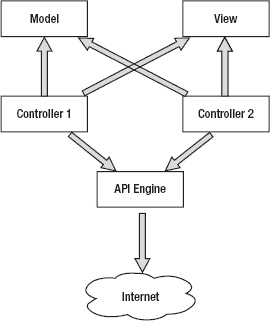

**图 6–1.** *Super Checkout 的基本网络架构*

在我们深入探讨 API 引擎的功能之前，先考虑一下没有这种设计模式的应用会是什么样子。图 6–2 展示了这种可能性。

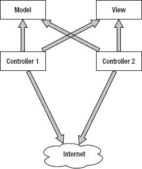

**图 6–2.** *没有 API 引擎的应用程序*

图 6–1 和图 6–2 之间的差异非常细微，但重要到值得我们花时间讨论。

由于 `NSURLConnection` 和 `ASIHTTPRequest`（后面会详细介绍）功能强大且易于使用，很容易让人直接在控制器逻辑中使用这些 API。但这会在特定的 Web 服务和你的应用之间引入耦合。这正是 API 引擎被创建并插入到控制器和互联网之间的原因。

通过解耦 Web 服务并将其抽象成独立的类，我们能够应对服务不可避免的变化。如果应用架构像图 6–2 那样实现，那么每个受服务变更影响的控制器都需要更新。即使在像 Super Checkout 这样的小型应用中，这也可能变得繁琐且耗时，尤其是当模型发生改变时。

这个理念更像是一种指导原则，并非适用于所有情况。这种类型的软件架构是应用开发中最难的部分。目标是拥有一个可复用、自包含的组件，能够处理网络通信、性能良好，并且可以在整个应用中使用。

鉴于 Super Checkout 的简洁性和单一服务特性，我们决定采用一个包含在每个视图控制器中的单一引擎。你的应用会有些相似之处，也会有些不同。请分析具体问题，并基于此进行架构设计。


### 深入解析 Super Checkout 的 API 引擎设计

与 Super Checkout 服务器端 API 通信的接口被设计为具有单一的网络组件接口。图 6–3 展示了该 API 的公共接口。由于服务器接口简单，因此用一个类来处理与服务器的所有交互是合理的。如果服务更复杂，或者我们需要与更多服务通信，那么架构将完全不同。

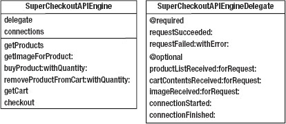

**图 6–3.** *引擎的公共接口*

`SuperCheckoutAPIEngine` 类的基本思路是发送请求并获取返回数据。因此，每个请求都遵循 图 6–4 所示序列图中相同的路径。

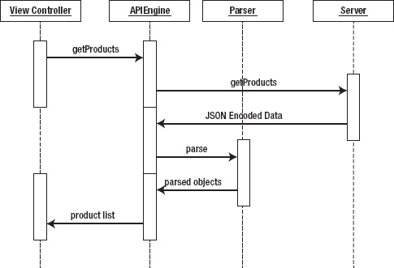

**图 6–4.** *从服务器检索产品列表的请求路径*

在后台，该引擎使用一个 `NSURLConnection` 子类（`SuperCheckoutHTTPURLConnection`）以及 `NSURLConnection` 相关的类。引擎会持有每个连接，并将其与连接字典中的标识符关联起来。通过这种方式，我们可以同时发起多个请求，并能让委托回调引用到相应的请求。

这是执行异步请求的基本公式，并消除了可能发生的任何阻塞。然而，这里有一个问题。`NSURLRequest` 仍然在主线程上运行。它所做的只是将自身绑定到主线程的运行循环中，并在此运行循环处于默认运行模式时获取数据。这意味着当滚动视图正在滚动或任何其他操作将运行循环移出默认模式时，连接将无法接收数据。

如果你的应用程序需要接收正在传入的数据且不能等待，可以改而这样做：

```
//aRequest 已在上面分配和配置，someRunLoop 可以是主运行循环
//或另一个线程的运行循环
NSURLConnection *connection = [[NSURLConnection alloc] initWithRequest:aRequest
                                         delegate:self
                                         startImmediately:NO];
[connection scheduleInRunLoop:someRunLoop forMode:NSRunLoopCommonModes];
[connection start];
```

然而，这种方法有不少注意事项。当在另一个运行循环上调度连接时，委托方法会在创建连接的同一线程上被调用。这导致使用 `NSURLConnection` 变得非常复杂，有时这种复杂性是不必要的。

还有一个流行的网络库，它在后台使用 `CFNetwork` 层。这个库叫做 `ASIHTTPRequest`（[`http://allseeing-i.com/ASIHTTPRequest/`](http://allseeing-i.com/ASIHTTPRequest/)）。

#### 设置 `ASIHTTPRequest`

在开始修改项目之前，创建一个新的 Git 分支，并将其命名为 `Networking_and_cache`。

设置 `ASIHTTPRequest` 很简单：下载源代码，将其导入项目，并添加一些库。要下载最新版本，请访问 [`http://allseeing-i.com/ASIHTTPRequest/`](http://allseeing-i.com/ASIHTTPRequest/)（撰写本文时的 URL 是 [`http://github.com/pokeb/asi-http-request/tarball/master`](http://github.com/pokeb/asi-http-request/tarball/master)）。

下载源代码后，解压 tar 文件，然后打开 Super Checkout 项目。在“External Libraries”组下，创建一个新组，并将其命名为 `ASIHTTPRequest`（参见图 6–5）。

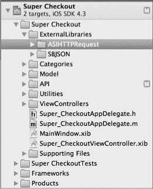

**图 6–5.** *为 `ASIHTTPRequest` 创建组*

接下来，我们要将该组与一个文件夹关联起来。展开工具区，然后选择新创建的组。在“文件检查器”选项卡（**View**  **Utilities**  **File Inspector**）中，有一个按钮可以将此组与新文件夹关联起来（参见图 6–6）。

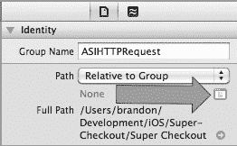

**图 6–6.** *调整组引用的路径*

点击该按钮，将出现一个对话框，显示 `ExternalLibraries` 文件夹的内容。点击“New Folder”按钮，为 `ASIHTTPRequest` 代码创建一个新文件夹（参见图 6–7），创建完成后，点击“Choose”将文件夹与组关联。

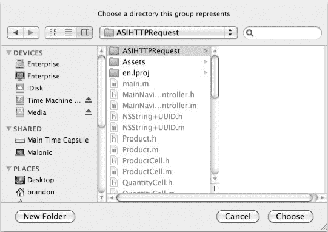

**图 6–7.** *创建 `ASIHTTPRequest` 组指向的新文件夹*

现在我们已经将组与文件夹关联起来，可以导入源文件了。右键点击 `ASIHTTPRequest` 组，然后选择“Add Files to Super Checkout”。这将弹出一个文件选择对话框。导航到你下载 `ASIHTTPRequest` 源代码的位置，然后进入 `Classes` 文件夹。选择所有文件（使用 command-click 或 shift-click 选择文件），但不要选择目录中的文件夹。应选择以下文件：

- `ASIAuthenticationDialog.h`
- `ASIAuthenticationDialog.m`
- `ASICacheDelegate.h`
- `ASIDataCompressor.h`
- `ASIDataCompressor.m`
- `ASIDataDecompressor.h`
- `ASIDataDecompressor.m`
- `ASIDownloadCache.h`
- `ASIDownloadCache.m`
- `ASIFormDataRequest.h`
- `ASIFormDataRequest.m`
- `ASIHTTPRequest.h`
- `ASIHTTPRequest.m`
- `ASIHTTPRequestConfig.h`
- `ASIHTTPRequestDelegate.h`
- `ASIInputStream.h`
- `ASIInputStream.m`
- `ASINetworkQueue.h`
- `ASINetworkQueue.m`
- `ASIProgressDelegate.h`

确保“将文件复制到目标位置”和“将文件添加到应用程序目标”的复选框都已勾选。点击“Add”按钮完成导入。

我们还没有完成文件添加。你需要包含位于 `External/Reachability` 文件夹中的可达性文件（`Reachability.h` 和 `Reachability.m`）。使用刚才执行的导入步骤，将它们导入到同一个组中。

接下来，将应用程序链接到以下框架：

- `CFNetwork`
- `SystemConfiguration`
- `MobileCoreServices`
- `CoreGraphics`
- `zlib`

为此，在项目导航器中选择项目名称，然后在出现的面板的左窗格中选择应用程序的目标。在“Build Phases”选项卡中，我们将向“Link Binaries With Libraries”阶段添加一些库。展开该部分，然后点击加号。将出现一个可用库列表（参见图 6–8）。选择前面列出的库（列表中的 `zlib` 对应 `libz.dylib`），然后点击“Add”。

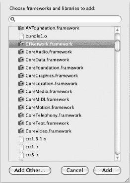

**图 6–8.** *向 Super Checkout 添加框架*

链接构建阶段应如 图 6–9 所示。

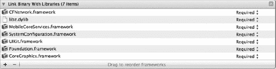

**图 6–9.** *最终链接的库列表*

现在，构建目标，并确保没有编译错误。


#### 在超级结账中实现 ASI

将 HTTP 请求代码抽象到其自身的类中的一个巨大好处是，能够更改请求代码的外观，而无需进行任何其他更改。我们将保持启动请求的模块与委托之间的契约不变，并彻底重构幕后代码。

准备好了吗？我们开始吧！

打开 `SuperCheckoutAPIEngine.m`，并将 `#import` 部分更新为代码清单 6-1 所示的内容。

**代码清单 6-1.** *为我们的 API 引擎添加几个导入*

```
#import "SuperCheckoutAPIEngine.h"
#import "SuperCheckoutRequestTypes.h"
#import "SCJSONParser.h"
#import "Product.h"
#import "ASIHTTPRequest.h"
#import "NSString+UUID.h"
```

接下来，添加代码清单 6-2 中的宏。宏非常适合集中管理特定值，并且无需常量。

**代码清单 6-2.** *为我们的 API 引擎添加宏*

```
#define REQUEST_TYPE            @"requestType"
#define RESPONSE_TYPE           @"responseType"
#define REQUEST_ID              @"requestIdentifier"
```

现在，我们将修改类扩展。类扩展是向类添加私有方法的好方法。将其修改为代码清单 6-3 所示的内容。

**代码清单 6-3**. *我们修改后的类扩展*

```
@interface SuperCheckoutAPIEngine ()

// 工具方法
- (NSString *)_queryStringWithBase:(NSString *)base parameters:(NSDictionary *)params prefixed:(BOOL)prefixed;
- (NSString *)_encodeString:(NSString *)string;

// 连接/请求方法
- (NSString *)_sendRequest:(NSURL *)theURL
                  withRequestType:(SuperCheckoutRequestType)requestType  
                         responseType:(SuperCheckoutResponseType)responseType;
- (NSString *)_sendRequestWithMethod:(NSString *)method
                                path:(NSString *)path
       queryParameters:(NSDictionary *)params
                                body:(NSString *)body
                  requestType:(SuperCheckoutRequestType)requestType
               responseType:(SuperCheckoutResponseType)responseType;

- (NSString *)_sendImageRequestWithURL:(NSString *)imageURL;
- (NSURL *)_baseURLWithMethod:(NSString *)method
                                                         path:(NSString *)path
                                         requestType:(SuperCheckoutRequestType)requestType
                                queryParameters:(NSDictionary *)params;

// 解析方法
- (void)_parseDataForConnection:(ASIHTTPRequest *)connection;

// 委托方法
- (BOOL) _isValidDelegateForSelector:(SEL)selector;

@end
```

接下来需要注意的行是 `// Connection/Request methods`。将该行之后直到包含 `#pragma mark - API Methods` 的那一行之间的代码替换为代码清单 6-4 中的代码。

**代码清单 6-4.** *连接/请求管理的实现*

```
// 连接/请求方法
- (NSString*)_sendRequest:(NSURL *)theURL
                  withRequestType:(SuperCheckoutRequestType)requestType
                         responseType:(SuperCheckoutResponseType)responseType
{
        ASIHTTPRequest *request = [ASIHTTPRequest requestWithURL:theURL];
    [request setDelegate:self];
    NSString *requestIdentifier = [NSString stringWithNewUUID];
    [request setUserInfo:[NSDictionary dictionaryWithObjectsAndKeys:
                          [NSNumber numberWithInt:requestType], REQUEST_TYPE,
                          [NSNumber numberWithInt:responseType], RESPONSE_TYPE,
                          requestIdentifier, REQUEST_ID,
                          nil]];

    if (request == nil) {
        return nil;
    }

        if ([self _isValidDelegateForSelector:@selector(connectionStarted:)])
                [delegate connectionStarted:[[request requestID] stringValue]];

    [request startAsynchronous];
    return requestIdentifier;
}
- (NSString *)_sendRequestWithMethod:(NSString *)method
                                path:(NSString *)path
                     queryParameters:(NSDictionary *)params
                                body:(NSString *)body
                         requestType:(SuperCheckoutRequestType)requestType
                        responseType:(SuperCheckoutResponseType)responseType {
        NSURL *theUrl = [self _baseURLWithMethod:method
path:path

requestType:requestType
                                                             queryParameters:params];

    return [self _sendRequest:theUrl
                    withRequestType:requestType
                           responseType:responseType];
}

- (NSString *)_sendImageRequestWithURL:(NSString *)imageURL {
        NSURL *theURL = [NSURL URLWithString:imageURL];

        return [self _sendRequest:theURL
                        withRequestType:SuperCheckoutProductImage
                               responseType:SuperCheckoutImage];
}

- (NSURL *)_baseURLWithMethod:(NSString *)method
                         path:(NSString *)path
                  requestType:(SuperCheckoutRequestType)requestType
              queryParameters:(NSDictionary *)params
{
    // 构建合适的 URL 字符串。
    NSString *fullPath = [path stringByAddingPercentEscapesUsingEncoding:NSNonLossyASCIIStringEncoding];
    if (params && ![method isEqualToString:HTTP_POST_METHOD]) {
        fullPath = [self _queryStringWithBase:fullPath parameters:params prefixed:YES];
    }

    NSString *connectionType = @"http";

    NSString *urlString = nil;
    if(requestType == SuperCheckoutProductImage) {
        urlString = path;
    } else {
        urlString = [NSString stringWithFormat:@"%@://%@/%@",
                     connectionType,
                     BASE_URL, fullPath];
    }

    NSURL *finalURL = [NSURL URLWithString:urlString];
    return finalURL;
}

// 解析方法
- (void)_parseDataForConnection:(ASIHTTPRequest *)request {
        NSData *jsonData = [[[request responseData] copy] autorelease];
    NSString *identifier = [[[[request requestID] stringValue] copy] autorelease];

        SuperCheckoutRequestType requestType =
                                                               [[[request userInfo] objectForKey:REQUEST_TYPE] intValue];
    SuperCheckoutResponseType responseType =
                                                                [[[request userInfo] objectForKey:RESPONSE_TYPE] intValue];

    switch ([[[request userInfo] objectForKey:RESPONSE_TYPE] intValue]) {
                case SuperCheckoutProductList:
                case SuperCheckoutCartContents:
                        [SCJSONParser parserWithJSON:jsonData
                                                                                     delegate:self connectionIdentifier:identifier
                                                             requestType:requestType
                                                          responseType:responseType URL:nil];
                        break;

                default:
                break;
        }
}

// 委托方法
- (BOOL) _isValidDelegateForSelector:(SEL)selector
{
        return ((delegate != nil) && [delegate respondsToSelector:selector]);
}

#pragma mark ASIHTTPRequestDelegate 方法
- (void)requestFinished:(ASIHTTPRequest *)request {
    NSString *requestIdentifier = [[request userInfo] objectForKey:REQUEST_ID];
    if ([request responseStatusCode] >= 400) {
        // 假设失败，并报告给委托。
        NSData *receivedData = [request responseData];
        NSString *body = [receivedData length] ? [NSString stringWithUTF8String:[receivedData bytes]] : @"";
```


```objective-c
NSDictionary *userInfo = [NSDictionary dictionaryWithObjectsAndKeys:
                                  [request responseString], @"response",
                                  body, @"body",
                                  nil];
NSError *error = [NSError errorWithDomain:@"HTTP" code:[request responseStatusCode]
userInfo:userInfo];
                if ([self
_isValidDelegateForSelector:@selector(requestFailed:withError:)])
                        [delegate requestFailed:requestIdentifier withError:error];

        // 销毁连接。

                NSString *connectionIdentifier = requestIdentifier;
                [connections removeObjectForKey:connectionIdentifier];
                if ([self _
isValidDelegateForSelector:@selector(connectionFinished:)])
                        [delegate connectionFinished:connectionIdentifier];
        return;
    }

    NSString *connID = nil;
        SuperCheckoutResponseType responseType = 0;
        connID = requestIdentifier;
        responseType = [[[request userInfo] objectForKey:RESPONSE_TYPE] intValue];

    // 通知代理。
        [delegate requestSucceeded:connID];

    NSData *receivedData = [request responseData];
    if (receivedData) {
        if (responseType == SuperCheckoutImage) {
                        // 从数据创建图片。
            UIImage *image = [[[UIImage alloc] initWithData:receivedData] autorelease];

            // 通知代理。
                        if ([self
_isValidDelegateForSelector:@selector(imageReceived:forRequest:)])
                                [delegate imageReceived:image
forRequest:requestIdentifier];
        } else {
            // 解析来自连接的数据（XML 或 JSON。）
            [self _parseDataForConnection:request];
        }
    }

    // 释放连接。
    [connections removeObjectForKey:connID];
        if ([self _isValidDelegateForSelector:@selector(connectionFinished:)])
                [delegate connectionFinished:connID];
}

- (void)requestFailed:(ASIHTTPRequest *)request {
    NSString *requestIdentifier = [[request userInfo] objectForKey:REQUEST_ID];;

    // 通知代理。
        if ([self _isValidDelegateForSelector:@selector(requestFailed:withError:)]){
                [delegate requestFailed:requestIdentifier
                      withError:[request error]];
        }

    // 释放连接。
    [connections removeObjectForKey:requestIdentifier];
        if ([self _isValidDelegateForSelector:@selector(connectionFinished:)])
                [delegate connectionFinished:requestIdentifier];
}

#pragma mark - SCJSONParserDelegate 方法
-(void)parsingSucceededForRequest:(NSString *)identifier

ofResponseType:(SuperCheckoutResponseType)responseType
                                            parsedObjects:(NSDictionary *)parsedObject {
    switch (responseType) {
        case SuperCheckoutProductList:
            if([self
_isValidDelegateForSelector:@selector(productListReceived:forRequest:)]) {
                NSArray *result = [parsedObject objectForKey:@"result"];
                NSMutableArray *newResult =
                                                   [NSMutableArray arrayWithCapacity:[result count]];

                for(NSDictionary *obj in result) {
                    Product *prod = [[Product alloc] initWithDictionary:obj];

                    [newResult addObject:prod];

                    [prod release];
                }

                [delegate productListReceived:[NSArray arrayWithArray:newResult]
                                                      forRequest:identifier];
            }
            break;
        case SuperCheckoutCartContents:
            if([self
_isValidDelegateForSelector:@selector(cartContentsReceived:forRequest:)]) {
                id cart = [parsedObject objectForKey:@"result"];
                if([cart isKindOfClass:[NSNull class]]) {
                    cart = nil;
                }
                [delegate cartContentsReceived:cart forRequest:identifier];
            }

        default:
            break;
    }
}
```

我们现在已经成功地将网络代码替换为 `ASIHTTPRequest`。想想看，如果要去所有视图控制器中做这个更新，那会多么麻烦！

让我们看一下刚刚实现的一小段代码。

在**清单 6–5** 中，你会看到我们创建了一个 `ASIHTTPRequest`，设置了代理，并添加了一个随请求传递的字典。这个字典包含了请求标识符（以保持与之前 API 的向后兼容性）、请求类型和响应类型。`ASIHTTPRequest` 会自动处理 cookie，所以我们无需担心它们。

关于线程方面，`ASIHTTPRequest` 是 `NSOperation` 的子类，`startAsynchronous` 方法会将其添加到一个本地的 `NSOperationQueue` 中，该队列会创建新线程，而代理回调则在主线程上执行。这也意味着，如果发现有必要，我们的 `SuperCheckoutAPIEngine` 类可以管理自己的 `NSOperationQueue`，以控制同时发生的请求数量。

**清单 6–5.** *创建实际请求的代码*

```
   ASIHTTPRequest *request = [ASIHTTPRequest requestWithURL:theURL];
    [request setDelegate:self];
    NSString *requestIdentifier = [NSString stringWithNewUUID];
    [request setUserInfo:[NSDictionary dictionaryWithObjectsAndKeys:
                          [NSNumber numberWithInt:requestType], REQUEST_TYPE,
                          [NSNumber numberWithInt:responseType], RESPONSE_TYPE,
                          requestIdentifier, REQUEST_ID,
                          nil]];

    if (request == nil) {
        return nil;
    }

    if ([self _isValidDelegateForSelector:@selector(connectionStarted:)])
                [delegate connectionStarted:[[request requestID] stringValue]];

    [request startAsynchronous];
    return requestIdentifier;
```

提交这些更改，然后我们将继续设计和调试服务端代码。

在编写这段代码时，`ASIHTTPRequest` 得到了良好的支持，但此后支持已经停止。由于我们将应用程序架构设计为具有清晰的责任分离，我们可以随意替换这些组件，而消费代码几乎无需更改。还有一些其他流行的网络库，并且我们刚刚实现的概念对于这些库来说都是相同的。这些库包括：

*   AFNetworking ([`https://github.com/gowalla/AFNetworking`](https://github.com/gowalla/AFNetworking))
*   LRResty ([`http://projects.lukeredpath.co.uk/resty/`](http://projects.lukeredpath.co.uk/resty/))
*   NSURLConnection（原始方法，且得到 Apple 的良好支持）

### 探索服务器 API

对于 Super Checkout，我们创建了自己的服务端 API。本书并非关于开发服务端 API，而是讨论设计服务端 API 时的一些良好实践，以便在使用这些服务时更轻松。我们还会介绍一些定位 bug 根源的技巧。


### 为消费而设计

设计服务端 API 与设计 iOS 应用完全不同，需要考虑更多因素，其中对消费者的关怀是核心。对于 Super Checkout，我们决定采用一个非常简洁的 API，它依赖 `GET` 请求和查询字符串参数。通信介质采用轻量级的 JSON。服务器管理着会话和当前购物车。

就数据模型而言，服务器始终返回一个包装对象。图 6-10 展示了这个包装对象的样子。

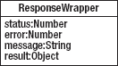

**图 6-10.** *响应包装器的定义*

这个对象提供了我们了解响应所需的一切信息。如果调用成功（即 HTTP 状态码为 200）但数据存在问题，我们也能知道发生了什么。如果你留意到，Super Checkout 假定每次调用都是成功的。这是应用程序的一个问题，日后可能会给我们带来麻烦。

那么，我们如何处理这些错误呢？让我们回到代码中一探究竟。

打开 `SuperCheckoutAPIEngine.m`，找到 `parsingSucceededForRequest:ofResponseType:parsedObjects:` 方法的实现。这个方法是解析器的回调。由于所有响应都具有相同的包装器，我们将在此处处理错误。

首先，我们需要添加一些错误常量和一个错误域，用于稍后创建的 `NSError` 对象。在文件顶部，编译器宏定义下方，添加以下代码：

```
NSString* const APIErrorDomain = @"SuperCheckoutAPIErrorDomain";
```

```
typedef enum SuperCheckoutAPIErrorType {
    APIErrorType
} SuperCheckoutAPIErrorType;
```

现在，回到 `parsingSucceededForRequest:ofResponseType:parsedObjects:` 方法，在 `switch` 语句上方添加以下代码：

```
if([[parsedObject objectForKey:@"status"] intValue] != 0) {
    NSError *error = [NSError errorWithDomain:APIErrorDomain
                                        code:APIErrorType
                                    userInfo:
                        [NSDictionary dictionaryWithObjectsAndKeys:
                        [parsedObject objectForKey:@"message"],
                        NSLocalizedDescriptionKey,nil]];

    if ([self _isValidDelegateForSelector:@selector(requestFailed:withError:)]){
        [delegate requestFailed:identifier withError:error];
    }

    return;
}
```

现在我们已经处理了错误，将错误连同（希望是）服务器返回的有意义消息一起发送给视图控制器。

### 使用调试工具

许多次在开发消费服务的客户端引擎时，服务器返回的数据并非我所预期。我没有在源码中到处添加 `NSLog` 语句，而是使用了一些便捷工具来验证发送给服务器的内容和返回的内容。当服务端组件正在开发而客户端代码行为异常时，这些工具极大地加速了调试过程。

两个不同的工具分别用于完成不同的任务。第一个工具用于测试服务的输入和输出，以检查服务是否正常工作。它叫做 RESTClient，是 Firefox 的一个插件。可以在 [`addons.mozilla.org/en-US/firefox/addon/restclient/`](https://addons.mozilla.org/en-US/firefox/addon/restclient/) 找到它。图 6-11 展示了在访问 Super Checkout 的主要服务之一后该客户端的视图。

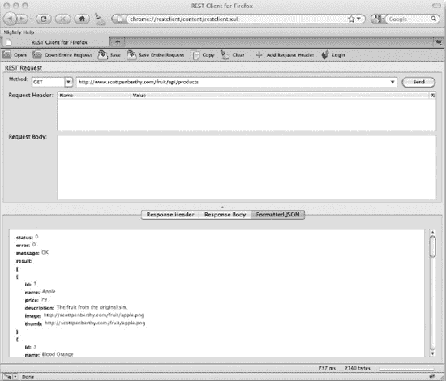

**图 6-11.** *适用于 Firefox 的 RESTClient 是检查服务响应的优秀工具*

如图 6-11 所示，界面相当简单。它允许你选择请求方法、输入基础 URL、填入请求头以及添加请求体。点击“发送”，请求便会被发出，并返回响应头和响应体。响应体右侧的标签会根据请求类型进行调整。在图 6-11 的示例中，RESTClient 格式化了服务返回的 JSON 字符串。

当你只需要一个快速工具来检查请求响应或调试服务器问题时，这是一个很棒的工具。另外一些运行在命令行中的强大工具虽然更强大，但此工具足以完成任务。关键在于找到一个可靠、快捷的工具，能够快速测试最终服务，确保在你排查问题或测试应用的服务器组件时，服务能按预期工作。

第二个工具无疑是两者中更强大的，它应当在每个开发者的工具箱中占有一席之地。这个应用程序叫做 Charles，是一个 Web 代理。可以在 [`www.charlesproxy.com/`](http://www.charlesproxy.com/) 找到它。Charles 是一款商业应用，但提供免费试用。这个应用程序会监控你机器上的所有 Web 流量（在开启录制器时）并记录日志。图 6-12 展示了 Charles 记录获取产品、将产品添加到购物车以及结账时的流量。

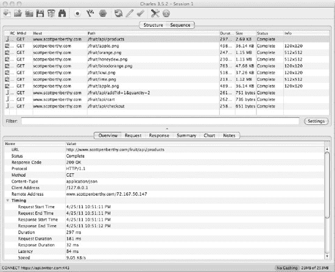

**图 6-12.** *Charles 执行其流量记录功能*

Charles 能提供关于请求和响应的更多信息。它提供的信息量与 RESTClient 相同，但这些请求来自应用程序本身。这些信息可用于查看从设备发出的请求的格式是否正确，并确保响应的格式也正确无误。

**注意：** Charles 不会作为设备的代理。任何需要运行的测试都必须通过 iOS 模拟器运行。

#### 使用网络链路调节器模拟慢速网络

在模拟器中进行测试时，通常使用的是一条相当大且大部分时间都可靠的网络连接。但问题在于，设备实际通信的网络通常速度较慢且极不可靠。在洁净的开发环境中复现真实场景是一项相当棘手的任务。幸运的是，开发者已经解决了这个问题。

用于限制带宽的工具叫做网络链路调节器，它随 Xcode 4.2 for OS 10.7 (Lion) 一起提供。其偏好设置面板可以在 `/Developer/Applications/Utilities/Network\ Link\ Conditioner` 中找到。打开它，它会自动安装到系统偏好设置中。网络链路调节器是一个偏好设置面板，允许你设置要限制的端口、要限制的主机、延迟以及限速上限。限制速度的预设值包括 Edge 和 3G 的常见速度。图 6-13 展示了网络链路调节器正在对我们的服务进行限速。

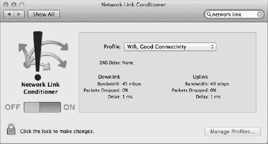

**图 6-13.** *系统偏好设置中的网络链路需要解锁并启用。*

鉴于本章全部内容都与网络相关，并且大多数用户设备的数据套餐已不再无限量，使用模拟器进行测试就显得非常合理。通过 Speedlimit，我们可以很好地了解应用程序在实际环境中的性能表现。这对于执行大量请求的应用程序至关重要。理解应用程序在网络状况不佳时的表现，将有助于我们在缓存策略方面做出决策。

要开启链路调节器，首先需要点击偏好设置面板底部的锁图标解锁钥匙串。然后选择要模拟的适当配置文件，并将开关拨到“开”的位置。这将降低整个机器的网络速度，因此如果你正在其他应用中执行网络操作，你会看到网络性能下降。


#### 控制缓存

要让应用在慢速网络环境中表现出高性能，最好的方式是什么？那就是存储请求的响应结果。**缓存**。缓存之所以强大，是因为应用能快速获取所需数据，用户无需等待。既然缓存这么棒，为什么我们不把所有内容都缓存起来呢？第一个原因是互联网上大部分数据都是**实时**的。如果所有内容都被缓存，应用将严重滞后于最新信息，用户将被迫频繁刷新。

面对这种矛盾，你可能在想：“缓存方案的最佳方法是什么？”

问得好！答案相当复杂。正如我之前提到的，缓存方法一直是学术论文的研究重点。我们不会深入探讨缓存算法的工作原理或哪种情况最适合使用哪种算法——那将是另一本书的内容。相反，我们将了解如何在 Cocoa 或其他框架中使用什么工具，来为 Super Checkout 实现合适的缓存级别，并希望以此为你应用的缓存方案开个好头。

##### 开始之前

在深入代码之前，我们先花点时间讨论一下缓存的本质，以及什么样的数据适合缓存。在我们讨论的缓存语境中，缓存是一个能极大提高数据检索速度的临时存储。其核心理念是尽可能多地将信息存储在本地，只在需要时才从服务器获取。

我们这里的基本思路是先开发一个不带缓存的应用。通过避免过早优化，我们可以确保应用在开始优化网络层之前功能完备且相对无 Bug。这样一来，任何引入的 Bug 都能被轻松追踪。

##### 决定缓存什么

我们如何决定缓存什么？答案可以通过两种基本方法之一找到。第一种方法是“猜测并测试”。这种方法可能会产生一些积极效果，但不够科学，也可能引入一些问题。第二种方法基本上是对所请求数据进行统计分析，包括从应用中收集数据并进行分析。

要捕获数据，我们可以使用 Charles 来收集信息，然后直接在 Charles 中分析数据，或将请求信息导出为其他格式在你选择的应用程序中分析。对于这个示例，我们将使用一个相对较小的样本量，并通过一次完整的应用操作流程——获取产品、查看产品、将产品加入购物车，最后完成结账——来生成数据。图 6-14 显示了我们将要查看的数据集。

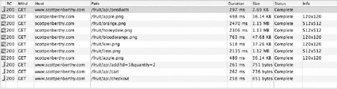

**图 6-14.** *来自 Charles 的数据集*

我们是如何获得这些数据的？启动 Charles，确保启用了 Mac OS X 代理：前往 **Proxy**  **Mac OS X Proxy**，并确认它处于选中状态。接下来点击工具栏中的录制按钮，瞧，你就在捕获 HTTP 数据了。在数据捕获过程中，你很可能会注意到有其他条目弹出。

查看表格，首先映入眼帘的是请求了两种类型的数据。第一类是 JSON 编码的数据，第二类是图片。响应大小也明显不同。记住这些信息，我们还需要查看请求的使用模式。

产品列表响应包含产品信息，包括价格。由于价格可能波动，这个服务调用并不适合缓存。我们不想向用户显示错误的价格。不过，如果返回的数据集很大，我们可能需要修改服务器代码，返回分页数据集，并尽量保持数据规模较小。

在这个案例中，最适合缓存的数据是图片。当我们优化产品列表的滚动性能时，我们实现了一个非常基础的内存缓存。这个方案并非最佳，因为视图控制器负责处理缓存，却没有考虑内存使用情况，也没有响应内存警告。`APIEngine` 应该负责缓存。我们希望采用双层缓存策略：内存缓存和磁盘缓存。当内存不足时，可以清除内存缓存，磁盘缓存将接管并缓存图片约一周左右。

**注意：** 这些决策完全基于应用的实际使用方式。在真实场景中，会进行用户测试，这有助于确定合适的缓存策略。


##### NSCache

关于缓存我们已经讨论得够多了！现在让我们深入代码，了解有哪些缓存机制以及如何使用它们。

我们将使用的第一个 API 是 `NSCache`。`NSCache` 内置于 Cocoa Touch 框架中，并在 iOS 4.0 中引入。`NSCache` 本质上是一个内存存储，类似于我们在 Super Checkout 中使用的机制。`NSCache` 是一个键值存储，并且内置了当缓存填满或系统需要更多内存时移除过期项目的机制。

这将是我们缓存策略的第一道防线。作为本次重构的一部分，我们将把缓存逻辑从视图控制器中移出，交由 `APIEngine` 来处理。这将允许 `APIEngine` 在必要时缓存数据，而所有使用它的视图控制器都可以清理缓存。

那么该如何实现呢？很简单！打开 `SuperCheckoutAPIEngine.m`，然后进行以下更改。

在类扩展中，以粗体添加清单 6–6 中的方法声明。

**清单 6–6.** *向类扩展添加图片缓存方法*

`- (BOOL) _isValidDelegateForSelector:(SEL)selector;`

**`- (NSCache *) imageCache;`**

`@end`

在实现文件中，在 `#pragma mark – API Methods` 行的正上方添加清单 6–7。

**清单 6–7.** *实现图片缓存*

`- (NSCache *) imageCache {`
`    static NSCache *imageCache = nil;`

`    if(imageCache == nil) {`
`        imageCache = [[NSCache alloc] init];`
`    }`

`    return imageCache;`
`}`

这为引擎添加了一个静态的 `NSCache` 对象。接下来，我们将添加代码来使用这个缓存。

在 `SuperCheckoutAPIEngine.h` 中，添加以下两个方法声明：

`-(void) clearCache;`
`-(UIImage *) cachedImageForProduct:(NSString *)stringURL;`

回到 `SuperCheckoutAPIEngine.m`，在 `checkout` 方法之后添加这些方法的实现：

`-(void) clearCache {`
`    [[self imageCache] removeAllObjects];`
`}`

`-(UIImage *) cachedImageForProduct:(NSString *)stringURL {`
`    return [[self imageCache] objectForKey:stringURL];`
`}`

下一步是使用这个缓存。有两个地方需要修改以启用缓存。第一个是在我们从请求获得响应，并准备将图片发送回委托时。在 `requestFinished:` 中找到以下这行代码，它解码数据并创建 `UIImage`：

`UIImage *image = [[[UIImage alloc] initWithData:receivedData] autorelease];`

在这行代码下方，添加以下内容：

`[[self imageCache] setObject:image forKey:[[request url] absoluteString]];`

现在还有一处需要修改引擎。在 `_sendImageRequestWithURL:` 中，用以下代码块替换其实现：

`- (NSString *)_sendImageRequestWithURL:(NSString *)imageURL {`
`    NSURL *theURL = [NSURL URLWithString:imageURL];`

`    UIImage *image = [[self imageCache] objectForKey:[theURL absoluteString]];`

`    if(image) {`
`        NSString *requestIdentifier = [NSString stringWithNewUUID];`

`        if ([self _isValidDelegateForSelector:@selector(imageReceived:forRequest:)]) {`
`            dispatch_time_t popTime = dispatch_time(DISPATCH_TIME_NOW, 1ull);`
`            dispatch_after(popTime, dispatch_get_main_queue(), ^(void){`
`                [delegate imageReceived:image forRequest:requestIdentifier];`
`            });`
`        }`

`        return requestIdentifier;`
`    }`

`    return [self _sendRequest:theURL`
`                    withRequestType:SuperCheckoutProductImage`
`                           responseType:SuperCheckoutImage];`
`}`

在继续进行其他修改之前，让我们快速回顾一下刚刚完成的工作。首先，我们创建了缓存对象。我们将缓存设为静态，因此引擎的所有实例将共享同一个缓存。由于 Super Checkout 是一个小型应用，并且我们只缓存产品图片，这种方法是可行的。如果需要处理更多内容，可能需要一个更健壮的、能管理不同级别内存缓存的系统，但目前我们只使用一个主缓存，并在需要时清空它。

接下来的修改是允许视图控制器请求缓存的图片。如果图片不在缓存中，此方法将返回 `nil`。由视图控制器自行判断这种情况并请求图片。

最后，在 `_sendImageRequestWithURL:` 中，我们检查缓存中是否有图片，并模拟一个完整的请求过程。为此，我们创建请求标识符，然后将一个延迟执行的 block 派发到 Grand Central Dispatch，然后方法返回。这使得委托回调几乎是即时发生的。

现在，我们准备好进行其余的修改。这些修改包括更新 `ProductCell`，让它自己管理图片，以及让 `Super_CheckoutViewController` 利用 `APIEngine` 中的新 API。打开 `ProductCell.h`，添加以下实例变量和属性：

`UIImage *productImage;`
`@property (nonatomic, retain) UIImage *productImage;`

由于我们现在直接在单元格中处理图片，可以移除 `productInformation` 设置方法中的键值观察代码。打开 `ProductCell.m`，像这样添加新的设置方法：

`-(void) setProductInformation:(Product *)newProductInformation {`
`    Product *oldInfo = productInformation;`
`    productInformation = [newProductInformation retain];`
`    [oldInfo release];`
`    [self setNeedsDisplay];`
`}`

接下来，通过添加以下行来合成 `productImage` 属性：

`@synthesize productImage;`

然后，添加以下代码：

`- (void) setProductImage:(UIImage *)theProductImage {`
`    UIImage *oldImage = productImage;`
`    productImage = [theProductImage retain];`
`    [oldImage release];`

`    [self setNeedsDisplay];`
`}`

`- (void) prepareForReuse {`
`    [super prepareForReuse];`

`    [self setProductImage:nil];`
`}`

在 `drawCellView:` 中，修改这一行：

`CGImageRef prodImage = [[productInformation productImage] CGImage];`

使其变成这样：

`CGImageRef prodImage = [[self productImage] CGImage];`

最后，在 `dealloc` 方法中释放 `productImage` 实例变量，添加：

`[productImage release];`

接下来，我们想为 `UIImage` 创建一个类别，添加一个返回自身缩放版本的方法。为此，转到 **File**  **New**  **New File**，在 Cocoa Touch 下选择 Objective-C category。将类别命名为 **Resize**，并创建在 `UIImage` 上（参见图 6–15）。点击 Next，将文件保存在项目中，然后点击 Create。

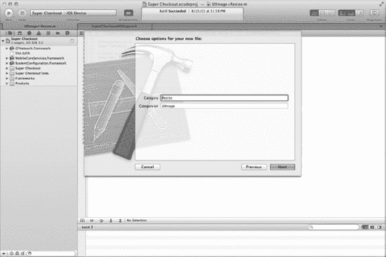

**图 6–15.** *Xcode 使得创建类别变得超级简单！*

创建新类别后，打开新创建的 `UIImage+Resize.h` 文件，并将此方法添加到头文件中：

`- (UIImage*) resizedImageWithSize:(CGSize)size;`

接下来，切换到实现文件，并将清单 6–8 中的实现添加到类别中。创建缩放后的 UIImage 的实现非常实用。

**清单 6–8.** *创建缩放后的 UIImage*

`- (UIImage*) resizedImageWithSize:(CGSize)size {`
`    UIGraphicsBeginImageContext(size);`

`    [self drawInRect:CGRectMake(0.0f, 0.0f, size.width, size.height)];`

`    // An autoreleased image`
`    UIImage *newImage = UIGraphicsGetImageFromCurrentImageContext();`

`    UIGraphicsEndImageContext();`

`    return newImage;`
`}`


### 排版后内容

分类完成后，打开 `Super_CheckoutViewController.m`。我们只需要修改此文件中的两个方法。在 `tableView:cellForRowAtIndexPath:` 中，将其更新为如下所示：

```
- (UITableViewCell *)tableView:(UITableView *)tableView
               cellForRowAtIndexPath:(NSIndexPath *)indexPath {
    ProductCell *cell = (ProductCell *)[tableView dequeueReusableCellWithIdentifier:
                                                               [ProductCell  reuseIdentifier]];

    if(cell == nil) {
        cell = [[[ProductCell alloc] initWithStyle:UITableViewCellStyleDefault
                                        reuseIdentifier:[ProductCell reuseIdentifier]] autorelease];
    }
    Product *item = (Product *)[inventory objectAtIndex:[indexPath row]];

    [cell setProductInformation:item];
    [cell setAccessoryType:UITableViewCellAccessoryDisclosureIndicator];

    //[self setProductCell:nil];

    //向单元格获取图片
    UIImage *image = [apiEngine cachedImageForProduct:[item thumb]];
    if(image == nil) {
        if (self.tableView.dragging == NO && self.tableView.decelerating == NO) {
            NSString *requestId = [apiEngine getImageForProduct:[item thumb]];

            [imageIndexes setObject:[NSNumber numberWithInt:[indexPath row]]
                                               forKey:requestId];
        }
    } else {
        [cell setProductImage:image];
    }

    return cell;
}
```

将 `imageReceived:forRequest:` 更新为如下所示：

```
-(void) imageReceived:(UIImage *)image forRequest:(NSString *)connectionIdentifier {
    NSIndexPath *indexPath =
              [NSIndexPath indexPathForRow:[[imageIndexes objectForKey:connectionIdentifier] intValue]
                                                           inSection:0];
    ProductCell *prod = (ProductCell *)[[self tableView] cellForRowAtIndexPath:indexPath];

    [prod setProductImage:[image resizedImageWithSize:CGSizeMake(64.0, 64.0)]];

    [imageIndexes removeObjectForKey:connectionIdentifier];
}
```

最后，在 `didReceiveMemoryWarning` 中添加以下这一行：

`[apiEngine clearCache];`

现在，API 引擎创建了一个简单的内存缓存，产品列表视图充分利用了它。不过，产品详情视图无需做任何更改。这是因为 API 引擎在发出请求之前会先检查缓存。简单而智能的缓存解决方案通常会将缓存细节对大多数视图控制器隐藏起来。

由于我们两层方法的第一层已完成，接下来看看我们的磁盘缓存方案。

### 实现我们的磁盘缓存方案

`ASIHTTPRequest` 团队为我们提供了缓存方案的第二层。他们创建了一个名为 `ASIDownloadCache` 的类。这个类是 `ASICacheDelegate` 协议的默认实现。如果你有自己的磁盘缓存系统，只需遵循该协议，就能将该实现与 `ASIHTTPRequest` 关联起来。

对于 Super Checkout，我们将使用项目中自带的默认实现。要实现这些更改，我们只需编辑 `SuperCheckoutAPIEngine.m` 源文件。打开它，在导入语句中添加 `#import "ASIDownloadCache.h"`。然后，将类扩展接口修改为如清单 6–9 所示。

**清单 6–9.** *修改类扩展以向其添加缓存控制*

```
// Utility methods
- (NSString *)_queryStringWithBase:(NSString *)base
                                               parameters:(NSDictionary *)params
                                                     prefixed:(BOOL)prefixed;
- (NSString *)_encodeString:(NSString *)string;

// Connection/Request methods

- (NSString *)_sendRequest:(NSURL *)theURL
withRequestType:(SuperCheckoutRequestType)requestType
responseType:(SuperCheckoutResponseType)responseType
cache:(BOOL)cache;
- (NSString *)_sendRequestWithMethod:(NSString *)method
                                path:(NSString *)path
                     queryParameters:(NSDictionary *)params
                                body:(NSString *)body
                         requestType:(SuperCheckoutRequestType)requestType
                        responseType:(SuperCheckoutResponseType)responseType;

- (NSString *)_sendImageRequestWithURL:(NSString *)imageURL;
- (NSURL *)_baseURLWithMethod:(NSString *)method
                         path:(NSString *)path
                  requestType:(SuperCheckoutRequestType)requestType
              queryParameters:(NSDictionary *)params;

// Parsing methods
- (void)_parseDataForConnection:(ASIHTTPRequest *)connection;

// Delegate methods
- (BOOL) _isValidDelegateForSelector:(SEL)selector;

- (NSCache *) imageCache;
```

这样，我们就可以控制哪些请求会被缓存，哪些不会。

现在，在实现部分，将我们刚修改的签名更新以匹配声明。接下来，在 `[request setDelegate:self]` 之后添加以下代码块：

```
[request setDelegate:self];

if(cache) {
[request setDownloadCache:[ASIDownloadCache sharedCache]];
[request setCachePolicy:
ASIAskServerIfModifiedCachePolicy|ASIFallbackToCacheIfLoadFailsCachePolicy];
[request setCacheStoragePolicy:ASICachePermanentlyCacheStoragePolicy];
}
NSString *requestIdentifier = [NSString stringWithNewUUID];    
```

接下来的更新是更改对更新后方法的调用。

在 `_sendRequestWithMethod:path:queryParameters:body:requestType:responseType:` 中，将返回值修改为向该方法传递 `NO`，如下所示：

```
return [self _sendRequest:theUrl
                withRequestType:requestType
                    responseType:responseType
                                        cache:NO];
```

并在 `_sendImageRequestWithURL:` 中将返回行修改为如下所示：

```
return [self _sendRequest:theURL
                withRequestType:SuperCheckoutProductImage
                    responseType:SuperCheckoutImage
                                    cache:YES];
```

对于这一层缓存，最重要的更新是：

`[request setDownloadCache:[ASIDownloadCache sharedCache]];`
`[request setCachePolicy:`
`ASIAskServerIfModifiedCachePolicy|ASIFallbackToCacheIfLoadFailsCachePolicy];`
`[request setCacheStoragePolicy:ASICachePermanentlyCacheStoragePolicy];`

我们这里所做的，是为请求设置下载缓存为 ASI 团队提供的默认缓存。然后，我们设置缓存策略，以便向服务器询问请求的资源是否已更改。如果资源未更改，请求将使用缓存。如果资源已更改，则加载新资源并缓存。如果请求失败，则会使用缓存（如果存在的话）。

最后一行是告诉缓存永久存储文件。默认情况下，缓存设置为设备上的缓存目录。当设备连接到 iTunes 时，此文件夹不会同步到电脑，并且 iOS 会在必要时清空该文件夹。

现在我们已经有了一个可靠的缓存方案，可以进入最终测试阶段——电池寿命管理。


### 认识电源管理

任何人在谈论移动设备时，最先问的问题之一就是：“电池续航怎么样？”作为移动开发者，我们有责任确保应用程序不仅节省内存，而且节省电量。这意味着我们必须编写高效的、没有内存泄漏的代码。

这种平衡很难实现，尤其是在设备功能更强大、内部集成的芯片类型更多的情况下。例如，iPhone 4 几乎为每个功能都配备了芯片：CPU、GPU、`802.11`、`GSM`/`CDMA`、加速度计、指南针和陀螺仪，这些主要芯片都集成在由电池供电的小巧机身内。由于我们可以访问各种不同类型的传感器和芯片，因此我们必须极其谨慎地选择使用哪些芯片以及使用多长时间。

#### 硬件部分

每台 iOS 设备至少有一种无线芯片。它们都有 Wi-Fi 无线芯片，而 iPhone/iPad 3G 则有可以在 3G 或 2G 网络上通信的`GSM`/`CDMA`无线芯片。这些无线芯片在通电时会消耗相当多的电量。操作系统会采用不同的技术在芯片不使用时将其关闭，因此，开发者有责任在绝对必要时才启动这些芯片。

使用 3G 芯片是耗尽设备电池最快的方式之一。而 3G 网络在数据传输完成后仍会让芯片保持满功率运行几秒钟，这更加剧了耗电问题。图 6–16 展示了应用程序在 3G 网络上快速连续进行短时突发传输时的电量消耗情况。

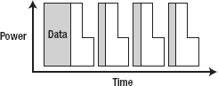

**图 6–16.** *在这个 3G 无线芯片的功率图中，请注意芯片在数据发送后会保持高功率状态数秒。*

另一种非 Wi-Fi 的无线芯片是 2G 无线芯片。这个芯片比 3G 芯片功耗低，但传输速度也更慢，因此在互联网上传输大块数据时可能效率较低。2G 芯片与 3G 芯片的不同之处在于，一旦数据传输完成，它会立即进入低功耗状态。图 6–17 显示了其功耗随时间的变化。

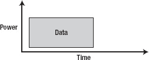

**图 6–17.** *2G 无线芯片的功率图*

最后，也是最高效的无线芯片是 Wi-Fi 无线芯片。与 2G 无线芯片类似，Wi-Fi 无线芯片在数据传输完成后会进入低功耗状态。由于 Wi-Fi 的数据传输速度极快，它是设备首选的无线数据传输方式。我们已经展示了 3G 和 2G 无线芯片的功耗随时间变化图，图 6–18 将完善这一系列图表。

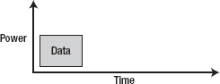

**图 6–18.** *Wi-Fi 芯片是设备上最快、最高效的芯片。*

管理数据通信对于保持良好的电池寿命至关重要。尽可能缩短传输会话时间，并让无线芯片尽可能多地处于空闲状态，可以减缓电池消耗，并让用户更满意。

设备上的其他芯片，包括 CPU、GPU、GPS 和运动传感器芯片，都有不同的功耗需求。CPU 和 GPU 分别负责运行代码和渲染屏幕内容。这意味着编写快速高效的代码可以降低 CPU 负载，而保持动画/视图相对简单则可以减少 GPU 的功耗。这些芯片始终处于活动状态，因此让它们保持空闲的唯一方式就是编写优秀的代码。而框架则会控制设备上的其他芯片。`Core Location` 控制 GPS，`Core Motion` 控制加速度计和陀螺仪。当我们转向更多由软件控制的设备时，我们需要讨论代码如何影响这些芯片，并最终影响电池寿命。

#### 编码技巧

iOS 是一个非常复杂的操作系统。它专为移动设备设计，并针对最大化电池寿命进行了优化，同时还能提供足够的性能来运行出色的应用程序！为了让我们的应用程序在 iOS 环境中成为“好市民”，有一些技巧可以确保我们的应用程序表现出色，同时不会过度消耗电池。

##### 网络通信

正如我们在上一节讨论的，无线芯片会消耗相当多的电量。然而，我们可以通过智能地请求数据来减少维持这些芯片运行的间接开销。由于大多数网络通信是通过 HTTP 进行的，这里真正需要牢记的就是内容大小和内容压缩。如果数据以 JSON 格式编码并使用 gzip 压缩，那么内容体积会很小，无线芯片就不会那么活跃。

网络通信的另一个好方法是将请求分组在一起。这会使无线芯片活跃时间稍长一些，但最终比频繁的小网络请求或长时间保持套接字打开要好得多。轮询也是一个坏主意。与其轮询，不如利用推送通知。这可以让无线芯片保持静默并消耗更少的电量。

至于寻找真正的性能瓶颈，可以使用 `Activity Monitor` 工具来跟踪网络使用情况。要找到 `Activity Monitor` 工具中的网络选项可能有点棘手。因此，请启动带有 `Activity Monitor` 工具的 Instruments，然后点击工具区域中的信息“i”按钮。这将调出如图 图 6–19 所示的界面。

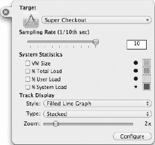

**图 6–19.** *显示默认选项未选中的工具配置面板*

请注意，在此示例中，复选框是未选中的。它们默认是选中的，但我们在查看处理器使用情况时不一定需要监视 CPU。在这个实例中我将它们取消了选中。要获取网络选项，请点击 `Configure` 按钮。配置面板会翻转过来，呈现出 图 6–20 所示的界面。

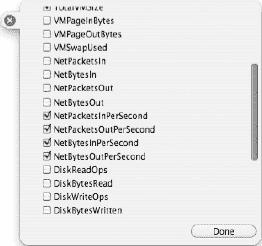

**图 6–20.** *工具配置面板，允许您为工具选择可见的传感器。*

选择与 图 6–20 中相同的复选框。点击 `Done`，并确保在信息面板中这些传感器已被勾选。点击原来显示“i”位置的“x”，然后从 `Target` 下拉菜单中选择 `Super Checkout` 目标。点击录制按钮开始录制数据。应用程序将启动，当发起网络请求时，您会看到网络图表出现峰值。随着应用程序缓存更多数据，您会发现随着您在应用程序中导航，网络请求变得不那么频繁。图 6–21 显示了所有图像被缓存后的一次运行结果。

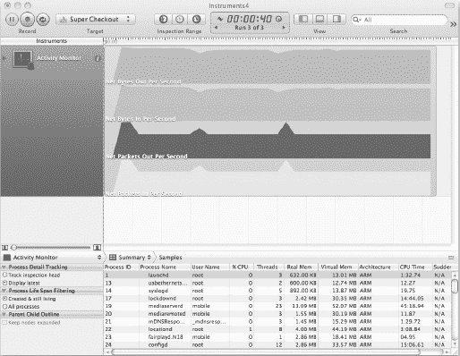

**图 6–21.** *将网络请求峰值保持在最低限度是保持无线芯片静默、节省更多电量的好方法。*


### 追踪用电量

现代 iOS 设备能够记录功耗信息，而 `Instruments` 为您提供了一种绝佳方式，用于查看设备的耗电情况以及哪些芯片消耗了最多电力。要启用此功能，首先需要让设备激活开发者模式。这会在“设置”应用中启用“开发者”选项。图 6–22 展示了这一部分。


**图 6–22.** *“设置”应用中的“开发者”设置，此时电量记录功能已关闭*

开启电量记录将启动一个新的记录会话。此会话会按组件和应用分别追踪耗电量。会话结束后，数据可以导入到 `Instruments` 中进行分析。

**注意：** 每次关闭记录功能时，电量记录的诊断信息都会被重置。当设备关机或电池耗尽时，记录功能会自动关闭。

为了全面了解您的应用在生态系统中的表现，以及它是否能与其他应用良好共存，一个不错的方法是开启电量记录，并正常使用设备一两个小时。之后回顾并查看各个进程在做什么，会非常有启发。

要导入收集到的数据，请创建一个新的 `Instruments` 会话，并选择“能耗诊断”（参见图 6–23）。


**图 6–23.** *选择“能耗诊断”工具模板*

现在，连接设备，然后转到 **文件**  **导入来自设备的能耗诊断**。图 6–24 展示了我运行了将近三小时的一个会话。


**图 6–24.** *来自设备电池诊断的一些真实数据*

在这个视图中我们看到了什么？首先，查看时间线的顶部。您会看到代表重大事件的标志，例如睡眠/唤醒，或者应用进入后台或被挂起。在记录电量使用情况时，在心里或实际记下这些笔记，将有助于在开始分析时回忆当时发生了什么。

`Instruments` 窗口中的每个层级都提供了不同类型的信息。“能耗”条显示了特定时刻使用了多少电量。随着每个组件消耗更多电力，该条会变高；反之，当芯片关闭时，该条会变矮。

“CPU 活动”监视器能很好地让您了解各进程在做什么。在“跳转栏”中，您可以选择“应用活动”或“CPU 活动”。在“应用活动”中，您可以看到哪些应用正在运行，以及它们何时切换到后台或被挂起。“CPU 活动”视图则让您了解处理器在哪些地方花费时间进行处理。您可以看到处理器的哪一部分在处理图形或音频。每个条代表一个刻度，范围从 1 到 20。图 6–25 展示了这种测量方式。这些数字实际上代表了一种计算，即：“如果 CPU 长时间保持这种状态，那么还剩多少电池续航。”


**图 6–25.** *CPU 活动参考图表*

“显示亮度”告诉您设备显示屏的状态。背光是耗电的，因此了解特定场景下屏幕的亮度会很有用。当图表为 0 时，表示屏幕已关闭。

“睡眠/唤醒”以开/关的视图形式向您展示设备何时被唤醒。当亮度为 0 且设备处于唤醒状态时，说明有某个程序正在进行后台处理。这很可能是 `邮件` 正在接收新消息，或者您可能会在“CPU 活动”视图中看到一些音频处理。

最后三个图表显示了无线通信模块的状态。

### 运用行业技巧

在进行功耗测试时，有一些很好的实验控制措施需要牢记。可以开启或关闭这些设置，以观察设备在多种情况下的表现。这些设置包括关闭 iOS 4 的功能，如邮件获取、推送通知和自动调暗。另一个好主意是测试各种无线模块的开启/关闭状态。同样值得注意的是，温度较低的环境会缩短电池续航。

在收集数据方面，性能测试和调优更像是一门科学。设置合适的实验控制措施，将有助于您在分析数据时精确地隔离出实际发生的情况。例如，如果您注意到应用花费过多时间与服务器通信，导致电量消耗过大，您可以修改应用与服务器通信的方式。如果您的应用有后台任务，可以考虑更改后台任务的编写方式，以潜在地缩短任务所需的时间。这可能涉及更改与服务器通信时数据的结构，或者更新任务使其运行时间尽可能短。归根结底，您最了解自己的应用，而每个 `Instrument` 都会向您展示特定于该应用的信息。有时，您发现的数据可能会相当令人惊讶和具有启发性。

### 总结

我们现在都是通信专家了，对吧？实际上，我们只是触及了优化网络代码和正确缓存策略的皮毛。我们在本章中采用的方法相当常见，但也是比较直接的方法。如果您发现您的应用不适合这种方案，那么有很多非常聪明的人，他们的全部工作就是研究缓存方法并尽可能地从系统中榨取每一丝性能。

这总结了本书的性能调优部分。从现在开始，我们将致力于优化将构建版本分发给 Beta 测试人员的工作流程，并自动化工作流程中的其他部分。性能调优是项艰巨的工作，但看到应用性能的提升，之前所做的每一次调整和多次测试运行都是值得的。希望您到目前为止享受了这一过程；更多有趣的内容还在后面的章节等着您。

## 第 7 章


