# 准备 Beta 版本！

现在，我们有了一个自认为可以发布的应用。许多开发者都曾因自认为应用固若金汤，结果发布后却发现一堆 bug 而受挫。通常，作为开发者，你只会测试特定的应用路径或测试用例。有时，需要一双（和双手！）新人的眼睛才能真正让应用经受考验。

这就是*Beta 测试*的用武之地。Beta 测试将应用发布给一小部分外部用户，他们被称为*测试人员*或*Beta 测试者*。目标是收集他们关于应用 Bug 的反馈。你需要找到有耐心的用户，他们愿意忍受应用（可能）出现的异常甚至充满 Bug 的行为。你最不希望看到的，就是一个愤怒的测试者在应用尚未发布前就四处吐槽。

当 Beta 测试人员使用应用时，如果应用崩溃，我们还需要捕获*崩溃报告*。如果你有精明的 Beta 测试者，当他们将设备同步到 `iTunes` 时，就能访问这些崩溃报告。还有其他几种选择，比如让应用通过电子邮件、发送到网络服务器，或发送到第三方服务（为我们分析崩溃报告）来传递崩溃数据。我们也会简要提及这些方法。

要将应用分发给 Beta 测试者，你需要通过 iOS 配置门户使用一个临时配置描述文件。你可以通过 iOS 开发者中心访问该门户。这个流程可能比较复杂，但别担心，我们会一步步、一个屏幕一个屏幕地讲解。提醒一下，你需要成为 iOS 开发者计划的成员（目前每年 99 美元）才能创建临时配置描述文件。我们会在本章稍后简要讨论该计划。如果你不是 iOS 开发者计划的成员，本章余下内容对你来说可能用途有限。

### 管理 Beta 测试

我们认为我们的 Super Checkout 应用已经准备好接受外部测试了。但我们不能直接把应用扔到野外，指望有人会为我们测试它。这需要我们在前期做一些准备。我们可以将准备工作分解为五个步骤。在进入更详细的讨论之前，我们先简要描述一下这些步骤。

首先，我们需要*定义* Beta 测试。我们想要什么样的测试者？我们想针对哪些设备进行测试？接下来，我们需要*获取* Beta 测试者。我们打算如何找到测试者？一旦测试者就位，我们必须*指导*他们。我们希望他们测试什么？他们应该如何提交反馈？

现在我们已经说明了需要测试者做什么，接下来就可以*分发*应用并*整理*他们的反馈。准备应用分发的版本是一项艰巨的任务，所以我们将在“创建 Ad Hoc 构建”一节中讨论。之后，我们会简要讨论如何处理测试者的反馈。

#### 定义 Beta 版本

“定义 Beta 版本”是什么意思？意味着花一点时间规划 Beta 测试的目标。通常，如果这是你第一次将应用分发给测试者，你的目标可能是开放式的。你只是希望测试者让应用经受考验，发现所有 Bug，并对通用可用性提出意见。随着测试的推进，你可能会发布解决特定问题的应用版本。这样一来，你可能希望用户专注于应用的特定部分。

一旦确定了 Beta 测试的目标，我们就可以集中精力决定需要什么样的测试者。记住，找到认为你的应用有用的测试者至关重要。在我们的 Super Checkout 案例中，如果有个测试者既不喜欢水果也不喜欢购物，他们可能就不是一个好的测试者。仅仅是因为他们觉得我们的应用没用，就不会去使用它。如果他们不使用，我们就得不到任何有意义的反馈，也发现不了任何 Bug。

最后，我们必须决定应用对设备的要求。你可能只针对最新、最强大的 iOS 设备和操作系统。或者，你可能针对某个特定设备上的多个操作系统版本。通常，你可能在开发应用之前就决定了这些，但这些标准可能会随着开发进展而改变。

#### 获取 Beta 测试者

我们如何找到 Beta 测试者？有几种方法可以尝试，但归根结底只有一个简单步骤：招募志愿者。任何你认为能最有效地找到应用目标用户的方法都可以。向朋友和家人求助是一种方法。或者你也可以通过各种网站、论坛或社交媒体来寻找愿意充当“小白鼠”的人。

另一方面，成为 Beta 测试者也意味着需要承担一定的责任。应用开发者依赖你提供有意义的反馈。此外，提供崩溃报告和日志对于发现致命的应用 Bug 来说非常有帮助。我们稍后会展示如何查找崩溃报告。

在发布消息之前，你可能需要考虑创建一个注册表格。如果你打算只组建一个小型测试组，这可能有点多余。但是，如果你预计会有大量响应（谁不想呢？），注册表格可能会有优势。它可以帮助你管理所有志愿者，以便你轮换测试者。如果你愿意，还可以获取关于测试者的特定信息。

无论你如何追踪测试者，你都需要从他们那里获取一项关键信息：他们 iOS 设备的唯一设备标识符（UDID）。当设备连接到 `iTunes` 时，即可获取此信息。连接 `iTunes` 后，在导航窗格中选择该设备。`iTunes` 将显示设备信息（参见 图 7–1）。

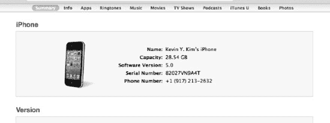
**图 7–1.** *iTunes 中的设备信息*

点击“序列号”标签。该标签应变为显示“标识符 (UDID)”，后跟一个 40 字符的字符串（参见 图 7–2）。测试者需要将此字符串发送给你。

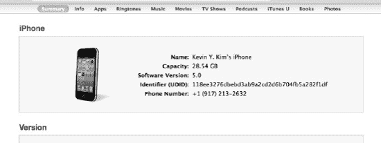
**图 7–2.** *iTunes 中的 UDID*


#### 向测试者提供说明

至此，我们已经收到了大量希望参与我们应用 Beta 测试的申请。一旦选定了合适的用户，我们就可以向他们发送关于测试内容的说明。如前所述，如果这是第一轮测试，我们可能只需向用户提供如何使用该应用的说明。在后续版本发布时，我们再向用户提供具体的测试说明，指明需要测试应用的哪些部分，以及我们根据他们的反馈做了哪些修改。

一项关键任务是指导测试人员如何提交 Bug。最简单的方法是让用户每次在应用中发现 Bug 时发送一封邮件。如果你的测试组规模非常小，这种方法可能可行。如果采用这种方式，定义一个标准的 Bug 报告格式会是个好主意。但更好的方法是安装一个 Bug 跟踪系统。

Bug 跟踪系统旨在帮助你跟踪 Bug（以及其他开发任务）。关于它们的工作原理以及如何帮助管理开发，我们可以长篇大论，但这超出了本书的范围。事实上，有人已经为此写了整本书。有几个可用的开源选项：

*   Trac 项目 (`http://trac.edgewall.org`)
*   Request Tracker (`http://bestpractical.com/rt/`)
*   Bugzilla (`http://www.bugzilla.org/`)

这绝非一个完整的列表，仅代表我们过去使用过的一些 Bug（和问题）跟踪系统。

如果你确实设置了一个 Bug 跟踪系统，你可以指导你的 Beta 测试人员在那里提交报告。这将使你和他们的工作都更加轻松。

最后，你可能需要指导测试人员如何提交崩溃报告。崩溃报告是在 iOS 设备上应用崩溃时生成的。当你将设备同步到 iTunes 时，崩溃报告会被传输到你的计算机上。崩溃报告位于`/Users/<USERNAME>/Library/Logs/CrashReporter/MobileDevice/<DEVICE_NAME>`。崩溃报告遵循的命名规范为`<APP_NAME>_YYYY-MM-DD-HHMMSS_<DEVICE_NAME>.crash`，其中`YYYY-MM-DD-HHMMSS`是崩溃发生的日期和时间。在提交应用崩溃报告时，要求用户附上崩溃报告，并说明应用崩溃时他们正在做什么。

我们定义的下一步是应用分发。但在描述之前，我们需要知道如何为 Beta 测试者构建我们的应用。

#### 创建 Ad Hoc 构建

通常，你会通过 iTunes App Store 分发你的应用。这涉及到通过 iTunes Connect 上传你的应用，并等待 Apple 批准。但这不是分发应用进行 Beta 测试的有效方式。首先，如果应用中有任何 Bug，Apple 会拒绝它。此外，Beta 测试的全部意义在于，在发布应用之前，从有限的用户群体中收集反馈。幸运的是，Apple 提供了 Ad Hoc 分发方式，允许我们直接将应用分发给测试者。

让我们开始创建我们的 Beta 应用。

##### 证书、配置文件与分发，天哪！

正如我之前提到的，创建 Beta 应用是一个复杂的过程。首先，我们需要创建一个证书签名请求。有了这个请求，我们再创建一个 iOS 分发证书。接下来，我们需要输入（或上传）Beta 测试者设备的通用设备 ID（UDID）。然后，我们需要为我们的应用创建一个 App ID。最后，我们使用所有这些信息来创建我们的 Ad Hoc 分发配置文件。

使用 iOS 分发证书和 Ad Hoc 分发配置文件，我们构建出 Beta 应用。然后我们将应用打包，连同配置文件一起分发给 Beta 测试者。之后，Beta 测试者可以通过 iTunes 安装应用，并开始向我们发送反馈。

###### 创建证书签名请求

证书签名请求是在你的计算机上使用“钥匙串访问”应用程序创建的。你可以在“应用程序” “实用工具”中找到“钥匙串访问”。启动“钥匙串访问”，你应该会看到如图 7–3 所示的窗口。

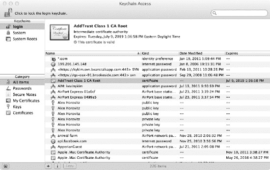

**图 7–3.** *钥匙串访问应用程序窗口*

通过“钥匙串访问” “偏好设置”打开偏好设置窗口，并选择“证书”标签页（见图 7–4）。将“在线证书状态协议 (OCSP)”和“证书吊销列表 (CRL)”都设置为“关闭”。

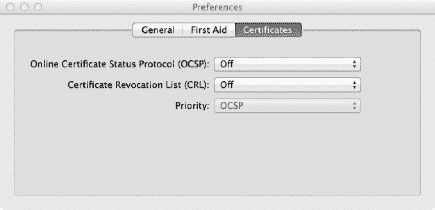

**图 7–4.** *钥匙串访问偏好设置窗口的“证书”标签页*

接下来，选择“钥匙串访问” “证书助理” “从证书颁发机构请求证书”（见图 7–5）。应该会出现“证书助理”窗口（见图 7–6）。在“用户电子邮件地址”字段中填写你注册 iOS 开发者时使用的电子邮件地址。对于“常用名称”，填写你注册 iOS 开发者时使用的公司/组织/部门名称。将“CA 电子邮件地址”字段留空。选择“存储到磁盘”，并勾选“让我指定密钥对信息”。点击“继续”。

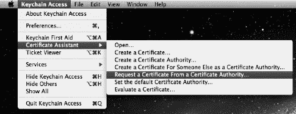

**图 7–5.** *创建证书请求*

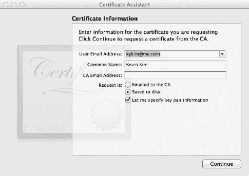

**图 7–6.** *证书助理窗口*

系统会提示你保存一个名为`CertificateSigningRequest.certSigningRequest`的文件。如果需要，你可以更改文件位置，然后点击“存储”。证书助理窗口将发生变化，要求你提供密钥对信息（见图 7–7）。将“密钥大小”设置为“2048 位”，并将“算法”设置为“RSA”（如果尚未设置）。点击“继续”。

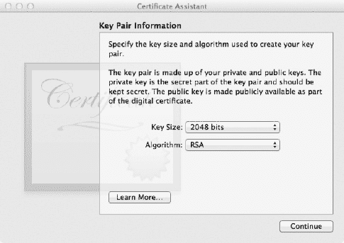

**图 7–7.** *密钥对信息*

证书助理应会创建证书请求并报告完成（见图 7–8）。你可以通过点击“在 Finder 中显示”来查看请求的位置。点击“完成”退出证书助理。

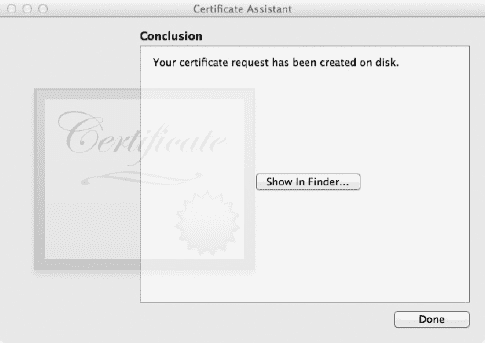

**图 7–8.** *证书助理，完成*

现在我们已经创建了我们的证书请求，下一步就可以创建我们的 iOS 分发证书了。


##### 创建 iOS 发布证书

要创建 iOS 发布证书，我们需要进入 iOS 预配门户。我们可以通过 iOS 开发者中心访问预配门户（参见图 7–9）。只有以注册开发者身份登录后才能访问预配门户。此外，你还需要注册 iOS 开发者计划。该计划目前个人用户每年需花费 `$99`。除了注册开发者计划的权益外，你还可以访问预发布软件和工具、内部开发者论坛，并获得苹果的技术支持。此外，你可以在物理 iOS 设备（而不仅仅是模拟器）上测试应用。最重要的是，你可以通过临时分发或 App Store 来分发你的应用。如果你感兴趣，可以在 [`http://developer.apple.com/programs/ios/`](http://developer.apple.com/programs/ios/) 了解更多信息。

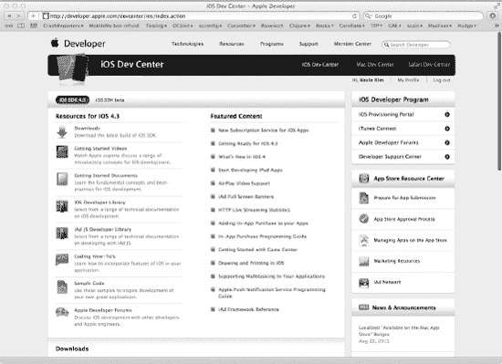

**图 7–9.** *以注册开发者身份登录 iOS 开发者中心*

如果登录成功，你应该会在 iOS 开发者中心右侧的“iOS 开发者计划”标题下看到“iOS 预配门户”（参见图 7–10）。点击“iOS 预配门户”链接。

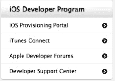

**图 7–10.** *iOS 开发者计划链接*

进入 iOS 预配门户页面后（参见图 7–11），你应该会在左侧看到一个选项菜单（参见图 7–12）。“主页”下的第一个选项是“证书”。点击它。

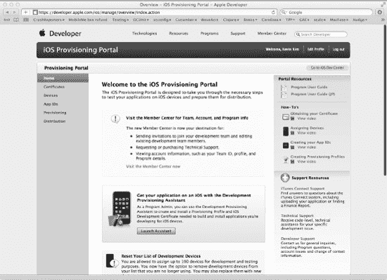

**图 7–11.** *iOS 预配门户页面*

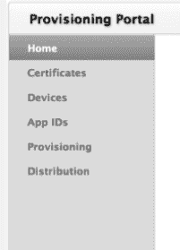

**图 7–12.** *预配门户菜单*

进入“证书”页面后，点击顶部的“发布”标签页（注意不要点击图 7–12 中所示的“发布”链接！）以显示你的发布证书。可能 Xcode 已自动为你创建了一个证书，也可能没有证书显示（参见图 7–13）。无论如何，我们将创建一个新的。找到表格中末尾带有“请求证书”按钮的行。点击此按钮。

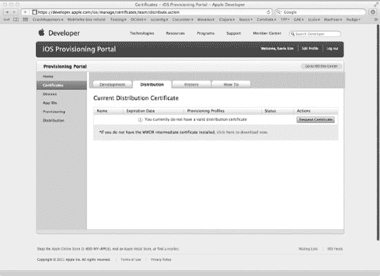

**图 7–13.** *证书页面的“发布”标签页*

面板应会切换显示一组说明。这些是创建证书请求的说明，而我们刚刚完成了这一步。点击说明末尾的“选择文件”按钮。在文件选择器中，导航到保存 `CertificateSigningRequest.certSigningRequest` 的位置，并选择该文件。确认文件名出现在“选择文件”按钮旁边（参见图 7–14），然后点击“提交”。

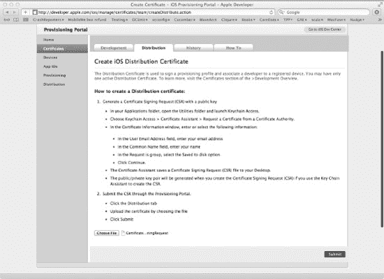

**图 7–14.** *提交证书请求*

提交后，“发布证书”窗格应会刷新，列出状态为“待签发”的证书（参见图 7–15）。稍等片刻，然后点击“发布”标签页刷新窗格。证书状态应更新为“已签发”（参见图 7–16），并显示一年后的到期日期。点击证书行右侧的“下载”按钮。这将下载一个名为 `distribution_identity.cer` 的文件。同时下载 WWDR 中间证书。该文件应命名为 `AppleWWDRCA.cer`。

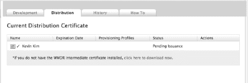

**图 7–15.** *发布证书等待签发*

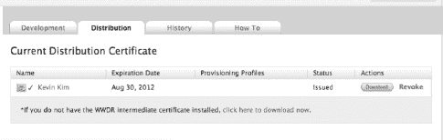

**图 7–16.** *发布证书已签发*

在 Finder 中找到 `AppleWWDRCA.cer` 文件，然后双击它。这将启动“钥匙串访问”，并安装 Apple WWDR 中间证书。你可以通过在“钥匙串访问”窗口左下角窗格中选择“证书”，并搜索名称“Apple Worldwide Developer Relations Certificate Authority”来确认是否已安装（参见图 7–17）。

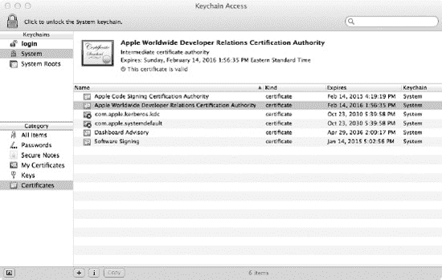

**图 7–17.** *确认 Apple WWDR 中间证书已安装（高亮显示）*

对 `distribution_identity.cer` 重复安装过程。

##### 上传 UDID

返回 iOS 预配门户，点击左侧菜单中的“设备”。你应该会进入“设备”页面的“管理”标签页（参见图 7–18）。

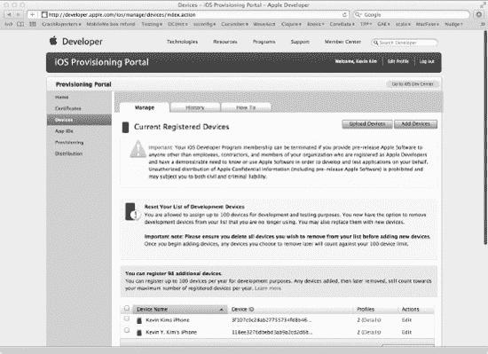

**图 7–18.** *iOS 预配门户页面的“设备”页面*

每年你最多可以添加 100 台设备用于开发和测试目的。虽然你可以移除设备，但即使被移除，这些设备仍会计入你每年的 100 台配额中。因此添加设备时要小心。

添加设备有两种方式：单个添加和批量添加。单个添加正如你所料，通过网页表单逐一输入设备信息。而批量添加则允许你一次性添加多台设备。这是通过上传文件来实现的。该文件采用简单的制表符分隔格式。

我们逐一介绍每个过程。

###### 单个添加

在“设备”页面中，进入“管理”标签页。在“管理”页面的右侧，点击标有“添加设备”的按钮。“管理”窗格应会刷新，提供一个可以添加设备名称和 ID 的表单（参见图 7–19）。

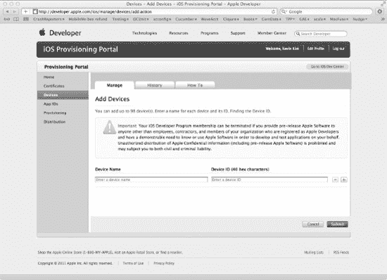

**图 7–19.** *“添加设备”页面*

“设备名称”可以是一个自由格式的字符串，用于标识设备。它可以是你的 Beta 测试者的姓名或电子邮件地址。也可以是分配给测试者的某个标识符。“设备 ID”是唯一的设备标识符。你需要从 Beta 测试者那里收集此信息。你可以通过启动 Xcode 并打开“管理器”窗口来查找 UDID。选择窗口顶部的“设备”图标。在左侧选择相关设备。你应该会看到显示的设备信息。在“标识符”标签旁边，应该是你设备的 40 个字符的 UDID（参见图 7–20）。记住，我在本章前面已经向你展示了如何在 iTunes 中访问 UDID（参见图 7–1 和图 7–2）。

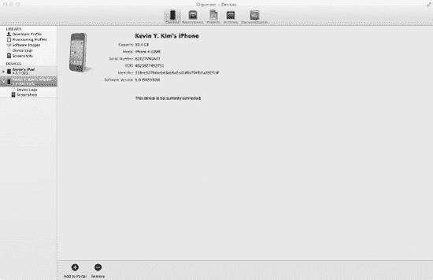

**图 7–20.** *Xcode 管理器窗口，设备详细信息*

通过网页表单可以输入多个设备名称和 ID。填写完名称和 ID 后，点击右侧的加号按钮。应会出现额外的一行（参见图 7–21），允许你输入另一台设备的名称和 ID。

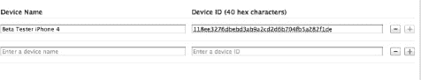

**图 7–21.** *通过网页表单输入另一台设备*

完成设备信息输入后，点击*提交*按钮。

###### 批量添加

在“设备”页面中，在“管理”标签页下，点击“上传设备”按钮。这将刷新“管理”窗格，允许你上传文件（参见图 7–22）。正如我们之前所述，你可以上传一个制表符分隔的文件。

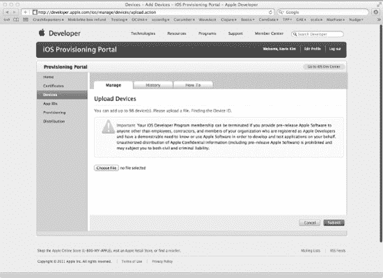

**图 7–22.** *“上传设备”页面*

制表符分隔的文件遵循简单的格式。文件的每一行应包含一个设备 ID，后跟设备名称，两者用制表符分隔。文件的第一行将被视为标题行并被忽略。文件应以扩展名 `.txt` 结尾。以下显示了一个示例设备文件：

```
DEVICE UDID                                DEVICE NAME
0aeb4240266f544ef8a4d0bb658a1fc6cf0a559a   iPhone 3GS
1f01c47915477711d8bc700090272ff72528531e   iPhone 4
3b02d9e6d59467382e8f9b9300a64ac3cd6c0e89   iPad 2
```

点击“选择文件”按钮，选择包含设备名称和 ID 列表的 `.txt` 文件。然后点击“提交”以上传文件并添加设备。


##### 确认

输入或上传设备信息后，您应会返回“管理”选项卡下的“设备”页面。要确认设备已添加，请滚动到页面底部。在那里，您将看到所有已录入信息的设备列表。

##### 创建我们的应用程序 ID

现在，我们需要在配置门户中为我们的应用程序创建一个条目。这些信息将用于构建分发给 Beta 测试人员的应用程序。

在 iOS 配置门户菜单中，点击 `App IDs`。与“设备”页面类似，“管理”选项卡应处于选中状态（参见图 7-23）。由于这是您的第一个应用程序，页面底部应没有列出任何 `App IDs`。如果已列出了 `SuperCheckout` 应用程序，您可以跳到**临时分发配置描述文件**部分。否则，请点击标有 `New App ID` 的按钮。

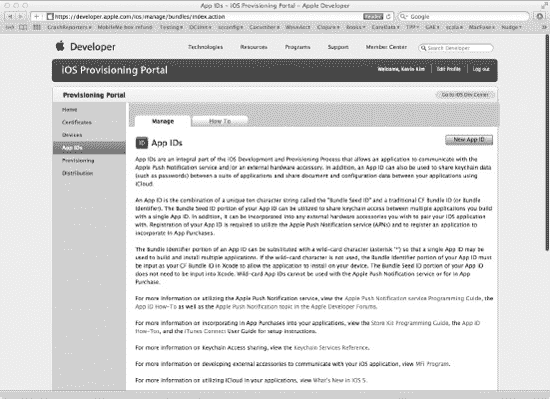

**图 7-23.** *iOS 配置门户页面的 App IDs 页面*

管理窗格应刷新并显示一个表单，用于输入您的应用程序信息（参见图 7-24）。`Description` 字段是用于标识应用程序的简单名称。（注意：`App IDs` 是永久的！请确保名称唯一！）输入 `SuperCheckout`。`Bundle Seed ID`（`App ID 前缀`）是一个唯一的十字符序列。将此选项保持为 `Use Team ID`。`Bundle Identifier`（`App ID 后缀`）是您的应用程序的唯一标识符。惯例是使用反向 DNS 风格名称。使用值 `com.whilethis.SuperCheckout`。点击 `Submit`。

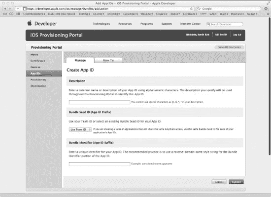

**图 7-24.** *新建 App ID 表单*

完成后，您应返回到“App IDs”页面的“管理”选项卡。新的 `App ID` 应出现在页面底部（参见图 7-25）。

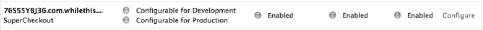

**图 7-25.** *新建的 App ID 条目*

快了。现在，我们需要创建一个临时分发配置描述文件。

##### 临时分发配置描述文件

在 iOS 配置门户菜单中，点击 `Provisioning`。进入配置页面后，选择 `Distribution` 选项卡（参见图 7-26）。点击 `New Profile` 按钮。

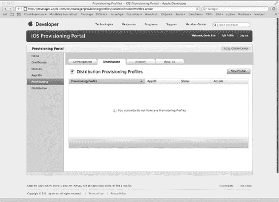

**图 7-26.** *配置页面的分发选项卡*

分发窗格应刷新并显示一个表单（参见图 7-27）。首先，在 `Distribution` 标签下，选中 `Ad Hoc` 单选按钮。`Profile Name` 字段用于输入描述性文本。我们将使用 `SuperCheckout AdHoc Provisioning Profile`。iOS 配置门户应已自动选择了我们之前创建的 `Distribution Certificate`。对于 `App ID`，选择我们之前创建的 `SuperCheckout ID`。最后，选择您希望应用程序能在其上运行的设备。这应是您的 Beta 测试人员的设备列表。选择所有设备后，点击 `Submit`。

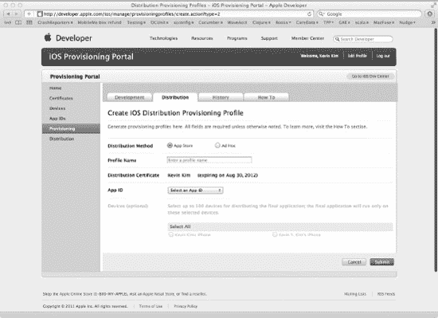

**图 7-27.** *新建的分发配置描述文件条目*

提交后，分发窗格应刷新，列出新的临时分发配置描述文件。其状态应显示为 `Pending`（参见图 7-28）。等待片刻，然后点击 `Distribution` 选项卡刷新视图。状态应变为 `Active`（参见图 7-29）。

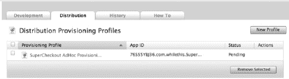

**图 7-28.** *临时分发配置描述文件待激活*

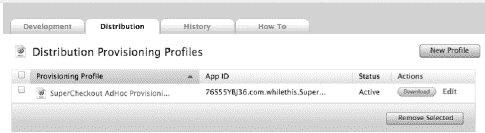

**图 7-29.** *临时分发配置描述文件已激活*

点击新配置描述文件的 `Download` 按钮。这会将名为 `SuperCheckout_AdHoc_Provisioning_Profile.mobileprovision` 的文件下载到您的电脑上。记下文件的位置，因为我们稍后会用到它。

我们经历了不少步骤来创建临时分发配置描述文件（即刚下载的 `.mobileprofile` 文件）。现在，让我们构建 Super Checkout 的 Beta 版本，以便分发给我们的 Beta 测试人员。

##### 构建 Beta 版本

如果尚未打开，请在 Xcode 中打开 Super Checkout 项目。我们要做的第一件事是安装刚创建的配置描述文件。打开 Finder，导航到 `SuperCheckout_AdHoc_Provisioning_Profile.mobileprovision` 文件下载的位置。将该文件拖到 Dock 上的 Xcode 图标上。如果操作正确，Xcode Organizer 窗口应会打开，并列出该配置描述文件（参见图 7-30）。

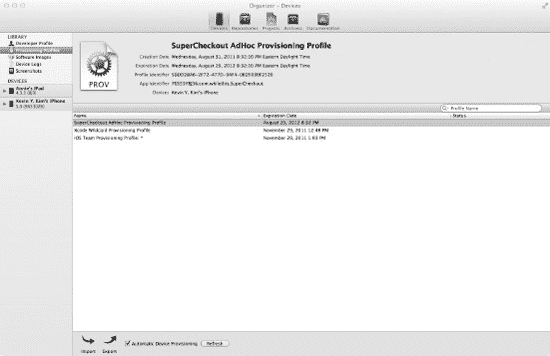

**图 7-30.** *新安装的配置描述文件*

返回 Super Checkout 项目窗口。点击导航窗格顶部的项目名称，进入项目编辑器视图。在项目编辑器视图中选择目标 `Super Checkout`，然后选择 `Build Settings` 选项卡。确保通过选择 `Build Settings` 选项卡下方一行中的 `All` 按钮来显示所有构建设置。向下滚动直到找到 `Code Signing` 部分。找到标有 `Code Signing Identity` 的行并展开它。在 `Release` 字段下，将值更改为 `SuperCheckout_AdHoc_Provisioning_Profile` 标题下的分发描述文件（参见图 7-31）。对标有 `Any iOS SDK` 的行下的 `Release` 行执行相同操作。

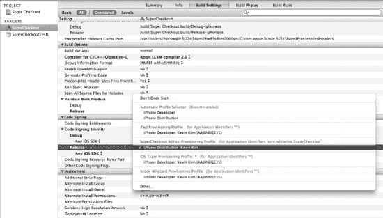

**图 7-31.** *更改发布版本的代码签名标识*

现在，我们需要归档应用程序以便将其打包以进行分发。首先，在 Xcode 工具栏的方案弹出菜单中选择 `iOS Device`。然后选择 **项目**  **归档**。在应用程序构建过程中，可能会弹出一个窗口，显示“`codesign` 想要使用您钥匙串中的密钥“XXX”进行签名”（参见图 7-32）。点击 `Allow`。此窗口可能会再次出现。如果出现，只需点击 `Allow`。`codesign` 是一个将 Super Checkout（或任何其他应用程序）与分发证书和配置描述文件打包在一起的应用程序。

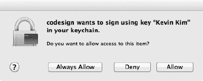

**图 7-32.** *`codesign` 请求访问您的钥匙串*

应用程序编译、签名和归档完成后，Xcode 应会打开 Organizer 窗口，显示归档视图（参见图 7-33）。新的 Super Checkout 归档应被列出。选择 `Super Checkout`，然后点击上部窗格右侧的 `Share` 按钮。Xcode 将显示一个窗格，询问您希望如何共享归档（参见图 7-34）。

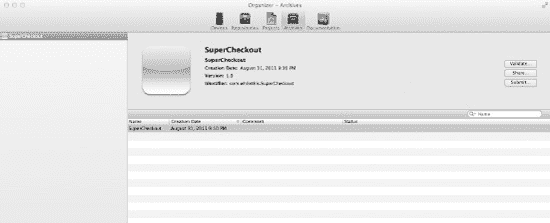

**图 7-33.** *Xcode Organizer 窗口，归档视图*

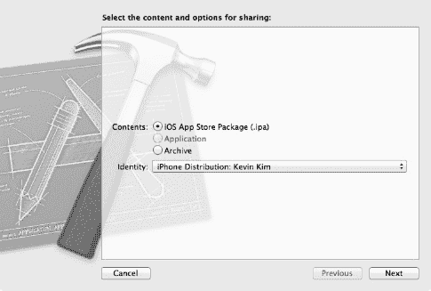

**图 7-34.** *共享配置窗格*

在“内容”选项中，选择 `iOS App Store Package (.ipa)` 单选按钮。并为“标识”选择适当的分发描述文件。该分发描述文件应与您在 Xcode 中为“代码签名标识”配置的匹配。系统可能会询问您是否允许 `codesign` 访问您的钥匙串。和之前一样，只需点击 `Allow`。最后，将出现一个文件对话框，用于保存文件 `app.ipa`。选择一个位置，并将文件保存为 `SuperCheckout.ipa`。


##### 分发 Beta 版本

呼，工作量不小。现在我们有了两个文件：应用程序包 `SuperCheckout.ipa` 和配置文件 `SuperCheckout_AdHoc_Provisioning_Profile.mobileprovision`。这两个文件就是你要分发给 Beta 测试人员的内容。如何分发这些文件完全由你决定。如果测试人员数量较少，通过电子邮件发送可能更简单。请记住，许多电子邮件服务会限制附件大小（通常是 10MB）。因此，部分用户可能无法收到较大的应用程序包。

通常，更好的做法是将文件上传至测试人员可以访问的位置。如果你希望设置密码保护，也可以。你无需过分担心非测试人员下载并运行你的应用程序。配置文件与代码签名将确保该应用仅能在你指定的设备上运行。

一旦你的 Beta 测试人员收到这些文件，他们只需启动 iTunes，然后将这两个文件拖拽至 Dock 栏的 iTunes 图标上。此时，该应用即可在他们的 iOS 设备上进行安装。

#### Alpha、Beta 还是 Gamma？

现在你已经构建了应用的 Beta 版本并将其分发给了测试人员。这是比较简单的一步。Beta 测试是一个迭代过程。很快，你的测试人员就会提交漏洞和崩溃报告。你需要分析这些报告，判断究竟是真正的程序错误，是测试人员对应用的理解有误，还是应用本身需要重新设计。

作为补充说明，有一些工具可以辅助 Beta 测试过程。我们所知的几位开发者都曾使用过它们。在此提及，旨在让你了解它们。

一些开源的崩溃报告框架已经被开发出来，它们有助于自动化交付和解析应用程序的崩溃报告：

*   Plausible Labs 的 CrashReporter (`http://code.google.com/p/plcrashreporter/`)
*   ParveenKaler 的 CrashKit (`https://github.com/kaler/CrashKit`)
*   QuincyKit (`http://quincykit.net/`)
*   Steve Streza 的 CrashReporter (`https://github.com/amazingsyco/CrashReporter`)

另外还有许多服务可以辅助管理 Beta 分发、漏洞报告和崩溃报告：

*   Hockey App (`http://www.hockeyapp.net`) 基于 QuincyKit 构建
*   BugSense (`http://www.bugsense.com/`)
*   TestFlight (`https://testflightapp.com/`)

这三项服务都提供了崩溃报告的收集与分析功能。它们会整理错误信息，并尝试帮助你追踪 Bug。Hockey App 和 TestFlight 还提供了向你的 Beta 测试人员分发应用的机制。

请评估这些框架和服务，看看它们是否符合你的需求。

### 本章小结

在本章中，我们描述了如何管理你的 Beta 测试流程，从确定测试目标到寻找开发者。最重要的是，我们解释了如何指导你的 Beta 测试人员提交反馈和崩溃报告。为了分发我们的 Beta 应用，我们还介绍了如何创建 Ad Hoc 配置文件。这是一个复杂的过程，涉及注册应用程序以及 Beta 测试人员的设备 ID。拥有了 Beta 应用和配置文件后，我们就可以将它们发送给测试人员进行审查。

在下一章中，我们将介绍如何以自动化方式测试应用程序。你将学习如何将 Beta 测试人员提交的 Bug 报告转化为测试包。通过创建这个测试包，将有助于防止同样的 Bug 在应用程序中反复出现（开发者称之为回归）。

## 第八章

## 为什么出问题了？

开发结束了，Beta 版已经发出去了，几周以来，你第一次可以坐下来放松一下了。对吧？好吧，如果事情能这么简单就好了，但事实并非如此，现在你开始收到 Bug 报告。应用崩溃了，运行缓慢了，用户还发现了前所未闻的、全新的使用路径，这些路径将他们远远带离了你精心铺设的“快乐路径”。

别担心！有很多方法可以找到并解决这些问题。SDK 提供的工具让这一切变得容易得多。但是，如果能提前为这些问题做好准备，那岂不是更好？要是存在某种方法论，能在开发过程中专注于发现问题，而不是坐等 Bug 报告蜂拥而至，那该多好。

 **注意：** 在继续之前，我想指出本章并非专门论述某一种流程或方法论。无论你如何编写代码，测试都很重要。这里要学习的重点是，如何很好地测试你的应用，以及 Xcode 和 SDK 工具如何让这一切变得简单。

### 测试驱动开发

测试驱动开发（TDD）是一种将重点放在（你猜对了）测试上的开发方法论。在大多数开发工作流程或方法论中，测试被视为衡量代码质量的一种手段，通常是在开发过程中（但往往是在开发之后）进行（图 8-1）。而 TDD（参见图 8-2）则更进一步，在开始编写代码之前，就利用测试来帮助设计和规划你的代码库。

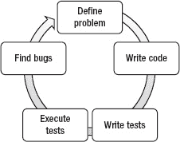

**图 8–1.** *非 TDD 工作流程侧重于编写代码，而非测试。*

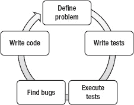

**图 8–2.** *TDD 工作流程将编写代码置于生命周期的最末尾。*

你会注意到，TDD 工作流程（图 8-2）中的步骤相同，但顺序大相径庭。在 TDD 中，你是围绕测试来构建代码，而不是围绕需求或规格说明。理论上，当所有测试都通过时，你应该得到了一个满足需求（且没有 Bug）的最终产品。

注意 TDD 流程中的第三步和第四步。当你完成测试套件后，运行测试并列出 Bug 目录。这一切都在你编写任何代码之前完成。如果你心想“那岂不是所有测试都会失败”，你说得没错。你可以认为，最纯粹的 TDD 形式将应用程序视为一系列需要被修复的缺陷。应用程序不是在它可以运行时完成，而是在所有测试通过时才算完成。由于测试套件的设计是为了确保满足需求，因此测试成为衡量完成度的标准，而不仅仅是衡量质量的标准。

**不要害怕 TDD。（你可能已经在做了。）**

如果你对它接触不多，TDD（或者说测试这件事）可能会让你有些望而生畏。好消息是，它比你想象的要自然得多。更好的消息是，你可能已经在以几种自己未曾意识到的方式实践它了。例如，在开始构建用户界面之前，你可能已经规划了用户旅程，勾勒了可能的流程，并写下了交互步骤和预期结果。信不信由你，这就是 TDD。测试脚本、单元测试、自动化用户界面测试、手动用户界面测试——这些都是 TDD 的一部分。


### 我应该何时开始测试？

无论你是在实践 TDD，还是仅仅需要测试一个看似无法重现的 Bug，开始测试的唯一最佳时机就是现在。你越早开始，就越容易定义出能精确对应需求的测试，而不会被先入为主的观念或“但我已经用这种方式花了太多时间”的想法所干扰。

构建测试确实需要时间。然而，长远来看它也能节省时间。测试的益处之一在于它们运行速度极快。Xcode 执行一个测试套件只需片刻。这意味着你可以更频繁地运行测试，而无需牺牲太多时间。运行一个完整的测试套件几乎总是比在应用中重现一个 Bug 以便诊断要快得多。

测试的另一个好处是，编写良好的测试只需编写一次。如果你编写的测试与需求相匹配，那么除非需求发生变化，否则你的测试就不需要改变。如果你正在添加新功能，你只需要添加新的测试。你之前编写的测试应该全部保持有效。拥有一个完整的测试套件的好处是，它能保护你的代码免受回归 Bug 的侵害。

### Xcode 让测试变得简单

Xcode 做了很多让测试变得简单的事情，无论你想做多少测试。Xcode 帮助进行的两种主要测试类型是：单元测试和 UI 测试。

单元测试是在 Xcode 内部使用一个名为 OCUnit 的框架完成的。不必担心需要学习一个新的框架。从接口的角度来看，OCUnit 是你将使用的最简单的框架之一。此外，Xcode 通过提供目标和文件模板，为你完成了大量的设置和繁重工作。正如你马上就会看到的，在 Xcode 中启动一个启用了单元测试的新项目，简单到只需点击一个复选框。

UI 测试是通过在 Instruments 中使用 Automation 模板运行脚本来处理的。这个工具使用了一个自定义的 JavaScript 框架来遍历正在运行的应用程序的用户界面，让你无需实际触摸屏幕即可与应用程序进行交互。

#### 测试目标

将单元测试目标添加到你的项目中，有两种方法。第一种也是最简单的方法，是在你设置项目时告诉 Xcode 包含该目标（参见 图 8–3）。在将单元测试集成到 Super Checkout 项目之前，先让我们在一个新的、独立的项目中熟悉它们的工作方式。在这个示例中，你将构建一个非常简单的计算器。

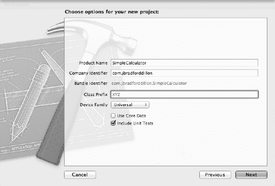

**图 8–3.** *在你的新项目中包含一个单元测试目标，简单到只需勾选一个复选框。*

如果你要为现有项目添加测试，需要添加另一个测试目标，或者只是在设置时忘记勾选该复选框，你始终可以通过向你的项目添加一个新目标并选择单元测试模板来添加单元测试目标。从菜单栏选择 文件  新建  新建目标（图 8–4）。

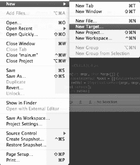

**图 8–4.** *你也可以从项目界面的“添加目标”按钮创建新目标。*

这将弹出目标模板对话框（图 8–5）。你会在标有“其他”的部分找到“单元测试包”目标模板。

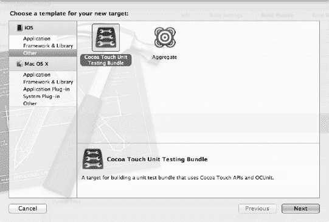

**图 8–5.** *你可以向你的项目添加多个单元测试包。*

一旦你创建了测试目标，就可以开始编写测试了。在开始之前，让我们先看看新的测试目标的内容。如果你是作为新项目的一部分创建的测试目标，那么该目标的名称将与你的项目名称相同，并附加“Tests”一词。如果你是作为现有项目的一部分创建的目标，那么它将使用你选择的任何名称。遵循命名约定很重要，因此将测试目标命名为你的项目名称后附加“Tests”一词是明智的做法。

在项目导航器中，每个目标都会有一个组。在测试目标的组内，你会找到一个与你的目标同名的类，以及一个支持文件组，类似于你在任何其他目标组中找到的内容。

在 `SimpleCalculatorTests.m` 中，你应该看到以下内容：

```
@implementation SimpleCalculatorTests

- (void)setUp
{
    [super setUp];

    // 在此处编写设置代码。
}

- (void)tearDown
{
    // 在此处编写拆卸代码。

    [super tearDown];
}

- (void)testExample
{
    STFail(@"在 SimpleCalculatorTests 中尚未实现单元测试");
}

@end
```

我们稍后会详细说明这些内容。目前，只需理解这设置了一个单一的、失败的测试就足够了。

现在你已经有了一个测试目标，你需要运行测试。在此之前，你需要熟悉测试配置并确保测试处于活动状态。Xcode 让控制哪些测试正在运行变得非常简单，并且还提供了修改部分测试环境变量的能力。

#### 设置测试

要运行测试，你需要确保你的方案已为测试设置好。从菜单栏选择 `Product`  `Edit Scheme` 以打开方案编辑器（图 8–6）。

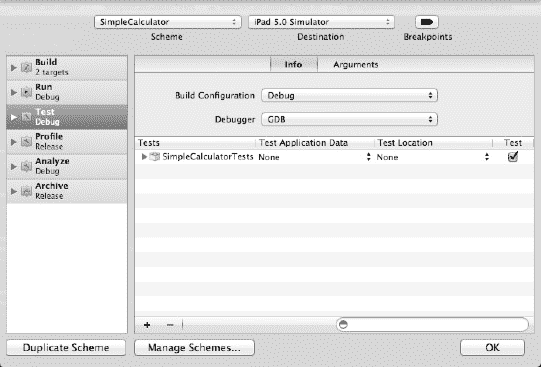

**图 8–6.** *如果你没有在方案中包含测试目标，“测试”操作将被禁用。*

从侧边栏中选择“测试”。如果你在项目设置期间选择了包含单元测试目标，你应该会在“信息”窗格中看到列出的测试目标。如果你是手动创建单元测试目标的，则需要手动将其添加到方案中。点击 + 按钮以调出项目中所有单元测试目标的列表。选择你的目标并将其添加到方案的“测试”操作中。

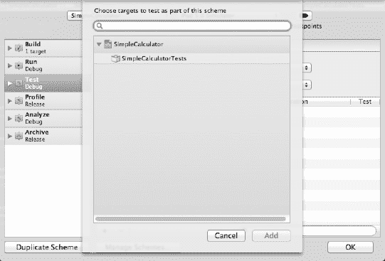

**图 8–7.** *工作空间中所有项目的所有单元测试目标都将在此处可用。*

一旦你的目标被包含在方案中，你可以进行一些更高级的配置。测试目标列表上方的下拉菜单允许你选择用于测试的构建配置和调试器。这些设置适用于当前方案中的所有测试目标。目标列表允许你修改各个目标的配置。如果你展开一个目标，你会看到该目标中所有 `SenTestCase` 子类的列表。在你的例子中，你会看到一个列表项，`SimpleCalculatorTests`。展开这些测试用例之一，将显示各个测试，并按方法名称列出（图 8–8）。这些项目中的每一项在右侧都有一个对应的复选框，允许你打开或关闭它们。在 Xcode 4 之前，这需要在代码中通过配置 `SenTestSuite` 对象来完成。

此界面上另一个值得注意的是“测试位置”列，它允许你指定测试应运行的区域设置。这使你能够测试依赖于区域设置的行为，包括 `CoreLocation`、`NSDate`、`NSCalendar` 等。

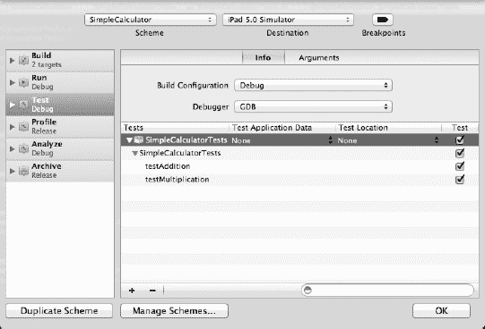

**图 8–8.** *一旦你有了一个完整的测试套件，能够选择运行哪些测试就会派上用场。*

“参数”窗格（图 8–9）允许你修改操作的环境参数。默认情况下，“使用运行操作的选项”复选框是勾选状态，这在大多数情况下是首选。就像在任何测试场景中一样，保持测试环境与运行环境尽可能相似非常重要。

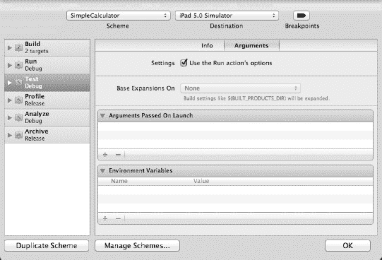

**图 8–9.** *修改测试操作的参数会导致与运行环境产生差异。*


##### 认识 `OCUnit`

`OCUnit` 是一款与 Xcode 绑定的 Objective-C 单元测试框架，用于编写单元测试。自 2005 年起，`OCUnit` 就成为 Xcode 的一部分；它提供了一个简洁优雅的单元测试接口，类似于 Smalltalk 的 `SUnit` 和 Java 的 `JUnit`。该框架最初由 `Sente SA` 作为开源项目以 `SenTestingKit` 为名开发，因此框架中的许多类和宏仍保留着如“`ST`”和“`Sen`”这样的前缀，并且项目中链接的框架依然标记为“`SenTestingKit.framework`”。

要启用测试，你只需在测试目标中创建一个 `SenTestCase` 的子类。`SenTestCase` 是测试用例（也称为测试夹具）的基类，也是 `SenTestingKit` 中你需要关注的唯一类。

`SenTestCase` 遵循“约定优于配置”的理念。在 `SenTestCase` 的子类中，你以方法的形式提供测试，这些方法的选择器必须以“test”开头。运行时，`OCUnit` 会自动检测这些子类，实例化它们，并按顺序调用每个测试方法。每次测试调用前都会先调用测试类的 `-setUp` 方法，之后调用 `-tearDown` 方法。重写这些方法可以让你设置和配置测试所需的环境。需要注意的是，测试执行的顺序是未定义的，并且无法在 `-setUp` 或 `-tearDown` 中得知即将运行哪个测试。

一个不能失败的测试就算不上测试。在 `SenTestCase` 中，抛出异常即表示测试失败。如果测试在执行结束时没有抛出任何异常或其他崩溃情况，则视为成功。显然，你想测试的内容并非都与崩溃相关。这时就需要断言（也称为 assert）登场了。如果你还不熟悉断言，写完第一批测试用例后你就会熟悉了。断言是一个函数（通常定义为宏），它评估一个条件，并在条件为假时抛出异常。通常，断言函数还提供通过日志或生成错误信息来表达异常细节的手段。Cocoa 中最常见的断言类型是 `NSAssert`，它简单地评估一个布尔表达式，若为假则抛出异常。

```
NSAssert((1+1 == 2), @”这个断言会通过，这条消息永远不会被看到”);
```

`SenTestingKit` 框架提供了更多类型的断言，它们适用于各种场景。甚至有一种断言用于测试某段代码*确实*会抛出异常（正如你会了解到的，这比听起来有用得多）。`SenTest` 断言以 `ST` 为前缀。从技术角度讲，它们是宏函数。这样做的好处是，你可以在 `SenTestCase_Macros.h` 中看到它们的大部分实现。下面列出了一些你应该熟练掌握的重要断言，以及它们的使用说明。完整列表可以在 `SenTestCase.h` 中找到。

- `STAssertNotNil(a1, description, …)` 如果对象 `a1` 为 nil，则抛出异常。在测试应返回对象的方法时非常有用。另见 `STAssertNil()`，其作用完全相反。
- `STAssertTrue(expression, description, …)` 如果表达式计算结果为 false，则抛出异常。这本质上与使用 `NSAssert()` 相同，区别在于它会报告为测试失败，而 `NSAssert()` 只会停止执行。该函数的互补函数是 `STAssertFalse()`。
- `STAssertEquals(a1, a2, description, …)` 如果值 `a1` 和 `a2` 不相等，则抛出异常。需要注意的是，如果传入两个值相同但不同的对象（例如两个值都为“Hello World”的不同 `NSString`），它们不会被判定为相等，因为对象是唯一的。如果传入指向同一对象的两个指针，则判定为真。要测试不同对象的相等性，请使用 `STAssertEqualObjects()`。
- `STAssertNoThrow(expression, description, …)` 如果表达式（通常是对对象的方法调用）抛出异常，则会触发失败。此函数及其对应函数 `STAssertThrows()` 是构建任何供第三方使用的框架时可能最有用的断言。例如，如果你的框架中某个方法需要非 nil 参数，你可以使用 `NSAssert()` 来检查其值。那么两个极佳的单元测试就是：使用 `STAssertNoThrow()` 进行有效调用（传入非 nil 参数），以及使用 `STAssertThrows()` 进行无效调用（传入 nil 参数）。理解 `STAssertThrows()` 很重要，因为它一开始可能会让你觉得反直觉。当方法失败时，你的测试反而通过了！
- `STFail(description, …)` 不是断言。它是一个全能函数，无论什么情况都会导致测试失败。当所有断言函数都不适用时可以使用它。例如，如果你在编写一个测试来检查优雅失败方法返回的错误码值，你可以使用 switch-case 块根据枚举的错误码执行相应的测试。在该块的 default 情况下，你可能需要调用 `STFail()` 来确保未识别的错误码不会被引入你的对象。

##### 有 Bug 的代码

为了准确解释单元测试的工作原理，让我们从一个简单的例子开始。下面是 `SimpleCalculator` 类。它有两个方法。一个方法将两个整数相加并返回结果，另一个方法将两个整数相减并返回差值。至少，这应该是它们的功能。为了演示目的，我引入了一个相对明显的错误。在第二个方法中，我不是对两个参数进行相减，而是将它们相加。看来有人一直在复制粘贴代码。

以下是 `SimpleCalculator` 类的头文件：

```
#import <Foundation/Foundation.h>

@interface SimpleCalculator : NSObject

- (int)resultOfAdding:(int)foo to:(int)bar;
- (int)resultOfSubtracting:(int)foo from:(int)bar;

@end
```

以下是实现文件：

```
#import “SimpleCalculator.h”

@implementation SimpleCalculator

- (int)resultOfAdding:(int)foo to:(int)bar {
        return (foo + bar);
}

- (int)resultOfSubtracting:(int)foo by:(int)bar {
        return (foo + bar);
}

@end
```


#### 编写测试

在编写测试之前，重要的是要考虑实际需要测试什么。对于这个过于简单的类，似乎只需要一些非常简单的测试，但事实未必如此。我可能需要测试每个方法，但应该用哪些数据呢？让我们看几个示例测试。

**注意：** 务必牢记，测试用例目标本身也是目标，任何必需的源文件都必须包含在该目标中才能使用。因此，你必须记得在测试目标的“编译源文件”（Compile Sources）阶段中包含实现文件（例如 `SimpleCalculator.m`）。

以下是我的测试用例类的接口。它非常简单，只有一个局部变量，用于保存计算器实例：

```
#import <SenTestingKit/SenTestingKit.h>
#import “SimpleCalculator.h”

@interface SimpleCalculatorTests : SenTestCase {
        SimpleCalculator *myCalculator;
}

@end
```

其实现也同样简单。在 `-setUp` 中，我创建了一个 `SimpleCalculator` 类的实例。在 `-tearDown` 中，我释放该实例。此外还有两个测试方法：`-testAddition` 和 `-testSubtraction`，分别测试 `SimpleCalculator` 的相应方法。每个方法都使用 `STAssertEquals()` 宏来将测试结果与期望值进行比较。

**注意：** 编写测试时，正确管理内存至关重要。在单元测试中引入内存泄漏可能会产生极难诊断的 bug。

```
#import “SimpleCalculatorTests.h”

@implementation SimpleCalculatorTests

- (void)setUp {
        myCalculator = [[SimpleCalculator alloc] init];
}

- (void)tearDown {
        [myCalculator release];
}

- (void)testAddition {
        int result = [myCalculator resultOfAdding:2 to:3];
        STAssertEquals(result, 5, @"Addition of 2 and 3 failed. Expected 5, received
%i", result);
}

- (void)testSubtraction {
        int result = [myCalculator resultOfSubtracting:2 from:3];
        STAssertEquals(result, 1, @"Subtraction of 3 from 2 failed. Expected 1, received
%i", result);
}

@end
```

**提示：** `STAssert` 函数与 `NSAssert` 类似，第一个参数接收测试条件，后续参数构成格式化字符串，用法类似于 `NSLog` 或 `--stringWithFormat`。

#### 运行测试

现在你已经把方案（scheme）配置好了，可以开始运行测试了。这部分很简单。首先，需要注意测试将在设备上执行，并使用方案下拉菜单中选定的 SDK 版本。一旦选定设备和 SDK，准备工作就完成了。在菜单栏中，只需选择“Product > Test”。

运行测试时，Xcode 中会开始发生两件事。首先，你选定的模拟器或设备会启动并显示黑屏。在整个测试阶段，它只会显示黑屏。其次，调试面板会开始显示测试的输出（图 8–10）。

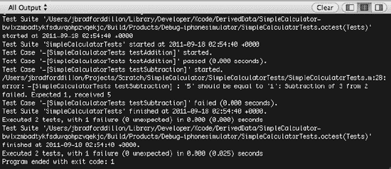

**图 8–10.** *失败也是一种成功！*

这里数据很多。我们来稍微分析一下。

```
Test Suite 'SimpleCalculatorTests' started at 2011-09-18 02:54:40 +0000
Test Case '-[SimpleCalculatorTests testAddition]' started.
Test Case '-[SimpleCalculatorTests testAddition]' passed (0.000 seconds).
```

测试套件已启动，第一个测试已运行并通过。它只用了 0 秒。

```
Test Case '-[SimpleCalculatorTests testSubtraction]' started.
/Users/jbradforddillon/Projects/Scratch/SimpleCalculator/SimpleCalculatorTests/SimpleCal
culatorTests.m:28: error: -[SimpleCalculatorTests testSubtraction] : '5' should be equal
to '1': Subtraction of 3 from 2 failed. Expected 1, received 5
Test Case '-[SimpleCalculatorTests testSubtraction]' failed (0.000 seconds).
```

第二个测试可没有第一个那么幸运。它失败了（正如你所料），并且你在断言中包含的消息也被打印了出来。

```
Test Suite 'SimpleCalculatorTests' finished at 2011-09-18 02:54:40 +0000.
Executed 2 tests, with 1 failure (0 unexpected) in 0.000 (0.000) seconds
Test Suite '/Users/jbradforddillon/Library/Developer/Xcode/DerivedData/SimpleCalculator-bwlxzmbadtykfsduvqohpzvqekjc/Build/Products/Debug-iphonesimulator/SimpleCalculatorTests.octest(Tests)' finished at 2011-09-18 02:54:40 +0000.
Executed 2 tests, with 1 failure (0 unexpected) in 0.000 (0.025) seconds
Program ended with exit code: 1
```

最后，你会看到测试结果的摘要。你的 SimpleCalculator 在 0.073 秒内完成了 1 对 1 的测试。好在 Xcode 会在“问题导航器”（Issue Navigator）中简化这些输出，将失败的测试显示为错误，并保留测试失败的描述（图 8–11）。

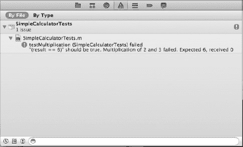

**图 8–11.** *所有测试失败信息都会显示在“问题导航器”中，同时包含断言记录的详细信息。*


#### 完善测试用例

这些测试用例能够如预期工作。加法测试通过，减法测试失败。减法结果会得到 5 而不是 1，并且 `STAssertEquals()` 函数会抛出异常。这些测试成功发现了你代码中的一个 bug。但这足够了吗？还远远不够。重要的是要记住，目标不仅仅是让测试通过，而是要编写优秀的代码。单元测试不应该只是需要克服的障碍；它们应该有助于厘清问题并塑造解决方案，从而使你能够高效且有效地编写代码。

那么，为什么这些测试用例还不够呢？以下是一种你可能会用来“修复”这些测试所发现 bug 的方法示例：

```
- (int)resultOfSubtracting:(int)foo by:(int)bar {
    return 1;
}
```

搞定！只需一次按键，你的类就通过了所有测试！任务完成！可以发布了！

你在这里所做的，可以说是只见树木，不见森林——或者更确切地说，是为了测试而忽视算法。你需要更好的测试。你需要一个不会产生误报的测试。当你编写测试时，你对代码的工作原理已经有了先入为主的看法。在开始编写代码之前先编写测试，能让你在不被已有算法或设计束缚的情况下，拥有先见之明。当你正试图解决一个问题时，你会过于投入自己的解决方案，因此更有可能“东拼西凑”出一个能让测试通过的代码。花时间暂停一下，真正去思考一个组件或一段代码可能出错的所有情况，这将帮助你编写出更好的测试，从而帮助你编写出更好的代码。

那么，你可以如何改进你的测试呢？怎样才能让测试无法被绕过呢？看看这个：

```
- (void)testSubtraction {
    int foo = arc4random();
    int bar = arc4random();
    int dif = bar - foo;
    int result = [myCalculator resultOfSubtracting:foo from:bar];
    STAssertEquals(result, dif, @"Subtraction failed.");
}
```

通过使用 `arc4random()` 函数引入随机性，你使得预测预期结果变得不可能。通过这项测试的唯一方法，就是无论 foo 和 bar 的值是什么，都用 bar 减去 foo。

让我们看看在编写代码之前如何编写测试。你将为 `calculator` 类添加一个方法，该方法将返回两个数字的商。首先，你将其添加到 `SimpleCalculator` 类的接口中。

```
- (int)resultOfDividing:(int)foo by:(int)bar;
```

接下来，你可以开始编写测试。由于该方法与加法和减法的方法类似，一个好的起点是遵循你为加法和减法方法采用的相同形式。

```
- (void)testDivision {
    int foo = arc4random();
    int bar = arc4random();
    int quot = foo / bar;
    int result = [myCalculator resultOfDividing:foo by:bar];
    STAssertEquals(result, quot, @"Division failed.");
}
```

这个测试肯定能确保你数学运算的准确性。随机的值确保了你无法预测或干扰这个测试的结果。但它能测试你在编写这段代码时可能遇到的所有潜在问题吗？如果 bar 是 0 呢？你期望的结果应该是什么？

这些就是你在编写测试时应该提出的问题类型。它们不仅有助于确保你覆盖了所有基础情况，还能帮助你明确那些或隐或现、你正试图解决的问题。当问题被清晰地定义，并且你针对它们编写了测试之后，解决方案就会变得更简单，也更容易识别。

让我们编写一个除以零的测试用例。为简单起见，假设这个用例应该通过断言抛出一个异常。你可能会问，当除以零本身已经会抛出异常时，为什么还要这样做。抛出你自己的异常能让你控制应用程序崩溃的方式，并允许你向开发者提供更多信息，告知他们究竟做错了什么。这也将给你一次机会来尝试另一个 `STAssert` 宏。

你希望只有当尝试除以零抛出异常时，你的测试才通过。以下是使用 `STAssertThrows()` 来检测有效异常的方法：

```
- (void)testDivisionByZero {
    int foo = arc4random();
    int bar = 0;
    STAssertThrows([myCalculator resultOfDividing:foo by:bar],
        @"Divide by zero should have thrown");
}
```

`STAssertThrows()` 检测给定表达式是否抛出了异常。如果没有抛出异常，条件就为假，`STAssertThrows()` 会抛出它自己的异常，导致测试失败。为了通过这个测试，你的代码必须在除数为零时抛出一个异常。

既然你已经对你的代码必须做什么有了一个很好的（不仅仅是“不错的”）理解，你就可以开始编写代码了。

```
- (int)resultOfDividing:(int)foo by:(int)bar {
    NSAssert((bar != 0), @"Attempt to divide by zero.
    You are likely to be eaten by a grue.");
    return (foo / bar);
}
```

如果你现在运行你的测试，它们应该都能通过，并且你应该相当确信这个新功能是经过深思熟虑且充分测试的。

### 在你的应用中付诸实践

既然你已经熟悉了 OCUnit，并且对如何编写优秀的测试有了不错的理解，那么你应该开始将你的新技能应用到 Super Checkout 应用中。首先，为项目的 JSON 解析器 `SCJSONParser` 编写一个测试套件。


#### 测试 `SCJSONParser`

Super Checkout 项目已经包含一个测试目标，其中带有默认初始化的 `SenTestCase` 子类 `Super_CheckoutTests`。你可以直接在这个类中编写所有测试，但这很快就会变得难以管理和混乱。较好的做法是让测试类与测试对象之间保持一一对应的关系。由于你即将测试 `SCJSONParser`，因此需要新建一个名为 `SCJSONParserTests` 的测试用例类。

要创建新的 OCUnit 测试用例类，请选中测试用例组，然后从菜单栏中选择 `File`  `New`  `New File`。在文件模板对话框中，选择 Objective-C 测试用例类模板，然后点击 Next。将文件命名为 `SCJSONParserTests`，然后点击 Next。在点击 Create 之前，请确保该文件关联到了正确的目标。勾选测试目标框（`Super CheckoutTests`），并取消勾选应用目标框。新的测试用例类将包含存根方法 `-setUp` 和 `-tearDown`，但没有测试代码。此外，如果你检查 scheme 设置，会发现新类已被自动添加到测试列表中。

由于你即将测试 `SCJSONParser` 类，因此需要确保该类已包含在测试目标中。在项目导航器中选中该类，然后在文件检查器实用工具的 Target Membership 部分中勾选 `Super CheckoutTests` 目标。由于 `SCJSONParser` 类依赖于 `SBJSON` 库，因此你还需要将这些类也包含进来。记住这一步很重要。Xcode 会为你管理大部分目标成员资格，因此当你需要自行管理时很容易忘记。

现在你可以开始为 JSON 解析器编写测试了。`SCJSONParser` 有两个方法：一个是初始化方法，另一个是便捷方法，用于返回解析器的自动释放实例。这两个方法都接收六个参数。该类没有公开属性。解析器通过 `SCJSONParserDelegate` 中定义的方法通知委托完成操作。你需要测试两个初始化方法以及一些 JSON 数据。由于 `SCJSONParser` 是对 `SBJSON` 的封装，并且你对这个库相当熟悉，因此你不会测试解析功能本身。你主要关注的是测试以确保你的封装按预期工作：为解析器提供一个委托接口，并通过提供的请求类型和响应类型维护上下文。

此测试需要两个对象：解析器和一个符合解析器协议的对象作为委托。一种解决方案是让你的测试用例类充当解析器的委托。这不是一个好主意，因为这样做会让测试代理（即测试用例类）参与到测试中。为了确保获得准确的结果，你需要尽可能地将测试类与测试对象分开。你需要的只是一个简单的对象，它符合所需协议并将结果报告回测试用例。

#### 模拟对象

当测试对象依赖于其他对象，或被设计为依赖于其他对象时，就会使用模拟对象。复合对象、委托模式对象和响应链对象都是很好的例子。模拟对象是一个极其简单、功能有限的对象。模拟对象的唯一目的是确认测试对象的功能，而不是提供自身的任何功能。你希望模拟对象足够简单，以避免在测试中引入任何缺陷。

一个好的模拟对象示例是简单的回显对象，也称为记录器对象。回显对象只需等待测试对象的输出并将其存储。然后你可以在测试用例中将接收到的输出与预期输出进行对比。你需要创建一个模拟回显对象来充当 JSON 解析器的委托，以便测试输出。

在测试目标中创建对象与在其他目标中创建对象相同。你只需确保它关联到测试目标而不是应用目标。以下是 `MockJSONDelegate` 对象的接口：

```
#import <Foundation/Foundation.h>
#import "SCJSONParser.h"
#import "SuperCheckoutRequestTypes.h"

@interface MockJSONDelegate : NSObject <SCJSONParserDelegate>

@property (nonatomic, copy) NSString *identifier;
@property (nonatomic, assign) SuperCheckoutResponseType responseType;
@property (nonatomic, copy) NSDictionary *parsedObject;

@end
```

如你所见，这是一个非常简单的接口。该类继承自 `NSObject` 并遵循 `SCJSONParserDelegate` 协议。它有三个属性，用于存储解析器委托方法 `-parsingSucceededForRequest:ofResponseType:parsedObjects:` 的三个输出值。其实现也同样简单。

```
#import "MockJSONDelegate.h"

@implementation MockJSONDelegate
@synthesize identifier;
@synthesize responseType;
@synthesize parsedObject;

-(void)parsingSucceededForRequest:(NSString *)anIdentifier
                  ofResponseType:(SuperCheckoutResponseType)aResponseType
                       parsedObjects:(NSDictionary *)aParsedObject {
        self.identifier = aIdentifier;
        self.responseType = aResponseType;
        self.parsedObject = aParsedObject;
}

@end
```

该对象尽可能简单。它遵循所需协议，并仅存储解析器发送给它的值。在你的测试中，你可以将这些值与预期输出进行核对，并评估结果。

由于 `SCJSONParser` 在初始化时接收所有必需的数据，并且你希望提供不同的数据集来观察其行为，因此你可能不应该使用 `-setUp` 或 `-tearDown` 方法。你希望所有实例化工作都在测试本身中完成。因此，你的测试类接口相当普通。

```
#import <SenTestingKit/SenTestingKit.h>

@interface SCJSONParserTests : SenTestCase

@end
```

由于你不会使用 `-setUp` 或 `-tearDown` 方法，可以直接将它们从类中移除。你的首要任务应该是测试有效的 JSON 输入。代码大致如下：

```
- (void)testParseWithValidJSON {

        MockJSONDelegate *mockDelegate = [[MockJSONDelegate alloc] init];

        NSString *testIdentifier = @"testParseWithValidJSON";
        NSURL *testURL = [NSURL URLWithString:@"http://www.test.com"];
        NSString *jsonString = @"{ \"hello\" : \"world\" }";
        NSData *jsonData = [jsonString dataUsingEncoding:NSUTF8StringEncoding];

        SCJSONParser *parser = [[SCJSONParser alloc] initWithJSON:jsonData
                                delegate:mockDelegate
                                connectionIdentifier:testIdentifier
                                requestType:SuperCheckoutCheckout
                                responseType:SuperCheckoutCheckoutResponse
                                URL:testURL];
```


`STAssertEqualObjects(mockDelegate.identifier, testIdentifier,`
`        @"模拟委托未接收到传入的标识符");`

`STAssertEquals(mockDelegate.responseType, SuperCheckoutCheckoutResponse,`
`        @"模拟委托未接收到传入的响应类型");`

`STAssertEqualObjects([mockDelegate.parsedObject objectForKey:@"hello"],`
`        @"world",`
`        @"JSON 解析不正确，或委托被赋予了错误的数据");`

`[parser release];`

`}`

让我们简要回顾一下。首先，你初始化了模拟委托对象。它无需任何配置，因为你只会在初始化期间将其传递给解析器。接着，你设置测试条件。你需要向解析器传入多个参数：一个标识符字符串、一个 URL 以及 JSON 数据。为简化起见，你提供了一个非常简单的 JSON 对象，其中只有一组键值对。最后，你用这些输入参数初始化 JSON 解析器。如果一切顺利，解析器应使用`SBJSON`解析传入的 JSON 数据，并将解析结果以及一些参考数据传递给模拟委托对象。

你的断言会逐一测试模拟对象的属性是否与你传入的值匹配。如果输入与输出之间存在任何差异，则测试失败。对于 JSON 对象，你对结果数据做了一些假设。之所以能这样做，是因为你了解`SBJSON`的行为以及预期的结果。切记不要将问题复杂化，因为如前所述，你测试的是`SCJSONParser`，而非`SBJSON`库。

如果你运行这个测试，会发现它顺利通过。这完全在意料之中，因为你刚刚编写了一个测试用例来验证已有的功能。正如测试名称所示，该测试仅测试有效的 JSON 输入。你绝对应该包含一个针对无效输入的测试。

### 负面测试

目前，你的`SCJSONParser`设计为直接传递`SBJSON`库的工作结果。因此，无效输入的结果是返回`nil`。针对无效输入的测试应验证模拟委托返回的是`nil`。其他参数应保持不变。这个测试与之前的测试非常相似，但有一些非常重要的变化。

```
- (void)testParseWithInvalidJSON {

    MockJSONDelegate *mockDelegate = [[MockJSONDelegate alloc] init];

    NSString *testIdentifier = @"testParseWithInvalidJSON";
    NSURL *testURL = [NSURL URLWithString:@"http://www.test.com"];
    NSString *invalidString = @"Hello World";
    NSData *invalidData = [invalidString dataUsingEncoding:NSUTF8StringEncoding];

    SCJSONParser *parser = [[SCJSONParser alloc] initWithJSON:invalidData
                                                    delegate:mockDelegate
                                        connectionIdentifier:testIdentifier
                                                 requestType:SuperCheckoutCheckout
                                                responseType:SuperCheckoutCheckoutResponse
                                                        URL:testURL];

    STAssertEqualObjects(mockDelegate.identifier, testIdentifier,
                        @"模拟委托未接收到传入的标识符");

    STAssertEquals(mockDelegate.responseType, SuperCheckoutCheckoutResponse,
                        @"模拟委托未接收到传入的响应类型");

    STAssertNil(mockDelegate.parsedObject,
                        @"JSON 解析器应因无效输入而返回 nil。");

    [parser release];
}
```

如果你再次运行测试，会发现它们仍然通过。太棒了！你的代码完美无缺，对吧？

### 负面测试与有用的失败信息

关于最后一个测试，有件事让我困扰：没有任何迹象告知委托 JSON 数据是无效的。即使输入一开始就是`nil`，你也会得到相同的结果。你真正需要的是一个错误状态。与其直接跳入代码实现，不如先编写一些测试来帮助你思考你希望解析器如何工作。

目前，`SCJSONParser`只有一个委托方法，用于指示成功。既然你使用了委托模式，也应利用它来指示错误。错误方法应传递相关的错误信息。`SBJSON`提供了一个方法，可以在必要时填充`NSError`实例，因此为了简单起见，你只需计划将其传递给委托。这可能有些超前，所以现在你只需在`SCJSONParser.h`中的委托协议里添加这个方法。

```
-(void)parsingFailedForRequest:(NSString *)identifier
        ofResponseType:(SuperCheckoutResponseType)responseType
        error:(NSError *)error;
```

接下来，你需要修改`MockJSONDelegate`对象。首先，添加一个属性来存储`NSError`。

```
// MockJSONDelegate.h
@property (nonatomic, retain) NSError *error;

// MockJSONDelegate.m
@synthesize error;
```

然后，实现新的委托方法。

```
- (void)parsingFailedForRequest:(NSString *)aIdentifier
        ofResponseType:(SuperCheckoutResponseType)aResponseType
        error:(NSError *)aError {

    self.identifier = aIdentifier;
    self.responseType = aResponseType;
    self.error = aError;

}
```

现在你的模拟委托已设置好，可以编写测试了。实际上，既然你已经有一个针对无效输入的测试，只需修改测试条件即可。让我们在`SCJSONParserTests.m`中为模拟委托的`error`属性添加一个检查。当输入无效时，`error`不应为`nil`。注意，不要移除任何其他断言。你仍需确保标识符和响应类型正确传递，而解析后的对象属性则必须为`nil`。

```
STAssertNotNil(mockDelegate.error,  @"JSON 解析器应传递一个错误");
```

就这样，你修改了模拟对象，并为错误情况添加了测试。下一步是运行测试并观察失败，以验证你的测试。控制台应显示类似如下的信息：

```
Test Suite 'SCJSONParserTests' started at 2011-07-26 03:52:27 +0000
Test Case '-[SCJSONParserTests testParseWithInvalidJSON]' started.
/Users/jbradforddillon/Projects/whilethis-Super-Checkout-a05a56c5c6396e8200a0bdf84a279406dc814ef0/Super CheckoutTests/SCJSONParserTests.m:100: error: -[SCJSONParserTests testParseWithInvalidJSON] : "((mockDelegate.error) != nil)" should be true. JSON parser should have passed through an error
Test Case '-[SCJSONParserTests testParseWithInvalidJSON]' failed (0.001 seconds).
Test Case '-[SCJSONParserTests testParseWithValidJSON]' started.
Test Case '-[SCJSONParserTests testParseWithValidJSON]' passed (0.000 seconds).
Test Suite 'SCJSONParserTests' finished at 2011-07-26 03:52:27 +0000.
Executed 2 tests, with 1 failure (0 unexpected) in 0.001 (0.001) seconds
```

既然你有了一个失败的测试用例，就可以编写代码来满足它了。让我们看一下`SCJSONParser`当前的初始化方法：

```
- (id)initWithJSON:(NSData *)jsonData
                delegate:(id<SCJSONParserDelegate>)theDelegate
                connectionIdentifier:(NSString *)requestIdentifier
                requestType:(SuperCheckoutRequestType)reqType
                responseType:(SuperCheckoutResponseType)theResponseType
                URL:(NSURL *)theURL {

    self = [super init];
```


```objectivec
if(self) {
    //初始化内容
    json = [jsonData retain];
    identifier = [requestIdentifier retain];
    delegate = theDelegate;
    requestType = reqType;
    responseType = theResponseType;
    URL = [theURL retain];

    //在此处执行 JSON 解析
    SBJsonParser *parser = [[SBJsonParser alloc] init];
    NSString *jsonString = [[[NSString alloc] initWithBytes:[json bytes]
                                    length:[json length]
                                    encoding:NSUTF8StringEncoding] autorelease];
    parsedObject = (NSDictionary *)[parser objectWithString:jsonString];
    [parser release];

    [delegate parsingSucceededForRequest:requestIdentifier
            ofResponseType:responseType parsedObjects:parsedObject];
}

return self;
}
```

正如前面所暗示的，您希望利用`SBJSON`库的错误处理机制，因此首先要做的便是将这一行调用

`parsedObject = (NSDictionary *)[parser objectWithString:jsonString];`

替换为以下两行

`NSError *err = nil;`
`parsedObject = (NSDictionary *)[parser objectWithString:jsonString error:&err];`

现在，如果在`SBJSON`内部解析失败，您已经捕获了该错误。接下来，您需要检查错误的状态，并向委托发送正确的消息。您将把委托回调包裹在`if…else`语句中，如下所示：

```objectivec
if(err == nil) {
    [delegate parsingSucceededForRequest:requestIdentifier
            ofResponseType:responseType
            parsedObjects:parsedObject];
} else {
    [delegate parsingFailedForRequest:requestIdentifier
            ofResponseType:responseType
            error:err];
}
```

再次运行测试，您会发现更改已生效，并且测试用例全部通过。太棒了！您刚刚升级了解析器对象，既没有破坏现有功能，也无需使用真实数据进行测试。

这里还可以编写更多测试。例如，当委托未完全实现委托协议时会发生什么？直接传递`SBJSON`的`NSError`可能会使您的代码与该库耦合过紧，因此您可能希望提供自己的错误数据。您可以针对所有这些情况编写测试，以推动开发走向更完整、设计更完善的解决方案。

单元测试是极具价值的工具，无论是作为 TDD 流程的一部分，还是仅用于在 QA 周期中帮助发现 Bug。开发一套优秀测试套件的显性成本，通常会被其在 Bug 追踪和修复时间上带来的隐性节省所抵消。

### UI 测试与自动化仪器

单元测试能帮助您将应用程序分解为更小、独立且可测试的模块。而自动化 UI 测试则允许您从整体上测试应用程序。通过编写用户操作脚本并验证预期结果，您可以构建一个测试库，从而在整个开发周期中监控应用程序行为和性能的变化。

在开发工具中，自动化操作是通过 Instruments 中的自动化仪器（Automation Instrument）来完成的。自动化仪器允许您在模拟器或设备上录制、编辑和运行脚本。脚本使用 JavaScript 编写，并通过`UIAutomation`框架暴露的 API 进行调用。`UIAutomation`是核心服务层的一部分，它利用 UIKit 的无障碍功能来遍历可见元素的层级结构。

为了充分利用`UIAutomation`，建议您熟练掌握`UIAccessibility`协议，并在代码中加以运用。Interface Builder 使这一过程变得极为简便，它提供了对`accessibilityLabel`属性及部分`accessibilityTraits`数据的直接访问。如果您的应用界面包含大量自定义控件或手势识别器，那么使用`UIAccessibility`向脚本接口指示视图对象所扮演的角色就显得至关重要。

**注意：** 设置自动化测试的一个额外好处是，它能促使您让界面更易于访问。这是开发应用中最容易被忽视，却又最重要的任务之一。

`UIAutomation` API 的根元素是`UIAElement`。`UIAElement`为所有界面元素提供了通用接口。该对象最实用的组件之一是其遍历方法。除了访问给定元素的父元素或子元素的方法外，`UIAElement`还允许您获取几种不同类型中的某一种子元素列表。例如，如果您有一个引用特定`UIView`的元素对象，您可以像这样获取该视图中包含的所有按钮：

`var buttons = myViewElement.buttons();`

这会返回相关视图中所有被报告为按钮的子视图。也就是说，它会返回所有`accessibilityTrait`属性为`UIAccessibilityTraitButton`的子视图。`UIButton`默认设置了此属性，但如果您通过手势识别器或`UIResponder`方法使一个`UIView`可点击，则需要手动设置此特征，以便`UIAutomation`将其识别为按钮。

除了遍历功能，`UIAElement`还提供了在元素上执行手势和交互、检查元素状态、查看无障碍详情以及将元素记录到 Instruments 日志接口的方法。元素的交互功能对于测试复杂界面来说，也许是最有趣和最实用的。例如，如果您的界面包含一个可以在指定边界内增量拖动的元素，您可以使用`dragInsideWithOptions`方法进行测试。它可能看起来像这样：

```javascript
element.dragInsideWithOptions({
    startOffset: { x: 0.0, y: 5.0 },
    endOffset: { x: 24.0, y: 5.0 },
    touchCount: 1,
    duration: 1.5
});
```

除了`UIAElement`，`UIAutomation`还提供了一个与 UIKit 组件相对应的对象库，以及一些 UIKit 无法直接访问的内容，比如键盘的按键。

除了界面交互，`UIAutomation`还提供了一些对象，使您的脚本能够与设备、应用、仪器，甚至运行测试的计算机进行交互。


`UIATarget` 让你能够访问当前正在交互的设备。该设备可能是模拟器，也可能是已连接的物理设备。通过此对象，你可以操作设备方向和加速计、模拟硬件按钮的按压、截取屏幕截图以及执行更多操作。

`UIAApplication` 会暴露正在运行的应用的相关信息，例如包标识符、版本、窗口等。此外，它还提供对应用级界面元素的访问权限。例如，`UIAlertViews` 不会显示在视图层级中，而是显示在应用层级。你可以使用 `UIAApplication` 来响应弹窗、操作列表、状态栏等。

`UIALogger` 是一个基础的日志记录对象，能够记录多种不同类型的消息，包括通过/失败、调试信息和错误信息。

`UIAHost` 允许你在 Instruments 环境中，从上下文对主机计算机执行命令。

作为 JavaScript 接口，仅需几行代码就能极其轻松地遍历复杂的层级结构。例如，你可以使用一行代码深入定位到某个屏幕上的特定按钮。假设该按钮的无障碍标签设置为“Hello World”。

`var button = UIATarget.localTarget().frontMostApp().mainWindow().buttons()["Hello World"];`

如果未设置无障碍标签，你将无法以这种方式引用它。相反，你必须获取 `mainWindow` 的所有按钮，然后要么通过其他方式识别该按钮，要么直接指定按钮的索引。这两种方法都不稳定且不理想。

从 iOS 5.0 开始，自动化工具包含了一项功能：只需与目标设备交互即可录制脚本。脚本会使用我们一直在讨论的相同 UIAutomation 元素进行实时录制。因此，脚本是完全人类可读且可编辑的。结合对脚本接口的深入理解，此功能极其强大，将为你节省大量脚本编写时间。

### 开始使用

首先，你需要构建应用以供分析。要利用新的脚本录制功能，你需要为 iOS 5.0 构建应用。将方案设置为 iPhone 5.0 Simulator，然后进入 `Product``Profile`（或者直接按 +I）。Instruments 启动后，系统会要求你选择一个工具模板（图 8–12）。选择“自动化”模板，然后点击“Profile”。

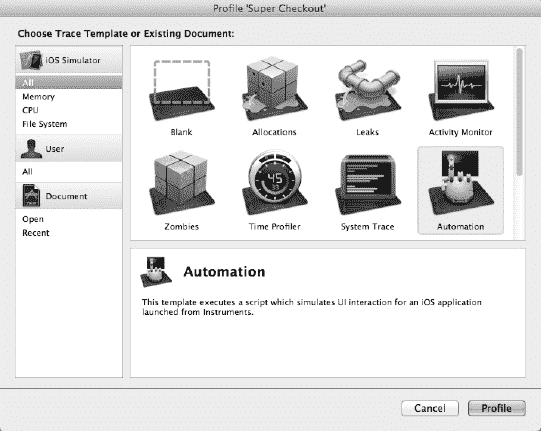

**图 8–12.** *自动化工具可以与其他多种工具组合使用。*

当工具加载完成后，它通常会自动开始录制并启动模拟器。如果你已经有写好的脚本，这能省下不少时间；不过你还没到那一步，所以现在可以先停止分析。

让我们来看看自动化工具（图 8–13）。详情视图包含一个侧边栏、一个编辑器面板和一个扩展详情视图。编辑器面板的跳转栏允许你在“跟踪日志”、“编辑器日志”和“脚本”视图之间切换。“跟踪日志”显示你从脚本中发布的调试数据。“编辑器日志”显示脚本执行过程。“脚本”视图则是你编写和录制脚本的地方。

右侧的详情视图显示来自详情视图的特定输出的详细信息。你还可以在这里看到测试失败时界面的截图。

在左侧侧边栏中，你可以看到该工具的各种设置。这些设置分为四个部分：状态、脚本、脚本选项和日志记录。我们逐一进行介绍。

- *“状态”部分* 仅告诉你脚本当前是否正在运行。仅此而已。不过，双击侧边栏的这部分会在当前视图和“脚本”视图之间切换编辑器面板。
- *“脚本”部分* 允许你向当前工具添加或移除脚本。点击“添加”按钮可以创建新脚本或导入现有脚本。
- *“脚本选项”部分* 让你选择是在工具开始录制时立即运行脚本，还是等待你手动启动。还有一个“暂停”按钮用于暂时停止当前脚本。
- *“日志记录”部分* 允许你选择日志记录的位置、导出当前日志以及截取当前应用状态的截图。

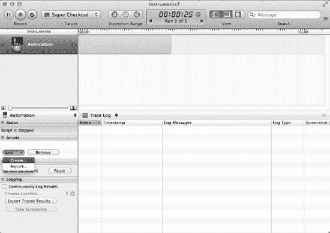

**图 8–13.** *随着脚本库的扩展，侧边栏的脚本部分将帮助你进行管理。*

现在创建一个脚本。从侧边栏的“脚本”部分，点击“添加”按钮并选择“创建”菜单项。你会注意到“脚本”部分出现了一个“新脚本”项，并且编辑器面板已切换到“脚本”视图。要重命名你的脚本，只需双击侧边栏中的脚本项即可。

**注意：** 如果你已有现有脚本，或者想创建一个独立于 Instruments 的脚本库，你可以在文件系统中创建脚本，然后选择“导入”菜单选项来定位该脚本。

在编辑器面板中，你的脚本应该已经包含了一些代码。

`var target = UIATarget.localTarget();`

在编辑器底部，你会看到“播放”、“录制”和“停止”按钮。这些按钮控制脚本本身，与位于窗口左上角的 Instruments 应用自身的控制按钮不同。为了快速上手这个脚本，你需要使用录制功能。脚本录制需要 iOS 5.0 中提供的 UIAutomation 版本，因此在此之前，你需要确保 Instruments 设置为在 iOS 5.0 下运行你的应用。


尽管您为 iOS 5.0 构建了应用，但 Instruments 仍可在不同 OS 版本下模拟该应用，并且根据您的设置，它可能默认使用旧版本。为确保配置正确，您需要更改启动选项。从目标下拉菜单中选择“选项”，然后在“模拟器配置”部分选择“iPhone - 模拟器 - iOS 5.0”（图 8–14）。请注意，在更改此配置前，务必先停止仪器。

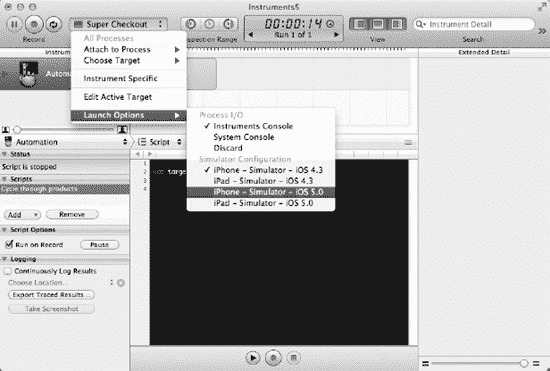

**图 8–14.** *在多个 iOS 版本下测试用户界面非常方便。*

一切准备就绪后，点击“录制”按钮启动模拟器。应用应自动启动。Super Checkout 启动后，您就可以开始与之交互。操作时，您会看到脚本编辑器中开始填充 JavaScript 操作。这些操作被分解为多个令牌。点击这些令牌右侧的展开箭头将显示其他选项。稍后这将派上用场。您可以随时点击“录制”按钮停止脚本录制会话。然后，点击窗口左上角的“仪器会话录制”按钮（而非“脚本录制”按钮），您的脚本应开始在设备上回放。

**注意：** 如果点击“录制”按钮后无法启动应用，请确保模拟器未被其他进程占用。如果 Xcode 正在模拟器中调试应用，这可能会阻止 Instruments 正常连接。

让我们使用录制器编写一个实用脚本，并进一步了解 UI Automation JavaScript 库。从侧边栏中删除刚编写的脚本，新建一个名为“循环浏览产品”的脚本。开始录制新脚本。首先，从产品表格中选择一个产品。在产品详情视图中，点击“返回”按钮。您的脚本应类似如下：

```
var target = UIATarget.localTarget();

target.frontMostApp().mainWindow().tableViews()["Empty list"].cells()[0].scrollToVisible();
target.frontMostApp().mainWindow().tableViews()["Empty list"].cells()[0].tap();
target.frontMostApp().mainWindow().navigationBar().leftButton().tap();
```

**注意：** 务必注意，由于自动化仪器会记录每一个 UI 事件，因此您的结果可能因与模拟器的交互方式不同而略有差异。

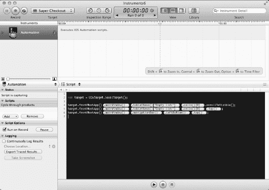

**图 8–15.** *自动化脚本的令牌在创建迭代脚本时非常有用。*

如果您回放此脚本，它将精确执行您录制的操作，仅此而已。实用性不强，但这是脚本的一个良好起点。每个表达式中的元素令牌（图 8–15）功能极为强大。点击令牌右侧的箭头将显示该令牌的选项。每个选项都是指向同一界面元素的另一种方式。例如，`cells()[0]` 可能等同于 `cells()["First Cell"]`，这两个选项都会出现在令牌中。如果您双击某个令牌，它将被转换为纯文本，您可以根据需要进行修改。

您的目标是遍历所有单元格，并对表格中的每个产品执行相同操作。首先，需要将单元格获取为数组，以便将其长度用作 `for` 循环的边界。让我们从录制的某一行代码中提取，仅保留单元格数组，并将其存储到一个变量中。

```
var cells = target.frontMostApp().mainWindow().tableViews()["Empty list"].cells();
```

接下来，编写一个简单的 `for` 循环，遍历这些单元格并对每个单元格执行录制的操作。为此，只需双击 `cells()[0]` 令牌，并将 0 替换为循环索引。

```
for(var i = 0; i < cells.length; i++) {
        target.frontMostApp().mainWindow().tableViews()["Empty list"].cells()[i].scrollToVisible();
        target.frontMostApp().mainWindow().tableViews()["Empty list"].cells()[i].tap();
        target.frontMostApp().mainWindow().navigationBar().leftButton().tap();
}
```

如果运行此脚本，应用应会启动，并依次处理表格中的每个产品。现在您已经有一个相当不错的迭代脚本了，但它并没有执行任何实际有用的操作。请结合所学内容，退一步思考，编写一个实用脚本来测试完整的用户流程。

### 编写用户界面测试脚本

您决定为一系列相互关联的用户流程编写一组测试。这些流程包括：将产品添加到购物车、从商店进入购物车、结账、以及返回商店。这四个操作将各自以预期的界面状态作为验证依据进行测试。同时，您还希望能够衡量应用的性能并自动化重复性操作，从而无需手动测试。

以下是实现这一目标的脚本：

```
var target = UIATarget.localTarget();

var cells = target.frontMostApp().mainWindow().tableViews()["Empty list"].cells();

for(var i = 0; i < cells.length; i++) {
        UIALogger.logStart("Opening product "+i);
        cells[i].scrollToVisible();
        cells[i].tap();

        var productDetailsTable = target.frontMostApp().mainWindow().tableViews()["Empty list"].cells()["Add To Basket"];
        if(productDetailsTable == UIAElementNil) {
                UIALogger.logFail();
        } else {
                UIALogger.logPass();
        }

        UIALogger.logStart("Adding product "+i+" to cart");
        productDetailsTable.tap();

        var cartButton = target.frontMostApp().mainWindow().navigationBar().rightButton();
        var quantity = i + 1;

        if(cartButton.label().search("("+quantity+")") == -1) {
                UIALogger.logFail("Expected cart button to display "+quantity+" items, but found "+cartButton.label());
        } else {
                UIALogger.logPass();
        }
}

UIALogger.logStart("Opening the cart");
target.frontMostApp().mainWindow().navigationBar().rightButton().tap();

var storeButton = target.frontMostApp().mainWindow().navigationBar().rightButton();

if(storeButton.label().search("Store") == -1) {
        UIALogger.logFail("Expected to find Store button in navigation item");
} else {
        UIALogger.logPass();
}

UIALogger.logStart("Checkout");
var cartTable = target.frontMostApp().mainWindow().tableViews()["Empty list"];
var checkoutButton = cartTable.groups()["Checkout"].buttons()["Checkout"];
checkoutButton.scrollToVisible();
checkoutButton.tap();

target.delay(2);

if(cartTable.cells().length > 1) {
        UIALogger.logFail("Checkout should have emptied the cart, but cart still holds "+cartTable.cells().length+" cells");
} else {
        UIALogger.logPass();
}

UIALogger.logStart("Return to catalog");
target.frontMostApp().mainWindow().navigationBar().rightButton().tap();

var cartButton = target.frontMostApp().mainWindow().navigationBar().rightButton();

if(cartButton.label().search("Cart") == -1) {
        UIALogger.logFail("Expected to find Cart button in navigation item");
} else {
        UIALogger.logPass();
}
```

我们来分解一下这个脚本的各组成部分。首先，与之前的示例类似，您需要设置一个 `for` 循环来遍历产品目录表格中的每个单元格。`UIAElementArray` 的行为类似于传统的 JavaScript 数组，但有一个额外优势：您可以使用元素的标签属性从数组中检索它。`length` 属性提供了访问数组中 `UIAElement` 数量的途径。

```
for(var i = 0; i < cells.length; i++) {
```


在`for`循环中，你将执行两个测试场景。第一个测试是打开产品详情界面，第二个测试是将该产品添加到购物车。为了创建一个测试场景，你需使用`UIALogger`函数`logStart()`。该函数向测试工具指示你已开始一个场景，并将记录作为参数传入的消息。要结束测试场景，则调用`logFail()`或`logPass()`函数。根据调用的是这两个函数中的哪一个，场景将显示为通过或失败。`logFail()`函数还有一个额外特性：调用时会自动截图。该截图以及任何关于失败的信息都将在测试工具中可用。在测试场景内（即从`logStart()`到传递或失败调用之间）发生的所有调试日志和元素日志，都会在日志中被该场景包裹。

**注意：** 除了记录成功和失败，`logStart()`及相关日志函数还会在测试工具时间线中分隔反馈，以便你轻松识别通过和失败。此外，在时间线上拖动播放头会在详情视图中显示相关的日志消息。这对于将操作与其他测试工具的数据关联起来非常有用。

第一个测试将简单地滚动到目标单元格，点击它，然后查找标签为“Add to Basket”的单元格。如果找到该单元格，则产品详情已成功显示，测试通过。如果未找到该单元格，则必须使测试失败。需要指出的是，当测试失败时，脚本不会停止。它将继续运行，并为后续测试记录通过和失败。

```
UIALogger.logStart("Opening product "+i);
cells[i].scrollToVisible();
cells[i].tap();

var addToCartCell = target.frontMostApp().mainWindow().tableViews()["Empty list"].cells()["Add To Basket"];
if(addToCartCell == UIAElementNil) {
    UIALogger.logFail();
} else {
    UIALogger.logPass();
}
```

接下来，你要测试将产品添加到购物车。你将点击“Add To Basket”单元格。这会导致详情视图控制器从导航栈中弹出，并且购物车按钮会更新以显示新的数量。你应该能够通过测试购物车按钮的标签是否显示预期数量来判断此测试是通过还是失败。

```
UIALogger.logStart("Adding product "+i+" to cart");
addToCartCell.tap();

var cartButton = target.frontMostApp().mainWindow().navigationBar().rightButton();
var quantity = i + 1;

if(cartButton.label().search("("+quantity+")") == -1) {
    UIALogger.logFail("Expected cart button to display "+quantity+" items, but found "+cartButton.label());
} else {
    UIALogger.logPass();
}
```

现在，既然你已经将所有产品添加到购物车，就可以打开购物车了。购物车视图的右侧导航栏按钮标签为“Store”，因此你将查找该标签以指示你已成功移动到该视图。

```
UIALogger.logStart("Opening the cart");
target.frontMostApp().mainWindow().navigationBar().rightButton().tap();

var storeButton = target.frontMostApp().mainWindow().navigationBar().rightButton();

if(storeButton.label().search("Store") == -1) {
    UIALogger.logFail("Expected to find Store button in navigation item");
} else {
    UIALogger.logPass();
}
```

最后，你可以结账。你将找到标签为“Checkout”的按钮，滚动到它，然后点击它。这会导致表格以动画方式清空。一旦表格清空，你可以检查表格中单元格的数量。它应该只包含一个单元格，即标签为“Checkout”的那个。

你会注意到这里调用了`UIATarget`的`delay()`函数。该函数会将脚本暂停指定的秒数。因为你需要测试表格的单元格计数，而不是测试界面元素的存在或值，传统的超时方法无法生效。你需要给动画时间完成，然后再测试表格的单元格计数。如果单元格计数不符合预期，你需要记录一个失败（参见图 8–16）。你无需记录表格单元格的内容，因为会自动截图供你稍后检查。每次记录失败时都会发生这种情况（参见图 8–17）。

```
UIALogger.logStart("Checkout");
var cartTable = target.frontMostApp().mainWindow().tableViews()["Empty list"];
var checkoutButton = cartTable.groups()["Checkout"].buttons()["Checkout"];
checkoutButton.scrollToVisible();
checkoutButton.tap();

target.delay(2);

if(cartTable.cells().length > 1) {
    UIALogger.logFail("Checkout should have emptied the cart, but cart still holds "+cartTable.cells().length+" cells");
} else {
    UIALogger.logPass();
}

UIALogger.logStart("Return to catalog");
target.frontMostApp().mainWindow().navigationBar().rightButton().tap();

var cartButton = target.frontMostApp().mainWindow().navigationBar().rightButton();

if(cartButton.label().search("Cart") == -1) {
    UIALogger.logFail("Expected to find Cart button in navigation item");
} else {
    UIALogger.logPass();
}
```

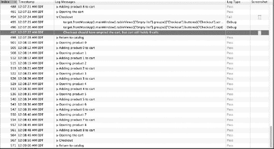

**图 8–16.** *记住添加延迟以考虑自定义或非过渡动画。*


**图 8–17.** *调用`logFail()`会自动截图。这对于调试失败非常有用。*


### 引入一个 Bug

现在你已经拥有一个功能完备的自动化测试脚本，可以成功测试指定的用户流程，我们来看看它的价值所在。与单元测试不同，在应用程序构建完成之前编写自动化脚本虽然并非完全不可能，但极其困难。你确实应该记录并规划好用户旅程和界面，完全可以基于这些文档编写脚本，但手工编写脚本可能非常繁琐。自动化界面测试的主要用途是维护用户流程的完整性，在开发过程中剔除回归性错误，以及进行性能测试。让我们看看你的测试如何在应用中实现这一目标。

举个例子，假设你采用了一种新的日志格式，需要更新应用中所有使用的 `NSLog` 函数。你正在处理 `ProductDetailsViewController`。当 API 引擎通知你已收到将产品添加到购物车的请求时，你会发布一条通知并记录一条日志信息。这部分需要重新设计，而在开发过程中，你无意中犯了一些小错误。

在你修改之前，该方法看起来是这样的：

```
-(void) cartContentsReceived:(NSDictionary *)cart forRequest:(NSString *)connectionIdentifier {
        NSLog(@"Shopping cart contents: %@", cart);
        NSNotification *note = [NSNotification notificationWithName:@"CartUpdated" object:[NSNumber numberWithInt:[[cart objectForKey:@"items"] count]]];

        [[NSNotificationCenter defaultCenter] postNotification:note];

        [self.navigationController popViewControllerAnimated:YES];
}
```

新方法原本只是打算增加更多日志记录，现在看起来是这样的：

```
-(void) cartContentsReceived:(NSDictionary *)cart forRequest:(NSString *)connectionIdentifier {
        NSLog(@"%s Shopping cart contents: %@", __PRETTY_FUNCTION__, cart);
        NSNotification *note = [NSNotification notificationWithName:@"CartUpdated" object:[NSNumber numberWithInt:[[cart objectForKey:@"items"] count]]];

        [[NSNotificationCenter defaultCenter] postNotification:note];

        NSLog(@"%s Notification posted: %@", __PRETTY_FUNCTION__, note);
}
```

你可能会注意到，旧方法和新方法之间存在一个主要的、不符合预期的差异。在你过度热情的日志记录工作中，你意外删除了方法的最后一行，即将当前视图控制器从堆栈中弹出。

这种错误用肉眼特别难以发现，因为它并不会表现为一个明显的错误。应用程序不会崩溃，商品依然会被添加到用户的购物车中，当用户点击返回按钮时，购物车按钮也已更新显示新数量。唯一改变的是用户体验。

现在，让我们在应用上运行该脚本，看看它能否帮你找到这个棘手的界面/回归性错误。按 Control+I 启动 Instruments 并设置一个 Automation 工具。运行你之前运行过的脚本。一旦到达将产品添加到购物车的测试部分，脚本就会在导航栏中查找一个标签反映了新购物车商品数量的按钮。

```
var cartButton = target.frontMostApp().mainWindow().navigationBar().rightButton();
var quantity = i + 1;

if(cartButton.label().search("("+quantity+")") == -1) {
        UIALogger.logFail("Expected cart button to display "+quantity+" items, but found "+cartButton.label());
} else {
        UIALogger.logPass();
}
```

由于你意外修改了应用的流程，这个脚本将会失败。幸运的是，你会获得脚本失败瞬间的截图记录，以及一条指示哪里出错的提示信息。隔离出负责这部分代码并检查修订历史以找出改变之处，应该不会太困难。

### 自动化的力量

除了发现错误和确保用户体验的完整性外，自动化还可以帮助你微调应用的性能。通过将其与其他 Instruments 工具结合使用，你可以详细了解应用在各种情况下的行为表现。为所有用户流程和用例编写脚本是一个绝佳的主意。当所有这些脚本都编写完成后，你可以结合 CoreData instruments 工具运行它们，以找到可能需要优化数据获取的地方。你可以添加 Allocations 工具来查看应用在任何给定时刻使用了多少内存，从而找出需要消除的可能有害的内存峰值（图 8-18）。


**图 8-18.** *将其他 Instruments 工具与 Automation 结合使用，可以将数据与用户操作关联起来。*

在开发周期早期就设置并使用自动化，并为所有用户交互编写脚本，从长远来看将带来巨大的回报，无论是更好的性能还是更高的可控性。

### 无论如何都要测试

简而言之，这就是测试。你已经有了单元测试套件的雏形，你的 JSON 解析器包装器比开始时要好一些，并且你已经为自动化工具编写了大部分用例的脚本。诚然，这一切都非常临时。你真正需要的是一个测试策略。

你的测试策略是用来为混乱局面带来条理性的。正如你所见，无论测试能节省多少时间，设置测试本身需要时间。它可以为你带来很多好处，节省大量时间，但如果它总是事后才被想起，你就无法充分利用它。

无论你是 TDD 的坚定拥护者，还是只需要弄清楚为什么你的应用左右不停地泄漏内存，测试都是一项需要学习的重要技能，而 Xcode 和开发者工具将帮助你做到这一点。

