# 我们能自动化部分内容吗？

现在你的应用经过了全面测试，Beta 版也已经启动，你开始收到一些新功能请求。你决定再带几个人加入项目来帮助完成最后冲刺。新来的开发者很优秀，但他们不像你那样熟悉你漂亮应用内部的工作机制，所以你担心他们可能会一头扎进去，不小心把地方搞砸。你正忙于修复错误和添加功能，所以没法每次都抽出时间在新来的开发者推送更


### 持续集成

持续集成通常简称为“CI”，是指在项目生命周期中持续执行质量控制检查的过程，而非定期进行。在非 CI 项目团队中，成员可能每周聚在一起运行测试并评估项目的底层健康状况；而采用 CI 导向的团队则会持续运行测试，以随时掌握情况，确保其集成不会引入错误。

过去，持续集成系统可能简单到只需设置一个定时任务，每小时执行一次项目的单元测试。这种方式能提供持续的反馈，并通知开发者集成问题，但它实际上只适用于单人开发团队。现代 CI 主要依赖软件来自动化测试和分析。这类软件通常运行在服务器上，并配置为在开发者的代码导致构建失败时通知他们。该服务器通常负责多个 CI 任务；在某些情况下，它会分布在多台服务器上以处理更大的构建负载。

市场上有许多持续集成软件包。其中最流行的 CI 应用之一是 Jenkins。为了让你的新团队保持正轨，你将搭建一个 Jenkins 实例，用于自动化构建、测试、分析和部署。

#### 认识 Jenkins

Jenkins 是一款基于 Java 的应用程序，拥有 Web 界面，允许你通过 Shell 脚本接口或丰富的插件库，设置由各种事件触发的构建任务。Jenkins 还提供用户和权限管理功能，非常适合包含承包商和客户的大型团队。借助其庞大的插件库，Jenkins 支持包括 Subversion、CVS 和 Git 在内的多种版本控制系统。此外，Jenkins 是开源且免费的。

**注意：** 在使用 Jenkins 时，你可能会看到名为 Hudson 的产品。2011 年之前，Jenkins 被称为 Hudson 项目，该项目始于 Sun Microsystems 公司。2010 年底，出现了一个商标问题，导致项目开发出现分支，于是 Jenkins 诞生了。如今，Hudson 项目由 Oracle 支持，而 Jenkins 则由社区继续开发。

#### 让 Jenkins 启动并运行

Jenkins 可以从[`http://jenkins-ci.org/`](http://jenkins-ci.org/)下载。由于基于 Java，它支持跨平台，可以安装在各种操作系统上，包括 OS X。在撰写本文时，Jenkins 的最低要求是 Java 运行环境 v1.5。要安装它，你需要三样东西：目标服务器的管理员访问权限；创建运行用户的能力；以及通过远程屏幕共享或直接方式控制机器的能力。

创建新用户时，你需要做几件事来为 Jenkins 做准备。首先，需要生成新的密钥。你需要任何从你的代码仓库（无论是 Github 还是其他）检出代码所需的 SSH 认证。Jenkins 将定期检出你的项目，你需要确保它能够做到这一点。其次，你需要从苹果开发者门户获取证书和密钥。你的开发机器或账户上可能已有这些密钥，但 Jenkins 用户需要拥有自己的、包含独立密钥和证书的钥匙串。你还需要为这些证书获取有效的配置文件，并将其导入 Xcode 的组织器中。一旦 Jenkins 用户完成了恰当的密钥配置、证书认证和配置文件准备，你就可以设置 Jenkins 环境了。

Jenkins 的安装非常简单。只需下载安装程序包并运行它（图 9–1）。安装完成后，你会在“应用程序”目录中找到名为 Jenkins 的文件夹。

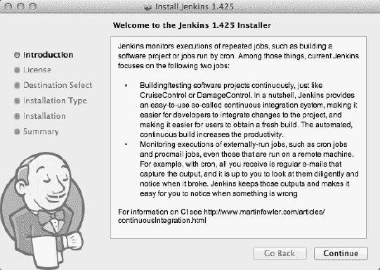

**图 9–1.** *安装过程应该很熟悉。不会有意外或陷阱。*

在 Jenkins 文件夹中，你会找到 Jenkins 的`.WAR`（Java Web 存档）文件。如果你不熟悉 Java，这就是 Web 应用程序的可执行文件。通常无需手动运行`.WAR`文件，因为安装脚本应该已经为你启动了 Jenkins。要确认它正在运行，只需打开浏览器并访问[`http://localhost:8080/`](http://localhost:8080/)即可。


#### Jenkins 界面

Jenkins 仪表板（图 9–2）起初会显得相当空旷。一旦你配置好一些任务，它就会显示所有当前被跟踪项目的状态摘要。左侧的侧边栏为你提供导航、队列中的构建列表以及构建执行状态。

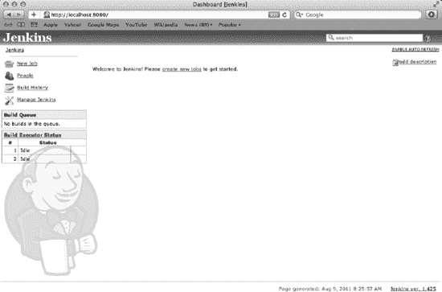

**图 9–2.** *一旦充满数据，Jenkins 仪表板将变得极为实用。*

为了更熟悉 Jenkins，让我们进入管理部分。从仪表板的侧边栏中，点击 `Manage Jenkins` 链接。管理页面（图 9–3）是配置和监控 Jenkins 实例各个方面的中心枢纽。让我们逐一介绍管理菜单。

-   **Configure system（配置系统）**：系统配置页面允许你更改系统路径、设置并发构建执行的数量、创建环境变量，并对添加到系统中的任何插件进行设置。需要注意的是，Jenkins 设计为平台和项目无关，因此并非所有设置都适用于或对 iOS 开发者有意义。
-   **Reload configuration from disk（从磁盘重新加载配置）**：Jenkins 配置文件存在于你的文件系统中，可以直接修改。如果你选择这种方式，重新加载选项将强制 Jenkins 读取这些文件并将新设置应用到系统中。
-   **Manage plug-ins（管理插件）**：Jenkins 的可扩展性或许是它最强大的方面。有许多可用的插件可以为各种平台、语言和版本控制系统添加支持。此外，还有添加新通知形式的插件：Jabber、Skype、Twitter 等。插件管理页面允许你更新、查找、安装和移除插件。请务必查看臭名昭著的 Chuck Norris 插件。
-   **System information（系统信息）**：系统信息页面列出了基本的系统信息，以及已安装的插件和环境变量。
-   **System Log（系统日志）**：你可以在系统日志页面配置记录哪些类型的数据。你还可以在单独的日志记录器中分组和过滤日志数据。
-   **Load statistics（负载统计）**：随着任务数量的增加，Jenkins 的负载也会增加，监控性能将变得更加重要。负载统计页面提供了一个漂亮的图表，让你了解系统的高峰和低谷。
-   **Jenkins CLI**：是的，Jenkins 可以通过命令行操作。这在大多数情况下并非必要，但在更复杂的系统中可能会很方便。此接口也可以通过几个聊天插件（Jabber、Skype 等）使用。
-   **Script console（脚本控制台）**：Jenkins 支持一种名为 Groovy 的脚本语言，该控制台让你能够访问 Groovy 接口。你可以在 [`http://groovy.codehaus.org`](http://groovy.codehaus.org) 了解更多关于 Groovy 的信息。
-   **Manage nodes（管理节点）**：Jenkins 支持通过节点进行分布式构建。如果你的网络上有多个 Jenkins 实例，你可以在此处将它们链接起来。
-   **About Jenkins（关于 Jenkins）**：关于页面提供了有关用于构建 Jenkins 的所有框架（及其相关许可证）的信息。
-   **Prepare for shutdown（准备关机）**：任务构建可以由多种事件触发，因此很难预测任务何时开始。不中断这些任务很重要，因此强烈建议你在关闭计算机之前让 Jenkins 做好关机准备。这将阻止新任务启动，并允许你在不冒损坏项目工作区风险的情况下关闭系统。

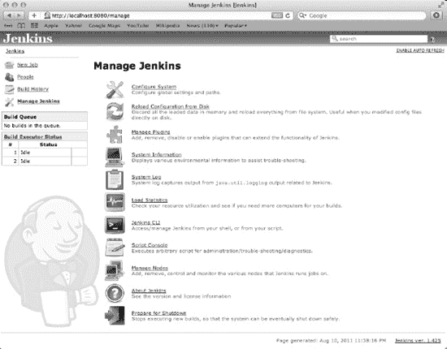

**图 9–3.** *管理页面是所有 Jenkins 配置的中心。*

在设置你的第一个任务之前，你需要添加一些方便的环境变量和插件。让我们从环境变量开始。点击管理页面上的 `Configure System` 链接。在“配置系统”页面上，点击“**Global properties（全局属性）**”标题下的 `Environment variables` 复选框（图 9–4）。这将显示一个键值对列表，该列表应该是空的。点击 `Add` 按钮添加一个新的键值对。你在此处设置的环境变量（键）将在任务配置中使用它们的任何地方被展开（成它们的值）。这是放置系统范围设置的绝佳位置，例如最终的发布目录、Web 服务器地址或 SDK 路径。表 9–1 提供了一些环境变量建议列表。

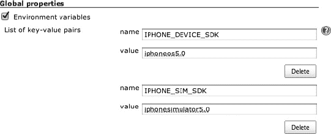

**图 9–4.** *将所有与 SDK 相关的参数放在环境变量中是一个好主意，这样你就可以在一个地方更改它们。*

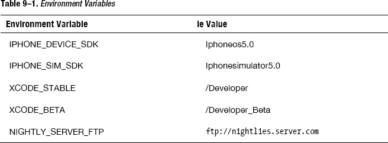

目前，请确保你至少设置了 SDK 变量。稍后在进行自动部署时，你会添加更多变量。完成后，点击页面底部的 `Save` 按钮以确保更改生效。

接下来，你需要安装一些重要的插件，以使 Jenkins 能够构建你的项目。首先，你需要 Git 插件。从 `Manage Jenkins` 页面，点击 `Manage Plug-ins` 链接。在“插件管理”页面上，切换到 `Available` 选项卡。在此页面上查找特定插件最简单的方法是使用浏览器的 `Find` 功能（在大多数浏览器中是 `Control+F`）。找到 Git 插件后，勾选左侧的复选框以标记安装。请注意，有几个与 Git 相关的插件，包括一个 GitHub 插件。这些可能对你有用，但不是运行任务所必需的。在继续之前，请确保你已选择了 Git 插件。

页面底部是 `Install` 按钮。点击此按钮后，你会看到插件安装状态页面（图 9–5），该页面会通知你安装进度。你需要重启 Jenkins 才能使插件生效，因此请勾选“**安装完成且没有任务运行时重启 Jenkins**”复选框，以确保 Jenkins 在安装完成后重启。

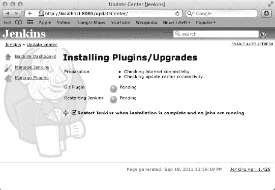

**图 9–5.** *插件安装很容易，但请确保在配置任何插件之前重启 Jenkins。*

插件安装完毕且 Jenkins 重启后，你就可以设置你的第一个任务了。然而，首先需要确保 Jenkins 在正确的用户下运行，并且拥有从你的仓库检出代码的权限。

每当你安装一个新插件时，该插件的配置选项都会添加到 `Configure System` 页面。Github 要求用户在使用任何仓库之前标识自己，因此你需要向插件提供一个名称和电子邮件地址。从仪表板中，点击 `Manage Jenkins`，然后点击 `Configure System`。向下滚动到 Git 插件部分，添加你希望与 Jenkins 关联的名称和电子邮件地址。别忘了点击页面底部的 `Save` 按钮。


### 驱逐 Jenkins 的守护进程

你将设置托管在 Github 上的 Super Checkout 任务。Git 插件为 Jenkins 增加了对 Git 作为版本控制系统（VCS）的支持，但由于 Github 需要 SSH 认证密钥，而 Jenkins 目前是由一个名为 `daemon` 的隐藏用户运行的，因此暂时无法与 Github 通信。为了启用 SSH 密钥，你需要用你自己的用户（在安装之前设置好的）来替换这个用户。或者，你也可以简单地使用 HTTPS 协议的 Git，但那样速度会慢一些。

让 Jenkins 使用你自定义的用户相当简单。首先，你需要关闭 Jenkins。即使你还没有设置任何任务，养成通知 Jenkins 即将关闭的习惯也是个好主意。所以，请先在浏览器中打开 Jenkins 仪表板。从侧边栏点击**管理 Jenkins**，然后点击页面底部的**准备关闭**。

准备好关闭 Jenkins 后，打开终端。你需要完全关闭 Jenkins 守护进程。正确的方法是使用 `launchctl` 来卸载它，通过指定其配置 plist 文件，可以加载和卸载守护进程。配置 plist 包含了关于 `launchctl` 应如何运行守护进程的信息，包括应从哪个用户生成该进程。卸载 Jenkins 守护进程后，你可以调整 plist 以使用你的具有 SSH 授权的苹果认证用户，然后重新启动守护进程。

首先，像这样卸载 Jenkins 守护进程：

```
sudo launchctl unload -w /Library/LaunchDaemons/org.jenkins-ci.plist
```

在对 plist 本身进行任何操作之前，你需要先保存它的备份。

```
cp /Library/LaunchDaemons/org.jenkins-ci.plist ~/Desktop/org.jenkins-ci_backup.plist
```

接下来，在你选择的终端编辑器中打开 plist 文件。这是一个 plist 文件，所以其格式应该相当熟悉。这是一个简单的编辑，但如果你对终端不太熟悉，使用类似 `nano` 的工具来编辑可能会更合适。

```
sudo nano /Library/LaunchDaemons/org.jenkins-ci.plist
```

你感兴趣的键是 `UserName`，默认情况下它被设置为 `daemon`。只需将此值更改为 `jenkins`（或你给用户账户起的任何名字）。plist 中的该部分现在应如下所示：

```
<key>UserName</key>
<string>jenkins</string>
```

你也可以修改 Jenkins 存储其文件的位置。将 Jenkins 主目录放在 `/Users/Shared`（默认位置）是一个好主意，这样所有用户都能访问它。此设置的键是 `JENKINS_HOME`。无论你是否更改，请务必记下该位置，因为你稍后需要确保你的新用户对其拥有读写权限。完成后，保存更改并关闭 plist 文件。如果你使用 `nano`，可以通过按 `ctrl+X`，然后在确认对话框中按 `Y` 来完成。

最后一步是给予你的新用户对 Jenkins 主目录的所有权（如果你的用户和 Jenkins 主目录不同，你可能需要修改此代码）：

```
sudo chown -R jenkins /Users/Shared/Jenkins
```

现在，守护进程的配置 plist 已反映出你的用户，该用户对 Github 拥有足够的访问权限，你可以重新启动守护进程了。

```
sudo launchctl load -w /Library/LaunchDaemons/org.jenkins-ci.plist
```

跳回你的浏览器并重新加载 Jenkins 仪表板。Jenkins 应该正在启动。为了确认它是在正确的用户下运行的，打开**活动监视器**工具（图 9–6），并在**所有进程**下搜索一个由 `jenkins` 用户（或你给 Jenkins 起的任何名字）运行的 `java` 进程。

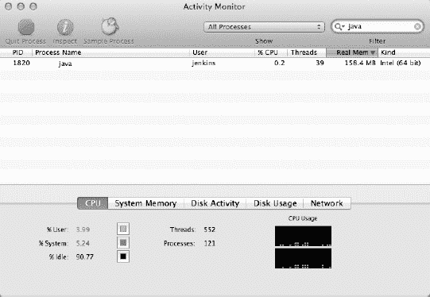

**图 9–6.** *你可能会有多个名为 java 的进程，但应该只有一个属于 jenkins。*

### 获取一个任务

在 Jenkins 中，与许多 CI 系统一样，一个任务（也称为一个项目）是一组构建指令，当触发事件发生时执行。这组指令通常包括从仓库重新检出或更新源代码、从源代码进行全新构建、单元测试、静态分析、文档生成和部署。简而言之，任务在触发器上执行项目构建。

触发器就是可用于启动任务的事件。Jenkins 支持三种类型的触发器。

*   **任务依赖**：当另一个任务完成时，可以触发任务。这非常适用于在依赖库被修改时级联执行一组任务。
*   **时间间隔**：当经过指定时间后，可以简单地触发任务。这非常适用于夜间构建或未使用源代码控制的项目。但你不会在像那样的项目上工作，对吧？
*   **SCM 轮询**：这可能是最有用的触发器。本质上，Jenkins 会轮询给定的仓库以查找更新，如果发现任何更新，就会触发构建。这确保了构建始终基于最新的代码库，并减少了因使用时间间隔触发器可能导致的不必要构建。

那么，让我们开始设置你的任务。首先，点击 Jenkins 侧边栏中的**新建任务**链接。任务创建页面（图 9–7）允许你为任务命名并选择项目的起点。你将专注于自由风格软件项目选项。一旦你在系统中有了一个任务，此列表底部将出现另一个选项，允许你使用现有任务作为新任务的模板。

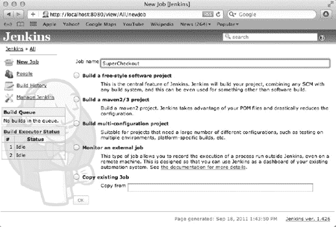

**图 9–7.** *请确保为你的任务指定一个独特且易识别的名称，因为你可能会发现仪表板很快就会变得杂乱。*

**注意：** 你的任务名称将用于在 Jenkins 主目录中创建一个目录，该目录将存放项目的所有资源和元数据。由于某些插件的编写方式，建议在任务名称中避免使用空格或其他对文件系统不友好的字符。

命名项目后，点击**确定**继续进入任务配置页面。配置页面允许你管理任务的许多方面，包括版本控制信息、触发器、构建步骤和构建选项。让我们从宏观层面浏览配置页面的每个部分。

*   **基本项目信息**：页面的最顶部部分允许你编辑项目的名称和描述，以及一些其他基本配置。**禁用构建**选项允许你禁用任务。
*   **高级项目选项**：高级选项主要用于更复杂的任务或拥有大型团队的项目。**静默期**选项允许你防止 Jenkins 在“提交突增”时为每次 VCS 提交进行构建，这通常会使系统过载。它创建了一个宽限期，在此期间 Jenkins 会等待，在构建前查看是否有其他提交正在处理。
*   **源代码管理**：这是你选择和配置仓库的地方。开箱即用，Jenkins 支持一些 SCM，但当你向系统添加插件以启用其他 SCM（例如 Git）时，它们将被添加到此列表中。
*   **构建触发器**：如前所述，任务的执行必须由事件触发。触发器部分允许你选择哪些事件将执行任务。
*   **构建**：这是任务配置的核心部分。它允许你向流程添加构建步骤，这些步骤可以采用多种形式。最常见的形式，至少是你最感兴趣的形式，是**执行 shell** 构建步骤类型（稍后会详细介绍）。
*   **构建后操作**：一旦你完成了成功（或不成功）的构建，你应该对其执行一些操作。构建后操作允许你通知用户、将构建结果发布到某处，甚至启动另一个任务的执行。


### Jenkins Job: 配置与执行

任务是按步骤执行的，因此在开始配置之前，我们先考虑一下执行流程。首先，你需要从 Github 检出项目。当 Jenkins 获取到最新代码的副本后，你需要构建它。构建完成后，需要运行静态分析器并归档二进制文件。

#### 配置源码检出

假设你已经安装了 Git 插件，从 Github 检出代码的设置相当简单。只需向下滚动到配置页面的“源码管理”部分（图 9–8），然后选择 Git 单选按钮即可。如果你已经为 Jenkins 配置了 SSH 密钥访问权限，可以使用来自 Github 的 SSH 仓库 URL，格式如下：

`git@github.com:<username>/<ProjectName>.git`

如果尚未配置或无法使用 SSH，可以使用带有基本身份验证的 HTTPS 仓库 URL，格式如下：

`https://<username>:<password>@github.com/<username>/<ProjectName>.git`

如果你对安全性有所了解，就会发现这种情况存在风险。Github 仓库的用户名和密码将以明文形式存储。这并非理想情况，这也是你应该采用 SSH 密钥方式的原因之一。

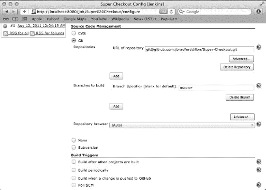

**图 9–8.** *幸运的是，一旦你设置好 Jenkins 用户，通过 SSH 配置 Git 就变得很简单了。*

除了仓库 URL，Git 插件还允许你指定要检出的分支以及其他一些高级设置。

当你配置好 Git 设置后，可以测试一下你的任务。滚动到页面底部并点击“保存”按钮。这将带你进入任务详情页面（图 9–9）。

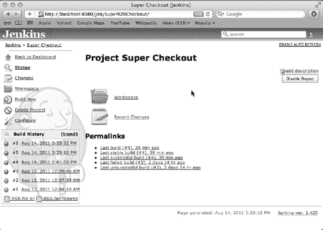

**图 9–9.** *随着任务内容不断充实，任务详情页面将成为一个极为有用的工具。*

#### 理解任务详情页

任务详情页面让你能够鸟瞰任务的全局、其历史记录以及当前产物。它主要包含三个部分：侧边栏、构建历史模块和永久链接模块。侧边栏提供了与 Jenkins 其他位置类似的导航选项。位于侧边栏下方的构建历史模块提供了最近几次任务执行的链接。永久链接模块提供了一些极其便捷的链接，指向最近的成功构建、失败构建等。

目前，详情页面可能看起来相当简洁。在侧边栏中，你应该能看到“立即构建”链接（图 9–10），它允许你手动启动任务执行。现在点击它，将你的任务添加到构建队列中。如果队列是空的（可以假设如此），任务将立即开始构建。当然，“构建”目前只是一个相对术语，因为你的任务目前只配置了检出项目的一个工作副本。

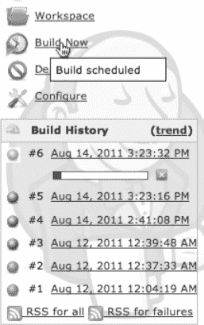

**图 9–10.** *构建历史侧边栏模块中的构建状态指示器会告诉你先前的构建是否成功。*

构建完成后，点击“构建历史”侧边栏模块或“永久链接”模块中的链接。这将打开“构建详情”页面。与“任务详情”页面类似，“构建详情”页面会展示特定构建的详细信息。安装了 Git 插件后，你会看到一些关于检出的数据。如果任务是由 SCM 轮询触发的，提交信息将显示在页面顶部附近。在侧边栏中，你会看到几个选项，包括编辑构建信息的能力。这对于标记里程碑构建非常有用。还有一个指向构建控制台输出的链接。点击该链接查看本次构建的输出。输出内容应该类似于：

```
Started by user anonymous
Checkout:workspace / /Users/Shared/Jenkins/Home/jobs/Super Checkout/workspace - hudson.remoting.LocalChannel@56de24c5
Using strategy: Default
Last Built Revision: Revision 6eaa5c595fa51a898434f5d300f4a49712f567b4 (origin/master)
Checkout:workspace / /Users/Shared/Jenkins/Home/jobs/Super Checkout/workspace - hudson.remoting.LocalChannel@56de24c5
Fetching changes from 1 remote Git repository
Fetching upstream changes from git@github.com:jbradforddillon/Super-Checkout.git
Commencing build of Revision 6eaa5c595fa51a898434f5d300f4a49712f567b4 (origin/master)
Checking out Revision 6eaa5c595fa51a898434f5d300f4a49712f567b4 (origin/master)
Finished: SUCCESS
```

“控制台输出”页面对于调试任务非常有用。例如，如果你输入的 Git 仓库信息不正确，控制台会显示关于检出失败的信息，你就可以确定原因。

#### 配置构建触发器

现在你已经有了一个可以工作的 Github 检出功能，让我们来完成任务的配置。回到“任务详情”页面，点击“配置”链接。在任务配置页面上，向下滚动到“构建触发器”部分（图 9–11）。

基于你的 Github 项目，每当 `master` 分支有变更时，都应该构建此任务。因此，SCM 轮询触发器正是所需之物。点击“轮询 SCM”复选框，将显示“计划”文本框，你可以在其中告诉 Jenkins 多久轮询一次仓库以检测变更。当在时间间隔内检测到变更时，将触发构建。

轮询计划本质上是一个 CRON 表达式。输入包含五个字段：分钟、小时、一个月中的天、月份、一周中的天。星号是通配符，表示该字段的所有值都有效。你还可以使用几个有用的指令，包括 `@hourly` 和 `@midnight`。你希望任务每五分钟轮询一次 Github，因此你的计划表达式将是 `5 * * * *`。

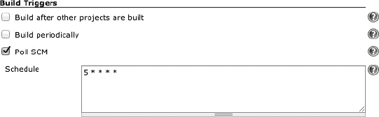

**图 9–11.** *CRON 表达式格式让你拥有很大的控制权。*

触发器已设置好，现在可以设置构建步骤了。和往常一样，别忘了点击页面底部的“保存”。


#### 脚本化 Xcode

Xcode 自带一个强大的命令行接口：`xcodebuild`。`xcodebuild` 工具会在当前路径下搜索 Xcode 项目文件，读取配置，然后编译项目。它还允许你通过命令行覆盖所有配置和编译器标志。本质上，只要是与代码编译相关的操作，你在 Xcode 中能做的，都可以通过命令行使用 `xcodebuild` 来完成。由于 Jenkins 能很好地与 Shell 脚本配合，`xcodebuild` 将在任务执行期间管理你的编译过程。

在深入介绍 `xcodebuild` 之前，我们先看看它的实际应用。打开一个终端窗口，运行以下命令：

`cd <PATH/TO/SUPER/CHECKOUT>`
`xcodebuild -sdk iphonesimulator5.0 -configuration Debug`

接下来，你会看到 `xcodebuild` 施展魔力时输出的原始编译器日志。它会类似这样：

`Build settings from command line:`
`    SDKROOT = iphonesimulator5.0`

`=== BUILD NATIVE TARGET Super Checkout OF PROJECT Super Checkout WITH CONFIGURATION Debug ===`
`Check dependencies`
`<每个文件被编译和链接时的大量输出>`

`** BUILD SUCCEEDED **`

如果编译过程中出现任何错误，你会像在 Xcode 中一样在终端里看到它们。如果你的构建产生了任何警告，你也可以像在 Xcode 中一样通过滚动编译器输出来查找它们。

`xcodebuild` 有几个选项标志，可以让你控制构建过程。以下是一些重要的标志：

*   `-project`：此标志允许你指定相对于当前目录要构建的项目。具体来说，你需要提供 `xcodeproj` 文件的完整名称。如果不提供此标志，`xcodebuild` 会在当前目录下寻找项目。如果找到多个项目（或工作区），则会失败并列出它们。
*   `-target`：此标志允许你指定要构建的目标。在处理复杂项目或发布里程碑构建（例如，夜间构建）时，这个标志非常方便。
*   `-workspace`：除了传统的项目文件外，`xcodebuild` 还会查找工作区文件并解析它们的模式和设置。使用此标志来指定要构建的工作区。
*   `-scheme`：如果要构建工作区，此标志会指定一个模式。需要注意的是，目标和工作区不能混用，模式与项目也是如此。请使用正确的标志组合。
*   `-sdk`：此标志允许你选择针对哪个 SDK 进行编译。通常，你使用它来区分模拟器构建和真机构建。
*   `-configuration`：大多数目标至少有两个配置：Debug 和 Release。配置标志允许你通过名称选择要构建的配置。`xcodebuild` 使用的默认配置可以在 Xcode 的项目详情视图的“信息”选项卡中指定。
*   `-showsdks`：你可以使用此标志来了解哪些 SDK 可用，以及 `xcodebuild` 如何称呼它们。
*   其他：还有一些其他标志和选项。你可以通过查看 `xcodebuild` 的主页来了解更多信息。

除了这些标志，你还可以附加任何你想要的额外编译器标志或设置。以下是使用这些基本标志的示例：

`$ xcodebuild -project MyAppProject -target MyApp -sdk iphone5.0 -configuration Release`

此示例将针对 iOS 5.0 SDK（真机）构建 `MyAppProject` Xcode 项目的 `MyApp` 目标，并使用 Release 配置。Xcode 项目中与 Release 配置相关的任何设置都将在编译期间应用于构建。如果你想添加一个编译器标志，只需像这样将其附加到命令中：

`$ xcodebuild -target MyAppTarget -sdk iphone5.0 SOME_COMPILER_FLAG=1 ANOTHER_FLAG=0`

`xcodebuild` 的功能不仅仅是构建项目（尽管这是默认行为）。它有几个功能，包括 `build`、`clean` 和 `archive`。要指定功能，只需将其包含在标志中。要清理你的项目，你可以直接调用：

`$ xcodebuild -target MyAppTarget clean`

它们也可以串联使用。因此，要清理项目然后归档它（这隐含了构建操作），你可以调用：

`$ xcodebuild -target MyAppTarget clean archive`

现在你对 `xcodebuild` 有了很好的理解。它是一个极其强大的工具，并且对于命令行界面来说，它出奇地易用。你已经准备好编写你的 Jenkins 构建步骤了。

打开你的 Jenkins 构建任务配置页面，向下滚动到“构建”部分。这是你自定义构建过程的地方。你需要添加一个构建步骤，从 Shell 中运行 `xcodebuild` 命令。只需点击“添加构建步骤”按钮，然后从下拉菜单中选择“执行 Shell”来插入一个新的 Shell 步骤。

在“命令”文本区域中，输入一个适用于你项目的 `xcodebuild` 命令（图 9-12）。对于 Super Checkout，Shell 命令简单如下（注意使用你之前设置的环境变量）：

`xcodebuild -sdk $IPHONE_DEVICE_SDK`
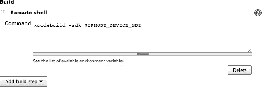

**图 9-12.** *你可以通过点击文本区域下方的链接获取内置环境变量的完整列表。*

这将使 `xcodebuild` 找到仓库中的唯一项目，选择项目中的唯一应用目标，并使用默认的命令行配置（Release）进行构建。你唯一需要指定的是要使用的 SDK。如果你的项目更复杂，或者你的仓库包含多个项目，构建命令会稍微复杂一些。

输入完 `xcodebuild` 命令后，滚动到页面底部并点击“保存”。在“任务详情”页面，点击“立即构建”来开始构建你的项目。Jenkins 会首先从仓库中检出或更新你的项目工作副本，然后运行你的 `xcodebuild` 命令。如果一切正常，项目应该能成功构建，并且你的新构建旁边会有一个蓝色的指示图标。

**注意：** 根据你系统的配置，首次使用 `xcodebuild` 针对真机 SDK 构建时，可能需要你授予 `xcodebuild` 和 `codesign` 使用钥匙串的权限。如果是这种情况，你的构建会停滞。只需以你设置期间创建的 Jenkins 用户身份登录构建服务器并再次运行构建。你应该会看到一个权限对话框，其中包含“始终允许访问钥匙串”的选项。完成此操作后，你就可以顺利进行了。

这太棒了！你已经实现了自动化构建，而且过程并不痛苦。但你目前做的只是构建源代码。这对于大型团队的集成很方便，但功能还不够强大。你真正需要的是获取关于代码质量的一些硬数据。你需要问责制。你需要失败通知和静态分析。


### 谁破坏了构建？

通知是一种简单的方式，可确保每个人都了解代码的当前状态。这也是确保人们不提交不良代码的有效手段。如果 Johnny Sigabort 提交了一个已完成的功能，`Jenkins`会启动一次构建。如果构建失败，则会向预定义的人员列表（通常是整个开发团队）发送通知，宣布 Johnny 的提交破坏了构建，并附带详细构建结果的链接。在 Johnny 因自己的疏忽而感到羞愧并加以清理后，可以再次发送通知，让团队知道构建已恢复。

设置通知非常简单且高度可扩展。有多种插件可用于通过多种渠道广播构建失败通知。如果你希望如此透明地展示进度（或者想加剧 Johnny 的羞愧感），你甚至可以在 Twitter 上发布构建结果。

标准且内置的通知类型是电子邮件。要启用电子邮件通知，首先需要配置邮件服务器信息。前往“管理 Jenkins”部分中的系统配置页面，向下滚动到“电子邮件通知”部分（图 9-13）。在提供的字段中，你可以指定邮件服务器的设置。

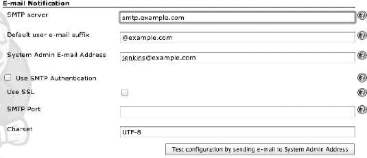

**图 9-13.** *你的系统可能需要为 Jenkins 提供一个真实账户，以免所有通知都进入垃圾邮件箱。*

启用电子邮件后，你就可以设置通知了。返回你的作业配置页面，向下滚动到“构建后操作”部分。勾选`电子邮件通知`复选框以显示通知设置表单（图 9-14）。在`收件人`字段中输入你团队的电子邮件地址，并勾选`不稳定的构建`复选框。点击`保存`按钮，大功告成！

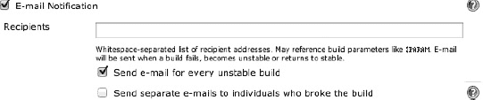

**图 9-14.** *你可以为个人或邮件列表配置电子邮件通知。*

### 质量可控

正如任何优秀开发者所知，构建成功并不意味着代码质量好。这就是为什么有静态分析器等工具来为我们查找潜在陷阱。`Xcode`项目可以配置为在编译期间运行静态分析，这在 Xcode 内部构建时非常棒。但是，为了对分析结果进行有意义的处理，你需要借助几个工具。首先，你需要获取 LLVM 基金会的`scan-build`命令行工具副本，以便提取构建结果并以更人性化的方式呈现。其次，你需要在 Jenkins 中安装 Clang Scan-Build 插件，该插件会向你的作业添加一种新的构建步骤类型，并为你管理`scan-build`的结果。

Clang 静态分析器工具可从 LLVM 基金会网站[`http://clang-analyzer.llvm.org`](http://clang-analyzer.llvm.org)获取（图 9-15）。`Scan-build`是一个极其强大的命令行工具，它封装对`xcodebuild`的调用，提取静态分析结果，并以`plist`格式和（使用附带的`scan-view`工具）HTML 格式生成报告。要使用这些工具，只需下载并解压最新的压缩包。它们可以从任何位置运行，但要在 Jenkins 内部运行，需要将它们放置在 Jenkins 用户可以访问的地方。现在，让我们将解压后的文件夹放置在 Jenkins 用户的主目录中，并重命名为`static-analyzer`。

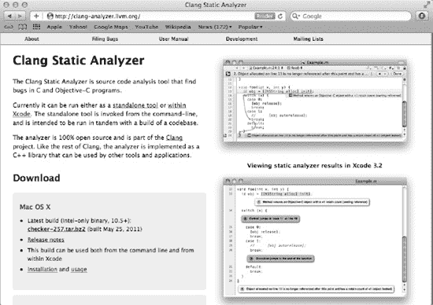

**图 9-15.** *LLVM 网站提供了关于编译器、分析器及相关工具的丰富信息。*

`scan-build`命令本身是一个极其简单的工具，类似于`xcodebuild`。它具有多种标志，允许进行深度定制和配置，并且还需要一个`xcodebuild`调用作为其输入。要了解可用于自定义结果的标志，只需在终端中执行`scan-build`脚本即可查看使用说明。对于你在 Jenkins 中的用途，你无需担心这些标志，因为它们将由构建步骤插件处理。

现在，为了查看`scan-build`脚本的实际运行效果，打开终端并导航到包含 Xcode 项目（以及一个`xcodeproj`文件）的目录。然后，只需执行一个`xcodebuild`命令，并在前面加上`scan-build`的路径，如下所示：

```
/path/to/static-analyzer/scan-build xcodebuild -sdk iphonesimulator5.0
```

你应该会看到正常的`xcodebuild`输出，随后是`scan-build`的输出。它应该看起来像这样：

```
scan-build: 2 bugs found.
scan-build: Run 'scan-view /var/folders/pz/k88r03q535g2ztqwgb52bv4c0000gq/T/scan-build-2011-08-21-1' to examine bug reports.
```

执行单引号内的命令（以`scan-view`开头）将启动你的网页浏览器，并指向`127.0.0.1:8181`，这将提供静态分析结果（图 9-16），直到你在终端窗口中按`Ctrl+C`停止`scan-view`。

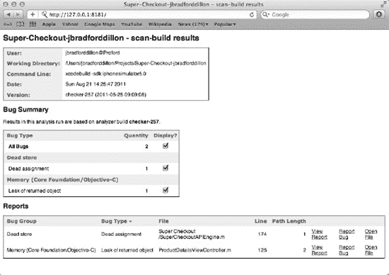

**图 9-16.** *静态分析器的结果页面提供了分析结果的出色摘要。*

现在你已经拥有了自己的静态分析器，让我们设置 Jenkins 插件。从 Jenkins 管理页面，打开“管理插件”页面。打开`可选插件`选项卡，查找 Clang Scan-Build 插件。与 Git 插件类似，最方便的方法可能是按`Command+F`并在页面中搜索`Clang`。勾选该插件的复选框，并点击页面底部的`安装`按钮。安装完成后，请务必记得重启 Jenkins。


安装插件后，请前往“配置系统”页面，滚动至“Clang Static Analyzer”部分进行插件配置（参见图 9–17）。该插件需要知道静态分析工具副本的位置。点击“Add Clang Static Analyzer”按钮以显示配置表单。插件允许添加多个版本的工具集，这在处理测试版工具集时非常有用。稍后我们会详细讨论这一点，但眼下，请为工具集命名，输入`scan-build`脚本的绝对路径，然后保存配置并前往您的构建任务。

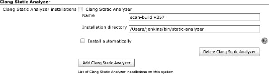

**Figure 9–17.** *为分析器命名时，最好能反映其版本号。*

在“任务配置”页面，您需要添加一个新的构建步骤。`Clang Scan-Build`选项已添加到“添加构建步骤”下拉菜单中，请选择它以创建新的静态分析步骤（参见图 9–18）。指定需要构建的目标（或工作区和方案）。在高级选项中，您还可以选择要使用的分析器、发送给`xcodebuild`的配置以及要使用的 SDK。

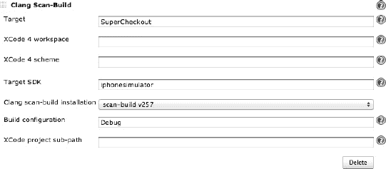

**Figure 9–18.** *确保使用调试配置，因为您需要保留调试符号。*

**注意：** 与任务名称中的空格类似，`Clang Scan-Build`插件不会转义目标名称中的空格，因此您需要将诸如“Super Checkout”之类的目标重命名为“SuperCheckout”，如图 9–18 所示。

配置好构建步骤后，您需要告诉插件发布结果，以便快速了解代码库的状态。在“构建后操作”部分，您会看到一个标有“Publish Clang Scan-Build Results”的复选框。勾选此复选框，将告知插件在任务详情页面发布一个显示项目汇总分析结果的漂亮图表，同时还会显示另一个标有“Mark build as unstable when threshold is exceeded?”的复选框。此功能与您之前设置的电子邮件通知相结合，为跟踪代码质量提供了宝贵的手段。当 Johnny Sigabort 的构建完成时，如果静态分析器报告的错误数量超过您指定的阈值，构建将被标记为不稳定，这将触发电子邮件通知操作，团队会被告知周五晚上的酒水都由 Johnny 买单。

一旦构建步骤配置完成且构建后操作已启用，请保存任务配置并触发一次构建。构建完成后，刷新任务详情页面，右侧会出现一个图表（参见图 9–19），显示分析器警告随时间的变化情况。目前它看起来几乎是空的。

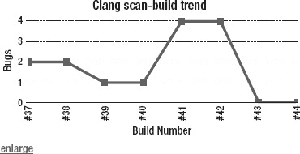

**Figure 9–19.** *此图表展示了一个（终于）重回正轨的项目。*

打开刚刚完成的构建结果，方法可以是点击构建历史侧边栏中的链接，或者点击图表中的相应点。在构建结果页面，您会看到静态分析插件添加的一些新功能。请注意，要充分发挥这些功能的效果，您的项目需要包含一些错误。这可能是您唯一一次从向项目中引入错误中获益的机会，所以请尽情操作。在“摘要”部分，会新增一个数据点，列出分析发现的错误数量，并附带一个指向详细信息的链接。这些详细信息也会在侧边栏中提供链接。点击其中一个链接，即可查看该构建的错误报告（参见图 9–20）。

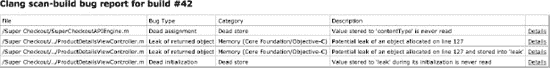

**Figure 9–20.** *`ProductDetailsViewController`的 127 行出了大问题！*

点击其中一个错误的“详细信息”链接，将打开与运行`scan-view`时相同的 HTML 视图（参见图 9–21）。

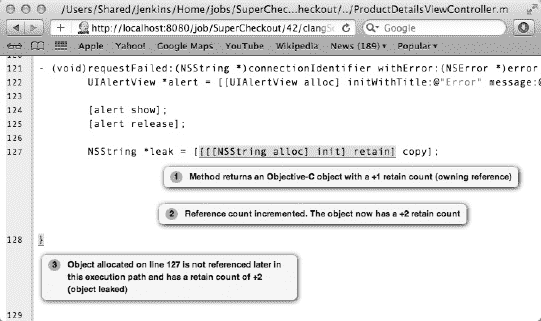

**Figure 9–21.** *哦，Johnny，你又干了些什么？*

至此，您已完成：自动化构建、静态分析和电子邮件通知，以促进良好的代码质量和责任感。此外，您的应用程序正在为分发而构建，存放在一个集中且可访问的位置，因此您可以停止传递证书这个烫手山芋了。但如果能定期向您的测试人员分发构建版本，岂不是更好？

#### 使分发更简单

为了让您的应用程序交到测试人员手中，需要构建一个项目归档（IPA 文件），其中包含一份配置描述文件的副本，以便使用 iOS 的 OTA 分发方法。为此，您有几个选择。如果您使用的是 Xcode 4 工作区，可以直接使用`xcodebuild`的归档操作。但是，如果您构建的是一个简单项目，则需要自行创建归档。这并不难，事实上，开发者工具集附带了一个非常便捷的接口来实现这一点：`PackageApplication`命令。`PackageApplication`执行将所有必要的步骤，将应用程序包（`MyApp.app`）转换为应用程序归档（`MyApp.ipa`），并将所有必需的配置描述文件嵌入其中。

在对应用程序包进行操作之前，您需要先访问到它。在 Xcode 4 之前的黑暗岁月里，构建产物存储在项目相对路径下的`Build`文件夹中。这意味着，在 Jenkins 内部，您只需在`$WORKSPACE/Build`目录下执行分发脚本即可。然而，当使用 Xcode 4 工作区时，`Build`文件夹将放置在“派生数据”文件夹中，不再那么容易找到。在这种情况下，访问应用程序包的一种方法是使用编译器标志来告知`xcodebuild`将应用程序放置的位置，例如：

`xcodebuild -sdk iphoneos -configuration Release DSTROOT=/Users/Shared/JenkinsProducts DEPLOYMENT_LOCATION=YES`

`DSTROOT`编译器标志指向包含`Applications`文件夹的路径，编译后应用程序包应放置在此路径下。这通常用于 Mac 开发，默认指向文件系统的根目录，并将构建产物放置在`/Applications`目录下。通过指向一个`JenkinsProducts`文件夹，应用程序包将被放置在：

`/Users/Shared/JenkinsProducts/Applications/MyApp.app`

`DEPLOYMENT_LOCATION`标志只是告知`xcodebuild`将应用程序包“安装”到`DSTROOT`指定的位置，对于 iOS 应用程序，它通常不会这样做。

现在您已经可以访问构建产物（无论是在相对构建文件夹中还是在安装文件夹中），几乎可以开始打包了。应用程序归档的最后一个要素是配置描述文件。您需要知道配置描述文件的绝对路径。Xcode 目前管理着您的描述文件，并将它们存储在用户的`Library`文件夹中（这意味着您的 Jenkins 用户拥有自己的一套配置描述文件，您可能还记得之前的说明）。您可以简单地使用这些文件的路径，但如果您查看该文件夹，会发现它们已被重命名为其配置文件标识符，这极难管理。

`ls ~/Library/MobileDevice/Provisioning\ Profiles`
`685FDD6E-5555-4402-BFCC-62F1064EFF2F.mobileprovision`

相反，您应该做的是将描述文件导出到一个可访问的位置，在那里您可以自行管理它们。在 Xcode 的 Organizer 中，选择要导出的配置描述文件，然后点击窗口底部的“Export”按钮。将描述文件放置在 Jenkins 可以访问的位置。我们建议使用`/Users/Shared/JenkinsProvisioning/`。请务必为描述文件起一个描述性的名称。

将描述文件放置到位后，您终于可以打包应用程序进行分发了。跳转到 Jenkins 中的任务配置页面，并添加一个新的 Shell 脚本构建步骤。


#### 你在何方，`PackageApplication`？

`PackageApplication` 脚本与你构建所用的 SDK 是绑定的。因此，你需要确保使用的是正确的版本。如果你尝试从终端直接调用它，会发现它既不在环境变量路径中，也不在`/usr/bin`（其他 Xcode 命令行工具所在位置）中。`PackageApplication` 存储在 SDK 内部。例如，当前 iOS 设备 SDK 版本的 `PackageApplication` 位于：

`/Developer/Platforms/iPhoneOS.platform/Developer/usr/bin/PackageApplication`

然而，如果你在现有工具集上使用测试版 SDK，它可能位于其他位置。此外，随着工具更新，它的位置也可能发生变化。因此，你需要一种方法，仅通过指定 SDK 就能使用 `PackageApplication`。幸运的是，命令行接口也能解决这个问题！

#### `xcrun`

`xcrun` 命令位于 `/usr/bin` 中（因此应该已在你的环境变量路径中），用于查找并执行 Xcode 命令行工具集中的命令。你可以用它来查找 `xcodebuild`、`PackageApplication` 以及许多其他工具。`xcrun` 的独特之处在于，它允许你指定所查找命令对应的 SDK 版本。同样值得注意的是，`xcrun` 不仅能告诉你命令的路径（通过 `-find` 标志也能实现），还能直接调用该命令。以下是一个基本的 `xcrun` 命令示例：

`xcrun -sdk iphoneos xcodebuild -target MyTarget -configuration Debug`

该命令将查找与 iOS 5 兼容的 `xcodebuild` 命令，并使用指定的 `-target` 和 `-configuration` 标志来执行它。

**注意：** 在较新版本的工具集中，省略版本号直接引用最新 SDK 已成为标准做法，因此 “iphoneos” 和 “iphonesimulator” 将默认指向你系统上可用的最新版本。然而，在编写能够经得起时间考验的构建脚本时，最好明确指定版本，并使用额外的脚本来针对新版本或测试版 SDK 进行测试。

#### 直接归档吧

既然你已经找到了轻松使用 `PackageApplication` 的方法，接下来需要学习如何使用它。`PackageApplication` 接受应用程序包路径（以 `.app` 结尾）、输出路径以及可选的配置文件路径。它还可以通过传递可选的代码签名标识来重新签名应用程序。

那么，让我们在 Jenkins 任务中实现它。回到任务配置页面，在新的空构建步骤中，执行以下 Shell 命令。你会注意到，我们额外将 `JenkinsProducts` 路径设置为了一个环境变量。此外，输出目录是相对于任务工作空间的（位于你正在创建的 Archive 目录中）。这样能使发布最终产品更简便，并将该任务相关的所有文件集中存放在一处。

```
mkdir -p $WORKSPACE/archive
xcrun -sdk iphoneos5.0 PackageApplication -v $PRODUCTS/Applications/SuperCheckout.app -o $WORKSPACE/archive/SuperCheckout.ipa --embed /Users/jenkins/Provisioning\ Profiles/SuperCheckout.mobileprovision
```

现在，归档脚本已就位，你可以发布 IPA 文件了。这将在你的任务详情页面放置一个指向最新稳定版 IPA 的链接。任何需要获取最新版本的人只需打开任务，点击链接即可下载。向下滚动到“构建后操作”部分，勾选“归档成品”复选框。输入 IPA 文件的路径（相对于工作空间）：

`archive/SuperCheckout.ipa`

**注意：** 在任务配置中输入文件路径时，Jenkins 会在你输入时尝试查找文件或文件夹。你可能会看到关于文件或文件夹不存在的警告。只需仔细检查路径是否正确，然后忽略这些警告。

现在保存并构建！当一切完成后，你的任务详情页面应该会显示一个指向成功归档应用的链接（图 9–22），同时还有静态分析记录。Jenkins 已经在你的工作流程中发挥作用了！

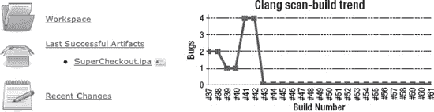

**图 9–22.** *此处的 IPA 文件可供任何有 Jenkins 访问权限的人下载。*


  
#### 导出到 Jenkins 之外

在任务详情页面上看到 IPA 文件固然有用，但这并不能完全解决你最初的问题。你需要启用无线（OTA）分发，以便测试人员能够快速轻松地获取并运行新版本，而无需处理配置文件、iTunes、iPhone 配置实用工具等繁琐事项。

启用 OTA 分发的要素相当简单。你需要一个清单属性列表，以及一个使用内置安装 URL 方案的指向该清单的链接。这将提示系统读取清单并触发安装流程。

以下是一个示例清单：

```
<?xml version="1.0"?>
<!DOCTYPE plist PUBLIC "-//Apple//DTD PLIST 1.0//EN"
"http://www.apple.com/DTDs/PropertyList-1.0.dtd">
<plist version="1.0">
  <dict>
    <!-- 下载项的数组。 -->
    <key>items</key>
    <array>
      <dict>
        <!-- 要下载的资源数组 -->
        <key>assets</key>
        <array>
          <!-- software-package: 要安装的 IPA 文件。 -->
          <dict>
            <!-- 必需。资源类型。 -->
            <key>kind</key>
            <string>software-package</string>
            <!-- 可选。每 n 字节进行 md5 校验。如果 md5 失败，将重新下载该块。 -->
            <key>md5-size</key>
            <integer>10485760</integer>
            <!-- 可选。每个“md5-size”大小块的 md5 哈希值数组。 -->
            <key>md5s</key>
            <array>
              <string>41fa64bb7a7cae5a46bfb45821ac8bba</string>
              <string>51fa64bb7a7cae5a46bfb45821ac8bba</string>
            </array>
            <!-- 必需。要下载文件的 URL。 -->
            <key>url</key>
            <string>http://www.example.com/apps/foo.ipa</string>
          </dict>
          <!-- display-image: 下载期间显示的图标。 -->
          <dict>
            <key>kind</key>
            <string>display-image</string>
            <!-- 可选。指示图标是否需要光泽效果。 -->
            <key>needs-shine</key>
            <true/>
            <key>url</key>
            <string>http://www.example.com/image.57x57.png</string>
          </dict>
          <!-- full-size-image: iTunes 使用的大型 512x512 图标。 -->
          <dict>
            <key>kind</key>
            <string>full-size-image</string>
            <!-- 可选。整个文件的一个 md5 哈希值。 -->
            <key>md5</key>
            <string>61fa64bb7a7cae5a46bfb45821ac8bba</string>
            <key>needs-shine</key>
            <true/>
            <key>url</key>
            <string>http://www.example.com/image.512x512.jpg</string>
          </dict>
        </array>
        <key>metadata</key>
        <dict>
          <!-- 必需 -->
          <key>bundle-identifier</key>
          <string>com.example.fooapp</string>
          <!-- 可选（仅软件） -->
          <key>bundle-version</key>
          <string>1.0</string>
          <!-- 必需。下载类型。 -->
          <key>kind</key>
          <string>software</string>
          <!-- 可选。下载期间显示；通常为企业名称 -->
          <key>subtitle</key>
          <string>Apple</string>
          <!-- 必需。下载期间显示的标题。 -->
          <key>title</key>
          <string>Example Corporate App</string>
        </dict>
      </dict>
    </array>
  </dict>
</plist>
```

你可以在 Apple 的企业分发指南中找到此清单及更多详细信息，网址为：[`http://developer.apple.com/library/ios/#featuredarticles/FA_Wireless_Enterprise_App_Distribution/Introduction/Introduction.html`](http://developer.apple.com/library/ios/#featuredarticles/FA_Wireless_Enterprise_App_Distribution/Introduction/Introduction.html)。

如果你采用此属性列表格式并根据你的应用具体情况修改它，就可以使用内置的 URL 方案将清单传递给系统。

```
itms-services://?action=download-manifest&url=http://example.com/manifest.plist
```

例如，创建一条能够安装你的应用的 HTML 链接非常简单：

```
<a href="itms-services://?action=download-manifest&url=http://example.com/manifest.plist">
  Install App
</a>
```

如你所见，一旦拥有了一个配置正确的归档文件，设置 OTA 部署就变得极其简单。编写一个 shell 脚本（或任何类型的脚本）来生成清单属性列表，并发布安装应用的链接，也是相当容易的事情。

#### 这些事不能交给别人处理吗？

尽管 Apple 让 OTA 部署变得相当简单（一旦你巧妙地处理了归档文件），但此过程仍有很大的改进空间。有一些出色的组织提供了系统来管理部署流程，从简单的 beta 测试到企业级分发。对于你的 Super Checkout beta 测试来说，Test Flight（[`http://testflightapp.com`](http://testflightapp.com)，图 9–23）是一个很好的选择。Test Flight 提供了出色的 beta 应用部署功能，并配有强大的基于 Web 的 UI 来管理你的应用和跟踪其安装情况。

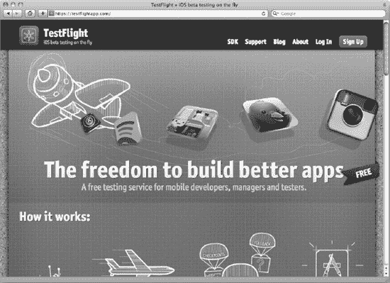

**图 9–23.** *TestFlight 拥有极其简单直接的分发方法。*

虽然 TestFlight 以其简洁美观的用户体验而自豪（也确实如此！），但它还提供了一个极其有用且同样简单的 API，用于发布新版本和通知测试人员。一旦你在 Test Flight 上设置了账户，就可以创建一个 Jenkins 构建步骤来执行以下 shell 脚本（请注意使用 Jenkins 环境变量为发布说明添加一些有用数据）：

```
curl http://testflightapp.com/api/builds.json \
  -F file=@SuperCheckout.ipa \
  -F api_token='<your_api_token>' \
  -F team_token='<your_team_token>' \
  -F notes='$JOB_NAME, build number $BUILD_NUMBER: For release notes, visit $BUILD_URL' \
  -F notify=True \
  -F distribution_lists='Internal, QA'
```

#### 创建每日构建

你想要使用你的部署构建步骤，但又不希望每次提交代码到仓库后都给 beta 测试人员推送一个新版本。更好的做法是只部署一个单独的每日构建。你已经花费了大量精力精心打造构建任务，如果全部重做就太可惜了。幸运的是，Jenkins 允许你复制任务。更具体地说，它允许你使用之前的任务作为模板来创建新任务。

从 Dashboard 中，点击侧边栏的 `New Job`。为任务命名，例如 `SuperCheckoutNightly`（注意：某些插件不支持空格），然后选中 `Copy existing job` 单选框。开始输入任务名称时，Jenkins 会给出一些建议。选择你现有的任务并点击 `OK`。

新任务的“任务配置”页面看起来应该很熟悉。要将其变为每日构建，你只需更改“构建触发器”。选中 `Build periodically` 复选框，并取消勾选其他所有选项。在“计划”文本区域中，你可以直接输入关键字 `@midnight`。

将新任务转换为每日构建后，你可以在底部将你的部署脚本添加为一个构建步骤。你可能还可以通过关闭静态分析和构建后通知等步骤来减轻系统负载。


### 让构建流程面向未来

你的 Jenkins 任务正在构建应用，Johnny 终于开始学习内存管理，你的测试版用户正在接收每日构建版本，一切进展顺利。这就像一台运转良好的机器，对吧？确实如此，直到苹果发布了一个测试版 SDK。在你开始实现 keynote 上构思的那些超棒的新功能之前，你或许应该先创建一个新任务，让你的项目在新测试版 SDK 下进行构建。

针对多个 SDK 运行 Jenkins 任务是个好主意。这能让你确保向后兼容性，并专注于新的测试版工具，让 Jenkins 来操心旧版本。

然而，在你的构建服务器上运行两个版本的 Xcode 并非没有麻烦。首先，你将需要使用多个 `xcodebuild` 命令。此外，你还需要确保静态分析器使用正确的编译器。

多个 `xcodebuild` 的问题很容易解决。Xcode 自带了一个名为 `xcode-select` 的工具，它允许你指定 `xcodebuild` 应该使用的开发者工具路径。例如，要让 `xcodebuild` 指向 Xcode 测试版（位于 `/Developer Beta`），可以使用以下代码：

```
sudo xcode-select -switch /Developer\ Beta/
```

**注意：** 需要特别留意的是，`xcode-select` 的更改是系统全局的。这意味着，如果任务 A 切换到了测试版 SDK 但没有切回来，那么当任务 B 启动时，它也会使用测试版 SDK，这可能不是我们想要的。可以考虑以下两种策略：在任务完成前撤销所有更改，或者在每个任务开始时重新设置你的环境。

`scan-build` 脚本使得选择特定的 `clang` 编译器变得简单。你只需使用 `--use-cc` 标志指定 `clang` 的路径即可，如下所示：

```
/path/to/static-analyzer/scan-build --use-cc /path/to/beta/clang xcodebuild -sdk iphonesimulator
```

这相当简单，但有个陷阱。你并非自己执行 `scan-build` 脚本，而是依赖 Clang Scan-Build 插件来为你运行该命令。不幸的是，在撰写本文时，该插件不允许你指定 `clang` 编译器的位置。不过，它允许你指定 `scan-build` 脚本的位置。这让你可以通过一点创意性的 shell 脚本来生成一个 `scan-build` “包装器”，并配置插件，使其在测试版中使用这个包装器代替原始脚本。

你需要将你的包装器脚本命名为 `scan-build`，调用原始的 `scan-build`，添加自定义的编译器标志，然后传递所有传递给包装器的原始参数。脚本如下：

```
#!/bin/bash
/path/to/original/scan-build --use-cc /path/to/beta/clang $@
```

这个脚本将自定义编译器标志放在调用者传递的参数之前。将此脚本保存为 `scan-build` 到一个自定义位置。你需要让它成为可执行文件。

```
sudo chmod +x scan-build
```

最后，转到 Jenkins 系统配置页面，为 Clang Static Analyzer 插件添加一个新的 `scan-build`（图 9–24）。保存后，你可以基于现有任务创建一个新的测试版任务，添加对 `xcode-select` 的调用来切换到测试版工具集，并将 `scan-build` 选择改为使用包装器。搞定！

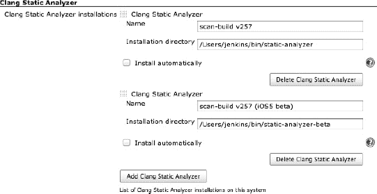

**图 9–24.** *请务必为你的各种分析器起个描述性名称。*

### 我们还能做什么？

Jenkins shell 构建步骤与 Xcode 命令行工具的结合，为自动化创造了一些非常引人注目的机会。你已经看到你可以构建、扫描、归档和部署你的应用程序。除了这些非常有用的操作之外，近期的工具集版本还为命令行暴露了一些更有用的功能。例如，单元测试可以像其他目标一样进行构建。但它们在 Xcode Workspace 上构建起来就没那么容易了。在撰写本文时，`xcodebuild` 工具还不支持它们。

说到自动化测试，甚至还有一种方法可以运行无头（headless）的自动化工具脚本（Automation Instrument scripts）。在 iOS5 中引入的 `instruments` 命令行接口提供了一种无需 GUI 即可启动 UIAutomation 测试的方法。示例如下：

```
instruments -t /path/to/template.tracetemplate /path/to/SuperCheckout.app -e UIASCRIPT
/path/to/TestScript.js -e UIARESULTSPATH /path/to/AutomationResults
```

将你的测试步骤放在一个单独的任务中，并让该任务由主任务的完成来触发，这是一个好主意。为此，首先基于原始任务创建一个新任务。自定义你的构建步骤以包含测试，然后将构建触发器更改为“在其他项目构建完成后构建”，并输入你原始任务的名称。别忘了归档构建产物，这样你就可以从“任务详情”页面获取它们。

就是这样！Jenkins 正在为你构建和部署项目，你终于可以专注于修复那些 bug 和添加新功能了。自动化是救命稻草，也能节省大量时间。另外，别忘了时常查看 Jenkins 的插件目录，因为新功能一直在添加。

