# 第 10 章

## 现在，他们想要一个 iPad 版本

自从本书开始以来，我们对 Super Checkout 进行了大量的改造。测试进展顺利，用户的反馈也源源不断，他们压倒性地希望有一个这个应用的 iPad 版本。那么我们现在该怎么做呢？我们是分离出一些公共代码，构建两个完全不同的应用，还是构建一个通用二进制文件（universal binary）？这个决定取决于你对应用的目标；它不是由技术决定的。这通常是一个商业决策，因为多个应用可能意味着更多的收入。另一方面，通用应用通常对最终用户更友好，他们可以购买一个应用，就能在 iPhone、iPod Touch 和 iPad 上运行。

对于 Super Checkout，我们将选择通用二进制文件这条路线。最终产品将是一个应用，它在 iPhone 和 iPod Touch 上提供与我们目前开发的相同的体验，同时也会提供原生的 iPad 体验。苹果为检测应用正在运行的设备以及设备具备哪些功能提供了极好的支持。在我们开始之前，请创建并签出一个名为 `Universal_Binary` 的新分支。

### 在我们开始编码之前

在我们开始编码之前，我们需要经历一个简短的设计阶段，以便我们清楚如何解决这个问题。在本章中，我们将查看一些线框图（wireframes），并讨论如何修改应用以支持 iPad。这些初始步骤至关重要，因为它们能让你在还为时未晚之前发现错误。在纸上设计有助于看清全局。让我们看看 iPad 能为我们提供什么，并尝试设计一个既能快速开发又能为用户提供价值的解决方案。这不是一本关于用户体验的书，所以我们将会略过所有用户体验细节，专注于 iOS 开发的创意层面。

在我们继续之前，关于设计和开发有一个简短说明。我们的首要目标是编写最稳定的应用程序。但同时，确保设计合理也是我们的责任。你非常了解这个平台，并且希望你已经阅读过《人机界面指南》。我们有责任学习一些设计知识，以便成为更好的开发者。设计一个通用应用是锻炼你创造力的绝佳方式。


### 为 iPad 进行设计

`iPad` SDK 引入了一些利用更大屏幕尺寸的新用户界面组件。与 iPhone 相比，iPad 还可用于多种方向。这些因素会影响我们如何决定用户界面的外观，以及用户如何在任一设备上与应用程序交互。每种设备所使用的范式也需要相似，这样用户在不同设备上使用应用程序时，才能获得一致的体验。

目前，`Super Checkout` 被设计为双面视图。主要的一面是向下钻取产品详细信息的库存列表（见图 10–1）。

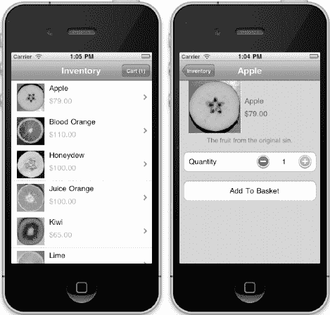

**图 10–1.** *Super Checkout 的正面视图，显示库存、产品详情以及购物车中的一个商品。*

点击 `Inventory` 屏幕顶部的 `Cart` 按钮，屏幕将会翻转，显示用户的购物车（见图 10–2）。

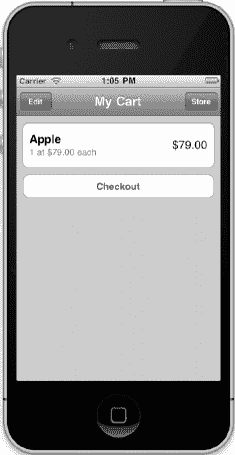

**图 10–2.** *用户购物车的翻转视图*

对于 `Super Checkout` 来说，将 `iPhone/iPod Touch` 版本的正面视图转换为分割视图是完全合理的。图 10–3 到 10–5 展示了将当前用户体验转换为 iPad 后，应用程序的外观示例。特定的表格单元格和设计细节将沿用 `iPhone/iPod Touch` 版本。这些线框图展示了我们在完成更改实现后，应用程序外观的基本构思。

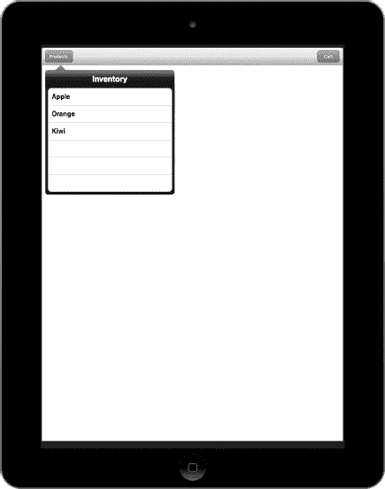

**图 10–3.** *Super Checkout iPad 版本的竖屏方向视图*

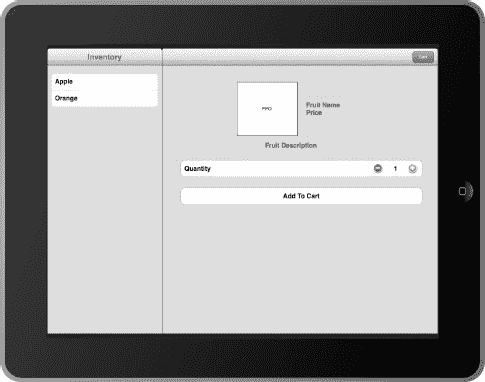

**图 10–4.** *用户界面的横屏方向版本*

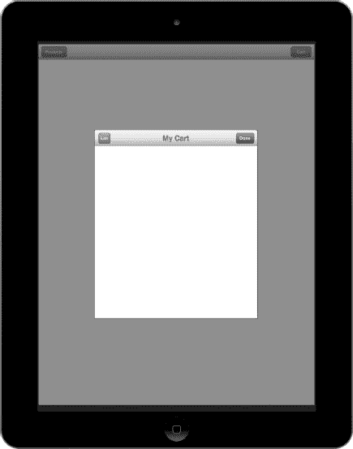

**图 10–5.** *作为模态视图显示的购物车屏幕*

这些线框图展示了两个 iPad 特有的界面元素。第一个是分割视图，它会根据设备方向显示不同的视图。库存视图在竖屏时以弹出视图显示，在横屏时则显示在左侧视图。购物车仍然作为模态视图显示，但它会覆盖在界面上方，而不会像 `iPhone/iPod Touch` 版本那样将整个视图翻转。

### 实现 iPad 版本

现在，是时候实现这个设计了。在开始处理项目之前，我们先来谈谈什么是通用应用程序。通用二进制文件会根据设备支持多种用户界面。作为通用应用程序实现的一部分，我们将拥有一些 iPad 特有的部分，以及一些在设备之间共享的部分。从现在开始，术语“idiom”将用于指代特定设备的形态。这个术语在用于判断应用程序运行在哪个设备上的 API 中被使用。

#### 修改目标

将应用程序转换为通用应用程序的第一步是更新项目的应用程序目标。在 `Xcode` 的 `Project navigator` 面板中选择 `Super Checkout` 项目，然后选择 `Super Checkout` 目标。在 `Summary` 选项卡下的 `iOS Application Target` 部分中，有一个用于选择应用程序支持的设备的下拉菜单（见图 10–6）。将 `Devices` 配置从 `iPhone` 更改为 `Universal`。

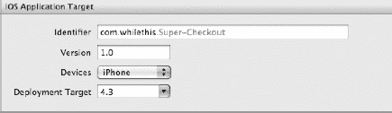

**图 10–6.** *将 Devices 配置从 iPhone 更改为 Universal。*

随后，`Xcode` 会询问你是否希望将 `MainWindow` nib 文件的副本作为 iPad 应用程序的起点（见图 10–7）。点击 `Yes`，你会注意到 `Super Checkout` 组下新增了一个名为 `iPad` 的新组。其中包含了已创建的 `MainWindow-iPad.xib` 文件。

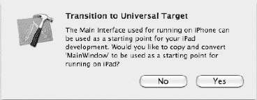

**图 10–7.** *转换为通用应用程序时，Xcode 会创建一个新的 MainWindow.xib 文件。*

`Xcode` 在创建通用目标时修改的另一个文件是 `Super_Checkout-Info.plist` 文件。对该文件所做的唯一更改是告知 `Cocoa` 支持的方向以及新的 nib 文件。


##### 应用委托与启动界面

既然应用的入口点已经完成，我们需要创建 `Super_CheckoutAppDelegate` 的子类，并将这个新类设置为 iPad 版本 `MainWindow` 界面的应用委托。为此，新建一个 Objective-C 类，命名为 `Super_CheckoutAppDelegate_iPad`。将头文件更新为列表 10–1 所示，这样我们的 `Super_CheckoutAppDelegate` 子类就为自定义 iPad 代码做好了准备。

**列表 10–1.** *为自定义 iPad 代码做好准备的 Super_CheckoutAppDelegate 子类*

```
#import <Foundation/Foundation.h>
#import "Super_CheckoutAppDelegate.h"

@interface Super_CheckoutAppDelegate_iPad : Super_CheckoutAppDelegate {

    UISplitViewController *splitViewController;
}
@property (nonatomic, retain) IBOutlet UISplitViewController *splitViewController;

@end
```

接下来，将实现文件更新为列表 10–2 所示。

**列表 10–2.** *我们针对 iPad 的子类的实现*

```
#import "Super_CheckoutAppDelegate_iPad.h"

@implementation Super_CheckoutAppDelegate_iPad
@synthesize splitViewController;

- (void)dealloc {
    [splitViewController release];
    [super dealloc];
}

- (BOOL)application:(UIApplication *)application
    didFinishLaunchingWithOptions:(NSDictionary *)launchOptions {

    self.window.rootViewController = self.splitViewController;
    [self.window makeKeyAndVisible];

    return YES;
}
@end
```

这里我们是在设置 iPad 版本应用的实际启动点。下一步是更新 iPad 的界面文件。打开 iPad 组中的 `MainWindow-iPad.xib`。从对象库中，将“分视图控制器”拖拽到编辑器的对象列表，并将“主导航控制器”从对象列表中移除（参见图 10–8）。

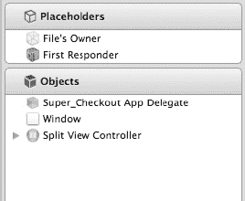

**图 10–8.** *MainWindow-iPad 界面中的新对象列表*

**注意：** 如果文档大纲处于折叠状态（只显示图标而不显示文字），请点击文档大纲底部的箭头按钮来展开（或折叠）它。

下一步是配置分视图控制器，使其包含合适的视图控制器。为此，按住 Option 键点击展开三角形，展开分视图控制器的所有子项。我们希望最终的配置如图 10–9 所示。

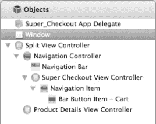

**图 10–9.** *MainWindow-iPad 界面中分视图控制器的最终配置。*

你的视图可能与图 10–9 略有不同。导航控制器的子视图控制器需要设置为 Super Checkout 视图控制器。为此，选择导航控制器的子控制器（表视图控制器），然后点击右侧面板中的“显示身份检查器”标签，打开身份检查器。接着，将 Class 改为 `Super_CheckoutViewController`（参见图 10–10）。

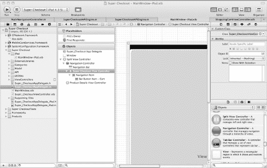

**图 10–10.** *将导航控制器的根视图控制器更新为来自 iPhone/iPod touch 版 Super Checkout 的库存视图控制器*

对底部的视图控制器执行相同操作，但要将它设为 `ProductDetailsViewController` 的实例。

完成应用委托和主界面的最后一步，是将分视图控制器连接到应用委托。首先，选择 `Super_Checkout App Delegate`，然后在实用工具区域的身份检查器中，确保类类型为 `Super_CheckoutAppDelegate_iPad`。接着，按住 Control 键从 `Super_Checkout App Delegate` 代理拖拽到分视图控制器，并选择 `splitViewController`（参见图 10–11）。

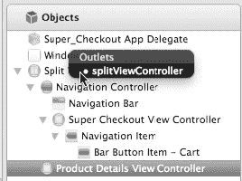

**图 10–11.** *连接应用委托上的 `splitViewController` 属性*

创建并配置应用委托以及连接界面文件现已完成。接下来，我们将着手更新部分用户界面，以支持 iPad 并保持向后兼容性。

##### 更新库存和产品详情

既然 iPad 应用的入口点已经设置好，我们现在可以修改正面视图控制器以支持新的设备类型。检测应用程序运行在哪种设备上的主要方法，是比较 `UI_USER_INTERFACE_IDIOM()` 的结果，看它是否等于 `UIUserInterfaceIdiomPhone` 或 `UIUserInterfaceIdiomPad`。


#### 重构库存列表

我们进行修改的第一站是 `Super_CheckoutViewController` 类。该类负责显示库存列表并引导用户进入产品详情视图。目前，该类将 `ProductDetailsViewController` 推入导航控制器的堆栈中。我们需要对其进行更新，以支持我们添加到主窗口 nib 文件中的分屏视图控制器。

为此，请打开 `Super_CheckoutViewController.h`，并将其修改为如代码清单 10–3 所示。

**代码清单 10–3.** *更新主视图控制器以支持两种界面模式*

```objc
#import <UIKit/UIKit.h>
#import "SuperCheckoutAPIEngineDelegate.h"
@class ProductDetailsViewController;
@class SuperCheckoutAPIEngine;
@class ProductCell;

@interface Super_CheckoutViewController : UITableViewController
                                                      <SuperCheckoutAPIEngineDelegate, UIScrollViewDelegate> {
    NSArray *inventory;
    SuperCheckoutAPIEngine *apiEngine;

    UINib *cellNib;
    ProductCell *productCell;

    NSMutableDictionary *imageIndexes;
    NSMutableDictionary *imageDownloadsInProgress;
    ProductDetailsViewController *detailsViewController;
}

@property (nonatomic, retain) IBOutlet ProductCell *productCell;
@property (nonatomic, retain) IBOutlet ProductDetailsViewController
*detailsViewController;

@end
```

此处真正的区别在于我们添加了对 `ProductDetailsViewController` 的引用。我们仍需要将其连接起来，但暂时还没准备好。打开 `Super_CheckoutViewController.m` 并做好准备；我们将进行一些更新。

首先，在实现文件的顶部合成 `detailsViewController` 属性。

接下来，在 `dealloc` 方法中，在调用 `[super dealloc]` 之前添加 `[detailsViewController release];` 来释放实例变量。

下一次更新是在 `tableView:cellForRowAtIndexPath:` 中，删除以下代码行：

```objc
[cell setAccessoryType:UITableViewCellAccessoryDisclosureIndicator];
```

并将其替换为：

```objc
if(UI_USER_INTERFACE_IDIOM() == UIUserInterfaceIdiomPhone) {
    [cell setAccessoryType:UITableViewCellAccessoryDisclosureIndicator];
} else {
    [cell setAccessoryType:UITableViewCellAccessoryNone];
}
```

这里我们通过调用 `UI_USER_INTERFACE_IDIOM()` 来识别当前的界面模式。如果我们在 iPhone/iPod Touch 上，则将展开指示符设置为附件视图。对于 iPad，我们不需要附件视图，因为产品详情屏幕已经存在。

接下来的更新是替换整个选择产品的方法。找到 `tableView:didSelectRowAtIndexPath:` 方法，并将整个实现替换为以下代码：

```objc
- (void)tableView:(UITableView *)tableView
                           didSelectRowAtIndexPath:(NSIndexPath *)indexPath {
    ProductDetailsViewController *newVC = [[ProductDetailsViewController alloc] initWithNibName:@"ProductDetailsViewController" bundle:nil];

    [newVC setSelectedProduct:[inventory objectAtIndex:[indexPath row]]];

    [self.navigationController pushViewController:newVC animated:YES];
    [newVC release];
        if(detailsViewController == nil) {
                ProductDetailsViewController *newVC =
                              [[ProductDetailsViewController alloc]           
                                  initWithNibName:@"ProductDetailsViewController"
                                                       bundle:nil];

                [newVC setSelectedProduct:[inventory objectAtIndex:[indexPath row]]];

                [self.navigationController pushViewController:newVC animated:YES];
                [newVC release];
        } else {
                [detailsViewController setSelectedProduct:
                            [inventory objectAtIndex:[indexPath row]]];
        }
}
```

在此修改中，我们检查产品详情视图控制器是否为空。由于我们在 iPad 上使用分屏视图控制器，详情视图控制器会被设置，因此我们可以通过检查它是否为空来检测应用程序运行在哪种设备上。

接下来要查找的方法是 `viewDidLoad:`。在此方法中，在设置视图控制器标题的 `[self setTitle:@"Inventory"]` 下方添加以下代码块：

```objc
if(UI_USER_INTERFACE_IDIOM() == UIUserInterfaceIdiomPad) {
    [[self navigationItem] setRightBarButtonItem:nil];
}
```

这里我们从导航栏中移除了右侧按钮，因为我们要将购物车按钮移动到产品详情屏幕的工具栏中。这个更新稍后才会进行；首先我们需要完成库存屏幕的更新。

我们快完成这个文件了，转到 `viewDidUnload` 方法，并在调用 `[super viewDidUnload]` 之前添加以下代码行：

```objc
[self setDetailsViewController:nil];
```

最后一项更新是在 `shouldAutorotateToInterfaceOrientation:` 中。该方法告诉应用程序是否应自动旋转以适应设备的方向。对于 iPad，我们希望支持两个方向。对于 iPhone/iPod Touch，我们只希望支持竖屏模式。以下是该方法的更新内容：

```objc
if(UI_USER_INTERFACE_IDIOM() == UIUserInterfaceIdiomPad) {
    return YES;
}

return (interfaceOrientation == UIInterfaceOrientationPortrait);
```

在此方法中，我们检查当前设备，并对 iPad 返回 `YES`。下面的代码行与 iPhone/iPod Touch 版本中的相同。

现在库存列表的修改完成了。最后要做的是打开 `MainWindow-iPad.xib`，并将 Super Checkout 视图控制器上的 `detailsViewControllerIBOutlet` 连接到产品详情视图控制器（参见图 10–12）。

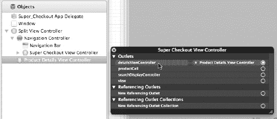

**图 10–12.** *分屏视图控制器库存屏幕的最终设置*

库存屏幕现已完成，但更新产品详情屏幕还有不少工作要做。


#### 更新产品详情

`ProductDetailsViewController`类需要进行较大的更新。iPhone/iPod Touch 版 Super Checkout 将产品详情屏幕推入导航控制器，而 iPad 的分屏视图控制器中没有导航控制器。为此，我们将根据运行的设备为详情控制器加载不同的 nib 文件。我们需要让`ProductDetailsViewController`同时支持两种设备类型（idiom），因此我们将其改为`UIViewController`的子类，而不是`UITableViewController`的子类。

我们首先更新`ProductDetailsViewController.h`文件，使其如清单 10–4 所示。

**清单 10–4.** *更新 ProductDetailsViewController 类以支持 iPad 设备类型*

```
#import <UIKit/UIKit.h>
#import "SuperCheckoutAPIEngine.h"
#import "SCModalDelegate.h"
@class QuantityCell;
@class Product;

@interface ProductDetailsViewController :
UIViewController<SuperCheckoutAPIEngineDelegate,
 SCModalDelegate, UITableViewDelegate, UITableViewDataSource,
UISplitViewControllerDelegate,
UIPopoverControllerDelegate> {
    Product *selectedProduct;
    UIView *productDetailsHeader;
    UIImageView *productImage;
    UILabel *productNameLabel;
    UILabel *productPriceLabel;
    UITableViewCell *addToBasketCell;
    QuantityCell *quantityCell;

    SuperCheckoutAPIEngine *apiEngine;

    UIToolbar *toolbar;
    UITableView *tableView;
    UIBarButtonItem *shoppingCartButton;
}

@property(retain, nonatomic) Product *selectedProduct;
@property (nonatomic, retain) IBOutlet UIView *productDetailsHeader;
@property (nonatomic, retain) IBOutlet UIImageView *productImage;
@property (nonatomic, retain) IBOutlet UILabel *productNameLabel;
@property (nonatomic, retain) IBOutlet UILabel *productPriceLabel;
@property (nonatomic, retain) IBOutlet UITableViewCell *addToBasketCell;
@property (nonatomic, retain) IBOutlet QuantityCell *quantityCell;
@property (nonatomic, retain) IBOutlet UIToolbar *toolbar;
@property (nonatomic, retain) IBOutlet UITableView *tableView;
@property (nonatomic, retain) IBOutlet UIBarButtonItem *shoppingCartButton;
- (IBAction)cartButtonPressed:(id)sender;

@end
```

我们来逐一分析所做的更改。

在此次更新之前，类声明是这样的：

```
@interface ProductDetailsViewController :
                                UITableViewController<SuperCheckoutAPIEngineDelegate>
```

在旧版本中，我们继承了`UITableViewController`，并遵循`SuperCheckoutAPIEngineDelegate`协议。这为我们提供了一个基本的视图控制器，其视图是一个`UITableView`，没有其他内容。由于这个类需要同时支持两种设备类型，我们需要以最低共同标准来设计它。因此，我们将类声明更新为：

```
@interface ProductDetailsViewController :
UIViewController<SuperCheckoutAPIEngineDelegate, SCModalDelegate, UITableViewDelegate,
UITableViewDataSource, UISplitViewControllerDelegate, UIPopoverControllerDelegate>
```

现在，`ProductDetailsViewController`类继承了`UIViewController`，并遵循`UITableViewDelegate`和`UITableViewDataSource`协议。为了支持`UISplitViewController`及其特性，我们需要添加它所遵循的协议，即`UISplitViewControllerDelegate`和`UIPopoverControllerDelegate`协议。列表中还有一个协议——`SCModalDelegate`协议。这是为了支持将在 iPad 上呈现的模态视图控制器。我们还没讲到那里，所以先不讨论。

我们添加的实例变量是：

```
    UIToolbar *toolbar;
    UITableView *tableView;
    UIBarButtonItem *shoppingCartButton;
```

`toolbar`和`shoppingCartButton`对象用于支持 iPad 版本。`tableView`对象用于支持在 iPad 和 iPhone/iPod Touch 版 Super Checkout 中都会显示的表视图。

现在可以更新实现文件了。与头文件一样，我们做了很多更改，可以在清单 10–5 中找到它们。

**清单 10–5.** *完整的 ProductDetailsViewController 实现*

```
#import "ProductDetailsViewController.h"
#import "QuantityCell.h"
#import "SuperCheckoutAPIEngine.h"
#import "Product.h"
#import "ShoppingCartViewController.h"

@interface ProductDetailsViewController()
@property (nonatomic, retain) UIPopoverController *popoverController;
@end

@implementation ProductDetailsViewController
@synthesize selectedProduct;
@synthesize productDetailsHeader;
@synthesize productImage;
@synthesize productNameLabel;
@synthesize productPriceLabel;
@synthesize addToBasketCell;
@synthesize quantityCell;
@synthesize toolbar;
@synthesize tableView;
@synthesize shoppingCartButton;

@synthesize popoverController=_myPopoverController;

- (id)initWithNibName:(NSString *)nibNameOrNil bundle:(NSBundle *)nibBundleOrNil {
    self = [super initWithNibName:nibNameOrNil bundle:nibBundleOrNil];
    if (self) {
        // Custom initialization
        apiEngine = [[SuperCheckoutAPIEngine alloc] initWithDelegate:self];
    }
    return self;
}

- (id) initWithCoder:(NSCoder *)aDecoder {
    self = [super initWithCoder:aDecoder];
    if(self) {
        apiEngine = [[SuperCheckoutAPIEngine alloc] initWithDelegate:self];
    }

    return self;
}

- (void)dealloc {
    apiEngine.delegate = nil;
    [apiEngine release];
    [selectedProduct release];
    [productDetailsHeader release];
    [productImage release];
    [productNameLabel release];
    [productPriceLabel release];
    [addToBasketCell release];
    [quantityCell release];
    [tableView release];
    [_myPopoverController release];

    [[NSNotificationCenter defaultCenter] removeObserver:self];
    [shoppingCartButton release];
    [super dealloc];
}

- (void)didReceiveMemoryWarning {
    // Releases the view if it doesn't have a superview.
    [super didReceiveMemoryWarning];

    // Release any cached data, images, etc that aren't in use.
}

#pragma mark - 访问器/修改器

- (void) setSelectedProduct:(Product *)aProduct {
    [self willChangeValueForKey:@"selectedProduct"];
    Product *oldProduct = selectedProduct;
    selectedProduct  = [aProduct retain];
    [oldProduct release];
    [self didChangeValueForKey:@"selectedProduct"];
    [[self tableView] reloadData];
    [apiEngine getImageForProduct:[selectedProduct image]];

    [productNameLabel setText:[selectedProduct name]];
    [productPriceLabel setText:[NSString stringWithFormat:@"$%1.2f",

[[selectedProduct price] floatValue]]];

    [[self popoverController] dismissPopoverAnimated:YES];
}

#pragma mark - UITableViewDataSource 方法

- (NSInteger)numberOfSectionsInTableView:(UITableView *)tableView {
    if(selectedProduct == nil) {
        return 0;
    }
    return 3;
}

- (NSInteger)tableView:(UITableView *)tableView
    numberOfRowsInSection:(NSInteger)section {
    if(section == 0) {
        return 0;
    } else {
        return 1;
    }
}

- (NSString *)tableView:(UITableView *)tableView
titleForFooterInSection:(NSInteger)section {
    if(section == 0) {
        return [selectedProduct description];
    } else {
        return nil;
    }
}

// 自定义表格视图单元格的外观。
- (UITableViewCell *)tableView:(UITableView *)tableView
              cellForRowAtIndexPath:(NSIndexPath *)indexPath {
    if([indexPath section] == 1) {
        return quantityCell;
    } else {
        return addToBasketCell;
    }
}

#pragma mark - UITableViewDelegate
```


```objc
- (void)tableView:(UITableView *)aTableView
    didSelectRowAtIndexPath:(NSIndexPath *)indexPath {

    [aTableView deselectRowAtIndexPath:indexPath animated:YES];

    //此处将商品加入购物车.....
    [apiEngine buyProduct:[selectedProduct productId] withQuantity:[NSNumber numberWithInt:[quantityCell quantity]]];
}

- (NSIndexPath *)tableView:(UITableView *)tableview
  willSelectRowAtIndexPath:(NSIndexPath *)indexPath {
    if([indexPath section] == 2) {
        return indexPath;
    } else {
        return nil;
    }
}

- (UIView *) tableView:(UITableView *)tableView
    viewForHeaderInSection:(NSInteger)section {

    if(section == 0) {
        return productDetailsHeader;
    } else {
        return nil;
    }
}

- (CGFloat) tableView:(UITableView *)tableView
    heightForHeaderInSection:(NSInteger)section {

    if(section == 0) {
        return [productDetailsHeader frame].size.height;
    } else {
        return 0.0;
    }
}

#pragma mark - SuperCheckoutAPIEngineDelegate 方法
- (void)requestSucceeded:(NSString *)connectionIdentifier {
}

- (void)requestFailed:(NSString *)connectionIdentifier withError:(NSError *)error {
    UIAlertView *alert = [[UIAlertView alloc] initWithTitle:@"错误"
                                                    message:@"添加此商品时发生错误"
                                                   delegate:nil
                                          cancelButtonTitle:@"关闭"
                                          otherButtonTitles:nil];
    [alert show];
    [alert release];
}

-(void) cartContentsReceived:(NSDictionary *)cart
                                    forRequest:(NSString *)connectionIdentifier {
    NSLog(@"购物车内容: %@", cart);
    NSNotification *note =
        [NSNotification notificationWithName:@"CartUpdated"
                                      object:[NSNumber numberWithInt:[[cart
                                        objectForKey:@"items"] count]]];
    [[NSNotificationCenter defaultCenter] postNotification:note];
    [self.navigationController popViewControllerAnimated:YES];
}

-(void) imageReceived:(UIImage *)image forRequest:(NSString *)connectionIdentifier {
    [productImage setImage:image];
}

#pragma mark - 分屏视图支持

- (void)splitViewController:(UISplitViewController *)svc
    willHideViewController:(UIViewController *)aViewController
            withBarButtonItem:(UIBarButtonItem *)barButtonItem
        forPopoverController: (UIPopoverController *)pc {
    barButtonItem.title = @"商品";
    NSMutableArray *items = [[self.toolbar items] mutableCopy];
    [items insertObject:barButtonItem atIndex:0];
    [self.toolbar setItems:items animated:YES];
    [items release];
    self.popoverController = pc;
}

// 当视图在分屏视图中重新显示时调用，使按钮和弹出控制器失效。
- (void)splitViewController:(UISplitViewController *)svc
    willShowViewController:(UIViewController *)aViewController invalidatingBarButtonItem:(UIBarButtonItem *)barButtonItem {
    NSMutableArray *items = [[self.toolbar items] mutableCopy];
    [items removeObjectAtIndex:0];
    [self.toolbar setItems:items animated:YES];
    [items release];
    self.popoverController = nil;
}

#pragma mark - 通知
- (void) cartUpdateNotification:(NSNotification *)note {
    //更新购物车按钮
    NSNumber *cartCount = [note object];
    [shoppingCartButton setTitle:
        [NSString stringWithFormat:@"购物车 (%i)", [cartCount intValue]]];
}

#pragma mark - 视图生命周期

- (void)viewDidLoad {
    [super viewDidLoad];
    // 从 nib 文件加载视图后的其他设置
    [self setTitle:[selectedProduct name]];

    if(selectedProduct != nil) {
        [productNameLabel setText:[selectedProduct name]];
        [productPriceLabel setText:
                [NSString stringWithFormat:@"$%1.2f", [[selectedProduct price] floatValue]]];
        [apiEngine getImageForProduct:[selectedProduct image]];
    }

    [[NSNotificationCenter defaultCenter] addObserver:self
                                             selector:@selector(cartUpdateNotification:)
```


```objc
`name:@"CartUpdated"`

`object:nil];`
`}`

`- (void)viewDidUnload {`
`    [self setProductDetailsHeader:nil];`
`    [self setProductImage:nil];`
`    [self setProductNameLabel:nil];`
`    [self setProductPriceLabel:nil];`
`    [self setAddToBasketCell:nil];`
`    [self setQuantityCell:nil];`
`    [self setTableView:nil];`

`    [[NSNotificationCenter defaultCenter] removeObserver:self];`
`    [self setShoppingCartButton:nil];`
`    [super viewDidUnload];`
`    // 释放主视图的任何保留子视图。`
`    // 例如 self.myOutlet = nil;`
`}`

`- (BOOL)shouldAutorotateToInterfaceOrientation:`

`(UIInterfaceOrientation)interfaceOrientation {`
`    if(UI_USER_INTERFACE_IDIOM() == UIUserInterfaceIdiomPad) {`
`        return YES;`
`    }`
`    // 返回支持的取向的 YES`
`    return (interfaceOrientation == UIInterfaceOrientationPortrait);`
`}`

`- (IBAction)cartButtonPressed:(id)sender {`
`    ShoppingCartViewController *cartVC =`
`        [[ShoppingCartViewController alloc]`
`initWithNibName:@"ShoppingCartViewController"`

`bundle:nil];`
`    [cartVC setDelegate:self];`
`    UINavigationController *navController =`
`        [[UINavigationController alloc] initWithRootViewController:cartVC];`

`    [navController setModalPresentationStyle:UIModalPresentationFormSheet];`
`    [self presentModalViewController:navController animated:YES];`

`    [cartVC release];`
`    [navController release];`
`}`

`#pragma mark - SCModalDelegate Methods`
`-(void) viewController:(UIViewController *)vc didFinishWithData:(id) data {`
`    [self dismissModalViewControllerAnimated:YES];`
`}`

`-(void) viewControllerDidCancel:(UIViewController *)vc {`
`    [self dismissModalViewControllerAnimated:YES];`
`}`
`@end`
```

这段代码量不小，但我们会逐步分析，讨论每个相对于原始版本的更新。

第一个改动是创建了一个类扩展。类扩展如下：

```objc
@interface ProductDetailsViewController()
@property (nonatomic, retain) UIPopoverController *popoverController;
@end
```

我们在这里所做的只是为来自 `UISplitViewController` 的 `UIPopoverController` 创建一个本地属性。稍后我们会随其余合成的属性一起，使用 `@synthesize popoverController=_myPopoverController;` 来合成它。我们也在合成新属性，但这并不太有趣，所以我只是在此提一下。

下一个有趣的改动是：

```objc
- (id) initWithCoder:(NSCoder *)aDecoder {
        self = [super initWithCoder:aDecoder];
        if(self) {
                apiEngine = [[SuperCheckoutAPIEngine alloc] initWithDelegate:self];
        }
        return self;
}
```

这里，我们实现了 `initWithCoder:`，因为在 `MainWindow-iPad` 的 nib 文件中，`ProductDetailsViewController` 是作为 nib 的一部分被加载的。由于我们受 nib 加载器的控制，因此必须实现 `initWithCoder:` 方法。该方法的其余部分与其他初始化方法基本相同。

下一组改动位于 `dealloc` 方法中（请参见代码清单 10–6）。我们正在清理资源，并将对象从 `NSNotificationCenter` 的通知观察者中移除。这是因为稍后在该文件中，我们会开始监听 `NSNotificationCenter` 上的购物车更新。这些改动并不十分引人注目，但仍然值得一提。

**代码清单 10–6.** *非 ARC 项目中至关重要的 dealloc 方法。*

```objc
- (void)dealloc {
    apiEngine.delegate = nil;
    [apiEngine release];
    [selectedProduct release];
    [productDetailsHeader release];
    [productImage release];
    [productNameLabel release];
    [productPriceLabel release];
    [addToBasketCell release];
    [quantityCell release];
    [tableView release];
    [_myPopoverController release];

    [[NSNotificationCenter defaultCenter] removeObserver:self];
    [shoppingCartButton release];
    [super dealloc];
}
```

接下来是选定产品的存取方法（请参见代码清单 10–7）。由于我们现在需要处理 iPad 版本，并且控制器始终存在，因此我们更新了存取方法，以设置适当的视图属性，并让弹出视图控制器关闭。

**代码清单 10–7.** *选定产品的存取方法和更新的视图*

```objc
- (void) setSelectedProduct:(Product *)aProduct {
    [self willChangeValueForKey:@"selectedProduct"];
    Product *oldProduct = selectedProduct;
    selectedProduct  = [aProduct retain];
    [oldProduct release];
    [self didChangeValueForKey:@"selectedProduct"];
    [[self tableView] reloadData];
    [apiEngine getImageForProduct:[selectedProduct image]];

    [productNameLabel setText:[selectedProduct name]];
    [productPriceLabel setText:
        [NSString stringWithFormat:@"$%1.2f", [[selectedProduct price] floatValue]]];

    [[self popoverController] dismissPopoverAnimated:YES];
}
```

在 `numberOfSectionsInTableView:` 方法中（请参见代码清单 10–8），当选定产品为 nil 时，我们返回 0。这是因为视图控制器将使用一个 nil 的选定产品来创建，而我们不希望在此显示任何 UI，因为没有什么可显示的内容。

**代码清单 10–8.** *根据所选产品是否存在来改变表格的构建方式*

```objc
- (NSInteger)numberOfSectionsInTableView:(UITableView *)tableView {
    if(selectedProduct == nil) {
        return 0;
    }
    return 3;
}
```

下一个重要的更新在代码清单 10–9 中；我们正在为类添加分屏视图支持，以确保我们的应用程序也能在 iPhone/iPod Touch 上正常运行。

**代码清单 10–9.** *向类添加分屏视图支持*

```objc
#pragma mark - 分屏视图支持

- (void)splitViewController:(UISplitViewController *)svc
      willHideViewController:(UIViewController *)aViewController
              withBarButtonItem:(UIBarButtonItem *)barButtonItem
          forPopoverController: (UIPopoverController *)pc {
    barButtonItem.title = @"产品";
    NSMutableArray *items = [[self.toolbar items] mutableCopy];
    [items insertObject:barButtonItem atIndex:0];
    [self.toolbar setItems:items animated:YES];
    [items release];
    self.popoverController = pc;
}

// 当视图再次显示在分屏视图中时调用，使按钮和弹出视图控制器失效。
- (void)splitViewController:(UISplitViewController *)svc
     willShowViewController:(UIViewController *)aViewController
invalidatingBarButtonItem:(UIBarButtonItem *)barButtonItem {
    NSMutableArray *items = [[self.toolbar items] mutableCopy];
    [items removeObjectAtIndex:0];
    [self.toolbar setItems:items animated:YES];
    [items release];
    self.popoverController = nil;
}
```

这段代码为分屏视图控制器委托协议添加了支持。第一个方法在设备旋转为竖屏模式时被调用。它设置将要在 iPad nib 文件中使用的工具栏，并准备在竖屏方向显示的弹出视图控制器。第二个方法在设备旋转为横屏模式并即将显示完整的分屏视图控制器时被调用。它会移除按钮栏项，并禁用弹出视图控制器。

下一个重要的更新是在 `viewDidLoad` 方法中进行的。在此方法中，我们检查选定的产品是否为 nil，并用产品详情更新用户界面，并加载产品图片。方法的最后一部分是开始监听通知中心的购物车更新。


好的，作为高级文档工程师和翻译员，我将遵循您的注意事项和示例，将给定的英文文本翻译成中文。


接下来的更新在 `viewDidUnload` 方法中，这是非常标准的做法。将从 nib 加载的 outlets 设置为 nil，并将自身从通知中心移除为观察者，这撤销了在 `viewDidLoad` 方法中发生的一切。接下来被更新的方法是 `shouldAutorotateToInterfaceOrientation:`，它被更新为当运行应用的设备是 iPad 时返回 `YES`。

上一节的内容相当简单，对这个文件接下来的（也是最后的）一组修改是：

```
- (IBAction)cartButtonPressed:(id)sender {
        ShoppingCartViewController *cartVC =
            [[ShoppingCartViewController alloc] initWithNibName:@"ShoppingCartViewController" 
            bundle:nil];
        [cartVC setDelegate:self];
        UINavigationController *navController =
            [[UINavigationController alloc] initWithRootViewController:cartVC];

        [navController setModalPresentationStyle:UIModalPresentationFormSheet];
        [self presentModalViewController:navController animated:YES];

        [cartVC release];
        [navController release];
}

#pragma mark - SCModalDelegate Methods
-(void) viewController:(UIViewController *)vc didFinishWithData:(id) data {
        [self dismissModalViewControllerAnimated:YES];
}

-(void) viewControllerDidCancel:(UIViewController *)vc {
        [self dismissModalViewControllerAnimated:YES];
}
```

第一部分是购物车按钮的操作，该按钮将放置在 iPad 版本的 nib 中。由于它仅适用于 iPad，我们可以针对 iPad 定制实现。最后两个方法实现了模态视图控制器的代理方法。这是一个很好的特定于设备实现的例子，其中为一个视图控制器加载了不同的 nib。在进行过渡或开发通用应用程序时，需要做出这类设计决策。

最终的设计是让同一个视图控制器持有详细信息，这些详细信息有不同的 nib 文件来设置相应的 `IBOutlet`。这突显了 MVC 设计模式的优势之一。维护这个视图控制器将保持相对简单，更新用户界面也会很容易，并且不需要更改控制器。

#### 为 iPad 版本创建产品详情 Nib

产品详情界面的 nib 是 iPad 专用的。它与 iPhone/iPod Touch 界面共享相同的组件，但有一些细微的修改。图 10–13 显示了 Super Checkout 在 iPad 上启动时将加载的最终 nib。注意，它与 iPhone/iPod Touch 的 nib 共享完全相同的单元格和其他元素，只有一个细微的差别——头部视图。对于 iPad，我们需要将图像和标签封装到一个视图中，然后用另一个视图将其包裹起来。这样，我们就可以让每个视图在表格中居中显示。

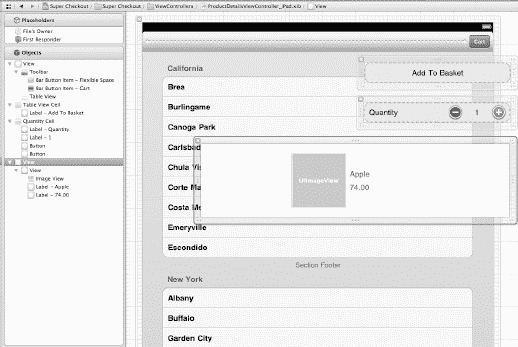

**图 10–13.** *iPad 的最终产品详情 Nib*

要开始创建 nib，首先需要创建它。前往 File → New → New File，在显示的对话框中，在 iOS 部分下选择 User Interface，然后选择 Empty nib 图标（参见 图 10–14）。

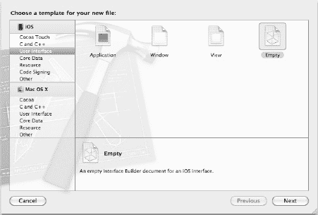

**图 10–14.** *选择要创建的 nib 类型*

点击 Next，在下一个界面中，为 Device Family 选择 iPad（参见 图 10–15）。

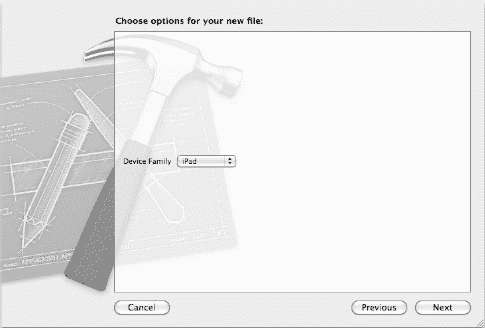

**图 10–15.** *为 nib 选择设备系列*

点击 Next。将 nib 命名为 `ProductDetailsViewController_iPad.xib`，并确保将其保存到 ViewControllers 组中（参见 图 10–16）。

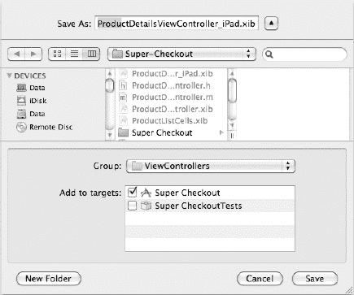

**图 10–16.** *将 nib 保存到正确的组对于保持项目组织有序很重要。*

对于这个新 nib，我们要做的第一件事是设置 File's Owner 代理。选择 nib 后，选择 File's Owner，以便在 Utility 区域的 Identity Inspector 中看到 Custom Class 部分（如果不可见，请展开它）。将类从 `NSObject` 更改为 `ProductDetailsViewController`。

现在，我们要为视图控制器设置视图。在 Utility 区域的 Object Library 部分，选择 View (`UIView`)，并将一个实例拖到 nib 的预览区域。然后，拖入一个 Toolbar (`UIToolbar`)，并将其放置在视图的顶部。在工具栏内部，选择并删除左上角的按钮。接下来，拖入一个 Flexible Space Button Bar Item，在其右侧，拖入一个 Bar Button Item 并将其标题设置为 **Cart**（通过双击 Item 文本进行编辑）。视图配置的最后一步是拖入一个 Table View (`UITableView`) 到工具栏下方。在表格视图的属性检查器中，将样式 (Style) 下拉菜单设置为 Grouped，使其成为分组表格。最后，调整表格视图的大小以适合工具栏下方的区域。最终产品应如 图 10–17 所示。

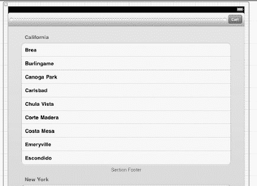

**图 10–17.** *为 iPad 配置好的主视图*

由于我们使用的是与 iPhone/iPod Touch 版本相同的界面元素，我们可以从 iPhone/iPod Touch 的 nib 中复制我们要使用的元素。最简单的方法是使用“助理编辑器 (Assistant editor)”模式同时打开两个 nib。在 `ProductDetailsViewController_iPad` nib 编辑器打开的情况下，点击工具栏右侧的“助理编辑器 (Assistant editor)”。根据您的设置，助理编辑器将位于主编辑器的右侧或下方。无论哪种方式，您都可以使用助理编辑器的跳转栏 (Jump Bar) 来选择要在助理编辑器中查看的合适文件（参见 图 10–18）。

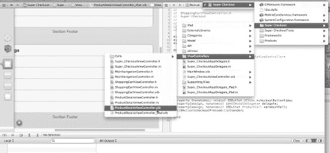

**图 10–18.** *使用跳转栏在助理编辑器中选择不同的文件*

使用跳转栏打开 `ProductDetailsViewController.xib`，并选择除表格视图之外的所有视图。将这些项目拖到 iPad 版本的 nib 中，然后返回到标准编辑器视图。除了一个部分外，我们几乎完成了。


从`Object`库（如果`Utility`区域不可见，请展开它）中拖动一个`UIView`对象。选择新的`UIView`实例，在`Attributes Inspector`中，将背景颜色设置为`clear color`，并取消选中`opaque`复选框。在`Size Inspector`中，将宽度设置为`676`磅，高度设置为`160`磅。现在，让包含图像、产品名称和价格的视图成为新视图的子视图，并将其居中。使用自动吸附功能作为辅助。视图居中后，使用`springs and struts`使其相对于父视图居中（参见图 10–19）。

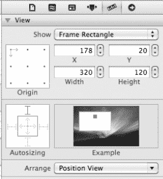

**图 10–19.** *使用`springs and struts`对创建自动调整大小的视图非常有帮助。*

**提示：** `Interface Builder`中的`springs and struts`配置只是设置`UIView`上的位掩码属性`autoresizingMask`。默认配置是将视图的左上角固定在其 frame 的原点。通过仅选择顶部边距（或在代码中设置）并使其在父视图的 frame 中居中，我们就能有效地使其在任何宽度下都保持居中。

现在，我们已经在 nib 中拥有了界面元素，但仍然需要对其他视图进行一些配置。`Quantity Cell`需要将数量调整按钮和标签固定在右侧。通过仅选择`top margin`和`right margin`选项，使用`springs and struts`来实现这一点。剩下的单元格，即带有`Add to Basket`标签的单元格，需要将其标签居中，并选择`top margin`选项。

界面元素配置完成后，我们可以将它们连接到视图控制器。图 10–20 显示了`File's Owner`在 outlets 和 actions 方面的最终配置。并非所有界面元素都会被连接。

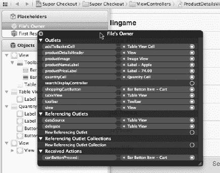

**图 10–20.** *`File's Owner`的最终配置*

准备好连接视图了吗？好的，开始吧。首先，让我们连接`File's Owner`上的所有 outlets，从顶部开始：

*   `addToBasketCell`是通用的表格视图单元格。
*   `productDetailsHeader`是包裹产品详情的大视图。
*   `productImage`是`productDetailsHeader`中的`UIImageView`。
*   `productNameLabel`是`productDetailsHeader`中的名称标签。
*   `productPriceLabel`是`productDetailsHeader`中的价格标签。
*   `quantityCell`是整个数量单元格。
*   `shoppingCartButton`是工具栏右侧显示“Cart”的按钮。
*   `tableView`是 nib 中的主（也是唯一的）表格视图。
*   `toolbar`是主视图顶部的工具栏。
*   `view`是包裹表格视图和工具栏的`UIView`。

接下来，将表格视图上的`dataSource`和`delegate` outlets 连接到`File's Owner`。最后一步是将`shoppingCartButton`的`sent action`连接到`File's Owner`上的`cartButtonPressed:`选择器。现在所有内容都已连接完毕，可以开始工作了。

#### 修改购物车视图控制器

要修改的最后一个视图控制器是`ShoppingCartViewController`。我们需要进行的更改包括：更新“I'm done looking at this”按钮，使其具有 idiom 感知能力，并更新结账按钮，确保其在视图中居中。

我们需要做的第一件事是获取对结账按钮的引用。我们将在源文件中创建一个 outlet，并将其连接到 nib。为此，打开`ShoppingCartViewController.xib`，并启用助理编辑器。如果编辑器仍显示`Manual`选择，请转到`View`  `Editor`  `Reset Editor`，将助理编辑器重置为`Automatic`选择。这将在助理编辑器中打开`ShoppingCartViewController.h`文件。

下一步是按住 Control 键将结账按钮拖拽到源文件中（参见图 10–21）。将新属性放在适当的位置，并使其成为一个名为`checkoutButton`的 outlet。

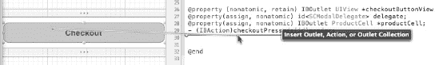

**图 10–21.** *`Interface Builder`与`Xcode`的集成使得创建 outlets 变得容易。*

由于使用了这种集成，`Xcode`将自动插入实例变量、合成属性，并在`dealloc`和`viewDidUnload`中放置相应的代码。

按`command+option+S`保存所有修改过的文件。接下来，打开`ShoppingCartViewController.m`，并在`viewDidLoad`中找到以下行：

```
UIBarButtonItem *storeButton =
    [[UIBarButtonItem alloc] initWithTitle:@"Store"
style:UIBarButtonItemStyleBordered
                                                                target:self
action:@selector(backToStorePressed:)];
```

删除该行，并替换为以下内容：

```
UIBarButtonItem *storeButton = nil;
if(UI_USER_INTERFACE_IDIOM() == UIUserInterfaceIdiomPad) {
    storeButton = [[UIBarButtonItem alloc] initWithTitle:@"Done"
style:UIBarButtonItemStyleDone
target:self
action:@selector(backToStorePressed:)];
} else {
    storeButton = [[UIBarButtonItem alloc] initWithTitle:@"Store"
style:UIBarButtonItemStyleBordered
target:self
action:@selector(backToStorePressed:)];
}
```

此部分更新了作为模态窗口工具栏右侧按钮显示的按钮类型，该模态窗口用于呈现用户的购物车。

下一个要进行的更新在`shouldAutorotateToInterfaceOrientation:`中。在现有的`return`语句之前添加以下代码：

```
if(UI_USER_INTERFACE_IDIOM() == UIUserInterfaceIdiomPad) {
    return YES;
}
```

最后一个更新在`tableView:viewForFooterInSection:`中。在`return`语句之前，添加以下代码：

```
if(UI_USER_INTERFACE_IDIOM() == UIUserInterfaceIdiomPad) {
    [checkoutButton setAutoresizingMask:UIViewAutoresizingNone];
    [checkoutButton setFrame:CGRectMake(30, checkoutButton.frame.origin.y,
        self.view.frame.size.width - 60, checkoutButton.frame.size.height)];
}
```

我们在这里所做的是将自动调整大小掩码设置为`none`，并重置按钮的 frame，使其与周围单元格匹配。

### 收尾工作

就这样！我们已经成功地将`Super Checkout`更新为通用二进制应用。我们几乎重用了所有应用代码，仅需创建一个针对 iPad 的 nib 文件。我们刚刚经历的过程是转换其他现有应用使其同时在 iPad 和 iPhone/iPod Touch 上运行的良好开端。

与任何新项目一样，关键步骤是第一步。设计应用并制定将现有应用转换为通用二进制应用的方案是最重要的阶段；剩下的只是实施和贯彻设计。

理想情况下，应用应作为通用应用进行设计和开发。这将减少需要实施的变通方案的数量。在开发应用时，脑海中应始终牢记“以通用为目标”这一要点。尽管你正在开发的应用可能仅运行在 iPhone/iPod Touch 上，但未来可能会要求将其移植到 iPad 上。

实现一个为通用过渡做好准备的设计的最佳方法是减少在代码中创建的视图数量。如果必须在代码中创建视图，请避免硬编码尺寸。使用 idiom 检测 API 也是将特定代码块专门化到 iPad 或 iPhone/iPod Touch 的关键。在使用 nib 时，对于将在所有设备上使用的 nib，使用`springs and struts`来实现自动调整大小的视图也是一个好方法。

现在，该应用已成为通用应用，我们可以将其部署给 beta 测试者，继续追求更大更好的目标。提交更改，将该分支合并回主分支，并向你的测试者发送一个 beta 版本。既然他们一直在要求一个 iPad 版本，我相信他们会很高兴你倾听了他们的声音并如此迅速地开发出了解决方案。


### 总结

现在，我们拥有了一款能够在 iPhone 和 iPad 上运行的通用应用程序。支持这两种设备系列可能会有些困难，但只要前期考虑周全，开发这款应用的速度会比开发两个独立的应用程序更快。

那么下一步是什么？到目前为止，本书已涵盖了几乎所有的必需主题，但我们还为你准备了更多惊喜。在第 11 章中，我们将探索如何与全世界分享你的杰作。在第 12 章中，我们将讨论如何使用键盘在 Xcode 中导航以及至关重要的开发者工作流程。这些内容包含键盘快捷键以及其他改善工作流程的方法。我不知道你怎么样，但我是一个键盘快捷键爱好者。我喜欢只需按下几个键就能让应用执行许多任务。我希望你会发现第 12 章中的技巧很有用，并且能够将这些内容融入到你的工作流程中。但首先，让我们先分享我们的应用。

## 第 11 章

## 我该如何分享这些内容？

现在，我们已经构建了 Super Checkout 的通用版本。我们可以打包我们的应用程序以提交到 App Store，然后看着金钱和赞誉滚滚而来。当然，我们还需要处理 bug 报告和添加新功能，但我们已经涵盖了如何处理这些问题。我们真正想做的是继续前进，创建下一个伟大的 iOS 应用程序。

我们可以从头开始，但这很可能意味着要重复为 Super Checkout 所做的许多工作。一个简单的解决方案是将我们想从 Super Checkout 中使用的代码复制到新项目中。你可能已经意识到，这种方法存在许多问题。

例如，假设我们收到一个来自 Super Checkout 用户的 bug 报告，该 bug 涉及我们已复制到新应用程序中的部分代码。我们必须修复两套相同的代码（以及它们相关的测试）。当然，我们可以通过剪切和粘贴来修复。但在剪切和粘贴的过程中，我们可能会犯错。

我们需要弄清楚如何在最大化代码重用的同时，最小化冗余工作量。在 iOS 中实现这一目标的方法是使用静态库。在本章中，我们将把 Super Checkout 的一些代码拆分到 Xcode 中的一个单独静态库项目中。然后，我们将把这个新的静态库项目集成到 Super Checkout 中。

销售大量 Super Checkout 副本可能对我们的钱包大有裨益，但这可能不会提升我们作为程序员的自我价值感。提升我们极客信誉的一种方法是将部分代码作为开源项目发布。这样，其他程序员就能看到我们的编程技能有多棒。真正的额外好处是分享我们的工作并提高代码质量。埃里克·雷蒙德在他的文章《大教堂与市集》（[`http://www.catb.org/~esr/writings/homesteading/cathedral-bazaar/`](http://www.catb.org/~esr/writings/homesteading/cathedral-bazaar/)）中提到：“足够多的眼睛，就可让所有问题浮出水面”，这暗示了以 Linux 项目创始人林纳斯·托瓦兹命名的林纳斯定律。他的意思是，源代码分发得越广泛，错误被发现和修复的速度就越快。为了分发我们的新静态库，我们将通过 GitHub（[`http://www.github.com/`](http://www.github.com/)）与世界分享，这是一个专注于简化代码共享的源代码仓库。

最后，我们将简要介绍几种你可以为新静态库采用的开源软件许可证，包括各自的优缺点。没有正确或错误的选择。你选择的许可证高度依赖于你的目标和意愿。

### 将代码拆分为静态库

简单来说，静态库是编译后文件的存档。这些文件随后被链接到一个应用程序中，使其看起来像是库的源代码是应用程序的一部分。正如我之前所说，其主要目的是将应用程序代码拆分为可重用的包，以便在多个应用程序之间共享。

让我们来看看我们的 Super Checkout 应用程序。哪些代码应该被提取到静态库中？查看我们设置的分组，很明显，`ExternalLibraries` 文件夹中的文件是很好的候选：`ASIHTTPRequest` 和 `SBJSON`（参见图 11--1）。

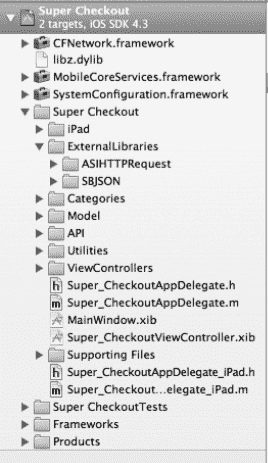

**图 11–1.** *Super Checkout 项目分组*

**注意：** 我们的外部库代码库已经作为静态库和开源项目存在。你可以在它们对应的主页上阅读更多信息：[`http://allseeing-i.com/ASIHTTPRequest/`](http://allseeing-i.com/ASIHTTPRequest/) (`ASIHTTPRequest`) 和 [`http://stig.github.com/json-framework/`](http://stig.github.com/json-framework/) (`SBJSON`)。


#### 创建静态库

如果 Xcode 尚未运行，请启动它。创建一个新项目（依次选择 File  New  New Project）。当新项目面板出现时，在 iOS 分组下选择 Framework & Library，然后选择 Cocoa Touch Static Library 模板（参见图 11–2）。点击 Next。

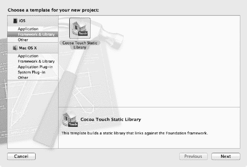

**图 11–2.** *选择 Cocoa Touch Static Library 模板*

当系统提示输入产品名称时，输入 **SBJSON**（参见图 11–3）。确保勾选“Include Unit Tests”复选框，并取消勾选“Use Automatic Reference Counting”复选框。点击 Next。

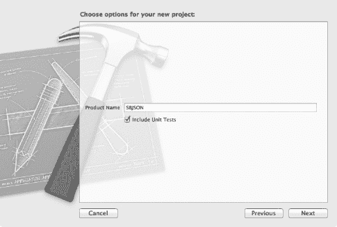

**图 11–3.** *命名静态库*

将项目保存在 `Super-Checkout` 目录旁边（参见图 11–4）。勾选“Create local git repository for this project”（我们稍后会解释为什么要这么做）。点击 Create。

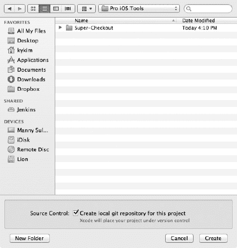

**图 11–4.** *使用本地 Git 仓库创建静态库项目文件夹*

现在，SBJSON 的新静态库项目窗口应该会出现（参见图 11–5）。您应该位于 SBJSON 目标的 Build Settings 面板中。如果没有，请导航到那里。确保选中“All”选项。向下滚动，直到看到标题为“Deployment”的部分。找到名为“Targeted Device Family”的行，并将其值更改为 iPhone/iPad（参见图 11–6）。

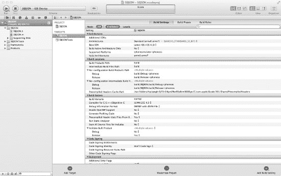

**图 11–5.** *我们的 SBJSON 静态库项目窗口*

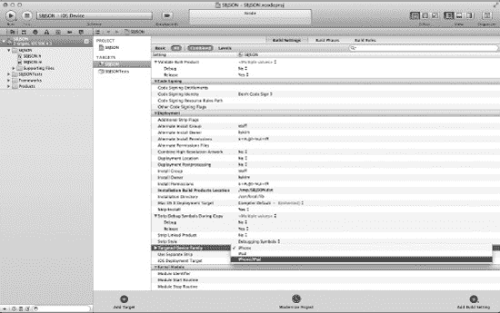

**图 11–6.** *更改库的目标设备*

在导航窗格中，按住 Shift 键，选择 `SBJSON.h` 和 `SBJSON.m` 这两个文件。我们不需要这两个文件，所以删除它们。此时应出现一个对话框，询问您是要移除文件引用还是真正删除它们（参见图 11–7）。我们确实想删除它们，所以点击 Delete。

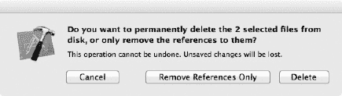

**图 11–7.** *是的，我们确实想删除这些文件。*

现在，从 Super Checkout 复制相关文件。在导航窗格中，选择 SBJSON 分组。点击 File 菜单或右键单击导航窗格，然后选择“Add Files to SBJSON”。当文件选择对话框打开时，导航到 Super Checkout 项目文件夹内的 `SBJSON` 文件夹。选择此文件夹中的所有文件（参见图 11–8）。在“Destination”标签旁边，勾选“Copy items into destination group's folder (if needed)”。对于“Folders”选项，选择“Create groups for any added folders”选项。最后，确保在“Add to targets”列表中只勾选了 SBJSON。点击 Add。现在，这些文件应该会出现在导航窗格的 SBJSON 分组中（参见图 11–9）。

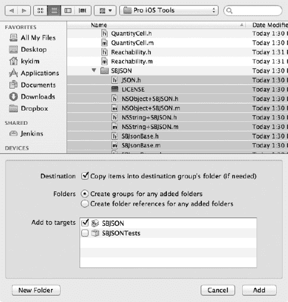

**图 11–8.** *从 Super Checkout 复制 SBJSON 文件*

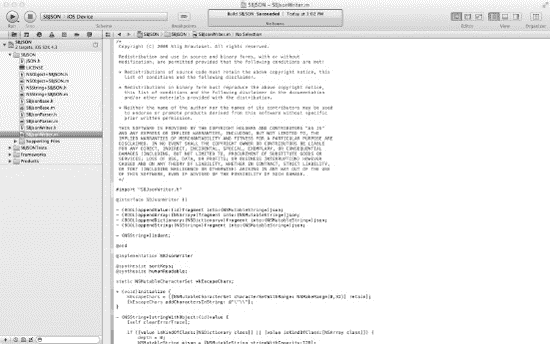

**图 11–9.** *SBJSON 中的源文件*

如果您尝试构建 SBJSON 静态库，将会成功。但我们还没有完成。当您使用静态库时，需要将其*链接*到您的应用程序。请记住，静态库是已编译目标文件的归档。当您将其链接到应用程序时，其效果与直接在应用程序中编译代码相同（就像我们最初构建 Super Checkout 一样）。问题在于，我们并不真正了解静态库内部有哪些类、方法或函数。通常，为了让一个类了解另一个类的工作原理，我们会包含头文件，即扩展名为 `.h` 的文件。为了对静态库执行此操作，我们需要发布我们的头文件。

在导航窗格中，选择 SBJSON 项目以进入项目编辑器。选择 SBJSON 目标，并打开 Build Phases 视图。展开名为“Copy Headers (6 items)”的构建阶段（参见图 11–10）。将文件 `JSON.h` 从 Project 拖放到 Public。将其余的头文件从 Project 拖放到 Private。您的屏幕应如图 图 11–11 所示。

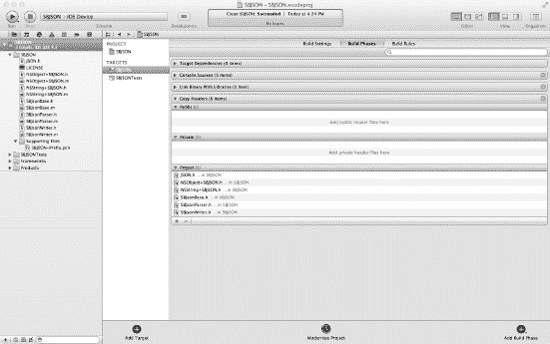

**图 11–10.** *复制头文件*

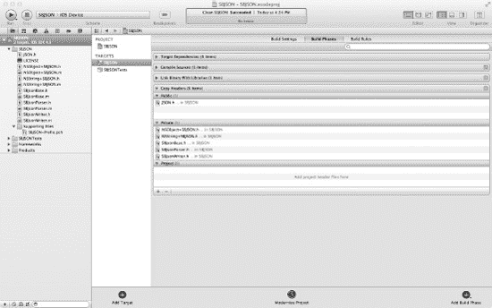

**图 11–11.** *将头文件从 Public 移至 Private*

为什么我们只将 `JSON.h` 头文件移到 Public，而其他头文件没有？难道我们不需要了解所有的类和类别吗？嗯，是的，我们需要，但如果您查看 `JSON.h`，您会注意到它导入了（`#imports`）所有其他头文件。因此，通过导入 `JSON.h`，我们将导入所有其他头文件。

保存您的工作并进行构建。应该会成功。

**注意：** 此时，我建议您为 SBJSON 代码添加单元测试。测试静态库与测试应用程序非常相似，添加这些测试是可选的。因此，我将把这项任务留作编写测试的练习。

让我们重复这个过程，为 `ASIHTTPRequest` 创建一个静态库。有一些差异，我将重点说明。

再次创建一个新的 Cocoa Touch 静态库。这次，我们将其命名为 **ASIHTTPRequest**。确保包含了单元测试并禁用了自动引用计数。将项目保存在您保存 SBJSON 项目的相同位置。

一旦 ASIHTTPRequest 项目创建完成且项目窗口打开，选择 Target ASIHTTPRequest。导航到 Build Settings（确保选中了“All”视图选项），并将 Deployment 部分中的“Targeted Device Family”更改为 iPhone/iPad。

删除文件 `ASIHTTPRequest.h` 和 `ASIHTTPRequest.m`。当系统询问时，确保您真正删除了这些文件。在导航窗格中选择 `ASIHTTPRequest` 分组，然后点击 File 菜单或右键单击导航窗格，并选择“Add Files to ASIHTTPRequest”。当文件选择对话框打开时，导航到 Super Checkout 项目内的 `ASIHTTPRequest` 文件夹，选择此文件夹中的所有文件，并将这些文件复制到 ASIHTTPRequest 项目中。

与我们构建 SBJSON 静态库时不同，我们还没有完成文件的添加。再次选择“Add Files to ASIHTTPRequest”，并导航到 Super Checkout 项目。将文件 `Reachability.h` 和 `Reachability.m` 添加到 ASIHTTPRequest 项目中。请记住，通过勾选“Copy items into destination's folder (if needed)”复选框来确保复制了文件。

进入 ASIHTTPRequest 的项目编辑器，并选择 ASIHTTPRequest 目标。选择 Build Phases 选项卡，展开“Copy Headers (13 items)”构建阶段。将 `ASIHTTPRequest.h` 和 `ASIDownloadCache.h` 拖放到 Public 部分。将其余的头文件拖放到 Private 部分。构建该库。

至此，我们应该有了两个静态库项目：SBJSON 和 ASIHTTPRequest。接下来，我们将把这两个项目集成到 Super Checkout 中。


### 使用静态库

将部分 Super Checkout 代码拆分到 `SBJSON` 和 `ASIHTTPRequest` 这两个静态库中的目的之一，是为了促进代码复用。而开始复用的最佳场所莫过于 Super Checkout 项目本身。在开始之前，我们先讨论一下如何在 Super Checkout 中使用这些静态库。

在 Super Checkout 项目中使用静态库项目有两种不同的方法：子项目和工作区。

子项目是嵌入到另一个项目中的项目。在 Xcode 中，这很容易实现。从逻辑上讲，这种方法很有道理：Super Checkout 项目将依赖于 `SBJSON` 和 `ASIHTTPRequest` 项目。将这两个项目作为子项目嵌入 Super Checkout 中，在结构上会带来一些视觉上的清晰度。然而，采用这种方法时，需要解决一些配置问题。在讨论子项目方法时，我们会解决这些问题。

随着 Xcode 4 的发布，Apple 引入了工作区的概念。工作区是多个项目的逻辑容器。所有项目共享同一个构建目录。通过使用工作区，所有项目在构建时都可以使用彼此的构建产品。

子项目和工作区这两种方法各有优缺点。你应该选择最适合自己风格的方法。我会将两者都讨论一遍，以求全面。在开始之前，请备份所有三个项目（Super Checkout、SBJSON 和 ASIHTTPRequest），这样如果你愿意，可以尝试这两种方法。

### 将静态库作为子项目使用

在 Xcode 中打开 Super Checkout 项目。选择 File  Add Files to “Super Checkout”。当文件对话框出现时，导航到 `SBJSON` 文件夹，并选择文件 `SBJSON.xcodeproj`（参见 图 11–12）。确保“Copy items into destination group's folder (if needed)”未被勾选。仅将其添加到 Super Checkout target。点击 Add。

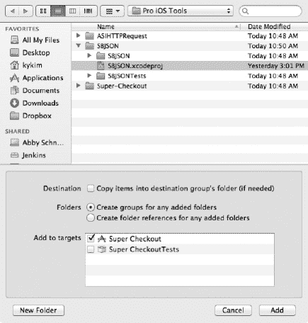

**图 11–12.** *将 SBJSON 项目添加到 Super Checkout*

`SBJSON` 项目应该会出现在导航窗格中的 Super Checkout 项目内部（参见 图 11–13）。

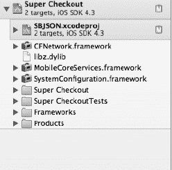

**图 11–13.** *将 SBJSON 添加到 Super Checkout 之后*

当我们构建 Super Checkout 时，我们希望 `SBJSON` 项目首先被构建。我们将通过在 Super Checkout 的 Build Phases 中添加一个 Target Dependency 来实现这一点。

在导航窗格中，点击 Super Checkout 项目以打开 Project Editor 视图。在 Targets 下，选择 Super Checkout，然后选择 Build Phases 标签。第一个构建阶段应该是“Target Dependencies (0 items)”。点击右侧的展开三角形以展开它（参见 图 11–14）。

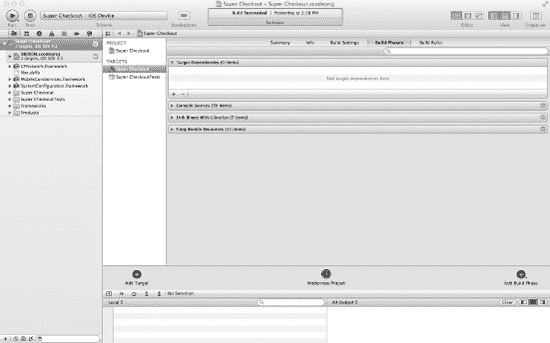

**图 11–14.** *展开 Target Dependencies 后的 Super Checkout*

点击 Target Dependencies 构建阶段底部的加号。应该会出现一个目标选择窗格（参见 图 11–15）。在 `SBJSON` 项目下选择 `SBJSON` target，然后点击 Add。`SBJSON` target 应该会出现在依赖项列表中（参见 图 11–16）。

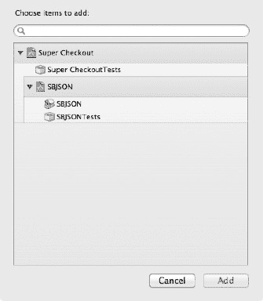

**图 11–15.** *目标选择窗格*

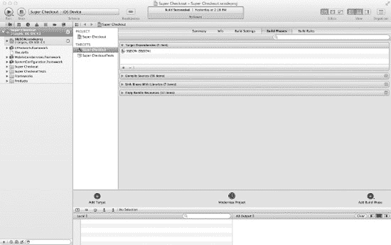

**图 11–16.** *Target Dependencies 中的 SBJSON*

在构建阶段列表的下方，应该有一个名为 Link Binary with Libraries (7 items) 的项目。展开它（参见 图 11–17）。点击加号以显示库选择窗格（参见 图 11–18）。在顶部，应该有一个名为 `Workspace` 的文件夹，其中包含项目 `libSBJSON.a`。选择 `libSBJSON.a`，然后点击 Add。库 `libSBJSON.a` 应该会以红色显示在 Link Binary with Libraries 列表的顶部（参见 图 11–19）。别担心，红色仅表示该库尚未为本项目构建。

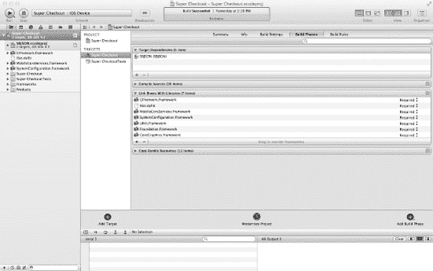

**图 11–17.** *展开的 Link Binary with Libraries 构建阶段*

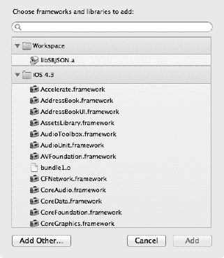

**图 11–18.** *库选择窗格*

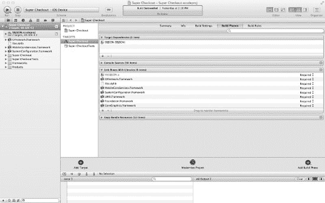

**图 11–19.** *libSBJSON.a 已添加到 Link Binary with Libraries 构建阶段*

现在，我们已经将 `SBJSON` 静态库添加到项目中。但是，我们仍然有最初嵌入在 Super Checkout 项目中的原始 `SBJSON` 代码。让我们删除这些文件。

在导航窗格中展开 Super Checkout 组，然后展开 `ExternalLibraries` 文件夹。右键点击 `SBJSON` 组，然后选择 Delete（参见 图 11–20）。应该会出现一个对话框，询问你是要删除文件还是仅仅移除对它们的引用（参见 图 11–21）。我们不再需要这些文件了，所以点击 Delete。

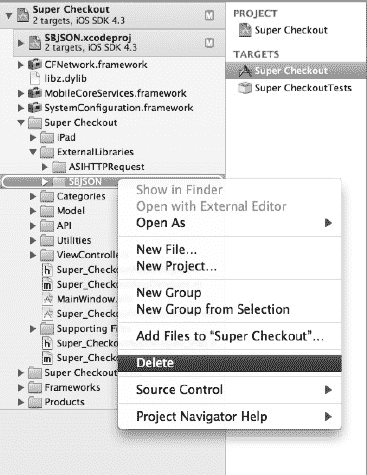

**图 11–20.** *删除 Super Checkout 组*

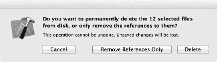

**图 11–21.** *删除对话框*

构建项目。哇！发生了什么？构建失败了。

点击导航窗格中的 Issue Navigator 标签。错误出现在 `SCJSONParser.m` 中。错误信息为：“Lexical or Preprocessor Issue ‘SBJSON/JSON.h’ not found。”如果你点击错误说明，Issue Navigator 会在源代码查看器中显示有问题的代码行（参见 图 11–22）。

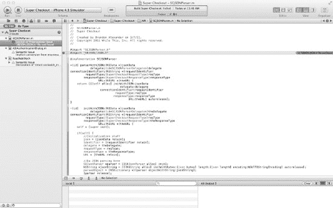

**图 11–22.** *构建错误*


好的，作为一名高级文档工程师和翻译员，我将严格遵循您的注意事项，对给定的英文文本进行翻译。


### 技术文档排版

当我们最初构建 Super Checkout 时，我们将所有 SBJSON 代码放在一个名为`SBJSON`的文件夹中。在`SBJSON`文件夹中的文件包括头文件`JSON.h`。如果您还记得，我们删除了那个文件夹及其所有文件。那么如何解决这个问题呢？

首先，头文件`JSON.h`在哪里？它在 SBJSON 静态库项目中（参见 Figure 11–23）。`JSON.h`仍然位于名为`SBJSON`的文件夹中。因此`SCJSONParser.m`中的`#import "SBJSON/JSON.h"`行在技术上是正确的。但 Xcode 似乎不知道如何找到它。请注意，`SBJSON`和`Super-Checkout`文件夹彼此相邻。回想一下，就 Xcode 而言，所有项目文件应该位于`Super-Checkout`文件夹中，因此我们需要告诉 Xcode 也查看`SBJSON`文件夹内部。

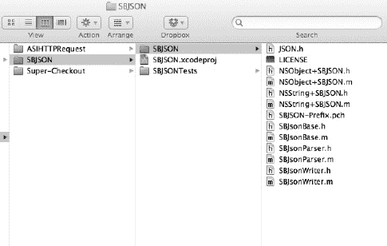

**Figure 11–23.** *`JSON.h`的当前位置*

返回导航窗格中的项目导航器。单击 Super Checkout 项目以打开项目编辑器视图，然后选择 Super Checkout 目标。选择构建设置选项卡，并确保选中全部视图设置。接下来，向下滚动并搜索具有搜索路径标题的构建设置组。该组的第一行应该标题为始终搜索用户路径。将此值从否更改为是（参见 Figure 11–24）。

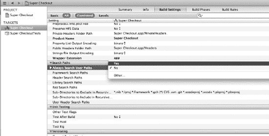

**Figure 11–24.** *开启始终搜索用户路径构建设置*

搜索路径构建设置组的最后一行应该是用户头文件搜索路径。双击此行，位于文本用户头文件搜索路径的右侧。应出现一个窗格。单击左下角的加号按钮，并在出现的行中输入`../SBJSON`（参见 Figure 11–25）。单击完成。字符串`../SBJSON`应出现在用户头文件搜索路径行上。

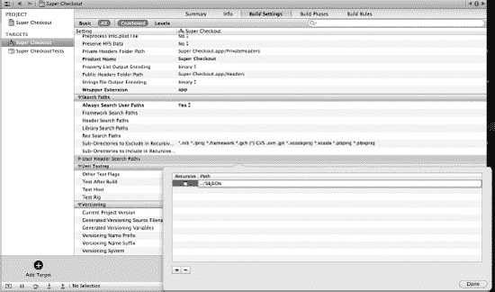

**Figure 11–25.** *添加用户定义的搜索路径*

保存您的工作，并尝试再次构建。成功！

对 ASIHTTPRequest 库重复此过程。添加库后，您可以删除导航窗格中的`ASIHTTPRequest`组（如果需要，您也可以删除`ExternalLibraries`组，以整理项目）。在用户头文件搜索路径构建设置中，输入`../ASIHTTPRequest`。

构建项目。这次发生了什么？

问题导航器显示问题出在`SuperCheckoutAPIEngine.m`中。错误是“词法或预处理器问题‘`ASIHTTPRequest.h`’未找到。”嗯，修复对`SBJSON/JSON.h`有效，为什么对`ASIHTTPRequest.h`无效？

原因很简单。我们只需要在导入的`ASIHTTPRequest.h`前面加上其父目录。因此编辑`SuperCheckoutAPIEngine.m`，内容如下：

```
#import "SuperCheckoutAPIEngine.h"
#import "SuperCheckoutRequestTypes.h"
#import "SCJSONParser.h"
#import "Product.h"
#import "ASIHTTPRequest/ASIHTTPRequest.h"
#import "ASIHTTPRequest/ASIDownloadCache.h"
#import "NSString+UUID.h"
```

为什么我们需要添加`ASIHTTPRequest/`？我们告诉 Xcode 在`Super-Checkout`目录旁边的目录`SBJSON`和`ASIHTTPRequest`中查找。但是当我们导入（`#import`）头文件时，我们正在做两件不同的事情。`#import "SBJSON/JSON.h"`表示导入位于目录`SBJSON`内的文件`JSON.h`。如果您查看`SBJSON`项目文件夹内部，您会看到另一个`SBJSON`文件夹。文件`JSON.h`在那里。`#import "ASIHTTPRequest.h"`表示导入位于某处的`ASIHTTPRequest.h`文件。如果您查看`ASIHTTPRequest`文件夹内部，有另一个`ASIHTTPRequest`文件夹，其中`ASIHTTPRequest.h`位于那里。

Super Checkout 现在应该可以构建了。

### 使用工作区

如前所述，Apple 在 Xcode 4 中引入了工作区的概念。工作区是多个相关项目的通用逻辑容器。通过使用工作区，您让 Xcode 管理工作区项目之间的显式和隐式关系。在我们的案例中，Xcode 将在我们构建 Super Checkout 应用程序时构建静态库。

**注意：** 请记住，您需要从我们在创建子项目之前制作的副本开始工作。如果您的 Super Checkout 应用程序项目将静态库作为子项目，那么您正在使用错误的项目。

如果尚未打开，请在 Xcode 中打开 Super Checkout。

选择文件  新建  新建工作区。当另存为对话框出现时，导航到包含 Super Checkout 项目的目录。您还应该看到我们之前创建的 ASIHTTPRequest 和 SBJSON 静态库项目。输入`Super-Checkout.xcworkspace`作为工作区的名称，然后单击保存（参见 Figure 11–26）。

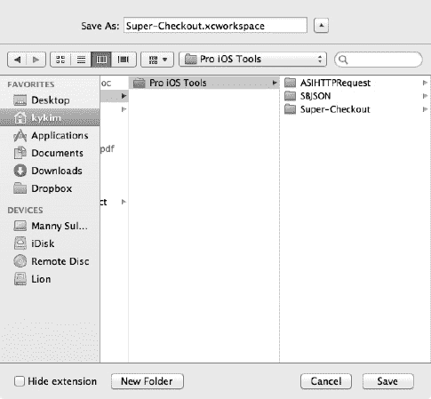

**Figure 11–26.** *创建我们的新工作区*

现在，我们需要将项目添加到工作区。

如果导航窗格未显示，请单击工具栏上的导航器区域选择器（）将其打开。此外，如果工具栏编辑器选择器中未选择标准编辑器（），请选择它。

在工作区导航窗格中，按住 Control 键单击以显示上下文菜单。选择将文件添加到“Super-Checkout”（参见 Figure 11–27）。当文件选择对话框打开时，导航到 Super-Checkout 项目的文件夹。选择`Super-Checkout.xcodeproj`。确保如果需要将项目复制到目标组的文件夹复选框未选中。选择为任何添加的文件夹创建组单选按钮。确保您的对话框看起来像 Figure 11–28。单击添加。

**注意：** 不要使用文件菜单中的“将文件添加到‘Super-Checkout’”选项。这不会以我们想要的方式将项目添加到工作区。

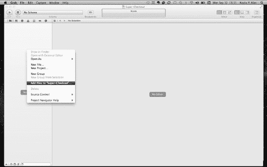

**Figure 11–27.** *将文件添加到工作区的上下文菜单*

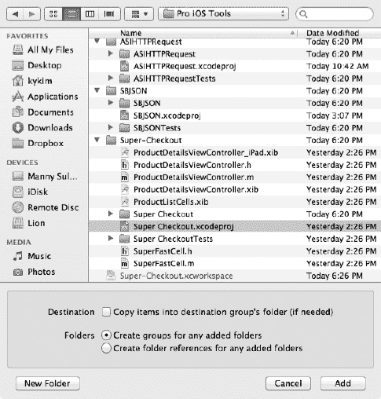

**Figure 11–28.** *将 Super Checkout 应用程序添加到工作区*

您的工作区现在应该有一个项目，Super Checkout（参见 Figure 11–29）。重复此过程以添加 ASIHTTPRequest 和 SBJSON 项目。再次使用导航窗格中的上下文菜单，而不是文件菜单。完成后，您的工作区窗口应类似于 Figure 11–30。

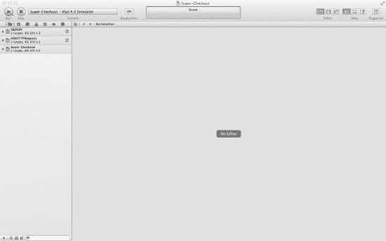

**Figure 11–29.** *包含 Super Checkout 应用程序的工作区*


**Figure 11–30.** *包含所有项目的工作区*

像我们之前所做的那样，将`libASIHTTPRequest.a`和`libSBJSON.a`库添加到 Super Checkout 应用程序。单击导航窗格中的 Super Checkout 项目以显示项目编辑器视图。选择构建阶段选项卡，并展开标题为“Link Binary With Libraries (7 Items)”的构建阶段。单击加号，添加这两个静态库。

此外，我们可以删除 Super Checkout 应用程序中不需要的原始 ASIHTTPRequest 和 SBJSON 文件。单击导航窗格中 Super Checkout 项目旁边的展开三角形。打开 Super Checkout 组，并删除名为外部库的组。当对话框出现时，真正删除这些文件。

最后，我们需要调整源文件`SCJSONParser.m`。我们需要更正 SBJSON 头文件的`#import`指令。调整文件内容如下：

```
#import "SCJSONParser.h"
#import "JSON.h"
```


保存文件并构建 Super Checkout 应用程序。如果观察 Xcode 的 Activity Viewer，你会看到它首先构建了 `ASIHTTPRequest` 和 `SBJSON` 项目，即使我们没有将它们指定为 Super Checkout 的目标依赖项。Xcode 能够推断出我们需要先构建这些项目，因为我们将其产品 `libASIHTTPRequest.a` 和 `libSBJSON.a` 链接到了 Super Checkout 应用。

然而，构建似乎因词法或预处理器问题而失败。你可能会看到 Xcode 无法找到以下三个文件之一：`ASIHTTPRequest.h`、`ASIDownloadCache.h` 或 `JSON.h`。我们之前将静态库作为子项目包含时曾遇到过此错误。问题类似，但这次的解决方案不同。

选择 Super Checkout 项目，展开项目视图。选择 Super Checkout 目标，然后选择 Build Settings 标签页。找到名为 Search Paths 的构建设置组。在其中找到标记为 Header Search Paths 的行。双击该行（行标签右侧），此时应会弹出一个窗口。点击左下角的加号添加一行。在 Path 列下输入值 `$(BUILT_PRODUCTS_DIR)`，然后点击 Done（参见 Figure 11–31）。

**注意：** 我认为必须设置 Search Paths 构建设置是 Xcode 的一个 Bug。Xcode 知道要首先构建静态库项目，并将所有工作区项目构建到同一位置。按理说，Xcode 应该自动将 `BUILT_PRODUCTS_DIR` 包含在其头文件搜索路径中。如果你也同意，请在 [`http://bugreporter.apple.com/`](http://bugreporter.apple.com/) 提交错误报告。


**Figure 11–31.** *设置头文件搜索路径*

**注意：** `BUILD_PRODUCTS_DIR` 是一个 Xcode 环境变量。实际值取决于构建环境。在这个例子中，`BUILT_PRODUCTS_DIR` 取决于构建配置。如果展开 Header Search Paths 行，你会看到它为 Debug 和 Release 配置解析成了两个不同的值。

构建项目并运行它。再次成功！

我已经向您展示了两种将静态库添加到应用的方法。两种方法都可以，选择最适合您的一种。然而，自从 Xcode 4 引入工作区以来，很明显 Apple 可能会将此视为集成多个项目的首选方法。

### 在 GitHub 上共享

让我们暂时离开我们的应用，思考一下如何共享代码。共享项目的方式有很多种。我们可以将源代码打包发布到博客或网站上，但更好的方案是使用公共源代码仓库（repo）。一个好的仓库应允许我们限制谁可以提交代码，同时允许任何人查看或下载代码。其他有益的功能应包括集成的 Bug/问题追踪器和 Wiki 系统。

有很多选择可以满足这些标准。一个流行的选择是 GitHub（[`http://www.github.com`](http://www.github.com)），参见 Figure 11–32。GitHub 是一个基于 Git 分布式版本控制系统的网站，Git 强调速度，最初由 Linus Torvalds（又是他！）开发，用于协助 Linux 内核的开发。Git 的一个特性是每个工作目录都是一个功能完整的仓库，具有完整的历史记录和完整的版本追踪能力。每个 Git 仓库不依赖于网络访问或中央服务器。


**Figure 11–32.** *GitHub 主页*

如果你还记得，我们在创建项目时勾选了“为此项目创建本地 git 仓库”的复选框。这会在我们的项目目录中创建一个本地 git 仓库。通常，这个仓库是隐藏的，但使用 `Terminal.app`，我们可以通过命令行使用 `ls –aCF` 命令看到它（参见 Figure 11–33）。


**Figure 11–33.** *SBJSON 项目目录中名为 .git 的 Git 仓库*

#### 登录 GitHub

首先登录你的 GitHub 账户。如果你尚未创建账户，请立即创建一个。关于如何设置账户的信息，请参见 Chapter 3。

在您的 GitHub 仪表板中（参见 Figure 11–34），左侧是关于您可能正在关注的仓库的状态更新。右侧是您自己的仓库。在您的仓库下方是您正在关注的仓库。

当您关注一个仓库时，您是在告诉 GitHub 您对跟踪一个项目感兴趣，但可能不想为其贡献代码。这是一个相当方便的功能，可让您轻松跟踪项目。如果您还不熟悉 GitHub，可以浏览该网站以了解更多类似的功能。


**Figure 11–34.** *一个示例 GitHub 仪表板*

#### 创建一个共享仓库

从您的 GitHub 仪表板，点击“Your Repositories”标签旁边的“New Repository”按钮。这将带您进入新仓库页面（[`https://github.com/repositories/new`](https://github.com/repositories/new)），参见 Figure 11–35。


**Figure 11–35.** *GitHub 新仓库页面*

在 Project Name 字段中输入 **SBJSON**。其余字段为可选，但在 Description 字段中输入 **SBJSON static library for Super Checkout**。此项目没有主页，因此将该字段留空。由于我们使用的是免费账户，并且计划与所有人共享此代码，请保持标签“Anyone (learn more about public repos)”旁边的单选按钮处于选中状态。点击 Create Repository 按钮。

我们应该会被重定向到我们新的 GitHub 仓库（参见 Figure 11–36）。由于这是一个空仓库，GitHub 已经贴心地给出了我们需要在计算机上执行的命令来设置我们的项目。


**Figure 11–36.** *我们的 GitHub 仓库主页*

回到您的计算机，打开 `Terminal.app`。导航到 SBJSON 静态库项目的项目目录。在命令行中，输入 GitHub 项目页面上的全局设置命令：

`> git config –global user.name "Your Name"`
`> git config –global user.email your@email.com`

将 `"Your Name"` 替换为您希望与 GitHub 一起使用的名称。`your@email.com` 应该是您在 GitHub 注册时使用的电子邮件地址。

接下来，我们要告诉本地 Git 仓库关于 GitHub 上的仓库的信息。我们应该还在 SBJSON 目录中。该目录应该包含我们之前看到的 `.git` 目录。输入此命令：

`> git remote add origin git@github.com:username/SBJSON.git`

将 `username` 替换为您的 GitHub 用户名。在此命令中，`git@github.com:username/SBJSON.git` 是 GitHub 上仓库的 URL。此命令表示我们想要添加一个远程仓库，并为其指定本地别名 `origin`。


#### 提交我们的更改

在将代码推送到 GitHub 之前，我们需要在本地提交更改。请记住，每个 Git 仓库都是一个功能完备的独立仓库。从 Git 的角度来看，代码的规范副本位于你的计算机上，而 GitHub 上的仓库只是一个远程副本。现在，让我们将工作保存到本地仓库中。

在 Xcode 中打开 `SBJSON` 静态库项目。选择 File  Source Control  Commit。Xcode 会显示源代码控制面板（参见图 11–37）。左侧是 SBJSON 项目文件的列表。大多数文件会被勾选，有些则不会。你无需更改任何设置。未勾选的文件是 Xcode 认为无需提交到仓库的文件。选择 `JSON.h` 文件。在文件查看器面板中，`JSON.h` 的内容应显示在左侧。右侧的文件查看器会显示“File has no revisions”。由于这是首次提交，因此没有内容可显示。在提交已有文件时，左侧文件查看器会显示 `JSON.h` 的当前状态，而右侧文件查看器会显示仓库中的上一个版本。Xcode 会高亮显示文件版本之间的差异，以便你查看更改内容。


**图 11–37.** *Xcode 的源代码控制面板*

在面板底部附近，有一个标有“Enter commit message here”的文本区域。你可以在该区域输入关于将要提交到仓库的更改的注释。描述可以详尽，也可以简洁，随你而定。在此例中，请输入 **Initial commit**。然后点击 Commit。

提交完成后，源代码控制面板会消失，显示出项目窗口。现在，我们准备将更改推送到 GitHub。

这次，选择 File  Source Control  Push。此时会出现一个对话框（参见图 11–38）。Remote 下拉菜单可能需要几秒钟才能填充。请稍候，Xcode 正在检查远程仓库的存在性和可访问性。最终，下拉菜单应显示“origin/master (Create)”。这表示 GitHub 将通过向 origin（我们为远程 GitHub 仓库设置的别名）发送 master（我们的本地仓库）的副本来创建仓库。点击 Push。


**图 11–38.** *Xcode 的远程仓库对话框*

**注意：** 如果 Xcode 无法连接到远程仓库，下拉菜单将持续显示“Loading Remotes”。此外，绿色圆点和“Repository is online”文本也不会出现。点击 Cancel，并检查你的网络连接。如果连接正常，请检查你是否在 GitHub 上成功创建了仓库。最后，请检查你在添加远程仓库时是否正确输入了 GitHub URL，方法如下：

打开一个 Terminal.app 窗口，并导航到我们的项目目录。输入命令：

```
> git config –-get remote.origin.url
```

确保返回的 URL 与 GitHub 上的 URL 匹配。如果 URL 错误，你可以通过先取消设置再重新输入 URL 来修复：

```
> git config –unset remote.origin.url
> git remote add origin git@github.com:username/SBJSON.git
```

推送成功后，对话框应消失。你可以通过登录 GitHub 并检查仓库页面来确认推送是否成功（参见图 11–39）。


**图 11–39.** *推送后的 GitHub 仓库*

#### 使用 GitHub 功能

在继续之前，我想简要介绍 Git 和 GitHub 提供的一些功能：标签、拉取请求和问题跟踪。

##### 标签

标签的概念在版本控制系统中很常见。其思想是，一旦源代码达到稳定状态或完成了一个开发里程碑，我们希望以某种方式标记源代码。本质上，你是在创建一个特定时间点的源代码快照。这通过为发布版本打标签来实现。使用 Git，标签是一个非常简单的命令行过程。一旦你将更改提交到 Git，只需输入以下命令：

```
> git tag "tag-name"
```

你可以将 `tag-name` 替换为任何你想要的值。通常的做法是用点分隔的数字来打标签，表示主版本和次版本（例如 `1.0`）。要将标签推送到 GitHub，只需在 push 命令中添加 `–tags` 标志：

```
> git push –-tags origin remote
```

##### 拉取请求

GitHub 允许其用户派生 GitHub 上的一个仓库。当你派生一个项目时，你会为自己创建该仓库的一份副本，这样你就可以修改代码以修复错误或添加新功能。

一旦你对派生的仓库进行了一些更改，就可以将这些更改回馈给原始仓库的所有者以及整个社区。在 GitHub 上，你可以通过拉取请求来实现。拉取请求只是一个发送给原始仓库维护者的消息，表明你有一些更改要提供给他们。创建拉取请求很简单：只需在你派生的仓库上点击拉取请求按钮。系统会要求你为拉取请求添加评论，然后将其发送给原始仓库的维护者。

反之亦然，你需要管理那些由派生你仓库的人发送给你的拉取请求。你可以查看拉取请求、进行评论、拒绝它们，或将其合并到你的项目中。

GitHub 对拉取请求流程做了详尽的说明。你可以在 `http://help.github.com/send-pull-requests/` 阅读更多信息。

##### 问题跟踪

问题跟踪是收集错误报告的一个有用工具。它还允许人们评论他们希望在应用程序或库中看到哪些新功能。GitHub 为每个仓库都使用了问题跟踪器。它的使用相当简单。只需点击任何仓库顶部的 Issues 链接即可。

**注意：** 如果你的项目在仓库中没有显示 Issues 链接，说明它已被禁用。这通常发生在你派生一个仓库时。你可以在仓库的管理部分重新启用它。点击你仓库的 Admin 按钮。你应该会进入 Options 管理页面。在 Features 下，点击 Issues 旁边的复选框。当你返回仓库页面时，Issues 链接应该就会出现。


### 明智地选择许可证

既然你已在 GitHub 上创建了一个项目，就需要为代码挑选一个许可证。由于你的仓库是公开的，你可能希望使用开源许可证。在开源社区中，对于什么才是“开源”项目，不同的人会有不同看法。一般来说，开源软件是指以源代码形式发布，并附带许可证的软件，该许可证允许用户使用、自由修改、并以原始或修改后的形式分发该软件。开源许可证的意图在于，允许软件的任何用户都能根据自身需求修改代码，并帮助社区修复错误和进行改进。

可供选择的开源许可证种类繁多。在开源促进会（OSI）网站（[`http://opensource.org/`](http://opensource.org/)）上可以找到一个相当全面的列表。该网站提供了一个简单的十点检查清单，用以定义什么是开源许可证，以及一份满足这些标准的许可证完整列表。

### 本章小结

本章我们涵盖了大量内容。我们从 Super Checkout 应用中提取了可复用的组件，并将它们放入静态库中。然后，我们使用子项目和工作区的方法，将这些代码重新集成到项目中。最后，我们通过 GitHub 与世界分享了我们的项目，从而改善了全世界 iOS 开发者的生活。这样，即便 Super Checkout 没有成为 App Store 的畅销品（绝不可能！），我们仍能赢得其他 iOS 黑客同行的喜爱和尊重。

在合上本书继续前进之前，我还有“最后一件事”要与你分享。是什么呢？翻过这一页你就知道了。

## 第 12 章

## 最后一件事

多么精彩的旅程！我们拥有一个稳定的应用程序，并且配备了良好的自动化测试设置和静态库。我们使用 Instruments 来帮助查找应用程序中的性能瓶颈。在这个过程中，我们介绍了 Xcode 的一些优秀特性，并探索了如何在工具集中导航。不过，Xcode 还有很多我们尚未涵盖的功能。这正是本章要讲述的内容。尽管本章标题是“最后一件事”，但我们要讲的可不止这一件。

在本章中，我们将介绍自定义 Xcode 以及常用的键盘快捷键，以帮助你从开始自己的项目时就能改进工作流程。你还会找到一个方便的快速参考指南，其中列出了 Xcode 4.2 的一些常用键盘快捷键。随着时间的推移，你会将本书所学内容以及本章的要点融入到自己的工作流程中。

### 自定义 Xcode

在本书中，我们一直使用 Xcode 的默认配置。现在，是时候根据你的喜好来自定义它了。你已经见识过 Xcode 的能力，那就让它成为你的得力助手吧。首先要看的是 Xcode 的偏好设置（如果你还没探索过的话）。与任何 Mac OS X 应用程序一样，打开 Xcode 偏好设置的方法是点击 **Xcode**  **偏好设置...** ，或者按下 （逗号键）。执行此操作后，将会弹出图 12-1 所示的对话框。


**图 12-1.** *这是 Xcode 的偏好设置窗口。我们将逐一讲解窗口中的每个标签页，讨论如何自定义每个部分。*

通用标签页（参见图 12-1）是 Xcode 偏好设置的起点。在这里，我们可以设置 Xcode 的一些基本选项，例如自动保存（如果你运行在 Mac OS X Lion 上）以及如何从导航器中打开文件。屏幕底部的图例为你提供了在编辑代码时如何使用键盘修改点击操作的参考。

#### 行为

Xcode 4.2 中的行为设置是一项巨大的救星。图 12-2 展示了打开的行为标签页。


**图 12-2.** *“行为”标签页帮助你配置 Xcode 在特定事件发生时的表现方式和通知方式。*

通过“行为”标签页，你可以配置 Xcode 在启动应用程序运行时改变其外观，或者在构建失败时播放提示音。

点击底部的加号按钮，你可以添加一个新行为并将其绑定到一个键盘快捷键。你想快速切换到全屏模式并且只显示代码吗？你可以通过将它映射到任何你想要的键盘快捷键来实现。

#### 字体与颜色

图 12-3 显示了“字体与颜色”标签页。此标签页允许你配置源代码编辑器的外观。当你需要在投影仪上展示代码，以便向本地用户组介绍一些精彩主题时，这个功能非常有用，对吧？


**图 12-3.** *“字体与颜色”标签页让你可以配置编辑器的外观。*

点击“控制台”按钮可以配置控制台的外观。

如果提供的主题不合你的口味，而你有一个希望在 Xcode 4.2 中使用的主题，你可以将该 `.dvtcolortheme` 文件放到 `~/Library/Developer/Xcode/UserData/FontAndColorThemes` 文件夹中。

如果你只想微调现有主题，点击列表下方的添加按钮可以复制一个主题。复制后的主题将被放置在之前提到的文件夹中。

#### 文本编辑

下一个标签页是“文本编辑”（参见图 12-4）。这是配置 Xcode 如何处理代码编辑器功能的地方。在这里，你可以配置编辑器的行为，以及如何处理诸如代码折叠和代码补全等功能。


**图 12-4.** *“文本编辑”标签页允许你配置文本编辑器的行为，并控制代码的自动结构化方式。*

图 12-5 显示了此标签页中的“缩进”部分。关于使用空格还是制表符的著名争论，就在这个标签页的这个部分进行。


**图 12-5.** *空格与制表符的永恒之战！你会选择哪一个？*

#### 键绑定

需要查看已设置的键盘快捷键或想要修改它们？“键绑定”标签页就是为你准备的！图 12-6 显示了默认配置。此标签页的行为与“字体与颜色”标签页类似。要创建你自己的自定义配置，请复制默认配置。一旦你进行了修改，一个新的配置文件就会被放置在 `~/Library/Developer/Xcode/UserData/KeyBindings` 中。


**图 12-6.** *配置你的键盘快捷键就像打开这个标签页一样简单。*

如果你想知道某个键盘快捷键为何不起作用，请查看“冲突”部分。看看图 12-7。目前，在安装了 Xcode 的这台电脑上存在 10 个冲突。


**图 12-7.** *键绑定冲突会阻止你最喜欢的快捷键生效。*

黄色的警告三角形表示与系统存在冲突。由于系统在应用程序之前处理快捷键，Xcode 只是告诉你这个快捷键将不起作用。红色的错误表示 Xcode 内部的冲突。只要 Xcode 内部存在冲突，该绑定就不会触发。

#### 下载

继续往下看，我们来到了“下载”标签页。在这个标签页中，我们可以看到两个不同的区域需要访问。第一个是“组件”标签页。这个标签页（见图 12-8）允许你向 Xcode 下载额外的组件。这些组件包括对较旧设备的支持，以及更早版本的 iOS 系统以在模拟器中运行。


**图 12-8.** *Xcode 附带的是最新版本的 iOS。如果你需要“旧版”支持，请前往“下载”偏好设置，并在此处下载相应的支持文件。*


#### 文档

该表格中的第二部分是「文档」部分。你可以在图 12–9 中看到它。在此部分，Xcode 允许你更新 iOS、Mac 和 Xcode 的文档，以及支持相应格式的第三方文档集。


**图 12–9.** *「文档」标签页不仅管理 iOS/Mac/Xcode 文档，还管理来自任何 Atom feed 的第三方库文档。*

这些文档集是通过 Atom feed 下载的。在列表中选择一个条目，并点击「添加 Feed」按钮左侧的三角形按钮，你将看到所选 feed 的属性（再次参见图 12–9）。由于文档集是通过 Atom feed 配置的，Xcode 可以配置为自动检查更新。

#### 位置

我们快完成 Xcode 偏好设置了。下一个标签页是「位置」（参见图 12–10）。在此标签页中，你可以为派生数据、快照、归档的应用以及源码树等条目定义自定义位置。派生数据是指 Xcode 使用的实际构建产物、中间构建文件、日志和项目索引。注意不要将这些文件放入源代码控制中，因为它们会频繁更改，并且可以从项目文件重新生成。


**图 12–10.** *「位置」标签页允许你配置构建产物的默认位置。*

十有八九，你不会触碰这个偏好设置。不过，知道它的存在总是好的。

##### 源码树

「位置」标签页中的下一个部分是「源码树」部分（参见图 12–11）。该标签页允许你为位于项目外部的源码定义公共位置。「设置名称」是标识源码树的名称；对于使用同一 Xcode 项目的每个开发者来说，该名称必须相同。「显示名称」是 Xcode 在文件检查器中显示源码树所用的名称；它可以是任意名称。「路径」是源码树在文件系统中的完整路径；它会因计算机和用户的不同而不同。


**图 12–11.** *这个「源码树」标签页显示了一个空列表。将公共源文件的路径放入此列表，以便在多个项目中引用它们。*

「源码树」偏好设置非常有用，因为它允许每个开发者拥有自己的开发配置，并且使项目间的代码共享变得极其简单。

#### 分布式构建

Xcode 偏好设置中的最后一个标签页是「分布式构建」（参见图 12–12）。当一个项目需要几分钟才能编译完成时，分布式构建非常有用。配置分布式构建后，你可以提供编译单元给他人，或者使用他人提供的编译单元。对于前者，将通过 Bonjour 访问网络中共享的资源。你还可以定义多个集合来共享编译单元。

当你开启共享你的机器的设置时，你的机器将随时可用于分布式构建。Xcode 不需要运行，你也不需要登录即可与构建集群共享你的机器。


**图 12–12.** *使用分布式构建可以加速包含大量源文件的项目。*

### 键盘快捷键及其他

如果你和我一样，不经常使用鼠标或触控板。我总是将一只手放在键盘上，随时准备按下某个键盘快捷键来执行任务。常见的快捷键，如剪切（ +X）、复制（ +C）和粘贴（ +V）是最容易提到的，因为它们几乎在每一个应用程序中都会用到。

我记得当我停止使用上下文菜单，开始使用键盘进行这些操作时，我感觉效率更高了，并且能够利用节省的时间做更多事情。正是从那时起，我开始学习更多的快捷键来简化我的工作流程并变得更有效率。

在本节中，我们将介绍 Xcode 4 的键盘快捷键以及它们如何改进你的工作流程。

#### 从 Xcode 3 迁移到 Xcode 4

当我开始为 iOS 编程时，Xcode 3 是 IDE。Xcode 3 很棒，它与 Interface Builder 的集成也做得相当好。你必须打开两个独立的应用程序，这有点烦人，但当你有应用要发布时，很快就会克服这一点。适应 Xcode 3 的导航并学习其键盘快捷键并不需要很长时间，我能够快速浏览所有代码。

然后 Apple 推出了静态分析和 clang。我以为情况不会更好了。我有了一个编译器，它能告诉我何时会发生内存泄漏以及其他可能导致应用程序出现异常行为的问题。甚至还有一个能生成更快代码的新编译器！Xcode 3 开始显得有些过时了。

时间快进一点，我们看到 Xcode 4 在 WWDC 上以开发者预览版的形式出现。Interface Builder 被集成进来，Xcode 只是一个大的窗口。我深入其中开始四处查看，很快就怀念起了 Xcode 3。我退出使用，有一段时间没有碰这些新工具。

又经过几个测试版发布后，Apple 修复了一些 bug，我想看看有什么新东西。当我看到我能够让 Interface Builder 直接在源文件中生成并连接我的操作和输出口时，我就被说服了。没有回头路了，所以我开始真正学习如何在这个陌生的 IDE 中导航。

当我最初开始学习如何用键盘在 Xcode 中导航时，我开始注意到一些模式。例如，在与文件交互时按住 Option 键会在辅助编辑器中打开所选文件。再加上 Shift 键会弹出一个方便的「在...中打开」对话框（参见图 12–13）。


**图 12–13.** *当你想在新标签页、编辑器或窗口中打开某些内容时，「在...中打开」对话框是一个救星。*

像这样的一致性帮助我在 Xcode 4 中发现了一些非常好的功能。我很喜欢知道，在导航区域单击某物时按住 Option + Shift，或者在编辑器中单击某个符号时按住 Command + Option + Shift（Command 为符号添加了「点击我」功能），可以打开创建新标签页或新窗口的功能。我甚至可以使用相同的技巧配合「快速打开」(Command + Shift + O) 命令，在短时间内就能在新标签页中打开一个文件。

#### 快给我快捷键！

我已经用快捷键吊足了你的胃口，那么让我们按功能来逐一了解它们。表 12–1 全部是关于在 Xcode 中导航的。例如，打开和关闭某些区域、与 Xcode 的不同编辑器模式交互，都可以通过键盘完成。表 12–2 全部是关于文件/符号操作，以及你在编辑文件时能做什么，并通过跳转使编辑变得流畅和无痛。表 12–3 是关于方案以及从键盘执行方案操作的。


以上只是 Xcode 4 中所有可用快捷键的一部分。其余的可以在 Xcode 的偏好设置和菜单栏中找到。Colin Wheeler 还在 [`https://github.com/Machx/Xcode-Keyboard-Shortcuts`](https://github.com/Machx/Xcode-Keyboard-Shortcuts) 整理了一份详尽的列表。


好的，作为一名高级文档工程师和翻译员，我将严格遵循您的格式要求，将以下英文文本翻译成中文。


### 查看文档

既然您已经成为了直接从键盘使用 `Xcode` 的大师，我们可以继续探讨最后一个主题：查看文档。阅读文档至少占用了我们作为开发人员一半的工作时间。在本章前面部分，您已经了解到如何通过 atom feeds 配置自定义文档集。但这只是故事的一半。

一旦 feed 被下载（如 Apple 提供的文档）或添加，您将需要搜索文档，并拥有一个快速的文档参考指南。我们首先要查看的地方是主 `Xcode` 窗口。

打开 `Super Checkout` 项目（如果尚未打开），并导航到 `Super_CheckoutAppDelegate.h`。接下来，按住 Option 键并点击 `UIApplicationDelegate` 协议符号（注意光标会改变样式，悬停时符号会加下划线）。弹出的浮层（如图 12–14 所示）会显示所选符号的简短摘要。


**图 12–14.** *文档浮层为您提供所选符号的简短摘要。*

在此处，您可以执行许多不同的操作。点击浮层右上角的书本图标，将打开“管理器”并显示该符号的相应文档。点击中间带有“h”的文件图标，将打开框架作者提供的公共头文件（如果提供的话）。浮层中的其余链接将打开“管理器”或头文件。您还可以查看其他相关文档所在的位置，这在您需要查看特定类的示例代码或编程指南时会非常方便。

查看文档的第二种方法是打开“工具”区域。大多数内容都有快速帮助查找功能，您无需按住 Option 键点击项目。图 12–15 展示了与图 12–14 相同的实例，并打开了“工具”面板，且选中了“快速帮助检查器”。


**图 12–15.** *“快速帮助检查器”显示的信息与帮助浮层相同，但它显示的不只是代码的帮助。*

“快速帮助检查器”的一个优点是其能够显示不仅仅是代码的快速帮助。在目标（Target）的构建设置中，您可以选择任何设置，“快速帮助检查器”会显示该设置将设置哪个编译器标志以及该标志的作用。

查看文档的最后一种方法是通过“管理器”。点击 `Xcode 4` 窗口右上角的“管理器”按钮打开“管理器”。这会打开“管理器”窗口。点击“文档”标签页，然后输入 `NSObject`（参见图 12–16）。


**图 12–16.** *当您需要搜索项目文档库时，“管理器”的文档窗口极其有用。*

默认情况下，“管理器”会将结果限制为最佳结果，您可以点击每个部分下方的“显示……更多结果”文本来查看所有结果。您也可能会看到重复的条目。要解决此问题，请点击放大镜，然后选择“显示查找选项”以展开一些选项并缩小搜索范围。您很少会同时开发 Mac 应用和 iOS 应用。

关于阅读文档的内容大致就是这些。能够阅读文档并确切知道去哪里获取所需的详细程度，对于在开发应用程序时尽可能保持高效至关重要。

### 总结

就是这样。我们完成了！我希望您学到的东西和我写这本书时一样多。在这本书中，有很多我未能有机会涵盖的内容，我希望您现在对开发者工具有了足够的背景知识，可以独立探索并自行学习其中的一些内容。我已经教给您如何使用这些工具的知识；如何使用好它们则取决于您。现在，去编写一些令人惊叹的应用吧！

## 索引

### A

Ad hoc 构建, 178

App ID, 193, 194

Beta 构建

代码签名部分, 198

配置文件, 197, 198

方案弹出菜单, 199

共享配置面板, 199, 200

`SuperCheckout_AdHoc_Provisioning_Profile`, 198, 199

`Xcode` 管理器窗口, 197, 200

Beta 分发, 201

证书请求, 183

证书助手窗口, 180, 181

证书标签页, 180

`CertificateSigningRequest.certSigningRequest`, 181

密钥对信息, 181, 182

钥匙串访问应用程序, 179

钥匙串访问偏好设置窗口, 180

分发配置文件, 194, 195, 196, 197

iOS 分发证书

`AppleWWDRCA.cer` 文件, 188

开发者计划链接, 184

分发标签页, 186

iOS Dev Center, 183, 184

待签发状态, 187

配置门户链接, 184

配置门户菜单, 185

配置门户页面, 185

请求提交, 186, 187

`UDID`

批量处理, 191, 192

确认过程, 192

设备页面, 189

单个处理, 190, 191

App Store, 2

Apple, 134, 135

`ASIHTTPRequest`

`CFNetwork`, 144

Classes 文件夹, 143

`CoreGraphics`, 144

外部库组, 141

`external/reachability` 文件夹, 144

Git 分支, 141

库列表, 144

`MobileCoreServices`, 144

`SystemConfiguration`, 144

`zlib`, 144

自动引用计数 (`ARC`)

自动释放池, 52

自动释放工具, 52

`CFStringRef`, 54

错误修复, 53, 54

Fix-It 功能, 55

生命周期限定符, 51

内存管理代码, 51, 55

属性特性, 52

保留循环, 56, 57

目标选择表单, 52, 53

弱引用属性, 54

`Xcode`, 55, 56


### B

Beta 测试，2，4
- Ad hoc 构建。*参见* Ad hoc 构建
- Bug 和崩溃报告，201
- 崩溃报告，175，176
- 定义，176
- 设备信息，177
- 使用说明，177
- iTunes，177
- 开源崩溃报告框架，201
- *测试人员*，175
- UDID，177

Bug 跟踪系统，178

### C

证书吊销列表 (CRL)，180
- Clang 静态分析器工具，260

持续集成 (CI)
- Bug 报告，264
- 构建失败通知，259
- Clang Scan-Build 插件，260，262
- Clang 静态分析器，262，273
- 调试配置，263
- 部署流程，270
- `DEPLOYMENT_LOCATION` 标志，266
- `DSTROOT` 编译器标志，266
- 电子邮件通知部分，259，260
- 安装流程，268，269，270
- IPA 文件，268
- Jenkins。*参见* Jenkins
- 任务详情页面，264
- 多个 `xcodebuild` 命令，272
- 夜间构建，271
- 无线分发，268
- `PackageApplication` 命令，265
- `PackageApplication` 脚本，266
- 构建后操作部分，263
- 质量控制，241
- `scan-build` 命令，261
- `scan-build` 脚本，273
- Shell 命令，267
- 静态分析器，260，262
- Test Flight，270，271
- Xcode 4 工作区，265
- Xcode 脚本
  - 内置环境变量，258
  - 标志，257
  - `xcodebuild` 工具，256
  - `xcode-select` 工具，272
  - `XCRun`，267

核心动画与流畅滚动
- 动画分析工具，126
- 混合图层，127，128，133
- `CALayer`，128
- 合成，128
- 调试选项，126，127
- `ProductCell` 类，130，132
- Super Checkout 配置文件，126，133
- `SuperFastCell`，129
- Apple，134，135

图形
- `drawRect:` 和 `layoutSubviews`，124
- 媒体层，125
- `UINavigationController`，126
- 视图绘制周期，125
- 主线程，110
- 构建设置，103
- Cocoa Touch 与 UIKit，100
- 代码签名配置，103
- 事件循环，101
- 斐波那契数列，107
- 启动 Xcode，102
- 图像加载，114–24
- 迭代斐波那契实现，109
- `main.m` 文件，99，100
- `MainWindow` nib 文件，100
- 性能调优，102
- 产品界面。*参见* 产品界面
- 配置文件配置，102，104
- 递归算法，110
- `RootViewController` 斐波那契，109
- 滚动视图，113
- 时间分析器模板，108
- 更新后的 `RootViewController`，105，106

Core Data 模型，18
- 提交消息，21，22
- 文件视图，22
- 平面视图，22
- `fullName` 方法，19
- 名称列表，18
- 项目导航器，21
- 项目视图，22
- `RootView Controller`，20
- `RootViewController`，19，20
- Super Hello World，18

### D

调试导航器，12

下载标签页，356

### E

企业开发者计划，3


### F

- `Fibonacci sequence`，107
- `First-class tools`，7
- `分配与泄漏检测工具`，33
- `分配检测工具`，31
- `辅助编辑器`，12，13
- `com.example`，8
- `数据收集应用程序`，17
- `数据模型`。*参见* 核心数据模型
- `调试导航器`，12
- `Instruments 启动画面`，32
- `界面生成器`，28
- `跳转栏`，33
- `跳转栏`，14
- `日志导航器`，12
- `多个标签页`，17
- `NewPersonViewController`，22，23，25，26，27，28
- `NewPersonViewController`，24
- `organizer`
  - 归档应用程序，16
  - 设备部分，15
  - 文档标签页，16
  - 项目标签页，15，16
  - 仓库标签页，15
  - Xcode 4，15
- `项目元数据和目标`，9，10
- `项目导航器`，11
- `RootViewController`，14
- `方案编辑器`，31
- `方案编辑表单`，30
- `方案`，29
- `标准编辑器`，12，13
- `Super Hello World`，8，9，29，32，33
- `符号导航器`，11
- `性能调优`，34，35
- `UITableViewCells`，27
- `单元测试目标`，8，9
- `版本编辑器`，13，14
- `工作区窗口`，Xcode，10，11
- `Xcode`，7，8，12，16
- `Xcode 3`，9，10
- `Xcode 4`，28

### G

- `GitHub`，37，337
  - 账户登录，339
  - alpha 质量应用程序，48
  - `克隆`，44
  - 仪表盘，339，340
  - 分布式版本控制系统，38
  - 翻转模态视图控制器，45
  - `Fork 按钮`，40，41
  - `Git 分布式修订控制系统`，338
  - `Git 仓库`，338，339
  - `GitHub 仓库`，345
  - 主页，338
  - 集成的 bug/问题追踪器，337
  - 问题追踪，346
  - `JSON` (JavaScript 对象表示法)，45
  - 开源许可证，346
  - `OS X`，40
  - 公共源代码仓库，337
  - 拉取请求，346
  - 注册界面，38
  - `SBJSON 静态库项目`，343
  - 共享仓库创建，340，341，342
  - `SSH 公钥`，38
  - `Super Checkout`，43，45，46
  - 打标签，345
  - `终端.app 窗口`，344
  - `欢迎使用 Xcode 界面`，42
  - Wiki 系统，337
  - `Xcode`，38，41，47
  - `Xcode 4`，43
  - `Xcode 的远程仓库对话框`，344
  - `Xcode 的源代码控制窗格`，343
- `Groovy`，245

### H

- `Hudson 项目`，242


### I

iOS 开发中心，2，3

`iOS developer tools`（iOS 开发者工具），37

`iOS developers`（iOS 开发者），1

`iOS device testing`（iOS 设备测试），2

#### iPad

`App Delegate` 和 `UI`

`iPad-specific Subclass`（iPad 专用子类），282

`MainWindow-iPad.nib`，283

`root view controller`（根视图控制器），283，284

`split view controller`（分屏视图控制器），283，284，285

`Super_CheckoutAppDelegate`，282

`cart button`（购物车按钮），277

`front side`（正面），276

`idiom-detecting API`（语言风格检测 API），306

`inventory list`（库存列表），`revamping`（重构），285，287，288

`inventory screen`（库存界面），277

`inventory view`（库存视图），280

`iOS Application Target` section（iOS 应用目标部分），281

`landscape orientation` version（横屏版本），277，279

`MainWindow.xib` file，281

`portrait orientation` view（竖屏视图），277，278

##### 产品详情

`All-Important dealloc Method`（至关重要的 dealloc 方法），296

`assistant editor`（辅助编辑器），302

`automatic snapping`（自动对齐），303

`class extension`（类扩展），295

`Device Family` selection（设备家族选择），300

`File's Owner`（文件所有者），303，304

`final nib`（最终 nib 文件），298

`Full ProductDetailsViewController`（完整 ProductDetailsViewController），289，290，291，292，293，295

`IBOutlets`，298

`initWithCoder`，295

`iPad main view`（iPad 主视图），301，302

`Jump Bar`（跳转栏），302，303

`mutator`（赋值方法），296

`mutatornumberOfSectionsInTableView`，296

`nib type selection`（nib 类型选择），299

`productDetailsViewController_iPad.xib`，300，301

`ProductDetailsViewController.h` file，288，289

`SCModalDelegate` protocol（`SCModalDelegate` 协议），289

`shouldAutorotateToInterfaceOrientation` method（`shouldAutorotateToInterfaceOrientation` 方法），297

`split view`（分屏视图），297

`springs and struts`（弹簧和支柱），303

`SuperCheckoutAPIEngineDelegate` protocol（`SuperCheckoutAPIEngineDelegate` 协议），289

`toolbar` and `shoppingCartButton` objects（工具栏和购物车按钮对象），289

`UITableViewController`，288

`UITableViewDelegate` and `UITableViewDataSource` protocols（`UITableViewDelegate` 和 `UITableViewDataSource` 协议），289

`UIToolbar`，301

`viewDidLoad` method（`viewDidLoad` 方法），297

`viewDidUnload` method（`viewDidUnload` 方法），297

`shopping cart screen`（购物车界面），276，280

`Shopping Cart View Controller`（购物车视图控制器），305，306

`split view`（分屏视图），280

`universal application`（通用应用），281

`Universal_Binary`（通用二进制），275

`user interface components`（用户界面组件），276

### J. K

#### Jenkins

`activity monitor utility`（活动监控工具），249

`advanced project options`（高级项目选项），252

`basic project info`（基本项目信息），251

`build history sidebar module`（构建历史侧边栏模块），254，255

`certificates and keys`（证书和密钥），242

`configuration plist`（配置文件 plist），249

`console output page`（控制台输出页面），256

`CRON expression format`（CRON 表达式格式），256

`free-style software project option`（自由风格软件项目选项），251

`Hudson project`（Hudson 项目），242

`installation`（安装），242，243

##### 界面

`about page`（关于页面），245

`build execution status`（构建执行状态），243

`CLI`（命令行界面），245

`configuration files`（配置文件），244

`configuration page`（配置页面），244

`configure system link`（配置系统链接），246

`dashboard`（仪表盘），243，244

`environment variables`（环境变量），247

`Git plug-in`（Git 插件），247

`load statistics`（负载统计），245

`management page`（管理页面），244，246

`nodes`（节点），245

`plug-in installation status page`（插件安装状态页面），247，248

`plug-ins`（插件），244

`script console`（脚本控制台），245

`shutdown`（关闭），245

`system information`（系统信息），245

`system log`（系统日志），245

`interval trigger`（间隔触发），250

`Java Runtime Environment v1.5`（Java 运行时环境 v1.5），242

`job configuration`（任务配置），252

`job creation page`（任务创建页面），251

`job dependency trigger`（任务依赖触发），250

`job details page`（任务详情页面），253，254

`job execution`（任务执行），252

`post-build actions`（构建后操作），252

`SCM polling trigger`（SCM 轮询触发），250

`shell scripting interface`（Shell 脚本界面），242

`shutdown`（关闭），249

`source code management`（源码管理），252

`source control management section`（源码控制管理部分），252，253

`unloading`（卸载），249

`version control system`（版本控制系统），248

`WAR file`（WAR 文件），243

### L

`Log navigator`（日志导航器），12

`Loren Bricther` 技巧，129


### M

Matt Gemmel 的 `MGTwitterEngine`，138

#### 内存管理

ARC。*参见*自动引用计数（ARC）

- 测试版，超级结账，95
- 分支创建，50，51
- 漏洞根因，94

##### 编码实践

- 分配图，59
- 自动释放池，59
- 自动释放字符串，58
- 样板代码，61
- `dealloc` 方法，61
- 点表示法，61
- 点语法，62
- `EXEC_BAD_ACCESS` 错误，61
- `Foo` 对象，60
- iOS 平台，58
- `NARC`，58
- `NSDictionary`，60
- Objective-C 2.0 属性，60
- `setBar` 方法，61
- 静态分析，63，64，65
- 经验法则，58

##### GDB

- `'info break'` 命令，90
- `backtrace` 命令，85
- 断点编辑，91
- 断点导航器，91
- 漏洞，92，93
- 数据检查，87，88，89
- 调试导航器，86
- 工具调试功能，83
- 实时数据操作，91
- Objective-C 代码，90
- 运行时异常，85
- `viewDidLoad:` 方法，83
- 可视化断点，83，84，85
- `Xcode`，83

- `Git` 仓库，95
- 谷歌搜索，93
- 海森堡漏洞，94
- 手动引用计数，57

##### 内存泄漏

- 自动释放池，80
- C 语言 API，79
- 扩展详情窗格，78
- 工具图表，76，77
- 工具详情视图，77，78
- 保留循环，80，82
- 方案选择器，76
- `Super_CheckoutViewController.m`，75
- 模板，76
- `UIImage` 树，77
- Xcode 图标，79

- `Memory_Fixes`，96
- 合并工作表，97
- 合并触发 Xcode，97

##### NSZombie 检测

- 分配工具，67
- 调用堆栈，69
- 通信器，72
- 崩溃日志，71
- 崩溃漏洞，70
- `dealloc` 方法，74
- `malloc` 方法，68
- 消息检测，68
- `NSZombieEnabled` 环境，66
- 问题代码，72，73
- 问题对象的保留计数历史，68，69
- 指针，65
- `ProductDetailsViewController`，73
- 分析超级结账，66，67
- 责任调用者，69
- 方案编辑器，66
- `ShoppingCartViewController`，69，70
- 变量列表，74

- 切换分支工作表，96
- 工作副本历史，95

模拟对象，220，221，222

### N

网络链路调节器，156

#### 网络与缓存控制

- `APIEngine`，158
- Charles，157，158

##### 客户端 API

- ASIHTTPRequest。*参见* ASIHTTPRequest
- 基本网络架构，138
- 类扩展，146
- 连接/请求管理，147，148，149，151
- HTTP 请求代码，145
- 宏定义，146
- Matt Gemmel 的 `MGTwitterEngine`，138
- 网络库，152
- `NSOperationQueue`，151
- `NSURLConnection`，139
- 打开`SuperCheckoutAPIEngine.m`，146
- 服务端代码设计与调试，151
- 超级结账的 API 引擎设计，139，140，141

- 猜测与测试方法，157
- Mac OS X 代理，158
- 网络链路调节器，156

##### NSCache

- `_sendImageRequestWithURL`，160
- `APIEngine`，159
- Cocoa Touch，159
- 磁盘缓存方案，164，165
- `drawCellView`，161
- 图片缓存方法，159
- 内存缓存，163
- 键值观察代码，161
- 打开`ProductCell`，161
- 打开`Super_CheckoutViewController`，162
- 调整大小的`UIImage`创建，162
- `roductImage` 属性，161
- `SuperCheckoutAPIEngine`，159
- `Xcode`，162

- 优化，157
- 产品列表响应，158
- 滚动性能，158

##### 服务端 API

- 调试工具，153，154，155
- JSON，152
- `NSError` 对象，153
- `parsingSucceededForRequest:ofResponseType:parsedObjects:` 方法，153
- 响应包装器，152
- 统计分析，157

### O

Objective-C，2

面向对象编程，2

在线证书状态协议（OCSP），180


### P, Q, R

电源管理

硬件，166、167

网络，168、169

功耗测试，173

跟踪能源使用

电池诊断，171、172

CPU 活动参考图，172、173

开发者设置，170

能源诊断仪器模板，171

电源日志记录，170

产品界面

代码执行，111

“隐藏系统库”复选框，112

`Memory_Fixes` 分支，111

问题代码，111、112

“分析”操作，111

`Scrolling_Enhancements`，111

`UITableView` 和 `UIScrollView`，113

项目导航器，11

### S

`SCJSONParser`

便捷方法，219

文件检查器工具，219

初始化方法，219

负向测试

当前初始化方法，224、225

错误方法，223

`MockJSONDelegate` 对象，223

解析后的对象属性，224

QA 周期，225

SBJSON 库错误条件，225

SBJSON 库工作方式，222

`OCUnit` 测试用例，219

解析器和委托对象，219

`SCJSONParserTests`，219

存根化的 `-setUp` 和 `-tearDown` 方法，219

`SCJSONParserTests`，219

搜索导航器，11

脚本接口，242

软件开发，2

静态库

`ASIHTTPRequest` 和 `SBJSON`，310

创建

Cocoa Touch 静态库，311、319

复制头文件，317、318

头文件拖拽，317、318

`JSON.h`，319

产品名称，311、312

复制 SBJSON 文件，315、316

SBJSON 静态库项目窗口，313、314

源文件，315、317

Super-Checkout 目录，312、313

更改目标设备，313、314

外部库代码，311

优缺点，320

子项目

“始终搜索用户路径”构建设置，329

构建错误，327、328

删除对话框，326、327

`ExternalLibraries` 文件夹，326

问题导航器标签页，327

`JSON.h`，328、329

库构建阶段，324、325

库选择窗格，324、325

`libSBJSON`，324、326

SBJSON 项目，320、321、322

`SCJSONParser.m`，327

删除 Super Checkout 组，326、327

`SuperCheckoutAPIEngine.m`，330、331

目标依赖项，322、324

目标选择器窗格，323

用户定义的搜索路径，330

工作区

`BUILD_PRODUCTS_DIR`，337

上下文菜单，332、333

头文件搜索路径，336、337

`libASIHTTPRequest.a` 和 `libSBJSON.a` 库，336

导航器区域选择器，332

`SCJSONParser.m`，336

标准编辑器，332

Super Checkout 应用程序，331、334、335

`Super-Checkout.xcodeproj`，332

`Super-Checkout.xcworkspace`，331、332

工作区窗口，334、335

Xcode Activity Viewer，336

Xcode 4，320

Super Checkout 的 API 引擎设计，139、140、141

符号导航器，11

### T

测试驱动开发 (TDD)

不可重现 Bug 的测试，205

非 TDD 工作流，203、204

代码质量，203

回归 Bug，205

TDD 工作流，203、204

xcode

参数窗格，210、211

有问题的代码，213

下拉菜单，209

创建新目标，206

Objective-C 单元测试，211、212、213

项目导航器，207

方案编辑器，208

`SenTestCase` 子类，209

`SenTestSuite` 对象，209、210

`SimpleCalculatorTests.m`，207、208

目标模板对话框，207

优化测试，217、218

运行测试，215、216

编写测试，214、215

UI 测试，205

单元测试目标，205、206、209


### U, V

`UI testing` 与自动化工具

自动化脚本令牌，231、232

自动化工具，227、228、229

Bug，237、238

按钮控制，230

核心服务层，226

`dragInsideWithOptions` 方法，226

编辑器日志，228

JavaScript 接口，227

启动选项，230

自动化能力，239

编写用户界面测试脚本，232、233

“添加到购物袋”单元格，234

自定义/非过渡动画，235、236

调试日志与元素日志，234

`label` 属性，234

`logFail()` 函数，234、235、237

`UIALogger` 函数，234

`UIATarget` 的 `delay()` 函数，235

脚本部分，229

模拟器配置部分，230

跟踪日志，228

UI 自动化 JavaScript 库，231

`UIAApplication`，227

`UIAccessibility` 协议，226

`UIAElement`，226

`UIAHost`，227

`UIALogger`，227

`UIATarget`，227

`UIKit` 的无障碍功能，226

唯一设备标识符 (UDID)，177

### X, Y, Z

Xcode 3，3

Xcode 4，3、4

Xcode 4 的键盘快捷键

`command+option+shift`，361

文件/符号操作，362

按住 Option 键，361

按住 `option+shift`，361

Interface Builder，361

在 Xcode 中导航，362

“打开”对话框，361

“快速打开”命令，361

方案编辑与执行操作，362、364

静态分析与 Clang，361

Xcode 自定义

基本选项，350

行为标签页，351

分布式构建，359、360

文档部分，357

文档标签页，357

字体与颜色，351、352

键位绑定，354、355

位置标签页，357、358

Mac OS X 应用程序，349

源码树部分，358

源码树标签页，359

文本编辑，352、353

Xcode 偏好设置，349、350

Xcode 文档查看

自定义文档，364

文档弹出视图，364、365

Mac 应用与 iOS 应用，367

管理器窗口，366、367

快速帮助检查器，365、366

快速参考指南，364

实用工具区域，365

`Xcodebuild` 工具，256
