# 第一章：iOS 性能优化简介

本章将介绍本书的总体信息，包括以下内容：

- 本书的最佳受众
- 本书涵盖的主题
- 本书的整体结构和风格

## 智能手机的新时代

目前市场上存在着数十万的 iOS 应用和数亿的 iOS 用户，这为任何公司或开发者都提供了一个巨大的市场。这个市场已经持续增长多年，并在未来几年内将继续增长，对有趣且功能强大的应用的需求也将随之增长。如果你有一个关于新应用的好想法，你需要确保这个想法得到良好的实现；这包括创造良好的用户体验。由于智能手机环境独特的技术限制，出色的性能对应用来说至关重要。人们希望应用能对他们的操作快速响应，能够立即计算数据并将其可视化。

## 为什么性能至关重要

性能不仅仅关乎算法、数据结构和内存。它还关乎让人们感觉应用能尽可能快地响应任何交互。因此，优化你的 iPhone 应用性能非常重要。用户必须感觉到他们正在与真正的代理交互，这些代理接收他们的指令并几乎立即执行。如果你点击一个按钮，两秒钟后你才看到效果，你会对这个性能满意吗？如果你不满意，你的用户可能会更加沮丧。

当然，你可以将大部分存储和处理任务转移到云端，那里有成千上万的服务器可以快速计算并返回结果。但是，仅仅将所有数据和计算都放到云端是不够的。网络数据传输是棘手的，你的用户可能仍然需要等待几秒钟才能收到数据。

无论你是游戏开发者还是通用应用开发者，你都可能会在提升应用性能方面遇到困难。

## 谁应该阅读本书？

本书主要面向已经掌握基本 iPhone 编程知识的初中级 iPhone 开发者编写。如果你热爱性能，并且希望在这个新平台上创建出响应迅速、具备市场竞争力且富有创新性的应用，那么本书适合你。即使是高级 iOS 开发者也能从本书中获益。

如果你想深入智能手机应用编程领域，本书将提供足够的知识，使你能够将 iOS 所学应用到 Android 和 Windows Phone 环境中。

## 我的教学风格

我相信“做中学”的原则是程序员培养技能的最佳途径。本书正是基于这一理念编写的。我讨论的通用和深入实践方法，直接源于我大约两年的 iPhone 开发经验以及多年的 Java 开发经验和培训经历。我为你提出的问题将帮助你避免或修复 iPhone 开发中的许多性能错误。这些问题是我根据经验以及对论坛和社交网络（如 Stack Overflow）上流行问题的研究而选择的。我识别了常见的陷阱，并提供了避免这些错误所需的信息。

本书融合了三个要素：基本概念、故事说明和示例源代码。我不仅提供针对特定问题的临时解决方案，更希望为你提供可在日常 iPhone 编程中应用的扎实技能。我采用不同的方法来传达概念：有时一张图胜过千言万语，有些概念最好通过示例代码来解释，有些则需要那千言万语。

开始学习性能的最佳方式之一是开发一个你喜爱的酷应用。这种实践经验比一些不切实际且极易遗忘的例子能教你更多。

你不需要了解很多关于 Cocoa Touch Framework 的知识，因为我会解释提升应用性能所需的基本语法和类。每一章都包含一个独立的主题，其中一些你可能已经熟悉。你也可以将本书作为通用参考书；当你遇到特定问题时，可以查阅并阅读相关解决方案。

每一章都遵循一个简单的格式：先简要概述本章内容，然后是主要章节和小节。每章末尾都有一个总结，帮助你巩固知识并提醒你重要的经验教训，随后是一些基础且实际的练习，让你可以快乐地实践所学内容。

## 你需要什么？

作为一名 iOS 开发者，你需要一台安装了 Xcode 的 Mac OS 系统。你可以从 iOS 开发者帐户获取免费的 Xcode 版本，或者直接从 Apple Mac AppStore 下载。你还需要一本本书以及所有示例代码，这些代码可以从 Apress 网站下载。示例项目已在 Xcode 4.2 上、开启 ARC 的情况下进行了充分测试，因此你可以毫无顾虑地在那个环境中运行我的示例项目。

你可以且应该运行每一个示例，以更深入地理解所阐述的概念。还有一些不与任何项目关联的简短代码块；你也应该运行这些代码。


### 如何使用本书

虽然各章节之间关联性不大，但从头到尾阅读本书将确保您全面掌握 iPhone 性能、优化技巧和技术。章节之间可能存在一些依赖和引用关系。后续章节的编写基于一个前提，即您已经阅读或了解前面的某些章节。

我还建议您从头到尾逐章阅读。每一章开篇都会对主题进行简要的概念性介绍；随后理论与实践相结合，通过 iPhone 示例帮助您深入理解该主题。

您应仔细阅读总结部分，因为它提醒您需要牢记的关键知识点。我也建议您完成所有练习，这有助于巩固您的新知识。

### 本书概述

本书巧妙融合了基础概念与实践知识、技术和技巧，将助您在竞争激烈的 iOS 开发领域脱颖而出。全书共九章，涵盖了解决 iOS 开发中性能问题的九种不同方法。

- *第 2 章:* 介绍一系列工具和检测仪器，让您了解如何以及何时使用它们。许多开发者未能正确使用这些工具，仅仅是因为他们不知道这些工具的存在。
- *第 3 章:* 作为 iOS 开发者，您几乎在所有项目中（从简单到复杂）都会使用 `TableView` 来展示数据列表或选项。`UITableView` 架构的问题在于，一旦您开始对其进行自定义，滚动性能就会受到影响。您一定会遇到这个问题，即使是以一种微妙的方式。本章提供了一系列工具和技术来改善您的 `TableView` 滚动性能。
- *第 4 章:* 您可能认为大多数性能问题都可以通过云计算和向系统添加更多服务器来解决。即使如此，网络数据传输始终是个问题。在未来数年里，数据传输仍将是瓶颈。您应该了解如何在 iOS 这样的受限环境中进行本地缓存和内存缓存。
- *第 5 章:* iOS 开发环境中的数据结构与算法既与其他环境相似，又有所不同。您从框架中获得的支持级别很高，框架提供了许多基本数据结构，如数组、集合和字典。对于某些任务，您可以直接将其交由云端处理；但对于其他任务，尤其是为了生成良好的可视化效果而收集和处理数据时，您仍需依赖 iOS 环境。
- *第 6 章:* 提升应用程序性能也意味着让应用更快地响应用户交互。这意味着不要阻塞主 UI 线程。多线程可以帮助解决这个问题——不仅是为了改善用户响应能力，也是为了提升应用程序的整体性能。多线程对任何平台来说都是一个难点，您将通过本书中的一系列插图、示例和清晰讲解来学习它。
- *第 7 章:* 随着一款使内存管理自动化的新工具的发布，开发者现在可以利用它来避免常见的内存问题，如内存泄漏和崩溃。本章重点介绍如何最佳地利用内存，以及何时将数据加载到内存中和何时从内存中卸载数据。本章还涵盖了新版 SDK 中的自动引用计数 (ARC) 机制，以确保您能理解并正确使用它。
- *第 8 章:* 对于 iOS 4 及更高版本，所有应用程序都可以利用多任务处理来改善用户体验。事实上，它并非真正的多任务，而是一种结合了某些特殊后台处理的快速应用切换机制（应用无法在后台运行）。本章将帮助您了解 iOS 支持哪些功能，以及您可以处理和运行哪些后台任务。
- *第 9 章:* 在许多 iPhone 应用程序中，您无需使用任何 C/C++ 代码来实现功能。然而，当您确实需要用到它时，尤其是为了集成库，您就会遇到大麻烦。您可能不需要用 C/C++ 编写整个应用程序，但您确实需要了解这些语言如何工作，以便进行必要的故障排除。
- *第 10 章:* 至此，您应该已经全面掌握了 iPhone 性能的各个方面。您很有可能很快会考虑将您的应用移植到 Android 和 Windows Phone 平台。因此，在最后一章中，我为您提供了关于 iOS、Android 和 Windows Phone 之间性能问题相似性的全局视角。这将有助于您平滑地学习新平台。

### 源代码

您应该从 Apress 网站（[`www.apress.com`](http://www.apress.com)）上本书的页面下载示例源代码，并自行尝试运行。

### 联系作者

如果您有任何问题，请发送电子邮件至 `vodkhang@gmail.com`，或访问我的网站 [`http://vodkhang.com`](http://vodkhang.com)。我很乐意与您探讨 iPhone 性能问题。

## 第 2 章

## 使用工具对应用进行基准测试：模拟器与真机测试

在本章中，您将了解以下内容：

- 模拟器与真机测试环境的区别。
- 内存管理如何影响应用的性能。
- 对应用性能进行基准测试的工具和技术，包括：
    - 用于测量内存和性能的基本工具。
    - 用于测量内存管理不同方面（如内存泄漏和坏内存访问）的复杂工具。
    - 用于测量计算机处理性能不同方面（如电池、文件加载和显示信息）的复杂工具。
    - 如何将程序划分为更小的部分，以便轻松识别性能瓶颈的位置。

为了提升性能，您需要仔细运行基准测试，以找出问题所在。要进行有效的基准测试，您必须理解程序或代码段运行缓慢的各种原因。

从最开始，您就应意识到两个基本选择：模拟器与真机环境，以及内存优化与性能优化之间的权衡取舍。

首先，您需要了解模拟器与设备环境之间的区别。


## 模拟器与真机

iPhone 应用程序性能的主要问题在于它们运行在受限且处理速度较慢的环境中。iPhone 开发环境中的模拟器运行速度比真实环境快得多；事实上，模拟器的运行速度可以等同于其所在机器的速度。

因此，当程序在模拟器环境中运行飞快，但在真实环境中却慢得多时，你可能会遭遇一个大惊喜。我观察到很多人将应用程序性能缓慢归咎于手机的网络问题。在某些情况下，这确实是事实。然而，在许多情况下，应用性能的大幅下降是由于代码本身的实现问题，而非网络问题。因此，使用基础工具和标准环境对你的应用进行仔细测试和基准评测，会让你对应用的性能和用户体验更有信心。

为了展示模拟器与真机之间的显著差异，我在 iPhone 模拟器环境和真实 iPhone 环境中测试了一个程序。结果令人惊讶。

-   在 iPhone 模拟器中完成主要计算需要 **0.5 秒**。
-   在 iPhone 真机上完成相同计算需要 **7 秒**。

程序很简单：我用两个数组进行了一个简单测试，每个数组各有 1000 个元素。然后，代码遍历这两个数组以查找相同的数字并打印 "hello"。在现实中，你可能不需要处理数组中的 1000 个元素，或者你可能不会选择遍历数组来查找相同的数字。然而，这不是重点。我选择这些操作是为了演示真实的 iPhone 环境比 iPhone 模拟器慢得多。

这引出了我在本书中会多次提到的一个观点：你总是需要在模拟器和真机上都测试应用。那么，为什么不在真机上测试呢？因为模拟器有以下显著优点：

-   在模拟器中运行测试更快，这意味着开发者的等待时间更短。
-   对于测试内存泄漏和内存分配问题来说，它已经足够好了。

## 内存与性能

内存和性能是不同的。内存通常指 RAM 存储，它关乎你使用了多少存储空间以及还剩多少。性能则关乎你的应用运行某个特定功能的速度。

内存对性能有显著影响。当设备拥有更多 RAM 和更多存储空间时，你可以在其中预加载和缓存更多数据。与文件存储和网络相比，RAM 是快速访问存储。通过在 RAM 上预加载和缓存更多数据，你可以在许多情况下显著加快程序速度。例如，如果你的应用是一个需要加载大量图片的游戏，更多的内存很重要，因为你可以预加载图片并在需要时显示它们。从 RAM 加载比从文件系统加载快 10 倍。

然而，更好地使用内存并不总是意味着更好的性能。有些应用不需要使用太多内存；因此，你对内存的优化只能到一定程度，性能将不再提升。反之亦然：一个应用可能为了获得良好性能而耗尽所有内存，但随后应用就会耗尽内存。

因此，你始终应该仔细地对内存和运行时性能进行基准测试，以确保在内存储存和运行效率之间取得良好的平衡。

## 工具

工具主要分为以下三大类：

-   基础工具，不含 Xcode Instruments。
-   内存工具，用于验证内存使用的正确性并衡量其效率。
-   性能工具，用于测量程序各部分运行的速度并定位任何瓶颈。

### 基础工具

在这部分，我将讨论日志记录，作为一种测量代码块之间运行时间的基础工具。

#### 记录运行时间

最基础的工具之一是记录代码块开始和结束之间的时间差。通常，日志记录是通过 `NSLog` 实现的。有了这个基础工具，开发者可以测量每一行代码或代码块，以了解该代码块的运行速度。

##### 例如，运行这段代码

```
NSDate *date1 = [NSDate date];
for (int i = 0; i < 1000; i++) {
  // 在此处进行计算
}
NSDate *date2 = [NSDate date];
NSLog (@"时间: %f", [date2 timeIntervalSinceDate:date1]);
```

会返回这个结果

```
时间: 0.0123（以秒为单位）
```

优点：

-   衡量性能的一种简单直接的方法。
-   你可以测量代码行或代码块的性能。

缺点：

-   你无法衡量 UI 性能（即 UI 线程的渲染时间）。
-   你可能会过度优化（花太多时间在一个非常特定的代码块上，仅仅是为了优化一点点）。
-   在模拟器中运行应用程序通常很快，在这种快速水平下，`NSLog` 无法帮助你区分运行时性能的差异。另外，虽然 `NSLog` 在设备上很慢，但它可以帮助你检测运行时性能的差异。

用法：

-   当你需要一个无需过多规划即可立即使用的测量工具时。
-   当你需要一个能快速返回结果的工具时。
-   当你需要隔离一小段代码来验证某个性能假设时。

### 内存工具

对于内存问题，你主要关心的只有一点：高内存使用率。对于遗留代码，还有一些次要问题：内存泄漏和内存垃圾。对于新项目，你应该直接使用新的自动引用计数（简称 `ARC`）支持。对于某些旧项目，你可以尝试使用 Xcode 的转换工具进行转换。

然而，并非所有项目都能被转换；存在许多问题和内存管理策略阻碍你进行转换。尝试遵守新的管理策略可能会给你带来更多麻烦。因此，我主要与你讨论用于对象分配的内存工具，并简要介绍用于内存泄漏和内存垃圾的工具。

**注意：**  我在此介绍的所有内存工具（以及我介绍的所有 Apple 内存工具）都可以在模拟器中运行。模拟器的好处是它运行非常快，并且应用程序安装迅速。但是，小心！我强烈建议你也在真机上测试你的应用，因为模拟器和真机并非总是一致的。它们构建方式不同，架构也不同。

#### 内存分配

内存分配有助于你了解自己使用了多少对象分配。这可能意味着你分配并保留了太多对象。这些对象尚未释放，因为它们仍在使用中。


#### 分配

选择 `Product` > `Profile`，然后在打开的窗口中选择 `Allocations`（如图 2-1 所示）。

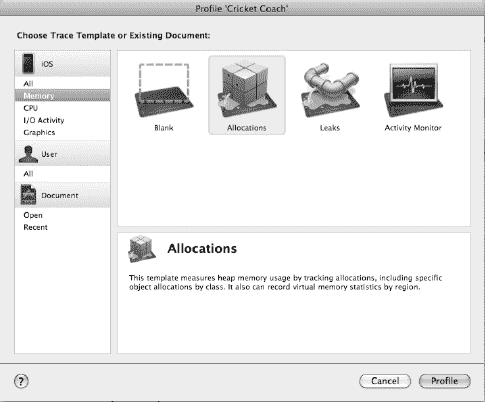

**图 2-1.** *在 Profile 窗口中选择 Allocation*

选择 `Allocations` 工具后，系统会显示一个主 `Allocation` 面板，其中包含所有必要信息，如图 2-2 所示。

`Allocations` 面板（图 2-2）会显示“已创建且仍存活”的作业，以便你可以查看哪些对象仍存在于内存中，以及哪些对象消耗了最多的内存。如果你开始收到来自 iOS 环境的许多警告，例如“收到内存警告，级别 =1”，则应使用此工具。

详细信息会显示在哪个时间点，哪些代码行和哪个类负责创建和处理这些对象。有了这些信息，你可以轻松找出如何处理内存问题。这是跟踪缓存算法和方法的良好工具（详见第 4 章）。

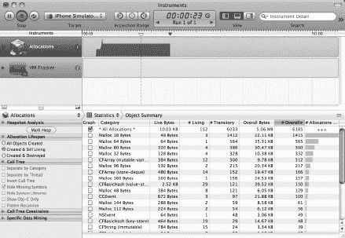

**图 2-2.** 主分配面板

图 2-3 和 2-4 向你展示了关于哪些对象在你的应用程序中存活着并消耗最多内存的更多细节。在图 2-3 中，你会看到在你的应用程序中创建并存活的对象详细信息列表。

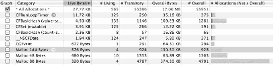

**图 2-3.** 分配结果

在图 2-4 中，你可以看到是哪些方法调用来创建这些对象的。

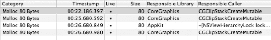

**图 2-4.** 分配详情

**优点：**

-   精确度高，并提供有关应用程序消耗最多内存的时间和情况的许多细节。
-   还能让你很好地概览对象在应用程序整个生命周期内的生命周期。

**缺点：**

-   结果取决于开发者如何运行应用程序。这需要准备良好的测试套件，以覆盖尽可能多的场景。
-   创建良好的测试用例可能需要花费时间和精力，以帮助开发者找出应用程序消耗最多内存的位置和时间。
-   你需要在真机上测试，才能收到内存警告消息。模拟器几乎永远不会给出内存警告消息。使用模拟器的问题是，你的电脑有 2-4GB 的 RAM，而你的设备可能少得多。

**用途：**

-   如果你在测试应用程序时收到内存警告，这应该是你先用的工具之一。

### 遗留代码

在此版本中，将手动内存管理项目自动转换为新 ARC 项目的工具可能会失败。该工具可能会要求你修复当前代码中的许多地方，以确保项目可以转换为 ARC 项目。你的开源库可能无法转换为新的 ARC 风格，而你又不愿去改动它。因此，我认为了解一些关于手动内存管理的背景知识对你是有好处的。

#### 内存泄漏

当你创建新的内存对象但没有正确释放它时，就会发生内存泄漏。该对象将在整个应用程序生命周期内驻留在内存中。结果是你的应用程序没有足够的内存来快速运行，更糟糕的是，iOS 会强制关闭你的应用程序。

### 静态分析器

这是一个简单直接的用于测量内存泄漏的工具。如图 2-5 和 2-6 所示，该工具会指出哪一行或哪一段代码**可能**正在导致内存泄漏。

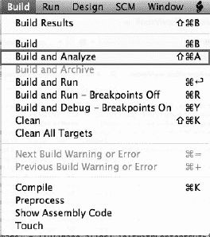

**图 2-5.** *选择 `Product` > `Analyze`*

如图 2-5 所示，你需要选择 `Product` > `Analyze` 或按 `Command + Shift + B`。

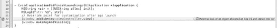

**图 2-6.** *静态分析器报告了第 19 行对象分配的潜在泄漏，该对象存储在 `str` 中。*

如图 2-6 所示，第 19 行的 `str` 对象从未被释放；在这种情况下，静态分析器给出了正确的警告。

**优点：**

-   它能让你快速概览可能发生内存泄漏的潜在位置。
-   处理过程非常快速：它仅需构建并查看源代码。静态分析器无需运行程序。
-   该工具对开发者无需额外操作；只需点击 `Build and Analyze`。

**缺点：**

-   有时它不够准确。它可能会给出错误的警告，或者没有指出存在内存泄漏的地方。

**用途：**

-   开发者应该首先使用此工具来测量内存泄漏，因为它快速且几乎无需额外操作。

##### Leaks 检测工具

这是一个更好的工具，它能在运行时（应用程序运行时）测量内存泄漏。这确保了对象确实泄漏了；如果一个对象泄漏了，它将被报告给用户。你可以继续尝试应用程序的不同功能，Leaks 检测工具会报告内存泄漏的位置。

你需要查看 Leaks 水平条显示垂直柱状图的位置。柱状图的高度表示该时刻应用程序泄漏了多少内存（见图 2-7）。


**图 2-7.** 显示运行代码后发生了多少次泄漏

然后，当你进入泄漏的详细信息时，可能会看到代码中发生的一系列泄漏。通过按负责库排序并查找你的应用名称（本例中为 `LeaksViewController`），你将看到两个泄漏的对象。快速查看可知，你在类 `RootViewController` 中泄漏了两个图片。

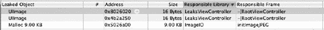

**图 2-8.** 程序内部泄漏列表

如图 2-8 所示，地址旁边有一个小箭头；点击它，Leaks 检测工具会将你引导至应用程序中导致该泄漏的正确位置（见图 2-9）。

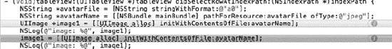

**图 2-9.** 导致泄漏的代码行

此时，你可以观察创建内存泄漏的代码行。通常，Leaks 检测工具会提供关于内存泄漏发生位置的确切细节，以便你轻松修复。

**优点：**

-   Leaks 检测工具非常准确和详细。

**缺点：**

-   结果取决于开发者如何运行应用程序。这需要准备良好的测试套件，以覆盖尽可能多的场景。
-   可能会比较慢，因为开发者需要运行几次才能看到应用程序在许多不同情况下的表现。

**用途：**

-   此工具应在使用静态分析器之后使用。它将覆盖静态分析器遗漏的所有其他小型和特定场景。

我建议你先运行静态分析器。如果你仍然对内存使用有所顾虑，或者收到了来自 iOS 运行时环境的内存警告，则应使用 Leaks 检测工具。

#### 内存垃圾

乍一看，内存垃圾似乎与性能无关。然而，应用程序崩溃比性能缓慢更糟糕，因为它会彻底中止性能，并毁掉你想要创造的用户体验。因此，你应该知道如何充分利用内存。


#### 僵尸对象

你选择 `产品` → `分析` → `分配`。

系统将显示一个正在运行的检测工具。问题是该工具此时并未测量任何内容，也无法帮助你解决僵尸对象问题，因此你需要先停止它。然后，你需要配置 `分配` 工具以处理僵尸对象。换句话说，当崩溃发生时，检测工具会报告崩溃发生的位置。

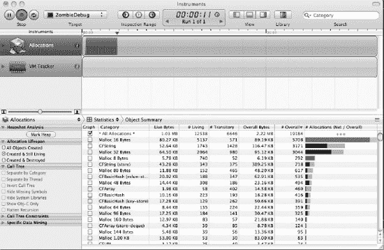

**图 2–10.** 分配检测工具的界面

目前，你无需关心图 2–10 下半部分的数据，只需要了解如何配置分配检测工具来检查僵尸对象崩溃。图 2–11 将告诉你操作方法。

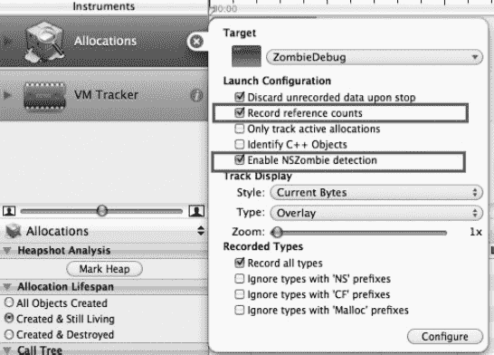

**图 2–11.** 分配检测工具的主要配置

配置完成后，你需要再次运行记录操作；这将启动 iPhone 模拟器或真机设备。

接着，你持续运行并尝试应用的不同功能，直到它崩溃。此时，分配检测工具会显示类似于图 2–10 中的信息。

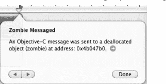

**图 2–12.** 僵尸对象崩溃信息

如果点击箭头查看详情，下半部分会列出针对特定对象的内存操作列表，例如 `malloc`、`autorelease`、`retain`、`release`（如图 2–13 所示）。你的示例项目名为 `ZombieDebug`，因此只需查看第二、第三和第四行。

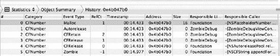

**图 2–13.** 内存操作列表，例如 `malloc`、`autorelease`、`retain` 和 `release`

图 2–14 显示了与图 2–13 中选定语句对应的代码块。

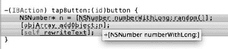

**图 2–14.** 与检测工具中 `malloc`/`autorelease`/`retain`/`release` 语句对应的代码块。

**优点：**

- 提供内存崩溃发生的精确细节。
- 可在模拟器上进行测试。

**缺点：**

- 结果取决于应用的运行方式。错误访问有时仅在特定条件下发生。

**用法：**

- 仅当收到 `EXEC_BAD_ACCESS` 错误时使用此工具。

### 性能工具

内存并非性能问题的唯一根源。还有其他提升应用性能的技术：更高效地处理文件系统与网络的数据读写、改善用户界面响应速度以及利用多线程。要衡量应用的性能优劣，可以测量 CPU 使用率、时间占用以及电池能耗。此外，这些指标相互关联，我将解释它们之间的关系。

CPU 问题与最坏情况下 CPU 同时需要处理的任务量有关。最坏情况是 CPU 任务过多或持续运行。通常，当没有任务时，CPU 不应运行，它可能仅以事件驱动的方式在用户与应用交互时运行。然而，当大量任务同时涌入，例如处理用户输入、读取文件和网络操作时，CPU 不应有空闲时间。如果任务繁重但 CPU 有空闲时间，则意味着 CPU 利用率不高。在面临密集处理时，为充分利用 CPU，你可能需要使用多线程，我将重点介绍一些跟踪线程使用情况的工具。

文件 I/O 和网络访问是耗时任务，因为你需要将文件读取到内存中。因此，为了良好的性能平衡，你需要始终制定良好的文件与网络访问策略。如果频繁或过晚读取文件与网络，用户将长时间等待数据加载。但如果过早读取并存储过多数据到内存，又会很快耗尽内存或导致其他任务内存不足。因此，衡量文件与网络活动对开发者而言是一项重要任务。

应用实际运行得好与用户感知到的性能之间存在巨大差异。应用可能内存使用完美、数据处理算法极快，但用户仍觉得应用运行迟缓或对交互无响应。原因在于 UI 线程过于繁忙，无法处理或接收用户交互。你可以测量不同情况下 UI 线程的工作状态。

iOS 有一个独特之处。通常，智能手机系统依赖电池供电。能源对这类系统至关重要，因为用户无法整天为其充电。此外，系统空间有限，无法像笔记本电脑那样配备大容量电池。台式机和服务器则完全不同，因为它们始终连接电源，提供无限电力，因此开发者无需过多关注能耗。笔记本电脑比移动设备更稳定，电池续航也更久。因此，你需要仔细测量应用的能耗情况。

#### 检测工具应用

你可以选择 `运行` → `分析`，或按下 `Command + Space` 并输入 `Instrument` 来打开检测工具应用。macOS 将显示图 2–15 所示的选项。

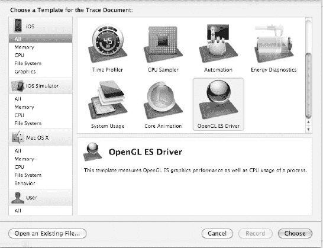

**图 2–15.** 检测工具面板

检测工具主要分为两类：用于 iOS 模拟器的工具和用于 iOS 真机的工具。部分工具可在两种环境下运行，但需注意结果有时可能不同。如前所述，iOS 模拟器与 iOS 真机存在显著差异。

#### CPU 测量

CPU 测量工具是最重要的检测工具之一。CPU 测量工具会显示应用执行时不同 CPU 活动的运行情况。它们能展示应用内特定任务的 CPU 活动强度与持续时间。


#### CPU 采样器

该工具会按固定时间间隔对目标应用进行采样；默认间隔为 10 毫秒，但你可以将其更改为其他值。每次 CPU 采样时，该工具还会记录一个堆栈跟踪。样本和堆栈跟踪通常足以让你识别出应用中需要修复的瓶颈。

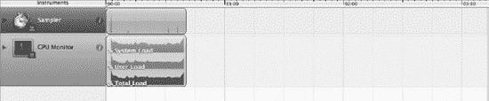

**图 2–16.** CPU 采样器主面板

如图 2–16 所示，CPU 采样器为你提供关于**系统负载**和**用户负载**的数据。系统负载是由文件、网络和逻辑处理等系统操作引起的加载时间，而用户负载则与 UI 以及用户与应用之间的交互有关。

图 2–16 显示，系统负载和用户负载的常规使用情况随时间推移保持稳定，但在某些时间点会略有上升，并在采样时间结束时显著增加。不过，这些信息通常不足以找出问题所在。因此，你需要进一步查看主区域。

在继续之前，你应该配置采样器，通过勾选名为“隐藏系统库”的复选框，使其仅显示与你的代码直接相关的区域，如图 2–17 所示。

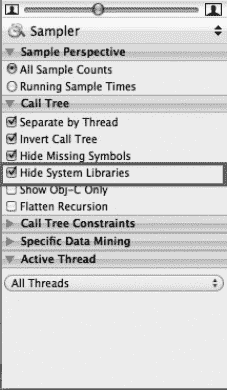

**图 2–17.** CPU 采样器主面板

然后，在主列表结果中，你将看到类似图 2–18 的内容——一个被调用的主要函数列表、它们在采样时间内被调用的次数，以及与总进程相比调用次数的百分比。

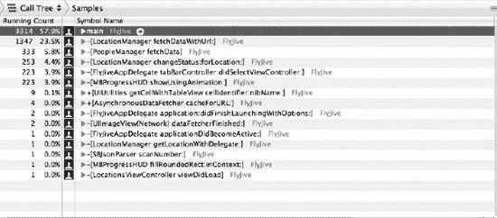

**图 2–18.** 每个函数调用的运行次数和百分比

你也可以将运行次数切换为运行时间，以显示每个函数完成执行所需的时间，如图 2–19 所示。

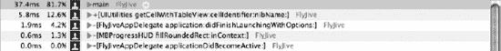

**图 2–19.** 每个函数调用的运行时间和百分比

实际上，你可以通过展开左侧的小箭头，查看每个函数调用在其自身堆栈跟踪中的更多详细信息，如图 2–20 所示。


**图 2–20.** 堆栈跟踪中函数的详细运行时间

**优点：**

-   该工具精确且能提供详细信息，让你了解应用在哪个时间点、哪种情况下消耗了最多的处理时间。

**缺点：**

-   结果取决于开发者如何运行应用。这可能取决于优先级以及哪个函数被首先调用。
-   创建覆盖所有函数的良好测试用例可能需要花费时间和精力。
-   如果你希望在 iOS 运行时环境中查看每个函数的精确运行时间，则需要在真实设备上进行测试。

**用途：**

-   当开发者已经知晓哪个区域可能存在瓶颈，并希望进行测试以验证或了解有关瓶颈的更多细节，或者确定导致瓶颈的具体函数或一组函数时使用。

#### 活动监视器

该工具用于显示在 iOS 设备上运行时的 CPU 时间、物理内存、虚拟内存和线程数。当应用在操作系统上运行时，它能提供整个应用的良好概览。因此，你可以了解应用何时需要最多的 CPU 时间、实际内存和虚拟内存（见图 2–21）。这些数字应与其它后台运行的应用以及 iOS 的通用规范进行比较。最新的 iPhone 4 仅有 500 MB 的 RAM，因此你不能超过该数值。最好将此测试与 CPU 采样器和分配工具结合使用，以获得应用性能的完整图景。

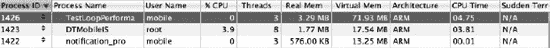

**图 2–21.** 堆栈跟踪中函数的详细运行时间

**优点：**

-   提供应用运行时性能的总体视图，包括将你的应用与其它应用以及标准 iOS 环境进行比较。

**缺点：**

-   缺乏关于应用内部每个函数如何运行的详细信息。
-   开发者无法确定瓶颈所在，但可以在操作应用时进行猜测，观察内存或 `%CPU` 是否上升。

**用途：**

-   该工具应与 CPU 采样器或分配工具等其他详细工具结合使用。

#### 时间测量

现在让我们讨论另一个关于性能的重要主题：时间。通常，当用户抱怨你的应用时，他们只会告诉你应用在某个地方运行缓慢。因此，你需要测量应用执行特定任务所需的时间。

##### 时间分析器

与 CPU 采样器的运行方式类似，时间分析器提供应用在时间方面如何运行的总体概览，特别是应用运行的最长持续时间以及应用内部哪些函数花费了最多的运行时间（见图 2–22）。时间分析器和 CPU 采样器之间的唯一区别在于，前者关注的是函数运行所花费的时间，而非运行函数所消耗的 CPU 使用率。

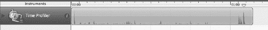

**图 2–22.** 时间分析器界面

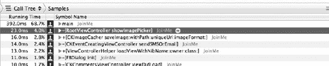

**图 2–23.** 每个函数的运行时间

如图 2–23 所示，时间分析器看起来与 CPU 采样器相似，显示每个函数，并且你实际上可以进入每个函数，检查该函数在堆栈跟踪中的运行时间。

**优点：**

-   时间分析器提供准确且详细的信息，告诉你每个任务执行所需的时间。

**缺点：**

-   结果取决于开发者如何运行应用。这可能取决于优先级以及哪个函数被首先调用。
-   创建覆盖所有函数的良好测试用例可能需要花费时间和精力。
-   如果你希望在 iOS 运行时环境中查看每个函数的精确运行时间，则需要在真实设备上进行测试。

**用途：**

-   当开发者已经知晓哪个区域存在瓶颈，并希望进行测试以验证或了解有关瓶颈的更多细节，或者确定导致瓶颈的具体函数或一组函数时使用。

### 用户界面响应时间测量

想象一下，你的应用以完美的效率运行，但用户仍然认为它运行缓慢，或者它对用户的交互无响应，甚至更糟的是，它没有在正确的时间更新 UI。根据 CPU 采样器或时间分析器的结果，你的函数运行完美。然而，当你运行应用时，它仍然对你的事件响应不佳。如果是这种情况，极有可能是 UI 线程没有很好地渲染你的 UI。因此，你可能需要使用另一个与 UI 相关的工具来检查 UI 中的渲染时间是否可以接受。Core Animation 和 OpenGL ES Driver 工具是 iPhone 上用于测量和测试应用的两个好工具。


#### 核心动画

`Core Animation`主要用于衡量 UI 线程每秒能向用户渲染（即绘制）多少帧画面。UI 线程也是负责处理用户交互的主线程。

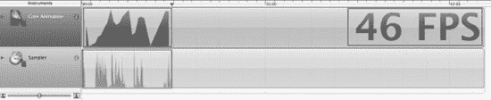

**图 2–24.** `Core Animation` 结果中的三个主要面板

如图 2–24 所示，有三个主要面板需要您关注，以了解 UI 渲染性能。第一个是第一个水平单元格中的图表。该图表显示了每秒帧数的变化。右侧最大的数字显示当前的每秒帧数；这个绝对值应尽可能高，最高值为每秒 60 帧（60 FPS）。

第二个图表是特定时间内的每秒帧数采样器；10 秒是 `Core Animation` 的默认值。

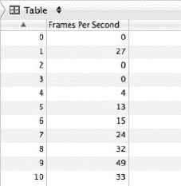

**图 2–25.** 每秒帧数列表

图 2–25 实际上提供了过去 10 次运行时间内的每秒帧数列表。通常，如果在测试过程中您仍与应用交互并期望其流畅运行，则该数字应在 55-60 之间。如果数字较小，则可能意味着两种情况之一：要么您的 UI 线程没有内容需要绘制，要么它无法获得 CPU 时间来绘制。如果是后一种情况，则存在严重的性能问题，导致 UI 线程过于繁忙而无法绘制任何内容。

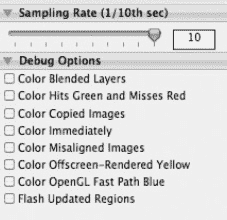

**图 2–26.** 配置 `Core Animation` 的选项列表

图 2–26 中的选项列表将在您运行工具时提供更多信息。

*   `Color Blended Layers` 为不透明视图添加绿色层，为不透明视图添加红色层。这对于您将在第 3 章中看到的滚动性能非常重要。使所有视图不透明将加快渲染性能，因为 GPU 无需在同一位置进行两次绘制。颜色将如图 2–27 所示显示。


**图 2–27.** 带有颜色混合层的 `Core Animation` 工具

优点：

*   `CoreAnimation` 提供了关于 UI 线程渲染/绘制应用 UI 过程及速度的总体概览。
*   您可以通过在 `Core Animation Instrument` 内部配置选项来获取更多细节。

缺点：

*   您绝对需要在真机上运行此工具。
*   它不提供与特定代码相关问题的详细信息。

用途：

*   当应用程序运行缓慢时，开发者应始终检查 UI 渲染，因为问题可能存在于渲染代码中，而非逻辑处理代码。

#### OpenGL ES 驱动

`OpenGL ES Driver Instrument` 提供的信息与 `Core Animation` 工具几乎相同，因此此处不再重复举例。然而，`OpenGL` 和 `Core Animation` 之间有一个显著区别。`Core Animation` 是比 `OpenGL` 更高层次的框架，因此 `Core Animation` 实际上使用了 `OpenGL`。但是，如果您的代码没有直接使用任何 `OpenGL` 代码，则无需使用 `OpenGL ES Driver Instrument`。它仅对使用 `OpenGL` 框架的应用或游戏有效。

优点：

*   与 `Core Animation` 相同。

缺点：

*   与 `Core Animation` 相同。

用途：

*   适用于使用 `OpenGL` 代码的应用程序。

### 文件和网络访问测量

就性能而言，所有开发者都需要记住一个重要的关键问题，那就是文件和网络 I/O。这个过程很慢，因为在 I/O 中，您需要处理或等待比处理器指令慢得多的事件。因此，除非高效执行，否则您的应用可能会浪费大量时间。您将在第 4 章中了解更多关于文件和网络缓存的知识，以便在执行文件和网络 I/O 处理时节省时间。要衡量文件和网络 I/O 的性能，您有两个主要工具：`System Usage` 和 `File Activity`。

#### 系统使用情况

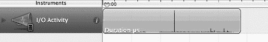

**图 2–28.** 系统 I/O 性能

`System Usage` 用于测试 iOS 运行时环境中的文件和网络 I/O。如图 2–28 所示，某些时刻 I/O 活动会急剧增加。如果此文件处理耗时较长，要求用户等待其完成，这可能会成为性能的潜在问题。

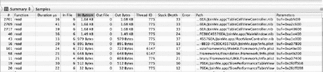

**图 2–29.** 系统活动的详细列表

图 2–29 显示了文件和网络 I/O 处理的详细列表。如果仔细观察列表，您会发现文件 `TableCellViewController.nib` 不断从文件系统加载。这可能是一个潜在问题。因此，一个小的优化措施是缓存该文件或将对象保存在内存中，这样就不需要多次加载。

从 `System Activity` 和 `Object Allocations` 收集的信息应结合起来，以确保在性能和内存之间取得良好平衡。当内存非常有限时，您不能简单地缓存所需的任何文件。

优点：

*   提供关于加载了哪个文件、文件大小以及文件加载频率的详细信息。

缺点：

*   需要在真机上运行测试。

用途：

*   它帮助开发者就缓存文件或减少文件加载（直到需要时才加载）做出正确决策。它还有助于决定是否提前加载文件，以确保当应用需要该文件时，它已经在内存中，这将显著减少用户的等待时间。

#### 文件活动

`File Activity Instrument` 的工作原理类似于 `System Usage Instrument`，但它提供了更多关于文件以及库读取的详细信息。如图 2–30 所示，该工具提供了关于文件活动、读取/写入、文件属性和目录 I/O 的非常详细的信息。

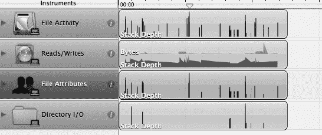

**图 2–30.** `File Activity` 工具的主列表

您通常会比关注其他部分更关注文件活动和读取/写入，因为这些属性与我们正在讨论的性能问题相关。

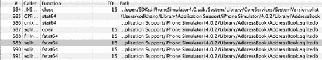

**图 2–31.** 文件活动的详细列表

从图 2–31 中，您可以看到 `File Activity` 提供了有关 `AddressBook` 读取的信息。这是 `System Usage Instrument` 未提供的信息。

优点：

*   提供关于加载了哪个文件、文件大小以及文件加载频率的详细信息。
*   包含更多关于目录、文件属性以及执行了多少次读取和写入的信息。

缺点：

*   模拟器上的数据可能不准确。

用途：

*   该工具应与 `System Usage` 结合使用。


### 测量线程性能

iPhone 中的线程测量功能对于测量性能的实际帮助并不大。然而，它能提供关于应用中每个线程状态的极佳信息。例如，它可以告诉你某些线程是否阻塞时间过长，或者是否已经创建了过多的线程（参见图 2-32）。线程阻塞是代码存在问题的显著迹象。通常，当你希望利用操作系统的能力时，会创建许多线程来并行处理任务。这时问题就会出现，你需要使用 `Threads` 工具来测量线程。


**图 2-32.** 应用运行时的线程列表及其状态

优点：

-   它为你提供了关于线程及其状态的概览。
-   你可以在模拟器上运行此工具。尽管 iOS 与模拟器架构存在差异，但许多问题在两种架构上仍会以相似方式发生。

缺点：

-   它没有提供每个线程的太多细节。

用途：

-   它有助于你发现任何线程问题，尤其是在你通过应用多线程技术进行大量优化以提升性能时。

### 电池功耗测量

在 iOS 设备的性能测量中，最后一项至关重要的指标是电池。电池是移动设备中的一个大问题，因为你不能在与朋友外出时一直为它充电。这个问题在移动设备上比在笔记本电脑上更为突出。拥有移动设备的用户总是希望设备具有高度的移动性和敏捷性。

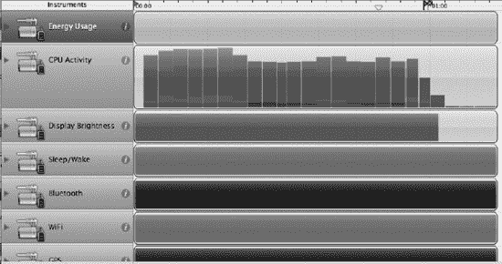

**图 2–33.** iOS 设备中关于电池的主要关注点列表

在这个 `Energy` 工具有一些重要的测量项。它包括能耗、CPU 活动、显示亮度、睡眠/唤醒、蓝牙、Wi-Fi 和 GPS。这些都是耗能的任务。图 2-33 并未清晰显示每个测量项内部的变化。然而，如果你长时间持续测试设备，你将看到这些项目内部的变化；例如，Wi-Fi 会消耗一些内存，而 GPS 可能是最耗能的任务。

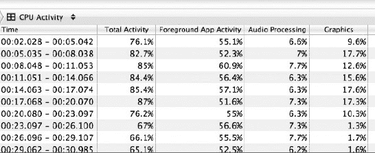

**图 2–34.** 消耗最多电池电量的 CPU 活动

图 2-34 显示了最耗电的功能——前台应用活动、音频处理和图形处理。基于这些信息，你可以判定你的应用消耗了多少电量。

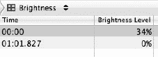

**图 2–35.** 亮度测量

图 2-35 展示了能耗的另一个重要方面：设备的亮度级别。

优点：

-   它为你提供了所有耗能任务的总体视图。

缺点：

-   你需要在设备上运行测试一段时间以收集信息。

用途：

-   如果应用程序严重依赖 Wi-Fi、蓝牙、GPS、图形和音频，你应该关注能量测量，以确保应用不会消耗过多电量。

### 工具组合

到目前为止，你已经了解了各个工具的工作原理以及它们如何为你的性能基准测试过程做出贡献。但你可能会想，如何将它们全部一起测量，或者组合使用它们来进行测量。这将为你节省大量时间。因此，我将展示如何在 `Instruments` 中实现这一点。

如图 2-36 所示，你首先需要打开 `Instruments` 应用程序并选择 `Blank` 模板。

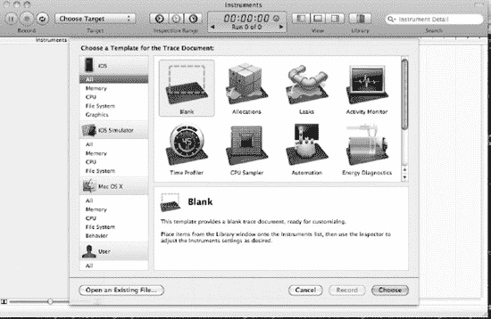

**图 2–36.** 选择空白模板

你会看到这里除了一个小方框提示你打开库列表之外，什么也没有。当你点击那个小箭头时，右侧会显示所有可用工具的列表，帮助你向模板中添加必要的测试工具（参见图 2-37）。

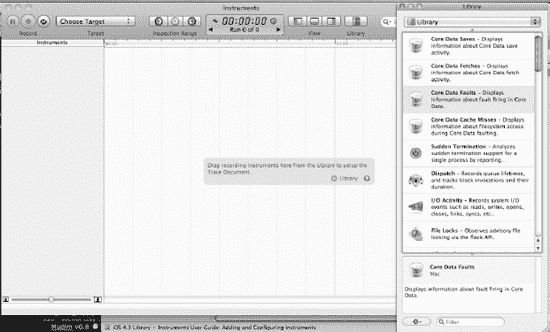

**图 2–37.** *可用工具列表*

将所有必要的工具拖入模板后，你可以像之前使用任何工具一样开始正常测试它们。

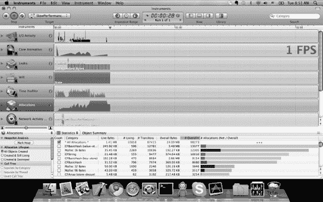

**图 2–38.** 所有工具的结果

如图 2-38 所示，你现在可以同时查看结果的列表。凭借这一优势，你可以知道性能提升（通过 `CPU Sampler` 或 `Time Profiler` 测量）是否也意味着内存使用量的增加（通过 `Object Allocations` 测量）。让它们保持平衡状态，以确保你的应用程序完美运行。

优点：

-   你可以同时观察所有工具的结果。

缺点：

-   如果添加了太多工具，这种方法会导致应用程序运行非常缓慢。如果您用十个工具进行测试，应用程序将会运行得极其糟糕。因此，请谨慎控制添加的工具数量。

用途：

-   它帮助你获得一个总体概览。在你识别出所有性能瓶颈并修复它们之后，同时使用多个工具进行测试是很好的做法。

### 所有工具汇总

表 2-1 总结了所有工具。

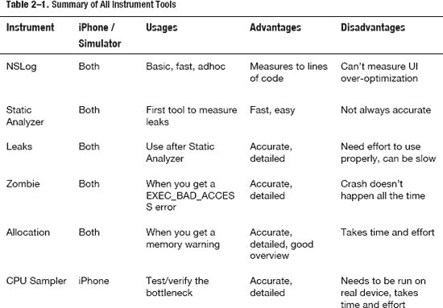

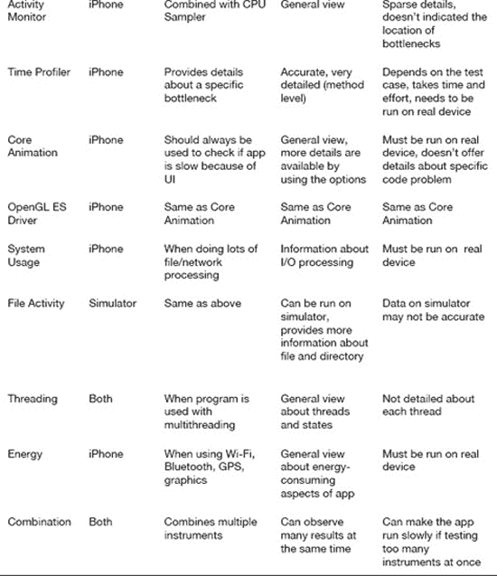

## 本章小结

本章带你了解了可能的工具列表，并提供了每个工具的详细信息以及优缺点的总结。

这些工具被分为三大类，每个大类下又包含子类别：基础工具、内存工具和性能工具。

内存和性能密切相关；你必须仔细测量每一个，以确定你的问题属于内存问题还是性能问题。

在性能问题中，我将工具细分为 CPU、文件处理、用户界面渲染、线程和能耗等子类别。每个因素都可能影响应用程序的其他属性；换句话说，一个区域的瓶颈可能掩盖了另一个区域的瓶颈。因此，你需要仔细测量每个方面以确保你修复了正确的问题。例如，如果问题出在 iPhone 的缓慢渲染过程上，那么你在 CPU、逻辑和数据处理方面能做的不多。在这种情况下，你需要直接深入显示代码，并可能从使用 `Interface Builder` 切换到自定义代码来绘制 UI。

**练习**

1.  运用本章讨论的内存工具测试你现有应用程序的内存使用情况，并找出可以改进的地方。
2.  在你的 iPod/iPhone/iPad 上选择一个游戏，并使用合适的工具测试其消耗的电量、蓝牙、Wi-Fi 或 3G 网络情况。
3.  选择一个包含复杂 `UITableView` 的应用，并使用合适的工具测试该 `UITableView` 的滚动性能。

## 第 3 章


