# 提升并优化 UITableView 性能

在本章中，你将进行以下操作：

- 在实际示例中使用你在第 2 章中看到的基准测试工具。
- 通过滚动性能优化的示例，逐步实践。
- 使用多种技术优化 `UITableView` 性能。
    - 优化 `UITableView` 中简单基础单元格的基本技巧。
    - 使用代码实际绘制单元格内部视图的高阶技巧。
    - 针对需要动画效果的单元格（如编辑、重排）的基础优化技巧。
    - 开发者需要了解的其他基本技巧。

iPhone 应用通常以列表形式展示数据。Apple 为基础开发者提供了出色的工具：`UITableView` 和 `UITableViewCell`。如果开发者只想使用基本功能来显示左侧的小图片和中间的文本，那么默认的 Apple 控件应该能很好地工作。然而，当你需要对列表顺序进行大量自定义，比如在不同的位置放置两到三张图片和文本时，你就会遇到问题。迟早，你会遇到 `UITableView` 滚动卡顿的性能问题，尤其是在 iPhone 3G 这样的旧设备上。

## 示例简介

在本练习中，我将根据两个主要因素来衡量性能：`tableView` 出列、创建新单元格或将其返回给操作系统（OS）的速度；以及操作系统渲染你的单元格并在屏幕上显示的速度。前者可以通过 `NSLog` 轻松测量；后者则更为复杂，只能通过 `CoreAnimation` 来测量。

为了演示，我将带你了解两个不同的示例。一个只包含头像和文本块；另一个则包含复杂的视图，其中有许多子视图。通过这两个示例，你将看到多种优化 `UITableView` 滚动性能的不同方法。

在本章结尾，我还会列出一些我没来得及在本章详细讨论的其他要点。这些并非常见错误，但如果开发者不小心犯了其中之一，那么他可能需要花上一整天的时间进行基准测试和调试才能找出问题。我希望确保你拥有足够的技能和知识，能够应对任何情况。

有时，优化非常简单，只需要在代码中进行一些零星的改动。然而，在其他情况下，比如第二个示例，优化可能需要重写整个代码库，以适应更优、更高效的模型。我希望在讲解完示例后，你能对程序结构有清晰的认识，从而从一开始就做出正确的决策，避免后续重写整个代码库。

## 回顾 Instrument 工具

在本章中，你将使用 `CoreAnimation` 工具对 iPhone OS 的渲染性能进行基准测试。这将帮助你判断问题是出在计算过程还是显示过程。第 2 章已经介绍过这个工具，因此本章仅做简要回顾。

图 3-1 展示了 `CoreAnimation` 工具的主视图，其中包含运行该工具时需要关注的三个部分。图 3-2 则展示了性能读数。

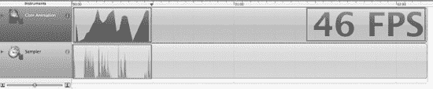

**图 3-1.** *CoreAnimation 工具的主要部分*

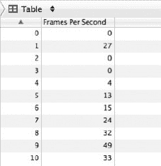

**图 3-2.** *最近的显示性能*

## 第一个示例

第一个示例将向你展示优化 `UITableView` 滚动性能的逐步过程。初始版本的源代码包含了许多我从不同开发者那里收集到的性能错误。在这个过程中，你会看到每实现一个优化步骤，性能都会随之提升。

### 第一个示例简介

如图 3-3 所示，你面临的是一个通用且实际的问题：你需要开发一个 `UITableView`，其中每个单元格包含一张图片和一个文本块。我将带你了解这个示例的源代码。让我们看看像 Facebook 这样的通用应用；应用需要一张头像图片和一张用户分享链接内容的图片。此外，应用还可能包含其他小图片来表示单元格中的图标。对于这第一次基准测试，请参考名为 `SlowPerformanceTableView` 的项目。


**图 3-3.** *第一个示例的应用程序*

### 标准基准测试

在开始任何项目之前，你必须明确最终目标；在这个案例中，目标是你希望达到什么样的性能，从而在用户滚动和使用应用时提供良好的体验。因此，通过运行一个标准的、未定制的 `UITableViewCell`（需要简单的图片加载并复用图片），表 3-1 显示了来自我日志的运行时间。

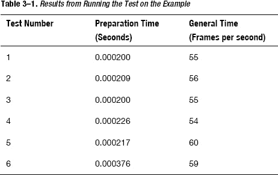

`CoreAnimation` 测得的 `每秒帧数 (fps)` 最佳性能为 `60 fps`（数值越高，性能越好）。对于标准的 `UITableViewCell`，通常速度在 `55-60 fps` 左右；这应该是你的目标之一。另一个目标是确保准备时间足够短。当总时间减少时，单元格的准备时间也会相应减少。不过，减少单元格准备时间相对更容易，因此在这个示例中，我将首先专注于减少它。

### 初始基准测试

对于第一个示例，我运行了一次初始基准测试，并得到了六个单元格滚动的随机结果。表 3-2 显示了使用 `NSLog` 和 `CoreAnimation` 等工具进行性能基准测试的结果。

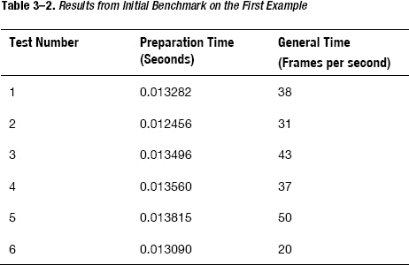

因此，从结果可以看出，通常需要 10 毫秒来返回一个单元格进行绘制。由于这个巨大的延迟，整体测量值（fps）也显著下降。因此，我的首要目标是减少单元格准备时间的过程。

源代码中有一条关于 `[UIImage imageNamed:name]` 和 `[[UIImage alloc] initWithContentsOfFile:name]` 区别的注释。稍后我将解释这个区别，以及为什么你会使用 `imageNamed` 而不是 `initWithContentsOfFile`。

### 复用 `UITableViewCell`

优化 `UITableView` 通常很简单；你需要做的就是仔细检查你是否以正确的方式复用了 `UITableViewCell`。在 iOS 中创建 `UITableViewCell` 是一个 CPU 密集型的过程。因此，如果每次用户上下滚动到新单元格时，CPU 都需要创建一个新的单元格，那么整体性能将会下降。Apple 的标准（也是默认）改进方法是，每当单元格移出屏幕时，就对其进行复用。

#### 标准 TableView 单元格

对于标准的 `UITableViewCell`，生成的代码应该能很好地工作，并提供快速、高流畅的滚动性能。

```
- (UITableViewCell *)tableView:(UITableView *)tableView cellForRowAtIndexPath:(NSIndexPath *)indexPath {
    static NSString *CellIdentifier = @"Cell";
    UITableViewCell *cell = [tableView dequeueReusableCellWithIdentifier:CellIdentifier];
    if (cell == nil) {
        cell = [[UITableViewCell alloc]
            initWithStyle:UITableViewCellStyleDefault
            reuseIdentifier:CellIdentifier];
    }
```

请注意 `reuseIdentifier:CellIdentifier` 和 `dequeueReusableCellWithIdentifier:CellIdentifier` 的使用。这两部分将帮助你正确地复用 `UITableViewCell`。

创建新的自定义单元格主要有两种方式：一种是使用 `InterfaceBuilder`，另一种是直接通过调用 `addSubview:` 方法编写自定义代码。


#### 通过 Interface Builder 自定义 TableView Cell

使用 `InterfaceBuilder` 时，开发者常常忘记设置标识符，这确实很容易发生。标识符可以通过打开 xib 文件、进入第一个选项卡、并修改第一行来修改，如图 图 3–4 所示。

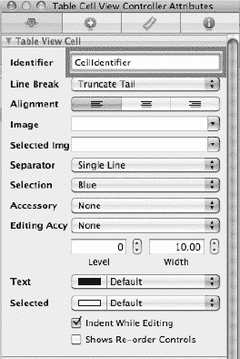

**图 3–4.** *设置 Cell 的重用标识符*

现在，在 Cell 的初始化代码中，你需要使用完全相同的标识符。

```
- (UITableViewCell *)tableView:(UITableView *)tableView
cellForRowAtIndexPath:(NSIndexPath *)indexPath {
   static NSString *CellIdentifier = @"CellIdentifier"; // 必须与 InterfaceBuilder 中的一致

   UITableViewCell *cell = [tableView dequeueReusableCellWithIdentifier:CellIdentifier];
   if (cell == nil) {
       cell = [[UITableViewCell alloc] initWithStyle:UITableViewCellStyleDefault
                                      reuseIdentifier:CellIdentifier];
   }
```

#### 通过代码自定义 TableView Cell

如果你通过编码自行构建自定义 Cell，而不使用任何界面构建器，则可以在自定义类 `ReuseTableViewCell` 内部返回它。

```
        TableCellViewController.h
@interface TableCellViewController : UITableViewCell {
}
@end

        TableCellViewController.m
#import "TableCellViewController.h"

@implementation TableCellViewController

- (NSString *)reuseIdentifier {
        return @”CellIdentifier”;
}
@end
```

**注意：** 这两种方法的主要区别在于加载和初始化 `UITableViewCell` 的方式。为了确保你能理解并区分这两个示例，我将展示一些主要代码。

### 从 Nib 文件加载 Cell

首先，你需要编写代码将 nib 文件从文件系统加载到内存，然后解析以获取 `UITableView` 对象。

```
- (UITableViewCell *)cellWithTableView:(UITableView *)tableView cellIdentifier:(NSString *)cellIdentifier nibName:(NSString *)nibName {
   UITableViewCell *textCell =  [tableView dequeueReusableCellWithIdentifier:cellIdentifier];
   if (textCell == nil) {
       NSArray *topLevelObjects = [[NSBundle mainBundle] loadNibNamed:nibName
                                                                owner:nil
                                                              options:nil];

       for (id currentObject in topLevelObjects) {
           if ([currentObject isKindOfClass:[UITableViewCell class]]) {
               textCell = (UITableViewCell *)currentObject;
               break;
           }
       }
   }
   return textCell;
}
```

你可以调用方法 `cellWithTableView:cellIdentifier:nibName:` 从 nib 文件 `TableViewController` 加载表格视图，代码如下：

```
ReuseTableViewCell *cell = (ReuseTableViewCell *) [self
getCellWithTableView:tableView
cellIdentifier:CellIdentifier
nibName:@"ReuseTableViewCell"];
```

这段代码并不完美；你需要自己修改 nib 文件以确保一切正常运行。不过，我的目的是让你能够区分这两种方法，因此我不会深入细节。

### 从自定义代码加载 Cell

```
- (id)initWithStyle:(UITableViewCellStyle)style reuseIdentifier:(NSString *)reuseIdentifier {
   self = [super initWithStyle:style reuseIdentifier:reuseIdentifier];
   if (self != nil) {
       UIImageView *imageView = [[UIImageView alloc] initWithFrame:CGRectMake(20, 20, 30, 30)];
       [self.contentView addSubview:imageView];
   }
   return self;
}
```

给你一个小练习：创建一个新项目，尝试制作一个自定义 Cell；然后检查一切，确保你正确重用了 Cell。

### 再次运行基准测试

重用 Cell 后，你可以再次对滚动性能进行基准测试。如 表 3–3 所示，正确重用 Cell 后，性能提升了一倍。

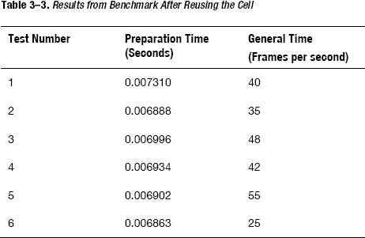

这表明你的方向是正确的；不过，当前性能仍然不够理想。你总是希望性能能达到 `around 0.0006-0.0001`；正如我在第一部分展示的那样，这是标准 `UITableViewCell` 的正常性能。因此，你将进入下一部分，学习如何重用图像，而不是在每次调用时都创建新图像。

以下是你应该始终重用 Cell 的原因。操作系统创建和加载一个新 Cell 到内存需要时间和内存。这就是为什么 `tableView` 会在 Cell 移出屏幕时始终将其放入队列以待重用的原因。如果你重用了那个 Cell，操作系统就不需要创建新 Cell 来显示；它只需要获取旧 Cell，更改一些属性，然后重新显示该 Cell 即可。这个过程远比操作系统需要创建新 Cell 的速度要快得多。


### 重用图片

显示图片的一个普遍问题是，无论是通过`文件系统`的文件 I/O 还是网络 I/O，加载时间都非常长。当 iOS 无法返回单元格进行 UI 渲染时，这个加载过程也可能影响用户的滚动体验。

关于本节内容，请参考名为`ReuseImageViewController`的项目。我先解释一下为什么在这些示例中不选择使用`[UIImage imageNamed:@""]`。`imageNamed`方法有一个重要的作用：它会在内存中为你缓存图片，并且当你再次请求时会复用该图片。但这个方法的问题是，它只能从你的 bundle 中获取图片——换句话说，只能获取应用源代码自带的图片。你无法通过这种方式从网络获取图片并加载到内存中。通常，你需要调用`[[UIImage alloc] initWithContentsOfFile:@""]`或`[UIImage alloc initWithData:Data]`方法。使用这些方法时，操作系统不会自动为应用将图片缓存到内存中。

因此，我希望你通过使用一个小型字典将图片存储在内存中，来自行缓存图片（请参见第 4 章）。处理图片的另一个重要部分是多线程（请参见第 6 章）。利用这一技术，你可以将繁重的处理任务移出当前处理线程。在我当前的示例中，我不会使用多线程，因为那会要求你一次性吸收太多新概念。你应该在章节末尾自己尝试练习一下。

以下是将图片存储在`NSDictionary`中的主要代码（请不要在你的应用中使用这种方式存储图片，因为它会导致内存警告问题）。

```
      // 将图片存储到字典中的代码
      - (UIImage *)imageWithName:(NSString *)name {

         if ([self.imageDictionary objectForKey:name]) {
             return [self.imageDictionary objectForKey:name];
         }

         UIImage *image = [[UIImage alloc] initWithContentsOfFile:name];
         [self.imageDictionary setObject:image forKey:name];
         return image;
      }
```

以下是提取最新图片的主要代码。

```
// 自定义表格视图单元格的外观。
- (UITableViewCell *)tableView:(UITableView *)tableView
cellForRowAtIndexPath:(NSIndexPath *)indexPath {
   static NSString *CellIdentifier = @"CellIdentifier";
   ReuseTableViewCell *cell = (ReuseTableViewCell *) [self
                        getCellWithTableView:tableView cellIdentifier:CellIdentifier
                                     nibName:@"ReuseTableViewCell"];
   NSString *avatarFile = [NSString stringWithFormat:@"a0"];
   NSString *avatarName = [[NSBundle mainBundle] pathForResource:avatarFile ofType:@"jpeg"];
   cell.avatar.image = [self imageWithName:avatarName];
   cell.userName.text = [NSString stringWithFormat:@"hi here: %d", indexPath.row];
      // 配置单元格。
   return cell;
}
```

使用更新后的代码，你可以再次运行基准测试。正如你从表 3–4 中看到的，结果好了很多。现在平均运行时间为 0.002，总体性能`fps`更接近 60。与之前使用`ReuseTableViewCell`相比，性能提升显著。

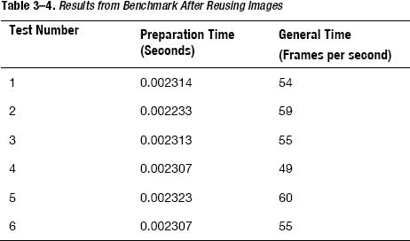

完美！现在`fps`速率几乎达到了 60，准备时间也相当合理。如果你的应用能达到这个水平，就无需再担心滚动性能了；它应该是流畅的。通常来说，对于一个包含多个子视图的普通、简单的`UITableViewCell`而言，这已经是良好的性能。这是一件好事，因为你从一开始就不需要做太多工作。然而，如果滚动性能仍然卡顿，你可能需要使用更好但也更复杂的方法来获得同样的性能。

正如第 1 章和第 2 章中已经提到的，你应该时刻注意避免过度优化。为了微小的性能提升而花费大量时间进行优化是不值得的。因此，此时，只有当你在滚动性能方面仍然遇到问题时，才应该继续进入第二个示例，即使用`UITableViewCell`进行绘制技术。

### 减少准备时间

通常，我希望通过缓存图片来重用它们，并希望减少初始化过程。当操作系统需要为`TableView`渲染一个新单元格时，它会通过调用以下方法来请求一个新单元格：

```
- (UITableViewCell *)tableView:(UITableView *)tableView
cellForRowAtIndexPath:(NSIndexPath *)indexPath {
        // 在此处初始化并返回单元格
}
```

因此，如果你长时间阻塞这个方法，`UserInterface`渲染过程就会被阻塞；它无法做任何事情，也无法显示任何新内容。这就是用户会看到滚动永远停在某个地方的部分原因。

为了尽可能加快这一过程，你可以移除逻辑、延迟计算、以及缓存可以重用的数据和图片。另一种方法是首先使用默认图片和数据来重用单元格。你也可以使用多线程，这样当你获取到图片/数据后，后续再填入单元格。从用户的角度来看，这种方法可以实现更平滑的滚动和更快的图片加载。


### `SecondExample`

当您拥有大量子视图或使用旧设备时，绘制自定义单元格可以提升应用性能。对于 iPhone 4 及以上机型，性能提升非常显著，因此使用绘制自定义单元格技术会带来很大不同。

在本例中，我将通过添加来自真实应用、包含图片和文本的多达 10 个子视图来增加单元格的复杂度。这样您就能看到，在某些真实应用（例如我们试图模仿的 Facebook）中，复杂的子视图结构会显著影响滚动性能。我将进行基准测试的应用，其用户界面将如图 3-5 所示。

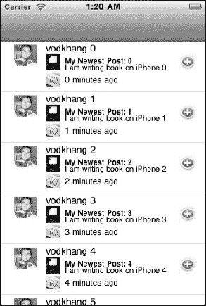

**图 3-5.** *第二个示例应用*

应用内的每个单元格都包含头像、用户名，以及带有图片、标题和内容的帖子。它还会显示哪个应用在什么时间发布了该帖子。基准测试的结果见表 3-5。

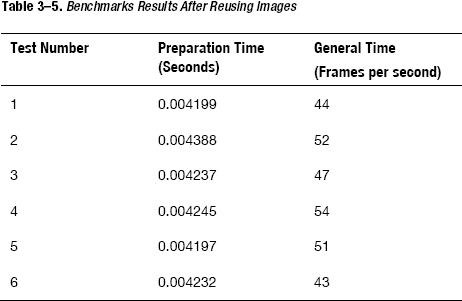

表 3-6 展示了使用自定义绘制代码再次运行代码后的基准测试结果。

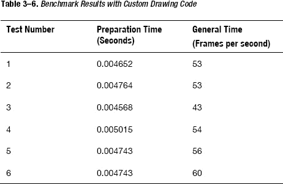

从表 3-5 和表 3-6 中可以看出，使用自定义绘制代码显著增加了渲染时间。对于复杂的子视图，这样的性能已经足够好，因此无需进一步优化。

对于尚未优化的单元格，它由多个组件和子视图构成。请查看图 3-5 以确保您理解该问题。

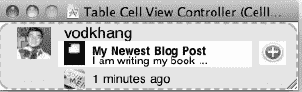

**图 3-6.** *单元格*

`图 3-6` 中的 `TableViewCell` 包含四个图像和一个不同颜色的子视图。当开发者需要设置不同背景颜色或更轻松地管理内部视图组件时，这种子视图是一种常用方法。这种方法会导致表格视图滚动性能问题，因此应尽量避免。

现在，让我们进入新方法的源代码，在这里我将自己绘制视图，并且不再使用子视图。您将看到实现此行为所需的步骤，然后我将总结不同技术的优缺点。示例源代码来自 `DrawingCellViewController` 项目。以下是主要源代码。

对于 `UITableViewController`：

```
- (UITableViewCell *)tableView:(UITableView *)tableView cellForRowAtIndexPath:(NSIndexPath *)indexPath {
   static NSString *CellIdentifier = @"CellIdentifier";
   CustomDrawingTableViewCell *cell = (CustomDrawingTableViewCell *) [self.tableView dequeueReusableCellWithIdentifier:CellIdentifier];

   if (cell == nil) {
       cell = [[CustomDrawingTableViewCell alloc] initWithStyle:UITableViewCellStyleDefault reuseIdentifier:CellIdentifier];
   }

   [cell updateMyCell];
   return cell;
}
```

可以看到，`UITableViewController` 中的主要代码变化不大。它与标准 `UITableViewCell` 的唯一区别在于单元格的初始化方式。例如：

```
[[CustomDrawingTableViewCell alloc] initWithStyle:UITableViewCellStyleDefault reuseIdentifier:CellIdentifier];
```

与之相对的是：

```
[[UITableViewCell alloc] initWithStyle:UITableViewCellStyleDefault reuseIdentifier:CellIdentifier];
```

在自定义 `UITableViewCell`（即 `CustomDrawingTableViewCell`）中：

```
- (id)initWithStyle:(UITableViewCellStyle)style reuseIdentifier:(NSString *)reuseIdentifier {

        if (self = [super initWithStyle:UITableViewCellStyleDefault reuseIdentifier:reuseIdentifier]) {
                CGRect subFrame = CGRectMake(0.0, 0.0,
self.contentView.bounds.size.width, self.contentView.bounds.size.height);

                drawingView = [[CustomDrawingView alloc] initWithFrame:subFrame];
                drawingView.autoresizingMask = UIViewAutoresizingFlexibleWidth |
UIViewAutoresizingFlexibleHeight;
                [self.contentView addSubview:drawingView];
       }
       return self;
}
```

现在到了最重要的部分：如何在视图中绘制文本、图像和控件。

`CustomDrawingView.m`：

```
- (void)drawRect:(CGRect)rect {
   self.backgroundColor = [UIColor whiteColor];
   // 绘制代码。
   [self.userName drawInRect:CGRectMake(70,0, 95, 21) withFont:userNameFont lineBreakMode:UILineBreakModeTailTruncation
                   alignment:UIBaselineAdjustmentAlignBaselines];

   // 绘制图像
   [self.avatarImage drawInRect:CGRectMake(20, 5, 36, 34)];

   // 绘制按钮
   [self.button drawInRect:CGRectMake(50, 5, 36, 34)];
}
```

简而言之，在 `UITableViewController` 中构建自定义 `UITableViewCell` 的方式与之前相同：只需在单元格为 nil 时将其出队，然后初始化一个新对象。在初始化方法中，您需要向单元格内容添加一个子视图。对于该子视图，您需要重写 `drawRect` 方法，然后通过 `drawInRect` 方法绘制文本或图像。

绘制代码之所以比从 nib 文件加载或直接创建并添加子视图运行得更快，是因为 GPU（图形处理单元）会执行绘制代码。GPU 在渲染和显示 UI 方面非常高效；因此，绘制代码是处理复杂子视图最快的方法。

**注意：** 需要记住的一个重要事项是将 `CustomDrawingView` 的背景色设置为白色。默认颜色是黑色。

### 从这些示例中能学到什么？

从上述两个示例中，有一些基本经验教训应始终牢记。

*   使用 `ReuseIdentifier`。这有助于提升性能。
*   尽量减少单元格准备过程中的工作，尤其是从文件 IO/网络 IO 加载图像所需的时间和精力。这样能在最短时间内显示图像。
*   如果应用有太多子视图和/或复杂的结构，请考虑通过代码绘制。这将让 GPU 加速处理过程。

**警告：** 从基准测试结果可以看出，fps 结果显著改善，甚至更接近完美的 60 帧/秒。然而，使用此方法，您将无法利用 `InterfaceBuilder` 构建 UI 的优势。您需要自行计算位置和尺寸，并将这些信息写入 `drawRect`。从维护和功能膨胀（向应用中添加更多功能）的角度来看，这很快就会让人头疼。因此，请谨慎使用 `drawRect` 并避免过度优化。

## 其他技术

我已经讨论了提升表格视图滚动性能的重要技术。还有一些您通常不需要用到的小技巧，但我也在此一并介绍。如果您能理解其概念，便可将相同技术应用于其他场景。

### 缓存高度

您需要缓存行的高度，因为 `TableView` 在需要创建新单元格时都会请求此信息。如果单元格高度固定，则无需担心。但如果不固定，则需要确保高度计算足够迅速。

尝试这样做：

```
- (CGFloat)tableView:(UITableView *)tableView heightForRowAtIndexPath:(NSIndexPath *)indexPath {
   return 80;
}
```

并尽量避免这样做：

```
- (CGFloat)tableView:(UITableView *)tableView heightForRowAtIndexPath:(NSIndexPath *)indexPath {
  for (int i = 0; i < 100; i++) {
    // 找到行可能的最小高度
  }

   return smallestHeight;
}
```

当操作系统需要渲染单元格或在动画过程中编辑/重新排序单元格时，它会多次运行第一个代码片段。而像这样在方法内部包含循环，操作系统每次需要知道单元格高度时，都必须运行一个重复 100 次的循环。


### 不透明度

尽可能让 `UITableViewCell` 的所有层和子视图都不透明。当视图透明时，iOS 需要将一个像素渲染两次或更多次，因为该像素同时属于多个子视图。这可能是一个耗时过程。

这一部分可以通过代码或 `InterfaceBuilder` 轻松完成。开发人员应仔细检查，确保所有子视图都不透明。图 3–7 展示了如何设置单元格内子视图的“不透明”复选框。

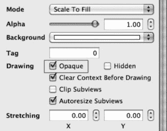

**图 3–7.** *为子视图设置不透明*

对于自定义代码，你也可以通过代码进行设置，如下所示：

`view.opaque = YES;`

### 避免图形效果

避免使用 `UIImage` 中尚未包含的复杂图形效果（如渐变）。你应该通过使用 CoreAnimation 并进行一些小型配置来检查图形效果和问题，如图 3–8 和 3–9 所示。

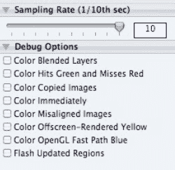

**图 3–8.** *用于设置调试选项的 CoreAnimation 选项*


**图 3–9.** *启用颜色混合的 CoreAnimation 仪器工具*

### 编辑/重排序性能

在前面的章节中，我向你展示了通过直接绘制，可以显著优化应用的性能。然而，绘制方法在动画和重排序性能方面也存在一些严重问题。

当你使用子视图时，动画会变得更快，因为 `UIKit` 在动画过程中无需重绘或更改任何内容。因此，如果你使用子视图而不是通过代码绘制视图，对于 `UIKit` 来说通常会更快。如果在动画编辑或重排序中通过代码绘制视图，则必须重新绘制视图以适应新的布局。这会在创建和维护代码方面增加工作量。

当你遇到 `UITableViewController` 的性能问题时，这始终是需要权衡的方面。我的建议是，如果你确定不会有太多子视图，或者你需要允许用户对单元格进行编辑/重排序，那么始终以子视图为起点。这可能会让应用运行稍慢，但仍然足够流畅。

## 总结

通过结合源代码的示例，你学习了许多提升应用性能的重要技巧。

*   **使用 NSLog 和 CoreAnimation 仔细进行基准测试**：我让你看到了一个实际使用 Instruments 和基准测试工具来高效理解问题本质以及每次优化后性能提升程度的例子。
*   **正确复用单元格**：这是第一步，也是最重要的一步。实现单元格复用很容易，但许多应用却忽略了这一步。因此，如果存在任何性能问题，请务必再次检查这一点。
*   **正确缓存/复用图像与数据**：另一个重要步骤是减少加载数据以及在返回显示用单元格时进行逻辑处理的时间。
*   **减少总加载和计算时间**：不仅仅是 I/O 过程会减慢并阻塞 UI 线程；任何一种数据处理都可能减慢此过程。因此，你应该始终尽可能减少这种处理。
*   **自定义绘制单元格**：为了在渲染表格视图时充分利用 CPU 的计算能力，你可能需要考虑直接使用绘制方法。这将极大地提升渲染过程并提高性能指标；帧率几乎可以达到最大值。你可以通过重写 `drawRect` 方法，并使用不同的绘制方法自行绘制每个 UI 元素，来绘制自定义单元格。
*   **不透明度**：当开发人员将用户界面元素放置到视图中时，会遇到这个小问题。如果没有将每个视图设置为不透明（即透明），渲染过程将需要遍历每个点两次来重绘同一个点。
*   **缓存高度**：这是开发人员常犯的另一个小错误。每次请求单元格时都会调用两个主要方法。
*   **避免图形效果**：单元格上的图形效果越多，渲染过程就越慢。因此，你也应该对此进行测试。你完全可以借助 CoreAnimation 来查看每个 UI 元素的渲染效果。
*   **编辑/重排序性能**：优化滚动性能可能会导致编辑和重排序出现性能问题，因为 `UIKit` 和动画框架针对子视图进行了优化。如果你自己绘制单元格，这些框架的优化将失效。

**练习题**

1.  理论
    1.  创建一个检查清单，以确保你遵循所有必要和基本的步骤，从而获得性能出色的 `UITableViewCell`。
2.  实践
    1.  编写一个使用 `drawRect` 的小应用，观察它在编辑/重排序控制下的行为。
    2.  完成“复用图像”部分的练习。尝试使用多线程技术从文件加载图像进行显示。
    3.  练习使用以下方法自行创建自定义 `UITableViewCell`：
        *   `InterfaceBuilder`
        *   添加子视图代码
        *   使用绘制代码

## 第 4 章

## 使用图像与数据缓存技术提升应用性能

在本章中，你将了解：

*   网络和文件 IO 处理如何影响应用性能。
*   与缓存算法相关的常见问题和技术。
*   iPhone 缓存技术中的特定问题。
    *   你应该缓存什么。
    *   你应该何时缓存。
    *   如何实现缓存。
    *   你应该在何处缓存数据和图像。
*   内存消耗与性能之间的权衡。

对于当今大多数 iPhone 应用来说，开发者通常要么从自己的服务器加载数据，要么使用第三方服务的数据。少数应用的数据存储在文件系统中，并在需要时加载显示给用户。极少数应用完全不使用任何网络或文件 IO 处理。因此，理解这些处理类型的影响有助于你更容易地发现问题并解决它们。

## 网络、文件与内存处理的性能差异

让我们看看从文件系统加载图像到内存，以及从给定服务器加载图像到内存各需要多长时间。当然，结果会因服务器处理请求的速度、网络速度以及服务器与测试机器之间的距离而异。然而，我想展示一个重要观点：通过网络加载图像比从文件加载慢得多，而从文件加载图像又比图像已存在于内存中慢得多。我基于加载一张 50kb 的图像测试了性能。结果如下：

`文件加载时间： 0.001147`
`网络加载时间： 4.160634`

从文件系统加载图像耗时 1 毫秒，而从网络加载则耗时 4 秒——差异巨大！1 毫秒在性能上似乎微不足道；然而，想象一下，如果你需要同时加载 10-20 张图像，并且其中一些图像尺寸较大——高达几百 KB。加载所有这些图像的总时间将超过几秒。


## 如何识别性能瓶颈

从文件或网络加载数据主要存在两个问题。

- 用户必须等待很长时间，应用才能显示图像。这个时间可能会随着图像数量的增加而成比例增长。如果用户界面（UI）需要在运行诸如 `UITableView` 之类的组件时加载大量图像，用户每次向下滚动查看更多信息时都不得不等待。
- 它可能会阻塞 UI，导致用户无法正常与 UI 交互。这一点在第 6 章中也有提及。

因此，由于从文件/网络加载比在内存中加载和处理数据/图像花费的时间多得多，这个加载过程通常会成为你的性能瓶颈。如果你的应用必须等待网络数据，那么所有其他进程也必须等待。所以，当遇到性能问题时，测试文件/网络加载应该始终是你的首要任务。正如你在第 2 章中所见，你可以通过 `System Activity` 和 `File Activity` 来观察数据加载过程。图 4-1 展示了这些工具的界面。

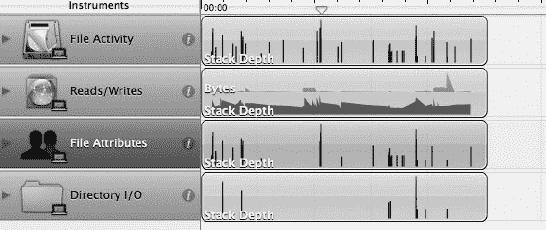

**图 4-1.** `File Activity` 工具

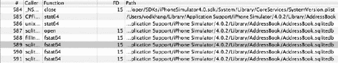

**图 4-2.** `File Activity` 的结果列表

图 4-1 展示了文件活动，包括加载和写入文件/目录以及读取文件属性。图 4-2 则展示了每项活动的更多细节，帮助你了解哪些类型的文件活动运行得最频繁。

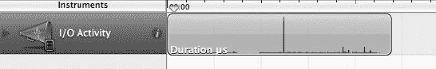

**图 4-3.** `System Usage` 工具

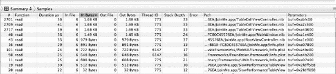

**图 4-4.** `System Usage` 的结果列表

图 4-3 和 4-4 更详细地展示了 `System Usage`，它更为通用，涵盖了更多的数据类型。正如你在图 4-4 中所见，其中包含了与 `plist` 和 `nib` 文件相关的活动。

## 缓存入门

本节将解释缓存中许多重要的术语和概念，并介绍一些适用于通用环境（如 Web 和桌面应用程序）的基本缓存算法。这些算法中有很多可以应用于 iPhone 环境；本章后续部分将会详细说明。

我将解释以下概念：缓存命中、缓存未命中、检索成本、存储成本、失效、替换策略以及缓存衡量。然后，我将解释一些最常用的缓存算法：Belady 算法、随机替换、先进先出（FIFO）、最不经常使用（LFU）、简单基于时间的、最近最少使用（LRU）以及自适应替换缓存（ARC）。

### 什么是缓存？

缓存是指将一部分数据集/图像存储在更近的层级中。例如，如果原始图像来自网络，你可以将数据/图像存储在文件系统中，这样下次你的应用就无需再通过网络来获取这些数据/图像。同样，如果数据/图像已在文件系统中，你可以将其存储在内存中，以便在需要时能立即进行计算或显示。

### 缓存命中

缓存命中发生在你的应用查找特定数据/图像时，它在缓存中找到了该数据/图像，并直接从中加载。这是一件好事，因为它无需从原始来源加载。换句话说，它节省了时间。

缓存命中率通常用于判断你的算法是优是劣。该指标通常会结合每次缓存命中时节省的容量大小来考量。例如，如果你决定存储较小的图像（每张 4KB），并且缓存命中率约为 90%，那么你已经节省了 3.6KB。这种节省有助于改善从网络和文件活动中加载的时间。然而，如果你存储大图像（每张 200KB），且缓存命中率约为 10%，那么你已经节省了加载 20KB 的成本。另一个需要考虑的角度是用户对性能的感受：如果用户知道他们将收到一张大图像，并且愿意等待网络加载，那么不经常缓存该图像也是可以的。

### 缓存未命中

缓存未命中发生在你的应用查找特定图像/数据时，在缓存中找不到它，因此需要从原始位置检索。这对你的应用来说可能是一件坏事，例如，当应用未连接到互联网时。当应用未连接到互联网且发生大量缓存未命中时，应用可能会向用户显示空白图像/数据。为了避免这种情况，你通常需要在应用联网时缓存大量图像和数据，以便在离线时显示它们。

### 检索成本

检索成本是指将图像/数据从网络/文件加载到下一个数据层级所需的开销。这可以分成两种情况。

- **从网络加载到文件**：如之前的例子所示，与从文件和内存加载相比，这消耗的时间最多。网络数据的检索成本很高。
- **从文件加载到内存**：从文件加载到内存消耗的时间较少，因此这种情况下的检索成本较低。

### 存储成本

存储成本也分为两种情况：存储在文件和存储在内存中。

- 文件系统通常比内存系统大；因此你可以在文件系统中存储更多的数据/图像。iPhone 文件系统根据设备本身的不同，最多可容纳 8、16 或 32GB。如果你使用 RSS 阅读器阅读新闻，并且该阅读器持续存储新闻中的所有图像，你的存储空间很快就会用满 8GB。你必须记住，在这 8GB 中，用户还存储着他们的音乐、视频以及所有其他应用的缓存。你的应用只应使用最多几百兆字节；否则，用户可能很快就会删除你的应用。
- iPhone 4 设备中的内存系统确实有限，最多只能存储 512MB，并且其中大部分内存被后台运行的其他应用和操作系统占用。一个应用可用于存储自身内部数据以进行处理的最大内存约为 256MB。较旧的 iPhone 设备，如 iPhone 3GS 或 iPhone 3G，最多只能使用 64 或 128MB。此外，别忘了在显示应用时，你还需要显示和存储的所有 nib 文件和视图控制器。最后，对于最新的 iPhone，你大约可以存储 50 张 1MB 大小的图像。与 iPhone App Store 中许多消耗内存的应用和游戏相比，这实际上并不多。


### 缓存失效

> “计算机科学领域只有两大难题：缓存失效和命名。”
> 
> — 菲尔·卡尔顿

正如这句话所言，缓存失效是一个难题。当开发者缓存图片/数据时，它们可能很快就会过时。问题在于，如何判断图片/数据是否过时，以及何时检查最新数据。

对于图片，如果每张图片都通过`URL`/名称进行唯一命名，那么当该`URL`/名称发生变化时（例如，用户更换了头像），你的应用会立即知道该图片已过时，并可以获取新图片。

然而，如果图片的`URL`/名称没有改变，你可以设置一个特定时间段（例如 3-7 天）后再获取新图片。幸运的是，大多数网络服务都会处理这个问题，并在图片实际更改时改变其`URL`。

对于数据，就更难了。如果你将数据缓存在文件系统中（通过使用数据库或纯文本；本章稍后会详细解释），那么你可能永远不知道数据是否过时。如果每次使用数据时都必须通过网络检查服务器上是否有新数据，那就失去了在文件系统中缓存数据的所有优势。

有几种方法可以解决这个缓存失效问题。

*   接受你的数据有时会过时，并且你必须使用这些数据来计算并展示给用户。在特定时间段后，应用会检查最新数据，并用新数据替换整个数据。
*   尽最大可能从网络快速获取数据。
*   根据用户的请求使缓存失效。

通常开发者会结合使用第一种和第三种方法，因为这样更合理。你只能将数据大小缩减到一定程度；在那之后，就无法再缩减了。第三种方法可以通过一个刷新按钮轻松实现，并且应用可以在打开或关闭时重新加载新数据，这也很容易实现。

### 替换策略

替换策略是一种策略（通常由特定算法实现），用于决定在必要时删除哪条数据/哪张图片。它还能告诉你应该在什么时间检查并删除缓存，以保持缓存库的新鲜度。在选择一种替换策略而非其他策略时，你始终需要考虑以下四个主要方面。

*   **缓存命中率**：如前所述，它表示你的应用在缓存中找到特定数据/图片的次数，与应用向缓存请求数据的次数的比例。这个数字越高越好。
*   **延迟**：通常指两种不同类型的延迟。第一种含义是缓存命中时从缓存加载数据所需的时间。第二种含义是缓存未命中时从原始源加载数据所需的时间。你需要考虑是缓存最大的项目（例如 1MB 及以上），还是缓存较小的项目（小于 10KB）。较小的项目会带来更高的缓存命中率，但可能无法像大项目那样节省带宽和时间。
*   **存储限制**：这通常需要与缓存命中率进行权衡，因为在 iPhone 上可用的空间（包括内存和文件空间）是有限的，所以你必须仔细考虑。否则，为了增加缓存命中率，你可以想存多少就存多少。
*   **算法复杂度**：实现与你偏好的策略相匹配的算法有多难？在许多算法中，你可能需要跟踪特定的文件或数据库，以记录你所使用的每条数据/每张图片的使用情况，从而优化你的缓存。这是一个很大的权衡；你会使用更多内存，并且应用需要花费 CPU 和时间来执行算法，以决定是否应该删除某条缓存。请注意，算法越复杂，你需要在构建、维护和修复算法自身漏洞上花费的精力就越多。

### 缓存算法

我将介绍一些非常基础且易于实现的算法，例如随机替换、先进先出和简单的基于时间的算法，以及更复杂的算法，如最近最少使用和最不经常使用。

#### 贝拉迪算法

这是一种理论算法，它指出如果某条信息将来不需要，应用应该直接将其删除。为什么我说这是一种理论算法呢？因为在许多现实场景中，你永远不知道那条信息将来是否会被需要。例如，假设网站将图片换成了新图片，应用发现不再需要使用旧图片了。啪！图片被删除了。然后网页设计师改变了主意，又把旧图片换了回来。现在应用又需要重新加载旧图片。因此，大多数时候（但并非总是），贝拉迪算法并不实用，实际上也无法用真实代码实现。然而，该算法被用作基准来比较其他算法。

#### 随机替换

这种算法没什么好说的。你基于某种随机访问来删除缓存。

**优点：**

*   实现该算法几乎不需要任何精力。

**缺点：**

*   在缓存命中率和缓存失效方面，可能带来不了太多好处。该算法可能会错误地删除一些仍然需要的文件，同时长时间保留未使用的文件。

**实现：**

文件：

```objc
    // 文件随机替换
    NSFileManager *fileManager = [NSFileManager defaultManager];
    NSString *filePath = NSTemporaryDirectory();
    NSDirectoryEnumerator *fileNames = [fileManager enumeratorAtPath:filePath];
    NSString *firstFileName = @"";
    for (NSString *fileName in fileNames) {
        firstFileName = fileName;
        break;
    }
    [fileManager removeItemAtPath:firstFileName error:nil];
```

内存：对于内存缓存，你通常会使用一个字典，将唯一的 URL/名称绑定到对象上。通过向字典传递唯一的 `URL`/名称，可以轻松检索数据。在这个例子中，我使用 `cacheDictionary` 来存储内存数据。

```objc
    // cacheDictionary 是一个字典，用于存储图片名称与图片本身之间的映射

    NSObject *firstObj = nil;
    for (NSObject *obj in [cacheDictionary allKeys]) {
        firstObj = obj;
        break;
    }
    [cacheDictionary removeObjectForKey:firstObj];
```


#### 先进先出（FIFO）

简而言之，此算法的规则是：最先进入缓存的项，将最先被删除。

优点：

*   该算法非常简单，几乎无需费力进行计算和比较。
*   如果你认为缓存项存在的时间越长，被删除的可能性就越大，那么它能带来一些好处。

缺点：

*   它没有考虑到哪些缓存项被请求得最频繁，或者未来被请求的可能性更高。

实现方式：

文件：你需要基于文件的创建日期。你需要找到所有文件的创建日期，然后获取最早创建的日期以进行删除。

```
NSFileManager *fileManager = [NSFileManager defaultManager];
NSString *filePath = NSTemporaryDirectory();
NSDirectoryEnumerator *fileNames = [fileManager enumeratorAtPath:filePath];
NSString *smallestDateFilePath = @"";
for (NSString *fileName in fileNames) {
    NSString *uniquePath = [filePath stringByAppendingPathComponent:fileName];
    NSDictionary* attributes = [fileManager attributesOfItemAtPath:uniquePath error:nil];
    NSDate *createdDate = [attributes objectForKey:NSFileCreationDate];
// 我会把寻找最早创建日期的任务交给你作为一个小练习
//  if (createdDate is smallest) {
//     smallestDateFilePath = uniquePath;
// }
}
[fileManager removeItemAtPath:smallestDateFilePath error:nil];
```

内存：可以通过一个字典来跟踪所有数据/图片，并使用一个数组来记录数据/图片的顺序。我使用一个 `cacheOrders` 数组来存储图片的唯一名称列表。该数组按顺序存储数据：最旧的项位于索引 0，最新的项位于数组末尾。

```
// cacheDictionary 是一个字典，用于存储图片名称与图片本身的映射关系
NSString *firstName = [cacheOrders objectAtIndex:0];
[cacheDictionary removeObjectForKey:firstName];
[cacheOrders removeObjectAtIndex:0];
```

#### 简单基于时间

此算法主要基于时间。你为缓存指定一个基本时间段。在该特定时间段过后，应用会检查缓存已存在多长时间（缓存的寿命）。如果缓存的时长超过特定期限（例如 14 天），缓存会被自动删除。

优点：

*   它非常简单——甚至比 FIFO 还要简单。
*   它不需要花费太多时间和 CPU 来计算每个缓存的寿命。
*   你不需要跟踪额外的信息（例如 FIFO 中的缓存顺序）。

缺点：

*   它通常会导致删除过多或过少，这意味着你可能会删除超出需求的缓存。例如，如果你只需要删除文件系统中 10MB 的图片以释放更多空间，但其中有 20MB 的图片早于特定日期，你就可能过度删除了。

实现方式：通常用于文件系统缓存，而非内存缓存。

文件：你需要基于文件的创建日期。你需要找到所有文件的创建日期，并筛选出创建日期早于你指定日期的文件，然后删除这些文件。

```
NSFileManager *fileManager = [NSFileManager defaultManager];
NSString *filePath = NSTemporaryDirectory();
NSDirectoryEnumerator *fileNames = [fileManager enumeratorAtPath:filePath];
NSTimeInterval maximumTimeInterval = 7 * 24 * 3600;  // 7 天缓存
for (NSString *fileName in fileNames) {
    NSString *uniquePath = [filePath stringByAppendingPathComponent:fileName];

    NSDictionary* attributes = [fileManager attributesOfItemAtPath:uniquePath error:nil];
    NSDate *createdDate = [attributes objectForKey:NSFileCreationDate];

    if ([createdDate timeIntervalSinceDate:[NSDate date]] > maximumTimeInterval) {
        [fileManager removeItemAtPath:uniquePath error:nil];
    }
}
```

接下来是更复杂的缓存算法，你可能永远都无需使用。根据我个人的经验，文件存储空间可能非常大，而你或许只需每几个月删除一次数据，使用简单的基于时间的算法即可。对于内存来说，虽然其存储容量非常有限，但访问速度快，你可能需要使用 FIFO 或 LFU。

#### 最近最少使用（LRU）

此算法比之前介绍的算法更复杂。假设你有一个项目列表。每当某个相同项目被请求时，你就将该项目放到列表的头部。当你需要删除一个项目时，你从列表的尾部删除一个项目。表 4-1 展示了一个包含四个项目的示例数组。

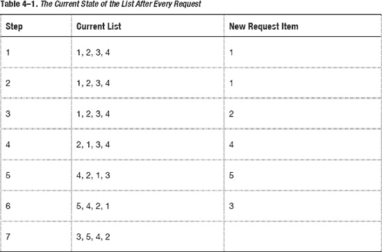

如步骤 5 所示，由于新项目（称为 5）进来了，而列表中只能存储四个项目，因此我必须删除项目 3。但在后续步骤中，项目 3 被请求了，而我没有足够的空间来缓存它，于是我删除了项目 1。

优点：

*   它基于更优的策略来删除缓存。该策略基于这样一个假设：如果一个缓存长时间未被请求，那就应该将其删除。

缺点：

*   它不太关心缓存被请求的频率。在这个例子中，如果项目 1 被连续请求了三四次，然后在接下来的三步中未被请求，你是应该删除它还是保留它？本章后面会介绍另一种试图解决此问题的算法。

实现方式：它既可以在文件中实现，也可以在内存中实现。但如前所述，除非你需要在文件系统中存储大量数据（尤其是图片/视频）并频繁地访问/删除它们，否则你不会需要使用此算法。

内存：我只展示实现此算法的一种方式，这或许并非最佳方法。但我希望你能领会核心思想。

```
// cacheArrays 是一个数组，用于存储缓存项，其目的是让最近最少使用的对象排在数组末尾。
NSString *requestedItem = @"5";
if ([cacheArrays containsObject:requestedItem]) {

    // 如果调用者请求一个已存在的项，我将该项添加到数组的顶部
    [cacheArrays removeObject:requestedItem];
    [cacheArrays insertObject:requestedItem atIndex:0];
} else {
    // 如果代码请求一个不存在的新项，我将移除最后一个项（如果 cacheArrays 已满），
    // 然后将新项添加到数组的顶部。
    [cacheArrays removeLastObject];
    [cacheArrays insertObject:requestedItem atIndex:0];
}
```


#### 最不经常使用（LFU）算法

该算法与最近最少使用算法略有不同。它关注的是某个项目被请求的频率。如果一个项目比其他项目被请求得更频繁，它就应该被保留在缓存中。表 4-2 演示了最不经常使用算法。

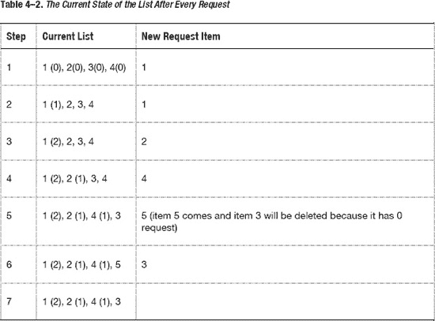

正如你所见，使用相同的初始列表和相同的项目请求列表，这两种算法最终产生了不同的结果。

优点：

- 它实际上将**缓存命中率**纳入策略考量，以决定某个项目是应该保留在缓存中还是从缓存中删除。

缺点：

- 考虑如下场景：项目 1 在开始时被访问了 100 次。然而，从长远来看，它再也没有被访问过。问题是，项目 1 仍然会被保留在缓存中，因为没有其他项目被访问超过 100 次。

实现方式：可以通过文件或内存来实现。但如前所述，除非你需要在文件系统中存储大量数据（尤其是图片/视频）并且需要频繁访问/删除它们，否则你不需要使用这个算法。

内存：作为一项快速练习，请编写一段简短的 Objective-C 代码来实现该算法。在查看下面的提示之前，请先自行完成算法。

再次强调，在进入下一页查看提示之前，请将其作为练习自行完成。

**提示**：你应该使用两个字典，一个用于记录缓存中名称 → 对象的映射，另一个用于记录名称 → 访问次数的映射。每当有新的请求到来时，你就增加该名称的访问次数，并检查是否需要删除旧的缓存。如果需要删除旧的缓存，那么你应该选择访问次数最少的缓存名称。

## 衡量缓存

让我们通过一些示例练习来演示几个要点。正如在置换策略中所述，在决定缓存策略时，你需要面对四个主要问题：缓存命中率、延迟、存储限制和算法复杂度。算法复杂度取决于你的能力；如果你是一名优秀的开发者，它与其他因素相比，对决策的影响可能不大。

假设你有两个与缓存命中率和检索约束相关的文件缓存场景。

- 一种策略是尝试缓存 1000 个小项目（每个项目小于 30KB）。你的缓存命中率是 70%。
- 另一种策略是缓存 60 个大项目（每个项目大约 500KB）。你的缓存命中率是 10%。

如你所见，两种策略的存储成本是相同的：30MB。第一种策略的缓存命中率为你节省了 21KB 的检索成本，而第二种策略则为你节省了 50KB。就检索成本而言，第二种策略为你节省了更多的带宽和加载时间。

表 4-3 为你刚刚学到的术语提供了快速总结。

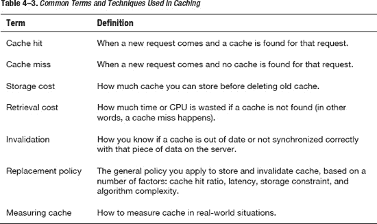

### 你应该缓存什么

开发者只应关注缓存少量内容：图片、视频、数据，或者有时是 HTML 文件，以便它们可以在 `UIWebView` 中快速加载。我将它们分为两种主要类型：要么缓存整个文件，要么缓存数据以及数据之间的关系。对于每种类型，我将向你展示在存储这些文件时需要记住的一些重要特性。

#### 你应该将图片存储在哪里？

对于你不存储在应用程序包中的文件，你必须考虑应该将它们存储在哪里。换句话说，你应该将文件缓存到哪里，以便能够检索它们并且不必担心其生命周期？有几个经典位置可以存储你的文件：临时目录、缓存目录、文档目录、相册（仅限图片/视频）以及应用程序包。每个位置都有其独特的特性，你需要了解并记住。

##### 临时目录

你可以通过调用 `NSTemporaryDirectory();` 来访问和存储此目录中的数据。

优点：

- 它不会被备份。实际上，操作系统会在某个不确定的时间将其删除。当用户重启 iOS 设备时，临时目录也将被删除。
- 你无需担心何时删除这些文件，因为这是操作系统的责任。

缺点：

- 当此目录被删除时，应用程序可能无法运行；因此，你无法对删除过程进行任何操作或控制。
- 如果你后来决定从此目录中检索文件/图片，它们很可能已经不存在了。

用途：

- 如果你需要快速且临时地存储某些内容。例如，你想存储应用程序的一些截图，以便在用户等待时展示给他们看。因为这些截图与应用程序状态相关，所以你不太关心需要长期存储它们。

##### 缓存目录

你可以通过使用以下代码片段来访问和存储此目录中的数据：

```
+ (NSString *)userCacheDirectory {
   NSArray *paths = NSSearchPathForDirectoriesInDomains(NSCachesDirectory, NSUserDomainMask, YES);
   return [paths objectAtIndex:0];
}
```

优点：

- 它不会被备份。这有助于加快用户将应用与 iTunes 同步时的备份过程。
- 它不会被 iOS 自动删除。你可以控制存储哪些文件以及何时存储。

缺点：

- 你需要确保此目录不会增长过大。换句话说，你需要确保它不会消耗用户过多的硬盘空间。

用途：

- 这是存储缓存文件的主目录。它是存储图片/视频/文件的理想位置，以便日后展示给用户。

##### 文档目录

你可以通过使用以下代码片段来访问和存储此目录中的数据：

```
+ (NSString *)userCacheDirectory {
   NSArray *paths = NSSearchPathForDirectoriesInDomains(NSDocumentDirectory, NSUserDomainMask, YES);
   return [paths objectAtIndex:0];
}
```

优点：

- 它会被备份。因此，你存储在其中的文件/图片可能永远不会丢失。
- 它不会被操作系统删除。

缺点：

- 你需要自己管理这个文件夹，并确保它不会增长过大。我见过许多应用程序将数据存储在此文件夹中，导致备份整个设备需要数小时。主要时间都花在了存储文档目录中的图片上。
- 如果你的应用允许通过 iTunes 进行文件共享，那么你存储在此处的任何文件都会在 iTunes 中显示（参见图 4-5）。因此，请注意不要使用会让用户混淆的愚蠢文件名。

    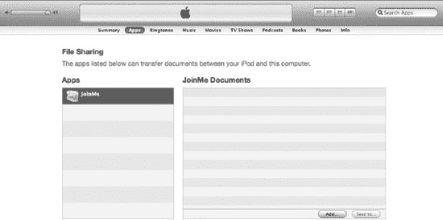

    **图 4-5.** *文档文件夹内的文档列表*

用途：

- 如果你希望文件被备份且日后不丢失，那么你应该考虑使用这个 `Document` 目录。它是存放从 Web 服务下载的、用户希望永久保留的文档或照片的好地方。


### 相册

此目录归属于操作系统，并会被多个应用程序共享。您可以在这些相册中存储照片和视频。用户在 iOS 设备上查看所有照片和视频的主要应用是“照片”应用，如图 4–6 所示。


**图 4–6.** *“照片”应用中的图像和视频*

要将照片和视频存储到“照片”应用中，请使用相应的代码片段。

对于图像：

`UIImageWriteToSavedPhotosAlbum (imageToSave, nil, nil, nil).`

请注意，`imageToSave` 是一个 `UIImage` 类型的变量。

对于视频：

```
// 假设此视频将从网络下载
NSData *videoData = [self getVideoDataFromNetwork];
NSString *moviePath = [NSTemporaryDirectory()stringByAppendingPathComponent: @”video.mp4”];
UISaveVideoAtPathToSavedPhotosAlbum (moviePath, nil, nil, nil)
```

优势：

-   数据会被备份。
-   数据可以与其他应用共享。

劣势：

-   将照片和视频保存到相册后，您无法删除它们。
-   保存图像和视频后，它们将完全脱离您应用的控制。

用途：

-   当您希望将应用生成或从网络服务获取的图像和视频分享给其他应用，以便用户查看时，此方法很适用。

### 应用程序包

当您开发应用时，图像和视频将被打包到应用中，并随应用一同安装，如图 4–7 所示。

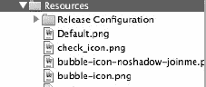

**图 4–7.** *与应用程序绑定的图像*

要获取文件，您可以使用以下代码片段：

图像：

`UIImage *image = [UIImage imageNamed:@"check_icon.png"];`

其他文件：

```
NSString *path = [[NSBundle mainBundle] bundlePath];
NSString *questionsPath = [path stringByAppendingPathComponent:@"Questions.plist"];
NSArray *questionData = [NSArray arrayWithContentsOfFile:questionsPath];
```

优势：

-   文件随应用发布。

劣势：

-   这些图像/视频是静态的，因此您无法更改、添加或删除任何内容。
-   如果在应用程序包中放入过多文件，应用会变得非常臃肿。用户将需要等待很长时间才能下载和安装。
-   更改图像或视频的唯一方法是发布新版本更新。

用途：

-   适用于您确定会在应用中频繁使用的静态图像和视频。这些通常是您会在应用内反复展示的图标或视频。

## 数据缓存

对于数据缓存，您可能需要处理结构化数据；由您自行决定如何以及在哪里存储这些数据。以下是存储数据的主要方式。

### 存储在 plist/xml/json 中

您可以使用 plist 或 XML 格式以简单的形式存储结构化数据；这样可以轻松地可视化数据，如图 4–8 所示。

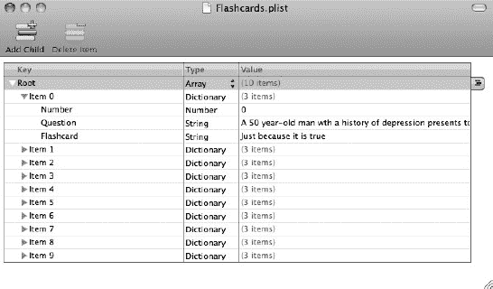

**图 4–8.** *数据可以轻松存储和可视化*

您还可以以 XML 格式查看数据，如图 4–9 所示。

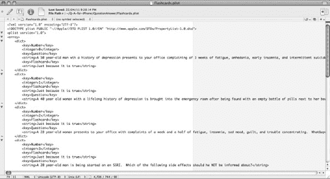

**图 4–9.** *plist 数据可以以 XML 格式查看和编辑*

您可以使用以下代码加载和解析 plist 文件：

```
NSString *path = [[NSBundle mainBundle] bundlePath];
NSString *questionsPath = [path stringByAppendingPathComponent:@"Questions.plist"];
NSArray *questionsData = [NSArray arrayWithContentOfFile:questionsPath];
```

优势：

-   易于可视化以及添加/编辑/更改数据。
-   解析数据很容易，因为所有数据都会被转换为 `NSArray`、`NSDictionary`、`NSString`、`NSNumber` 等类型。

劣势：

-   加载 plist 文件时需要加载整个文件，这非常耗时且占用 CPU。
-   无法使用 plist 创建复杂的对象模型。

用途：

-   为您的应用创建初始的静态数据。

### 存储在 CoreData 中

CoreData 是苹果提供的一个强大且功能丰富的内置框架，旨在帮助开发者轻松管理和控制数据。它在数据之间的关系问题之上创建了一个面向对象的抽象层。您可以通过拖拽来创建对象关系模型。图 4–10 展示了一个关于问题、答案及其分类的 CoreData 模型示例。

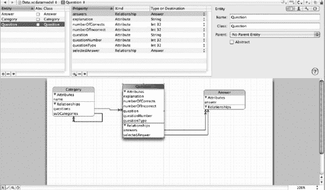

**图 4–10.** *CoreData 对象关系模型*

CoreData 还会自动生成代码。图 4–11 和 4–12 展示了图 4–10 中问题对象所生成的代码。CoreData 会处理从存储、检索到管理对象间关系的所有操作。如果您对使用 CoreData 存储数据的更多信息感兴趣，市场上有很多关于它的优秀书籍。

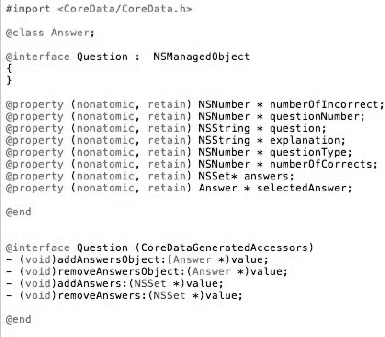

**图 4–11.** *为对象的头文件生成的代码*

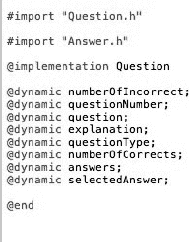

**图 4–12.** *为对象的实现文件生成的代码*

优势：

-   帮助您创建面向对象的模型。
-   您无需通过代码担心存储、管理或更新数据。CoreData 会处理这一切。
-   实际上，它提供了比 SQLite 更佳的性能。根据我个人的经验和测试，CoreData 在许多情况下运行速度都比 SQLite 快。

劣势：

-   数据可视化不太容易。没有用于管理初始数据的用户界面。
-   有时您可能不需要单独的对象模型。

用途：

-   它是管理动态数据的强大工具。在大多数情况下，您应该使用它来缓存数据。

### 存储在 SQLite 中

CoreData 使用 SQLite 作为其后端存储。然而，CoreData 也可以与其他 SQL 数据库框架一起实现，因此很难说 CoreData 是否比 SQLite 更强大。使用 SQLite 就像使用其他 SQL 数据库框架一样，只需做一些微小的改动。

优势：

-   它是一个关系型数据库。如果您熟悉关系型数据库，应该没有任何问题。

劣势：

-   很难可视化 SQLite 数据库中的所有数据。
-   您可能需要编写更多 SQL 语句来实现所需的所有功能。

用途：

-   您希望在不同的平台之间拥有一个可移植的数据库：iPhone、Blackberry、Android 和 Windows Phone。因为 SQLite 完全是用 C 语言编写的。而 CoreData 与 Cocoa 和 Cocoa Touch 框架紧密关联。


### 何时检查并删除缓存？

一般来说，我无法提供任何关于何时检查缓存的具体技巧或建议。这个决定取决于你所工作的环境；换句话说，iOS 环境不同于 Web 环境。在 Web 服务器中，你可以循环运行检查方法，查看是否有缓存过期并将其删除。在 iOS 环境中，这既耗时又消耗 CPU。

何时检查并删除缓存内容，很大程度上取决于你用于缓存所选的算法。例如，如果你主要使用 FIFO、LRU 或 LFU，那么你可能需要等到新的请求到来。或者，你可以检查缓存是否已满；如果已满，则根据你的算法删除旧缓存。这种方法通常用于内存缓存，此时你需要更精确的算法并有严格的存储限制。

对于文件缓存，你通常会选择简单的基于时间的算法。文件缓存不像内存那样有严格的有限存储容量。使用简单的基于时间的算法，你无需过度担心每一个文件，因为你可以同时删除一组文件。

如果你预计检查缓存属性时不需要花费太多时间进行计算或检索文件信息，你甚至可能完全不必担心何时检查和删除它们。这里有一个重要的教训：不要过度优化。如果你认为你的方法可能导致瓶颈，可以尝试对其进行基准测试。如果当前方法运行良好，那么你的应用是在启动时、结束时，还是首次请求并存储新缓存时检查和删除缓存，都无关紧要。

以下是一些主要方法：

- **应用启动时**：这可能会略微减慢启动过程，但如果你使用多线程，则不会有任何问题。
- **应用关闭时**：如果使用多线程需小心——应用可能在检查和删除缓存过程完成前就结束。如果你不使用多线程，应用关闭所需的时间会更长。
- **存储新缓存时**：首次请求该缓存时可能会变慢，但后续尝试会更快。在这种情况下，我建议不要使用多线程，因为你可能会删除另一个线程正在读取的文件。

### 内存缓存

以下是一些关于如何进行内存缓存的细节，以及在 iOS 环境中进行内存缓存时可能遇到的特定问题。

由于内存有严格的存储限制，你不能也不应该在这里缓存太多图片。如果这样做，iOS 运行时环境会持续发出内存警告，直到你的应用被强制关闭。

一些人因为内存环境有限而害怕使用内存缓存。不必担心：你确实有内存可用；你只需要学习如何利用并最大化你的内存能力来提升性能。如果你有顾虑，请不要忘记通过你从第 2 章学到的工具，如图 4–13 所示，仔细检查你使用的内存是过少还是过多。

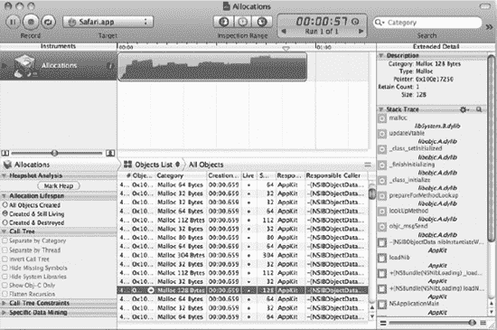

**图 4–13.** *内存分配与使用*

如果你发现与内存环境的容量相比，你使用的内存过少，不要犹豫，可以多用一些。你在内存中缓存的数据和图片越多，应用的性能就会越好。然而，如果你使用了过多内存，请注意你的应用可能会收到内存警告或被强制关闭。

### 全局访问 vs. 严格访问

对于内存缓存，你可能需要考虑希望该缓存可供应用内的任何类和方法访问，还是仅严格限于某些类和方法。如果是全局访问，任何人都可以随时更改缓存。但是，如果你将缓存数据保持得非常私有且难以访问，缓存就会变得无用，因为某些类或方法可能需要这些数据，而只能再次从服务器请求。实际的软件工程术语是*数据封装*，这意味着你应该保护你的数据，并且只与需要它的类/方法共享。

**全局访问**：

你可能需要使用 `static` 来定义全局对象。

```
#import <UIKit/UIKit.h>

@interface MyObject {
}

static NSMutableDictionary *imagesCaching;

@end
```

**严格访问**：

```
#import <UIKit/UIKit.h>

@interface RootViewController : UITableViewController {
 @private
   NSMutableDictionary *imageCaches; } - (void)cacheImage:(UIImage *)image withName:(NSString *)uniqueURL;
- (void)getCacheImageWithName:(NSString *)uniqueURL;
@end

#import "RootViewController.h"
@implementation RootViewController
- (void)cacheImage:(UIImage *)image withName:(NSString *)uniqueURL {
   // 主要代码写在这里
}
- (void)getCacheImageWithName:(NSString *)uniqueURL {
   // 主要代码写在这里
}
@end
```

### 预加载 vs. 即时加载

预加载是指在实际需要之前就加载图像。这样做的优点是，当实际需要显示文件/图像时可以节省时间。困难之处在于你可能需要猜测是否需要预加载图像。这里有一个你可能需要预加载图像以提升性能的简单案例（图 4–14）。


**图 4–14.** *分页视图的预加载图像*

如图 4–14 所示，对于像 PageView 这样用户希望获得流畅滚动体验的视图，将图像预加载到缓存中是保持滚动流畅的最佳方式。否则，用户要么必须在滚动到视图后等待（对于多线程或在视图停止后加载图像的情况），要么滚动体验会卡顿。

另一种将图像加载到缓存中的方法称为即时加载。这种方法可以节省实际的带宽或 CPU 加载过程，直到你确定确实需要这些数据/图像。其缺点是可能会降低速度，让用户等待数据。如果你需要加载会消耗大量内存的非常大的数据/图像，并且你的用户愿意等待几秒钟，那么这种方法是不错的选择。


**图 4–15.** *大图像视图*

图 4–15 是一个示例，用户知道他可能需要等待几秒钟才能获得大图像视图。如果你从文件加载到内存再显示，加载时间会相当快；因此你可能无需担心将图像预加载到内存中。另一个问题是，如果图像很大，将其预加载到内存中会消耗你的应用大量的内存。


## 总结

根据我的测试，可以看到网络性能远低于文件性能，而文件性能又远低于内存性能。你应该始终尝试使用分析工具找出瓶颈，而不是花费过多时间优化某些部分。换句话说，请避免过度优化。

你已经了解了缓存的基本主题，例如缓存命中、缓存未命中、存储成本、检索成本、替换策略以及几种著名的算法。其中一些算法非常简单但效率不高；另一些可能很高效，但实现起来耗时费力。你可能会使用随机替换算法以求简单，而在复杂情况下使用 LRU 或 LFU。

你还学习了所有可能的缓存存储方式以及每种方法的使用场景。你可以根据需求的特定目的，将数据存储在临时文件夹、缓存文件夹或文档文件夹中。你也可以选择使用相册，以便轻松与其他应用程序共享。你还学习了在应用内部存储/缓存数据的技术，以及不同结果、优点和缺点。

最后，你学习了内存缓存。你应该允许对内存缓存数据进行全局访问还是严格访问？你应该将数据预加载到内存中，还是即时加载？两者都有优点和缺点，在做出决定之前你需要仔细考虑。

**练习**

1.  自己实现 LFU 缓存算法。如果遇到问题，可以查看我的提示。
2.  使用适当的工具对两种不同的算法（FIFO 和 LRU）进行基准测试。
3.  编写一个简单的程序来获取 plist 文件并将其解析为相应的结构化数据。
4.  获取程序内附带的 plist 文件（`Questions.plist`），并将其转换为 CoreData 中的数据。

## 第 5 章

## 使用算法和数据结构优化你的应用

在本章中，你将学习：

*   糟糕的算法和数据结构会如何影响应用性能。
*   衡量算法的理论问题。
*   应用性能的实际测量。
*   主要的数据结构和算法：
    *   iPhone 数据结构：`NSSet`、`NSArray`和`NSDictionary`。
    *   其他重要的数据结构及其实现。
    *   其他算法和问题解决方法：
        *   递归
        *   XML 解析中的 SAX 与 DOM

你也许听说过，在手机开发中由于服务器端的计算能力强大，你不需要担心算法和数据结构。然而，正如上一章关于缓存问题所提到的，特别是当你的手机离线时，你应该将数据本地存储并在手机环境中进行计算。问题就在这里：你的手机环境不如服务器环境强大。换句话说，你没有云计算或数据中心的能力。

## 第一个示例

第一个示例将向你展示，当一个糟糕的算法在严格的手机环境中运行时，会如何影响你的程序。

我的示例代码很简单：

*   在第一个基准测试中，示例包含两个数组，每个数组包含 1000 个元素。第一个和第二个数组在元素数量上是相同的。我遍历两个数组来检查两者之间有多少个公共元素。
*   在第二个基准测试中，示例包含两个集合，每个集合包含 1000 个元素。我使用`NSSet` API 中的一个特殊方法来获取两个原始集合之间的公共元素集合。

然后，我分别在模拟器、新设备（安装了 iOS4 的 iPhone 4）和旧设备（安装了 iOS3 的 iPhone 3G）上对它们进行了基准测试。结果如表 5-1 所示。

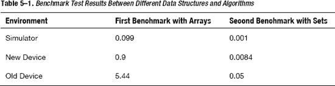

表 5-1 显示第二个基准测试比第一个基准测试快 100 倍。考虑到在处理真实应用时，1000 个元素并不算多，5.44 秒对于新设备来说可能不算什么。但是，请记住，市面上有很多性能较弱的旧设备，而这些设备的所有者可能不会很快升级它们。如此看来，5.44 秒在旧设备上运行实际上是一个显著的延迟。

接下来，在深入解释一些概念之前，我们先看看初始源代码和一些简要说明。

代码清单 5-1 和 5-2 的目的是统计第一个数组/集合中有多少对象也属于第二个数组/集合。代码清单 5-1 通过使用数组和循环解决问题，而代码清单 5-2 通过使用集合解决问题。

**代码清单 5-1.** *使用数组和循环的第一个基准测试*

```
// [self defaultData] 返回一个包含 1000 个不同 NSObject 对象的数组
NSArray *myFirstArray = [NSArray arrayWithArray:[self defaultData]];
NSArray *mySecondArray = [NSArray arrayWithArray:[self defaulData]];
NSDate *date1 = [NSDate date];
int i = 0;
for (NSObject *obj in myFirstArray) {
    for (NSObject *secondObj in mySecondArray) {
        if ([secondObj isEqual:obj]) {
            i++;
            break;
        }
    }
}

NSDate *date2 = [NSDate date];
NSLog(@"time: %f", [date2 timeIntervalSinceDate:date1]);
NSLog(@"i: %d", i);
```

**代码清单 5-2.** *使用集合的第二个基准测试*

```
- (void)secondBenchmark {
    NSArray *defaultArray = [self defaultData];
    NSMutableSet *myFirstSet = [NSMutableSet setWithArray:defaultArray];
    NSMutableSet *mySecondSet = [NSMutableSet setWithArray:defaultArray];

    NSDate *date1 = [NSDate date];

    [myFirstSet intersectSet:mySecondSet];

    NSDate *date2 = [NSDate date];
    NSLog(@"time: %f", [date2 timeIntervalSinceDate:date1]);
    NSLog(@"count: %d", [myFirstSet count]);
}
```

对于第一个基准测试，我将 1000 个元素放入每个数组，然后遍历两个数组来查找是否有任何两个元素相同。为了避免重复计数，程序在第二个数组中找到该元素后，就会停止遍历第二个数组。

第二种方法简单得多；通过使用`NSSet`，你只需要将所有元素存储在`NSSet`中，并调用正确的方法来为你完成工作。`intersect`方法会找出两个集合中的相同元素，并将它们放入变量`myFirstSet`中。

正如你所见，错误的方法可能比正确的方法慢 100 倍。此外，正确的方法可能为你节省几个小时的编码时间，因为你不需要重复造轮子，可以直接复用所有必要的数据结构和算法。因此，从一开始就选择正确的方法是个好主意。

## 衡量算法性能的理论问题

我已经在代码清单 5-1 和 5-2 中向你展示了一种使用`NSLog`和`NSDate`来衡量算法性能的方法。然而，在计算机科学中，人们不会使用`NSLog`或分析工具来讨论一个算法相对于其他算法有多快。计算机科学需要精确的数据和标准来确保某些算法确实优于其他算法。

人们通常使用大 O 表示法来描述一个算法在最坏情况下的扩展（性能）情况。（计算机科学中使用的其他术语和定义，我在此不展开讨论。）例如，如果你有一个性能为`O(N)`的算法，那么该算法对一个包含 25 个元素的数组进行操作时，需要执行 25 步；相比之下，对一个包含 5 个元素的数组，只需要执行 5 步。因此，25 个元素的数组完成任务所需时间是 5 个元素数组的 5 倍。


### 如何衡量 Big-O

要确定一个算法的 Big-O，你需要观察输入规模如何影响算法的执行时间。另一种方法是通过逻辑推理来思考算法的执行过程。代码清单 5–3 将帮助你理解这个概念。

**代码清单 5–3.** *如何衡量 Big-O*

```objectivec
   int myFirstCount = 0;
   int mySecondCount = 0;
   // 外层循环
   for (int i = 0; i < [myFirstArray count]; i++) {
        // 内层循环
       for (int i = 0; i < [mySecondArray count]; i++) {
           myFirstCount++;
           mySecondCount++;
       }
       NSLog(@"my first Count: %d", myFirstCount++);
       NSLog(@"my second Count: %d", mySecondCount++);
   }
```

为了便于说明，代码清单 5–3 包含了两个变量 `myFirstCount` 和 `mySecondCount` 的重复代码，它们执行的操作完全相同。我稍后会进一步解释。

那么，逐行查看代码，你会发现两个主要的计算逻辑是 `myFirstCount++;` 和 `mySecondCount++;`。还有一些其他的计算逻辑，比如 `NSLog(@"my first Count: %d", myFirstCount);` 和 `NSLog(@"my second Count: %d", mySecondCount);`。

在这部分，`m` 和 `n` 分别代表 `myFirstArray` 和 `mySecondArray` 中的元素数量。从程序逻辑来看，在外层循环结束后，`myFirstCount` 和 `mySecondCount` 的值都为 (m * n + m)。它们的总和则为 2 * m * n + 2 * m。

下面的解释将详细说明为什么总结果是 2 * m * n + 2 * m。这将帮助你无需使用实际计数代码就能自行进行性能分析。

外层循环（遍历 `myFirstArray` 的循环）执行了 `m` 次。因为外层循环执行了 `m` 次，所以外层循环内部的每个计算逻辑也都会执行 `m` 次。因此，外层循环的计算次数是 `m * (外层循环内部的计算次数)`。

为了计算外层循环内部的计算次数，我需要考虑内层循环和两个 `NSLog` 行。对于外层循环的每一次迭代，内层循环和两个 `NSLog` 行都会运行一次。所以，外层循环的计算次数是 `m * (内层循环的计算次数 + 2)`。 ( * )

然后，我令 `n` 为 `mySecondArray` 中的元素数量。与之前的情况类似，内层循环执行了 `n` 次，并且内层循环内部的每个计算逻辑也都运行了 `n` 次。内层循环内部只有两个计算逻辑：`myFirstCount++` 和 `mySecondCount++`。因此，内层循环内部的计算逻辑次数是 `2 * n`。将这个结果代入 ( * ) 式，你得到 `m * (2 * n + 2) = 2 * m * n + 2 * m`。

因此，总的计算次数是 `2 * m * n + 2 * m`。

为了简化计算，我令 `m = n`。通过用 `n` 替换 `m`，可以重写为 `2 * n * n + 2 * n`。它进一步简化为 `2n² + 2n`。下一步是保留公式中最高阶的项（或增长最快的项），因此只剩下 `2n²`。最后一步是移除公式中的所有常数，因此只剩下 `n²`，你可以用理论格式将其写作 `O(n²)`。

**注意：** 你现在可以看到为什么我在代码清单 5–3 中放入了重复代码；它证明了最终结果并不严重依赖于任何常数。使用 `n²` 还是 `2n²` 没有任何区别。

每种操作都有其自身的增长率。以下是操作增长率的一个示例：`log(n)`，`n`，`n²`。

当 `n = 1` 时，有 `log(1) = 0`，`n = 1`，并且 `n² = 1`。

当 `n = 10` 时，有 `log(10) = 1`，`n = 10`，并且 `n² = 100`。你可以看到，当 `n` 增加 9 个单位时，`log(n)` 仅增加 1 个单位，`n` 增加 9 个单位，而 `n²` 增加了 99 个单位。

当 `n = 100` 时，有 `log(100) = 2`，`n = 100`，并且 `n² = 10,000`。你可以看到，当 `n` 增加 9 个单位时，`log(n)` 仅增加 1 个单位，`n` 增加 9 个单位，而 `n²` 增加了 99 个单位。

因此，在增加相同单位数量的情况下，不同操作的增长率不同。图 5–1 显示了当你增加 `n` 时，每种操作（`log(n)`，`n`，`n²`，和 `n³`）的增长速度。

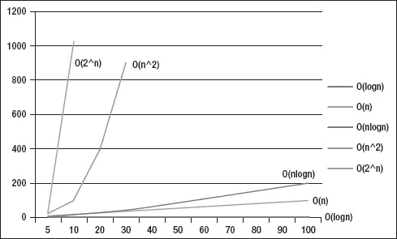

**图 5–1.** *当输入（变量 n）增加时，各 Big-O 记法的结果*

### 实现细节

Big-O 记法不涉及任何实现细节；它既不能告诉你实现一个算法需要多少内存，也不能说明在你的系统中实现该算法有多困难。它也不会告诉你哪些算法可能在输入规模小但重复次数多的情况下表现更好。例如，在小规模情况下，插入排序会比快速排序快；当重复 100 次时，插入排序的整体性能将胜过快速排序。因此，Big-O 记法为你提供了对算法的一般性理解，你可以用它来快速比较不同的算法和方法。

**注意：** 在这个记法体系中，还有其他用于描述平均情况和最好情况性能的记法。这些记法表明，在考虑具体情况时，每个算法的表现如何。

### 著名算法的 Big-O

为了让你更好地理解 Big-O，表 5–2 列出了著名的算法及其对应的 Big-O 记法，以便你了解这些算法在理论上的表现。

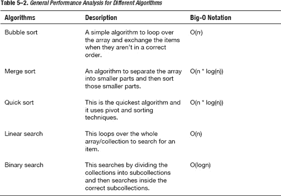

你可能会对理解 Big-O 记法的顺序感到困惑。顺序是这样的：`O(log(n)) < O(n) < O(n * log(n)) < O(n²)`。

如果你看一下表 5–2，这意味着：

*   冒泡排序比归并排序和快速排序慢。
*   线性搜索比二分搜索慢。

因此，由于归并排序和快速排序运行速度比冒泡排序快，在大多数情况下你应该优先选择这些排序算法而不是冒泡排序。

## 实际测量

在实际使用中，你需要将一些关于 Big-O 的理论与第 2 章中介绍的检测工具和分析工具结合起来。以下是用于衡量算法和数据结构性能的重要工具的快速回顾：CPU 采样器和时间分析器。

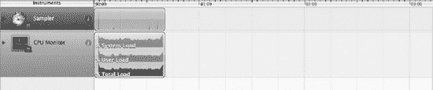

**图 5–2.** *在程序上运行 CPU 采样器的结果*

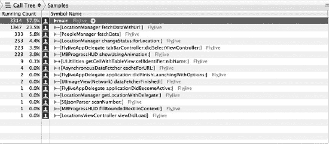

**图 5–3.** *程序内部每个方法和函数的详细结果*

图 5–2 展示了 CPU 采样器的使用情况，显示了程序运行时的系统负载、用户负载和总负载。图 5–3 提供了程序内部每个方法的更多细节，例如每个方法被调用的频率以及完成一个方法所需的时间。

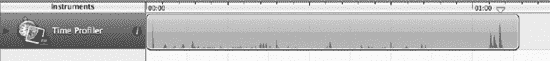

**图 5–4.** *时间分析器工具*

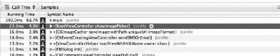

**图 5–5.** *时间分析器的详细结果*

时间分析器（图 5–4）更侧重于程序的运行时间。图 5–5 显示了从时间角度出发的详细结果。

你应该使用检测工具来确定哪些方法实际需要优化。所有方法都可能运行缓慢或需要优化，但你应该只关注那些在程序生命周期中频繁运行的方法。你只有有限的时间和资源来优化该方法的算法和数据结构。


好的，作为一名高级文档工程师和翻译员，我将严格遵循您提供的注意事项和示例，将以下英文文本翻译成中文。


## 数据结构与算法

iOS 环境的 Cocoa Touch 框架为你提供了三种主要的数据结构，以满足大多数使用场景：`NSSet`、`NSArray` 和 `NSDictionary`。每一种都有其优势与最佳使用场景。我将讨论这些在 iPhone 上的主要数据结构，然后通过代码和示例，带你了解其他一些重要的数据结构：链表、二叉树、栈、队列和图，以便你在需要性能更优的数据结构时能够自行构建。

在讨论数据结构时，我们不能将数据结构内部使用的算法剥离出来单独讨论。例如，在不了解哈希函数作用的情况下，讨论 `NSDictionary` 和哈希表是没有意义的。同样，不理解二分查找，就难以理解平衡二叉树。因此，我将并行讨论它们；我会介绍数据结构以及它们为加速性能所使用的算法。在最后几节中，我会单独介绍数据结构之间通用的常见算法。

## Cocoa Touch 数据结构

实际上，你会用到 `NSMutableArray` 和 `NSArray`、`NSMutableSet` 和 `NSSet`、`NSMutableDictionary` 和 `NSDictionary`。`NSMutable` 类与 `NS` 类的区别在于，你可以更改 `NSMutable` 类的内容，但不能更改 `NS` 类的内容。后者的优势在于保护数据，确保任何能接触到数据的代码都无法更改其内容。由于你不能修改 `NSArray`，我将在示例中使用 `NSMutableArray` 的案例。

讨论数据结构时，我将从以下几个主要方面来阐述其性能：插入、删除、搜索、访问和排序。我将使用大 O 表示法来让你了解每种数据结构在插入、删除、搜索或排序操作下的速度表现。

### NSMutableArray

数组是最简单的数据结构形式。因此，理解数组在检索、插入、更新或删除数据时的工作原理，将有助于你提升应用的性能。

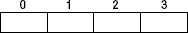

**图 5–6.** *数组图示*

数组是一组独立项集合，存放在一个数据块中，如图 图 5–6 所示，块编号从 0 到数组长度。`NSArray` 按顺序存储数据，因此不允许你在任意位置插入数据。`NSArray` 还允许你在数组中存储重复数据。

插入/删除:

*   如果在数组末尾插入/删除，速度非常快：`O(1)`。
*   如果在数组中间或开头插入，所有数据都需要向右移动，如图 图 5–7 所示：`O(n)`。

    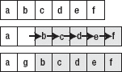

    **图 5–7.** *向数组的第二个位置插入一项*

搜索:

*   每次查找一个元素时，都需要遍历整个数组：`O(n)`。此过程如图 图 5–8 所示。数组内部搜索的一个类似问题是确定该数组是否包含某个特定元素。

    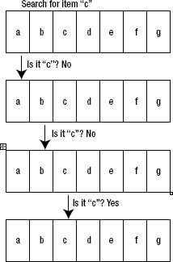

    **图 5–8.** *在数组中搜索特定项*

访问:

*   你可以非常快速地访问数组内的任何索引：`O(1)`。

排序:

*   通常，数组中的排序通过归并排序或快速排序实现。`NSMutableArray` 的排序性能应为 `O(n * log(n))`。

表 5–3 涵盖了 `NSMutableArray` 的常用方法和 API。

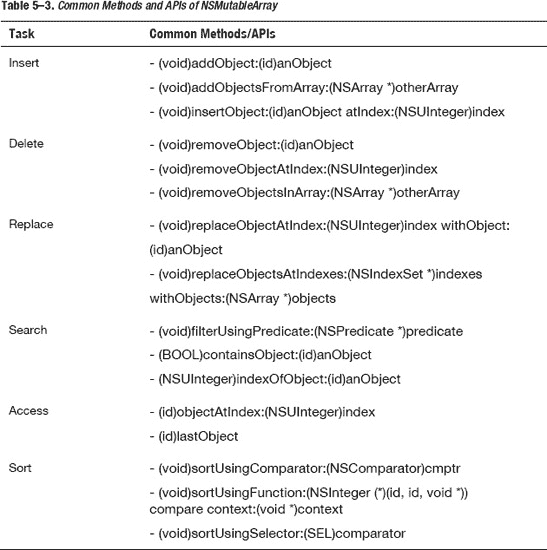

### 哈希

哈希是计算机科学和软件工程中的一项重要技术。它用于提升存储集合的性能。在 iPhone 应用中，哈希在 `NSSet` 和 `NSDictionary` 内部实现。要完全理解为什么 `NSSet` 和 `NSDictionary` 在搜索项时如此之快，你首先需要理解哈希。

哈希函数的一般任务是确保为每个不同的项创建一个唯一的哈希值。并且相同的项应始终返回相同的哈希值。

例如，`@"khang"` 和 `@"vo"`（我的名字）是两个不同的字符串；因此，哈希函数应为每个字符串生成不同的值。真正的哈希算法很复杂，需要大量优化，因此我将用一个简单的哈希计算作为示例。对于字符串，我可以使用字母表中每个字符的整数值以及字符的位置来计算字符串的哈希值（图 5–9）。

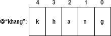

**图 5–9.** *字符串内所有字符的位置*

```
=> @"khang" = 11 * 10 ^ 4 + 8 * 10 ^ 3 + 0 * 10 ^ 2 + 14 * 10 ^ 1 + 7 = 110,000 + 8,000 +
0 + 140 + 7 = 118147
```

对“vo”执行类似操作，你将得到哈希值 `22 * 10¹ + 15 = 235`。

使用这个哈希函数，你可以看到为两个不同的项创建了两个唯一的哈希值。哈希函数的目的是为特定数据生成一个唯一的值。稍后，我将探讨拥有这种数据唯一表示形式的好处。

### Objective-C 中的 isEqual 和 Hash 方法

在 Objective-C 中，如同其他面向对象编程语言一样，每个对象都有两个重要的方法：`isEqual:` 和 `hash`。我们刚刚讨论过哈希，所以你对 `hash` 函数的作用应该有了清晰的认识。在讨论 `isEqual` 方法之后，我将讨论如何在 Objective-C 中实现/重写 `hash` 方法。

#### isEqual

在大多数面向对象编程语言中，当人们谈论两个对象的相等性时，他们指的是两种情况之一：内存中的确切对象，以及语义相等（意义上的相等）。默认情况下，对于单个对象，这两种情况是相同的。第一种相等性讨论的是变量是否指向内存中的同一个对象，通过 `obj1 == obj2` 来检查。然而，对于后者，两个对象的相等性通过方法 `[object1 isEqual:object2]` 来检查；如果该方法返回 `YES`，则两个对象相等，这与检查内存引用是不同的。

为了更清楚，这里有一个类 `MyItem`，它重写了 `isEqual:` 方法，如下所示：

```
MyItem.h
@interface MyItem : NSObject {
 @private
   NSString *identifier;
}

@property (nonatomic, copy) NSString *identifier;

- (id)initWithIdentifier:(NSString *)anIdentifier;

@end

MyItem.m
@implementation MyItem
@synthesize identifier;

- (id)initWithIdentifier:(NSString *)anIdentifier {
   if (self = [super init]) {
       self.identifier = anIdentifier;
   }
   return self;
}

- (BOOL)isEqual:(id)object {

   // 默认情况下，如果两个变量指向内存中的同一个对象，则它们应始终相等
   if (object == self) {
      return YES;
   }

   if (![object isKindOfClass:[MyItem class]]) {
       return NO;
   }

   MyItem *myItem = (MyItem *)object;
   return [myItem.identifier isEqual:self.identifier];
}

- (NSUInteger)hash {
   return [self.identifier hash];
}

@end
```

对于这个类，你可以通过给予相同的标识符，轻松创建一个与特定对象相等的模拟对象。例如，如果第一个对象由 `MyItem *item1 = [[MyItem alloc] initWithIdentifier:@"1"];` 创建，另一个对象由 `MyItem *item2 = [[MyItem alloc] initWithIdentifier:@"1"];` 创建，那么

```
[item1 isEqual:item2] 返回 YES 而 item1 == item2 返回 NO;
```


#### 哈希方法

如前所述，两个相等的对象必须具有相同的哈希值。因此，人们通常使用重写的 `isEqual` 方法来实现 `hash` 方法。如果你的 `isEqual` 方法由变量 `identifier` 决定，那么你的哈希方法应该类似于代码清单 5–4 所示。

**代码清单 5–4.** *哈希方法*

```
- (NSUInteger)hash {
   int hash =0;
   hash = 37 * [self.identifier hash];
   return hash:[self.identifier1 hash];
}
```

这里随意选取了数字 37，但你选择的任何数字都必须是质数整数。因此，如果你没有严重的性能问题，可以选择相同的数字或任何质数整数，都不会有问题。

**注意：** 在代码清单 5–4 中，我演示了如何自行编写哈希算法，因此我基于字符串的哈希值计算了一个新的哈希值。在像这样简单的情况下，你只需直接返回 `[self.identifier hash];` 即可。

### NSMutableSet

`NSSet` 是苹果公司对抽象概念“集合”的实现。集合是一个无序的容器，不包含重复元素。换句话说，`NSSet` 中不存在任何一对元素 `e1` 和 `e2` 使得 `[e1 isEqual:e2];` 返回 `YES`。

基于集合的唯一性特征，人们通常基于哈希算法来实现集合。哈希算法将使得集合能够非常轻松地找到其中的任何元素。

现在，想象你有一个如图 5–10 所示的集合。你的集合容量为七个元素。

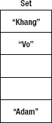

**图 5–10.** *使用哈希方法在集合中查找元素*

一个新元素“vo”到达了，你想要将其添加到集合中。由于你的集合不能包含重复元素，首要任务是检查集合中是否已包含元素“vo”。如图 5–8 所示，如果使用数组来实现，你必须遍历该数组来检查相等性。但是，使用集合则简单得多。

第一步：哈希运算

`@”vo”` 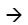`118147 mod 13 = 1` （使用 `mod 13` 是因为集合的容量应为质数整数，这里我选择 13 作为集合容量的示例。）

第二步：你检查索引位置 1 处的元素，如图 5–11 所示。

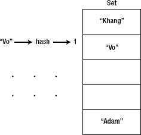

**图 5–11.** *使用哈希方法在集合中查找元素*

这样你就找到了它。如果集合中已经包含元素 `@”vo”`，则不应添加重复项。如果该索引位置没有任何内容，那么 `@”vo”` 应被添加到此索引位置。（为简化起见，我不讨论两个不同元素具有相同哈希值时的情形，尽管这在现实中是可能发生的。）

插入/删除：

*   如前例所示，插入/删除操作可以通过哈希函数即时完成，并将元素添加到正确的索引位置。性能为：`O(1)`。但是，你无法确定插入的位置。

搜索：

*   如果你要搜索一个对象，可能有三个目的。第一个目的是检查该对象是否包含在集合中。第二个目的是在集合中找到一个与你手头对象相等的对象。最后一个目的是查看集合中的对象是否具有满足某个条件的特定属性。
    *   对于第一个目的，你可以直接使用 `[set containsObject:obj1];` 方法，它会非常快速地返回结果：`O(1)`。
    *   对于第二个目的，你需要创建一个与你正在查找的对象相等的模拟对象。例如，在 `isEqual:` 部分，你可以创建一个新对象，使得 `[newObj isEqual:oldObject]` 返回 `YES`。好处是创建新对象的成本很低，或者你无需知道太多信息。之后，你可以调用 `MyItem *oldObject = [set member:newObject];`，从而获得包含完整信息的旧对象。这种情况下性能为：`O(1)`。
    *   最后一个目的是查找某个属性，例如以字符“k”开头的名称。你需要像在数组中一样遍历所有元素。这种情况下性能为：`O(n)`。

访问：

*   你不能像在数组中那样通过索引直接访问任何元素。搜索部分讨论的一种访问元素的方法是创建一个与你想要访问的对象 `isEqual:` 的模拟对象。性能为 `O(1)`。

排序：

*   Cocoa Touch 框架没有提供对 `NSMutableSet` 排序的好方法。它只提供了一个返回排序后数组的方法。基于数组的排序性能，我可以估计集合排序的性能为：`O(nlogn)`。

表 5–4 *展示了 NSMutableSet 的常用方法和 API。*

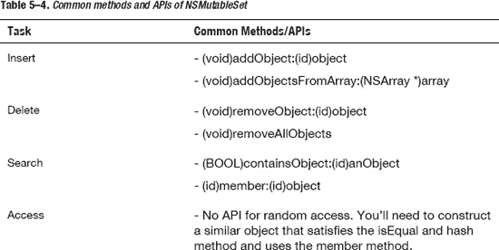

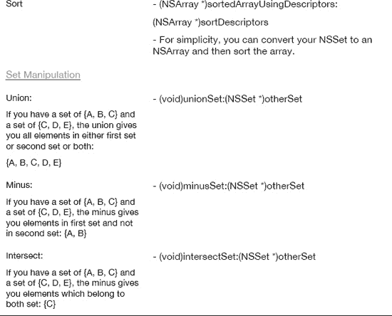

**注意：** 使用 `NSMutableSet` 和 `NSSet` 的一个重要因素是其丰富的集合操作 API。就像数学中的集合概念一样，你可能需要使用特殊的运算，如并集、交集和差集。如果你需要大量操作具有唯一数据的集合，并且关心并集、交集或差集运算，那么集合是最佳选择。

例如，你得到两个列表：一个是打网球的人的列表，另一个是踢足球的人的列表。现在，你需要找出三个列表：

*   既打网球又踢足球的人。
*   只打网球的人。
*   只踢足球的人。

我将把这个作为练习留给你去实践。你应该分别用数组方法和集合方法尝试实现。


##### `NSMutableDictionary`

`NSDictionary`和`NSMutableDictionary`是计算机科学中哈希表概念的具体实现。哈希表的规范是：你有一个唯一键的列表，每个键对应一个值，该值不需要是唯一的。哈希表利用哈希概念来确保其拥有一组唯一的键。

如图 5–12 所示，`NSMutableDictionary`包含一个键/值对列表。键与一个对象关联，并且可以通过该键访问该对象。

当你有一对新的（键值）要添加到`NSMutableDictionary`时，你需要计算哈希值并将其添加进去，方式与上述`NSMutableSet`相同。键集合类似于一个集合，只能包含唯一项。经过哈希函数处理后，你可以确定该键在键集合中的索引，然后将键和值都插入到正确的位置。

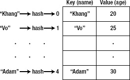

**图 5–12.** *字典概念说明*

在最简单的情况下，如果键是一个整数，你可以将`NSMutableDictionary`的工作方式理解为一个数组，左侧是索引，右侧是值。对于字典而言，主要区别在于键会被哈希处理以生成一个索引。

现在，让我们分析`NSMutableDictionary`在每个操作（插入/删除、搜索、访问和排序）中的性能。

**插入/删除：**

*   与集合的情况一样，字典的插入/删除通过确定键的正确位置而立即完成。性能为`O(1)`。

**搜索：**

*   与集合的情况相同，你需要创建一个对象，对该对象调用`[newObj isEqual:oldObj]`返回`YES`，并使用该对象来查找值。性能为`O(1)`。

**访问：**

*   在字典中，你只关心访问某个键的值。如果你已经知道键，那么访问值的性能为`O(1)`。

**排序：**

*   你无法对字典进行排序，因此你可以选择对键集合或值集合进行排序。无论哪种方式，你都需要从字典中创建一个新数组，然后对其进行排序。性能与对数组排序相同：`O(nlogn)`。

表 5–5 展示了`NSMutableDictionary`的常用方法和 API。

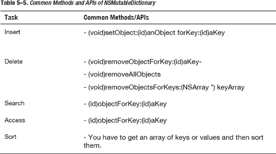

**注意：** 要将一个对象作为键放入`NSMutableDictionary`，相应的类必须遵循`NSCopying`协议，并实现`copyWithZone:`方法。例如，`NSString`遵循`NSCopying`协议，但`UIView`不遵循。因此，你不能在`NSDictionary`内将`UIView`用作键。

我已经介绍了 Cocoa Touch 框架免费提供的三个主要的重要数据结构及其 API。这些类及其方法将在合理的时间内处理你的大多数问题。接下来，我将介绍针对特定情况的其他重要且有用的数据结构。在花费时间构建新的数据结构之前，请记得对你的应用性能进行基准测试和测试。使用这些内置且经过充分测试的数据结构应始终是你的首选。

## 其他数据结构

如果你需要考虑超越基本的内置类，这里有一些其他的基本数据结构：

*   **链表：** 当你需要进行大量插入/删除操作并希望保持像数组一样的有序集合时，链表非常适用。
*   **二叉树：** 当你需要一个始终排序的集合时，二叉树非常适用。这不同于每当你向数组中插入一个新项就需要再次对整个数组进行排序。在`NSArray`（即使是已排序的数组）中进行搜索，总是需要线性搜索，因为无法知道数组是否已经排序。当你需要对项目进行二分查找时，二叉树更好。二分查找与线性查找相比，性能为`O(logn)`对比`O(n)`。
*   **栈和队列：** 当你需要构建一个只允许在末尾添加并从末尾取出（栈），或者在末尾添加并从开头取出（队列）的 API 时，它们非常适用。你可以通过链表或普通数组轻松实现它们。
*   **图：** 这是数学和计算机科学中用于演示复杂问题的一个概念。尽管许多问题会在服务器端解决，但了解图论将帮助你解决 iPhone 端的许多问题。


### 链表

在许多情况下，链表和数组的规格说明及支持的公开方法（API）通常是相同的。你可以向链表中的任意位置添加对象、从链表内的任意索引处检索对象、检查链表中是否存在某个对象，以及对链表进行排序。然而，链表与数组的主要区别如 图 5–13 所示。

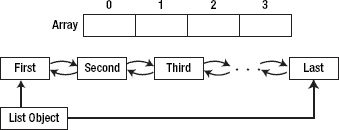

**图 5–13.** *数组与链表的比较*

如图所示，在数组中，你将元素存储在带有索引的位置上，并且可以使用索引访问数组中的任意元素。然而，在链表中，持有列表的主要 `List` 对象仅保存第一个和最后一个元素。（为简单起见，我不讨论可以向前和向后移动的双向链表）。要访问链表内的任意对象，你必须从两端之一开始：第一个元素或最后一个元素。如果从第一个元素开始，就逐个向前移动，直到到达所需的索引。如果从最后一个元素开始，就逐个向后移动，直到到达所需的索引。图 5–14 和 5–15 说明了这一过程。

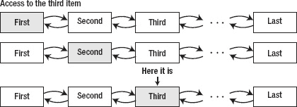

**图 5–14.** *访问链表中索引为 2（第三个元素）的元素*

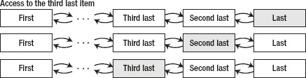

**图 5–15.** *访问链表中倒数第三个元素*

我将为链表提供一个示例实现；它并非完美的实现，但在大多数情况下可以使用。你应该下载源代码项目 `LinkedList` 以获取完整示例版本。我将简要解释最重要的部分，以确保你完全理解链表的概念。

实现中包含两个主要对象：`Node` 和 `List`。`List` 对象保存第一个和最后一个节点，如 图 5–12 所示。每个 `Node` 对象包含三个部分：`Node` 内部存储的元素、下一个元素以及上一个元素。对于第一个元素，上一个元素指向 `nil` 对象；类似地，对于最后一个元素，下一个元素指向 `nil` 对象；请参见 代码清单 5–5 和 5–6。

**代码清单 5–5.** *ListNode*

**`ListNode.h`**

```
// Structure representing a
// doubly-linked list node
@interface ListNode : NSObject {
 @private
   NSObject *value;
   ListNode *next;
   ListNode *pre;
}
@property (nonatomic, strong) NSObject *value;
@property (nonatomic, strong) ListNode *next;
@property (nonatomic, strong) ListNode *pre;

- (id)initWithObject:(NSObject *)object;

@end
```

**`ListNode.m`**

```
@implementation ListNode

@synthesize value;
@synthesize next;
@synthesize pre;

- (id)initWithObject:(NSObject *)object {
   if (self = [super init]) {
       self.value = object;
   }
   return self;
}

@end
```

**代码清单 5–6.** *链表*

**`LinkedList.h`**

```
@interface LinkedList : NSObject {
 @private
   ListNode *head;
   ListNode *tail;
   ListNode *current;
}

@property (nonatomic, strong) ListNode *head;
@property (nonatomic, strong) ListNode *current;
@property (nonatomic, strong) ListNode *tail;

- (id)initWithHead:(NSObject *)value;
- (void)addToFront:(NSObject *)value;
- (void)addToBack:(NSObject *)value;
- (void)insertObjectAtIndex:(NSInteger)index;
- (NSObject *)first;
- (NSObject *)currentValue;
- (NSObject *)next;
- (NSObject *)previous;

- (NSUInteger)count;
- (NSObject *)objectAtIndex:(NSInteger)index;

- (BOOL)removeCurrent;
- (BOOL)removeObjectAtIndex:(NSInteger)index;

@end
```

**`LinkedList.m`**

```
@implementation LinkedList
@synthesize current;
@synthesize head;
@synthesize tail;

- (id)initWithHead:(NSObject *)value {
  // 待实现，稍后解释
  return nil;
}
- (void)addToFront:(NSObject *)value {
  // 待实现，稍后解释
}

- (void)addToBack:(NSObject *)value {
  // 待实现，稍后解释
}

- (void)insertObject:(NSObject *)object atIndex:(NSInteger)index {
  // 待实现，稍后解释
}

- (NSObject *)first {
  // 待实现，稍后解释
  return nil;
}
- (NSObject *)currentValue {
  // 待实现，稍后解释
  return nil;
}
- (NSObject *)next {
  // 待实现，稍后解释
  return nil;
}
- (NSObject *)previous {
// 待实现，稍后解释
  return nil;
}
- (NSObject *)objectAtIndex:(NSInteger)index {
// 待实现，稍后解释
  return nil;
}
- (NSUInteger)count {
  // 待实现，稍后解释
  return -1;
}
- (BOOL)removeCurrent {
  // 待实现，稍后解释
  return NO;
}

- (BOOL)removeObjectAtIndex:(NSInteger)index {
  // 待实现，稍后解释
  return NO;
}

@end
```

从 代码清单 5–6 可以看出，`LinkedList` 对象能够按正向或反向顺序从列表中获取对象，并且能够向链表的头部或尾部添加对象。由于其他方法类似或易于自行实现，我将仅展示主要的实现方法。

在实现链表时，你需要考虑六个主要方法：`init`、添加对象、获取对象、`count`、移除对象以及释放整个链表。

#### Init

```
- (id)initWithHead:(NSObject *)value {
   if ((self = [super init]) != nil) {
       head = [[ListNode alloc] initWithObject:value];
   }
   return self; }
```

你需要先分配链表的头部；这个头部将持有下一个元素。

#### 添加对象

```
- (void)addToFront:(NSObject *)value {
   ListNode *node = [[ListNode alloc] initWithObject:value];
   // 新元素成为头节点
   node.next = head;
   head.pre = node;
   self.head = node;
}
```

向链表头部添加元素既简单又快速；你只需要将 `LinkedList` 对象与新节点重新链接即可。向尾部添加类似，我将其留作你的练习。

要在头部添加新节点，你需要移除所需位置周围对象的链接，并将它们与新元素重新链接，如 图 5–16 所示。


**图 5–16.** *向数组中间插入新对象*

要将元素插入到列表中的当前位置，可以使用以下代码片段：

```
- (void)insertObject:(NSObject *)object atIndex:(NSInteger)index {
   ListNode *currentNode = self.head;
   ListNode *previousNode = nil;
   ListNode *nextNode = nil;

   // 找到需要添加对象的两个相邻元素
   for (int i = 1; i <= index; i++) {
       currentNode = currentNode.next;
       if (i == index - 1) {
           previousNode = currentNode;
       } else if (i == index) {
           nextNode = currentNode;
       }
   }

   // 插入你的对象
   ListNode *newNode = [[ListNode alloc] initWithObject:object];
   if (!previousNode) {
       self.head = newNode;
   } else {
       previousNode.next = newNode;
       newNode.pre = previousNode;

       nextNode.pre = newNode;
       newNode.next = nextNode;
   }
}
```

要在链表的随机位置或中间插入对象，你需要确定节点的放置位置。因此，代码的第一部分是通过循环遍历当前链表，找到要插入对象位置的前一个节点和后一个节点。之后，将新节点与周围的节点链接起来。


#### 获取对象

`- (NSObject *)first {`
`   return self.head.value;`
`}`
`- (NSObject *)currentValue {`
`   return self.current.value;`
`}`
`- (NSObject *)next {`
`   self.current = self.current.next;`
`   return self.current.value;`
`}`
`- (NSObject *)previous {`
`   self.current = self.current.pre;`
`   return self.current.value;`
`}`
`- (NSObject *)objectAtIndex:(NSInteger)index {`
`   ListNode *currentNode = self.head;`
`   for (int i = 1; i < index; i++) {`
`       currentNode = currentNode.next;`
`   }`
`   return currentNode.value;`
`}`

要获取链表的当前对象或下一个对象很简单，你只需使用 `current` 属性。`current`、`next` 和 `previous` 等方法主要用于迭代（遍历整个链表）。我把迭代留作练习给你完成。

另一种随机访问对象的方式是使用 `objectAtIndex`。它会一直循环，直到到达正确的索引位置并返回。

#### 计数

`- (NSUInteger)count {`
`   if (!self.head) {`
`       return 0;`
`   }`

`   ListNode *currentNode = self.head;`
`   int i = 1;`
`   while (currentNode.next) {`
`       currentNode = currentNode.next;`
`       i++;`
`   }`
`   return i;`
`}`

要计算链表中的项目数量，你只需遍历整个链表直到找到一个 `nil` 对象。然后返回计数结果。

#### 移除对象

此操作与添加对象操作类似，因此我将其留作练习供你实践。如果遇到任何问题，可以查看我的 `LinkedList` 示例项目中的完整源代码。

#### 性能分析

**插入/删除：**
*   性能取决于插入/删除的位置，以及你是否拥有想要在其之前或之后插入节点的当前节点。如果需要遍历整个链表来找到插入对象的位置，那么性能与数组相同：O(n)。然而，如果你已经拥有了当前节点，那么性能会非常快：O(1)。

**搜索：**
*   搜索时，你需要遍历链表，因此性能为 O(n)。

**访问：**
*   基于索引的随机访问需要遍历链表直到找到你想要的节点，因此性能为 O(n)。

**排序：**
*   你可以像排序数组一样对`链表`进行排序。然而，对于`链表`，由于它不是内建的数据结构，你必须自己编写排序方法。你能获得的最佳性能是 O(n * log(n))。

### 栈与队列

栈和队列是特殊的数据结构，用于限制对这些数据结构所持有数据允许执行的操作。这些数据结构既可以通过数组实现，也可以通过链表实现，如前面各节所示。这些限制有助于你更好地管理数据，或确保数据以正确的顺序被处理。

#### 栈

栈只允许访问一个数据项：最后一项。如果你要从栈中插入、检索或移除项，你都必须从最后一项开始操作。图 5–17 和 5–18 展示了栈的工作原理。


**图 5–17.** *将一个新项压入栈*


**图 5–18.** *将最近的一项从栈中弹出*

有一个类比可以帮助你理解栈的概念：

*   *洗碗*：你从上到下洗碗；你绝不会从中间随便抽出一个盘子，否则整摞盘子会倒塌。

将一个项放在栈顶称为*压入*操作。将其从栈顶移除称为*弹出*操作。这种机制的计算机科学术语是后进先出（LIFO），因为最后插入的项是最先被移除的。

我将留给你一个小练习，让你自己使用数组和链表两种方式实现一个栈。你的栈应该支持以下必要方法：

*   `init` // 用于创建栈
*   `push`
*   `pop`
*   `peek` // 用于从栈中检索一个项，但不将其从栈中移除
*   `isEmpty`
*   `isFull` // 如果你的栈可以像 `NSMutableArray` 那样自动增长大小，则此方法总是返回 `false`

另一个练习实践是使用栈来反转一个字符串。

#### 队列

队列和栈类似，都限制了对数据的随机访问。然而，它的机制是第一个插入队列的是第一个离开队列的；换句话说，即先进先出（FIFO）。队列的工作方式就像一队人排队买票，如图 5–19 所示。


**图 5–19.** *访问链表中的倒数第三项*

你在队列内部操作数据的方式与处理栈的方式相反。图 5–20 和 5–21 说明了这些过程。


**图 5–20.** *将最后一项插入队列*


**图 5–21.** *将第一项从队列中移除*

同样，我将留给你一个小练习，让你自己使用数组和链表两种方式实现一个队列。你的队列应该支持以下必要方法：

*   `init`
*   `insert`
*   `remove`
*   `peek` // 用于从队列中检索一个项，但不将其从队列中移除
*   `isEmpty`
*   `isFull` // 如果你的队列可以像 `NSMutableArray` 那样自动增长大小，则此方法总是返回 `false`

使用栈或队列可能不会比使用数组或链表带来特定的性能提升。然而，这可以为你节省大量思考如何限制数据访问的时间，或者帮助你理解有助于解决特定问题的概念。

### 二叉树

接下来，我将讨论二叉树。但首先，我要简单提一下排序和搜索算法的主要问题；这将帮助你理解为什么可能需要使用二叉树。

## 排序算法

在 iPhone 开发中，你不应该自己编写排序算法。你应该理解排序算法的工作原理以及它们为什么那样工作。然而，由于框架和库的抽象和封装，大多数时候，你不需要知道 Cocoa Touch 框架使用的是哪种算法。因此，在本节中，我将只介绍一些著名的算法，以及如何将数据结构转换为已排序的数据数组。

大多数时候，你需要为框架提供一种方法来确定如何比较数组中的两个对象。以下是一个利用 `NSArray` 内部排序算法的简单代码片段：

`MyItem`
`- (NSComparisonResult)compareWithItem:(MyItem *)item {`
`   return [self.name compare:item.name];`
`}`
`- (void)viewDidLoad {`
`   myArray = [myArray sortedArrayUsingSelector:@selector(compareWithItem:)];`

`}`

大多数时候，你会将当前的数据结构转换为数组，对这个数组进行排序，然后使用结果。这是一种方法。另一种始终保持已排序数组的方法是使用二叉树，我将在后面的章节中讨论。


## 搜索

我们来探讨数据结构中的搜索策略，例如 `array`（数组）、`linked list`（链表）、`set`（集合）和 `dictionary`（字典）。如前所述，`set` 和 `dictionary` 是基于哈希表构建的，因此对这些数据结构的搜索需要拥有一个对象，其键和哈希值恰与我们正在搜索的相匹配。对这些数据结构的搜索耗时仅为 `O(1)`（这意味着速度极快）。

对于 `array` 和 `linked list`，问题则更复杂。如果需要进行搜索，可以使用以下两种策略之一：

*   遍历整个数组或链表，直到找到所需的元素。其性能为 `O(n)`。
*   对数组或链表进行排序，然后使用一种最优搜索策略（二分查找，稍后将讨论）。其性能为 `O(n * log(n)) + O(log n)`，即等同于 `O(n * log(n))`，因为你只关心增长最快的项。

因此，正如你所见，如果你有一个始终有序的数组，找到所需元素只需 `O(log n)` 的时间。我将在“二叉树”部分展示如何创建一个始终保持有序的数据结构。

### 二分查找

还记得小时候玩的游戏吗？一个朋友让你猜他心中想的一个介于 1 到 20 之间的数字。当你猜一个数字时，他会告诉你三种结果：你猜的数字比实际数字大、相等或小。

最好的开始方式是什么？是从 1 开始一直猜到 20 吗？还是应该从 5 开始，然后根据提示判断下一步方向？

如果你猜 10，朋友说你的数字比实际数字小，那么你就知道实际数字在 10 到 20 之间。太棒了！你一次性把范围缩小了一半，现在只需要再猜 10 个数字即可。再经过三四步，你就能确定这个数字。

如果你从 1 到 20 依次猜测，在最坏的情况下，你需要猜 20 次。在大多数情况下，你需要猜超过 5 次。只有 5 种情况，你可以在少于 5 次猜测时猜对。如图 5–22 所示。


**图 5–22.** *在有序数组中进行二分查找*

这就是二分查找；它其实非常简单。以下是一段实现其在数组中应用的代码片段：

```
- (void)methodToCall {
    NSMutableArray *myArray = [NSMutableArray array];
    for (int i = 0; i < 20; i++) {
        [myArray addObject:[NSNumber numberWithInt:i]];
    }
    // 查找数字 15。
    NSInteger index = [self indexForNumber:[NSNumber numberWithInt:15] inArray:myArray];
    NSLog(@"索引: %d", index);
}

// 注意：此方法仅在数组已排序时有效
- (NSInteger)indexForNumber:(NSNumber *)number inArray:(NSArray *)array {
    int firstIndex = 0;
    int uptoIndex = [array count];

    while (firstIndex < uptoIndex) {
        int mid = (firstIndex + uptoIndex) / 2;   // 计算中点。
        if ([number intValue] < [[array objectAtIndex:mid] intValue]) {
            uptoIndex = mid;      // 在下半部分重复搜索。
        } else if ([number intValue] > [[array objectAtIndex:mid] intValue]) {
            firstIndex = mid + 1;  // 在上半部分重复搜索。
        } else {
            return mid;      // 找到，返回位置
        }
    }
    return -1;     // 查找失败
}
```

该算法的主要工作在于查看数组的中间元素。如果中间元素的值小于你要查找的数据值，算法就将数组分成两半；然后取前半部分继续处理，直到只剩下一个元素。如果中间元素的值大于你要查找的数据值，它就取后半部分。

**注意：** 二分查找仅适用于已排序的数组或列表。它假设右侧的数据总是大于左侧的数据，因此它可以将数据数组分成两半。

### 二叉树

二叉树在内部结合了另外两种结构：有序数组、链表和二分查找算法。

二叉树有很多用途：

*   它始终以快速的方式保持有序。添加新对象的性能是 `O(log n)`。
*   它可以始终与二分查找一起使用，无需任何额外的计算（因为它始终是有序的）。

如果你想要一个始终按顺序排列的数组或链表（换句话说，一个有序的数组或链表），你可能需要选择以下方法之一：

*   对于已排序的数组：当你需要在数组中间插入新项时，你需要找到插入位置，然后将所有后续项向右移动。这需要花费 `O(n)` 的时间。性能问题体现在当你需要将所有项向右移动以插入（或向左移动以删除）时。
*   对于已排序的链表：在链表内部插入或删除对象的速度非常快。然而，即使链表已排序，你仍需遍历该列表以找到插入新对象的位置。这种遍历的性能是 `O(n)`。
*   在需要搜索或检索数据之前，先将新项添加到末尾，然后对数组或链表进行排序。排序操作需要 `O(n * log(n))` 的时间才能完成。

因此，二叉树是实现有序集合的最佳方式，如此你就能在 `O(log n)` 的性能内轻松找到所需项。

我已经讨论了为什么应该使用二叉树，但你可能还有一些疑问。什么是树？什么是二叉树？在回答这些问题之前，我想先向你介绍*节点*和*边*的概念。

#### 节点和边

节点用图 5–23 中的圆圈表示，而线条则代表边。节点可以用名称或数字进行标记，以使其在树中唯一。每条边由其两端的两个节点界定。


**图 5–23.** *顶点与边示意图*

#### 树

树是由一系列点（通常称为节点）以及这些点之间的连接（通常称为边）组成的集合。树有一个节点作为根节点，树内部的节点通过有向边相互连接。树内的每个节点最多只能有一个父节点，并且不允许存在环。图 5–24 展示了一个简单的示例。


**图 5–24.** *树的示例*

二叉树是一种每个节点有 0、1 或 2 个子节点的树。图 5–24 展示的也是一个二叉树。图 5–25 展示了一个非树的例子，因为它在内部形成了一个环，并且节点 5 有两个父节点：2 和 4。


**图 5–25.** *非树的示例*

在二叉树中，每个节点的两个子节点分别称为左子节点和右子节点，如图 5–26 所示。


**图 5–26.** *左子节点和右子节点*

二叉搜索树是一种二叉树，对于从中任意选取的三个节点，始终满足右节点大于其直接父节点，且父节点大于左节点。这就是我一直在讨论的二叉树的专业名称。为简单起见，我将用*二叉树*来指代*二叉搜索树*。图 5–27 展示了一个示例。


**图 5–27.** *二叉搜索树*


### 二叉树如何工作？

二叉树的插入/删除和搜索机制是相似的。所有方法都需要你遍历二叉树，直到找到要插入/删除的位置或要搜索的项目。图 5–28 展示了一个将项目插入到二叉树正确位置的示例。


**图 5–28.** *向二叉树中插入一个项目*

二叉树是基于链表的思路实现的。由于我已经讨论过如何实现链表，因此本节我将只编写二叉树的骨架和 API。代码清单 5–7 仅包含接口文件；你需要补充实现文件使其生效。

**代码清单 5–7.** *二叉搜索树*

```
TreeNode.h
@interface TreeNode : NSObject {
 @private
   NSObject *object;
   SEL compareSelector;
   TreeNode *leftChild;
   TreeNode *rightChild;
}

@property (nonatomic,strong) NSObject *object;
@property (nonatomic, strong) TreeNode *leftChild;
@property (nonatomic, strong) TreeNode *rightChild;
@property (nonatomic, weak) SEL compareSelector;

@end

Tree.h
#import "TreeNode.h"
@interface Tree : NSObject {
 @private
   TreeNode *root;
}
- (id)initWithObject:(NSObject *)obj compareSelector:(SEL)selector;
- (BOOL)find:(NSObject *)obj;
- (void)insertObject:(NSObject *)newObj;
- (void)deleteObject:(NSObject *)obj;

@end
```

要实现这段代码，你应该将二叉树理解为一种特殊的链表：你有一个`tree`对象，它持有一个`root`对象，然后`root`对象自身持有其子节点。这与链表的工作方式相同：你有一个`LinkedList`对象，它包含头节点，而该头节点本身又包含下一个节点。

你应该通过实现我提供的 API 来练习二叉树的运用。你还应该复习二分查找，确保你透彻理解了这个概念，并知道如何在此场景下应用它。如果你在任何一个地方卡住了，可以查看我的示例项目`BinarySearchTree`。

### 图

图是一种数据结构，它看起来像树，但形式更为通用。当前，随着数据挖掘和数据可视化需求的日益增长，图形可视化问题对开发者来说越来越常见。在本节中，我将展示图数据结构的基本概念，以及解决图中最重要问题之一——搜索——的两种算法。我不会深入探讨源代码，因为你可能不会大量使用这种数据结构和具体的代码。然而，你确实需要理解图的概念，因为它可以用来解决许多重要的问题。

一些常见和流行的术语：

*   **顶点和边**：顶点的概念与树中节点的概念相同，图中的边概念与树中的边概念完全一致。你可以回顾图 5–23 查看顶点和边的图示。“顶点”这个术语主要用于图的概念，而“节点”则更常用于树的概念。
*   **路径**：路径是可以穿过一系列节点的一系列边的序列。例如，在图 5–29 中，你可以看到同一对节点有两条路径：ACD 和 ABD。

    

    **图 5–29.** *路径*

*   **连通图**：从图中任意挑选一对顶点，它们之间都存在一条路径。例如，图 5–30 展示了一个连通图，如果你任意选择两个顶点，你都可以通过某条路径从一个到达另一个。然而，在图 5–31 中，你无法通过任何路径从 A 到达 C，所以它不是连通图。

    

    **图 5–30.** *连通图*

    

    **图 5–31.** *非连通图*

*   **有向图**：如果图中的每条边都有一个方向，如图 5–32 中所示，用从一个顶点指向另一个顶点的箭头表示，那么这个图就是有向图。如果边没有方向，你可以沿着它们双向通行。但如果边有方向，你只能沿着箭头所示的方向走。

    

    **图 5–32.** *有向图*

*   **加权图**：如果图中的每条边都被赋予一个权重，如图 5–33 中带有标签的边所示，该边可以表示从一个顶点到另一个顶点的任何成本或通行价值。这样的图被称为加权图。加权图可以用来表示国内城市间的航班，边显示的是飞行成本。

    

    **图 5–33.** *加权图*

在图中进行搜索非常重要。计算机科学中的图论里有许多著名的搜索问题。想象一个简单的场景：你想从纽约旅行到加利福尼亚。你可以直接乘飞机，但可能花费很高；或者你可以乘火车途经多个城市，最终到达目的地，但总费用比直飞便宜得多。

这是另一个搜索问题。你想从当前所在城市出发，沿着图中的边移动，访问所有城市。常见的好处是获取每个城市的信息，并一览所有城市的面貌。有两种实现方法：深度优先搜索和广度优先搜索。


### 深度优先搜索

如图 5-34 所示，沿着箭头方向遍历图，当到达最后一个节点时，再沿虚线箭头返回。


**图 5-34.** *深度优先搜索遍历顺序*

这种深度优先搜索算法的一种常见实现是使用栈，并遵循以下四个步骤：

1.  在图中选择一个顶点作为初始顶点，将其压入栈中；同时将其标记为已访问。你可以通过设置属性 `wasVisited` 为 `YES` 来追踪已访问的顶点，如代码清单 5-7 所示。
2.  如果可能，从栈顶最后一个顶点出发，访问任意一个未被访问的邻接顶点，将其标记为已访问，并压入栈中。
3.  如果无法执行步骤 2，则尽可能从栈中弹出一个顶点，然后重复步骤 2。
4.  如果无法执行步骤 1 和步骤 2，则算法结束。

为了便于理解，请参考表 5-6 查看这四个规则如何应用于图 5-34。


代码清单 5-8 包含了代码解释。

**代码清单 5-8.** *深度优先搜索*

```
@interface Vertex : NSObject {
 @private
   NSString *label;
   BOOL wasVisited;
   NSMutableSet *adjacentVertices;
}
@property (nonatomic, copy) NSString *label;
@property (nonatomic, weak) BOOL wasVisited;
@property (nonatomic, strong) NSMutableSet *adjacentVertices;
```

顶点对象将包含一个 `label`（标签）、一个用于标记是否已访问的标记，以及一个存储其周围顶点列表的属性。

```
@interface Graph : NSObject {
 @private
   NSMutableArray *vertices;
}
@property (nonatomic, strong) NSMutableArray *vertices;
- (void)addVertex:(Vertex *)vertex;
- (void)addEdgeForVertex:(Vertex *)vertex1 andVertex:(Vertex *)vertex2;
- (void)depthFirstSearch;
@end
```

图对象包含一个顶点列表。由于每个顶点都维护了一个邻接顶点列表，图本身不需要管理边。

```
- (void)depthFirstSearch {
   if ([self.vertices count] == 0) {
       NSLog(@"There is no vertex in graph");
       return;
   }

   Vertex *firstVertex = [self.vertices objectAtIndex:0];
   firstVertex.wasVisited = YES;
   [self display:firstVertex];

   Stack *stack = [[Stack alloc] init];
   [stack push:firstVertex];
   while (![stack isEmpty]) {
       Vertex *lastVertex = [stack peek];

       BOOL isAddNewVertex = NO;

       for (Vertex *adjacentVertex in lastVertex.adjacentVertices) {
           if (!adjacentVertex.wasVisited) {
               [stack push:adjacentVertex];
               adjacentVertex.wasVisited = YES;
               isAddNewVertex = YES;
               [self display:adjacentVertex];

               break;
           }
       }

       if (!isAddNewVertex) {
           [stack pop];
       }
   }
}
```

深度优先搜索算法的主要代码在代码清单 5-8 中。首先，检查图中是否包含顶点，然后将第一个顶点压入栈中。循环代码将持续执行前面描述的规则，直到弹出最后一个顶点并检查完所有邻接节点为止。如果存在未被访问的节点，则将其压入栈中，标记该节点，并打印该节点。如果找不到任何邻接顶点，则将其从栈中弹出。

### 广度优先搜索

如图 5-35 所示，沿着箭头方向遍历图。遍历顺序是先到达第一层，然后是第二层，最后是最后一层。这与深度优先搜索的遍历顺序不同。


**图 5-35.** *广度优先搜索遍历顺序*

1.  这种广度优先搜索算法的一种常见实现是使用队列，并遵循以下四个步骤，具体解释见表 5-7：
2.  在图中选择一个顶点作为当前顶点，并将其标记为已访问。
3.  如果可能，从当前顶点出发，访问任意一个未被访问的邻接顶点，将其标记为已访问，并插入队列中。
4.  如果无法执行步骤 2，则尽可能从队列中移除一个顶点，将其设为当前顶点，然后重复步骤 2。
5.  如果无法执行步骤 1 和步骤 2，则算法结束。


至于代码实现，建议你将广度优先搜索算法作为练习自行编写。

## 其他算法与问题解决方法

我已经介绍了最重要的数据结构及其相关算法；这些知识将显著提升你代码的运行速度。然而，作为一名 iPhone 开发者，你还需要了解一些额外的算法和问题解决方法。你可能已经知道如何用递归解决问题。第二种是用于解析 `XML` 的 `SAX`/`DOM` 解析器。在 iPhone 开发中，当你需要从网络下载和获取数据时，`XML` 会被大量使用。


### 递归

递归是一种编程技术，指方法（函数）调用自身。这是编程中最有趣的技术之一。我将展示一些可以通过递归技术立即解决的问题场景。

然而，递归有一个缺点：性能可能比直接使用循环慢。如果只调用几次递归而非数千次，这种性能损耗可以忽略不计。但如果反复调用方法，需要存储数据和堆栈跟踪时，会消耗更多内存。

递归技术可用于实现许多高性能算法，如归并排序或二分查找。为了在 Objective-C 中演示该技术，我将展示两个示例问题：阶乘计算和二分查找。然后你可以将这种二分查找版本与之前展示的循环版本进行比较。

什么是阶乘？`n` 的阶乘等于 `n` 乘以 `n-1` 的阶乘。换句话说，`factorial(n) = n * factorial(n-1)`。这非常适合使用递归，因为其定义本身已经暗示了递归的使用。

```
- (NSInteger)factorial:(NSInteger) n {
   if ( n <= 1 ) {
       return 1;
   } else {
       return n * [self factorial:(n - 1)];
   }
}
```

非常简单直接，对吧？现在，我将讨论一个更难的二分查找问题。以下是使用简单循环实现二分查找的原始方法：

```
- (NSInteger)indexForNumber:(NSNumber *)number inArray:(NSArray *)array {
   int firstIndex = 0;
   int uptoIndex = [array count];

   while (firstIndex < uptoIndex) {
       int mid = (firstIndex + uptoIndex) / 2;  // 计算中点
       if ([number intValue] < [[array objectAtIndex:mid] intValue]) {
           uptoIndex = mid;     // 在下半部分继续搜索
       } else if ([number intValue] > [[array objectAtIndex:mid] intValue]) {
           firstIndex = mid + 1;  // 在上半部分继续搜索
       } else {
           return mid;     // 找到目标，返回位置
       }
   }
   return -1;    // 未找到目标
}
```

以下是使用递归的实现：

```
- (NSInteger)indexForNumber:(NSNumber *)number inArray:(NSArray *)array lowerBound:(NSInteger)lowerBound upperBound:(NSInteger)upperBound {
   int mid = (lowerBound + upperBound) / 2;
   if([[array objectAtIndex:mid] intValue] == [number intValue]) {
       return mid; // 找到目标
   } else if (lowerBound > upperBound) {
       return -1;  // 无法找到目标
   } else { // 分割范围
       if ([[array objectAtIndex:mid] intValue] < [number intValue]) {
           // 目标在上半部分
           return [self indexForNumber:number inArray:array lowerBound:(mid + 1) upperBound:upperBound];
       } else {
           // 目标在下半部分
           return [self indexForNumber:number inArray:array lowerBound:lowerBound upperBound:(mid - 1)];
       }
   }
}
```

### 用于 XML 解析的 SAX/DOM 解析器

当 iPhone 开发者需要从网络检索数据时，XML 解析非常重要；大部分数据会以 XML 格式返回。处理 XML 时有一个重要的考量：SAX vs. DOM。我将讨论 SAX 和 DOM 的两个主要区别，以及何时应该选择其中一种方案。

`SAX` 是一种逐行读取文件或 XML 字符串以查找或解析所需数据的方式。使用 `SAX` 解析整个 XML 文件的速度非常快。但问题是，如果需要在 XML 文件中查找简单的数据片段，逻辑可能会变得非常复杂。不过它消耗的内存并不多。

`DOM` 与 `SAX` 相反：你将整个 XML 结构存储在内存中，这使得检索所需数据变得非常容易。然而，相比 `SAX` 方法，将数据结构存储在内存中需要更多的时间和内存。

现在让我们在代码中比较这两种方法。要使用 `SAX` 方法，我选择使用 `NSXMLParser`；还需要实现两个方法，以便接收 XML 事件：开始元素事件和结束元素事件。

```
@interface XMLParser : NSObject <NSXMLParserDelegate> {
 @private
   NSMutableArray* strings;
}

@property (nonatomic, strong) NSMutableArray *strings;
- (NSString *)parseDemonstration;

@end
```

```
#import "XMLParser.h"

@implementation XMLParser
@synthesize strings;

- (void)parser:(NSXMLParser *)parser didStartElement:(NSString *)elementName
 namespaceURI:(NSString *)namespaceURI qualifiedName:(NSString *)qName
   attributes:(NSDictionary *)attributeDict {
  // 你需要实现此方法来获取元素
}

- (void)parser:(NSXMLParser *)parser didEndElement:(NSString *)elementName
 namespaceURI:(NSString *)namespaceURI qualifiedName:(NSString *)qName {
  // 你需要实现此方法来获取元素
}

- (void)parser:(NSXMLParser*)parser foundCharacters:(NSString*)string {
  // 你需要实现此方法来获取元素的内容
}

- (NSString *)parseDemonstration {
   self.strings = [[NSMutableArray alloc] init];
   NSString *filePath = [[NSBundle mainBundle] pathForResource:@"books" ofType:@"xml"];
   NSString *text = [[NSString alloc] initWithContentsOfFile:filePath encoding:NSASCIIStringEncoding error:nil];
   NSData*       data      = [text dataUsingEncoding:NSASCIIStringEncoding];
   NSXMLParser*  parser    = [[NSXMLParser alloc] initWithData:data];
   parser.delegate = self;
   [parser parse];

   NSString* result = [self.strings componentsJoinedByString:@""];

   return result;
}

@end
```

对于 DOM 方法，你只需要知道元素名称：

```
[myXMLDoc nodesForXPath:[NSString stringWithFormat:@"//%@:links", @"myNameSpace"]
                              namespaceMappings:namespaceDic error:nil];
```


## 本章小结

本章从理论和实践两方面介绍了主要的数据结构与算法。理论方式作为讨论算法或数据结构概念时的基准，我通过它来比较不同的算法与数据结构。不过在实际应用中，别忘了借助工具获取真实的基准测试数据。

你还掌握了 Cocoa Touch 框架内置的三种重要数据结构。正确使用它们能帮你提升应用性能，无需重新发明轮子。但当你需要更出色的性能时，应考虑链表、二叉搜索树等优秀替代方案，以及栈和队列等抽象概念。递归和 XML 解析也是必备的重要技能。

## 练习题

1.  完成本章练习：

    现有两个列表：一个名单记录打网球的人，另一个记录踢足球的人。你需要找出以下三个列表：

    - 既打网球又踢足球的人
    - 只打网球的人
    - 只踢足球的人

    请分别使用 `NSMutableSet` 和 `NSMutableArray` 来实现。

2.  实现链表中的删除元素功能。
3.  实现在链表末尾插入元素的功能。
4.  实现链表的迭代功能并给出示例代码。
5.  实现二叉搜索树。
6.  实现广度优先搜索算法。
7.  使用 SAX 和 DOM 两种方式解析以下 XML 文档，获取每本书的标题、价格和作者全名。你可以使用 `XMLParser` 项目获取 XML 文件而无需重新输入。DOM 解析可使用 TouchXML（通过 [`https://github.com/mrevilme/TouchXML`](https://github.com/mrevilme/TouchXML)），SAX 解析可使用 Apple 内置库 `NSXMLParser`：

```
<?xml version="1.0"?>
<catalog>
  <book id="bk101">
     <author>
        <firstName>Gambardella</firstName>
        <lastName>Matthew</lastName>
     </author>
     <title>XML Developer's Guide</title>
     <genre>Computer</genre>
     <price>44.95</price>
     <publish_date>2000-10-01</publish_date>
     <description>An in-depth look</description>
  </book>
  <book id="bk102">
     <author>
        <firstName>Ralls</firstName>
        <lastName>Kim</lastName>
     </author>
     <title>Midnight Rain</title>
     <genre>Fantasy</genre>
     <price>5.95</price>
     <publish_date>2000-12-16</publish_date>
     <description>A former architect battles corporate</description>
  </book>
  <book id="bk103">
     <author>
        <firstName>Galos</firstName>
        <lastName>Mike</lastName>
     </author>
     <title>Visual Studio 7: A Comprehensive Guide</title>
     <genre>Computer</genre>
     <price>49.95</price>
     <publish_date>2001-04-16</publish_date>
     <description>Microsoft Visual Studio 7</description>
  </book>
</catalog>
```

## 第 6 章

## 使用多线程技术优化并行数据访问

本章将学习：

- 线程与多线程的概念。
- 如何在 iPhone 应用中编写和管理带锁的线程。
- 多线程环境的相关通用概念。
  - 安全性：程序应产生预期结果。
  - 活性：预期结果最终必须能在某一时刻生成。
  - 性能：预期结果必须能快速生成。
- 判断何时使用线程。
- 了解线程与 Apple 提供的其他内置解决方案之间的多种替代方案。

当今计算设备拥有越来越多处理器。iPhone 也不例外；迟早 iPhone 会配备多处理器；事实上，Android 已有一些双核设备。因此，掌握如何利用多处理器系统的需求日益增长。这只是学习多线程的众多原因之一。线程通道还能帮助解决其他问题，如异步代码、文件与网络输入/输出、或耗时计算过程。

## 什么是线程与多线程？

线程最简单的形式是供操作系统（OS）运行的一系列指令。不同线程可在同一处理器（CPU）或不同处理器上运行；这由操作系统决定，如图 6-1 所示。

通常，操作系统启动新应用程序时仅使用一个线程——即从头到尾的一条指令序列。当系统并行或并发运行多个指令序列时，便形成了多线程。在多处理器系统中，每个线程可在各自处理器上同时执行，如图 6-1 所示。


**图 6-1.** *三处理器系统运行三个线程*


**图 6-2.** *单处理器系统运行三个线程*

然而在单处理器系统中，CPU 会在切换线程前执行完当前线程的部分指令。如图 6-2 所示，CPU 在线程 1 中执行若干指令后跳转到线程 2，再执行线程 2 的指令后跳转到线程 3。

在运行过程中，不同线程可调用不同对象的不同方法，如图 6-3 所示。线程 1 和线程 2 可同时使用同一对象并调用同一方法，例如它们同时调用 `对象 1` 的 `方法 1` 和 `对象 3` 的 `方法 3`。但线程 1 和线程 2 也可调用不同对象的不同方法，例如线程 1 调用 `对象 2` 的 `方法 2` ，线程 2 调用 `对象 4` 的 `方法 4`。


**图 6-3.** *两个线程调用不同对象的不同方法*

在同一个应用程序中使用多个线程既有优势也有劣势。以下章节将详细讨论。多线程应用最重要的优势之一，是将其他任务与主用户界面（UI）进程解耦，从而避免 UI 被阻塞或冻结。

## 线程术语

以下是重要的线程术语定义：

- 术语**线程**指代代码的独立指令/执行序列。
- 术语**进程**指代正在运行的可执行文件，可包含多个线程。
- 术语**任务**指代需要执行的抽象工作概念。

如果线程和进程都用于并发执行逻辑，它们有什么区别？进程与线程在以下方面存在差异：

- 进程是资源分配单元，拥有自己的资源、堆内存和权限。线程仅仅是执行单元，拥有自己的栈和程序计数器。
- 一个进程包含多个线程，每个线程只能属于一个进程。
- 线程与其所属进程内的其他线程共享数据。两个进程之间不共享数据，通常使用进程间通信传输数据（进程间通信不在本章讨论范围内）。
- 操作系统必须为进程分配特定资源，且进程间无法共享资源，因此进程被认为是重量级的。而线程共享资源，因此操作系统可以在同一进程内创建任意数量的线程。


## 第一个示例

此示例将演示 IO 性能方面的一些问题。后续我会运用多线程技术来加速代码运行。我的示例代码很简单：

-   **在第一个基准测试中**：我将加载并展示一个表格视图中的图片列表。随后，我会向你展示滚动体验有多糟糕：在当前状态下的所有图片返回之前，你无法滚动表格。
-   **在第二个基准测试中**：我将使用多线程来加速程序。你会看到，在等待图片加载的过程中，滚动体验会好很多。

**注意：** 在这两种情况下，我的示例项目都*不会*缓存图片，以便让你清晰地看到两种情况的差异。

表 6–1 展示了基于 Core Animation 工具的各项测试基准结果，这样你就能看到该工具在实际场景中的应用。


表 6–1 向你展示了 iPhone OS 在处理和运行应用程序时加载的每秒帧数（fps）。可以看到，使用多线程显著加快了加载过程。在此案例中不使用多线程的问题在于，加载过程会阻塞 UI，导致你的应用看起来像是卡住了。

在深入解释这些概念之前，我会先让你看一下源代码，并做一些简单说明。代码清单 6–1 展示了第一个基准测试的代码。

**代码清单 6–1.** 第一个基准测试；此代码运行在 `UITableViewDataSource` 的方法内部。

```objc
- (UITableViewCell *)tableView:(UITableView *)tableView
cellForRowAtIndexPath:(NSIndexPath *)indexPath {
  static NSString *CellIdentifier = @"Cell";
  UITableViewCell *cell = [tableView dequeueReusableCellWithIdentifier:CellIdentifier];
  if (cell == nil) {
      cell = [[UITableViewCell alloc] initWithStyle:UITableViewCellStyleDefault
reuseIdentifier:CellIdentifier];
  }
  NSURL *imageURL = [NSURL URLWithString:[self.imagesArray objectAtIndex:indexPath.row]];
  cell.imageView.image = [UIImage imageWithData:[NSData dataWithContentsOfURL:imageURL]];
  // 配置单元格。
  return cell;
}
```

代码清单 6–2 仅展示了在异步代码中获取图片，并在获取完成后将图片发送到 `UIImageView` 的通用方法。为简单起见，此处未显示或讨论实际的异步代码。

**代码清单 6–2.** 第二个基准测试——通过后台线程获取图片

```objc
// 自定义表格视图单元格的外观。
- (UITableViewCell *)tableView:(UITableView *)tableView
cellForRowAtIndexPath:(NSIndexPath *)indexPath {
   static NSString *CellIdentifier = @"Cell";
   ImageCell *cell = (ImageCell *) [UIUtilities getCellWithTableView:tableView
                                                      cellIdentifier:CellIdentifier
                                                             nibName:@"ImageCell"];
   // 配置单元格。
   NSURL *imageURL = [NSURL URLWithString:[self.imagesArray
objectAtIndex:indexPath.row]];
   [cell.contentImage displayImageWithURL:imageURL];
   return cell;
}
```

```objc
#import <Foundation/Foundation.h>
#import "ImageFetcher.h"

@interface UIImageView (Network) <ImageFetcherDelegate>

- (void)displayImageWithURL:(NSURL *)url;
@end

#import "UIImageView+Network.h"
#import "ImageFetcher.h"

@implementation UIImageView (Network)

- (void)imageFetcherFinished:(ImageFetcher *)fetcher {
   self.image = fetcher.image;
}

- (void)displayImageWithURL:(NSURL *)url {
   self.image = nil;
   if (url) {
       // 这段代码将在后台线程中运行，并在获取到图片时回调
       [ImageFetcher loadImageWithURL:url delegate:self];
   }
}

@end
```

在第一个基准测试中，我在返回表格视图单元格的方法内部加入了获取图片的代码。通过这一行代码，iOS 会停止并等待，直到图片从网络返回。之后，它才会继续返回单元格并将其显示在界面上。这种等待会导致整个应用程序停止，这就是为什么在第一个基准测试中你无法快速滚动表格视图的原因。

对于第二个基准测试，我使用了异步代码，这实际上是多线程的另一种形式，但底层库会为你处理多线程代码。使用这种代码，主进程无需等待下载过程完成。因此，在第二个基准测试中，你可以毫无问题地滚动表格视图。

## 多线程的优势

在某些情况下，你可能会考虑在 iPhone 应用程序中使用线程。

-   *充分利用所有核心和处理器*：（一个处理器内部可以有多个核心，而核心是实际的计算单元。）目前，iPhone 4 只有一个处理器和一个核心，但 iPhone 5 可能拥有多个核心，你希望你的应用能够利用所有可用的处理器来提升性能。
-   *建模*：你可以尝试模拟现实世界中的实际行为。例如，考虑这种情况：你需要完成 12 种不同类型的任务（修复 Bug、面试系统管理员候选人、为下一个产品演示创建幻灯片等），而另一种情况是只有一项复杂的任务（修复 12 个 Bug）。当你只需要处理一个工作队列时，后一种情况更容易实现。前一种情况比较复杂，你可以将每个线程分配来处理一个任务。
-   *处理 I/O 处理任务*：通常，I/O（包括文件 I/O 和网络 I/O）需要花费时间才能将数据返回给应用程序。因此，如果你只用一个线程来处理它，你的应用程序可能会停止工作，花费时间等待数据。使用多线程可以帮助你将 I/O 线程分离出来，直到它接收到所有数据再合并回主线程。
-   *更灵敏的 UI*：像 iPhone 应用程序这样的 GUI 应用程序只从一个线程启动，这意味着所有应用程序代码都通过一个*主事件循环*（也称为*主运行循环*）执行。事件循环是指应用程序接收来自用户的输入事件（例如点击、滑动或双击），然后运行与输入事件对应的逻辑。应用程序在一个事件循环内执行的时间越长，UI 的响应就越不灵敏。
-   *在后台处理某些逻辑*：这也是 iPhone 应用程序代码的重要组成部分。在某些情况下，你可能需要大量处理数据，例如运行 XML 解析算法来提取其中的一些数据。这与 UI 的响应速度有关；在 UI 线程中做更少的工作将使程序提供更好的用户体验。

## 如何编写多线程应用程序

既然你已经知道多线程应用程序可以多么强大，以及它如何帮助你解决许多问题，那么如何编写一个好的多线程应用程序呢？我将向你展示为 iPhone 编写/处理良好的多线程应用程序的主要技术。

### 创建线程

要创建线程，你可以使用以下任何一种方法：

-   `NSThread`
-   `POSIX` 线程
-   使用 `NSObject` 创建新线程
-   `NSOperation` 和 `NSOperationQueue`

我会逐一介绍它们，并给出示例，因为它们各有利弊。在本节末尾，我将提供一个对比表格，确保你能够区分它们，并为你的特定需求选择正确的方法。


#### NSThread

要使用 `NSThread` 创建新线程，只需调用：

```
[NSThread detachNewThreadSelector:@selector(threadMethod:) toTarget:self withObject:nil];
```

此方法将为你的应用创建一个新的分离线程。*分离线程* 是指当该线程退出时，其所有资源将由系统回收。

有一些属性你需要了解。

```
+(void)detachNewThreadSelector:(SEL)aSelector toTarget:(id)aTarget withObject:(id)anArgument
```

- `aSelector`：线程启动时将在目标对象上调用的方法。根据苹果文档，该选择器仅接受一个参数且无返回值。
- `aTarget`：将执行 `aSelector` 参数中指定方法的对象。
- `anArgument`：唯一的参数，在线程启动时会传递给 `aSelector` 方法。

如果你想创建一个线程但暂时不启动它，可以使用以下机制：

```
NSThread* myThread = [[NSThread alloc]
                        initWithTarget:self
                              selector:@selector(myThreadMainMethod:)
                                object:nil];
[myThread start];  // 实际创建线程
```

如你所见，在第一行中，你可以创建一个新线程，然后在你选择的任何后续时间，对该对象调用 `start` 来创建并启动新线程。如果只想传递 `myThread` 对象，而不需要传递 `selector`、`target` 和 `argument`，这种方式很好。

使用 `NSThread` 对象的另一种好方法是使用以下方法向该线程对象发送消息：

```
-(void)performSelector:(SEL)aSelector onThread:(NSThread *)thr withObject:(id)arg waitUntilDone:(BOOL)wait
```

此方法会将选择器排队到另一个线程上。当系统自动运行该线程时，线程会从队列中取出消息并调用 `aSelector` 变量中指定的方法。

#### 使用 POSIX 线程

这种机制主要用于 iPhone 应用程序中的 C 语言编程。在第 9 章中，我将深入介绍 C 语言编程以及它如何在许多情况下帮助你提升 iPhone 应用的性能。因此，如果你还不了解 C 语言编程，这部分可能对你帮助不大。如果你确实了解 C 语言编程，代码清单 6-3 展示了相关代码并附有解释。

**代码清单 6-3.** *POSIX 线程*

```
#include <assert.h>
#include <pthread.h>

void* ThreadMethod(void* data)
{
   // 你的主要逻辑写在这里。
   return NULL;
}

void LaunchThread()
{
   // 使用 POSIX 例程创建线程。
   pthread_attr_t  attr;
   pthread_t       posixThreadID;
   int             returnVal;

   // 初始化并检查新线程是否初始化成功
   returnVal = pthread_attr_init(&attr);
   assert(!returnVal);

   // 为新线程设置属性分离状态
   returnVal = pthread_attr_setdetachstate(&attr, PTHREAD_CREATE_DETACHED);
   assert(!returnVal);

   // 创建并运行新线程
   int     threadError = pthread_create(&posixThreadID, &attr, &ThreadMethod, NULL);

   returnVal = pthread_attr_destroy(&attr);
   assert(!returnVal);
   if (threadError != 0)
   {
       // 报告错误。
   }
}
```

#### NSObject

所有对象都有能力创建并分离一个新线程来执行这些对象的选择器。你可以使用下面这行代码，在后台线程中运行 `doSomething` 方法：

```
[myObj performSelectorInBackground:@selector(doSomething) withObject:nil];
```

调用此方法的效果与下面这行代码相同：

```
[NSThread detachNewThreadSelector:@selector(doSomething) toTarget:myObj withObject:nil]
```

此方法是分离并创建新线程来运行后台任务的便捷缩写形式。

#### NSOperationQueue

`NSOperationQueue` 类是一种管理和并发运行任务的机制。`NSOperationQueue` 的一个优点是，它可以将系统内部并发操作的数量限制在给定范围内，从而使系统负载保持在可接受的水平。由于这种线程数量上限的限制，`NSOperationQueue` 实例数量更多并不一定意味着系统中同时运行的并发线程会更多。

你可以向队列中添加操作，但不能移除它们。不过，你可以取消队列中所有现有且未运行的操作。表 6-2 展示了一些在使用 `NSOperationQueue` 时你会觉得非常有用的其他方法。


你可以通过三种不同的类来使用 `NSOperationQueue`。

- `NSInvocationOperation`：如果你已经有一个对象和一个方法要放入并发线程中，这是一种简单的封装。它也不需要子类化，因此你可以通过此类创建一个简单的 `NSOperation` 对象。`NSInvocationOperation` 是 `NSOperation` 的子类。
- `NSBlockOperation`：这是另一种封装，用于执行一个或多个代码块，而无需为每个要执行的代码块都创建单独的 `NSOperation` 对象。当执行多个代码块时，只有当内部的所有代码块都执行完毕，`NSBlockOperation` 才被视为完成。
- 自定义的 `NSOperation` 对象：`NSOperation` 是一个基类。通过对其子类化，你可以完全控制 `NSOperation` 对象的整个实现，包括操作执行和报告状态的默认方式。

要使用 `NSOperationQueue` 创建多线程应用，你需要通过这三种方法之一创建特定的对象，并将新创建的 `NSOperation` 添加到你的队列中。然后，队列会为你维护并运行这些操作。

以下是一段代码片段，可以帮助你创建 `NSOperationQueue` 并将单独的操作对象添加其中，从而创建多线程环境：

```
NSOperationQueue* myOperationQueue = [[NSOperationQueue alloc] init];
[myOperationQueue addOperation:myOperation]; // 添加单个操作
[myOperationQueue addOperations:arrayOfOperations waitUntilFinished:NO]; // 添加多个操作
[aQueue addOperationWithBlock:^{
  /* 执行一些操作。 */
}];
```

现在我将详细介绍如何使用前面提到的每种方法来创建新的操作。

##### NSInvocationOperation

`NSInvocationOperation` 对象被运行时，会执行在创建该对象时指定的方法。在以下情况下，你可能需要使用该对象：

- 你想避免在应用内部创建过多的自定义操作类。
- 你正在添加或维护一个已有应用，其中的类已经定义完善，并且你不想修改该类来将其子类化为 `NSOperation`。
- 选择器可能根据用户输入而变化。在这种情况下，你只需使用选定的选择器创建一个新的 `NSInvocationOperation` 对象即可。

创建 `NSInvocationOperation` 对象的代码如下：

```
NSInvocationOperation* theOp = [[NSInvocationOperation alloc] initWithTarget:self
                                                                    selector:@selector(myTaskMethod:) object:data];
```

这与使用 `NSThread` 创建并分离新线程时的情况类似。你传递目标对象、想要调用的选择器，以及你希望选择器在执行时拥有的参数。


```markdown
##### NSBlockOperation

`NSBlockOperation`是`NSOperation`的另一个子类。当你创建一个块操作时，你必须在操作对象内添加至少一个块。之后，你可以向该操作对象中添加更多要执行的块。当操作队列执行此块操作时，它会在该块操作完成前执行其内部的所有块。因此，你可以使用此操作对象来跟踪一组块，然后合并或处理相关结果。

要创建块操作对象，可以使用以下代码：

```
NSBlockOperation* theOp = [NSBlockOperation blockOperationWithBlock: ^{
      NSLog(@"Beginning operation.\n");
      // Do some work.
}];
```

然后，稍后你可以通过调用以下代码向此操作添加另一个块：

```
[theOp addExecutionBlock:[NSBlockOperation blockOperationWithBlock: ^{
      NSLog(@"Beginning operation.\n");
      // Do some work.
}];
```

##### NSOperation

`NSOperation`是一个供你通过子类化来自定义的类。要子类化`NSOperation`，你需要创建一个包含两个推荐（但非强制）方法的类。

- *自定义初始化方法*：用于接收数据以及在类内部进行逻辑处理所需的属性。例如，你可以有一个`init`方法来接收用于下载图片的 URL，如下所示：

```
- (id)initWithData:(id)data {
    if ((self = [super init]))
      myData = data;
    return self;
}
```

- `main` *方法*：一个必需的方法，当任务启动时会被调用。

要创建一个并发的`NSOperation`子类，你需要重写更多方法，以帮助`NSOperationQueue`对象处理调用者的多线程请求。

- `start` *或* `main`：你需要重写此方法或`main`方法，以便在线程启动你的操作时执行你的逻辑。默认情况下，此方法除了调用`main`方法外什么都不做。因此，你可以重写此方法或`main`方法。
- `isExecuting` *和* `isFinished`：你的操作必须向外部客户端报告其当前状态。两个最重要的状态是你的操作是否已开始执行以及是否已完成。因此，你需要通过属性或实例变量跟踪当前的操作状态，并在此处报告这些状态。
- `isConcurrent`：你必须重写此方法以返回`YES`。

其他方法不是强制的，但通常你需要它们。

- *其他逻辑处理方法*：除非你想将所有代码都放在`main`方法中，否则你还需要其他方法来包含你的逻辑处理代码。

Listing 6–4 展示了一个自定义并发`NSOperation`类的完整代码示例。

**Listing 6–4.** 一个自定义并发的`NSOperation`类

```
@interface ConcurrentOperation: NSOperation {
   BOOL        executing;
   BOOL        finished;
   NSURL      *url;
}

@property (nonatomic, strong) NSURL *url;
@property (nonatomic, weak) id delegate;

@end

@implementation ConcurrentOperation

@synthesize url;

// put your necessary data and arguments in the custom initilization code
- (id)initWithURL:(NSURL *)aURL operationDelegate:(id)aDelegate {
   self = [super init];
   if (self) {
       executing = NO;
       finished = NO;
       self.url = aURL;
       self.delegate = aDelegate;
   }
   return self;
}
// remember to always override this method and return YES
- (BOOL)isConcurrent {
   return YES;
}

- (BOOL)isExecuting {
   return executing;
}

- (BOOL)isFinished {
   return finished;
}

// here, we choose to override the main method to download the image and send it back to
// the main selector.
- (void)main {
    NSData *loadedData = [[NSData alloc] initWithContentsOfURL:self.url];
    UIImage *myImage = [UIImage imageWithData:loadedData];

    [self.delegate performSelectorOnMainThread:@selector(imageLoaded:)
                                    withObject:myImage
                                 waitUntilDone:YES];
}

@end
```

Listing 6–4 展示了如何编写一个自定义的`NSOperation`，通过多线程从网络下载图片。

**注意：** 如果你以前做过 Java 编程，你可能会发现`NSOperation`与`Thread`类或`Runnable`接口有相似之处。在`Thread`类中，你可以扩展`Thread`类并重写`run`方法。对于`Runnable`接口也是一样，你需要实现`Runnable`接口并重写`run`方法。你可以将`NSOperation`的`main`方法视为 Java 中`Thread`类和`Runnable`接口中的`run`方法。

### 配置线程

有几个选项可以用来正确配置你的线程，以便在不过载的情况下充分利用系统资源，特别是在像 iPhone 这样受限的运行时环境中。

- *栈大小*：每当创建新线程时，操作系统都会为该线程分配一块默认大小的内存作为栈来执行。如果你不了解栈，可以查阅第 5 章。线程内部的栈将存储局部变量以及线程运行时调用的方法。要为线程设置栈大小，你必须在分离线程之前设置该大小。对于`NSThread`，这意味着你使用如下初始化方法：

```
NSThread* myThread = [[NSThread alloc]
                        initWithTarget:self
                              selector:@selector(myThreadMainMethod:)
                                object:nil];
[myThread setStackSize:40960]; // 40KB here, the size is in bytes and multiple of 4KB
[myThread start];  // Actually create the thread
```

- *线程本地存储*：每个线程都有一个用于存储数据的键值对字典，这些数据可以在线程内部的任何地方访问。你可以使用这个字典来存储那些希望在线程执行期间持久化的数据，而无需在代码中创建全局变量。你可以通过`[aThread threadDictionary]`来调用这个字典。
- *线程优先级*：线程优先级涉及操作系统选择执行某个线程的可能性。优先级越高，线程运行的可能性就越大。然而，优先级并不保证任何事情，例如在操作系统切换到另一个线程之前该线程的执行时间。它也不保证高优先级线程总是被选中，而不是其他低优先级线程。

### 你的线程入口点

当你启动线程时，你需要有一些代码来管理该线程的当前状态、线程执行时创建的内存以及线程内部可能抛出的任何异常。原因是你新创建的线程有自己的栈，这与默认栈不同，如图 6–4 所示。因此，你的线程使用的内存与主线程使用的内存区域不同。异常也是类似的；它只会存储在你的栈中，而不会返回给主栈和主线程。


**图 6–4.** 两个线程有不同的栈来管理它们的执行

有几件事情你需要记住：

- **自动释放池**：用于管理自动释放的对象。
- `ExceptionHandler`：用于管理线程运行时抛出的异常。
- `RunLoop`：用于创建事件处理代码。

我将讨论为什么需要实现它们中的每一个，以及如何正确地做到这一点。

表 6–3 提供了一个简短摘要，帮助你回顾创建和配置线程的主要技术及其优缺点。


```


## 自动释放池

在应用程序的每个线程中，你都应该始终拥有一个`Autorelease Pool`，方法是将代码放在`@autoreleasepool`块内。该池包含线程运行时所有自动释放的对象。如果你从未调用过返回自动释放对象的方法，最好还是包含它，因为底层框架和库可能会创建并返回自动释放的对象。如果你有`@autoreleasepool`但从未使用自动释放，一切仍然可以正确运行。

如果你查看 XCode 提供的任何应用程序模板中的`main`方法，你会看到以下代码：

```
int main(int argc, char *argv[]) {
    @autoreleasepool {
        int retVal = UIApplicationMain(argc, argv, nil, nil);
    }
    return retVal;
}
```

这个`@autoreleasepool`将处理该线程内的所有自动释放对象。正如你可能已经知道的，自动释放对象是你不再需要使用但还不希望释放的对象。它也可以由工厂方法（如`[NSMutableArray array];`）作为自动释放对象返回。这些对象将在运行循环结束时随池一起释放。

因此，如果你创建了一个新线程，请确保将代码包装在`@autoreleasepool`块内，如下所示：

```
- (void)myThreadMethod {
    @autoreleasepool { // 顶级池
        // 在此处执行线程工作
    }
}
```

### 异常处理器

在处理线程时，异常非常重要。因为每个线程都有自己的栈，当引发异常时，它会遍历栈的方法到达顶部。这可能导致你的线程停止运行。主线程中的任何异常处理程序也将被忽略。

以下是处理异常的一些基本代码：

```
NSObject *myObject = nil;
@try {
    // 访问数组中的一些对象
    myObject = [myArray objectAtIndex:2];     
}
@catch ( NSException *e ) {
    NSLog(@"数组元素少于 3 个");
}
@finally {
    // 在此处编写清理代码
}
```

### 运行循环

当你创建一个新线程时，有两种方式可以执行该线程。

- 你编写代码执行线程内的逻辑，直到任务完成且几乎没有中断，例如之前显示的从 URL 下载图像的代码。这很简单，正如你所见。
- 你希望线程在有动态事件进入时做出响应，例如监听网络上的某些套接字或某个时间触发的事件。这与第一种情况不同，需要你编写代码来创建新的运行循环。

以下是一些简单的`RunLoop`代码，用于监听输入流：

```
NSRunLoop *runLoop = [NSRunLoop currentRunLoop];
[iStream setDelegate:self];
[iStream scheduleInRunLoop:runLoop forMode:NSDefaultRunLoopMode];
```

**注意：**如果在没有运行循环的线程上调用了`[NSRunLoop currentRunLoop]`，此方法将导致创建一个新的运行循环。

如果你希望运行循环在开始运行前等待一段时间，可以使用`NSTimer`来完成此任务：

```
[NSTimer scheduledTimerWithTimeInterval:2.0
                                 target:self
                               selector:@selector(doStuff)
                               userInfo:nil
                                repeats:YES];
```

然而，在某些情况下你不应该使用`RunLoop`，例如在主线程中，你有事件处理代码如`NSInputStream`或`NSTimer`，它们执行一些需要很长时间才能完成的重任务。因为像我的例子这样的事件处理代码最终会在创建它的线程上工作，你的线程无法继续处理其他事件处理代码，直到旧事件被处理并完成。如果你在该线程内创建定时器或输入流运行循环，可能会损害你的主 UI 线程。主要问题是它会使你的 UI 响应速度变慢。

## 线程的风险

在多线程环境中运行时，你总是需要注意一件事：你无法控制线程的执行顺序。例如，如果你有两个线程，线程 1 和线程 2，CPU 会在一定时间内处理线程 1，然后切换到线程 2 并继续运行另一段时间。问题是你不知道 CPU 何时切换，也不知道它会为特定线程分配多少时间。这些时间量对于每个线程和每次运行并不相等。

为了演示难以控制输出的危险性，我将向你展示一个示例。该示例包含两个线程：线程 1 和线程 2。线程 1 打印奇数整数，线程 2 打印偶数整数。这些整数的范围是 1 到 20。线程 1 将先启动，然后线程 2 启动。该示例将运行三次。

清单 6–5 显示了示例代码。

**清单 6–5.** *不受控制的输出与多线程*

```
- (void)printOddIntegers {
   for (int i = 0; i < 20; i++) {
        // 打印奇数整数
       if (i % 2 == 1) {
           NSLog(@"%d", i);
       }
   }
}

- (void)printEvenIntegers {
   for (int i = 0; i < 20; i++) {
       // 打印偶数整数
       if (i % 2 == 0) {
           NSLog(@"%d", i);
       }
   }
}

- (void)viewDidAppear:(BOOL)animated {
   [NSThread detachNewThreadSelector:@selector(printOddIntegers) toTarget:self
withObject:nil];
   [NSThread detachNewThreadSelector:@selector(printEvenIntegers) toTarget:self
withObject:nil];
}
```

如你所见，我首先调用打印奇数整数，然后调用打印偶数整数。因此你可能期望看到：

- 一些奇数整数先被打印。
- 奇数整数和偶数整数被均匀打印，例如两个奇数整数，然后两个偶数整数。

然而，这两种假设都不正确，如表 6–4 所示，该表显示了三次运行的结果。


正如你在第二次运行中所见，数字 0 首先被打印，而在其他运行中数字 1 首先被打印。奇数整数和偶数整数的打印并不均匀；此外，在偶数整数被打印之前，奇数整数被打印的数量没有规律。

因此，在多线程环境中，你无法控制线程的执行顺序。多线程是一把双刃剑。实现多线程应用程序的开发人员必须意识到三个主要风险。

- **安全性**：该标准意味着在多线程环境下，输出应如预期正确。换句话说，程序可以以不同的顺序多次运行，但最终输出应符合预期且正确。“永远不会发生坏事。”
- **活跃性**：这与安全性不同。一个定义是“最终发生了好事。”例如，假设线程 A 必须等待线程 B 的结果，但不知何故这些结果从未返回。因此线程 A 永远无法计算最终结果。你通常听到的这个问题的术语是*死锁*。
- **性能**：iPhone 应用的重要目标之一是拥有更好的性能和更响应的 UI。因此，必须达到你的性能目标。活跃性只关心最终发生好事；它不关心那个好结果发生的速度有多快。

我将在后续部分通过示例介绍每个标准，以便你理解是什么导致了不良标准，以及如何修复它以确保你的应用程序以高性能运行。


### 线程安全

线程安全是指，在多线程环境中运行的程序，应当像在单线程环境中运行一样，产生正确且预期的结果。我将讨论一个在多线程环境中常见的问题：当两个或多个线程访问同一份数据时可能发生的状况。

#### 问题

图 6-5 描述了两个线程试图获取同一个数据项如何导致应用程序崩溃。在图 6-5 中，线程 1 尝试将一个数据项推入当前栈。接着，线程 2 和线程 3 都想要取出这个数据项，并先检查栈中是否有数据项。然而，在两个线程都检查完成后，线程 2 抢先执行并取出了数据项。糟糕！正如你所见，已经没有数据项留给线程 3 了。这可能导致你的应用程序崩溃。


**图 6-5.** *执行多线程检查时发生崩溃*

你可以从 `ThreadSafety` 项目中获取示例代码，但代码清单 6-6 展示了该问题的代码示例。请注意，这个问题并非每次都会发生，但如果代码运行足够长的时间，它就会出现。代码中使用了一个 `NSMutableArray` 变量 `storages`，以便客户端代码可以向其中添加和删除数据。

**代码清单 6-6.** *线程安全*

```
- (void)pushData {
      @autoreleasepool {
         while (YES) {
             // storages 属性是一个用于存储数据的 NSMutableArray
             [self.storages addObject:[[NSObject alloc] init]];
             [NSThread sleepForTimeInterval:0.1];
         }
     }
}

- (void)popData {
   @autoreleasepool {
      while (YES) {
         if ([self.storages count] > 0) {
            NSObject *object = [self.storages objectAtIndex:0];
            NSLog(@"object: %@", object);
            [self.storages removeObjectAtIndex:0];
         }
         [NSThread sleepForTimeInterval:0.1];
      }
   }   
}

- (void)viewDidAppear:(BOOL)animated {
   self.storages = [NSMutableArray array];
   [NSThread detachNewThreadSelector:@selector(pushData) toTarget:self
withObject:nil];
   [NSThread detachNewThreadSelector:@selector(popData) toTarget:self withObject:nil];

   [NSThread detachNewThreadSelector:@selector(popData) toTarget:self withObject:nil];
}
```

当你运行上述代码一段时间后，会收到以下信息：

```
2011-05-19 18:53:15.540 ThreadSafety[2130:7103] object: <NSObject: 0x4e1d5e0>
2011-05-19 18:53:15.540 ThreadSafety[2130:6b03] object: <NSObject: 0x4e1d5e0>
2011-05-19 18:53:15.546 ThreadSafety[2130:6b03] *** Terminating app due to uncaught
exception 'NSRangeException', reason: '*** -[NSMutableArray removeObjectAtIndex:]: index
0 beyond bounds for empty array'
*** Call stack at first throw:
(
   0   CoreFoundation       0x00dc75a9 __exceptionPreprocess + 185
   1   libobjc.A.dylib      0x00f1b313 objc_exception_throw + 44
   2   CoreFoundation       0x00dc049f -[__NSArrayM removeObjectAtIndex:] + 415
   3   ThreadSafety         0x000022b1 -[ThreadSafetyViewController popData] + 251
   4   Foundation           0x00021cf4 -[NSThread main] + 81
   5   Foundation           0x00021c80 __NSThread__main__ + 1387
   6   libSystem.B.dylib    0x95486819 _pthread_start + 345
   7   libSystem.B.dylib    0x9548669e thread_start + 34
)
terminate called after throwing an instance of 'NSException'
```

错误信息是：

```
2011-05-19 18:53:15.546 ThreadSafety[2130:6b03] *** Terminating app due to uncaught
exception 'NSRangeException', reason: '*** -[NSMutableArray removeObjectAtIndex:]: index
0 beyond bounds for empty array'
```

这告诉你，你试图从一个空数组中删除一个对象。这在移除第一个对象之前，你已经检查过数组非空的情况下是不应该发生的。而且你甚至打印出结果，确认数组里还有最后一个对象。

现在，如果你再看一下图 6-4，就应该明白为什么这会导致崩溃了——因为在线程 1 检查并打印出最后一个对象之后，线程 1 停止并轮到线程 2 执行了。


#### 解决方案

我对此问题的解决方案是锁定方法，直到线程完成。锁是一种机制，用于确保一次只有一个线程能访问特定的代码块。想象一下，你正在参加一个需要与许多人直接竞争的竞赛。你和你的对手们会得到一个问题，谁先按铃谁就能回答。在第一个选手回答完毕后，其他人才能再次按铃。在第一个选手回答时，铃是锁定的。这里的线程也是如此。你可以创建一个像铃铛一样工作的锁：第一个获得锁（类似于按铃）的线程会阻塞所有其他线程，直到它完成。第一个线程完成后，锁被打开（类似于其他人可以按铃）；其他线程可以尝试先获得锁，然后过程重复。

基本要点是，锁定机制确保当某个线程正在处理任务时，没有其他线程可以中断。例如，如果线程 1 正在获取对象并打印它，线程 2 必须等待，直到线程 1 完成从数组中获取并移除该对象。

锁将在某个对象上创建。如果线程 1 获得了对象 A 的锁，那么没有其他线程能再获得对象 A 的锁，这些后来的线程必须等待，直到线程 1 完成并将锁归还给对象 A。

获取对象 A 锁的最简单方法是使用 `@synchronized(objA)`，如 代码清单 6–7 所示。

**代码清单 6–7.** *锁的代码*

```
@synchronized(anObj) {
  // 这里的所有内容都被对象 A 上的 @synchronized 指令锁定
}
```

我们的代码将变为：

```
- (void)pushData {
   @autoreleasepool {
       while (YES) {
          @synchronized(lockedObj) {
             [self.storages addObject:[NSObject new]];
          }
          [NSThread sleepForTimeInterval:0.1];
      }
   }
}

- (void)popData {
   @autoreleasepool {
       while (YES) {
          @synchronized(lockedObj) {
              if ([self.storages count] > 0) {
                  NSObject *object = [self.storages objectAtIndex:0];
                  NSLog(@"object: %@", object);
                  [self.storages removeObjectAtIndex:0];
              }
          }
          [NSThread sleepForTimeInterval:0.1];
       }
   }
}

- (void)viewDidAppear:(BOOL)animated {
   self.storages = [NSMutableArray array];
   self.lockedObj = [NSObject new];
   [NSThread detachNewThreadSelector:@selector(pushData) toTarget:self withObject:nil];    
   [NSThread detachNewThreadSelector:@selector(popData) toTarget:self withObject:nil];
   [NSThread detachNewThreadSelector:@selector(popData) toTarget:self withObject:nil]; 
}
```

**注意：** 在许多情况下，你可以使用 `self` 作为锁对象，效果是一样的。你只需要确保在想要一起锁定的地方使用同一个锁对象。例如，如果你有 2 个不同的 `storages` 变量，你可以考虑为不同的 `storages` 使用不同的锁。

图 6–6 可视化了 `@synchronized` 在线程上的工作方式。


**图 6–6.** *锁在多线程中的工作原理*

你对 `push` 和 `pop` 数据方法都进行了同步，因为如果你只锁定一个方法，那么在检查弹出操作时，存储区可能会推入更多数据，从而导致你无法获取所需的对象。为了防止这种情况，你需要使用同一个 `lockedObj` 锁定它们两个，这样一次只能运行一个方法。

你的代码是安全的，但还有两个关于多线程的重要属性需要讨论。

### 活性

*活性*指的是“一件好事最终发生”。例如，如果你的代码目标是确保你能持续地从数组中推入和弹出对象，那么问题就是这个过程是否会永远进行下去。锁定的问题在于它可能导致系统中所有正在工作的线程一直等待——换句话说，就是死锁。如果你能保证应用程序的活性，死锁就永远不会发生。

#### 问题

想象一下你有两个线程：A 和 B。A 在等待 B 完成其工作后，A 才能开始。然而，线程 B 又在等待线程 A 完成其工作后，它才能继续。

举一个实际的例子，你可以回顾 代码清单 6–7 中的代码。注意，push 和 pop 线程被同一个对象 `lockedObj` 锁定。图 6–7 显示了锁定在同一个对象上的两个线程如何互相无限等待。


**图 6–7.** *线程互相等待*

正如你在这个新示例中看到的，因为 storages 计数为 0，pop 线程一直在 while 循环中等待。而 push 线程无法向数组中添加新对象，因为那段代码被对象 `lockedObj` 锁定了。push 线程现在必须等待，直到 pop 线程完成并将锁归还给 `lockedObj`。因此，这两个线程停止并永远互相等待。以下是解决这种死锁问题的一些可能方案。

如果你的代码容易死锁，你就不能再使用 `@synchronized(lockedObj)` 了，因为这个指令不支持任何避免死锁的机制。你可以使用另外两种可能的机制来避免死锁。

* `NSLock`：你可以用它来保护对代码段的并发访问，就像使用 `@synchronized(obj)` 一样，但你可以控制何时锁定和解除锁定那段代码。
* `NSCondition`：这对于生产者/消费者模型（如前文所示的 push/pop 示例）非常有用。

#### NSLock 解决方案

你可以通过两种方式使用它：`lock` 或 `tryLock`。使用 `lock` 方法时，无法获取锁的方法会停止并等待，直到它获得锁。然而，使用 `tryLock` 方法时，如果 `tryLock` 方法返回 `NO`，则表示该锁已经被另一个线程拥有，调用线程无法获取。

**Lock 示例：**

```
NSLock *testLock = [[NSLock alloc] init];
[testLock lock];

if ([self.storages count] > 0) {
  NSObject *object = [self.storages objectAtIndex:0];
  NSLog(@"object: %@", object);
  [self.storages removeObjectAtIndex:0];
}
[NSThread sleepForTimeInterval:0.1];
[testLock unlock];
```

这段代码的工作方式与之前示例中的 `@synchronized(obj)` 类似，你在代码开头获取锁，并在末尾解除锁定。然而，`tryLock` 方法的运行方式会有所不同。

**TryLock 示例：**

```
NSLock *testLock = [[NSLock alloc] init];
if([testLock tryLock])
  // storages 是一个 NSMutableArray 成员变量属性，用于存储数据。
  if ([self.storages count] > 0) {
    NSObject *object = [self.storages objectAtIndex:0];
    NSLog(@"object: %@", object);
    [self.storages removeObjectAtIndex:0];
  }
  [NSThread sleepForTimeInterval:0.1];
}
[testLock unlock];
```

它会测试你是否能获取锁，然后继续执行。如果你没有获取到锁，一切正常，线程会继续运行其余代码，而不会被阻塞。


#### NSCondition 解决方案

使用 `NSLock` 时，你会发现，在通过 `[testLock lock];` 获取锁之后，无法停止或挂起线程来等待某个条件。你唯一能做的就是继续执行，直到解锁，以便其他线程可以进入。

回顾一下 push/pop 示例。反复运行线程来检查数组中是否有项目，这效率并不高。在循环中，如果线程发现数组中没有项目，它应该停止并等待，直到有项目出现，然后再进入并取出该项目。这种方法的好处在于，你可以挂起线程，而不会白白浪费过多的系统资源。

要让线程停止、等待，并同时释放锁，你需要使用 `NSCondition`。代码清单 6–8 演示了如何在 push/pop 示例中使用 `NSCondition`。

**代码清单 6–8.** *NSCondition 示例*

```
- (void)pushData {
   @autoreleasepool {

      while (YES) {
         // condition 是类的一个 NSCondition 成员变量，这样你可以与其他方法/代码块共享此条件
         [condition lock];

         // storages 是用于存储数据的 NSMutableArray 成员变量属性
         [self.storages addObject:[NSObject new]];
         [NSThread sleepForTimeInterval:0.1];
         [condition signal];
         [condition unlock];
      }
   }
}

- (void)popData {
   @autoreleasepool {
      while (YES) {
         // condition 是类的一个 NSCondition 成员变量，这样你可以与其他方法/代码块共享此条件
        [condition lock];

         // storages 是用于存储数据的 NSMutableArray 成员变量属性
         while([self.storages count] <= 0)
            [condition wait];
         NSObject *object = [self.storages objectAtIndex:0];
         NSLog(@"object: %@", object);
         [self.storages removeObjectAtIndex:0];
         [condition unlock];
      }
   }
}
```

还有其他锁定机制，比如 `NSRecursiveLock` 和 `NSConditionLock`，但在大多数情况下，使用 `NSLock` 和 `NSCondition` 通常就足够了。对于线程处理，你应该始终力求简单，因为多线程可能会在代码中引入难以察觉的 bug。

**注意：** 如果你有一个线程想要多次获取锁而不引起死锁，`NSRecursiveLock` 会很有用。`NSRecursiveLock` 仍然会阻止其他线程访问该代码块。

#### 死锁

使用这些锁可能会在代码中引发死锁问题。死锁看起来像是我最初向你介绍的问题，但它更多地与这样一种场景相关：当你有两个或多个锁，而线程在相互等待时。

图 6–8 演示了一种情况：线程 1 获取了对象 1 上的锁，线程 2 获取了对象 2 上的锁。然后线程 1 想要获取对象 2 的锁，但必须等待线程 2 释放锁。与此同时，线程 2 想要获取对象 1 的锁，但必须等待线程 1 释放锁。如你所见，两个线程最终都在相互等待，没有一个线程能够继续工作。


**图 6–8.** *多线程如何陷入死锁*

有一些方法可以用来解决这种死锁情况，例如：重新排列线程；最小化锁定；使用更大的锁；`tryLock`；以及锁定超时。这些机制实现起来并不困难；下面的图将帮助你了解如何操作。

在图 6–9 中，最简单的方法是重新排列线程和锁定的顺序，这样只有当某个线程完成对锁 2 的锁定后，其他线程才能获取该锁并继续其工作。

然而，如果你的方法结构是固定的，或者某些代码属于第三方库，那么重新排列锁或修改代码就很困难了。


**图 6–9.** *线程重新排序*

下一种方法是只在你真正需要锁定某部分时才进行锁定。这样可以将锁定的范围最小化，如图 6–10 所示。


**图 6–10.** *最小化锁定范围*

只有在你拥有代码，或者能设法分离出不需要锁定的部分时，才能轻松做到这一点。请注意，这可能会使你的代码看起来更复杂。

另一种实现方法是，在现有锁之上实现一个更大的锁。这将允许其他线程尝试同时访问同一个锁。例如，在图 6–11 中，由于新的更大锁的存在，线程 2 现在必须等待线程 1 完成，之后才能获取任何锁或运行任何必要的代码。在常规代码中，如果你能移除较小的锁并用一个更大的锁替换，并且这样做能降低代码复杂度，那么就应该这么做。这种机制通常用于需要防止死锁，而你又无法或不想修改库代码的情况。


**图 6–11.** *一个更大的主锁*

你也可以尝试前面提到的 `tryLock`。使用 `tryLock`，如果线程无法获取锁，它不会停止并等待。该线程可以继续执行线程内的其他逻辑。以下是使用 `tryLock` 的示例代码：

```
NSLock *testLock = [[NSLock alloc] init];
if([testLock tryLock])
  if ([self.storages count] > 0) {
    NSObject *object = [self.storages objectAtIndex:0];
    NSLog(@"object: %@", object);
    [self.storages removeObjectAtIndex:0];
  }
  [testLock unlock];
}
[NSThread sleepForTimeInterval:0.1];
```

我要提到的最后一种方法（尽管还有许多其他防止死锁的方法）是使用超时。在 Objective-C 中，你可以指定线程等待，直到它能获取锁，或者等待指定的时间结束。使用 `lockBeforeDate` 方法将帮助你实现这一目标。调用此方法的线程将被阻塞，直到它能获取锁。如果参数中指定的 `NSDate` 实例超时，而线程仍然无法获取锁，它就会继续执行。这有助于应对死锁情况；你的线程可以继续运行，虽带有少许风险，但永远不会发生死锁。


### 性能

性能是在应用中使用多线程的主要原因。然而，如你所见，如果使用不当，你的应用将面临诸多问题。正如我先前所示，若无法驾驭多线程的安全风险，应用将频繁崩溃。此外，部分功能会因线程阻塞或永久相互等待而失效。因此，在将多线程集成到应用中时，必须优先确保应用正常运行，之后再考虑性能问题。

鉴于上述问题，你应当仔细考量应用是否真的需要借助多线程来提升运行速度。要判断某项计算或运算是否需要分散到多个独立线程执行，需自问该任务是 CPU 密集型还是 I/O 密集型。

CPU 密集型任务是指大部分或全部时间都在占用 CPU 并使其持续繁忙的任务。以下是 CPU 密集型任务的一些示例：

- 复杂算法，例如在计算游戏逻辑时合并两个数组。
- 从内存中（已加载并存储在内存中）的较大字符串中扫描指定字符串。

相比之下，I/O 密集型任务则大部分时间都在等待其他来源的数据。例如，若需从文件或远程服务器读取并加载图像，线程大部分时间会处于空闲状态，仅等待远程服务器的数据。这类任务称为 I/O 任务，应在独立线程中执行。

为什么不应该将 CPU 密集型任务拆分为多个线程？这样做是否有助于加快计算速度？请参阅图 6–12 以详细了解。

如图 6–12 所示，当 CPU 需要在线程间切换时，会消耗一定的时间和资源。因此，任何多线程应用都存在开销成本。如果你的任务仅是 CPU 密集型，那么 CPU 完成整个任务所需时间会更长，因为任务数量相同，但 CPU 还需应对额外开销。不过，如果未来 iPhone 确实增加了更多的 CPU 核心，将任务拆分才是有意义的。


**图 6–12.** *CPU 在线程切换上消耗的时间*

在 I/O 任务中，情况则有所不同。如果 CPU 不切换到其他线程，它只会原地等待数据，无所事事。因此，对于 I/O 任务，应始终将其放入另一个线程，以便 CPU 能处理其他事务，而不是空等数据。

换句话说，想象一家超市。你的任务是服务所有顾客。以下两种场景有助于解释这两个概念：

- 如果所有顾客都相同，且频繁到来，你可以选择将他们安排到多个类似的结账通道，或让他们排在同一个队列中。若将顾客分散到多个通道，但你只有一位收银员，他就需要在各个收银台之间来回切换服务。但如果让他们排在同一队列，收银员就无需来回移动。这类似于 CPU 密集型任务。
- 然而，如果有不同类型的顾客，且他们不常光顾，情况就不同了。例如，你可以设置一个客服柜台、一个自助结账区和结账通道区。如果顾客不常来结账通道，收银员就只能站在那里等待，无所事事。或者他可以在不同区域间频繁切换：在客服柜台解答问题，在自助结账区提供协助。你无需雇用三位收银员，也无法将顾客安排到同一队列。这类似于 I/O 密集型任务，即数据并非同类，也不会频繁进入同一队列。

你还需要考虑用户响应性。如果你的 CPU 密集型计算耗时过长，整个用户界面将被阻塞且失去响应。因此，如果是主线程（或 UI 线程），你需要将任何繁重的计算（无论是 CPU 密集型还是 I/O 密集型）都移出该线程。

在设计多线程应用时，还需留意其他性能问题。查看以下代码，看看能否发现其中的问题：

```
+ (void)saveImage:(NSData *)imageData {
   @synchronized (self) {
       @autoreleasepool {
          NSString *filePath = @""; // 某默认路径
          [imageData writeToFile:filePath atomically:YES];
       }
    }
}

+ (void)caller {
   NSData *imageData = nil;
   [NSThread detachNewThreadSelector:@selector(saveImage:) toTarget:self
withObject:imageData];
}
```

你或许能发现，问题在于 `@synchronized (self);` 这一行。你正在使用多线程，但每次只允许一个线程访问这段代码。在这种情况下，多线程的优势何在？因此，使用锁时必须格外谨慎。你采用多线程是为了确保 I/O 密集型任务能受益于无需长时间等待或阻塞线程。如果线程使用不当，所有线程在开始执行任务前仍需要相互等待。


### 线程同步

现在，我们来谈谈多线程中其他一些重要的部分。由于每个线程都在自己的栈中运行并创建属于自己的对象，那么你的线程如何在应用程序内部的不同线程之间通信和共享数据呢？如前所述，当你在多个线程之间共享数据结构或对象时，就存在多个线程试图修改该对象或数据结构的风险。

首先，我想介绍一个新术语：*线程安全*。线程安全的类（或函数）是指你无需担心之前提到的任何安全问题的类。这些类要么会自行处理锁定过程，要么是不可变类（它们无法被修改）。以下是线程安全类或函数的列表：

- `NSArray`
- `NSConnection`
- `NSData`
- `NSDate`
- `NSDictionary`
- `NSNumber`
- `NSObject`
- `NSSet`
- `NSString`

以及其他通常可变的、非线程安全的类：

- `NSMutableArray`
- `NSMutableAttributedString`
- `NSMutableCharacterSet`
- `NSMutableData`
- `NSMutableDictionary`
- `NSMutableSet`
- `NSMutableString`

为什么你应该优先选择线程安全的类，而不是非线程安全的类呢？为什么你不直接使用可变类，同时确保做好锁定呢？让我给你举一个例子，展示当你通过线程访问并修改对象时可能遇到的锁定问题：

```
NSMutableArray* myArray = GetSharedArray();
id anObject;

if ([myArray count] > 0) {
  anObject = [myArray objectAtIndex:0];
}

[anObject doSomething];
```

这个例子非常简单，但它能帮助你理解一个非常重要的概念。你看出这段代码有什么问题了吗？在代码检查完数组长度之后，另一个线程可能会修改这个数组，并且此时数组中可能已经没有对象了，因为另一个线程可能已经移除了所有对象。于是，你通过添加锁进行了一点改进，但这仍然不是一个完美的解决方案。

```
NSLock* arrayLock =[[NSLock alloc] init];
NSMutableArray* myArray = GetSharedArray();
id anObject;

[arrayLock lock];
if ([myArray count] > 0) {
   anObject = [myArray objectAtIndex:0];
}
[arrayLock unlock];

[anObject doSomething];
```

这样好一些了，但仍然存在一些问题，例如你取出的对象可能会被其他线程更改或修改。因此，下一步是把 `[anObject doSomething];` 这一行也放入锁定区域。

```
NSLock* arrayLock =[[NSLock alloc] init];
NSMutableArray* myArray = GetSharedArray();
id anObject;

[arrayLock lock];
if ([myArray count] > 0) {
   anObject = [myArray objectAtIndex:0];
   [anObject doSomething];
}

[arrayLock unlock];
```

如果你拥有的 `myArray` 对象是一个 `NSArray` 而不是 `NSMutableArray`，那么你可能根本不需要锁。你可以直接正常调用它们。

```
NSArray* myArray = GetSharedArray();
id anObject;

anObject = [myArray objectAtIndex:0];
[anObject doSomething];
```

这就是使用不可变对象优于可变对象的好处。你可以确信，在处理这些对象时，没有其他人能够更改或修改它们的属性。

## 线程的替代方案

有时你不想处理线程带来的难题，或者不想自己创建和管理独立的线程。例如，如果你想要一个定时器每 2 秒调用你的方法，你可能需要编写一个持续循环、休眠 2 秒然后调用方法的线程。或者你可能想编写代码来处理异步行为，比如从网络下载文件。或者你只想在 iPhone 空闲时继续执行一个繁重的计算过程。这些操作很难正确实现或获得良好的性能。我将讨论一些解决方案。

### NSTimer

`NSTimer` 并不能保证非常精确；如果你将触发时间设置为 0.5 秒，定时器可能会在 0.55 秒甚至 0.6 秒时触发。但是，如果你只需要一个相对精确的调度机制，它仍然是一个好用的机制。

#### 重复定时器与非重复定时器

你可以调度一个重复定时器或一个非重复定时器。对于重复定时器，定时器会根据你指定的时间间隔不断触发，并且永远不会自动失效。如果你希望它停止，需要手动使重复定时器失效。对于非重复定时器，它只会触发一次事件，然后自动失效。在这两种情况下，一旦定时器失效，就不能再重复使用；你需要创建另一个定时器。

要创建定时器，你可以选择调用

`+ scheduledTimerWithTimeInterval:target:selector:userInfo: repeats:`

或

`+ timerWithTimeInterval:target:selector:userInfo:repeats:`

第一个方法会创建一个新的定时器，将其添加到当前的运行循环中，并将定时器对象返回给你。第二个方法只会创建一个新的定时器；你需要自己调用 `[runLoop addTimer:forMode:]` 将其添加到运行循环中。

当使用重复定时器并需要使其失效时，你需要使用 `invalidate` 方法，如下所示：`[aTimer invalidate];`

**注意：** 在没有运行循环的线程上，`NSTimer` 根本无法工作。


### 异步函数

在许多情况下，异步函数可能比线程更轻量级。例如，iPhone 环境可以重用线程池中的线程来处理异步函数。此外，如果你需要处理 100 个异步函数，操作系统可能只需创建 10 个线程，因为一个线程可以处理多个异步函数。唯一的问题是，有时它看起来可能比创建一些线程并使用同步请求来处理它们更复杂。

代码清单 6-9 是一个创建向服务器发送异步请求并将结果合并以创建完整数据对象的代码块。

**代码清单 6-9.** *异步调用*

`MyFetcher.h`

```objc
#import <Foundation/Foundation.h>

@interface MyFetcher : NSObject {
@private
    NSURLRequest *request;
    NSMutableData *data;
    UIImage *image;
    NSURL *imageURL;
}

@property (nonatomic, strong) NSURLRequest *request;
@property (nonatomic, strong) NSMutableData *data;
@property (nonatomic, strong) IBOutlet UIImage *image;
@property (nonatomic, strong) NSURL *imageURL;

- (void)loadImageWithURL:(NSURL *)url;

@end
```

`MyFetcher.m`

```objc
#import "MyFetcher.h"

@implementation MyFetcher
@synthesize request;
@synthesize data;
@synthesize image;
@synthesize imageURL;

- (void)loadImageWithURL:(NSURL *)url {
    self.request = [NSURLRequest requestWithURL:url];
    NSURLConnection *connection = [NSURLConnection connectionWithRequest:self.request delegate:self];
    if (connection) {
        self.data = [NSMutableData data];
    }
}

- (void)connection:(NSURLConnection *)conn didReceiveResponse:(NSURLResponse *)response_ {
    [data setLength:0];
}

- (void)connection:(NSURLConnection *)conn didReceiveData:(NSData *)data_ {
    [data appendData:data_];
}

- (void)connectionDidFinishLoading:(NSURLConnection *)connection {
    self.image = [UIImage imageWithData:self.data];
}

- (void)connection:(NSURLConnection *)connection didFailWithError:(NSError *)error {
    self.data = nil;
    self.image = nil;
}

@end
```

将其与这个简单的线程和同步解决方案进行比较：

```objc
@autoreleasepool {
    NSData *imageData = [NSData dataWithContentsOfURL:imageURL];
}
```

你可以看到，在某些情况下，可能需要编写更多代码才能获得更好的性能。你只需确保自己的操作能真正带来收益即可。

如果你要执行同步 HTTP 请求，则必须在后台线程中运行它。根据 iOS 的策略，如果应用程序长时间无响应，就会被终止。这肯定会给用户留下不好的印象。

**注意：** 如果有太多并发的 HTTP 调用，可以考虑创建单独的线程来处理异步调用，以避免对主线程造成任何影响。

### 空闲时间通知

有些操作你只想在系统空闲时执行。例如，如果你希望将一些反馈从 iPhone 发送到服务器，当其他进程正在运行或仍有其他用户与设备交互时，你可能不希望发送它。只有当用户或设备没有其他事情要做时，你才应该发送它。靠你自己完成这件事会非常困难。幸运的是，苹果为此提供了相应功能。你可以使用 `NSNotificationQueue` 以 `NSPostWhenIdle` 样式发布通知，如下代码所示：

```objc
- (void)notificationMethod {
    // 在此处执行某些操作
}

- (void)registerForNotification {
    [[NSNotificationCenter defaultCenter] addObserver:self
                                             selector:@selector(notificationMethod)
                                                 name:@"my_notification"
                                               object:nil];
    NSNotification *notification = [NSNotification notificationWithName:@"my_notification" object:nil];
    [[NSNotificationQueue defaultQueue] enqueueNotification:notification
                                              postingStyle:NSPostWhenIdle];
}
```

如你所见，它的工作方式与你使用 `NSNotificationCenter` 的正常方式类似；你需要将对象和方法添加为观察者和选择器。然后，你可以向队列发布一个新通知，以便在系统处于空闲状态时处理该方法。

## iPhone 的线程分析工具

第 2 章 已经讨论过线程分析工具，因此 图 6-13 只是一个提醒你该工具的简单图示。


**图 6-13** *iPhone 的线程分析工具*

该工具除了显示应用程序内部正在运行的线程的当前状态外，不会提供太多信息。这可以帮助你了解是否因运行过多线程而导致系统过载，或者是否有任何线程挂起并等待过长时间，这是死锁的信号。

## 总结

在本章中，你学习了如何使用多线程来提高应用程序的性能。概念非常简单：创建一个新线程来处理一些计算。然而，为了确保应用程序的正确性和安全性，你需要了解许多不同的陷阱。你还需要了解 CPU 密集型任务和 I/O 密集型任务的概念，以确保你的操作能真正提升应用程序的性能，而不是使其变慢。你学习了如何以不同方式创建、管理和运行线程。你还学习了 Objective-C 风格及其语法来处理锁和线程同步问题，这些都非常重要。

**练习**

1.  编写一个完整的程序，从 Internet 下载图像并将其显示到 `UIImageView` 中。你可以使用 XCode 中名为“基于视图的应用程序”的模板。
2.  使用 `NSLock` 重写 `ThreadLock` 示例，使其没有死锁问题。
3.  重写示例项目 MultiThreadingSample，使用线程处理同步请求而不是异步请求。

## 第 7 章

## 优化内存使用以获得更好的性能

在本章中，你将学习以下内容：

- 回顾旧的手动内存管理策略
- 对象所有权策略
- 基于旧的手动内存管理的全新自动内存管理
- 什么是对象复制以及如何使用它
- 如何正确使用 `autorelease` 和 `release` 方法
- 回顾内存分析工具

iPhone 是一个内存有限的环境。然而，许多开发人员要么低估要么高估了这一事实，因此他们没有利用 iPhone 中所有可用的内存来提升性能。另一些开发人员则对 iPhone 的内存和性能过于担心，以至于进行了大量过早优化，这损害了代码的可读性，并使后续维护代码库变得困难。

为了在不让应用程序崩溃的情况下，利用内存获得更好的性能和可读性，你需要了解 iPhone 环境的内存结构。你需要学习如何避免在内存中持有过多对象，这可能会导致内存警告，进而崩溃。你还需要学习何时应该保留或释放对象；如果在内存中持有的对象太少，可能会使计算运行得更慢，因为你需要重建对象或从文件系统加载它。

## 简要回顾

这部分将帮助你顺利过渡到新的自动引用计数 (ARC) 机制。有些人对过渡到新的学习体验感到困惑。我希望这部分可以帮助你顺利、毫无问题地过渡到新的 ARC 机制。


## 旧版对象所有权策略

这个旧概念是指：如果你的对象 A 对另一个对象 B 持有强引用，那么对象 A 需要手动释放对象 B。当对象 A 通过 `alloc`、`copy`、`mutableCopy`、`new` 或 `retain` 方法获取对象 B 时，对象 A 就对对象 B 持有强引用。反之，如果对象 A 没有调用对象 B 的这些方法，那么对象 A 仅持有对对象 B 的弱引用。

对于旧版内存管理机制，如果你的对象或方法对另一个对象 B 持有强引用，那么它有责任负责 `release` 或 `autorelease` 该对象 B。每次对对象 B 的强引用都会使其引用计数增加 1。如果没有任何对象再持有对对象 B 的强引用，换句话说，其引用计数为 0，那么对象 B 就会被释放（代码清单 7.1）。

**代码清单 7.1.** 如果持有强引用，需释放对象

```
- (void)doSomething {
  NSObject *obj = [[NSObject alloc] init];
  NSLog(@"obj: %@", obj);
  [obj release];
}
```

## 自动释放

`autorelease` 方法的作用是将对象发送到一个池中，并声明该对象将在稍后被释放。使用此方法时，你不再想持有该对象的强引用，但又不希望它立即被释放。请看代码清单 7.2。

**代码清单 7.2.** 内存问题

```
- (NSObject *)getObj {
  NSObject *obj = [[NSObject alloc] init];
  return obj;
}

- (void)anotherMethod {
  NSObject *myObj = [self getObj];
  // 执行一些操作
  // 我应该在这里释放该对象吗？
  [myObj release];
}
```

现在，当你处理完对象后，需要思考是否应该立即释放你的 `myObj`。通常你会认为必须释放它；否则，没有人会释放那个 `myObj`，从而导致内存泄漏。然而，因为你的 `anotherMethod` 并没有持有对 `myObj` 的强引用，所以它无法释放 `myObj`。唯一的办法是像代码清单 7.3 那样使用 `autorelease`。

**代码清单 7.3.** 使用自动释放解决该问题

```
- (NSObject *)getObj {
  NSObject *obj = [[NSObject alloc] init];
  return [obj autorelease];
}

- (void)anotherMethod {
  NSObject *myObj = [self getObj];
  // 执行一些操作
}
```

**注意：** 方法 `anotherMethod` 不持有强引用。

## 自动释放池

我先快速概述一下自动释放池，然后深入解释这个概念，以便你理解自动释放池与显式释放之间的区别。

自动释放池是存储所有自动释放对象的地方。当这个自动释放池被释放时，所有自动释放的对象也会收到一条 `release` 消息。如果某个对象的引用计数为 0，那么该对象就会被释放。

自动释放池会在事件生命周期的结束时被释放。例如，当用户点击 UI 时，会创建一个新的事件生命周期来处理点击事件，然后处理与该点击事件相关的所有逻辑，最后将结果显示给用户。这就是一个事件生命周期。对于那个事件生命周期，你会有一个自动释放池。

主要的自动释放池在 `main` 方法中创建，如下代码所示：

```
int main(int argc, char *argv[]) {
   @autoreleasepool {
      int retVal = UIApplicationMain(argc, argv, nil, nil);
   }  
   return retVal;
}
```

如代码所示，在方法开始时，会创建一个新的自动释放池，然后通过 `UIApplicationMain` 执行主要逻辑；在该事件循环结束后，池被释放。这个循环过程如图 7–1 所示。


**图 7–1.** *自动释放循环*

## 自动引用计数

上述过程的问题在于，当你总是需要记住何时使用 `retain`、`release` 或 `autorelease` 的规则时，情况会变得非常复杂。因此，在新的 Xcode（Xcode 4.2）中，苹果发布了一种新机制，使得 `retain`、`release` 和 `autorelease` 的流程实现自动化。上述所有策略在新版本中仍然适用于代码。但 Xcode 会为你追加所有必要的代码来管理内存。

为了让你快速了解，我将再次编写代码清单 7.1 和代码清单 7.3 中的代码。

**代码清单 7.4.** 为新的 ARC 机制重写代码

```
对于代码清单 7.1：
- (void)doSomething {
         NSObject *obj = [[NSObject alloc] init];
        NSLog(@"obj: %@", obj);
}

对于代码清单 7.3：
- (NSObject *)getObj {
        NSObject *obj = [[NSObject alloc] init];
        return obj;
}
```

就是这样！不再需要 `release` 或 `autorelease`。当你编译代码时，Xcode 会自动为你添加所有必要的 `release`/`autorelease` 调用。在编译器添加这些调用之后，代码将与代码清单 7.1 和代码清单 7.3 完全相同。

## 如何在 Xcode 中设置你的项目？

进入你的项目设置，找到**Objective-C 自动引用计数**这一行，查看其是否设置为 **YES**。你可以从图 7–2 看到该设置行的位置：


**图 7–2.** *为你的项目设置 ARC*

如果你的项目是一个包含旧版 `retain`/`release`/`autorelease` 调用的现有项目，你可以使用 Xcode 的迁移工具来移除项目中那些不必要的调用，如图 7–3 所示。


**图 7–3.** *将旧代码转换为 Objective-C ARC*

### ARC 策略

你需要遵循一些新规则，以确保你的项目与 ARC 兼容：

- 你不能使用或调用旧的内存管理方法：`retain`、`release`、`autorelease` 和 `retainCount`。你可以重写 `dealloc` 方法以进行所需的任何清理，但绝不能调用任何 `dealloc` 方法，例如不允许调用 `[super dealloc]`。

  此规则在你设置属性时也会强制执行：

  `@property (nonatomic, retain) NSString *myName; // 这是不允许的。`

- 你不能在 C 语言中使用对象指针，如果你想将 C 代码集成到项目中，这可能会带来一些问题，详见第 9 章。
- 你不能使用 `NSAutoreleasePool` 对象，而必须使用 `@autoreleasepool`。

  不要使用：

  ```
  NSAutoreleasePool *myPool = [[NSAutoreleasePool alloc] init];
  // 你的代码
  [pool release];
  ```

  你必须使用：

  ```
  @autoreleasepool {
     // 你的代码
  }
  ```

### 用于 ARC 的新限定符

根据新的 ARC 策略，你现在需要包含新的生命周期限定符，以在代码库中强制执行 ARC 的新规则。

- `strong`：这表示你想对该变量保持强引用。只要存在对对象 A 的 `strong` 引用，对象 A 就不会被释放。
- `weak`：它的作用类似于 assign，如果你只是想要一个指向该对象的引用，而不明确拥有该对象。因此，你不需要管理该对象的生命周期。好处是，如果对象 A 持有对对象 B 的 `weak` 引用，并且对象 B 被释放，该引用会变为 `nil`。这使得当引用的对象已被释放时，你不会持有指向它的引用，从而更加安全。
- `unsafe_unretained`：这类似于 `weak`，区别在于，如果对象 A 引用的对象 B 被释放，该引用将指向一个已被释放的对象，这可能导致应用程序崩溃。
- `autoreleasing`：如果你有一个方法需要传递引用参数，可以考虑使用此限定符。该方法将负责在返回时自动释放该参数。


#### 对象属性

现在，你需要修改对象属性的声明方式。不再使用旧版中的旧内存管理机制：`@property (retain) NSString *myString`，你将遵循一套新的规则。

如果你想要拥有该对象的所有权：

```
// 这类似于 @property (retain) NSString *myString
@property(strong) NSString *myString;
```

如果你只想要对该对象的引用，而不拥有所有权：

```
// 这类似于 @property (assign) UIViewController *myViewController;
// 区别在于，如果 myViewController 对象被释放，
// 该引用会变为 nil。
@property(weak) UIViewController*myString;
```

**注意：** 如果你的应用需要在 iOS4 上运行，你不能使用 `weak`，你需要使用 `unsafe_unretained` 并自己将引用设为 nil。

#### 变量声明

要在方法内部使用这些限定符，你需要在它们前面加上 `__`。例如，你将使用 `__strong` 或 `__weak`。在方法中，`__strong` 限定符是默认限定符。

使用 `__strong` 限定符可以保证你的对象在方法结束前依然存活。请谨慎使用 `__weak` 或 `__unsafe_unretained`。如果没有对对象的强引用，你的对象会立即被释放。例如：

```
NSString __weak *myString = @"hello world";
NSLog (@"myString: %@", myString);
```

将会打印出 `(null)`，因为在打印 `myString` 对象时，已经没有对它的强引用了。

`__autoreleasing` 限定符用于接收按引用传递参数的方法。

```
- (BOOL)performTaskWithError:(NSError *__autoreleasing *)error;
```

你可以像这样正常地调用该方法：

```
NSError *error = nil;
[self performTaskWithError:&error];
```

默认情况下，error 对象是用强引用限定符声明的，但编译器会添加代码来使方法调用 `[self performTaskWithError:&error]`。

**注意：** 对于所有返回对象的方法，并且方法名不包含 `new`、`alloc` 或 `copy` 时，返回的对象将自动被自动释放。

## 高级内存问题

现在你已经学习了最基本的内存技术，我将向你介绍一些高级内存主题。

### 保留/循环引用

在旧的内存管理体系中，如果对象 A 拥有对象 B，那么当对象 A 被释放时，它必须释放对象 B。然而，如果对象 A 拥有对象 B，同时对象 B 也拥有对象 A，会发生什么？

你希望通过调用 `release` 方法并设置引用为 nil 来释放对象 A。但是，因为对象 B 仍然拥有对象 A，所以对象 A 的引用计数大于 0。同样，当你释放对象 B 时，它的引用计数仍然大于 0，因为对象 A 仍然拥有对象 B。

这个过程会持续下去，不会有任何对象被释放，如图 7-4 所示。


**图 7–4.** *保留循环*

对于新的 ARC 机制也同样如此：如果有两个对象彼此持有强引用，那么这两个对象都会泄漏。

那么，如果你想让两个对象彼此拥有，该怎么做？你需要使用弱引用。

### UIViewController

所有 iPhone 应用都需要你与 `UIViewController` 打交道（否则你如何拥有用户界面呢？）。因此，理解 `UIViewController` 的生命周期将帮助你处理许多重要的事情，例如：

- 更好地利用内存。
- 避免任何内存泄漏。
- 提高响应速度。

根据我在教学和培训许多开发者时的观察，许多人因为不理解视图控制器对象的管理生命周期而犯下严重错误。在 iPhone 环境中，控制视图控制器对象生命周期的主要管理过程有：

- 加载视图。
- 当系统需要回收内存时卸载视图。
- 释放视图。
- 从 UI 中显示或隐藏视图。

#### 加载视图过程

当视图控制器需要它的视图时，它会检查该视图是否已加载到内存中。如果没有，那么它会加载该视图，然后调用 `viewDidLoad` 方法。图 7-6 展示了加载视图的过程。


**图 7–6.** *加载视图过程*

关于这个加载视图过程，有一些性能方面的注意事项需要你记住：

- 如果你重写了 `loadView` 方法，你需要创建要显示到 UI 的视图层次结构。这可能会带来稍好的性能，因为它不需要从 nib 文件中加载视图。
- 如果你没有重写 `loadView` 方法，iOS 环境将自动查找你指定的 nib 文件或与视图控制器文件同名的 nib 文件。使用 nib 文件更易于维护，并且支持拖放功能。
- 如果没有任何匹配，iOS 环境将创建一个新的空视图并返回该空视图。

#### 卸载视图过程

这个过程对内存和性能非常重要。主要原因在于，当你的应用收到内存警告并需要回收内存资源时，此过程就会运行。在这个过程中，`didReceiveMemoryWarning` 方法会首先被调用，然后 `viewDidUnload` 方法会被调用。屏幕上的视图不会被卸载。你可以在图 7-7 中看到这个过程。


**图 7–7.** *卸载视图过程*

在这个卸载视图过程中，有几个性能和内存方面的问题你需要记住：

- 确保当 `didReceiveMemoryWarning` 方法被调用时，你清除了重量级对象的内存缓存，例如所有图片缓存。如果你不这样做，iOS 环境可能会强制关闭你的应用，这将带来非常糟糕的用户体验。
- 你不应该在此处清除或释放任何视图，因为这可能是不安全的。相反，你应该调用 `[super didReceiveMemoryWarning]`，这样超类就可以检查释放子视图是否安全。
- 如果释放其视图是安全的，则将调用 `viewDidUnload` 方法。你可以选择重写此方法，对你的视图及其层次结构进行所需的清理工作。

**注意：** 当你重写诸如 `init`、`loadView` 和 `viewDidLoad` 等加载方法时，对超类的调用必须在方法的开头。然而，如果你重写诸如 `didReceiveMemoryWarning`、`viewDidUnload` 或 `dealloc` 等清理方法，对超类的调用必须在方法的末尾。

在 `viewDidUnload` 中，有几个关键点常常让开发者感到困惑。

- `viewDidLoad` 和 `viewDidUnload` 并不是一一对应的关系。`viewDidLoad` 方法在视图控制器对象被初始化并且视图被请求之后调用。`viewDidUnload` 在收到内存警告后调用。调用 `viewDidUnload` 之后，不会调用视图控制器对象的 `dealloc` 方法。被卸载的视图将会被释放。
- 在 `viewDidUnload` 中，你只清理你的视图；所有其他对象将在 `didReceiveMemoryWarning` 中被清理或释放。


#### 在用户界面中显示与隐藏视图

在用户界面中显示和隐藏视图的过程与内存的关系不大，但与 iOS 应用的性能以及用户对性能的体验密切相关。

视图控制器生命周期中有四种主要方法，用于表示视图在显示和隐藏时的四种不同状态。

- `viewWillAppear`：此方法在你的视图显示之前被调用。只有在此方法执行完毕后，你的视图才会显示出来。为了营造应用流畅的良好体验，这里的所有计算都必须非常迅速。否则，用户对你的导航和动画的感知将会非常差。一个良好的实践是设置视图的属性（例如，背景色或文字颜色）。
    - 例如，用户按下返回按钮回到视图 A。但是，在视图 A 的 `viewDidAppear` 方法内部，有一个需要耗时的计算。结果需要几秒钟才能得出，但在此期间，UI 线程被阻塞来处理视图 A 内部的逻辑，导致无法显示视图 A。
- `viewDidAppear`：此方法在你的视图显示之后立即被调用，因此你可以在此处放置逻辑处理代码。然而，如果你的处理过程完成后对视图做了较大改动，用户可能会感到困惑，这不是一种积极的体验。
    - 例如，你有一个排序算法需要对表格视图进行排序。当用户看到视图 A 时，旧的表格仍然显示着。然后突然间，所有行在没有预先警告或任何解释的情况下发生了变化。
- `viewWillDisappear`：此方法在视图从 UI 中消失之前调用。任何你想展示给用户的、属于该视图的内容，都应该放在这里。请注意，你不应该在此处放置过多逻辑处理代码。如果放置了过多处理代码，将导致新视图的显示耗时过长。
- `viewDidDisappear`：此方法在你的视图消失之后被调用。你无法向用户展示任何视图或 UI 效果。

关于应该将逻辑处理代码放在哪里，并没有硬性规定。我为你提供了所有基本概念，你可以利用它们来创造用户对你应用性能的最佳感知。

## 对象拷贝

那么，为什么需要了解对象拷贝，以及为什么需要执行它呢？如果你不想改变旧对象，因为那可能会影响程序的其他部分，那么拷贝对象就很有用。在某些情况下，你根本无法更改对象，所以你需要复制该对象的内容以便进行修改。

### 浅拷贝 vs. 深拷贝

*浅拷贝* 在 Objective-C 中实际上与*保留* 的含义相同。因为浅拷贝意味着将对象的指针复制到一个新变量，所以浅拷贝和保留之间没有区别。

另一方面，*深拷贝* 意味着你实际创建了一个新对象，并将旧对象中的所有数据和实例变量复制到新对象中。

为了说明 Objective-C 中浅拷贝和深拷贝的区别，请考虑每种情况的代码示例：

浅拷贝：

```
- (void)setMyObj:(NSObject *)newObj {
  if (newObj != myObj) {
    myObj = newObj;
  }
}
```

深拷贝：

```
- (void)setMyObj:(NSObject *)newObj {
  if (newObj != myObj) {
    myObj = [newObj copy];
  }
}
```

在第一种情况下，你将变量指向新对象并保留该对象。在 Objective-C 中，这就是浅拷贝。在深拷贝的情况下，代码实际上将 `newObj` 内部的值和实例变量复制到 `myObj` 中。

### 实现深拷贝

如果你想要进行真正的深拷贝，你必须遍历整个对象的层次结构。

- 你需要创建一个新对象。
- 你将旧对象的所有实例变量复制到新对象中。
- 如果实例变量是原始数据类型，例如 `float`、`int` 或 `double`，你只需要复制该值。`Boolean` 不是原始数据类型，但你同样只需复制 `Boolean` 实例变量的值。
- 对于每个是指针类型的实例变量，你将需要同时复制它们的实例变量。
- 这个过程一直持续到结束。

这个过程可能既漫长又难以实现。一些内置对象和库不支持深拷贝。因此，你应该始终在浅拷贝和深拷贝之间找到一个折衷方案。例如，你不会想要深拷贝一个委托，这可能导致之前讨论过的*保留环*问题，即对象 A 拥有对象 B，并且对象 B 也拥有对象 A。此外，你通常不希望复制你的委托，因为最终你要回调的是那个委托，而不是新委托。

这是一个介于浅拷贝和深拷贝之间的混合方法的示例：

```
@interface Item : NSObject {
   NSString *itemName;
   CGFloat price;
   id delegate;
}

@property (nonatomic,  copy) NSString *itemName;
@property (nonatomic, weak) CGFloat price;
@property (nonatomic, weak) id delegate;

@end
```

在这个例子中，你可以看到有三个实例变量。第一个是 `itemName`（它是一个指针对象），第二个是原始数据，最后一个是委托。


**图 7–8.** *对象的深拷贝*

如 图 7–8 所示，委托对象将保持不变，并在原始 item 和新 item 之间共享。`itemName` 对象将被复制并拥有一个新的内存地址（0x9124 替代了 0x8028），但具有相同的值 “egg”。原始变量，例如 `price`，将被复制过来且没有内存地址。

### 将拷贝方法集成到对象中

要实现对对象的深拷贝，你通常需要重写 `copyWithZone:` 方法。当向对象发送 `copy` 消息时，此方法将被调用。以下是重写此方法的一些代码。你需要通过 `alloc` 和 `init` 创建一个新对象，然后使用 `set` 方法为实例变量设置值。

```
- (id)copyWithZone:(NSZone *)zone {
   Item *copy = [[Item allocWithZone: zone] initWithName:self.itemName];
   copy.price = self.price;
   copy.delegate = self.delegate;
   return copy;
}
```

如前所述，如果你的 `Item` 类内部还有其他自定义类型的实例变量，你也需要为它们实现拷贝。在我的例子中，为简单起见，代码没有创建一个新的 `itemName` 对象。

## 高级自动释放池

在本章的前面部分，你已经学习了几种关于内存的基本技术。本节将介绍使用自动释放池的更高级技术，并向你展示在受限情况下应该在哪里使用它以获得高性能。

在每个线程中，你必须有一个自动释放池来收集和存储所有自动释放的对象。如果你在每个线程中没有自动释放池，所有自动释放的对象都将泄漏，你将面临严重的内存泄漏。自动释放池在栈内组织；这将在下一节中解释。


### 自动释放池与栈

`Autorelease` 池存储在栈中，通常被认为是可嵌套的。每当你创建一个新的 `autorelease` 池时，它会被推入栈顶。所有新加入 `autoreleased` 的对象也会被推入这个新的 `autorelease` 池。

如以下代码所示，方法 `doSomething` 内部的对象（如 `myArray` 和 `myString`）将被存储在 `myPool` 中，而不是应用的默认主池：

```
- (void)doSomething {
  @autoreleasepool {
    NSArray *myArray = [NSArray array];
    NSString *myString = [NSString string];
  }
}
```

而主池则照常位于 `main` 方法内部：

```
int main(int argc, char *argv[]) {
  @autoreleasepool {
    int retVal = UIApplicationMain(argc, argv, nil, nil);
  }
  return retVal;
}
```

在 `@autoreleasepool` 块的末尾，所有存储在该池中的 `autoreleased` 对象将在事件生命周期结束时被释放。

图 7–9 展示了这一概念。这是一个关乎良好性能的重要概念——学会尽快释放对象。


**图 7–9.** 栈中的自动释放池

### 自动释放池与线程

当创建一个新线程时，你需要同时创建一个新的 `autorelease` 池对象，并将该池关联到新线程。因此，当线程停止时，你的 `autorelease` 池会被释放，所有 `autoreleased` 对象也会随之释放。我在第 6 章中深入讨论过这个主题，如果你需要帮助理解此概念，请回顾该章节。

### 自动释放池对性能的影响

对于使用 ARC 编写的代码，旧的内存管理规则依然适用。如果你调用的方法名称中不包含 `new`、`alloc` 和 `copy`，那么该返回对象已经是被 `autoreleased` 的。如果你运行一个循环，并创建了过多的 `autoreleased` 对象，很快就会耗尽内存。

以下代码演示了在循环中执行内存管理的最佳实践：

```
- (void)doSomethingWithAutoRelease {
  for (int i = 0; i < 1000; i++) {
    @autoreleasepool {
      Product *product = [Product productWithItemID:@""];
      // 在此处处理和展示产品
    }
  }
}
```

在循环结束后以及 `@autoreleasepool` 块的末尾，所有 `autoreleased` 的对象都会被释放。这样，你就可以控制并释放所有未使用的对象，从而回收内存。

## 工具（Instruments）

`Instruments` 在第 2 章讨论使用设备和模拟器进行基准测试时已有介绍。在本节中，我将简要讨论常见问题以及一些更高级的问题，这些问题会影响你应该选择哪种内存管理方法。

大多数情况下，你需要使用以下四种主要工具：

- 静态分析器 (Static Analyzer)
- 泄漏检测工具 (Leaks Instrument)
- 僵尸对象检测 (Zombie)
- 对象分配追踪 (Object allocation)

### 静态分析器

静态分析器非常适合快速检查小型、明显的内存泄漏。例如，如果你 `alloc` 了一个新对象但在该方法中没有释放它，如图 图 7–10 所示，静态分析器可以快速识别出来。


**图 7–10.** 静态分析器显示的内存泄漏

### 泄漏检测工具

泄漏检测工具更为复杂，运行和分析需要一些时间，但能根据你的操作给出最佳结果。当它追踪所有运行时数据时，可以检测到大部分内存泄漏。


**图 7–11.** 泄漏检测工具的分析结果

泄漏检测工具能提供泄漏对象的详细列表结果，如 图 7–11 所示。


**图 7–12.** 泄漏检测工具显示的泄漏详情

它还能指出导致泄漏的确切代码行（图 7–12）。

### 僵尸对象检测

`Zombie` 能帮助你检查导致应用崩溃（`EXEC_BAD_ACCESS`）的代码部分。如果你的应用持续崩溃，而你又无法通过日志记录或代码验证发现问题，这个工具非常有用。

如 图 7–13 所示，当应用崩溃时，`Zombie` 会显示一系列操作，包括 `malloc`、`autorelease`、`retain` 和 `release`。你可以使用 `Zombie` 追踪 `autorelease` 和 `release` 方法。


**图 7–13.** Zombie 工具追踪到的崩溃结果

`Zombie` 可以显示每个操作的所在位置，例如对象在何处被分配，以及对象在何处被 `autoreleased` 或释放。

### 对象分配追踪

对象分配追踪是我想在这里介绍的最后一个与内存相关的工具。它显示应用运行时所有内存使用量的变化情况。当内存使用量增长过大，你需要追溯到创建大量内存的那组代码行时，这个工具非常有用。


**图 7–14.** 对象分配追踪的内存使用结果

图 7–14 向你展示了代码行、对象创建时间以及创建对象的调用者。

### 内存警告级别

我想讨论的最后一个关于内存的话题是内存警告。当你的内存使用量增长到一定程度时，iOS 环境会尝试通过调用视图控制器对象上的 `didReceiveMemoryWarning` 方法来通知你。你必须通过释放部分内存来响应此内存警告。

**注意：** 还有其他方式可以在应用内部接收内存警告：应用代理会接收内存警告并调用其他对象中的适当方法，或者你的对象可以通过 `NSNotification` 注册以接收内存警告。

第一次内存警告（内存警告级别 1）是最重要的：它意味着你的代码必须快速减少内存使用量。否则，你的应用将收到内存警告级别 2，而且这几乎肯定会导致崩溃。

## 总结

内存对应用的性能有很大影响。如果使用不当，还可能导致应用崩溃。在本章中，你学习了 Objective-C 中关于内存管理的重要概念，这些概念将帮助你避免内存泄漏问题和应用崩溃。`UIViewController` 的生命周期同样重要，因为它关系到管理和控制内存使用，也影响用户对应用性能和体验的感受。最后，你学习了在处理内存问题时 `autorelease` 和 `release` 之间的区别，以及何时应该使用其中一个而非另一个。

**练习**

1.  列出 `autorelease` 和 `release` 方法之间的区别。

2.  在真实场景中使用本章介绍的检测工具。

3.  为你项目中的现有对象实现 `copy` 方法。

