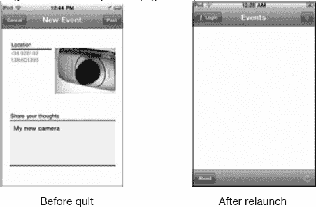
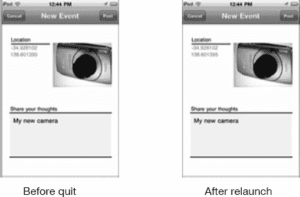
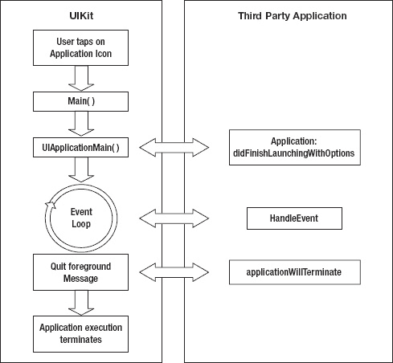
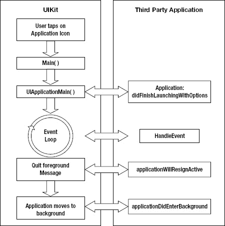
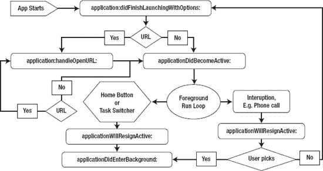
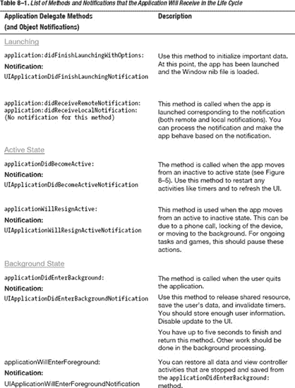
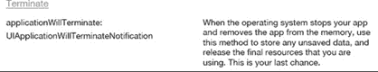
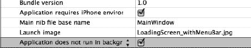
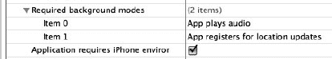
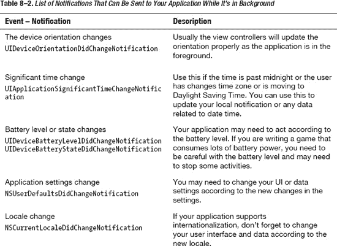

# 集成多线程与高效内存使用以提升多任务应用性能

在本章中，你将学习：

- Apple 对多任务的理解。
- 多任务生命周期以及如何处理其利弊。
- 不同的后台服务，例如：
  - 音频
  - VOIP
  - 定位
  - 后台处理
- 为使你的应用良好地支持多任务，你需要了解的内容。

在本章中，你将学习如何利用 iPhone 的多任务处理能力，使得应用程序能够在用户无感知的情况下在后台处理数据。这必须与尽可能少地消耗 CPU 处理时间或内存相平衡；否则，你可能会严重影响电池寿命，或者更糟——被 iOS 系统终止。


### iPhone 中的多任务是什么？

从用户角度看，多任务意味着她同时使用多个应用程序，并可以随意从一个应用切换到另一个。在 iOS 3.2 及更低版本中，当用户退出应用时，应用会关闭，再次打开时需要重新加载。这会导致两个问题：等待时间长，并且应用会忘记用户刚才的操作（参见图 8–1）。



**图 8–1.** *旧版 iOS 中应用在用户退出并重新打开时的行为*

自 iOS 4.0 起，应用不再从头加载，因此用户在不同应用间切换时不会花费太多时间。苹果希望用户感受到的多任务功能，其强大程度能与桌面应用媲美。从开发者角度来看，应用实际上被置于后台，并且所有状态都被保存下来。如图 8–2 所示，当用户再次打开应用时，状态和数据会快速加载并恢复到先前的位置。



**图 8–2.** *iOS 4.0 中应用在用户退出并重新打开时的行为*

### 多任务生命周期

了解旧版 iOS 的进程对你很有帮助，这有助于你理解 iOS4 及以上版本的当前机制。我将首先解释多任务功能出现之前的旧机制。应用通过调用 `application:didFinishLaunchingWithOptions:` 启动，然后运行事件循环以捕获所有事件并显示 UI（参见图 8–3）。当用户退出应用时，整个应用关闭，并调用 `applicationWillTerminate` 方法。下次用户打开应用时，会再次调用 `application:didFinishLaunchingWithOptions:` 方法。



**图 8–3.** *旧版 iOS 环境下的应用生命周期*

iOS4 要求更复杂的实现，而且很容易误解整个过程。如图 8–4 所示，当用户退出应用时，它进入后台，并调用 `application:didEnterBackground` 方法。当用户能看到应用运行时，应用处于前台状态；用户看不到应用时，它处于后台状态。当应用重新启动时，会涉及许多方法和通知，你必须了解应用的不同状态才能正确响应这些通知。以下是需要了解的应用状态：

- 未运行：从未打开，或者打开后已终止。
- 非活跃：应用在前台但未接收事件，例如用户锁定屏幕时。
- 活跃：应用在前台并正在接收事件。



**图 8–4.** *iOS4 的应用生命周期*

开发者经常混淆最后两种状态：后台和挂起。后台状态发生在挂起状态之前。当用户退出应用或跳转到另一个应用时，应用会进入后台状态。它会在后台状态停留一小段时间，之后应用被挂起。这段时间的长短取决于应用及其在后台想执行的操作。我将更详细地解释应用在此状态下能做什么。

有两种主要情况会导致应用生命周期不同。第一种情况是用户因接听电话或操作系统其他中断而退出应用。第二种情况是用户按下 Home 键，应用进入后台。每种情况都有其自身的应用生命周期。



**图 8–5.** *两种不同情况的示意图：电话中断与 Home 键*

如图 8–5 所示，在第一种情况下，当用户接到电话或短信时，应用通过 `applicationWillResignActive:` 方法进入非活跃模式。如果用户选择 `No`（不接听电话），则调用 `applicationDidBecomeActive` 方法；否则，调用 `applicationDidEnterBackground` 方法。因此，在 `applicationDidBecomeActive` 部分，你可能不需要重新加载所有数据和视图。与点击 Home 键的情况相比，你应谨慎处理这一部分。

当用户按下 Home 键时，应用直接进入后台，并调用委托方法 `applicationDidEnterBackground:`。

#### 多任务处理程序方法

图 8–4 和 8–5 向你展示了生命周期中某些方法被调用的时机。表 8–1 提供了在应用委托和其他视图控制器类中需要处理的完整方法列表，以便正确响应生命周期事件。





**注 1**

要接收事件通知，你的视图控制器或对象可以像以下代码片段所示进行注册：

```
[[NSNotificationCenter defaultCenter] addObserver:self selector:@selector(someMethod:)
name:UIApplicationDidBecomeActiveNotification object:nil];
```

不要忘记清理工作！在 `dealloc` 中，记得移除观察者，如下所示：

```
[[NSNotificationCenter defaultCenter] removeObserver:self];
```

方法 `someMethod:` 可以（但不是必须）接受一个 `NSNotification` 作为参数。在这个 `NSNotification` 内部，你可能会找到更多用户信息或需要处理的数据。你可以像往常一样处理这个 `NSNotification`；这里没有什么特别的。

**注 2**

- 无论用户是首次启动你的应用，还是从后台再次启动，都会调用 `applicationDidBecomeActive:` 方法。
- 首次启动时会始终调用 `applicationDidFinishLaunching:` 方法，但从后台启动时不会调用。
- 当应用从后台返回前台时，始终会调用 `applicationWillEnterForeground:` 方法。

你可以利用这些事实将多任务功能集成到你的应用中，从而正确响应应用的不同状态。

#### 多任务的收益与成本

如果你不想在应用中使用多任务功能，该怎么办？为了确保应用工作正常，需要维护所有这些不同状态和复杂代码，这有哪些收益和成本呢？

使用多任务功能有很多好处。以下是两点：

- 用户可以继续使用应用的现有状态，而无需从头开始导航。
- 你的应用可以与后台服务并行工作，例如从互联网下载数据、播放音频或接收 GPS 位置通知。

如你所知，在整个多任务生命周期中，你需要付出一些代价：

- 如之前所示，遍历应用生命周期时逻辑更加复杂。
- 你的应用可能被强制在后台退出，导致应用数据不一致。由于这种不一致性，当用户重新打开应用时，你的应用可能会崩溃。

因此，在某些情况下，你可能不想在应用中使用多任务功能。在这种情况下，你可以配置 `info.plist` 文件来禁止使用多任务功能。步骤如下：

- 打开你的 `info.plist` 文件。
- 添加键 `UIApplicationExitsOnSuspend` 或选择 `Application does not run in background.`
- 将新键设置为 `YES` 或勾选复选框。

你可以在图 8–6 中看到这一点。



**图 8–6.** *如何设置无多任务选项*


### 后台服务

如前面几节所示，有许多服务可以在后台运行，以处理数据并向用户提供服务。以下是在 iOS4 中可以在后台执行的操作列表：

*   **音频**：你的应用可以在后台播放音频。
*   **隐私保护**：当你的应用被重新启动时，让操作系统显示一个启动画面。如果你的应用正在显示一些敏感信息，这会很有用。
*   **定位**：你的应用可以在后台接收显著的位置变化。
*   **网络电话（VOIP）**：用户可以在你的应用处于后台时拨打电话。
*   **本地通知**：你的应用可以请求系统安排在特定时间向用户弹出消息。
*   **任务完成**：你的应用可以向系统请求额外的时间来完成给定的任务。这是一个重要的特性，我将在本章后面更详细地介绍。

这些是特定的服务，可以通过利用 iOS 的多任务处理功能来帮助你加速程序。音频和网络电话并不会加速你的应用，但它们有助于提升用户体验，并使你的应用更易用。如果使用得当，定位、任务完成和本地通知都是提升应用性能的好工具。考虑到定位是移动技术中最强大的功能之一，许多应用现在都想集成它，以便更好地服务用户。

#### 音频服务

在后台启用音频服务的最简单方法是在 `info.plist` 中包含一个键，然后正确设置音频配置，以便在你的应用进入后台后，音频能继续播放。

你需要添加一个名为 `UIBackgroundModes` 的新键，其值为 `audio`，如 图 8–7 所示。结果将在数组中显示“Required background modes”。


**图 8–7.** 设置音频在后台播放。

如果你查看苹果的文档，它并没有提及任何关于配置音频设置以使其持续播放的内容。许多开发者对此有抱怨，所以你应该注意这个问题。你需要添加以下代码片段，然后才能播放音频：

```
[[AVAudioSession sharedInstance] setCategory:AVAudioSessionCategoryPlayback error:nil];
AVAudioPlayer *backgroundMusicPlayer = [[AVAudioPlayer alloc]
                                           initWithContentsOfURL:YOUR_AUDIO_URL
                                                           error:nil];
[backgroundMusicPlayer play];
```

**注意：** 你需要添加 AVFoundation 框架并在你的文件中导入它，才能使这段代码编译通过。

这种方法的问题是，你只能在后台播放一首歌。那首歌播放完毕后，你的应用就会进入后台模式。要在后台播放一个歌曲列表，你必须编写代码来实现一个长时间运行的后台任务。

有时你想停止在后台下载/流式传输音频/视频，以节省用户的流量。你可以使用 `applicationDidEnterBackground` 方法来停止所有视频/音频流传输，如下所示：

```
- (void)applicationDidEnterBackground:(UIApplication *)application {
  [backgroundMusicPlayer stop];
}
```

#### 显示启动画面

当你的应用进入后台时，iOS 环境会对其当前视图进行截图。当用户重新启动你的应用时，在应用仍在加载的过程中，iOS 环境会显示这张截图。这会在用户心中营造一种你的应用加载非常快速的错觉，从而提升用户体验。然而，在某些情况下，你可能希望在数据完全加载之前隐藏一些敏感信息。以下是一个支持此功能的简单方法（你也可以通过在 `applicationDidEnterBackground` 中直接操作你的视图来实现，但过程会更复杂）：

```
- (void)applicationDidEnterBackground:(UIApplication *)application{
    if (appHasSecret) { // 如果你的应用有需要隐藏的内容
        UIImageView *splashView = [[UIImageView alloc] initWithFrame:CGRectMake(0,0, 320, 480)];
        splashView.image = [UIImage imageNamed:@"YOUR_DEFAULT_PICTURE"];
        [window addSubview:splashView];
    }
}
```

你的 `Default.png` 可以是用户在等待你的应用加载视图和数据时所能看到的任何图像。这样，当用户重新启动你的应用时，他会先看到这个“默认图像”，然后才看到你的视图。

#### 定位服务

如今基于位置的社交网络非常热门，许多服务都需要用户的位置。问题在于，用户不会为了让你了解她当前的位置而一直保持应用打开。因此，苹果为你提供了一种机制，使你的应用在后台时也能获取最新位置。

要获取用户的当前位置，你的应用可以选择以下几种实现方式：

*   **使用标准定位服务**：你的应用可以随时向 iOS 环境请求当前用户的位置。这种方法非常耗电，并且应用查询数据需要时间。另一个问题是，如果应用在后台运行，则无法使用此服务获取位置。
*   **注册显著位置变化**：你的应用也可以注册位置事件和通知。当用户的位置发生显著变化时，你的应用会收到通知。当设备从一个基站移动到另一个基站时，通常会触发此调用。这种方法更为被动，但可以节省电量。这种方法的另一个好处是，即使你的应用在后台，iOS 也会通知你的应用。
*   **连续后台位置更新**：这种方法对你的应用来说是最好的，但对用户的电池续航来说是最差的。无论你的应用是在后台还是前台，它都可以持续从 iOS 获取位置更新。


##### 标准定位服务

这是一种大多数应用都会使用的常见定位服务，因为在旧版 iOS 中就已存在。要使用此服务，你需要在调用 `startUpdatingLocation()` 之前设置精度和过滤属性。如果你没有进行配置，iOS 将直接使用以下默认配置：

```
CLLocationManager *locationManager = [[CLLocationManager alloc] init];
locationManager.delegate = self;
[locationManager startUpdatingLocation];
```

**注意：** 你需要在文件中添加 CoreLocation 框架并导入 `CoreLocation`。`self` 对象所代表的类必须实现 `CLLocationManagerDelegate` 协议。

这段代码非常简单。你可以设置一些配置参数来获取更准确的定位数据。这些属性都属于 `CLLocationManager` 类：

```
@property(nonatomic, weak) CLLocationAccuracy desiredAccuracy
```

设置定位检测的精度级别。默认值为最佳；但如果你的应用可以接受较低的精度级别，建议使用后者。“最佳”配置的问题在于，请求定位会消耗更多时间和电量。它提供了以下精度级别（这些名称不言自明）：

*   `kCLLocationAccuracyBestForNavigation`（导航最佳精度）
*   `kCLLocationAccuracyBest`（最佳精度，默认值）
*   `kCLLocationAccuracyNearestTenMeters`（最近十米精度）
*   `kCLLocationAccuracyHundredMeters`（百米精度）
*   `kCLLocationAccuracyKilometer`（千米精度）
*   `kCLLocationAccuracyThreeKilometers`（三千米精度）

`CLLocationManager` 类的另一个可设置属性是：

```
@property(nonatomic, weak) CLLocationDistance distanceFilter
```

你可以设置 `kCLDistanceFilterNone`（默认值）或任何你想要的 double 值。该属性指定了用户需要移动多远的距离（以米为单位），你的应用才会收到新位置的更新通知。`kCLDistanceFilterNone` 表示只要用户发生移动，你的应用就会收到所有通知。

本节仅描述了如何向操作系统请求位置更新。关于返回值以及后续操作的细节将在后面简要介绍。

##### 重大位置变化

有两种不同的机制可以基于特定条件进行更新：

*   当用户位置发生重大变化时。
*   当用户进入或离开特定区域时。

第一种机制与标准位置更新非常相似，都是通过初始化对象然后进行配置来实现。唯一的区别在于，这里需要调用 `startMonitoringSignificantLocationChanges()`。

一个重要提示：如果你使用这种重大位置变化机制，当新的位置数据到达时，你的应用将被唤醒或启动。即使你的应用已经被挂起或终止，这种情况也会发生。由于此机制可以唤醒你的应用，你无需处理后台处理代码，也不必担心丢失位置数据。然而，你的应用在后台处理这些位置数据的时间很有限。你的应用可能没有足够的时间处理大量的网络数据，但你仍然可以完成许多其他有用的工作。

在介绍区域机制之前，以下代码将说明如何接收位置更新并处理这些位置数据：

```
// 来自 CLLocationManagerDelegate 协议的代理方法。
- (void)locationManager:(CLLocationManager *)manager
    didUpdateToLocation:(CLLocation *)newLocation
    fromLocation:(CLLocation *)oldLocation {

    NSLog(@"latitude %f, longitude: %f\n",
            newLocation.coordinate.latitude,
            newLocation.coordinate.longitude);

}
```

如你所见，你只需要包含一个代理方法 `(void)locationManager:didUpdateToLocation:fromLocation:`。在 `newLocation` 对象中，有两个重要的数据点：`latitude`（纬度）和 `longitude`（经度）。

基于区域的机制与重大位置变化机制类似，你需要通过指定中心和半径来注册一个特定的圆形区域。代码块同样十分简单：

```
  // 创建区域并开始监控。
  // radius 以米为单位
   CLRegion* region = [[CLRegion alloc]
  initCircularRegionWithCenter:destinationLocation.coordinate
                        radius:radius identifier:@"YOUR_REGION_ID"];

  [self.locationMananager startMonitoringForRegion:region
                   desiredAccuracy:kCLLocationAccuracyHundredMeters];
```

通常，此机制会与 MapKit 集成，以便用户可以注册他们的目的地，并在他们到达该区域附近时收到通知。

你还需要实现以下两个方法来接收与区域相关的事件：

```
- (void)locationManager:(CLLocationManager *)manager didEnterRegion:(CLRegion *)region
- (void)locationManager:(CLLocationManager *)manager didExitRegion:(CLRegion *)region
```

##### 持续后台位置更新

最后一种机制适用于需要从 iOS 环境获取持续更新的应用程序。对于那些即使在后台或未运行时也需要每次新位置更新的应用来说，这是一种很好的机制。要实现此功能，你需要将 `UIBackgroundModes` 键的值设置为 `location`，这与上一节介绍的后台音频播放类似。



**图 8–8.** *应用注册位置更新*

如图 8–8 所示，你的应用现已注册了位置更新。这种机制有许多优点和缺点。以下是其中两个。

优点：

*   你可以频繁地获取位置服务更新，即使是微小的位置变化。

缺点：

*   它会大量消耗用户的电池电量。

### 本地通知

这是 iOS4 的一项新功能，允许应用在特定时间设置通知。此功能对于基于时间的应用（如闹钟或日历）非常有用。如果用户需要等待特定时间以执行某些特定事件，这将非常方便。这些事件可以基于用户设置或服务器设置。这也有助于将用户的注意力吸引到应用上。

你需要创建一个新的本地通知对象，并正确设置日期和时间，如下所示：

```
// 创建一个新通知。
UILocalNotification* alarm = [[UILocalNotification alloc] init];
if (alarm) {
   alarm.fireDate = theDate;
   alarm.timeZone = [NSTimeZone defaultTimeZone];
   alarm.repeatInterval = kCFCalendarUnitDay;
   alarm.alertBody = @"Time to wake up!";
   [[UIApplication sharedApplication] scheduleLocalNotification:alarm];
}
```

### 网络语音电话 (VOIP)

网络语音电话主要用于 Skype 等语音聊天应用。这是新 iOS4 中多任务处理的另一项功能；然而，它超出了本章的讨论范围，因此我在此不作介绍。大多数应用完全不需要使用 VOIP。


### 后台执行

后台执行是 iOS 开发人员的一项重要技术。这项技术自 iOS4 起推出，帮助开发者争取更多时间来完成关键任务，因此应用可以在一定程度上更好地控制其生命周期。

例如，假设你正在向服务器上传图片/视频。在上传过程中，用户突然退出应用，导致图片只上传了一半。下次用户回到应用时，她将不得不等待整个上传过程重新开始。另一种选择是强制用户等待图片上传完成后再关闭应用，但这并非良好的用户体验。

在另一种场景中，有一些来自服务器的重要帖子或下载任务需要确保完成。后台执行对于帮助开发者处理这些任务至关重要。你可以将上传过程封装在后台任务中，并启动该任务，具体如下：

```
UIApplication* app = [UIApplication sharedApplication];
UIBackgroundTaskIdentifier bgTask = [app beginBackgroundTaskWithExpirationHandler:^{
  [self.imageUploadService uploadImage:image];
  [app endBackgroundTask:bgTask];
}];
// 启动长时间运行的任务并立即返回。
dispatch_async(dispatch_get_global_queue(DISPATCH_QUEUE_PRIORITY_DEFAULT, 0), ^{
  // 执行与该任务相关的工作。
  [app endBackgroundTask:bgTask];
});
```

如代码所示，要启动一个新的后台任务，你需要调用 `beginBackgroundTaskWithExpirationHandler:` 方法，该方法会返回一个后台任务标识符，你可以在之后使用它来结束该后台任务。通过 `beginBackgroundTaskWithExpirationHandler:` 方法，你告知 iOS，即使应用被移至后台状态，在应用被挂起之前，你希望这个任务能够完成。`endBackgroundTask:` 方法则告知 iOS，你的应用任务已完成，使其能够在必要时将你的应用移至挂起状态。如果应用始终处于前台，那么这些调用不会产生任何效果，因此使用它们并无坏处。

你需要知道，后台任务并不能在后台无限期地运行；换句话说，应用必须在有限的时间（通常最多 10 分钟）内完成任务。否则，iOS 会不等任务完成就直接挂起应用。`beginBackgroundTaskWithExpirationHandler:` 中的过期处理器部分是一个代码块（就像一个没有名称的方法），用于指定在任务超时时的清理代码。作为后台任务执行的代码不得进行任何 UI 更新或 OpenGL 调用（因为应用已在屏幕之外）。

你可以在代码的任何位置使用 `beginBackgroundTaskWithExpirationHandler:` 方法来启动一个新的后台任务。我用它来封装图片上传过程，确保即使应用被用户立即关闭，上传过程也能成功完成。许多人还结合 `applicationDidEnterBackground:` 方法来使用它，以便让应用运行更长时间，完成所有最终的计算或网络处理。

如前所述，你也可以使用后台服务来播放音频。使用这项后台服务，你可以播放一个歌曲列表，而不仅仅是单首歌曲。你可以使用以下代码框架来实现这一点；请注意，你可能需要补充其他必要的代码部分才能使其正常工作。你可以将此作为一个练习，以更好地理解后台任务的工作方式。

```
UIBackgroundTaskIdentifier bgTaskId;
// AVAudioPlayer *backgroundMusicPlayer
if ([backgroundMusicPlayer play]) {
  bgTaskId = [[UIApplication sharedApplication] beginBackgroundTaskWithExpirationHandler:NULL];
}

- (void)audioPlayerDidFinishPlaying:(AVAudioPlayer *)player successfully:(BOOL)success
{
    UIBackgroundTaskIdentifier newTaskId = UIBackgroundTaskInvalid;

   if (self.haveMoreAudioToPlay) {
        newTaskId = [[UIApplication sharedApplication] beginBackgroundTaskWithExpirationHandler:NULL];
        [self playNextAudioFile];
    }

    if (bgTaskId != UIBackgroundTaskInvalid) {
        [[UIApplication sharedApplication] endBackgroundTask: bgTaskId];
    }

    bgTaskId = newTaskId;
}
```

正如你在代码中看到的，通过使用后台服务，你可以注册委托事件；然后在那个委托方法内部，你可以简单地播放下一个文件。（请注意，你的应用播放音频的总时长最多为 10 分钟。）我希望这能有效地演示如何高效地使用后台服务。

### 在后台运行时的注意事项

以下是 Apple 提供的一份简短清单，用于确保你的应用在后台能良好运行且不影响其他应用：

-   将已占用的内存降至最低水平。
-   释放所有共享资源，例如日历。
-   适当响应应用生命周期事件。
-   不要更新你的 UI 或调用消耗 CPU 和电池过多的代码。
-   正确地在后台运行。
-   响应后台的系统变化。

如果你的应用能够严格遵循这些指南，它将运行良好，并充分利用多任务处理特性。它也不会在后台被系统终止。在后台保持应用处于活跃状态以便快速重新启动，是良好用户体验的重要组成部分。

#### 内存

如前所述，在 iOS4 中，你的应用可以在后台服务中运行，并且在应用处于后台时仍会驻留在 RAM 中。然而，RAM 系统有其限制，在像 iOS 这样资源有限的环境中，这些限制甚至更为严重，正如你在第 7 章中所了解到的。因此，Apple 对应用在后台时的内存使用有严格的政策。由于会有多个应用同时驻留在后台，这些应用可能会迅速消耗大量内存。当设备内存耗尽时，iOS 会找出消耗内存最多的应用并首先将其终止。

为了减少内存使用，你需要清除内存中的缓存，尤其是图片缓存。你可能还需要移除不必要的子视图，因为当你的应用进入后台时，这些子视图也会被保存到内存中。实际上，你需要保存关键数据并清除所有不必要的数据，以避免你的应用被 iOS 挂起。

#### 共享资源

有些应用程序会共享数据，例如日历数据库和通讯录。如果你的应用在运行时使用了这些资源，那么在它进入后台时就必须停止使用这些资源。如果系统发现你的应用在进入后台时正在使用或尚未释放这些共享资源，它会被立即终止。原因在于所有这些共享资源都属于前台应用。


### 应用程序生命周期事件

如前所述，你需要负责正确处理和响应应用程序的生命周期事件。如果你不进行测试以确保生命周期正确无误，就可能面临数据丢失或行为异常的风险。例如，你需要在应用程序进入后台前保存数据，并在应用切换到非活跃状态时暂停当前流程。

你不能过分依赖后台的内存存储。因为当 iOS 内存不足时，它可以随时挂起你的应用，而你可能没有机会对此事件做出反应，所以在进入后台之前，你应当始终保存所有必要的数据。

你或许只有很少的时间在后台运行，但 iOS 同样可以在内存或 CPU 周期耗尽时随时终止你的后台进程。因此，在后台进程中，你需要快速行动，并在可能的情况下使用多线程。你是在与 iOS 的时间限制赛跑。

此时，当应用进入后台时，iOS 会为你的视图拍摄一张快照。这样做的目的是在视图和数据加载期间，向用户短暂显示这张快照，从而提升用户体验。但是，你应该隐藏那些不想被截取到屏幕快照中的敏感信息，例如出生日期、密码或用户的私人照片。

### 后台的用户界面更新与进程

当应用程序处于后台时，一条通用规则是避免不必要的进程，而 UI 更新就是其中之一。如果你在后台需要额外的时间或更多的 CPU 处理能力，你可能需要明确请求权限。以下是一份简要清单，如果你的应用处于后台，应当处理这些事项：

*   不要在你的代码中调用 OpenGL ES。
*   取消所有与 Bonjour 相关的服务。
*   处理应用程序后台运行时出现的任何连接或网络故障。你可以稍后在应用重新变为活跃状态时恢复这些连接。
*   避免更新窗口和视图。用户无法看到你的视图，因此没有理由更新它们。你的应用程序不应在后台更新窗口和视图，因为这会消耗 CPU 周期，并可能影响前台应用。
*   在进入后台前清理所有警告或弹出消息，以免造成用户困惑。你应该关闭这些警告，并在必要时稍后再次显示它们。
*   在后台执行最小化的工作。尽量使用 Apple 提供的服务，例如后台音频或监控重要的位置变化。

### 系统变更通知

当你的应用程序处于后台时，系统可能会经历许多变化，并且会通知你这些变化，因此你应该为此做好准备。这些变化包括设备方向、时间、电池电量或系统区域设置的变更。表 8–2 列出了重要的通知。



当你的应用从后台恢复时，你会收到一个通知队列。你可能需要快速处理这些通知，尤其是设置和区域设置的变更，因为用户总是希望这些变化能立即生效。

## 处理不同 iOS 版本

据估计，大约有 5% 到 20% 的设备仍在使用 iOS3，包括 iPad 1、旧款 iPod 和 iPhone 设备。那么，如何确保你的应用在 iOS3 上运行时不出问题呢？

你需要在 `applicationDidTerminate` 中存储所有数据和用户信息，并在 `application:didFinishLaunchingWithOptions:` 方法中正确地重新构建所有数据。因为在 iOS4 中，`applicationWillTerminate:` 方法仅在应用程序被终止时调用，所以你这样做是没问题的。

旧系统不支持后台执行，因此你不能依赖这种机制来保存用户数据。如果你有任何重要的数据需要保存、上传或从服务器下载，你可以在终止方法或启动方法中完成这些操作。

在旧设备上，你可以尝试通过归档方法创造出多任务（或快速应用切换）的体验。在这种方法中，你在应用程序关闭时保存所有视图控制器的状态，并在应用重新启动时恢复它们。这是一个复杂的过程，我不建议你花费宝贵的时间和精力在上面。

如果你的应用程序之前是为 iOS3 发布的，那么你需要支持这两个 iOS 版本；否则，你的用户可能会反应不佳，并在 Apple App Store 中给你一星评价。如果你的应用是全新发布的，你可以直接针对 iOS4 开发，无需顾虑。

## 总结

多任务是 iOS4 中的一个新概念。大多数情况下，你需要跟踪应用的状态和生命周期，以确保你的应用程序响应正确。

你可以通过修改 `Info.plist` 文件中的某些属性，选择从应用程序中移除多任务支持。你也可以通过在 `Info.plist` 文件中添加 `UIBackgroundModes` 键，来为某些后台服务请求特殊权限。

你可以请求额外的时间来处理重要的计算和服务（最多 10 分钟）。你需要清理所有资源和缓存数据以减少内存占用；否则，iOS 可能会在后台终止你的应用程序。这通常意味着你失去了多任务应用的全部优势。

**练习**

1.  编写一个在后台播放音频的应用程序。
2.  编写一个监控用户重要位置变化的应用程序。
3.  编写一个在应用程序进入后台前将数据发布到网络服务的应用程序。你可以将代码放在 `applicationDidEnterBackground:` 中。

