# 使用原生 C/C++ 提升性能

在本章中，你将学习：

*   将 C/C++ 代码集成到你的 iPhone 应用程序中的好处和代价。
*   C 语言编程的基本概念
    *   数据类型
    *   指针
    *   内存管理
*   C++ 编程的基本概念
    *   类
    *   内存管理
    *   继承
    *   模板
*   如何通过一个使用具有 C API 的数据库 SQLite 的真实示例进行实践。
*   如何将 C++ 和 Objective-C++ 集成到你的 iPhone 应用程序中。

在本章中，你将学习使用 C/C++ 进行底层编程，这对于高性能应用程序至关重要。确实，Objective-C 是 C 的超集，也是一种原生编程语言，但 Objective-C 在 C 语言之上添加了一层封装，这降低了性能。如果你曾接触过游戏和动画，你就会知道使用 OpenGL 配合 C/C++ 能提供更好的性能。

Apple 也支持 C++。你大部分的基础应用程序都不需要接触任何 C/C++ 代码；但是，当你的应用需要更高性能时，你应该考虑这个选项。此外，你不需要编写大量的 C/C++ 代码，但你需要理解 C/C++ 代码才能正确调用库。你可能还需要修改开源库以满足自己的需求。

由于 Objective-C 是 C 的超集，在 C 中能做的一切，在 Objective-C 中也能做到。两者存在语法差异和新概念，但我将在本章中介绍它们。C++ 和 Objective-C 也有很多不同的概念，因此学习 C++ 可能比学习 C 更难。

实际上，Objective-C 的概念是有限的，你在 iPhone 开发环境中看到的大部分类和框架支持都来自 Cocoa Touch。为简单起见，我将使用 Objective-C 作为 Objective-C 及来自 Cocoa Touch 框架的所有支持的统称。


## 收益与成本

在深入探讨 C/C++编程的思想之前，我想快速分析一下在 iOS 应用中使用 C/C++代码的收益与成本。

收益：

-   C/C++编写了一些专用库，例如动画库或音频库。这些库通常使用 C/C++编写，以实现高性能和可移植性。
-   你的应用程序可以相对轻松地移植到 Android 平台。
-   通过使用 C/C++代码，你可能会提升应用的性能。

成本：

-   C/C++的语法与 Objective-C 不同，将它们混合使用会使代码更难理解。
-   C/C++的内存管理机制与 Objective-C 不同，因此你需要小心内存泄漏或应用崩溃的问题。

因此，在了解了收益与成本之后，你就可以决定是否要将 C/C++集成到你的 iPhone 应用中。即使你只是使用另一个开源库或编写自己的代码，你也应该先理解 C/C++。许多出现的问题可能非常隐蔽，以至于 iPhone 的检测工具也难以帮上大忙。花一个小时集成一个库很容易——但随后可能要花一整天来修复其中的一个 bug。

Objective-C 已经是一种原生编程语言，所以如果你试图用 C/C++编写所有代码，可能不会获得显著的性能提升。然而，有许多用 C/C++编写的高性能库，你可以充分利用并将其集成到你的应用中。

## 基础 C 和 C++编程

我将通过一些 C/C++的基础课程来引导你，让你对这门语言有一个扎实的基本理解。Objective-C 与 C/C++有许多共同之处，因此你在本章中可能不需要学习太多新概念。了解 C/C++也能帮助你写出更好的 Objective-C 代码，因为 Objective-C 是 C 的超集。

### C 编程

C++也是 C 的超集，因此你将先学习如何使用 C，然后在下一节中学习 C++。我仅讨论 C 编程中那些在 iPhone 编程中不常用的部分。

#### 基本数据类型与函数

C 的数据类型非常少：整型、浮点型、双精度浮点型以及字符型。每种数据类型使用的位数在不同操作系统中是不同的，甚至在 iOS 系列中也是如此。以下是每种数据类型取值范围的一个示例，但你不应过分依赖这些信息来做重要决策：

-   `char`：-128 到 127
-   `int`：-32768 到 +32767
-   `float`：3.4e-38 到 3.4e+38
-   `double`：1.7e-308 到 1.7e+308

有一些限定符可以应用于这些基本类型；例如，`short`和`long`可以应用于`int`。

```
short int sh;
long int counterLong;
```

这些限定符的目的是为`int`提供更短或更长的取值范围；例如，`short`可以是 16 位，而`long`可以是 32 位。iOS 编译器保证`short`不会长于`int`，而`int`不会长于`long`。

你还可以应用`signed`和`unsigned`限定符。如果你未指定任何`signed`或`unsigned`限定符，编译器将默认使用`signed`。使用`unsigned`限定符可以让你拥有双倍的数据范围。例如，`int`的取值范围可以是 0 到 65535。

通常你只需要使用`int`。如果你需要存储一个非常大的整数，请添加`long`限定符。使用`short`代替`int`是一种非常微小的内存优化，你完全可以忽略它。

**注意：**如果你使用 Objective-C，应该使用`NSInteger`、`NSUInteger`和`CGFloat`。这些是苹果公司提供的内置包装器，用于封装实际底层数据结构。

C 语言没有布尔数据类型，但 Objective-C 有。在 C 语言中，如果布尔表达式返回真，则值为 1；否则为 0。例如，`2 == 2`会返回 1，而`2 == 3`会返回 0。为了代码可读性，你可能需要定义两个布尔值，如下所示：

```
#define TRUE 1
#define FALSE 0
int t = (1 == 1);
if (t == TRUE) {
   // 在这里执行你的工作
}
```

尽管 C 函数看起来与 Objective-C 方法不同，但你仍然需要返回值并接受参数。以下是两个 C 函数的示例：

```
int pi_value() {
   return 3.14;
}

int add_number(int n1, int n2) {
   return n1 + n2;
}
```

#### 指针

指针是 C 编程中的一个重要概念。在 Objective-C 中，你通常会在其中看到相同的指针概念和语法，例如`NSMutableArray *myArray = [NSMutableArray array]`。然而，你通常不需要在底层处理内存，因此 Objective-C 中的指针概念作为对象来理解很容易。但在 C 语言中，你可以做更多的事情，指针的概念也更复杂。

**内存指向概念**

主内存可以被视为一个由单元格组成的数组，每个单元格是一个字节，每个数据项都存储在一组单元格内。一个`char`存储在一个单元格中，一个`int`可以存储在两个单元格中，而`long`可以存储在四个单元格中。每个单元格都可以编号，因此每个变量都会有一个存储数据的内存地址。


**图 9-1.** *内存指针概念*

指针是一个变量，它可以保存另一个变量的内存地址。例如，图 9-1 中变量`p`内部的数据存储了变量`c`的内存地址。因此，如果说`p`指向`c`，你可以用语句`p = &c;`来表示。`&`运算符返回`c`的内存地址并将其赋值给`p`。`&`运算符仅适用于变量、数组和内存中的对象，不适用于表达式或常量。另一个指针运算符是`*`；当它应用于指针时，该运算符返回给定地址处的内存内容。这个过程通常被称为解引用。以下是一些展示其工作原理的源码：

```
int x = 1, y = 2, a[3];
int *ip; // ip 是一个只能指向整型的指针

ip = &x; // ip 现在指向 x
y = *ip; // y 现在是 1，因为你返回了 ip 指向的数据
*ip = 0; // x 现在是 0，我将 p 指向的数据设置为 0
ip = &a[0]; // ip 现在指向数组 a 的第一个元素
```

**传值与传引用**

在 C 编程中，你可以通过值或引用将参数传递给函数。传值是向函数传递参数的常规方式。

```
int add(int t1, int t2) {
  return t1 + t2;
}
```

然而，如果你想在下面的`swap`函数中交换两个变量的值，传值将不起作用：

```
void swap(int x, int y) {
   int temp;
   temp = x;
   x = y;
   y = temp;
}

int main() {
  int x = 3, y = 4;
  swap (x, y);
}
```

问题在于，方法返回后，变量内部的值不会被交换。当调用`swap`方法时，`x`和`y`内部的值被复制并作为`swap(3, 4)`传入函数。因此，原始变量不会改变。

如果你想改变存储在变量`x`和`y`中的数据，你需要通过引用传递。通过引用传递时，传入的是`x`和`y`的内存地址。有了`x`和`y`的内存地址，你就可以简单地更改存储在这些地址中的值。

```
void swap(int *px, int *py) {
  int temp;
  temp = *px; // 临时存储 x 内存中的值
  *px = *py; // 设置 x 内存中的值
  *py = temp; // 设置 y 内存中的值
}

int main() {
  int x = 3, y = 4;
  swap (&x, &y);
}
```

图 9-2 能让你更好地理解这个过程。

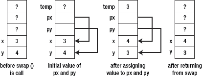

**图 9-2.** *传引用*


#### 高级数据类型

C 语言中有一些高级数据结构：`array`、`string` 和 `struct`。这些在 Objective-C 中均受支持，但应谨慎使用，因为它们会使代码在未来更难理解和维护。Objective-C 中所有这些数据结构都有相应的封装器，以使代码更加面向对象。然而，在许多情况下，你仍需要使用 C 语言的数据结构来提高性能或处理调用 C/C++ 库时的结果。

##### 数组

在 Objective-C 中，你通常会使用 `NSArray` 或 `NSMutableArray` 对象来表示数组。但在 C 语言中，没有这些概念，因此你需要完全专注于原始的数组概念。要在 C 语言中定义数组，你需要预先知道数组的长度，并按如下方式定义：

```
int a [10]; // 一个最多包含十个元素的数组
```

`a[0]`、`a[1]`、`a[2]` … `a[9]` 分别是数组的第一、第二……第十个元素。

指针与数组关系密切。

```
int *pa;
pa = &a[0];
```

这段指针赋值代码会将 `pa` 设置为指向数组的第一个元素。如指针部分所述，赋值语句 `x = *pa` 会将 `x` 设置为 `a[0]` 中包含的值。

你可以使用简单的算术运算符将指针移动到数组内的不同元素：`(pa + 1)` 将返回下一个元素的地址，而 `(pa - 1)` 将返回前一个元素的地址。图 9–3 展示了数组内部的指针算术运算。

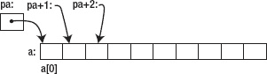

**图 9–3.** *指针算术运算*

这些计算不依赖于数组 `a` 内部变量的类型或大小。因此，`(pa + i)` 将始终返回第 `i` 个元素的地址。数组和指针之间的另一个重要关系是，你可以使用 `*(a + i)` 引用 `a[i]` 内的数据。

数组名和指针之间存在一个区别：指针是一个变量，因此 `pa = a` 和 `pa++` 是可接受的。然而，`a = pa` 和 `a++` 是不可接受的。

##### 字符串

C 语言中的字符串常量，例如 `"I am Khang"`，是一个以空字符 `'\0'` 结尾的字符数组，这样程序才能找到数组的末尾。因为字符串是字符数组，你可以轻松地将其赋值给指针。

```
char *pmessage;
pmessage = "I am Khang";
```

你可以像操作普通数组或指针一样操作字符串，例如以下源代码所示：

```
void my_string_copy (char *s, char *t) {
   while (*s++ = *t++) ;
}
```

`my_string_copy` 函数很简单；它只接受两个字符指针，并将字符串 `t`（由字符指针 `t` 表示）中每个字符的值赋给其自身的字符元素。

**注意：**当将数组作为参数传递给函数时，C 语言会自动将该数组转换为相同类型的指针。

下面是另一个使用字符数组（但未使用指针）的示例，用以说明数组与指针的可互换性：

```
int my_string_length(char *s) {
  int i = 0;
  while (s[i] != '\0') {
    i++;
  }
  return i;
}
```

##### 结构体

C 语言没有面向对象编程的概念。因此，要创建复杂的数据结构（而不是仅使用基本类型和数组），需要使用结构体。在某些 Objective-C 代码中，你甚至可以看到在需要节省内存的领域大量使用结构体。例如，`CGPoint`、`CGRect` 和 `CGSize` 都是结构体。Apple 开发者将它们定义为结构体，是因为它们在构建 iPhone 界面时被大量使用。你可以像在 Objective-C 中一样使用结构体。

```
struct point {
  int x;
  int y;
};

struct point add_point(struct point p1, struct point p2) {
  p1.x += p2.x;
  p1.y += p2.y;
  return p1;
}
```

如果将较大的数据结构传递给函数，可以考虑将指向该结构体的指针传递给函数，这样可以避免复制整个结构体（因为是通过值传递）。你可以像在其他正常情况中一样使用 `struct` 指针。

```
struct point origin;
struct point *porigin;
porigin = &origin;
printf("origin is (%d, %d) \n" , (*porigin).x , (*porigin).y );
```

##### 动态内存分配

C 语言中的内存管理与 Objective-C 既有相似之处，也有不同之处。在 C 语言中，你同样可以创建对象并为其分配内存；如果你为对象分配了内存，则需要手动取消分配/释放该对象以回收内存。Objective-C 中没有 `autorelease` 或自动释放池的概念。

要掌握 C 语言良好的内存管理机制，需要记住四个函数，如表 9–1 所示。

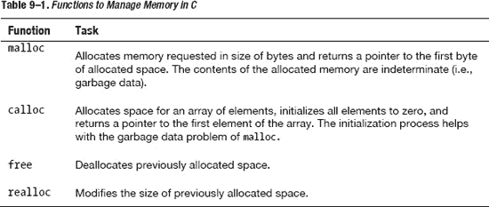

*   **`Malloc`**：你可以请求一块指定大小的内存，并返回一个 void 类型的指针。然后，你可以将此指针转换为你需要的特定类型并使用它，例如：
    ```
    my_ptr = (cast_type *)malloc(number_of_bytes); // 通用格式
    my_ptr = (int *)malloc (100  * sizeof(int)); // 分配一个大小为
         // 100 个整数的整数指针
    ```
*   **`Calloc`** 通常用于请求多个内存块，每块大小相同，然后将所有字节设置为零。
    ```
    my_ptr = (cast_type *)calloc(number_of_elements, size_of_element); // 通用格式
    my_ptr = (int *)calloc (100, sizeof(int)); // 分配一个大小为
       // 100 个整数的整数指针
    ```
*   **`Free`**：此处的内存管理机制与 Objective-C 类似：你分配的内存，需要释放。你可以使用 C 语言中的 `free()` 方法来实现。
    ```
    free(my_ptr);
    ```
*   **`Realloc`**：有时你为对象或数组分配的内存不够用，因此你可能需要借助函数 `realloc()` 来更改内存大小。
    ```
    realloc(my_ptr, 200 * sizeof(int));
    ```

**注意：**你不能再次使用函数 `malloc()`/`calloc()`，因为这会清除指针指向的内存中存储的所有数据。

##### 链表示例

是时候从理论学习中稍作休息，开始编写代码了。你将运用所学知识处理一个使用链表存储数据的问题。你已经在第 5 章中学习了 Objective-C 中的链表实现。现在，你将学习如何用 C 语言编写链表，该链表在许多情况下可以提供更高的性能。

```
#include <stdio.h>
#include <stdlib.h>

struct Node {
 int number;
 struct Node *next;
};
```

要拥有一个链表，你需要一个能够引用自身的结构体。在本例中，`Node` 结构体需要有一个指向链表中下一个结构体的链接。在 C 语言中，你可以在头文件或实现文件中声明方法接口。

```
void append_node(struct Node *list, int num);
void display_list(struct Node *list);

int main(void) {
 struct Node *list;

 list = (struct Node *)malloc(sizeof(struct Node));
 list->number = 0;
 list->next = NULL;

 append_node(list, 1);
 append_node(list, 5);
 append_node(list, 3);

 display_list(list);

 // 在此处删除列表。free(list) 不起作用
 return(0);
}

void delete_list(struct Node *list) {
  // 作为练习，由你完成
}

void display_list(struct Node *list) {
 // 遍历列表以打印出值。
 while(list->next != NULL) {
  printf("%d ", list->number);
  list = list->next;
 }

 printf("%d", list->number);
}

void append_node(struct Node *list, int num) {
 // 进入列表末尾
 while(list->next != NULL)
  list = list->next;

 // 为最后一个 Node 对象设置 next 属性。
 list->next = (struct Node *)malloc(sizeof(struct Node));
 list->next->number = num;
 list->next->next = NULL;
}
```


您可以看到，由于链表没有固定大小，您始终需要使用`malloc`来分配新元素。使用完链表后，请删除您的列表。您需要记住内存管理规则：每调用一次`malloc`或`calloc`，就需要调用一次`free`函数；否则就会发生内存泄漏。正如代码中的注释所警告的，简单地调用`free(list)`会导致程序中出现一些内存泄漏。我将把`delete_list`的实现留作您的练习。

##### 函数指针

在 C 语言中，函数并不是变量，但您可以像定义指向整型或结构体的指针一样，定义指向函数的指针。您可以将这些函数指针放入数组，并将它们作为参数传递给其他函数。这与 Objective-C 中的`selector`非常相似。

接下来，您将看一个简单的例子，通过实现一个比较方法来填充快速排序算法。`qsort`是 C 语言中的一个内置函数，它可以接受一个函数指针，并使用快速排序算法对数组进行排序。

以下是`qsort`的接口：

```c
void qsort (void *array, int number_of_elements, int size_of_element, int (* comparator)
(const void *, const void *) );
```

因此，您需要一个比较器函数，它接受两个指针并返回一个整数，指示哪个值更大。

```c
int compare (const void * a, const void * b){
  return ( *(int*)a - *(int*)b );
}
```

然后，您可以将其作为参数传递给`qsort`函数。

```c
int main (){
  int values[] = { 40, 10, 100, 90, 20, 25 };
  qsort (values, 6, sizeof(int), compare); // 在此处传入比较函数。
  return 0;
}
```

##### 位运算符

位运算符可能比加法和减法运算符稍快，并且比乘法和除法运算快得多。您可能会在库中看到大量使用位运算符的代码，尤其是在为旧微处理器编写的库中。

了解位运算符可以帮助您操作位，并在密集计算中大幅提升性能。有几个位运算符和位移运算符需要记住：`NOT`、`AND`、`OR`、`XOR`、左移和右移。

*   `NOT`是取反运算符，将位中的 0 变为 1，反之亦然。`NOT 0111 = 1000`
*   `AND`接受两个长度相等的二进制表示，并对每一对对应位执行`AND`操作。如果位 1 和位 2 都为 1，则结果为 1；否则为 0。
    ```
    0 1 0 1
    AND 0 0 1 1
      = 0 0 0 1
    ```
*   `OR`接受两个长度相等的二进制表示，并对每一对对应位执行`OR`操作。如果两者中有一个为 1 或两者都为 1，则结果为 1；否则为 0。
    ```
      0 0 1 0
    OR 1 0 0 0
      = 1 0 1 0
    ```
*   `XOR`接受两个长度相等的二进制表示，并对每一对对应位执行`XOR`操作。如果两个位不同，则结果为 1；否则为 0。
    ```
      0 1 0 1
    XOR 0 0 1 1
      = 0 1 1 0
    ```

使用这些位运算符，您可以快速地更改位值。如果您不习惯使用显式的位运算符，这一切可能看起来很奇怪。我将用 Objective-C 为您演示。以下是您已经熟悉的 Cocoa Touch 框架内部位运算符的一个应用：`NSCalendar`。

在`NSCalendar`中，您可以根据输入参数获取特定日期的日期组件列表。例如，如果您想要一个仅包含所需日期组件的`NSDateComponent`对象，您可以使用以下源代码：

```objectivec
NSUInteger unitFlags = NSYearCalendarUnit | NSMonthCalendarUnit | NSDayCalendarUnit;
NSDateComponents *dateComponents = [calendar components:unitFlags
                                               fromDate:startDate
                                                 toDate:endDate
                                               options:0];
```

当使用`unitFlags`调用方法`[calendar components:fromDate:toDate:options]`时，它将检查调用者需要日期的哪些组件，并只返回那些组件。像这样编写代码非常方便，只使用了`OR`运算符。

在方法`[calendar components:fromDate:toDate:options]`内部，它将使用`AND`运算符检查`unitFlags`。

```objectivec
BOOL hasYear = (unitFlags & NSYearCalendarUnit) != 0;
BOOL hasMonth = (unitFlags & NSMonthCalendarUnit) != 0;
BOOL hasWeek = (unitFlags & NSWeeCalendarUnit) != 0;
…
```

现在，我将为您详细解释这些运算符内部发生了什么以及它们如何工作。首先，每个标志（`NSYearCalendarUnit`、`NSMonthCalendarUnit`等）都被分配了一个唯一的二进制表示，格式为：`0100`、`1000`。

当您对三个标志执行`OR`操作时，您会得到类似`1011`的结果。您将其传递给`[calendar components:fromDate:toDate:options]`方法。在该方法内部，它会与每个标志执行`AND`操作，以查看其中存储了哪个标志。

```
1011 & 0100 = 0100 → 存在 NSYearCalendarUnit。
1011 & 1000 = 1000 → 存在 NSMonthCalendarUnit
```

与其他常见方法相比，使用这种方法可以提高应用程序的性能。其他方法要么传递过多参数，要么使用大型枚举来存储情况，要么需要大量循环来检查数据。

*   **位移**：当您将数字乘以或除以 2 的幂时，可以将位向左或向右移动。例如，如果您将数字乘以或除以 2、4、8、16…，可以考虑使用位移，其运行时性能比直接进行乘除运算更高。位移只能对整数进行操作。

有两种位移运算符：左移和右移。整数以二进制形式存储，包含一系列位，例如`0000 0110`（十进制 6）。应用位移操作的结果因操作而异：

*   **左移**：将所有位向左移动，并从右侧用零填充。如果将位向左移动 n 位，也意味着将其乘以 2^n。`0000 0110 << 1 = 0000 1100`（十进制 12）
*   **右移**：将所有位向右移动，并从左侧用零填充。如果将位向右移动 n 位，也意味着将该数除以 2^n。`0000 0110 >> 1 = 0000 0011`（十进制 3）

### C++ 编程

C++是 C 的超集，因此您将在这里学习一些额外的技术。C++有一些与 Objective-C 不同的概念和语法，尽管两者都是面向对象的编程语言。有几个重要的区别：类、指针、多重继承、内存管理和模板。


#### 类

C++ 与 Objective-C 类似，每个类都有两个文件：一个用于头文件，一个用于实现。你也可以指定私有和公有的成员/方法。以下是声明类头文件的标准方式：

```
class Cat {
  public:
       // 公开访问器
     unsigned int GetAge();
     void SetAge(unsigned int Age);
     Cat ();
     Cat (int initialAge);     // 构造函数
     ~Cat();                   // 析构函数

     // 公开成员函数
     void Meow();

      // 私有成员数据
   private:
     unsigned int  itsAge;
};

// GetAge, 公开访问器函数
// 返回 itsAge 成员的值
unsigned int Cat::GetAge() {
     return itsAge;
}

// 设置 itsAge 成员
void Cat::SetAge(unsigned int age) {
     // 将成员变量 itsAge 设置为
     // 参数 age 传入的值
     itsAge = age;
}

// 动作：在屏幕上打印 "meow"
void Cat::Meow() {
     cout << "Meow.\n";
}

int main() {
  Cat cat;
  cat.Meow();
}
```

可以看到，要声明公有和私有成员，你需要将它们分区并放入限定符 `private` 和 `public`，就像在 Objective-C 中定义头文件时使用相同的限定符 `@private` 和 `@public` 一样。对于类的实现，你需要在方法实现前加上类名，以声明该方法属于该类。

对于访问器和修改器，你需要显式声明它们：

```
unsigned int GetAge();
void SetAge(unsigned int Age);
```

要创建一个新的 `Cat` 对象，你可以直接声明 `Cat cat;`，然后调用方法 `cat.Meow();`。不过，该对象只存在于函数的局部作用域内。

对于内存管理，你可能需要同时声明构造函数和析构函数。如果你不声明自己的构造函数，编译器会假定它使用不带任何参数的默认构造函数。

**注意：** 如果你声明了自己的构造函数，请记得也要声明你的析构函数，即使它什么都不做。这是一个良好的编程惯例。要使用 `Cat cat` 创建一个新的 `Cat` 对象，你需要一个默认构造函数。

#### 指针与内存管理

如果你想在程序的其他地方使用新创建的对象，你需要在 C++ 的**自由存储区**上分配内存。该对象将一直保留在内存区域中，直到你显式调用 `delete` 释放那块内存，这与 C 语言编程类似。要声明一个指向包含整数的内存地址的指针，可以像下面这段代码这样操作：

```
int *pInt;
pInt = new int;
*pInt = 72;
```

要为对象分配和释放内存，你可以使用 `new` 和 `delete` 关键字。

```
Cat *pCat = new Cat;
pCat->SetAge(5);
delete pCat;
pCat = 0;
```

**注意：** 如果你对同一个指针调用了两次 `delete`，你的应用程序将会崩溃。如果在重新分配指针之前没有先将其声明（并释放），则会发生内存泄漏。

#### 继承

C++ 中的继承与 Objective-C 相比，有一些复杂的概念。你可以像往常一样实现继承、重写和多态。唯一的区别在于虚方法和纯虚方法的概念。

```
class Dog : Mammal {
}
```

`Dog` 类将继承 `Mammal` 类的所有属性和方法，并且它可以拥有自己的属性和方法。当创建一个 `Dog` 对象时，会先调用 `Mammal` 的构造函数，然后才执行 `Dog` 类构造函数中的任何其他代码。

C++ 继承中有一个重要的概念：你只能重写那些被声明为 **virtual** 的方法。对于其他方法，你只能继承它们，而不能重写。你可以在父类和子类中拥有两个同名的方法，但这不会发生重写和多态。而使用虚方法，子类被提示在必要时重写该方法。C++ 方法的默认限定符是非虚的。虚方法有两种：虚方法和纯虚方法。

```
#include "stdafx.h"
#include "stdio.h"

using namespace System;

class Animal {
 public:
  virtual void Speak() = 0;
  virtual void Eat();
  void Run();
};

void Animal::Eat()
{
        printf("Animal eats\n");
}

void Animal::Run()
{
        printf("Animal runs\n");
}

class Dog : Animal
{
public:
        void Eat();
        void Speak();
        void Run();
};

void Dog::Eat()
{
        printf("Dog eats\n");
}

void Dog::Run()
{
        printf("Dog runs\n");
}

void Dog::Speak()
{
        printf("Dog speaks\n");
}

int main()
{
        Animal *dog1 = (Animal *) new Dog;
    dog1->Run();
    dog1->Speak();
    dog1->Eat();
        getchar();
}
```

对于虚方法，你必须在父类中提供它的实现；而对于纯虚方法，你只需声明方法签名即可。`Eat` 方法是一个虚方法，而 `Speak` 是一个纯虚方法。这两个方法都需要在子类中被重写。

因为 `Run` 方法不是虚方法，所以它没有被子类重写。因此，`main` 方法的输出将是：

```
Animal Runs
Dog Speaks
Dog Eats
```

#### 多重继承

在 C++ 中，你的类可以继承自多个父类，因此你可以复用更多的属性和方法。例如，你的 `Teacher` 类可以同时继承自 `Employee` 和 `Person` 类，如图 9-4 所示。

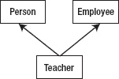

**图 9–4.** *多重继承*

你可以通过以下方式声明你的类继承多个类：

```
class Teacher : public Person, public Employee {
}
```

多重继承有一个常见问题：当两个父类共享同一个方法时。例如，`GetIncome` 可以同时从 `Person` 和 `Employee` 类中声明。因此，当你调用 `Teacher` 对象的 `GetIncome` 方法时，你需要指定是从哪个父类中调用它。

如果你简单地写成：

```
int currentIncome = pTeacher->GetIncome();
```

你会得到一个编译器错误：

`Member is ambiguous: ‘Person::GetIncome’ and ‘Employee::GetIncome’`

你需要通过显式调用你想调用的父类函数来解决这个歧义。

```
int currentIncome = pTeacher->Employee::GetIncome();
```

#### 模板

在 C++ 中，你可以定义类或方法只接收特定类型的对象。例如，你可以定义一个只接收两个相同类型数据进行比较并返回结果的方法。

```
template <class T>
T GetMax (T a, T b) {
 return (a>b)? a : b;
}

int main () {
 int i=5, j=6, k;
 long l=10, m=5, n;
 k=GetMax<int>(i,j);
 n=GetMax<long>(l,m);
 return 0;
}
```

通过定义模板方法，你可以确保 `a` 和 `b` 具有相同的类类型并且可以相互比较。你也可以在模板类中执行相同的操作，而没有任何问题。

```
template <class T>
class mypair {
   T a, b;
 public:
   mypair (T first, T second)
     {a=first; b=second;}
   T getmax () {
return a>b? a : b;
   }
};

int main () {
 mypair <int> myobject (100, 75);
 cout << myobject.getmax();
 return 0;
}
```

## 一个实际示例

我将通过一些例子来指导你如何将 C/C++ 库集成到 Objective-C 代码中。一个例子是与 SQLite 库的集成，另一个例子是一个将 C++ 代码与 Objective-C 代码混合使用的示例应用程序。


### SQLite

SQLite 是 CoreData 的底层实现。在性能方面，SQLite 表现稍好，因为它更轻量、更直接。然而，CoreData 能为你提供更好的对象映射模型、撤销和重做功能、批量处理以及线程支持。

SQLite 的主要优势在于，如果你的团队已经熟悉关系型数据库和关系型 SQL，那么学习曲线会很平缓。SQLite 也更易于移植到 Android 上，这样你就可以在 iPhone 和 Android 应用之间共享相同的数据层。

你可以在 `SQLiteSample project` 项目中阅读源代码示例。这里我只给你讲解重点。

你需要通过打开终端并输入 `sqlite3 students.sql` 来创建一个 SQL 数据库。这将创建一个新的数据库，你可以在其中创建表、插入和查询数据。你可以像平常一样使用 SQL 来创建表和插入数据。

```
sqlite> CREATE TABLE students (pk INTEGER PRIMARY KEY, name VARCHAR(25));
sqlite> INSERT INTO students (name) VALUES ('khang');
sqlite> INSERT INTO students (name) VALUES ('vo');
sqlite> INSERT INTO students (name) VALUES ('duy');
sqlite> .quit
```

图 9-5 更清晰地展示了终端内发生的事情。

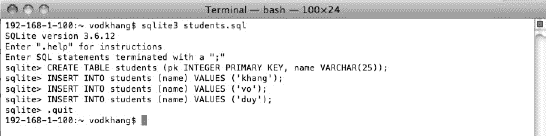

**图 9-5.** *SQLite 数据库*

然后，你可以在你的`Home`文件夹（如果你在终端中没有切换到任何文件夹，这是默认文件夹）中找到 `students.sql` 文件。你需要将该文件添加到 Xcode 中，然后添加库 `libsqlite3.0.dylib`。

```objective-c
- (void)viewDidAppear:(BOOL)animated {
    NSString *path = [[NSBundle mainBundle] pathForResource:@"students" ofType:@"sql"];

    if (sqlite3_open([path UTF8String], &database) == SQLITE_OK) {
        // 获取所有书籍的主键。
        const char *sql = "SELECT pk, name FROM students";
        sqlite3_stmt *statement;

        // 准备语句会将 SQL 查询编译成 SQLite 库中的字节码程序。
        // 第三个参数是 SQL 字符串的长度，或者为 -1 表示读取到第一个空终止符。
        if (sqlite3_prepare_v2(database, sql, -1, &statement, NULL) == SQLITE_OK) {
            // 我们“逐步”遍历结果——每行一次。
            while (sqlite3_step(statement) == SQLITE_ROW) {
                const unsigned char *name = sqlite3_column_text(statement, 1);
                NSString *nameString = [NSString stringWithCString:(char *)name
                                                          encoding:NSASCIIStringEncoding];
            }
        }

        // “终结”该语句——释放与该语句关联的资源。
        sqlite3_finalize(statement);
    } else {
        // 即使打开失败，也要调用 close 以正确清理资源。
        sqlite3_close(database);
        NSAssert1(0, @"打开数据库失败，消息为 '%s'。", sqlite3_errmsg(database));
    }

    [self.tableView reloadData];
}
```

有几个你需要记住的方法：

- `sqlite3_open([path UTF8String], &database) == SQLITE_OK` 初始化新的数据库对象并将其赋值给你的指针。
- `sqlite3_prepare_v2(database, sql, -1, &statement, NULL) == SQLITE_OK` 执行你的 SQL 命令并将结果放入 statement。
- `while (sqlite3_step(statement) == SQLITE_ROW):` 逐步遍历执行语句后得到的结果。

### 将 C++ 集成到你的应用程序中

将 C 集成到你的应用程序中几乎不费吹灰之力，因为 Objective-C 是 C 的超集。但是，当你将 C++ 集成到应用程序中时，需要注意一些细节。

首先，你需要像平常一样在普通的头文件和实现文件（`.h 和 .cpp 文件`）中创建你的 C++ 类。然后，你需要用一个扩展名为 `.mm` 的 Objective-C 文件来包装你的 C++ 文件（这告诉 iOS 环境这些文件是 Objective-C++ 文件）。任何想要使用这些 `.mm` 文件的文件也必须是 `.mm` 文件。

你可以查看示例项目 `TestC_CPlus`。首先，你可以看到有两个文件，`Foo_Cpp.h` 和 `Foo_Cpp.cpp`，它们声明了 `Foo_Cpp C++ 类`。然后，你通过名为 `MyObject.h 和 MyObject.m` 的 Objective-C++ 文件来包装这个文件。

最后一步是将这些后台逻辑集成到视图控制器中。你可以像往常一样在项目中的任何位置调用对象 MyObject。你只需要将调用文件重命名，以 `.mm` 结尾即可。

## 总结

编程世界中有大量高性能且专用于特定任务的 C/C++ 库。你不应该重新发明轮子，或者费力地将所有这些 C/C++ 代码转换为 Objective-C 代码，这会花费很长时间。理解 C/C++ 可以帮助你更好地理解这些库，以便将它们集成到你现有的应用程序中。

Objective-C 是 C 的超集，因此你可能已经了解许多 C 的特性。我讨论了 C 编程中的主要重点，包括指针概念。你还学习了函数指针和位运算，这让你能够充分发挥 C 语言的高性能特性。

如果你没有编程经验，C++ 会更难学习和理解。我只讨论了 C++ 的要点以及 C++ 和 Objective-C 之间的主要区别。这可能不足以编写一个大型的 C++ 应用程序，但足以让你将现有的 C++ 库集成（并在必要时修改）到你的 iPhone 应用程序中。

在最后一节中，我使用了一个 SQLite 的实际示例来演示 C 在 Objective-C 中的用法。除了语法和内存管理上的一些差异外，这样做并不太难。我没有深入探讨 C++ 库；只是演示了如何让你的 iPhone 应用程序中包含 C++ 代码。

**练习题**

1. 用 C 语言编写一个函数，比较两个字符串 s1 和 s2。如果 s1 < s2，返回负数；s1 = s2，返回 0；s1 > s2，返回正数。
2. 用 C 语言编写一个函数，将字符串 s2 追加到字符串 s1 的末尾。
3. 通过填写 `delete_list` 方法，完成该 C 语言链表程序。

## 第 10 章


## 比较 Android 与 Windows Phone 的性能问题

在本章中，你将学习以下内容：

-   智能手机开发中三个平台及三种编程语言的通用知识与差异。
-   如何将你在 iOS 上学到的诸多应用性能优化要点应用于 Android 和 Windows Phone，例如：
    -   如何对 Android 和 Windows Phone 应用进行基准测试。
    -   如何优化滚动性能。
    -   缓存与数据存储的差异。
    -   针对三个平台的数据结构与算法简析。
    -   针对三个平台的多线程简析。Android 与其他两个平台有所不同。
    -   关于内存限制的要点。
    -   这些平台处理多任务的不同方式。
    -   如何将 C/C++ 代码集成到你的 Android 应用中。

本章将为你勾勒出未来三大主要智能手机平台——iPhone、Android 和 Windows Phone——的总体面貌。它们正在不断发展并大力创新，以保持相对于竞争对手的竞争优势。对于一些基础且简单的应用，你或许不愿为每个平台投入大量时间和精力去优化性能，此时可以编写跨平台应用以节省时间。

不出所料，跨平台版本的发布通常会比主 SDK 晚数周甚至数月。此外，与主要 API 相比，它也会缺少某些精细化功能。因此，要想在这三个平台市场中取得成功，你必须使用主要语言及其特性来优化性能，并充分利用该平台的先进功能和 API。

我将概述 Android 和 Windows Phone 性能方面的主要难点。通过本书各章节（工具、模拟器、列表视图、缓存、存储、数据结构与算法、多线程、多任务、内存管理以及原生 C/C++ 编程支持）的引导，可以简化这些问题的理解。限于篇幅，我无法覆盖每个平台的所有细节，也不会妄加评判哪个平台最好。阅读本章后，你将了解每个平台最重要的难点，从而能够轻松地切换和学习新平台。

## 通用知识

iPhone 使用 Objective-C 作为 iOS 开发的主要编程语言。它没有垃圾回收器，而是依靠 ARC 来协助内存管理。仅有三种设备运行 iOS：iPod Touch、iPhone 和 iPad，它们有两种不同的屏幕分辨率。

Android 使用 Java 作为主要编程语言，并提供垃圾回收以简化内存管理。Android 拥有众多屏幕尺寸和硬件规格各异的设备。有些设备采用双核芯片，而有些设备则性能较弱（处理器速度慢、内存有限）。

Windows Phone 使用 C# 作为主要编程语言，并使用 Silverlight 作为用户界面框架。C# 具备垃圾回收功能。支持 Windows Phone 的设备很多，但都必须满足必要的硬件要求。

## 在模拟器和设备上进行基准测试

在 iOS 中，正如你在第 2 章所了解到的，模拟器远快于真机，因此有些情况下你需要使用真机来测试性能是否达标。iOS、Android 和 Windows Phone 的模拟器与真机架构差异很大，因此每个平台进行基准测试的方法也各不相同。

### 模拟器与设备

Android 模拟器（图 10-1）运行速度非常慢。你可以将其作为性能测试的最低基准。此外，Android 设备型号众多，要让所有 Android 用户对性能满意并非易事。你可能需要在不同设备上进行测试，以了解性能结果的范围。

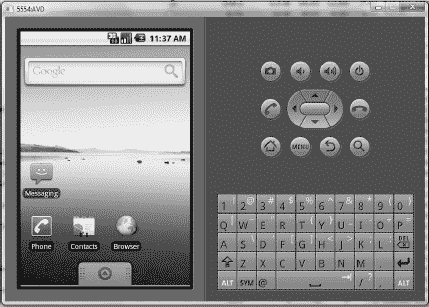

**图 10-1.** *Android 模拟器*

Windows Phone 模拟器（图 10-2）运行性能正常，几乎与真机无异。如果你想像开发 iOS 应用那样，通过快速模拟器来运行测试，那么提升模拟器性能是可行的；你可以在互联网上轻松找到相关信息。

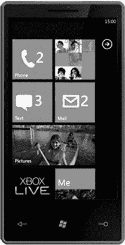

**图 10-2.** *Windows Phone 模拟器*

正如第 2 章所述，iPhone 模拟器的运行速度远快于真机，因此很难在模拟器上检测到性能问题。

### 基准测试

了解在需要进行基准测试时可以使用哪些工具至关重要。Android 提供的工具集较为有限，而 Windows Phone 则提供了更广泛的工具来帮助你查找性能问题。这些工具中的许多功能与 iOS 提供的工具类似；它们支持对内存、CPU 使用率和用户界面处理进行基准测试。

### Android

用于 Android 开发的 Eclipse 并未像 Xcode 为 iPhone 提供的那样提供一整套检测工具。它主要提供四种检测工具用于跟踪性能：线程、堆、对象分配和文件访问。你可以将这些工具与日志记录（使用 `Debug.trace()`）结合使用，来测量应用的整体性能。

虽然 Android 提供了垃圾回收，但它也有缺点。当垃圾回收运行时，它会暂停你的应用。这会导致你的用户界面停止响应几毫秒，或者至少无法渲染足够的帧数（良好的渲染帧率应在 16-30 毫秒/帧左右）。

图 10-3 和图 10-4 展示了 Android 的堆和分配跟踪器。你可以使用这些工具来查看在哪些类或方法中创建了最多对象。

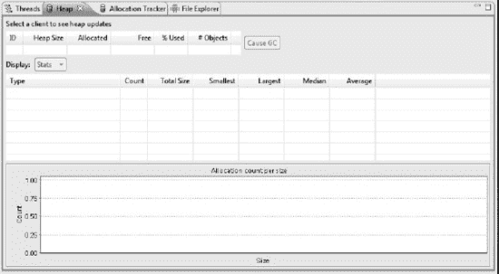

**图 10-3.** *堆检测工具*

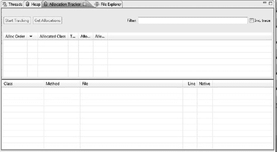

**图 10-4.** *分配检测工具*

### Windows Phone

Windows Phone 提供了性能更出色的性能分析工具。图 10-5 展示了运行 Windows Phone 性能分析工具并获取数据后的结果。

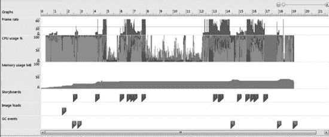

**图 10-5.** *分配检测工具*

该性能工具支持多种不同的性能基准测试指标：帧率、CPU 使用率、内存使用率、图像加载和垃圾回收事件。这有助于你定位性能瓶颈，从而更轻松地解决问题。


## ListView 性能优化

所有 iOS、Android 和 Windows Phone 平台上的 `ListView`（或 `TableView`）都面临相似的性能问题。你始终需要尽快将数据返回给列表；否则，用户在滚动列表时会看到明显的卡顿。图片加载必须采用异步方式，这样用户才能流畅滚动列表并先看到数据。当图片加载完成后，再在列表中显示。

以下是三个平台在视图渲染方面常见的共同问题：

*   应始终尽可能使用不透明视图。
*   不应使用复杂的嵌套列表视图结构，因为这会导致显示速度变慢。

针对 `ListView` 滚动问题，每个平台都有其特定的处理方式。要实现自定义 `ListView`，Android 和 Windows Phone 采用不同的方法将数据显示到 `ListView` 中。Android 的处理方式类似于 iPhone，只在必要时返回数据和视图。Windows Phone 则使用一种自动绑定机制将数据绑定到视图。这种方式对开发者来说更易于实现，但相比 Android 的方式，会引发更多的性能问题。

对于 Windows Phone 而言，当你拥有一个大型对象数组时，很快就会遇到内存和性能问题，因为操作系统无法在内存中存储更多对象并将其取出绑定到 `ListView`。这是 iPhone、Android 和 Windows Phone 中 `ListView` 的主要区别。在前两个平台中，你只需决定列表的大小；在滚动时，你可以获取数据并进行显示。对于 iOS 的 `TableView`，当你能够丢弃数组中未使用的对象并只存储必要对象时，内存不应成为问题。我将简要解释这两个平台的实现方式以及如何解决各自的问题。

### Android

在 Android 中，你可以毫无困难地将数据映射到默认布局。

```java
String [] cities= new String[] {"墨尔本", "维多利亚", "阿德莱德"};
this.setListAdapter(new ArrayAdapter<String>(this, R.layout.list_item, cities));
```

然而，如果你需要实现更复杂的布局，你可以使用自己的适配器将数据映射到视图。

```xml
<?xml version="1.0" encoding="utf-8"?>
<LinearLayout
        android:layout_width="wrap_content" android:layout_height="wrap_content">
        <ImageView android:id="@+id/icon" android:layout_height="wrap_content"
                android:src="@drawable/icon" android:layout_width="22px">
        </ImageView>
        <TextView android:text="@+id/TextView01" android:layout_width="wrap_content"
                android:layout_height="wrap_content" android:id="@+id/label"
                android:textSize="30px"></TextView>
</LinearLayout>
```

我的示例应用在左侧包含一个图像视图，右侧包含一个文本视图，类似于 iOS 中 `UITableView` 的默认单元格。

```java
public class MySimpleArrayAdapter extends ArrayAdapter<String> {
   @Override
      public View getView(int position, View convertView, ViewGroup parent) {
       LayoutInflater inflater = context.getLayoutInflater();
        View rowView = inflater.inflate(R.layout.rowlayout, null, true);

        TextView textView = (TextView) rowView.findViewById(R.id.label);
        ImageView imageView = (ImageView) rowView.findViewById(R.id.icon);
        textView.setText(names[position]);

        // 为 Windows 和 iPhone 更改图标
       imageView.setImageResource(R.drawable.ok);

     return rowView;
   }
}
```

创建 Java 对象（尤其是 `View` 对象）会消耗时间和 CPU，因此 Android 会重用不再显示的行。例如，如果某行从视图的顶部或底部消失，Android 会将该视图作为参数 `convertView` 返回给 `Adapter` 方法。要在你的方法中使用它，你必须首先检查 `convertView` 是否不为 null，然后才能使用它来显示下一个数据项。

另一个需要注意的重要优化点是：由于 `findViewByID()` 方法是一种开销很大的操作，应尽可能避免使用。相反，你应该使用 `setTag()` 和 `getTag()` 方法来获取所需的视图。

考虑到这些因素，你可以将之前的源代码重写如下：

```java
@Override
public View getView(int position, View convertView, ViewGroup parent) {
   // ViewHolder 将缓冲对行布局中各个字段的访问

   ViewHolder holder;
   // 如果作为参数传递，则重用现有视图
   // 这将节省 Android 上的内存和时间
   // 这仅在所有类的基本布局相同时有效
   View rowView = convertView;
   if (rowView == null) {
       LayoutInflater inflater = context.getLayoutInflater();
       rowView = inflater.inflate(R.layout.rowlayout, null, true);
       holder = new ViewHolder();

       // 仅在第一次时调用 findViewByID()，然后使用 setTag()
       holder.textView = (TextView) rowView.findViewById(R.id.label);
       holder.imageView = (ImageView) rowView.findViewById(R.id.icon);

       rowView.setTag(holder);

    } else {
       holder = (ViewHolder) rowView.getTag();
    }

    holder.textView.setText(names[position]);

    // 为 Windows 和 iPhone 更改图标
    String s = names[position];
    holder.imageView.setImageResource(R.drawable.ok);

     return rowView;
}
```

如你所见，`convertView` 被重用了，所以如果它不为 null，你可以直接使用它。你还可以看到我创建了一个包装器来包含文本视图和图像视图。你可以根据需要在视图持有者中包含任意多个视图，并将参数命名为任何名称。你可以将视图持有者想象成一个映射，以属性为键，并将其他视图作为值。

### Windows Phone

Windows Phone 使用不同的方式实现数据绑定，这导致了严重的性能和内存问题。在 Windows Phone 中，UI 仍然会被重用，就像在 Android 和 iOS 中一样；但是，数据是直接绑定的。这意味着，如果你需要在 `ListView`（在 Windows Phone 中称为 `ListBox`）中显示 1000 个项目，那么所有 1000 个项目都必须被创建并加载到内存中。这对于 Silverlight 桌面应用程序来说是可以正常工作的。但是在 Windows Phone 中，内存更加有限，因此手机无法承受加载所有 1000 个项目。

当前 Windows Phone 绑定的主要问题在于它绑定到 `IEnumerables` 接口。这可以通过使用另一个实现了 `IList` 接口的数据绑定来解决，该接口已经支持 `Count` 和 `IndexOf` 方法。

```csharp
  public class MyDataSource : IList
  {
    const int MAX_ITEMS = 1000;

    public int Count
    {
      get { return MAX_ITEMS; }
    }

    public int IndexOf(object value)
    {
      if (value == null)
      {
        Debug.WriteLine("IndexOf(null)");
        return -1;
      }

      DataItem item = (DataItem)value;
      return item.Index;
    }

    public object this[int index]
    {
      get
      {
        DataItem itemToReturn = new DataItem { Index = index, Text = "新项目" };
        return itemToReturn;
      }
      set
      {
        throw new NotImplementedException();
      }
    }

    // 数据虚拟化不需要 IList 的其他任何内容
    #region 未实现的部分
    // 在此处填写未实现的方法
    #endregion
  }

  public class DataItem
  {
    public int Index { get; internal set; }
    public string Text { get; set; }
    public override string ToString()
    {
      return Text + " [" + Index + "]";
    }
  }
```

作为练习，你应该将此代码与你用于 UI 的 `ListBox` 主代码集成。


## 数据缓存

你在 第 3 章 中为 iOS 编程学习到的所有算法和术语，都可以毫无问题地应用于 Android 和 Windows Phone。你应当学习的是与 Windows Phone 和 Android 直接相关的技术，例如在哪里存储缓存数据、缓存的频率以及缓存数据的格式。

内存缓存部分也应该与 iOS 没有区别，因为这三个平台的硬件规格并没有不同。你可以采用与 iOS 相同的内存缓存算法。我将重点介绍如何利用文件存储来获得最佳性能。

### Android

有很多地方可以存储缓存数据。

*   **`SharedPreferences`**：这与 `NSUserDefaults` 完全相同。你可以在此存储原始数据。它通常用于设置存储或轻量级数据存储。
*   **内部存储**：你可以在设备存储中存储私有数据。它实际上是内部存储中的一个文件区域。其他应用程序无法访问此存储。
*   **外部存储**：在大多数 Android 手机中，用户可以通过可移动存储介质（例如 SD 卡）获得更多存储空间。保存在此处的文件对全局公开，甚至可以被用户修改。用户可以启用 USB 大容量存储来将文件传输到他们的计算机。
*   **`SQLite`**：这是一个数据库，你可以像往常一样使用 Java 和 SQL 访问它，没有太大区别。这就是为什么如果你选择在 iPhone 的 SQLite 数据库中存储数据，你实际上可以在此处重用它。

#### 内部存储

文件在此处长期存储，并且仅对你的应用程序私有。你可以通过以下代码在此存储区域中存储文件：

```
String FILENAME = "hello_file";
String string = "hello world!";

FileOutputStream fos = openFileOutput(FILENAME, Context.MODE_PRIVATE);
fos.write(string.getBytes());
fos.close();
```

此代码将字符串写入文件，然后保存该文件。

要将数据保存在缓存文件夹中（该文件夹通常会被操作系统在不通知你的情况下删除），请使用 `getCacheDir()` 内的路径。

**注意：**要像 iOS 中的应用包一样将文件保存到应用程序中，你可以保存到项目目录 `res/raw/`。你可以使用 `openRawResource()` 读取文件，但不能写入这些文件。

#### 外部存储

这是可移动存储，因此你需要检查该存储介质是否已连接到当前设备。

```
String state = Environment.getExternalStorageState();
if (Environment.MEDIA_MOUNTED.equals(state)) {
  // 你可以读取和写入数据
} else if (Environment.MEDIA_MOUNTED_READ_ONLY.equals(state)) {
  // 你只能读取数据
} else {
  // 你既不能读取也不能写入数据
}
```

这种介质具有更大的存储容量，因此你可以存储更多数据。但是，用户可能会误删除数据，或者未将介质连接到设备。卸载你的应用程序时，这些文件也会被删除。如果你不希望发生这种情况，或者希望与其他应用程序共享数据，可以将它们保存到根目录下的目录中，方法是调用 `getExternalStoragePublicDirectory()`。在外部介质中，你还有一个特定的缓存目录，用于保存不重要的缓存数据：`getExternalCacheDir()`。

#### SQLite 数据库

存储在数据库中可能会导致复杂的问题，但它也有助于解决许多性能问题。有很多技巧可以帮助你提高数据库访问的性能，例如更好的索引、数据库分区和唯一键。我不会深入讨论数据库优化，因为它是一个非常庞大且专门的课题。可以说，SQLite 与任何其他 SQL 数据库大致相似。

### Windows Phone

微软发布了一个包含本地数据库的 Windows Phone 更新。如果你开始构建一个新应用程序并且想要使用数据库，现在就可以这样做。否则，如果你的应用程序密集使用其他存储机制，你可以选择优化它，而不是重建整个数据库。

在 Windows Phone 中，也有四种主要的文件存储方法。

*   **`IsolatedStorageSettings`**：键值存储，与 `NSUserDefaults` 完全相同。
    ```
    IsolatedStorageSettings appSettings = IsolatedStorageSettings.ApplicationSettings;
    appSettings.Add("email", "myemail@gmail.com");
    var myEmail = (string)appSettings["email"];
    ```
*   **`IsolatedStorageFile`**：在 Windows Phone 中用于将文件存储到文件系统。它没有像 Cache 或 Public 这样用于特定目的的默认目录。你需要创建自己的目录来处理存储过程。
*   **XML 存储**：对于旧版应用程序，如果你没有数据库支持，你可能需要选择 XML 作为主要的存储机制。
*   **本地数据库**：包含 Mango 的新版本将为 Windows Phone 提供本地数据库支持。本地存储性能的许多问题将随此新版本得到解决。

#### IsolatedStorageFile

Windows Phone 中的文件存储很简单；你可以使用整个应用程序目录来做任何你想做的事情。操作系统不会处理任何事情，例如自动删除或限制此目录的存储限制。

```
IsolatedStorageFile myStore = IsolatedStorageFile.GetUserStoreForApplication();
myStore.CreateDirectory("Cache");

// 指定文件路径和选项。
using (var isoFileStream = new IsolatedStorageFileStream("Text1.txt", FileMode.OpenOrCreate, myStore))
{
  // 写入数据
  using (var isoFileWriter = new StreamWriter(isoFileStream))
  {
    isoFileWriter.WriteLine(txtWrite.Text);
  }
}
```

要读取文件，请使用以下代码：

```
using (var isoFileStream = new IsolatedStorageFileStream("Cache\\Text1.txt ", FileMode.Open, myStore))
{
  // 读取数据。
  using (var isoFileReader = new StreamReader(isoFileStream))
  {
    txtRead.Text = isoFileReader.ReadLine();
  }
}
```

你需要指定想要执行读取、写入或追加数据操作的读/写权限。

#### XML 存储

使用 XML 进行存储，然后使用 LINQ to XML 进行读写，这是一个痛苦的过程，并且会显著损害你的 Windows Phone 应用程序的性能。

使用 LINQ to XML 进行存储的主要性能问题在于，每次需要修改或读取数据时，都需要加载或保存整个 XML。这是因为 LINQ 使用 DOM 来访问数据。当你将整个大型 XML 文件加载到内存中以访问它时，还会导致内存问题。如果你有一个小的 XML 文件，这不会带来任何麻烦。

开发者有两种方法可以解决这个 XML 问题。

*   你有一个主文件，包含所有数据的主要结构。然后，你有几个较小的文件来存储关于每个主要数据项的数据。例如，对于一个 RSS 阅读器，你可以将所有频道信息存储在主文件中，然后为每个频道单独创建一个文件。
*   你仅缓存最新数据。任何超过 10 天的数据都可能被删除。这将减少本地 XML 文件中的数据量，并降低你工作的复杂性。缺点是，如有必要，你需要重新下载旧数据。

#### 数据库支持

随着新的 Mango 版本发布，Windows Phone 将支持本地数据库存储。你很快就能拥有索引、分区、键和对数据库随机访问的所有强大功能。借助此新版本，你应该使用 LINQ to SQL 来实现良好的代码重用，因为 LINQ to SQL 和 LINQ to XML 共享许多代码库元素。


## 数据结构与算法

`C#`、`Java` 和 `Objective-C` 拥有相似的内置数据结构，用于支持三种主要的对象集合类型：集合、数组和映射。表 10-1 总结了这些集合类型、它们的子类型以及如何自行实现。  
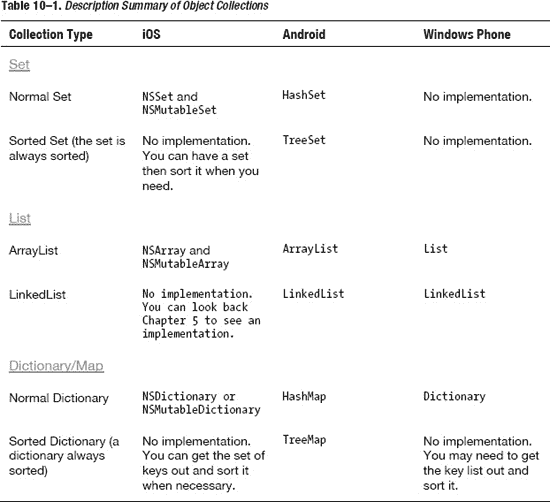  
还有一些不太重要的数据结构，比如栈和队列，但你总是可以根据在第 5 章中学到的知识自行实现。

对于 XML 解析器，Android 默认同时支持`SAX`和`DOM XML`解析器，因此你无需额外添加其他库。对于 Windows Phone 上的`C#`，在大多数情况下你需要使用`LINQ over XML`来处理相关工作，因为它提供了更好的代码可维护性，并且实际上比`DOM`更快。如果遇到非常大的 XML 文件，请考虑使用`XmlReader`。

## 多线程

在多线程管理方面，`C#`和`Java`是功能强大的编程语言。与 iOS 的多线程类似，更新 UI 的任务需要在 UI 线程上完成；其他长时间运行的操作则需要在后台线程中进行。

这三种平台的线程锁定机制相似，都基于通知机制。不过，各平台在实现多线程机制的具体方式及其特定规则上，存在一些重要差异。

### Android

Java 拥有多线程机制，但 Android 更倾向于使用自己的多线程管理机制。在 Android 中，对于 UI 线程有一个非常严格的规定。如果 UI 线程被阻塞超过几秒钟（目前为 5 秒），用户将会看到著名的“应用程序无响应”弹窗。之后，你的应用程序将被强制关闭。

在 Java 中，你可以通过继承`Thread`类或实现`Runnable`接口来创建线程。最简单的方法之一是使用匿名内部类。

```
new Thread(new Runnable() {
   public void run() {
     // 你的后台代码。
   }
}).start();
```

如果你创建了一个继承`Thread`类的新类，可以直接调用`newThread().start()`。如果类 B 实现了`Runnable`接口，那么你可以使用`new Thread(B).start()`。

有几种方法可以在 UI 线程中更新 UI，类似于调用以下 iOS 方法的方式：

```
[obj performSelectorOnMainThread:mySelector withObject:nil waitUntilDone:YES];
```

Android 提供了以下几种更新 UI 线程的方法：

*   `Activity.runOnUiThread(Runnable)`
*   `View.post(Runnable)`
*   `View.postDelayed(Runnable, long)`
*   `Handler`

例如，你可以使用以下代码在后台线程获取图像，然后更新 UI 线程：

```
public void loadImage() {
 new Thread(new Runnable() {
   public void run() {
     final Bitmap bitmapImage = loadBitmapImage();
     myImageView.post(new Runnable() {
       public void run() {
         myImageView.setImageBitmap(bitmapImage);
       }
     });
   }
 }).start();
}
```

如果你的线程内部和 UI 更新代码中需要执行大量处理逻辑，代码会变得复杂。你也可以创建一个实现`Runnable`接口的类，并调用该类的`run()`方法。Android 还提供了一种更简单的方法来处理复杂的线程处理逻辑：`AsyncTask`类。这是一个更好的线程管理结构，用于处理线程问题。

```
private class myAsyncTask extends AsyncTask<X, Y, Z>
  protected void onPreExecute(){
  }

  protected Z doInBackground(X...x){
  }

  protected void onProgressUpdate(Y y){
  }

  protected void onPostExecute(Z z){
  }
}
```

*   `onPreExecute`：该方法在你的后台线程执行之前被调用。
*   `doInBackground`：主方法在后台线程中运行。
*   `onProgressUpdate`：当你需要根据后台线程的当前进度在主线程中更新视图时使用。
*   `onPostExecute`：当你的后台线程完成时，该方法会在 UI 线程中被调用，你可以根据后台线程的结果更新 UI。

从类结构可以看出，你可以定义三个泛型类型参数：`X`、`Y`和`Z`。

*   `X`：你传递给后台线程的参数类型。你可以将类型为`X`的对象数组传递给后台任务。
*   `Y`：你将在`onProgressUpdate`方法中使用的参数类型。当你在`doInBackground()`方法内部调用`publishProgress(Y)`时，会调用此方法。例如，你想通过进度条显示操作的进度。
*   `Z`：你在后台进程中执行操作后得到的结果参数类型。

之前展示的图像下载示例源代码可以重写为：

```
public void loadImage() {
 new DownloadImageTask().execute("http://example.com/image.png");
}

private class DownloadImageTask extends AsyncTask<String, Void, Bitmap> {
    protected void onPreExecute(){
    }

    protected Bitmap doInBackground(String... urls) {
        return loadImageFromNetwork(urls[0]);
    }

    protected void onPostExecute(Bitmap result) {
        mImageView.setImageBitmap(result);
    }
}
```

为了锁定线程以避免竞态条件和死锁，你可以使用类似于 iOS 编程中的机制，即`wait()`、`notify()`和`notifyAll()`方法。以下是这些方法与你在第 6 章中学到的`NSCondition`方法之间的相似之处：

*   `wait()`：类似于`[condition lock]`，它会锁定方法或代码块。
*   `notify()` 和 `notifyAll()`：分别类似于`[condition signal]`和`[condition unlock]`，它们会解锁该方法并通知其他线程进入。`notify()`和`notifyAll()`的区别在于，前者会随机选择一个线程让其运行，而`notifyAll()`会让所有线程都运行。

### Windows Phone

在 Windows Phone 中启动一个新线程的方式如下：

```
public void loadImageFromNetwork()
{
}
Thread t = new Thread (loadImageFromNetwork);
t.Start();
```

通常情况下，你需要在 UI 线程中更新用户界面。这可以通过调用以下方法完成：

```
Dispatcher.BeginInvoke(() => UpdateUI());
```

我使用了普通的 lambda 表达式。如果你不理解，就照着示例代码做，把你的方法调用放进去即可。

为了避免竞态条件和死锁，你需要使用锁定机制，与 Java 中的方式相同：

*   `obj.notify()` => `Monitor.Pulse(obj)`
*   `obj.notifyAll()` => `Monitor.PulseAll(obj)`
*   `obj.wait()` => `Monitor.Wait(obj)`

#### 异步下载

在 Windows Phone 中，由于 API 限制，你只能使用异步请求从互联网下载数据。你需要使用`WebClient`或`HttpWebRequest`向服务器发起请求。以下是发起新 Web 请求并接收返回数据的代码：

```
WebClient webClient = new WebClient();
webClient.OpenReadCompleted += new OpenReadCompletedEventHandler(wc_OpenReadCompleted);
webClient.OpenReadAsync(new Uri(arbitraryImageUriThatKeepsChanging), webClient);

void wc_OpenReadCompleted(object sender, OpenReadCompletedEventArgs e)
{
  if (e.Error == null && !e.Cancelled)
 {
     try
     {
        BitmapImage image = new BitmapImage();
        image.SetSource(e.Result);
        imgContent.Source = image;
     }
     catch (Exception ex)
     {
         //根据你的应用适当处理异常
     }
 }
}
```


好的，作为一名高级文档工程师和翻译员，我将严格遵循您的格式要求，处理给定的英文文本。


## 内存管理

Android 和 Windows Phone 都有自己的垃圾回收器，因此在很多情况下，你无需过多担心内存管理。由于 Android 和 Windows Phone 的垃圾回收总体方法相似，我将先阐述垃圾回收的通用要点，然后深入介绍 Android 的一些具体细节和案例。

对于智能手机这类资源有限的环境（尤其是只有 32MB 内存的 Android 手机），确保每次使用最少的内存是你的职责。如果你不需要在内存中缓存一张图片，就释放它。你可以通过将对象设置为 `null` 来释放图片，垃圾回收器会完成它的工作。

只有当你为整个应用程序生命周期设置了一个对象的引用，却没有在合适的时候将其设置为 `null` 时，才会发生内存泄漏。除非你的视图生命周期很长，并且在运行时包含了过多的对象，否则你无需担心。

我将以下面的章节详细讨论每个平台相关的特定问题。

### Android

Android 拥有 iOS 和 Windows Phone 不具备的特定平台特性：多任务处理和 `TabView`。Android 的多任务处理与 iOS 的不同。Android 应用程序可以启动服务，这些服务会在后台无限期运行，直到某些服务被销毁。

#### 上下文（Context）Activity 泄漏

在 Android 中，你有一个在不同 Activity 之间共享的上下文（Context），这个上下文内部存储了数据和整个视图层次结构。问题在于，这个上下文会被传递给需要它的对象和方法，例如当你初始化一个文本视图时。

`TextView myTextView = new TextView(myContext);`

所以，如果 `myTextView` 泄漏了，整个上下文 Activity 就会泄漏。现在，考虑一种情况：当手机方向改变时，你需要保持你的背景图片。当你的应用程序改变方向时，它会销毁 Activity 以及该 Activity 内的所有数据，包括你的背景图片。因此，最佳实践是将图片保持为静态。

```
private static Drawable sBackground;

@Override
protected void onCreate(Bundle state) {
  super.onCreate(state);

  TextView label = new TextView(myContext);
  label.setText("Leaks are bad");

  if (sBackground == null) {
    sBackground = getDrawable(R.drawable.large_bitmap);
  }
  label.setBackgroundDrawable(sBackground);

  setContentView(label);
}
```

现在你可以看到，背景图片持有了对标签（label）的引用，而标签又持有了对上下文 `myContext` 的引用。并且因为背景图片是静态的，它永远不会被释放，所以你将会泄漏整个上下文和旧的视图层次结构。

#### 多任务处理中的内存

在 Android 中，因为所有应用程序可以随时在后台运行，内存变得更为受限。如果你的应用程序使用了太多内存，它将迫使操作系统杀死其他应用程序以回收内存。这就是为什么良好的内存管理和使用对于你正确处理变得至关重要。

#### TabView

在 `TabView` 方面，Android 和 iPhone 有相似之处。如果你正在使用一个 `TabView`，你在所有选项卡中的所有视图都会被加载到内存中，即使它们没有被显示出来。当视图是最消耗内存的元素时，这通常会给各种应用程序带来巨大的内存问题。在决定使用 `TabView` 之前，请三思。

### Windows Phone

Windows Phone 没有多任务处理功能，所以你的应用程序可以利用所有可能的内存并以高性能运行。然而，如果使用不当，某些视图层次结构问题可能会影响你的内存。

#### Panorama 和 Pivot

Windows Phone 有两个主要的视图层次结构：`Pivot` 和 `Panorama`。你也可以使用其他方式创建具有普通视图的 Windows Phone 应用程序。尽管 UI 概念不同，但 `Pivot` 和 `Panorama` 彼此相似。`Pivot` 更多地用于具有相似视图但用途不同的应用程序，例如，不同地点的天气（伦敦、巴黎、纽约、加利福尼亚）；请参见 图 10–6。`Panorama` 更多地用于需要显示同一事物的大图的应用程序，如 图 10–7 所示。

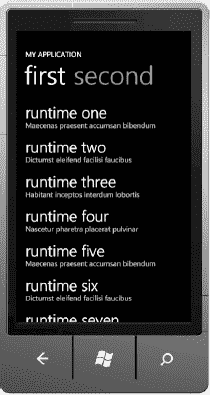

**图 10–6.** *Pivot 应用程序*


**图 10–7.** *Panorama 应用程序*

Panorama 应用程序存在一个巨大的性能问题：即使不显示，你也需要将整个视图加载到内存中。视图越长，你需要加载的内容就越多，很快就会导致你的应用程序内存不足。这无疑是一个重要的考量因素。如果你使用全景视图，你应该只使用一个简短的视图；不要加载过多的数据或子视图。

## 多任务处理

多任务处理对于所有智能手机平台来说总是一个问题，因为电池电量会很快耗尽。正如在第 8 章中所讨论的，iOS 的多任务处理并非真正的多任务处理。它是快速应用切换和一些有限的、受限制的后台服务的组合。

Android 通过不同的方法提供多任务处理，允许应用程序在后台有更多的时间和自由度来运行和执行计算。Windows Phone 目前还不允许你的应用程序在后台运行；你可能需要等到 Mango 版本发布才能实现。

### Android

在 Android 中，要创建一个后台进程，你需要使用 `Service` 类。需要澄清的是，使用 `Service` 并不意味着一个单独的线程或一个单独的进程。当你调用此服务时，它会告诉系统你的应用程序在后台有事要做。你也可以将一些其他服务暴露给其他应用程序。

要启动一个新的 `Service`，你需要扩展 `Service` 类并实现必要的方法。

```
public class MyService extends Service {
  private static final String TAG = "MyService";

  @Override
    public IBinder onBind(Intent intent) {
    return null;
    }

    @Override
    public void onCreate() {
      Log.d(TAG, "onCreate");
    }

    @Override
    public void onDestroy() {
      Log.d(TAG, "onDestroy");

    }

    @Override
    public void onStart(Intent intent, int startid) {
      Log.d(TAG, "onStart");
    }
  }

  public void onClick(View src) {
    switch (src.getId()) {
      case R.id.buttonStart:
        startService(new Intent(this, MyService.class));
        break;
      case R.id.buttonStop:
        stopService(new Intent(this, MyService.class));
        break;
  }
}
```

如示例源代码所示，你需要了解四个主要方法。当通过方法 `startService(new Intent(this, MyService.class))` 启动新服务时，`onCreate()` 方法会被调用，然后会调用 `onStart()`。当通过 `stopService(new Intent(this, MyService.class))` 停止服务时，`onDestroy()` 方法会被调用。

你需要将主要逻辑代码放在 `onStart()` 方法中，并让后台进程从这里开始运行。


## C/C++ 编程支持

你可以在 Android 应用内部编写 C/C++ 代码，但这需要你了解 JNI（Java 本地接口）以及如何与 NDK（原生开发工具包）交互。交互的方式类似于使用 Objective-C 代码与 C/C++ 代码交互。你可能需要小心内存管理问题，并且不要把事情搞得太糟。使用 Java 可以让你拥有垃圾回收机制，而使用 C/C++ 则需要你手动管理内存。

然而，Windows Phone 除了 C# 之外，不支持任何其他编程语言。如果你想开发游戏，你需要使用 XNA 与 C/C++ 结合。通过 NDK 从 Java 添加并调用 C/C++ 代码非常容易；只需编写一些包装代码即可。你需要一个包装方法来在 C 和 Java 之间进行转换。

```
#include <jni.h>
#include <string.h>
#include <android/log.h>

void Java_com_packagename_classname_helloLog(JNIEnv * env, jobject this, jstring myLog)
{
    jboolean isCopy;
    const char * szLogThis = (*env)->GetStringUTFChars(env, logThis, &isCopy);
    (*env)->ReleaseStringUTFChars(env, logThis, szLogThis);
}
```

长函数名是有原因的：第一个词是“Java”，后面跟着包名、类名和方法名。当你需要调用这个方法时，你可以使用以下格式进行调用：

`helloLog("This will log to LogCat via the native call.");`

你需要在你的类中定义方法接口，以便 Android 能够正确地调用它。这将帮助 Android 将此接口与已编译原生代码中的实现链接起来。

`private native void helloLog(String logThis);`

最后，你需要加载该库。事实上，一旦加载了类，就应该立即加载该库。

```
static {
    System.loadLibrary("ndk1");
}
```

## 总结

在本章中，你了解了三个主要平台（iOS、Android 和 Windows Phone）在性能优化方面的差异。它们之间存在许多类似的问题，因为这三个平台都受到移动设备限制的影响。

对于 `ListView` 以及如何正确复用视图的问题，这三个平台以类似的方式解决——通过尝试减少加载所有数据，并尽可能复用视图。

这三个平台的缓存和数据存储方式不同，因为它们选择了不同的方式来实现应用程序的数据存储和文件结构。iOS 目前拥有最强大的数据库存储形式——`CoreData`，而 Android 可以利用外部存储的优势。Windows Phone 的 SQL 数据库版本预计将在明年秋季发布，这是所有 Windows Phone 开发者所期待的。

在实现相同功能（例如多任务处理）时，这些平台之间也存在巨大差异。iOS 的多任务处理更侧重于快速应用切换，Android 通过允许进程在后台运行来实现真正的多任务处理，而 Windows Phone 在此版本中不支持任何多任务处理。

**练习**

**1.** 使用我提供的虚拟化数据示例代码实现 `ListView`。

**2.** 创建一个至少包含 20 页的 Windows Phone 全景视图，在你的设备上运行它，看看是否有任何内存影响。对 Windows Phone 的 `Pivot` 控件执行相同操作。

**3.** 实现一个 Android 后台服务，从互联网下载一张图片，然后关闭应用程序。

