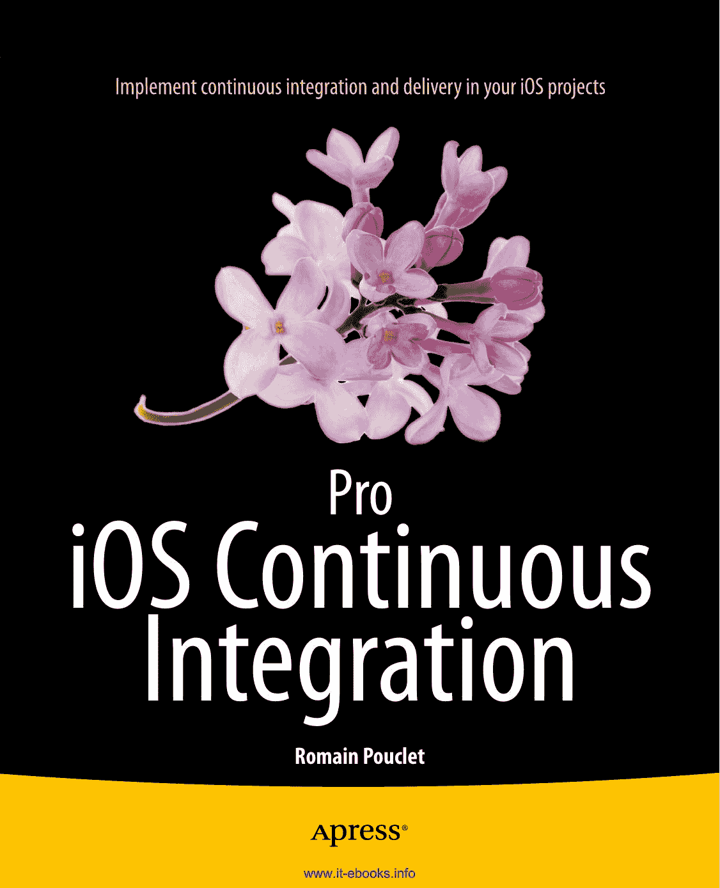
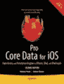

**专业人员的专业伴侣** 书籍 **电子书** ® **现已推出**

*Pro iOS Continuous Integration* 将教你如何在日常工作中充分利用持续集成的优势。随着 iOS 开发者意识到为测试和质量保证构建和部署应用是多么耗时，CI 如今比以往任何时候都更受欢迎。本书将通过真实的应用程序和示例，向你展示如何让开发工作变得更轻松。

**通过本书，你将能够：**

-   了解持续集成和持续交付的真正含义，以及它们如何应用于你的 iOS 项目
-   学习如何使用 `Xcode` 在 App Store 之外发布 iOS 应用程序
-   理解如何利用命令行的强大功能来构建项目并运行测试
-   使用 `Jenkins` 和 `Bamboo` 来设计自动化构建并自动化整个构建过程
-   学习如何使用 `Xcode` 服务器和机器人
-   了解可以使用哪些质量保证工具来衡量代码质量，以及如何将构建版本发送给测试人员

作者 Romain Pouclet 提供了关于 iOS 持续集成的实践性经验。通过本书，你将发现无论你是一名独立的 iOS 开发者，还是大公司的团队成员，建立一个功能完备的持续集成平台其实并不困难。

**Pro iOS Continuous Integration** **Romain Pouclet** ISBN 978-1-4842-0125-1 分类：Macintosh/编程 用户级别：中高级 源码在线 [www.apress.com](http://www.apress.com/)

为方便您阅读，Apress 已将部分前置材料放在索引之后。请使用书签和“内容一览”链接进行访问。

## 内容一览

-   关于作者 �������������������������������������������������������������������������������������������������������������������������������������������������[xiii]
-   关于技术审校者 �������������������������������������������������������������������������������������������������������������������������������������������[xv]
-   致谢 ���������������������������������������������������������������������������������������������������������������������������������������������������������������[xvii]
-   引言 ��������������������������������������������������������������������������������������������������������������������������������������������������������������[xix]
-   第 1 章：持续集成简介 ������������������������������������������������������������������������������������������������������������������������������[1]
-   第 2 章：iOS 和 Xcode 中的持续集成特性 ����������������������������������������������������������������������������������������[5]
-   第 3 章：使用 Xcode 在 App Store 之外发布应用程序 ����������������������������������������������������������������������[29]
-   第 4 章：调用命令行的力量 ������������������������������������������������������������������������������������������������������������������[41]
-   第 5 章：使用 Jenkins 进行自动构建 ����������������������������������������������������������������������������������������������������������[67]
-   第 6 章：使用 Bamboo 进行自动构建 ��������������������������������������������������������������������������������������������������������[93]
-   第 7 章：空中分发 ��������������������������������������������������������������������������������������������������������������������������������[117]
-   第 8 章：Xcode 机器人的日常使用 ����������������������������������������������������������������������������������������������������������[141]
-   第 9 章：将单元测试纳入其中 ������������������������������������������������������������������������������������������������������������������[161]
-   第 10 章：质量保证 ����������������������������������������������������������������������������������������������������������������������������������[183]
-   索引 ������������������������������������������������������������������������������������������������������������������������������������������������������������������[197]

## 引言

持续集成的定义数量，至少和编程语言的数量一样多，甚至可能更多。所有这些带有主观色彩的定义都在互联网上被广泛讨论：它是什么，它能如何帮助，要使用哪些工具……其中只有少数是完整、详尽的指南，能够指导你从何处开始，去往何处，更不用说在 iOS 生态系统中的情况了。平心而论，iOS 平台仍然相对较新。

由于你必须先学会走路才能跑步，本书将从开发者的角度带你游览 iOS 生态系统。如果你有兴趣阅读本书，你可能已经在 `Xcode` 前花了不少时间，但你是否知道，通过自动化测试和版本管理，它能让你的生活轻松得多？你是否知道你可以轻松地使用多个版本的 `Xcode`？更重要的是，你是否了解它在底层是如何工作的？这就是本书将要教授你的内容。

持续集成关乎于决定最佳的工作流程并选择正确的工具。我们不想让你觉得应该把我们的意见奉为圭臬，因此我们选择在介绍 `Jenkins` 和 `Bamboo` 这两个不同的持续集成平台之前，首先为你提供所需的所有知识。我们将向你展示如何尽快上手，以及如何获取一个示例应用程序，构建它，测试它，并最终发布给测试人员。在介绍了这些第三方工具之后，我们将介绍 OS X Server 和 `Xcode`，这些是 Apple 提供的官方工具。它们远非完美，但提供了足够多的显著优势，足以让所有非官方的替代品感到威胁。

针对所有这些解决方案，我们将向你展示如何集成工具来运行自动化测试和分析代码，确保你将所有时间都花在自动化一个编码良好、按预期工作的应用程序的工作流程上。

最后，选择哪种工具最适合你和你的公司，完全取决于你自己。

