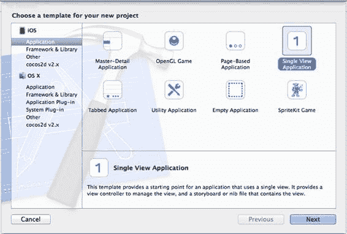
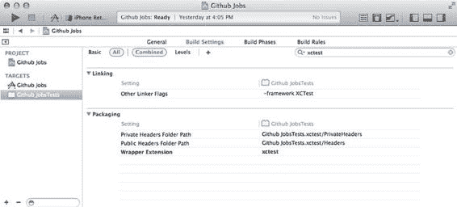
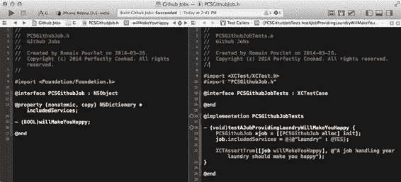
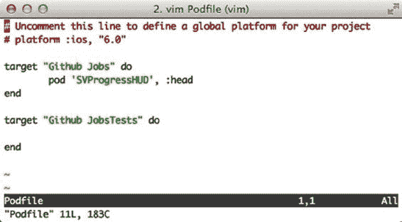

# 第 2 章：iOS 和 Xcode 中的持续集成特性

持续集成关乎选择正确的工具，iOS 社区并未等待苹果就自行搭建了他们的环境。他们又能如何呢？众所周知，苹果的工作是保密的，并且每年通常在 WWDC 上发布一次所有的新工具。首先，让我们看看那些一直存在的事物，无论是特指 `Xcode` 内部，还是更广泛的社区。

如果说 `Xcode 5` 带来了一些闪亮的持续集成新工具，比如我们将在本书后面讨论的 `Xcode bots`，那么之前的版本已经提供了有用的集成来帮助你完成一些工作。即使现在替代方案越来越流行（例如 `AppCode`），即使仍有人使用他们最喜欢的文本编辑器和终端来构建应用，`Xcode` 仍然是事实上的 IDE。

当然，它也有缺陷，就像著名的网站 “Text from Xcode”（可访问 [textfromxcode.com](http://textfromxcode.com/)）在过去几年里幽默地展示的那样。没有软件是完美的，我们作为开发者往往认为一切都是理所当然的，但实际上 `Xcode` 为你处理了很多事情。让我们看看它能做什么，以及它将如何帮助我们建立持续集成环境。

在本书中，我们将花大量时间在 `Xcode` 中。直接给你一些随机截图让你自己去适配现有应用是没有意义的，因此我们将使用 `GitHub Jobs API` 创建一个非常简单的应用。

我们将从创建示例应用开始，并浏览默认项目模板为我们提供了什么：应用的 info 文件在哪里，单元测试在哪里，以及它们依赖于哪个框架。然后，我们将继续学习一些更高级的内容，比如使用 `Git` 对项目进行版本控制，以及使用 `CocoaPods`（一个著名的 `Xcode` 项目依赖管理器）来管理依赖关系。最后，我们将设置好一切，先向测试人员发布应用，最终向全世界发布。这将为我们深入探讨 `Xcode` 如何帮助我们管理多个环境提供绝佳机会。

**5**

[www.it-ebooks.info](http://www.it-ebooks.info/)



**6**

## 示例应用：Github jobs

[GitHub 是一个托管服务，访问地址为 github.com](http://github.com/)，用于使用 Git 版本控制系统的软件开发项目。它提供免费、付费和企业计划，并且在社区中非常知名。在其他服务中，它专门为求职者和公司提供了一个专属的招聘版块。如果你想了解更多关于此服务的信息，请访问 [`jobs.github.com.`](https://jobs.github.com/)

正如我们之前所说，本书的目的不是教你如何用 `Objective-C` 编程。既然你在阅读本书，很可能你已经相当了解它了。这就是为什么我们让应用保持非常简单：它将调用 `GitHub API`，获取一批招聘信息，并使用 `UITableView` 在列表中显示它们。仅此而已。

### 创建应用

首先，使用苹果的模板创建一个新的 iOS 项目。打开 `Xcode` 并点击 “Create a new Xcode project” 按钮，或者在 `Xcode` 打开时，从 “File” 菜单中选择 “New → Project . . .”。

确保从侧边栏中选择了 iOS 应用模板，并选择 “Single view application”，如图 2-1 所示。

**图 2-1.** 选择我们想要开始开发应用的基础模板

[www.it-ebooks.info](http://www.it-ebooks.info/)

**第 2 章：iOS 和 Xcode 中的持续集成特性**

**7**

使用 “Github Jobs” 作为产品名称，“com.perfectly-cooked” 作为公司标识符，“PCS” 作为类前缀。这是我们将会使用的名称，它会使你更容易理解截图。其他选项不太重要，只需确保勾选 “Create Git repository on . . .” 并暂时选择 “My Mac”。`Xcode` 允许你使用 OS X 服务器来托管代码以及其他功能，但我们稍后会讨论这个问题。

### Xcode 提供了什么

我们使用的是 `Xcode` 提供的标准模板。它自带一个简单的 `Storyboard` 文件、一个应用代理以及一个 `UIViewController` 子类。让我们看看在日常工作流程中可以使用哪些内容，以及它们将如何融入我们的持续集成过程中。

#### 应用的 Info 文件

每个应用都带有一个以属性列表格式编写的 `Info` 文件，你会在 “MyApplicationInfo.plist” 或本例中的 “Github Jobs-Info.plist” 名称下找到它。当你打开该文件时，基本上可以找到关于该应用的所有公开信息，其中包括：应用的名称以及你在创建项目时设置的产品标识符。

**关于属性列表格式的说明：** 属性列表文件是使用 “.plist” 文件扩展名存储序列化对象的文件，因此通常被称为 `Plist` 文件。由于 iOS 和 OSX SDK 中提供了你所需的所有 API，属性列表文件通常是存储应用信息以及其他各种设置和数据的标准文件格式。


首先，从你喜欢的文本编辑器中打开文件，你可以手动导航到创建应用程序的目录，然后进入与应用程序主目标对应的“Github Jobs”目录（另一个是测试目标，稍后会详细介绍），也可以在 Xcode 文件资源管理器中右键点击该文件，选择“使用外部编辑器打开”。文件开头几行应该类似于以下内容：

```xml
<?xml version="1.0" encoding="UTF-8"?>
<!DOCTYPE plist PUBLIC "-//Apple//DTD PLIST 1.0//EN"
"http://www.apple.com/DTDs/PropertyList-1.0.dtd">
<plist version="1.0">
<dict>
<key>CFBundleDevelopmentRegion</key>
<string>en</string>
<key>CFBundleDisplayName</key>
<string>${PRODUCT_NAME}</string>
<key>CFBundleExecutable</key>
<string>${EXECUTABLE_NAME}</string>
<key>CFBundleIdentifier</key>
<string>com.perfectly-cooked.${PRODUCT_NAME:rfc1034identifier}</string>
...
```

至少可以说，这对人类并不友好。不过别担心：Xcode 并不要求你手动编辑这个文件。实际上，Xcode 自带了一个属性列表编辑器，能让你更轻松地查看这个文件。它还能将键转化为易于理解的句子。这样，`LSRequiresIPhoneOS` 就变成了“应用需要 iPhone 环境”。

请注意，你仍然可以查看底层的键名。这对于调试很有帮助，或者仅仅因为互联网上的教程经常引用这些原始键名。在编辑器中，右键点击并选择“显示原始键/值”。

我们最关心的是两个版本属性，默认情况下，它们的值应为 1.0。第一个属性是“Bundle versions string, short”，也就是 `CFBundleShortVersionString`，它是应用程序的主版本号。如果你已经在 App Store 上发布过应用，你可能已经修改过它的值。第二个属性是“Bundle version”，即 `CFBundleVersion`，它是完整的版本号，不一定需要人类可读。大多数人倾向于让两者保持同步，但在我们的情况下，这将是配置上的浪费，因为长版本号在未来会证明其有用性。

在本书的后续部分，我们将开始讨论自动化构建。这些构建总是伴随着一个递增的编号，这正是 `CFBundleVersion` 键发挥作用的地方。根据苹果文档，`CFBundleVersion` 指定了应用程序的一个版本（无论是否发布），这非常合适。每次构建我们的应用程序时，我们都会用构建编号来更改 `CFBundleVersion`。为了保持清晰，这两个版本之间保持一致性非常重要。

这个 `Info.plist` 文件包含了有关应用程序的信息，这些信息可以通过 `NSBundle` 类获取。其内容并不局限于当前可用的键，事实上，还有很多其他键会在特定情况下被添加，例如，当你希望应用程序在网页调用某个 URL 方案时被打开。Xcode 会为你管理大部分这些键，所以你不需要全部了解。

## 测试

一个 Xcode 项目自带一个测试目标、一个测试类以及你的第一个测试用例。这最后一个测试用例是一个失败的用例，因为它基本上只是调用了 `XCTFail`，这是一个用于强制测试用例失败的 C 宏。不过，这总归是个开始。

一切都已经配置好，以便你可以立即开始工作，并在项目初期就开始编写测试。当你的项目变得庞大和复杂时，你会对此感到非常满意。

当我们开始写这本书时，我们提到过苹果花了不少时间才真正为你提供持续集成的工具。这并不完全正确。从 Xcode 2.1 开始，Xcode 就附带了测试工具 `SenTestingKit` 和 `OCUnit` 的某个版本，当时这些并非苹果官方标注的工具，而是由一家名为“Sen:te”的公司创建的框架（[`sente.ch`](http://sente.ch/)）。

打开示例应用，在文件资源管理器中选择第一个元素“Github Jobs”。选择你的测试目标“Github JobsTests”，然后选择“Build Settings”选项卡。你应该能看到这个目标的所有设置。使用右上角的搜索框过滤这些设置，查找`“xctest”`。如图 2-2 所示，你应该能看到一个名为 `XCTest` 的框架会自动与你的应用程序链接。`XCTest` 是一个全新的测试框架，它很大程度上基于旧框架，但更好、更深入地集成到了 IDE 中，也更加强大。



**图 2-2.** 过滤后的构建设置列表显示了与 Github Jobs 测试目标链接的 `XCTest` 框架

在 5.1.1 版本中，`OCUnit` 和 `SenTestingKit` 框架已被标记为弃用，并将在未来版本的 Xcode 中被移除。事实上，使用 `OCUnit` 的源代码现在会在编译时生成警告。

首先，Xcode 5 附带了一个测试导航器，你可以在侧边栏中找到它，或者按“⌘ + 5”打开。这个导航器允许你查看最近运行的测试用例，并只需按一个按钮就能重新运行它们，使每次重构都变得轻松自如。这还不是全部。Xcode 5 附带新的辅助编辑器，可以帮助你对代码进行单元测试。这些辅助编辑器称为“测试调用者（Test Callers）”和“测试类（Test Classes）”，它们提供对与主编辑器中当前源代码相关的单元测试的访问。

在我们图 2-3 所示的示例中，我们创建了一个假的 `PCSGithubJob` 类（左侧），其中包含一个方法，其目的是分析一份工作邀约并告诉你它是否会让你开心。“测试调用者”编辑器（右侧）自动跳转到了相关的测试方法。



**图 2-3.** Xcode 打开了主编辑器和辅助编辑器，显示与我们类相关的单元测试代码

最后但同样重要的是，`xcodebuild` 命令行工具现在支持 iOS 项目的测试操作。在此版本之前，无法直接从命令行运行你的单元测试。我们将在第 3 章中详细介绍这些工具的等效命令行用法。

回到 Xcode 4 时代，当你创建一个 iOS 或 OSX 应用程序时，你需要勾选一个选项才能为你的项目添加测试目标，而现在这是默认行为。这是苹果的一个很好的举措，因为 iOS 开发者社区一直给人主要关注设计和用户体验的印象。这显示了苹果帮助 iOS 开发者变得更加专业并开始使用合适工具的明确意愿。

最后，这个新的测试框架实际上是与“Xcode Bots”同时发布的。它们旨在帮助你拥抱持续集成的概念，并且与 `XCTest` 完美契合。一定要阅读第 8 章，了解更多关于它们的信息！

一个良好的测试套件在持续集成环境中至关重要。我们之前谈到过，一个好的环境会为你提供最大化的反馈。自动化测试就是实现这一目的的工具之一。无论你是一个独自工作的独立 iOS 开发者，还是一个正在考虑是否要集成同事开发的功能的开发者，首先确保所有测试都通过，这绝对会帮助你做出决策。


## Git 集成

正如我们在引言中所述，将代码片段集成到项目中，通常意味着使用你喜爱的版本控制系统来合并分支。一个成功的持续集成通常意味着一个完善的工作流程。当你参与一个应用的开发时，会发生几件事情。一旦第一个版本发布，你就会开始着手新功能，其中一些功能需要花费时间，因此你会在仓库的独立分支上工作。在此期间，你的用户可能会向你发送关于应用中各种小问题的错误报告和反馈。这些问题必须尽快修复，并作为应用的新小版本发布。同样，为了避免搞乱应用，你会像开发新功能一样，在独立的分支上工作。

需要牢记的主要一点是，无论何时工作，你都需要获得关于当前任务的反馈。你希望知道在实现新功能时是否破坏了某些东西，或者报告给你的 bug 是否正在被修复。此外，你的 QA 团队、老板，甚至客户可能也需要这样的反馈，很可能还需要一份应用的新构建版本。因为“抱歉，我现在把应用搞坏了，请一两个小时后再打给我”并不是一个可以接受的回答，所以你必须将所有内容保持分离。

好消息是，在 Git 中创建分支成本很低。你可以随心所欲地创建任意数量的分支，而不会给你或同事带来任何麻烦。更棒的消息是，正如你在创建 Github Jobs 项目或查看 Xcode 中那个大大的“源代码控制”菜单时可能已经注意到的，Xcode 直接内置了 Git 支持。

在过去，Xcode 只支持 Subversion 和 CVS。尽管前者仍然存在（尽管由于 Git 和 Mercurial 等分布式版本控制系统（DVCS）的出现，它已经显得有些过时），而后者则明显是版本控制黑暗年代遗留的产物。

Git 是一种非常流行的版本控制系统，它以分布式方式工作。这意味着与 SVN 的工作方式相反，项目的每一个工作副本都可以被用作远程仓库，甚至更好，可以独立工作。

为了向你展示将 Git 深度集成到 Xcode 项目中是多么有用，我们来破坏它。没错，让我们创建一个非常简单的冲突，看看会发生什么。在版本控制系统的世界里，冲突是指合并文件的两个版本变得不可能的情况。如果你在要合并的两个分支中，以不同的方式修改了同一个文件的同一部分，那么 Git 将无法自动合并它们，需要人工介入。

在 Xcode 中，从“源代码控制”菜单中选择“Github Jobs – master”，然后选择“新建分支...”。在弹出的字段中，将分支名称字段填写为 `"saying-hi"`，然后点击“创建”。

此过程结束后，你将在一个专门用于“Saying Hi”功能的分支上工作。

这意味着你的应用将继续演进，同时一个稳定版本（master 分支）仍然存放在某处。

现在，打开 `AppDelegate.m` 文件，并添加一条简单的 `NSLog` 指令，在应用启动完成时向用户问好：

```
#import "PCSAppDelegate.h"

@implementation PCSAppDelegate

- (BOOL)application:(UIApplication *)application didFinishLaunchingWithOptions:(NSDictionary *) launchOptions

{

NSLog(@"Hi, I'm a sample application for a book.");

return YES;

}

@end
```

实现这个问候语后，打开“源代码控制”菜单，选择“提交...”。在出现的表单中，输入一条简单的提交消息，例如“在应用启动时问好”，然后点击“提交 1 个文件”按钮。现在你已经在这个功能分支上进行了第一次提交。

要创建一个冲突，文件必须在不同分支的相似位置被修改过，所以我们需要回到 master 分支，创建一个与我们刚刚所做的类似的提交。

从“源代码控制”菜单中，选择“Github Jobs – saying-hi”，然后选择“切换到分支...”。

在出现的列表中，选择 master 分支，然后点击“切换”。现在我们已经回到了 master 分支，我们之前添加的 `NSLog` 指令已经不在了。

让我们在仍然处于 master 分支的情况下，用一条略有不同的问候消息重复这个过程。

我们选择使用“Hi, I'm a book created for a sample application”，这确实意义不大。像之前一样提交你的修改。现在我们有了两个分支，它们都在同一个文件的相同位置有一条略有不同的问候指令。

最后，从“源代码控制”菜单中，选择“Github Jobs – master”，然后选择“从分支合并...”。在出现的列表中，选择 `"saying-hi"`，然后点击“合并”：将会出现一个类似于图 2-4 所示的窗口。选择屏幕底部菜单中的第三个按钮以集成右侧的修改，然后点击“合并”。

**图 2-4.** Xcode 已检测到冲突并将帮助你修复它

这基本上就是冲突的工作原理，也是 Xcode 如何协助你修复冲突并保持项目清洁的方式。然而，有时冲突会发生在 Xcode 之外，因为你决定使用命令行来合并分支，或者因为你开始使用专用的 Git 客户端。

这就是 Xcode 能够理解的情况。当这种情况发生，并且你的一些文件被奇怪的字符弄得面目全非时，构建你的应用可能只会抛出一些随机的语法错误，然后让你自己去寻找构建失败的原因。Xcode 比这聪明得多。实际上，除非冲突被你使用 shell、你喜爱的 Git 客户端，或者直接在 Xcode 中手动标记为已解决（如图 2-5 所示），否则你甚至无法构建你的应用。

**图 2-5.** Xcode 已检测到冲突文件，并在侧边栏和主编辑器中将其标记出来

要修复此冲突并将其标记为已解决，请编辑 `AppDelegate.m` 文件，直到它看起来令你满意为止。

在我们的例子中，就是只保留一个 `application:didFinishLaunchingWithOptions:` 方法，并选择第二条消息。你必须删除所有冲突标记，即那些包含多个尖括号和等号的行，这样你的应用才能再次构建。毕竟，在此上下文中，它们不过是语法错误。完成后，只需右键单击冲突文件，然后在“源代码控制”菜单项中选择“将选定文件标记为已解决”。

Xcode 中的版本控制并非总是美好和完美的。使用 Apple 的文件格式（如 `xcodeproj` 文件，甚至 `xib` 和 `storyboards`）会带来一些边缘情况。在 Xcode 5 中，Apple 为这些 Interface Builder 文件带来了一种更简单的文件格式，使得合并操作和冲突解决变得容易得多。从 NIB 到臃肿的 XIB，再到几乎可读、体积缩小十倍的 XIB，Apple 确实在努力简化这一过程。再一次，我们已经走了很长的路，尽管我们仍在等待那些 `xcodeproj` 能有更简单的文件格式，它目前仍然使用一种老式的基于大括号的格式来划分配置层次结构。


## 如果这本书只能给你一条建议

如果这本书只能给你一条建议，那就是：在涉及 `Xcode` 项目或 `Xcode workspace` 文件的合并操作时，请关闭 `Xcode`。通常，这种情况发生在你团队中有人修改了“预置描述文件”和/或“代码签名”部分中的设置时。由于这种格式几乎不具备人类可读性，合并的结果可能会变得非常混乱，而 `Xcode` 也可能变得有点“容易崩溃”。

[www.it-ebooks.info](http://www.it-ebooks.info/)

## iOS 和 Xcode 中的持续集成功能

这种直接在 IDE 中的集成方式仍有几个缺点。首先，它相当有限。你只能执行基本的 `Git` 操作，很可能最终还是会使用你的 shell 或专门的 `Git` 客户端。此外，`Xcode` 自带了自己的 `Git` 版本。在撰写本书时，`Git` 的当前稳定版本是 2.0.1，在 shell 中运行 `git --version` 后即可看到：

```
$ git --version
git version 1.9.1
```

这个版本可以很容易地使用诸如 `Homebrew` 之类的包管理器进行安装，如果你手头有一些空闲时间，甚至可以手动编译和安装。然而，如果你打开终端并运行一个简单的命令，你应该会看到 `Xcode` 使用的 `Git` 版本是苹果自家的版本，基于 1.8.5.2：

```
bash-3.2$ $(xcode-select -print-path)/usr/bin/git --version
git version 1.8.5.2 (Apple Git-48)
```

在大多数情况下，这不会造成任何问题，但 `Xcode` 的 `Git` 版本与你使用的版本之间可能会出现不兼容。例如，当 `Xcode 4` 是当前版本，而最新的 `Git` 已经比其自带的版本领先了好几个版本时，就曾出现过这种情况。

**关于 `xcode-select` 的说明：** `xcode-select` 是苹果官方命令行工具附带的一批非常有用的工具之一，如果你同时操作多个 `Xcode` 安装（例如在测试版期间），它会非常有帮助。我们将在第 4 章中对此进行更多讨论。

## CocoaPods

有人曾说过，“伟大的项目伴随着庞大的依赖”，在 iOS 项目中管理外部库的依赖一直以来都十分令人头疼。这是你的 iOS 项目中不需要的麻烦，但除了工作区、子项目和*手动*管理依赖的搜索路径之外，苹果似乎并不愿意提供一个官方工具。这是在 `CocoaPods` 出现之前的情况。

`CocoaPods` 是一个用 Ruby 编写的依赖管理器，其灵感毫无意外地来源于 `RubyGems` ([`rubygems.org/`](https://rubygems.org/))。如果你不了解它，但过去曾写过 Ruby 代码，那么它在 `PodFile`（你将在其中声明所有依赖）中使用的语法非常易于理解，应该不会给你带来太多困难。

是否使用 `CocoaPods` 在 iOS 和 Mac 社区中确实存在争议。无论你是讨厌它还是喜欢它，在本书中，我们明确站在喜欢它的人这边。在不断集成代码块的过程中，让一个设计良好的工具来处理你的依赖管理，可以减少一些需要担心的事情，并让你有更多时间专注于其他事情。

作为额外的好处，你实际上可以为特定应用的依赖使用 `CocoaPods`，这意味着你可以用它来将你的大型应用拆分成多个模块，并让 `CocoaPods` 来处理合并。

[www.it-ebooks.info](http://www.it-ebooks.info/)

再次强调，没有银弹。正如其网站上所写的，“CocoaPods 尚未准备好用于生产环境。”在撰写本书时，0.33.1 是最新版本。它远非完美，但总比完全没有工具要好得多。我们将在示例应用中使用 `CocoaPods`。

说到这个，让我们开始编码吧。

## 编写示例应用

在 `Xcode` 中打开我们之前创建的“Github Jobs”项目，在文件浏览器中选择唯一的视图控制器头文件，并将其改为 `UITableViewController`，而不是简单的 `UIViewController`。转到相关的实现文件，声明一个类型为 `NSArray` 的 `jobs` 属性，并实现 `UITableViewDataSource` 所必需的方法：`tableView:numberOfRowsInSection:` 和 `tableView:cellForRowAtIndexPath:`。在此过程结束时，你的实现文件应该如下所示：

```objc
#import "PCSViewController.h"

@interface PCSViewController ()

@property (nonatomic, strong) NSArray *jobs;

@end

@implementation PCSViewController

#pragma mark - Table View

- (NSInteger)numberOfSectionsInTableView:(UITableView *)tableView
{
    return 1;
}

- (NSInteger)tableView:(UITableView *)tableView numberOfRowsInSection:(NSInteger)section
{
    return self.jobs.count;
}

- (UITableViewCell *)tableView:(UITableView *)tableView
         cellForRowAtIndexPath:(NSIndexPath *)indexPath
{
    UITableViewCell *cell = [tableView dequeueReusableCellWithIdentifier:@"Cell"
                                                            forIndexPath:indexPath];
    return cell;
}

@end
```

然后，打开故事板文件，删除 `Xcode` 已创建的视图控制器。取而代之的是，拖入一个新的导航控制器。它应该会自动带有一个表格视图控制器。选中它，并使用 `PCSViewController` 作为其类。选中导航项，并将标题更改为“iOS 职位”。在表格视图控制器中，选中第一个原型单元格，并为其指定 `Cell` 重用标识符，以避免之后运行时出现异常。这就是这个应用中大致需要做的所有事情。我们试图让它保持非常简单。

`Github Jobs API` 非常简单，你只需要调用一个特定的 URL 来获取一份 JSON 格式的纽约地区 iOS 职位列表。使用 iOS 7.0 新的 `NSURLSession` API，回到你的视图控制器实现文件，在 `viewWillAppear:` 方法中从那个著名的 URL 获取内容，如下所示：

```objc
- (void)viewWillAppear:(BOOL)animated {
    NSURL *url = [NSURL URLWithString:
                  @"https://jobs.github.com/positions.json?description=ios&location=NY"];
    NSURLSessionDataTask *jobTask = [[NSURLSession sharedSession] dataTaskWithURL:
                                     url completionHandler:^(NSData *data, NSURLResponse *response, NSError *error) {
        dispatch_async(dispatch_get_main_queue(), ^{
            if (error) {
                UIAlertView *alert = [[UIAlertView alloc] initWithTitle: @"发生错误"
                                                                message: error.localizedDescription
                                                               delegate: nil
                                                      cancelButtonTitle: @"关闭"
                                                      otherButtonTitles: nil];
                [alert show];
                return;
            }
            NSError *jsonError = nil;
            self.jobs = [NSJSONSerialization JSONObjectWithData: data options: 0 error: &jsonError];
            [self.tableView reloadData];
        });
    }];
    [jobTask resume];
}
```

请注意，我们使用 Grand Central Dispatch (GCD) 的函数包装了完成块的全部内容，以便所有 UI 任务都在主线程上执行。不要忘记更新 `tableView:cellForRowAtIndexPath:` 方法，以显示职位的 `title` 属性。

```objc
- (UITableViewCell *)tableView:(UITableView *)tableView
         cellForRowAtIndexPath:(NSIndexPath *)indexPath {
    UITableViewCell *cell = [tableView dequeueReusableCellWithIdentifier:@"Cell"
                                                            forIndexPath:indexPath];
    cell.textLabel.text = self.jobs[indexPath.row][@"title"];
    return cell;
}
```

这个应用本可以做成一个主-从应用，选择一行可以打开一个详细页面，显示应用图标、关于职位的详细信息以及一个帮助用户申请的直接按钮。然而，由于构建一个完整的应用并非本书

[www.it-ebooks.info](http://www.it-ebooks.info/)




