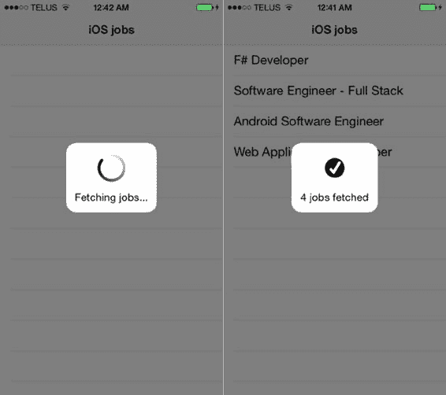

# 书籍：使用 `. . .` 选择单元格将打开 Safari 移动版

为此，请在 `PCSViewController.m` 中实现当用户点击某个单元格时将被调用的委托方法，如下所示：

```
- (void)tableView:(UITableView *)tableView didSelectRowAtIndexPath:(NSIndexPath *)indexPath {
    NSURL *jobUrl = [NSURL URLWithString: self.jobs[indexPath.row][@"url"]];
    [[UIApplication sharedApplication] openURL: jobUrl];
}
```

这个应用程序唯一缺失的部分是向用户表明正在加载工作、内容尚不可用的方式。为此，我们将使用一个非常简单的名为 `SVProgressHUD` 的库，并通过 `CocoaPods` 来安装它——没错，就是用它。

关闭你的 Xcode 项目并打开终端。导航到你的 iOS 项目所在位置，如果尚未安装 `CocoaPods`，请先使用 `RubyGems` 进行安装（参见下方说明）。运行 `pod init` 命令创建一个空的 `Podfile` 并打开它。添加 `SVProgressHUD` 作为依赖项，如图 2-6 所示：

***图 2-6.** 使用 vim 添加 SVProgressHUD 库作为依赖项*

最后，运行 `pod install` 并打开生成的 `Github Jobs.xcworkspace` 文件，而不是之前的 `Github Jobs.xcodeproj`。这就是我们要求关闭 Xcode 的原因。

以下是整个过程：

```
$ (sudo) gem install cocoapods
$ cd path/to/Github\ Jobs
$ pod init
$ vim Podfile
// 编辑 Podfile...
$ pod install
$ open Github\ Jobs.xcworkspace
```

[www.it-ebooks.info](http://www.it-ebooks.info/)

**第二章：iOS 和 Xcode 中的持续集成特性**

## 安装 CocoaPods

当然，如果你使用的是诸如 `rbenv` ([`rbenv.org`](http://rbenv.org/)) 或 `RVM` ([`rvm.io`](https://rvm.io/)) 之类的 Ruby 版本管理系统，CocoaPods 的安装方式可能会有所不同。

`SVProgressHUD` 提供了非常易于使用的显示消息的方法。让我们回到视图控制器，在从 Github Jobs API 获取内容之前和之后，使用这些方法。

在调用我们创建的 `NSURLSessionDataTask` 对象的 `resume` 方法之前，导入 `SVProgressHUD.h` 文件并调用以下类方法：

```
#import <SVProgressHUD/SVProgressHUD.h>

// ...
- (void)viewWillAppear:(BOOL)animated {
    NSURL *url = [NSURL URLWithString:
                  @"https://jobs.github.com/positions.json?description=ios&location=NY"];
    NSURLSessionDataTask *jobTask = ...
    [SVProgressHUD showWithStatus: @"正在获取职位信息..."];
    [jobTask resume];
}
```

`SVProgressHUD` 库提供了两种不同的方法：`showWithStatus:` 和 `showWithStatus:maskType`。我们使用第二种方法，以便能够设置深色背景。否则，我们将无法正常看到 `HUD` 的动画效果。

一旦职位信息被获取，并且 JSON 被正确解码并转换为要显示的职位列表后，我们希望给用户一个处理完成的小提示。为此，请在 `NSURLSession` 的 `dataTaskWithURL:completionHandler:` 完成块的末尾添加以下代码片段。调用 `showWithStatus:` 会显示一个临时的确认消息，无需手动关闭。

```
NSURLSessionDataTask *jobTask = [[NSURLSession sharedSession] dataTaskWithURL: url
                                                           completionHandler:^(NSData *data, NSURLResponse *response, NSError *error) {
    // ...
    [SVProgressHUD showSuccessWithStatus: [NSString stringWithFormat: @"已获取 %lu 个职位",
                                          (unsigned long)[self.jobs count]]];
}];
```

当你运行应用程序时，你应该会在两种情况下都看到 `HUD`，类似于图 2-7。

[www.it-ebooks.info](http://www.it-ebooks.info/)



**第二章：iOS 和 Xcode 中的持续集成特性**

***图 2-7.** 获取职位时显示旋转动画，获取结果后显示确认消息*

使用 `CocoaPods` 安装依赖项除了生成 `PodFile` 之外，还会创建两个东西：一个 `Podfile.lock` 用于管理项目中的依赖状态，以及一个包含实际依赖项的 `Pods` 文件夹。这在社区中确实是一个热议话题，但自动化工具的存在是有其道理的，我们强烈建议你通过在 `.gitignore` 文件中添加 `"Pods"` 来忽略此文件夹：在你创建项目的目录根目录下创建一个 `.gitignore` 文件，并添加 `"Pods"`。

此文件夹将被忽略，当你的依赖项发生变化时（例如，因为你切换到了更新的版本），Git 不会尝试提交它。

## 关于 `.gitignore` 文件

`.gitignore` 文件指定了 Git 应忽略的文件模式。如果你的项目中还没有 `.gitignore` 文件（这完全有可能，因为 Xcode 不会自动生成一个），请从 GitHub 上获取一个：[`github.com/github/gitignore/blob/master/Global/Xcode.gitignore`](https://github.com/github/gitignore/blob/master/Global/Xcode.gitignore)。

## 我们为什么做这些？

我们现在有了一个可以运行的应用程序。它并不美观，也可能没什么用，但我们将在本书的后续章节中把它作为一个示例来使用。如果你对完整的应用程序感兴趣，可以通过以下网址获取：[`github.com/palleas/github-jobs`](https://github.com/palleas/github-jobs)。

[www.it-ebooks.info](http://www.it-ebooks.info/)

**第二章：iOS 和 Xcode 中的持续集成特性**

## 准备发布应用程序

在一个项目的生命周期中，会存在应用程序的多个版本。首先，是你在自己电脑上开发、将在 iOS 模拟器或测试设备上运行的版本。然后，是你的 QA 团队用来审查你实现的最新功能和修复的 bug 的版本。完成这些之后，将有一个你会发送给客户的应用程序版本。这是将应用程序推送到官方 App Store 之前的最后一步。最后，当客户对你发送的版本满意后，将会有一个生产就绪的应用程序。所有这些版本都将具有其特殊性。

例如，当应用程序发生错误时，你可能不想显示相同级别的信息。此外，你大概率不会希望因为代码中的断言失败而导致应用程序崩溃。得益于 Xcode，这种多配置是很容易实现的。

当然，这并不是唯一的工作方式；你可能是独立的 iOS 开发者，也可能没有可支配的 QA 团队。我们将简化所有人的流程，只设置三个配置级别：

- **Debug（调试）**：你在开发应用程序时使用的配置级别。当你误用某些代码时，它可能会时不时地崩溃，并在发生错误时显示大量信息。在此配置中，诸如出色的 [Reveal](http://revealapp.com/) 等调试工具或依赖私有 API 的库可能会与你的应用程序链接。
- **Adhoc（临时）**：你将发送给 QA 团队和/或客户的版本所使用的配置。调试和开发工具已移除，错误消息对用户友好得多。例如，它可以与崩溃日志报告器链接，以简化与客户之间的沟通。
- **Release（发布）**：你的应用程序在商店上线时使用的配置。

回到你的 Xcode 项目，在文件浏览器中选择顶级元素，并确保 "Project" 部分中的 `"Github Jobs"` 项目被选中。如果你查看屏幕上的内容，你会看到 Xcode 已经为你提供了两个不同的配置级别，如图 2-8 所示。


