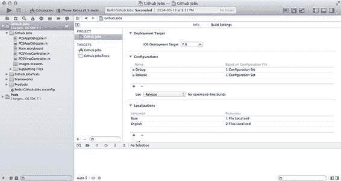
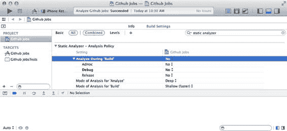
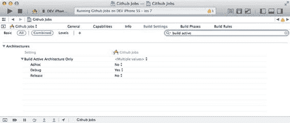
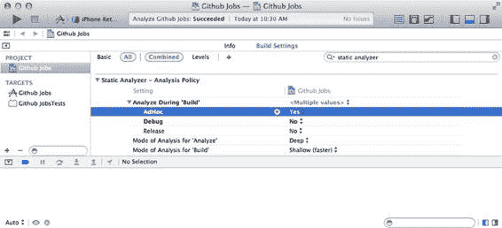
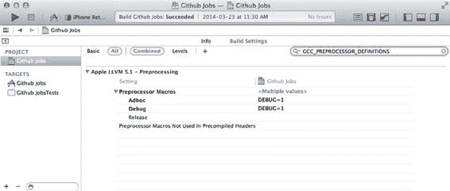
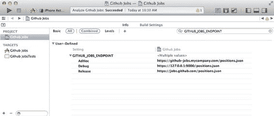
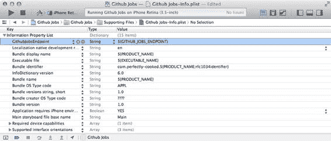
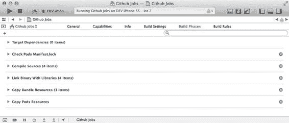

# 第 2 章：iOS 和 Xcode 中的持续集成功能

[www.it-ebooks.info](http://www.it-ebooks.info/)



***图 2-8.** 默认情况下，Xcode 项目包含两个配置层级：Debug 和 Release*

由于我们需要一个名为“AdHoc”的第三个配置，请点击配置列表下方的加号，选择“复制 Debug 配置”，因为从 Debug 配置中删除不需要的内容，远比将所需内容添加到 Release 配置中容易得多。在新出现的行的第一个单元格中，填入“AdHoc”。现在我们便有了三个配置层级。

你可能会好奇为什么选择“AdHoc”作为配置名称。“Ad Hoc”源自拉丁语，意为“为了这个”。这是苹果公司制定的一个流行惯例。实际上，当你在 iOS 开发者中心创建分发证书时，可以选择创建一个“Ad Hoc”预置描述文件，从而无需通过 App Store 即可部署你的应用。我们将在第 7 章中更详细地讨论 Ad Hoc 预置描述文件和无线分发。

我们现在有了三个配置层级。来看看它们如何在持续集成过程中帮助我们。进入项目配置中的“构建设置”标签页。你会看到许多你不想调整的设置，主要是因为其中一些看起来像是天书，而且老实说，苹果已经很好地设置了这些默认值。我们来看看其中的几个。你可以通过界面顶部的搜索字段快速跳转到特定设置，并比较不同配置下的设置差异，例如“仅构建活动架构”。

在开发应用程序时，你希望构建过程尽可能快。这就是为什么你不会为所有有效架构进行构建。考虑到当前市场上从 iPad 3 到 iPhone 5S 的各种活跃设备，你最终需要为三种不同架构构建：`armv7`、`armv7s` 和 `arm64`，这会使构建速度变慢。

查看“仅构建活动架构”选项，你会发现 Debug 配置下该选项设为 `YES`，而 Adhoc 和 Release 构建下设为 `NO`。保持构建尽可能快非常重要，这也是为什么其他设置（例如“验证产品”）在 Debug 构建中被禁用。另一方面，当你的应用程序由自动化构建

[www.it-ebooks.info](http://www.it-ebooks.info/)





工具定期构建时，你并不介意构建变慢，实际上还希望获得这些设置提供的额外反馈。

对于 AdHoc 配置，请为此构建设置选择 `NO`，如图 2-9 所示。我们希望获得 Debug 配置提供的额外反馈，但由于不知道应用程序将安装在哪些设备上，我们实际上需要这三种架构。我们将在第 4 章中进一步讨论这些架构。

***图 2-9.** 项目附带多个配置层级，这些设置可被继承或覆盖*

在构建设置中查找“静态分析器”部分。如图 2-10 所示，静态分析器在构建过程中是禁用的。

***图 2-10.** 静态代码分析在构建过程中被禁用*

[www.it-ebooks.info](http://www.it-ebooks.info/)



这样做的原因很简单：代码的静态分析速度很慢。当你希望进行更深入的分析而不是浅层分析时，速度会更慢。让我们为 AdHoc 配置启用它，如图 2-11 所示。


### 图 2-11. 现在已对使用 Adhoc 配置的构建启用了静态代码分析

当然，我们并不是告诉你要在项目中完全避免质量保证。事实上，第 10 章将专门讨论这个主题。

## 自定义构建设置

为应用程序配置多个方案，不仅仅让你能够调整项目自带的构建设置。在一个真实的应用程序中，你可能需要与不同的网络服务交互，例如 YouTube、Twitter，甚至是自定义的后端服务。当然，你不想污染正式环境，比如用 Twitter 的例子，在真实账户上发布大量测试推文。

在你的不同配置中，你会希望为网络服务设置不同的端点以及不同的安全令牌。

在我们的例子中，我们假设拥有应用的源码并运行多个实例：本地计算机上的一个实例、用于测试和审查的预发布（staging）实例，以及位于 [`jobs.github.com`](http://jobs.github.com/) 的正式实例。

有一种非常简单的方法可以在开发令牌和网络服务端点之间进行切换。

编译器提供且易于在 Xcode 中编辑的一项设置是**预处理器宏**，它们在编译时被评估一次，并且是最终确定的。这个设置的名称为 `GCC_PREPROCESSOR_DEFINITIONS`，可以在 Xcode 的 `Preprocessor Macros` 部分找到。正如你将在图 2-12 中看到的，Xcode 已经声明了一个 `DEBUG` 宏，它仅在 `Debug` 环境（以及基于 `Debug` 的 `Adhoc` 环境）中可用。

[www.it-ebooks.info](http://www.it-ebooks.info/)



### 图 2-12. 调试宏可用于 Debug 和 Adhoc 配置

在你的代码中，使用预处理器条件判断来利用这些信息非常容易。这些条件将在编译期间被评估，部分代码块会被实际编译，而另一些则会被忽略。你可以使用这个简单的技巧来处理开发环境和生产环境。例如，在我们的代码中：

```
- (void)viewWillAppear:(BOOL)animated {
#if DEBUG
NSURL *url = [NSURL URLWithString:
@"https://127.0.0.1:9000/positions.json?description=ios&location=NY"];
#else
NSURL *url = [NSURL URLWithString:
@"https://jobs.github.com/positions.json?description=ios&location=NY"];
#endif
}
```

尽管这个方案可以工作，但它只适用于处理两种配置，并且有一些缺点。这个方案最大的缺点是代码会变得更复杂。之前我们提到了三种配置，因此我们需要使用 `#elseif` 添加一个新的条件判断块。

保持代码整洁应该是你的主要目标，而采用这种方法，代码会变得非常不清晰，尤其是在你继续使用这种方案处理令牌、端点和图片时。我们真正需要的是将 URL 端点与配置关联起来的方法，而这一点可以通过在 Xcode 中使用自定义构建设置轻松实现。

打开 `Editor` 菜单，然后从 `Add Build Setting` 中选择 `Add User-Defined Setting`。在出现的单元格中，填写 `GITHUB_JOBS_ENDPOINT` 并按回车。我们现在有了一个新的构建设置，它可以根据配置包含不同的值，如图 2-13 所示。

[www.it-ebooks.info](http://www.it-ebooks.info/)





### 图 2-13. 我们的应用程序现在带有一个专用于 Github Jobs API 端点的新构建设置

现在这个设置对我们可用，有几种方法可以在代码中访问它。最简单的方法是让它在你应用的 Info 属性列表文件中可用，并在运行时从那里获取它。

打开 `Github Jobs-Info.plist`，点击悬停在 `Information Property List` 单元格上时出现的加号。在出现的行中，输入 `GithubJobsEndpoint` 作为新属性的键，如图 2-14 所示。确保在类型列中选择 `string`，并使用 `$(GITHUB_JOBS_ENDPOINT)` 作为值：此属性的值将自动替换为 `GITHUB_JOBS_ENDPOINT` 构建设置的内容，该内容可能因我们的不同配置而异。

### 图 2-14. 应用程序清单现在包含了基于当前配置端点设置值的 URL 基础

[www.it-ebooks.info](http://www.it-ebooks.info/)



该文件的内容可作为 `NSBundle` 类的 `infoDictionary` 属性使用。我们需要做的就是在视图控制器中使用它，而不是硬编码的端点。

```
NSString *endpoint = [[NSBundle bundleForClass: [self class]] infoDictionary]
[@"GithubJobsEndpoint"];
NSURL *url = [NSURL URLWithString: [endpoint stringByAppendingString:
@"?description=ios&location=NY"]];
```

请注意，如果你尝试运行该应用程序，会出现错误，因为你的计算机上并没有真正运行一个服务器并监听 9000 端口的请求。如果你想尝试一下，你可以使用 Ruby 在你的计算机上轻松创建一个 HTTP 服务器。为此，创建一个名为 `Github Jobs Server` 的文件夹。从 GitHub Jobs API 获取 JSON 响应并存储到一个 `positions.json` 文件中。然后，在命令行中使用以下命令启动你的 HTTP 服务器：

```
$ ruby -run -e httpd -- --bind-address 0.0.0.0 --port 9000.
```

如果你对命令行不太熟悉而感到困惑，这没关系，因为你还没有阅读第 4 章！我们提到这个本地 HTTP 服务器只是针对你们中更高级的用户。

## 构建阶段

还有一个功能会对你有所帮助，叫做“构建阶段”。顾名思义，构建过程被拆分为多个子任务。选择 Xcode 文件导航器顶部的 `Github Job` 顶层项，选择 `Github Jobs` 目标，然后导航到 `Build Phases` 选项卡。正如你在图 2-15 中看到的，我们的项目已经带有几个构建阶段。

### 图 2-15. 一个空项目带有一些必需的构建步骤

[www.it-ebooks.info](http://www.it-ebooks.info/)

首先，你会找到 `Compile source`（我们刻意忽略了“目标依赖”构建阶段），它将所有实现文件转换为机器码。这是构建过程中最重要的部分。然后，你正在使用的框架和库会在 `Link Binary With Libraries` 构建阶段被链接到生成的二进制文件中。最后，`Copy Bundle resources` 构建阶段会将你的资源（图片、声音等）复制到最终的包中。

这些是创建项目时的默认阶段，但如果你查看 `Github Jobs` 应用中的构建阶段，你会注意到我们没有讨论过的另外两个阶段。这两个阶段是在你运行 `pod init` 并开始使用 CocoaPods 时添加到项目中的。它们的目的是确保你的项目与其依赖项保持同步，这意味着你或你的同事添加依赖项后没有忘记运行 `pod install`。最后一个阶段将所有 CocoaPods 相关的资源复制到你的项目中。当你使用带有图片、声音的依赖项时，或者当你决定将应用程序拆分成多个模块时（因为 CocoaPods 也可以处理 XIB 和 Storyboard 文件），这会非常方便。


## 比这更重要

更重要的是，这表明你可以实现具有多种用途的自定义构建阶段。要添加新的构建阶段，请选择 `Editor ➤ Add Build Phase ➤ Add Run Script Build Phase`。底部会出现一个新阶段，其中包含一个文本字段，供你选择首选的 shell（大多数情况下为 `sh` 或 `bash`），以及一个用于输入脚本的文本区域。这个脚本可以做任何事情——从递增构建编号，到在应用主图标上打印当前 Git 分支的名称。在第十章讨论质量保证时，这将带来若干优势。

## 总结

我们已经向你展示了 Xcode 配备了所有必要的工具，用于搭建一个相当不错的持续集成环境，从版本控制系统集成到测试工具。现在，我们准备回答构建过程之后的一个问题：我该如何处理我的构建产物？

下一章将向你展示如何简单地将应用分发给你的团队。

[www.it-ebooks.info](http://www.it-ebooks.info/)

---

