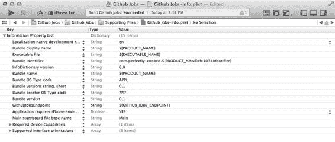
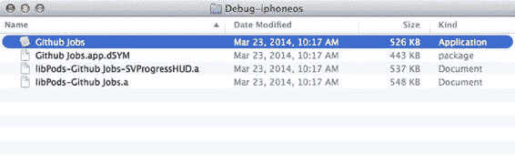
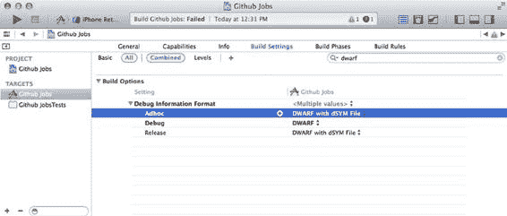
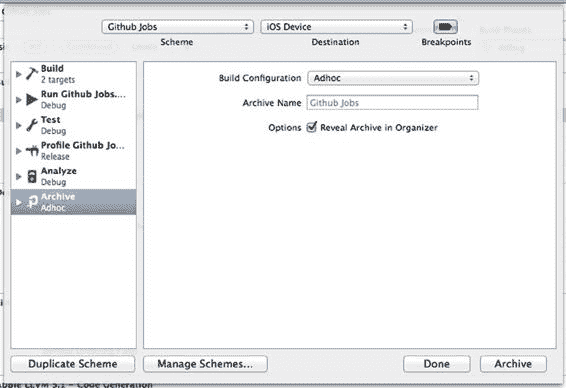
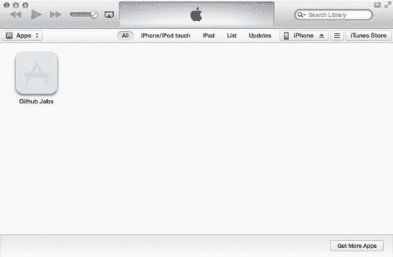
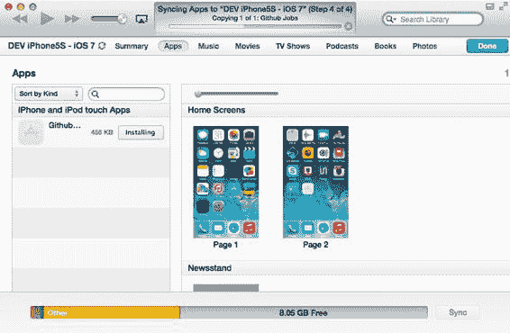

# 第三章：使用 Xcode 在 App Store 之外发布应用

现在我们需要问自己的问题是：“我现在该如何处理我的应用？”在上一章中，我们创建了一个简单的应用，它展示了纽约附近的一些 iOS 职位信息。这个应用足够简单，可以在一个章节内完整讲解和开发，同时利用我们所有可用的工具（无论是否直接集成在 Xcode 中）。

这个示例应用远未达到可以公开发布的程度。老实说，苹果审核团队快速扫一眼这个应用，可能就会让他们在点击大大的红色“拒绝”按钮之前笑出声来。假设确实存在这样一个按钮，而且它是红色的。正因如此，在流程的现阶段，你开始需要来自团队的反馈。让我们看看如何利用 Xcode 获取这些反馈。

## 我们需要什么

为了让我们的团队测试应用并向我们发送反馈，我们需要在测试设备上安装应用的构建版本。如果你正在阅读本书，你可能已经在 App Store 上发布过应用，现在正试图将你的流程提升到新的水平。这意味着你可能已经创建过不止一个用于提交到 App Store 的构建版本。接下来的页面对你来说可能会感觉似曾相识。如果你没有兴趣进行“回归基础”的环节，请直接跳转到下一章，我们将在那里玩转命令行工具。

---

**29**

[www.it-ebooks.info](http://www.it-ebooks.info/)



**30**

**第三章：使用 Xcode 在 App Store 之外发布应用**

在第二章中，我们解释了为什么你应该始终为应用创建多个环境。在我们的案例中，我们有一个简单的应用，包含 `Debug`、`Adhoc` 和 `Release` 配置。由于我们正在发布应用的第一个版本，且不使用 App Store，我们将使用 `AdHoc` 配置。

## 准备发布应用

我们使用的模板带有关于应用的默认值，例如版本号设置为 `1.0`。`1.0` 的定义以及从开发者角度来看它意味着什么，可能会引发一场有趣的辩论。例如，在 SCRUM 方法论中，“完成”的定义必须在实际开始项目工作之前就明确界定。在这种情况下，这通常意味着需要为功能列出一份清晰简洁的清单，你的团队所有成员必须遵守这些清单才能称之为“完成”。按照惯例，`1.0` 版本通常意味着“足够好”的版本，是可以向公众发布的版本。坦白说，我们离 `1.0` 版本还差得远。实际上，我们更接近 `0.1` 版本，一个我们还没准备好向任何人展示的版本。

即使我们只瞄准 `1.0` 版本，iOS 应用也有两个版本号：短版本号称为“市场”版本，长版本号称为“构建”版本。在 `Info.plist` 文件中，这两个版本分别被称为 `Bundle versions` 和 `Bundle version string, short`。让我们将短版本号和长版本号都设置为 `0.1`。当我们创建新的内部构建时，我们只会增加构建版本号。要更改应用的版本，请打开 `Github JobsInfo.plist` 文件并更改值，如图 3-1 所示。

***图 3-1.** Github Jobs 配置文件，版本号设置为 0.1*

[www.it-ebooks.info](http://www.it-ebooks.info/)

**第三章：使用 Xcode 在 App Store 之外发布应用** **31**

### 关于版本号

Xcode，更具体地说是 iOS 应用归档文件，设计得足够完善，允许你保持版本号有意义。如果你不确定应该使用什么版本号，阅读 `semver.org` 上提供的语义化版本规范可能是一个好的开始。它并没有听起来那么无聊！

现在我们有了应用的 `0.1` 版本。它并不美观，除了加载一个简单的 JSON 文件并在表格视图中显示结果之外，也做不了太多事情。我们之前提到，阅读本书就像踏上一段旅程。好吧，我们现在拥有应用的最早版本，这是开始设置项目持续集成的好时机。能够每天多次构建应用并将构建版本发送给选定的用户群体，其核心目的就是为了收集反馈。让我们从一个重要的反馈开始，它有助于我们理解应用为何崩溃，也就是崩溃日志。

## 从崩溃日志收集反馈

一旦你的构建版本交付给 QA 团队、beta 测试人员或客户，你希望获得多种类型的反馈。一种是关于用户体验瑕疵和界面设计决策的明显反馈，另一种则是关于应用如何崩溃的反馈。一旦收集并转换成人类可读的格式，崩溃日志或崩溃报告看起来像这样（实际上比这要长得多，但我们只展示有趣的部分）：

```
Incident Identifier: 9A230C6E-370E-413E-801C-D1182081BFDA
Hardware Model: iPhone3,1
Process: Github Jobs [2001]
Path: /var/mobile/Applications/D4B64242-327D-486C-A2A6-ABBDB76F7B92/Github Jobs.app/Github Jobs
Identifier: com.perfectly-cooked.Github-Jobs
Version: 1.0 (1.0.1)
Code Type: ARM (Native)
Parent Process: launchd [1]
Date/Time: 2013-12-15 13:12:32.342 -0500
OS Version: iOS 7.0.4 (11B554a)
Report Version: 104
Exception Type: EXC_BAD_ACCESS (SIGSEGV)
Exception Subtype: KERN_INVALID_ADDRESS at 0x0000000f
Triggered by Thread: 2

Thread 0:
0 CoreData
0x30906a1c -[NSSQLCore _externalDataLinksDirectory] + 0
1 CoreData
0x308f3d8a -[NSPersistentStoreCoordinator dealloc] + 702
2 libobjc.A.dylib
0x3ae93b06 objc_object::sidetable_release(bool) + 170
3 Traffic
0x000d1446 0x73000 + 386118
4 libobjc.A.dylib
0x3ae93b06
```

[www.it-ebooks.info](http://www.it-ebooks.info/)



**32**

**第三章：使用 Xcode 在 App Store 之外发布应用**


这是一个来自其他应用程序的实际崩溃日志，我们只是将其中的应用名称替换为我们的应用名，以便在不引起混淆的情况下进行描述。该报告显示了关于应用程序本身的大量信息（构建版本、市场版本、标识符……）以及运行该应用程序的设备信息。这使得我们可以轻松判断应用程序是否仅在特定设备上崩溃，例如已不算新且支持 `arm64` 处理器的 `iPhone 5S`。报告还显示了（这是更有趣的部分）崩溃发生的代码位置。这里我们讨论的是在使用 Core Data 执行任务的代码段中发生的 `EXC_BAD_ACCESS` 错误。这可能有多种含义，但通常是由于调用了指向无效指针的方法所致。

Apple 已经提供了从通过 App Store 分发的应用程序中收集崩溃日志的功能，但对于尚未准备好提交到商店的应用程序，有一些工具可以帮助你实现相同的目标，例如 `PLCrashReporter`，可从以下网址获取：

[`plcrashreporter.org`](http://plcrashreporter.org/)

为确保你能够使用这些报告并修复崩溃，在构建应用程序之前，你需要检查一项设置。回到 `Github Jobs` Xcode 项目，打开主目标的构建设置，找到 `Debug Information Format` 设置。Apple 使用一种标准的调试数据格式，称为 `DWARF`，这是一个中世纪奇幻风格的术语，代表 `Debugging With Attributed Record Formats`。在此设置中，确保选中 `DWARF with dSYM File`，它将在你的应用程序所在的同一文件夹中生成一个 `dSYM` 文件夹，如图 3-2 所示。此文件是理解潜在崩溃日志所必需的。

**图 3-2.** 构建文件夹包含应用程序和 `dSYM` 文件及其他内容 要查看示例，请导航至 `~/Library/Developer/Xcode/DerivedData/` 文件夹，每次构建应用程序时，临时 `.app` 文件都存储在此处。使用你的 shell，或右键单击 Xcode 项目 `Products` 组中的 `Github Jobs.app` 文件，选择 `Reveal In Finder` 选项。你应该会看到一个 `dSYM` 文件。

生成 `dSYM` 文件需要时间，并且在开发应用时通常并不需要。你很可能能够在调试会话期间检测并重现崩溃。因此，在 Debug 配置中，`Debug Information Format` 设置通常设置为 `DWARF` 以加快构建速度。在构建应用程序之前，请确保针对 Adhoc 配置，该设置已改为 `DWARF with dSYM File`，如图 3-3 所示。在我们真正开始使用第 7 章中介绍的“Over The Air distribution”方法发布应用程序之前，我们不会再回到这个话题。

[www.it-ebooks.info](http://www.it-ebooks.info/)



**第三章：使用 Xcode 在 App Store 之外发布应用程序**

**33**

**图 3-3.** 仅对 Debug 配置禁用了 `dSYM` 文件生成以加快构建速度

### 创建 IPA 文件

我们现在正式准备好构建应用程序的第一个版本，并将其发送给我们的 Beta 测试人员。为此，我们需要做的就是创建一个 IPA 文件。

1.  拔掉你的设备，并确保在用于选择运行应用程序位置的下拉菜单中选择了 `iOS device`。
2.  在 `Product` 菜单中，不要直接按 `Archive`，而是按住 `ALT` 键。`Archive` 菜单将变为 `Archive...`，这将打开一个窗口，允许你选择用于构建的配置，如图 3-4 所示。

[www.it-ebooks.info](http://www.it-ebooks.info/)



**34**

**第三章：使用 Xcode 在 App Store 之外发布应用程序**

**图 3-4.** 准备好为 Adhoc 配置归档应用程序的归档面板

3.  将构建配置从 Release 更改为 `AdHoc`，然后按 `Archive`。如果你勾选了 `Reveal Archive in Organizer` 选项，Organizer 应该会弹出并选中你的归档。
4.  接下来的步骤同样简单，你可能在向 App Store 发布应用程序时已经经历过。按下 `Distribute...` 按钮，选择 `Save for Enterprise or Ad Hoc Deployment`，然后选择保存 IPA 文件的位置。恭喜你，你现在已经准备好分发你的第一个应用程序构建了！

让我们暂停一下，回顾一下我们做了什么。在第 2 章中，我们创建了一个非常简单的应用程序，现在我们正准备发布它。在本章中，你经历了一个繁琐的过程，进行了多次点击，最终可能只是在桌面上得到了一个 IPA 文件。

好吧，请再坚持看几页，因为我们即将使用有史以来最不便捷的流程来分发 iOS 应用程序：iTunes！

大多数人对 iTunes 都抱有爱恨交加的感情。从播放音乐和视频，到连接 App Store 购买应用程序和专辑，以及订阅播客，iTunes 是这款自世纪之初就已存在的臃肿 OSX 应用程序，这本身就说明了一些问题。当 iPhone 问世时，虽然 Apple 可以专门开发一个 iPhone 同步应用程序，但它却选择将这个功能集成到其历史悠久的应用程序中。

iTunes 实际上允许你直接从桌面将应用程序安装到设备上。让我们看看如何操作。

[www.it-ebooks.info](http://www.it-ebooks.info/)



**第三章：使用 Xcode 在 App Store 之外发布应用程序**

**35**

### 在测试者设备上安装应用程序

打开 iTunes，点击 `update later` 按钮（总有一个 iTunes 更新在等着你）。然后，打开一个 Finder 窗口，导航到你导出 IPA 文件的目录：在我们的例子中，是桌面目录。双击 `Github jobs.ipa` 文件，等待奇迹发生。iTunes 应该会被激活，并在 `Apps` 部分显示你的应用程序，如图 3-5 所示。

**图 3-5.** iTunes 已将 Github Jobs 应用程序添加到你的资料库中

通过这个非常简单的操作，iTunes 获取了 IPA 文件并将其复制到了其媒体文件夹中。如果你没有更改过此文件夹，你应该能够在 `~/Music/iTunes/iTunes Media/Mobile Applications` 中找到你的应用程序，就在你的音乐文件夹旁边。不要删除原始的 IPA 文件：我们稍后会用到它。

现在 iTunes 已经有了我们应用程序的副本，请插入你的 iPhone，点击窗口左上角会出现的 `iPhone` 按钮。这个界面应该很熟悉，你可能已经进去过那里，安装过 iOS 的 Beta 版本，或者只是管理设备的同步设置。选择 `apps` 标签，你所有的应用程序（包括 `Github Jobs`）应该都会列在左侧。点击 `Github Jobs` 旁边的 `Install` 按钮，然后点击 `Apply` 按钮。在同步过程中，`Github Jobs` 将会被安装到你的设备上，如图 3-6 所示。

[www.it-ebooks.info](http://www.it-ebooks.info/)



**36**

**第三章：使用 Xcode 在 App Store 之外发布应用程序**

**图 3-6.** `Github Jobs` 应用程序正在被复制到设备上

就是这么简单。一旦你创建了 iOS 应用程序的构建，你可以简单地通过邮件将其发送给测试人员，然后一切就绪。

但是…… 这是一个糟糕的流程！

你现在可能觉得这是一个糟糕的流程，而且很难反驳你。公平地说，我们之前确实警告过你。


这正是我们所需要的：更多的点击！在经历了一个乏味的过程，最终只在我们的桌面上生成一个 IPA 文件后，我们又增加了更多步骤，涉及另一个软件和大量的点击。

这种方法还有一个缺点，那就是为了构建和分发应用，Xcode 需要复杂的代码签名和配置文件流程。你可以将 IPA 发送给任何人，但必须在应用的配置文件中明确授权，正如我们将在第 7 章讨论配置文件工作原理时展示的那样。如果你尝试安装一个未获授权的应用，iTunes 会静默失败，最终你的主屏幕上只会留下一个无法使用的应用。

[www.it-ebooks.info](http://www.it-ebooks.info/)

