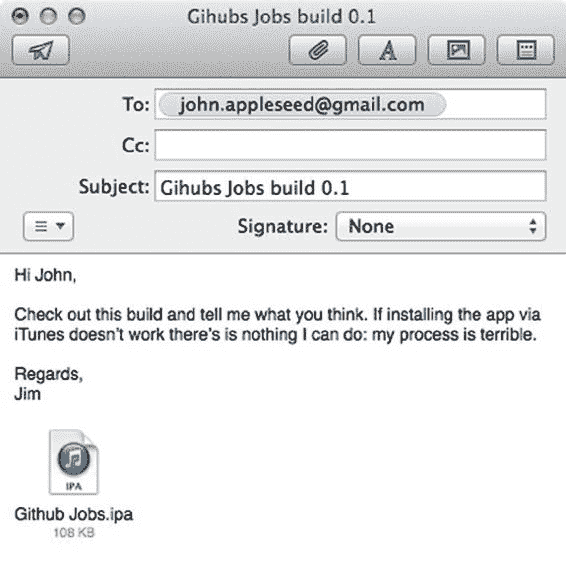
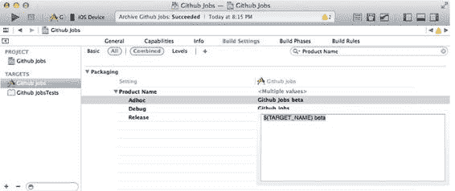

# 第 3 章：使用 Xcode 在 App Store 之外发布应用

### 在测试者的设备上安装应用

实际上，我们可以通过 `iPhone Configuration Utility` 应用（可从 [`support.apple.com/downloads/#iphone`](http://support.apple.com/downloads/#iphone) 获取）来了解发生了什么。这款精巧的小工具正是苹果公司可能推出的那种专门用于管理 iOS 设备的工具。如果你还不熟悉这个工具，你真的应该熟悉一下。去下载它，然后我们再试一次。

打开 `iPhone Configuration Utility` 和一个新的访达窗口。导航到你之前存放原始 IPA 文件的位置——还记得我们让你不要删除它吗？这就是原因——选中它，然后将其拖放到工具窗口中。就像在 iTunes 中一样，“Github Jobs”应用现在就可以通过桌面进行安装了。

在 iPhone 仍处于连接状态的情况下，在左侧菜单中选中它，然后导航到“应用”选项卡。

你应该会看到“Githubs Jobs”API 并附带一个“安装”按钮。按下它，应用将自动安装到你的手机上。

这比使用 iTunes 来安装应用的中间版本要好一些。的确，当你尝试安装一个未授权应用时，iTunes 会惨遭失败，而 `iPhone Configuration Utility` 则是为不同的受众创建的：高级用户和开发者。如果你点击左侧边栏中的手机，并打开控制台应用，你将能够获得关于你手机上发生情况的更详细反馈。深入查看这些提供的日志信息，你应该能发现类似这样的行：

```
Mar 31 19:26:43 DEV-iPhone5S-iOS-7 lsd[75] <Warning>: LaunchServices: installation failed for app com.perfectly-cooked.Github-Jobs
```

当测试者无法安装你将要发送给他们的构建版本时，这正是你需要的信息。这个工具还会帮助你管理配置文件、配置描述文件和应用程序。它会向你显示已连接设备的详细信息，最后同样重要的是，它还能帮助你通过电子邮件发送应用，如图 3-7 所示！

[www.it-ebooks.info](http://www.it-ebooks.info/)



**图 3-7.** `iPhone Configuration Utility` 将帮助你通过邮件分发构建版本。

即使这个工具比 iTunes 稍好一些，通过电子邮件分发构建版本仍然不是很方便，而且只适用于高级用户。但这是个好消息！既然我们已经描述了最糟糕的分发构建版本的方法，从现在起我们只会做得更好。接下来的章节将重点介绍如何以更“智能”的方式构建应用（虽然找不到更合适的词，但真正的魔法其实发生在第 7 章）。在第 7 章中，我们将向你展示如何自动化我们在过去 10 页中介绍的流程。

### 安装应用的多个版本

如果安装成功了，仍然有一件非常重要的事情需要处理。当你使用 Xcode 创建 iOS 应用时，项目创建向导会要求你提供一个捆绑标识符。与 Java 世界不同，你不需要一个复杂的反向 DNS 命名空间来显得很酷，iOS 应用的捆绑标识符很重要：它是一个唯一的标识符，有助于将你的应用与其他应用区分开来，并且你不能让多个应用共享同一个捆绑 ID。

实际上这没什么大不了的，所有应用都使用基于反向 DNS 的捆绑标识符，比如在本例中，`perfectly-cooked.com` 变成了 `com.perfectly-cooked.GithubJobs`。

另一方面，当你开始分发并请求他人安装应用的测试版本时，这会阻止人们同时安装稳定版应用和测试版应用。

[www.it-ebooks.info](http://www.it-ebooks.info/)



幸运的是，我们在第 2 章中向你展示了如何使用配置来管理应用的多个环境。捆绑标识符只是另一个你可以根据配置自定义的设置。

回到 Xcode，选择主属性列表文件 `Github JobsInfo.plist`，并查找 `Bundle identifier` 键。如果你的 Xcode 配置为显示这些键的原始名称，请查找 `CFBundleIdentifier` 键。

当前的捆绑标识符包含 `com.perfectly-cooked.${PRODUCT_NAME:rfc1034identifier}`，一旦应用被编译，它会被计算并转换为 `com.perfectly-cooked.githubs-jobs`。这个 RFC 参数描述了 DNS 及其用于主机地址支持的用途。在我们的例子中，我们在第 2 章看到的包裹括号后面的 `:rfc1034identifier` 是一个过滤器，它可以将应用的产品名称转换为符合 RFC1034 标准的标识符（不再有空格...），正因如此，我们可以轻松地仅为 AdHoc 配置更改它。我们希望发送给测试版用户的版本代号为“Github Jobs (beta)”。这样，人们就能看到他们正在使用测试版。他们也将能够保留应用的稳定版，因为借助 `:rfc1034identifier`，捆绑标识符会有所不同。

打开构建设置应用，查找 `Product Name` 设置。它的默认值应该是 `$(TARGET_NAME)`，其中 `TARGET_NAME` 是可用的众多环境变量之一。

要更改捆绑标识符，我们只需要更改 Ad Hoc 配置的产品名称，如图 3-8 所示。

**图 3-8.** 产品名称将为 Ad Hoc 配置更改。

保持产品名称设置为人类可读的格式非常重要，因为这是将显示在你主屏幕上的应用名称。请注意，当配置文件和授权被锁定到非常具体的捆绑标识符时，这可能会导致代码签名过程出现问题：请谨慎使用此技巧！

[www.it-ebooks.info](http://www.it-ebooks.info/)

更新 `PRODUCT_NAME` 构建设置将根据配置更改捆绑标识符。这样，你的测试者将能够在其设备上安装多个版本的应用。

## 总结

在本章中，我们向你展示了可用于分发应用测试版本的工具。无论是使用 iTunes 还是 `iPhone Configuration Utility`，这实际上都是一个非常受限的工作流程，远不能为你提供任何灵活性。它需要大量的点击、多个软件，而且不能很好地处理潜在的错误。


