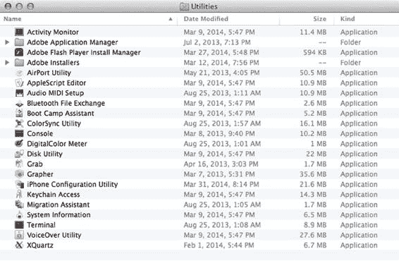
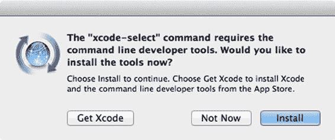
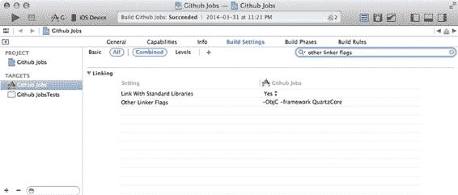
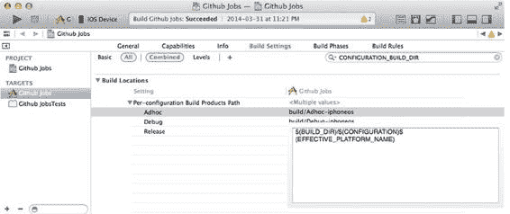
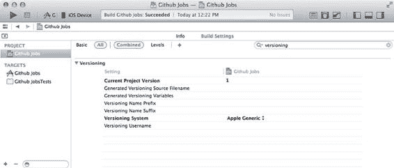

# 第 4 章：调用命令行的力量

在第一章中，我们曾提到过这样一个人：当测试人员轻轻拍他肩膀要求安装应用的测试版时，他就会插上测试设备，构建一个应用版本，然后把设备交还回去。好消息是，现在你已经掌握了成为那个人的所有工具和知识。但别止步于此——请继续阅读，接下来的章节将教你如何自动化这一流程，并为测试人员提供更好的用户体验。

即便拥有多种用户界面，包括像 Xcode 提供的那些设计精良且直观的界面，也依然不够。事实上，前一章已经向你展示了使用 Xcode 和 iTunes 或 iPhone 配置实用工具在 App Store 之外发布应用是多么繁琐的过程。

好的界面并不能解决所有问题。在本章中，我们将深入探讨这些界面所基于的工具，并通过直接使用命令行来调用它们。

## 命令行界面？

命令行界面（通常称为 CLI）是一种让用户以较低层级与计算机交互的方式，它使用计算机可理解的文本命令语法。这种语法在可读性方面对双方来说都是一个不错的折中方案。很多开发者对它感到畏惧，有些人甚至整个职业生涯都不使用一次 shell（用于执行命令的界面）。他们为什么要用呢？用 Photoshop 设计应用，用 Xcode 编写代码，同时使用图形化的版本控制客户端（如果有的话）和应用加载器向 App Store 提交构建——完全不打开 shell 也能开发一个应用。

关键在于，使用命令行能让你访问高级用户功能，并且在我们设置持续集成环境时，它实际上会变得非常方便。

在本章中，我们将试着向你展示，在 iOS 开发的背景下，命令行并不像你想象的那么可怕，尤其是在 OSX 系统上。既然你购买了这本书，我们无需再向你证明 OS X 对开发者来说是多么出色的操作系统。这要归功于其 UNIX 的血统。OS X 自带了一个相当不错的 shell 供你使用，叫做 `Terminal.app`，它和其他许多工具一起位于 `/Applications/Utilities` 目录中。如果你仔细看看图 4-1，就会发现我们上一章讨论的 iPhone 配置实用工具正是安装在这里。



**图 4-1.** 工具列表，主要由 OSX 提供

开发者之所以害怕或不愿深入使用 shell 的原因之一，可能在于 OSX 上首次打开它时的样子——一个黑底白字的界面，没有任何提示告诉你该做什么。我们实话实说——命令行界面确实令人困惑，而且主要是为高级用户设计的。好消息是，要熟悉命令行其实相当容易。难点在于知道在什么时候运行哪个命令、带上哪些参数，但这只能随着经验和时间的积累而掌握。

现在，让我们看看如何用命令行来实现我们在上一章中做过的创建发布版构建的操作。

## 认识 Shenzhen

iOS 和 OSX 开发者社区人才济济，他们持续撰写博客文章，并发布我们将在项目中使用的库和工具。马特·汤普森就是其中之一。

除了运营 NSHipster 网站（网址：[`nshipster.com`](http://nshipster.com/)）——他在上面撰写关于"Objective-C 和 Cocoa 中被忽视的细节"的隐藏技巧和心得之外，他还创建了 Shenzhen，一个用于构建 IPA 文件的命令行工具。Shenzhen 还支持将应用分发到 Testflight 和 HockeyApp 等第三方服务，但我们将在第 7 章才讨论空中下载（OTA）分发。

Shenzhen 是用 Ruby 编写的，因此最简单的安装方法是使用 Rubygems。在开始之前，请确保你安装了最新版本的 Ruby。在撰写本书时，当前的 Ruby 稳定版本是 2.1.1。

```
$ ruby –v
ruby 2.1.1p76 (2014-02-24 revision 45161) [x86_64-darwin13.0]
```

同样，如果你仍在使用 OS X 自带的 Ruby 安装版本，应考虑使用 `rbenv`（[`rbenv.org/`](http://rbenv.org/)）或 `RVM`（[`rvm.io/`](https://rvm.io/)）升级到更新的版本。

要安装 Shenzhen，只需运行以下命令：

```
$ gem install shenzhen
```

安装完成后，你的终端中将出现一个名为 `ipa` 的新可执行文件。不带任何参数运行它，应该会显示以下输出：

```
$ ipa
ipa

构建和分发 iOS 应用（.ipa 文件）

命令：
  build                              为你的应用创建新的 .ipa 文件
  distribute:ftp                     通过 FTP 分发 .ipa 文件
  distribute:hockeyapp               通过 HockeyApp 分发 .ipa 文件
  distribute:s3                      通过 Amazon S3 分发 .ipa 文件
  distribute:testflight              通过 testflight 分发 .ipa 文件
  help                               显示全局或 [命令] 帮助文档。
  info                               显示 .ipa 文件的移动设备配置文件信息

别名：
  distribute                         distribute:testflight
  distribute:sftp                    distribute:ftp --protocol sftp

全局选项：
  --verbose
  -h, --help                         显示帮助文档
  -v, --version                      显示版本信息
  -t, --trace                        发生错误时显示回溯信息

作者：
  Mattt Thompson <m@mattt.me>

网站：
  [`mattt.me`](http://mattt.me/)
```

如你所见，这个工具功能很多，但我们只关心 `build` 命令。在终端中，导航到 Github Jobs Xcode 项目的根目录，然后运行 `build` 命令：

```
$ cd ~/Projects/Apress/Github\ Jobs
$ ipa build -c AdHoc -d ~/Desktop
xcodebuild Github Jobs.xcworkspace
xcrun PackageApplication
zip /Users/Palleas/Projects/Apress/Github Jobs/Github Jobs.app.dSYM
~/Desktop/Github Jobs.ipa 构建成功
```

那么刚才发生了什么？其实就几件事：Shenzhen 为 AdHoc 配置构建了应用（`-c` 参数），将其归档，并在你的桌面上创建了 IPA 文件（`-d` 参数）。

我们也使用了 `cd` 这个内置命令来更改当前目录，就像使用 Finder 窗口一样。恭喜你！你只用了十秒钟和一个非常易懂的命令，就完成了我们在整整一章中讲述的内容！

公平地说，在 Xcode 及其发布流程方面，我们有点作弊了。毕竟，Shenzhen 是一个功能齐全的工具，仅用了几百行 Ruby 代码编写而成。但这正是命令行的强大之处。我们来看看 Xcode 提供的工具。

## 处理多个 Xcode 安装

让我们从一个简单的命令开始，叫做 `xcode-select`。如果你还记得我们在第 2 章中讲过的内容，当我们想知道 Xcode 内嵌的 git 版本时，我们就使用过这个命令。`xcode-select` 是一个命令行工具，用于管理 Xcode 及其附带工具（如 `git`，以及 `svn`、`clang` 和 `make`）的活动开发者目录。在你的 shell 中运行以下命令会打印出当前目录，如果你需要 Xcode 提供的某些工具，又不想硬编码路径，这会很有用。再次回顾第 2 章，看看如何在脚本中使用此命令的结果。


```bash
$ xcode-select –print-path
/Applications/Xcode.app/Contents/Developer
```

如果你使用 OSX 已经有一段时间了，那么你很可能听说过 Xcode 的命令行工具。安装命令行工具是使用 Homebrew 包管理器等工具的前提条件。虽然可以通过 Xcode 的首选项面板来安装这些命令行工具，但 `xcode-select` 是用于打开如图 4-2 所示安装窗口的命令行等效工具。

```bash
$ xcode-select –install
xcode-select: note: install requested for command line developer tools
```

[www.it-ebooks.info](http://www.it-ebooks.info/)



**第 4 章：调用命令行的力量**

**45**

***图 4-2.** xcode-select 工具可以启动 Xcode 命令行工具的安装*

如果你是 Apple 注册开发者，你可以访问 Xcode 的私有 beta 版本，而 `xcode-select` 在此处大显身手。`xcode-select` 允许你在不同版本的 Xcode 之间切换。由于它是在全局级别管理开发者目录的路径，因此需要使用 `sudo` 以“超级用户”身份运行此命令。

```bash
$ sudo xcode-select --switch /Applications/XCode6-beta.app
```

通过这种方式，你将能够使用 Xcode6-beta 提供的命令行工具。这在以下场景中很有帮助：确保你的应用程序仍能使用新版本的 Xcode 构建，或者你发现了之前 Xcode 版本的一个 bug，并想检查它是否已被修复。关键在于，借助这个小工具，在 Xcode 版本之间切换变得非常容易。作为额外优势，`xcode-select` 会确保你尝试使用的开发者目录是有效的：

```bash
sudo xcode-select -s /Applications/Dashboard.app
xcode-select: error: invalid developer directory '/Applications/Dashboard.app'
```

我们通常使用的开发者目录是 `/Applications/Xcode.app`，但由于历史原因，实际的开发者目录是应用程序包内的一个子目录。这就是为什么我们首次使用 `xcode-select –p` 命令时，打印的不是 “`/Applications/Xcode.app`”，而是 “`/Applications/Xcode.app/Contents/Developer`”。当你使用 `xcode-select` 切换到不同版本的 Xcode 时，你可以使用这两个值。如果你输入较短的路径，它会自动扩展为完整的开发者目录路径。

当然，全局切换到 Xcode 的 beta 版本可能有点极端，而且最重要的是，这存在风险。想象一台专门用于自动构建应用程序的 Apple 电脑——例如一台 Mac Mini。你不会想冒险切换到 Xcode 的 beta 版本，从而危及整个环境。正因如此，还有一种较为温和的切换 Xcode 版本的方法：使用 `DEVELOPER_DIR` 环境变量。

[www.it-ebooks.info](http://www.it-ebooks.info/)

**46**

**第 4 章：调用命令行的力量**

**注意** 环境变量，顾名思义，是命令运行的环境所使用的变量。其中一些变量由操作系统自动设置，例如包含当前用户主目录路径的 `$HOME` 变量（如 `/Users/Palleas`），或包含当前工作目录路径的 `$PWD` 变量（如 `/Users/Palleas/Projects/Apress/Github Jobs`）。也可以使用非常简单的语法为当前会话定义一些变量：`MY_ENV_VARIABLE="My Value"`，然后稍后使用 `$MY_ENV_VARIABLE`。基于此，使用 `DEVELOPER_DIR` 同样简单。

无论你选择哪种解决方案，在不同 Xcode 环境之间切换都非常容易。例如，如果你怀念旧版本的 Xcode，或者因为你一个旧项目无法用最新版本构建，你可以直接访问“Apple 开发者下载”页面（网址为 [`developer.apple.com/downloads/index.action`](https://developer.apple.com/downloads/index.action)），下载一个较旧版本的 Xcode 并使用它。

请注意，与 `xcode-select` 方法不同，使用环境变量并不会在你尝试使用该目录之前检查它是否有效，直到它实际尝试使用时才会验证，如下例所示，我们尝试使用一个众所周知的 OSX 应用程序 `Dashboard.app` 作为开发者目录。

```bash
DEVELOPER_DIR=/Applications/Dashboard.app xcodebuild -v
xcrun: error: invalid DEVELOPER_DIR path (/Applications/Dashboard.app), missing xcrun at:
/Applications/Dashboard.app/usr/bin/xcrun
```

你可能注意到了 `xcodebuild` 命令的使用。是时候让我们亲自动手，看看如何实际使用命令行构建应用程序了。毕竟，这正是我们来到这里的目的。

## 构建应用程序

现在我们对 Xcode 安装提供的命令行工具的位置有了大致了解，让我们看看如何直接从终端构建应用程序。你在上一节已经初步了解了 `xcodebuild` 命令，而这正是我们实际要使用的命令。

### 使用 xcodebuild 构建应用程序

如果你在终端中使用帮助选项运行 `xcodebuild` 命令，你可能会感到不知所措。

```bash
$ xcodebuild -h
Usage: xcodebuild [-project <projectname>] [[-target <targetname>]...|-alltargets]
[-configuration <configurationname>] [-arch <architecture>]... [-sdk [<sdkname>|<sdkpath>]]
[-showBuildSettings] [<buildsetting>=<value>]... [<buildaction>]...
xcodebuild [-project <projectname>] -scheme <schemeName> [-destination <destinationspecifier>]...
[-configuration <configurationname>] [-arch <architecture>]... [-sdk [<sdkname>|<sdkpath>]]
[-showBuildSettings] [<buildsetting>=<value>]... [<buildaction>]...
```

[www.it-ebooks.info](http://www.it-ebooks.info/)

**第 4 章：调用命令行的力量**

**47**

```bash
xcodebuild -workspace <workspacename> -scheme <schemeName> [-destination <destinationspecifier>]...
[-configuration <configurationname>] [-arch <architecture>]... [-sdk [<sdkname>|<sdkpath>]]
[-showBuildSettings] [<buildsetting>=<value>]... [<buildaction>]...
xcodebuild -version [-sdk [<sdkfullpath>|<sdkname>] [<infoitem>] ]
xcodebuild -list [[-project <projectname>]|[-workspace <workspacename>]]
xcodebuild -showsdks
xcodebuild -exportArchive -exportFormat <format> -archivePath <xcarchivepath> -exportPath
<destinationpath> [-exportProvisioningProfile <profilename>] [-exportSigningIdentity <identityname>]
[-exportInstallerIdentity <identityname>]
```

`xcodebuild` 是那种一旦你学会如何使用，就能为你完成大量工作的工具之一。如果你开始使用命令行，你会经常用到这个命令：`xcodebuild` 用于构建 Xcode 项目和 workspace，实际上当你按下 `⌘ + B` 时，Xcode 使用的就是这个命令。

Xcode 依赖 `xcodebuild` 来执行“Product”菜单中的大部分操作，事实上，以下这些功能都可以通过 `xcodebuild` 的“构建动作”来完成：`build`、`analyze`、`archive`、`test`、`install` & `installsrc` 和 `clean`。

让我们回到终端，导航到 Github Jobs Xcode 项目所在的目录，直接切入正题，使用 `xcodebuild` 命令且不带任何选项或参数来构建应用程序。在这种情况下，构建应用程序是默认行为。

```bash
$ xcodebuild
The following build commands failed:
Ld build/Github\ Jobs.build/Release-iphoneos/Github\ Jobs.build/Objects-normal/armv7s/Github\ Jobs normal armv7s
```


``` 
Ld build/Github\ Jobs.build/Release-iphoneos/Github\ Jobs.build/Objects-normal/arm64/Github\ Jobs normal arm64

Ld build/Github\ Jobs.build/Release-iphoneos/Github\ Jobs.build/Objects-normal/armv7/Github\ Jobs normal armv7

(3 failures)
```

如上所示，未传入任何参数就尝试构建应用程序将导致失败，并恰好遇到三个错误。实际上，每个架构对应一个错误：`armv7`、`armv7s` 和 `arm64`，这些是 iOS 设备中嵌入的处理器类型。每个 ARM 版本在引入改进的同时，也向后兼容之前的版本。在编译代码时，处理编译过程的编译器只会为目标架构生成指令。目前市面上有很多 iPhone 设备，但苹果的建议是您只需支持最新的几款机型。不同的机型配备不同的处理器。

这就是为什么应用程序需要为所有需要支持的架构多次构建的原因。iPhone 3GS、4 和 4S 搭载的是 `ARMV7` 处理器。虽然可以假设现在还在正常使用的 iPhone 3GS 已经不多了，但仍然有很多 iPhone 4S 每天都在被使用。iPhone 5 搭载的是 `ARMV7s` 处理器，而 iPhone 5S 则采用了 `ARM64` 架构。这样一来，您就有三个需要支持的架构，这也正是 `xcodebuild` 指令给出三个错误的原因：应用程序无法为任何一个架构构建。实际上，这些信息很难全部记住，因此有一个非常有用的网站以一种非常易于理解的方式展示了这些内容：[`iossupportmatrix.com/`](http://iossupportmatrix.com/)。

[www.it-ebooks.info](http://www.it-ebooks.info/)

**第 4 章：调用命令行的强大功能**

首先要注意到的一点是，由于我们没有指定要使用的配置，`xcodebuild` 选择了默认配置：Release。然而，这并不是我们想要的。在上一章中，我们使用 AdHoc 配置构建了应用程序，而当我们在这里尝试做同样的事情时，我们将使用 `–configuration` 选项来告诉 `xcodebuild` 使用我们在第 2 章中创建的 **AdHoc** 配置。

```
$ xcodebuild –configuration AdHoc
```

以下构建命令失败：

```
Ld build/Github\ Jobs.build/AdHoc-iphoneos/Github\ Jobs.build/Objects-normal/armv7/Github\ Jobs normal armv7

Ld build/Github\ Jobs.build/AdHoc-iphoneos/Github\ Jobs.build/Objects-normal/armv7s/Github\ Jobs normal armv7s

Ld build/Github\ Jobs.build/AdHoc-iphoneos/Github\ Jobs.build/Objects-normal/arm64/Github\ Jobs normal arm64

(3 failures)
```

情况有所好转，但命令在构建过程中仍然失败，并且似乎无法使用链接器命令 `ld`。它的目标是组合多个目标文件和库，解析引用，并生成一个输出文件。由于它总是生成单一架构的文件，因此由于我们之前提到的项目有三个有效架构，它必须被使用三次。

`ld` 是您实际上不需要了解的命令之一，因为您永远不必直接使用它。编译器通常会处理它。

让我们尝试通过分析 `xcodebuild` 命令的输出来查看实际错误是什么。好消息是我们的应用程序足够小，因此编译过程不需要做很多事情，例如编译一堆实现 `.m` 文件，将非常简单的故事板文件转换为应用程序启动时将加载的 Nib 文件。这意味着理解正在发生的事情会相当容易。如果您滚动到输出底部，即第一个 `ld` 命令运行的地方，您应该会找到类似这样的内容：

```
ld build/Github\ Jobs.build/AdHoc-iphoneos/Github\ Jobs.build/Objects-normal/armv7/Github\ Jobs\ beta normal armv7

cd "/Users/Palleas/Projects/Apress/Github Jobs"

export IPHONEOS_DEPLOYMENT_TARGET=7.1

export PATH="/Applications/Xcode.app/Contents/Developer/Platforms/iPhoneOS.platform/Developer/usr/bin:/Applications/Xcode.app/Contents/Developer/usr/bin"

/Applications/Xcode.app/Contents/Developer/Toolchains/XcodeDefault.xctoolchain/usr/bin/clang -arch armv7 -isysroot /Applications/Xcode.app/Contents/Developer/Platforms/iPhoneOS.platform/Developer/SDKs/iPhoneOS7.1.sdk -L/Users/Palleas/Projects/Apress/Github\ Jobs/build/AdHoc-iphoneos -F/Users/Palleas/Projects/Apress/Github\ Jobs/build/AdHoc-iphoneos -filelist /Users/Palleas/Projects/Apress/Github\ Jobs/build/Github\ Jobs.build/AdHoc-iphoneos/Github\ Jobs.build/Objects-normal/armv7/Github\ Jobs\ beta.LinkFileList -dead_strip -ObjC -framework QuartzCore -fobjc-arc -fobjc-link-runtime -miphoneos-version-min=7.1 -framework CoreGraphics -framework UIKit -framework Foundation -lPods-Github\ Jobs -Xlinker -dependency_info -Xlinker /Users/Palleas/Projects/Apress/Github\ Jobs/build/Github\ Jobs.build/AdHoc-iphoneos/Github\ Jobs.build/Objects-normal/armv7/Github\ Jobs\ beta_dependency_info.dat -o /Users/Palleas/Projects/Apress/Github\ Jobs/build/Github\ Jobs.build/AdHoc-iphoneos/Github\ Jobs.build/Objects-normal/armv7/Github\ Jobs\ beta

ld: library not found for -lPods-Github Jobs

clang: error: linker command failed with exit code 1 (use -v to see invocation)
```

[www.it-ebooks.info](http://www.it-ebooks.info/)



**第 4 章：调用命令行的强大功能**

这段文本块是在 `xcodebuild` 过程中实际在底层调用 `clang` 时运行的命令。`clang` 是 Xcode 用于编译 C、C++ 和 Objective-C 的编译器，它还提供诸如静态代码分析器和代码风格检查工具等工具。虽然深入讨论这些不是本章的目标，但我们将在第 10 章讨论质量保证时进一步介绍它们。这一段中重要的是，`clang` 被调用了很多参数。当您在应用程序的构建设置中进行配置时，Xcode 会管理这些参数，但您也可以显式地在“Other linker flags”部分中设置一些参数，如图 4-3 所示。

**图 4-3.** “Other linker flags”设置可用于添加框架（QuartzCore）并告诉链接器将源输入文件视为 Objective-C 输入

我们在这里遇到的问题源于在调用 `clang` 时传递的 `-lPods-Github\ Jobs` 参数，它不知道我们要求链接到编译后的应用程序的这个库——这是由于 Cocoapods 引起的。

当您使用 Cocoapods 在 PodFile 中声明依赖项时，Cocoapods 实际上会修改您的项目，并要求您使用生成的工作区文件。在这个工作区中，您会找到您原始的 Xcode 项目 Github Jobs，以及一个名为“Pods”的新项目。它包含了在运行 `pod install` 期间下载的依赖项，我们在第 2 章中已经讨论过这一点。

当您构建 Github Jobs 应用程序时，Pods 项目实际上首先被编译成一个静态库，然后与主应用程序链接。虽然完全可以使用子项目而不是工作区来避免我们遇到的这个问题，但这是默认行为，也是苹果建议您管理依赖项的方式。

`xcodebuild` 不会自动检测您是否在使用工作区而不是简单的项目文件，您必须使用 `–workspace` 选项显式地将其传递给 `xcodebuild`。当您使用 `–workspace` 选项时，还必须使用 `-scheme` 选项，否则 `xcodebuild` 会向您报错：

```
$ xcodebuild -workspace Github\ Jobs.xcworkspace -scheme Github\ Jobs
```

[www.it-ebooks.info](http://www.it-ebooks.info/)

**第 4 章：调用命令行的强大功能**


此命令执行后，屏幕上应显示大量指令信息，并在最后看到“构架成功”的提示。恭喜你，你已经通过命令行成功构建了 iOS 应用程序。不过，此时应用程序实际上还不可用。正如我们之前所说，这仅仅是模拟了在 Xcode 中按下 ⌘ + B 时的操作，而不是 ⌘ + R（运行），更不是 ⌘ + B（归档）。在能够发送应用程序的构建版本之前，还缺少几个步骤，这也是整个流程的最后阶段。

尽管如此，现在我们已经能够构建应用程序了，这是判断应用程序当前状态的首要指标。一旦搭建好持续集成平台，我们就能够检测到：在你或同事对应用程序进行修改后，应用程序是否依然能够成功构建。

虽然这些反馈信息对于判断是否应该将这段代码集成到应用程序中帮助有限，但它却是最重要的一个环节。

你现在可能会问：既然可以直接给出正确的命令，为什么我们还要绕这么大弯子写这么多内容？答案在于：如果你想将 `xcodebuild` 命令作为持续集成流程的一部分来使用，就必须理解其工作原理。只有能够深入分析 `xcodebuild` 产生的大量输出信息，你才能明白应用程序为何构建失败。

然而，即使是经验丰富的 iOS 和 OSX 开发者，也会觉得 `xcodebuild` 的输出如同天书。要从海量文本中找出构建失败的原因不仅令人恼火，更关键的是非常耗时。正因如此，像 `xctool` 这样的替代构建工具应运而生。

### 使用 Xctool 构建应用

别担心，这次我们直接切入正题。`xctool` 是苹果 `xcodebuild` 的替代工具，能让你更轻松地通过命令行构建和测试 iOS 及 OSX 应用程序。它由 Facebook 创建并维护，旨在提供更易读的构建输出信息，并具备一些对持续集成特别有用的功能。

在相当长一段时间里，`xctool` 也是从命令行运行 iOS 应用程序单元测试的唯一解决方案。苹果在 Xcode 5.1 中修复了这个问题，现在 iOS 项目也可以使用 `xcodebuild` 的“test”构建操作了。

要安装 `xctool`，只需将其克隆到计算机的某个目录下。例如，我们在 `$HOME` 目录下创建了一个 `Tools` 文件夹，然后将其克隆到该目录中。

```
$ mkdir ~/Tools
$ cd ~/Tools
$ git clone git@github.com:facebook/xctool.git
$ cd xctool
```

`xctool` 仓库包含大量文件，但对我们最重要的是 `xctool.sh` 文件：所有命令都将通过这个 shell 脚本来运行。仅克隆仓库还不足以在项目中使用 `xctool`：你还需要构建它。不过别担心，你无需使用开源项目文档中常见的复杂构建流程。对于 `xctool` 来说，过程非常直接：它会在首次调用时自行构建。讽刺的是，`xctool` 本身正是通过 `xcodebuild` 来构建的。

我们先来查询 `xctool` 的当前版本。

```
$ ./xctool.sh -version
=== 构建 XCTOOL ===
/Users/Palleas/Tools/xctool/scripts/build.sh
✓ 成功构建 xctool（耗时 98000 毫秒）
0.1.15
```

现在我们已经成功安装了 `xctool`，回到 Github Jobs 项目所在的目录，并在此处构建应用程序。需要注意的是，还有其他安装 `xctool` 的方法，最简便的方式可能是使用 `Homebrew`——这是一个用 Ruby 编写的 OSX 包管理器，能大幅简化你的工作。如果你尚未安装，建议立即访问 [`brew.sh/`](http://brew.sh/) 进行安装。


Homebrew 需要 Xcode 命令行工具才能正常运行，因此如果你不记得如何轻松安装它们，请返回前几页查看！

我们已经将 `xctool` 安装在 `~/Tools/xctool` 目录中。这就是为什么我们应该使用相对路径来调用 `xctool.sh` 脚本，如下所示：

```
$ ~/Tools/xctool/xctool.sh -v
0.1.15
```

不过，这显然不是理想的做法。这就是为什么我们将使用另一个名为 `$PATH` 的环境变量。此变量包含一个由冒号分隔的列表，列出了用户可访问的所有包含可执行工具的目录。让我们将 `xctool` 的安装文件夹添加到这个列表中。

```
$ export PATH=$HOME/Tools/xctool:$PATH
```

请注意，无法简单地向此路径变量中推送一个值，这就是我们只是将 `~/Tools/xctool` 目录拼接在现有变量开头的原因，也是你在修改此环境变量时必须格外小心的原因。

`xctool` 在许多方面与 `xcodebuild` 类似：大多数选项和参数都是相同的。不过，该工具本身稍微严格一些，如果不至少指定一个 `-scheme` 参数，你将无法调用它。在我们的例子中，我们还希望构建一个工作区，而不是一个简单的 Xcode 项目（默认行为），并且我们希望使用 `AdHoc` 配置。这就是我们使用 `--workspace` 和 `-configuration` 参数的原因：

```
$ xctool.sh -workspace Github\ Jobs.xcworkspace -scheme Github\ Jobs
[Info] 正在加载方案 'Github Jobs' 的设置... (1142 ms)
=== 构建 ===
xcodebuild build Github Jobs
Pods / Pods-Github Jobs-SVProgressHUD (AdHoc)
√ 检查依赖项 (111 ms)
√ 写入辅助文件 (7 ms)
...
```

首先要注意的是 `xctool` 的输出更加清晰。不再是一大堆难以理解的文本，现在你可以获得按构建过程所有主要步骤分组的输出。

如果你也在自己的电脑上运行了该命令，你应该会注意到输出还带有颜色。

`xctool` 的优点众多。界面美观漂亮是一回事，提供真正有用的功能则是另一回事。除了美观的（默认）报告器外，`xctool` 还提供了不同的报告器，使其更容易与持续集成工具（例如 Jenkins，我们将在下一章中介绍）集成。它还支持基于 JSON 的配置文件格式，因此调用 `xctool` 不再是一件痛苦的事。要使用它，只需创建一个包含以下内容的 `.xctool-args` 文件：

```
[
  "-workspace", "Github Jobs.xcworkspace",
  "-scheme", "Github Jobs",
  "-configuration", "AdHoc"
]
```

有了这个文件，现在可以在不带任何选项或参数的情况下调用 `xctool`，并使用正确的工作区和方案构建应用程序。

即使 `xctool` 是一个非常棒的工具，你也必须再次记住，这并非万能灵药。

如前所述，`xctool` 是 iOS 和 OSX 项目替代 Apple 的 `xcodebuild` 的构建解决方案，由 Facebook 维护。例如，这意味着该工具可能会随着 Apple 开发者工具的新版本发布而失效。事实上，在很长一段时间里，`xctool` 都无法构建 Xcode 5.1 项目。

这就是为什么你也应该考虑其他解决方案，例如 `xcpretty`。它的创建者 Marin Usalj 选择了一种不同的方法。他没有创建一个新的构建工具来解决输出可读性问题，而是选择格式化输出并使其美观。

### 使用 `xcpretty` 格式化 `xcodebuild` 输出

安装 `xcpretty` 最简单的方法，就像任何其他 Ruby 工具一样，是使用 Rubygem。

```
$ gem install xcpretty
```

然后，使用 `xcpretty` 就非常简单了。你所要做的就是利用一个名为管道（pipes）的 shell 功能。

```
$ xcodebuild -workspace Github\ Jobs.xcworkspace -scheme Github\ Jobs -configuration AdHoc build | xcpretty -c
▸ 正在构建 Pods/Pods-Github Jobs-SVProgressHUD [AdHoc]
▸ 预编译 Jobs-SVProgressHUD-prefix.pch
▸ 预编译 Jobs-SVProgressHUD-prefix.pch
▸ 预编译 Jobs-SVProgressHUD-prefix.pch
▸ 预编译 Jobs-SVProgressHUD-prefix.pch
▸ 预编译 Jobs-SVProgressHUD-prefix.pch
▸ 预编译 Jobs-SVProgressHUD-prefix.pch
▸ 编译 Pods-Github\ Jobs-SVProgressHUD-dummy.o Pods-Github\ Jobs-SVProgressHUD-dummy.m
▸ 编译 Pods-Github\ Jobs-SVProgressHUD-dummy.o Pods-Github\ Jobs-SVProgressHUD-dummy.m
▸ 编译 SVProgressHUD.m
▸ 编译 SVProgressHUD.m
▸ 编译 Pods-Github\ Jobs-SVProgressHUD-dummy.o Pods-Github\ Jobs-SVProgressHUD-dummy.m
▸ 编译 SVProgressHUD.m
...
```

格式化后的输出与 `xctool` 生成的输出非常相似：按构建的主要步骤分组，并且 `-c` 选项为输出添加了一些颜色。与 `xctool` 一样，它也提供了多种格式化器，例如 `junit` 以便于集成（与 `xctool` 一样）到 Jenkins，以及 `html`、`tap` 或 `rspec`。

本章的目的并不是告诉你 `xcpretty` 比 `xctool` 做得更好，而只是为你提供备选方案。这两种解决方案都是为了提供更好的输出，特别是 `junit` 输出，它将在我们后续章节设置 Jenkins 和 Bamboo 中的单元测试时派上用场。

## Xcode 项目文件剖析与方案共享

现在你已经了解了如何使用两种不同的工具从命令行构建 iOS 应用程序，你可能已经注意到两者有一个共同的行为：它们都需要一个有效的 Xcode 项目文件或工作区（本质上是一个包含 Xcode 项目的增强型文件夹），更重要的是，它们都需要一个有效的方案。

无论你是否意识到，你已经使用过 Xcode 目标（targets）。目标指定了要构建的产品以及如何通过构建阶段（例如编译源代码、复制头文件和资源、链接框架和构建设置）来构建它。在我们的“Github Jobs”Xcode 项目中，我们已经有了两个目标——一个用于主应用程序，另一个用于运行单元测试。你可以根据需要拥有任意数量的目标，并且某些目标可以依赖于其他目标。方案本质上是一组目标的集合，以及其他一些东西，并且可以存储在不同的层级：项目层级和工作区层级。你可以通过使用 `xcodebuild` 命令的 `-list` 参数从命令行查看所有可用方案的列表。

```
$ xcodebuild -list
项目 "Github Jobs" 的信息：
目标：
    Github Jobs
    Github JobsTests
构建配置：
    Debug
    AdHoc
    Release
如果未指定构建配置且未传递 -scheme，则使用 "Release"。
方案：
    Github Jobs
```

如果在工作区文件内运行相同的命令，你应该只会看到 Cocoapods 在首次运行 `pod install` 命令创建工作区时自动生成的方案。

```
$ xcodebuild -list -workspace Github\ Jobs.xcworkspace
工作区 "Github Jobs" 的信息：
方案：
    Pods-Github Jobs
    Pods-Github Jobs-SVProgressHUD
```

在我们的例子中，我们只关心“Github Jobs”方案。这也是我们到目前为止一直在使用的方案。

顺便说一下，不要让关于“Release”配置的信息误导你；当你的项目使用工作区时，你实际上需要向 `xcodebuild` 命令传递一个有效的方案参数。

事实上，如果你不这样做，将会收到以下错误：

```
$ xcodebuild -workspace Github\ Jobs.xcworkspace build
xcodebuild: 错误: 如果你指定了工作区，则还必须指定一个方案。使用 -list 查看此工作区中的方案。
```


假设现在是时候让第二位开发者加入团队，与你一起开发这款应用。他首先会从公司的 Git 仓库中拉取最新源码，然后执行`pod install`命令（还记得我们建议你忽略`Pods`文件夹吧），并希望确保一切顺利。在打开终端窗口后，他会尝试从命令行构建应用：

```
$ xcodebuild -workspace Github\ Jobs.xcworkspace –scheme Github\ Jobs build
xcodebuild: error: The workspace 'Github Jobs' does not contain a scheme named 'Github Jobs'.
```

还记得我们提到过，`scheme`可以存储在不同层级吗？现在设想一下，在接下来的章节中，这位新开发者实际上是一个自动化构建平台，比如`Jenkins`或`Bamboo`，那么你就会因为一个愚蠢的原因而获得一个构建失败的结果。

从命令行或直接从访达（Finder）中查看关于一个`scheme`的所有信息是很容易的。

1.  打开一个访达窗口，导航到存储`Github Jobs`项目的文件夹。
2.  右键点击`Github Jobs.xcodeproj`，然后选择“显示包内容”。
3.  选择`xcuserdata`文件夹，然后是`YourUser.xcuserdatad`，最后是`xcschemes`文件夹。你应该能在那里找到你的`Github Jobs` scheme，如图 4-4 所示。

**图 4-4.** `Github Jobs` scheme 是存储在`Xcodeproj`包中某个位置的一个文件

公平地说，对于 Xcode 和这位新开发者来说，当他第一次在 Xcode 中打开项目时，`Github Jobs` scheme 会被自动创建，并且可以在与`Palleas.xcuserdatad`同级的新`xcuserdatad`包中找到。

不过，自动化构建平台不会用 Xcode 打开项目。即使从技术上讲，考虑到构建平台运行在一台能够启动 Xcode 的 OSX 电脑上，这是可行的，但这绝对不是此类工具的目的。

解决方案在于 Xcode 的 scheme 管理面板中的一个 UI 元素。回到 Xcode，在窗口左上方，靠近“构建并运行”按钮的地方，选择`Github Jobs`下拉菜单。

选择“管理 Schemes...”菜单项。你应该会看到项目中所有可用 scheme 的列表。勾选“共享”列中的第一个复选框，然后点击“确定”。

此时发生了两件事。首先，如果你回去探索`Xcodeproj`包的内容，你将不再看到存储在`YourUser.xcuserdatad`中的`Github Jobs.xcscheme`文件。

然后，会创建一个`xcshareddata`文件夹，其中包含缺失的`Github Jobs.xcscheme`文件，该文件位于一个类似的`xcschemes`文件夹中。

这看起来有点复杂，但我们之所以要讨论这种架构，是有很多原因的。

最明显的一个原因是，正如我们之前提到的，这可以防止自动化构建平台出现构建失败。更准确地说，当你设置持续集成平台时，它将帮助你理解为什么首次构建会失败。无论 iOS 开发经验有多少年，开发者偶尔都会忘记勾选那个复选框。

重要的是，与你的同事和自动化构建平台共享 scheme，可以让你在完全相同的环境中工作。毕竟，`scheme`只不过是一堆配置设置，在你的团队中共享它们，并避免来自同事的误报和“但它在我的电脑上构建成功了”这类消息，是非常重要的。

## 从命令行创建 IPA 文件

我们已经花了足够多的时间来构建应用，却无法实际运行它，更不用说向你的客户或 QA 团队成员发送测试版本了。如果你还记得第 2 章的内容，或者仅仅是从经验出发，创建 IPA 文件是 Organizer 窗口中的一个可用操作。

这是一个需要两到三步的过程，最终会在你的桌面上生成一个可分发的文件。让我们看看如何通过命令行实现同样的目标。

现在是时候了解 Xcode 生态系统中的另一个工具了：`xcrun`；但首先，让我们谈谈`IPA`文件格式。`IPA`文件包含一个 iOS 应用。它们只能在 iOS 设备（如 iPhone 和 iPad）上运行，并且只能通过 iTunes 或 iPhone 配置实用工具（如第 3 章所示）打开。`IPA`文件基本上是一个经过加密的、被美化的 ZIP 归档文件，其中包含一个`.app`文件，就像我们在过去十页左右一直在创建的那种。实际上，你可以不使用任何专用工具来创建`IPA`文件。考虑到`xcrun`会为你完成这项工作（甚至更多），这会是浪费时间，但从技术上讲是可行的。

让我们看看我们在上一章中创建的`IPA`文件。首先将其重命名为`Github Jobs.zip`，然后直接在访达中双击该文件。使用`unzip`命令的等效命令行过程会快得多，结果如下：

```
$ unzip Github\ Jobs.ipa
Archive: Github Jobs.ipa
creating: Payload/
creating: Payload/Github Jobs.app/
creating: Payload/Github Jobs.app/_CodeSignature/
inflating: Payload/Github Jobs.app/_CodeSignature/CodeResources
inflating: Payload/Github Jobs.app/Assets.car
creating: Payload/Github Jobs.app/Base.lproj/
creating: Payload/Github Jobs.app/Base.lproj/Main.storyboardc/
inflating: Payload/Github Jobs.app/Base.lproj/Main.storyboardc/72K-nL-0Mz-view-WoX-oB-R4e.nib
inflating: Payload/Github Jobs.app/Base.lproj/Main.storyboardc/Info.plist
inflating: Payload/Github Jobs.app/Base.lproj/Main.storyboardc/UIViewController-1Id-ia-L1b.nib
inflating: Payload/Github Jobs.app/embedded.mobileprovision
creating: Payload/Github Jobs.app/en.lproj/
inflating: Payload/Github Jobs.app/en.lproj/InfoPlist.strings
inflating: Payload/Github Jobs.app/Github Jobs
inflating: Payload/Github Jobs.app/Info.plist
inflating: Payload/Github Jobs.app/LaunchImage-700-568h@2x.png
extracting: Payload/Github Jobs.app/PkgInfo
inflating: Payload/Github Jobs.app/ResourceRules.plist
creating: Payload/Github Jobs.app/SVProgressHUD.bundle/
inflating: Payload/Github Jobs.app/SVProgressHUD.bundle/angle-mask@2x.png
extracting: Payload/Github Jobs.app/SVProgressHUD.bundle/error@2x.png
extracting: Payload/Github Jobs.app/SVProgressHUD.bundle/success@2x.png
```

如你所见，所有内容就是一个包含应用的`Payload`文件夹。

`xcrun`可执行文件是一个命令行工具，它和 Xcode 一起提供，就像`xcodebuild`一样，并且它也受到开发者目录位置和`$DEVELOPER_DIR`环境变量的影响。它有两个主要目的：查找开发工具并执行它们。

我们之前提到过，名为`ld`的链接可执行文件是 Xcode 开发工具链的一部分，可以使用`xcrun`来定位，就像`clang`、`git`或任何其他随 Xcode 提供的工具一样：

```
$ xcrun --find ld
/Applications/Xcode.app/Contents/Developer/Toolchains/XcodeDefault.xctoolchain/usr/bin/ld

$ xcrun --find git
/Applications/Xcode.app/Contents/Developer/usr/bin/git

$ xcrun --find clang
```


`/Applications/Xcode.app/Contents/Developer/Toolchains/XcodeDefault.xctoolchain/usr/bin/clang` `xcrun` 还能在定位到开发者工具后直接为您运行这些工具。要使用 `xcrun` 执行命令，只需在命令前加上 `xcrun` 即可。但请注意，`xcrun` 可能会绕过传统的 `$PATH` 环境变量来定位可执行文件。因此，如果您要求它执行以下操作，不要指望它会直接使用电脑上新安装的 `git` 版本：`$ git –version`

```
git version 1.9.1
```

`$ xcrun git --version`

```
git version 1.8.5.2 (Apple Git-48)
```

那么，这个命令的意义何在？当然，它并非仅仅为了把事情搞得复杂。接下来，我们看看如何使用 `PackageApplication` 可执行文件来打包应用程序。根据我们刚才学到的——使用 `xcrun` 查找可执行文件——您可能认为自己能够找到 `PackageApplication`，但实际情况并非如此简单。

`$ xcrun PackageApplication`

```
xcrun: error: unable to find utility "PackageApplication", not a developer tool or in PATH
```

`xcrun` 无法找到该可执行文件，原因有二。第一，它根本不在您的 `PATH` 环境变量中。第二，`PackageApplication` 是 iOS SDK 专属的可执行文件。由于我们没有指定要使用的 SDK，并且 `SDKROOT` 环境变量也未设置，`xcrun` 无法找到该可执行文件的存储位置。幸运的是，解决起来很简单：我们只需使用 `--sdk` 参数即可。

`$ xcrun --sdk iphoneos --f PackageApplication`

```
/Applications/Xcode.app/Contents/Developer/Platforms/iPhoneOS.platform/Developer/usr/bin/
PackageApplication
```

`PackageApplication` 最简单的用法只需提供 `xcodebuild` 命令执行完毕后生成的 `.app` 包路径，但它也会为您处理一些边界情况，例如在将应用程序打包成 IPA 文件前重新签名。您可以在命令输出的末尾找到该包的路径，其中会显示代码签名过程：

```
CodeSign /Users/Palleas/Library/Developer/Xcode/DerivedData/Github_Jobs-
fxohiqkccwdfjbewpeaigyxjxsfd/Build/Products/Debug-iphoneos/Github\ Jobs.app
```

您只需使用此包的路径来调用 `PackageApplication` 命令即可：

`$ xcrun -sdk iphoneos PackageApplication /Users/Palleas/Library/Developer/Xcode/DerivedData/
Github_Jobs-fxohiqkccwdfjbewpeaigyxjxsfd/Build/Products/Debug-iphoneos/Github\ Jobs.app`

[www.it-ebooks.info](http://www.it-ebooks.info/)



**第四章：调用命令行的强大功能**

默认情况下，`PackageApplication` 命令非常安静：如果成功，终端不会显示任何内容，但会在被打包的 `.app` 文件附近生成一个 IPA 文件。如果您想确认操作确实发生了，需要使用 `-verbose` 参数启用详细模式。您也可以使用 `xcrun` 的 `--log` 参数来获取 `xcrun` 实际运行的命令详情。

`$ xcrun --log -sdk iphoneos PackageApplication /Users/Palleas/Library/Developer/Xcode/DerivedData/
Github_Jobs-fxohiqkccwdfjbewpeaigyxjxsfd/Build/Products/Debug-iphoneos/Github\ Jobs.app -verbose`

我们不会详细说明 `PackageApplication` 命令输出的每一行，但您应该会看到三个主要步骤。首先，`.app` 包被复制到临时文件夹中新建的 `Payload` 文件夹中。此文件夹的路径可通过 `$TMPDIR` 环境变量获取。在我们的例子中，路径类似于：`/var/folders/1v/d8vqkw8x23ndw49f5vs3fzw00000gn/T/`。然后，使用 `--verify` 参数调用 `Codesign`，以确保在 `Xcodebuild` 过程中 `.app` 已正确进行代码签名。最后，之前创建的 `Payload` 文件夹被压缩成扩展名为 “ipa” 的新归档文件。

## 选择目标路径

让我们花几分钟回顾一下我们所做的事情。我们获取了一个 iOS 应用的源码，使用 `xcodebuild` 命令行工具构建了应用，并创建了一个包含编译后代码和所有资源的 `.app` 包。接着，我们通过 `xcrun` 使用 `PackageApplication` 命令行工具将应用打包成一个可在 iOS 设备上运行的归档文件。

不过，这个过程还可以改进：深入挖掘 `xcodebuild` 命令的输出既痛苦又难以自动化！这就是为什么我们需要指定 `.app` 包和 `.ipa` 归档文件的目标路径。

`.app` 包的目标位置是一个构建设置，如果您回到 Xcode，打开 Github Jobs 目标（target）的构建设置，并查找存储为 `CONFIGURATION_BUILD_DIR` 的“按配置的构建产品路径”(Per-configuration Build Products Paths)，就能看到它，如图 4-5 所示。

**图 4-5.** *按配置的构建目录设置具有一个按配置的值，用于确定构建后的应用将存储在哪里*

[www.it-ebooks.info](http://www.it-ebooks.info/)

**第四章：调用命令行的强大功能**

您可以直接在 Xcode 中更改此构建设置的值，并使用显式值，但这可能会对您的同事或持续集成工具造成风险。`CONFIGURATION_BUILD_DIR` 构建设置属于那种最好在调用 `xcodebuild` 时显式传递给构建过程的设置。

`$ xcodebuild -configuration AdHoc -workspace Github\ Jobs.xcworkspace -scheme Github\ Jobs CONFIGURATION_BUILD_DIR="/Users/Palleas/Projects/Github Jobs/build" clean build`

为此使用绝对路径非常重要。您正在临时覆盖一个构建设置，这意味着在构建期间，`CONFIGURATION_BUILD_DIR` 的值将是 “`/Users/Palleas/Projects/Github Jobs/build`”。如果您使用相对路径，例如 “`./build`”，构建将直接失败。

现在，我们有了 `.app` 包并且确切知道它的位置，我们可以对 IPA 文件做同样的事情，并将应用打包到一个更容易定位的文件夹，例如桌面。幸运的是，`PackageApplication` 工具有一个 `-o`（输出）参数。

`$ xcrun -sdk iphoneos PackageApplication ~/Projects/Apress/Github\ Jobs/build/Github\ Jobs.app -o ~/Desktop/Github\ Jobs.ipa`

## 修改应用清单

通过 `xcodebuild` 和 `xcrun` 命令下的 `PackageApplication`，我们现在能够仅从命令行获取一个 iOS 应用、构建它并发布它。这意味着您可以从团队成员那里接收一个项目，并在完全不打开 Xcode 的情况下完成整个过程！当然，您可能还想做一些事情，就像我们在前一章中做的那样，例如更改应用的 bundle identifier 并更新 bundle version。

我们需要的只是找到一种方法来编辑 `Info.plist`，就像我们在前一章中做的那样，而这正是 `PlistBuddy` 命令的用途。

在开始摆弄它之前，让我们花几分钟时间了解属性列表文件格式的工作原理。plist 文件格式在您的 Mac 或 iOS 设备上运行的操作系统中被广泛使用。它用于描述应用程序（很像 Xcode 项目中的 `Info.plist` 文件）、存储偏好设置、缓存信息。您可以用它来存储多种不同类型的信息：

-   字符串（String）
-   布尔值（Boolean）
-   整数和浮点数
-   日期（Dates）
-   二进制数据（Binary data）
-   数组和字典，它们可以包含一个或多个上述所有类型的值

[www.it-ebooks.info](http://www.it-ebooks.info/)

**第四章：调用命令行的强大功能**

plist 文件格式的众多优点之一是它基于 XML 的语法，使其易于阅读。我们已经从 Xcode 编辑过 “Github Jobs-Info.plist”，但让我们看看它的源码。您可以通过右键单击该文件并选择“打开方式...源代码”(Open as... Source Code) 来达到同样的效果。


```xml
<?xml version="1.0" encoding="UTF-8"?>
<!DOCTYPE plist PUBLIC "-//Apple//DTD PLIST 1.0//EN" "http://www.apple.com/DTDs/PropertyList-1.0.dtd">
<plist version="1.0">
<dict>
    <key>CFBundleDevelopmentRegion</key>
    <string>en</string>
    <key>CFBundleDisplayName</key>
    <string>${PRODUCT_NAME}</string>
    <key>CFBundleExecutable</key>
    <string>${EXECUTABLE_NAME}</string>
    <key>CFBundleIdentifier</key>
    <string>com.perfectly-cooked.${PRODUCT_NAME:rfc1034identifier}</string>
    <key>CFBundleInfoDictionaryVersion</key>
    <string>6.0</string>
    <key>CFBundleName</key>
    <string>${PRODUCT_NAME}</string>
    <key>CFBundlePackageType</key>
    <string>APPL</string>
    <key>CFBundleShortVersionString</key>
    <string>0.1</string>
    <key>CFBundleSignature</key>
    <string>????</string>
    <key>CFBundleVersion</key>
    <string>0.1</string>
    <key>GithubJobsEndpoint</key>
    <string>$(GITHUB_JOBS_ENDPOINT)</string>
    <key>LSRequiresIPhoneOS</key>
    <true/>
    <key>UIMainStoryboardFile</key>
    <string>Main</string>
    <key>UIRequiredDeviceCapabilities</key>
    <array>
        <string>armv7</string>
    </array>
    <key>UISupportedInterfaceOrientations</key>
    <array>
        <string>UIInterfaceOrientationPortrait</string>
        <string>UIInterfaceOrientationLandscapeLeft</string>
        <string>UIInterfaceOrientationLandscapeRight</string>
    </array>
</dict>
</plist>
```

## 第四章：调用命令行之力

`PlistBuddy` 可执行程序是你日常轻松处理属性列表文件的工具。它默认不在你的`PATH`中，也无法通过`xcrun`找到，因为它本身并不是一个开发者工具。我们来帮你节省一些时间，你可以在`/usr/libexec`中找到它。就像我们为`xcrun`所做的那样，我们将它添加到`PATH`中，因为我们将多次使用它。

```bash
$ export PATH=/usr/libexec:$PATH
```

`PlistBuddy` 的默认行为是交互式工作。如果你不带任何参数调用它，它会打开一个功能受限的、用于属性列表文件操作的简化版 shell，你可以在其中运行简单命令来显示或更新现有值，并添加新值。

让我们开始摆弄我们的`Info.plist`，以实现一个非常简单的目标：更新构建版本并存储上次更新时间。我们将从以下命令开始：

```bash
$ PlistBuddy "Github Jobs/Github Jobs-Info.plist"
```

你可以检索当前的包版本：

```bash
Command: Print CFBundleVersion
0.1
```

然后将其提升到 0.2：

```bash
Command: Set CFBundleVersion 0.2
```

最后存储应用程序构建时的时间（注意非常特定的日期格式）：

```bash
Command: add PCSLastUpdate date "Sat Apr 19 01:14:45 GMT 2014"
```

虽然从技术角度来看这种方法没问题，但远非方便。你可以使用`PlistBuddy`的交互模式进行调试和手动操作——尽管在你喜欢的编辑器中打开它可能更好——但`PlistBuddy`也允许你使用`-c`参数直接运行命令。在我们的例子中，这将得到以下命令：

```bash
$ PlistBuddy -c "Print CFBundleVersion" Github\ Jobs/Github\ Jobs-Info.plist
0.1

$ PlistBuddy -c "Set CFBundleVersion 0.2" Github\ Jobs/Github\ Jobs-Info.plist
$ PlistBuddy -c "Add PCSLastUpdate date Sat Apr 19 01:14:45 GMT 2014" Github\ Jobs/Github\ Jobs-Info.plist
```

我们在前一章提到过，发布应用程序的多个版本的缺点是之前安装的版本会被清除，而唯一可用的解决方案是更改包标识符。现在我们知道`PlistBuddy`是如何工作的了，可能性几乎是无限的。以下是你为发布某个特定分支的构建版本可以做的事情。

首先要做的是检索你当前所在的 git 分支名称：

```bash
$ git rev-parse --abbrev-ref HEAD
bug-fixing-branch
```

然后，只需使用`PlistBuddy`在非交互模式下执行一条命令：

```bash
$ PlistBuddy -c "Set CFBundleIdentifier com.perfectly-cooked.\${PRODUCT_NAME:rfc1034identifier}-$(git rev-parse --abbrev-ref HEAD)" Github\ Jobs/Github\ Jobs-Info.plist
```

注意，我们需要转义第一个美元符号，因为我们不希望它被 bash 求值，并且我们仍然希望使用带有 RFC1034 过滤器的占位符。在我们的例子中，我们本可以直接硬编码 "github-jobs" 部分，但我们已经对应用程序清单文件做了足够多的改动了。

你可能想知道我们为什么要用命令行来做这件事（尽管你购买这本书的事实告诉我们你可能不会这么想）。试想一个自动化构建平台，它会为你的同事希望合并的每个分支创建一个你可以测试的构建版本！

### 使用 Agvtool 提升构建版本

使用`PlistBuddy`更新构建版本号容易出错且过于复杂。你必须确保在两个不同的地方正确更新它：简短的营销版本号和构建版本号。如果你的应用程序使用多个目标，例如一个 iOS 版本和一个 iPad 版本，你将需要更新两个`Info.plist`清单文件中的版本号。那就是要运行四条`PlistBuddy`命令！不过别担心，还有一个工具我们需要向你介绍：苹果通用版本控制工具（`agvtool`）。

`agvtool` 是苹果提供的一个实用程序，随 Xcode 一起提供，可以在其 Developers 目录中找到，就像我们迄今为止使用的许多其他工具一样。再次，快速使用`xcrun`将帮助你找到它：

```bash
$ xcrun -f agvtool
/Applications/Xcode.app/Contents/Developer/usr/bin/agvtool
```

`agvtool` 可以执行不同的操作，但其中大部分对我们来说都没用。如果你仔细查看文档，你应该看到“提交”操作只有在你是一名苹果员工时才能工作。此外，`agvtool`与 SVN 和 CVS 集成得非常好。我们已经阐明了我们对这两个版本控制系统的立场，所以关于这个主题我们就说这么多。我们关心的操作是`what-version`、`new-version`和`next-version`。

`agvtool` 不是一个简单的实用程序，它接受一个版本号作为输入并神奇地返回下一个版本。事实上，在你使用`agvtool`之前，你需要对你的 Xcode 项目做一些修改。如果你尝试立即使用它，你将收到以下错误：

```bash
$ agvtool what-version
There does not seem to be a CURRENT_PROJECT_VERSION key set for this project.
Add this key to your target's expert build settings.
```

回到 "Github Jobs" Xcode 项目，查找版本控制构建设置。我们需要做的第一件事是将“版本控制系统”（Versioning System）构建设置更改为 Apple Generic，并将“当前项目版本”（Current Project Version）设置为 1，如图 4-6 所示。



**图 4-6.** *Github Jobs 项目使用 Apple Generic 版本控制系统，当前版本为 1*

当我们直接设置构建版本时，使用应用程序通用版本控制系统意味着你的“当前项目版本”构建设置和应用程序清单文件中的“构建版本”属性应该同步。返回到 "Github Jobs-Info.plist" 并确保“包版本”（Bundle version）是 1。

我们现在可以使用`agvtool`来检索当前项目的版本：

```bash
$ agvtool what-version
Current version of project Github Jobs is:
```

我们还可以使用它来更改“当前项目版本”构建设置以及项目中所有`Info.plist`文件的`CFBundleVersion`属性中的当前版本：

```bash
$ agvtool new-version -all 1.2.3
Setting version of project Github Jobs to:
1.2.3.
Also setting CFBundleVersion key (assuming it exists)
Updating CFBundleVersion in Info.plist(s)...
```


已将`"Github Jobs.xcodeproj/../Github Jobs/Github Jobs-Info.plist"`中的 CFBundleVersion 更新为`1.2.3`

已将`"Github Jobs.xcodeproj/../Github JobsTests/Github JobsTests-Info.plist"`中的 CFBundleVersion 更新为`1.2.3`

在持续集成领域有一条黄金法则：在构建应用程序之前，尽量避免对应用进行过多修改。目前我们处于交互式模式，手动运行构建命令，但当我们在自动化构建平台上运行这些命令时，你会发现它们远没有那么宽容。

## 总结与收官

在过去十五页左右的内容中，我们一直在编写命令，现在是时候将这些命令整合起来，以便一次性重新运行所有操作：包括构建和应用程序打包。为此，我们将编写一个简单的 bash 脚本。首先，在`"Github Jobs"`项目的根目录下创建一个`bin`目录。按照惯例，这是存放项目可执行工具的地方。

```
$ mkdir bin
$ touch bin/cibuild
$ chmod +x bin/cibuild
```

请注意，我们使用了`chmod`命令来为新创建的脚本添加可执行文件权限。

这个构建脚本的内容相当直接明了：

```bash
#!/bin/bash

WORKSPACE="Github Jobs.xcworkspace"
SCHEME="Github Jobs"
BUILD_DIR="$(pwd)/build"
CONFIGURATION="AdHoc"
ARCHIVE_FILENAME="Github Jobs.app"
IPA_FILENAME="Github Jobs.ipa"

security unlock-keychain -p $PASSWORD $HOME/Library/Keychains/login.keychain

pod install

xcodebuild -workspace "$WORKSPACE" -scheme "$SCHEME" -configuration CONFIGURATION_BUILD_DIR="$BUILD_DIR" clean build | xcpretty -c

xcrun -sdk iphoneos PackageApplication "$BUILD_DIR/$ARCHIVE_FILENAME" -o "$BUILD_DIR/$IPA_FILENAME"
```

第一行被称为"shebang"，它告诉 shell 该脚本应使用 bash 进行解析。

这个脚本非常简单，没有使用任何 shell 特有的工具，因此这部分并非必需，但这是一个良好的习惯。

接下来的代码块定义了一堆变量，没什么特别的，脚本其余部分除了`security`命令外，都是本章前几节已经介绍过的内容。

`security`命令是钥匙串及相关安全功能的命令行接口。

它能够做的事情之一是在短时间内解锁钥匙串。当你首次构建应用程序时，会弹出一个面板，询问你是否授权某个进程访问你的钥匙串。在我们的案例中，这个进程是`CodeSign`，该命令在`xcodebuild`结束时执行，需要访问存储在钥匙串中的私钥和证书来为构建签名。

请注意，在代码中硬编码密码确实不够安全，因此脚本中并未定义`$PASSWORD`变量，而是像这样调用脚本：

```
$ PASSWORD=mypassword bin/cibuild
```

这样虽然好不了多少，但至少你可以分享脚本并将其加入版本控制，而不会泄露密码。在接下来的章节中，我们将开始讨论如何将此脚本集成到带有安全凭据存储方式的自动化构建平台中。

## 本章小结

在本章中，我们简要介绍了 iOS 开发者可用的命令行工具，这些工具能帮助开发者提高效率并了解底层工作原理。Shenzhen、`xctool`和`xcpretty`都是由其他开发者创建的，他们希望利用命令行的强大功能，并通过分享他们的工作来回馈社区。

我们希望已经说服你，命令行并不可怕，而且能提供巨大帮助。使用`xcodebuild`构建应用程序、`xcrun`定位所需工具、`PackageApplication`生成最终的`ipa`文件……苹果为开发者提供了许多工具，有助于我们搭建持续集成环境。

下一章将正式开始介绍这方面内容，从一个名为 Jenkins 的持续集成平台开始。

---

