# 使用 Jenkins 进行自动化构建

我们花了几乎半本书的篇幅来介绍概念，现在终于到了开始讨论持续集成的时候了。在过去的章节中，我们的目标是带你了解可用的工具。既然我们已经知道苹果提供了所需的一切，那么接下来就用 Jenkins 搭建我们的持续集成自动化构建平台。

在动手之前，我们需要回答一个问题：什么是自动化构建平台？为什么需要它？

## 为什么我们需要自动化构建平台？

自动化构建平台运行专门的构建流程，我们通常称之为"任务"。一个任务可以执行多种操作，从构建应用程序到根据团队规范检查代码风格。每当项目发生变更时，任务会自动启动，或者甚至手动启动，有时一天会运行多次。自动化构建平台通常提供用户界面，以简化任务的创建和任务执行结果的利用。这样看来，它基本上就是一个美化的`crontab`网页界面。那么，它的附加价值在哪里？

在项目的生命周期中，你需要集成同事的代码片段，并确保这些代码片段不会以任何方式损害最终产品。我们已经介绍了如何从命令行快速构建应用程序，在接下来的章节中，我们将讨论单元测试和质量保证。事实是，如果你忘记运行这些工具，它们就毫无用处，而你很可能会忘记。这可能是因为你过于自信于自己的代码审查技能，或者仅仅是因为截止日期太近，但指望开发者去运行那些会让他们感到烦扰的工具是不切实际的。自动化构建平台的主要目的是通过尽可能频繁地构建应用程序，来维持对应用程序代码库的一定信心。

持续集成旨在通过提高集成频率来减少集成的痛苦，这正是自动化构建平台能够提供帮助的原因。

自动化构建平台必须运行在独立的环境中，绝对不能运行在开发者的个人电脑上。再次强调，你需要能够信任你的自动化构建平台。"但我搞不懂，应用程序在我的电脑上能构建成功啊！"这种争论是你希望避免的。

我们将从一个非常著名的自动化构建平台开始：Jenkins。

## Jenkins 与 Hudson：一段历史

Jenkins 是一个用 Java 编写的持续集成平台，发布于十年前。它最初于 2004 年在 Sun Microsystems 以"Hudson"的名字问世，是 CruiseControl（同样用 Java 编写）的第一个可行替代品。

2010 年 Sun Microsystems 被 Oracle 收购时，社区中出现了一个问题，结果是当 Oracle 申请商标时，项目更名，Jenkins 由此诞生。不过，Oracle 宣布 Hudson 仍将得到维护，项目将继续发展。如今，这两个项目都仍在运营，尽管根据各自 GitHub 组织的最新成员和公共仓库数量来看，Jenkins 似乎赢得了人气竞赛。


它们共享同一个代码库，时至今日，双方的领导者仍认为对方是自己的分支。尽管本书将使用 `Jenkins`，但我们执行的大部分操作、调整的配置以及安装的插件，在 `Hudson` 上也同样适用。

## Jenkins 入门

在一台计算机上运行 `Jenkins` 的要求相当简单，只需要安装 `Java 6` 即可。

由于苹果公司已停止在 OS X 系统中预装 Java，我们需要确保你的计算机上已安装 Java。时至今日，许多工具仍需 Java 才能运行，因此你可能已经在不经意间安装好了。打开终端并运行以下命令：

```
$ java -version
java version "1.7.0_25"
Java(TM) SE Runtime Environment (build 1.7.0_25-b15)
Java HotSpot(TM) 64-Bit Server VM (build 23.25-b01, mixed mode)
```

如果输出与上述不完全相同，也没有关系，只要显示的是高于 1.6 版本的 Java 即可。如果根本未安装 Java，则会出现类似“No Java runtime present, requesting install.”（未找到 Java 运行时环境，请求安装。）的消息。此时，你应该访问 Apple 支持页面下载 Java 运行时环境，[该页面地址为：http://support.apple.com/kb/DL1572](http://support.apple.com/kb/DL1572)。

### 使用命令行安装 Jenkins

你可以使用我们在前几章讨论过的 `Homebrew` 包管理器来安装 `Jenkins`，也可以直接使用 `Jenkins` 网站提供的原生安装包。根据经验，`Homebrew` 可能是最简单的方法，因为它使得在有新版本发布（并且 Homebrew 可用）时更新 `Jenkins` 变得极其容易。为此，打开终端并直接运行以下命令：

```
$ brew install jenkins
```

[www.it-ebooks.info](http://www.it-ebooks.info/)

**第 5 章：使用 Jenkins 实现自动化构建 - 69**

只要仔细阅读命令的全部输出内容，它将下载 `homebrew` 上可用的最新版 `Jenkins`，并设置好你启动它所需的一切。

不过，本书将不会使用这种方法。我们希望你能够真正理解它在底层是如何工作的——从下载 `Jenkins` 到最终让它构建我们的应用程序。如果你并不关心如何运行一个基于 Java 的 Web 应用程序，可以直接跳到“初步了解”部分。

打开终端，创建一个“Jenkins”文件夹，并将你的工作目录切换到这个新创建的文件夹中。完成后，使用 `curl` 命令行工具下载最新版本的 `Jenkins`。

请注意 `–L` 参数，它的意思是“跟随重定向”，当你使用“latest” `Jenkins` URL 时，你实际上会被重定向到最新的版本。在编写本书时，当前版本是 1.560。

```
$ mkdir ~/Jenkins
$ cd ~/Jenkins
$ curl -L http://mirrors.jenkins-ci.org/war/latest/jenkins.war -O
```

如果说 `Jenkins` 的安装很简单，那一点都不为过。我们刚刚下载了最新版本的 `Jenkins` WAR 包，WAR 代表“Web Application ARchive”（Web 应用程序归档）。这意味着你使用 `Jenkins` 所需的一切都包含在这个单一文件中；你现在可以使用 Java 命令行工具运行 `Jenkins`。

```
$ java –jar jenkins.war
Running from: /Users/Palleas/Jenkins/jenkins.war
webroot: $user.home/.jenkins
...
INFO: Started SelectChannelConnector@0.0.0.0:8080
```

如果你看到了类似的 Java 命令输出，那么 `Jenkins` 应该已经正常启动了。

正如最后一行所示，你新安装的 `Jenkins` 可以在地址 `0.0.0.0`（基本上代表你自己的 IP 地址）的 `8080` 端口上访问。你可以使用 `--httpListenAddress` 和 `--httpPort` 参数自定义 HTTP 地址和端口，如下所示：

```
$ java -jar jenkins.war --httpPort=8908 --httpListenAddress=192.168.1.14
```

恭喜你，现在你已经成功启动了你的第一个 `Jenkins` 实例！打开你的默认网络浏览器，加载以下地址：`http://localhost:8080`。如果一切正常，你应该会看到一个空白的界面，背景是一个老管家（与 Hudson 的那个无关），并有一条欢迎消息，提示你创建一个任务来开始使用。别担心，我们稍后会介绍如何操作。

`Jenkins` 最令人惊叹的地方可能是它的设计，大多数开发者会认为它“足够好”。你可能会觉得它确实如此（以为一旦配置好任务，就不会在 `Jenkins` 上花很多时间），但这是个谎言。事实上，你**会**在 `Jenkins` 上花费大量时间。可能每天只有几分钟，但到了周末，你会发现在不知不觉中，竟然已经在 `Jenkins` 上耗掉了两个小时。这两小时并非浪费，请别误会，但这足以让你认为 `Jenkins` 可以做得更美观，就像许多开源项目通过使用 Twitter Bootstrap 提供的默认 CSS 文件来解决这个问题一样。

[www.it-ebooks.info](http://www.it-ebooks.info/)

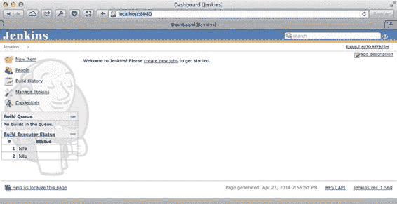

**第 5 章：使用 Jenkins 实现自动化构建 - 70**

### 在系统启动时加载 Jenkins

从命令行运行 `Jenkins` 在某种程度上是可以的。正如我们之前提到的，你不会希望依赖开发者去启动那些会让他们感到厌烦的工具。事实上，你不应该在开发者的计算机上运行 `Jenkins`，而应该在一个无人编码的中立环境中运行。大多数人和公司通常选择 Mac Mini，这在苹果硬件世界里算是比较便宜的。管理应在启动时运行的命令是通过 OS X 核心组件“Launch Daemon”完成的。它只需要按照正确的格式编写属性列表文件即可。这有点超出本书的范围，所以我们就不详细介绍了。请注意，如果你决定使用 `Homebrew` 在实际执行构建的计算机上安装 `Jenkins`，系统会提供一个启动守护进程文件。

## 初步了解

如图 5-1 所示，正如我们之前提到的，用户界面非常简单。你会在左侧看到一个菜单，包含从创建新任务到管理 `Jenkins` 的主要操作，以及一个中央区域，你可以在那里看到你的任务及其当前状态。我们现在真正关心的是用于配置 `Jenkins` 的部分。点击“Manage Jenkins”链接，然后点击“Manage Plugins”链接。

***图 5-1.** 首次打开的 Jenkins 实例主页*

`Jenkins` 附带了一些预装的插件。首先，有几个用于管理用户凭据的插件。默认的“credential plugin”会为 `Jenkins` 添加一些基本的安全功能，并将用户的凭据存储在本地，而不是依赖像 LDAP（也已预装）这样的外部系统或第三方服务的 OAuth。它还附带了“Matrix Authorization Strategy Plugin”，一旦配置好，你就可以设置更复杂的授权策略。

[www.it-ebooks.info](http://www.it-ebooks.info/)

**第 5 章：使用 Jenkins 实现自动化构建 - 71**

`Jenkins` 最初是作为 Java 生态系统的持续集成平台而诞生的。既然一个 Java 项目离不开庞大的 XML 配置文件，那么 `Jenkins` 的标准安装自然包括了 Maven、Ant 和 Javadoc 支持。它还可以通过 SSH 与远程计算机通信，并通过 DCOM（分布式组件对象模型）与运行 Windows 的计算机通信，并提供了通过电子邮件发送构建结果的插件。最后，`Jenkins` 本质上是一个社区驱动的项目。正因如此，`Jenkins` 内置了“Translation Assistance Plugin”（翻译辅助插件），以便你可以为你自己的语言翻译 `Jenkins` 做出贡献。


如您所见，Jenkins 在您首次运行 `java` 命令时便已准备就绪。如果您是一位需求非常简单的 Java 开发者。在我们这里，我们并不需要所有这些插件。只有两个与 SSH 相关的插件会在本章稍后讨论如何在远程计算机上构建应用程序时派上用场。对于像支持 Git 以便 Jenkins 能克隆我们项目这样基础的功能，我们必须安装一个插件。

## 调整 Jenkins 配置

让我们从一项简单的修改开始。首次打开“管理 Jenkins”部分时，您会看到一条警告，提醒您安装环境不受保护。如果您的 Jenkins 安装在大规模网络中可用（即不仅侦听本地主机），那么任何人都可以代表您手动启动作业，并访问存档的打包 IPA 文件等。更糟糕的是，人们还能创建执行恶意 shell 脚本的作业！

因为那可能不是您想要的结果，所以让我们添加简单的凭据并保护 Jenkins。

1. 回到“管理 Jenkins”部分，点击紧邻那条吓人警告信息的“设置安全”按钮。如果您此前尚未关闭警告信息，也可以点击“配置全局安全”按钮。
2. 在出现的屏幕上，勾选“启用安全”和“防止跨站请求伪造”两个复选框。
3. 在“启用安全”下方出现的区块中，选择“Jenkins 自有用户数据库”，并选择“任何人可以做任何事”选项。再次提醒，如果您开始向 Jenkins 添加多个账户，应考虑切换到专用工具，如 LDAP。
4. 返回并点击“管理用户”链接，最后点击“创建用户”。
5. 输入您的用户名、密码、全名和电子邮件地址，如图 5-2 所示，然后点击确定。

[www.it-ebooks.info](http://www.it-ebooks.info/)

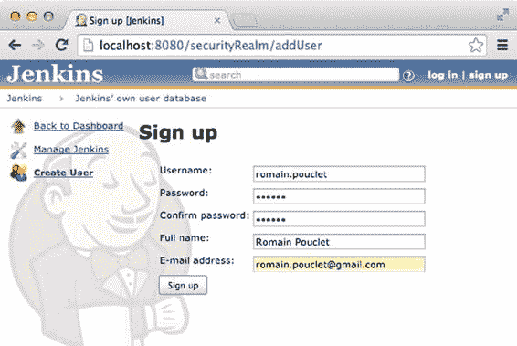

**72**

**第 5 章：使用 Jenkins 进行自动构建**

***图 5-2.** 创建新用户*

6. 然后，最后一次打开“配置全局安全”部分，选择“已登录用户可以操作任何事情”选项，而不是“任何人可以做任何事”。

您应该会被重定向到一个登录表单，在其中输入您的凭据，然后我们就可以准备安装所需的插件了。

此时，我们的需求相当简单。我们需要能够克隆一个托管在互联网上某处 Git 仓库中的项目。考虑到整个应用的一致性，我们选择使用 Github。该项目应可通过以下远程 URL 供您下载：`git@github.com:Palleas/Github-Jobs.git`。

要安装我们所需的 Git 插件，请导航至“管理插件”部分的“可选插件”选项卡，并搜索“Git Plugin”。您将看到少数几个结果，其中包括“Git Plugin”。勾选第一列的复选框。对“Xcode Plugin”重复相同过程，然后点击“不重启直接安装”按钮，如图 5-3 所示。

[www.it-ebooks.info](http://www.it-ebooks.info/)

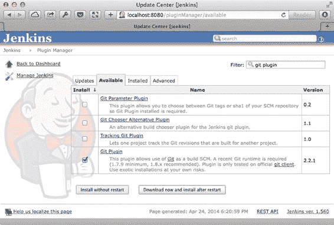

**第 5 章：使用 Jenkins 进行自动构建**

**73**

***图 5-3.** 您可以安装插件并立即开始使用它们*

您可以将 Jenkins 的“不重启直接安装”功能视为 Windows 系统中安全移除 USB 设备的菜单。理论上说这样做更安全，但几乎没人会这么做。更严肃地说，不重启整个安装环境来安装插件是完全没问题的。事实上，这是 Jenkins 1.442 版本引入的功能，现在唯一需要重启 Jenkins 的情况是卸载和升级插件。

您可能还想考虑安装一个名为“Green Balls”的插件，它会向您展示 Jenkins 的可扩展性有多强。这个插件可能只花了作者 300 行代码，但它会将成功构建的蓝色球体替换为绿色球体。


## 使用 Xcode 插件创建您的第一个 Jenkins 任务

是时候创建我们的第一个构建了。我们将从克隆应用、构建应用以及生成 IPA 文件这一简单流程开始，这与我们在前几章中所做的完全一致。要开始创建构建，只需点击左侧菜单中的“新建任务”，在“任务名称”字段中输入“Github Jobs for iOS”，然后选择“构建一个自由风格的软件项目”，最后点击“确定”。

尽管任务创建过程分为两步，但实际上当您首次点击“确定”时任务就已经创建完成了，只是目前它还是空的，不会执行任何操作。

[www.it-ebooks.info](http://www.it-ebooks.info/)

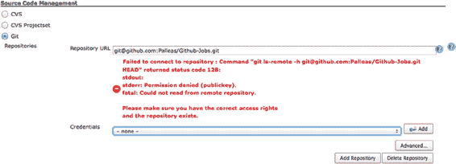

**74**

**第 5 章：使用 Jenkins 进行自动化构建**

一个 Jenkins 任务主要由一系列选项和指令组成：名称、描述、同一任务是否可以并发构建、此任务是否依赖其他任务等等。对于这部分，您可以使用默认选项。不过大多数情况下，创建 Jenkins 任务是为了构建存储在源代码管理平台（如 Git 或 SVN）中的项目。我们希望 Jenkins 从托管在 Github 上的 Git 仓库中获取应用的源代码。为此，请在“源代码管理”部分选择“Git”，并在出现的仓库 URL 字段中填写 `git@github.com:Palleas/Github-Jobs.git`。

根据您的配置，您可能会遇到如图 5-4 所示的错误，这是因为 Jenkins 试图访问一个它无权访问的仓库，而这其实是一件好事。

实际上，我们之前提到过 Jenkins 自带一个凭证管理插件。在我们的案例中，我们需要用它来存储公钥和私钥 SSH 密钥，以便与 Github 进行身份验证。

***图 5-4.** Jenkins 无法访问受保护的仓库*

### 创建专用于 Github 的 SSH 密钥

通过 SSH 与仓库进行身份验证最简单（可能也更安全）的方法是使用私钥。为此，我们需要生成一个新密钥，将公钥添加到我们的 Github 账户，并将私钥交给 Jenkins。打开终端，使用 `ssh-keygen` 生成一个新的 SSH 密钥：

```
$ ssh-keygen -t rsa -N "" -f ~/Tools/jenkins.key
Generating public/private rsa key pair.
/Users/Palleas/Tools/jenkins.key already exists.
Overwrite (y/n)? y
Your identification has been saved in /Users/Palleas/Tools/jenkins.key.
Your public key has been saved in /Users/Palleas/Tools/jenkins.key.pub.
The key fingerprint is:
22:69:9f:c0:f8:9c:14:18:ac:47:77:a1:59:d8:a4:33 Palleas@local
The key's randomart image is:
+--[ RSA 2048]----+
|       .. ++.    |
|      ooo=o      |
```

[www.it-ebooks.info](http://www.it-ebooks.info/)

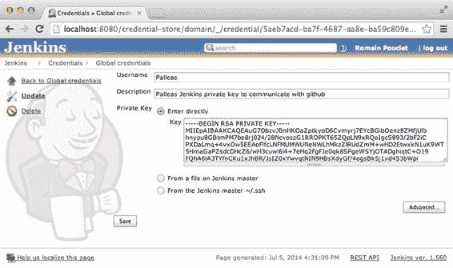

**第 5 章：使用 Jenkins 进行自动化构建**

**75**

```
|      o..E.      |
|      .  .o =     |
|       .. B . S  |
|        = = o    |
|         + o     |
|                 |
|                 |
+-----------------+
```

现在，我们已经在 Tools 文件夹中存储了一个 SSH 密钥，并且通过 `ssh-keygen` 命令，该密钥也已保存到 Jenkins 存档中。

-   `-t` 参数指示命令使用 RSA，这是一种用于保护数据传输安全的加密通信系统，由 Ron Rivest、Adi Shamir 和 Leonard Adleman 发明，因此得名 RSA。
-   `-N` 参数用于为密钥关联一个空密码短语。大多数人是出于懒惰才使用空密码短语，以避免在发起 SSH 连接时输入密码，但在我们的案例中，我们在编写本书时 Jenkins 尚不支持这种操作。不过，有一个相关的 `JENKINS-20879` 问题正在处理中。

### 告知 Jenkins 使用这个全新的密钥

借助 Jenkins 的凭证插件，告知 Jenkins 使用这个全新的密钥非常简单。返回 Jenkins 首页，从左侧菜单中选择“凭证”。然后，从左侧菜单中选择“全局凭证”和“添加凭证”。最后，按照图 5-5 所示填写表单。

***图 5-5.** 添加新的 SSH 密钥，以便 Jenkins 与 Github 通信*

[www.it-ebooks.info](http://www.it-ebooks.info/)

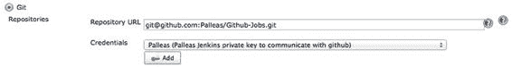

**76**

**第 5 章：使用 Jenkins 进行自动化构建**


请注意，您可以通过以下命令获取私钥内容并粘贴到表单中：

```
$ cat ~/Tools/jenkins.key | pbcopy
```

然后，前往您的 GitHub 个人资料，将您的公钥（即 `Jenkins.key.pub` 文件的内容）添加到您的个人资料中。如果您不知道如何操作，请查阅 GitHub 官方文档：

`https://help.github.com/articles/generating-ssh-keys`

现在，您应该能够将 Git 仓库 URL 添加到任务配置中，如图 5-6 所示。

**图 5-6.** 明确选择凭据允许 Jenkins 与 Git 仓库通信

“构建触发器”目前并不重要，我们只会手动启动构建，将在后续详细讨论此部分。Jenkins 任务的第三部分才是真正值得关注的部分。仅仅向 Jenkins 提供一个源代码仓库是不够的，您还必须明确告诉它构建将包含哪些内容。

#### 构建 GitHub 任务应用

幸运的是，我们之前下载的 Xcode 插件使得描述构建 Xcode 项目的过程变得非常简单。

1. 在“构建”部分，点击“添加构建步骤”并选择“Xcode”。

2. 展开“设置...”面板，并在配置字段中输入“AdHoc”。

如果您在自己的计算机上运行 Jenkins 进行试用，那么您可能已经满足了代码签名的要求——也就是说，您的钥匙串中已经拥有私钥和配置文件。

3. 勾选“打包应用并构建 IPA”复选框。展开“代码签名与 OS X 钥匙串选项”部分，并勾选“解锁钥匙串”复选框。即使“钥匙串路径”旁边的帮助说明提示它会使用默认值，也请在文本字段中填写`${HOME}/Library/Keychains/login.keychain`，否则将无法工作。

4. 在“钥匙串密码”字段中输入您的密码并继续。

`www.it-ebooks.info`


**第 5 章：使用 Jenkins 进行自动构建**

**77**

**注意** 如果您是在一台全新的计算机（例如您为公司新买的 Mac Mini）上运行 Jenkins，请不要担心，我们将在几节后回到打包过程。

5. 如果您记得前一章的内容，我们正在尝试构建一个工作区并使用一个 scheme。展开“高级”部分。在“Xcode Schema File”字段中填写“Github Jobs”，在“Xcode Workspace File”字段中填写“Github Jobs”。不要添加`.xcworkspace`扩展名，否则它将查找名为“Github Jobs.xcworkspace.xcworkspace”的文件，构建将会失败。

6. 最后，将“构建输出目录”设置为`${WORKSPACE}/build`，其中`WORKSPACE`是在构建过程中可用的环境变量，包含项目根目录的路径。

您可能已经猜到，当前的构建不会成功，因为我们没有将项目依赖项添加到项目仓库中。再次点击“添加构建步骤”，选择“执行 Shell”，然后将刚刚出现的块拖到 Xcode 块之上。在文本区域中填写`pod install`。

目前，我们的任务基本上就是这些：安装依赖项，构建并打包应用程序。您可以拥有任意数量的构建步骤，只要记住它们是按顺序运行的，并且任何一个步骤失败都会导致整个构建失败即可——这在思考时是合理的。

#### 归档生成的 IPA

构建的最后一部分是可选的构建后操作列表，无论构建结果如何，这些操作都会执行。这些操作可以是任何内容，从生成和发布文档到归档构建结果。在这种情况下，我们需要跟踪构建过程中创建的 IPA 文件。

为此，点击“添加构建后操作”并选择“归档制品”，然后填写您期望在构建过程中创建的文件的模式——在本例中为扩展名为`.ipa`的文件，如图 5-7 所示。

**图 5-7.** 要求 Jenkins 在构建结束时查找并归档 ipa 文件

`www.it-ebooks.info`

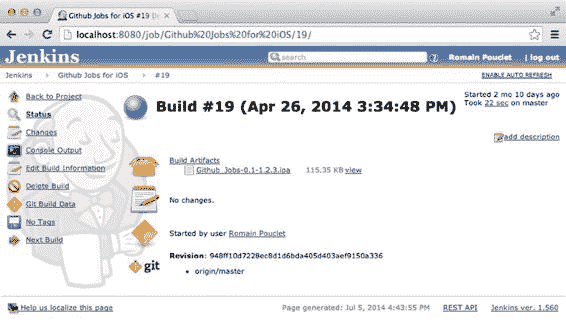

**78**

**第 5 章：使用 Jenkins 进行自动构建**

此构建后操作提供了一些高级选项，例如要求 Jenkins 仅保留最新的制品以节省空间。如果我们在构建非常大的应用程序，这可能会很有用，但也会阻止构建多个分支并保留生成的 ipa 文件。此外，我们上次打包应用程序时，生成的包大小约为 150KB，因此暂时不会出现空间问题。

任务现已正确配置，是时候触发构建了。准备好后，点击左侧菜单中的“立即构建”按钮开始构建，并点击左侧菜单中出现的链接。

应用程序很小，因此第一次构建（包括从 GitHub 仓库获取内容的时间）应该不会超过一分钟。构建完成后刷新页面，或点击页面右上角的“启用自动刷新”链接。最后，您应该看到类似于图 5-8 的内容。

**图 5-8.** 一次成功的 Jenkins 构建

一个成功的构建页面包含关于刚刚发生事件的有用信息：持续时间、自上次构建以来的更改、版本控制的其他信息，包括构建时工作区所在的提交哈希。当然，如果您实际安装了 Green Balls 插件（让一切看起来更漂亮），上面的截图可能会略有不同。

此截图中有趣的是“构建制品”部分，它显示了我们希望 Jenkins 归档的 IPA 文件。通过这种方式，您可以简单地构建应用程序的任何分支，以便您的测试人员可以访问 Jenkins，下载生成的 IPA，并通过 iTunes 安装它。当然，我们已经经历过这一点，并且不用担心，还有更强大的构建后操作可以安装。

`www.it-ebooks.info`

**第 5 章：使用 Jenkins 进行自动构建**

**79**

Jenkins 默认的主目录位于以下路径：`~/.jenkins`。如果您正在查找已归档构建的路径，可以在那里找到它们：

```
$ find .jenkins/jobs/Github\ Jobs\ for\ iOS -name "*.ipa"
.jenkins/jobs/Github Jobs for iOS/builds/2014-04-26_15-34-48/archive/build/Github_Jobs-0.1-1.2.3.ipa
```

恭喜，您已经踏入了持续集成世界的第一步。还有一些地方可以改进。首先，Xcode Build 插件不错，但并非完美。

它让您可以控制构建过程中的许多事情，但有时方式令人困惑，例如工作区文件的路径不需要扩展名。

如果回顾一下我们在前一章编写的脚本，您会发现我们不需要那么多选项。这就是为什么从现在开始我们将使用自己的脚本。此外，更新它也会容易得多。不过在此之前，让我们看看 Jenkins 提供的其他功能。

## Jenkins 高级用户功能

Jenkins 是一个非常强大的工具，即使您从未使用过持续集成平台，也可以在几小时内学会使用。但不要忽视它，因为它也提供了一些帮助高级用户的功能。

### Jenkins REST API


如果你仔细看，几乎每个页面底部都有一个“REST API”链接。Jenkins REST API 允许你完成所有通过按钮和表单能完成的操作，包括创建任务，这在自动化视角下非常有用。你可以与 Jenkins 的几乎每个部分进行通信。要访问与特定资源（例如，一个任务）交互的可用方式的文档，只需在 URL 末尾添加`/api`：`http://localhost:8080/job/Github%20Jobs%20for%20iOS/api`。别忘了，我们安装 Jenkins 时已对其访问进行了安全保护。因此，如果你尝试通过命令行获取内容，别忘了添加你的凭据。例如，如果你使用`cURL`：

```
$ curl -u romain.pouclet:pwd http://localhost:8080/job/Github%20Jobs%20for%20iOS/api/json
{
   "actions" : [
   ],
   "description" : "",
   "displayName" : "Github Jobs for iOS",
   "displayNameOrNull" : null,
   "name" : "Github Jobs for iOS",
   "url" : "http://localhost:8080/job/Github%20Jobs%20for%20iOS/",
   ...
}
```

使用 REST API 创建和更新任务需要任务的基于 XML 的描述。如果你查看 `Github Jobs for iOS` 任务在 `http://localhost:8080/job/Github%20Jobs%20for%20iOS/config.xml` URL 上的 `config.xml` 内容，你可以获取构建的三个重要部分。

首先，`scm` 部分包含我们希望 Jenkins 克隆的 git 仓库 URL：

```
<scm class="hudson.plugins.git.GitSCM" plugin="git@2.2.1">
   <configVersion>2</configVersion>
   <userRemoteConfigs>
      <hudson.plugins.git.UserRemoteConfig>
         <url>git@github.com:Palleas/Github-Jobs.git</url>
         <credentialsId>5aeb7acd-ba7f-4687-aa8e-ba59c809eb38</credentialsId>
      </hudson.plugins.git.UserRemoteConfig>
   </userRemoteConfigs>
   <branches>
      <hudson.plugins.git.BranchSpec>
         <name>*/master</name>
      </hudson.plugins.git.BranchSpec>
   </branches>
   <doGenerateSubmoduleConfigurations>false</doGenerateSubmoduleConfigurations>
   <submoduleCfg class="list"/>
   <extensions/>
</scm>
```

其次，`builders` 部分包含了我们添加的构建阶段列表。这包括使用 `cocoapods` 安装依赖的 shell 脚本，以及构建应用的 Xcode 构建：

```
<builders>
   <hudson.tasks.Shell>
      <command>pod install</command>
   </hudson.tasks.Shell>
   <au.com.rayh.XCodeBuilder plugin="xcode-plugin@1.4.2">
      <cleanBeforeBuild>false</cleanBeforeBuild>
      <cleanTestReports>true</cleanTestReports>
      <configuration>AdHoc</configuration>
      <target></target>
      <sdk></sdk>
      <symRoot></symRoot>
      <configurationBuildDir>${WORKSPACE}/build</configurationBuildDir>
      <xcodeProjectPath></xcodeProjectPath>
      <xcodeProjectFile></xcodeProjectFile>
      <xcodebuildArguments></xcodebuildArguments>
      <xcodeSchema>Github Jobs</xcodeSchema>
      <xcodeWorkspaceFile>Github Jobs</xcodeWorkspaceFile>
      <embeddedProfileFile></embeddedProfileFile>
      <cfBundleVersionValue></cfBundleVersionValue>
      <cfBundleShortVersionStringValue></cfBundleShortVersionStringValue>
      <buildIpa>true</buildIpa>
      <generateArchive>false</generateArchive>
      <unlockKeychain>true</unlockKeychain>
      <keychainName>none (specify one below)</keychainName>
      <keychainPath>${HOME}/Library/Keychains/login.keychain</keychainPath>
      <keychainPwd>keychain-password</keychainPwd>
      <codeSigningIdentity></codeSigningIdentity>
      <allowFailingBuildResults>false</allowFailingBuildResults>
      <ipaName></ipaName>
      <ipaOutputDirectory></ipaOutputDirectory>
      <provideApplicationVersion>false</provideApplicationVersion>
   </au.com.rayh.XCodeBuilder>
</builders>
```

最后，`publishers` 部分展示了构建后阶段的产品归档：

```
<publishers>
   <hudson.tasks.ArtifactArchiver>
      <artifacts>**/*.ipa</artifacts>
      <latestOnly>false</latestOnly>
      <allowEmptyArchive>false</allowEmptyArchive>
   </hudson.tasks.ArtifactArchiver>
</publishers>
```


`config.xml`导出文件非常易于理解，看起来很像遵循`NSCoding`协议的对象在`plist`中的表示形式。此功能也很方便，因为它允许您通过向同一 URL 发布更新后的`config.xml`来更新任务。

使用 Jenkins REST API 启用或禁用任务也同样简单，您只需向`/disable`和`/enable`端点发送 POST 请求即可。更有趣的是，您可以使用`/build`端点触发构建，但需要考虑到一些安全问题。

在创建“Github for iOS”任务时，您可能已经注意到表单的“构建触发器”部分中有一个“远程触发构建”选项。如图 5-9 所示，该选项允许您添加一个身份验证令牌，用于保护对`/build`端点的调用。

```
$ curl -v http://localhost:8080/job/Github%20Jobs%20for%20iOS/build?token=BewareMyToken
```

***图 5-9.** 添加令牌以保护对 HTTP 端点的调用将触发构建* 不过，您不应该依赖此令牌，因为即使它在创建任务表单中仍然可用，它已被认为是弃用的，并可能在未来的 Jenkins 版本中被移除。相反，您应该像之前一直做的那样使用基本身份验证。

```
$ curl -X POST -u romain.pouclet:pwd http://localhost:8080/job/Github%20Jobs%20for%20iOS/build
```
如果构建被创建，响应结果应为“201 Created”状态码，并且`Location`头应包含刚刚在队列中创建的项的 URL。队列是一个应该执行的任务列表。它拥有自己独立的 API。

[www.it-ebooks.info](http://www.it-ebooks.info/)

**第 5 章：使用 Jenkins 进行自动构建**

拥有此 API 的最大好处在于，它使得通过脚本与 Jenkins 交互变得极其容易。我们将在“获取反馈”部分进一步讨论这一点。您应该记住的是，您现在知道了触发构建的两种方式：手动触发或通过调用 HTTP URL 触发。

让我们继续！

### 命令行中的 Jenkins

如果 HTTP REST API 还没有让 Jenkins 足够“可入侵”，您还可以使用一个 Jenkins 命令行工具。它用 Java 编写，将以最简单的方式允许您执行不同的操作。要下载 Jenkins 命令行工具，只需访问您安装的`/cli`部分（例如`http://localhost:8080/cli`），然后获取 JAR 文件的 URL。复制该 URL 并在终端中输入以下命令。首次使用命令行工具时，您会收到一条警告，提示无法进行身份验证。

```
$ cd ~/Tools
$ curl http://localhost:8080/jnlpJars/jenkins-cli.jar -O
$ java -jar jenkins-cli.jar –s http://localhost:8080 who-am-i
[WARN] Failed to authenticate with your SSH keys. Proceeding as anonymous
```

这次，您将无法简单地输入登录名和密码来验证您的 Jenkins 安装，即使您可以向任何命令传递`--username`参数来提示输入密码。不推荐使用这种方法。您需要做的是将一个 SSH 公钥关联到您的个人资料，可在`/me/configure`URL 处完成，或者点击屏幕右上角的您的名字，然后点击左侧菜单中的“Configure”链接。

您可能已经在`~/.ssh`文件夹中有一个 SSH 公钥，但我们将使用之前生成用于与 Github 通信的那个密钥。检索存储在`~/Jenkins/Jenkins.key.pub`中的公钥内容，并将其粘贴到“SSH 公钥”文本区域。按“保存”，返回终端，并使用`-i`选项重新运行之前的命令，该选项指定用于身份验证的私钥。

```
$ java -jar jenkins-cli.jar -s http://localhost:8080 -i ~/Tools/jenkins.key who-am-i
Authenticated as: romain.pouclet
Authorities:
authenticated
```

当然，每次使用带有`-s`和`-i`选项的这个命令有点烦人，特别是如果您想多次使用它。如果使用存储在`~/.ssh/id_rsa[.pub]`（即`ssh-keygen`存储 SSH 密钥的默认路径）的密钥，则可以避免指定 Identity 文件。此外，服务器选项也不是问题，因为再次强调，您可以通过一个环境变量来省去此步骤，在这种情况下是`JENKINS_URL`环境变量，您只需声明一次即可。

```
$ export JENKINS_URL=http://localhost:8080
$ java -jar jenkins-cli.jar who-am-i
Authenticated as: romain.pouclet
Authorities:
authenticated
```

[www.it-ebooks.info](http://www.it-ebooks.info/)

**第 5 章：使用 Jenkins 进行自动构建**

与 REST API 一样，您可以导出任务的 XML 表示：

```
$ java -jar jenkins-cli.jar get-job "Github Jobs for iOS"
```

您可以启用/禁用一个任务：

```
$ java –jar jenkins-cli.jar disable-job "Github Jobs for iOS"
```

最后，您可以触发构建：

```
$ java -jar jenkins-cli.jar build -w -s "Github Jobs for iOS"
Started Github Jobs for iOS #29
Completed Github Jobs for iOS #29 : SUCCESS
```

如您所见，可以通过多种不同的方式与 Jenkins 进行通信，其中一些我们尚未涵盖。如果您不喜欢以`java –jar...`命令开头，也可以通过 SSH 直接与 Jenkins 通信。事实上，如果您查看对您的 Jenkins 主页安装进行 HTTP 调用返回的头部信息，您可以在响应中看到一些与 SSH 相关的头部，这些头部提供了 SSH 监听的主机和端口：

```
$ curl -D - http://localhost:8080 -o /dev/null
...
X-Jenkins-CLI-Port: 52722
X-SSH-Endpoint: localhost:52716
...
$ ssh -p 52716 romain.pouclet@localhost who-am-i
Authenticated as: romain.pouclet
Authorities:
authenticated
```

我们不会详细讨论 Jenkins SSH 端点，因为它与 Jenkins CLI 的工作方式非常相似。所有这些访问点都有一些明显的优势：HTTP 使得从脚本自动执行操作变得非常容易，而命令行工具是与 Jenkins 手动交互的强大方式。CLI 的明显优势是，无需在您希望与之交互的页面底部寻找“REST API”链接，即可获得所有可用命令的列表。

重要的是要认识到，如果您还没有找到一种适合您需求的与 Jenkins 通信的方式，那么您很可能没有进行足够的探索。

### 获取反馈

如果您忘记运行构建，那么拥有一个构建应用程序的持续集成平台是毫无用处的，这就是为什么您的平台需要为您处理这部分工作的原因。大多数仓库托管服务都带有钩子，一旦您将新的提交推送到远程仓库，这些钩子就可以调用一个 URL。您也可以决定每天在 10 点自动构建您的`master`分支，并创建所谓的“夜间构建”。重要的是保持您的任务健康报告有意义。

[www.it-ebooks.info](http://www.it-ebooks.info/)

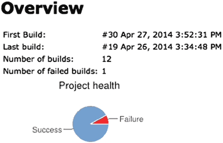
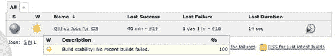

**第 5 章：使用 Jenkins 进行自动构建**

对于您创建的每个任务，Jenkins 都会根据最近几次构建的结果计算一份健康报告，并用一个小天气图标来表示。如图 5-10 所示，我们的项目运行良好，因为它是一个简单的项目，没有任何理由构建失败。


***图 5-10.** 如果过去的构建全部通过，说明项目运行状况良好*

健康报告基于之前构建的结果，但这相当抽象，因为它只考虑了最终结果：通过或失败。当然，一次通过的构建并不意味着任务运行良好。我们将在关于单元测试的章节中详细讨论这一点，但先考虑以下情况：一个项目中有大量测试失败。由于懒惰、缺乏优先级或紧迫的截止日期，这些失败的测试被停用了，那么你的项目肯定运行不佳。你需要通过添加一些背景信息来让这份健康报告变得有意义，例如使用“Project Health Report Plugin”插件来创建更详细的报告，如图 5-11 所示。现在，你应该能够自行安装该插件了。

***图 5-11.** “Project Health Report”插件显示了项目健康状况的更详细概览*

**及时接收通知并修复构建**

如果你希望项目保持健康，没有什么比修复构建更重要的了。人们很容易产生“我稍后再修复构建”的想法，然后忘记这件事。即使应用程序在你的电脑和测试设备上运行正常，你的同事可能并不知道这一点。

为了能够立即修复构建，你需要在构建失败时立即收到通知，例如通过一封简单的电子邮件。Jenkins 的默认安装会使用 `localhost` 和一系列默认设置作为 SMTP 服务器来发送这些邮件，但如果你没有运行这样的服务器，这很可能无法工作。要解决这种情况，你可以使用你的 Gmail 账户凭据，在 Jenkins 系统配置部分的 **E-mail Notifications** 表单中进行配置，该表单还提供了测试配置的功能。完成后，你只需在“Github Jobs for iOS”任务配置的末尾添加一个新的构建后操作，如图 5-12 所示。

***图 5-12.** 对于每次不稳定的构建，`romain.pouclet@gmail.com` 背后的用户都会收到一封邮件*

每次构建失败时，都会有人收到一封包含构建直接链接的邮件通知。控制台输出会准确显示发生了什么，这样你就可以自责一下，因为你又一次忘记在构建应用程序之前共享 scheme 或安装依赖了。

参见 `http://localhost:8080/job/Github%20Jobs%20for%20iOS/34/`

```
Started by user Romain Pouclet
Building in workspace http://localhost:8080/job/Github%20Jobs%20for%20iOS/ws/
Fetching changes from the remote Git repository
Fetching upstream changes from git@github.com:Palleas/Github-Jobs.git
using GIT_SSH to set credentials Palleas Jenkins private key to communicate with github
Checking out Revision 948ff10d7228ec8d1d6bda405d403aef9150a336 (origin/master)
Working directory is http://localhost:8080/job/Github%20Jobs%20for%20iOS/ws/
...
```

在这个时不时就有新创公司推出新服务、号称通过“消灭电子邮件”来革新公司内部沟通方式的时代，使用电子邮件来接收构建失败的通知似乎有点奇怪。但问题是，电子邮件通知是 Jenkins 标准安装自带的免费功能。如果你需要更适合公司环境的通知方式，比如在特定聊天室里发送消息，很可能有相应的插件可以做到。事实上，你应该仔细考虑你将使用的通知类型。如果你讨厌收到电子邮件，你甚至不会费心去阅读 Jenkins 发来的邮件，你就不会去修复构建，那么一切又会回到原点。

**监控多个项目的状态**

到目前为止，我们介绍的方法对开发者——那些实际有能力处理失败构建的人来说——非常有用。你大概不想让你的老板收到那些邮件（他可能也不想）。而且，这些通知是针对特定项目的，有时你可能希望更广泛地了解整体状况。

这就是为什么会有一些插件可以显示多个任务的状态，例如“Wall Display Plugin”。如图 5-13 所示，你可以使用这类插件来展示项目（包括你应用的安卓版本、后端等）的运行状况。

***图 5-13.** 包含所有平台的“Github Jobs”项目状态*

最后，如果你不喜欢它的外观，或者想要更符合需求、集成到其他解决方案中的东西，你仍然可以使用 `/cc.xml` 提供的 feed。当 Jenkins/Hudson 的第一个版本发布时，CruiseControl 主导着自动化构建平台市场，并确立了一个标准：

```xml
<?xml version="1.0" ?>
<Projects>
  <Project activity="Sleeping" lastBuildLabel="1" lastBuildStatus="Success" lastBuildTime="2014-04-27T22:06:35Z" name="Github Jobs Backend" webUrl="http://localhost:8080/job/Github%20Jobs%20Backend/"/>
  <Project activity="Sleeping" lastBuildLabel="1" lastBuildStatus="Failure" lastBuildTime="2014-04-27T21:05:02Z" name="Github Jobs for Android" webUrl="http://localhost:8080/job/Github%20Jobs%20for%20Android/"/>
  <Project activity="Sleeping" lastBuildLabel="35" lastBuildStatus="Success" lastBuildTime="2014-04-27T21:03:55Z" name="Github Jobs for iOS" webUrl="http://localhost:8080/job/Github%20Jobs%20for%20iOS/"/>
</Projects>
```

既然我们已经了解了 Jenkins 能为我们做什么，让我们回到我们的 Github Jobs for iOS 应用程序，并更新任务以满足我们的需求。

**集成我们的构建脚本**

我们已经介绍了如何使用 **Xcode Build** 插件来构建 Github Jobs 应用程序，这个插件为我们做了一切，甚至更多。这类插件的问题在于，它们有点像“黑盒”，当然这并不是贬义，因为大部分插件都是开源的。问题是，它们抽象了很多底层发生的事情，并且在我们成功编写了一个大约十行代码（包括 shebang 和注释）的构建脚本之后，它们反而增加了许多复杂性。此外，如果你遇到了特定环境的构建问题，手动重新运行构建脚本也只需一个 SSH 命令。

考虑到这一点，回到我们创建的任务，移除“Xcode”构建阶段。由于我们编写的脚本也通过 Cocoapods 处理了依赖的安装，请清空“Execute Shell”构建阶段的文本区域，并填入以下命令（别忘了引号）：

```
"$WORKSPACE/bin/cibuild"
```

如果你还记得上一章，我们的脚本使用了 `xcpretty` 来让 xcode 输出更易读、更美观。问题是，Jenkins 的构建控制台输出是纯文本，除非你安装了 **AnsiColor Plugin**。安装该插件后，在 **Build Environment** 部分勾选“Color ANSI Console Output”选项，然后重新运行任务，并前往任务的 **Console Output** 部分。你应该会看到带有颜色的输出，就像图 5-14 所示的那样。

***图 5-14.** 构建 Github Jobs 应用程序的任务输出（带颜色）*

回到我们输入的脚本，`$WORKSPACE` 是 Jenkins 提供的另一个环境变量，供你在构建脚本中使用。大约有 15 个环境变量可供 shell 脚本使用，它们列在 `http://localhost:8080/env-vars.html/` 上。


`$JENKINS_HOME` 和 `$WORKSPACE` 是绝对路径，分别对应于 Jenkins 的安装目录（在我们的例子中是 `~/.jenkins`）和仓库内容存储的目录（在我们的例子中是 `/Users/Paleas/.jenkins/jobs/Github Jobs for iOS/workspace`）。我们已经使用第二个路径来定位构建脚本，并且可以轻松找到 `BUILD_NUMBER` 的用途。

## 更新构建编号

返回“Github Jobs”项目，在你喜欢的文本编辑器中打开 `cibuild` 脚本。我们在前一章讨论了 `agvtool`，它可以自动更新应用程序的构建编号。在 `pod install` 命令之前添加以下行：

```
agvtool new-version -all ${BUILD_NUMBER:?"BUILD_NUMBER should be set, are you sure this script is run within a ci job?"}
```

除了最后一部分，语法应该不难理解。我们使用了一个巧妙的 bash 技巧，称为“参数展开”。基本含义是，如果 `BUILD_NUMBER` 变量不可用（或为空），脚本将以非零返回码退出。

在更新构建脚本并测试其正常工作时，你的 Jenkins 实例可能无法从外部访问，因此你的仓库托管服务无法在你每次推送时自动发送请求来触发构建。从现在开始，你应考虑运行以下命令：

```
$ git push && java –jar ~/Jenkins/jenkins-cli.jar build "Github Jobs for iOS"
```

## 解锁钥匙串

在我们的脚本中，我们还需要一个 `PASSWORD` 环境变量来在代码签名前解锁钥匙串。将密码硬编码在构建脚本中并不安全，因此我们做了一个简单的补救措施：在运行脚本之前声明环境变量。这虽然不太安全，但至少密码不会在仓库中可见。

我们无法使用同样的补救措施将密码写在作业的配置表单中。为确保安全，我们需要使用另一个名为“Mask Password”的插件。返回 Jenkins 配置部分并安装它。

完成后，进入“Github Jobs”Jenkins 作业的配置，在“构建环境”部分找到“mask passwords (and enable global passwords)”选项。点击“添加”按钮并在此添加密码，如图 5-15 所示。

[www.it-ebooks.info](http://www.it-ebooks.info/)

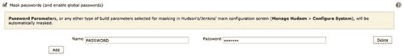

**第 5 章：使用 Jenkins 进行自动构建**  
**89**

***图 5-15.** 将密码添加为环境变量，以便在构建脚本中使用*

就这样！我们的脚本应该会自动解锁钥匙串。不要担心这样存储密码的安全性。密码已被正确编码并存储在我们之前提到的 `config.xml` 文件中。如果你使用 Jenkins 管理中定义的全局密码，它将更加安全。此外，即使你添加一个新的 shell 构建步骤来运行以下脚本：`echo $PASSWORD`，该命令的输出（即密码）也会被插件自动混淆。

## 事后清理

最后一步我们尚未提及，但你需要在此上下文中认真考虑。请记住，作业的第一个阶段是从远程仓库获取内容，然后实际执行一些任务，而我们的任务之一就是更新构建编号。这意味着需要在多个地方更改信息，运行脚本后，工作副本的状态如下：

```
$ git status --short
M "Github Jobs.xcodeproj/project.pbxproj"
M "Github Jobs/Github Jobs-Info.plist"
M "Github JobsTests/Github JobsTests-Info.plist"
```

这并不好。下次从远程仓库拉取新内容时，如果这三个文件中有任何一个被修改，就会发生冲突，导致构建失败。这就是为什么你需要事后清理。要做到这一点，你有多种选择。最简单的方法是在构建的“源代码管理”部分中打开“附加行为”下拉菜单，并选择“Clean before checkout”：这将把工作空间恢复到干净状态，然后安全地拉取新内容。

## 将 Xcode 构建集成到现有 Jenkins 安装中

有时在公司里，iOS 开发可能不是唯一的开发类型。其他移动开发（如 Android 或 Blackberry）、使用 PHP、Java 或 Ruby 的后端开发，这些技术几乎可以在任何环境中运行。如果 iOS 开发是在之后才开始的，你可能会发现一台 Jenkins 已安装在非 OS X 平台上，该平台无法运行 Xcode 和构建 iOS 应用程序。

[www.it-ebooks.info](http://www.it-ebooks.info/)  
**90**  
**第 5 章：使用 Jenkins 进行自动构建**

简单的解决方案是安装一个专用于构建 iOS 应用程序的新 Jenkins，但这将导致你需要维护两个 Jenkins 安装。此外，你将无法从一个地方看到所有项目的状态。既然你可能不想成为持续集成中的“异类”，并且希望与他人良好协作，那么你可以考虑使用更合适的解决方案——称为“从节点”。

## 从节点基础

Jenkins 从节点本质上是在专用节点上运行的轻量级 Jenkins 实例，可用于扩展目的——当你的实例构建了大量作业，且希望在多台构建机器之间平衡负载时。另一种情况是，你需要在具有特定要求的平台上构建作业，例如能够运行 Xcode 和命令行工具。

此时，你需要做的事情和你之前做过的没什么不同：进入管理 Jenkins 部分，添加专用凭据，填写文本字段，并勾选复选框。

## Jenkins 从节点的结构

打开 Jenkins 的管理部分，点击“管理节点”链接。你应该会看到主节点，即自本章开始以来一直在运行的 Jenkins 安装。点击左侧菜单中的“新建节点”链接。在出现的表单中，选择“Dumb Slave”选项（这应该是唯一可用的选项），并在文本字段中为节点填写一个名称。你可以自由发挥创意，但务实的方法建议将其命名为“Xcode builder”之类的。找到名称后，点击“确定”。

创建节点非常简单。一旦你确定了名称（以及可选的描述），有几个必填字段需要填写：构建将在哪里执行、与此节点关联的标签，以及如何与该节点通信。

“Remote FS root”是从节点上用于存储作业的绝对路径。可以将其视为桌面上 `~/.jenkins/jobs` 文件夹的远程等效项。由于你将与一台运行 OS X 的远程计算机通信，你应该使用主目录并填写类似 `/Users/RemoteUserName/JenkinsBuilds` 的内容。

标签也非常重要。使用从节点时，你不需要明确指定希望作业在何处运行。相反，你设置一系列限制条件，以便 Jenkins 找到满足这些要求的节点。在“标签”字段中填写 `xcode`。


最后，有多种启动方式可以与从节点通信，但我们将使用 SSH 方式。从下拉框中选择“Launch Slave Agents on Unix Machines via SSH”选项。在主机（`Host`）字段中，输入节点的 IP 地址。就像配置与 GitHub 的连接一样，我们将使用 Jenkins 的凭据存储来与远程主机进行身份验证。点击下拉框附近的“Add”链接，并填写用于连接该计算机的凭据。这可以是用户名和密码，或者私钥。前者可能更安全，但从节点无法从外部访问，因此使用用户名和密码就足够了。请注意，如果要通过 SSH 连接到节点，则必须启用远程访问。

完成此过程后，您的表单应类似于图 5-16 所示。

[www.it-ebooks.info](http://www.it-ebooks.info/)

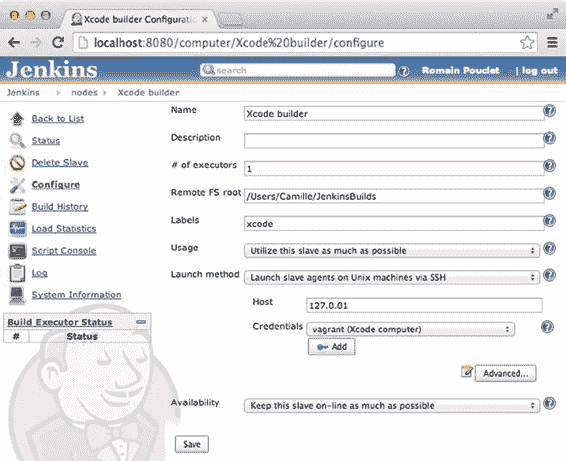


**第 5 章：使用 Jenkins 自动构建**

**91**

***图 5-16.** 节点已准备好创建*

节点应自动启动。如果日志显示错误，请确保您尝试使用的凭据有效，您输入了正确的主机和端口，远程访问已激活，并且计算机上安装了有效的 Java 环境。主节点和从节点之间的通信通过`slave.jar`归档文件进行，该文件在主节点首次连接时通过 SFTP 复制到从节点上。

```
$ ssh Camille@192.168.1.14
$ cd /JenkinsBuilds
$ ls
slave.jar
```

如果您返回到“Github Jobs for iOS”并点击配置链接，会出现一个新的配置区域，您可以通过该区域告诉您的任务在运行 Xcode 的计算机上执行。勾选“Restrict Where this Project Can be Run”复选框，并在“Label Expression”字段中填入`xcode`，这是我们上面输入的标签，如图 5-17 所示。

***图 5-17.** 应用程序将在能够运行 xcode 的从节点上构建* 就是这么简单！

[www.it-ebooks.info](http://www.it-ebooks.info/)

**92**

**第 5 章：使用 Jenkins 自动构建**

管理配置文件（Provisioning Profiles）和私钥

在本章中，我们多次构建和签名应用程序，但还有一件事没有涉及：该如何处理我们的配置文件和私钥？

通常的答案很简单：没有神奇的解决方案。配置文件存储在您的`Library`文件夹中，您可以使用以下简单命令找到它们：

```
$ ls -l /Users/Palleas/Library/MobileDevice/Provisioning\ Profiles
-rw-r--r-- 1 Palleas staff 15799 4 Apr 11:22 0255A8B8-3DD3-4893-8E6E-9F6664DF89B5.mobileprovision
-rw-r--r-- 1 Palleas staff 14153 26 Dec 17:06 05A46FE9-236E-4B40-8625-57A857155A7F.mobileprovision
-rw-r--r-- 1 Palleas staff 15775 4 Apr 11:22 10F8378B-6638-4A94-AB4B-E505BF562DA9.mobileprovision
-rw-r--r-- 1 Palleas staff 15757 4 Apr 11:22 18E20B0C-9446-4A68-A4F2-3483D02624E2.mobileprovision
-rw-r--r-- 1 Palleas staff 15846 4 Apr 11:22 1F908F91-7B22-4B31-8629-7D286FE20ECD.mobileprovision
-rw-r--r-- 1 Palleas staff 15787 4 Apr 11:22 1FA4FB89-845B-43B9-98DC-07A26B5F3920.mobileprovision
...
```

私钥存储在钥匙串中，我们已经使用`security`命令行工具进行了一些基本的钥匙串操作，但还有其他与钥匙串相关的方法我们尚未涉及。您可能可以通过 SSH 在运行构建的计算机上操作钥匙串，并以相同的方式安装配置文件。

问题是，即使 Apple 在代码签名身份管理方面取得了巨大进步，它仍然是一个复杂的概念。一个简单的解决方案是：将屏幕插入您的构建计算机一次，并在第一次构建应用程序时手动运行 Xcode，确保一切顺利运行。再次强调，没有银弹，但我们正在慢慢接近目标。

我们接下来该做什么？

恭喜，您已经搭建了一个相当不错的持续集成平台。目前它功能有限，但在后续章节中，我们将使用它来通过无线方式部署应用程序，并通过单元测试和质量保证工具更新构建流程，以获得更详细的反馈。

总结

本章带您了解了世界上最常用的持续集成平台。现在，您将能够检测是否有同事在尝试向项目导入新框架时忘记勾选“Copy Items into Destination’s Group”复选框（尽管他或她应该使用 Cocoapods）。我们希望您现在已经理解为什么一个中立的构建平台很重要，以及需要做些什么来让它对您的团队保持有用。

下一章将介绍一家名为“Atlassian”的澳大利亚公司提供的替代方案——Bamboo。

[www.it-ebooks.info](http://www.it-ebooks.info/)

第 6 章：使用 Bamboo 自动构建

在前一章中，我们大量讨论了开源自动构建平台 Jenkins。

即使它存在一些问题和奇怪的行为，我们仍然希望您在章节结束时意识到它实际上是一个多么优秀的平台。我们向您展示了启动它有多么容易，并描述了在家中拥有一个这样的平台的好处。您现在可能会问自己一个问题：“为什么我们还需要另一个？”这是个好问题，但在回答之前，让我们明确一点：本书的目的不是推广 Bamboo 而非 Jenkins。这只是简单介绍 Bamboo 如何帮助您作为 iOS 开发人员的日常工作。

Bamboo 是由澳大利亚公司 Atlassian 创建的一个商业产品，该公司也负责开发 Confluence 以及 Jira。如果您曾经寻找过错误跟踪器，那么您可能至少遇到过 Jira 一次，并且可能正在您的公司中使用它。如果是这样，您会很高兴知道 Bamboo 与 Jira 深度集成，使得从失败的构建创建问题变得非常容易。

有什么充分的理由让我们从一个免费的、开源平台切换到一个付费的、半专有的平台（部分组件是开源的，并且通过合适的许可证您可以获取源代码进行修改）？说实话，我们不是来给您一个理由的；我们是来告诉您 Atlassian 在开始开发 Bamboo 时采取的不同方法。

在本章结束时，我们真诚希望我们已经让您对 Bamboo 有了很好的了解，并且您能够选择哪种解决方案最适合您的公司。

上一章是一次旅程，帮助您发现了 Jenkins 和美妙的持续集成平台世界。现在您已经掌握了入门所需的一切知识，我们将以更直接的方式使用 Bamboo，并尽可能直奔主题：使用我们在过去三章中一直编写的 bash 脚本构建 Github Jobs iOS 应用程序。为此，我们可能需要参考一些 Jenkins 的工作方式。

**93**

[www.it-ebooks.info](http://www.it-ebooks.info/)

**94**

**第 6 章：使用 Bamboo 自动构建**

开始使用 Bamboo

如果您期望一个基于不那么臃肿平台的软件，您会失望的：Bamboo 是用 Java 编写的。如果您像我们在前几章那样使用过 Jenkins，那么您很可能能够在您的计算机上安装和配置 Bamboo：Bamboo 只需要一个有效的 Java 环境。


让我们开始吧，从 Atlassian 试用页面（地址：`https://www.atlassian.com/software/bamboo/try/`）下载 Bamboo 的试用版。点击“下载”部分的“Start My Free Trial”按钮。与大多数 Atlassian 产品一样，Bamboo 也提供“OnDemand”解决方案，使您可以访问其云版本。如果您选择继续使用 Jenkins，也可以获得类似的解决方案。例如，`Cloudbees`（`http://www.cloudbees.com`）是一个专注于 Java 的云平台，提供诸如在云端安装 Jenkins 等多种服务。虽然这些解决方案具有将开发人员和系统管理员的工作交给真正喜欢它的人的优势，但它们通常比自托管解决方案贵得多。

点击“Start my free trial”按钮后，复制 `tar.gz` 链接，我们将在下一节中使用它。

## 使用命令行安装 Bamboo

与 Jenkins 一样，Bamboo 的出色之处在于它开箱即用。您只需下载存档文件，然后运行正确的命令即可。在我们的示例中，需要使用 `tar` 解压存档，并使用带有正确参数的一个简单 `bash` 脚本让 Bamboo 在前台运行。

```bash
$ mkdir ~/Bamboo
$ curl –L http://www.atlassian.com/software/bamboo/downloads/binary/atlassian-bamboo-5.5.0.tar.gz -O
$ tar -zxvf atlassian-bamboo-5.5.0.tar.gz
$ cd atlassian-bamboo-5.5.0
$ bin/start-bamboo.sh –fg
```

服务器启动日志位于 `/Users/Palleas/Bamboo/atlassian-bamboo-5.5.0/logs/catalina.out`。Bamboo 独立版版本：5.5.0。检测 JVM PermGen 支持… PermGen 开关已支持。设置为 256m。

如果您在启动或停止 Bamboo 独立版时遇到问题，请参阅位于 `https://confluence.atlassian.com/display/BAMBOO/Bamboo+installation+guide` 的故障排除指南。

```
Using CATALINA_BASE:   /Users/Palleas/Projects/Apress/Bamboo/atlassian-bamboo-5.5.0
Using CATALINA_HOME:   /Users/Palleas/Projects/Apress/Bamboo/atlassian-bamboo-5.5.0
Using CATALINA_TMPDIR: /Users/Palleas/Projects/Apress/Bamboo/atlassian-bamboo-5.5.0/temp
Using JRE_HOME:        /Library/Java/JavaVirtualMachines/jdk1.7.0_25.jdk/Contents/Home
Using CLASSPATH:       /Users/Palleas/Projects/Apress/Bamboo/atlassian-bamboo-5.5.0/bin/bootstrap.jar:/Users/Palleas/Projects/Apress/Bamboo/atlassian-bamboo-5.5.0/bin/tomcat-juli.jar
May 05, 2014 7:26:38 PM org.apache.catalina.core.AprLifecycleListener init
...
INFO: Server startup in 13062 ms
```

如果一切按预期进行，您应该会看到最后的“Server startup in…”消息。如果没有看到此消息而是看到了错误，请运行以下命令检查 Java 是否正确安装：

```bash
$ java -version
java version "1.7.0_25"
Java(TM) SE Runtime Environment (build 1.7.0_25-b15)
Java HotSpot(TM) 64-Bit Server VM (build 23.25-b01, mixed mode)
```

如果 Java 已正确安装，但 Bamboo 仍未在您的计算机上启动，您可以随时联系 Atlassian 以获得设置帮助。事实上，这是使用付费产品的好处之一：技术支持。

在跳转到浏览器并打开我们刚刚启动的 Bamboo 网站（可在 `http://localhost:8085` 访问）之前，我们需要指定 Bamboo 的“home”目录（Jenkins 仅仅选择使用 `~/.jenkins`）。打开 `/WEB-INF/classes/` 文件夹中的 `bamboo-init.properties` 文件，找到包含 `Bamboo.home` 的注释行。取消注释并输入您希望存储所有数据的目标目录路径。我们使用 `.bamboo`，这样 `.jenkins` 主目录就不会感到孤单。

```
bamboo.home=/Users/Palleas/.bamboo
```

如果您还不确定该目录，您会很高兴地知道，您还可以使用另一个环境变量：

```bash
$ BAMBOO_HOME=/Users/Palleas/.bamboo bin/start-bamboo.sh –fg
```

这里重要的是 `-fg` 参数，它代表“前台”（foreground），意味着 Bamboo 将在前台运行，以便您可以操作它并随时停止它。请注意，如果您不使用此参数，可以使用 `stop-bamboo.sh` 脚本来终止在后台运行的 Bamboo 实例。

打开浏览器并访问 `http://localhost:8085` URL，您应该会看到一个带有大文本区域的表单，这就是乐趣的开始。即使出于演示目的，您也需要输入一个将在 30 天后过期的许可证密钥。您可以通过单击文本区域下方的“contact Atlassian”链接并按照几个步骤（例如创建 Atlassian 账户）来申请许可证。完成后，将许可证密钥粘贴到文本区域中，如图 6-1 所示，然后准备按下“Express installation”。

**图 6-1.** 使用评估许可证密钥设置 Bamboo 安装

Bamboo 提供两种不同的安装方式，但我们将使用快速安装，它不需要您安装 MySQL 数据库等。相反，快速安装将设置一个更简单的数据库，存储在您的 `BAMBOO_HOME` 目录下的文件中。

按下“Express installation”按钮。您将被带到一个页面，在其中填写管理员凭据，然后进入您的 Bamboo 安装主页。恭喜，您的 Bamboo 安装已就绪！

## 为生产环境做准备

现在我们只是在玩转 Bamboo，以便向您展示它的功能，但不用担心。嵌入式数据库可以轻松迁移到更持久的引擎（如 MySQL），如下页面所示：`https://confluence.atlassian.com/display/BAMBOO/MySQL+5.1`。此外，如果试用期过期，您的数据也不会丢失，您只是无法构建应用程序；购买永久许可证即可解决这个问题。

既然您知道没有任何障碍阻止您将其推向生产环境，那么让我们四处看看，了解 Bamboo 是如何工作的。

## 环顾四周：与 Jenkins 不同的方法

Bamboo 在构建方面选择了一种略有不同的方法。实际上，存在某种层次结构，其中“计划”是根级别。点击大大的蓝色“Create”按钮，选择“create a new plan”。在出现的表单中，将“Project name”填写为“Github Jobs”，将“Plan name”填写为“iOS application”，如图 6-2 所示。如果您仔细观察该表单，您会注意到实际上有一个更高的层级：项目。事实上，如果您尝试创建一个新计划（例如，用于构建 Android 版本的计划），您将能够从列表中选择“Github Jobs”项目。这是一个简洁的功能，因为有了适当的凭据，您可以授予团队成员访问项目所有计划的权限。

**图 6-2.** 创建一个新计划并同时隐式创建一个新项目

完成此操作后，向下滚动到下一部分，Bamboo 希望知道代码的来源。在我们的示例中，这将是 Github，但 Bamboo 也支持 Stash 和 Bitbucket——两者都是 Atlassian 产品——以及 Git、CVS、Subversion、Perforce 和 Mercurial 系统的原始仓库。


### 点击你选择的平台并填写凭据

请注意，在我们撰写本书时，GitHub 为账户增加额外安全层所部署的双因素认证功能，Bamboo 尚不支持。实际上，Bitbucket 官方页面上已经有一个相关问题被提出：[`bitbucket.org/site/master/issue/5811/support-two-factor-authentication-bb-7016`](https://bitbucket.org/site/master/issue/5811/support-two-factor-authentication-bb-7016)。

[www.it-ebooks.info](http://www.it-ebooks.info/)

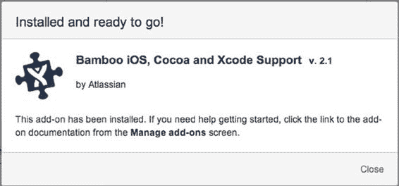

---

