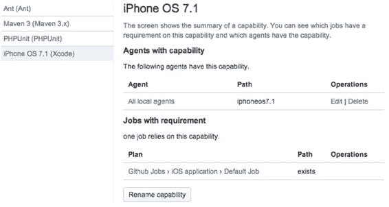
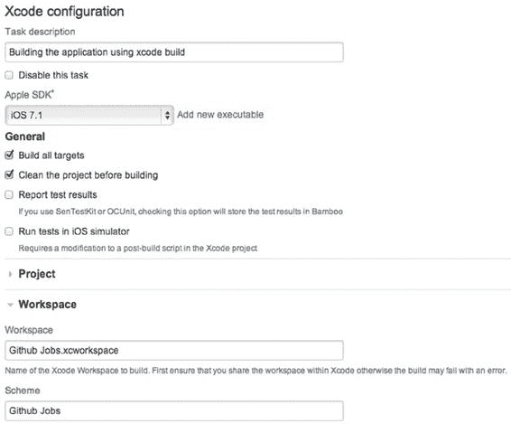
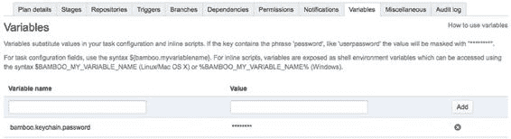
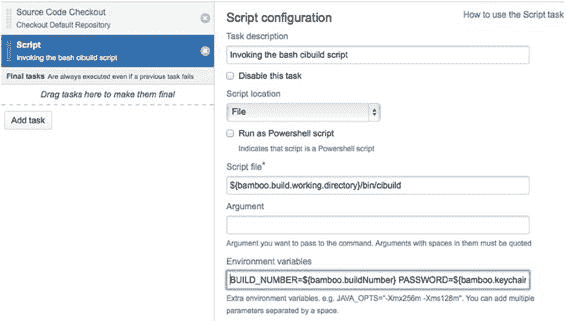
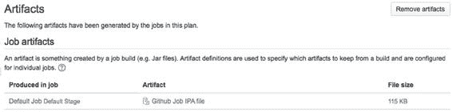
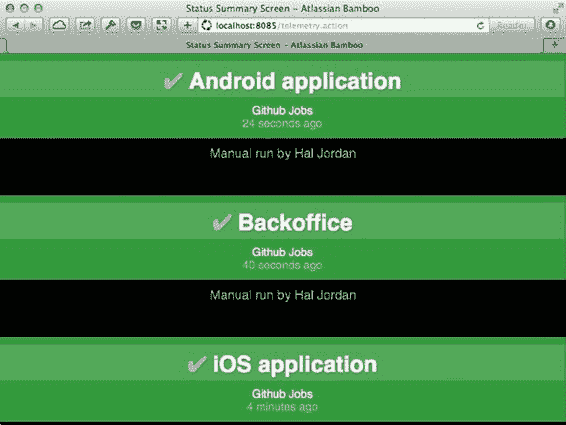
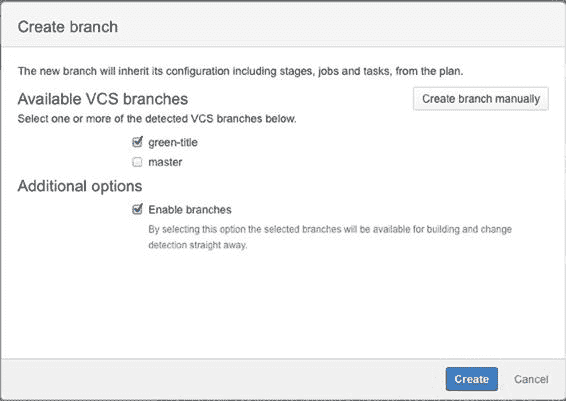

# 第 6 章：使用 Bamboo 实现自动化构建

**98**

### 什么是计划？

既然计划已经创建，让我们花点时间来理解计划究竟是什么。

当你尝试构建一个包含在仓库中源代码的应用程序时，一个计划将与那个仓库关联。它可以包含多个任务（job），这些任务对应构建项目的一系列指令，包括创建计划时生成的默认任务。

它还包含了关于构建应如何及何时被触发的指令，谁应收到构建结果的通知，以及谁有权访问计划及其任务。

### 扩展 Bamboo

与 Jenkins 类似，我们也可以通过插件（这里称为“附加组件”）来扩展 Bamboo。

查找可用附加组件最简单的方法是访问 Atlassian 市场：[`marketplace.atlassian.com`](https://marketplace.atlassian.com/)，人们可以在那里出售或免费提供他们的插件。

这里重要的是，你有一个所有插件的集中列表，该列表也可以通过你 Bamboo 安装中的“管理附加组件”部分访问。让我们安装一个插件来支持 Xcode 项目构建。

在搜索字段中输入“Xcode”并按回车。你应该只会看到一个免费附加组件的结果，名为“iOS, Cocoa and Xcode Support for Bamboo”。这个插件由“Atlassian Labs”创建，适用于 Bamboo 5.0。在我们撰写本书时，稳定版本为 5.5.0。这个插件是半官方的：它由 Atlassian 创建，但并未得到正式支持。实际上，最新版本将近一年前就发布了。别担心，我们安装这个工具只是为了示例；实际上我们将使用上一章创建的 bash 脚本。

点击插件标题，然后点击“立即获取”下载插件——它只是一个 Java 归档（`.jar`）文件——然后返回你的 Bamboo 安装。在右上角齿轮形状的菜单中，选择**附加组件**。点击“上载附加组件”链接，浏览到 Xcode 附加组件下载到的文件夹，然后按**上传**。如果一切正常，你应该会看到类似图 6-3 的内容。

***图 6-3.** Bamboo 的 Xcode 附加组件已成功安装*

这就是用 Bamboo 安装附加组件的简单方法。但为了保险起见，让我们看看它是否真的有效，并尝试构建 GitHub Jobs 应用程序。请记住，我们只创建了一个构建计划，该计划附带一个默认的构建任务，而这个任务……什么也不做。

[www.it-ebooks.info](http://www.it-ebooks.info/)

---

**第 6 章：使用 Bamboo 实现自动化构建**

**99**

在我们开始调整计划之前，你可能会奇怪，既然你知道我们最终会使用自己的脚本，为什么还要让你安装一个构建 Xcode 项目的附加组件。在上一章中，我们安装了几个插件来正确渲染 ANSI 格式输出和屏蔽构建日志中的密码。不幸的是，这次我们不能这样做，因为添加自定义变量、混淆密码和格式化 ANSI 字符串都是 Bamboo 标准安装自带的功能。

从“构建”顶部菜单中，选择“所有构建计划”，然后在列表中点击 iOS 应用程序计划（该列表应该只包含一个项目）。然后，在右上角的“操作”菜单中，选择“配置计划”。在众多选项卡中，“阶段”选项卡应该被选中。我们稍后会介绍其中几个。目前我们真正感兴趣的就是“阶段”这个选项卡。

### 什么是阶段？

阶段只是任务的组合，为 Bamboo 增加了一点层次结构。

每个阶段可以包含多个将并行运行的任务。例如，这对于并行运行单元测试和功能测试以节省时间很有用。每个阶段代表构建过程中的一个步骤。目前，我们只需要一个：构建应用程序。

### 默认任务的配置

点击“默认阶段”中的“默认任务”。你已经到达了最底层：这是层次结构中的最低级别。这个默认阶段将是我们持续集成过程中的构建步骤。

如果你记得没错的话，我们想要的是：从 Git 仓库获取最新版本的项目，使用 Cocoapods 安装依赖，最后构建并打包应用程序。

与阶段中包含的任务不同，任务中的步骤——实际上称为“步骤”——是按顺序执行的，就像 Jenkins 中的构建阶段一样。对于 Bamboo 来说，从仓库获取内容本身就是一个任务，一个你可以根据需要配置的任务。可供你使用的选项不多，但你可以告诉 Bamboo 每次构建应用程序时删除内容并重新克隆整个项目。对于像 GitHub Jobs 这样小的应用程序来说，这不会有太大区别，但对于拥有大量资源和依赖的大型项目，这可能会显著增加构建时间。对于大多数构建来说，你应该保持此选项未勾选状态。

在上一章中，我们因为依赖没有正确安装而浪费了一些时间处理构建失败。这次，我们将直奔主题，从使用 Cocoapods 安装依赖开始构建过程。

1. 为此，点击“添加任务”按钮，然后查找“脚本”类型的构建任务。找到后点击它。
2. 在“任务描述”字段中，填写“使用 Cocoapods 安装依赖”。
3. 然后，确保在“脚本位置”列表中选中了“内联”选项。
4. 也可以调用现有脚本，这在我们使用构建脚本时会很方便，但现在，只需在“脚本主体”文本字段中输入 `pod install`。最后，按“保存”。

[www.it-ebooks.info](http://www.it-ebooks.info/)

---

**第 6 章：使用 Bamboo 实现自动化构建**

**100**

5. 现在，进入我们构建的最后一部分！点击“添加任务”按钮并添加一个 Xcode 任务，这需要一些配置，但首先，在“任务描述”字段中输入“使用 xcodebuild 构建应用程序”。我们现在需要做的是添加一个你想要用来构建应用程序的 SDK。
6. 要了解哪些 SDK 可用，请在终端中运行以下命令：

```
$ xcodebuild -showsdks
```

   OS X SDKs:
   - OS X 10.8 `-sdk macosx10.8`
   - OS X 10.9 `-sdk macosx10.9`

   iOS SDKs:
   - iOS 7.1 `-sdk iphoneos7.1`

   iOS Simulator SDKs:
   - Simulator – iOS 7.1 `-sdk iphonesimulator7.1`

7. 点击“添加新的可执行文件”。
8. 在“标签”字段中，输入“iOS 7.1”，在“路径”字段中，输入你选择的 SDK。在我们的例子中，那就是 `iphoneos7.1`。请注意，该字段下方的帮助文本提示你 `填写 Xcode 可执行文件的路径，包括 -sdk 参数，例如 '/Developer/usr/bin/xcodebuild -sdk iphoneos42'`，这在很多方面都是错误的：开发者工具早已从 `/Developer` 目录移走，并且该字段只要求你传递一个值给 `xcodebuild` 命令的 `-sdk` 参数。如果你按照文档说明操作，由于插件不会检查你输入的是否为有效 SDK，你最终会尝试用以下命令构建应用程序。


`/usr/bin/xcodebuild clean build -sdk /Applications/Xcode.app/Contents/Developer/usr/bin/`

`xcodebuild -workspace Github Jobs -scheme Github Jobs`

**我们替你踩过的坑**：如果你尝试运行上述命令，`xcodebuild` 会抛出以下错误：

```
xcodebuild: error: SDK "/Applications/Xcode.app/Contents/Developer/usr/bin/xcodebuild"
cannot be located.
```

9.  如果输入了无效的 SDK，可以继续添加直至正确；但如果要编辑或删除已有 SDK（实际上它们是伪装的可执行文件），请进入“概览”部分，在左侧菜单选择“可执行文件”。你会看到 Bamboo 安装中所有可用的可执行文件列表，包括 iOS 7.1 的那个，如图 6-4 所示。

[www.it-ebooks.info](http://www.it-ebooks.info/)



### 第 6 章：使用 Bamboo 进行自动化构建

**101**

***图 6-4.** 我们通过 Xcode 任务添加的 SDK 现已成为可执行文件*

别担心；下一节我们将介绍 Bamboo 如何管理其可执行文件以及它为什么实际上很有用。

10.  展开“工作空间”部分，在工作空间字段填写“Github Jobs.xcworkspace”，在方案字段填写“Github Jobs”。请注意，工作空间字段下方有一条非常重要的提示：“请先在 Xcode 中共享工作空间，否则构建可能因错误而失败”，并且要求输入工作空间的实际文件名，包括 `xcworkspace` 扩展名。你的 Xcode 任务配置应如图 6-5 所示。

[www.it-ebooks.info](http://www.it-ebooks.info/)



**102** | **第 6 章：使用 Bamboo 进行自动化构建**

***图 6-5.** Xcode 任务的配置*

构建已正确配置，现在可以运行了。为此，请点击屏幕右上角的“运行”按钮。在出现的菜单中，选择“运行计划”。

如果一切按预期进行，你应该会看到一条绿色消息，提示构建 #1 已成功。恭喜，你已经使用 Bamboo 构建了一个 iOS 应用程序！

## 总结 Bamboo 基础知识

让我们总结一下刚才所做的工作，因为如果你想将 Bamboo 用作持续集成平台，理解层次结构和各组件如何协同工作非常重要。我们为 iOS 应用 Github Jobs 创建了一个计划，该计划是 Github Jobs 项目的一部分。在这个计划中，自动创建了一个包含默认任务的默认阶段。我们对这个默认任务进行了自定义，添加了多个子任务：从 Git 仓库获取内容、使用 Cocoapods 安装依赖项以及使用 `xcodebuild` 构建应用程序。

再次强调，需要记住的是，不要为构建的关键部分使用插件。在这种特定情况下，Xcode 插件已经一年多没有更新了。此外，错误文档也帮不上什么忙。

牢记这一点，让我们构建 iOS 应用并将其打包为有效的 IPA 文件。为此，我们将使用上一章中用过的 bash 脚本，该脚本位于项目中的 `bin/cibuild`。

[www.it-ebooks.info](http://www.it-ebooks.info/)



### 第 6 章：使用 Bamboo 进行自动化构建

**103**

## 构建 Github Jobs 应用

回到任务的配置部分，删除除“源代码签出”之外的所有任务，并添加一个新的“脚本”任务。在描述字段填写“调用 bash cibuild 脚本”，这次选择“文件”作为脚本位置。在“脚本文件”字段输入 `${bamboo.build.working.directory}/bin/cibuild`。请注意，你也可以直接使用 `bin/cibuild`，但使用绝对路径可以 a) 表明有多个全局变量可用，b) 确保我们调用的是正确的脚本。

## 使用环境变量

为了让脚本正常工作，我们需要向脚本提供两个必需参数：用于解锁钥匙串的密码，以及用于调用 `agvtool` 更新构建版本的构建编号。我们已经使用了 Bamboo 任务执行期间提供的众多全局变量之一：`${bamboo.build.working.directory}`。还有一个包含构建编号的变量名为 `${bamboo.buildNumber}`。这些并非严格意义上的环境变量，而是运行时变量，这意味着当你使用它们时，它们会在任务执行期间被替换为实际值。这实际上是件好事，这样你可以选择提供给脚本的变量列表，并避免潜在的附带损害风险。

在“环境变量”字段中，使用以下语法声明环境变量：`BUILD_NUMBER=${bamboo.buildNumber}`

现在点击“保存”，即使任务配置尚未完成。你可以使用相同语法添加 `PASSWORD` 环境变量，但同样地，你不想在构建日志中显示密码。这不太安全。幸运的是，你可以轻松地在计划级别添加新的运行时变量，这意味着它们将可用于该计划中包含的所有任务。

点击左侧菜单中的“计划配置”链接，选择“变量”选项卡。创建一个名为 `bamboo.keychain.password` 的新变量，并在值字段中输入你的密码。请注意，Bamboo 处理这些变量的方式非常聪明：如果变量名包含“password”一词，值字段将自动变为密码字段，并且创建的变量每次使用时都会被混淆，因此密码不会出现在日志中。点击“添加”，你应该会看到类似图 6-6 所示的内容。

***图 6-6.** 一个新的运行时变量现已可用于我们的默认任务*

[www.it-ebooks.info](http://www.it-ebooks.info/)



**104** | **第 6 章：使用 Bamboo 进行自动化构建**

现在，让我们使用之前相同的语法，将我们的新变量作为环境变量提供给构建脚本：

`PASSWORD=${bamboo.keychain.password}`

请注意，如果你希望向构建脚本提供多个环境变量，只需用空格分隔它们即可。

我们的任务配置已完成，如图 6-7 所示，我们保持了最简设置，并将所有关键构建流程都放在了一个易于维护的简单脚本中。

***图 6-7.** 脚本任务的配置相当简单*

现在配置已完成，点击“保存”，但在点击“运行”按钮重新构建应用之前，我们需要处理另一件事。我们在第 5 章中提到，任务完成后清理很重要。为此，选择“源代码签出”任务，并勾选“强制清理构建”选项。这本身并不会清理仓库，而是会删除内容并重新克隆所有内容。请注意，此选项会增加构建时间。点击“保存”，然后点击“运行”。考虑到我们的构建脚本已经在 Jenkins 上经过充分测试，并且我们现在所做的仅仅是调用同一个构建脚本，你应该会看到同样的大绿色条，提示构建成功。正如我们之前提到的，Bamboo 会自动解析 ANSI 格式字符串并将其转换为合适的 HTML。如果你进入“日志”选项卡，借助 `xcpretty` 应该会看到一个漂亮的输出。不过有一个缺点：如果你想查看或下载完整日志，你将得到纯文本内容，其中 ANSI 标签未转换。

[www.it-ebooks.info](http://www.it-ebooks.info/)



### 第 6 章：使用 Bamboo 进行自动化构建

**105**

## 归档工件


### 计划收尾与归档配置

我们的计划已基本就绪，现在有两个任务：从远程仓库获取项目最新版本，然后安装依赖、构建应用并将其打包为 iPhone 归档（IPA）文件。
我们唯一缺少的是自动检索生成的 IPA 文件并将其安全存储。

在 Jenkins 中，我们使用了所谓的“构建后阶段”。这种方法在很多场景下都适用，但有一个主要缺点：它实际上是构建的一部分。这意味着如果构建后阶段失败，整个构建可能会失败。
Bamboo 采用的方法有些类似。基于一个模式（`pattern`），所有匹配特定模式的文件将在构建运行后被复制到安全位置。
我们只需要配置这个模式即可。

返回默认的任务配置，选择“Artifacts”选项卡。在此选项卡中，您将管理“工件定义”（artifact definitions），即包含名称（`Name`）、相对位置（`Location`）和遵循 Ant 文件复制模式（`pattern`）的定义列表。

**注意**，`Ant`是什么？如果您从未听说过`Ant`，`Apache Ant` 是一种用于自动化软件构建过程的工具，类似于`Make`。`Ant` 使用基于 XML 的语法来描述构建过程，而`Make` 使用纯文本文件格式。如果您记得没错，我们在第 3 章中提到了一些可用于封装构建脚本的工具。`Ant` 文件复制使用一个简单的正则表达式引擎，利用`*`和`?`符号来创建简单模式，并尝试将其与目录中包含的文件名进行匹配。

点击“Create definition”按钮，并填写我们之前提供的信息。在“Name”字段中填写`Github Job IPA file`，在“Location”字段中填写`build`，在“Copy Pattern”字段中填写`*.ipa`。

归档过程不会回溯生效；您需要重新运行构建，才能检索到构建结束时生成的 IPA 文件。点击“Create”，然后再次点击“Run”按钮。
在任务详情页面，点击“Artifacts”选项卡。在构建结束时，您应该会看到 IPA 文件已被归档，类似图 6-8 所示。

***图 6-8.** 构建结束后，打包的应用已被 Bamboo 归档*

[www.it-ebooks.info](http://www.it-ebooks.info/)

**106**

**第 6 章：使用 Bamboo 进行自动化构建**

您或任何有权限访问此计划的团队成员，都可以通过点击 `Github Job IPA file` 链接来下载归档的工件。再次说明，这不是共享工件最便捷的方式，但我们将在关于 OTA 开发的章节中更详细地介绍。

## Bamboo 高级用户功能

我们介绍了一个非常基础的 Bamboo 用法，并直接切入主题，因为我们在上一章讨论 Jenkins 时已经介绍了自动构建过程的某些部分。Bamboo 的功能远不止于此。让我们来看看可以用它实现的一些高级特性。

### REST API

如果一个开发者工具没有为开发者提供一种方法，让他们能够利用其核心功能进行深度开发，那它就算不上功能完备。这就是为什么 Bamboo 像 Jenkins 一样，附带了一个 REST API 来与您的 Bamboo 安装实例进行交互。如果您尚未激活匿名访问权限，则使用基本认证（`basic authentication`），通过一个简单的 CURL 命令调用以下 URL 即可轻松获取任务的当前状态：

```
$ curl -s -u romain.pouclet:pwd -H Accept:application/json http://localhost:8085/rest/api/latest/result | python -mjson.tool
```

返回结果如下：

```json
{
    "expand": "results",
    "link": {
        "href": "http://localhost:8085/rest/api/latest/result",
        "rel": "self"
    },
    "results": {
        "expand": "result",
        "max-result": 1,
        "result": [
            {
                "buildNumber": 33,
                "buildResultKey": "GJ-IA-33",
                "buildState": "Successful",
                "id": 1376279,
                "key": "GJ-IA-33",
                "lifeCycleState": "Finished",
                "link": {
                    "href": "http://localhost:8085/rest/api/latest/result/GJ-IA-33",
                    "rel": "self"
                },
                "number": 33,
                "plan": {
                    "enabled": true,
                    "key": "GJ-IA",
                    "link": {
                        // ...后续字段省略
                    }
                }
            }
        ]
    }
}
```


```json
{
  "href": "http://localhost:8085/rest/api/latest/plan/GJ-IA",
  "rel": "self"
},
[www.it-ebooks.info](http://www.it-ebooks.info/)

# 第 6 章：使用 Bamboo 实现自动化构建

**107**

```json
{
  "name": "Github Jobs - iOS application",
  "planKey": {
    "key": "GJ-IA"
  },
  "shortKey": "IA",
  "shortName": "iOS application",
  "type": "chain"
},
"planResultKey": {
  "entityKey": {
    "key": "GJ-IA"
  },
  "key": "GJ-IA-33",
  "resultNumber": 33
},
"state": "Successful"
```

```json
],
"size": 1,
"start-index": 0
```

这是通过 API 提供的众多资源之一，此外还有项目（Project）、构建（Build）、报告（Report）、队列（Queue）、标签（Label）和服务器信息（Server information）等服务。Bamboo 比 Jenkins 年轻得多：其首个公开发布的稳定版本问世至今才勉强 4 年。当时，CruiseControl 的市场份额远不如 Jenkins 首次发布时那般重要。这很可能就是 Bamboo 没有附带半标准的`cc.xml`文件的原因——这种文件本可用于在 CCMenu（[`ccmenu.org`](http://ccmenu.org/)）等第三方客户端中显示项目状态。

不过，Bamboo 确实附带了一个仪表板（wallboard）模块，其显示项目状态的风格与我们上一章安装的 Jenkins 仪表板插件非常相似。

### 仪表板

如果我们为 Github Jobs Android 应用和后端管理程序添加新计划，结果将类似于图 6-9。

[www.it-ebooks.info](http://www.it-ebooks.info/)



**108** **第 6 章：使用 Bamboo 实现自动化构建**

***图 6-9.** 仪表板显示了我们 Bamboo 安装中各个计划的状态* REST API 并非与 Bamboo 通信的唯一方式；其核心具有足够的可扩展性，允许您创建自己的插件并添加新插件。事实上，Bob Swift 软件公司发布了一个非常强大的附加组件，可以通过命令行与 Bamboo 通信，就像 Jenkins 一样。主要区别在于这个附加组件是收费的：最多五个远程连接的费用为 220 美元。毋庸置疑，这意味着您需要有相当重要的自动化需求！

### 获取反馈

我们仍在讨论一种持续集成工具，它能构建您的应用程序并确保一切正常。这全都围绕着收集反馈并发送给您，以便您可以专注于改进应用程序。让我们看看 Bamboo 如何提供这种反馈。

#### 构建多个分支

当您与多位同事一起参与项目时，无论是开发新功能还是修复错误，更安全的做法是使用多个分支。当然，要做到这一点，您需要使用像 Git 这样的版本控制系统（VCS），但如果不是这样，您可能也不会把这本书读到这个阶段了。

无论某个功能需要多长时间来开发，了解您是否破坏了什么东西都至关重要。也许应用程序无法构建，也许某些单元测试会失败，重要的是要意识到自己破坏了某些东西并最终修复它。是的，最终修复。鉴于您并非直接在应用程序的主干上工作，破坏构建是可以接受的，只要在将您的工作合并到主分支之前修复它即可。让我们看看如何在 Bamboo 中实现这一点。

[www.it-ebooks.info](http://www.it-ebooks.info/)

**109** **第 6 章：使用 Bamboo 实现自动化构建**

首先，我们需要确保默认计划中的默认作业只构建主分支，这非常简单。打开您的计划配置，进入“代码仓库（Repositories）”部分，并选择您首次创建计划时自动添加的代码仓库。您应该只有一个代码仓库。当您选中该代码仓库后，右侧会出现一个“分支（Branch）”字段，请确保其内容是“master”。这意味着无论构建是如何触发的（手动触发，或推送到代码仓库后触发），如果主分支没有发生任何更改，构建作业就不会运行。

是时候做点工作了！回到您的终端，使用以下命令创建一个新分支——除非您决定使用专用客户端，例如 Github 的官方客户端：

```
$ git checkout -b green-title
```

我们要对应用程序进行一些疯狂的更新：将导航栏中的标题变成绿色。由于学习 Objective-C 并非本书的目标，我们需要对应用程序做一些非常简单的事情。打开“Github Jobs” Xcode 项目，打开`AppDelegate.m`文件，并在`application: didFinishLaunchingWithOptions:`方法中添加以下代码行：

```objective-c
- (BOOL)application:(UIApplication *)application didFinishLaunchingWithOptions:(NSDictionary *) launchOptions
{
  NSString *endpoint = [[NSBundle bundleForClass: [self class]] infoDictionary]
  [@"GithubJobsEndpoint"];
  NSLog(@"Endpoint = %@", endpoint);
  NSLog(@"Hi, I'm a sample application for a book.");
  [[UINavigationBar appearance] setTitleTextAttributes: @{NSForegroundColorAttributeName: [UIColor greenColor]}];
  return YES;
}
```

现在回到您的终端；提交您的更改并将它们推送到远程代码仓库：

```
$ git commit -am "让客户高兴到下周二：绿色标题"
$ git push origin green-title
```

现在我们有了一个分支，它需要经过多次批准才能合并到主分支。首先，我们需要确保我们没有破坏任何东西，并且应用程序仍然可以在 Bamboo 中构建。然后，我们需要获得客户的批准，确保标题的颜色正是他想要的绿色。为此，我们需要运行我们一直在使用的`cibuild`脚本，并将生成的 IPA 文件发送给客户。

由于我们已经说过不想危及默认作业的稳定性，因此我们需要一个专门针对该分支的作业。这只需在您的计划配置中勾选正确的复选框即可。

回到 Bamboo 中您的计划配置，选择“分支（Branches）”选项卡，然后点击“创建分支（Create Branch）”按钮。如果您已经正确地将更改推送到远程代码仓库，那么您应该会在列表中看到`green-title`分支，如图 6-10 所示。勾选“green-title”复选框，并勾选“启用分支（enable branches）”复选框。然后，按下“保存（Save）”。您应该会在左侧菜单中看到您的分支，位于

[www.it-ebooks.info](http://www.it-ebooks.info/)



**110** **第 6 章：使用 Bamboo 实现自动化构建**

分支头部区域的标题下方。如果您点击您的分支，您应该会看到该分支处于“已激活”状态，这意味着 Bamboo 将构建此分支，并专门为此分支维护构建历史。事实上，如果您点击“运行（Run）”按钮，您就会启动此分支的#1 号构建。

***图 6-10.** Bamboo 检测到了新分支，并已准备好为其创建作业* 如果作业成功——考虑到所做的更改，没有理由不成功——您会在日志部分找到此特定构建的日志，以及此分支的归档构件（artifacts），准备好发送给客户。

当然，您不需要每次开始开发一个新功能时都手动在 Bamboo 中激活一个分支，那将是极其浪费时间。如果您打开“分支（Branches）”配置，您应该会看到一个“自动管理分支（Automatically manage branches）”复选框。勾选后，系统将每 5 分钟查询一次代码仓库的内容，以查看是否创建了新分支。如果是，就会创建一个新的作业，就像我们为`green-title`分支手动创建的那个一样。

您不应该害怕创建多个分支，默认情况下，存在 30 天的分支会被自动删除。

这就是持续集成（CI）的全部意义所在。多款软件同时进行构建，在准备好后集成到应用程序的核心（在我们的例子中是主分支）中。所有的困难都蕴含在“准备好”的定义之中。
```


