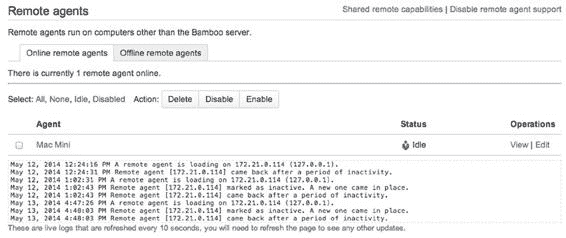
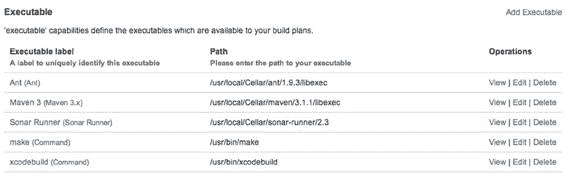
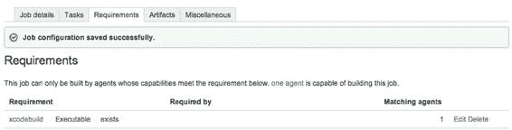

# 第 6 章：使用 Bamboo 实现自动化构建

## 111

尽早构建，频繁构建

我们已经讨论过，大多数代码托管服务（`Github`、`Bitbucket`、`Stash`……）都能够根据`Jenkins`中可用的端点来触发构建，同时也能监控仓库的变化并自动启动构建。没错，`Bamboo`同样具备这些能力。

开箱即用地以清晰有序的方式构建多个分支，可能使其功能稍显强大，但这并非本节重点。你可能会问自己：为什么要用这些端点来启动构建？什么时候应该检查是否出了问题？以及应该以什么频率构建应用程序？简短的回答是：“是”，“越早越好”，以及“频繁构建”。

依赖持续集成平台来监控代码库的变化，是`Jenkins`和`Bamboo`的默认行为（当然，也可以手动运行构建）。这是一种很好的方法，但它也存在一些缺点。首先，如果你打开`Github Jobs iOS`应用程序计划的“触发器”选项卡，默认的仓库轮询频率是 3 分钟（180 秒）。这意味着，如果你推送了一个正在开发的分支，构建可能最多需要三分钟才能实际启动。在我们的场景中，我们需要确保没有破坏任何东西，并且应用程序能在“中性”计算机上成功构建。如果你的构建过程包含单元测试和静态代码分析，那么在将更改推送到远程仓库后，10 到 15 分钟内得不到任何反馈也不足为奇。当你在修复 bug 或实现新功能时，10 分钟内可能发生很多事情，这个时间太长了，这就是为什么你需要另一种启动构建的方式：一个钩子。

## 使用 Bamboo 设置钩子

既然你已经配置好了构建，并且有时间在界面中探索，那么使用`Bamboo`设置钩子应该会感觉非常容易。如果还没打开，请打开`Github Jobs iOS`应用程序计划的“触发器”选项卡，然后点击“添加触发器”按钮。在描述字段中，填写类似“从<平台>推送”的内容，其中平台可以是`Github`、`Bitbucket`或你自建的代码托管平台。从类型组合框中选择“当提交更改时，仓库触发构建”，然后点击“保存触发器”。

正如我们之前提到的，大多数平台都自带对在`Bamboo`上触发构建的支持（对于`Jenkins`也是如此）。如果你的代码托管在不受支持的平台上，`Bamboo`提供了一些 Shell 和 Python 脚本，你可以用它们来触发构建。

如果你进入安装`Bamboo`的文件夹，应该会看到一个“scripts”文件夹。里面没有专门用于`Git`的脚本，原因很简单：它和`svn-triggers`文件夹中的脚本完全一样：

```python
#!/usr/bin/python
#
# ./postCommitBuildTrigger.py [`bamboo.atlassian.com/bamboo/ myBuildName`](http://bamboo.atlassian.com/bamboo/)
import sys
import urllib;

baseUrl = sys.argv[1]
buildKey = sys.argv[2]
```

[www.it-ebooks.info](http://www.it-ebooks.info/)

## 112

**第 6 章：使用 Bamboo 实现自动化构建**

```python
remoteCall = baseUrl + "/api/rest/updateAndBuild.action?buildKey=" + buildKey fileHandle = urllib.urlopen(remoteCall)
fileHandle.close()
```

**注意** 我们使用的是 Python 脚本，该语言在 OS X 的任何标准安装中都可使用。另一方面，Shell 脚本使用`wget`，这是一个用于从网络获取文件的命令。它是一个非常强大的命令，支持从 HTTP 到 FTP 的多种协议，但在 OS X 上不可用。

使用这个脚本只需要你的`Bamboo`安装的根 URL，以及构建密钥，即构建项目密钥和计划密钥的拼接。在我们的例子中，就是`GJ-IA`：

```bash
$ ./scripts/svn-triggers/postCommitBuildTrigger.py http://localhost:8085/ GJ-IA
```

现在你只需要编辑你的 Git 远程仓库的“post-receive”钩子，并从这个钩子中调用该脚本。注意，该脚本不需要用户名和密码来触发构建。第一个原因是，这个 URL 实际上并不直接触发构建，它只是要求`Bamboo`通过`updateAndBuild` URL 端点轮询更改，并且仅在发生更改时才启动构建。这样做也更安全，因为你不会将有效的凭证泄露给第三方服务，也不会将其硬编码在 Git 钩子中。最后，如果匿名访问让你感到不安，你可以将此 URL 的访问权限限制在特定的 IP 地址列表内。

## 设置夜间构建

我们之前提到过，构建通常需要花费时间，而没有什么比等待构建结束更令人沮丧的了。出于这个原因，以及我们稍后将讨论的其他原因，你可能需要考虑设置夜间构建。

一个功能完整的构建过程不仅仅是为了确保应用程序没有损坏。运行单元测试、验收测试以及构建应用程序是持续集成的一个方面，但为了确保团队成员之间的协作顺畅进行，你还需要考虑生成文档。这类任务你不希望针对项目的每个分支都执行，因为它会拖慢构建速度，而是每天执行一次，并且只针对同事会使用的相关分支，通常是主分支。请注意，即使你独自工作，且“同事”实际上是未来的你，这条规则也同样适用。

### 练习：设置夜间构建

设置夜间构建比听起来要简单：你需要在当前的`Github Jobs iOS`应用程序计划中添加一个新 Job，并配置一个触发器，使其每天午夜左右启动一次构建。由于这和我们本章讨论的内容非常相似，我们把它作为一个简单的练习。

[www.it-ebooks.info](http://www.it-ebooks.info/)

## 113

**第 6 章：使用 Bamboo 实现自动化构建**

设置夜间构建也为你的项目和整个持续集成平台提供了一次健康检查。不要错误地认为，如果你已经在推送更改到仓库时触发了新构建，就不需要夜间构建了。夜间构建和推送触发的构建并非互斥。每天午夜运行一次构建，能让你确信应用程序是正常的；如果出现问题，你也会立即有任务可以着手处理。

这也是检查你的构建机器是否按预期运行、是否仍然能够构建应用程序的一种方式。如果不能，那么最好在你开始处理应用程序时就意识到这一点，而不是在当天第一次推送更改时，才发现构建机器已宕机或无法正常工作。

## 将 Xcode 构建集成到现有的 Bamboo 安装中

就像使用`Jenkins`一样，有时 iOS 应用程序开发只是公司活动的一部分，你可能需要在一个无法构建 iOS 应用程序的现有`Bamboo`安装中配置构建。同样，`Bamboo`选择了与`Jenkins`不同的方法。


## 在上一章中

在上一章中，我们不得不管理凭据，以便 Jenkins 能够通过 SSH 连接到从节点，并通过 Java 归档文件与从节点通信。这个解决方案很棒，因为它简单且易于设置，因为你很可能已经能够通过 SSH 与从节点通信。不过，一个缺点是 Jenkins 必须能够访问你的从节点。在大多数情况下，如果你的 Jenkins 实例在本地运行，或者你已通过某种私有网络将实例配置为 Jenkins 可以与从节点通信，那么这没有问题。

另一方面，Bamboo 选择了相反的方法：远程代理将通过 TCP 连接与 Bamboo 的主实例通信。

## 安装远程代理

出于安全原因，标准的 Bamboo 安装默认禁用远程代理支持。

要启用远程代理支持，请转到实例的配置部分，并点击“启用远程代理支持”。如果你担心安全问题，Atlassian 文档中有一个专用页面，该页面也在 Bamboo 安装的“代理”部分中链接：

[`docs.atlassian.com/bamboo/docs-055/Security`](http://docs.atlassian.com/bamboo/docs-055/Security)。

一旦你启用了远程代理支持，点击出现的“安装远程代理”按钮。在被重定向到的页面上，你应该会看到一个下载远程代理安装程序的链接。和 Jenkins 一样，它也是一个 Java 归档文件。

从现在开始，我们假设你已经在某处安装了一个远程 Bamboo 实例。如果没有，我们将尽可能详尽地展示 Bamboo 中代理的工作方式。

首先，下载远程代理安装程序并开始安装过程。

```
$ curl http://bamboo:8085/agentServer/agentInstaller/atlassian-bamboo-agent-installer-5.5.0.jar -O
```

```
$ java –jar atlassian-bamboo-agent-installer-5.5.0.jar http://bamboo:8085/agentServer
```

运行代理安装程序会下载大量 Java 库，并在一个名为**远程代理主目录**的目录中设置一个远程代理。该目录的默认路径是启动安装过程的用户主目录下的 `Bamboo-agent-home`。你可以使用 `-Dbamboo.home=/path/to/the/home` 参数覆盖此值。

Bamboo 代理目录当然会包含有关远程代理的信息，但也会包含 Bamboo 主安装的信息。在 `conf` 目录中，你会找到一个名为 `wrapper.conf` 的文件，其中包含大量与 Java 相关的设置（例如你愿意为此进程分配的最大内存量），你还会找到有关默认代理的信息，例如其 URL：

```
wrapper.app.parameter.2=http://192.168.2.10:8085/agentServer/
```

首先，这意味着如果你想要调整远程代理的配置，这里就是你进行更改的地方。正如我们所说，你将在这里设置最大内存和其他选项。其次，也是最重要的一点是，这意味一个代理不能用于多个 Bamboo 实例。如果你曾考虑过让一个远程代理被多个 Bamboo 实例共享，请再想想：它并非为此而设计。

在此文件夹中，你还会找到一个可用于手动启动远程代理的 Shell 脚本。要使用它，只需运行以下命令：

```
$ bin/bamboo-agent.sh –h
Usage: ./bamboo-agent.sh { console | start | stop | restart | status | dump }
```

控制台模式会启动远程代理，使其连接到 Bamboo 主安装，更重要的是，它会将进程保持在前台，因此这足以用于测试目的。

你最终需要设置一个已启动的进程，就像我们之前为 Jenkins 和 Bamboo 所做的那样，以便随计算机启动远程代理。这是 Bamboo 所选方法的一个缺点：对于 Jenkins，由于主节点会连接到从节点，因此可以在需要时轻松唤醒从节点。

使用以下命令启动进程：

```
$ bin/bamboo-agent.sh console
Running Bamboo Agent...
Removed stale pid file: /Users/Palleas/bamboo-agent-home/bin/./bamboo-agent.pid
STATUS | wrapper | 2014/05/13 20:21:46 | --> Wrapper Started as Console
...
```

现在我们已经有了一个连接到主安装的远程代理，如图 6-11 所示，是时候配置代理并使用它来构建应用程序了。





**图 6-11.** 一个名为“Mac Mini”的代理已连接到我们的 Bamboo 主安装

## 配置代理

使用远程代理构建应用程序的主要目的与其说是为了扩展持续集成平台必须处理的大量构建，不如说是为了能够使用具有特定能力的代理运行作业。就我们而言，这将是一个具有 `xcodebuild` 命令的代理。

点击顶部菜单末尾的“设置”按钮，然后选择“代理…”项。在“远程代理”部分，你应该会看到已设置的远程代理，如图 6-11 所示。

这张截图截取得有点早，但当你点击“编辑”链接时，你可以为这个代理指定一个名称。就我们而言，我们将其命名为 Mac Mini，因为我们在命名上实在缺乏想象力。

点击你的远程代理名称。你会在这里看到关于代理的信息，如图 6-12 所示。这里重要的是“能力”部分。“代理特定能力”部分是你添加代理能力的地方。例如，我们想指定我们的构建可以运行 `xcodebuild` 命令。

**图 6-12.** 已连接到 Bamboo 主安装的远程代理具有许多能力



为此，请点击“添加可执行文件”链接，在“类型”字段中选择“命令”，在“标签”字段中填入 `xcodebuild`，在“路径”字段中填入 `/usr/bin/xcodebuild`，然后点击“添加”。你应该会在列表中看到该要求，如图 6-12 所示。

你可以根据需要添加任意数量的要求，并且这些要求不必是可执行命令的列表。它们可以是 Java 开发工具包 (JDK) 的版本，甚至是简单的键/值属性。

## 更新作业以在远程代理上运行

打开 Github Jobs 应用程序的 iOS 应用程序计划中的“默认作业”配置，并点击“要求”选项卡。在要求列表中，选择我们之前创建的“Xcodebuild”要求，然后点击“添加”。如果一切按预期工作，你应该会看到要求已成功添加，并且确认至少有一个代理能够运行你的作业，如图 6-13 所示。

**图 6-13.** 由于我们需要 `xcodebuild`，因此有一个代理能够运行我们的作业

如果你想知道，是的，我们本可以在要求上更具体一些，因为我们的构建脚本需要 `bash` 等工具来运行，`xcpretty` 来美化输出，以及 `xcrun` 来打包应用程序，但我们决定保持简单。

## 总结


