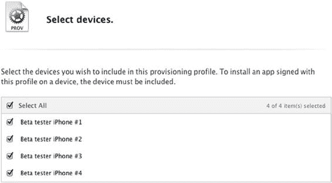
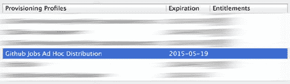
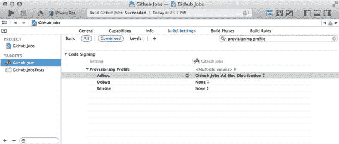
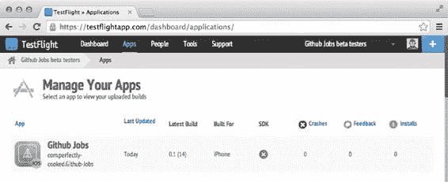
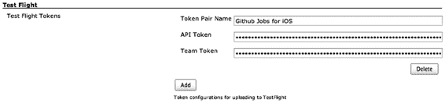
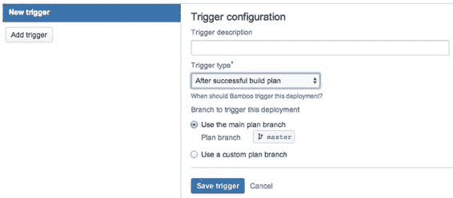

# 第 7 章：无线分发

本章的目标是带你了解 `Jenkins` 之外的选择，因为没有什么比固守你钟爱的工具而不去探索其他方案更危险的了。我们再次申明，并非要告诉你哪个更好；实际上，两种方案都各有利弊。至此，你应该有能力选择最适合自己的方案了。

`Bamboo` 是一款功能齐全的产品，由一家盈利公司维护，拥有设计精良的界面、强大的插件以及组织有序的构建计划。

本书还将介绍苹果公司发布的一款用于为你的项目设置持续集成的新工具，但因为你可能需要在构建平台方面稍作休息，下一章将涵盖构建流程中同样重要的部分：无线部署！

[www.it-ebooks.info](http://www.it-ebooks.info/)

## 无线分发

在前面的章节中，我们介绍了如何手动构建应用程序，或使用持续集成平台 `Jenkins` 和 `Bamboo` 进行构建。我们之前提到过，成功构建后通常面临的问题是：是否将其发送给你的质量保证团队。

无论你在构建流程中增加了多少工具（自动化测试、静态代码分析等），你仍然需要从实际用户那里获得反馈，才能知道你的应用程序是否准备好发布。在本章中，我们将简要讨论无线（OTA）分发，以及人们如何决定基于一种能简化应用程序分发流程的产品来创建业务。然后，我们将与其中一项服务`TestFlight`进行集成。最后，我们将了解其实际工作原理，并开发我们自己的、自制的持续集成平台。

### 什么是无线分发？

软件分发是开发者多年前就必须解决的一个老问题，而且并不仅限于移动应用程序。曾几何时，发布新软件或软件更新时所面临的问题是，如何运送包含该软件的数千张光盘供用户安装。随着互联网的出现，分发移动应用程序的问题变成了如何通过 Wi-Fi 或蜂窝网络分发这些应用程序。归根结底，OTA 只是一个花哨的术语，指代应用程序的分发方式。

### 这与持续集成有何关系？

一个常见的误解是，认为持续集成仅仅是指每天或每隔一段时间构建一次应用程序，并在准备就绪时发布测试版。这并非持续集成，而是持续交付。正如我们在前几章中所展示的那样，这是一个更复杂的过程。

尽管如此，持续集成的概念与分发的概念密不可分，因为能够发布应用程序的一个构建版本并从用户那里获取反馈，这是另一种帮助你决定是否应该集成某个功能或修复某个错误的反馈机制。

**117**

[www.it-ebooks.info](http://www.it-ebooks.info/)

**118**

**第 7 章：无线分发**

### iOS 应用分发：一个可行的商业模式

如前几章所述，发布 iOS 应用程序是一个复杂的过程。对应用程序进行代码签名并使用正确的配置文件是大多数 iOS 开发者都会遇到困难的任务。苹果公司花了很长时间才真正开始提供一种无需使用 App Store 即可发布应用程序测试版的方法。在撰写本书时，通过苹果公司分发测试版仍处于测试阶段。当然，你总是可以手动将应用程序安装到测试者的设备上，但你肯定不想成为那样的人。

随着 iOS 4 的发布，苹果引入了临时（Ad-Hoc）配置文件，允许你在没有 `Xcode` 的情况下将应用程序安装到 iOS 设备上。临时配置文件与你用于在 App Store 上提交应用程序的标准分发配置文件非常相似。

主要区别在于，它包含了所有允许运行该应用程序的设备的唯一设备标识符（UDID）。目前，你可以注册多达 100 个设备标识符，包括你自己的设备。

这通常足以将你的应用程序发送给少量的测试人员，但这些名额必须谨慎使用：每年在你续费苹果开发者账户时，只能移除一个设备 ID。

一旦你生成了临时分发配置文件（我们稍后会回到这部分），实际上就可以通过网页将 iOS 应用程序安装到设备上，而无需将其连接到电脑。毕竟，你设备上的 App Store 应用就是这么做的。为此，你所需要的只是一个服务器和几个可以从 iPhone 浏览器访问的文件。此外，你很可能不希望你的网站“对所有人免费开放”，让任何人都能下载你的应用程序，因此你需要一个安全层。所有这些都需要你投入时间和知识，而这些你未必具备或愿意学习。第三方服务便由此诞生。

[TestFlight (testflightapp.com)](http://testflightapp.com/) 和 [HockeyApp (hockeyapp.net)](http://hockeyapp.net/) 等服务的诞生，正是源于为开发者和测试版测试人员简化此流程的需求。创建一个账户，使用正确的配置文件构建你的应用程序，就大功告成了。授权的用户就可以准备下载你的应用程序的测试版。这两项服务过去都支持 Android 和 iOS 平台，但在 2014 年 2 月，`TestFlight` 背后的公司 Burtsly 被苹果收购，随后苹果移除了对 Android 平台的支持。

由于苹果通过收购 `TestFlight` 使其成为分发应用程序测试版的推荐方式，我们将使用它来发布 Github Jobs for iOS 应用程序的测试版。

### 使用 TestFlight 分发应用

下一部分将介绍如何使用 `TestFlight` 手动分发构建版本。如果你已经熟悉这项服务，可能不会学到什么新东西。请随意跳到下一节，在那里我们将通过 `Jenkins` 和 `Bamboo` 自动提交构建版本，然后编写我们自己的简单分发平台！

访问 `TestFlight` 的注册页面（[`testflightapp.com/register/`](https://testflightapp.com/register/)）并创建一个账户，稍后当我们有了一个可以发送给用户的功能性构建版本时，将会用到它。首先，让我们创建一个临时配置文件，并使用它来打包我们的 Github Jobs for iOS 应用程序。

[www.it-ebooks.info](http://www.it-ebooks.info/)



**第 7 章：无线分发**

**119**

为此，从你的团队或测试设备中收集几个唯一的设备标识符，并将它们添加到苹果开发者门户，然后：

1.  在左侧菜单中，选择“配置文件”部分下的“分发”链接，然后点击屏幕右上角的加号。你可能之前已经访问过此部分来生成开发配置文件或用于在 App Store 上提交应用程序的分发配置文件。但这次，请选择“临时”分发，然后点击“继续”按钮。

2.  选择你的应用程序标识符，在我们的例子中，它类似于 `UBSUPPBORX.com.perfectly-cooked.github-jobs`。点击继续按钮。

3.  从出现的列表中，勾选你想要分发应用程序的 iOS 设备列表，如图 7-1 所示。

***图 7-1.** iOS 应用程序的测试版将发送给四位测试版测试人员*

这是你应该非常小心处理的过程。请记住：a) 你的名额有限；b) 每次你想添加一个新的测试版测试人员时，都必须更新你的配置文件并生成一个新的构建版本。


实际上，这并不完全正确。苹果还提供了一个企业计划，你可以用它来向更多用户发布 App Store 之外的应用程序。该计划不是为了取代 App Store，而是帮助部署内部应用。事实上，无法使用此类账户在 App Store 上发布应用。不过，当你面临这些情况时，它非常有用，因为你不需要选择一组唯一的设备标识符。该计划主要针对公司，并且需要付出一定代价：每年约 300 美元。

[www.it-ebooks.info](http://www.it-ebooks.info/)





**120**

**第 7 章：空中分发**

一旦你选择了设备，请执行以下步骤：

1. 为你的配置文件命名。建议取一个含义明确的名称，例如 `Github Jobs Ad Hoc Distribution`。当你需要管理大量配置文件时，这样做将来会感谢你自己。
2. 准备就绪后，按下继续按钮。现在你将面临一个选择：下载生成的配置文件并手动添加，或者从 Xcode 的首选项面板中，导航到 `Accounts` 选项卡，点击 `View details` 按钮，然后点击 `刷新` 按钮。两种情况下，你应该都能在列表中看到它，如图 7-2 所示。

***图 7-2.** 配置文件在 Xcode 中可用，并可用于 Github Jobs 应用程序*

3. 在 Xcode 中，打开 `Github Jobs` 项目，导航到 `Github Jobs` 目标的构建设置，找到配置文件部分。你应该能够从列表中选择 `Github Jobs Ad Hoc Distribution` 配置文件用于 Adhoc 配置，如图 7-3 所示。

***图 7-3.** 使用 Adhoc 配置构建的应用程序将使用我们的新配置文件*

[www.it-ebooks.info](http://www.it-ebooks.info/)



**第 7 章：空中分发**

**121**

既然一切都配置妥当，让我们开始构建并打包应用程序。在本书的这一点上，你应该能够选择运行项目文件夹中 `bin/cibuild` 的持续集成构建脚本，或者暂时直接使用 Xcode。别担心；我们将在下一节中自动化所有操作。

打开浏览器，用你之前创建的账户登录 TestFlight。系统会提示你创建一个新团队。点击 `create a new team` 按钮，并在团队名称字段中填写例如 `Github Jobs beta testers`。确保选择一个明确的名称，这样将来管理多个团队时会更容易。

在 TestFlight 中，团队是用户列表，可用于轻松设置权限。例如，你可能希望拥有一个专门负责安全的用户团队，在向你的“常规”测试者发布新版本之前，先向他们发送修复重大安全漏洞的构建版本。按下保存按钮。你将被重定向到专门用于上传新构建的页面。如果没有，请从仪表板点击 `Upload a build` 按钮。

打开一个访达窗口，将刚刚构建的 IPA 文件拖放到为此目的创建的区域中，并在文本区域中填写此版本的新内容。如果你按正确顺序阅读了本书，那么此时此版本带来的主要更改将是“将导航栏中的标题变为绿色”。这是一个非常简单的应用，因此在发布说明中确实没有太多可说的，但在实际项目中，当你编写这些说明时应该格外小心。没有人喜欢简单的“Bug 修复和新功能”这类发布说明，当人们足够好奇并有动力使用你应用的测试版时，他们更希望看到细节。

准备就绪后，按下上传按钮，检查列表中被授权的用户，然后按下 `Update and notify`，这意味着被允许安装注册到 TestFlight 的应用的用户将收到一封包含下载应用新版本链接的电子邮件。你也可以直接手动向他们发送链接。

这就是你向测试者发送应用测试版所需做的全部工作。

当然，从他们那里收集唯一的设备标识符以便生成新的配置文件有点繁琐，但总体而言，你会承认 TestFlight 在简化空中分发流程方面做得非常出色。如果一切正常，你应该会在 TestFlight 仪表板的 App 部分看到该构建，如图 7-4 所示。

***图 7-4.** 应用程序在 TestFlight 仪表板中可见，显示最新上传的构建*

[www.it-ebooks.info](http://www.it-ebooks.info/)

**122**

**第 7 章：空中分发**

TestFlight 高级用户指南

我们刚刚解释的流程有一个很大的缺点：它是 100% 手动的，而这正是我们在设置 Jenkins 或 Bamboo 时试图避免的（取决于你选择的解决方案）。

幸运的是，对于我们来说，TestFlight 是一个面向应用程序开发者的工具，并且附带了一个 REST API！

1. 点击屏幕右上角的个人资料，选择 `Account Settings`。
2. 在左侧菜单中，选择 `Upload API`：这里你将找到进行经过身份验证的 API 调用所需的令牌。
3. 点击顶部菜单中的 `Github Jobs beta testers`，然后点击 `edit info` 按钮：这里你将找到团队令牌，当你更新新构建时，它用于实际验证你的身份。

剩下的过程只需一个简单的 `curl` 命令。在导航到存储生成的 IPA 文件的构建文件夹后，运行以下命令：

```
$ cd ~/Projects/GithubsJobs/build

$ curl http://testflightapp.com/api/builds.json \
  -F file=@Github\ Jobs.ipa \
  -F api_token=Nx4b86M2NM1c2SfjM2S0D6xM90g3fN70c1c8xNAeeo7oEaefD64NccDE0fywM72zj202Ai4_DeMf \
  -F team_token=zNwS5M3_A4I4S7jb630N7AbN30I28xa4Cxz6MNa5o6Mx4Oazec8NS7gd1EdMDa5826joy20Ny1D3 \
  -F notes='Turning the titles green in the navigation bar'

{
  "bundle_version": "0.1 (14)",
  "install_url": "https://testflightapp.com/install/5fU8c083f9fTebaMd3d342edD2Mz4dc-47z65cMEdxUa/",
  "config_url": "https://testflightapp.com/dashboard/builds/permissions/10335151/",
  "created_at": "2014-05-19 22:39:21",
  "device_family": "iPhone",
  "notify": false,
  "team": "Github Jobs",
  "minimum_os_version": "7.1",
  "release_notes": "Turning the titles green in the navigation bar",
  "binary_size": 108686
}
```

无需打开浏览器就能向 TestFlight 发送新构建就是这么简单，正因为如此简单，我们才能实现在 Jenkins 或 Bamboo 构建结束时自动发送构建。请注意，要使此命令生效，你需要使用 `cd` 命令导航到 IPA 文件所在的文件夹。同时检查你的文件是否确实命名为 `Github Jobs.ipa`。如果这两个条件中的任何一个不满足，你会得到一个错误：`curl: (xx) couldn't open file "Github Jobs.ipa"`。

[www.it-ebooks.info](http://www.it-ebooks.info/)



**第 7 章：空中分发**

**123**

在 Jenkins 构建结束时将应用上传到 TestFlight


### 使用 TestFlight 进行自动化 Beta 分发

上一节介绍了如何使用 `TestFlight` 分发应用的 Beta 版本。这是一个手动过程，即使用户界面非常直观，这项工作也可能很快变得耗时。幸运的是，`REST API` 使得自动化此过程成为可能，并能够在您喜欢的持续集成平台上的构建结束时提交打包好的应用程序。让我们从 `Jenkins` 开始。即使您选择使用 `Bamboo`，我们也建议您阅读本节，因为我们将涵盖比简单地在构建过程结束时将构建上传到 `TestFlight` 更广泛的主题。

如果您还记得，我们在 `Jenkins` 中设置的构建过程非常简单：克隆应用程序并运行一个负责所有其他事情的 `bash` 脚本。在构建过程结束时，我们添加了一个后构建阶段，用于归档生成的工件并确保其安全。

现在，我们的需求发生了变化，仅能从 `Jenkins` 下载打包好的应用程序已经不够了。幸运的是，`Jenkins` 拥有一个非常棒的社区。在需要集成像 `TestFlight` 这样非常流行的服务的情况下，很可能已经有人为此开发了插件。让我们安装 `Jenkins` 的 `TestFlight` 插件。

### 为 Jenkins 安装 TestFlight 插件

打开“管理 `Jenkins`”部分，导航到“管理插件”页面。在“可选插件”标签页中，查找 `TestFlight`。勾选左边的安装复选框，然后按下“不重启安装”按钮。如果您还记得，我们之前提到过为什么在不重启实例的情况下安装插件是安全的。

现在我们需要获取我们的凭证、`API Token` 和 `Team Token`，并将它们安全地存储在 `Jenkins` 中：我们不希望任何有权访问 `Jenkins` 构建的人能够检索到这些 `Token`，也不希望这些 `Token` 出现在构建日志中。

在“管理 `Jenkins`”部分，导航到“配置系统”页面，滚动到页面底部，您应该会看到一个专门用于 `TestFlight` 的配置区域。按下添加按钮以添加一对新的 `API Token` 和 `Team Token`，并为其命名，例如 `Github Jobs for iOS`，如图 7-5 所示。

***图 7-5.** 我们已添加了通过 `REST API` 上传构建所需的凭证*

[www.it-ebooks.info](http://www.it-ebooks.info/)

**124**

**第 7 章：空中分发**

准备好后按下“保存”。请注意，此管理部分仅管理凭证，这意味着它仅允许您根据需要添加、编辑和删除任意数量的凭证。

这意味着，在您成功运行一次构建并尝试将生成的 `IPA` 发送到 `TestFlight` 之前，您无法知道凭证是否正确输入。

### 配置 Github Jobs for iOS Jenkins 任务

导航到仪表板，点击 `Github Jobs for iOS` 任务，然后在左侧菜单中选择“配置”。滚动到声明后构建操作的页面底部，然后点击“添加后构建操作”。在列表中，选择“上传到 `TestFlight`”。

勾选“`Token Pair`”。确保您已选择了 `Github Jobs for iOS`。如果您刚刚安装插件并且只添加了一对 `Token`，情况应该如此。接下来的两个选项应包含 `Jenkins` 用于检索 `IPA` 和（可能的）`dSYM` 文件的 `Ant` 模式。这些模式依赖于我们之前用于归档工件的相同语法：`Ant` 模式。`IPA` 的默认值是`**/*.ipa`，这适用于我们，因为构建存储在工作区相对路径下的构建文件夹中。另一方面，`dSYM` 文件必须在上传到 `TestFlight` 之前进行压缩。事实上，插件不会查找 `dSYM` 文件，而是查找相关的`-dSYM.zip`或`.dSYM.zip`文件。

我们在第 2 章中已经提到过 `dSYM` 文件是什么以及它的用途：它包含应用程序的调试符号。没有这个文件，由 `TestFlight` 收集的崩溃日志是无用的，因为它们无法被转换为用于调试的、适当的、有用的堆栈跟踪。在苹果收购 `TestFlight` 背后的公司 `Burstly` 之前，`TestFlight` 附带了一个官方的 `SDK`，该 `SDK` 会收集崩溃日志，但要做到这一点，它实际上需要 `dSYM` 文件来符号化 `SDK` 收集和发送的日志。那么，如果 `SDK` 不再可用，我们为什么还要提这个呢？

仅仅是因为苹果宣布将在明年（2015 年）晚些时候提供收集崩溃日志的功能。到那时，使用命令行指令检索和发送 `dSYM` 文件对您来说应该很容易。让我们看看如何做到这一点。

我们知道 `dSYM` 文件是在构建应用程序时生成的，这意味着在执行 `xcodebuild` 命令期间生成。我们可以更新我们的 `cibuild` 脚本，并在 `xcodebuild` 命令之后立即将其压缩，但这并不推荐：我们希望尽可能保持构建脚本的中立性。另一方面，我们可以做的是使用一个专用的构建阶段来找到 `dSYM` 文件并压缩它。

向上滚动一点，按下“添加构建步骤”按钮，然后在列表中选择“执行 `Shell`”。在出现的文本区域中，输入以下命令：

```
cd "$WORKSPACE/build"
find . -name "*.dSYM" -exec zip -r "$WORKSPACE/build/Github Jobs.dSYM.zip" {} \;
```

它将找到所有`*.dSYM`文件，并将所有这些文件添加到创建的 `ZIP` 文件中。由于我们知道 `IPA` 文件的命名方式，我们也知道压缩后的 `dSYM` 文件应该叫什么名字才能被 `TestFlight` 插件找到。我们也可以在为此提供的字段中显式设置压缩后的 `dSYM` 文件的名称。

[www.it-ebooks.info](http://www.it-ebooks.info/)

**第 7 章：空中分发**

**125**

我们之前提到过发布说明的重要性，尤其是在 Beta 测试应用程序的背景下。事实上，如果您尝试上传没有发布说明的新构建，`TestFlight REST API` 会抛出错误：

```
$ curl http://testflightapp.com/api/builds.json \
-F file=@Github\ Jobs.ipa \
-F api_token=<API_TOKEN> \
-F team_token=<TEAM_TOKEN>
```

**必须提供 `api_token`、`team_token`、文件和说明（缺少说明）**

我们使用的插件有两种设置发布说明的方式：手动方式和自动方式。手动方式使用“构建说明”文本区域的内容。老实说，除非您愿意在每次构建前更新它，否则这种方式意义不大。第二种方式使用来自版本控制系统（在我们的案例中是 `Git`）的变更日志。

如果发布说明对您的用户很重要，那么变更日志对开发人员来说也同样重要。通过编写明确的提交信息，意味着没有“修复这个”或“修复那个”，`TestFlight` 插件将自动为用户生成适当的发布说明。勾选“将变更日志附加到构建说明”选项，然后按下“保存”。

### 构建应用程序并将生成的 IPA 发送到 TestFlight

在 `Github Jobs for iOS` 任务页面上，按下侧边栏中的“立即构建”链接。一旦开始，点击构建并导航到“控制台输出”部分。输出中有几个部分让我们感兴趣，特别是在执行 `cibuild` 脚本之后。

```
$ /bin/sh -xe /var/folders/1v/d8vqkw8x23ndw49f5vs3fzw00000gn/T/hudson65668607800036881.sh
+ find '/Users/Palleas/.jenkins/jobs/Github Jobs for iOS/workspace/build' -name '*.dSYM' -exec zip
-r '/Users/Palleas/.jenkins/jobs/Github Jobs for iOS/workspace/build/Github Jobs.dSYM.zip' '{}' ';'
  adding: Users/Palleas/.jenkins/jobs/Github Jobs for iOS/workspace/build/Github Jobs.app.dSYM/
(stored 0%)
  adding: Users/Palleas/.jenkins/jobs/Github Jobs for iOS/workspace/build/Github Jobs.app.dSYM/
Contents/ (stored 0%)
```


`adding: Users/Palleas/.jenkins/jobs/Github Jobs for iOS/workspace/build/Github Jobs.app.dSYM/`  
`Contents/Info.plist (deflated 52%)`  

`adding: Users/Palleas/.jenkins/jobs/Github Jobs for iOS/workspace/build/Github Jobs.app.dSYM/`  
`Contents/Resources/ (stored 0%)`  

`adding: Users/Palleas/.jenkins/jobs/Github Jobs for iOS/workspace/build/Github Jobs.app.dSYM/`  
`Contents/Resources/DWARF/ (stored 0%)`  

`adding: Users/Palleas/.jenkins/jobs/Github Jobs for iOS/workspace/build/Github Jobs.app.dSYM/`  
`Contents/Resources/DWARF/Github Jobs (deflated 66%)`  

在构建过程结束时，但在构建后操作之前，我们之前添加的脚本会运行。

正如你在输出中所见，它找到了一个 dSYM 文件，将其内容创建为一个压缩包（因此使用了 `-r` 选项），并将其命名为 `"Github Jobs.dSYM.zip"`。

#### 上传到 TestFlight

`文件：/Users/Palleas/.jenkins/jobs/Github Jobs for iOS/workspace/build/GithubJobs.ipa`  
`DSYM：/Users/Palleas/.jenkins/jobs/Github Jobs for iOS/workspace/build/GithubJobs.dSYM.zip`  

### TestFlight 上传

`TestFlight 上传速度：741.05Kbps`  

`TestFlight 安装链接：[`testflightapp.com/install/jdiejdi787b13dec113902b4ii343a1-MTExNTY5NzA/`](https://testflightapp.com/install/jdiejdi787b13dec113902b4ii343a1-MTExNTY5NzA/)`  

`TestFlight 配置链接：[`testflightapp.com/dashboard/builds/permissions/11129470/`](https://testflightapp.com/dashboard/builds/permissions/11129470/)`  

一旦构建完成，构建后操作将按顺序执行。我们在上一节添加的 TestFlight 操作显示它找到了 IPA 文件，并推断出了压缩后的 dSYM 文件的路径。有了这些信息，我们使用 REST API 向 TestFlight 发送了一个上传请求，并得到了一个包含有效负载的响应，其中包含了配置页面的 URL。你可以前往该页面选择应接收此版本的用户，以及我们之前用过的安装 URL，你可以将该 URL 发送给用户，以便他们安装应用程序。

如果你返回 TestFlight 并从顶部菜单的"Apps"部分打开 Github Jobs for iOS 应用，你应该会看到你的构建版本，如图 7-6 所示。

**图 7-6。** 构建版本 #84 已成功上传到 TestFlight

点击此构建版本，然后从左侧菜单导航到"构建信息"部分。在此部分，你将看到有关构建版本的所有信息，包括如图 7-7 所示的从提交历史中检索到的发布说明。

**图 7-7。** 构建版本的发布说明是通过仓库历史创建的，并包含了作者的姓名

作为额外福利，展示 Github Jobs for iOS 作业的页面也已更新，如图 7-8 所示，并包含我们刚才提到的信息，因此你无需再返回 TestFlight 查找你的构建版本。

**图 7-8。** 作业页面已更新，包含有关最新构建版本的信息

让我们总结一下我们所做的工作。我们创建并设置了一个 TestFlight 帐户，以便能够访问 API 令牌和团队令牌。这些令牌是对 TestFlight 上传 API 进行经过身份验证的调用所必需的。有了这些信息，我们返回 Jenkins 并安装了 TestFlight 插件，这样我们就可以更新 Github Jobs for iOS 作业，并在构建结束时上传打包的应用程序。但是由于我们希望添加 dSYM 文件，并且该文件夹需要作为 ZIP 压缩包发送到 TestFlight，我们首先更新了作业，并添加了一个"运行脚本"构建阶段，该阶段负责压缩过程。最后，我们添加了一个"上传到 TestFlight"构建后操作，该操作将上传构建期间生成的构建产物，而不是像之前那样简单地归档它们。

你可能会想，为什么我们不更新构建脚本，简单地添加压缩操作和上传到 TestFlight 的操作，然后一劳永逸地运行一个脚本呢？这是因为将构建版本发送到 TestFlight 本身并不是构建过程的一部分。我们希望持续集成架构能够为我们提供有效且有意义的反馈。这就是为什么因构建无法工作而失败的作业与因上传到 TestFlight 时出现问题而失败的作业，处理方式会有所不同。实际上，关注点分离是一个适用于此的设计原则。通过将构建阶段拆分为小的部分，更容易检测故障点并在它们危及整个构建稳定性之前进行修复。

现在我们已经知道如何在 Jenkins 构建结束时上传构建版本，接下来让我们看看如何使用 Bamboo 完成同样的操作。

### 在 Bamboo 作业结束时将应用上传到 TestFlight

如果你跳过前面的内容直接阅读本节，认为不需要阅读关于 Jenkins 的内容，因为你选择了 Bamboo，那么你可能会发现很难跟上。与上一章一样，实际上会有一些与 Jenkins 工作方式的小比较。

打开 Bamboo 并导航到 Github Jobs for iOS 计划的配置部分。在能够上传我们上一章设置的 Bamboo 计划执行期间生成的构建版本之前，我们需要处理几个步骤。

再次强调，Bamboo 选择的方法与 Jenkins 略有不同。我们不再有单个作业，而是一个包含多个阶段、多个作业和多个任务的计划。在"阶段"部分，你应该会看到一个"相关部署项目"子部分，其中包含一个"创建部署项目"按钮。这确实是我们将要使用的：一个部署项目。

部署项目与构建项目相关联，并通过"共享构建产物"进行通信。这意味着该项目将需要生成的 IPA 文件，以及，没错，压缩后的 dSYM 文件。同样，如果你不了解压缩后的 dSYM 文件，请查阅本章的 Jenkins 部分。

#### 更新默认作业配置

首先，我们需要更新我们的构建，将 dSYM 文件压缩成我们可以发送到 TestFlight 的 zip 文件。点击"默认作业"链接，然后点击"添加任务"按钮并选择脚本任务。在出现的描述字段中，填写"压缩 dSYM 文件"。选择"内联"作为脚本位置，并在文本区域粘贴以下命令：

```
cd ${bamboo.build.working.directory}/build
```


`find . -name "*.dSYM" -exec zip ${bamboo.build.working.directory}/build/GithubJobs.dSYM.zip {} \;` 这个命令与我们用于 Jenkins 的命令几乎相同，只是环境变量不同。该命令会创建一个 dSYM 文件的 ZIP 包，为了在部署计划中使用这个 dSYM 归档文件，我们需要将其作为构建产物进行归档，就像上一章中处理 IPA 文件一样。点击"保存"并选择"构建产物"（Artifacts）标签页，你应能看到"Github Job IPA 文件"这一构建产物定义已配置完成。

新建一个构建产物定义。在"名称"（Name）字段中填写"Github Job 压缩版 dSYM 文件"，"位置"（Location）字段填写"build"，"复制模式"（Copy pattern）字段填写`*.dSYM.zip`。完成后点击"创建"（Create）。

现在你应该有了两个构建产物定义，如图 7-9 所示。

***图 7-9.** 我们配置了两个构建产物定义*

[www.it-ebooks.info](http://www.it-ebooks.info/)

**第 7 章：无线分发**

**129**

构建产物归档的默认行为是保持私有。如果你需要它们用于其他任务（例如部署任务），则必须进行共享。为此，请点击 IPA 和 dSYM 压缩文件夹的"共享"（Share）链接。请注意，我们本可以在创建它们时就立即共享。现在已准备好创建部署任务。

### 创建部署任务

返回到 Github Jobs for iOS 的配置页面，在"阶段"（Stages）部分，点击"创建部署项目"（Create deployment project）按钮。在"部署项目详情"（Deployment project details）部分的描述字段中，填写"将构建包发送至 TestFlight"，因为这是我们想要实现的目标。保留其他默认选项：由于我们尚未讨论合适的 Git 工作流，我们将构建 master 分支或 Github Jobs 项目中的 iOS 应用程序计划。点击"创建部署项目"按钮。

接下来我们需要创建一个环境，该环境是一个配置，用于指定应用程序的部署位置。在我们的案例中，我们需要创建一个"beta"环境，用于将构建包发送到 TestFlight。但理论上我们可以拥有一个生产环境，例如直接将构建包发送到 App Store。点击"添加环境"（Add environment）按钮，在"环境名称"（Environment name）字段中填写"Beta"，然后点击"继续任务设置"（Continue to task setup）按钮。

配置部署任务与配置标准任务非常相似：你需要配置一个将按顺序执行的任务列表。部署任务默认包含两个任务：一个用于清理工作目录，另一个用于将构建产物下载到工作目录中。工作目录是部署过程发生的位置。

与我们将部署过程添加到任务末尾的 Jenkins 不同，Bamboo 的工作方式略有不同，因为部署和构建任务是两个不同的概念。完全公平地说，我们也可以通过在任务结束后触发另一个任务的方式在 Jenkins 中实现相同的行为。我们完全可以建立一个构建任务，让它触发一个部署任务。

点击保存并返回到部署项目——即使我们尚未添加任何任务——然后点击部署（Deploy）。一次部署构建基于一个分支（在我们的案例中，我们想部署针对 master 分支运行的构建结果）和一个构建编号（通常为最新的那个）。最后，部署需要一个名称。此字段的默认值是构建计划的名称加上你想要部署的构建编号，例如"iOS application-26"。点击"开始部署"（Start Deployment）按钮，等待几秒钟。

目前唯一耗时的任务是下载构建产物。耗时取决于构建产物来源的位置，但在大多数情况下，它们只是从一个代理的位置复制到另一个位置。这意味着，当你读完这句话时，部署任务应该已经结束了。

如果你查看日志，应该会看到类似以下的内容：

```
24-May-2014 15:10:44 在 'Beta' 环境上开始构建 'release-2' 的部署任务，代理为 Default Agent
24-May-2014 15:10:44 构建工作目录为 /Users/Palleas/.bamboo/xml-data/build-dir/2981890-3145731
```

[www.it-ebooks.info](http://www.it-ebooks.info/)

**130**

**第 7 章：无线分发**

打开你的终端并使用`tree`命令（例如，可通过 Homebrew 获取）查看此构建目录的内容，应会得到以下输出：

```
$ cd /Users/Palleas/.bamboo/xml-data/build-dir/2981890-3145731
$ tree
.
└── build
    ├── GithubJobs.dSYM.zip
    └── GithubJobs.ipa
1 directory, 2 files
```

这意味着这两个文件可以供我们随意使用，而我们要做的就是将它们上传到 TestFlight！

如果你返回到部署任务的任务列表管理界面，点击"添加任务"（Add task）并查找名称包含"TestFlight"的任务，你实际上应该能找到一个。它的完整名称是"Upload iOS application to [TestFlightApp.com](http://testflightapp.com/) configuration"，并且这个任务是可用的，因为你在上一章安装了 Atlassian 的 Xcode 插件。它的工作方式与 Jenkins 的插件非常相似，但在我们撰写本书时，该插件的最新版本与 Bamboo 的最新版本配合得并不太好，会导致任务因 Java 依赖注入错误而失败。

再次强调，这就是使用半官方插件的缺点。但别担心，我们自有解决方案！还记得我们在第 3 章提到的那个名为 Shenzhen 的小工具吗？它附带了一条非常有用的命令，用于将 ipa 文件上传到 TestFlight，因此我们将改用这个工具。

使用 Shenzhen 将文件上传到 TestFlight 非常简单。语法如下所示：

```
$ ipa distribute:testflight –help
用法: ipa distribute:testflight [选项]
选项:
    -f, --file FILE 构建包的 .ipa 文件
    -d, --dsym FILE 构建包的压缩版 .dsym 包
    -a, --api_token TOKEN API 令牌。可在 https://testflightapp.com/account/#api-token 获取
    -T, --team_token TOKEN 团队令牌。可在 https://testflightapp.com/dashboard/team/edit/ 获取
    -m, --notes NOTES 构建包的发布说明
    -l, --lists LISTS 逗号分隔的发布列表名称，这些列表将获得访问构建包的权限
    --notify 通知已授权的团队成员安装构建包
    --replace 如果发现同名的现有构建包，则替换其二进制文件
```

与 Jenkins 插件不同的是，这里无法自动获取 Git 历史记录并将其用作发布说明。你或许可以在构建过程的执行期间编写一些脚本，并将结果存储为文本文件构建产物，然后在部署任务中检索并使用该产物，但这有点超出了讨论范围。只需知道这是可行的即可。

[www.it-ebooks.info](http://www.it-ebooks.info/)

**第 7 章：无线分发**

**131**

仍然在"添加任务"（Add Task）面板中，清除搜索字段，然后再次查找"脚本"（Script）任务。在任务描述（Task description）字段中填写"使用 Shenzhen 将文件上传到 TestFlight"，从脚本位置（Script Location）组合框中选择"内联"（Inline），然后在脚本主体（Script Body）文本区域中输入以下命令：

```
ipa distribute:testflight \
    -f "build/Github Jobs.ipa" \
    -d "build/Github\ Jobs.ipa-dSYM.zip" \
    -T 17a2c80c77933a14e002c369560b73ee_MzgyNjAzMjAxNC0wNS0xOSAyMjo0Njo1MS4yNjE2MzA \
    -a 4d219661d922badbc7489b2173791483_MTg2MDU0NzIwMTQtMDUtMTkgMjI6NDA6MzEuOTE3NDU4 \
    -m "改变了很多内容"
```


最后，点击“Save”按钮，然后点击“Back to deployment project”按钮。当你准备好后，点击部署按钮。除非你在阅读本书时一直在后台运行构建，否则这次不会要求你输入分支、构建结果以及用于本次部署的名称。这是`Bamboo`的默认行为。你希望每次发布都有意义，而创建一个新发布来部署完全相同的构建结果又有什么意义呢？点击“Start deployment”按钮。

你应该会在作业日志末尾看到以下输出：

```
24-May-2014 17:06:58 Build successfully uploaded to TestFlight
24-May-2014 17:06:58 Finished task 'Using Shenzhen to upload the file to testflight'
24-May-2014 17:06:58 Finalising the build...
24-May-2014 17:06:58 Stopping timer.
24-May-2014 17:06:58 Build 2981890-3145731-3637262 completed.
24-May-2014 17:06:58 Finished processing deployment result Deployment of 'release-5' on 'Beta'
```

构建已成功上传到`TestFlight`，这算是一个胜利，但有一件事我们需要修复。部署作业现在依赖于一个第三方工具`Shenzhen`来通过无线方式发送构建。当然，正如我们之前所示，我们本可以使用`curl`，但这不会给我们最后一次机会来讨论远程代理。

当我们设置默认作业来构建应用程序时，我们使用了代理矩阵兼容性，让`Bamboo`决定应在哪个代理上运行构建。我们的需求很简单：需要一台安装了`xcodebuild`命令的计算机。部署环境也可以运行在特定的代理上。这里的小区别在于它不使用代理兼容性矩阵。这次，你需要明确设置要在哪个代理上运行作业。返回部署作业配置面板，选择我们之前创建的“Beta”部署环境，然后点击“Agents”按钮。在列表中，选择允许部署应用的代理。请注意，它不必是具有运行构建任务能力的代理。毕竟，`Shenzhen`是用`Ruby`编写的，它在每个平台上的运行方式几乎相同。你可能希望从一个因 IP 地址或私钥而被明确允许上传文件到服务器的代理上运行部署作业。

最后，我们的计划中还缺少一个最终步骤：我们仍然在手动运行部署作业！

在同一环境配置面板中，点击“Triggers”按钮。点击“Add trigger”按钮，如图 7-10 所示，在“Trigger type”组合框中选择“After successful build plan”，并确保勾选了“Use the main plan branch”：你可能不希望为每个成功构建的特性分支都触发部署。点击“Save Trigger”按钮。

[www.it-ebooks.info](http://www.it-ebooks.info/)



**132**

**第 7 章：无线分发**

***图 7-10.** master 分支构建成功将自动启动部署作业*

为了确保一切正常，返回“Github Jobs iOS application”计划并点击构建按钮。

**练习：混淆令牌**

既然你已经开始真正掌握`Bamboo`，你可能会对我们在调用`Shenzhen`的`ipa`命令的`shell`脚本中硬编码了 API 和团队令牌感到不安。为了确保你理解一切是如何运作的，请确保这些令牌出现在任何地方时都经过混淆。

提示：`Bamboo`部署作业可以像普通作业一样使用构建环境变量。

`TestFlight`和`HockeyApp`是很棒的产品，但将所有内容放在云端的不利之处（除了当`Amazon`宕机时你基本上可以回家休息这一明显事实外）是隐私问题。有些人不喜欢无法查看数据存储位置，或者只是想自己构建分发平台。这正是我们在下一节要做的事情！

**编写你自己的分发平台**

要引导你完成开发和部署像`TestFlight`这样功能齐全的工具所需的所有步骤，需要远不止几页的篇幅。而且，其中只有几页会涉及`iOS`和`iPhone`应用程序。由于 Web 开发不是本章的目标，我们将专注于分发过程，并让你使用你选择的 Web 技术来处理应用的其余部分。

一个分发平台需要能够存储已构建的应用程序以及我们在下一节中将要介绍的其他一些文件。

[www.it-ebooks.info](http://www.it-ebooks.info/)

**第 7 章：无线分发**

**133**

**理解配置文件**

配置文件再次是一种使用苹果非常喜欢的属性列表（`property-list`）格式的文件。

在上一节中，我们帮助你生成了一个分发配置文件，你从苹果开发者门户下载它，并使用`iPhone Configuration Utility`进行安装。`Xcode`发展得越多，这个过程就越容易，现在你可以让`Xcode`自动下载所有你有权使用的配置文件。尽管如此，我们还是只想简单介绍一下这个主题，以便现在能告诉你更多关于这些配置文件的信息。

如果你是一名`iOS`开发者，已经开发过应用程序并在`App Store`上发布过应用，你可能已经纠结过应用程序的代码签名过程。“未找到有效的签名身份”、“可执行文件使用了无效的授权签名”……这些错误在`iOS`开发者社区中非常常见，通常建议的解决方案是删除所有配置文件并重新开始。当然，这通常有效，但让我们先来看看配置文件。希望你能在不删除所有内容、不重新安装`Xcode`、不把电脑扔出窗外的前提下诊断并修复这些问题。

你的配置文件存储在`~/Library`文件夹中。你可以像我们在图 7-2 中展示的那样，使用`iPhone Configuration Utility`来查找所有配置文件，或者直接使用终端。打开一个终端窗口，导航到相应目录并列出可用文件。

```
$ cd ~/Library/MobileDevice/Provisioning\ Profiles
$ ls -hal
total 1337
drwxr-xr-x   56 staff   1.9K 19 May 20:05 .
drwxr-xr-x    5 staff   170B 31 Mar 19:36 ..
-rw-r--r--    1 staff    15K  4 Apr 11:22 220C65F1-0BAF-4A6F-AE5A-B96F5600DBA8.mobileprovision
-rw-r--r--    1 staff    14K 26 Dec 17:06 05A46FE9-236E-4B40-8625-57A857155A7F.mobileprovision
-rw-r--r--    1 staff    15K  4 Apr 11:22 10F8378B-6638-4A94-AB4B-E505BF562DA9.mobileprovision
-rw-r--r--    1 staff    15K  4 Apr 11:22 18E20B0C-9446-4A68-A4F2-3483D02624E2.mobileprovision
-rw-r--r--    1 staff    15K  4 Apr 11:22 1F908F91-7B22-4B31-8629-7D286FE20ECD.mobileprovision
...
```

我们真正感兴趣的是第一个文件，它神奇地出现在列表顶部，因为我们需要它。我们在本章开头创建了它，并用它通过`TestFlight`分发应用程序。我们之前提到过，配置文件使用的是属性列表文件格式。使用你最喜欢的文本编辑器，打开你的配置文件并查看其内容。

该文件基本是人类可读的，但开头包含一些奇怪的字符：

```
0<82>^\õ^F *<86>H<86>÷^M^A^G^B <82>^\æ0<82>^\â^B^A^A1^K0 ^F^E+^N^C^B^Z^E^@0<82>^L»^F
*<86>H<86>÷^M^A^G^A <82>^L¬^D<82>^L¨<?xml version="1.0" encoding="UTF-8"?>
```


