# 第七章：空中分发（OTA）

```xml
<!DOCTYPE plist PUBLIC "-//Apple//DTD PLIST 1.0//EN" "http://www.apple.com/DTDs/PropertyList-1.0.dtd">
<plist version="1.0">
```

以及文件末尾的内容：

```
}0¾^@*Ì!YëýI¬nu^Yè<9a>z^CÑ<86>öçö°^NKIú£·Aº×ÑãV¡}<83>«<97>®øQJ&Á<85>B^S&<8d>^CTf^P^`<84>^E^R1+kTÀ
ÈA¼T^^çT ^S^@ÒJÇ»Á<8a>¯<81>^H<8e>ðF
¿'¦¾ÜÏ9:<80>p^Y#2£kf]<9e>M¨GI2{EmQ3§tg N¶loH÷,13^EDkE¾tKo2<86><91>´>%(%<9e>3ÂQ<86>üOå¯;ª»D,^AIât34ú Dï^TÂ^Qò-^Y^ZQ<89>Ó^HJAlXVÞ<9b>:á^EWåbÏÒ^O0<82>^Eº0<82>^D¢ ^C^B^A^B^B^A^A0^M^F *<86>H<86>÷^M^A
^A^E^E^@0<81><86>1^K0 ^F^CU^D^F^S^BUS1^]0^[^F^CU^D
^S^TApple Computer, Inc.1-0+^F^CU^D^K^S$Apple Computer Certificate Authority1)0'^F^CU^D^C^S
Apple Root Certificate Authority0^^^W^M050210001814Z^W^M250210001814Z0<81><86>1^K0
^F^CU^D^F^S^BUS1^]0^^F^CU^D
^S^TApple Computer, Inc.1-0+^F^CU^D^K^S$Apple Computer Certificate Authority1)0'^F^CU^D^C^S Apple Root Certificate Authority0<
```

其中只有少量内容是可读的：“Apple Computer Certificate Authority”。Apple 生成的配置文件（provisioning profile）使用了公钥密码学标准 `PCKS#7` 进行代码签名。其中第 7 版用于对消息签名，被称为加密消息语法（CMS）标准。

这些奇怪的字符是一种验证机制，用于确保配置文件在 Apple 生成后未被篡改。还记得 Apple 只给你一百个设备名额吗？如果通过修改一个易于阅读的 Plist 文件就能轻松添加新的唯一设备标识符（UDID），那可就太遗憾了。

如果你仔细浏览这个 XML 文件的内容，应该会看到一些关键信息，比如这个配置文件的名称：

```xml
<key>Name</key>
<string>Github Jobs Ad Hoc Distribution</string>
```

一个由 Apple 生成的通用唯一标识符（UUID）：

```xml
<key>UUID</key>
<string>227G45F1-0BAF-4A6F-AE5A-B96F5825DBA8</string>
```

以及你在生成这个配置文件时添加的 iOS 唯一设备标识符列表：

```xml
<key>ProvisionedDevices</key>
<array>
    <string>THIS-IS-A-DEVICE-UDID</string>
    <string>THIS-IS-ANOTER-DEVICE-UDID</string>
    <string>THIS-IS-A-THIRD-DEVICE-UDID</string>
    <string>THIS-IS-A-FOURTH-DEVICE-UDID</string>
    <string>THIS-IS-A-FIFTH-DEVICE-UDID</string>
</array>
```

`UUID` 很重要。如果你曾经更改过应用的代码签名设置，并试图通过 git 或其他版本控制系统（VCS）提交这些更改，你可能已经见过它。如果你回到 Xcode，在构建设置中搜索“`UUID`”，应该只会看到配置文件部分，如图 7-11 所示。这是因为你想要 Xcode 使用的配置文件实际上是通过其唯一标识符来识别的，而你只能看到它的名称。

![Image 86***图 7-11.** 搜索“UUID”将显示你应用的构建设置中的配置文件部分*配置文件还包含关于应用授权的信息，例如你是否会使用 iCloud 或 Apple Push Service (aps)。当你遇到 Xcode 因上述错误之一而无法构建应用的莫名问题时，不妨检查一下你正在尝试使用的配置文件的内容。## 借助 iTunes Music Store XML 清单现在你对配置文件有了更多了解，接下来让我们搭建自己的分发平台。我们需要一个简单的 HTML 页面、一个打包好的应用，以及一个我们将称之为清单的 XML 文件。在 Android 生态系统中，不使用 Play 商店分发应用是很容易的：你只需要提供一个直接下载应用的链接，用户通过移动设备浏览器点击即可。但如果你在 iPhone 上尝试同样操作，用户会收到来自 iOS 的错误消息，提示它不知道如何处理这个 IPA 文件。这有点烦人，而且我们都知道事实并非如此。分享 IPA 文件是一个更复杂的过程，需要正确的 URL 方案，以及我们之前提到的 XML 清单。这些信息是必需的，这样 iTunes 才能理解如何处理该文件。### 创建一个简单的 HTML 页面为了举例说明，我们自己的分发平台将包含一个单一的 HTML 页面，其中包括标题、应用截图和下载按钮。在你选择的文件夹中，创建一个包含以下内容的 `index.html` 文件：```html<!doctype html><html><head>    <title>Download Github Jobs for iOS</title></head><body>    <h1>Github Jobs for iOS</h1>    <a href="<URL>">Click here to download the application</a></body></html>```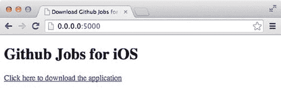

Ruby 自带了一个捆绑的 HTTP 服务器，我们可以用它来在本地网络上共享这个页面。

打开终端，导航到存储 `index.html` 文件的目录，并运行以下命令：

```
$ ruby -run -e httpd -- --bind-address 0.0.0.0 --port 5000 .
```

```
[2014-05-25 16:43:51] INFO WEBrick 1.3.1
[2014-05-25 16:43:51] INFO ruby 2.1.1 (2014-02-24) [x86_64-darwin13.0]
[2014-05-25 16:43:51] INFO WEBrick::HTTPServer#start: pid=46428 port=5000
```

如果你打开浏览器并访问 URL `localhost:5000`，应该会看到一个类似于图 7-12 的页面。

***图 7-12.** 我们非常棒的分发平台*

### 清单文件

现在我们有了看起来很棒的 HTML 页面，接下来谈谈我们需要创建的 XML 清单文件，以便你可以下载应用。如果你还记得，我们第一次将 Github Jobs for iOS 应用打包成 IPA 文件时，使用的是 Xcode 的 Organizer。当 Organizer 问你希望将生成的文件放在哪里时，有一个带有“Save for Enterprise Distribution”标签的小复选框。选中后，会弹出一个表单，要求你填写一些信息。在后台，这些信息会被存储在一个类似于我们将要编写的 Plist 文件中。

回到文本编辑器，在 `index.html` 文件旁边创建一个 `github-jobs.plist` 文件，内容如下：

```xml
<?xml version="1.0" encoding="UTF-8"?>
<!DOCTYPE plist PUBLIC "-//Apple//DTD PLIST 1.0//EN" "http://www.apple.com/DTDs/PropertyList-1.0.dtd">
<plist version="1.0">
<dict>
    <key>items</key>
    <array>
        <dict>
            <key>assets</key>
            <array>
                <dict>
                    <key>kind</key>
                    <string>software-package</string>
                    <key>url</key>
                    <string>http://<YOUR-LOCAL-IP>:5000/GithubJobs.ipa</string>
                </dict>
            </array>
            <key>metadata</key>
            <dict>
                <key>bundle-identifier</key>
                <string>com.perfectly-cooked.Github-Jobs</string>
                <key>bundle-version</key>
                <string>0.1</string>
                <key>kind</key>
                <string>software</string>
                <key>title</key>
                <string>Github Jobs for iOS</string>
            </dict>
        </dict>
    </array>
</dict>
</plist>
```

确保将 `<YOUR-LOCAL-IP>` 替换为你实际的本地 IP 地址，并确保 `bundle-identifier` 和 `bundle-version` 与你应用的信息一致。然后，复制你的应用的最新版本——或者更好的是，从你最新的 Jenkins 或 Bamboo 构建的 artifacts 部分下载它——并将其保存在与 `index.html` 和 `github-jobs.plist` 相同的目录层级中。


打开你的`index.html`文件，使用以下 URL 作为下载链接的`href`属性值：

`itms-services://?action=download-manifest&url=http://172.16.43.115:5000/github-jobs.plist`

最后，在你的 iOS 设备（当然，该设备需被授权执行此应用）上打开 Safari 浏览器，并使用你的本地 IP 地址导航到你的网站。如果你不知道自己的 IP 地址，请打开系统偏好设置的“网络”部分，那里会显示该信息。请记住，我们使用了`0.0.0.0`作为绑定地址，因此你的“网站”可以在本地网络中访问，而不仅仅是你自己的电脑。点击下载链接，系统会询问你是否真的要下载该应用。

恭喜，你已经搭建好了一个非常简单的分发平台！

**练习：在任务结束时发送新的 IPA 文件**

如果你对 Web 开发也感兴趣，这里有一个简单的练习。在 Jenkins 或 Bamboo 任务结束时，将新的 IPA 文件发送到你的 Web 服务器，这样你就可以随时下载最新版本的构建产物。

[www.it-ebooks.info](http://www.it-ebooks.info/)

**138**

**第 7 章：无线（OTA）分发**

**额外功能：使用配置文件设置访问控制列表（ACL）**

我们自己的平台存在一些问题：设计、手动编辑`index.html`和`github-jobs.plist`文件，当然还有安全性！目前，任何能访问你本地网络的人都可以轻松安装并使用该应用。如果你把这个小平台上传到云端，基本上任何人都可以下载并安装你的应用。

事实上，检查用户是否有权下载你的应用是非常简单的，同样可以利用应用本身。即使你想为应用添加简单的登录/密码认证过程，你仍然需要检查用户是否有权安装该应用。

幸运的是，你在创建配置文件时已经指定了这一点。让我们再次利用它！

**解读配置文件**

我们之前提到过，IPA 文件只不过是一个经过代码签名的 ZIP 归档文件，其中包含了应用。而应用本身又包含了配置文件。实际上，如果你解压归档文件并查看`Payload`文件夹，你应该会看到一个名为`embedded.mobileprovision`的文件。

使用终端，导航到包含生成的 IPA 文件的文件夹（使用`cd`命令），然后运行以下命令：

```
$ unzip Github\ Jobs.ipa
$ cd Payload/Github\ Jobs.app/
Github Jobs.app|master ⇒ ls -hal
total 1032
drwxr-xr-x  13 Palleas  staff   442B 20 May 20:03 .
drwxr-xr-x   3 Palleas  staff   102B 20 May 20:03 ..
-rw-r--r--   1 Palleas  staff    74K 20 May 20:03 Assets.car
drwxr-xr-x   3 Palleas  staff   102B 20 May 20:03 Base.lproj
-rwxr-xr-x   1 Palleas  staff   397K 20 May 20:03 Github Jobs
-rw-r--r--   1 Palleas  staff   1.4K 20 May 20:03 Info.plist
-rw-r--r--   1 Palleas  staff    15K 20 May 20:03 LaunchImage-700-568h@2x.png
-rw-r--r--   1 Palleas  staff     8B 20 May 20:03 PkgInfo
-rw-r--r--   1 Palleas  staff   150B 20 May 20:03 ResourceRules.plist
drwxr-xr-x   5 Palleas  staff   170B 20 May 19:49 SVProgressHUD.bundle
drwxr-xr-x   3 Palleas  staff   102B 20 May 20:03 _CodeSignature
-rw-r--r--   1 Palleas  staff    12K 20 May 20:03 embedded.mobileprovision
drwxr-xr-x   3 Palleas  staff   102B 20 May 20:03 en.lproj
```

`embedded.mobileprovision`文件包含了一组授权运行该应用的设备列表。如果你要搭建一个真实的应用，只需将一个或多个设备标识符与用户账户关联起来，然后利用最新构建中包含的信息来判断是否应向该用户显示下载链接。当然，这只是一个理论上的方案，但足以让你入门。

[www.it-ebooks.info](http://www.it-ebooks.info/)

**第 7 章：无线（OTA）分发**

**139**

**总结**

在 2014 年 WWDC 上，苹果公司宣布了他们在收购 TestFlight 背后的公司后的计划。内部测试团队、面向多达一千名用户的 Beta 分发、崩溃报告以及用户反馈都在计划任务之中。在撰写本书时，这些功能大多仍处于测试阶段，并且将仅限于 iOS 8。其他一些功能，如崩溃报告，预计将在 2015 年晚些时候发布。你还不能指望这些解决方案现在就完美无缺，但大多数开发者对此感到非常高兴。关键在于，你已经基本了解了整个运作机制，从使用现有的分发平台到开发自己的平台。

本章主要讨论的是无线部署。我们向你介绍（或再次介绍）了一个非常著名的解决方案——TestFlight，它最近被苹果收购。这个解决方案非常强大，因为它能帮助你管理应用和多个用户团队，从而让你可以轻松地发送应用的 Beta 版本。我们向你展示了如何使用命令行将这些构建版本发送到 TestFlight，甚至可以在构建过程结束时，使用你偏好的持续集成平台自动完成此操作。

在了解了持续集成平台之后，你已经准备好探索苹果去年发布的一个新工具：Xcode Bots。

[www.it-ebooks.info](http://www.it-ebooks.info/)

**第 8 章**

**Xcode Bots 的日常使用**

我们在第一章中提到，本书将像一次旅程。我们从介绍你手头的工具开始，然后使用多个平台构建了一个简单但功能强大的持续集成架构。到现在，我们希望你已经能在 Jenkins 和 Bamboo 之间做出选择。但如果你还没下定决心，这一章可能会让决策过程更加困难。

之前的章节涵盖了苹果公司不太关注持续集成时期的工具。幸运的是，聪明的人们找到了将现有工具适配到新技术的方法。借助 Jenkins 和 Bamboo，你应该能构建出相当不错的持续集成架构。

Xcode 5 的发布不仅让你得以一窥 OS X 10.10 可能的样子，并让你可以无痛地合并故事板文件。它还带来了你可以使用的重要改进：OS X Server 的 Xcode 服务和 Xcode Bots。当然，它并不完美——我们还没发现哪个苹果开发者工具从第一天起就是完美的。有些人会说苹果不在乎，但我们认同那些认为他们确实在乎的人。Xcode Bots 在宣布的那一天就大受欢迎。然而，在 2014 年 WWDC 上，苹果宣布了一系列变更和改进，使得 Xcode Bots 成为了 iOS 和 OS X 开发者必备的工具。

我们将先简要说明为什么需要关注又一个持续集成工具，然后介绍 OS X Server，并附带一点苹果公司的历史。接着，我们将介绍 Xcode 5，以及如何将其与 OS X Server 集成以管理我们的`git`仓库，并创建漂亮的新 Bot。最后，我们将使用这个 Bot 每晚构建`Github Jobs for iOS`应用，并观察它如何与一个非官方支持的第三方工具——Cocoapods 协同工作。

**为什么还需要另一个持续集成工具？**

在我们介绍了如何搭建 Jenkins 和 Bamboo 这两个持续集成平台之后，我们通过涵盖一个不同的主题（无线应用部署）而有点打断了流程。现在，你可能会疑惑为什么我们还需要另一个持续集成平台，因为仅凭目前所知的一切，已经足以自动构建和部署一个应用了。

**141**

[www.it-ebooks.info](http://www.it-ebooks.info/)

**142**

**第 8 章：Xcode Bots 的日常使用**


# 最终追求：使用 Xcode Bots 实现持续集成

事实是，`Xcode` 机器人并非旨在取代你的 `Jenkins` 或 `Bamboo` 安装。至少目前还不是。现阶段，`Xcode` 机器人虽然前景广阔，但也存在不少缺陷。在本章中，我们将向你展示如何安装、设置并使用这些新功能，以及它们如何融入你的日常工作流程。

我们将这一章称为你通往理想持续集成平台之旅的最终追求。

在我们详细介绍其工作原理之后，将利用剩余章节讨论自动化测试和质量保证。

闲言少叙，请准备好信用卡打开 `Mac App Store`，让我们开始吧。

## OS X Server

在我们开始讨论 `OS X Server` 的工作原理之前，需要先了解促成该工具首次发布的历程。

### 一点历史

在 `OS X Lion` 之前，Mac OS X 和 Mac OS X Server 是两个独立的操作系统；后者与桌面版类似，但附带了额外的管理工具。服务器版是为机架式服务器计算机 `Xserve` 设计的，现在已被 `Mac mini server` 和 `Mac Pro server` 取代。

当 `OS X Lion` 发布时，Mac OS X 和 Mac OS X Server 合并为一个名为 `OS X` 的操作系统。与服务器相关的组件现在以独立的打包应用程序形式发布，你可以从 `Mac App Store` 下载。请注意，`Mac Pro` 和 `Mac Mini` 计算机可以预装 `OS X` 购买，但正如我们将要展示的，在计算机上设置 `OS X Server` 非常简便。

### 在你的计算机上安装 OS X Server

`OS X Server` 售价 20 美元，如果不安装它，你将无法使用 `Xcode` 的持续集成功能。要运行最新版本的 `OS X Server`，你至少需要 `OS X Mavericks` 和最新版本的 `Xcode`。我们使用的是 `Xcode 6` 的第三个测试版和 `OS X Server` 的 `3.1.5` 版本。

打开 `Mac App Store`，搜索“OS X Server”并在你的计算机上安装。

安装完成后，启动它以开始安装过程，该过程需要 root 权限。

不过别担心：它不会擦除你计算机上的内容。在安装过程结束时，你应该会看到通过 `OS X Server` 可用于你的服务概览，类似于图 8-1：日历、信息、邮件、时间机器，当然还有 Xcode。

[www.it-ebooks.info](http://www.it-ebooks.info/)

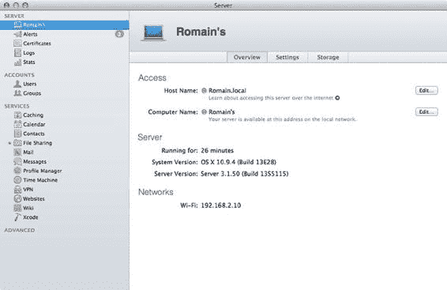

**第 8 章：Xcode bots 的日常使用**  
**143**

***图 8-1.** OS X Server 开箱即支持许多服务*

如你所见，只需点击几下，我们就拥有了一个几乎可以为我们工作的服务器，而使用 `Jenkins` 或 `Bamboo` 完成同样的工作需要更多步骤。这就是使用 `OS X Server` 构建持续集成平台有意义的理由之一：它依赖于你已经熟悉的工具（如 `App Store`），并且外观和感觉都像一个 OS X 应用程序。

我们现在真正关心的服务是 `Xcode`，它默认是禁用的。让我们激活它以便开始使用。在左侧菜单中选择 `Xcode` 项。切换右上角的开关，当文件面板打开时，导航到你的 `Application` 文件夹并选择 `Xcode` 应用程序。

一旦 `Xcode` 设置完成，你应该会看到关于新激活的 `Xcode` 服务的更多信息。

首先要知道的是，你的 `Xcode` 服务器会自动在你的本地网络上可用，在我们的例子中，它是“romain.local”，这是基于计算机名称生成的默认主机名。

其次，`Xcode` 服务带有一个默认权限方案，其中只有经过身份验证的用户才能创建机器人，而每个人都可以看到它们，当然前提是他们在同一网络上。

`OS X Server` 使用与操作系统相同的用户数据库。如果你从左侧菜单进入 `Users` 部分，你应该会看到计算机上的所有用户。假设明年夏天会有一名实习生加入你的公司，但你不希望他拥有托管 `OS X Server` 的计算机的完全访问权限。让我们创建一个账户。

[www.it-ebooks.info](http://www.it-ebooks.info/)

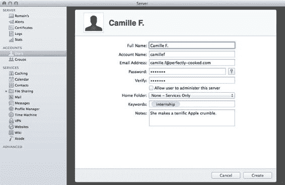

**144**  
**第 8 章：Xcode bots 的日常使用**

点击 `Users` 部分左下角的加号，并根据图 8-2 填写表单，信息自定。请注意，我们还为该用户添加了“internship”标签，并添加了一段简短的信息说明。重要的是，我们并没有选择创建一个实际用户，而只创建了一组凭据。这就是为什么在 `Home folder` 中，你会选择“None – Service only”：我们只希望 Camille 能够管理机器人。我们也可以使用类似的面板将我们的新用户分配到一个实习生组等等，但是 a) 这有点超出了本书的范围，b) 对于像我们这样简单的项目来说，这太过复杂了。按下 `Create` 按钮，然后返回 `Xcode` 的服务管理。

***图 8-2.** 实习生 Camille 将能够使用她的凭据访问某些服务*

让我们调整一下权限，使得只有管理员和我们的实习生能够创建机器人，并且只有登录用户才能查看所有机器人。为此，点击权限部分旁边的 `edit` 按钮。在第一个组合框中选择“only some users”，点击加号，并在出现的字段中搜索 Camille。同时，勾选面板底部的复选框，并在其旁边的组合框中选择“only logged in users”。最后，按 `OK`。

此部分下方是有关构建将如何执行的更多信息。你首先看到的是将用于构建应用程序的 `Xcode` 版本。如果你还记得我们在第 3 章中讨论的内容，可以使用 `xcode-select` 或 `DEVELOPER_DIR` 环境变量在开发者目录之间切换。这基本上就是本节的目的，只是在这里你拥有一个用户界面，并且当你尝试选择无效的 `Xcode` 应用程序时，会收到一条稍微令人困惑的错误消息：“此应用程序无法与 OS X Server 一起使用。”

`Xcode` 服务还可以使用凭据连接到你的现有 Apple 开发者账户，以便自动下载代码签名身份和配置文件。点击 `Developer teams` 部分附近的 `Add` 按钮，并填写你的凭据。如果此 Apple 标识链接到多个团队，请选择你希望用于此 `OS X Server` 安装的团队。如果你只属于一个团队，只需确认你确实希望将此服务器添加到你的团队即可。

最后但同样重要的是，适用于 `OS X Server` 的 `Xcode` 服务将能够同时在多个设备上运行测试。即使我们将在下一章中介绍单元测试，也请将你的一个设备插入运行 `OS X Server` 的计算机，并等待它检测到该设备。

我们已使 `Xcode` 服务在我们的本地网络上可用，设置了基本权限，配置了开发者目录（它将在此目录中找到构建应用程序所需的所有工具），最后配置了我们的 Apple 开发者账户并插入了一个设备。最终，你的服务配置应如图 8-3 所示。

***图 8-3.** 一切均已正确配置，Xcode 服务现已准备好为我们工作*

此新版本的一个出色功能是，`OS X Server` 现在能够托管 Git（以及 SVN，但……）仓库，并连接到现有仓库，如“Repositories”部分所示。


## Xcode Bots 的日常使用

### Xcode 6

`Xcode 5` 对许多开发者来说是一个非常重要的版本。它带来了大量针对界面构建器的升级和修复，尤其是对自动布局的改进。更重要的是，得益于我们之前配置的 `Xcode` 服务，它实现了与 OS X Server 的集成。在 `WWDC 2014` 上，Apple 发布了更好的新版本 `Xcode`。

就像 `iOS 7.0` 一样，`Xcode` 与 OS X Server 最初通信的过程有些坎坷。本节将介绍如何仅使用 Apple 技术为项目搭建持续集成架构。

### 持续集成

通过一次按键就能运行单元测试，或者通过几个步骤就能编译、归档和打包应用，这并非新事物。第一种方式的缺点是会耗费你不一定拥有的时间，而且大多数时候开发者会忘记执行此操作，这会让你的测试套件变得毫无意义。第二种方式则是一个乏味的过程。为了解决这个问题，我们发现了一些可以直接使用或封装到构建脚本中的工具，比如 Facebook 的 `xctool` 或 Marin Usalj 的 `xcpretty`。

有了 `Xcode 5`，我们终于能够从命令行运行 iOS 单元测试（稍后会有更多信息），这使得我们可以从持续集成平台上自动执行这些测试。更重要的是，我们现在可以直接从 `Xcode` 配置持续集成平台了。

### 从 Xcode 与 Xcode 服务通信

打开 `Xcode` 的偏好设置（或在 Xcode 打开时按 `⌘ + ,`），然后选择账户部分。点击窗口左下角的加号，从弹出的菜单中选择"添加服务器..."。如果一切正常，并且没有代理阻止连接，你应该会看到你的服务器已经通过 Bonjour 在本地网络中被自动发现，如图 8-4 所示。

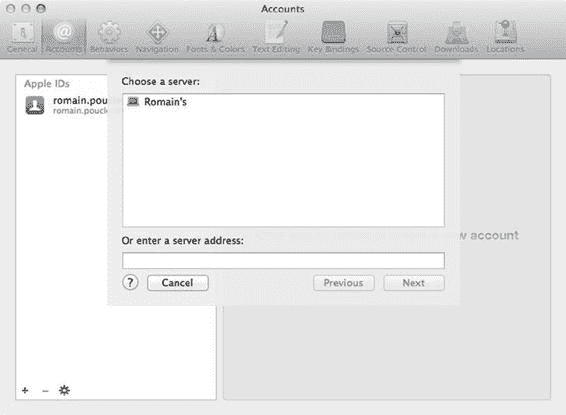

**图 8-4.** 我们设置的 OS X Server 实例在本地网络中被自动发现

**注意** Bonjour：Bonjour 是 Apple 对零配置网络协议组的实现。最初名为 "RendezVous"，Bonjour 可用于通过多播域名系统 (mDNS) 服务记录定位其他计算机。

请注意，使用 Jenkins 也可以实现类似的行为，如果你在网络中发送 UDP 广播，它会响应一个包含安装信息的 XML 消息，如下所示：

```
$ echo "Hey Jenkins" | nc -u 0.0.0.0 33848

<hudson>
  <version>1.560</version>
  <url>http://localhost:8080/</url>
  <server-id>990ad56b5659020020aee81d644db8ca</server-id>
  <slave-port>57621</slave-port>
</hudson>
```

如果你想确保 Jenkins 主节点和从节点的一个或多个实例可以相互访问，这会很有用。

从列表中选择你的 OS X Server，然后点击**下一步**按钮。在出现的窗口中，输入你之前为内部用户设置的凭据，然后点击**确定**。请注意，虽然提供了**访客**访问权限，但由于我们这样配置了，访客用户将无法访问现有 bots，更别提创建新的了。

现在我们已经将 OS X Server 添加到了 `Xcode` 中，打开 Github Jobs for iOS 应用，并从**产品**菜单中选择"创建 Bot..."项。

### 什么是 Bot？

如果你还记得我们在 Bamboo 和 Jenkins 中的任务是如何工作的，它们都从一个简单的步骤开始：从远程仓库获取源代码的最新版本，然后开始构建。Xcode Bot 也是如此。实际上，什么是 bot？

Xcode Bot 类似于 Xcode 的 scheme，它们都是一组封装的信息和指令。一个 bot 将包含一个它有权访问的远程仓库的引用，以及关于要构建的项目的其他信息：何时构建、如何构建以及构建后做什么。

当你设置一个 bot 时（我们稍后将介绍这个部分），您需要像在几乎任何持续集成平台上一样，决定何时要构建项目。一旦决定了这一点，你还需要决定项目将如何构建：它将使用哪个共享 scheme？是否应该运行静态代码分析？是否应该运行测试套件？如果运行，它是在模拟器上运行测试，还是在连接的设备上运行？是否应该归档构建产物？

最后，你还需要决定构建完成后要做什么。例如，如果构建失败，是否应该向团队发送电子邮件？

所有这些信息都包含在一个 bot 中，我们将使用这个 bot 在 OS X Server 实例上构建应用程序。

### 设置 Github Jobs

新版 OS X Server 的一个出色功能是能够托管 git 仓库，这使其在技术上可以替代 Github 或 Bitbucket 等第三方服务。当然，这并不完全正确，因为这些服务不仅提供托管，还提供拉取请求、发布管理等功能。在本节中，我们将介绍如何创建我们的第一个 bot，授予 Xcode 服务器访问远程仓库的权限，并了解如何处理依赖管理。

### 使用 Xcode Bots 对 Github Jobs for iOS 进行每日构建

一个 bot 可以执行不同的操作：运行测试、进行代码静态分析以及归档应用程序。由于我们把最好的内容留到本书最后，我们将只创建一个每晚归档构建的 bot。

我们之前提到过，Xcode Bot 提供的信息是应该用于构建应用的 scheme。如果我们使用命令行快速查看可用的 schemes，结果如下：

```
$ xcodebuild -list

关于项目 "Github Jobs" 的信息：

Targets:
  Github Jobs
  Github JobsTests

构建配置：
  Debug
  Adhoc
  Release
```

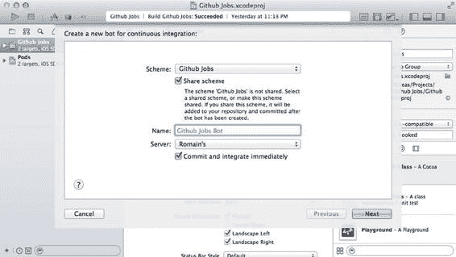

如果未指定构建配置且未传递 `-scheme`，则使用 `Release`。

Schemes:
- Github Jobs

唯一可用的 scheme 是我们在脚本中用来通过 Bamboo 或 Jenkins 构建应用的 Github Jobs scheme。从 `Xcode` 打开"管理 Scheme"面板，打开此 scheme 的详细信息，然后根据需要取消选中**共享**复选框。关闭"管理 schemes"窗口，返回 bot 创建窗口。如果你尝试使用该 scheme 来构建 Github Jobs for iOS 应用，"共享 scheme"复选框将自动被选中，如图 8-5 所示。如果你尝试取消选中该 scheme，**确定**按钮将被禁用。

我们已经在第 3 章中讨论过 scheme 共享问题，并提到忘记这个选项是多么容易。这是使用专为 `Xcode` 项目设计的工具的另一个优势：你根本无法基于非共享的 scheme 创建 Xcode Bot。

在**名称**字段中为你的每日构建 bot 填写一个专用名称。可以发挥创意——毕竟，如果你不能给它们起个酷炫的名字，使用与机器人相关的工具还有什么意义呢？我们将它命名为"Klaus"。

确保选择的服务器是你在上一节中设置的那个，并且如图 8-5 所示，确保"提交更改并立即集成"选项已选中。

**图 8-5.** 你不能基于非共享的 scheme 创建 Xcode bot


[www.it-ebooks.info](http://www.it-ebooks.info/)

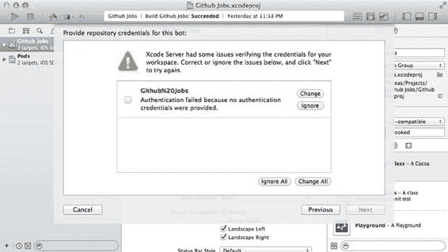

**150** **第 8 章：Xcode Bots 的日常使用**

#### 授予对 GitHub 远程仓库的访问权限

配置此 Bot 的下一步将搜索你的工作副本，查找服务器有权访问的远程仓库。不幸的是，它没有任何访问权限，你将收到一条警告，如图 8-6 所示。

***图 8-6.** 服务器无法访问远程仓库*

这个问题很容易解决，我们只需找到一种方法让服务器能够访问我们的仓库。为此，根据仓库托管的位置，我们有两种不同的选择：提供用户名和密码，或者使用 SSH 密钥。由于我们的仓库托管在 GitHub 上，而这家公司让 SSH 密钥管理变得轻而易举，因此我们将选择 SSH 密钥。

点击此警告右侧的 `change` 按钮，在出现的菜单中选择“New SSH Key”。将用户名保留为“git”，然后点击生成的公钥前几个字符附近的小齿轮图标。在出现的菜单中选择“copy”，将公钥存储到剪贴板，并将此公钥添加到你的账户。完成后，按下 `next`。它将检查凭据，如果密钥正确添加，则会有一个绿色的大勾号确认凭据已验证。

#### 配置 Bot 并获取反馈

在下一个窗口中，在计划组合框中选择“Periodically”，并将其设置为每天凌晨 1 点执行一次每日构建。然后，取消选中“Perform analyze action”和“Perform test section”：目前我们只想像前几章中持续集成脚本所做的那样构建应用程序。最后，按下“Next”。

[www.it-ebooks.info](http://www.it-ebooks.info/)

**第 8 章：Xcode Bots 的日常使用** **151**

最后一个屏幕非常重要。我们之前提到过，Xcode Bot 只是一个简单的信息容器，用于描述如何以及何时执行特定的操作。而此面板还允许你配置这些操作前后应发生的事情。此屏幕的默认配置是，在构建或分析失败时向提交者发送邮件。每次提交时，这些提交者都会通过其姓名和电子邮件被识别：

```
$ git show 1e93f4d83499660e63fc9ec21cbd16803f7f4268
commit 1e93f4d83499660e63fc9ec21cbd16803f7f4268
Author: Romain Pouclet <palleas@gmail.com>
Date: Sat May 31 18:38:52 2014 -0400
Fix script and scheme and stuff
```

这也意味着，如果你决定通过 Xcode Bot 构建在 GitHub 上找到的开源库，原作者可能会收到关于构建失败的邮件。集成前请三思！

我们稍后会回到这个屏幕，现在只需点击“Create”按钮，静待奇迹发生。事实上，这是一种极好的反馈方式，让你在早晨开始工作时就能立即知道项目是否有任何问题。

在最后一个屏幕中，选中两个“committers”复选框，以便所有为正在构建的项目做出贡献的人都能了解夜间构建的结果。

**警告/注意** 由于某些原因，Xcode 可能无法自动打开提交面板。如果是这种情况，请选择 `Source Control > Commit` 并手动提交你的更改。这一点很重要，因为如果方案配置不当，Xcode 服务将无法构建你的应用程序。

准备就绪后，导航到日志导航器，这是 Xcode 文件浏览器的最后一个选项卡。

这是你将会找到所有已执行操作列表的面板。如果 Bot 尚未开始，请右键单击你的 Bot，然后选择“Integrate Now”项，以便立即查看集成结果，这很可能因与你的 `Podfile` 相关的错误而失败。请稍安勿躁，我们将在下一节中修复它。首先，让我们看看直接在 Xcode 中可用的反馈。第一个部分，如图 8-7 所示，总结了构建期间发生的情况：实际错误、警告、静态分析结果以及单元测试结果。

[www.it-ebooks.info](http://www.it-ebooks.info/)

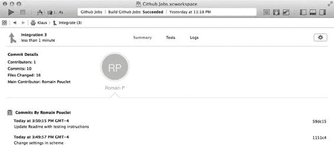

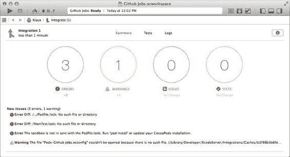

**152** **第 8 章：Xcode Bots 的日常使用**

***图 8-7.** 集成失败，出现三个错误和一个警告*

请注意，此图中可见的问题列在“Unresolved Issues”部分下。由于这实际上是该 Bot 执行的第一次集成，这些问题被标记为新的。

第二个部分，如图 8-8 所示，显示了稍后发生的集成中所涉及的提交列表。当执行新的集成时，Bot 会从远程仓库获取新的提交。如果构建失败，你可以轻松地看到错误可能是在何时引入的。

***图 8-8.** 集成详情的第二部分显示了所涉及的提交者列表*

[www.it-ebooks.info](http://www.it-ebooks.info/)

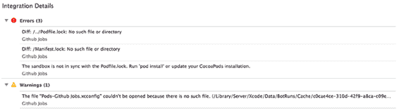

**第 8 章：Xcode Bots 的日常使用** **153**

**注意** 仅凭 Git 就能通过执行“二分”搜索，使用 `git bisect` 命令定位回归是在哪里引入的。更多信息请访问此页面：

[`git-scm.com/book/en/Git-Tools-Debugging-with-Git#Binary-Search`](http://git-scm.com/book/en/Git-Tools-Debugging-with-Git#Binary-Search)

现在让我们来看看集成失败的原因。如果你查看图 8-9，可以看到明显的与 CocoaPods 相关的错误：找不到 `PodFile.lock` 和 `Manifest.lock` 文件，也找不到 `xconfig` 文件，而且我们收到了一个关于沙箱不同步的错误。

***图 8-9.** 由于某些与 CocoaPods 相关的原因，集成仍然失败*

要理解这个错误，你首先必须回忆起我们在第 2 章中提到的，关于我们可用于设置持续集成平台的所有工具。其中一个工具是“Run script build phases”，你可以将其添加到构建过程中，它会运行任意的 Shell 脚本。

导航到 Github Jobs 目标详情的“build phases”选项卡，你应该会看到一个名为“Check Pods Manifest.lock”的阶段，它运行以下脚本：

```
diff "${PODS_ROOT}/../Podfile.lock" "${PODS_ROOT}/Manifest.lock" > /dev/null
if [[ $? != 0 ]] ; then
cat << EOM
error: The sandbox is not in sync with the Podfile.lock. Run 'pod install' or update your CocoaPods installation.
EOM
exit 1
fi
```

此脚本使用 `PODS_ROOT`（这是 CocoaPods 在你首次运行 `pod install` 命令时添加的用户定义的构建设置）来定位 `Podfile.lock` 和 `Manifest.lock` 文件。此文件包含关于你项目依赖项的信息，以便下次你或你的合作者需要安装项目最新版本时，依赖项将以相同版本安装。拿到这两个文件的路径后，它使用 `diff` 命令来比较这些文件。如果不匹配，则意味着当前与项目捆绑的依赖项版本不正确。你可以通过在项目目录中运行 `pod install` 来解决此问题。

[www.it-ebooks.info](http://www.it-ebooks.info/)

**154** **第 8 章：Xcode Bots 的日常使用**


此脚本会失败，因为 `Manifest.lock` 文件不存在，包含你依赖项的 `Pods` 文件夹也不存在。这可能意味着需要将 `Pods` 文件夹添加到你的主仓库中，但我们确实不想这么做。我们想要做的是在构建实际开始之前安装我们的依赖项。

### 在 Xcode Bot 执行的集成过程中安装依赖项

首先想到的解决方案是再添加一个运行脚本构建阶段，但这会引发一些问题。构建阶段存储在目标级别，在我们的案例中，我们将修改 "Github Jobs" 这个目标。这也意味着每次我们从 Xcode 构建应用程序时，该脚本都会运行。我们可以简单地在脚本中添加一个`if`条件，如果脚本不是由 "_teammserver" 用户执行的，则退出，但这并不是一个非常稳定和可靠的解决方案。

我们也可以复制该目标，但这意味着要管理两个目标：一个用于日常工作，另一个用于持续集成。修改目标绝对不是一个好办法。

在 Xcode 5 中，至少可以说，安装依赖项是一个繁琐的过程。你必须使用一个预构建的 scheme 操作来执行一个运行著名的 `pod install` 命令的脚本。

这种方法有几个缺点：由于该脚本存储在 scheme 级别，你无法从脚本执行中获得任何输出，并且必须手动将此输出重定向到某个文件。

好消息是我们不再需要这种变通方法了，因为 Apple 在 Xcode 6 中引入了**集成前**和**集成后**触发器。我们已经看到了如何使用集成后触发器在构建失败时向提交者发送电子邮件，现在让我们看看如何使用集成前触发器来调用 Cocoapods 可执行程序。

在集成界面中，点击屏幕右上角的设置齿轮图标，这将允许你编辑你的 Bot 的设置。点击下一步，直到到达“配置 Bot 触发器”部分。在“集成前”标题下，点击“添加触发器”按钮，然后选择“运行脚本”。在出现的字段中，输入以下脚本：

```
export LC_ALL="en_US.UTF-8"

PODFILE=`find . –type f – name Podfile`

cd `dirname $PODFILE`

pod install
```

这个脚本相当直接。它做的第一件事是定义当前语言环境。这是 Cocoapods 的要求，否则你会得到以下错误：

`CocoaPods requires your terminal to be using UTF-8 encoding. See`

[`github.com/CocoaPods/guides.cocoapods.org/issues/26`](https://github.com/CocoaPods/guides.cocoapods.org/issues/26) 寻求可能的解决方案。

然后，它使用 `find` 命令来定位 `Podfile`。当执行此脚本时，当前目录并不是你的项目根目录。一旦定位到这个文件，就会使用 `dirname` 命令来获取包含该文件的目录路径并导航到该目录。请注意，我们本可以对文件夹路径进行硬编码，但这种方式可能更清晰，例如，万一你更改了项目名称。

一旦我们导航到这个文件夹，我们就运行 `pod install` 命令来安装依赖项。`Pods` 文件夹会被创建，里面包含 `Manifest.lock` 文件以及 `xcconfig` 文件，后者包含 Cocoapods 正常运行所需的额外信息。例如，以下是为我们项目生成的文件：

```
GCC_PREPROCESSOR_DEFINITIONS = $(inherited) COCOAPODS=1
HEADER_SEARCH_PATHS = "${PODS_ROOT}/Headers" "${PODS_ROOT}/Headers/SVProgressHUD"
OTHER_CFLAGS = $(inherited) -isystem "${PODS_ROOT}/Headers" -isystem
"${PODS_ROOT}/Headers/SVProgressHUD"
OTHER_LDFLAGS = -ObjC -framework QuartzCore
PODS_ROOT = ${SRCROOT}/Pods
```

这里重要的部分是声明的 `PODS_ROOT`，它包含了 `Pods` 目录的路径。

当无法加载此文件时，构建设置 `PODS_ROOT` 在构建期间就不可用。这也意味着无法计算出 `Manifest.lock` 文件的路径，因此我们一直遇到的集成失败就发生了。

Apple 发布了一个需要如此多工作才能正常运行的工具，这可能看起来令人惊讶，但请记住，我们使用的是与 Apple 毫无关联的第三方工具。

平心而论，对于 Xcode 和 OS X Server Xcode 服务器，如果我们不依赖 Cocoapods 来管理依赖项，我们本可以在几分钟内完成所有设置。包括创建项目、使用 Bot 构建项目以及将其托管在 OS X Server 上。

如果你现在尝试启动一次集成，与 Cocoapods 相关的错误将不再发生，并会列在已解决问题列表下，如图 8-10 所示。

**图 8-10.** *集成成功，我们在上次集成中遇到的错误被标记为已解决*

当我们使用 Jenkins 或 Bamboo 来构建应用程序时，这两个平台都有一个共同的特点，即能够将构建限制在应用程序的特定分支上。我们还没有在 Xcode Bot 中看到这个功能，但这并不意味着它不存在。

当你在 Xcode 中创建一个 Bot 时，它会检索你项目当前使用的分支名称，并将 Bot 限制在这个特定分支上。如果你想更改分支名称，你将不得不从日志面板编辑 Bot，并且在不更改任何内容的情况下，只需点击完成过程中的几个步骤。我们承认这不是一个非常好的流程，但这只是因为 Xcode 对 Bot 参数的控制有限。Xcode 集成本意是一个非常简单明了的过程：你正在开发一个功能，并且想知道你是否破坏了什么。一旦你的功能完成，删除（或更新）Bot 并继续前进。

老实说，你可能找不到比 `Klaus` 更糟糕的 Bot 名称了；我们使用它只是为了之后有个理由去更改它。你应该始终使用不言自明的名称，这样你可以快速了解它们的用途。例如，我们的 Bot 可能应该命名为 “Github Jobs (Nightly)”，这样会更有意义，并且在 Bot 列表中更容易找到。要做到这一点，同时更改集成运行的分支，只需使用我们之前添加集成前触发器时用过的屏幕右上角的齿轮按钮，返回到设置面板。

要更好地控制你的 OS X Server 持续集成平台的唯一方法是使用另一种直接与服务器通信的界面：**Web 界面**。既然我们已经涵盖了 Xcode 端关于 Bot 几乎所有需要了解的内容，那么让我们继续探讨 Web 界面。请注意，在 Xcode 5 中，有一种方法可以从 Web 界面直接编辑 Bot 的设置，但根据 Xcode Server 的最新测试版，这个功能似乎已经消失了。

### 从 Web 界面管理 Xcode 服务

用于 Xcode 服务的 OS X Server Web 界面可通过一个由你计算机在网络上的名称组成的 URL 访问，在我们的例子中是 `romain.local`，后面跟着路径组件 `xcode`，因此得到：`http://romain.local/xcode`。你可以自己猜测 URL，或者从 OS X Server Xcode 服务面板中，点击屏幕底部的“查看 Bots”按钮。你也可以点击 Xcode 屏幕右上角的设置滚轮并选择“在浏览器中查看 Bot”。当然，最后一种方法将打开某个 Bot 的详细信息，而不是你的 Xcode 服务的“主页”。


## OS X Server 与 Xcode Bots

如果您尚未通过身份验证，`OS X Server` 不会显示错误信息，但正如本章开头所配置的那样，您需要先进行身份验证才能查看现有机器人的信息，如图 8-11 所示。请输入您先前创建的用户凭据，然后点击“登录”。

[www.it-ebooks.info](http://www.it-ebooks.info/)

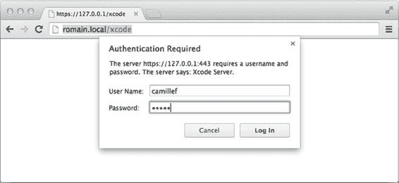

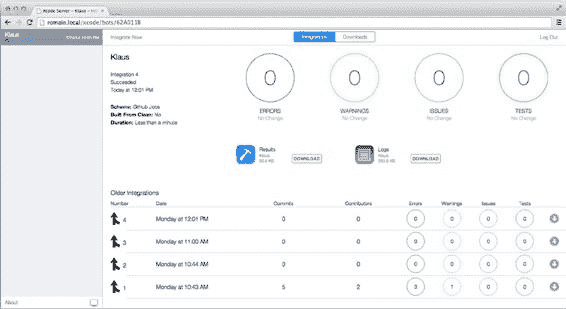

**第 8 章：Xcode Bots 的日常使用**

**157**

***图 8-11.** 网页界面附带了登录表单*

主界面会显示最近一次集成以及下一次集成的相关信息，同时还列出了最新可供下载的版本。在这些信息块下方，是所有现有机器人的列表，包括它们的状态和最近一次集成的时间。从该列表中点击您的 Bot 名称，即可查看更多详细信息。

这个网页界面与我们之前在 `Xcode` 中看到的非常相似，如图 8-12 所示。左侧是过去集成的历史列表，右侧则是机器人的当前状态，重点展示了最新一次集成的结果。

***图 8-12.** 此网页显示了名为 Klaus 的机器人的详细信息*

[www.it-ebooks.info](http://www.it-ebooks.info/)

**158**

**第 8 章：Xcode Bots 的日常使用**

### 下载最新版应用程序

我们安装过程中缺失的最后一步，是能够下载应用程序并将其安装到测试设备上。请导航至“归档”选项卡，那里应会列出每次成功集成后所创建的应用程序包。每一次，项目的归档版本以及生成的 `IPA` 文件都会被检索并存储在此处，就像我们之前使用 `Jenkins` 和 `Bamboo` 时那样。只不过现在这个过程是自动完成的，因为它确切知道要查找哪种文件模式。

如果您在桌面电脑上点击某个“产品”链接，便可以下载该文件，例如将其上传到像 `Testflight` 这样的第三方分发平台。毕竟，您不希望让所有测试人员都能直接访问您的 `OS X Server`。另一方面，如果您在 iOS 设备上点击此链接，则可以直接下载该应用程序并在设备上运行它！这正是专用于某一技术的持续集成平台所带来的优势之一。在我们的场景中，就是指 `Xcode` 项目。

### 使用大屏幕功能获取实时反馈

我们之前提到过，持续集成平台的关键在于能够获得即时反馈，以便了解应用程序是否出错或对产品造成了任何损害。正因如此，`Jenkins` 和 `Bamboo` 都提供了显示安装状态的功能。而 `OS X Server` 及其 `Xcode` 服务则有所不同。如果您点击屏幕顶部菜单中的第一个图标，它会打开“大屏幕”，这是一个专为电视等大屏幕设计的网页。如图 8-13 所示，该界面会自动更新，显示最新集成操作的详细信息。

[www.it-ebooks.info](http://www.it-ebooks.info/)

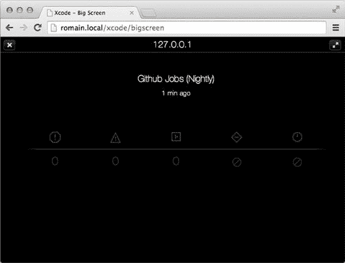

**第 8 章：Xcode Bots 的日常使用**

**159**

***图 8-13.** “大屏幕”模式提供了一种更合适的构建结果展示方式*

## 总结

虽然花了些时间，但苹果终于开始拥抱持续集成这一领域。尽管我们现在还远未能用一个工具来完全取代 `Jenkins` 或 `Bamboo` 的安装，但它确实展现出了使用专用平台工具的优势。忘掉方案共享和获取夜间构建的复杂流程吧，有了 `OS X Server` 和 `Xcode` 服务，只需点击几下，就能创建一个项目，托管在你的服务器上，每次向远程仓库推送提交时都会自动构建。

我们已经向您展示了如何安装并开始使用 `OS X Server`，以及即使您不按照苹果建议的方式（例如使用自己的配置文件并依赖第三方工具管理依赖关系）工作，也能使用该工具的方法。

我们并未涵盖该工具提供的所有功能，事实上，它还能运行你的测试套件，而这正是下一章将要介绍的内容。

[www.it-ebooks.info](http://www.it-ebooks.info/)

# 第 9 章：引入单元测试

本书已接近尾声，这意味着您现在应该对持续集成有了一定的了解。我们涵盖了设置持续集成环境的主要解决方案：免费且开源的 `Jenkins`；具有既定工作流的企业级方案 `Bamboo`；以及苹果官方的 `Xcode Bots`。`Xcode Bots` 成为 `Xcode` 项目持续集成的事实标准还需要一些时间，但前一章表明我们正在逐步接近这个目标。

尽管我们介绍了几种不同的解决方案，但最终我们所做的仅仅是构建应用程序。

当然，我们还需要获取最新版本的源代码并安装依赖，同时确保钥匙串可访问以便对应用程序进行代码签名。这个过程可能很复杂，但它只是持续集成平台能够提供的反馈中的一小部分。一个能成功构建的应用程序，并不意味着它能按预期工作。

本章将介绍另一种有助于检测应用程序是否按预期工作的反馈：自动化单元测试。

第一部分将介绍自动化测试是什么以及它的重要性。尽管自动化测试并非本书的核心主题，但大多数人只看到了编写测试耗时的一面，当项目截止日期变得难以满足时，测试往往是最先被砍掉的部分。接着，我们将深入探讨该主题，为 Github Jobs for iOS 应用程序编写首批单元测试，讨论它们的工作原理、最佳实践以及如何运行它们。更重要的是，我们将介绍如何从命令行运行它们，以便将其与我们构建应用程序的过程一起，纳入持续集成流程中。

## 自动化测试

在软件世界中，自动化测试是指使用专用工具来重复执行预定数量的测试场景。对于每个场景，将最终结果与预期结果进行比较。如果两者相等，则测试标记为通过；如果不等，则标记为失败。

大多数可用测试工具的主要优势在于，能够重新运行失败的测试用例，直到“所有测试通过”为止。

**161**

[www.it-ebooks.info](http://www.it-ebooks.info/)

**162**

**第 9 章：引入单元测试**

### 测试的原因

进行测试的原因有很多，最显而易见的当然是要确保一切按预期工作。无论您编写的是哪种类型的测试，它们都有一个共同模式：从一组初始参数开始，对这些参数应用一些特定的修改，然后确保最终结果与预期结果相符。就单元测试而言，这意味着将通过特定参数调用方法所返回的结果，与一个固定的最终值进行比较。


很多人认为测试属于某种拥有特殊技能的精英开发者，他们能理解什么是断言。对于一些比较冷门的技术来说，这也许是真的，但对于 iOS 和 OS X 应用程序来说绝非如此，尤其是现在 Apple 已将自动化测试作为开发过程中的一等公民。你的应用程序会自动带有一个测试目标，运行测试套件只需按一下键。曾几何时，对 iOS 项目进行单元测试很困难，但 Apple 确保那个时代已经过去了。

一旦你的产品达到一个稳定版本，比如第一个成功上架的版本，你或许有幸能抽出一些时间来清理和重构代码。我们都知道这是怎么回事，每个人都曾为了赶工期而不得不走捷径，采取更务实的方法。正是在这些情况下，你应该强迫自己为你正在编写的“权宜之计”编写一个测试用例。当你日后不得不回头处理这些代码时，了解它们应有的行为将帮助你重写代码，而你的测试套件将帮助你检测是否破坏了某些东西。这就是自动化测试的美妙之处：只要最终结果符合预期，实现方式并不（太）重要。

糟糕的项目经理通常认为，让项目进度加快的一个方法就是不断投入开发者，直到项目完成。我们都知道这完全不符合事实。当现有开发者需要花时间向新加入团队的开发者讲解项目是如何运作的时，问题尤其严重。我们并不是说你应该对新开发者不客气，但一旦你的项目在测试套件方面达到了一定水平，它就会成为你所能写出的最好的项目文档。测试用例描述了应用程序的各个部分。新开发者只需浏览不同的场景，就能更好地理解项目。

请注意，这个“新开发者”也可以看作是“未来的你”（六个月后当你需要回头处理这个项目时）。不要忽视你应用程序中的测试场景：没有人喜欢编写文档。

最后但同样重要的是，观看一个没有失败的测试套件执行过程会带来强烈的满足感。如果对“绿条”的追求很容易让人上瘾，那么能在辛苦工作一天后回到家，知道自己拥有应用程序健康运行的数字化证明，这种价值是无价的。我们中有多少人曾因为一个上线时明知不稳定的功能而失眠？

### 不测试的理由

稍有一点经验，就很难找到不测试的理由，尤其是考虑到我们在上一节中列出的所有优点。

[www.it-ebooks.info](http://www.it-ebooks.info/)

**第 9 章：将单元测试融入开发**

**163**

我们之前提到过，在截止日期很紧的项目中，自动化测试通常是第一个被舍弃的。别担心，你会在下一个迭代中补回来的。但事实上你不会。如果你当时没有抽出时间，那么现在很可能也不会。而且，你等待的时间越长，需要编写或更新的测试就越多，以便让它们通过。自动化测试可以有效减轻压力，让你知道即使项目延期，已经实现的功能也能按预期工作。

说实话，唯一可以接受不编写测试的情况是针对非常简单的项目。在本书开头，我们提到过你必须务实对待你的持续集成平台。单元测试也是如此。不要为了测试而编写测试用例，而是因为它能帮助你创建更好的产品。

## 单元测试

在软件编程中，单元测试是一种用于测试软件源代码中小片段的方法。在面向对象编程范式中，一个单元通常指一个类，每个测试用例意味着一个针对该类中方法运行的场景。

单元测试的概念与语言无关，每种语言通常都有其事实上的单元测试框架：Java 生态系统使用 `JUnit`，PHP 使用 `PHPUnit`，当然，Objective-C 使用 `XCTest`。这个框架随 Xcode 5 发布给公众，它取代了 `SenTestingKit`（一个自 Xcode 2 起就捆绑在 Xcode 中的旧测试框架）。

我们之前提到过，单元测试现在是 Xcode 项目中的一等公民。本项目的 `iOS` 应用程序是一个非常小的应用程序，但由于单元测试不是本书的核心主题，用它来向你介绍并让你自己动手练习已经足够了。当然，如果你已经是一位经验丰富的开发者，在编写单元测试方面有很强的经验，可以随意跳到我们通过命令行运行测试套件并将其集成到 `Bamboo`、`Jenkins` 和 `Xcode Server` 的部分。

## Xcode 单元测试集成

打开你的 Xcode 项目，确保导航面板已打开，然后选择顶部菜单中的第 5 个标签，那就是“测试导航器”。正如你在图 9-1 中所看到的，你将在这里看到项目中所有可用单元测试的列表。因为我们使用了 Apple 的默认模板，所以生成了一个测试目标，其中包含一个失败的测试用例。

[www.it-ebooks.info](http://www.it-ebooks.info/)

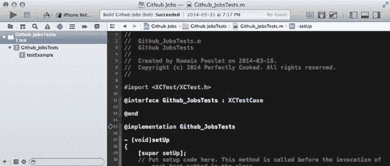

**164**

**第 9 章：将单元测试融入开发**

***图 9-1.** 默认项目模板带有一个测试目标和一个失败的测试用例*

要使一个测试用例类显示在此导航器中，它必须继承自 `XCTestCase`（`XCTest` 框架的一个类），尽管隐含的约定是给你的类一个以“Tests”结尾的名称，以便你以后更容易找到你的测试类。测试用例方法也是如此，你的方法名必须以“test”开头，并且不能返回任何值。这些是与 Xcode 集成工作的条件。

正如你所见，我们的项目不是很大，所以没有太多东西需要测试，但我们会找一些简单的东西。我们希望 web 服务返回的每个职位信息都包装到一个专用类中，以防我们变得贪心并想添加其他职位信息服务提供商。

## 为 `PCSJobOffer` 类添加测试

以防你不记得，以下是 Github Jobs API 返回的职位信息格式：

```json
{
  "url": "abced-fghij-klmnop-1234567",
  "company_logo": "http://github-jobs.s3.amazonaws.com/abced-fghij-klmnop.png",
  "company_url": "http://our-company.com",
  "id": "abced-fghij-klmnop-1234567",
  "created_at": "Wed Jun 04 20:06:50 UTC 2014",
  "title": "iOS developer",
  "location": "Bay Area, CA",
  "type": "Full Time",
  "description": "Our company is awesome.",
  "how_to_apply": "Email your resume to jobs@company.com",
  "company": "Company, Inc."
}
```

[www.it-ebooks.info](http://www.it-ebooks.info/)

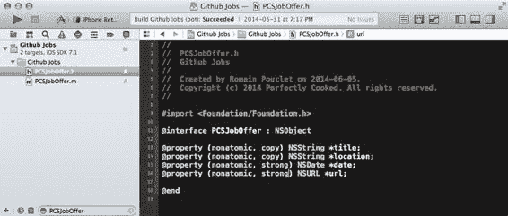

**第 9 章：将单元测试融入开发**

**165**

当然，我们不需要所有这些字段，因为我们的应用只显示标题和公司。为了举例，我们的 `PCSJobOffer` 类将包含以下字段：`title`、`location`、`date` 和 `URL`。

## 创建测试用例类

回到 Xcode 并创建这个类。点击“File”，然后选择“New ➤ File”。选择 Objective-C 类，将其命名为 `PCSJobOffer` 并保存到你的项目中。在 `PCSJobOffer.h` 文件中，添加我们之前提到的属性，如图 9-2 所示。

***图 9-2.** 包含主要属性的 PCSJobOffer 类*


目前我们不需要做其他任何事，这个类已经存在并声明了它的第一个属性，如果我们想遵循测试驱动开发（TDD）方法，这些属性可能已经足够多了。

我们只在测试用例类之前创建了实现文件，这是为了避免在 Xcode 中出现无谓的“文件未找到”和“未声明的标识符 `PCSJobOffer`”错误。

**注意：** 测试驱动开发方法（TDD）是一种广为人知的应用程序开发方式。

基本上，它的流程是先编写测试用例，然后实现所需的代码，使这些测试在实际开发过程中能够通过。如果你想了解更多关于 iOS 中的测试驱动开发，Graham Lee（又名 `@secboffin`）写了一本关于这个主题的精彩书籍，可通过以下网址获取：

[`www.amazon.com/Test-Driven-iOS-Development-Developers-Library/dp/0321774183`](http://www.amazon.com/Test-Driven-iOS-Development-Developers-Library/dp/0321774183)

[www.it-ebooks.info](http://www.it-ebooks.info/)

## 添加单元测试

现在我们已经准备好创建相关的测试用例类，以确保 `PCSJobOffer` 类在接收正确的 JSON 字典时，能够提取标题、地点、日期和 URL 属性并正确存储。让我们创建 `PCSJobOfferTests`。点击 File 菜单并选择“New ➤ File”。从模板面板中选择“Objective-C test case class”。将其命名为 `PCSJobOfferTests`，确保它是 `XCTestCase` 类的子类，当询问文件保存路径时选择“GithubJobs Tests”文件夹，然后点击“Save”按钮。顺便提一下，删除 `Github_JobsTests.m` 文件，因为它本身是一个会失败的测试用例。注意，这些测试类没有头文件，因为它们永远不会被直接调用。

在这个类中，我们只打算包含一个测试用例，以确保传递给 `PCSJobOffer` 类初始化器的 JSON 字典内容最终能生成一个正确映射的对象。我们之前提到过，在面向对象编程范式中，一个测试用例实际上是测试用例**类**中的一个**方法**。在 `PCSJobOfferTests.m` 文件中，删除自带的 `testExample` 方法，并创建一个名为 `testThatDictionaryIsProperlyMappedToProperties` 的测试方法。

测试类的命名永远不应过于冗长，尤其是在 Objective-C 中，方法签名长度达到 100 个字符并不罕见。在编写测试用例时，你必须设想自己或其他人将来可能会阅读这些测试。它们必须足够清晰明确，让人能够准确理解正在测试的内容。

一个有效的测试用例会向代码单元输入已知数据，并将方法执行的结果与预期结果进行比较。在我们的案例中，已知输入是我们之前展示的包含职位信息的 JSON，而代码单元则是 `PCSJobOffer` 初始化器。

首先，我们需要获取 JSON 数据。我们提供给这个类的输入必须是已知的。由于明显的网络延迟以及无法预测返回职位列表的精确内容，我们需要将这个 JSON 存储在一个文件中，该文件会在每次测试运行之前被加载。选择 `File ➤ New ➤ File`，从“Other”部分选择“Empty”。将文件命名为 `job.json`，并保存到 Github JobsTests 文件夹中，这样我们就能在下一节中加载它。在 `job.json` 文件中，粘贴我们之前提到的 JSON 数据。请注意，如果你正在阅读本书的纸质版，这可能会有点困难。只需记住这个项目在 Github 上可用，你可以从这里获取内容：[`github.com/Palleas/Github-Jobs/blob/master/Github%20JobsTests/job.json`](https://github.com/Palleas/Github-Jobs/blob/master/Github%20JobsTests/job.json)

注意，每个测试用例类都带有 `setUp` 和 `tearDown` 方法。这两个方法将分别在每个测试用例之前和之后被调用。这意味着我们的测试文件每次都会被加载。这看起来可能有点浪费资源，但在这种特定情况下，这不是你需要担心的问题。为 `PCSJobOfferTests` 类添加一个 `NSDictionary` 类型的 `jobPayload` 属性，并在 `setUp` 方法中编写以下代码：

```
- (void)setUp
{
    [super setUp];
    NSString *path = [[NSBundle bundleForClass: [self class]] pathForResource: @"job" ofType: @"json"];
    NSData *content = [NSData dataWithContentsOfFile: path];
    NSError *jsonError = nil;
    self.jobPayload = [NSJSONSerialization JSONObjectWithData: content options: 0 error: &jsonError];
    XCTAssertNil(jsonError, @"The Job payload should be loaded without error, got %@", jsonError);
    XCTAssertNotNil(self.jobPayload, @"The job payload should be properly loaded");
    XCTAssertTrue([self.jobPayload isKindOfClass: [NSDictionary class]], @"Job payload should be a dictionary");
}
```

我们在这里做了什么？首先，我们使用 `NSBundle` 方法获取 JSON 文件的路径。注意，我们没有使用 `[NSBundle mainBundle]` 单例，因为在这种特定上下文中，我们并不从主 bundle（即你的应用程序）中加载内容。在我们的案例中，所有与测试用例相关的内容都包含在不同的 bundle 中，这就是我们使用 `bundleForClass:` 方法的原因。然后，我们将此文件的内容加载到一个名为 `content` 的 `NSData` 类型变量中，并使用 `NSJSONSerialization` 类将这些字节数据转换为一个有效的 `NSDictionary`。

在这种场景下，我们手动加载了 JSON 数据，但如果你想要测试封装了网络调用的对象，有一些非常好的库，比如 `OHHTTPStubs`（可在 [`github.com/AliSoftware/OHHTTPStubs`](https://github.com/AliSoftware/OHHTTPStubs) 获取），它可以拦截实际的网络调用。

接下来的内容更有趣。这些以 `XCT` 开头的函数被称为断言，如果某个条件不满足（例如，对象本不该为空却为空了，或者条件本不该为 true 却为 true 了），就会抛出异常，导致该断言和测试用例标记为失败。我们现在使用这些断言，是因为我们希望测试尽早失败。没有什么比因为初始条件声明错误而导致测试失败更糟糕的了。

在 `tearDown` 方法中，添加以下代码：

```
- (void)tearDown
{
    self.jobPayload = nil;
    [super tearDown];
}
```

这里没什么特别的，我们只是在下一个测试用例运行之前，将 `jobPayload` 属性的内容重置为 nil，尽管我们知道它会在下一次执行 `setUp` 方法时被覆盖。现在我们可以编写实际的测试了。

在 `testThatDictionaryIsProperlyMappedToProperties` 方法中，添加以下代码：

```
- (void)testThatDictionaryIsProperlyMappedToProperties {
    PCSJobOffer *offer = [[PCSJobOffer alloc] initWithPayload: self.jobPayload];
    XCTAssertEqualObjects([NSURL URLWithString: @"http://jobs.github.com/positions/abced-fghij-klmnop-1234567"], offer.url, @"URL should be http://jobs.github.com/positions/abced-fghij-klmnop-1234567");
    XCTAssertEqualObjects(@"iOS developer", offer.title, @"Title of the job offer should be \"iOS developer\"");
    XCTAssertEqualObjects(@"Bay Area, CA", offer.location, @"Location of the job offer should be \"Bay Area, CA\"");
}
```

请注意，`PCSJobOffer` 类中并不存在 `initWithPayload` 这个初始化器，所以目前先创建一个空的：


```objc
- (instancetype)initWithPayload:(NSDictionary *)payload {
    self = [super init];
    if (self) {
        // 这里我们将添加一些内容
    }
    return self;
}
```

现在我们可以准备运行测试了。

## 运行测试

我们之前提到过，Xcode 对单元测试的集成可以在左侧边栏的“测试导航器”中看到。这不仅仅是一个简单的视觉指示，实际上这种集成比表面上看到的更深。如果你观察显示行号和通常添加断点的那一窄列，你会看到在 `@implementation` 符号附近和测试用例方法附近有一些小方块，如图 9-3 所示。

*图 9-3. Xcode 自动识别测试用例类和测试用例方法，让你能够轻松运行特定测试*
这些形状实际上是按钮，你可以点击它们来运行特定的测试用例或某个类中的所有测试用例。由于我们只有一个测试用例类，其中仅包含一个测试用例，因此我们可以运行所有测试。当你只有一个失败的测试用例，需要反复运行直到它通过时，这些按钮会非常有用。

打开 `Product` 菜单，选择“Test”，或者按下 **⌘U**。不出所料，测试应该会失败，并且失败的断言会在主编辑器中高亮显示，同时在测试导航器中列出，如图 9-4 所示。

*图 9-4. 失败的断言在主编辑器中高亮显示，失败的测试方法在测试导航器中显示*
我们的情况很容易解释。由于我们的类初始化器是空的，在对象初始化时，实际上并没有对提供的 `NSDictionary` 实例做任何处理。这意味着这些属性仍然包含它们的默认值，即 `nil`。我们使用 `XCTAssertEqualObjects` 断言来比较这些对象；请注意，我们也可以从 `XCTAssertNotNil` 开始，然后逐步推进。

我们在第 2 章中提到，Xcode 5 引入了一种新的导航方式，允许你从项目中的另一个类打开关联的测试用例类。打开 `PCSJobOffer.m` 文件。将光标放在 `initWithPayload:` 方法上，点击编辑器左上角的“相关文件”按钮，然后按住 `alt` 键，选择“Test Callers ➤ `[PCSJobOfferTests testThatDictionaryIsProperlyMappedToProperties]`”，这样测试文件和实现文件就可以在同一屏幕上显示。

最后，用以下代码实现 `initWithPayload:` 方法的内容，并重新运行失败的测试用例：

```objc
- (instancetype)initWithPayload:(NSDictionary *)payload {
    self = [super init];
    if (self) {
        self.title = payload[@"title"];
        self.url = [NSURL URLWithString:payload[@"url"]];
        self.location = payload[@"location"];
    }
    return self;
}
```

现在我们已经实现了 `initWithPayload:` 初始化器的内容，测试应该会通过，并且在测试用例和测试用例类的 `@implementation` 符号附近会显示一个可视标记，如图 9-5 所示。

*图 9-5. Xcode 用绿色符号显示通过的测试用例*

本节为你简单介绍了单元测试。我们创建了一个类来封装每个职位信息的 JSON 描述，这样我们就可以使用漂亮的对象，而不是不可预测的 `NSDictionary` 实例。我们先编写了测试用例，因此我们知道自己希望初始化器如何工作，然后才编写了实际的实现代码。

**注意：** 映射库：这个例子是开发者经常需要做的重复性工作的典型代表。这就是为什么如果你的应用程序大量使用远程对象，并且需要将许多描述映射到普通的 Objective-C 对象，你应该考虑使用诸如 Mantle (https://github.com/Mantle/Mantle) 或 KZPropertyMapper (https://github.com/krzysztofzablocki/KZPropertyMapper) 之类的库。

恭喜你，你已经编写了一个值得信赖的测试套件的开头部分，以后每次你想为应用程序添加功能时，都可以对它进行改进。请记住，既然你已经建立了测试套件的基础，那么你不再有任何借口不先编写测试，再编写实现代码。

请注意，我们还没有更新主视图控制器中的代码，使其使用 `PCSJobOffer` 类而不是字典。不过，这很容易做到。打开 `PCSViewController.m` 文件，更新 `NSURLSessionDataTask` 完成处理程序的内容。不要使用以下代码：

```objc
self.jobs = [NSJSONSerialization JSONObjectWithData:data options:0 error:&jsonError];
```

而是使用：

```objc
NSArray *results = [NSJSONSerialization JSONObjectWithData:data options:0 error:&jsonError];
NSMutableArray *jobs = [NSMutableArray array];
[results enumerateObjectsUsingBlock:^(NSDictionary *jobPayload, NSUInteger idx, BOOL *stop) {
    [jobs addObject:[[PCSJobOffer alloc] initWithPayload:jobPayload]];
}];
```

不要忘记更新 `tableView:cellForRowAtIndexPath:` 方法的内容，否则你会得到一个错误：

```objc
- (UITableViewCell *)tableView:(UITableView *)tableView cellForRowAtIndexPath:(NSIndexPath *)indexPath {
    PCSJobOffer *offer = self.jobs[indexPath.row];
    UITableViewCell *cell = [tableView dequeueReusableCellWithIdentifier:@"Cell" forIndexPath:indexPath];
    cell.textLabel.text = offer.title;
    return cell;
}
```

请注意，我们可以将所有这些过程包装到一个专门的类中，该类将抽象获取职位信息的整个过程，并对该类进行单元测试。这样做需要引入模拟和桩对象的概念，以调整获取数据的方式，这样我们就不会真正调用 Github 的职位接口。请记住，我们需要能够信任我们获取的数据。这已经远远超出了本书的范围。同样，你应该考虑购买 Graham Lee 的书籍，该书涵盖了所有这些概念以及更多内容。

一个好的测试套件必须具备以下品质：

-   **易于阅读**，这样你一眼就能看出当前正在测试哪个单元。没有什么比无法理解的测试套件更糟糕的了，尤其是当它们不能正确通过时。
-   **运行速度快**。如果你知道测试全部运行完需要花费一个小时，你就不会花时间去运行所有测试。当然，正如我们之前提到的，可以使用 Xcode 来运行特定的测试用例。另一方面，如果测试套件需要一个小时才能执行完毕，那么当你获得与你正在开发的功能相关的结果时，这个功能可能已经过时了。

这些品质很重要，但即使你严格遵守它们，你仍然需要运行你的测试套件。这正是你的持续集成平台的作用所在。它会自动为你运行测试套件，但要做到这一点，我们需要能够从命令行运行它们。

## 从命令行运行测试

在 Xcode 5 之前，`xcodebuild` 工具只能运行 OSX 项目的测试。这对 iOS 开发者来说是一个巨大的问题，但幸运的是，Facebook iOS 团队在首次发布 `xctool` 时修复了这个问题：

```bash
$ xctool test -sdk iphonesimulator
[Info] Collecting info for testables... (2471 ms)
run-test Github JobsTests.xctest (iphonesimulator7.1, application-test)
[Info] Installed 'com.perfectly-cooked.Github-Jobs'. (11709 ms)
```


[信息] 启动测试宿主并运行测试... (0 毫秒)

✓ `-[PCSJobOfferTests testThatDictionaryIsProperlyMappedToProperties]` (12 毫秒)

1 通过，0 失败，0 错误，总计 1 项 (12 毫秒)

** 测试成功：1 通过，0 失败，0 错误，总计 1 项 ** (27536 毫秒)

这发生在 Xcode 5 之前，仔细想想这是有道理的。该版本随第一版 XCode Bots 一同发布，这些 Bots 能够自动为你运行测试套件，我们将在本章后面部分介绍。

使用官方的 `xcodebuild` 命令行工具从命令行运行测试，需执行以下指令：

```
$ xcodebuild -workspace Github\ Jobs.xcworkspace -scheme "Github Jobs" -sdk iphonesimulator7.1 test
```

...

测试套件“所有测试”于 2014-06-06 22:17:00 +0000 启动

测试套件“Github JobsTests.xctest”于 2014-06-06 22:17:00 +0000 启动

测试套件“PCSJobOfferTests”于 2014-06-06 22:17:00 +0000 启动

测试用例“-[PCSJobOfferTests testThatDictionaryIsProperlyMappedToProperties]”已启动。

测试用例“-[PCSJobOfferTests testThatDictionaryIsProperlyMappedToProperties]”已通过 (0.019 秒)。

测试套件“PCSJobOfferTests”于 2014-06-06 22:17:00 +0000 完成。

执行了 1 个测试，0 个失败（0 个意外）在 0.019 (0.019) 秒内

测试套件“Github JobsTests.xctest”于 2014-06-06 22:17:00 +0000 完成。

执行了 1 个测试，0 个失败（0 个意外）在 0.019 (0.019) 秒内

测试套件“所有测试”于 2014-06-06 22:17:00 +0000 完成。

执行了 1 个测试，0 个失败（0 个意外）在 0.019 (0.022) 秒内

** 测试成功 **

这个命令我们之前已经介绍过。它需要指定工作区和方案路径；以及一个新增的“sdk”参数，你应该能猜到它的用途。如果需要列出电脑上可用的 sdk，只需运行以下命令：

```
$ xcodebuild -showsdks
```

OS X SDK:

OS X 10.8 -sdk macosx10.8

OS X 10.9 -sdk macosx10.9

iOS SDK:

iOS 7.1 -sdk iphoneos7.1

iOS 模拟器 SDK:

模拟器 - iOS 7.1 -sdk iphonesimulator7.1

[www.it-ebooks.info](http://www.it-ebooks.info/)

**第 9 章：将单元测试融入其中**

**173**

这意味着你可以轻松地多次运行 `xcodebuild`，使用不同的 SDK 来比较结果，并确保你的应用在你所针对的所有 iOS 版本上都能正常运行。

当苹果发布新版本的 iOS 时，这就更加方便了。如果你确保在 beta 版本一发布时就下载，就能轻松修复因版本变更导致的回归问题。

我们的构建脚本已经使用了 `xcpretty`，这是一个简单的工具，它能获取 `xcodebuild` 命令的输出，并以更易读的方式显示出来。我们之前没有贴出这部分，但实际上从命令行运行测试是从构建应用开始的，这意味着你会得到 Xcode 的完整输出，而这些输出我们并不太关心。

让我们看看如何使用 XCPretty 来格式化结果，以便以后在我们的持续集成环境中使用。

## 分析结果

到目前为止，我们以最简单的方式使用了 XCPretty，但如果你查看命令的描述，实际上有几个参数我们可以用来格式化结果并在后续使用。现在，我们先使用 `--test` 参数。

```
$ xcpretty
[!] 用法: xcodebuild [选项] | xcpretty
    -t, --test                       使用 RSpec 风格输出
    -s, --simple                     使用简单输出（默认）
    -k, --knock                      使用 knock 风格输出
        --tap                        使用 TAP 格式输出
    -f, --formatter PATH             使用指定 Ruby 文件评估返回的格式化程序
    -c, --color                      使用彩色输出
        --no-utf                     在输出中禁用 Unicode 字符
    -r, --report FORMAT              运行 FORMAT 报告器
        选项: junit, html, json-compilation-database
    -o, --output PATH                将报告输出写入指定路径
    -h, --help                       显示此消息
    -v, --version                    显示版本
```

经过 XCPretty 转换后的默认输出是 rspec，这是一种用于 Ruby 编程语言的测试工具。它不会显示任何构建日志，因为你可能并不关心这些，它只显示一系列点和其他符号作为结果。


`$ xcodebuild -workspace Github\ Jobs.xcworkspace -scheme "Github Jobs" -sdk iphonesimulator7.1`

`clean test | xcpretty -ct`

```
.
Executed 1 test, with 0 failures (0 unexpected) in 0.001 (0.001) seconds
```

这让一切变得清晰多了，特别是当你每天手动多次运行测试时，一堆构建日志确实会妨碍“让我们让这些测试通过”的工作流程。

另一方面，这并非我们的最终目标。我们想要找到一种方法，将测试集成到我们选择的持续集成平台中。

[www.it-ebooks.info](http://www.it-ebooks.info/)

**174**

## 第 9 章：将单元测试纳入体系

`Xcodebuild` 与所有其他命令行工具并无不同。和它们一样，这个命令行工具在退出时会返回一个状态码，任何非零状态码都应被视为错误。下面，我们使用任何命令执行后 bash 中可用的 `$?` 变量，来看一个典型的 `xcodebuild test` 命令返回的错误码：

```
$ xcodebuild -workspace Github\ Jobs.xcworkspace -scheme "Github Jobs" -sdk iphonesimulator7.1
clean ...

** TEST SUCCEEDED **

$ echo "Exit code was $?"
Exit code was 0
```

当测试成功时，`xcodebuild` 会按预期退出并返回 0。现在我们来让测试失败。打开 `PCSJobOffer.m` 文件，将把标题赋值给同名对象属性的那一行替换为以下代码（完成后别忘了将文件恢复原样）：

```
self.title = @"No job title for you!";
```

然后，使用完全相同的命令重新运行测试，并查看退出码：

```
$ xcodebuild -workspace Github\ Jobs.xcworkspace -scheme "Github Jobs" -sdk iphonesimulator7.1
clean test

Test Suite 'All tests' started at 2014-06-07 22:56:54 +0000
Test Suite 'Github JobsTests.xctest' started at 2014-06-07 22:56:54 +0000
Test Suite 'PCSJobOfferTests' started at 2014-06-07 22:56:54 +0000
Test Case '-[PCSJobOfferTests testThatDictionaryIsProperlyMappedToProperties]' started.
/Users/Palleas/Projects/Apress/Github Jobs/Github JobsTests/PCSJobOfferTests.m:44: error:
-[PCSJobOfferTests testThatDictionaryIsProperlyMappedToProperties] : ((@"iOS developer") equal to (offer.title)) failed: ("iOS developer") is not equal to ("pouet") - Title of the job offer should be "iOS developer"
Test Case '-[PCSJobOfferTests testThatDictionaryIsProperlyMappedToProperties]' failed (0.017 seconds).
Test Suite 'PCSJobOfferTests' finished at 2014-06-07 22:56:54 +0000.
Executed 1 test, with 1 failure (0 unexpected) in 0.017 (0.017) seconds
Test Suite 'Github JobsTests.xctest' finished at 2014-06-07 22:56:54 +0000.
Executed 1 test, with 1 failure (0 unexpected) in 0.017 (0.017) seconds
Test Suite 'All tests' finished at 2014-06-07 22:56:54 +0000.
Executed 1 test, with 1 failure (0 unexpected) in 0.017 (0.094) seconds

** TEST FAILED **

$ echo $?
```

当你从事 iOS 编程并使用命令行一段时间后，65 是一个众所周知的退出码，它并不局限于测试执行。实际上，官方文档对“sysexits”（一个列出了“程序推荐退出码”的文件）是这样描述的：**EX_DATAERR** (65) 输入数据在某些方面不正确。这个错误码应仅用于用户数据，而不是系统文件。

如果第 4 章关于命令行威力的内容说服了你更多地使用它，那么请准备好经常遇到这个家伙：当 `xcodebuild` 无法构建你的应用程序时，基本上返回的都是这个错误码。

[www.it-ebooks.info](http://www.it-ebooks.info/)

**第 9 章：将单元测试纳入体系**

**175**

现在我们知道了 `xcodebuild` 在构建失败时会返回一个非零状态码，让我们把 `xcpretty` 加入进来，看看会发生什么：

```
$ xcodebuild -workspace Github\ Jobs.xcworkspace -scheme "Github Jobs" -sdk iphonesimulator7.1
clean test | xcpretty -t

...

** TEST FAILED **

$ echo "Exit code was $?"
Exit code was 0
```

这里发生的事情其实很简单：当你在命令行执行中使用管道时，最终的退出码实际上是管道中最后一个命令的退出码，因为它是最后执行的命令。无法从 `xcodebuild` 获取退出码会让我们根本无法使用 `xcpretty`，但幸运的是，bash 还提供了另一个超级有用的内部变量，名为 `PIPESTATUS`。

根据文档，这个变量是一个“数组变量，用于存放最后执行的前台管道中各命令的退出状态。”这意味着，在我们的例子中，`xcodebuild` 命令的退出状态是这个数组的第一个元素，可以像这样获取。

```
$ xcodebuild -workspace Github\ Jobs.xcworkspace -scheme "Github Jobs" -sdk iphonesimulator7.1
clean test | xcpretty -t

...

** TEST FAILED **

$ echo "xcodebuild exit code was ${PIPESTATUS[0]}"
xcodebuild exit code was 65
```

最后，我们需要做的是确保退出值始终是 `xcodebuild` 执行返回的那个值，这可以通过使用 `exit` 命令来实现，它的作用是退出当前 shell，并将第一个参数提供的状态码作为退出码，就像这样：

```
$ xcodebuild -workspace Github\ Jobs.xcworkspace -scheme "Github Jobs" -sdk iphonesimulator7.1
clean test | xcpretty -t && exit ${PIPESTATUS[0]}
```

我们终于得到了一个在持续集成测试安装中执行测试的完美命令，但这还不够。确实，当一次测试运行失败时，我们想要知道具体是哪个测试用例失败了，否则这个反馈就没有意义。当然，你可以简单地在 Jenkins 或 Bamboo 中查看构建日志，但把时间花在寻找导致测试失败的代码片段上会更有价值。你实际需要的是能够查看构建结果并直接看到测试结果。为此，你需要将测试套件的结果导出为你的持续集成平台能够理解的格式。幸运的是，Java 社区很久以前就解决了这个问题，当时 JUnit（一个用于 Java 编程语言的单元测试框架）首次被集成到持续集成平台中。更妙的是，`xcpretty` 能够为我们生成这种报告。

```
$ xcodebuild -workspace Github\ Jobs.xcworkspace -scheme "Github Jobs" -sdk iphonesimulator7.1
clean test | xcpretty -t -r junit && exit ${PIPESTATUS[0]}
```

[www.it-ebooks.info](http://www.it-ebooks.info/)

**176**

## 第 9 章：将单元测试纳入体系

执行完这个命令后，会在 `build/reports/` 文件夹中生成一个 XML 文件，这很方便，因为我们已经在把构建过程中产生的所有内容（应用程序、dSYM...）都放在这个文件夹里了。打开这个文件夹，查看一下 `junit.xml` 文件。

```
<?xml version='1.0' encoding='UTF-8'?>
<testsuites tests='1' failures='1'>
<testsuite name='PCSJobOfferTests' tests='1' failures='1'>
<testcase classname='PCSJobOfferTests' name='testThatDictionaryIsProperlyMappedToProperties'>
<failure message='((@&quot;iOS developer&quot;) equal to (offer.title)) failed: (&quot;iOS
developer&quot;) is not equal to (&quot; No job title for you!&quot;) - Title of the job offer should be &quot;iOS developer&quot;'>Github JobsTests/PCSJobOfferTests.m:44</failure>
</testcase>
</testsuite>
```

这个文件实际上并不是人类可读的，但这并不是重点，重点是这是大多数持续集成平台所期望的格式。那么，让我们从 Jenkins 运行测试套件吧！请注意，我们也会将这个测试套件作为 Bamboo 构建计划的一部分，所以如果你不太关心 Jenkins，可以直接跳到那部分。

## 从 Jenkins 运行测试


打开`Jenkins`，使用之前创建的用户进行身份验证，并导航到“`Github Jobs for iOS`”配置部分。回顾到目前为止的实现，我们的任务调用了之前编写的构建脚本，该脚本负责处理所有事宜。它还会在构建结束时检索生成的`IPA`文件，并将其上传到`Testflight`。这已经是一个相当不错的配置，但我们希望获得更多反馈。现在，我们希望运行测试。

我们的构建脚本已经负责安装依赖项，由于`Jenkins`不像`Bamboo`那样为一个计划设置多个任务，我们只需在构建和打包应用程序的步骤之后运行测试套件即可。为此，添加一个“执行`shell`”构建操作，并在命令字段中输入我们之前完善的命令：

```
$ xcodebuild -workspace Github\ Jobs.xcworkspace -scheme "Github Jobs" -sdk iphonesimulator7.1
clean test | xcpretty -t –r junit && exit ${PIPESTATUS[0]}
```

然后，向下滚动到构建后操作，点击“添加构建后操作”并选择“发布`JUnit`测试结果报告”。我们已经知道导出的`JUnit`结果报告的默认路径是`build/reports/junit.xml`，因此在“测试报告`XML`”字段中填写`**/build/reports/junit.xml`，然后点击“保存”。

在开始构建之前，更新`PCSJobOffer`类以确保测试不会通过。我们可以使用之前做的小改动，在将`title`属性的内容硬编码为“`No job title for you!`”时使测试失败。提交该更改，将此提交推送到远程仓库，然后在`Jenkins`上启动构建。如果一切按预期进行，构建应该会失败。

这意味着当测试未通过时，整个构建将被标记为失败。在我们的案例中，将所有内容捆绑到一个简单的构建中，是因为我们正在处理的项目非常简单。如果你想将运行测试的部分与构建应用程序并发送给测试人员的部分分开，完全可以这样做。你只需创建一个新的`Jenkins`任务即可！

[www.it-ebooks.info](http://www.it-ebooks.info/)

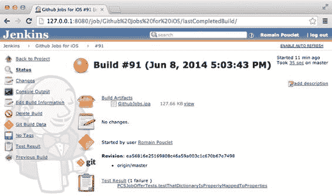

**第 9 章：将单元测试纳入流程**

**177**

打开刚刚运行的构建的详细信息，如图 9-6 所示。详细信息列表中添加了一个新条目，显示了关于`git`修订版等的所有信息：测试结果。如您所见，它可以让你大致了解哪个测试失败了。请注意，此条目在“`Github Jobs for iOS`”主构建页面上也是可见的。

***图 9-6.** 刚刚运行的构建的详细信息显示了失败的测试列表*

当然，您可能希望了解关于测试失败原因的更多细节。毕竟，这个测试用例中可能有多个断言失败。为此，只需点击“测试结果”链接，然后点击“`PCSJobOfferTests.testThatDictionaryIsProperlyMappedToProperties`”旁边的加号以及“堆栈跟踪”旁边的加号来展开测试部分。如图 9-7 所示，您可以直接看到测试失败的原因。

[www.it-ebooks.info](http://www.it-ebooks.info/)

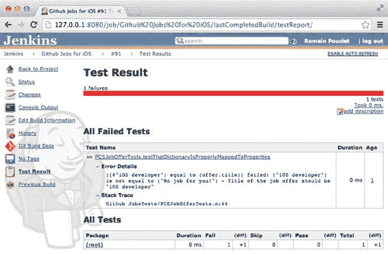

**178**

**第 9 章：将单元测试纳入流程**

***图 9-7.** 测试报告详细显示了哪个测试失败及其原因*

关于从像`Jenkins`这样的持续集成平台运行单元测试，需要了解的内容基本上就是这些，这主要是因为我们已经有了一个之前配置好的任务，并且我们使用了像`xcpretty`这样出色的工具来处理困难的工作。在接下来的部分中，我们将了解如何从`Bamboo`以及使用`Xcode`机器人运行测试。

## 从`Bamboo`运行测试

同样，`Bamboo`的开发人员在运行测试操作时采用了一种稍显复杂的方法。事实上，配置计划的“阶段”部分是这样说的：*计划中的每个阶段代表构建过程中的一个步骤。一个阶段可以包含一个或多个`Bamboo`可以并行执行的任务。例如，您可能有一个用于编译任务的阶段，接着是一个或多个用于各种测试任务的阶段，然后是一个用于部署任务的阶段。*

既然我们已经配置了一个构建任务和一个部署任务，那么让我们添加一个测试任务！这正是我们之前提到的将整个持续集成过程拆分为多个任务的做法。

[www.it-ebooks.info](http://www.it-ebooks.info/)

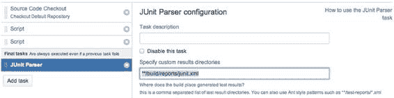

**第 9 章：将单元测试纳入流程**

**179**

点击“添加任务”按钮，然后选择“克隆现有任务”，这样您就不必重新输入关于要克隆的仓库的所有信息。在“任务名称”字段中填写“`Automated testing`”，然后点击“创建任务”。在列表中点击“`Automated Testing`”任务，并删除两个脚本构建阶段（即构建应用程序和压缩`dSYM`文件夹的阶段），因为我们不需要它们。

添加第一个脚本任务来为我们安装依赖项。在“任务描述”字段中输入“`Installing the dependencies`”，在“脚本主体”字段中输入“`pod install`”，然后点击“保存”。添加第二个脚本任务来实际执行测试。在“任务描述”字段中输入“`Running the test suite`”，在“脚本主体”字段中输入我们之前使用的命令（就像在`Jenkins`上所做的那样），然后点击“保存”。

```
xcodebuild -workspace "Github Jobs.xcworkspace" -scheme "Github Jobs" -sdk iphonesimulator7.1 clean test | xcpretty -t -r junit && exit ${PIPESTATUS[0]}
```

最后，添加一个“`JUnit`解析器”任务来查找`junit xml`报告。在“任务描述”字段中输入“`Parsing the JUnit test reports`”，在“自定义结果目录”字段中输入“`**/build/reports/junit.xml`”，然后点击“保存”。我们在关于`Bamboo`的章节中提到过，与`Jenkins`一样，任务是顺序运行的。目前，`JUnit`任务紧跟在运行测试套件的脚本任务之后。这意味着当测试失败时（就像现在这样），归档`Junit`报告的任务将不会执行。要解决此问题，将“`Junit Parser`”任务拖到“最终任务”部分，如图 9-8 所示。

***图 9-8.** `JUnit Parser`任务必须移动到最终任务部分，否则当测试失败时它将不会运行*

准备就绪后，运行整个“`Github Jobs for iOS`”计划：它将运行构建和打包应用程序的任务，以及运行测试套件并发布报告的任务。在“`Automated Testing`”任务运行完毕后点击它，然后选择“测试”选项卡。如图 9-9 所示，它显示了失败测试的详细信息。更棒的是（这也是使用`Atlassian`公司产品的好处之一），您可以直接从那个特定的失败测试用例创建`Jira`问题。

[www.it-ebooks.info](http://www.it-ebooks.info/)

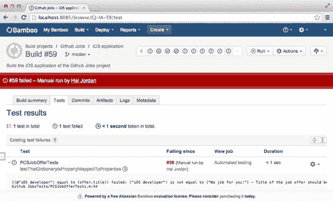

**180**

**第 9 章：将单元测试纳入流程**

***图 9-9.** 测试报告可从构建详细信息页面的选项卡中获取*

我们已经介绍了两个持续集成平台，接下来让我们再使用苹果的持续集成解决方案——`XCode`机器人——运行一次测试。

## 使用`Xcode`机器人运行测试

我们已经创建了一个机器人，其唯一目的是构建应用程序，然后将其存档以便用户可以下载。这个机器人名为“`Github Jobs (nightly build)`”，并且每天凌晨 1:00 运行一次。我们可以简单地将测试执行添加到其任务列表中，但我们将创建一个新的机器人，以便每次我们向远程仓库推送新提交时运行单元测试。


在 Xcode 中打开 `Github Jobs` 项目，进入 Product 菜单，利用已有的知识创建一个机器人（bot），该机器人将在每次有新提交推送到远程仓库时运行（轮询间隔为 5 分钟），并仅选择“执行测试操作”任务。上次我们创建的机器人仅用于构建和归档应用程序，而现在我们只需要测试。因此，如图 9-10 所示，Xcode Service 能够在多个设备和模拟器上运行测试，这对于确保与 32 位或 64 位架构相关的错误不复存在来说非常方便。

[www.it-ebooks.info](http://www.it-ebooks.info/)

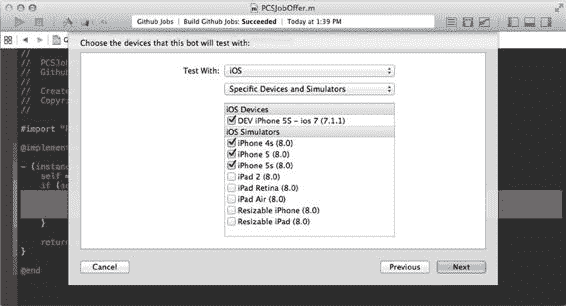

**第 9 章：将单元测试纳入其中**

**181**

***图 9-10.** Xcode 服务允许您在多台设备上运行测试* 请注意，此界面不仅支持模拟器，也适用于真实设备。实际上，“设备”组合框中提供了多个选项，允许您针对所有 iOS 设备或所有 iOS 模拟器运行测试套件。当然，您不一定有多个备用设备可以一直插在负责运行所有测试的计算机上。例如，您可能在白天使用几台测试设备。这时，夜间构建就会派上用场：创建一个机器人在白天针对所有模拟器运行测试，再创建另一个机器人在夜间针对真实设备运行测试。创建机器人非常简单，只需几分钟，何不充分利用这个功能呢？

当机器人完成测试套件的运行后，从 Xcode 或浏览器中打开集成的详细信息，查看结果。不出所料，测试在所有模拟器上均告失败，如图 9-11 所示。请记住，在撰写本书时 Xcode 6 仍处于测试阶段，因此请忽略此图中显示的两个错误。

[www.it-ebooks.info](http://www.it-ebooks.info/)

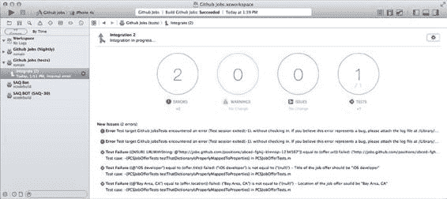

**182**

**第 9 章：将单元测试纳入其中**

***图 9-11.** Xcode 服务网页界面显示了失败测试的详细信息* 公平地说，对于其他持续集成平台，我们本可以直接配置它们，使其使用不同的模拟器多次运行。不过，那样会花费更多时间，而且结果也会不够清晰。但这再次体现了使用专属于一个平台的持续集成工具的优势之一。

## 总结

本章我们介绍了单元测试这一并非全新的概念。尽管从 Xcode 2 版本开始您就能编写和运行单元测试，但直到三个大版本之后，Apple 才将其提升为开发过程中的一等公民。现在创建项目时无法不包含单元测试，您可以轻松运行非常具体的测试用例，并且只需点击几下即可从持续集成平台自动运行测试。

首先，我们讨论了什么是单元测试，以及它如何能帮助您在回家时比仅依赖个人技能来确保产品稳定性多一份安心。随后，我们更新了 Bamboo 和 Jenkins 上的持续集成流程，并创建了一个专门的 Xcode Bot。

下一章将涵盖我们持续集成安装所提供的反馈的最后一环：质量保证。

[www.it-ebooks.info](http://www.it-ebooks.info/)

# 第 10 章

## 质量保证

让我们回顾一下前几章所做的事情。我们构建了一个非常简单的应用程序，用于检索纽约的 iOS 职位简短列表，并在 Safari 浏览器中显示职位详情。然后，我们学习了如何仅使用 Xcode 和 iTunes 将应用程序手动发布给团队——尽管我们承认这不是个好主意。最后，我们介绍了如何从命令行构建应用程序，以便使用几种主流的持续集成平台（Jenkins 和 Bamboo，即开源解决方案与企业级解决方案的对比）按固定计划构建应用程序。我们还向您介绍了 Apple 随 Xcode 5 发布的工具：用于 OS X Server 的 Xcode 服务和 Xcode Bots。最终，我们通过自动运行项目中的测试套件，将持续集成提升到了新水平。本章将介绍最后一个概念：质量保证，这是您的持续集成平台能够提供的另一种反馈。

首先，我将解释质量保证的含义，以及它如何对您和您的项目有所帮助。

随后，我们将讨论在**不运行代码**的情况下对其进行分析操作，即所谓的**静态分析**。事实上，市面上有多种工具可以帮助您追踪复杂的代码片段和其他未使用的变量。

## 什么是质量保证？

您的持续集成部署能让您知道应用程序是否成功构建、测试是否运行，但它并不能指示您为某个功能或缺陷修复所编写的代码是否损害了产品。这并不意味着您没有犯下错误，比如因为一个放错位置的 `goto` 指令而跳过了关键的安全检查。这也不意味着您声明了一个变量却忘记使用，或者忘记在 `if` 语句中放入某些代码。

“损害”这个词听起来可能有点重，但请设想一下，六个月后，某个开发者不得不回头研究这段代码，因为你的方法里嵌套了 17 层 `if` 语句而抓狂。世上没有完美的代码，即使是一位有着 20 年 Objective-C 经验的开发者也会犯错。这就是质量保证工具派上用场的地方。由于它们是自动化的，关于对错的争论就不复存在了。它们只是遵循一套规则，执行特定的分析，并向您提供一份报告。正因如此，您**不会**因为代码过于复杂而**183**

[www.it-ebooks.info](http://www.it-ebooks.info/)

**184**

**第 10 章：质量保证**

导致自动构建失败，不会因为有几行超过 200 个字符的代码就导致构建失败，当然也不会因为没有对 100% 的代码进行单元测试而导致构建失败。它们只会为您提供另一种反馈，帮助您编写更好的代码。

### 静态分析

如果您从事 iOS 开发足够久，可能已经听说过 LLVM（原名“低级虚拟机”）和 Clang 这类东西。简单来说，Clang 是一个依赖于 LLVM 的工具。它附带了许多便捷功能，如编译、重构，当然还包括对代码进行**静态分析**。让我们看看它是如何工作的。

首先，您需要理解，进行静态分析并非只有一种方法，因为这个词仅表示在不实际运行代码的情况下对其进行分析。这与逻辑上称之为“动态分析”的方式正好相反。静态分析生成的警告类似于您在 Xcode 中尝试将 `NSArray` 存储到声明为 `NSString` 的属性时得到的警告。这些都是编译器警告，其精神本质相同。当然，它们可以检测出像这样简单的问题，但随着它们的演进，静态分析工具通过开始推断代码的语义，将工作又推进了一步。


它们现在能够检测潜在的代码缺陷，从而减少你可能需要编写的冗余单元测试数量，让你专注于那些真正测试**你代码**（而非平台）的测试用例。

静态分析需要考虑的缺点很少。首先，这些工具通常比简单的编译运行得更慢，这是有充分理由的：它们不仅仅是转换代码，而是试图在其中定位潜在的缺陷。这需要对解析后的代码运行复杂算法，而这会花费你的时间。

此外，这些工具并非魔法，它们只能检测出已被编程设定要查找的缺陷。

它们也并非完美无缺，有时会将完全正常的代码行误判为缺陷。这些被称为**“误报”**，必须予以报告，以便让工具变得更好、更值得信赖。

基于所有这些原因，静态分析工具不应导致你的构建失败，但这并不意味着它们没有帮助：再说一次，没有银弹，但我们目前展示过的工具也并非银弹。

让我们对我们为`Github Jobs`的`iOS`应用编写的代码执行一次简单的静态分析。

目前，你只需要使用命令行。

### 使用 clang 执行简单的静态分析

`Clang`作为`Xcode`命令行工具提供的开发者工具之一而自带，你已经安装了这些工具，要么是因为你需要像`make`这样的命令来安装`homebrew`，要么仅仅是因为我们在命令行的章节中友好地要求你这样做。然而，它并没有附带静态分析工具，你需要手动下载。

有一个专门的章节介绍基于`Clang`的静态分析工具，可在以下网址找到：

[`clang-analyzer.llvm.org/`](http://clang-analyzer.llvm.org/)。请导航至该网站下载最新的可用二进制文件。在我们编写本书时，最新的版本是 #276，发布于 2014 年 2 月 19 日。

[www.it-ebooks.info](http://www.it-ebooks.info/)

**第 10 章：质量保证**

**185**

将归档文件下载并解压到你选择的文件夹中（我们将它放到`Tools`文件夹中）。在这里你将找到运行实际分析的`scan-build`二进制文件。

```
$ cd ~/Tools
$ curl -O http://clang-analyzer.llvm.org/downloads/checker-276.tar.bz2
$ tar -zxvf checker-276.tar.bz2
$ cd checker-276
$ ./scan-buid –h
用法：scan-build [选项] <构建命令> [构建选项]
分析器构建版本：checker-276 (2014-02-18 22:53:01)
...
```

你必须将`scan-build`命令视为某种代理，因为它的工作方式如此。这个命令最简单的用法是`scan-build xcodebuild`。它会构建应用程序，并使用`xcodebuild`命令的输出来了解要分析哪些文件。你现在可能已经熟悉了从命令行构建应用程序的命令。只需在该命令的开头调用`scan-build`。在执行之前，你应该将`~/Tools/checker-276`文件夹添加到`PATH`环境变量中，以便让事情更简单。为了练习起见，我们现在保留命令中的完整路径。该命令将按预期运行，你只会看到`scan-build`相关的指令出现在`xcodebuild`指令的前后。

```
$ ~/Tools/checker-276/scan-build xcodebuild -workspace Github\ Jobs.xcworkspace -scheme Github\ Jobs clean build
scan-build：正在使用 '/Users/Palleas/Tools/checker-276/bin/clang' 进行静态分析
来自命令行的构建设置：
    CLANG_ANALYZER_EXEC = /Users/Palleas/Tools/checker-276/bin/clang
    CLANG_ANALYZER_OTHER_FLAGS =
    CLANG_ANALYZER_OUTPUT = plist-html
    CLANG_ANALYZER_OUTPUT_DIR = /var/folders/1v/d8vqkw8x23ndw49f5vs3fzw00000gn/T/scan-
build-2014-06-13-225334-95796-1
    RUN_CLANG_STATIC_ANALYZER = YES
Xcodebuild 经典输出...
** 构建成功 **
以下命令产生了分析器问题：
    分析浅层 Github\ Jobs/PCSViewController.m
    （1 个命令存在分析器问题）
```


`scan-build: 发现 1 个错误。`

`scan-build: 运行 'scan-view /var/folders/1v/d8vqkw8x23ndw49f5vs3fzw00000gn/T/scan-build-2014-06-13-225403-95826-1' 查看错误报告。`

第一个代码块很重要。其中包含了一些可以被使用或覆盖的构建设置，就像我们之前用 `xcodebuild` 命令和 `CONFIGURATION_BUILD_DIR` 设置所做的那样。第一个设置显示了正在使用的 Clang 可执行文件的路径。Clang 的静态分析工具自带了一个版本的 Clang，正如你在解压后的文件夹中的 `bin` 子目录里看到的那样。

[www.it-ebooks.info](http://www.it-ebooks.info/)

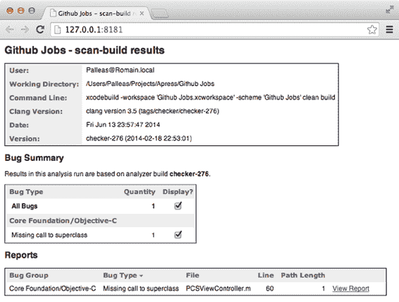

**186**
**第 10 章：质量保证**

你可以使用 `--use-analyzer` 选项轻松覆盖此设置，例如，用于在 Xcode 中日常工作时使用完全相同的编译器：

```
$ ~/Tools/checker-276/scan-build --use-analyzer=Xcode xcodebuild -workspace Github\ Jobs.xcworkspace -scheme Github\ Jobs clean build
```

`scan-build: 正在使用 '/Applications/Xcode.app/Contents/Developer/Toolchains/XcodeDefault.xctoolchain/usr/bin/clang' 进行静态分析`

来自命令行的构建设置：

`CLANG_ANALYZER_EXEC = /Applications/Xcode.app/Contents/Developer/Toolchains/XcodeDefault.xctoolchain/usr/bin/clang`

通过使用 `Xcode` 而不是 Clang 可执行文件的实际路径，`scan-build` 将使用 `xcrun` 来定位 Xcode 所使用的 Clang 可执行文件的完整路径。

另两个重要参数是关于命令输出的：`CLANG_ANALYZER_OUTPUT` 和 `CLANG_ANALYZER_OUTPUT_DIR`。它们分别包含需要生成的报告类型以及报告的存储路径。事实上，命令执行后显示的输出指出了在哪里可以找到这份报告。事实证明，我们为 Github Jobs 应用程序编写的代码包含一个错误。让我们看一下生成的报告。如显示所示，你只需要调用 `scan-view` 命令。该命令的默认行为是在你的计算机上启动一个 Web 服务器，并以适当格式打开报告，如图 10-1 所示。

***图 10-1.** Clang 静态分析器生成的格式化报告显示了一个错误*

[www.it-ebooks.info](http://www.it-ebooks.info/)

**第 10 章：质量保证**
**187**

老实说，我们在编写本书时并没有预料到这个错误，但这却是一个很好的机会，让我们看到了使用静态分析器的好处。我们确实忘了调用 `[super viewWillAppear]`。这并不太重要，因为我们没有继承像 `UINavigationController` 这样的容器视图控制器。实际上，`viewWillAppear` 声明附近的注释是这样写的：

```
// Called when the view is about to made visible. Default does nothing
```

更有趣的是，当你使用最新稳定版 Xcode 5.1.1 (5B1008) 提供的 Clang 可执行文件时，这个错误不会被检测到。这就是我们在第 2 章提到 Xcode 中 Git 集成时讨论的问题。由于苹果的发布流程缓慢，你很容易在开发者工具方面落后一步。事实上，如果你查看我们现在使用的 Clang 最新版本的更新日志（可在 [`clang-analyzer.llvm.org/release_notes.html`](http://clang-analyzer.llvm.org/release_notes.html) 获取），你会看到以下内容：

> *新增了一个“缺少对 super 的调用”警告，用于查找 iOS/OS X API 中需要链式调用父类方法实现的常见模式。*

平心而论，在编写本书时仅作为测试版发布的 Apple Xcode 6 附带了最新版本的 Clang，并支持这些新功能。我们已经讨论过 `xcrun` 工具和 `DEVELOPER_DIR` 环境变量，因此你应该能够检查两个 Clang 可执行文件的版本。

这份报告是以人类可读的方式生成的。当然，计算机也可以轻松解析它，以便将其集成到你的持续集成平台中，毕竟这是非常简单的 HTML 代码。

不过还有另一种方法。分析结果可以导出为……没错：plist 文件。你可以使用 `-plist` 选项来跳过 HTML 报告文件的生成，因为默认导出格式会同时生成 plist 文件和 HTML 文件。你也可以使用 `-o` 选项来决定报告的存储位置，而不是使用临时文件夹：

```
$ scan-build -plist -o build xcodebuild -workspace Github\ Jobs.xcworkspace -scheme Github\ Jobs clean build
```

命令运行完毕后，你可以导航到报告目录，然后一直找到 `PCSViewController.plist` 文件，即可轻松找到与 `PCSViewController` 类相关的报告。该文件将包含以下格式描述的异常列表：

```
<dict>
  <key>kind</key>
  <string>event</string>
  <key>location</key>
  <dict>
    <key>line</key><integer>60</integer>
    <key>col</key><integer>1</integer>
    <key>file</key><integer>0</integer>
  </dict>
  <key>depth</key>
  <integer>0</integer>
  <key>extended_message</key>
  <string>UIViewController 子类 'PCSViewController' 中的实例方法 'viewWillAppear:' 缺少对 [super viewWillAppear:] 的调用</string>
  <key>message</key>
  <string>UIViewController 子类 'PCSViewController' 中的实例方法 'viewWillAppear:' 缺少对 [super viewWillAppear:] 的调用</string>
</dict>
```

正如你所料，这种格式更容易被其他软件（例如 Xcode）解析和分析。问题是，如果你在自己电脑上运行的静态代码分析结果与持续集成平台上运行的结果不同，那么在持续集成平台上运行静态代码分析就没有意义了。幸运的是，检查器归档文件中包含一个专门为此目的设计的命令，叫做 `set-xcode-analyzer`。

就像在全局级别更改开发者目录路径的 `xcode-select` 命令一样，此命令必须以超级用户身份运行。关闭 Xcode 并运行以下命令：

```
$ sudo set-xcode-analyzer --use-checker-build=/Users/Palleas/Tools/checker-276
(+) 使用检查器构建附带的 Clang：/Users/Palleas/Tools/checker-276
(+) 在以下位置搜索 xcspec 文件：/Applications/Xcode.app/Contents
(+) 正在处理：/Applications/Xcode.app/Contents/PlugIns/Xcode3Core.ideplugin/Contents/SharedSupport/Developer/Library/Xcode/Plug-ins/Clang LLVM 1.0.xcplugin/Contents/Resources/Clang LLVM 1.0.xcspec
```

此命令将定位 Xcode 规范文件（`xcspec`）的路径，并更改到你想要使用的静态分析器所在目录的路径。这有几个目的。第一个目的当然是能够在自己的 Xcode 版本中使用最新版本的分析器，从而获得相同的结果。第二个更重要的目的是，由于 OS X Server 的 Xcode 服务需要指向有效 Xcode 开发者目录的路径，你将能够通过 Xcode Bot 始终使用最新版本的静态分析器来运行静态分析！既然我们已经了解了它的工作原理，现在让我们更新上一章创建的、运行单元测试的 Bot，让它也运行静态代码分析。

#### 从 Xcode Bot 执行静态分析

打开我们之前创建的 Github Jobs（夜间构建）Bot 的设置，将其名称更改为简单的 `Github Jobs`。导航到 `Schedule` 步骤，勾选 `Perform analyze action`，然后按下 `Save`。按下 `integrate` 手动启动 Xcode Bot，等待其完成。如图 10-2 所示，发现了一个错误，但分析并未因此导致构建失败。

[www.it-ebooks.info](http://www.it-ebooks.info/)

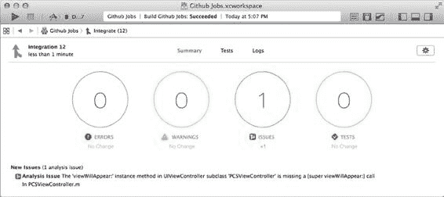

**第 10 章：质量保证**
**189**


***图 10-2.** 集成已完成。构建成功，但静态分析器发现了一个错误* 这样一来，只要你将更改推送到远程仓库，每 5 分钟测试套件就会像之前一样运行，而且得益于 Clang 静态分析，你还能收到关于代码的反馈。

现在你已经能够充分利用你的 Xcode bot：运行测试、进行静态分析以及归档构建。既然在 Xcode 中创建 Xcode bot 如此简单（当然，除了 CocoaPods 那部分），实在没有理由不使用它们。

在像 Jenkins 和 Bamboo 这样的其他持续集成平台上集成使用 Clang 的静态分析也同样简单。有一个 Jenkins 插件可以实现这一点，尽管它自 2013 年 3 月以来就未更新过，所以你只能祈祷最新版本的 Clang 静态分析器中报告格式没有太大变化。目前似乎还没有用于 Bamboo 的插件，但仔细想想，集成它也并不困难。它只需要调用特定的命令行指令并归档结果，这些结果就是简单的 HTML“构建产物”。然后你可以创建一个部署流程，将这些结果发布到专用的 Web 服务器上。

由于展示如何从 Bamboo 构建中执行命令行指令并无新意，我们将向你介绍另一款静态分析器：`oclint`。

### 使用 OCLint 获取额外反馈

我们之前提到过，静态分析工具分为不同类型，因为“静态”一词仅表示分析是在不实际运行代码的情况下进行的。Clang 静态分析器会为你执行大量检查，而 OCLint 是一种能够执行与代码异味、未使用变量以及其他常见不良实践相关的其他测试的工具。与 Clang 一样，OCLint 也是一个标准可执行程序，可以从网站下载或手动编译。

请注意，选择后者（手动编译）将花费你几个小时的时间，因此你可能会考虑直接下载的方案。

[www.it-ebooks.info](http://www.it-ebooks.info/)

**190**

**第 10 章：质量保证**

导航至 [`oclint.org/downloads.html`](http://oclint.org/downloads.html) 上的 OCLint 下载页面，选择最新稳定版本的归档文件。下载它，解压归档文件，并将 `bin` 文件夹添加到你的 `PATH` 中。

```
$ curl –O http://archives.oclint.org/nightly/oclint-0.9.dev.43e26f7-x86_64-darwin-12.4.0.tar.gz
$ tar -zxvf oclint-0.9.dev.43e26f7-x86_64-darwin-12.4.0.tar.gz
$ PATH=$PATH:/Users/Palleas/Tools/oclint-0.9.dev.43e26f7/bin
$ oclint -version
LLVM (http://llvm.org/):
LLVM version 3.3svn
Optimized build.
Built Jun 16 2013 (17:54:11).
Default target: x86_64-apple-darwin13.2.0
Host CPU: corei7-avx
```

主站解释了如何对单个文件运行 OCLint，但如果你尝试对你的项目中的一个文件执行相同操作，很可能会收到一个错误，提示找不到 `UIKit.h` 文件。

iOS 项目使用 `xcodebuild` 构建是有原因的。是的，它在底层调用了 Clang，但带有关于构建设置、要检测的警告、要链接的框架以及要添加的标志等非常具体的参数。还记得 `DEBUG=1` 吗？

OCLint 可以对单个文件运行，但前提是它确切知道如何构建该文件。如果你查看 `xcodebuild` 的输出，就能看到每个文件使用了什么命令。它看起来像这样：

```
/Applications/Xcode.app/Contents/Developer/Toolchains/XcodeDefault.xctoolchain/usr/bin/clang -x objective-c-header -arch armv7s -fmessage-length=145 -fdiagnostics-show-note-include-stack -fmacro-backtrace-limit=0 -fcolor-diagnostics -std=gnu99 -fmodules -fmodules-cache-path=/Users/Palleas/
Library/Developer/Xcode/DerivedData/ModuleCache -Wno-trigraphs -fpascal-strings -O0 -Wno-missing-field-initializers -Wno-missing-prototypes -Wno-implicit-atomic-properties -Wno-receiver-is-weak
-Wno-arc-repeated-use-of-weak -Wno-missing-braces -Wparentheses -Wswitch -Wunused-function -Wno-unused-label -Wno-unused-parameter -Wunused-variable -Wunused-value -Wempty-body -Wuninitialized
-Wno-unknown-pragmas -Wno-shadow -Wno-four-char-constants -Wno-conversion -Wconstant-conversion
-Wint-conversion -Wbool-conversion -Wenum-conversion -Wshorten-64-to-32 -Wpointer-sign -Wno-newline-eof -Wno-selector -Wno-strict-selector-match -Wundeclared-selector -Wno-deprecated-implementations
-DDEBUG=1 -DCOCOAPODS=1 -isysroot /Applications/Xcode.app/Contents/Developer/Platforms/iPhoneOS.
platform/Developer/SDKs/iPhoneOS7.1.sdk...
```

（实际上它的长度是这个的三倍）别担心，你无需复制此命令并对每个要使用 OCLint 分析的文件都运行它。它采用了一种类似于 Clang 静态分析器的方法，该方法作为编译应用程序的构建命令的代理。有一种称为“JSON 编译数据库”的文件格式，其规范可在以下网址找到：[`clang.llvm.org/docs/JSONCompilationDatabase.html`](http://clang.llvm.org/docs/JSONCompilationDatabase.html)。基本上，该文件包含一个项目列表，每个项目包含一个文件、该文件所在目录的路径以及构建该文件的命令：

```
{
  "directory": "Github Jobs",
  "file": "PCSAppDelegate.m",
  "command": "/Applications/Xcode.app/Contents/Developer/Toolchains/XcodeDefault.xctoolchain/usr/
bin/clang -x objective-c -arch armv7..."
}
```

[www.it-ebooks.info](http://www.it-ebooks.info/)

**第 10 章：质量保证**

**191**

借助 OCLint 提供的一个 Python 工具，可以轻松生成此文件，该工具会查找 `xcodebuild` 命令的输出，并将其转换为 `compile_commands.json`。该工具位于你下载的 OCLint 包中的 `bin` 文件夹中。如果像我们之前告诉你的那样，将此目录添加到你的 `PATH` 中，那么它应该也可以使用。首先使用适当的参数运行 `xcodebuild` 命令，并将输出存储到专用文件中，然后运行 `oclint-xcodebuild` 工具：

```
$ xcodebuild -workspace Github\ Jobs.xcworkspace -scheme Github\ Jobs -configuration Debug clean build | tee xcodebuild.log
$ oclint-xcodebuild
```

**注意**，我们使用了 `tee`，这是一个非常方便的工具，它可以将标准输入复制到标准输出，同时将其复制到一个或多个文件中。这样，你可以将输出复制到日志文件中，同时仍然可以在终端中查看输出。

现在，我们已经将 `xcodebuild` 命令的结果转换为正确的 JSON 编译数据库文件，我们可以使用 OCLint 来实际分析我们的文件了，我们将使用一个工具来获取 JSON 编译数据库文件的内容，并将其转换为实际的 `oclint` 命令。

```
$ oclint-json-compilation-database
1 error generated.
1 error generated.
1 error generated.
...
[OCLint (http://oclint.org) v0.8rc1]
oclint: error: violations exceed threshold
P1=0[0] P2=30[10] P3=221[20]
```

我们收到的这条错误信息是由于 OCLint 检测到的错误数量过多所致。每个错误都有一个优先级，并且在退出之前，OCLint 会接受一定数量的错误。默认情况下，允许的优先级 3 违规少于 20 个，优先级 2 违规少于 10 个，并且不能容忍任何优先级 1 违规。当达到这些限制之一时，OCLint 将使用非零状态码退出，这将导致构建失败。


我们收到了大量错误，因为被分析的不仅是我们自己的代码，还包括来自 `SVProgressHUD` 等第三方库的代码——而你无需为第三方库的代码质量负责。当然，如果在开源代码中发现了明显错误，随时欢迎贡献修复，但这并非关键所在。重要的是，第三方库代码的分析结果与你关联度较低。因此 `OCLint` 提供了忽略不必要文件夹的选项。在我们的场景中，需要忽略的是 `Pods` 文件夹：

```
$ oclint-json-compilation-database **-e Pods**
```

OCLint 提供多种输出格式：HTML、纯文本、JSON 和 XML 等。你可以通过 `"-report-type"` 和 `"-o"` 参数指定报告类型及保存位置。这些参数属于 `OCLint` 而非 `oclint-json-compilation-database`，因此我们需要用 `"--"` 将两者分隔。位于 `"--"` 之后的所有字符都将作为参数传递给生成的 `oclint` 命令。

要生成如图 10-3 所示的 HTML 报告，请使用以下命令：

```
$ oclint-json-compilation-database -v -e Pods/SVProgressHUD -- -report-type html -o oclint_result.html
```

**图 10-3.** HTML 报告显示 OCLint 检测到的错误列表

报告会像之前提到的那样，显示违规列表及其优先级，同时还会标明文件中的位置，更重要的是，会显示未被遵守的规则（这里由于长行规则，我们收到了大量错误）以及对应的错误信息。

长行规则具有一定主观性，尤其是在 Cocoa API 的场景下。事实上，`NSBitmapImageRep` 的方法名称长度可达 148 个字符。`OCLint` 的优秀之处在于，你可以调整某些规则的常量值（例如长行规则）。只需使用 `"-rc"` 选项，并传入属性名称及其值即可。考虑到在巨大的 iMac 屏幕上工作，却因为某行代码长度为 110 字符（只允许 100 字符）而收到警告，这确实有些荒谬——让我们将限制提高到 120 吧。这样一来，大量警告应该会消失。不过 120 已经是个相当大的数字了，如果之后仍然出现长行警告（图 10-3 显示确实存在），那么进行小规模重构可能是解决方案。

```
$ oclint-json-compilation-database -v -e Pods/SVProgressHUD -e Xcode/DerivedData -e /Applications/Xcode.app/ -- -report-type html -o oclint_result.html -rc=LONG_LINE=120
```

长行规则是典型的、需要根据团队需求自定义的规则类型——因为一旦规则确定，就无需争论：`PCSVIewController` 中那行 140 个字符的代码确实过长，我们应该考虑修复它。

你可能已经注意到报告中包含 `"Clang Static Analyzer"` 列。这或许能解答你心中的疑问：“既然有了 Clang，我真的还需要 `OCLint` 吗？”`OCLint` 的目标并非取代 Clang，而是提供关于代码质量的额外反馈。为简化操作，`OCLint` 可以自动调用 Clang 静态分析器，从而只生成一份统一的报告。是否使用 `"-enable-clang-static-analyzer"` 参数来启用此功能，完全取决于你。

现在我们已经了解了它的工作原理，接下来将其报告集成到 Jenkins 任务中。

### 将 OCLint 集成到 Jenkins

再次强调，依赖开发者手动运行这类工具并非明智之选——无论有意还是无意，他/她总会忘记运行。因此，我们将把 `OCLint` 集成到 Jenkins 中，以便定期执行静态分析。


/Users/Palleas/Projects/Apress/Github Jobs/Github Jobs/PCSViewController.m

```
<file name="/Users/Palleas/Projects/Apress/Github Jobs/Github Jobs/PCSViewController.m">
<violation begincolumn="1" endcolumn="195" beginline="56" endline="56" priority="5"
rule="long line">
Line with 195 characters exceeds limit of 100
</violation>
</file>
```

你已经知道如何设置 `oclint` 命令生成的报告格式。只需将 `html` 替换为 `pmd`，并将报告名称从 `oclint_result.html` 改为 `oclint_result.xml`。为了保持整洁，我们将报告放在 `build` 文件夹中。

在 **Github Jobs for iOS** 的作业配置中，点击"添加构建阶段"按钮，然后选择"执行 Shell"。在出现的文本区域中填入我们之前提到的几条命令，用于将 `xcodebuild` 的日志转换为编译数据库并调用 OCLint：

```
$ oclint-xcodebuild "$WORKSPACE/build/xcodebuild.log"
$ oclint-json-compilation-database -v -e Pods/SVProgressHUD -- -report-type pmd –o
"$WORKSPACE/build/oclint_result.xml" -rc=LONG_LINE=130
```

这将在 `build` 目录中以 Jenkins 可理解的格式生成一份报告。最后一步就是收集这份报告，以便 Jenkins 使用插件以更友好的方式呈现它。

尽管 PMD 格式是一种广为人知的格式，但 Jenkins 并不原生支持它。导航到 Jenkins 配置部分，选择"管理插件"部分。进入"可选插件"部分，搜索"PMD 插件"。有几个插件能够解析和呈现 PMD 文件，但这个插件就足够了。无需重启 Jenkins 即可安装此插件，然后返回 **Github Jobs for iOS** 的配置面板。

如你所料，收集报告将在构建后操作中完成。点击"添加构建后操作"按钮，选择"发布 PMD 分析结果"。后续步骤与之前所见并无不同。构建后操作只需为要收集的文件添加一个模式，与我们用于收集构件的模式类似。在"PMD 结果"字段中填入 `**/build/oclint_result.xml`，然后按下"高级"按钮，以显示此插件附带的一些高级用户功能。

选择"始终运行"选项。我们知道，如果代码中检测到太多错误，OCLint 可能会导致构建失败。当这种情况发生时，报告无论如何都会生成，不收集这些报告毫无意义。按下"保存"按钮，并开始一次新的构建。


# 第 10 章：质量保证

构建运行后，项目侧边栏中会出现一个新条目：“PMD 警告”。如图 10-4 所示，该报告与 OCLint 生成的 HTML 报告非常相似。其显著优势在于此报告已格式化并集成到 Jenkins 中。

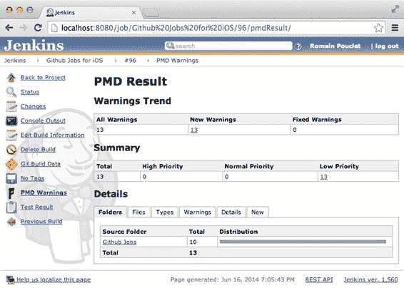

**图 10-4.** 每个 XML 报告都会被检索、格式化并显示在 Jenkins 中

**注意** 此次构建失败，因为太多行代码超过了 120 个字符的限制，如何解决这个问题完全取决于你。你可以使用三个选项进行调整：`-max-priority-1`、`-max-priority-2` 和 `-max-priority-3`。这些选项将增加 OCLint 在判定构建失败前所允许的错误数量。另一种解决方案是再次增加每行代码允许的字符数。

在 Bamboo 中集成质量检查与我们之前在 Jenkins 中的做法非常相似。主要的区别（再次强调）在于它将在独立的任务中完成。这样，构建、测试和静态分析可以并行执行。唯一的问题是，目前 Bamboo 没有足够好的插件来处理 PMD 文件，因此我们无法涵盖这部分内容。

## 总结

本章重点介绍了使用 Clang 和 OCLint 等工具进行质量保证。我们首先讨论了质量保证是什么，以及它如何对你和你的团队有所帮助。然后，我们详细介绍了 Clang 静态分析器，它可以轻松安装并与 OS X 服务器集成，以便在你每次推送提交时运行。最后，我们介绍了 OCLint，这是另一种静态代码分析工具，它提供了不同类型的反馈，例如代码行过长。

至此，我们的旅程已接近尾声。我们从一款功能非常简单的应用开始：调用 Web 服务、在表格视图中显示结果，并使用 Safari 显示工作机会的详细信息。

在接下来的章节中，我们开始讨论命令行，更重要的是，如何使用 Xcode 的命令行工具（而非 Xcode 的用户界面）来构建应用。我们从一个小工具开始，它为我们处理了整个过程，最后转向了我们自己用 Bash 编写的构建脚本。

在确认一切底层机制都正常工作后，是时候实现整个流程的自动化了，因此我们了解了如何使用 Jenkins 和 Bamboo 等持续集成平台来每日构建我们的应用。

之后，我们需要稍作休息，于是我们介绍了在构建完成后将应用分发给 Beta 测试人员所需的步骤，因为这是持续集成环境的好处之一：省去构建、打包和分发应用的麻烦。

我们还讨论了 OS X 服务器的 XCode 服务，它可以托管 Git 仓库、运行 Xcode 任务，并以一种相当优雅的方式展示构建状态。

至此，我们拥有了一套相当不错的持续集成环境，能够在有新提交时自动构建应用。剩下的工作就是配置我们的工具，以便它们能提供更多反馈：单元测试和静态分析。

我们的环境并不完美，但我们几乎已经向你展示了所有的工作原理。这里重要的是，你（我希望！）已经看到持续集成并不可怕，而是一个能提供非常有价值的反馈、帮助你编写更优秀代码和更出色应用的利器。

[www.it-ebooks.info](http://www.it-ebooks.info/)

---

# 索引

A

- 钩子设置，111
- JAR 文件，98

Ad-Hoc 配置文件，118

Jira，93


agvtool

多个分支, 108

自动化构建平台, 67

夜间构建, 112

构建脚本, 86

按需解决方案, 94

BUILD_NUMBER 变量

生产环境使用, 96

清理, 89

远程代理

Cocoapods, 87

配置, 115

对密码进行掩码处理, 88

安装, 113

参数扩展, 88

作业更新, 116

`$WORKSPACE`, 88

REST API, 106

信心, 67

阶段选项卡, 99

Jenkins 历史, 68

使用命令行, 94

作业, 67

快速安装, 95

配置文件与私钥, 92

`-fg` 参数, 95

从节点, 90

仪表板, 107

结构剖析, 90

Xcode 集成, 113

远程 FS 根目录, 90

Bonjour, 147

Xcode, 91

自动化测试

C

B

Clang, 184

命令行界面 (CLI), 41

Bamboo, 93

Agvtool, 62

插件, 98

应用程序清单

Atlassian, 93

PlistBuddy, 61

Bash 脚本, 98

plist 文件格式, 59

代码托管服务, 111

RFC1034 过滤器, 62

Confluence, 93

选择目标, 58

默认阶段, 99

IPA 文件创建, 55

Cocoapods, 99

开发工具, 56

任务, 99

PackageApplication 可执行文件, 57

xcodebuild 错误, 100

签名流程, 57

Xcode 任务配置, 102

xcrun, 56

Github 作业项目, 97, 102–103

iPhone 配置实用工具, 41

构建产物, 105

方案共享, 53

环境变量, 103

Shenzhen, 42

**197**

[www.it-ebooks.info](http://www.it-ebooks.info/)

**198**

**索引**

命令行界面 (CLI) （*续*）

生命周期开发, 20

基于文本的命令, 41

Adhoc 配置, 20, 22

xcodebuild, 46

构建设置选项卡, 21

构建成功消息, 50

调试配置, 20–21

clang, 49

发布配置, 20–21

Cocoapods, 49

静态代码分析, 22

ld 命令, 48

Xcode, 7

`-workspace` 选项, 49

Bundle 版本字符串, 8

Xcode 项目文件, 53


```markdown
`CFBundleVersion`，8

`xcode-select`，44

`Info property list`文件，8

`developer`目录，45

`OCUnit`和`SenTestingKit`框架，9

环境变量，45

属性列表文件，7

`Homebrew`包管理器，44

`Test`调用者和`Test`类，9

`sudo`，45

`Xcode Bots`，10

`xcpretty`，52

`XCTest`框架，8

`xctool`，50

`AdHoc`配置，51

## D
■ , E, F
优点，52
`Homebrew`，51
`Debugging With Attributed Record`格式 (`DWARF`)，32
安装，50
`Jenkins`，52
`$PATH`，51

## G
■
仓库，50
`Github`任务，148
持续集成，1, 5
`Bot`配置，150
优点和缺点，2
依赖安装，154
构建阶段，26
远程仓库访问，150
构建设置，23
`scheme-sharing`问题，149
调试宏，24
`Xcode bots`，148
`Github Jobs API`
`Grand Central Dispatch` (`GCD`)，16
和点，25
`NSBundle`类，26
`CocoaPods`，14
`HockeyApp`（`hockeyapp.net`），118
`Homebrew`，51

## J
■ , K
代码实现
代理方法，17
`NSURLSession` API，16
`Podfile.lock`，19
`SVProgressHUD`，17
标题属性（`title`），16
`Jenkins`，123
`UITableViewController`，15
构建过程，125
定义，1
提交历史，126
`Github jobs API`，4, 6
压缩过程，127
`Git`集成，10
上传请求，126
`AppDelegate.m`文件，11
命令行，82
冲突，11–12
`curl`命令行工具，69
专用`Git`客户端，12
`Homebrew`包管理器，68
`Homebrew`，14
安装，69
版本控制，13
默认任务配置，128
`Xcode`，11
部署任务，129
[www.it-ebooks.info](http://www.it-ebooks.info/)

**索引**
**199**
反馈（`feedback`），83
空中（`OTA`）分发，32, 117
邮件通知，84
持续集成，117
`Project Health Report`插件，84
描述，117
`Wall Display`插件，86
iOS 应用分发，118
`Github Jobs`配置，124
`provisioning profile`（`provisioning profile`），133
```


# 索引

## A

- `Build Notes` 文本区域，125
- 配置 `ACL`，138

## C

- 变更日志，125
- `XML` 清单，135
- `IPA` 与 `dSYM` 文件，124

## G

- github-jobs.plist 文件，136
- 历史记录，68
- 创建 `HTML` 页面，135

## M

- 管理 `Jenkins`，71
- `Matrix Authorization` 插件，70
- 构建后阶段，123
- `Post-build` 阶段，105
- 预装插件，70
- 需求，68

## Q

- REST API，79
- 质量保证，183
- 启动时，70
- 描述，183
- 安装 `TestFlight` 插件，123
- 动态分析，184
- 翻译辅助插件，71

## S

- 静态分析上传至 `TestFlight`，127
- `clang`，184
- `Xcode` 插件，73
- 误报，184
- 凭据管理插件，74
- `LLVM`，184
- 生成的 `IPA`，77
- OCLint，189
- `Github` 任务应用，76
- `Xcode` 机器人，188
- `ssh-keygen`，74

## R

- REST API `Bamboo`，106
- `低级虚拟机 (LLVM)`，184

## L，M，N

- Sen:te，8
- OCLint，189
- `Shenzhen`，42
- 错误信息，191
- 软件质量保证 (SQA)，1
- HTML 报告，193
- `Jenkins`，193

## T

- 优势，194
- `测试驱动开发 (TDD)` 方法，165
- `PMD`，193
- `TestFlight (testflightapp.com)`，118
- 违规，194
- `Ad Hoc` 配置文件，118
- XML 报告，195
- `Jenkins`，123
- JSON 编译数据库，190
- 适用于高级用户，122
- `xcodebuild` 命令，191
- `OS X` 服务器，142

## U、V、W

- 历史记录，142
- 安装流程，142
- `单元测试`
  - 在本地网络上进行，143
  - Bamboo，178
  - 权限部分，144
  - 命令行，172
  - 服务配置，145
  - 概念，163
- [www.it-ebooks.info](http://www.it-ebooks.info/)
- **200**
- **索引**
- `单元测试` (*续*)
  - 营销版本号，30
  - 失败的断言，168
  - 版本号，31
  - `initWithPayload` 方法，169
  - 来自 `Jenkins` 的代码签名和配置文件，176
  - 配置文件流程，36
  - 映射库，170
  - 反馈，崩溃日志，31
  - 模拟和桩对象，171
  - dSYM 文件，32
  - `PCSJobOffer` 类，164–165
  - `DWARF`，32
  - 断言，167
  - `无线 (Over the Air)` 分发，32
  - bundleForClass: 方法，167


`PLCrashReporter`, 32

`NSBundle` 方法，167

可读格式，31

属性，166

`IPA` 文件创建，33

`setUp` 和 `tearDown` 方法，166

多版本安装

TDD，165

AdHoc 配置，39

Xcode 机器人，180

Bundle 标识符，38

Xcode 集成，163

`RFC` 参数，39

`XCPretty`, 173

服务，156

`XCTAssertEqualObjects` 断言，169

大屏幕功能，158

下载 X, Y, Z

最新版本，158

Klaus，157

Xcode，29

Web 界面，157

应用程序安装，35，37

Xcode 6，146

应用程序发布，30

通信，146–148

Bundle 版本，30

持续集成，146

`Github` `Jobs` 配置文件，30

[www.it-ebooks.info](http://www.it-ebooks.info/)


# Pro iOS 持续集成

Romain Pouclet

[www.it-ebooks.info](http://www.it-ebooks.info/)

**Pro iOS 持续集成**

版权所有 © 2014 由 Romain Pouclet 所有

本作品受版权保护。出版商保留所有权利，无论是全部还是部分材料的权利，特别是翻译、重印、重用插图、朗诵、广播、以缩微胶卷或任何其他物理方式复制，以及传输或信息存储和检索、电子改编、计算机软件，或通过现在已知或以后开发的类似或不同方法。在法律保留的豁免范围内，包括与评论或学术分析相关的简短摘录，或为进入计算机系统并执行而专门提供的材料，仅供购买者独家使用。

本出版物或其部分的复制，仅允许根据出版商所在地现行版权法的规定进行，且必须始终从 Springer 获得使用许可。使用许可可通过 Copyright Clearance Center 的 RightsLink 获取。违反行为将根据相应版权法受到起诉。

ISBN-13 (平装): 978-1-4842-0125-1

ISBN-13 (电子版): 978-1-4842-0124-4

本书中可能出现商标名称、徽标和图像。我们不在每个商标名称、徽标或图像出现时都使用商标符号，而是仅以编辑方式使用名称、徽标和图像，以利于商标所有者，并无意侵犯商标。

本出版物中使用的商品名称、商标、服务标志和类似术语，即使未标明为商标，也不应被视为关于其是否受专有权利保护的表达意见。

虽然本书中的建议和信息在出版时被认为是真实准确的，但作者、编辑或出版商不对可能出现的任何错误或遗漏承担法律责任。出版商对本书所含材料不作任何明示或暗示的保证。

出版商：Heinz Weinheimer

首席编辑：Michelle Lowman

开发编辑：Douglas Pundick

技术审阅：Scott Gardner、Felipe Guitierrez、Abigal Goodwill

编辑委员会：Steve Anglin、Mark Beckner、Ewan Buckingham、Gary Cornell、Louise Corrigan、Jim DeWolf、Jonathan Gennick、Jonathan Hassell、Robert Hutchinson、Michelle Lowman、James Markham、Matthew Moodie、Jeff Olson、Jeffrey Pepper、Douglas Pundick、Ben Renow-Clarke、Dominic Shakeshaft、Gwenan Spearing、Matt Wade、Steve Weiss

协调编辑：Kevin Walter

文字编辑：Lori Cavanaugh

排版：SPi Global

索引编制：SPi Global

插图：SPi Global

封面设计：Anna Ishchenko

全球图书发行由 Springer Science+Business Media New York 负责，地址：233 Spring Street, 6th Floor, New York, NY 10013。电话：1-800-SPRINGER，传真：(201) 348-4505，电子邮件：`orders-ny@springer-sbm.com`，或访问 [www.springeronline.com](http://www.springeronline.com)。Apress Media, LLC 是加利福尼亚有限责任公司，其唯一成员（所有者）是 Springer Science + Business Media Finance Inc (SSBM Finance Inc)。SSBM Finance Inc 是特拉华州公司。

有关翻译信息，请发送电子邮件至 `rights@apress.com`，或访问 [www.apress.com](http://www.apress.com)。

Apress 和 friends of ED 书籍可批量购买用于学术、企业或促销用途。大部分书籍也提供电子书版本和许可证。更多信息，请参阅我们的特别批量销售 – 电子书许可网页：[www.apress.com/bulk-sales](http://www.apress.com/bulk-sales)。

作者在本文中引用的任何源代码或其他补充材料，读者可在 [www.apress.com/9781430264392](http://www.apress.com/9781430264392) 获取。有关如何找到书籍源代码的详细信息，请访问 [www.apress.com/source-code/](http://www.apress.com/source-code/)。

[www.it-ebooks.info](http://www.it-ebooks.info/)

*谨以此书献给 Camille，她是我每天早晨有幸能陪伴在身边的女性。没有你，我无法完成这本书。我还要感谢我的两只猫，Crumble 和 Hermione，如果没有它们，我可能早就完成了这本书。*

[www.it-ebooks.info](http://www.it-ebooks.info/)

## 目录

关于作者 ����������������������������������������������������������������������������������������������������������������������������������� xiii

关于技术审阅者 ������������������������������������������������������������������������������������������������������������������������� xv

致谢 ������������������������������������������������������������������������������������������������������������������������������������������� xvii

引言 ��������������������������������������������������������������������������������������������������������������������������������������������� xix

**第 1 章：持续集成简介** �������������������������������������������������������������������������������������������������� 1

什么是持续集成？ ����������������������������������������������������������������������������������������������������������������������� 1

苹果历史 101 ������������������������������������������������������������������������������������������������������������������������������� 2

优点与缺点 ��������������������������������������������������������������������������������������������������������������������������������� 2

未来之路 ������������������������������������������������������������������������������������������������������������������������������������ 3

示例应用程序：Github Jobs ������������������������������������������������������������������������������������������������������� 4

先决条件 ����������������������������������������������������������������������������������������������������������������������������������� 4


# 摘要

第 2 章：iOS 与 Xcode 的持续集成特性

示例应用：GitHub Jobs

创建应用

Xcode 为我们提供了什么

应用的配置文件

测试

# 目录

Git 集成

CocoaPods

编写示例应用

我们为何要做这些？

准备发布应用

自定义构建设置

构建阶段

摘要

# 第 3 章：使用 Xcode 在 App Store 之外发布应用

我们需要什么

准备发布应用

从崩溃日志中收集反馈

创建 IPA 文件

在测试者设备上安装应用

但……这个过程太糟糕了！


# 在测试设备上安装应用程序
# 安装应用程序的多个版本
## 本章小结
## 第 4 章：调用命令行的威力
## 命令行界面？
### 介绍 Shenzhen
### 灵活管理 Xcode 的多个版本
## 构建应用程序
#### 使用 `xcodebuild` 构建应用程序
#### 使用 `Xctool` 构建应用程序
### 使用 `xcpretty` 格式化 `xcodebuild` 输出
### Xcode 项目文件剖析与 Scheme 共享
## 从命令行创建 IPA 文件
### 选择目标设备
### 尝试应用程序清单
### 使用 `Agvtool` 更新构建版本号
### 结束本章
## 本章小结
## 第 5 章：使用 Jenkins 进行自动构建
### 为什么需要自动化构建平台？
### Jenkins 与 Hudson：一段历史回顾
## Jenkins 入门
### 使用命令行安装 Jenkins
### 在系统启动时加载 Jenkins


# 环顾四周

# 调优 Jenkins

# 使用 Xcode 插件创建你的第一个 Jenkins 任务

### 创建专用于 Github 的 SSH 密钥

# 构建 Github 任务应用程序

# 归档生成的 IPA 文件

## Jenkins 高级用户功能

### Jenkins REST API

### 命令行中的 Jenkins

### 获取反馈

# 接收通知并立即修复构建

# 监控多个项目的状态

# 集成我们的构建脚本

## 更新构建编号

## 解锁钥匙串

# 清理善后

## 将 Xcode 构建集成到现有 Jenkins 安装中

# Slave 节点基础

# Jenkins Slave 节点剖析

[www.it-ebooks.info](http://www.it-ebooks.info/)

# 目录

# 管理配置文件与私钥

# 接下来何去何从？

## 总结

# 第 6 章：使用 Bamboo 实现自动化构建

# Bamboo 入门

## 使用命令行安装 Bamboo

# 为生产环境做好准备

## 环顾四周：与 Jenkins 不同的方法

### 扩展 Bamboo

### 默认任务的配置

# 总结 Bamboo 基础

# 构建 Github 任务应用程序

## 使用环境变量

# 归档构建产物

## Bamboo 高级用户功能

# Rest API

### 仪表板

### 获取反馈

#### 构建多个分支

# 尽早构建，频繁构建

## 使用 Bamboo 设置钩子

## 设置夜间构建

# 将 Xcode 构建集成到现有 Bamboo 安装中

## 安装远程代理

## 配置代理


# 目录

**第十二页**

## 第 7 章：空中分发（OTA）

什么是空中分发（OTA）？

它与持续集成有何关系？

iOS 应用分发：一种可行的商业模式

使用 TestFlight 分发应用

面向高级用户的 TestFlight

在 Jenkins 构建结束时将应用上传至 TestFlight

在 Bamboo 任务结束时将应用上传至 TestFlight

编写你自己的分发平台

理解配置文件

借助 iTunes 音乐商店 XML 清单

额外内容：使用配置文件配置访问控制列表（ACL）

总结

## 第 8 章：Xcode 机器人的日常使用

为何我们还需要另一个持续集成工具？

OS X 服务器

一点历史背景

在你的电脑上安装 OS X 服务器

Xcode 6

持续集成

从 Xcode 与 Xcode 服务通信

设置 Github 任务

使用 Xcode 机器人为 iOS 执行 Github 任务的夜间构建

通过 Web 界面管理 Xcode 服务

下载最新版本的应用

使用大屏幕功能获取实时反馈

总结

**第十三页**

**目录**

## 第 9 章：集成单元测试

自动化测试

测试的理由

不测试的理由

单元测试

Xcode 单元测试集成

为`PCSJobOffer`类添加测试

创建测试用例类

运行测试

从命令行运行测试

分析结果

从 Jenkins 运行测试

从 Bamboo 运行测试

使用 Xcode 机器人运行测试

总结

# 第 10 章：质量保证


# 文档大纲

## 什么是质量保证？

### 静态分析

### 使用 `clang` 执行简单的静态分析

### 从 Xcode 机器人执行静态分析

### 使用 `OCLint` 获取更多反馈

## 总结

# 索引

[www.it-ebooks.info](http://www.it-ebooks.info/)


## 关于作者

**罗曼·普克莱**是一位居住在蒙特利尔的开发者，与女友和两只猫为伴。他曾在法国学习计算机科学和移动开发，参与过从网站到富界面及移动应用等多种项目。目前他在一家加拿大公司担任 iOS 开发者，同时学习如何走扁带。

[www.it-ebooks.info](http://www.it-ebooks.info/)


## 关于技术审校者

**斯科特·加德纳**是一名企业级 iOS 应用架构师、开发者和顾问。他与妻子和女儿居住在美国中西部。

**阿比盖尔·古德威尔**是科罗拉多大学斯普林斯分校的学生。她主修英语（文学方向）以及计算机科学。作为一名有抱负的小说家，她花费大量时间写作并训练综合格斗。她希望有朝一日能出版一本《纽约时报》畅销书。

[www.it-ebooks.info](http://www.it-ebooks.info/)


## 关于技术审校者（续）

**费利佩·古铁雷斯**是一名软件架构师，拥有墨西哥城蒙特雷理工学院计算机科学学士和硕士学位。他拥有超过 20 年的 IT 经验，期间为政府、零售、医疗、教育和银行等多个垂直行业的公司开发程序。目前他在 EMC/Pivotal 担任高级顾问，专攻 Spring 框架、Groovy 和 RabbitMQ 等技术。他还为诺基亚、苹果、Redbox 和高通等大公司提供咨询服务，同时也是 Apress 出版社《Spring 框架入门》一书的作者。

[www.it-ebooks.info](http://www.it-ebooks.info/)

## 致谢

当 Apress 给我机会撰写一本关于 iOS 持续集成的书时，我既兴奋又恐惧。兴奋的是，自从 2008 年开始担任技术审校以来，写书一直是我心中的愿望；恐惧的是，当我开始整理所有想在书中讨论的内容时，我意识到自己低估了所需的工作量。但幸运的是，我有机会与一群出色的人共事。

我要感谢 Apress 所有帮助我完成本书的人。现在回想起来，书中使用“我们”来与你对话，不仅仅是一种教学方式：我确实不是独自在写作。首先，非常感谢路易丝·科里根，她是我在 Apress 的第一个联系人，是她启动了整个项目，从完善我的提案开始。非常感谢随后接手并将项目推进到新阶段的米歇尔·洛曼，她始终高度警觉，尤其是在 WWDC 临近、而我的第一章关于 Xcode 机器人的截稿日期也同时到来的时候。

没有我的日常联系人，我无法完成这一切：道格拉斯·彭迪克，他纠正了大量表述不清的句子和其他文体错误；还有凯文·沃尔特，我发现他站在对手那边，而那种在加拿大才能找到的冰球狂热也开始影响我。感谢你们在需要时提供的工具、帮助和鼓励。

参与这个项目的技术编辑——斯科特·加德纳、阿比·古德威尔和费利佩·古铁雷斯，应该为他们提供的反馈质量和有用性感到自豪。感谢你们的陪伴，你们是我的安全网。

我还要感谢我的公司 TechSolCom，它让我有机会接触许多出色的工具，因为他们信任我，让我负责所有 iOS 项目的持续集成。

我要感谢马克·韦斯特罗夫，他在这一切开始时就在我身边，当我又一次抱怨 Jenkins 时，他让我明白表面之下还有更多东西。当我怀疑自己是否真的能胜任这个挑战时，他也提供了巨大的支持。

[www.it-ebooks.info](http://www.it-ebooks.info/)

## 致谢（续）

还要感谢我多年的朋友本杰明·休伯特，他在过去三个月里支持着我，我在 IM 上那些 GIF 图片的间隙，不断向他汇报我的进展。非常感谢你的支持，期待能成为你的伴郎！

最后但同样重要的是，我要感谢我的女友卡米尔的耐心，在过去几个月里，我虽然人在她身边却心不在焉，在离她三米远的笔记本电脑上写作。她一直鼓励我坚持工作，每当需要时她都能让我重回正轨，我对她感激不尽。

愿我们未来还能相伴许多年，甚至更久。

[www.it-ebooks.info](http://www.it-ebooks.info/)

# 文档大纲


# 目录概览

*   目录概览
*   目录
*   关于作者
*   关于技术审校
*   致谢
*   引言
*   第 1 章：持续集成简介
    *   什么是持续集成？
    *   Apple 历史入门
    *   优点与缺点
    *   未来之路
    *   示例应用程序：Github Jobs
    *   前置条件
    *   总结
*   第 2 章：iOS 和 Xcode 中的持续集成特性
    *   示例应用程序：Github jobs
        *   创建应用程序
    *   Xcode 为我们提供了什么
        *   应用程序的信息文件
        *   测试
        *   Git 集成
        *   CocoaPods
    *   编写示例应用程序
        *   我们为什么要做这一切？
    *   准备发布应用程序
        *   自定义构建设置
        *   构建阶段
    *   总结
*   第 3 章：使用 Xcode 在 App Store 之外发布应用程序
    *   我们需要什么
    *   准备发布应用程序
        *   从崩溃日志中收集反馈
        *   创建 IPA 文件
        *   在测试者设备上安装应用程序
        *   但是……这个过程太糟糕了！
        *   在测试者的设备上安装应用程序
    *   安装应用程序的多个版本
    *   总结
*   第 4 章：发挥命令行的威力
    *   命令行界面？
    *   介绍 Shenzhen
    *   应对多个 Xcode 安装版本
    *   构建应用程序
        *   使用 xcodebuild 构建应用程序
        *   使用 Xctool 构建应用程序
        *   使用 xcpretty 格式化 xcodebuild 输出
    *   Xcode 项目文件剖析与 Scheme 共享
    *   从命令行创建 IPA 文件
    *   选择目标
    *   摆弄应用程序清单
    *   使用 Agvtool 递增构建版本号
    *   收尾与总结
    *   总结
*   第 5 章：使用 Jenkins 进行自动构建
    *   为什么我们需要自动化构建平台？
    *   Jenkins 和 Hudson：一段历史
    *   Jenkins 入门
        *   使用命令行安装 Jenkins
        *   设置 Jenkins 开机自启
    *   环顾四周
    *   调优 Jenkins
    *   使用 Xcode 插件创建你的第一个 Jenkins 任务
        *   为 Github 创建专用的 SSH 密钥
        *   构建 Github Jobs 应用程序
        *   归档生成的 IPA
    *   Jenkins 高级用户特性
        *   Jenkins REST API
        *   从命令行使用 Jenkins
    *   获取反馈
        *   接收通知并立即修复构建
        *   监控多个项目的状态
    *   集成我们的构建脚本
        *   更新构建版本号
        *   解锁钥匙串
        *   清理现场
    *   将 Xcode 构建集成到现有 Jenkins 安装中
        *   从节点基础
        *   Jenkins 从节点剖析
    *   管理配置文件与私钥
    *   下一步何去何从？
    *   总结
*   第 6 章：使用 Bamboo 进行自动构建
    *   Bamboo 入门
        *   使用命令行安装 Bamboo
        *   为生产使用做准备
    *   环顾四周：与 Jenkins 不同的方法
    *   扩展 Bamboo
        *   配置默认任务
        *   总结 Bamboo 基础
    *   构建 Github Jobs 应用程序
        *   使用环境变量
        *   归档构建产物
    *   Bamboo 高级用户特性
        *   Rest API
        *   Wallboards
    *   获取反馈
        *   构建多个分支
        *   尽早构建，频繁构建
        *   为 Bamboo 设置钩子
        *   设置夜间构建
    *   将 Xcode 构建集成到现有 Bamboo 安装中
        *   安装远程代理
        *   配置代理
        *   更新任务以在远程代理上运行
    *   总结
*   第 7 章：无线分发
    *   什么是无线分发？
        *   这与持续集成有何关系？
        *   iOS 应用分发：一种有效的商业模式
    *   使用 TestFlight 分发应用
        *   高级用户的 TestFlight
        *   在 Jenkins 构建结束时将应用上传到 TestFlight
            *   为 Jenkins 安装 TestFlight 插件
            *   配置 Github Jobs for iOS 的 Jenkins 任务


- 构建应用并将生成的 IPA 文件提交至 TestFlight
    - 在 Bamboo 任务结束时将应用上传至 TestFlight
        - 更新默认任务配置
        - 创建部署任务
    - 编写自定义的分发平台
        - 理解配置文件
        - 借助 iTunes 音乐商店 XML 清单
            - 创建简单的 HTML 页面
            - 清单文件
        - 附加功能：使用配置文件设置访问控制列表
            - 解码配置文件
    - 总结
- 第 8 章：Xcode Bots 的日常使用
    - 为何还需要另一个持续集成工具？
    - OS X 服务器
        - 历史回顾
        - 在你的电脑上安装 OS X 服务器
    - Xcode 6
        - 持续集成
        - 从 Xcode 与 Xcode 服务通信
    - 设置 Github 任务
        - 使用 Xcode Bots 为 iOS 创建 Github 任务的每日构建
            - 授予对 GitHub 远程仓库的访问权限
            - 配置 Bot 并获取反馈
            - 在 Xcode Bot 执行集成期间安装依赖项
    - 从 Web 界面管理 Xcode 服务
        - 下载最新版本的应用
        - 使用大屏功能获取实时反馈
    - 总结
- 第 9 章：添加单元测试
    - 自动化测试
        - 进行测试的理由
        - 不进行测试的理由
    - 单元测试
        - Xcode 单元测试集成
        - 为 PCSJobOffer 类添加测试
        - 创建测试用例类
        - 运行测试
        - 从命令行运行测试
        - 分析结果
        - 从 Jenkins 运行测试
        - 从 Bamboo 运行测试
        - 使用 Xcode Bot 运行测试
    - 总结
- 第 10 章：质量保证
    - 什么是质量保证？
    - 静态分析
        - 使用 clang 执行简单的静态分析
        - 从 Xcode Bot 执行静态分析
        - 使用 OCLint 获取额外反馈
            - 将 OCLint 集成到 Jenkins 中
    - 总结
- 索引

