# 第 1 章：初识 Core Data

你钱包或口袋里的那台电脑——那台据称可以打电话的设备——存储着好几 GB 的数据：照片、电子邮件、短信、推文、餐厅评论、高分成绩、书籍、你的朋友早餐吃了什么，以及无数种其他由 0 和 1 组成的信息，这些信息每天为你提供信息和娱乐。作为苹果提供的数据管理方案，Core Data 管理者其中很大一部分信息，并且由 Core Data 管理的 iOS 设备上的信息比例还在持续增长。在本章中，我们将探讨其原因。


## 本章阐述什么是 Core Data 及其组成部分

本章阐述什么是 Core Data 及其组成部分。文中概述并解释了 Core Data 使用的基本类以及它们如何协同工作。它展示了如何在你的应用程序中设置 Core Data，无论你是利用 Xcode 的 Core Data 代码生成功能，还是手动添加 Core Data 功能。同时，还介绍了为对象创建对象模型、存储对象和检索对象的基础知识。

在本章中，你将构建两个应用程序：一个让 Xcode 为你设置 Core Data，另一个则需要你手动添加 Core Data。这两个应用程序除了空白屏幕外，没有任何界面，但它们都专注于 Core Data 的交互。后续章节的应用程序将包含实际的用户界面，但请保持耐心，专注于学习 Core Data 的基础知识。你在本章所学的知识将为你阅读本书剩余部分以及开发自己的 Core Data 项目奠定坚实的基础。

## 什么是 Core Data？

设想一下，如果计算机不能存储数据会怎样。想象一下，每次你启动 iPhone 或 iPad 时，所有应用都需从头开始。你所有的文档都消失了：你的学校论文、预算规划电子表格、为新一轮风险投资融资精心准备的演示文稿，全都化为乌有。你在《愤怒的小鸟》中又回到了第一关。你不再有暴躁猫的图片。你昨晚的短信也不见了（对某些人来说，这可能反而是件好事）。简而言之，你的设备日复一日地变成了一块经典的“白板”（*tabula rasa*），空白且没有任何数据，毫无用处。

那些假想中的计算机所缺乏的就是持久性：即随时间推移存储和检索数据的能力。我们希望持久化存储信息，例如我们的照片、高分记录和文档。苹果提供的持久化解决方案——Core Data，允许应用程序持久化存储任何形式的数据并检索它们。

从技术上讲，Core Data 并非数据库，尽管它通常将数据存储在数据库中（准确地说，是 SQLite 数据库）。它也不是对象关系映射（ORM），尽管它用起来感觉有点像。它实际上是一个对象图，允许你创建、存储和检索那些拥有属性并与其他对象存在关系的对象。它的简洁性和强大功能使你能够持久化任何形式的数据，从基础数据模型到复杂数据模型。

## Core Data 组件

Core Data 的新手常常会对该框架的复杂性感到沮丧，但正如我们将看到的，这种最初的印象是毫无根据的。Cocoa 偏爱长名称的习惯可能导致了这种错误的复杂感；毕竟，`NSPersistentStoreCoordinator` 这个名字就很拗口。然而，一旦你克服了长名称的障碍，理解了每个类的用途，你就会认识到 Core Data 框架既优雅又简洁。

我们可以将 Core Data 的类分为两组：一组通常在我们程序启动时设置一次，另一组则在程序运行期间持续使用。此外，Cocoa 还提供了一组 Core Data 使用的类，这些类并不局限于 Core Data 的范围。Core Data 利用像 `NSPredicate` 和 `NSSortDescriptor` 这样的类来增强其功能，这些类在 Cocoa 应用程序的其他上下文中也会用到。我们将在本书中涉及这些其他的类。

首先，我们来讨论程序启动时设置一次的类。这些类包括：

*   `NSPersistentStore`
*   `NSPersistentStoreCoordinator`
*   `NSManagedObjectModel`

`NSPersistentStore` 类代表一个持久化存储：即设备文件系统中实际存储数据的位置。这通常是一个 SQLite 数据库，尽管 Core Data 也提供其他类型的持久化存储：

*   XML（仅限 OS X）
*   原子存储（Atomic）
*   内存存储（In-memory）

XML 存储（如你所料）将数据存储在 XML 文件中，但仅适用于 OS X。原子存储之所以得名，是因为它在访问时会读取和写入整个数据存储，如果你希望创建自己的文件格式来存储文件，它会很有用。Core Data 提供了一种名为二进制存储类型的原子存储实现，你也可以基于原子存储创建自定义存储。但请注意，原子存储通常速度较慢，尤其是在数据集变得庞大时，因为它们会原子地写入和读取数据文件。如果你不需要数据在应用程序当前启动之外持久保存，但又想利用 Core Data 的强大功能与数据交互，那么内存存储会很有用。不过，你的持久化存储大多数（如果不是全部）都将是 SQLite 存储。它们速度很快，因为它们可以读写部分数据，并且能够让你的数据在应用程序多次启动之间持久保存。每个应用程序通常只有一个持久化存储，但也可以有多个。

`NSPersistentStoreCoordinator` 类代表一个持久化存储协调器，它协调持久化存储、对象模型和对象上下文之间的关系。持久化存储协调器使用一个对象模型（我们接下来会看到），并将其与一个或多个持久化存储关联起来。它还协调一个或多个托管对象上下文与一个或多个持久化存储之间的对象存储和检索。从某种意义上说，它是 Core Data 的中心枢纽，将所有 Core Data 类连接在一起。幸运的是，创建和配置它都很容易，然后在你的应用程序运行时，它会为你执行所有复杂的魔法。

`NSManagedObjectModel` 类代表一个托管对象模型，或者更简单地说，一个对象模型。它看起来非常像数据模型，所以你即使将其视为数据模型也是可以理解的。正如实体-关系（ER）图定义了表、列和关系一样，对象模型定义了实体、属性和关系。你可以在代码中创建对象模型，但 Xcode 提供了一个对象模型编辑器，让你可以可视化地创建你的应用程序加载和使用的对象模型。

你在应用程序运行期间会使用接下来的两个类。它们是：

*   `NSManagedObjectContext`
*   `NSManagedObject`

`NSManagedObjectContext` 类代表一个托管对象上下文，或者简称为对象上下文。你的应用程序可以使用一个或多个这样的上下文，但通常只会使用一个。对象上下文为对象提供了生存空间，苹果文档将其称为“草稿板”。你在对象上下文中创建对象、从对象上下文中检索对象，并告知对象上下文保存自身。对象上下文负责与持久化存储协调器通信，以实际存储和检索对象。在 Core Data 应用程序中，你会大量接触到对象上下文。

`NSManagedObject` 类代表一个托管对象，或者说是由 Core Data 管理的对象。你可以将它们视为数据库中的行。托管对象具有由对象模型定义的属性和关系，并使用键值编码（KVC），以便你可以轻松设置和获取它们的数据。你也可以创建 `NSManagedObject` 的子类，以创建与你的对象模型匹配的属性，以及用于处理托管对象的便捷方法。

图 1-1 展示了 Core Data 的各个类以及它们如何协同工作。

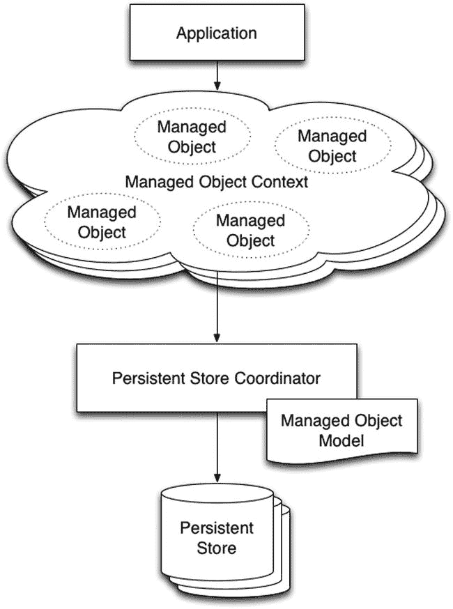

图 1-1. Core Data 的类

## 创建一个新的 Core Data 项目


理论与示意图固然能帮助理解事物的工作原理，但真正的代码实践才能将概念转化为扎实的理解。我们已经探讨了理论并看到了示意图，现在让我们看看 Core Data 的实际应用。在本节中，我们将创建一个从一开始就使用 Core Data 的 Xcode 项目。本章稍后将展示如何向现有项目添加 Core Data。

第一个应用程序被命名为 `CoreDataApp`（这个名称没什么创意），它存储具有单个属性 `name` 的 `Person` 对象。该应用程序的界面为空白屏幕，因此你无法与其交互。运行它后，它会在 SQLite 数据库中创建数据，然后我们可以使用 `sqlite3` 命令行应用程序来浏览该数据库。

## 创建项目

启动 Xcode 并创建一个新的单视图应用程序项目。将其命名为 `CoreDataApp`，并将组织标识符设置为 `book.persistence`。确保勾选**使用 Core Data** 复选框，如图 1-2 所示，然后创建并保存项目。在本书中，我们主要使用 Objective-C 作为主要语言，但也会提供 Swift 版本的代码清单。

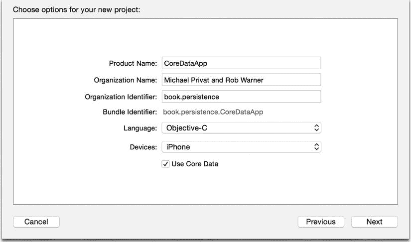

图 1-2. 创建 `CoreDataApp` 项目

## 浏览 Core Data 组件

通过勾选**使用 Core Data** 复选框，你已指示 Xcode 将 Core Data 框架添加到项目中。如果你选择 Objective-C 作为项目语言，Xcode 已将 Core Data 头文件 `CoreData/CoreData.h` 添加到项目的 `AppDelegate.h` 文件中。如果你选择 Swift 作为语言，则会在项目的 `AppDelegate.swift` 文件中找到 `import CoreData` 这一行。

你还指示 Xcode 创建一个模型，该模型将在你的应用程序中加载到 `NSManagedObjectModel` 实例中。要查看此模型，请展开 Xcode 项目导航器中的 `CoreDataApp` 文件夹。你应该会看到一个名为 `CoreDataApp.xcdatamodeld` 的条目，这是一个包含构成项目数据模型的各种工件的目录。当我们构建应用程序时，Xcode 会将其编译到应用程序包中名为 `CoreDataApp.momd` 的目录中。该目录将包含 `CoreDataApp` 加载以创建 `NSManagedObjectModel` 实例所需的工件。

最后，你已指示 Xcode 在你的应用程序委托类 `AppDelegate` 中创建属性，以实例化 Core Data 堆栈。打开头文件 `AppDelegate.h`，其内容应与代码清单 1-1 一致。

***代码清单 1-1.*** `AppDelegate.h`

```
#import <UIKit/UIKit.h>
#import <CoreData/CoreData.h>

@interface AppDelegate : UIResponder <UIApplicationDelegate>

@property (strong, nonatomic) UIWindow *window;

@property (readonly, strong, nonatomic) NSManagedObjectContext *managedObjectContext;
@property (readonly, strong, nonatomic) NSManagedObjectModel *managedObjectModel;
@property (readonly, strong, nonatomic) NSPersistentStoreCoordinator *persistentStoreCoordinator;

- (void)saveContext;
- (NSURL *)applicationDocumentsDirectory;

@end
```

你应该能认出这三个 Core Data 属性：`managedObjectContext`、`managedObjectModel` 和 `persistentStoreCoordinator`。Xcode 将它们全部放在应用程序委托类中，这虽然可行，但应用程序委托类往往会变得庞大且难以维护。在本章稍后向现有项目添加 Core Data 时，我们将采用不同的方法，将 Core Data 堆栈拆分到另一个类中。

你还应该注意到 Xcode 创建的两个用于辅助 Core Data 交互的方法。

```
- (void)saveContext;
- (NSURL *)applicationDocumentsDirectory;
```

`saveContext` 方法为我们提供了一个保存托管对象上下文的中心位置。当然，我们可以从代码中的任何位置保存托管对象上下文，但有一个统一的保存位置可以让我们进行诸如本地化错误处理之类的操作。第 4 章将更深入地探讨错误处理。Xcode 在生成的 `saveContext` 方法中生成了一些默认的错误处理，这些处理目前已经足够好用了。最终，`saveContext` 方法会通过调用其 `hasChanges` 方法来检查托管对象上下文中是否有任何更改，然后调用 `save`。

正如你所想的那样，`applicationDocumentsDirectory` 方法会返回此应用程序的文档目录。持久化存储协调器会调用此方法来确定在文件系统上的哪个位置创建持久化存储。

生成的项目的 Swift 版本当然没有头文件，但它具有相同的属性，以及我们刚刚讨论过的方法声明（`saveContext` 和 `applicationDocumentsDirectory:`）的相应调用。源代码没有将 Core Data 堆栈的属性分组在一起，但如果你通读 `AppDelegate.swift`，你会找到它们，它们使用闭包（此处未显示）进行初始化，如代码清单 1-2 所示。

***代码清单 1-2.*** `AppDelegate.swift` 中的 Core Data 属性

```
lazy var managedObjectModel: NSManagedObjectModel
lazy var persistentStoreCoordinator: NSPersistentStoreCoordinator?
lazy var managedObjectContext: NSManagedObjectContext?
```

## 初始化 Core Data 组件

Xcode 为 Core Data 生成的代码会延迟初始化 Core Data 堆栈，即在其组件首次被访问时才进行初始化。你当然可以在所有 Core Data 应用程序中使用这种方法，对于 `CoreDataApp`，我们将保留 Xcode 的默认实现。但是，你也可以在应用程序启动时设置 Core Data 堆栈。本书中也将使用这种方法。

`CoreDataApp` 的 Core Data 堆栈在你首次访问托管对象上下文（由 `managedObjectContext` 属性实例化）时进行初始化。代码清单 1-3 包含了 `managedObjectContext` 的 Objective-C 访问器代码，代码清单 1-4 展示了相同的 Swift 版本访问器。

***代码清单 1-3.*** Objective-C 中 `managedObjectContext` 的访问器

```
// 返回应用程序的托管对象上下文。
// 如果上下文不存在，则创建它并将其绑定到应用程序的持久化存储协调器。
- (NSManagedObjectContext *)managedObjectContext
{
  if (_managedObjectContext != nil) {
    return _managedObjectContext;
  }

  NSPersistentStoreCoordinator *coordinator = [self persistentStoreCoordinator];
  if (coordinator != nil) {
    _managedObjectContext = [[NSManagedObjectContext alloc] init];
    [_managedObjectContext setPersistentStoreCoordinator:coordinator];
  }
  return _managedObjectContext;
}
```

***代码清单 1-4.*** Swift 中 `managedObjectContext` 的访问器

```
lazy var managedObjectContext: NSManagedObjectContext? = {
  // 返回应用程序的托管对象上下文（已绑定到应用程序的持久化存储协调器）。此属性是可选的，因为存在合理的错误情况可能导致上下文的创建失败。
  let coordinator = self.persistentStoreCoordinator
  if coordinator == nil {
    return nil
  }
  var managedObjectContext = NSManagedObjectContext()
  managedObjectContext.persistentStoreCoordinator = coordinator
  return managedObjectContext
}()
```


正如 Xcode 生成的注释所证实，访问器会检查 `managedObjectContext` 属性（合成实例变量为 `_managedObjectContext`）是否已创建。如果已创建，访问器会将其返回。如果尚未创建，则会获取 `persistentStoreCoordinator` 属性，分配并初始化托管对象上下文，并将其持久化存储协调器设置为获取到的 `persistentStoreCoordinator`。

`persistentStoreCoordinator` 的访问器，如代码清单 1-5（Objective-C）和代码清单 1-6（Swift）所示，执行了它自己的惰性初始化。请注意，我们移除了关于错误处理的长注释，这些内容将在第 4 章中介绍。如你所见，这段代码会检查 `persistentStoreCoordinator` 属性（合成实例变量为 `_persistentStoreCoordinator`）是否已创建。如果尚未创建，它会通过将文件名 `CoreDataApp.sqlite (或 CoreDataAppSwift.sqlite)` 附加到本章前面讨论的 `applicationDocumentsDirectory` 辅助方法返回的目录上，来确定持久化存储的 URL（统一资源定位符），并将其存储在 `storeURL` 中。然后，它分配 `persistentStoreCoordinator` 属性，使用 `managedObjectModel` 访问器返回的托管对象模型对其进行初始化，并添加一个指向 `storeURL` 中创建的 URL 的持久化存储。

***代码清单 1-5*** `persistentStoreCoordinator` 的 Objective-C 访问器

```
// 返回应用的持久化存储协调器。
// 如果协调器尚不存在，则创建它并向其添加应用的存储。
- (NSPersistentStoreCoordinator *)persistentStoreCoordinator
{
  if (_persistentStoreCoordinator != nil) {
    return _persistentStoreCoordinator;
  }
    NSURL *storeURL = [[self applicationDocumentsDirectory] URLByAppendingPathComponent:@"CoreDataApp.sqlite"];

NSError *error = nil;
  _persistentStoreCoordinator = [[NSPersistentStoreCoordinator alloc] initWithManagedObjectModel:[self managedObjectModel]];
  if (![_persistentStoreCoordinator addPersistentStoreWithType:NSSQLiteStoreType configuration:nil URL:storeURL options:nil error:&error]) {
    /* 注释已删除 */
    NSLog(@"Unresolved error %@, %@", error, [error userInfo]);
    abort();
  }

return _persistentStoreCoordinator;
}
```

***代码清单 1-6*** `persistentStoreCoordinator` 的 Swift 访问器

```
lazy var persistentStoreCoordinator: NSPersistentStoreCoordinator? = {
    // 应用的持久化存储协调器。此实现创建并返回一个协调器，并且已经为其添加了应用的存储。此属性是可选的，因为存在一些可能导致创建存储失败的合理错误情况。
    // 创建协调器和存储
    var coordinator: NSPersistentStoreCoordinator? = NSPersistentStoreCoordinator(managedObjectModel: self.managedObjectModel)
    let url = self.applicationDocumentsDirectory.URLByAppendingPathComponent("CoreDataAppSwift.sqlite")
    var error: NSError? = nil
    var failureReason = "There was an error creating or loading the application's saved data."
    if coordinator!.addPersistentStoreWithType(NSSQLiteStoreType, configuration: nil, URL: url, options: nil, error: &error) == nil {
        coordinator = nil
        // 报告我们得到的任何错误。
        let dict = NSMutableDictionary()
        dict[NSLocalizedDescriptionKey] = "Failed to initialize the application's saved data"
        dict[NSLocalizedFailureReasonErrorKey] = failureReason
        dict[NSUnderlyingErrorKey] = error
        error = NSError(domain: "YOUR_ERROR_DOMAIN", code: 9999, userInfo: dict)
        // 将此替换为适当处理错误的代码。
        // abort() 会导致应用生成崩溃日志并终止。在生产应用中不应使用此函数，但在开发过程中可能有用。
        NSLog("Unresolved error \(error), \(error!.userInfo)")
        abort()
    }

return coordinator
}()
```

我们还需要查看最后一段惰性初始化代码，它位于 `managedObjectModel` 的访问器中，如代码清单 1-7（Objective-C）和代码清单 1-8（Swift）所示。与其他访问器类似，如果 `managedObjectModel` 属性（合成实例变量为 `_managedObjectModel`）已初始化，这段代码会将其返回。否则，代码通过将编译后的托管对象模型的 URL（`CoreDataApp.momd`（`CoreDataAppSwift.momd`））存储在 `modelURL` 变量中，分配 `managedObjectModel` 属性，并用托管对象模型的 URL 对其进行初始化来执行初始化。

***代码清单 1-7*** `managedObjectModel` 的 Objective-C 访问器

```
// 返回应用的托管对象模型。
// 如果模型尚不存在，则从应用的模型创建它。
- (NSManagedObjectModel *)managedObjectModel
{
  if (_managedObjectModel != nil) {
    return _managedObjectModel;
  }
  NSURL *modelURL = [[NSBundle mainBundle] URLForResource:@"CoreDataApp" withExtension:@"momd"];
  _managedObjectModel = [[NSManagedObjectModel alloc] initWithContentsOfURL:modelURL];
  return _managedObjectModel;
}
```

***代码清单 1-8*** `managedObjectModel` 的 Swift 访问器

```
lazy var managedObjectModel: NSManagedObjectModel = {
    // 应用的托管对象模型。此属性不是可选的。如果应用无法找到并加载其模型，将发生严重错误。
    let modelURL = NSBundle.mainBundle().URLForResource("CoreDataAppSwift", withExtension: "momd")!
    return NSManagedObjectModel(contentsOfURL: modelURL)!
}()
```

惰性初始化方法工作正常，并确保 Core Data 栈的所有组件在需要时都会被初始化。你可以继续在基于 Core Data 的应用中使用此方法。我们将在本章中构建的第二个应用 `PersistenceApp` 采用了不同的方法：它将所有 Core Data 交互封装在单个类 `Persistence` 中，直接对 Core Data 栈进行初始化。在您的 Core Data 应用中，可以随意使用任何一种方法。

## 创建托管对象模型


Xcode 已为我们创建了一个空的对象模型 `CoreDataApp.xcdatamodeld`（或 `CoreDataAppSwift.xcdatamodeld`），在 Xcode 的项目导航器中选中该文件即可看到（参见图 1-3）。

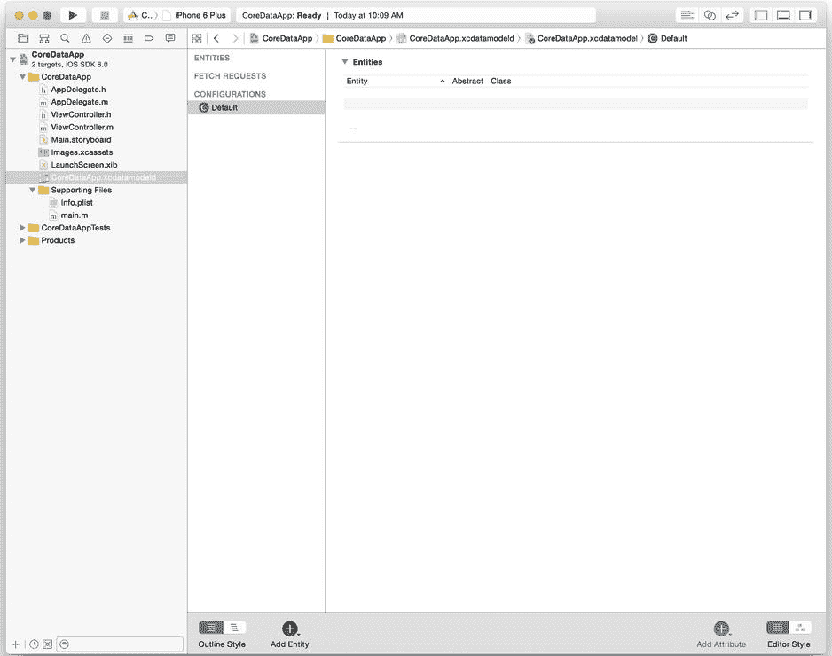

图 1-3. 空的对象模型

对于 CoreDataApp 应用程序，我们需要创建一个名为 `Person` 的实体，该实体包含一个名为 `name` 的属性。请注意约定：实体名称首字母大写，属性名称首字母小写；这种命名方式并非强制要求，但符合标准编码实践。本书将全程采用此命名方式。

要创建该实体，请点击 Xcode 窗口底部的“添加实体（Add Entity）”按钮。这将创建一个名为 `Entity` 的实体，请将其重命名为 `Person`。然后，点击“属性（Attributes）”下方的 + 按钮，创建一个名为 `name` 的属性，并将其类型从 `Undefined` 更改为 `String`。此时，你的对象模型应如图 1-4 所示。

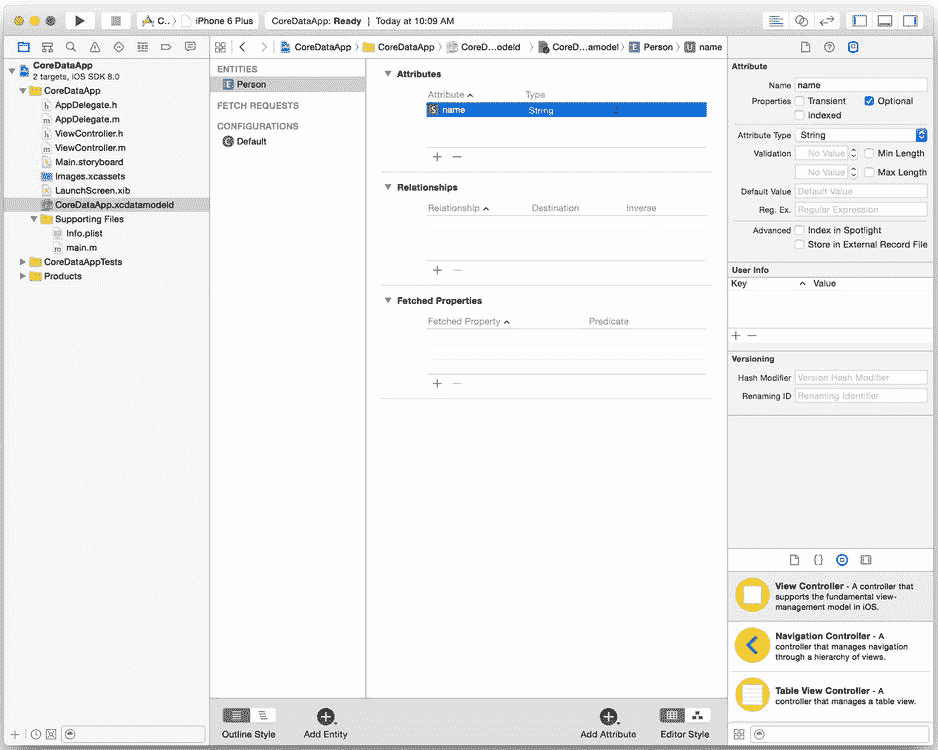

图 1-4. 包含 `Person` 实体的对象模型

Xcode 将编译此对象模型并将其加载到 `managedObjectModel` 属性中。

## 添加一些对象

在运行 CoreDataApp 应用程序之前，打开 `AppDelegate.m`，在 `application:didFinishLaunchingWithOptions:` 方法中添加代码：通过访问 `managedObjectContext` 属性来初始化 Core Data 栈，创建一些托管对象，并保存托管对象上下文。代码清单 1-9 展示了更新后的方法。

***代码清单 1-9***. 更新后的 `application:didFinishLaunchingWithOptions:` 方法

```
- (BOOL)application:(UIApplication *)application didFinishLaunchingWithOptions:(NSDictionary *)launchOptions {
  NSManagedObject *object1 = [NSEntityDescription insertNewObjectForEntityForName:@"Person" inManagedObjectContext:self.managedObjectContext];
  [object1 setValue:@"Tarzan" forKey:@"name"];

  NSManagedObject *object2 = [NSEntityDescription insertNewObjectForEntityForName:@"Person" inManagedObjectContext:self.managedObjectContext];
  [object2 setValue:@"Jane" forKey:@"name"];

  [self saveContext];

  return YES;
}
```

如果你使用的是 Swift，请打开 `AppDelegate.swift` 并按照代码清单 1-10 进行更新。

***代码清单 1-10***. 更新后的 `application:didFinishLaunchingWithOptions:` 函数

```
func application(application: UIApplication!, didFinishLaunchingWithOptions launchOptions: NSDictionary!) -> Bool {
  let object1 = NSEntityDescription.insertNewObjectForEntityForName("Person", inManagedObjectContext: self.managedObjectContext!) as NSManagedObject
  object1.setValue("Tarzan", forKey: "name")

  let object2 = NSEntityDescription.insertNewObjectForEntityForName("Person", inManagedObjectContext: self.managedObjectContext!) as NSManagedObject
  object2.setValue("Jane", forKey: "name")

  saveContext()

  return true
}
```

这段代码创建了两个新的 `Person` 托管对象 `object1` 和 `object2`，并分别将其 `name` 属性设置为“Tarzan”和“Jane”。请注意，托管对象使用 Cocoa 的标准 KVC 来设置属性值。你也可以为实体创建包含属性直接访问器的自定义类，从而编写如下代码：

```
object1.name = @"Tarzan";
```

第 2 章将讨论自定义类。

我们通过将托管对象插入到托管对象上下文（即我们的 `managedObjectContext` 属性）中来创建它们。通过访问该属性，我们启动了一条初始化整个 Core Data 栈的链式操作。

创建完两个托管对象后，该代码在向屏幕呈现空白窗口之前，使用 `saveContext` 辅助方法保存了托管对象上下文。构建并运行应用程序，以在持久化存储中创建托管对象并查看空白窗口。然后停止应用程序。

## 查看数据

CoreDataApp 应用程序没有任何用于显示其持久化存储内容的代码。那么，我们如何验证应用程序确实创建并存储了数据呢？为此，我们直接检查 SQLite 数据库文件 `CoreDataApp.sqlite` 或 `CoreDataAppSwift.sqlite`。当你通过 iOS 模拟器运行应用程序时，应用程序会将该文件写入主目录下的某个子目录中。查找该文件的最简单方法是打开终端并输入：

```
find ~ -name 'CoreDataApp.sqlite'
```

找到该文件后，切换到该目录并使用 sqlite3 应用程序打开该文件。

```
sqlite3 CoreDataApp.sqlite
```

或者，你可以使用 `find` 命令直接打开该文件：

```
find ~ -name 'CoreDataApp.sqlite' -exec sqlite3 {} \;
```

首先，在 `sqlite>` 提示符下输入 `.schema` 命令来检查数据库模式。

```
sqlite> .schema
CREATE TABLE ZPERSON ( Z_PK INTEGER PRIMARY KEY, Z_ENT INTEGER, Z_OPT INTEGER, ZNAME VARCHAR);
CREATE TABLE Z_METADATA (Z_VERSION INTEGER PRIMARY KEY, Z_UUID VARCHAR(255), Z_PLIST BLOB);
CREATE TABLE Z_PRIMARYKEY (Z_ENT INTEGER PRIMARY KEY, Z_NAME VARCHAR, Z_SUPER INTEGER, Z_MAX INTEGER);
```

你会看到三个表，其中 `Z_METADATA` 和 `Z_PRIMARYKEY` 是 Core Data 用于数据库管理任务的。第三个表 `ZPERSON` 用于存储 `Person` 实体。你可以看到它有一个名为 `ZNAME` 的列，类型为 `VARCHAR`，用于存储 `name` 属性。请注意，此模式（包括表名、列名等）是未记录的实现细节，可能会发生变更。你不能依赖这些模式，也不应在任何基于 Core Data 的应用程序中直接访问 SQLite 数据库。不过，像我们现在所做的这样，仅用于测试目的时，你可以放心地尝试。

让我们验证 CoreDataApp 应用程序是否创建并存储了两个 `Person` 托管对象：

```
sqlite> select * from zperson;
1|1|1|Tarzan
2|1|1|Jane
sqlite> .quit
```

你可以确认，CoreDataApp 应用程序确实成功使用了 Core Data 框架来创建和存储数据。

## 将 Core Data 添加到现有项目

既然你已经理解了 Core Data 的工作原理，你就会发现将其添加到现有项目是多么容易。只需按照 Xcode 在选中“使用 Core Data（Use Core Data）”复选框时所执行的相同步骤操作即可。

- 导入 Core Data 头文件（`CoreData/CoreData.h`），在 Objective-C 中添加 `@import CoreData`，或在 Swift 中添加 `import CoreData`。
- 向应用程序添加托管对象模型。
- 在应用程序中添加代码以初始化 Core Data 栈，并授予对托管对象上下文的访问权限。

你可以模仿 Xcode 生成的用于初始化 Core Data 栈的代码，也可以遵循其他模式。本书将同时使用这两种方法。无论采用何种方式，基本步骤都是相同的。

## 创建一个不使用 Core Data 的应用程序

要将 Core Data 添加到现有应用程序中，我们首先必须有一个不含 Core Data 的应用程序作为目标。使用单视图应用程序模板创建一个新的 Xcode 项目，并将其命名为 `PersistenceApp`。请务必取消选中“使用 Core Data（Use Core Data）”复选框（参见图 1-5）。

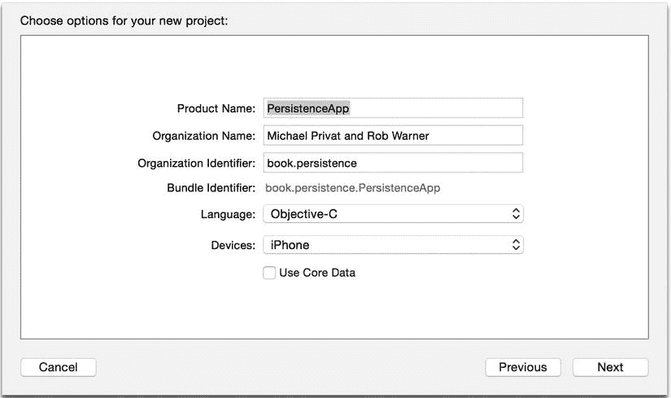

图 1-5. 创建 `PersistenceApp` 项目

## 添加 Core Data 框架


你的应用程序必须链接到 Core Data 框架（即`CoreData.framework`），才能使用 Core Data 类。过去，将 Core Data 框架添加到项目中需要多次鼠标点击，但 Xcode 的最新更新引入了模块导入的概念。要链接 Core Data 框架，只需在需要访问 Objective-C 项目中的 Core Data 类时添加`@import CoreData;`指令，或在 Swift 项目中添加`import CoreData`。Xcode 将完成其余链接工作。

### 添加托管对象模型

基于 Core Data 的应用程序需要一个托管对象模型，因此使用 Core Data 的“数据模型”模板向`PersistenceApp`组添加一个新文件。是的，即使 Xcode 也将其称为数据模型，而非托管对象模型。你可以随意命名该模型；只需在创建持久化存储时匹配该名称即可。但按照惯例，将其命名为`PersistenceApp.xcdatamodeld`。完成后，你将拥有一个空的 Core Data 模型，名为`PersistenceApp.xcdatamodeld`，如图 1-6 所示。

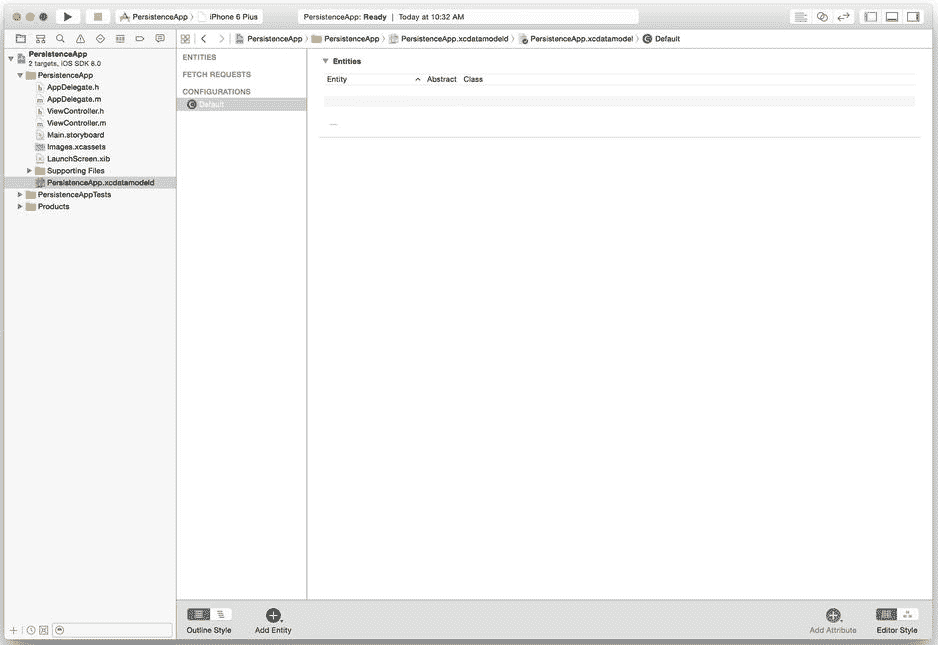

图 1-6\. 空的`PersistenceApp.xcdatamodeld`托管对象模型

我们稍后将向该模型添加实体和属性。目前，我们继续专注于添加应用程序中使用 Core Data 所需的一切。

### 添加并初始化 Core Data 堆栈

对于`PersistenceApp`应用程序，我们将把所有 Core Data 相关的内容放入一个单独的类`Persistence`中，并在`AppDelegate`类中添加该类的实例作为属性。这将使我们能够保持`AppDelegate`类的代码更简洁，并为 Core Data 访问提供清晰的接口。

使用 Source 的 Cocoa Touch Class 模板在`PersistenceApp`组中创建一个新文件，将其命名为`Persistence`，并使其成为`NSObject`的子类。现在，如果你是用 Objective-C 实现，则需将 Core Data 属性和辅助方法声明添加到`Persistence.h`中，如代码清单 1-11 所示。

***代码清单 1-11***\. `Persistence.h`

```
#import <Foundation/Foundation.h>
@import CoreData;

@interface Persistence : NSObject

@property (readonly, strong, nonatomic) NSManagedObjectContext *managedObjectContext;
@property (readonly, strong, nonatomic) NSManagedObjectModel *managedObjectModel;
@property (readonly, strong, nonatomic) NSPersistentStoreCoordinator *persistentStoreCoordinator;

- (void)saveContext;
- (NSURL *)applicationDocumentsDirectory;

@end
```

在实现文件`Persistence.m`中，添加两个辅助方法的实现，它们与 Xcode 生成的版本没有太大差异，如代码清单 1-12 所示。

***代码清单 1-12***\. `Persistence.m`中的辅助方法实现

```
- (void)saveContext {
  NSError *error;
  if ([self.managedObjectContext hasChanges] && ![self.managedObjectContext save:&error]) {
    NSLog(@"Unresolved error %@, %@", error, [error userInfo]);
    abort();
  }
}

- (NSURL *)applicationDocumentsDirectory {
  return [[[NSFileManager defaultManager] URLsForDirectory:NSDocumentDirectory inDomains:NSUserDomainMask] lastObject];
}
```

注意，我们在保存前没有检查`managedObjectContext`属性是否为`nil`，因为我们将在`Persistence`实例初始化时创建它，所以我们知道它不会是`nil`。不过，我们目前仍保留了这种简单的错误处理方式。

要初始化 Core Data 堆栈，请添加`init`的实现，该实现创建托管对象模型、持久化存储协调器和托管对象上下文，如代码清单 1-13 所示。

***代码清单 1-13***\. 在`Persistence.m`中初始化 Core Data 堆栈

```
- (id)init {
  self = [super init];
  if (self != nil) {
    // Initialize the managed object model
    NSURL *modelURL = [[NSBundle mainBundle] URLForResource:@"PersistenceApp" withExtension:@"momd"];
    _managedObjectModel = [[NSManagedObjectModel alloc] initWithContentsOfURL:modelURL];

// Initialize the persistent store coordinator
    NSURL *storeURL = [[self applicationDocumentsDirectory] URLByAppendingPathComponent:@"PersistenceApp.sqlite"];

NSError *error = nil;
    _persistentStoreCoordinator = [[NSPersistentStoreCoordinator alloc] initWithManagedObjectModel:self.managedObjectModel];
    if (![_persistentStoreCoordinator addPersistentStoreWithType:NSSQLiteStoreType
                                                  configuration:nil
                                                            URL:storeURL
                                                        options:nil
                                                          error:&error]) {
      NSLog(@"Unresolved error %@, %@", error, [error userInfo]);
      abort();
    }

// Initialize the managed object context
    _managedObjectContext = [[NSManagedObjectContext alloc] init];
    [_managedObjectContext setPersistentStoreCoordinator:self.persistentStoreCoordinator];
    }
  return self;
}
```

在第 9 章中，我们将修改此方法以使用线程来获得更好的性能，但目前我们在主线程上执行所有初始化。

要完成 Core Data 堆栈的初始化，我们向应用程序委托添加一个`Persistence`属性，并在应用程序加载时创建它。打开`AppDelegate.h`，添加`Persistence`的前向声明，并添加该属性，使文件与代码清单 1-14 匹配。

***代码清单 1-14***\. `AppDelegate.h`

```
#import <UIKit/UIKit.h>

@class Persistence;

@interface AppDelegate : UIResponder <UIApplicationDelegate>

@property (strong, nonatomic) UIWindow *window;
@property (strong, nonatomic) Persistence *persistence;

@end
```

接下来，打开`AppDelegate.m`并添加对`Persistence.h`的导入：

```
#import "Persistence.h"
```

作为初始化 Core Data 堆栈的最后一步，在`application:didFinishLaunchingWithOptions`方法中分配并初始化`persistence`属性。此方法现在应与代码清单 1-15 匹配。

***代码清单 1-15***\. 分配并初始化`persistence`属性

```
- (BOOL)application:(UIApplication *)application didFinishLaunchingWithOptions:(NSDictionary *)launchOptions {
  self.persistence = [[Persistence alloc] init];
  return YES;
}
```

如果你正在用 Swift 构建此项目，你的工作遵循相同的模式，尽管没有头文件。在你的`Persistence`类中，为托管对象上下文添加一个变量。我们将在此托管对象上下文变量的闭包中完成所有初始化。你还需添加用于保存上下文和获取应用程序文档目录的辅助方法。代码清单 1-16 显示了更新后的`Persistence.swift`文件，代码清单 1-17 显示了`AppDelegate.swift`中用于创建`Persistence`实例的补充。请注意，Core Data 堆栈将在我们创建`Persistence`实例时初始化；如果希望改为在首次访问托管对象上下文时初始化 Core Data，我们只需在托管对象上下文变量上添加`@lazy`注解。

***代码清单 1-16***\. 为 Core Data 更新的`Persistence.swift`

```
import Foundation
import CoreData

class Persistence: NSObject {
```


`var managedObjectContext: NSManagedObjectContext? = {
    // 初始化托管对象模型
    let modelURL = NSBundle.mainBundle().URLForResource("PersistenceAppSwift", withExtension: "momd")!
    let managedObjectModel = NSManagedObjectModel(contentsOfURL: modelURL)

    // 初始化持久化存储协调器
    let storeURL = Persistence.applicationDocumentsDirectory.URLByAppendingPathComponent("PersistenceAppSwift.sqlite")
    var error: NSError? = nil
    let persistentStoreCoordinator = NSPersistentStoreCoordinator(managedObjectModel: managedObjectModel!)
    if persistentStoreCoordinator.addPersistentStoreWithType(NSSQLiteStoreType, configuration: nil, URL: storeURL, options: nil, error: &error) == nil {
        abort()
    }

    // 初始化托管对象上下文
    var managedObjectContext = NSManagedObjectContext()
    managedObjectContext.persistentStoreCoordinator = persistentStoreCoordinator

    return managedObjectContext
}()

func saveContext() {
    var error: NSError? = nil

    if {
        if managedObjectContext.hasChanges && !managedObjectContext.save(&error) {
            abort()
        }
    }
}

class var applicationDocumentsDirectory: NSURL {
    let urls = NSFileManager.defaultManager().URLsForDirectory(.DocumentDirectory, inDomains: .UserDomainMask)
    return urls[urls.endIndex-1] as NSURL
}
```

**代码清单 1-17** 更新后的 `AppDelegate.swift`

```
import UIKit
import CoreData

@UIApplicationMain
class AppDelegate: UIResponder, UIApplicationDelegate {

    var window: UIWindow?
    var persistence: Persistence?

    func application(application: UIApplication!, didFinishLaunchingWithOptions launchOptions: NSDictionary!) -> Bool {
        persistence = Persistence()
        return true
    }
    /* 代码已省略 */
}
```

现在，Core Data 堆栈会在应用运行时正确初始化，但由于没有对象模型或其中的任何对象，我们无法真正看到其效果。下一步是创建一个对象模型。

## 创建对象模型

到目前为止，我们已经将 Core Data 的所有部分添加到了应用中——如果当初勾选了“使用 Core Data”复选框，Xcode 本会替我们完成这些操作。对于手动添加 Core Data 的应用，你需要以与勾选了 Xcode 的“使用 Core Data”复选框时相同的方式创建对象模型。

对于 `PersistenceApp`，我们需要存储具有名称和价格的小工具。在 Xcode 的项目导航器中打开对象模型 `PersistenceApp.xcdatamodeld`，并添加一个名为 `Gadget` 的实体，其中包含一个名为 `name` 的 `String` 类型属性和一个名为 `price` 的 `Float` 类型属性。你的数据模型应与图 1-7 一致。

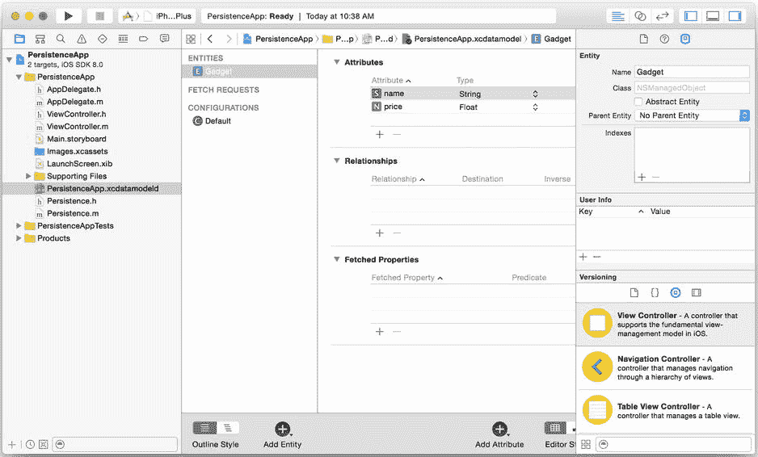

**图 1-7** `PersistenceApp.xcdatamodeld` 托管对象模型中的 `Gadget` 实体

现在我们有了对象模型，就可以在其中创建一些对象了。

## 向 PersistenceApp 添加对象

我们再次使用 `application:didFinishLaunchingWithOptions` 方法向对象模型添加对象。不过，这次我们将从 `application:didFinishLaunchingWithOptions` 中调用另一个方法来执行这些操作。此外，我们不再依赖 `sqlite3` 命令行工具查看存储的数据，而是从持久化存储中提取对象并将其记录到控制台——同样是通过一个单独的方法完成。首先，在 `application:didFinishLaunchingWithOptions` 中添加对即将创建的两个方法的调用，使代码与代码清单 1-18（Objective-C）或代码清单 1-19（Swift）一致。

**代码清单 1-18** 添加对创建和提取对象的调用（Objective-C）

```
- (BOOL)application:(UIApplication *)application didFinishLaunchingWithOptions:(NSDictionary *)launchOptions {
    self.persistence = [[PAPersistence alloc] init];
    [self createObjects];
    [self fetchObjects];

    return YES;
}
```

**代码清单 1-19** 添加对创建和提取对象的调用（Swift）

```
func application(application: UIApplication!, didFinishLaunchingWithOptions launchOptions: NSDictionary!) -> Bool {
    persistence = Persistence()

    createObjects()
    fetchObjects()

    return true
}
```

然后，为这些新方法创建实现。`createObjects` 方法看起来应该很熟悉；和之前一样，你在托管对象上下文中创建对象，然后保存上下文。这段代码创建了四个 `Gadget` 实例：一台 iPad、一台 iPad Mini、一部 iPhone 和一台 iPod touch。它们的价格以美元为单位，可能不一定准确！代码清单 1-20 展示了 Objective-C 代码，代码清单 1-21 展示了 Swift 代码。需要注意一点：由于 KVC 要求对象值而非原始值，因此我们为对象设置的价格是 `NSNumber` 实例，而非浮点原始值。

**代码清单 1-20** Objective-C 的 `createObjects` 方法

```
- (void)createObjects {
    NSManagedObject *iPad = [NSEntityDescription insertNewObjectForEntityForName:@"Gadget" inManagedObjectContext:self.persistence.managedObjectContext];
    [iPad setValue:@"iPad" forKey:@"name"];
    [iPad setValue:@499.0f forKey:@"price"];

    NSManagedObject *iPadMini = [NSEntityDescription insertNewObjectForEntityForName:@"Gadget" inManagedObjectContext:self.persistence.managedObjectContext];
    [iPadMini setValue:@"iPad Mini" forKey:@"name"];
    [iPadMini setValue:@329.0f forKey:@"price"];

    NSManagedObject *iPhone = [NSEntityDescription insertNewObjectForEntityForName:@"Gadget" inManagedObjectContext:self.persistence.managedObjectContext];
    [iPhone setValue:@"iPhone" forKey:@"name"];
    [iPhone setValue:@199.0f forKey:@"price"];

    NSManagedObject *iPodTouch = [NSEntityDescription insertNewObjectForEntityForName:@"Gadget" inManagedObjectContext:self.persistence.managedObjectContext];
    [iPodTouch setValue:@"iPod touch" forKey:@"name"];
    [iPodTouch setValue:@299.0f forKey:@"price"];

    [self.persistence saveContext];
}
```

**代码清单 1-21** Swift 的 `createObjects` 函数

```
func createObjects() {
    if let persistence = persistence {
        let iPad = NSEntityDescription.insertNewObjectForEntityForName("Gadget", inManagedObjectContext: persistence.managedObjectContext!) as NSManagedObject
        iPad.setValue("iPad", forKey: "name")
        iPad.setValue(499, forKey: "price")

        let iPadMini = NSEntityDescription.insertNewObjectForEntityForName("Gadget", inManagedObjectContext: persistence.managedObjectContext!) as NSManagedObject
        iPadMini.setValue("iPad Mini", forKey: "name")
        iPadMini.setValue(329, forKey: "price")

        let iPhone = NSEntityDescription.insertNewObjectForEntityForName("Gadget", inManagedObjectContext: persistence.managedObjectContext!) as NSManagedObject
        iPhone.setValue("iPhone", forKey: "name")
        iPhone.setValue(199, forKey: "price")

        let iPodTouch = NSEntityDescription.insertNewObjectForEntityForName("Gadget", inManagedObjectContext: persistence.managedObjectContext!) as NSManagedObject
        iPodTouch.setValue("iPod Touch", forKey: "name")
        iPodTouch.setValue(299, forKey: "price")

        persistence.saveContext()
    }
    else {
        println("错误：持久化层未初始化")
    }
}
```


`fetchObjects`方法从持久化存储中获取对象，并使用`NSLog`（或`println`）将其记录到控制台。要获取对象，我们使用`NSFetchRequest`类，它代表一个获取请求。获取请求与特定实体相关联，并包含所有描述你希望从该实体获取内容的准则。通过获取请求，你可以执行诸如设置限制、指定对象必须匹配的准则、对结果进行排序以及使用高级聚合器来处理获取请求返回的结果等操作。第 2 章更详细地解释了如何使用`NSFetchRequest`，然后第 3 章更深入地探讨了获取数据的能力。不过，在这一点上，我们保持对`NSFetchRequest`的简单使用，仅从`Gadget`实体中获取所有对象。

在 iOS 5.0 之前，你通常通过分配和初始化一个`NSFetchRequest`实例、创建一个`NSEntityDescription`实例，并将`NSFetchRequest`实例的实体设置为该`NSEntityDescription`实例来创建和使用它，如代码清单 1-22 所示。

**代码清单 1-22.**  iOS 5.0 之前的`NSFetchRequest`创建

```objc
NSFetchRequest *fetchRequest = [[NSFetchRequest alloc] init];
[fetchRequest setEntity:[NSEntityDescription entityForName:@"Gadget"
                                 inManagedObjectContext:self.persistence.managedObjectContext]];
```

在 iOS 5.0 中，Apple 为`NSFetchRequest`添加了几个便捷方法，这样你就不必创建`NSEntityDescription`实例或使用两行代码将`NSFetchRequest`实例绑定到实体。一个是接受实体名称的初始化方法，另一个是接受实体名称的类方法。代码清单 1-23 显示了在 iOS 5.0 或更高版本中创建`NSFetchRequest`实例的两种方法。

**代码清单 1-23.**  在 iOS 5.0 及更高版本中创建`NSFetchRequest`实例

```objc
NSFetchRequest *fetchRequest1 = [[NSFetchRequest alloc] initWithEntityName:@"Gadget"];
NSFetchRequest *fetchRequest2 = [NSFetchRequest fetchRequestWithEntityName:@"Gadget"];
```

你可以使用任意一种方法。但是，你可能会注意到，iOS 5.0 之前的方法为实体指定了托管对象上下文，而 iOS 5.0 及之后的方法则没有。那么，`NSFetchRequest`实例如何知道使用哪个托管对象上下文来查找实体呢？

答案是，实际执行获取请求是托管对象上下文上的一个方法。对于后来的方法，托管对象上下文在执行获取请求时，会使用获取请求的实体名称来查找实际的`NSEntityDescription`。代码清单 1-24 展示了如何执行一个获取请求。

**代码清单 1-24.**  执行获取请求

```objc
NSError *error;
NSManagedObjectContext *managedObjectContext = ...; // Get from somewhere
NSArray *objects = [managedObjectContext executeFetchRequest:fetchRequest error:&error];
```

如果你不关心任何错误结果，可以为`error`传递`nil`，但通常你会需要错误信息以便处理错误。同样，第 4 章涵盖了错误处理。

凭借这些初步的获取请求知识，我们可以实现`fetchObjects`方法，如代码清单 1-25（Objective-C）或代码清单 1-26（Swift）所示。该方法创建一个获取请求，针对托管对象上下文执行它，并在控制台中显示结果。

**代码清单 1-25.**  Objective-C 的`fetchObjects`方法

```objc
- (void)fetchObjects {
  // Fetch the objects
  NSFetchRequest *fetchRequest = [NSFetchRequest fetchRequestWithEntityName:@"Gadget"];
  NSArray *objects = [self.persistence.managedObjectContext executeFetchRequest:fetchRequest error:nil];

  // Log the objects
  for (NSManagedObject *object in objects) {
    NSLog(@"%@", object);
  }
}
```

**代码清单 1-26.**  Swift 的`fetchObjects`函数

```swift
func fetchObjects() {
  if let persistence = persistence {
    let fetchRequest = NSFetchRequest(entityName: "Gadget")
    var error : NSError?
    let objects = persistence.managedObjectContext!.executeFetchRequest(fetchRequest, error: &error) as [NSManagedObject]
    if let error = error {
      println("Something went wrong: \(error.localizedDescription)")
    }

    for object in objects {
      println(object)
    }
  }
  else {
    println("Error, persistence layer not initialized")
  }
}
```

构建并运行应用程序。你应该会在 iOS 模拟器中看到一个空白屏幕，并且在 Xcode 控制台中看到类似如下的输出：

```
2014-07-07 21:49:40.537 PersistenceApp[8878:83583] <NSManagedObject: 0x7faa21e380b0> (entity: Gadget; id: 0xd000000000040000 <x-coredata://D2570307-5795-4E9A-96C9-7B477D27AB5D/Gadget/p1> ; data: {
    name = "iPad Mini";
    price = 329;
})
2014-07-07 21:49:40.538 PersistenceApp[8878:83583] <NSManagedObject: 0x7faa21e386a0> (entity: Gadget; id: 0xd000000000080000 <x-coredata://D2570307-5795-4E9A-96C9-7B477D27AB5D/Gadget/p2> ; data: {
    name = "iPod touch";
    price = 299;
})
2014-07-07 21:49:40.538 PersistenceApp[8878:83583] <NSManagedObject: 0x7faa21e38580> (entity: Gadget; id: 0xd0000000000c0000 <x-coredata://D2570307-5795-4E9A-96C9-7B477D27AB5D/Gadget/p3> ; data: {
    name = iPhone;
    price = 199;
})
2014-07-07 21:49:40.538 PersistenceApp[8878:83583] <NSManagedObject: 0x7faa21e37340> (entity: Gadget; id: 0xd000000000100000 <x-coredata://D2570307-5795-4E9A-96C9-7B477D27AB5D/Gadget/p4> ; data: {
    name = iPad;
    price = 499;
})
```

如果你运行的是应用程序的 Swift 版本，输出会更简洁一些，如下所示：

```
<NSManagedObject: 0x7be633a0> (entity: Gadget; id: 0x7be68180 <x-coredata://9796AAF7-58AA-4B3A-86B8-A1897330E17F/Gadget/p1> ; data: {
    name = iPad;
    price = 499;
})
<NSManagedObject: 0x7be66d60> (entity: Gadget; id: 0x7be681e0 <x-coredata://9796AAF7-58AA-4B3A-86B8-A1897330E17F/Gadget/p2> ; data: {
    name = iPhone;
    price = 199;
})
<NSManagedObject: 0x7be666b0> (entity: Gadget; id: 0x7be681d0 <x-coredata://9796AAF7-58AA-4B3A-86B8-A1897330E17F/Gadget/p3> ; data: {
    name = "iPad Mini";
    price = 329;
})
<NSManagedObject: 0x7be66e20> (entity: Gadget; id: 0x7be68250 <x-coredata://9796AAF7-58AA-4B3A-86B8-A1897330E17F/Gadget/p4> ; data: {
    name = "iPod Touch";
    price = 299;
})
```

和之前一样，你也可以使用`sqlite3`探索 SQLite 数据库，但日志消息证明了对象已被存储和检索。

## 总结

在本章中，你了解了 Core Data 是什么以及它的用途。你学习了数据持久化的重要性。你了解了 Core Data 的组件以及它们如何协同工作。你构建了两个基于 Core Data 的应用程序：一个由 Xcode 为你设置，另一个你自行设置了 Core Data。你向 Core Data 持久化存储中存储了数据并检索了它们。

你在本章中构建的应用程序使用了贫血对象模型。在下一章中，我们将基于本章的知识创建更复杂的对象模型。你还将学习排序和使用谓词等概念，并理解 Core Data 对象模型的力量。

## 第 2 章

构建数据模型


# 排版后内容

你可以用最直观的用户界面创建应用程序，让它们执行用户离不开的任务，但如果你没有正确地对数据进行建模，你的应用程序将变得难以维护、性能低下，甚至可能无法使用。本章将解释如何对数据进行建模，以支撑而非破坏你的应用程序。

在上一章中，你使用 Xcode 的空应用程序模板构建了一个简单的 iOS 应用程序。本章中，我们将对一个书店进行建模，并构建一个应用程序来存储关于我们现有书籍的信息。与上一章相同，我们暂不构建任何用户界面代码，继续将重点放在 Core Data 上。

## 设计你的数据库

美国哲学家拉尔夫·沃尔多·爱默生曾说过：“愚蠢的一致性是小心眼儿的小妖精。”人们经常引用这句话来为自己的粗心大意或对细节的忽视辩护。我们希望我们不会陷入这种陷阱——当我们前后矛盾地在声称 Core Data 不是数据库和把它当作数据库之间摇摆不定时。本节将讨论如何设计你的数据结构，并将这个过程类比为对关系数据库进行建模，这不仅极大地有助于讨论，也有助于最终的设计。然而，如同所有的类比一样，这种类比在某些地方会失效，我们将在整个讨论中指出这些地方。

Core Data 的实体描述在外观、行为、感觉和特性上都与关系数据库中的表极其相似。属性看起来像表中的列，关系感觉像是基于主键和外键的连接，而实体则如同表中的行。如果你的模型位于 SQLite 持久化存储之上，Core Data 实际上会将实体描述、属性、关系和实体实现为你所期望的数据库结构。但请记住，你的数据也可以只存在于内存中，或者存在于某些没有表、行、列、主键和外键的平面文件原子存储中。Core Data 将数据结构从关系数据库结构中抽象出来，简化了你对数据的建模和交互方式。在你的心智模型中要接纳这种抽象，否则你会在 Core Data 模型中塞满冗余，与 Core Data 背道而驰，并产生次优的数据结构。

有数据建模经验的新手在接触 Core Data 时，常常抱怨缺少自增字段类型，他们认为自己负有像传统数据建模中那样为每个表定义主键的责任。Core Data 没有自增类型，因为你根本不需要定义任何主键。Core Data 负责建立并维护每个托管对象的唯一性，无论它是否是表中的一行。

没有主键也意味着没有外键；Core Data 管理实体（或表）之间的关系，并为你执行任何必要的连接操作。尽快克服因不定义主键和外键而产生的不适感，因为纠结于这个实现细节不值得你花费精力或感到焦虑。

**提示**  在创建你的 Core Data 模型时，要记住一个经验法则：关注数据本身，而不是数据存储机制。

## 关系数据库规范化

关系数据库理论推崇一个称为规范化的过程，用于设计数据模型。规范化的目标是减少或消除冗余，并提供对数据库内部数据的高效访问。规范化过程分为五个级别或范式，并且仍在继续研究第六范式。这五个范式的定义只有逻辑学家才会喜欢甚至理解；它们读起来像这样：

*一个关系 R 处于第四范式（4NF），当且仅当，每当 R 中存在一个 MVD（多值依赖），例如 A -> -> B，那么 R 的所有属性也在函数上依赖于 A。换句话说，R 中唯一的依赖（FDs 或 MVDs）都是 K -> X 的形式（即，从候选键 K 到其他属性 X 的函数依赖）。等价地：R 是 4NF，如果它属于 BCNF，并且 R 中的所有 MVD 实际上都是 FD。*

(`www.databasedesign-resource.com/normal-forms.html`)

我们既没有足够的篇幅，也没有意愿逐一讲解每个范式的形式化定义并解释其含义。相反，本节将描述每个范式与 Core Data 的关系，并提供数据建模建议。请注意，遵守某个给定的范式需要先遵守其之前的所有范式。

符合第一范式（1NF）的数据库被认为是规范化的。要达到这个规范化级别，数据库中的每一行必须具有相同数量的字段。对于 Core Data 模型来说，这意味着每个托管对象应该具有相同数量的属性。由于 Core Data 不允许你在实体中创建可变数量的属性，因此你的 Core Data 模型会自动规范化。

第二范式（2NF）和第三范式（3NF）处理非键字段与键字段之间的关系，规定非键字段应该是对它们所属的整个键字段的描述。由于你的 Core Data 模型没有键字段，你不应该遇到这些问题的困扰。然而，你应该确保给定实体的所有属性都描述该实体本身，而不是其他东西。例如，一个描述书籍类别的 `Category` 实体不应该有 `author` 字段，因为作者描述的是书，而不是书所属的类别。

接下来的两个范式，第四范式（4NF）和第五范式（5NF），在 Core Data 世界中可以被视为同一个范式。它们涉及减少或消除数据冗余，促使你将多值属性拆分到单独的实体中，并在实体之间创建对多关系。用 Core Data 的术语来说，4NF 规定不应使用实体属性来存储多个值。相反，你应该将这些属性移到一个单独的实体中，并在实体之间创建一个对多关系。例如，考虑本章中我们在书店应用程序模型中的类别和书籍。一个会违反 4NF 和 5NF 的模型会有一个单独的 `Category` 实体，并带有一个额外的 `book` 属性。然后我们会为每本书创建一个新的类别托管对象，这样就会产生多个冗余的 `Category` 对象。相反，书店数据模型将包含一个 `Category` 实体和独立的 `Book` 实体。

## 构建一个简单模型

在 Xcode 中创建一个新的单视图应用程序项目，这样我们就可以开始构建一个简单的模型。延续我们富有想象力的应用命名系列，将这个新应用程序命名为 `BookStore`，并将语言设置为你选择的语言，如图 2-1 所示。

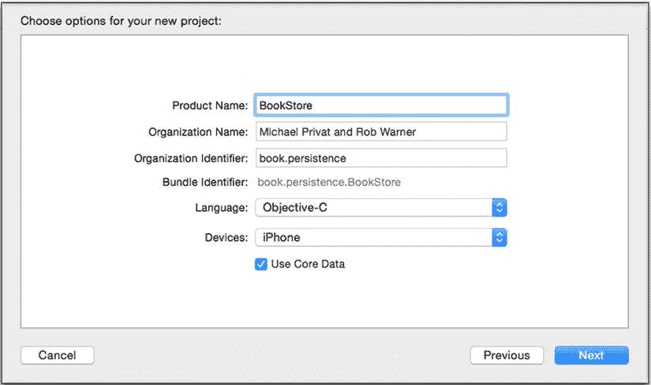

图 2-1. 创建 `BookStore` 项目

此时，你应该已经熟悉了第 1 章中描述的所有 Core Data 组件。找到 Xcode 创建的对象模型（名为 `BookStore.xcdatamodeld`）并打开它。正如预期，它是空的。

**提示**  在第 1 章中，我们向你展示了如何保持应用程序委托没有 Core Data 初始化代码，并将其移到一个像 `Persistence` 这样的类中。你可以选择在本章中复制这种模式，或者保持 Xcode 模板不变并继续操作。

## 实体


## Core Data 模型设计

正如设计面向对象应用程序一样，你应该花时间思考 Core Data 模型所需的细节层次，以设计出正确的模型对象集。以图书库建模为例，我们希望能够按类别快速定位图书馆中的书籍。因此，我们从创建`BookCategory`实体开始。点击 Xcode 窗口底部的“Add Entity”按钮，并将新创建的实体重命名为`BookCategory`。

**提示**  在 Objective-C 运行时中已经存在一个名为`Category`的类，因此最好避免使用此名称以防止编译错误。在本书中，我们使用`BookCategory`这个名称。

Core Data 在运行时将对象表示为`NSManagedObject`的实例。选择`BookCategory`实体并打开“Data Model”检查器。注意`BookCategory`实体默认映射到`NSManagedObject`类。在设计模型时，请记住实体类似于类（因此命名约定也相似）。

## 属性

属性是用于描述实体的特征。想象一下，为了 BookStore 应用程序的目的，需要如何描述类别。我们至少需要为类别赋予一个名称，以便图书管理员能够快速了解该类别所指的内容。要添加名称，请向`BookCategory`实体添加一个名为`name`的新属性，并将其类型更改为`String`。

**提示**  注意实体名称使用 Pascal 大小写，也称为首字母大写的驼峰命名法（类似于 Objective-C 类名），而属性使用小写字母开头但仍采用驼峰命名法（类似于 Objective-C 类的属性）。

此时，你的模型应类似于图 2-2。

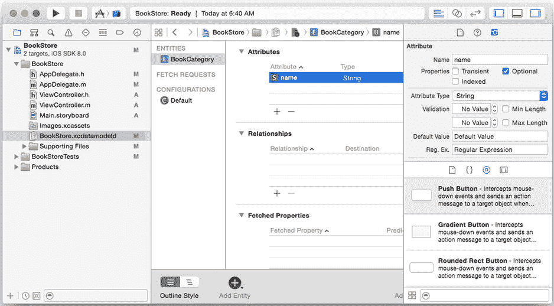

图 2-2。带有`name`属性的`BookCategory`实体

Core Data 支持一组有限的属性类型，如表 2-1（适用于 Objective-C 代码）和表 2-2（适用于 Swift 代码）所述。

表 2-1。Objective-C 中可用的属性类型

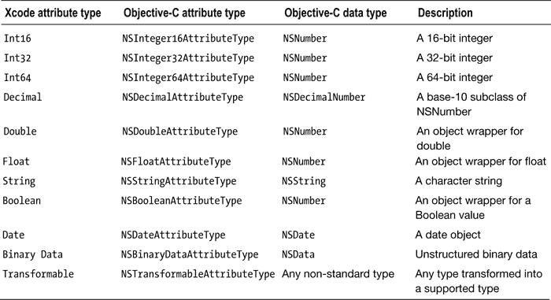

表 2-2。Swift 中可用的属性类型

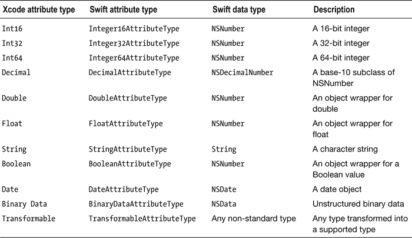

大多数这些类型都很直观，因为它们直接映射到 Objective-C 数据类型。使用它们只需利用`NSManagedObject`实例的键/值访问器即可。`Transformable`类型是唯一没有 Objective-C 对应类型的类型。它用于自定义类型，可用来处理 Core Data 尚未支持的任何类型。当你尝试持久化的属性无法很好地归入支持的数据类型之一时，请使用`Transformable`作为类型。例如，如果你的托管对象需要表示颜色并需要持久化它，那么使用`CGColorRef`类型是合理的。在这种情况下，你需要将 Core Data 类型设置为`transient`和`Transformable`，并向 Core Data 提供将属性转换为支持数据类型的机制。当你创建自己的继承自`NSManagedObject`的托管对象时，使用自定义属性是有意义的，我们将在第 7 章中更详细地讨论。

## 键值编码

`NSManagedObject`实例符合键值编码（KVC）规范。KVC 是一种使用预定义命名约定访问对象属性的机制。`NSManagedObject`为 Objective-C 和 Swift 都提供了 KVC 方法的实现。以下是 Objective-C 中的方法声明：

```
- (void)setValue:(id)value forKey:(NSString *)key
```

以及

```
- (id)valueForKey:(NSString *)key
```

以下是它们的 Swift 对应版本：

```
func setValue(_ value: AnyObject!, forKey key: String!)
```

以及

```
func valueForKey(_ key: String!) -> AnyObject!
```

在代码中访问属性变得很简单，如下面的 Objective-C 代码片段所示：

```
NSManagedObject *myCategory = ....
// 获取 name 属性的当前值
NSString *name = [myCategory valueForKey:@"name"];
// 将 name 属性的值设置为 Magazines
[myCategory setValue:@"Magazines" forKey:@"name"];
```

以下是对应的 Swift 代码：

```
var myCategory = ....
// 获取 name 属性的当前值
var name: AnyObject! = myCategory.valueForKey("name")
// 将 name 属性的值设置为 Magazines
myCategory.setValue("Magazines", forKey: "name")
```

## 生成类

你的代码可以一直使用`NSManagedObject`实例和 KVC，但随着模型增长并拥有许多不同的实体，将一切都称为“托管对象”会变得非常混乱。因此，Core Data 允许你将实体直接映射到自定义类。所有属性都映射到 Objective-C 的属性，一切都变得更易于管理。

在 Xcode 中，选择`BookCategory`实体。在菜单中，选择“Editor”“Create NSManagedObject Subclass…”并按照提示操作，直到点击“Create”。

**提示**  如果你选中“Use scalar properties for primitive data types”复选框，代码生成器将使用原始类型（而非`NSNumber`）来存储数值。在决定是否使用标量值时，请考虑你将如何访问数据。例如，标量值更容易在算术运算中访问和使用，但如果不先包装为`NSNumber`，则无法将它们添加到集合中。

一个名为`BookCategory`的新类已添加到你的 Xcode 项目中。对于 Objective-C 版本，`BookCategory.h`如列表 2-1 所示。

***列表 2-1***。`BookCategory.h`

```
#import <Foundation/Foundation.h>
#import <CoreData/CoreData.h>

@interface BookCategory : NSManagedObject

@property (nonatomic, retain) NSString * name;

@end
```

如果你在 Swift 中创建此项目，则会有一个名为`BookCategory.swift`的文件，如列表 2-2 所示。

***列表 2-2***。`BookCategory.swift`

```
import Foundation
import CoreData

class BookCategory: NSManagedObject {

@NSManaged var name: String

}
```

无论使用哪种语言，`BookCategory`都是`NSManagedObject`的子类，并且具有一个名为`name`的类型为`NSString`（Objective-C）或`String`（Swift）的简单属性。这与模型相匹配。该类与实体之间的映射保存在模型本身中。返回模型并选择`BookCategory`实体。打开“Data Model”检查器，可以看到其关联的类现在是`BookCategory`（新创建的类）。

如果你在 Swift 中做这个项目，还有一点额外工作要做（除非未来的 Xcode 版本修复了这个问题）。与 Objective-C 不同，Swift 有命名空间。当 Swift 编译你的类时，它会将它们放入包含模块的命名空间中，该命名空间通常与项目名称匹配。这意味着你的`BookCategory`类实际命名为`BookStoreSwift.BookCategory`（如果你像我们一样将项目命名为`BookStoreSwift`）。然而，Core Data 模型只显示`BookCategory`作为类名。如果你现在运行程序，控制台会显示类似如下的错误消息：

```
CoreData: warning: Unable to load class named 'BookCategory' for entity 'BookCategory'.  Class not found, using default NSManagedObject instead.
```

要解决此问题，你可以将 Core Data 模型中的类名更新为`BookStoreSwift.BookCategory`，或者向`BookCategory`类添加一个属性，告诉 Core Data 该类实际上就是命名为`BookCategory`，如列表 2-3 所示。


### 清单 2-3. 使用 `@objc` 属性为 Objective-C 重命名类

```swift
import Foundation
import CoreData

@objc(BookCategory)
class BookCategory: NSManagedObject {

    @NSManaged var name: String

}
```

`@objc(name)` 属性会将类对 Objective-C 类暴露的名称改为 `name`，因此我们可以指定模型所需的、不带命名空间的版本。

现在，访问 `name` 属性比之前更简单、更熟悉：

```objc
BookCategory *myCategory = ....
// 获取 name 属性的当前值
NSString *name = myCategory.name;
// 将 name 属性的值设置为 Magazines
myCategory.name = @"Magazines";
```

在 Swift 中，代码如下所示：

```swift
var myCategory = ....
// 获取 name 属性的当前值
var name: AnyObject! = myCategory.name
// 将 name 属性的值设置为 Magazines
myCategory.name = "Magazines"
```

## 关系

在规范化数据模型时，根据所建模数据的复杂程度，你很可能会创建多个实体。关系让你能够将实体连接在一起。Core Data 允许你调优所创建的关系，以准确反映数据之间的关联方式。首先，向模型中添加一个 `Book` 实体。此时，先不为其设置任何属性，我们先弄清楚该实体的内容。

在 BookStore 应用程序中，你可以看到类别与其所含书籍之间存在明显的关系。现在，我们将问题保持相对简单：假设一本书只能属于一个类别。让我们在模型中体现这种关系。

选中 `BookCategory` 实体，然后在“关系”部分点击 + 按钮。Xcode 会创建一个新的关系供你配置。将名称设为 `books`，将目标设为 `Book`，暂时留空反向关系。在 Xcode 的数据模型检查器标签页中，将类型改为“对多”，表示此关系可能指向多个书籍。这称为一对多关系。 图 2-3 显示了当前模型的样子。

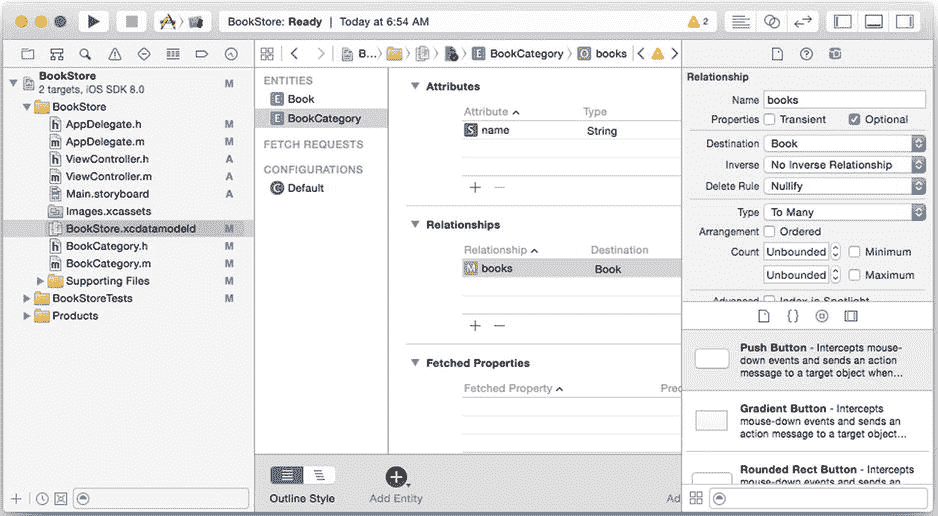

**图 2-3.** 一对多关系

如果留空`反向`字段，编译器会给出警告。你可以忽略这些警告，在不指定反向关系的情况下运行应用程序——毕竟这些是编译器警告，而非编译器错误——但你可能会遇到意外的后果。Core Data 使用双向关系信息来维护对象图的一致性（因此会出现“一致性错误”），并管理撤销和重做信息。如果留下一个没有反向关系的关系，就意味着你要自行负责对象图的一致性和撤销/重做管理。然而，Apple 文档强烈不鼓励这样做，尤其是在“对多”关系的情况下。当你不指定反向关系时，当此端的管理对象发生更改时，关系另一端的管理对象不会被标记为已更改。例如，假设一个玩家对象被删除，并且它没有指向其队伍的反向关系。当保存对象图时，任何可选性规则或删除规则都不会被强制执行。

为了遵守规范并帮助 Core Data，请添加反向关系——即，对于给定的书籍，它所属的类别。选中 `Book` 实体并添加一个新关系。将名称设为 `category`，目标设为 `BookCategory`，反向设为 `books`。如果你回到 `BookCategory` 实体并选中 `books` 关系，你会看到其反向关系现在也已自动设置。

## 关系属性

让我们来看看配置关系时可用的选项。选中 `books` 关系，打开数据模型检查器，如图 2-3 所示。

第一个字段“名称”，会成为 `NSManagedObject` 用来引用该关系的键名。按照惯例，它使用被引用实体的小写名称。对于“对多”关系，名称字段通常使用复数形式。请注意，这些指导方针只是惯例，但如果你遵循它们，你的数据模型将更易于理解、维护和操作。你可以看到 BookStore 数据模型遵循了这些惯例——在 `Book` 实体中，到 `BookCategory` 实体的关系被称为 `category`。在 `BookCategory` 实体中，到 `Book` 实体的关系（一个对多关系）被称为 `books`。

“属性”字段有两个选项，均为复选框，你可以独立设置它们。第一个是“瞬态”，允许你指定一个关系不应保存到持久化存储中。瞬态关系仍然支持撤销和重做操作，但在应用程序退出时消失，其生命周期如同好莱坞的婚姻一般短暂。瞬态关系的一些可能用途包括：

* 实体之间的关系是临时的，不应在当前应用程序运行之外继续存在。
* 关系信息可以从某些外部数据源派生，无论是另一个 Core Data 持久化存储还是其他信息源。

在大多数情况下，你希望关系是持久的，并且会保持“瞬态”复选框为未选中状态。

第二个属性复选框“可选”，指定此关系是否需要一个非 `nil` 的值。可以将其视为数据库中可空列与不可空列。如果勾选了“可选”复选框，此实体类型的管理对象可以在未为此关系指定任何内容的情况下保存到持久化存储中。但是，如果未勾选，保存上下文将失败。例如，如果 BookStore 应用程序数据模型中的 `Book` 实体未勾选此复选框，那么每个书籍实体都必须属于一个类别。将某本书的 `"category"` 值设置为 `nil`（或根本不设置）将导致所有对 `save:` 的调用失败，并出现错误描述：“category 是必需值。”

下一个字段“删除规则”，我们将在下一节中介绍。

“类型”字段有两个选项：“对多”和“对一”。“对一”意味着此关系在关系的每一端都恰好有一个管理对象（或零个，取决于可选性设置）。对于 BookStore 应用程序，如果将对 `Category` 实体的 `books` 关系设置为“对一”类型，则意味着给定类别中只能存在一本书，这显然对于书籍类别来说是反直觉的。但如果实体是 `Frame` 和 `Picture`，那么“对一”类型就有意义了，因为一个相框通常只包含一张照片。将此字段设置为“对多”意味着目标实体可以有多个管理对象，这些对象与当前实体类型的每个管理对象实例相关联。

下一个字段“计数”，用于限制可以与当前实体类型的每个管理对象相关联的目标实体类型的管理对象数量，并且仅在类型设置为“对多”时生效。你可以为“最小值”和/或“最大值”指定值，Core Data 将强制执行你设置的规则。请注意，你可以只设置其中一个而不设置另一个——不必两者都设置。超出你设置的限制会导致 `save:` 操作失败，并显示“项目过多”或“项目过少”的错误消息。请注意，“可选”设置会覆盖“最小计数”设置：如果勾选了“可选”且“最小计数”为 1，则在关系计数为零时保存上下文仍然成功。

### 删除规则


## 删除规则设置

`Delete Rule`（删除规则）设置用于指定当你试图删除此实体类型的托管对象时会发生什么。表 2-3 列出了四种可能性及其含义。

表 2-3 删除规则选项

| 规则名称 | 描述 |
| --- | --- |
| 级联（Cascade） | 删除源对象，同时也会删除所有相关的目标对象。 |
| 拒绝（Deny） | 如果源对象与任何目标对象有关联，则删除请求失败，不会删除任何内容。 |
| 置空（Nullify） | 删除源对象，并将所有相关目标对象的反向关系设置为 nil。 |
| 无操作（No Action） | 删除源对象，不对任何相关目标对象进行任何更改。 |

请谨慎设置关系中的 `Delete Rule`。例如，在 `BookStore` 应用中，如果你将 `BookCategory` 实体中 `books` 关系的 `Delete Rule` 设置为“级联（Cascade）”，那么删除一个类别将会删除所有与该类别相关的图书。这很可能不是你想要的结果。如果你将该规则设置为“拒绝（Deny）”，并且某个类别中包含图书，那么尝试删除该类别将导致任何保存上下文的操作失败，并显示消息“category is not valid”。将 `Delete Rule` 设置为“置空（Nullify）”则会保留持久化存储中的图书，尽管它们不再属于任何类别。

“无操作（No Action）”选项代表了另一种方式，就像不指定反向关系一样，Core Data 允许你承担管理对象图一致性的责任。如果你为 `Delete Rule` 指定此值，Core Data 允许你删除源对象，但会向目标对象假装源对象仍然存在。对于 `BookStore` 应用来说，这意味着删除一个类别，但依然告知顾客他们查找的图书是可用的，不过这些图书不属于任何可供顾客浏览的类别。你不太可能找到使用“无操作（No Action）”设置的有说服力的理由，除非是出于当你拥有大量目标对象时的性能考虑。第 9 章 讨论了使用 Core Data 进行性能调优的话题。

## 有序属性

`Arrangement`（排列）字段用于指定 Core Data 是否应维护实体被添加到关系中的顺序，且仅适用于对多（To Many）关系。为了维护顺序，你需要勾选 `Ordered`（有序）复选框。以 `BookStore` 应用为例，我们不关心图书被添加到类别中的顺序，因此，为了查看有序关系的示例，请创建一个 `Page` 实体，并创建一个从 `Book` 到 `Page` 的名为 `pages` 的对多关系。显然，对于页面而言，我们需要维护顺序，因此通过在关系属性中勾选复选框，将 `pages` 关系的 `Arrangement` 字段设置为“有序（Ordered）”。不要忘记设置反向关系。

该模型应如图 2-4 所示。

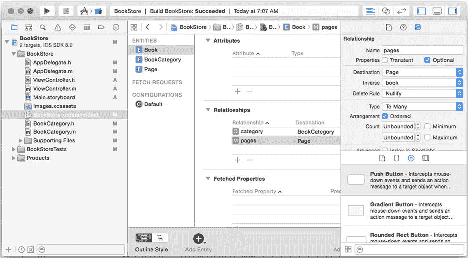

图 2-4. 包含三个实体的 BookStore 模型

通过在模型中选中所有三个实体（单击第一个实体，然后按住 shift 键并单击最后一个实体）来刷新自定义对象，然后在 Xcode 菜单中，选择 Editor  Create `NSManagedObject` Subclass…，然后按照提示操作，直到可以单击 Create。Xcode 会请求你允许替换现有的 `BookCategory` 类。单击 Replace，你将拥有三个自定义的 Core Data 托管对象：`BookCategory`、`Book` 和 `Page`。如果你选择以 Swift 生成这些类，请不要忘记要么更新 Core Data 模型中的类名以包含命名空间（例如 `BookStoreSwift.Book`），要么为类添加 `@objc()` 属性（例如 `@objc(Book)`）。

打开 `BookCategory.h`，注意与 books 的无序关系是如何表示为 `NSSet` 的。


```
@property (nonatomic, retain) NSSet *books;
```

现在打开 `Book.h`，查看如何用 `NSOrderedSet` 表示有序关系。

```
@property (nonatomic, retain) NSOrderedSet *pages;
```

你可以先在 Swift 中通过查看 `BookCategory.swift` 来看到 `NSSet`：

```
@NSManaged var books: NSSet
```

然后在 `Book.swift` 中查看 `NSOrderedSet`：

```
@NSManaged var pages: NSOrderedSet
```

`NSOrderedSet` 类提供了支持索引的访问器，让你可以指定严格的顺序。列表 2-4 展示了 Objective-C 的方法声明，列表 2-5 展示了 Swift 的声明。

***列表 2-4***。Objective-C 中的 `NSOrderedSet` 访问器

```
- (id)objectAtIndex:(NSUInteger)idx;
- (NSUInteger)indexOfObject:(id)object;
```

***列表 2-5***。Swift 中的 `NSOrderedSet` 访问器

```
func objectAtIndex(_ index: Int) -> AnyObject!
func indexOfObject(_ object: AnyObject!) -> Int
```

你还会注意到，在 Swift 版本中，`books` 和 `pages` 变量前面都有 `@NSManaged` 属性。Objective-C 的实现文件 `BookCategory.m`（如列表 2-6 所示）在 `name` 和 `books` 属性前面有一个名为 `@dynamic` 的属性。这两个属性（`@NSManaged` 和 `@dynamic`）作用相同：它们告诉编译器，该属性的 getter 和 setter 将在运行时提供，而不是在编译时。

***列表 2-6***。`BookCategory.m`

```
#import "BookCategory.h"
#import "Book.h"

@implementation BookCategory

@dynamic name;
@dynamic books;

@end
```

## 存储与检索数据

既然我们已经创建了一个基本的数据模型，下面让我们为创建好的实体添加一些属性，以便我们可以尝试存储和检索数据。

选择 `Page` 实体，添加一个新的 `String` 类型的 `text` 属性。我们将用它来存储某一页的文本。选择 `Book` 实体，添加一个 `String` 类型的 `title` 属性和一个 `Float` 类型的 `price` 属性。完成后，为所有三个实体重新生成自定义的 Core Data 对象。由于我们使用了数值类型，并且更倾向于通过原始类型来访问它们，请务必勾选 `对原始数据类型使用标量属性` 复选框。

此时，你的项目和模型应该如图 图 2-5 所示。

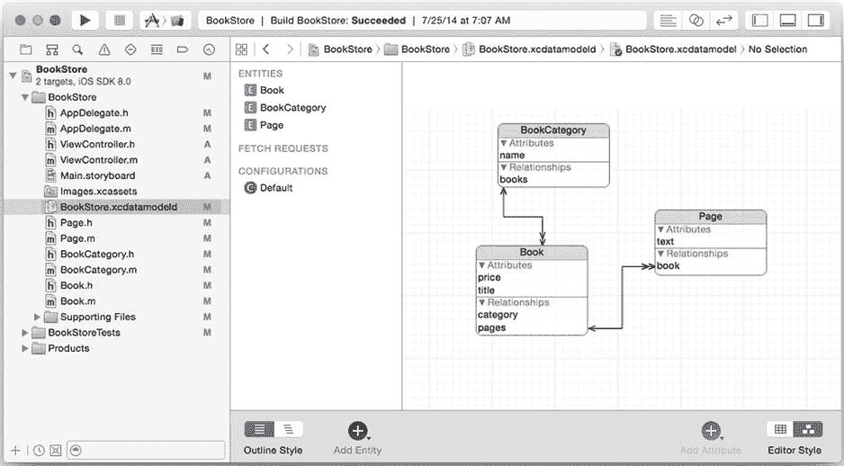

图 2-5。`BookStore` 模型及生成的自定义类

列表 2-7 展示了 `Book.h` 头文件，列表 2-8 展示了 `Book.swift` 文件。

***列表 2-7***。`Book.h`

```
#import <Foundation/Foundation.h>
#import <CoreData/CoreData.h>

@class BookCategory, Page;

@interface Book : NSManagedObject

@property (nonatomic, retain) NSString *title;
@property (nonatomic) float price;
@property (nonatomic, retain) BookCategory *category;
@property (nonatomic, retain) NSOrderedSet *pages;
@end

@interface Book (CoreDataGeneratedAccessors)

- (void)insertObject:(Page *)value inPagesAtIndex:(NSUInteger)idx;
- (void)removeObjectFromPagesAtIndex:(NSUInteger)idx;
- (void)insertPages:(NSArray *)value atIndexes:(NSIndexSet *)indexes;
- (void)removePagesAtIndexes:(NSIndexSet *)indexes;
- (void)replaceObjectInPagesAtIndex:(NSUInteger)idx withObject:(Page *)value;
- (void)replacePagesAtIndexes:(NSIndexSet *)indexes withPages:(NSArray *)values;
- (void)addPagesObject:(Page *)value;
- (void)removePagesObject:(Page *)value;
- (void)addPages:(NSOrderedSet *)values;
- (void)removePages:(NSOrderedSet *)values;
@end
```

***列表 2-8***。`Book.swift`

```
import Foundation
import CoreData

class Book: NSManagedObject {
```


```swift
@NSManaged var title: String
@NSManaged var price: Float
@NSManaged var category: BookCategory
@NSManaged var pages: NSOrderedSet
```

在 Objective-C 版本中，请注意 Core Data 如何自动添加了合适的集合访问器，从而使我们能够轻松地使用对象及其属性。然而，Swift 版本无法生成相应的运行时访问器，因此这些访问器并不存在。

## 插入新的托管对象

在完善了 Core Data 数据模型之后，我们就可以向其填充对象了。应用程序启动时，我们想用一些类别和书籍来填充 Core Data 存储。目前，我们将使用硬编码的数据。打开 `AppDelegate.m`（Objective-C）或 `AppDelegate.swift`（Swift），编辑 `application:didFinishLaunchingWithOptions:` 方法，以调用一个 `initStore` 方法，如 代码清单 2-9（Objective-C）或 代码清单 2-10（Swift）所示。

***代码清单 2-9***。创建预加载数据的钩子（Objective-C）

```objc
- (void)initStore {
  // 在此处加载数据
}

- (BOOL)application:(UIApplication *)application didFinishLaunchingWithOptions:(NSDictionary *)launchOptions {
  [self initStore];
  return YES;
}
```

***代码清单 2-10***。创建预加载数据的钩子（Swift）

```swift
func initStore() {
  // 在此处加载数据
}

func application(application: UIApplication!, didFinishLaunchingWithOptions launchOptions: NSDictionary!) -> Bool {
  initStore()
  return true
}
```

现在，我们只需创建对象并将其推送到持久化存储中即可。编辑 `AppDelegate.m` 或 `AppDelegate.swift` 文件，使 `initStore` 方法看起来像 代码清单 2-11（Objective-C）或 代码清单 2-12（Swift）所示。对于 Objective-C 版本，还必须添加以下 `import` 语句：

```objc
#import "BookCategory.h"
#import "Book.h"
#import "Page.h"
```

另外值得注意的是，Objective-C 版本利用了动态生成的 `addBooks:` 方法来添加书籍。由于 Swift 不支持这一点，我们必须改用 `NSManagedObject` 的 `mutableSetValueForKeyPath` 函数来获取书籍的可变集合，然后将书籍添加到它返回的 `NSManagedSet` 对象中。

***代码清单 2-11***。用于添加新对象的 Objective-C `initStore` 方法

```objc
- (void)initStore {
  BookCategory *fiction = [NSEntityDescription insertNewObjectForEntityForName:@"BookCategory" inManagedObjectContext:self.managedObjectContext];
  fiction.name = @"Fiction";

  BookCategory *biography = [NSEntityDescription insertNewObjectForEntityForName:@"BookCategory" inManagedObjectContext:self.managedObjectContext];
  biography.name = @"Biography";

  Book *book1 = [NSEntityDescription insertNewObjectForEntityForName:@"Book" inManagedObjectContext:self.managedObjectContext];
  book1.title = @"The first book";
  book1.price = 10;

  Book *book2 = [NSEntityDescription insertNewObjectForEntityForName:@"Book" inManagedObjectContext:self.managedObjectContext];
  book2.title = @"The second book";
  book2.price = 15;

  Book *book3 = [NSEntityDescription insertNewObjectForEntityForName:@"Book" inManagedObjectContext:self.managedObjectContext];
  book3.title = @"The third book";
  book3.price = 10;

  [fiction addBooks:[NSSet setWithArray:@[book1, book2]]];
  [biography addBooks:[NSSet setWithArray:@[book3]]];

  [self.managedObjectContext save:nil];
}
```

***代码清单 2-12***。用于添加新对象的 Swift `initStore` 函数

```swift
func initStore() {
  var fiction = NSEntityDescription.insertNewObjectForEntityForName("BookCategory", inManagedObjectContext: self.managedObjectContext) as BookCategory
  fiction.name = "Fiction"

  var biography = NSEntityDescription.insertNewObjectForEntityForName("BookCategory", inManagedObjectContext: self.managedObjectContext) as BookCategory
  biography.name = "Biography"

  var book1 = NSEntityDescription.insertNewObjectForEntityForName("Book", inManagedObjectContext: self.managedObjectContext) as Book
  book1.title = "The first book"
  book1.price = 10

  var book2 = NSEntityDescription.insertNewObjectForEntityForName("Book", inManagedObjectContext: self.managedObjectContext) as Book
  book2.title = "The second book"
  book2.price = 15

  var book3 = NSEntityDescription.insertNewObjectForEntityForName("Book", inManagedObjectContext: self.managedObjectContext) as Book
  book3.title = "The third book"
  book3.price = 10

  var fictionRelation = fiction.mutableSetValueForKeyPath("books")
  fictionRelation.addObject(book1)
  fictionRelation.addObject(book2)

  var biographyRelation = biography.mutableSetValueForKeyPath("books")
  biographyRelation.addObject(book3)

  self.saveContext()
}
```

这段代码很容易理解。但请注意，不能直接分配托管对象。相反，必须从托管对象上下文中获取它。当然，这是为了让上下文能够管理它。

`initStore` 方法创建了两个类别和三本书。它将前两本书添加到“小说”类别中，将第三本书添加到“传记”类别中。我们在此有意忽略了 `Page` 实体，以免使示例过于拥挤。

启动应用程序以执行此代码。一旦在模拟器上看到白色屏幕，就可以退出。在第 1 章中，我们向你展示了如何查找和查看支撑数据存储的 SQLite 存储。在终端窗口中使用 `sqlite3` 打开数据库文件 `BookStore.sqlite`。

`.schema` 命令确认我们的数据模型已正确创建。

```sql
sqlite> .schema
CREATE TABLE ZBOOK ( Z_PK INTEGER PRIMARY KEY, Z_ENT INTEGER, Z_OPT INTEGER, ZCATEGORY INTEGER, ZPRICE FLOAT, ZTITLE VARCHAR);
CREATE TABLE ZBOOKCATEGORY ( Z_PK INTEGER PRIMARY KEY, Z_ENT INTEGER, Z_OPT INTEGER, ZNAME VARCHAR);
CREATE TABLE ZPAGE ( Z_PK INTEGER PRIMARY KEY, Z_ENT INTEGER, Z_OPT INTEGER, ZBOOK INTEGER, Z_FOK_BOOK INTEGER, ZTEXT VARCHAR);
CREATE TABLE Z_METADATA (Z_VERSION INTEGER PRIMARY KEY, Z_UUID VARCHAR(255), Z_PLIST BLOB);
CREATE TABLE Z_PRIMARYKEY (Z_ENT INTEGER PRIMARY KEY, Z_NAME VARCHAR, Z_SUPER INTEGER, Z_MAX INTEGER);
CREATE INDEX ZBOOK_ZCATEGORY_INDEX ON ZBOOK (ZCATEGORY);
CREATE INDEX ZPAGE_ZBOOK_INDEX ON ZPAGE (ZBOOK);
```

几个查询表明我们的数据已加载完毕：

```sql
sqlite> .header on
sqlite> .mode column
sqlite> select * from ZBOOKCATEGORY;
Z_PK        Z_ENT       Z_OPT       ZNAME
----------  ----------  ----------  ----------
1           2           1           Biography
2           2           1           Fiction
sqlite> select * from ZBOOK;
Z_PK        Z_ENT       Z_OPT       ZCATEGORY   ZPRICE      ZTITLE
----------  ----------  ----------  ----------  ----------  --------------
1           1           1           1           10.0        The third book
2           1           1           2           10.0        The first book
3           1           1           2           15.0        The second boo
```

当然，如果我们再次运行该应用程序，将加载新的实体，并且会出现重复数据。

```sql
sqlite> select * from ZBOOKCATEGORY;
Z_PK        Z_ENT       Z_OPT       ZNAME
----------  ----------  ----------  ----------
1           2           1           Fiction
2           2           1           Biography
3           2           1           Biography
4           2           1           Fiction
```

这是因为 `initStore` 方法（错误地）假定运行时存储是空的。当然，我们可以在启动时通过删除 `BookStore.sqlite` 文件来创建一个新的持久化存储，但这可能有点过头了。过去会话中的某些信息将来可能会用到。为了安全起见，我们只需清除我们关心的实体即可。


首先创建一个名为`deleteAllObjects`的实用方法，用于通过实体名称清除实体。您可以在列表 2-13 中找到此方法的 Objective-C 代码，在列表 2-14 中找到 Swift 代码。向此方法传递要删除所有对象的实体名称。此方法会获取该实体的所有对象，然后将其删除。

**列表 2-13** Objective-C `deleteAllObjects`方法

```
- (void)deleteAllObjects:(NSString *)entityName {
  NSFetchRequest *fetchRequest = [NSFetchRequest fetchRequestWithEntityName:entityName];

NSError *error;
  NSArray *items = [self.managedObjectContext executeFetchRequest:fetchRequest error:&error];

for (NSManagedObject *managedObject in items) {
    [self.managedObjectContext deleteObject:managedObject];
  }

if (![self.managedObjectContext save:&error]) {
    NSLog(@"Error deleting %@ - error:%@", entityName, error);
  }
}
```

**列表 2-14** Swift `deleteAllObjects`函数

```
func deleteAllObjects(entityName: String) {
  let fetchRequest = NSFetchRequest(entityName: entityName)

let objects = self.managedObjectContext?.executeFetchRequest(fetchRequest, error: nil)
  for object in objects as [NSManagedObject] {
    self.managedObjectContext?.deleteObject(object)
  }

var error: NSError? = nil
  if !self.managedObjectContext!.save(&error) {
    println("Error deleting \(entityName) - error:\(error)")
  }
}
```

编辑`initStore`方法，在运行前清除所有图书和分类，在 Objective-C 方法的开头添加以下两行：

```
- (void)initStore {
  [self deleteAllObjects:@"Book"];
  [self deleteAllObjects:@"BookCategory"];
  ...
}
```

您的 Swift 函数应如下所示：

```
func initStore() {
  deleteAllObjects("Book")
  deleteAllObjects("BookCategory")
  ...
}
```

现在再次运行应用程序，无论运行多少次，存储都是干净的。

```
sqlite> select * from ZBOOKCATEGORY;
Z_PK        Z_ENT       Z_OPT       ZNAME
----------  ----------  ----------  ----------
3           2           1           Fiction
4           2           1           Biography
sqlite> select * from ZBOOK;
Z_PK        Z_ENT       Z_OPT       ZCATEGORY   ZPRICE      ZTITLE
----------  ----------  ----------  ----------  ----------  --------------
4           1           1           3           10.0        The first book
5           1           1           3           15.0        The second boo
6           1           1           4           10.0        The third book
```

您可能会注意到，主键计数器不会重置（表中的`Z_PK`列）——它会在您添加和删除对象时继续递增。请记住，这是一个实现细节，因此可以忽略。让 Core Data 来处理它。

## 检索托管对象

我们通过代码示例简要介绍了如何从持久化存储中检索对象。现在让我们更仔细地了解如何提取信息。为此，创建一个名为`showExampleData`的新方法。编辑`application:didFinishLaunchingWithOptions:`，在调用`initStore`之后立即添加对此新方法的调用，如列表 2-15（Objective-C）和列表 2-16（Swift）所示。

**列表 2-15** 调用`showExampleData`（Objective-C）

```
- (BOOL)application:(UIApplication *)application didFinishLaunchingWithOptions:(NSDictionary *)launchOptions {
  [self initStore];
  [self showExampleData];
  return YES;
}
```

**列表 2-16** 调用`showExampleData`（Swift）

```
func application(application: UIApplication!, didFinishLaunchingWithOptions launchOptions: NSDictionary!) -> Bool {
  initStore()
  showExampleData()
  return true
}
```

现在添加列表 2-17（Objective-C）和列表 2-18（Swift）中所示的`showExampleData`方法。此方法使用`NSLog`或`println`将持久化存储中的所有图书记录到 Xcode 控制台。

**列表 2-17** Objective-C 中的`showExampleData`方法

```
- (void)showExampleData {
  NSFetchRequest *fetchRequest = [NSFetchRequest fetchRequestWithEntityName:@"Book"];

NSArray *books = [self.managedObjectContext executeFetchRequest:fetchRequest error:nil];
  for (Book *book in books) {
    NSLog(@"Title: %@, price: %.2f", book.title, book.price);
  }
}
```

**列表 2-18** Swift 中的`showExampleData`函数

```
func showExampleData() {
  let fetchRequest = NSFetchRequest(entityName: "Book")

let books = self.managedObjectContext?.executeFetchRequest(fetchRequest, error: nil)
  for book in books as [Book] {
    println(String(format: "Title: \(book.title), price: %.2f", book.price))
  }
}
```

该方法为`Book`实体创建一个新的获取请求并执行它。由于获取请求没有选择条件，它只是返回在持久化存储中找到的所有与给定实体（即`Book`）匹配的对象。如果运行应用程序，您将在控制台中得到以下输出：

```
BookStore[84975:c07] Title: The first book, price: 10.00
BookStore[84975:c07] Title: The third book, price: 10.00
BookStore[84975:c07] Title: The second book, price: 15.00
```

您可能会注意到，图书可能有序或无序；例如，在上面的日志中，标题为“The third book”的图书出现在标题为“The second book”的图书之前。请记住，`books`关系是无序的，因此顺序是不确定的。

## 谓词

在上面的获取中，我们从`Book`实体中获取了所有图书，没有任何方法可以缩小 Core Data 返回的范围。然而，Core Data 确实提供了仅返回数据子集的机制。Core Data 使用 Foundation 框架中的`NSPredicate`类来指定在执行获取请求时如何选择应属于结果集的对象。谓词可以通过两种方式构建：您可以手动构建对象及其图形，也可以使用`NSPredicate`实现的查询语言。您会发现，大多数时候您会更喜欢后一种方法的便利性和可读性。

在本节中，我们针对每个示例研究了构建谓词的两种方式，以帮助您在查询语言和`NSPredicate`对象图形之间建立联系。理解这两种方式将帮助您确定首选方法。您还可以根据应用程序和数据场景混合搭配这些方法。

谓词查询语言从与 SQL“WHERE”子句相似的字符串表示形式构建一个`NSPredicate`对象图。从该语言构建谓词的方法是类方法`predicateWithFormat:(NSString *)`。例如，如果您想要获取表示图书“The first book”的托管对象，您可以调用`[NSPredicate predicateWithFormat:@"title = 'The first book'"]`来构建谓词。

要测试这一点，请修改`showExampleData`方法，如列表 2-19（Objective-C）和列表 2-20（Swift）所示。

**列表 2-19** 带有谓词的 Objective-C `showExampleData`方法

```
- (void)showExampleData {
  NSFetchRequest *fetchRequest = [NSFetchRequest fetchRequestWithEntityName:@"Book"];
  fetchRequest.predicate = [NSPredicate predicateWithFormat:@"title = 'The first book'"];

NSArray *books = [self.managedObjectContext executeFetchRequest:fetchRequest error:nil];
  for (Book *book in books) {
    NSLog(@"Title: %@, price: %.2f", book.title, book.price);
  }
}
```


### `showExampleData` 函数（含谓词）

以下为 Swift 中的 `showExampleData` 函数，它使用了 `NSPredicate`：

```swift
func showExampleData() {
    let fetchRequest = NSFetchRequest(entityName: "Book")
    fetchRequest.predicate = NSPredicate(format: "title='The first book'")

    let books = self.managedObjectContext?.executeFetchRequest(fetchRequest, error: nil)
    for book in books as! [Book] {
        println(String(format: "Title: \(book.title), price: %.2f", book.price))
    }
}
```

运行此代码后，输出结果仅找到一本书，与预期一致：

```
BookStore[85253:c07] Title: The first book, price: 10.00
```

在最简单的形式中，谓词会对对象执行测试。若测试通过，则该对象属于结果集；若测试失败，则对象不会包含在结果集中。上述示例中的 `title = 'The first book'` 是一个简单谓词。键路径 `title` 和常量字符串 `'The first book'` 被称为表达式，运算符 `'='` 则被称为比较器。

`NSPredicate` 对象由多个 `NSExpression` 实例组合而成。上述示例也可以像以下清单（Listing 2-21 为 Objective-C 版本、Listing 2-22 为 Swift 版本）那样编写。

### `NSPredicate` 对象图的 Objective-C 谓词实现

```objc
- (void)showExampleData {
    NSFetchRequest *fetchRequest = [NSFetchRequest fetchRequestWithEntityName:@"Book"];
    
    NSExpression *exprTitle = [NSExpression expressionForKeyPath:@"title"];
    NSExpression *exprValue = [NSExpression expressionForConstantValue:@"The first book"];
    NSPredicate *predicate = [NSComparisonPredicate predicateWithLeftExpression:exprTitle
                                                                rightExpression:exprValue
                                                                       modifier:NSDirectPredicateModifier
                                                                           type:NSEqualToPredicateOperatorType
                                                                        options:0];
    fetchRequest.predicate = predicate;
    
    NSArray *books = [self.managedObjectContext executeFetchRequest:fetchRequest error:nil];
    for (Book *book in books) {
        NSLog(@"Title: %@, price: %.2f", book.title, book.price);
    }
}
```

### `NSPredicate` 对象图的 Swift 谓词实现

```swift
func showExampleData() {
    let fetchRequest = NSFetchRequest(entityName: "Book")
    
    let exprTitle = NSExpression(forKeyPath: "title")
    let exprValue = NSExpression(forConstantValue: "The first book")
    let predicate = NSComparisonPredicate(leftExpression: exprTitle,
                                          rightExpression: exprValue,
                                          modifier: .DirectPredicateModifier,
                                          type: .EqualToPredicateOperatorType,
                                          options: nil)
    fetchRequest.predicate = predicate
    
    let books = self.managedObjectContext?.executeFetchRequest(fetchRequest, error: nil)
    for book in books as! [Book] {
        println(String(format: "Title: \(book.title), price: %.2f", book.price))
    }
}
```

再次运行应用程序，结果与之前相同，符合预期。

您已经看到，谓词有两种编写方式。显然，第一种方式更简洁、可读性更强。然而，在某些高级场景下，只能采用第二种方式。例如，当应用程序允许用户构建查询，并将用户的选择和筛选条件组合成谓词时，就可能需要第二种实现方式。

在 第 3 章 中，我们将更深入地研究谓词，并详细解释谓词构建的方方面面。

---

## 获取的属性（Fetched Properties）

获取的属性是一种便捷方式，可以基于预定义的谓词检索数据的子集。例如，假设我们想为 `BookCategory` 添加一个属性，用于获取“特价书籍”（即价格低于 12 美元的所有书籍）。我们可以直接在模型中定义什么是特价书籍。打开 `BookStore.xcdatamodeld` 并选择 `BookCategory` 实体。点击“获取属性”（Fetched Properties）部分下方的加号（`+`），创建一个新的获取属性并命名为 `bargainBooks`。打开数据模型检查器，在目标（Destination）下拉菜单中选择 `Book`，然后在谓词输入框中输入：


`SELF.price < 12 AND (SELF.category=$FETCH_SOURCE)`

图 2-6 展示了 `bargainBooks` 这个获取属性。

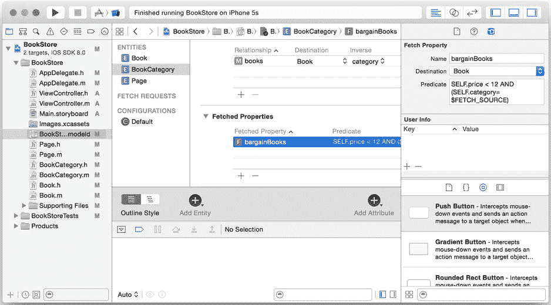

图 2-6. `bargainBooks` 获取属性

`SELF` 关键字指向目标对象（即 Book）。`$FETCHED_SOURCE` 关键字指的是 `BookCategory` 对象。因此，上述代码可以理解为：“如果本书的价格低于 12 美元，且其分类为调用此属性的分类，则这本书属于该列表。”

然后，在代码中重写 `showExampleData` 方法，如代码清单 2-23（Objective-C）或代码清单 2-24（Swift）所示，以演示如何使用获取属性。

***代码清单 2-23***. 在 Objective-C 中使用获取属性

```
- (void)showExampleData {
  NSFetchRequest *fetchRequest = [NSFetchRequest fetchRequestWithEntityName:@"BookCategory"];
  NSArray *categories = [self.managedObjectContext executeFetchRequest:fetchRequest error:nil];
  for (BookCategory *category in categories) {
    // 检索当前分类的特价图书
    NSArray *bargainBooks = [category valueForKey:@"bargainBooks"];

// 现在简单地显示它们
    NSLog(@"Bargains for category: %@", category.name);
    for (Book *book in bargainBooks) {
      NSLog(@"Title: %@, price: %.2f", book.title, book.price);
    }
  }
}
```

***代码清单 2-24***. 在 Swift 中使用获取属性

```
func showExampleData() {
  let fetchRequest = NSFetchRequest(entityName: "BookCategory")
  let categories = self.managedObjectContext?.executeFetchRequest(fetchRequest, error: nil)
  for category in categories as [BookCategory] {
    println("Bargains for category: \(category.name)")
    let bargainBooks = category.valueForKey("bargainBooks") as [Book!]
    for book in bargainBooks {
      println(String(format: "Title: \(book.title), price: %.2f",  book.price))
    }
  }
}
```

我们首先获取分类。然后，对于每个分类，我们获取特价图书并显示它们的标题。

然而，尽管在模型中定义获取属性很方便，但你会注意到谓词编辑器略显不足。此外，获取属性不是动态的；例如，如果之后添加了符合特价图书条件的书籍，除非重置上下文，否则这些书籍不会出现在 `bargainBooks` 获取属性中。你可能会发现，在应用程序中实际上从未使用过获取属性。

## 通知

当试图保持用户界面与其所代表的数据同步时，你通常会发现在数据发生变化时收到通知非常有用。Core Data 提供了用于处理数据变更通知的机制。

### 创建时的通知

有时，每当特定类型的托管对象实例被创建时，你都需要得到通知。例如，你可能需要创建存储中不存在的派生数据（也许是缓存文件，或者仅仅出于审计目的）。假设我们希望在每次创建新书时记录一条日志。我们可以使用 Core Data 的通知，每当创建新对象时，它会调用我们自定义 Core Data 类的 `awakeFromInsert` 方法。在你的实现中，你应该先调用 `super` 的实现，然后再执行你自己的操作。打开 `Book.m` 或 `Book.swift`，并重写 `awakeFromInsert` 方法，如代码清单 2-25（Objective-C）和代码清单 2-26（Swift）所示。

***代码清单 2-25***. 通过 `awakeFromInsert` 方法实现 Core Data 通知（Objective-C）

```
- (void)awakeFromInsert {
  [super awakeFromInsert];
  NSLog(@"New book created");
}
```

***代码清单 2-26***. 通过 `awakeFromInsert` 函数实现 Core Data 通知（Swift）

```
override func awakeFromInsert() {
  super.awakeFromInsert()
  println("New book created")
}
```

由于我们的应用程序每次启动时都会重新加载持久化存储，因此每次运行时都会收到三条新书创建通知。

```
BookStore[85678:c07] New book created
BookStore[85678:c07] New book created
BookStore[85678:c07] New book created
```

### 提取时的通知

类似地，在某些情况下，当从持久化存储中检索到对象时，你希望得到通知。例如，如果你的对象包含用于绘制图像的向量，那么在提取该对象时，你可能希望渲染一个缩略图。出于存储原因，你可能会决定保留实际的缩略图是多余的，因此必须在提取对象时计算它。要接收此通知，你需要重写 `awakeFromFetch` 方法。与 `awakeFromInsert` 一样，你应该首先调用 `super` 的实现。仍然在 `Book.m` 或 `Book.swift` 中，重写 `awakeFromFetch` 方法，如代码清单 2-27（Objective-C）和代码清单 2-28（Swift）所示。

***代码清单 2-27***. 通过 `awakeFromFetch` 方法实现 Core Data 通知（Objective-C）

```
- (void)awakeFromFetch {
  [super awakeFromFetch];
  NSLog(@"Book fetched: %@", self.title);
}
```

***代码清单 2-28***. 通过 `awakeFromFetch` 方法实现 Core Data 通知（Swift）

```
override func awakeFromFetch() {
  super.awakeFromFetch()
  println("Book fetched: \(self.title)")
}
```

当运行它时，你将得到以下输出：

```
BookStore[85678:c07] Book fetched: The first book
BookStore[85678:c07] Book fetched: The second book
BookStore[85678:c07] Book fetched: The third book
BookStore[85678:c07] New book created
BookStore[85678:c07] New book created
BookStore[85678:c07] New book created
```

由于 `deleteAllObjects` 方法中的清理操作，你首先看到的是提取操作。首先读取并删除书籍，然后添加三本新书。

不过，你可能在应用程序的输出中注意到一些奇怪的地方。尽管你在 `showExampleData` 方法中提取了标题为“The first book”的书籍，正如日志所示：

```
BookStore[85678:c07] Title: The first book, price: 10.00
```

你并没有看到另一条“Book fetched”的日志消息，即使 `showExampleData` 显然执行了一个提取请求。这意味着，`awakeFromFetch` 并不一定在每次执行返回该对象的提取请求时都被调用——它仅在提取期间从持久化存储重新初始化对象时被调用。如果该对象已经由持久化存储初始化过，并且存在于你的托管对象上下文中，那么执行提取请求不会调用 `awakeFromFetch`。

尽管这可能听起来令人困惑，但你可以通过更多地关注方法名称中的“awake”部分，而不是“fetch”部分来记住这种行为。当对象被加载到内存中时，它就会“苏醒”，因此当托管对象因提取而被加载到内存中时，就会调用此方法。

在第 9 章中，我们将讨论一个名为“故障”的概念。当 `awakeFromFetch` 方法被调用时，故障机制就会发挥作用，因此请务必阅读该章节以获取更多信息。

### 变更时的通知


## 数据变更通知

到目前为止，最有用的通知莫过于数据变更通知。如果你在用户界面中显示一本书，而其标题发生了变化，你可能希望用户界面能反映出这一变化。由于 `NSManagedObject` 符合 KVC 规范，因此可以应用键值观察（KVO）的所有常规原则，并在数据修改时触发通知。KVO 模型非常简单且去中心化，仅涉及两个对象：观察者和被观察者。观察者必须向被观察对象注册，而被观察对象则负责在其数据发生变化时触发通知。`NSManagedObject` 的默认实现会自动处理通知的触发。

## 注册观察者

为了接收变更通知，你必须使用 `addObserver:forKeyPath:options:context:` 方法向被观察对象注册观察者。该注册仅对给定的键路径有效，这意味着它仅适用于指定的属性或关系。其优势在于，你可以非常精细地控制哪些通知会被触发。

通过选项，你可以进一步细化粒度，指定希望在通知中接收哪些信息。下面的 表 2-4 展示了 Objective-C 选项，这些选项可以通过按位 OR 进行组合（例如，`NSKeyValueObservingOptionOld | NSKeyValueObservingOptionNew` 用于同时指定旧值和新值）。

表 2-4. Objective-C 通知选项

| 选项 | 描述 |
| --- | --- |
| `NSKeyValueObservingOptionOld` | 变更字典将在查找键 `NSKeyValueChangeOldKey` 下包含旧值 |
| `NSKeyValueObservingOptionNew` | 变更字典将在查找键 `NSKeyValueChangeNewKey` 下包含新值 |

这些选项的 Swift 版本名称更简短，如 表 2-5 所示。但变更字典中的键保持不变。

表 2-5. Swift 通知选项

| 选项 | 描述 |
| --- | --- |
| `Old` | 变更字典将在查找键 `NSKeyValueChangeOldKey` 下包含旧值 |
| `New` | 变更字典将在查找键 `NSKeyValueChangeNewKey` 下包含新值 |

现在，我们将应用委托注册为名为“第一本书”的书籍标题变更的观察者。打开 `AppDelegate.m` 或 `AppDelegate.swift`，编辑 `showExampleData`，回到获取第一本书的更简单版本，如 代码清单 2-29（Objective-C）和 代码清单 2-30（Swift）所示。在方法中，注册事件通知后，我们还将书籍标题更改为“新标题”。

***代码清单 2-29***. 在 Objective-C 中注册 KVO

```
- (void)showExampleData {
  NSFetchRequest *fetchRequest = [NSFetchRequest fetchRequestWithEntityName:@"Book"];
  fetchRequest.predicate = [NSPredicate predicateWithFormat:@"title = 'The first book'"];

NSArray *books = [self.managedObjectContext executeFetchRequest:fetchRequest error:nil];
  for (Book *book in books) {
    NSLog(@"Title: %@, price: %.2f", book.title, book.price);

// 为当前对象注册 KVO
    [book addObserver:self
           forKeyPath:@"title"
              options:NSKeyValueObservingOptionOld | NSKeyValueObservingOptionNew
              context:nil];
    book.title = @"The new title";
  }
}
```

***代码清单 2-30***. 在 Swift 中注册 KVO

```
func showExampleData() {
  let fetchRequest = NSFetchRequest(entityName: "Book")
  fetchRequest.predicate = NSPredicate(format: "title='The first book'")

let books = self.managedObjectContext?.executeFetchRequest(fetchRequest, error: nil)
  for book in books as [Book] {
    println(String(format: "Title: \(book.title), price: %.2f",  book.price))

// 为当前对象注册 KVO
    book.addObserver(self, forKeyPath: "title", options: .Old | .New, context: nil)
    book.title = "The new title"
  }
}
```

不过，目前还不要构建并运行应用程序，因为它会崩溃，因为你已注册接收通知，但尚未编写代码来处理收到的通知。请继续阅读下一节，了解如何接收你已注册的通知。

## 接收通知

注册接收变更通知是一回事，实际接收通知则是另一回事。要接收变更通知，你需要在观察者类中重写 `observeValueForKeyPath:ofObject:change:context:` 方法。仍然在 `AppDelegate.m` 或 `AppDelegate.swift` 中，添加 代码清单 2-31（Objective-C）和 代码清单 2-32（Swift）所示的方法。

***代码清单 2-31***. 接收变更通知（Objective-C）

```
- (void)observeValueForKeyPath:(NSString *)keyPath
                      ofObject:(id)object
                        change:(NSDictionary *)change
                       context:(void *)context {
  NSLog(@"Changed value for %@: %@ -> %@", keyPath,
        [change objectForKey:NSKeyValueChangeOldKey],
        [change objectForKey:NSKeyValueChangeNewKey]);
}
```

***代码清单 2-32***. 接收变更通知（Swift）

```
override func observeValueForKeyPath(keyPath: String,
  ofObject object: AnyObject,
  change: [NSObject : AnyObject],
  context: UnsafeMutablePointer<()>) {
  println("Changed value for \(keyPath): \(change[NSKeyValueChangeOldKey]!) -> \(change[NSKeyValueChangeNewKey]!)")
}
```

再次运行应用程序，你将得到以下输出，表明已收到标题变更通知：

```
Changed value for title: The first book -> The new title
```

## 结论

对于依赖数据的应用程序（这涵盖了大多数应用），正确设计数据模型的重要性怎么强调都不为过。Xcode 数据建模工具为设计和定义数据模型提供了可靠的界面，在本章中，你已经学会了如何驾驭创建实体、属性和关系时可用的众多选项。请务必理解你配置数据模型所产生的影响，以便你的应用程序能够高效且正确地运行。

在大多数情况下，你应该避免在模型中使用那些会剥夺 Core Data 控制权、迫使你自己管理对象图一致性的选项。Core Data 在管理对象图一致性方面几乎总能比你做得更好。当你必须接管控制权时，请务必充分调试你的解决方案，以防止应用程序崩溃或数据损坏。

虽然你可以直接使用 `NSManagedObject`，但随着构建更大的应用程序，你不可避免地会感到需要使用子类（如本章所述），以便在代码中清晰地区分对象及其属性。

在下一章中，我们将深入探讨如何构建用于高级查询的谓词。

# 第 3 章：高级查询

简单的应用程序和简单的数据模型通常可以依靠简单的查询来提供满足应用程序特定需求的数据。然而，非平凡的应用程序通常拥有更复杂的数据模型以及围绕这些数据的更精细的要求。为了满足这些应用需求并与更复杂的数据交互，你需要更高级的数据查询方法。本章讨论 Core Data 的高级查询技术，并将为你提供必要的工具，以提取数据丰富的应用程序所需的数据组合。


本章讨论的大部分类并非与 Core Data 绑定，而是适用于任何集合类。你可以使用`NSPredicate`、`NSExpression`、`NSSortDescriptor`、聚合运算符、函数等来过滤任何类型的集合，而不仅仅是 Core Data 的结果集。实际上，某些类及其方法仅适用于通用集合，不适用于 Core Data。但请记住，一旦从 Core Data 中获取了结果集，你就拥有了一个标准的`NSArray`集合，可以在 Core Data 之外随意操作。

## 构建 WordList

无论你是在玩 Words with Friends、Scrabble 还是其他文字游戏，了解游戏允许的单词都会助你取得更大成功。在本章中，我们将构建一个名为 WordList 的应用程序，该程序从互联网下载一个流行的单词列表，并对其运行各种查询以演示高级查询。这个应用程序并不花哨——你可以在图 3-1 中看到用户界面（UI）——它不会保证胜利甚至提高分数。不过，你可能会学到一两个新单词，以便在你最喜欢的文字游戏中使用，并给朋友留下深刻印象。

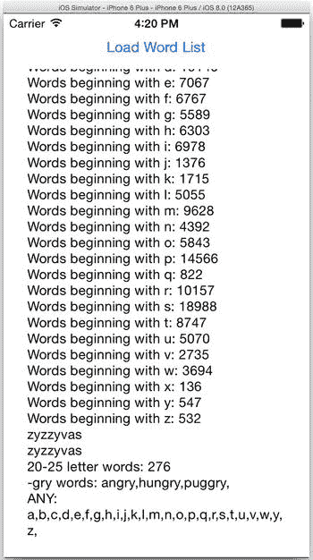

图 3-1. WordList 应用程序

## 创建应用程序

在 Xcode 中，使用 Single View Application 模板创建一个新项目。将产品名称设置为 WordList，选择你要使用的语言，取消勾选 Use Core Data（我们将自行添加），然后点击 Next 让 Xcode 开始创建项目。

接下来，按照前面概述的步骤将 Core Data 添加到 WordList 应用程序中。

*   在任何需要访问 Core Data 类的地方添加`@import CoreData`（Objective-C）或`import CoreData`（Swift）指令。
*   添加 WordList 数据模型`WordList.xcdatamodeld`。
*   添加`Persistence`类，该类封装了 WordList 的 Core Data 交互。

Objective-C 的`Persistence`类头文件如代码清单 3-1 所示，它声明了用于实现 Core Data 栈的属性和方法。这看起来很熟悉——你在第 1 章的`Persistence`类中首次见过它。

***代码清单 3-1***. `Persistence.h`

```
@import CoreData;

@interface Persistence : NSObject

@property (readonly, strong, nonatomic) NSManagedObjectContext *managedObjectContext;
@property (readonly, strong, nonatomic) NSManagedObjectModel *managedObjectModel;
@property (readonly, strong, nonatomic) NSPersistentStoreCoordinator *persistentStoreCoordinator;

- (void)saveContext;
- (NSURL *)applicationDocumentsDirectory;

@end
```

代码清单 3-2 展示了 Objective-C 实现文件`Persistence.m`。

***代码清单 3-2***. `Persistence.m`

```
#import "Persistence.h"

@implementation Persistence

- (id)init
{
  self = [super init];
  if (self != nil) {
    // Initialize the managed object model
    NSURL *modelURL = [[NSBundle mainBundle] URLForResource:@"WordList" withExtension:@"momd"];
    _managedObjectModel = [[NSManagedObjectModel alloc] initWithContentsOfURL:modelURL];

    // Initialize the persistent store coordinator
    NSURL *storeURL = [[self applicationDocumentsDirectory] URLByAppendingPathComponent:@"WordList.sqlite"];

    NSError *error = nil;
    _persistentStoreCoordinator = [[NSPersistentStoreCoordinator alloc] initWithManagedObjectModel:self.managedObjectModel];
    if (![_persistentStoreCoordinator addPersistentStoreWithType:NSSQLiteStoreType
                                                  configuration:nil
                                                            URL:storeURL
                                                        options:nil
                                                          error:&error]) {
      NSLog(@"Unresolved error %@, %@", error, [error userInfo]);
      abort();
    }

    // Initialize the managed object context
    _managedObjectContext = [[NSManagedObjectContext alloc] init];
    [_managedObjectContext setPersistentStoreCoordinator:self.persistentStoreCoordinator];
  }
  return self;
}

#pragma mark - Helper Methods

- (void)saveContext
{
  NSError *error = nil;
  if ([self.managedObjectContext hasChanges] && ![self.managedObjectContext save:&error]) {
    NSLog(@"Unresolved error %@, %@", error, [error userInfo]);
    abort();
  }
}

- (NSURL *)applicationDocumentsDirectory
{
  return [[[NSFileManager defaultManager] URLsForDirectory:NSDocumentDirectory inDomains:NSUserDomainMask] lastObject];
}

@end
```

最后，代码清单 3-3 展示了 Swift 实现`Persistence.swift`。请注意，我们在文件底部偷偷添加了一个扩展，稍后将用于简化格式化输出。

***代码清单 3-3***. `Persistence.swift`

```
import Foundation
import CoreData

class Persistence: NSObject {

  var managedObjectContext: NSManagedObjectContext = {
    // Initialize the managed object model
    let modelURL = NSBundle.mainBundle().URLForResource("WordListSwift", withExtension: "momd")
    let managedObjectModel = NSManagedObjectModel(contentsOfURL: modelURL!)

    // Initialize the persistent store coordinator
    let storeURL = Persistence.applicationDocumentsDirectory.URLByAppendingPathComponent("WordListSwift.sqlite")
    var error: NSError? = nil
    let persistentStoreCoordinator = NSPersistentStoreCoordinator(managedObjectModel: managedObjectModel!)
    if persistentStoreCoordinator.addPersistentStoreWithType(NSSQLiteStoreType, configuration: nil, URL: storeURL, options: nil, error: &error) == nil {
      abort()
    }

    // Initialize the managed object context
    var managedObjectContext = NSManagedObjectContext()
    managedObjectContext.persistentStoreCoordinator = persistentStoreCoordinator

    return managedObjectContext
  }()

  func saveContext() {
    var error: NSError? = nil
    let managedObjectContext = self.managedObjectContext
    if managedObjectContext != nil {
      if managedObjectContext.hasChanges && !managedObjectContext.save(&error) {
        abort()
      }
    }
  }

  class var applicationDocumentsDirectory: NSURL {
    let urls = NSFileManager.defaultManager().URLsForDirectory(.DocumentDirectory, inDomains: .UserDomainMask)
    return urls[urls.endIndex-1] as NSURL
  }
}

extension Float {
    func format(f: String) -> String {
        return NSString(format: "%\(f)f", self)
    }
}
```

在你的应用代理`AppDelegate`中，添加一个`Persistence`属性，并在 WordList 启动时初始化 Core Data 栈。对于 Objective-C 版本，代码清单 3-4 展示了更新后的`AppDelegate.h`文件，代码清单 3-5 展示了`AppDelegate.m`中更新后的`application:didFinishLaunchingWithOptions:`方法。请确保在`AppDelegate.m`顶部导入`Persistence.h`。对于 Swift 版本，请参见代码清单 3-6。

***代码清单 3-4***. `AppDelegate.h`

```
#import <UIKit/UIKit.h>

@class Persistence;

@interface AppDelegate : UIResponder <UIApplicationDelegate>

@property (strong, nonatomic) UIWindow *window;
@property (strong, nonatomic) Persistence *persistence;

@end
```


## 排版后的文本

***列表 3-5***. 更新后的 `application:didFinishLaunchingWithOptions:` 方法

```
- (BOOL)application:(UIApplication *)application didFinishLaunchingWithOptions:(NSDictionary *)launchOptions {
  self.persistence = [[Persistence alloc] init];
  return YES;
}
```

***列表 3-6***. 更新后的 `AppDelegate.swift`

```
import UIKit
import CoreData

@UIApplicationMain
class AppDelegate: UIResponder, UIApplicationDelegate {

var window: UIWindow?
  var persistence: Persistence?

func application(application: UIApplication!, didFinishLaunchingWithOptions launchOptions: NSDictionary!) -> Bool {
    persistence = Persistence()
    return true
  }
  /* Code snipped */
}
```

`WordList` 现已初始化 Core Data 栈，但数据模型为空。在下一节中，我们将构建数据模型，以便 `WordList` 能够存储和管理单词列表。

## 构建数据模型

你应已在上一节中创建了数据模型 `WordList.xcdatamodeld`。在本节中，你将添加 `WordList` 应用所需的实体、属性和关系。

`WordList` 应用的源数据是一个单词列表，因此我们可以将数据建模为包含单个属性的单个实体，用于存储单词文本。`WordList` 所需的其他数据（单词长度及其所属类别，由首字母决定）可以从单词本身计算得出。然而，我们不打算以这种方式建模数据，原因有二。首先，这有悖于本章的目的；我们需要一些属性和关系，以便使用 Core Data 的高级查询功能。第二个原因则更为实际：性能。当你在应用中使用 Core Data 时，请记住，你的数据库服务器并非那种以闪电速度处理数据和数字的高性能服务器。它是一个 iOS 设备，充斥着各种应用和正在运行的进程，其 CPU（中央处理器）需要平衡尺寸、重量、性能和电池寿命。仅仅因为你可以在运行时计算某些内容，并不意味着你应该这样做。预先计算并存储元数据是提升 Core Data 应用性能和效率的一种方法。我们将在第 9 章中更深入地讨论性能问题。

对于 `WordList` 数据模型，创建两个实体：`WordCategory` 和 `Word`。在 `WordCategory` 实体中，添加一个名为 `firstLetter` 的 `String` 类型属性。在 `Word` 实体中，添加两个属性：类型为 `String` 的 `text` 和类型为 `Integer 16` 的 `length`。然后，创建一条从 `WordCategory` 到 `Word` 的多对关系，删除规则设为 `Nullify`，并将其命名为 `words`。别忘了创建从 `Word` 回到 `WordCategory` 的反向关系，命名为 `wordCategory`。完成后，数据模型应与图 3-2 一致。

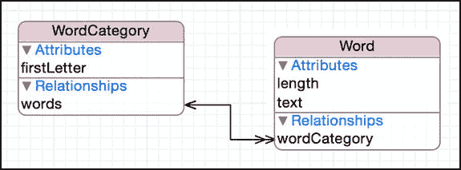

图 3-2. WordList 数据模型

## 创建用户界面

`WordList` 的用户界面提供了一个用于从互联网重新加载源数据（单词列表）的按钮，以及一个用于显示数据统计信息的文本区域。要实现这个精简界面，请打开 `Main.storyboard`，将一个按钮拖到视图顶部中央，并在其下方放置一个文本视图，填充视图的其余部分。设置好约束以保持控件布局；最简单的方法是选中它们，点击 Xcode 右下角的“解决自动布局问题”图标（看起来像两条竖线之间的三角形），然后选择“添加缺少的约束”。

在 `ViewController.h` 中，声明一个处理按钮按下事件（触摸向内事件）的方法，以及一个指向文本区域的属性。你的代码应与列表 3-7 一致。对于 Swift，请打开 `ViewController.swift` 并添加对应的内容：一个处理按钮按下的函数和一个指向文本区域的变量，如列表 3-8 所示。

***列表 3-7***. `ViewController.h`

```
#import <UIKit/UIKit.h>

@interface ViewController : UIViewController

@property (nonatomic, strong) IBOutlet UITextView *textView;

- (IBAction)loadWordList:(id)sender;

@end
```

***列表 3-8***. `ViewController.swift`

```
import UIKit

class ViewController: UIViewController {

@IBOutlet weak var textView: UITextView!

@IBAction func loadWordList(sender: AnyObject) {
    }
}
```

你创建的视图应类似于图 3-3。

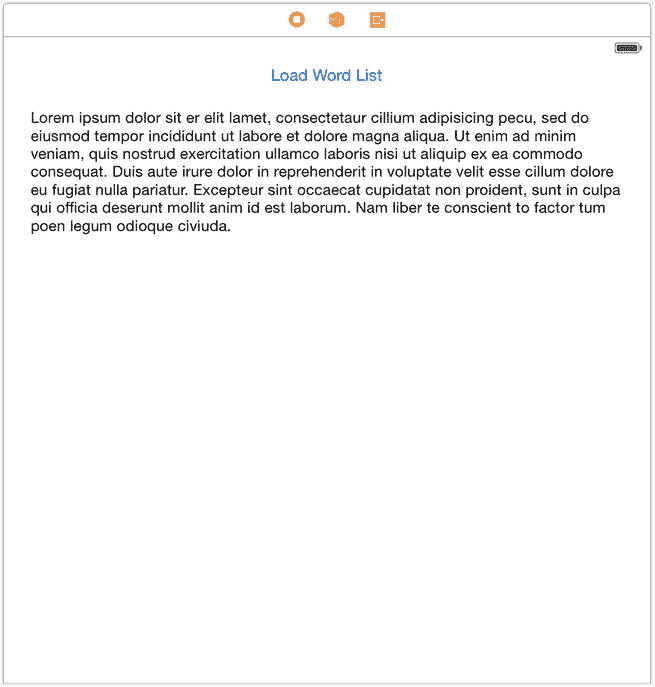

图 3-3. WordList 用户界面

对于 Objective-C，在 `ViewController.m` 中为 `loadWordList:` 添加一个空的方法实现。对于 Objective-C 和 Swift，将按钮的触摸向内事件连接到 `loadWordList:` 选择器。同时，将界面中的文本视图连接到 `textView` 属性。

稍后我们将回到界面代码，以响应按钮按下事件并更新统计信息。但首先，我们要向持久层 `Persistence` 添加代码，用于加载单词列表并提供统计信息。

## 加载并分析单词列表

我们将加载数据模型并提供数据统计信息的职责委托给 `Persistence` 类。我们在该类中声明两个方法：一个用于接收包含所有单词的 `NSString`，解析并加载它；另一个用于返回包含单词列表统计信息的 `NSString`。在 Objective-C 版本的 `Persistence.h` 中声明这些方法，如列表 3-9 所示。

***列表 3-9***. `Persistence.h` 中的两个方法声明

```
- (void)loadWordList:(NSString *)wordList;
- (NSString *)statistics;
```

`loadWordList:` 方法执行三项操作。

* 删除所有现有数据，以防用户已加载过单词列表；
* 创建单词类别；以及
* 加载单词。

首先，创建一个辅助方法 `deleteAllObjectsForEntityWithName:`，用于删除给定实体中的所有数据。列表 3-10 展示了该方法的 Objective-C 实现，列表 3-11 展示了 Swift 实现。

***列表 3-10***. `Persistence.m` 中的 `deleteAllObjectsForEntityWithName:`

```
- (void)deleteAllObjectsForEntityWithName:(NSString *)name {
  NSLog(@"Deleting all objects in entity %@", name);

NSFetchRequest *fetchRequest = [NSFetchRequest fetchRequestWithEntityName:name];
  fetchRequest.resultType = NSManagedObjectIDResultType;

NSArray *objectIDs = [self.managedObjectContext executeFetchRequest:fetchRequest error:nil];
  for (NSManagedObjectID *objectID in objectIDs) {
    [self.managedObjectContext deleteObject:[self.managedObjectContext objectWithID:objectID]];
  }

[self saveContext];

NSLog(@"All objects in entity %@ deleted", name);
}
```

***列表 3-11***. `Persistence.swift` 中的 `deleteAllObjectsForEntityWithName`

```
func deleteAllObjectsForEntityWithName(name: String) {
    println("Deleting all objects in entity \(name)")
    var fetchRequest = NSFetchRequest(entityName: name)
    fetchRequest.resultType = .ManagedObjectIDResultType
```


```
if let managedObjectContext = managedObjectContext {
    var error: NSError? = nil
    let objectIDs = managedObjectContext.executeFetchRequest(fetchRequest, error: &error)
    for objectID in objectIDs! {
        managedObjectContext.deleteObject(managedObjectContext.objectWithID(objectID as NSManagedObjectID))
    }

    saveContext()

    println("All objects in entity \(name) deleted")
}
```

该方法引入了一项性能优化——我们不再获取某个实体的所有对象，而是仅获取匹配对象的对象标识符。通过将获取请求的 `resultType` 属性设置为 `NSManagedObjectIDResultType` 来实现这一点。将所有对象标识符获取到数组后，我们遍历它们，并告诉托管对象上下文删除这些标识符对应的对象。完成后，我们保存上下文。

`loadWordList:` 方法使用您刚刚创建的方法来删除所有 `WordCategory` 和 `Word` 实例。然后，它会创建 26 个 `WordCategory` 实例——每个实例对应字母“a”到“z”。接着，它会解析单词列表，并将这些单词添加到我们的 Core Data 对象图中，为每个单词设置文本、长度和类别，并在每添加 100 个单词后记录一条消息，以便我们可以在 Xcode 控制台中跟踪进度。最后，它保存托管对象上下文。列表 3-12 展示了 Objective-C 的 `loadWordList:` 方法，列表 3-13 展示了 Swift 的 `loadWordList` 函数。

**列表 3-12**. `Persistence.m` 中的 `loadWordList:`

```
- (void)loadWordList:(NSString *)wordList {
  // 删除所有现有的单词和类别
  [self deleteAllObjectsForEntityWithName:@"Word"];
  [self deleteAllObjectsForEntityWithName:@"WordCategory"];

// 创建类别
  NSMutableDictionary *wordCategories = [NSMutableDictionary dictionaryWithCapacity:26];
  for (char c = 'a'; c <= 'z'; c++) {
    NSString *firstLetter = [NSString stringWithFormat:@"%c", c];
    NSManagedObject *wordCategory = [NSEntityDescription insertNewObjectForEntityForName:@"WordCategory" inManagedObjectContext:self.managedObjectContext];
    [wordCategory setValue:firstLetter forKey:@"firstLetter"];
    [wordCategories setValue:wordCategory forKey:firstLetter];
    NSLog(@"Added category '%@'", firstLetter);
  }

// 从列表中添加单词
  NSUInteger wordsAdded = 0;
  NSArray *newWords = [wordList componentsSeparatedByCharactersInSet:[NSCharacterSet whitespaceAndNewlineCharacterSet]];
  for (NSString *word in newWords) {
    if (word.length > 0) {
      NSManagedObject *object = [NSEntityDescription insertNewObjectForEntityForName:@"Word" inManagedObjectContext:self.managedObjectContext];
      [object setValue:word forKey:@"text"];
      [object setValue:[NSNumber numberWithInteger:word.length] forKey:@"length"];
      [object setValue:[wordCategories valueForKey:[word substringToIndex:1]] forKey:@"wordCategory"];
      ++wordsAdded;
      if (wordsAdded % 100 == 0)
        NSLog(@"Added %lu words", wordsAdded);
    }
  }
  NSLog(@"Added %lu words", wordsAdded);
  [self saveContext];
  NSLog(@"Context saved");
}
```

**列表 3-13**. `Persistence.swift` 中的 `loadWordList`

```
func loadWordList(wordList: String) {
    // 删除所有现有的单词和类别
    deleteAllObjectsForEntityWithName("Word")
    deleteAllObjectsForEntityWithName("WordCategory")

// 创建类别
    var wordCategories = NSMutableDictionary(capacity: 26)
    for c in "abcdefghijklmnopqrstuvwxyz" {
        let firstLetter = "\(c)"
        var wordCategory: AnyObject! = NSEntityDescription.insertNewObjectForEntityForName("WordCategory", inManagedObjectContext: self.managedObjectContext!)
        wordCategory.setValue(firstLetter, forKey: "firstLetter")
        wordCategories.setValue(wordCategory, forKey: firstLetter)
        println("Added category '\(firstLetter)'")
    }

// 从列表中添加单词
    var wordsAdded = 0
    let newWords = wordList.componentsSeparatedByCharactersInSet(NSCharacterSet.whitespaceAndNewlineCharacterSet())
    for word in newWords {
        if countElements(word) > 0 {
            var object: AnyObject! = NSEntityDescription.insertNewObjectForEntityForName("Word", inManagedObjectContext: self.managedObjectContext!)
            object.setValue(word, forKey: "text")
            object.setValue(countElements(word), forKey: "length")
            object.setValue(wordCategories.valueForKey((word as NSString).substringToIndex(1)), forKey: "wordCategory")
            wordsAdded++
            if wordsAdded % 100 == 0 {
                println("Added \(wordsAdded) words")
                saveContext()
                println("Context saved")
            }
        }
    }
    saveContext()
    println("Context saved")
}
```

您可能会注意到这段代码处理所创建单词类别的方式有些特别。这段代码没有将单词类别直接存储在 Core Data 中，然后通过获取正确的单词类别来设置单词的 `wordCategory` 关系，而是将单词类别放入一个 `NSMutableDictionary` 实例中。这是一项性能优化；通过字典查找单词对应的合适类别，要比让 Core Data 在其对象图中搜索同一类别快得多。在应用程序中使用 Core Data 时，请不要害怕在适当的情况下跳出 Core Data 的范畴来提升性能。

**获取计数**

提供单词列表统计信息的方法 `statistics` 返回一个 `NSString`，我们可以将其放入 WordList 用户界面的文本视图中。我们将从简单的开始，显示单词列表中的单词数量。在本章后续部分，随着我们对 Core Data 查询的深入学习，我们会不断扩展这个方法。请将列表 3-14 所示的代码添加到 `Persistence.m` 中，或将列表 3-15 所示的代码添加到 `Persistence.swift` 中，以返回单词列表中的单词数量。

**列表 3-14**. `Persistence.m` 中的 `statistics`

```
- (NSString *)statistics {
  NSMutableString *string = [[NSMutableString alloc] init];
  [string appendString:[self wordCount]];
  return string;
}
```

**列表 3-15**. `Persistence.swift` 中的 `statistics`

```
func statistics() -> String {
    var string = NSMutableString()

string.appendString(wordCount())
    return string
}
```

现在，实现列表 3-16（Objective-C）和列表 3-17（Swift）中所示的 `wordCount` 方法。

**列表 3-16**. `Persistence.m` 中的 `wordCount`

```
- (NSString *)wordCount {
  NSFetchRequest *fetchRequest = [NSFetchRequest fetchRequestWithEntityName:@"Word"];
  NSUInteger count = [self.managedObjectContext countForFetchRequest:fetchRequest error:nil];
  return [NSString stringWithFormat:@"Word Count: %lu\n", count];
}
```

**列表 3-17**. `Persistence.swift` 中的 `wordCount`

```
func wordCount() -> String {
    let fetchRequest = NSFetchRequest(entityName: "Word")
    var error: NSError? = nil
    let count = self.managedObjectContext!.countForFetchRequest(fetchRequest, error: &error)
    return "Word Count: \(count)\n"
}
```


该方法创建了一个 fetch 请求，但并未调用 `executeFetchRequest:error:`，而是调用了托管对象上下文中的另一个方法：`countForFetchRequest:error:`。该方法不返回 fetch 请求的结果，而是返回该 fetch 请求将返回的条目数量。在本例中，它返回 `Word` 实体中的对象数量，即单词数量。

## 显示统计信息

最后，我们在界面中添加代码，以处理“加载单词列表”按钮的点击事件，并显示关于单词列表的统计信息。代码清单 3-18（Objective-C）和代码清单 3-19（Swift）分别展示了更新后的 `ViewController.m` 或 `ViewController.swift` 文件。这段代码添加了一个 `updateStatistics` 方法，该方法调用我们刚刚实现的 `Persistence` 的 `statistics` 方法，并将文本视图的文本设置为返回的值。该方法在视图即将出现时以及单词列表加载完成后，都会调用 `updateStatistics` 方法。

`loadWordList:` 的实现会从相应 URL（统一资源定位符）异步加载单词列表，并将该列表交给应用程序的持久化层进行存储。加载完成后，它会更新文本视图中的统计信息。

**代码清单 3-18.** `ViewController.m`

```
#import "ViewController.h"
#import "AppDelegate.h"
#import "Persistence.h"

@implementation ViewController

- (void)viewWillAppear:(BOOL)animated {
  [super viewWillAppear:animated];
  [self updateStatistics];
}

- (void)updateStatistics {
  AppDelegate *appDelegate = (AppDelegate *)[[UIApplication sharedApplication] delegate];
  self.textView.text = [appDelegate.persistence statistics];
}

- (IBAction)loadWordList:(id)sender {
  // 加载时隐藏按钮
  [(UIButton *)sender setHidden:YES];

// 加载单词
  NSURL *url = [NSURL URLWithString:@"https://dotnetperls-controls.googlecode.com/files/enable1.txt"];
  NSURLRequest *request = [NSURLRequest requestWithURL:url];
  NSLog(@"载入单词列表");
  [NSURLConnection sendAsynchronousRequest:request
                                     queue:[NSOperationQueue mainQueue]
                         completionHandler:^(NSURLResponse *response, NSData *data, NSError *error) {
                           NSString *words = [[NSString alloc] initWithData:data encoding:NSUTF8StringEncoding];
                           NSInteger statusCode = [(NSHTTPURLResponse *)response statusCode];
                           // 检查是否加载成功
                           if (words != nil && statusCode == 200) {
                             // 将单词列表交给持久化层
                             AppDelegate *appDelegate = (AppDelegate *)[[UIApplication sharedApplication] delegate];
                             [appDelegate.persistence loadWordList:words];
                           }
                           else {
                             // 加载失败；显示错误信息
                             NSLog(@"错误：%lu", statusCode);
                             if (error != NULL)
                               NSLog(@"错误：%@", [error localizedDescription]);
                           }

// 显示按钮
                           [(UIButton *)sender setHidden:NO];

// 用统计信息更新文本视图
                           [self updateStatistics];
                         }];
}

@end
```

**代码清单 3-19.** `ViewController.swift`

```
import UIKit

class ViewController: UIViewController {
    @IBOutlet weak var textView: UITextView!

override func viewWillAppear(animated: Bool) {
        super.viewWillAppear(animated)
        updateStatistics()
    }

func updateStatistics() {
        let appDelegate = UIApplication.sharedApplication().delegate as AppDelegate
        textView.text = appDelegate.persistence?.statistics()
    }

@IBAction func loadWordList(sender: AnyObject) {
        // 加载时隐藏按钮
        (sender as UIButton).hidden = true

// 加载单词
        let url = NSURL(string: "https://dotnetperls-controls.googlecode.com/files/enable1.txt")
        let request = NSURLRequest(URL: url!)
        println("载入单词列表")

NSURLConnection.sendAsynchronousRequest(request, queue: NSOperationQueue.mainQueue()) { (response: NSURLResponse!, data: NSData!, error: NSError!) -> Void in
            let words = NSString(data: data, encoding: NSUTF8StringEncoding)

// 检查是否加载成功
            if error == nil && response != nil && (response as NSHTTPURLResponse).statusCode == 200 {
                // 将单词列表交给持久化层
                let appDelegate = UIApplication.sharedApplication().delegate as AppDelegate
                appDelegate.persistence?.loadWordList(words!)
            }
            else {
                // 加载失败；显示错误信息
                if response != nil { println("错误：\((response as NSHTTPURLResponse).statusCode)") }
                println("错误：\(error.localizedDescription)")
            }

// 显示按钮
            (sender as UIButton).hidden = false

// 用统计信息更新文本视图
            self.updateStatistics()
        }
    }
}
```

构建并运行应用程序，然后点击“加载单词列表”按钮。几秒钟后（取决于网络连接速度和计算机速度），您应该会看到“加载单词列表”按钮重新出现，并且应用程序的文本区域中显示了单词数量，如图 3-4 所示。

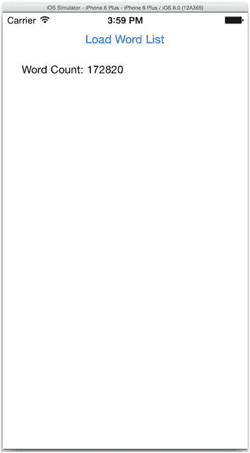

**图 3-4.** 显示单词数量的 WordList 应用程序

在本章后续内容中，我们将更新 `Persistence` 中的 `statistics` 方法，以对单词列表数据执行更多查询，并返回更多信息以显示在界面中。

## 查询关系

接下来，我们添加到显示的单词列表统计信息中的输出是，以每个字母开头的单词数量。用于获取请求的谓词中的查询语言支持遍历数据模型中定义的关系。为此，您在谓词中通过名称引用关系，并使用点表示法来访问该关系所引用实体的属性。例如，对于 `Word` 实体，`wordCategory.firstLetter` 引用了 `Word` 中的 `wordCategory` 关系，该关系指向 `WordCategory` 实体，并引用该实体中的 `firstLetter` 属性。

我们可以使用 `Word` 实体中定义的 `wordCategory` 关系，根据单词所属的类别来获取它们。为此，我们遍历字母表，并获取其 `wordCategory` 的 `firstLetter` 设置为当前字母的单词数量。我们创建一个名为 `wordCountForCategory:` 的方法，该方法接受一个字母并获取该字母对应的数量。相关代码如 代码清单 3-20（Objective-C）或 代码清单 3-21（Swift）所示。

**代码清单 3-20.** `Persistence.m` 中的 `wordCountForCategory:`

```
- (NSString *)wordCountForCategory:(NSString *)firstLetter {
  NSFetchRequest *fetchRequest = [NSFetchRequest fetchRequestWithEntityName:@"Word"];
  fetchRequest.predicate = [NSPredicate predicateWithFormat:@"wordCategory.firstLetter = %@", firstLetter];
  NSUInteger count = [self.managedObjectContext countForFetchRequest:fetchRequest error:nil];
  return [NSString stringWithFormat:@"以 %@ 开头的单词数量：%lu\n", firstLetter, count];
}
```

**代码清单 3-21.** `Persistence.swift` 中的 `wordCountForCategory`


```swift
func wordCountForCategory(firstLetter: String) -> String {
    var fetchRequest = NSFetchRequest(entityName: "Word")
    fetchRequest.predicate = NSPredicate(format: "wordCategory.firstLetter = %@", argumentArray: [firstLetter])

    var error: NSError? = nil
    let count = self.managedObjectContext!.countForFetchRequest(fetchRequest, error: &error)

    return "Words beginning with \(firstLetter): \(count)\n"
}
```

然后，我们更新`statistics`方法，使其遍历字母表，对每个字母调用`wordCountForCategory:`并将结果追加到统计字符串中。代码清单 3-22（Objective-C）或代码清单 3-23（Swift）展示了这段代码。

***代码清单 3-22***。`Persistence.m`中更新后的`statistics`方法

```objc
- (NSString *)statistics {
  NSMutableString *string = [[NSMutableString alloc] init];
  [string appendString:[self wordCount]];
  for (char c = 'a'; c <= 'z'; c++) {
    [string appendString:[self wordCountForCategory:[NSString stringWithFormat:@"%c", c]]];
  }
  return string;
}
```

***代码清单 3-23***。`Persistence.swift`中更新后的`statistics`函数

```swift
func statistics() -> String {
    var string = NSMutableString()
    string.appendString(wordCount())

    for c in "abcdefghijklmnopqrstuvwxyz" {
        string.appendString(wordCountForCategory("\(c)"))
    }

    return string
}
```

现在构建并运行应用程序时，您应该能看到按字母统计的单词数量，如图图 3-5 所示。请注意，每次运行应用程序时无需重新加载单词列表；这些单词已存储在 Core Data 中，我们的查询基于现有数据执行。

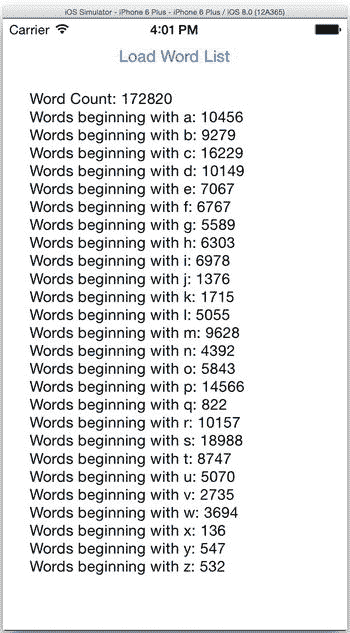

图 3-5。显示按字母统计单词数量的 WordList 应用程序

## 理解谓词与表达式

第 2 章讨论了谓词及其两种构建方式。

* 使用查询语言；
* 使用`NSExpression`类手动构建谓词。

在刚刚实现的`wordCountForCategory:`方法中，我们使用谓词查询语言来过滤查询结果。谓词查询语言类似于结构化查询语言（SQL）的`WHERE`子句：您指定要过滤的属性和关系（即“列”）、这些属性需要与之比较的值，以及比较方式。例如，我们可以通过谓词“`text = 'zyzzyvas'`”从单词列表中检索“zyzzyvas”这个词。通常，谓词查询语言比使用`NSExpression`类构建谓词更易于编写和使用。不过，查询语言并不能覆盖`NSExpression`的所有用例，有时您也可能更喜欢使用`NSExpression`，因此理解这两种方法对于获取目标数据至关重要。

简而言之，谓词会对对象执行一次测试。若测试通过，则对象被获取；若失败，则对象不被获取。一个谓词包含两个或多个表达式以及一个或多个比较器。在上一段提到的谓词中，属性`text`和常量字符串`'zyzzyvas'`是表达式，而运算符`=`是比较器，它比较`Word`对象的`text`值与`'zyzzyvas'`，若匹配则返回该`Word`对象。

要使用`NSExpression`构建等效谓词，您需要创建两个表达式：一个用于`text`，一个用于`"zyzzyvas"`，然后创建一个`NSComparisonPredicate`实例来比较这两个表达式，判断它们是否相等。相应的代码如代码清单 3-24（Objective-C）或代码清单 3-25（Swift）所示。

***代码清单 3-24***。使用`NSExpression`构建谓词（Objective-C）

```objc
NSExpression *expressionText = [NSExpression expressionForKeyPath:@"text"];
NSExpression *expressionZyzzyvas = [NSExpression expressionForConstantValue:@"zyzzyvas"];
NSPredicate *predicate = [NSComparisonPredicate predicateWithLeftExpression:expressionText
                                                            rightExpression:expressionZyzzyvas
                                                            modifier:NSDirectPredicateModifier
                                                                type:NSEqualToPredicateOperatorType
                                                             options:0];
```

***代码清单 3-25***。使用`NSExpression`构建谓词（Swift）

```swift
let expressionText = NSExpression(forKeyPath: "text")
let expressionZyzzyvas = NSExpression(forConstantValue: "zyzzyvas")
let predicate = NSComparisonPredicate(leftExpression: expressionText, rightExpression: expressionZyzzyvas, modifier: .DirectPredicateModifier, type: .EqualToPredicateOperatorType, options: NSComparisonPredicateOptions.convertFromNilLiteral())
```

这段代码显然更复杂，但它实现了与查询语言谓词相同的功能。在接下来的几节中，我们将深入探讨如何通过这种方式创建谓词。但在进一步讲解之前，请先证明两种方法都可行：在 WordList 应用程序中分别通过两种方式添加方法来检索单词“zyzzyvas”，并在文本视图中显示结果。同时，调用`NSPredicate`的`predicateFormat`方法记录用`NSExpression`创建的谓词。代码清单 3-26 展示了 Objective-C 代码，代码清单 3-27 展示了 Swift 代码。

***代码清单 3-26***。同时使用查询语言和`NSExpression`（Objective-C）

```objc
- (NSString *)statistics {
  NSMutableString *string = [[NSMutableString alloc] init];
  [string appendString:[self wordCount]];
  for (char c = 'a'; c <= 'z'; c++) {
    [string appendString:[self wordCountForCategory:[NSString stringWithFormat:@"%c", c]]];
  }
  [string appendString:[self zyzzyvasUsingQueryLanguage]];
  [string appendString:[self zyzzyvasUsingNSExpression]];
  return string;
}

- (NSString *)zyzzyvasUsingQueryLanguage {
  NSFetchRequest *fetchRequest = [NSFetchRequest fetchRequestWithEntityName:@"Word"];
  fetchRequest.predicate = [NSPredicate predicateWithFormat:@"text = 'zyzzyvas'"];
  NSArray *words = [self.managedObjectContext executeFetchRequest:fetchRequest error:nil];
  return words.count == 0 ? @"" : [NSString stringWithFormat:@"%@\n", [words[0] valueForKey:@"text"]];
}
- (NSString *)zyzzyvasUsingNSExpression {
  NSExpression *expressionText = [NSExpression expressionForKeyPath:@"text"];
  NSExpression *expressionZyzzyvas = [NSExpression expressionForConstantValue:@"zyzzyvas"];
  NSPredicate *predicate = [NSComparisonPredicate predicateWithLeftExpression:expressionText
                                                              rightExpression:expressionZyzzyvas
                                                           modifier:NSDirectPredicateModifier
                                                               type:NSEqualToPredicateOperatorType
                                                            options:0];
  NSLog(@"Predicate: %@", [predicate predicateFormat]);
  NSFetchRequest *fetchRequest = [NSFetchRequest fetchRequestWithEntityName:@"Word"];
  fetchRequest.predicate = predicate;
  NSArray *words = [self.managedObjectContext executeFetchRequest:fetchRequest error:nil];
  return words.count == 0 ? @"" : [NSString stringWithFormat:@"%@\n", [words[0] valueForKey:@"text"]];
}
```

***代码清单 3-27***。同时使用查询语言和`NSExpression`（Swift）

```swift
func statistics() -> String {
    var string = NSMutableString()
    string.appendString(wordCount())
```


```swift
for c in "abcdefghijklmnopqrstuvwxyz" {
    string.appendString(wordCountForCategory("\(c)"))
}

string.appendString(zyzzyvasUsingQueryLanguage())
string.appendString(zyzzyvasUsingNSExpression())

return string
}

func zyzzyvasUsingQueryLanguage() -> String {
    var fetchRequest = NSFetchRequest(entityName: "Word")
    fetchRequest.predicate = NSPredicate(format: "text = 'zyzzyvas'", argumentArray: [])

    var error: NSError? = nil
    if let words = self.managedObjectContext!.executeFetchRequest(fetchRequest, error: &error) {
        if words.isEmpty { return "" }
        else {
            let word: AnyObject! = words[0].valueForKey("text")
            return "\(word)\n"
        }
        else { return "" }
    }
}

func zyzzyvasUsingNSExpression() -> String {
    let expressionText = NSExpression(forKeyPath: "text")
    let expressionZyzzyvas = NSExpression(forConstantValue: "zyzzyvas")
    let predicate = NSComparisonPredicate(leftExpression: expressionText, rightExpression: expressionZyzzyvas, modifier: .DirectPredicateModifier, type: .EqualToPredicateOperatorType, options: nil)

    println("Predicate: \(predicate.predicateFormat)")

    var fetchRequest = NSFetchRequest(entityName: "Word")
    fetchRequest.predicate = predicate

    var error: NSError? = nil
    if let words = self.managedObjectContext!.executeFetchRequest(fetchRequest, error: &error) {
        if words.isEmpty { return "" }
        else {
            let word: AnyObject! = words[0].valueForKey("text")
            return "\(word)\n"
        }
    }
    else { return "" }
}
```

如果你运行`WordList`应用，应该会在文本视图中看到单词“zyzzyvas”出现两次。同时，你也应该会在日志中看到该谓词的文本版本。

```
Predicate: text == "zyzzyvas"
```

## 查看你的 SQL 查询

对于那些更熟悉 SQL 语句而不是`NSPredicate`和`NSExpression`的开发者，你可以指示你的应用在执行获取请求时记录所使用的 SQL 语句。这有助于你理解 Core Data 如何解释你的谓词和表达式，从而使调试获取请求变得更简单。

要开启应用的 SQL 调试功能，请在 Xcode 中编辑运行方案，并在“启动时传递的参数”（Arguments Passed on Launch）部分添加以下参数。

```
-com.apple.CoreData.SQLDebug 1
```

注意前面的短横线。你的 Xcode 方案设置应与图 3-6 一致。

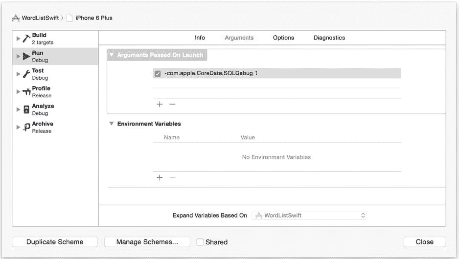

图 3-6. 在启动时传递的参数中添加`-com.apple.CoreData.SQLDebug 1`

将这些参数添加到`WordList`运行方案中，然后启动应用。现在你应该可以在 Xcode 控制台中看到`WordList`用于获取数据的 SQL 语句，以及其他信息（如查询持续时间）。输出内容类似于以下内容：

```
2014-07-30 11:45:15.647 WordList[65858:2586192] CoreData: sql: SELECT COUNT(DISTINCT t0.Z_PK) FROM ZWORD t0 JOIN ZWORDCATEGORY t1 ON t0.ZWORDCATEGORY = t1.Z_PK WHERE  t1.ZFIRSTLETTER = ?
2014-07-30 11:45:15.699 WordList[65858:2586192] CoreData: annotation: total count request execution time: 0.0528s for count of 10456.
```

实际上，你可以通过将值指定为 2 或 3（而不是 1），来让 Core Data 在控制台中输出更多 SQL 信息——数值越大，Core Data 记录的信息就越多。例如，尝试将启动参数修改为以下内容：

```
-com.apple.CoreData.SQLDebug 3
```

再次运行`WordList`应用，并查看控制台以获取更丰富的信息，例如以下内容：

```
2014-07-31 15:29:04.797 WordList[73416:2971038] CoreData: sql: SELECT COUNT(DISTINCT t0.Z_PK) FROM ZWORD t0 JOIN ZWORDCATEGORY t1 ON t0.ZWORDCATEGORY = t1.Z_PK WHERE  t1.ZFIRSTLETTER = ?
2014-07-31 15:29:04.797 WordList[73416:2971038] CoreData: details: SQLite bind[0] = "s"
2014-07-31 15:29:04.822 WordList[73416:2971038] CoreData: annotation: count request <NSFetchRequest: 0x7fc6a292d850> (entity: Word; predicate: (wordCategory.firstLetter == "s"); sortDescriptors: ((null)); type: NSCountResultType;) returned 18988
2014-07-31 15:29:04.822 WordList[73416:2971038] CoreData: annotation: total count request execution time: 0.0254s for count of 18988.
```

查看 Core Data 从你的谓词和表达式中推导出的实际 SQL 语句，可以帮助你排查问题并验证数据检索的方式是否正确。

## 创建单值表达式

表达式可以代表单值，也可以代表值的集合。`NSPredicate`支持四种类型的单值表达式，如表 3-1 所示。

表 3-1. 四种单值表达式类型

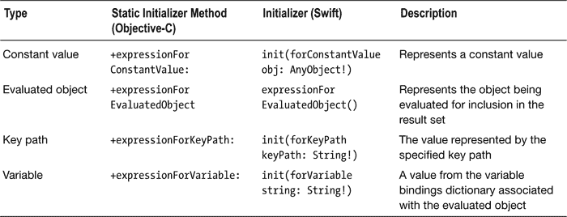

`WordList`应用中的`zyzzyvasUsingNSExpression`方法创建了两个单值表达式：一个使用键路径，另一个使用常量表达式。`expressionText`表达式解析为`Word`实体中键路径`"text"`所存储的值。

```objectivec
NSExpression *expressionText = [NSExpression expressionForKeyPath:@"text"]; // Objective-C
```

```swift
let expressionText = NSExpression(forKeyPath: "text") // Swift
```

常量值表达式`expressionZyzzyvas`代表常量值`"zyzzyvas"`。

```objectivec
NSExpression *expressionZyzzyvas = [NSExpression expressionForConstantValue:@"zyzzyvas"]; // Objective-C
```

```swift
let expressionZyzzyvas = NSExpression(forConstantValue: "zyzzyvas") // Swift
```

在使用 Core Data 时，你可能不常（甚至完全不会）用到被求值对象类型。被求值对象类型指的是`NSManagedObject`实例本身，而通常你会想要查询对象的属性和关系，而不是对象本身。我们可以做一些事情，比如查询特定的对象 ID，这可能会满足你应用的某些特殊需求。其余用法留给读者自行探索。

## 创建集合表达式

单值表达式允许谓词将对象与单个值进行比较，以决定是否包含在结果集中。然而，有时你可能希望将对象与多个值进行比较，以决定是否包含它们。集合表达式包含多个`NSExpression`实例，谓词使用这些实例进行计算。在本节中，我们研究聚合表达式类型，你可以使用`NSExpression`的`+expressionForAggregate:`静态初始化方法（Objective-C 中）或`init(forAggregate collection: [AnyObject]!)`初始化方法（Swift 中）来创建它。

尽管 Apple 关于`NSExpression`的文档指出“Core Data 不支持聚合表达式”，但在实践中这并不总是正确的。例如，假设我们想要检索字母数在 20 到 25 之间（包含两端）的单词。我们将创建两个`NSExpression`实例，一个用于常量值 20，一个用于常量值 25，然后创建一个包含这两个实例的聚合表达式。接着，我们将在谓词中使用该聚合表达式。代码清单 3-28 展示了如何在 Objective-C 中创建该聚合表达式，而代码清单 3-29 展示了如何在 Swift 中创建。

***代码清单 3-28***. 在 Objective-C 中创建聚合表达式

```objectivec
NSExpression *lower = [NSExpression expressionForConstantValue:@20];
NSExpression *upper = [NSExpression expressionForConstantValue:@25];
NSExpression *expr  = [NSExpression expressionForAggregate:@[lower, upper]];
```


### 排版后的内容

***清单 3-29***. 在 Swift 中创建聚合表达式

```
let lower = NSExpression(forConstantValue: 20)
let upper = NSExpression(forConstantValue: 25)
let expr  = NSExpression(forAggregate: [lower, upper])
```

要将其整合到 WordList 应用中，请添加清单 3-30 中所示的 Objective-C 方法，或清单 3-31 中所示的 Swift 函数。该方法/函数接受一个范围（`NSRange` 实例），并统计长度在该范围内的单词数量。然后，在 `statistics` 方法中添加对该方法/函数的调用。

```
[string appendString:[self wordCountForRange:NSMakeRange(20, 25)]]; // Objective-C
string.appendString(wordCountForRange(NSMakeRange(20, 25))) // Swift
```

***清单 3-30***. 使用聚合表达式查找长度在指定范围内的单词 (Objective-C)

```
- (NSString *)wordCountForRange:(NSRange)range {
  NSExpression *length = [NSExpression expressionForKeyPath:@"length"];
  NSExpression *lower = [NSExpression expressionForConstantValue:@(range.location)];
  NSExpression *upper = [NSExpression expressionForConstantValue:@(range.length)];
  NSExpression *expr = [NSExpression expressionForAggregate:@[lower, upper]];
  NSPredicate *predicate = [NSComparisonPredicate predicateWithLeftExpression:length
                                              rightExpression:expr
                                          modifier:NSDirectPredicateModifier
                                              type:NSBetweenPredicateOperatorType
                                           options:0];
  NSLog(@"聚合谓词: %@", [predicate predicateFormat]);
  NSFetchRequest *fetchRequest = [NSFetchRequest fetchRequestWithEntityName:@"Word"];
  fetchRequest.predicate = predicate;
  NSUInteger count = [self.managedObjectContext countForFetchRequest:fetchRequest error:nil];
  return [NSString stringWithFormat:@"%lu-%lu 字母的单词数量: %lu\n", range.location, range.length, count];
}
```

***清单 3-31***. 使用聚合表达式查找长度在指定范围内的单词 (Swift)

```
func wordCountForRange(range: NSRange) -> String {
    let length = NSExpression(forKeyPath: "length")
    let lower = NSExpression(forConstantValue: range.location)
    let upper = NSExpression(forConstantValue: range.length)
    let expr = NSExpression(forAggregate: [lower, upper])
    let predicate = NSComparisonPredicate(leftExpression: length, rightExpression: expr, modifier: .DirectPredicateModifier, type: .BetweenPredicateOperatorType, options: nil)

println("聚合谓词: \(predicate.predicateFormat)")

var fetchRequest = NSFetchRequest(entityName: "Word")
    fetchRequest.predicate = predicate

var error: NSError? = nil
    let count = self.managedObjectContext!.countForFetchRequest(fetchRequest, error: &error)

return "\(range.location)-\(range.length) 字母的单词数量: \(count)\n"
}
```

下一节“使用不同谓词类型比较表达式”将介绍不同的谓词类型，包括 `NSBetweenPredicateOperatorType`。

运行 WordList 应用后，你应该在输出中看到如下所示的一行：

```
20-25 字母的单词数量: 276
```

在 Xcode 控制台中，你还可以看到谓词的查询语言将两个常量值合并到了一个 `BETWEEN` 子句中，正如我们所预期的那样。

```
length BETWEEN {20, 25}
```

### 使用不同谓词类型比较表达式

除了表达式之外，谓词还需要比较器来评估是否将对象包含在其结果集中。`NSComparisonPredicate` 类是 `NSPredicate` 的子类，它使用你在创建时指定的比较器类型来比较两个表达式。例如，你可以要求两个表达式相等，以便将评估的对象包含在结果集中。我们在将 `Word` 对象与常量表达式 "zyzzyvas" 进行比较时看到了这一点：只有文本完全匹配的单词才会被返回。

我们还在 `wordCountForRange:` 方法中看到了一个“介于”类型的比较器，该方法要求单词的长度介于两个整数之间才能包含在结果集中。`NSComparisonPredicate` 还提供了其他多种比较类型，以满足不同的比较需求。请参阅表 3-2 以了解比较类型的列表。查询语言和逻辑描述列分别使用 `L` 和 `R` 来表示正在比较的左表达式和右表达式。Swift 类型与 Objective-C 类型相同，只是 Objective-C 类型以 `NS` 开头，而 Swift 类型则没有。

表 3-2. 比较类型

| Objective-C 或 Swift 类型 | 查询语言 | 逻辑描述 |
| --- | --- | --- |
| `(NS)LessThanPredicateOperatorType` | `L < R` | `L` 小于 `R` |
| `(NS)LessThanOrEqualToPredicateOperatorType` | `L <= R` | `L` 小于或等于 `R` |
| `(NS)GreaterThanPredicateOperatorType` | `L > R` | `L` 大于 `R` |
| `(NS)GreaterThanOrEqualToPredicateOperatorType` | `L >= R` | `L` 大于或等于 `R` |
| `(NS)EqualToPredicateOperatorType` | `L = R` | `L` 等于 `R` |
| `(NS)NotEqualToPredicateOperatorType` | `L != R` | `L` 不等于 `R` |
| `(NS)MatchesPredicateOperatorType` | `L MATCHES R` | `L` 匹配 `R` 正则表达式 |
| `(NS)LikePredicateOperatorType` | `L LIKE R` | `L = R`，其中 `R` 可以包含 * 通配符 |
| `(NS)BeginsWithPredicateOperatorType` | `L BEGINSWITH R` | `L` 以 `R` 开头 |
| `(NS)EndsWithPredicateOperatorType` | `L ENDSWITH R` | `L` 以 `R` 结尾 |
| `(NS)InPredicateOperatorType` | `L IN R` | `L` 在集合 `R` 中 |
| `(NS)ContainsPredicateOperatorType` | `L CONTAINS R` | `L` 是一个包含 `R` 的集合 |
| `(NS)BetweenPredicateOperatorType` | `L BETWEEN R` | `L` 是介于数组 `R` 中两个值之间的一个值 |

**注意**：`NSLikePredicateOperatorType` 是 `NSMatchesPredicateOperatorType` 的简化版本。`NSMatchesPredicateOperatorType` 可以使用复杂的正则表达式，而 `NSLikePredicateOperatorType` 则使用简单的通配符替换字符 (*)，因此表达式文本 `LIKE 'b*ball'` 将匹配 baseball 和 basketball，但不会匹配 football。

例如，我们可以使用 `NSEndsWithPredicateOperatorType` 来查找所有以字母 "gry" 结尾的单词。清单 3-32 展示了 Objective-C 中的 `endsWithGryWords` 方法，清单 3-33 则展示了相应的 Swift 版本。别忘了在你的 `statistics` 方法中添加对该方法的调用，然后构建并运行应用，你将看到 "puggry, hungry, angry"（顺序不定）被添加到输出中。

***清单 3-32***. Objective-C 中的 `endsWithGryWords` 方法


```
- (NSString *)endsWithGryWords {
  NSExpression *text = [NSExpression expressionForKeyPath:@"text"];
  NSExpression *gry = [NSExpression expressionForConstantValue:@"gry"];
  NSPredicate *predicate = [NSComparisonPredicate predicateWithLeftExpression:text
                                                              rightExpression:gry
                                                                  modifier:NSDirectPredicateModifier
                                                                      type:NSEndsWithPredicateOperatorType
                                                                   options:0];
  NSLog(@"Predicate: %@", [predicate predicateFormat]);
  NSFetchRequest *fetchRequest = [NSFetchRequest fetchRequestWithEntityName:@"Word"];
  fetchRequest.predicate = predicate;
  NSArray *gryWords = [self.managedObjectContext executeFetchRequest:fetchRequest error:nil];
  return [NSString stringWithFormat:@"-gry words: %@\n",
          [[gryWords valueForKey:@"text"] componentsJoinedByString:@","]];
}
```

***示例 3-33***. Swift 中的 `endsWithGryWords` 方法

```
func endsWithGryWords() -> String {
    let text = NSExpression(forKeyPath: "text")
    let gry = NSExpression(forConstantValue: "gry")
    let predicate = NSComparisonPredicate(leftExpression: text, rightExpression: gry, modifier: .DirectPredicateModifier, type: .EndsWithPredicateOperatorType, options: nil)

println("Predicate: \(predicate.predicateFormat)")

var fetchRequest = NSFetchRequest(entityName: "Word")
    fetchRequest.predicate = predicate

let list = NSMutableString()
var error: NSError? = nil
    if let gryWords = self.managedObjectContext!.executeFetchRequest(fetchRequest, error: &error) {
        for word in gryWords {
            list.appendString(((word as NSManagedObject).valueForKey("text") as String)+",")
        }
    }
    return "-gry words: \(list)\n"
}
```

你可以在 Xcode 控制台中看到该谓词对应的查询语言为：

```
text ENDSWITH "gry"
```

## 使用不同的比较修饰符

我们一直在使用的 `NSComparisonPredicate` 静态初始化方法的第三个参数是 `modifier`，并且一直只传入了 `NSDirectPredicateModifier`。然而，如果左表达式是一个集合而非单个对象，你还有更多修饰符可以选择，如表 3-3 所示。与谓词类型常量类似，Objective-C 常量以 `NS` 开头，而 Swift 常量则不然。

表 3-3. 比较谓词修饰符

| 修饰符 | 查询语言示例 | 描述 |
| --- | --- | --- |
| `(NS)DirectPredicateModifier` | `X` | 将左表达式直接与右表达式进行比较 |
| `(NS)AllPredicateModifier` | `ALL X` | 将左表达式（一个集合）与右表达式进行比较，仅当所有值都匹配时才返回 `YES` |
| `(NS)AnyPredicateModifier` | `ANY X` | 将左表达式（一个集合）与右表达式进行比较，只要有任何值匹配就返回 `YES` |

如上表所示，常量 `NSAllPredicateModifier` 对应查询语言表达式 `ALL X`，并且仅当集合中的所有值都与谓词匹配时才返回 `YES`，否则返回 `NO`。另一方面，常量 `NSAnyPredicateModifier` 对应 `ANY X`，只要集合中至少有一个值与谓词匹配就返回 `YES`，否则返回 `NO`。

还记得本章前面我们提到 Apple 文档声称 Core Data 不支持聚合表达式吗？对于 `NSAllPredicateModifier` 来说，这确实是事实。如果你尝试运行一个 `ALL X` 的查询，你的应用将会崩溃。不过，你可以使用 `NSAnyPredicateModifier`，正如示例 3-34（Objective-C）和示例 3-35（Swift）中展示的 `anyWordContainsZ` 方法所示。该方法列出所有其中包含字母 "z" 的单词所属的分类。在 `statistics` 中添加该方法并调用它，构建并运行应用，你将看到除了 "x" 之外的所有分类都至少有一个单词包含字母 "z"。

***示例 3-34***. `anyWordContainsZ` 方法（Objective-C）

```
- (NSString *)anyWordContainsZ {  NSExpression *text = [NSExpression expressionForKeyPath:@"words.text"];
  NSExpression *z = [NSExpression expressionForConstantValue:@"z"];
  NSPredicate *predicate = [NSComparisonPredicate predicateWithLeftExpression:text
                                                              rightExpression:z
                                                                  modifier:NSAnyPredicateModifier
                                                                      type:NSContainsPredicateOperatorType
                                                                   options:0];
  NSLog(@"Predicate: %@", [predicate predicateFormat]);
  NSFetchRequest *fetchRequest = [NSFetchRequest fetchRequestWithEntityName:@"WordCategory"];
  fetchRequest.predicate = predicate;
  NSArray *categories = [self.managedObjectContext executeFetchRequest:fetchRequest error:nil];
  return [NSString stringWithFormat:@"ANY: %@\n",
         [[categories valueForKey:@"firstLetter"] componentsJoinedByString:@","]];
}
```

***示例 3-35***. `anyWordContainsZ` 方法（Swift）

```
func anyWordContainsZ() -> String {
    let text = NSExpression(forKeyPath: "words.text")
    let z = NSExpression(forConstantValue: "z")
    let predicate = NSComparisonPredicate(leftExpression: text, rightExpression: z, modifier:.AnyPredicateModifier, type: .ContainsPredicateOperatorType, options: nil)

println("Predicate: \(predicate.predicateFormat)")

var fetchRequest = NSFetchRequest(entityName: "WordCategory")
    fetchRequest.predicate = predicate

let list = NSMutableString()
    var error: NSError? = nil
    if let categories = self.managedObjectContext!.executeFetchRequest(fetchRequest, error: &error) {
        for word in categories {
            list.appendString(((word as NSManagedObject).valueForKey("firstLetter") as String)+",")
        }
    }

return "ANY: \(list)\n"
}
```

## 使用不同的选项

`NSComparisonPredicate` 静态初始化方法的最后一个参数是 `options`，我们之前一直简单地传递了 `0`（Swift 中为 `NSComparisonPredicatOptions.convertFromNilLiteral()`）。实际上，对于字符串比较运算符，你还有另外四个可选值。每个选项在查询语言中都有一个对应的代码，你可以通过在运算符后紧跟方括号内的代码来使用它们。表 3-4 列出了可用的选项、代码以及如何在查询语言中使用它们。同样，Objective-C 的选项以 `NS` 开头，而 Swift 的则不然。

表 3-4. 字符串比较选项

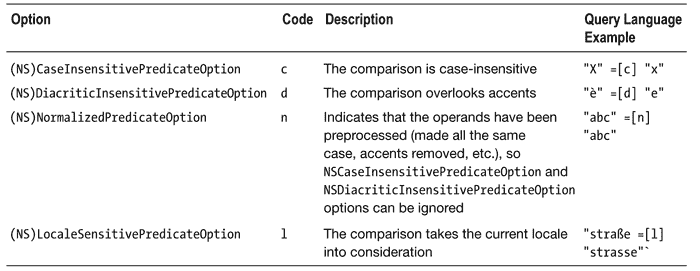

你可以使用按位或标志（bitwise OR）来指定多个选项，或在查询语言中将多个代码组合在一起。例如，要同时进行不区分大小写和不区分变音符号的比较，你可以为 `options` 参数传递：

```
NSCaseInsensitivePredicateOption | NSDiacriticInsensitivePredicateOption
```

使用查询语言时，你可以像下面这样操作：

```
"È" =[cd] "e"
```


尽管我们的单词列表中不包含任何重音或非英文字符，但我们仍然可以验证不区分大小写的选项是否有效。创建一个名为`caseInsensitiveFetch:`的新方法，该方法接受一个`NSString`参数。在该方法中，将字符串转换为大写，然后使用`NSCaseInsensitivePredicateOption`选项来获取单词。代码清单 3-36（Objective-C）和代码清单 3-37（Swift）展示了你的方法或函数应有的样子。

***代码清单 3-36***. `caseInsensitiveFetch:` 方法（Objective-C）

```
- (NSString *)caseInsensitiveFetch:(NSString *)word {
  NSExpression *text = [NSExpression expressionForKeyPath:@"text"];
  NSExpression *allCapsWord = [NSExpression expressionForConstantValue:[word uppercaseString]];
  NSPredicate *predicate = [NSComparisonPredicate predicateWithLeftExpression:text
                                                              rightExpression:allCapsWord
                                                        modifier:NSDirectPredicateModifier
                                                            type:NSEqualToPredicateOperatorType
                                                         options:NSCaseInsensitivePredicateOption];
  NSLog(@"Predicate: %@", [predicate predicateFormat]);
  NSFetchRequest *fetchRequest = [NSFetchRequest fetchRequestWithEntityName:@"Word"];
  fetchRequest.predicate = predicate;
  NSArray *words = [self.managedObjectContext executeFetchRequest:fetchRequest error:nil];
  return [NSString stringWithFormat:@"%@\n", words.count == 0 ? @"" : [words[0] valueForKey:@"text"]];
}
```

***代码清单 3-37***. `caseInsensitiveFetch:` 函数（Swift）

```
func caseInsensitiveFetch(word: String) -> String {
    let text = NSExpression(forKeyPath: "text")
    let allCapsWord = NSExpression(forConstantValue: word.uppercaseString)
    let predicate = NSComparisonPredicate(leftExpression: text, rightExpression: allCapsWord, modifier: .DirectPredicateModifier, type: .EqualToPredicateOperatorType, options: .CaseInsensitivePredicateOption)

println("Predicate: \(predicate.predicateFormat)")

var fetchRequest = NSFetchRequest(entityName: "Word")
    fetchRequest.predicate = predicate

var error: NSError? = nil
    if let words = self.managedObjectContext!.executeFetchRequest(fetchRequest, error: &error) {
        if words.isEmpty { return "" }
        else {
            let word: AnyObject! = words[0].valueForKey("text")
            return "\(word)\n"
        }
    }
    else { return "" }
}
```

然后，在你的`statistics`方法中添加对该方法的调用，并传入你选择的单词，如下所示：

```
[string appendString:[self caseInsensitiveFetch:@"qiviut"]]; // Objective-C
string.appendString(caseInsensitiveFetch("qiviut")) // Swift
```

你应该会在 Xcode 控制台中看到查询语言的等效表示，并且在 WordList 显示区域看到你的单词。查询语言的等效表示如下所示：

```
text ==[c] "QIVIUT"
```

## 汇总：使用复合谓词

目前我们使用的都是单一条件的谓词，无论是查找属于某个类别的单词，还是匹配特定文本的单词。然而，为了提取真正需要的数据，你通常需要组合多个条件。你可以通过使用逻辑运算符 OR、AND 和 NOT 来组合多个子谓词，从而形成谓词。例如，你可能想要查找所有以“-ing”结尾的 20 字母单词，或者包含“q”但不包含“u”的单词。对于这类谓词，你需要多个条件。

Core Data 允许你使用 `NSCompoundPredicate` 类来构建复合谓词。你可以使用表 3-5 中所示的三个静态初始化器之一（在 Swift 中对应同名的函数）来构建它们。

表 3-5. 用于创建复合谓词的静态初始化器

| 初始化器名称 | 查询语言示例 | 描述 |
| --- | --- | --- |
| `+andPredicateWithSubpredicates:` | `P1 AND P2 AND P3` | 仅当所有子谓词都返回 `YES` 时返回 `YES` |
| `+orPredicateWithSubpredicates:` | `P1 OR P2 OR P3` | 只要至少一个子谓词返回 `YES` 就返回 `YES` |
| `+notPredicateWithSubpredicate:` | `NOT P` | 当其唯一的子谓词返回 `NO` 时返回 `YES` |

要获取以“-ing”结尾的 20 字母单词列表，创建一个名为`twentyLetterWordsEndingInIng`的方法，如代码清单 3-38（Objective-C）和代码清单 3-39（Swift）所示，并在`statistics`方法中添加对该方法的调用。这段代码创建了一个谓词，用于比较每个单词的长度是否为 20。它创建了另一个谓词，用于比较每个单词的结尾是否为“-ing”。然后，它使用逻辑运算符 AND 组合这两个谓词，创建一个复合谓词。

***代码清单 3-38***. 在 Objective-C 中使用复合谓词

```
- (NSString *)twentyLetterWordsEndingInIng {
  // 创建一个谓词，比较长度是否为 20
  NSExpression *length = [NSExpression expressionForKeyPath:@"length"];
  NSExpression *twenty = [NSExpression expressionForConstantValue:@20];
  NSPredicate *predicateLength = [NSComparisonPredicate predicateWithLeftExpression:length
                                                                rightExpression:twenty
                                                            modifier:NSDirectPredicateModifier
                                                                type:NSEqualToPredicateOperatorType
                                                             options:0];

// 创建一个谓词，比较文本是否以 "-ing" 结尾
  NSExpression *text = [NSExpression expressionForKeyPath:@"text"];
  NSExpression *ing = [NSExpression expressionForConstantValue:@"ing"];
  NSPredicate *predicateIng = [NSComparisonPredicate predicateWithLeftExpression:text
                                                               rightExpression:ing
                                                           modifier:NSDirectPredicateModifier
                                                               type:NSEndsWithPredicateOperatorType
                                                            options:0];

// 组合谓词
  NSPredicate *predicate = [NSCompoundPredicate andPredicateWithSubpredicates:@[predicateLength, predicateIng]];
  NSLog(@"Compound predicate: %@", [predicate predicateFormat]);

NSFetchRequest *fetchRequest = [NSFetchRequest fetchRequestWithEntityName:@"Word"];
  fetchRequest.predicate = predicate;
  NSArray *words = [self.managedObjectContext executeFetchRequest:fetchRequest error:nil];
  return [NSString stringWithFormat:@"%@\n", [[words valueForKey:@"text"] componentsJoinedByString:@","]];
}
```

***代码清单 3-39***. 在 Swift 中使用复合谓词

```
func twentyLetterWordsEndingInIng() -> String {
    // 创建一个谓词，比较长度是否为 20
    let length = NSExpression(forKeyPath: "length")
    let twenty = NSExpression(forConstantValue: 20)
    let predicateLength = NSComparisonPredicate(leftExpression: length, rightExpression: twenty, modifier: .DirectPredicateModifier, type: .EqualToPredicateOperatorType, options: nil)

// 创建一个谓词，比较文本是否以 "-ing" 结尾
    let text = NSExpression(forKeyPath: "text")
    let ing = NSExpression(forConstantValue: "ing")
    let predicateIng = NSComparisonPredicate(leftExpression: text, rightExpression: ing, modifier: .DirectPredicateModifier, type: .EndsWithPredicateOperatorType, options: nil)

// 组合谓词
    let predicate = NSCompoundPredicate.andPredicateWithSubpredicates([predicateLength, predicateIng])

println("Compound predicate: \(predicate.predicateFormat)")
```


`var fetchRequest = NSFetchRequest(entityName: "Word")`  
`fetchRequest.predicate = predicate`  

`let list = NSMutableString()`  
`var error: NSError? = nil`  
`if let words = self.managedObjectContext!.executeFetchRequest(fetchRequest, error: &error) {`  
`for word in words {`  
`list.appendString(((word as NSManagedObject).valueForKey("text") as String)+",")`  
`}`  
`}`  

`return "\(list)\n"`  
`}`  

构建并运行 `WordList` 后，你会在 `WordList` 界面中看到四个以 "-ing" 结尾的、长度为 20 个字母的单词。同时，你也会在 Xcode 控制台中看到对应的查询语言，内容如下：

```  
length == 20 AND text ENDSWITH "ing"  
```  

当你需要根据多个条件过滤数据以获取所需结果时，请记得将多个谓词组合成一个复合谓词，并让 Core Data 替你完成所有条件的应用工作。另外，如果你构建了前面提到的复合谓词，用于查找包含 "q" 但不包含 "u" 的单词，你会看到匹配的 21 个单词。

### 聚合

聚合数据是指使用集合运算符对集合进行全局统计。集合运算符是键值编码（Key-Value Coding）范式的一部分，可以添加到键路径中以指示应当执行聚合操作。使用这些聚合运算符的语法如下：

```  
(key path to collection).@(operator).(key path to argument property)  
```  

例如，要引用单词列表中单词的平均长度，你可以这样写：

```  
words.@avg.length  
```  

苹果官方文档将这些运算符称为集合和数组运算符，因为它们可以用于任何集合，而不仅仅是 Core Data 的结果集。你也可以将它们用作谓词的一部分；例如，要获取所有包含超过 10,000 个单词的类别，你可以使用包含查询语言的谓词：

```  
words.@count > 10000  
```  

表 3-6 列出了这些运算符，它们在 Objective-C 或 Swift 中是相同的。

**表 3-6.** 聚合运算符

| 运算符 | 常量 | 描述 |
| --- | --- | --- |
| avg | `NSAverageKeyValueOperator` | 计算集合中参数属性的平均值 |
| count | `NSCountKeyValueOperator` | 计算集合中的项目数量（不使用参数属性） |
| min | `NSMinimumKeyValueOperator` | 计算集合中参数属性的最小值 |
| max | `NSMaximumKeyValueOperator` | 计算集合中参数属性的最大值 |
| sum | `NSSumKeyValueOperator` | 计算集合中参数属性的总和 |

### 使用 `@count` 获取计数

`@count` 函数返回符合谓词的对象数量。我们可以利用它来返回包含大量单词（这里我们将阈值设定为超过 10,000）的首字母列表，如前所述。我们设置的用于检索这些数据的抓取请求，目标是 `Category` 实体，并获取那些 `word` 关系计数超过 10,000 的 `category` 对象。这样我们就得到了那些作为超过 10,000 个单词开头的首字母。

我们使用查询语言来设置这个谓词，如代码清单 3-40（Objective-C）和代码清单 3-41（Swift）中所示的 `highCountCategories` 方法。

***代码清单 3-40.** 在 Objective-C 中使用 `@count` 函数*

```  
- (NSString *)highCountCategories {  
NSPredicate *predicate = [NSPredicate predicateWithFormat:@"words.@count > %d", 10000];  
NSLog(@"Predicate: %@", [predicate predicateFormat]);  

NSFetchRequest *fetchRequest = [NSFetchRequest fetchRequestWithEntityName:@"WordCategory"];  
fetchRequest.predicate = predicate;  
NSArray *categories = [self.managedObjectContext executeFetchRequest:fetchRequest error:nil];  
return [NSString stringWithFormat:@"High count categories: %@\n",  
[[categories valueForKey:@"firstLetter"] componentsJoinedByString:@","]];  
}  
```  

***代码清单 3-41.** 在 Swift 中使用 `@count` 函数*

```  
func highCountCategories() -> String {  
let predicate = NSPredicate(format: "words.@count > %d", argumentArray: [10000])  
println("Predicate: \(predicate.predicateFormat)")  

var fetchRequest = NSFetchRequest(entityName: "WordCategory")  
fetchRequest.predicate = predicate  

let list = NSMutableString()  
var error: NSError? = nil  
if let categories = self.managedObjectContext!.executeFetchRequest(fetchRequest, error: &error) {  
for word in categories {  
list.appendString(((word as NSManagedObject).valueForKey("firstLetter") as String)+",")  
}  
}  

return "High count categories: \(list)\n"  
}  
```  

这段代码创建了一个谓词，用于检查 `words` 关系的计数是否大于 10,000，然后为 `WordCategory` 实体创建一个使用该谓词的抓取请求。最后，它以逗号分隔的列表形式返回符合条件的首字母。

在 `statistics` 方法中添加对此方法的调用。然后，构建并运行应用程序，即可看到包含超过 10,000 个单词的首字母：a, c, d, p, r 和 s。

### 获取所有单词的平均长度——两种方法

直接在集合上使用聚合运算符非常直接：先使用 Core Data 抓取请求获取数据，然后应用运算符。例如，代码清单 3-42（Objective-C）和代码清单 3-43（Swift）演示了如何直接检索平均单词长度。

***代码清单 3-42.** 从集合中获取平均单词长度（Objective-C）*

```  
- (NSString *)averageWordLengthFromCollection {  
NSFetchRequest *fetchRequest = [NSFetchRequest fetchRequestWithEntityName:@"Word"];  
NSArray *words = [self.managedObjectContext executeFetchRequest:fetchRequest error:nil];  
return [NSString stringWithFormat:@"Average from collection: %.2f\n",  
[[words valueForKeyPath:@"@avg.length"] floatValue]];  
}  
```  

***代码清单 3-43.** 从集合中获取平均单词长度（Swift）*

```  
func averageWordLengthFromCollection() -> String {  
var fetchRequest = NSFetchRequest(entityName: "Word")  

var error: NSError? = nil  
let words = self.managedObjectContext!.executeFetchRequest(fetchRequest, error: &error)  

var formattedAverage = "0"  
if let words = words {  
if let avg = (words as NSArray).valueForKeyPath("@avg.length") as? Float {  
let format = ".2"  
formattedAverage = avg.format(format)  
}  
}  
return "Average from collection: \(formattedAverage)\n"  
}  
```  

这段代码获取了所有单词，然后使用以下代码应用 `@avg` 运算符：

```  
[words valueForKeyPath:@"avg.length"] // Objective-C  
(words as NSArray).valueForKeyPath("@avg.length") as Float // Swift  
```  

在 `statistics` 方法中添加对此方法的调用，然后运行它，可以看到平均长度为 9.09 个字符。


然而，你会发现这是在用简单性换取效率。这段代码读取了所有单词，然后计算了平均长度。我们可以改用`NSExpression`和另一个类`NSExpressionDescription`，仅通过 Core Data 来获取平均值。首先，我们使用`NSExpression`提供的另一个 Objective-C 静态初始化方法：`+expressionForFunction:arguments:`，它接收一个预定义的函数名称和一个`NSExpression`对象数组。Swift 对应的写法类似：格式为`init(forFunction name: String!, arguments parameters: [AnyObject]!)`的函数，同样接收一个预定义的函数名称和一个`NSExpression`对象数组。

这些预定义的函数名称与聚合函数名称相似，但并不完全一致。Apple 提供的文档列出了所有函数，但我们只重点介绍表 3-7 中展示的几个。

表 3-7. `+expressionForFunction:arguments:` 的部分预定义函数

| 函数名称 | 描述 |
| --- | --- |
| `average:` | 返回数组中数值的平均值 |
| `sum:` | 返回数组中数值的总和 |
| `count:` | 返回数组中数值的个数 |
| `min:` | 返回数组中的最小值 |
| `max:` | 返回数组中的最大值 |

由于我们需要平均单词长度，因此使用`average:`预定义函数，并传入一个代表单词`length`属性的`NSExpression`对象。代码清单 3-44 展示了 Objective-C 代码，代码清单 3-45 展示了用于创建该表达式的 Swift 代码。

***代码清单 3-44***. 使用`+expressionForFunction:arguments:`创建`NSExpression`

```
NSExpression *length = [NSExpression expressionForKeyPath:@"length"];
NSExpression *average = [NSExpression expressionForFunction:@"average:" arguments:@[length]];
```

***代码清单 3-45***. 使用`init(forFunction name: String!, arguments parameters: [AnyObject]!)`创建`NSExpression`

```
let length = NSExpression(forKeyPath: "length")
let average = NSExpression(forFunction: "average:", arguments: [length])
```

接下来，我们设置一个`NSExpressionDescription`实例，来描述我们想从 Core Data 存储中获取的内容。`NSExpressionDescription`表示 Core Data 实体上的一个属性，这个属性实际上并不出现在 Core Data 模型中，这对于获取平均值的表达式来说非常完美（因为它实际上并不存在于我们的模型中）。作为一个属性，`NSExpressionDescription`拥有名称、类型和一个表达式。代码清单 3-46（Objective-C）和代码清单 3-47（Swift）展示了如何创建用于获取单词长度平均值的`NSExpressionDescription`。

***代码清单 3-46***. 为单词长度平均值创建`NSExpressionDescription`（Objective-C）

```
NSExpressionDescription *averageDescription = [[NSExpressionDescription alloc] init];
averageDescription.name = @"average";
averageDescription.expression = average;
averageDescription.expressionResultType = NSFloatAttributeType;
```

***代码清单 3-47***. 为单词长度平均值创建`NSExpressionDescription`（Swift）

```
var averageDescription = NSExpressionDescription()
averageDescription.name = "average"
averageDescription.expression = average
averageDescription.expressionResultType = .FloatAttributeType
```

最后，我们创建一个获取请求，然后将其`propertiesToFetch`属性设为一个数组，该数组包含我们刚创建的`NSExpressionDescription`。同时，我们将获取请求的`resultType`属性设为字典类型，以便通过我们设置的名称`"average"`来引用所创建的`NSExpressionDescription`。我们执行获取请求，并从结果字典中提取平均值。代码清单 3-48（Objective-C）和代码清单 3-49（Swift）展示了完整的`averageWordLengthFromExpressionDescription`方法。从`statistics`方法中调用该方法并运行，你会发现无论以何种方式获取平均值，结果都是 9.09 个字符。

***代码清单 3-48***. 使用表达式描述获取平均单词长度（Objective-C）

```
- (NSString *)averageWordLengthFromExpressionDescription {
  NSExpression *length = [NSExpression expressionForKeyPath:@"length"];
  NSExpression *average = [NSExpression expressionForFunction:@"average:" arguments:@[length]];

  NSExpressionDescription *averageDescription = [[NSExpressionDescription alloc] init];
  averageDescription.name = @"average";
  averageDescription.expression = average;
  averageDescription.expressionResultType = NSFloatAttributeType;

  NSFetchRequest *fetchRequest = [NSFetchRequest fetchRequestWithEntityName:@"Word"];
  fetchRequest.propertiesToFetch = @[averageDescription];
  fetchRequest.resultType = NSDictionaryResultType;
  NSArray *results = [self.managedObjectContext executeFetchRequest:fetchRequest error:nil];
  return [NSString stringWithFormat:@"Average from expression description: %.2f\n",
         [[results[0] valueForKey:@"average"] floatValue]];
}
```

***代码清单 3-49***. 使用表达式描述获取平均单词长度（Swift）

```
func averageWordLengthFromExpressionDescription() -> String {
    let length = NSExpression(forKeyPath: "length")
    let average = NSExpression(forFunction: "average:", arguments: [length])

    var averageDescription = NSExpressionDescription()
    averageDescription.name = "average"
    averageDescription.expression = average
    averageDescription.expressionResultType = .FloatAttributeType

    var fetchRequest = NSFetchRequest(entityName: "Word")
    fetchRequest.propertiesToFetch = [averageDescription]
    fetchRequest.resultType = .DictionaryResultType

    var error: NSError? = nil
    let results = self.managedObjectContext!.executeFetchRequest(fetchRequest, error: &error)

    var formattedAverage = "0"
    if let results = results {
        if let avg = (words as NSArray).valueForKeyPath("@avg.length") as? Float {
            let format = ".2"
            formattedAverage = avg.format(format)
        }
    }
    return "Average from collection: \(formattedAverage)\n"
}
```

## 将函数用作右值

你还可以在谓词的右侧使用函数。例如，假设我们想从单词列表中获取最长单词的文本。我们不能简单地使用`@max(length)`聚合器，因为它返回的是最长单词的长度，而不是最长单词本身。相反，我们想要返回长度等于最大长度值的单词对象，因此谓词通过以下方式将长度与`max:`函数进行比较：

```
length = max:(length)
```

代码清单 3-50（Objective-C）和代码清单 3-51（Swift）展示了使用该谓词的`longestWords`方法（毕竟，可能存在多个长度相同的单词）。通过启用 SQL 日志记录，你可以看到 Core Data 使用的 SQL 中包含一个内部的`SELECT`语句，正如预期的那样。内部的`SELECT`语句获取单词的最大长度，外部的`SELECT`语句则获取所有具有该长度的单词。


```
SELECT 0, t0.Z_PK, t0.Z_OPT, t0.ZLENGTH, t0.ZTEXT, t0.ZWORDCATEGORY FROM ZWORD t0 WHERE  t0.ZLENGTH = (SELECT max(t1.ZLENGTH) FROM ZWORD t1)
```

***列表 3-50***. `longestWords:` 方法（Objective-C）

```
- (NSString *)longestWords {
  NSFetchRequest *fetchRequest = [NSFetchRequest fetchRequestWithEntityName:@"Word"];
  NSPredicate *predicate = [NSPredicate predicateWithFormat:@"length = max:(length)"];
  NSLog(@"Predicate: %@", [predicate predicateFormat]);
  fetchRequest.predicate = predicate;
  NSArray *words = [self.managedObjectContext executeFetchRequest:fetchRequest error:nil];
  return [NSString stringWithFormat:@"Longest words: %@\n",
          [[words valueForKey:@"text"] componentsJoinedByString:@","]];
}
```

***列表 3-51***. `longestWords:` 函数（Swift）

```
func longestWords() -> String {
    var fetchRequest = NSFetchRequest(entityName: "Word")
    let predicate = NSPredicate(format: "length = max:(length)", argumentArray: [])

println("Predicate: \(predicate.predicateFormat)")

fetchRequest.predicate = predicate

let list = NSMutableString()
    var error: NSError? = nil
    if let words = self.managedObjectContext!.executeFetchRequest(fetchRequest, error: &error) {
        for word in words {
            list.appendString(((word as NSManagedObject).valueForKey("text") as String)+",")
        }
    }
    return "Longest words: \(list)\n"
}
```

在 `statistics` 中添加对此方法的调用并运行 `WordList` 后，你将看到最长的单词是包含 28 个字母的词语 "ethylenediaminetetraacetates"。

## 使用子查询

在某些情况下，你需要根据与其他相关对象相关的条件来获取对象。例如，假设你想获取所有包含至少一个 25 字母单词的词类。不使用子查询，通常你需要分两步获取这些数据。

1.  获取所有词类。
2.  对每个词类，获取包含 25 个字母的单词数量。

子查询表达式允许你将这些步骤合并为一个查询。你的整个谓词和逻辑可以表示为：

```
SUBQUERY(words, $x, $x.length == 25).@count > 0
```

子查询的通用格式为：

```
SUBQUERY(collection_expression, variable_expression, predicate)
```

`collection_expression` 参数指代你正在获取的实体中的集合属性，因此我们使用 `words` 来引用 `words` 集合。`variable_expression` 可以按需命名；当子查询遍历集合时，该变量将临时保存集合中的每个元素。`predicate` 自然是用于判断是否包含在结果集中的测试条件。

与其他表达式类型一样，你可以使用查询语言创建子查询（如前所示），也可以通过 `NSExpression` 手动构建。`NSExpression` 类有一个名为 `+expressionForSubQuery:usingIteratorVariable:predicate:`（或 Swift 中的 `init(forSubquery expression: NSExpression!, usingIteratorVariable variable: String!, predicate predicate: AnyObject!)`）的静态初始化方法，用于创建子查询表达式。该方法的参数与查询语言格式相对应：第一个参数是要计算的集合表达式；第二个参数是在迭代过程中使用的临时变量名；最后一个参数是用于评估的谓词。

列表 3-52（Objective-C）和列表 3-53（Swift）中展示的 `wordCategoriesWith25LetterWords` 方法使用前面描述的子查询来获取所有包含至少一个 25 字母单词的词类。在你的 `statistics` 方法中添加一个调用，即可看到两个词类 "i" 和 "p" 都包含至少一个 25 字母的单词。

***列表 3-52***. 在 Objective-C 中使用子查询

```
- (NSString *)wordCategoriesWith25LetterWords {
  NSFetchRequest *fetchRequest = [NSFetchRequest fetchRequestWithEntityName:@"WordCategory"];
  NSPredicate *predicate = [NSPredicate predicateWithFormat:@"SUBQUERY(words, $x, $x.length = 25).@count > 0"];
  fetchRequest.predicate = predicate;
  NSLog(@"Subquery Predicate: %@", [predicate predicateFormat]);
  NSArray *categories = [self.managedObjectContext executeFetchRequest:fetchRequest error:nil];
  return [NSString stringWithFormat:@"Categories with 25-letter words: %@\n",
          [[categories valueForKey:@"firstLetter"] componentsJoinedByString:@","]];
}
```

***列表 3-53***. 在 Swift 中使用子查询

```
func wordCategoriesWith25LetterWords() -> String {
    var fetchRequest = NSFetchRequest(entityName: "WordCategory")
    let predicate = NSPredicate(format: "SUBQUERY(words, $x, $x.length = 25).@count > 0", argumentArray: [])

println("Subcategoy predicate: \(predicate.predicateFormat)")

fetchRequest.predicate = predicate

let list = NSMutableString()
    var error: NSError? = nil
    if let categories = self.managedObjectContext!.executeFetchRequest(fetchRequest, error: &error) {
        for word in categories {
            list.appendString(((word as NSManagedObject).valueForKey("firstLetter") as String)+",")
        }
    }

return "Categories with 25-letter words: \(list)\n"
}
```

## 排序

到目前为止，我们接受 Core Data 按任意顺序返回的获取结果，但实际上 Core Data 允许你为任何获取请求设置排序顺序。你可以选择多个列进行排序，并指定每列的排序方向。要对获取请求进行排序，可将获取请求的 `sortDescriptors` 属性设置为一组 `NSSortDescriptor` 实例。每个 `NSSortDescriptor` 存储了排序依据的列（或属性）以及排序顺序。

例如，要按长度升序对所有以 "z" 开头的单词进行排序，可以像下面这样创建一个 `NSSortDescriptor`：

```
[NSSortDescriptor sortDescriptorWithKey:@"length" ascending:YES] // Objective-C
NSSortDescriptor(key: "length", ascending: true) // Swift
```

这将按长度升序对单词进行排序，但相同长度的单词会随意排序。我们可以添加另一个排序描述符，按字母降序对这些单词进行排序，如下所示：

```
[NSSortDescriptor sortDescriptorWithKey:@"text" ascending:NO] // Objective-C
NSSortDescriptor(key: "text", ascending: false) // Swift
```

在用于设置获取请求的 `sortDescriptors` 的数组中，排序描述符的放置顺序至关重要。结果将按照排序描述符的顺序进行排序。在我们的示例中，这意味着相同长度的单词会组合在一起，并按字母降序排列。

列表 3-54（Objective-C）和列表 3-55（Swift）展示了使用这两个排序描述符对以 "z" 开头的单词进行排序的 `zWords` 方法。

***列表 3-54***. 在 Objective-C 中对结果进行排序

```
- (NSString *)zWords {
  NSFetchRequest *fetchRequest = [NSFetchRequest fetchRequestWithEntityName:@"Word"];
  NSPredicate *predicate = [NSPredicate predicateWithFormat:@"text BEGINSWITH 'z'"];
  NSSortDescriptor *lengthSort = [NSSortDescriptor sortDescriptorWithKey:@"length" ascending:YES];
  NSSortDescriptor *alphaSort = [NSSortDescriptor sortDescriptorWithKey:@"text" ascending:NO];

fetchRequest.predicate = predicate;
  fetchRequest.sortDescriptors = @[lengthSort, alphaSort];

NSLog(@"Predicate: %@", predicate);
  NSArray *words = [self.managedObjectContext executeFetchRequest:fetchRequest error:nil];
  return [NSString stringWithFormat:@"Z words:\n%@\n",
          [[words valueForKey:@"text"] componentsJoinedByString:@"\n"]];
}
```

***列表 3-55***. 在 Swift 中对结果进行排序


`func zWords() -> String {
    var fetchRequest = NSFetchRequest(entityName: "Word")
    let predicate = NSPredicate(format: "text BEGINSWITH 'z'", argumentArray: [])

    println("Predicate: \(predicate.predicateFormat)")

    let lengthSort = NSSortDescriptor(key: "length", ascending: true)
    let alphaSort = NSSortDescriptor(key: "text", ascending: false)

    fetchRequest.predicate = predicate
    fetchRequest.sortDescriptors = [lengthSort, alphaSort]

    let list = NSMutableString()
    var error: NSError? = nil
    if let words = self.managedObjectContext!.executeFetchRequest(fetchRequest, error: &error) {
        for word in words {
            list.appendString(((word as NSManagedObject).valueForKey("text") as String)+",")
        }
    }

    return "Z words: \(list)\n"
}
```

记得在`statistics`中添加对`zWords`方法的调用，以观察排序的执行结果。

## 总结

本章或许未能帮你成为更出色的《Words with Friends》玩家，但无疑提升了你在 Core Data 存储中查询数据的能力。无论是使用查询语言语法，还是通过`NSExpression`构建谓词，你都应能编写出满足应用需求的查询语句，从数据存储中提取所需信息。别忘了善用 SQL 日志记录和打印谓词格式等工具来优化查询，并准确理解应用程序在获取数据时的执行过程。

