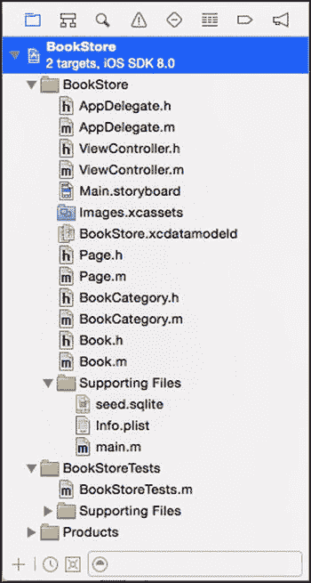
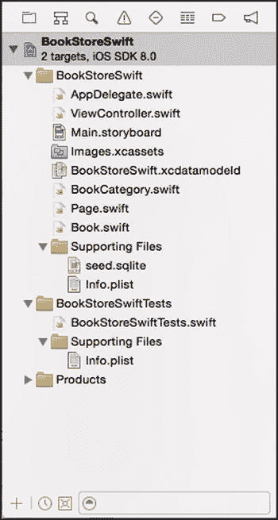
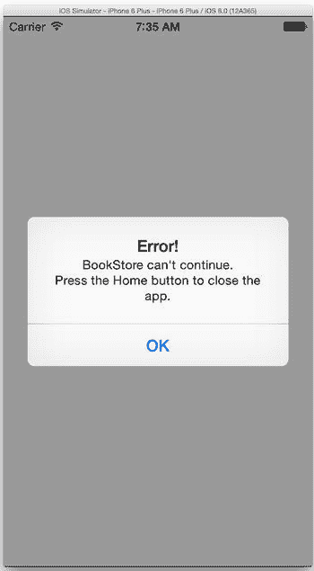

# 第 4 章：关注数据质量

如果你一直认真跟随前几章的示例，应该已经对 Core Data 的基础用法相当熟悉。处理错误（无论是系统错误还是用户错误）以及数据填充，是编写高质量应用时必须面对的问题。本章旨在帮助你应对将理论应用于实际应用开发时所遇到的各种现实问题。我们将继续使用第 2 章中的 BookStore 应用程序进行探讨。

## 数据填充

我们经常收到的一个问题是如何分发已包含部分数据的持久化存储。例如，许多应用会提供供用户选择的分类值列表，开发者需要将这些值预填入数据存储。解决此问题的方法有多种，包括自行创建 SQLite 数据库并随应用分发，而非让 Core Data 自行创建数据库。但这种方法存在缺陷，尤其是当应用的未来版本需要扩充此值列表时——你绝不能用一个新的、仅包含更多值的空白数据库文件直接覆盖用户的数据库。

另一种常见方案是使用多个持久化存储：一个用于存放用户数据，另一个则作为仅包含种子数据的静态存储。这种方案可行，但前提是应用不允许用户扩充种子列表。例如，若我们在单独的存储中以静态列表形式为 BookStore 应用填充分类数据，则无法允许用户添加自己的分类，这会造成极大局限。

如果你一直跟随本书示例操作，其实已经多次预加载过数据存储。回想一下本书中那些没有编辑界面的应用，你是如何向其中输入数据的？没错：通过代码创建托管对象，然后保存托管对象上下文。然而，这种方法本身也存在问题。例如，如果种子数据集非常庞大，应用逐一插入所有记录将耗费大量时间，严重影响用户体验。如果你试用过第 3 章中的 WordList 应用，可能会注意到：从列表下载完成到完全插入存储，插入近 17 万个单词就需要数秒时间。

根据经验，我们发现最佳的数据填充方案介于直接使用预填充的后端存储与手动逐行插入之间。本节的剩余部分将围绕这一思路展开：首次运行应用时使用初始种子数据；当应用更新时，由于大部分数据已经存在，可以通过手动方式增量修改该列表。

在第 2 章的 BookStore 应用中，我们通过硬编码分类和书籍列表来填充数据存储。现在我们将使用这个已填充的存储作为静态种子。请回到第 2 章（或下载源代码——你可以在 Apress 网站[`www.apress.com`]的“源代码/下载”区域找到本章的代码示例），最后一次运行该应用，确保已创建好已填充的存储。

在你的 Mac 上打开“终端”应用，找到`BookStore.sqlite`文件（在至少运行过一次第 2 章中的应用后）。找到后，将该文件复制到桌面，并重命名为`seed.sqlite`。

如果你希望使用快速方法，通常可以在终端提示符下使用以下命令（全部写在一行内）：

```
find ~ -name BookStore.sqlite -exec cp {} ~/Desktop/seed.sqlite \;
```

你的桌面上现在应该有一个名为`seed.sqlite`的文件，其中包含所有种子数据。软件开发的基本原则之一是“相信你做的一切都是正确的，但仍需验证”。在终端中运行`sqlite3 ~/Desktop/seed.sqlite`。

在 SQLite 提示符下，运行：

```
sqlite> select * from ZBOOKCATEGORY;
```

你应该能看到如下数据：

```
Z_PK        Z_ENT       Z_OPT       ZNAME
----------  ----------  ----------  ----------
3           2           1           Fiction
4           2           1           Biography
```

同样，如果你运行：

```
sqlite> select * from ZBOOK;
```

书籍数据也应存在。

```
Z_PK    Z_ENT   Z_OPT   ZCATEGORY   ZPRICE     ZTITLE
------  ------  ------  ----------  ----------  ----------
4       1       1       4           10.0       The third book
5       1       1       3           15.0       The second boo
6       1       1       3           10.0       The first book
```

使用`.quit`命令退出 SQLite 提示符。

至此，我们已经拥有了原始的种子数据。复制一份第 2 章中的 BookStore Xcode 项目。从现在开始，我们将在这个副本上工作。

**注**：务必制作副本，这样当我们启动应用时，它将是首次启动，因此会执行填充流程。为保险起见，请前往 iOS 模拟器，从模拟设备中删除 BookStore 应用（如同在真实设备上按住图标一样）。

在 Xcode 中打开新的 BookStore 项目。

**重要提示**：在准备好之前不要运行新应用，否则在实现填充流程之前，它会自动创建一个数据存储。

首先，取消我们在第 2 章中创建的手动填充代码。打开`AppDelegate.m`或`AppDelegate.swift`，找到`persistentStoreCoordinator`方法。对于 Objective-C，将以下行：

```
NSURL *storeURL = [[self applicationDocumentsDirectory] URLByAppendingPathComponent:@"BookStore.sqlite"];
```

修改为：

```
NSURL *storeURL = [[self applicationDocumentsDirectory] URLByAppendingPathComponent:@"BookStoreEnhanced.sqlite"];
```

对于 Swift，将以下行：

```
let storeURL = AppDelegate.applicationDocumentsDirectory.URLByAppendingPathComponent("BookStoreSwift.sqlite")
```

修改为：

```
let storeURL = AppDelegate.applicationDocumentsDirectory.URLByAppendingPathComponent("BookStoreEnhancedSwift.sqlite")
```

这将更改 Core Data 使用的 SQLite 文件名，以便于我们在本章后续内容中进行识别。


  
接下来，还是在 `AppDelegate.m` 或 `AppDelegate.swift` 中，需要清空 `initStore` 方法，但保留该方法。稍后我们会在其中放入新代码。

同理，删除 `deleteAllObjects` 方法。

最后，更新 `showExampleData` 方法，使其仅列出存储中的所有书籍，如代码清单 4-1（Objective-C）和代码清单 4-2（Swift）所示。

***代码清单 4-1***. 显示存储中的书籍（Objective-C）

```
- (void)showExampleData {
  NSFetchRequest *fetchRequest = [NSFetchRequest fetchRequestWithEntityName:@"Book"];
  NSArray *books = [self.managedObjectContext executeFetchRequest:fetchRequest error:nil];
  for (Book *book in books) {
    NSLog(@"Title: %@, price: %.2f", book.title, book.price);
  }
}
```

***代码清单 4-2***. 显示存储中的书籍（Swift）

```
func showExampleData() {
  let fetchRequest = NSFetchRequest(entityName: "Book")
  let books = self.managedObjectContext?.executeFetchRequest(fetchRequest, error: nil)
  for book in books as [Book] {
    println(String(format: "Title: \(book.title), price: %.2f", book.price))
  }
}
```

## 使用种子存储

应用启动时，在执行任何 Core Data 操作之前，首先会调用 `initStore` 方法。这正是我们想要的，因为它允许我们在 Core Data 初始化之前放置种子数据。

现在将 `seed.sqlite` 文件添加到项目中。从你的`桌面`文件夹将 `seed.sqlite` 文件拖拽到 Xcode 项目导航器中。通常，你需要将文件添加到`Supporting Files`组中，以保持项目结构清晰。

将文件拖入`Supporting Files`组时，Xcode 会提供一些选项。确保选中了`将项目复制到目标组文件夹中`。在`添加到目标`部分，同样确保`BookStore`已被选中。

此时你的文件夹应类似于图 4-1（Objective-C）或图 4-2（Swift）。



图 4-1. 将 `seed.sqlite` 文件添加到 BookStore（Objective-C）



图 4-2. 将 `seed.sqlite` 文件添加到 BookStore（Swift）

现在，我们已经准备好创建初始种子数据。修改 `initStore` 方法的实现，如代码清单 4-3（Objective-C）或代码清单 4-4（Swift）所示。

***代码清单 4-3***. Objective-C 中的初始种子植入

```
- (void)initStore {
  NSFileManager *fm = [NSFileManager defaultManager];

NSString *seed = [[NSBundle mainBundle] pathForResource: @"seed" ofType: @"sqlite"];
  NSURL *storeURL = [[self applicationDocumentsDirectory] URLByAppendingPathComponent:@"BookStoreEnhanced.sqlite"];
  if (![fm fileExistsAtPath:[storeURL path]]) {
    NSLog(@"正在使用初始种子文件");
    NSError *error = nil;
    if (![fm copyItemAtPath:seed toPath:[storeURL path] error:&error]) {
      NSLog(@"播种时出错: %@", error);
      return;
    }

NSLog(@"使用初始种子文件成功初始化存储");
  }
  else {
    NSLog(@"无需使用初始种子文件。已有后备存储。");
  }
}
```

***代码清单 4-4***. Swift 中的初始种子植入

```
func initStore() {
  let fm = NSFileManager.defaultManager()

let seed = NSBundle.mainBundle().pathForResource("seed", ofType: "sqlite")
  if let seed = seed {
      let storeURL = AppDelegate.applicationDocumentsDirectory.URLByAppendingPathComponent("BookStoreEnhancedSwift.sqlite")

if !fm.fileExistsAtPath(storeURL.path!) {
          println("正在使用初始种子文件")
          var error: NSError? = nil
          if !fm.copyItemAtPath(seed, toPath: storeURL.path!, error: &error) {
              println("播种时出错: \(error?.localizedDescription)")
              return
          }
          println("使用初始种子文件成功初始化存储。")
      }
      else {
          println("无需使用种子文件。已有后备存储。")
      }
  }
  else {
      println("未找到种子文件。")
  }
}
```

现在可以启动应用了。你会注意到，尽管我们移除了所有硬编码的初始化代码，应用仍然会从种子文件中获取数据。

输出应类似于以下内容：

```
正在使用初始种子文件
使用初始种子文件成功初始化存储
已获取书籍: 第二本书
标题: 第二本书, 价格: 15.00
已获取书籍: 第三本书
标题: 第三本书, 价格: 10.00
已获取书籍: 第一本书
标题: 第一本书, 价格: 10.00
```

如果退出并再次启动，你应该会看到以下内容：

```
无需使用初始种子文件。已有后备存储。
已获取书籍: 第二本书
标题: 第二本书, 价格: 15.00
已获取书籍: 第三本书
标题: 第三本书, 价格: 10.00
已获取书籍: 第一本书
标题: 第一本书, 价格: 10.00
```

现在，我们已能够为应用创建初始种子文件，并且种子数据可以瞬间植入，即便有数十万行数据也是如此，因为这一过程是通过一次性复制整个文件完成的，无需逐行手动插入。

如果种子数据不再变化，你的工作就完成了！但如果你想在将来更新种子数据，请继续阅读。

## 在后续版本中更新种子数据

假设我们想要用第四本书更新种子数据。无论是已经使用应用一段时间的用户，还是初次接触最新版本的用户，都需要能够获取到那本第四本书。

要让所有内容保持正常运作，需要完成两部分工作。首先，需要更新 `seed.sqlite` 文件，使其包含所有种子数据。其次，需要确保现有用户能够获取新增的数据。

### 更新种子数据存储

先从更新种子文件开始。这部分很简单。要实现这一点，我们只需通过代码将新书添加到当前的数据存储中，然后用这个更新后的存储作为新的种子文件。

打开 `AppDelegate.m` 或 `AppDelegate.swift`，在 `initStore` 方法的末尾，所有播种工作完成之后，添加代码清单 4-5（Objective-C）或代码清单 4-6（Swift）中的代码，将第四本书添加到其中一个分类中。

***代码清单 4-5***. 向种子文件中添加第四本书（Objective-C）

```
- (void)initStore {
  ...

NSFetchRequest *fetchRequest = [NSFetchRequest fetchRequestWithEntityName:@"BookCategory"];
  NSArray *categories = [self.managedObjectContext executeFetchRequest:fetchRequest error:nil];
  Category *category = [categories lastObject];
  Book *book4 = [NSEntityDescription insertNewObjectForEntityForName:@"Book" inManagedObjectContext:self.managedObjectContext];
  book4.title = @"第四本书";
  book4.price = 12;

[category addBooks:[NSSet setWithObjects:book4, nil]];

[self saveContext];
}
```

***代码清单 4-6***. 向种子文件中添加第四本书（Swift）

```
func initStore() {
  ...

let fetchRequest = NSFetchRequest(entityName: "BookCategory")
  let categories = self.managedObjectContext?.executeFetchRequest(fetchRequest, error: nil)

let category = categories?.last as BookCategory
  var book4 = NSEntityDescription.insertNewObjectForEntityForName("Book", inManagedObjectContext: self.managedObjectContext!) as Book
  book4.title = "第四本书"
  book4.price = 12
```


`var booksRelation = category.valueForKeyPath("books") as NSMutableSet`
`booksRelation.addObject(book4)`
`saveContext()`

启动应用（仅一次，否则会重复添加），输出应显示第四本书已添加。

```
The original seed isn't needed. There is already a backing store.
New book created
Book fetched: The second book
Title: The second book, price: 15.00
Book fetched: The third book
Title: The third book, price: 10.00
Book fetched: The first book
Title: The first book, price: 10.00
Title: The fourth book, price: 12.00
```

此时，我们需要收集数据存储并将其作为种子。首先，在终端提示符下运行以下命令，将其放在桌面上：

```
find ~ -name BookStoreEnhanced.sqlite -exec cp {} ~/Desktop/seed.sqlite \;
```

通过从终端提示符运行以下命令，检查种子是否正确：

```
sqlite3 ~/Desktop/seed.sqlite "select ZTITLE from ZBOOK";
```

你应该能在其中看到新书。

```
ZTITLE

The second book
The third book
The first book
The fourth book
```

好的，既然我们已经创建了一个新种子，现在回到我们的`BookStore`应用进行清理。首先移除你刚刚添加到`initStore`中的代码，这样就不再添加第四本书。`initStore`方法应恢复到代码清单 4-3 或代码清单 4-4 中所示的状态。

由于我们不想作弊，需要重置应用，使其忘记第四本书，并从旧种子重新播种。在 iOS 模拟器中，按住`BookStore`图标并删除该应用。然后再次启动它。它应该使用旧种子重新播种，并仅显示三本书。

```
Using the original seed
Store successfully initialized using the original seed
Book fetched: The second book
Title: The second book, price: 15.00
Book fetched: The third book
Title: The third book, price: 10.00
Book fetched: The first book
Title: The first book, price: 10.00
```

现在，让我们放置新种子。在 Xcode 中，右键点击`seed.sqlite`文件并选择“在 Finder 中显示”。在 Finder 中，只需将我们在桌面文件夹中创建的新种子拖放到旧种子之上。Finder 会询问你如何处理文件冲突。选择“替换”即可：这样新种子就就位了。

此时，首次下载你应用的用户将获得第四本书。而那些通过更新获取的用户则不会看到新书，因为种子不会被使用。我们需要处理这些用户。

## 更新现有用户

有几种方法可以从种子更新数据。你应该选择哪种方法主要取决于应用的需求。例如，有时可以简单地转储数据存储并替换为种子。如果用户在该存储中没有存储任何内容，则属于这种情况。

如果你必须在保留用户数据的同时更新存储，则应考虑手动更新，以便增量应用更新。

让我们再次编辑`initStore`方法来支持增量更新。我们要获取想要添加的新记录（在此示例中只有一个——第四本书），如果它们尚不存在，则应用同时发布的所有更新。然后为你创建的每个新版本的应用重复该代码块。代码清单 4-7（Objective-C）和代码清单 4-8（Swift）展示了管理增量更新的`initStore`方法。

***代码清单 4-7***. 初始播种与增量更新（Objective-C）

```
- (void)initStore {
  NSFileManager *fm = [NSFileManager defaultManager];

  NSString *seed = [[NSBundle mainBundle] pathForResource: @"seed" ofType: @"sqlite"];
  NSURL *storeURL = [[self applicationDocumentsDirectory] URLByAppendingPathComponent:@"BookStoreEnhanced.sqlite"];
  if(![fm fileExistsAtPath:[storeURL path]]) {
    NSLog(@"Using the original seed");
    NSError * error = nil;
    if (![fm copyItemAtPath:seed toPath:[storeURL path] error:&error]) {
      NSLog(@"Error seeding: %@",error);
      return;
    }

    NSLog(@"Store successfully initialized using the original seed");
  }
  else {
    NSLog(@"The original seed isn't needed. There is already a backing store.");

    // 更新 1
    {
      NSFetchRequest *request = [NSFetchRequest fetchRequestWithEntityName:@"Book"];
      request.predicate = [NSPredicate predicateWithFormat:@"title=%@", @"The fourth book"];
      NSUInteger count = [self.managedObjectContext countForFetchRequest:request error:nil];
      if(count == 0) {
        NSLog(@"Applying batch update 1");

        NSFetchRequest *fetchRequest = [NSFetchRequest fetchRequestWithEntityName:@"BookCategory"];
        NSArray *categories = [self.managedObjectContext executeFetchRequest:fetchRequest error:nil];

        BookCategory *category = [categories lastObject];
        Book *book4 = [NSEntityDescription insertNewObjectForEntityForName:@"Book" inManagedObjectContext:self.managedObjectContext];
        book4.title = @"The fourth book";
        book4.price = 12;

        [category addBooks:[NSSet setWithObjects:book4, nil]];

        [self.managedObjectContext save:nil];

        NSLog(@"Update 1 successfully applied");
      }
    }
  }
}
```

***代码清单 4-8***. 初始播种与增量更新（Swift）

```
func initStore() {
    let fm = NSFileManager.defaultManager()

    let seed = NSBundle.mainBundle().pathForResource("seed", ofType: "sqlite")
    if let seed = seed {
        let storeURL = AppDelegate.applicationDocumentsDirectory.URLByAppendingPathComponent("BookStoreEnhancedSwift.sqlite")

        if !fm.fileExistsAtPath(storeURL.path!) {
            println("Using the original seed")
            var error: NSError? = nil
            if !fm.copyItemAtPath(seed, toPath: storeURL.path!, error: &error) {
                println("Seeding error: \(error?.localizedDescription)")
                return
            }
            println("Store successfully initialized using the original seed.")
        }
        else {
            println("The seed isn't needed. There is already a backing store.")

            // 更新 1
            if let managedObjectContext = self.managedObjectContext {
                let fetchRequest1 = NSFetchRequest(entityName: "Book")
                fetchRequest1.predicate = NSPredicate(format: "title=%@", argumentArray: ["The fourth book"])
                if managedObjectContext.countForFetchRequest(fetchRequest1, error: nil) == 0 {
                    println("Applying batch update 1")
                    let fetchRequest = NSFetchRequest(entityName: "BookCategory")
                    let categories = managedObjectContext.executeFetchRequest(fetchRequest, error: nil)

                    let category = categories?.last as BookCategory
                    var book4 = NSEntityDescription.insertNewObjectForEntityForName("Book", inManagedObjectContext: managedObjectContext) as Book
                    book4.title = "The fourth book"
                    book4.price = 12

                    var booksRelation = category.valueForKeyPath("books") as NSMutableSet
                    booksRelation.addObject(book4)

                    saveContext()
                    println("Update 1 successfully applied")
                }
            }
        }
    }
    else {
        println("Could not find the seed.")
    }
}
```

你终于可以运行应用了。由于你已经运行过第一个版本，应用将不会重新播种，而是增量更新。


```text
原始种子不需要。已有备份存储。
应用批量更新 1
已创建新书籍
更新 1 已成功应用
已获取书籍：第二本书
标题：第二本书，价格：15.00
已获取书籍：第三本书
标题：第三本书，价格：10.00
已获取书籍：第一本书
标题：第一本书，价格：10.00
标题：第四本书，价格：12.00
```

如果你再次运行，它不会应用任何新的种子或更新。

```
原始种子不需要。已有备份存储。
已获取书籍：第二本书
标题：第二本书，价格：15.00
已获取书籍：第三本书
标题：第三本书，价格：10.00
已获取书籍：第一本书
标题：第一本书，价格：10.00
标题：第四本书，价格：12.00
```

最后一个测试场景是再次从模拟器中删除你的应用并启动它，以模拟新用户会得到什么结果。

```
使用原始种子
已使用原始种子成功初始化存储
已获取书籍：第二本书
标题：第二本书，价格：15.00
已获取书籍：第三本书
标题：第三本书，价格：10.00
已获取书籍：第一本书
标题：第一本书，价格：10.00
标题：第四本书，价格：12.00
```

它简单使用种子，并不会尝试应用任何更新。在所有情况下，完整的种子数据集都是可用的。

## 撤销与重做

高尔夫球手称之为“莫利根”。校园里的孩子们称之为“重来一次”。计算机用户称之为“编辑”和“撤销”。无论你怎么称呼它，当你意识到自己犯了错误并想要撤销上一个操作时，你都需要它。并非所有场景都能给你这个机会，许多心碎的恋人会为此作证，但 Core Data 是宽容的，它允许你使用标准的 Cocoa `NSUndoManager` 机制来撤销你所做的操作。本节将指导你如何使用它来让用户撤销他们对 Core Data 所做的更改。

Core Data 撤销管理器是一个类型为 `NSUndoManager` 的对象，它存在于你的托管对象上下文中，而 `NSManagedObjectContext` 为撤销管理器提供了 getter 和 setter 方法。然而，与 Mac OS X 上的 Core Data 不同，出于性能考虑，iOS 的 Core Data 中的托管对象上下文默认不提供撤销管理器。如果你希望为 Core Data 对象提供撤销功能，必须自己在托管对象上下文中设置撤销管理器。

如果你希望在 iOS 应用中支持撤销操作，通常会在设置托管对象上下文时创建撤销管理器，这通常发生在托管对象上下文的 getter 方法中。例如，BookStore 应用在应用委托中设置托管对象上下文，如代码清单 4-9（Objective-C）或代码清单 4-10（Swift）所示。只需在那里设置撤销管理器即可。

**代码清单 4-9. 设置撤销管理器（Objective-C）**

```
- (NSManagedObjectContext *)managedObjectContext {
  if (_managedObjectContext != nil) {
    return _managedObjectContext;
  }

NSPersistentStoreCoordinator *coordinator = [self persistentStoreCoordinator];
  if (!coordinator) {
    return nil;
  }
  _managedObjectContext = [[NSManagedObjectContext alloc] init];
 [_managedObjectContext setPersistentStoreCoordinator:coordinator];

// 添加撤销管理器
  [_managedObjectContext setUndoManager:[[NSUndoManager alloc] init]];

return _managedObjectContext;
}
```

**代码清单 4-10. 设置撤销管理器（Swift）**

```
lazy var managedObjectContext: NSManagedObjectContext? = {
    // 初始化托管对象模型
    let modelURL = NSBundle.mainBundle().URLForResource("BookStoreSwift", withExtension: "momd")
    let managedObjectModel = NSManagedObjectModel(contentsOfURL: modelURL!)

// 初始化持久化存储协调器
    let storeURL = AppDelegate.applicationDocumentsDirectory.URLByAppendingPathComponent("BookStoreEnhancedSwift.sqlite")
    var error: NSError? = nil
    let persistentStoreCoordinator = NSPersistentStoreCoordinator(managedObjectModel: managedObjectModel!)

if(persistentStoreCoordinator.addPersistentStoreWithType(NSSQLiteStoreType, configuration: nil, URL: storeURL, options: nil, error: &error) == nil) {
        self.showCoreDataError()
        return nil
    }

var managedObjectContext = NSManagedObjectContext()
    managedObjectContext.persistentStoreCoordinator = persistentStoreCoordinator

    // 添加撤销管理器
    managedObjectContext.undoManager = NSUndoManager()

return managedObjectContext
}()
```

一旦撤销管理器被设置到托管对象上下文中，它就会跟踪托管对象上下文中的任何更改，并将其添加到撤销栈中。你可以通过调用 `NSUndoManager` 的 `undo` 方法来撤销这些更改，并且每个更改（实际上是每个撤销组，如“撤销组”一节所述）都会从托管对象上下文中回滚。你还可以通过调用 `NSUndoManager` 的 `redo` 方法来重放已被撤销的更改。

只有当托管对象上下文有可撤销或可重做的更改时，`undo` 和 `redo` 方法才会执行其魔法；因此，在没有可撤销或可重做的更改时调用它们不会有任何作用。不过，你可以分别通过调用 `canUndo` 和 `canRedo` 方法来检查撤销管理器是否可以撤销或重做任何更改。

## 撤销组

默认情况下，撤销管理器会将应用运行循环单次传递期间发生的所有更改分组为一个单一的更改，该更改可以作为一个整体单元进行撤销或重做。这意味着，例如，在第 3 章的 WordList 应用中，所有单词的创建都属于同一个组，因为它们都是在 for 循环中创建的，并且在完成之前没有释放对线程的控制。

你可以通过完全关闭自动分组并自行管理撤销组来改变这种行为。为此，向 `setGroupsByEvent` 传递 `NO`。然后，你将负责创建所有撤销组，因为撤销管理器不会再为你创建它们。你需要通过调用 `beginUndoGrouping` 开始创建组，并通过调用 `endUndoGrouping` 来完成撤销组的创建。这些调用必须成对出现，否则会引发类型为 `NSInternalInconsistencyException` 的异常。例如，你可以为 WordList 中的每个单词创建创建一个撤销组，这样你就可以一次撤销一个单词的创建。分组策略很大程度上取决于应用的特定需求。

## 限制撤销栈

默认情况下，撤销管理器会跟踪无限数量的更改以供你撤销和重做。这可能会导致内存问题，尤其是在 iOS 设备上。你可以通过调用 `NSUndoManager` 的 `setLevelsOfUndo:` 方法来限制撤销栈的大小，并传入一个无符号整数，该整数表示要在撤销栈上保留的撤销组数量。你可以通过调用 `levelsOfUndo` 来检查当前撤销栈的大小（以撤销组数量衡量），该方法返回一个无符号整数。值为 0 表示没有限制。如果你对撤销栈的大小设置了限制，则最古老的撤销组会从栈中退出，以便为较新的组腾出空间。

## 禁用撤销跟踪

一旦你创建了一个撤销管理器并将其设置到托管对象上下文中，你对托管对象上下文所做的任何更改都会被跟踪并可撤销。但是，你可以通过调用 `NSUndoManager` 的 `disableUndoRegistration` 方法来禁用撤销跟踪。要重新启用撤销跟踪，请调用 `NSUndoManager` 的 `enableUndoRegistration` 方法。禁用和启用撤销跟踪使用引用计数机制，因此在撤销跟踪重新启用之前，多次调用 `disableUndoRegistration` 需要相应数量的 `enableUndoRegistration` 调用。


当撤回追踪已启用时调用 `enableUndoRegistration` 会引发一个类型为 `NSInternalInconsistencyException` 的异常，这很可能导致应用程序崩溃。为避免这种尴尬情况，你可以在调用 `enableUndoRegistration` 之前，先调用 `NSUndoManager` 的 `isUndoRegistrationEnabled` 方法（该方法返回一个 `BOOL` 值）。例如，以下代码在启用撤回追踪前会先检查它是否已启用：

```
if (![undoManager isUndoRegistrationEnabled]) {
    [undoManager enableUndoRegistration];
}
```

然而，`isUndoRegistrationEnabled` 方法在 iOS 8 中已移除，并且在 Swift 中也不存在，因此你需要自行跟踪禁用/启用调用的状态。你可以通过调用 `removeAllActions` 方法完全清空撤回栈。该方法会产生一个副作用，即重新启用撤回追踪。

## 为 BookStore 添加撤回功能

接下来，我们将通过 `BookStore` 应用来实践这些内容。我们在本节开头已经添加了撤回管理器。现在，让我们编写一些代码来添加几本书，并在最后执行撤回操作，以演示其工作原理。

在开始之前，由于我们要操作数据插入，先让应用在每次启动时强制使用原始种子数据。当然，这会导致每次启动时应用都被重置，因此不适合大多数生产环境。但在我们的实验场景中，这样做非常理想，因为无论我们进行多少次实验性修改，应用启动时都会使用已知的数据集。

更新 `initStore` 方法以强制使用种子数据，如代码清单 4-11（Objective-C）或代码清单 4-12（Swift）所示。

**代码清单 4-11.** 强制 BookStore 始终使用种子数据（Objective-C）

```
- (void)initStore {
  NSFileManager *fm = [NSFileManager defaultManager];

NSString *seed = [[NSBundle mainBundle] pathForResource: @"seed" ofType: @"sqlite"];
  NSURL *storeURL = [[self applicationDocumentsDirectory] URLByAppendingPathComponent:@"BookStoreEnhanced.sqlite"];

if([fm fileExistsAtPath:[storeURL path]]) {
    [fm removeItemAtPath:[storeURL path] error:nil];
  }

if(![fm fileExistsAtPath:[storeURL path]]) {
    NSLog(@"Using the original seed");
    ...
```

**代码清单 4-12.** 强制 BookStore 始终使用种子数据（Swift）

```
func initStore() {
  let fm = NSFileManager.defaultManager()

let seed = NSBundle.mainBundle().pathForResource("seed", ofType: "sqlite")
  if let seed = seed {
      let storeURL = AppDelegate.applicationDocumentsDirectory.URLByAppendingPathComponent("BookStoreEnhancedSwift.sqlite")

if fm.fileExistsAtPath(storeURL.path!) {
          fm.removeItemAtPath(storeURL.path!, error: nil)
      }

if !fm.fileExistsAtPath(storeURL.path!) {
          println("Using the original seed")
          ...
```

这样就完成了——如果存在现有的数据存储，它始终会将其删除。

在 `AppDelegate.m` 或 `AppDelegate.swift` 中，创建一个名为 `insertSomeData` 的新方法，并添加如代码清单 4-13（Objective-C）或代码清单 4-14（Swift）所示的代码。

**代码清单 4-13.** 设置待撤回的数据（Objective-C）

```
- (void)insertSomeData {
  NSFetchRequest *fetchRequest = [NSFetchRequest fetchRequestWithEntityName:@"BookCategory"];
  NSArray *categories = [self.managedObjectContext executeFetchRequest:fetchRequest error:nil];

BookCategory *category = [categories lastObject];

for(int i=5; i<10; i++) {
    Book *book = [NSEntityDescription insertNewObjectForEntityForName:@"Book" inManagedObjectContext:self.managedObjectContext];
    book.title = [NSString stringWithFormat:@"The %dth book", i];
    book.price = i;
    [category addBooksObject:book];
  }

[self saveContext];
}
```

**代码清单 4-14.** 设置待撤回的数据（Swift）

```
func insertSomeData() {
    let category = self.managedObjectContext?.executeFetchRequest(NSFetchRequest(entityName: "BookCategory"), error: nil)?.last as BookCategory?

if let managedObjectContext = self.managedObjectContext {
        managedObjectContext.undoManager?.groupsByEvent = false

if let category = category {
            for i in 5..<10 {
                var book = NSEntityDescription.insertNewObjectForEntityForName("Book", inManagedObjectContext: managedObjectContext) as Book
                book.title = "The \(i)th book"
                book.price = Float(i)

var booksRelation = category.valueForKeyPath("books") as NSMutableSet
                booksRelation.addObject(book)
            }
            saveContext()
        }
    }
}
```

使用新方法时，前往 `application:didFinishLaunchingWithOptions:` 方法，在 `initStore` 之后、`showExampleData` 之前调用它，如代码清单 4-15（Objective-C）或代码清单 4-16（Swift）所示。

**代码清单 4-15.** 在 Objective-C 中调用 `insertSomeData`

```
- (BOOL)application:(UIApplication *)application didFinishLaunchingWithOptions:(NSDictionary *)launchOptions {
  [self initStore];
  [self insertSomeData];
  [self showExampleData];
  return YES;
}
```

**代码清单 4-16.** 在 Swift 中调用 `insertSomeData`

```
func application(application: UIApplication!, didFinishLaunchingWithOptions launchOptions: NSDictionary!) -> Bool {
    initStore()
    insertSomeData()
    showExampleData()
    return true
}
```

如果运行该应用，你会看到新创建了五本书（加上种子数据中的书）。

```
Using the original seed
Store successfully initialized using the original seed
New book created
New book created
New book created
New book created
New book created
Book fetched: The second book
Title: The second book, price: 15.00
Book fetched: The third book
Title: The third book, price: 10.00
Book fetched: The first book
Title: The first book, price: 10.00
Book fetched: The fourth book
Title: The fourth book, price: 12.00
Title: The 9th book, price: 9.00
Title: The 5th book, price: 5.00
Title: The 6th book, price: 6.00
Title: The 8th book, price: 8.00
Title: The 7th book, price: 7.00
```

现在，让我们通过调用 `undo` 方法来使用撤回管理器，将其放在 `insertSomeData` 方法的末尾，如代码清单 4-17（Objective-C）或代码清单 4-18（Swift）所示。由于所有插入操作都是在运行循环的同一轮迭代中完成的，因此一次 `undo` 调用应该能撤回全部五本书。

**代码清单 4-17.** 测试撤回管理器（Objective-C）

```
- (void)insertSomeData {
  NSFetchRequest *fetchRequest = [NSFetchRequest fetchRequestWithEntityName:@"BookCategory"];
  NSArray *categories = [self.managedObjectContext executeFetchRequest:fetchRequest error:nil];

BookCategory *category = [categories lastObject];

for(int i=5; i<10; i++) {
    Book *book = [NSEntityDescription insertNewObjectForEntityForName:@"Book" inManagedObjectContext:self.managedObjectContext];
    book.title = [NSString stringWithFormat:@"The %dth book", i];
    book.price = i;
    [category addBooksObject:book];
  }

[self.managedObjectContext.undoManager undo];
  [self saveContext];
}
```

**代码清单 4-18.** 测试撤回管理器（Swift）

```
func insertSomeData() {
    let category = self.managedObjectContext?.executeFetchRequest(NSFetchRequest(entityName: "BookCategory"), error: nil)?.last as BookCategory?
```


```swift
if let managedObjectContext = self.managedObjectContext {
    if let category = category {
        for i in 5..<10 {
            var book = NSEntityDescription.insertNewObjectForEntityForName("Book", inManagedObjectContext: managedObjectContext) as Book
            book.title = "The \(i)th book"
            book.price = Float(i)

            var booksRelation = category.valueForKeyPath("books") as NSMutableSet
            booksRelation.addObject(book)
        }

        managedObjectContext.undoManager?.undo()
        saveContext()
    }
}
```

再次运行该方法，并注意：尽管所有书籍都已创建，但显示数据时它们并不在存储中，因为更改已被撤销。

```
Using the original seed
Store successfully initialized using the original seed
New book created
New book created
New book created
New book created
New book created
Book fetched: The second book
Title: The second book, price: 15.00
Book fetched: The third book
Title: The third book, price: 10.00
Book fetched: The first book
Title: The first book, price: 10.00
Book fetched: The fourth book
Title: The fourth book, price: 12.00
```

如果你在 `undo` 调用之后立即添加对 `redo` 的调用，如下所示，那么被撤销的操作将被重做，并且显示数据时新书籍将出现在存储中。

```
[self.managedObjectContext.undoManager redo]; // Objective-C
managedObjectContext.undoManager?.redo()      // Swift
```

## 实验：撤销分组

在本节中，我们修改数据插入方法，将每本新书籍放入自己的撤销分组中。这样做的影响当然是：每当调用 `undo` 方法时，每次调用仅会撤销一次插入操作。清单 4-19（Objective-C）和清单 4-20（Swift）展示了更新后的代码。

***清单 4-19***. 管理我们自己的撤销分组（Objective-C）

```
- (void)insertSomeData {
  NSFetchRequest *fetchRequest = [NSFetchRequest fetchRequestWithEntityName:@"BookCategory"];
  NSArray *categories = [self.managedObjectContext executeFetchRequest:fetchRequest error:nil];

  BookCategory *category = [categories lastObject];

  // Tell the undo manager that from now on, we manage grouping
  [self.managedObjectContext.undoManager setGroupsByEvent:NO];

  for(int i=5; i<10; i++) {
    // Start a new group
    [self.managedObjectContext.undoManager beginUndoGrouping];

    Book *book = [NSEntityDescription insertNewObjectForEntityForName:@"Book" inManagedObjectContext:self.managedObjectContext];
    book.title = [NSString stringWithFormat:@"The %dth book", i];
    book.price = i;
    [category addBooksObject:book];

    // End the current group
    [self.managedObjectContext.undoManager endUndoGrouping];
  }

  [self.managedObjectContext.undoManager undo];
  [self saveContext];
}
```

***清单 4-20***. 管理我们自己的撤销分组（Swift）

```
func insertSomeData() {
    let category = self.managedObjectContext?.executeFetchRequest(NSFetchRequest(entityName: "BookCategory"), error: nil)?.last as BookCategory?

    if let managedObjectContext = self.managedObjectContext {
        // Tell the undo manager that from now on, we manage grouping
        managedObjectContext.undoManager?.groupsByEvent = false

        if let category = category {
            for i in 5..<10 {
                // Start a new group
                managedObjectContext.undoManager?.beginUndoGrouping()

                var book = NSEntityDescription.insertNewObjectForEntityForName("Book", inManagedObjectContext: managedObjectContext) as Book
                book.title = "The \(i)th book"
                book.price = Float(i)

                var booksRelation = category.valueForKeyPath("books") as NSMutableSet
                booksRelation.addObject(book)

                // End the current group
                managedObjectContext.undoManager?.endUndoGrouping()
            }

            managedObjectContext.undoManager?.undo()
            saveContext()
        }
    }
}
```

启动应用，由于调用了 `undo`，第九本书会缺失。在该方法中添加第二次 `undo` 调用，并注意第八本和第九本书都会缺失。

## 处理错误

当你要求 Xcode 为你生成一个 Core Data 应用时，它会为与 Core Data 持久化存储进行交互的每个关键方面创建样板代码。这段代码足以满足设置持久化存储协调器、托管对象上下文和托管对象模型的需求。实际上，如果你回到一个非 Core Data 项目并添加 Core Data 支持，最好直接使用与 Xcode 生成代码相同的代码来管理 Core Data 交互。这段代码已经达到生产环境的标准。

也就是说，它仅在以下一个方面存在不足：错误处理。

Xcode 生成的代码通过一条注释提醒你这一缺点，注释内容如下：

```
// Replace this implementation with code to handle the error appropriately.
// abort() causes the application to generate a crash log and terminate. You should not use this function in a shipping application, although it may be useful during development.
```

Xcode 生成的实现会记录错误并中止应用，这显然是一种不友好的处理方式。当这种情况发生时，用户只会看到应用突然消失，而完全不知道原因。如果这种情况出现在上线的应用中，你将获得差评和低销量。

不过，幸运的是，你不必掉入这种记录日志并崩溃的陷阱。在本节中，我们将探讨在 Core Data 中处理错误的策略。没有任何一种策略是绝对最好的，但本节内容应能为你的特定应用和用户群体带来启发，并帮助你设计出合理的错误处理策略。

Core Data 中的错误可分为两大类。

* 正常 Core Data 操作中的错误
* 验证错误

接下来的章节将讨论处理这两类错误的策略。

### 处理 Core Data 操作错误

本书中的所有示例都使用默认的 Xcode 生成错误处理代码来响应 Core Data 错误，即尽职尽责地将错误信息输出到 Xcode 的控制台并中止应用。这种方法有两个优点。

* 有助于在开发和调试过程中诊断问题。
* 易于实现。

然而，这些优势仅对开发者本人有帮助，对应用的用户没有任何好处。在公开发布使用 Core Data 的应用之前，你应该设计并实现一个更好的错误响应策略。好消息是，该策略不必规模庞大或难以实现，因为你的响应方案有限。尽管应用各不相同，但在大多数情况下，你无法从 Core Data 错误中恢复，因此应显示一个提醒，并指示用户关闭应用。这样做可以向用户解释发生了什么，并让他们控制何时终止应用。虽然这不是很大的控制权，但嘿——总比让应用直接消失要好。

几乎所有 Core Data 操作错误都应在开发过程中被捕获，因此对应用进行仔细测试应能防止这些情况发生。

目前，BookStore 应用具有用户界面，尽管是空白的。我们当前在应用启动时（用户界面显示之前）加载 Core Data 栈。然而，如果我们在初始化 Core Data 之前等待用户界面加载完毕，那么显示错误消息将会更容易。让我们修改应用以实现这一点。

如果你使用 Objective-C 编程，请打开 `ViewController.m` 并添加清单 4-21 中所示的导入和方法。如果你使用 Swift 编程，请打开 `ViewController.swift` 并添加清单 4-22 中所示的函数。


***清单 4-21***. 更新 `ViewController.m`

```
#import "AppDelegate.h"
#import "BookCategory.h"
#import "Book.h"
#import "Page.h"

- (NSURL *)applicationDocumentsDirectory {
  return [[[NSFileManager defaultManager] URLsForDirectory:NSDocumentDirectory inDomains:NSUserDomainMask] lastObject];
}

- (NSManagedObjectContext*)managedObjectContext {
  AppDelegate *ad = [UIApplication sharedApplication].delegate;
  return ad.managedObjectContext;
}

- (void)saveContext {
  NSManagedObjectContext *managedObjectContext = self.managedObjectContext;
  if (managedObjectContext != nil) {
    NSError *error = nil;
    if ([managedObjectContext hasChanges] && ![managedObjectContext save:&error]) {
      // Replace this implementation with code to handle the error appropriately.
      // abort() causes the application to generate a crash log and terminate. You should not use this function in a shipping application, although it may be useful during development.
      NSLog(@"Unresolved error %@, %@", error, [error userInfo]);
      abort();
    }
  }
}
```

***清单 4-22***. 更新 `ViewController.swift`

```
lazy var managedObjectContext: NSManagedObjectContext? = {
    let appDelegate = UIApplication.sharedApplication().delegate as AppDelegate
    return appDelegate.managedObjectContext
}()

func saveContext() {
    var error: NSError? = nil
    if let managedObjectContext = self.managedObjectContext {
        if managedObjectContext.hasChanges && !managedObjectContext.save(&error) {
            let message = validationErrorText(error!)
            println("Error: \(message)")
        }
    }
}
```

接下来，将 `initStore`、`showExampleData` 和 `insertSomeData` 方法从 `AppDelegate.m` 移至 `ViewController.m`，或从 `AppDelegate.swift` 移至 `ViewController.swift`。

我们将让控制器在显示其视图后调用这些方法。将清单 4-23 所示的方法添加到 `ViewController.m`，或将清单 4-24 所示的函数添加到 `ViewController.swift`。

***清单 4-23***. 重写 `viewDidAppear:` 方法

```
-(void)viewDidAppear:(BOOL)animated {
  [super viewDidAppear:animated];
  [self initStore];
  [self showExampleData];
}
```

***清单 4-24***. 重写 `viewDidAppear` 函数

```
override func viewDidAppear(animated: Bool) {
    super.viewDidAppear(animated)
    if let managedObjectContext = self.managedObjectContext {
        self.initStore()
        self.showExampleData()
    }
}
```

从 `AppDelegate.m` 或 `AppDelegate.swift` 的 `application:didFinishLaunchingWithOptions:` 中移除对 `initStore`、`insertSomeData` 和 `showExample` 数据的调用。

运行应用程序，一切应与之前完全一致，唯一的区别是这次我们在开始与 Core Data 交互时跳出了启动序列。

为了向 BookStore 应用程序添加错误处理代码，在 `AppDelegate.m` 或 `AppDelegate.swift` 中添加一个方法来显示错误。你可以对措辞提出异议，但请记住，错误信息并非对缪斯女神的赞歌，信息越长，被阅读的可能性就越低。清单 4-25（Objective-C）和清单 4-26（Swift）包含了简短明了的信息实现——仅用一个多余的感叹号恳请用户阅读。

***清单 4-25***. 显示 Core Data 错误的方法 (Objective-C)

```
- (void)showCoreDataError {
  UIAlertView *alert = [[UIAlertView alloc] initWithTitle:@"Error!" message:@"BookStore can't continue.\nPress the Home button to close the app." delegate:nil cancelButtonTitle:@"OK" otherButtonTitles: nil];
  [alert show];
}
```

***清单 4-26***. 显示 Core Data 错误的方法 (Swift)

```
func showCoreDataError() {
    var alert = UIAlertController(title: "Error!", message: "BookStore can't continue.\nPress the Home button to close the app.", preferredStyle: UIAlertControllerStyle.Alert)
    alert.addAction(UIAlertAction(title: "OK", style: UIAlertActionStyle.Default, handler: nil))
    self.window?.rootViewController?.presentViewController(alert, animated: true, completion: nil)
}
```

现在，修改 `persistentStoreCoordinator` 的访问器方法，改用这个新方法，而非日志记录和终止程序。清单 4-27（Objective-C）和清单 4-28（Swift）展示了 `persistentStoreCoordinator` 的更新内容。

***清单 4-27***. 更新后的 `persistentStoreCoordinator` 方法 (Objective-C)

```
- (NSPersistentStoreCoordinator *)persistentStoreCoordinator {
    if (_persistentStoreCoordinator != nil) {
        return _persistentStoreCoordinator;
    }

_persistentStoreCoordinator = [[NSPersistentStoreCoordinator alloc] initWithManagedObjectModel:[self managedObjectModel]];
    NSURL *storeURL = [[self applicationDocumentsDirectory] URLByAppendingPathComponent:@"BookStoreEnhanced.sqlite"];
    NSError *error = nil;
    if (![_persistentStoreCoordinator addPersistentStoreWithType:NSSQLiteStoreType configuration:nil URL:storeURL options:nil error:&error]) {
      [self showCoreDataError];
    }

return _persistentStoreCoordinator;
}
```

***清单 4-28***. 在 `managedObjectContext` 函数中更新后的 `persistentStoreCoordinator` 创建 (Swift)

```
if(persistentStoreCoordinator.addPersistentStoreWithType(NSSQLiteStoreType, configuration: nil, URL: storeURL, options: nil, error: &error) == nil) {
    self.showCoreDataError()
    return nil
}
```

为了强制显示此错误，先运行 BookStore 应用程序，然后将其关闭。进入数据模型，向 `Book` 实体添加一个名为 `foo`、类型为`String` 的属性，然后再次运行应用程序。由于模型不再匹配，持久化存储协调器将无法打开数据存储，新的错误信息将如图 4-3 所示显示。



图 4-3. 显示 Core Data 错误条件

当然，此时你的应用程序应将自身标记为“不稳定”，以防止进一步尝试与 Core Data 交互，否则用户将不得不处理一连串需要关闭的警告框。你可能已经注意到，`viewDidAppear:` 方法的实现并未尝试插入任何新数据。如果尝试了，你就需要处理更多来自未初始化持久化存储的异常。这是因为我们从未告知应用程序它处于不稳定状态，因此它持续尝试访问持久化存储。现在来处理这个问题。

在 `AppDelegate.h` 中添加以下属性：

```
@property (nonatomic) BOOL unstable;
```

或者在 `AppDelegate.swift` 中添加：

```
var unstable: Bool?
```

我们将根据需要，在 `showCoreDataError` 中设置此属性，如清单 4-29（Objective-C）或清单 4-30（Swift）所示。

***清单 4-29***. 将应用程序标记为不稳定 (Objective-C)

```
- (void)showCoreDataError {
  self.unstable = YES;

UIAlertView *alert = [[UIAlertView alloc] initWithTitle:@"Error!" message:@"BookStore can't continue.\nPress the Home button to close the app." delegate:nil cancelButtonTitle:@"OK" otherButtonTitles: nil];
  [alert show];
}
```

***清单 4-30***. 将应用程序标记为不稳定 (Swift)

```
func showCoreDataError() {
    self.unstable = true
```


