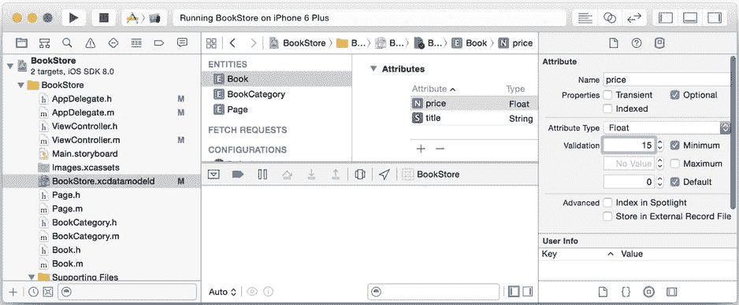

# 处理后的内容

```
var alert = UIAlertController(title: "Error!", message: "BookStore can't continue.\nPress the Home button to close the app.", preferredStyle: UIAlertControllerStyle.Alert)
    alert.addAction(UIAlertAction(title: "OK", style: UIAlertActionStyle.Default, handler: nil))
    self.window?.rootViewController?.presentViewController(alert, animated: true, completion: nil)
}
```

在`ViewController.m`或`ViewController.swift`中，在`viewDidAppear:`内添加对`insertSomeData`的调用。

最后，我们通过编辑`insertSomeData`方法，确保在商店未正确初始化时阻止插入操作，以免造成额外损害，如列表 4-31（Objective-C）或列表 4-32（Swift）所示。

***列表 4-31***. 防止应用不稳定时插入数据（Objective-C）

```
- (void)insertSomeData {
  NSFetchRequest *fetchRequest = [NSFetchRequest fetchRequestWithEntityName:@"BookCategory"];
  NSArray *categories = [self.managedObjectContext executeFetchRequest:fetchRequest error:nil];

AppDelegate *ad = [UIApplication sharedApplication].delegate;
  if(ad.unstable) {
    NSLog(@"The app is unstable. Preventing updates.");
    return;
  }
...
```

***列表 4-32***. 防止应用不稳定时插入数据（Swift）

```
func insertSomeData() {
    let ad = UIApplication.sharedApplication().delegate as? AppDelegate

if let unstable = ad?.unstable {
        if unstable {
            println("The app is unstable. Preventing updates.")
            return
        }
    }
...
```

尝试启动应用。你应该会看到警报以及日志中关于阻止更新的提示。

别忘了撤销对数据模型所做的更改，以便将应用恢复正常工作状态。只需删除`foo`属性，然后启动应用，确保其正常运行。

## 处理验证错误

如果你在 Core Data 模型中为任何属性配置了验证参数，并且允许用户输入未自动满足这些验证参数的值，那么你可能会遇到验证错误。验证操作确保数据的完整性；Core Data 不会将任何你声明为无效的数据存储到持久化存储中。然而，仅仅因为你创建了验证规则，并不意味着用户知道这些规则——或者他们知道自己可能会违反规则。如果你保留 Xcode 生成的错误处理机制，即使用户输入了无效数据，他们也不会意识到自己违反了验证规则。结果只会是应用崩溃，并记录一个用户永远看不到的冗长堆栈跟踪。困惑的用户面对崩溃的应用，却不知道原因或如何防止其再次发生。与其在用户输入无效数据时崩溃，不如提醒用户，并给他们纠正数据的机会。

数据库端的验证可能是一个有争议的话题，而且理由充分。你可以通过将验证规则放入数据模型来保护数据的完整性，但这可能会使你的编码任务更加困难。数据模型中的验证规则是一种概念上听起来不错，但在实践中却不太理想的做法。例如，你能想象使用 Oracle 在 Web 应用中进行字段验证吗？是的，你可以做到，但其他方法可能更简单、更友好且架构更优。在代码中验证用户输入的值，甚至设计防止无效输入的用户界面，都会让你的工作更轻松，也让用户体验更好。

尽管如此，我们仍将继续概述一种处理验证错误的可能策略。不过，别说我们没提醒过你。

## 检测验证错误

检测用户是否输入了无效数据很简单：只需检查传递给托管对象上下文的`save:`方法的`NSError`对象（如果发生错误）。`NSError`对象包含导致`save:`方法失败的错误代码，如果该代码与表 4-1 中显示的 Core Data 验证错误代码之一匹配，你就知道尝试保存的部分数据无效。你可以使用`NSError`的`userInfo`字典来查找关于错误原因的更多信息。注意，如果发生了多个错误，错误代码为`1560`（`NSValidationMultipleErrorsError`），并且`userInfo`字典中在键`NSDetailedErrorsKey`下保存了其余的错误代码。

**表 4-1**. Core Data 验证错误

| 常量 | 代码 | 描述 |
| --- | --- | --- |
| `NSManagedObjectValidationError` | 1550 | 通用验证错误 |
| `NSValidationMultipleErrorsError` | 1560 | 包含多个验证错误的通用消息 |
| `NSValidationMissingMandatoryPropertyError` | 1570 | 非可选属性值为`nil` |
| `NSValidationRelationshipLacksMinimumCountError` | 1580 | 多对多关系中目标对象数量过少 |
| `NSValidationRelationshipExceedsMaximumCountError` | 1590 | 有界多对多关系中目标对象数量过多 |
| `NSValidationRelationshipDeniedDeleteError` | 1600 | 具有`NSDeleteRuleDeny`的关系非空 |
| `NSValidationNumberTooLargeError` | 1610 | 某个数值过大 |
| `NSValidationNumberTooSmallError` | 1620 | 某个数值过小 |
| `NSValidationDateTooLateError` | 1630 | 某个日期值过晚 |
| `NSValidationDateTooSoonError` | 1640 | 某个日期值过早 |
| `NSValidationInvalidDateError` | 1650 | 某个日期值不匹配日期模式 |
| `NSValidationStringTooLongError` | 1660 | 某个字符串值过长 |
| `NSValidationStringTooShortError` | 1670 | 某个字符串值过短 |
| `NSValidationStringPatternMatchingError` | 1680 | 某个字符串值不匹配某个模式 |

你可以选择实现一个熟悉数据模型、只检查特定错误的错误处理例程，或者编写一个能处理所有验证错误的通用错误处理例程。虽然通用例程扩展性更好，并且无论数据模型如何变化都应能继续工作，但更具体的错误处理例程可能让你在消息和响应中对用户更有帮助。没有哪个答案是正确的——如何处理验证错误的选择权在你手中。

要编写一个真正通用的验证错误处理例程需要做大量工作。需要考虑的一点是，`NSError`对象包含关于所发生错误的大量信息，但可能不足以告诉用户验证失败的原因。例如，假设你有一个实体`Foo`，其属性`bar`必须至少包含五个字符。如果用户为`bar`输入了“abc”，你将收到一条`NSError`消息，其中包含错误代码（`1670`）、实体（`Foo`）、属性（`bar`）以及验证失败的值（abc）。`NSError`对象不会告诉你 abc 为何太短——它不包含`bar`至少需要五个字符的信息。要得出这一结论，你必须向`Foo`实体询问`bar`属性的`NSPropertyDescription`，获取该属性描述的验证谓词，并遍历这些谓词以查看`bar`的最小长度。这是一个崇高的目标，但繁琐且通常过于复杂。这是违反“不要重复自己”（DRY）原则、让代码了解一些数据模型信息可能是更好答案的一个例子。


在数据模型中使用验证时，需要考虑的另一个奇怪之处是：验证在创建托管对象时并不会强制执行，只有在尝试保存托管对象所在的托管对象上下文时才会触发。仔细想想，这其实是有道理的，因为创建托管对象并填充其属性需要多个步骤。首先，你在上下文中创建对象，然后设置其属性和关系。因此，例如，如果你要为上一段中的 `Foo` 实体创建托管对象，你会编写如下代码：

```
NSManagedObject *foo = [NSEntityDescription insertNewObjectForEntityForName:@"Foo" inManagedObjectContext:context]; // 此时 foo 无效；bar 字符数少于五个
[foo setValue:@"abcde" forKey:@"bar"];
```

托管对象 `foo` 被创建并存在于托管对象上下文中，处于无效状态，但托管对象上下文会忽略这一点。下一行代码使 `foo` 托管对象变得有效，但直到托管对象上下文被保存时才会进行验证。

## 在 BookStore 中处理验证错误

在本节中，你将实现一个针对 `BookStore` 应用程序的验证错误处理例程。该例程是通用的，因为它不知道哪些属性具有验证规则，但它也是特定的，因为它不处理所有验证错误——只处理你确定在模型中设置的那些。但在执行此操作之前，你需要为 `BookStore` 的数据模型添加一些验证规则。为 `Book` 实体的 `price` 属性添加最小值为 15 的限制，如图 4-4 所示。



图 4-4. 添加验证规则

### 实现验证错误处理例程

你编写的验证错误处理例程应接受一个指向 `NSError` 对象的指针，并返回一个包含错误消息的 `NSString`，消息之间用换行符分隔。打开 `ViewController.m` 或 `ViewController.swift`，并添加列表 4-33（Objective-C）或列表 4-34（Swift）所示的方法。

***列表 4-33***. 添加验证错误处理例程（Objective-C）

```
- (NSString *)validationErrorText:(NSError *)error {
  // 创建一个字符串来保存所有错误消息
  NSMutableString *errorText = [NSMutableString stringWithCapacity:100];
  // 确定是单个错误还是多个错误，并将它们全部放入一个数组
  NSArray *errors = [error code] == NSValidationMultipleErrorsError ? [[error userInfo] objectForKey:NSDetailedErrorsKey] : [NSArray arrayWithObject:error];

// 遍历错误
  for (NSError *err in errors) {
    // 获取出现验证错误的属性
    NSString *propName = [[err userInfo] objectForKey:@"NSValidationErrorKey"];
    NSString *message;

// 形成适当的错误消息
    switch ([err code]) {
      case NSValidationNumberTooSmallError:
        message = [NSString stringWithFormat:@"%@ 必须至少为 $15", propName];
        break;
      default:
        message = @"未知错误。按 Home 键停止。";
      break;
    }

// 用换行符分隔错误消息
    if ([errorText length] > 0) {
      [errorText appendString:@"\n"];
    }
    [errorText appendString:message];
  }
  return errorText;
}
```

***列表 4-34***. 添加验证错误处理例程（Swift）

```
func validationErrorText(error : NSError) -> String {
    // 创建一个字符串来保存所有错误消息
    let errorText = NSMutableString(capacity: 100)
    // 确定是单个错误还是多个错误，并将它们全部放入一个数组
    let errors : NSArray = error.code == NSValidationMultipleErrorsError ? error.userInfo?[NSDetailedErrorsKey] as NSArray : NSArray(object: error)

// 遍历错误
    for err in errors {
        // 获取出现验证错误的属性
        let e = err as NSError
        let info = e.userInfo
        let propName : AnyObject? = info!["NSValidationErrorKey"]
        var message : String?

// 形成适当的错误消息
        switch err.code {
        case NSValidationNumberTooSmallError:
            message = "\(propName!) 必须至少为 $15"
        default:
            message = "未知错误。按 Home 键停止。"
        }

// 用换行符分隔错误消息
        if errorText.length > 0 {
            errorText.appendString("\n")
        }

errorText.appendString(message!)
    }

return errorText
}
```

现在，我们有了一个方法，可以返回更有用的消息来帮助用户。让我们将其连接到测试代码中。由于我们在 `insertSomeData` 方法中插入的一些书籍价格低于 15 美元，因此应该会触发错误。

编辑视图控制器中的 `saveContext` 方法，以调用 `validationErrorText` 方法，如列表 4-35（Objective-C）和列表 4-36（Swift）所示。

***列表 4-35***. 调用验证错误处理例程（Objective-C）

```
- (void)saveContext {
  NSManagedObjectContext *managedObjectContext = self.managedObjectContext;
  if (managedObjectContext != nil) {
    NSError *error = nil;
    if ([managedObjectContext hasChanges] && ![managedObjectContext save:&error]) {
      NSString *message = [self validationErrorText:error];
      NSLog(@"错误: %@", message);
    }
  }
}
```

***列表 4-36***. 调用验证错误处理例程（Swift）

```
func saveContext() {
    var error: NSError? = nil
    if let managedObjectContext = self.managedObjectContext {
        if managedObjectContext.hasChanges && !managedObjectContext.save(&error) {
            let message = validationErrorText(error!)
            println("错误: \(message)")
        }
    }
}
```

启动 `BookStore` 应用，你将在日志中看到验证错误，其中我们尝试插入的书籍是无效的。

## 小结

在本章中，你看到了几种有助于管理数据质量和完整性的技术。你学习了如何帮助用户处理意外故障，以及如何帮助实现平稳运行，而不是让应用程序莫名其妙地崩溃。在下一章中，你将学习如何通过将用户界面与 Core Data 集成来让用户满意，如何在升级应用时平滑迁移数据，以及许多其他有助于提高应用程序质量的进阶功能。

