# 排版的 Markdown 文档

* 使用`NSFetchedResultsController`从 Core Data 存储中获取数据并在表格视图中显示
* 利用 Core Data 将图片存储在存储外部以提高性能
* 将`UISearchDisplayController`与表格视图集成

本章构建的应用程序是一个名为 CoreDump 的 Bug 追踪器。第一个屏幕是主视图（Master view），显示项目列表——每个项目包含名称和统一资源定位符（URL）。我们根据 URL 的域名对显示的项目进行分组，因此 BitBucket 项目归为一组，GitHub 项目归为一组，以此类推。然后，我们可以深入查看任何项目，以查看与该项目关联的 Bug 列表。我们也可以向项目添加 Bug。在本章结束时，你将拥有一个存在明显缺陷的 Bug 追踪器——例如，你无法删除或关闭 Bug——但你会更熟练地将 Core Data 与用户界面（UI）集成。

## 使用 `NSFetchedResultsController` 显示表格数据

从 iPhone 问世以来，许多（如果不是大多数）iOS 应用程序都显示数据列表。iOS 将这些单列列表称为“表格”，并提供了表格视图类（`UITableView`）和控制器（`UITableViewController`），用于显示列表、支持快速滚动浏览数据，甚至提供了点击单元格以深入数据层次结构的机制。这种方法对于显示数据如此基础和重要，以至于所有 iOS 开发人员都知道如何使用此类及其支持类来显示数据列表。

当使用表格视图显示来自 Core Data 存储的数据时，你可以简单地将数据获取到数组中，并让表格视图生态系统忽略数据的来源，实际上许多应用程序正是这样做的。然而，iOS SDK 提供了一个名为`NSFetchedResultsController`的类，它连接了表格视图和 Core Data。`NSFetchedResultsController`从持久化存储中拉取托管对象，从你指定的实体中获取，缓存它们以提高性能，并在需要时将它们提供给表格视图进行显示。它还管理表格中行的添加、移除和移动，以响应数据变化。

## 创建获取结果控制器

你可以通过四个参数创建一个获取结果控制器：

* 一个获取请求（`NSFetchRequest`实例）
* 一个托管对象上下文（`NSManagedObjectContext`实例）
* （可选）一个分区名称键路径
* （可选）一个缓存名称

以下章节解释这些参数。

### 获取请求

`NSFetchedResultsController`使用的获取请求定义了要在表格中显示的数据。它与你在此书中以及在任何 Core Data 开发中使用的任何获取请求几乎相同。它与你在数据模型中指定的实体配合使用，并且可以选择使用谓词（`NSPredicate`）来过滤获取的内容。此获取请求的一个不同之处在于，它必须至少有一个排序描述符，否则你的应用程序将崩溃并显示以下消息：

```
'NSInvalidArgumentException', reason: 'An instance of NSFetchedResultsController requires a fetch request with sort descriptors.'
```

这是因为获取结果控制器在表格的约束下工作，表格以可预测的顺序显示单元格，因此获取结果控制器也必须以可预测的顺序获取数据。排序描述符提供了帮助排序数据的必要机制。

### 托管对象上下文

这是一个普通的托管对象上下文，用于保存托管对象。保存上下文会保存其中的所有对象。通常，你使用应用程序的托管对象上下文作为此参数。

### 分区名称键路径

iOS 将表格视图划分为多个分区，每个分区有若干行。这种结构对表格视图的操作至关重要。获取结果控制器针对在这种环境下工作进行了优化，并可以将数据划分为与表格分区相对应的分区。分区名称键路径，作为`sectionNameKeyPath`参数设置，指定了一个键路径，进入你的 Core Data 模型，将获取请求实体的托管对象划分为这些分区。通常，你将此`sectionNameKeyPath`参数指向该表格显示的实体的某个属性。请注意，如果你为`sectionNameKeyPath`参数指定了值，你还必须按该值对获取结果进行排序，否则你的应用程序将因错误而崩溃。如果你的表格视图只包含一个分区，你可以为`sectionNameKeyPath`参数传入`nil`。

### 缓存名称

缓存名称参数指定了缓存的名称，获取结果控制器使用该缓存来缓存它获取并提供给表格的托管对象。在 iOS 3.x 版本中，鼓励你使此缓存名称在获取结果控制器之间唯一，但即使与其他获取结果控制器共享缓存名称，你的应用程序仍然可以工作。然而，从 iOS 4.0 开始，如果你在获取结果控制器之间共享缓存名称，你的应用程序将无法正常工作。请确保你的缓存名称是唯一的。

请注意，此参数是可选的；你可以将缓存设置为`nil`，这样获取结果控制器就不会缓存数据。这当然会降低数据显示和应用程序的响应速度，因此你通常不会将缓存设置为`nil`。

## 创建获取结果控制器委托

现在是时候创建获取结果控制器委托了。

## 构建 CoreDump 应用程序

为了开始探索获取结果控制器，创建一个新的 iOS Master-Detail Application 项目，并将其命名为 CoreDump。选择你的语言并勾选**Use Core Data**，如图 5-1 所示。

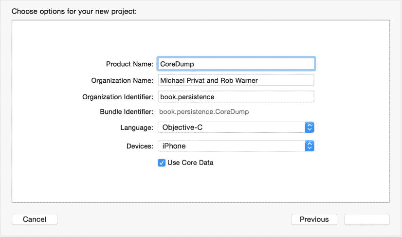

图 5-1. 创建 CoreDump 应用程序

Xcode 会创建一个项目，包含一个连接了主屏幕和详细屏幕的故事板、一个包含单个实体（`Event`）的 Core Data 模型，以及一个`NSFetchedResultsController`，用于将数据从 Core Data 存储提供给主屏幕上的表格视图。继续运行应用程序，创建一些事件，深入查看它们，感受生成的应用程序是如何工作的。同时，在代码中探索一下，看看发生了什么。像往常一样，Xcode 生成的代码既为你的应用程序提供了一个良好的起点，也是学习如何使用 Apple 技术的绝佳方式。

## 检查 CoreDump 应用程序中的 `NSFetchedResultsController`

让我们确保理解 CoreDump 如何在生成的代码中实现获取结果控制器。如果你正在用 Objective-C 构建此项目，请打开`MasterViewController.h`查看`MasterViewController`类的声明，如列表 5-1 所示。

***列表 5-1***. `MasterViewController.h`

```
#import <UIKit/UIKit.h>
#import <CoreData/CoreData.h>

@interface MasterViewController : UITableViewController <NSFetchedResultsControllerDelegate>

@property (strong, nonatomic) NSFetchedResultsController *fetchedResultsController;
@property (strong, nonatomic) NSManagedObjectContext *managedObjectContext;

@end
```

你可以看到，`MasterViewController`类继承自`UITableViewController`，并且实现了`NSFetchedResultsControllerDelegate`协议。它还拥有一个名为`fetchedResultsController`的`NSFetchedResultsController`属性，以及一个名为`managedObjectContext`的`NSManagedObjectContext`属性。


如果你在用 Swift 构建 CoreDump，可以在 `MasterViewController.swift` 中找到这些相同元素，尽管它们并非集中在一起，因此你需要稍加搜索才能找到代码清单 5-2 所示的元素。

***代码清单 5-2***. `MasterViewController.swift` 中的相同元素

```
import UIKit
import CoreData

class MasterViewController: UITableViewController, NSFetchedResultsControllerDelegate {

var managedObjectContext: NSManagedObjectContext? = nil
...
  var _fetchedResultsController: NSFetchedResultsController? = nil
...
}
```

`MasterViewController` 的实现多次引用了 `fetchedResultsController`。接下来的几节将探讨这些引用。

### 访问 `fetchedResultsController`

`MasterViewController` 的实现重写了 `fetchedResultsController` 的访问器，以创建、初始化并返回该控制器，如代码清单 5-3（Objective-C）和代码清单 5-4（Swift）所示。

***代码清单 5-3***. `fetchedResultsController` 访问器（Objective-C）

```
- (NSFetchedResultsController *)fetchedResultsController {
  if (_fetchedResultsController != nil) {
    return _fetchedResultsController;
  }

NSFetchRequest *fetchRequest = [[NSFetchRequest alloc] init];
  // 根据实际情况编辑实体名称。
  NSEntityDescription *entity = [NSEntityDescription entityForName:@"Event" inManagedObjectContext:self.managedObjectContext];
  [fetchRequest setEntity:entity];

// 将批量大小设置为合适的数值。
  [fetchRequest setFetchBatchSize:20];

// 根据实际情况编辑排序键。
  NSSortDescriptor *sortDescriptor = [[NSSortDescriptor alloc] initWithKey:@"timeStamp" ascending:NO];
  NSArray *sortDescriptors = @[sortDescriptor];

[fetchRequest setSortDescriptors:sortDescriptors];

// 根据实际情况编辑分区名称键路径和缓存名称。
  // 分区名称键路径设为 nil 表示“无分区”。
  NSFetchedResultsController *aFetchedResultsController = [[NSFetchedResultsController alloc] initWithFetchRequest:fetchRequest managedObjectContext:self.managedObjectContext sectionNameKeyPath:nil cacheName:@"Master"];
  aFetchedResultsController.delegate = self;
  self.fetchedResultsController = aFetchedResultsController;

NSError *error = nil;
  if (![self.fetchedResultsController performFetch:&error]) {
    // 用处理错误的代码替换此实现。
    // abort() 会导致应用生成崩溃日志并终止。在生产应用中不应使用此函数，尽管在开发过程中可能有用。
    NSLog(@"未解决的错误 %@, %@", error, [error userInfo]);
    abort();
  }

return _fetchedResultsController;
}
```

***代码清单 5-4***. `fetchedResultsController` 访问器（Swift）

```
var fetchedResultsController: NSFetchedResultsController {
    if _fetchedResultsController != nil {
        return _fetchedResultsController!
    }

let fetchRequest = NSFetchRequest()
    // 根据实际情况编辑实体名称。
    let entity = NSEntityDescription.entityForName("Event", inManagedObjectContext: self.managedObjectContext!)
    fetchRequest.entity = entity

// 将批量大小设置为合适的数值。
    fetchRequest.fetchBatchSize = 20

// 根据实际情况编辑排序键。
    let sortDescriptor = NSSortDescriptor(key: "timeStamp", ascending: false)
    let sortDescriptors = [sortDescriptor]

fetchRequest.sortDescriptors = [sortDescriptor]

// 根据实际情况编辑分区名称键路径和缓存名称。
    // 分区名称键路径设为 nil 表示“无分区”。
    let aFetchedResultsController = NSFetchedResultsController(fetchRequest: fetchRequest, managedObjectContext: self.managedObjectContext!, sectionNameKeyPath: nil, cacheName: "Master")
    aFetchedResultsController.delegate = self
    _fetchedResultsController = aFetchedResultsController

var error: NSError? = nil
  if !_fetchedResultsController!.performFetch(&error) {
       // 用处理错误的代码替换此实现。
       // abort() 会导致应用生成崩溃日志并终止。在生产应用中不应使用此函数，尽管在开发过程中可能有用。
         //println("未解决的错误 \(error), \(error.userInfo)")
       abort()
  }

return _fetchedResultsController!
}
```

在典型模式中，代码会检查 `fetchedResultsController` 属性是否已创建并初始化。如果已创建，则返回该属性。否则，它会创建并初始化该属性，执行以下操作：

*   将要检索的实体设置为 `Event` 实体。
*   为 `Event` 的 `timeStamp` 属性添加排序描述符。
*   使用应用的 Core Data 托管对象上下文（无分区名称键路径，缓存名称为“Master”）创建获取结果控制器。
*   将获取结果控制器的委托设置为其父 `MasterViewController` 实例。
*   获取配置好的结果。

### 在表格中显示数据

`MasterViewController` 所拥有表格视图的数据源和委托就是 `MasterViewController` 本身，这可以通过打开 storyboard，在 Master 视图中选择表格视图，然后点击连接检查器来确认，如图 5-2 所示。

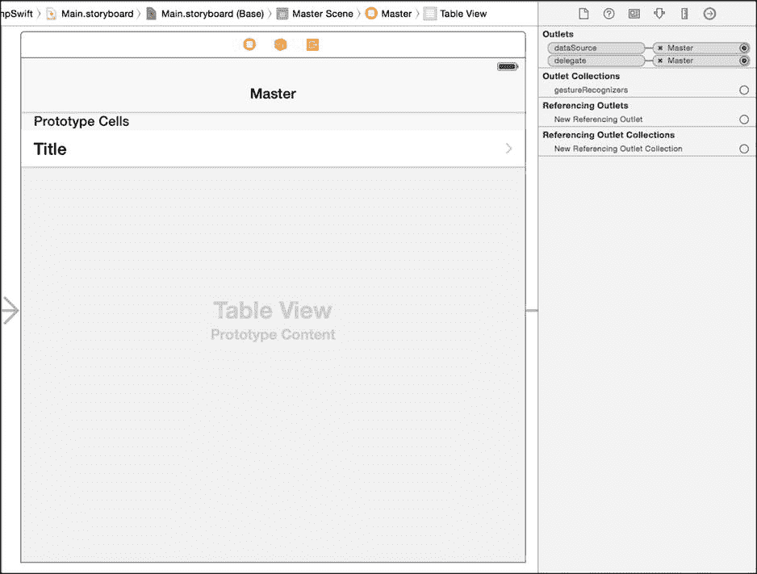

图 5-2. 验证表格视图的数据源和委托

数据源和委托方法的实现大量使用了 `fetchedResultsController`。例如，为了计算表格中的分区数量，`numberOfSectionsInTableView:` 方法返回 `fetchedResultsController` 的 `section` 属性的计数，如代码清单 5-5（Objective-C）和代码清单 5-6（Swift）所示。

***代码清单 5-5***. 计算表格分区数量（Objective-C）

```
- (NSInteger)numberOfSectionsInTableView:(UITableView *)tableView {
  return [[self.fetchedResultsController sections] count];
}
```

***代码清单 5-6***. 计算表格分区数量（Swift）

```
override func numberOfSectionsInTableView(tableView: UITableView) -> Int {
  return self.fetchedResultsController.sections?.count ?? 0
}
```

`sections` 属性是一个包含 `NSFetchedResultsSectionInfo` 实例的 `NSArray`。`NSFetchedResultsSectionInfo` 协议提供了一些方法，用于检索其所对应表格分区的信息。

*   `name`——要在分区标题中显示的名称
*   `indexTitle`——如果显示，则用于表格右侧索引的标题
*   `numberOfObjects`——分区中的对象数量
*   `objects`——分区中的实际对象

为了计算给定分区中的行数，`tableView:numberOfRowsInSection:` 方法会获取所请求分区的 `NSFetchedResultsSectionInfo` 实例，并返回其 `numberOfObjects` 属性，如代码清单 5-7（Objective-C）和代码清单 5-8（Swift）所示。

***代码清单 5-7***. 计算分区中的行数（Objective-C）

```
- (NSInteger)tableView:(UITableView *)tableView numberOfRowsInSection:(NSInteger)section {
  id <NSFetchedResultsSectionInfo> sectionInfo = [self.fetchedResultsController sections][section];
  return [sectionInfo numberOfObjects];
}
```


***列表 5-8***. 计算分区中的行数 (Swift)
```
override func tableView(tableView: UITableView, numberOfRowsInSection section: Int) -> Int {
  let sectionInfo = self.fetchedResultsController.sections![section] as NSFetchedResultsSectionInfo
  return sectionInfo.numberOfObjects
}
```

用于返回在表格中显示的实际单元格的方法 `tableView:cellForRowAtIndexPath:` 会创建一个单元格，并调用名为 `configureCell:atIndexPath:` 的方法来配置它。该方法从 `fetchedResultsController` 中获取该单元格对应的托管对象（一个 `Event` 实例），然后将该托管对象的 `timeStamp` 值设置为单元格的文本。列表 5-9 (Objective-C) 和 列表 5-10 (Swift) 展示了这段代码。

***列表 5-9***. 配置单元格 (Objective-C)

```
- (void)configureCell:(UITableViewCell *)cell atIndexPath:(NSIndexPath *)indexPath {
  NSManagedObject *object = [self.fetchedResultsController objectAtIndexPath:indexPath];
  cell.textLabel.text = [[object valueForKey:@"timeStamp"] description];
}
```

***列表 5-10***. 配置单元格 (Swift)

```
func configureCell(cell: UITableViewCell, atIndexPath indexPath: NSIndexPath) {
  let object = self.fetchedResultsController.objectAtIndexPath(indexPath) as NSManagedObject
  cell.textLabel.text = object.valueForKey("timeStamp")!.description
}
```

### 添加事件

当点击导航栏右侧的 + 按钮时，会调用 `insertNewObject:` 方法（该方法在 `viewDidLoad` 方法中配置）。`insertNewObject` 方法（如 列表 5-11 (Objective-C) 和 列表 5-12 (Swift) 所示）执行以下操作：

1. 从 `fetchedResultsController` 中获取托管对象上下文。
2. 从 `fetchedResultsController` 中获取实体。
3. 在托管对象上下文中插入一个适当实体类型的新托管对象。
4. 配置该托管对象。
5. 保存托管对象上下文。

***列表 5-11***. 插入新对象 (Objective-C)

```
- (void)insertNewObject:(id)sender {
  NSManagedObjectContext *context = [self.fetchedResultsController managedObjectContext];
  NSEntityDescription *entity = [[self.fetchedResultsController fetchRequest] entity];
  NSManagedObject *newManagedObject = [NSEntityDescription insertNewObjectForEntityForName:[entity name] inManagedObjectContext:context];

// 如果合适，配置新托管对象。
  // 通常应使用访问器方法，但在此处使用 KVC 可以避免为模板添加自定义类。
  [newManagedObject setValue:[NSDate date] forKey:@"timeStamp"];

// 保存上下文。
  NSError *error = nil;
  if (![context save:&error]) {
    // 替换此实现以适当处理错误。
    // abort() 会导致应用程序生成崩溃日志并终止。在生产应用中不应使用此函数，尽管它在开发过程中可能有用。
    NSLog(@"未解析的错误 %@, %@", error, [error userInfo]);
    abort();
  }
}
```

***列表 5-12***. 插入新对象 (Swift)

```
func insertNewObject(sender: AnyObject) {
  let context = self.fetchedResultsController.managedObjectContext
  let entity = self.fetchedResultsController.fetchRequest.entity
  let newManagedObject = NSEntityDescription.insertNewObjectForEntityForName(entity.name, inManagedObjectContext: context) as NSManagedObject

// 如果合适，配置新托管对象。
  // 通常应使用访问器方法，但在此处使用 KVC 可以避免为模板添加自定义类。
  newManagedObject.setValue(NSDate.date(), forKey: "timeStamp")

// 保存上下文。
  var error: NSError? = nil
  if !context.save(&error) {
      // 替换此实现以适当处理错误。
      // abort() 会导致应用程序生成崩溃日志并终止。在生产应用中不应使用此函数，尽管它在开发过程中可能有用。
      //println("未解析的错误 \(error), \(error.userInfo)")
      abort()
  }
}
```

请注意，插入新对象会导致调用 `NSFetchedResultsControllerDelegate` 协议中的 `controllerWillChangeContent:` 方法。回想一下，`fetchedResultsController` 的委托是 `MasterViewController` 实例，它实现了该方法以通知其表格视图即将开始更新，如 列表 5-13 (Objective-C) 和 列表 5-14 (Swift) 所示。

***列表 5-13***. `controllerWillChangeContent:` 方法 (Objective-C)

```
- (void)controllerWillChangeContent:(NSFetchedResultsController *)controller {
  [self.tableView beginUpdates];
}
```

***列表 5-14***. `controllerWillChangeContent:` 方法 (Swift)

```
func controllerWillChangeContent(controller: NSFetchedResultsController) {
    self.tableView.beginUpdates()
}
```

接下来，会调用 `NSFetchedResultsControllerDelegate` 协议中的另一个方法：`controller:didChangeObject:atIndexPath:forChangeType:newIndexPath`。`MasterViewController` 实现了该方法以动画方式在表格中插入行，如 列表 5-15 (Objective-C) 和 列表 5-16 (Swift) 所示。此方法还处理删除或移动行的动画。

***列表 5-15***. 对象发生变化时调用的方法 (Objective-C)

```
- (void)controller:(NSFetchedResultsController *)controller didChangeObject:(id)anObject
       atIndexPath:(NSIndexPath *)indexPath forChangeType:(NSFetchedResultsChangeType)type
      newIndexPath:(NSIndexPath *)newIndexPath {
  UITableView *tableView = self.tableView;

  switch(type) {
    case NSFetchedResultsChangeInsert:
      [tableView insertRowsAtIndexPaths:@[newIndexPath] withRowAnimation:UITableViewRowAnimationFade];
      break;

    case NSFetchedResultsChangeDelete:
      [tableView deleteRowsAtIndexPaths:@[indexPath] withRowAnimation:UITableViewRowAnimationFade];
      break;

    case NSFetchedResultsChangeUpdate:
      [self configureCell:[tableView cellForRowAtIndexPath:indexPath] atIndexPath:indexPath];
      break;

    case NSFetchedResultsChangeMove:
      [tableView deleteRowsAtIndexPaths:@[indexPath] withRowAnimation:UITableViewRowAnimationFade];
      [tableView insertRowsAtIndexPaths:@[newIndexPath] withRowAnimation:UITableViewRowAnimationFade];
      break;
  }
}
```

***列表 5-16***. 对象发生变化时调用的方法 (Swift)

```
func controller(controller: NSFetchedResultsController, didChangeObject anObject: AnyObject, atIndexPath indexPath: NSIndexPath, forChangeType type: NSFetchedResultsChangeType, newIndexPath: NSIndexPath) {
    switch type {
        case .Insert:
            tableView.insertRowsAtIndexPaths([newIndexPath], withRowAnimation: .Fade)
        case .Delete:
            tableView.deleteRowsAtIndexPaths([indexPath], withRowAnimation: .Fade)
        case .Update:
            self.configureCell(tableView.cellForRowAtIndexPath(indexPath)!, atIndexPath: indexPath)
        case .Move:
            tableView.deleteRowsAtIndexPaths([indexPath], withRowAnimation: .Fade)
            tableView.insertRowsAtIndexPaths([newIndexPath], withRowAnimation: .Fade)
        default:
            return
    }
}
```

在插入情况下，会调用 `switch` 语句中的 `NSFetchedResultsChangeInsert` 分支。表格视图正是通过这种方式更新以显示新的 `Event` 托管对象。


最后，调用了`NSFetchedResultsControllerDelegate`的`controllerDidChangeContent:`方法。`MasterViewController`的实现通知表视图结束其更新，如[代码清单 5-17]（Objective-C）和[代码清单 5-18]（Swift）所示。

[**代码清单 5-17**] `controllerDidChangeContent:` 方法（Objective-C）

```
- (void)controllerDidChangeContent:(NSFetchedResultsController *)controller {
  [self.tableView endUpdates];
}
```

[**代码清单 5-18**] `controllerDidChangeContent:` 方法（Swift）

```
func controllerDidChangeContent(controller: NSFetchedResultsController) {
    self.tableView.endUpdates()
}
```

### 删除事件

生成的应用程序允许您从主表中删除`Event`实例，可以通过在表格单元格上向左滑动并点击出现的删除按钮，或者点击导航栏左侧的编辑链接，点击表格单元格左侧的删除图标，然后点击删除按钮。完成后不要忘记点击完成链接。

当您从表中删除一行时，将调用`tableView:commitEditingStyle:forRowAtIndexPath:`方法，并传入`UITableViewCellEditingStyleDelete`编辑样式。该实现会检查该样式，从`fetchedResultsController`中删除相应的对象，并保存托管对象上下文。[代码清单 5-19]（Objective-C）和[代码清单 5-20]（Swift）展示了此代码。

[**代码清单 5-19**] 从表和 Core Data 存储中删除一行（Objective-C）

```
- (void)tableView:(UITableView *)tableView commitEditingStyle:(UITableViewCellEditingStyle)editingStyle forRowAtIndexPath:(NSIndexPath *)indexPath {
  if (editingStyle == UITableViewCellEditingStyleDelete) {
    NSManagedObjectContext *context = [self.fetchedResultsController managedObjectContext];
    [context deleteObject:[self.fetchedResultsController objectAtIndexPath:indexPath]];

    NSError *error = nil;
    if (![context save:&error]) {
      // 将此实现替换为适当处理错误的代码。
      // abort() 会导致应用程序生成崩溃日志并终止。您不应在发布的应用程序中使用此函数，尽管它在开发中可能有用。
      NSLog(@"Unresolved error %@, %@", error, [error userInfo]);
      abort();
    }
  }
}
```

[**代码清单 5-20**] 从表和 Core Data 存储中删除一行（Swift）

```
override func tableView(tableView: UITableView, commitEditingStyle editingStyle: UITableViewCellEditingStyle, forRowAtIndexPath indexPath: NSIndexPath) {
  if editingStyle == .Delete {
      let context = self.fetchedResultsController.managedObjectContext
      context.deleteObject(self.fetchedResultsController.objectAtIndexPath(indexPath) as NSManagedObject)

      var error: NSError? = nil
      if !context.save(&error) {
          // 将此实现替换为适当处理错误的代码。
          // abort() 会导致应用程序生成崩溃日志并终止。您不应在发布的应用程序中使用此函数，尽管它在开发中可能有用。
          //println("Unresolved error \(error), \(error.userInfo)")
          abort()
      }
  }
}
```

与添加行类似，删除行会触发调用前一节“添加事件”中讨论的三个`NSFetchedResultsControllerDelegate`协议方法。

### 显示详情

您可以在`MasterViewController`的`prepareForSegue:sender:`方法中找到对`fetchedResultsController`的最后一次引用，当您点击主视图表中的一行时会调用该方法。此实现从`fetchedResultsController`中提取被点击行的托管对象，并将其交给详情视图控制器进行显示，如[代码清单 5-21]（Objective-C）和[代码清单 5-22]（Swift）所示。

[**代码清单 5-21**] `prepareForSegue:sender:` 方法（Objective-C）

```
- (void)prepareForSegue:(UIStoryboardSegue *)segue sender:(id)sender {
  if ([[segue identifier] isEqualToString:@"showDetail"]) {
    NSIndexPath *indexPath = [self.tableView indexPathForSelectedRow];
    NSManagedObject *object = [[self fetchedResultsController] objectAtIndexPath:indexPath];
    [[segue destinationViewController] setDetailItem:object];
  }
}
```

[**代码清单 5-22**] `prepareForSegue:sender:` 方法（Swift）

```
override func prepareForSegue(segue: UIStoryboardSegue, sender: AnyObject?) {
  if segue.identifier == "showDetail" {
      if let indexPath = self.tableView.indexPathForSelectedRow() {
          let object = self.fetchedResultsController.objectAtIndexPath(indexPath) as NSManagedObject
          (segue.destinationViewController as DetailViewController).detailItem = object
      }
  }
}
```

现在我们准备在生成的应用程序基础上构建 CoreDump 应用程序。

### 更新 Core Data 模型

要构建 CoreDump 应用程序，我们必须修改 Core Data 模型以存储我们想要的 bug 追踪器数据。CoreDump 将存储项目列表以及每个项目的 bug 列表。对于每个项目，我们存储：

*   项目名称
*   项目 URL
*   托管服务

对于每个 bug，我们存储：

*   Bug 标题
*   Bug 详情

从 Core Data 模型中删除`Event`实体，并创建两个实体：`Project`和`Bug`。对于`Project`，添加以下属性：

*   `name`——`String`类型的属性
*   `url`——`String`类型的属性
*   `host`——`String`类型的属性
*   `bugs`——一个可选的对`Bug`的**对多**关系，删除规则设置为**级联**

对于`Bug`实体，添加以下属性：

*   `title`——`String`类型的属性
*   `details`——`String`类型的属性
*   `project`——一个**必需**的对`Project`的**对一**关系，删除规则设置为**置空**。不要忘记将反向关系设置为`bugs`。

完成更新 Core Data 模型后，它应该看起来像[图 5-3]。

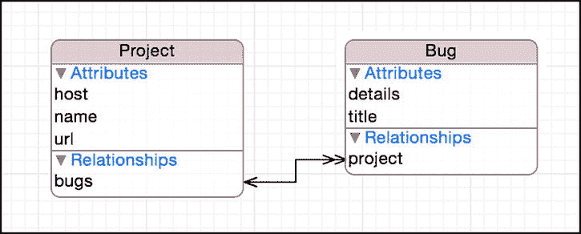

[图 5-3] 更新后的 Core Data 模型

不要忘记删除旧数据模型生成的数据库，否则尝试运行时应用程序将崩溃。

### 生成模型类

尽管我们可以在整个 CoreDump 应用程序中使用原始的`NSManagedObject`实例，但我们更倾向于从 Core Data 模型生成类。创建一个新的 NSManagedObject 子类，选择 CoreDump 数据模型，然后同时选择 Project 和 Bug 实体，以生成`Project`和`Bug`类。如果您使用 Swift，请记住修复生成类中的命名空间。您的选项是：

*   将项目名称放在 Core Data 模型中每个实体的类字段中（即`CoreDump.Project`和`CoreDump.Bug`）
*   在生成的类文件中使用`@objc`关键字（即`@objc(Project)`和`@objc(Bug)`）

### 更新获取的结果控制器


获取结果控制器目前尝试使用已不存在的 `Event` 实体来获取数据，而你应该改为获取 `Project` 实体。此外，你需要按托管服务将项目分组显示。为此，必须指定一个与 `host` 属性对应的分区名称键路径，同时先按 `host` 排序，再在每个分区内按 `name` 排序。请找到 `fetchedResultsController` 访问器，并进行如下修改：

*   将实体改为 `Project`。
*   为 `host` 添加排序描述符。
*   将现有排序描述符改为使用 `name`。
*   将分区名称键路径改为使用 `host`。

代码清单 5-23（Objective-C）和代码清单 5-24（Swift）展示了更新后的 `fetchedResultsController` 访问器。

***代码清单 5-23***. 更新后的 `fetchedResultsController` 访问器（Objective-C）

```
- (NSFetchedResultsController *)fetchedResultsController {
  if (_fetchedResultsController != nil) {
    return _fetchedResultsController;
  }

NSFetchRequest *fetchRequest = [[NSFetchRequest alloc] init];
  // 根据实际情况编辑实体名称。
  NSEntityDescription *entity = [NSEntityDescription entityForName:@"Project" inManagedObjectContext:self.managedObjectContext];
  [fetchRequest setEntity:entity];

// 将批量大小设置为合适的数值。
  [fetchRequest setFetchBatchSize:20];

// 根据实际情况编辑排序键。  NSSortDescriptor *hostSortDescriptor = [[NSSortDescriptor alloc] initWithKey:@"host" ascending:YES];
  NSSortDescriptor *nameSortDescriptor = [[NSSortDescriptor alloc] initWithKey:@"name" ascending:YES];
  NSArray *sortDescriptors = @[hostSortDescriptor, nameSortDescriptor];

[fetchRequest setSortDescriptors:sortDescriptors];

// 根据实际情况编辑分区名称键路径和缓存名称。
  // 分区名称键路径为 nil 表示“无分区”。
  NSFetchedResultsController *aFetchedResultsController = [[NSFetchedResultsController alloc] initWithFetchRequest:fetchRequest managedObjectContext:self.managedObjectContext sectionNameKeyPath:@"host" cacheName:@"Master"];
    aFetchedResultsController.delegate = self;
    self.fetchedResultsController = aFetchedResultsController;

NSError *error = nil;
    if (![self.fetchedResultsController performFetch:&error]) {
    // 将此实现替换为能恰当处理错误的代码。
    // abort() 会使应用生成崩溃日志并终止。在开发阶段可能有帮助，但不应在发布的应用程序中使用。
    NSLog(@"未解决错误 %@, %@", error, [error userInfo]);
    abort();
    }

return _fetchedResultsController;
}
```

***代码清单 5-24***. 更新后的 `fetchedResultsController` 访问器（Swift）

```
var fetchedResultsController: NSFetchedResultsController {
    if _fetchedResultsController != nil {
        return _fetchedResultsController!
    }

let fetchRequest = NSFetchRequest(entityName: "Project")

// 将批量大小设置为合适的数值。
    fetchRequest.fetchBatchSize = 20

// 根据实际情况编辑排序键。
    let hostSortDescriptor = NSSortDescriptor(key: "host", ascending: true)
    let nameSortDescriptor = NSSortDescriptor(key: "name", ascending: true)
    let sortDescriptors = [hostSortDescriptor, nameSortDescriptor]

fetchRequest.sortDescriptors = [sortDescriptors]

// 根据实际情况编辑分区名称键路径和缓存名称。
    // 分区名称键路径为 nil 表示“无分区”。
    let aFetchedResultsController = NSFetchedResultsController(fetchRequest: fetchRequest, managedObjectContext: self.managedObjectContext!, sectionNameKeyPath:"host", cacheName: "Master")
    aFetchedResultsController.delegate = self
    _fetchedResultsController = aFetchedResultsController

var error: NSError? = nil
    if !_fetchedResultsController!.performFetch(&error) {
       // 将此实现替换为能恰当处理错误的代码。
       // abort() 会使应用生成崩溃日志并终止。在开发阶段可能有帮助，但不应在发布的应用程序中使用。
         //println("未解决错误 \(error), \(error.userInfo)")
       abort()
    }

return _fetchedResultsController!
}
```

## 在表格中显示项目

表格中的单元格当前配置为显示 `Event` 对象，你需要将其改为显示 `Project` 对象。每个单元格应显示项目的名称及其 URL。点击项目应能向下钻取其关联的 bug，因此仍需保留展开指示器。同时，还需要能够编辑项目的名称和 URL，所以当主视图处于编辑模式时，应显示详细信息展开附件。

此外，你需要按托管服务分组显示项目，并使用在获取结果控制器中配置的分区名称。以下各节将详细介绍这些更改。

### 更新表格视图单元格以显示项目

打开故事板文件 `Main.storyboard`，在主屏幕中选择表格视图单元格。打开属性检查器，执行以下操作：

*   将样式改为**副标题**。
*   将编辑附件改为**详细信息展开**。

属性检查器中的相应更改请参见图 5-4。

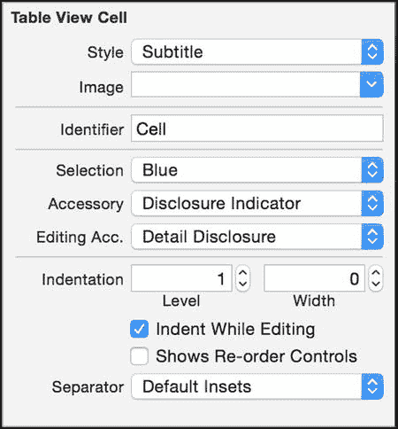

图 5-4. 配置表格视图单元格的属性

现在，你可以更新 `configureCell:atIndexPath:` 方法，使其使用 `Project` 对象而非 `Event` 对象。如果你使用的是 Objective-C，请在 `MasterViewController.m` 中导入 `Project` 头文件。

```
#import "Project.h" // Objective-C
```

然后，更新单元格以显示项目名称及其 URL，如代码清单 5-25（Objective-C）和代码清单 5-26（Swift）所示。

***代码清单 5-25***. 更新后的 `configureCell:atIndexPath:` 方法（Objective-C）

```
- (void)configureCell:(UITableViewCell *)cell atIndexPath:(NSIndexPath *)indexPath {
  Project *project = [self.fetchedResultsController objectAtIndexPath:indexPath];
  cell.textLabel.text = project.name;
  cell.detailTextLabel.text = project.url;
}
```

***代码清单 5-26***. 更新后的 `configureCell:atIndexPath:` 函数（Swift）

```
func configureCell(cell: UITableViewCell, atIndexPath indexPath: NSIndexPath) {
  let project = self.fetchedResultsController.objectAtIndexPath(indexPath) as Project
  cell.textLabel.text = project.name
  cell.detailTextLabel?.text = project.url
}
```

### 更新表格以按托管服务分组

当前表格样式为**扁平**。要显示分区，需将其改为**分组**。打开 `Main.storyboard`，选择表格，显示属性检查器，并将样式改为**分组**。

此外，你还需要为分区提供名称。回想一下，`NSFetchedResultsSectionInfo` 协议提供了一个 `name` 属性，该属性对应于创建获取结果控制器时使用的 `sectionNameKeyPath` 参数。我们只需告知表格使用该值作为分区名称即可，如代码清单 5-27（Objective-C）和代码清单 5-28（Swift）所示。

***代码清单 5-27***. 在表格中显示分区名称（Objective-C）

```
- (NSString *)tableView:(UITableView *)tableView titleForHeaderInSection:(NSInteger)section {
  id <NSFetchedResultsSectionInfo> sectionInfo = [self.fetchedResultsController sections][section];
  return [sectionInfo name];
}
```


***清单 5-28***. 在表格中显示分区名称（Swift）

```
override func tableView(tableView: UITableView, titleForHeaderInSection section: Int) -> String? {
  if tableView == self.tableView {
    var sectionInfo = self.fetchedResultsController.sections![section] as NSFetchedResultsSectionInfo
    return sectionInfo.name
  }
  else {
    return nil
  }
}
```

## 创建添加和编辑项目屏幕

在生成的应用程序中，添加新的`Event`对象时，并不需要屏幕来接收输入。当您点击添加`Event`时，应用程序只是创建了该对象，将当前时间填入其`timeStamp`属性，然后返回。而在创建`Project`对象时，我们无法这样做，因为我们必须收集名称和 URL。在本节中，我们将创建一个用于添加（以及后续编辑）`Project`对象的屏幕。

### 创建用于添加和编辑项目的视图控制器

首先，我们创建负责添加/编辑项目屏幕的视图控制器。新建一个名为`ProjectViewController`的 Cocoa Touch 类文件，并将其设置为`UIViewController`的子类。勾选 **Also create XIB file** 复选框，选择您的语言，然后按照步骤创建新文件。打开`ProjectViewController.h`（Objective-C）或`ProjectViewController.swift`（Swift），并添加以下内容：

-   一个用于待编辑`Project`的属性（注意：添加`Project`时该属性为`nil`）
-   一个用于已获取结果控制器的属性
-   一个用于项目名称文本字段的插座变量
-   一个用于项目 URL 文本字段的插座变量
-   一个接受`Project`对象和已获取结果控制器的初始化方法
-   一个保存`Project`的动作方法
-   一个取消添加或编辑的动作方法

清单 5-29（Objective-C）和清单 5-30（Swift）展示了编辑后的文件。

***清单 5-29***. `ProjectViewController.h`

```
#import <UIKit/UIKit.h>
#import <CoreData/CoreData.h>

@class Project;
@interface ProjectViewController : UIViewController
@property (strong, nonatomic) Project *project;
@property (strong, nonatomic) NSFetchedResultsController *fetchedResultsController;
@property (weak, nonatomic) IBOutlet UITextField *name;
@property (weak, nonatomic) IBOutlet UITextField *url;

- (id)initWithProject:(Project *)project fetchedResultsController:(NSFetchedResultsController *)fetchedResultsController;
- (IBAction)save:(id)sender;
- (IBAction)cancel:(id)sender;

@end
```

***清单 5-30***. `ProjectViewController.swift`

```
import UIKit
import CoreData

class ProjectViewController: UIViewController {

var fetchedResultsController: NSFetchedResultsController? = nil
    var project: Project? = nil

@IBOutlet weak var name: UITextField!
    @IBOutlet weak var url: UITextField!
    ...
}
```

现在编辑`ProjectViewController.m`（Objective-C）或继续编辑`ProjectViewController.swift`（Swift）以实现所需的行为。如果您正在编辑`ProjectViewController.m`，请在文件顶部导入`Project.h`，然后在新的初始化方法（如清单 5-31（Objective-C）和清单 5-32（Swift）所示）中，将`project`和`fetchedResultsController`参数存储到对应的属性中。

***清单 5-31***. `initWithProject:fetchedResultsController:`方法（Objective-C）

```
- (id)initWithProject:(Project *)project fetchedResultsController:(NSFetchedResultsController *)fetchedResultsController

{

self = [super init];

if (self) {

self.project = project;

self.fetchedResultsController = fetchedResultsController;

}

return self;

}
```

***清单 5-32***. `initWithProject:fetchedResultsController:`方法（Swift）

```
convenience init(project: Project?, fetchedResultsController: NSFetchedResultsController) {
    self.init(nibName: "ProjectViewController", bundle: nil)

self.fetchedResultsController = fetchedResultsController
    self.project = project
}
```

在`viewWillAppear:`方法中，如果`project`属性非`nil`，则将相关值从`project`转移到相应的文本字段，如清单 5-33（Objective-C）和清单 5-34（Swift）所示。

***清单 5-33***. `viewWillAppear:`方法（Objective-C）

```
- (void)viewWillAppear:(BOOL)animated {

[super viewWillAppear:animated];

if (self.project != nil) {

self.name.text = self.project.name;

self.url.text = self.project.url;

}

}
```

***清单 5-34***. `viewWillAppear:`方法（Swift）

```
override func viewWillAppear(animated: Bool) {
    super.viewWillAppear(animated)

if let project = self.project {
        self.name.text = project.name
        self.url.text = project.url
    }
}
```

`cancel:`方法很简单：只需关闭模态窗口，如清单 5-35（Objective-C）和清单 5-36（Swift）所示。

***清单 5-35***. `cancel:`方法（Objective-C）

```
- (IBAction)cancel:(id)sender {
  [self dismissViewControllerAnimated:YES completion:nil];
}
```

***清单 5-36***. `cancel:`方法（Swift）

```
@IBAction func cancel(sender: AnyObject) {
  self.dismissViewControllerAnimated(true, completion: nil)
}
```

在`save:`方法中，你需要判断是添加一个新项目（`project`为`nil`）还是编辑一个已有项目（`project`非`nil`）。如果是添加项目，则向`Project`实体中插入一个新的托管对象。在两种情况下，都需要将文本字段中的名称和 URL 转移到`project`对象中。然后，在一个名为`host`的方法中确定托管服务的名称，该方法稍后实现。保存托管对象上下文，然后关闭模态视图。清单 5-37（Objective-C）和清单 5-38（Swift）展示了`save:`方法。

***清单 5-37***. `save:`方法（Objective-C）

```
- (IBAction)save:(id)sender {
  NSManagedObjectContext *context = [self.fetchedResultsController managedObjectContext];

if (self.project == nil) {
    NSEntityDescription *entity = [[self.fetchedResultsController fetchRequest] entity];
    self.project = [NSEntityDescription insertNewObjectForEntityForName:[entity name] inManagedObjectContext:context];
  }

self.project.name = self.name.text;
  self.project.url = self.url.text;
  self.project.host = [self host];

// 保存上下文。
  NSError *error = nil;
  if (![context save:&error]) {
    // 用处理错误的代码替换此实现。
    // abort() 会使应用程序生成崩溃日志并终止。在开发阶段可能有用，但不应用于正式发布的应用程序。
    NSLog(@"未解决的错误 %@, %@", error, [error userInfo]);    abort();
  }

[self dismissViewControllerAnimated:YES completion:nil];
}
```

***清单 5-38***. `save:`方法（Swift）

```
@IBAction func save(sender: AnyObject) {
  if let context = fetchedResultsController?.managedObjectContext {

if self.project == nil {
      var entity = self.fetchedResultsController?.fetchRequest.entity
      self.project = NSEntityDescription.insertNewObjectForEntityForName(entity!.name!, inManagedObjectContext: context) as? Project
    }

self.project?.name = self.name.text
    self.project?.url = self.url.text
    self.project?.host = self.host()
```


```markdown
`var error: NSError? = nil`
```
if context.hasChanges && !context.save(&error) {
  // 用适当的错误处理代码替换此实现。
  // abort() 会导致应用程序生成崩溃日志并终止。在开发阶段可能有用，但不应在发布应用中使用此函数。
  NSLog("未解决的错误 \(error), \(error!.userInfo)")
  abort()
}
```

`self.dismissViewControllerAnimated(true, completion: nil)`

`host` 方法使用正则表达式从 URL 中提取主机名。例如，如果 URL 是 `https://github.com/hoop33/wry`，该方法将返回 `github.com`。如果正则表达式未找到匹配项，则直接返回 URL。代码清单 5-39（Objective-C）和代码清单 5-40（Swift）展示了 `host` 方法的实现。

**代码清单 5-39**. `host` 方法（Objective-C）

```
- (NSString *)host {
  NSRegularExpression *regex = [NSRegularExpression regularExpressionWithPattern:@".*?//(.*?)/.*"
                     options:0                       error:nil];
  NSTextCheckingResult *match = [regex firstMatchInString:self.project.url
                                                  options:0
                                                    range:NSMakeRange(0, [self.project.url length])];
  if (match) {
    return [self.project.url substringWithRange:[match rangeAtIndex:1]];
  } else {
    return self.project.url;
  }
}
```

**代码清单 5-40**. `host` 函数（Swift）

```
func host() -> String {
  let url : NSString = self.project!.url
  let regex = NSRegularExpression(pattern: ".*?//(.*?)/.*", options: nil, error: nil)
  let match =  regex!.firstMatchInString(url, options: NSMatchingOptions.ReportCompletion, range: NSMakeRange(0, url.length))
  if match != nil {
    let range = match?.rangeAtIndex(1)
    if let range = range {
      return url.substringWithRange(range)
    }
    else {
      return url
    }
  }
  else {
    return url
  }
}
```

视图控制器已就绪，但对应的 XIB 文件尚未完成。在下一节中，我们将整合 XIB 中的视图。

## 创建用于添加和编辑项目的屏幕

打开 `ProjectViewController.xib` 并执行以下操作：

- 从对象库中拖拽一个导航栏到视图顶部，距顶部 20 像素。
- 将导航栏标题改为 **Project**。
- 拖拽两个栏按钮项到导航栏中，分别置于左上角和右上角，并将它们的标题分别改为 **Cancel** 和 **Save**。
- 将栏按钮项连接到 `cancel:` 和 `save:` 操作。
- 拖拽两个标签到视图中，分别命名为 **Name** 和 **URL**。
- 拖拽两个文本字段到视图中，并将它们连接到 `name` 和 `url` 属性。
- 选中视图，点击“解决自动布局问题”按钮，然后在 **All Views in View** 部分选择 **Add Missing Constraints**。

你的视图应与图 5-5 一致。

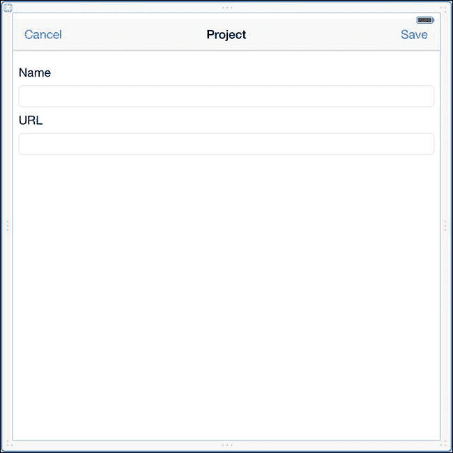

图 5-5. 添加和编辑项目屏幕

## 显示用于添加项目的项目屏幕

当用户点击“+”按钮添加新项目时，会调用 `insertNewObject:` 方法。你需要修改此方法以显示添加/编辑项目屏幕。因此，如果使用 Objective-C，请在 `MasterViewController.m` 中添加对 `ProjectViewController.h` 的导入，然后按照代码清单 5-41（Objective-C）和代码清单 5-42（Swift）所示更新该方法。

**代码清单 5-41**. 更新后的 `insertNewObject:` 方法（Objective-C）

```
- (void)insertNewObject:(id)sender {
  ProjectViewController *projectViewController = [[ProjectViewController alloc] initWithProject:nil fetchedResultsController:self.fetchedResultsController];
  [self presentViewController:projectViewController animated:YES completion:nil];
}
```

**代码清单 5-42**. 更新后的 `insertNewObject:` 函数（Swift）

```
func insertNewObject(sender: AnyObject) {
  let projectViewController = ProjectViewController(project: nil, fetchedResultsController: self.fetchedResultsController)
  self.presentViewController(projectViewController, animated: true, completion: nil)
}
```

## 显示用于编辑项目的项目屏幕

当用户在主屏幕上点击“编辑”按钮时，每个单元格的展开指示器会变为详细信息展开指示器。如果用户点击了详细信息展开指示器，则会调用 `UITableViewDelegate` 中的 `tableView:accessoryButtonTappedForRowWithIndexPath:` 方法。在该方法中，我们希望显示项目屏幕，但这次要传递被点击行的 `Project` 对象。这仅在表格处于编辑模式时执行；否则，我们希望保持钻取行为。代码清单 5-43（Objective-C）和代码清单 5-44（Swift）展示了 `tableView:accessoryButtonTappedForRowWithIndexPath:` 的实现。

**代码清单 5-43**. `tableView:accessoryButtonTappedForRowWithIndexPath:` 方法（Objective-C）

```
- (void)tableView:(UITableView *)tableView accessoryButtonTappedForRowWithIndexPath:(NSIndexPath *)indexPath {
  if (tableView.editing) {
    Project *project = [self.fetchedResultsController objectAtIndexPath:indexPath];
    ProjectViewController *projectViewController = [[ProjectViewController alloc] initWithProject:project fetchedResultsController:self.fetchedResultsController];
    [self presentViewController:projectViewController animated:YES completion:nil];
  }
}
```

**代码清单 5-44**. `tableView:accessoryButtonTappedForRowWithIndexPath:` 函数（Swift）

```
override func tableView(tableView: UITableView, accessoryButtonTappedForRowWithIndexPath indexPath: NSIndexPath) {
  if tableView.editing {
    let project = self.fetchedResultsController.objectAtIndexPath(indexPath) as? Project
    let projectViewController = ProjectViewController(project: project, fetchedResultsController: self.fetchedResultsController)
    self.presentViewController(projectViewController, animated: true, completion: nil)
  }
}
```

## 在表格中查看项目

此时，你可以运行 CoreDump 应用程序，前提是你要承诺不尝试查看项目中的 Bug。我们尚未更新详细视图，因此钻取会导致应用程序崩溃。

运行应用程序并添加几个项目。点击“编辑”按钮进入编辑模式，然后点击详细信息展开指示器来编辑项目。删除项目。重命名项目。修改 URL 以观察它们如何分组到各个部分。图 5-6 展示了添加几个项目后的应用程序界面。

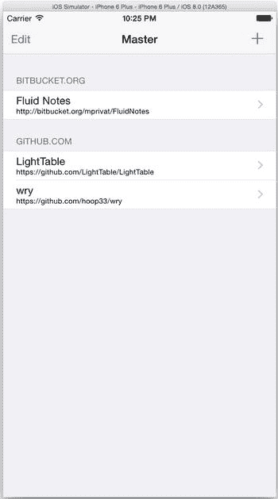

图 5-6. 显示项目的主视图

## 更新详细视图以在表格中显示 Bug
```


当前`Detail`视图只显示了一个标签：“Detail view content goes here”。我们希望改为显示一个表格，类似于`Master`视图，但表格中显示的是`Bug`对象而非`Project`对象。首先，更新`DetailViewController`类的头文件，将其父类从`UIViewController`改为`UITableViewController`。同时，删除原有的两个属性`detailItem`和`detailDescriptionLabel`，并添加一个用于存储父`Project`对象的属性。清单 5-45 展示了 Objective-C 更新后的头文件，清单 5-46 展示了 Swift 的相应修改。

***清单 5-45***. `DetailViewController.h`

```
#import <UIKit/UIKit.h>
@class Project;
@interface DetailViewController : UITableViewController
@property (strong, nonatomic) Project *project;
@end
```

***清单 5-46***. `DetailViewController.swift`

```
import UIKit

class DetailViewController: UITableViewController {

    var project: Project? = nil
    ...
}
```

你还需要更新实现文件以处理表格视图。这次我们没有使用抓取结果控制器——而是有一个`Project`对象，这是抓取结果控制器提供给我们的。`Project`对象包含一组`Bug`对象，我们可以将其排序为一个数组。使用这个数组来填充表格是 iOS 开发中的标准做法。此外，我们希望每次视图将要出现时重新加载表格，并将导航栏的标题设置为项目名称。最后，我们希望在导航栏右侧显示一个`+`按钮，用于插入新的`Bug`，不过目前暂不实现其具体功能。清单 5-47 展示了更新后的`DetailViewController.m`文件，清单 5-48 展示了更新后的`DetailViewController.swift`文件。

***清单 5-47***. `DetailViewController.m`

```
#import "DetailViewController.h"
#import "Project.h"
#import "Bug.h"

@interface DetailViewController ()

@end

@implementation DetailViewController

- (void)viewDidLoad {
    [super viewDidLoad];

    UIBarButtonItem *addButton = [[UIBarButtonItem alloc] initWithBarButtonSystemItem:UIBarButtonSystemItemAdd target:self action:@selector(insertNewObject:)];
    self.navigationItem.rightBarButtonItem = addButton;
}

- (void)viewWillAppear:(BOOL)animated {
    [super viewWillAppear:animated];
    self.title = self.project.name;
    [self.tableView reloadData];
}

- (void)didReceiveMemoryWarning {
    [super didReceiveMemoryWarning];
    // 处置任何可以重新创建的资源。
}

- (void)insertNewObject:(id)sender {
}

#pragma mark - 表格视图

- (NSInteger)numberOfSectionsInTableView:(UITableView *)tableView {
    return 1;
}

- (NSInteger)tableView:(UITableView *)tableView numberOfRowsInSection:(NSInteger)section {
    return [self.project.bugs count];
}

- (UITableViewCell *)tableView:(UITableView *)tableView cellForRowAtIndexPath:(NSIndexPath *)indexPath {
    UITableViewCell *cell = [tableView dequeueReusableCellWithIdentifier:@"DetailCell" forIndexPath:indexPath];
    [self configureCell:cell atIndexPath:indexPath];
    return cell;
}

- (void)configureCell:(UITableViewCell *)cell atIndexPath:(NSIndexPath *)indexPath {
    Bug *bug = [self sortedBugs][indexPath.row];
    cell.textLabel.text = bug.title;
}

- (NSArray *)sortedBugs {
    NSSortDescriptor *sortDescriptor = [[NSSortDescriptor alloc] initWithKey:@"title" ascending:YES];
    return [self.project.bugs sortedArrayUsingDescriptors:@[sortDescriptor]];
}
@end
```

***清单 5-48***. `DetailViewController.swift`

```
import UIKit

class DetailViewController: UITableViewController {

    var project: Project? = nil

    func configureView() {
        var addButton = UIBarButtonItem(barButtonSystemItem: .Add, target: self, action: "insertNewObject:")
        self.navigationItem.rightBarButtonItem = addButton
    }

    func insertNewObject(sender: AnyObject?) {
    }
```


```swift
override func viewDidLoad() {
    super.viewDidLoad()
    // 在这里执行视图加载后的额外设置，通常来自 nib 文件
    self.configureView()
}

override func viewWillAppear(animated: Bool) {
    super.viewWillAppear(animated)
    self.title = self.project?.name
    self.tableView.reloadData()
}

override func didReceiveMemoryWarning() {
    super.didReceiveMemoryWarning()
    // 释放任何可以重新创建的资源
}

//MARK: 表格视图

override func numberOfSectionsInTableView(tableView: UITableView) -> Int {
    return 1
}

override func tableView(tableView: UITableView, numberOfRowsInSection section: Int) -> Int {
    let result = self.project?.bugs.count
    return result!
}

override func tableView(tableView: UITableView, cellForRowAtIndexPath indexPath: NSIndexPath) -> UITableViewCell {
    let cell = tableView.dequeueReusableCellWithIdentifier("DetailCell") as UITableViewCell
    self.configureCell(cell, atIndexPath: indexPath)
    return cell
}

func configureCell(cell: UITableViewCell, atIndexPath indexPath: NSIndexPath) {
    let bug = sortedBugs()?[indexPath.row]
    cell.textLabel.text = bug?.title
}

func sortedBugs() -> [Bug]? {
    let sortDescriptor = NSSortDescriptor(key: "title", ascending: true)
    let results = self.project?.bugs.sortedArrayUsingDescriptors([sortDescriptor])
    return results as [Bug]?
}
```

我们还必须在故事板中更新界面。打开故事板 `Main.storyboard`，然后选择详情视图。删除现有的 View 对象，并拖入一个 Table View 到视图上以替换它。将其 `dataSource` 和 `delegate` 属性连接到详情视图控制器。

接下来，在 Table View 上拖入一个 Table View Cell，在属性检查器中将其样式设置为 `Basic`，配件设置为 `Detail Disclosure`。同时，将标识符设置为 `DetailCell`。Figure 5-7 展示了新的布局。

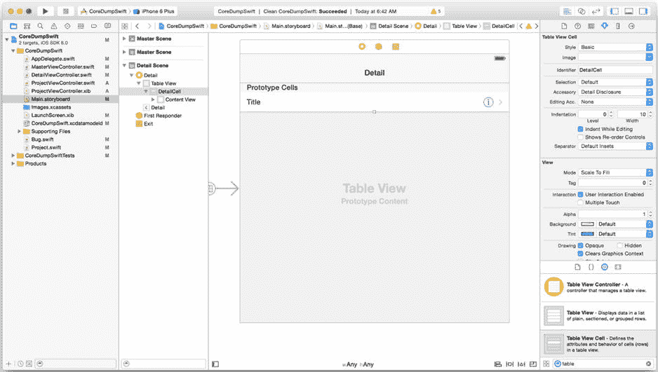

Figure 5-7。带表格的详情视图

更新 `MasterViewController.m` 或 `MasterViewController.swift` 中的 `prepareForSegue:sender:` 方法，以获取选中的 `Project` 并将其设置到详情视图控制器上，如 Listing 5-49（Objective-C）和 Listing 5-50（Swift）所示。

***Listing 5-49***。在 Segue 前设置 `project`（Objective-C）

```objc
- (void)prepareForSegue:(UIStoryboardSegue *)segue sender:(id)sender {
  if ([[segue identifier] isEqualToString:@"showDetail"]) {
    NSIndexPath *indexPath = [self.tableView indexPathForSelectedRow];
    Project *project = [[self fetchedResultsController] objectAtIndexPath:indexPath];
    [[segue destinationViewController] setProject:project];
  }
}
```

***Listing 5-50***。在 Segue 前设置 `project`（Swift）

```swift
override func prepareForSegue(segue: UIStoryboardSegue, sender: AnyObject?) {
  var project : Project?
  if segue.identifier == "showDetail" {
    if let indexPath = self.tableView.indexPathForSelectedRow() {
      project = self.fetchedResultsController.objectAtIndexPath(indexPath) as? Project
      (segue.destinationViewController as DetailViewController).project = project
    }
  }
}
```

你现在可以运行项目，甚至深入查看项目也不会崩溃。然而，由于没有添加 bug 的途径，你在详情视图中看不到任何 bug。在下一节中，我们将创建用于添加和编辑 bug 的屏幕。这个屏幕将模仿本章前面创建的添加和编辑项目屏幕。

## 创建添加和编辑 Bug 屏幕

与添加和编辑项目屏幕类似，你必须创建一个能接受输入的屏幕，用于添加 bug 或编辑现有 bug。接下来的几个小节将引导你完成创建此屏幕的步骤。

### 创建用于添加和编辑 Bug 的视图控制器


创建一个名为 `BugViewController` 的新 Cocoa Touch 类文件，并将其设置为 `UIViewController` 的子类。勾选**同时创建 XIB 文件**复选框，选择你的语言，然后按照提示创建文件。打开 `BugViewController.h` 或 `BugViewController.swift`，并添加以下内容：

- 一个用于编辑的 `Bug` 属性（注意：添加 `Bug` 时，此属性为 `nil`）
- 一个用于父级 `Project` 的属性
- 一个用于 Bug 标题文本字段的插座变量（注意：我们将其命名为 `bugTitle`，以避免与 `UIViewController` 已存在的 `title` 属性冲突）
- 一个用于 Bug 详情文本视图的插座变量
- 一个接受 `Bug` 和父级 `Project` 参数的初始化方法
- 一个用于保存 `Bug` 的操作
- 一个用于取消添加或编辑的操作

清单 5-51 展示了编辑后的 `BugViewController.h` 文件，清单 5-52 展示了编辑后的 `BugViewController.swift` 文件。

***清单 5-51***. `BugViewController.h`

```
#import <UIKit/UIKit.h>

@class Bug;
@class Project;

@interface BugViewController : UIViewController
@property (strong, nonatomic) Bug *bug;
@property (strong, nonatomic) Project *project;
@property (weak, nonatomic) IBOutlet UITextField *bugTitle;
@property (weak, nonatomic) IBOutlet UITextView *details;

- (id)initWithBug:(Bug *)bug project:(Project *)project;
- (IBAction)save:(id)sender;
- (IBAction)cancel:(id)sender;

@end
```

***清单 5-52***. `BugViewController.swift`

```
import UIKit

class BugViewController: UIViewController {
    var project: Project? = nil
    var bug: Bug? = nil

    @IBOutlet weak var bugTitle: UITextField!
    @IBOutlet weak var details: UITextView!
    ...
}
```

如果你正在使用 Objective-C，请打开 `BugViewController.m` 并导入 `Project` 和 `Bug` 的头文件，如 清单 5-53 所示。然后，添加新的初始化方法来存储 `bug` 和 `project` 参数，如 清单 5-54 所示。如果你正在使用 Swift，请将 清单 5-55 所示的初始化方法添加到 `BugViewController.swift` 中。

***清单 5-53***. 添加导入

```
#import "Project.h"
#import "Bug.h"
```

***清单 5-54***. `initWithBug:project:` 方法

```
- (id)initWithBug:(Bug *)bug project:(Project *)project {
    self = [super init];
    if (self) {
        self.bug = bug;
        self.project = project;
    }
    return self;
}
```

***清单 5-55***. `init` 函数

```
convenience init(project: Project, andBug bug: Bug?) {
    self.init(nibName: "BugViewController", bundle: nil)
    self.project = project
    self.bug = bug
}
```

在 `viewWillAppear:` 方法中，如果 `bug` 属性不为 `nil`，则将 `bug` 中的值传输到相应的文本字段和文本视图中。否则，清除文本视图中的所有文本。请参见 清单 5-56（Objective-C 版本）和 清单 5-57（Swift 版本）。

***清单 5-56***. `viewWillAppear:` 方法 (Objective-C)

```
- (void)viewWillAppear:(BOOL)animated {
    [super viewWillAppear:animated];
    if (self.bug != nil) {
        self.bugTitle.text = self.bug.title;
        self.details.text = self.bug.details;
    } else {
        self.details.text = @"";
    }
}
```

***清单 5-57***. `viewWillAppear:` 函数 (Swift)

```
override func viewWillAppear(animated: Bool) {
    super.viewWillAppear(animated)

    if let bug = self.bug {
        self.bugTitle.text = bug.title
        self.details.text = bug.details
    } else {
        self.details.text = ""
    }
}
```

同样，`cancel:` 方法只是简单地关闭模态窗口，如 清单 5-58 (Objective-C) 和 清单 5-59 (Swift) 所示。

***清单 5-58***. `cancel:` 方法 (Objective-C)

```
- (IBAction)cancel:(id)sender {
    [self dismissViewControllerAnimated:YES completion:nil];
}
```

***清单 5-59***. `cancel:` 函数 (Swift)

```
@IBAction func cancel(sender: AnyObject) {
    self.dismissViewControllerAnimated(true, completion: nil)
}
```

在 `save:` 方法中，你需要确定我们是在添加 Bug（`bug` 为 `nil`）还是在编辑现有的 Bug（`bug` 不为 `nil`）。如果是添加，则创建一个新的 `Bug` 托管对象，然后适当地更新属性。另外，如果你在 Swift 项目中执行此操作，请确保正确导入 Core Data：

```
import CoreData // Swift
```

清单 5-60 (Objective-C) 和 清单 5-61 (Swift) 展示了 `save:` 方法。

***清单 5-60***. `save:` 方法 (Objective-C)

```
- (IBAction)save:(id)sender {
    if (self.bug == nil) {
        self.bug = [NSEntityDescription insertNewObjectForEntityForName:@"Bug" inManagedObjectContext:self.project.managedObjectContext];
    }

    self.bug.project = self.project;
    self.bug.title = self.bugTitle.text;
    self.bug.details = self.details.text;

    // Save the context.
    NSError *error = nil;
    if (![self.project.managedObjectContext save:&error]) {
        // Replace this implementation with code to handle the error appropriately.
        // abort() causes the application to generate a crash log and terminate. You should not use this function in a shipping application, although it may be useful during development.
        NSLog(@"Unresolved error %@, %@", error, [error userInfo]);
        abort();
    }

    [self dismissViewControllerAnimated:YES completion:nil];
}
```

***清单 5-61***. `save:` 函数 (Swift)

```
@IBAction func save(sender: AnyObject) {
    if let context = self.project?.managedObjectContext {
        if bug == nil {
            self.bug = NSEntityDescription.insertNewObjectForEntityForName("Bug", inManagedObjectContext: context) as? Bug
        }

        self.bug?.project = self.project!
        self.bug?.title = self.bugTitle.text
        self.bug?.details = self.details.text

        var error: NSError? = nil
        if context.hasChanges && !context.save(&error) {
            // Replace this implementation with code to handle the error appropriately.
            // abort() causes the application to generate a crash log and terminate. You should not use this function in a shipping application, although it may be useful during development.
            NSLog("Unresolved error \(error), \(error!.userInfo)")
            abort()
        }
    }

    self.dismissViewControllerAnimated(true, completion: nil)
}
```

## 创建用于添加和编辑 Bug 的屏幕

打开 `BugViewController.xib` 并执行以下操作：

- 从对象库中拖拽一个导航栏到视图顶部，距离顶部 20 像素。
- 将导航栏的标题更改为 **Bug**。
- 拖拽两个栏按钮项到导航栏，分别放在左右角，并将它们的标题分别更改为 **Cancel** 和 **Save**。
- 将栏按钮项连接到 `cancel:` 和 `save:` 操作。
- 拖拽两个标签到视图中，一个设置为 **Title**，另一个设置为 **Details**。
- 拖拽一个文本字段到视图中，并将其连接到 `bugTitle` 属性。
- 拖拽一个文本视图到视图中，并将其连接到 `details` 属性。
- 选中视图后，点击“解决自动布局问题”按钮，并在**视图中的所有视图**部分选择**添加缺少的约束**。

你的视图应与 图 5-8 一致。

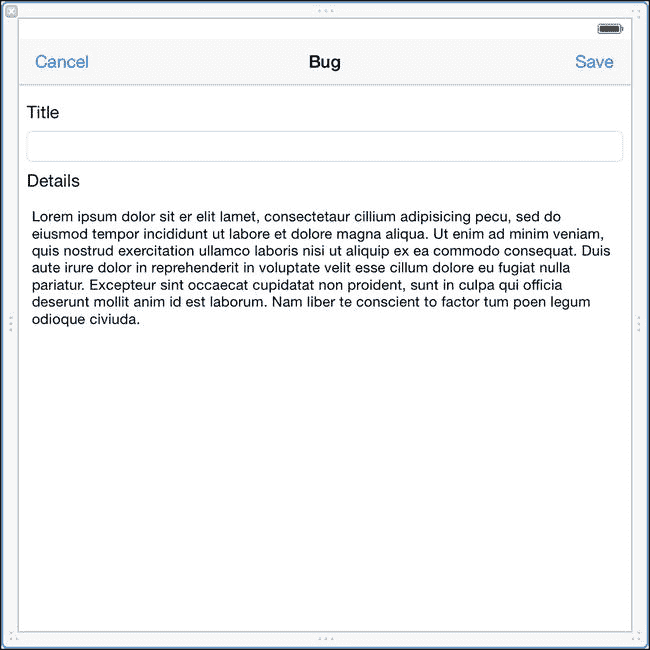

图 5-8. 添加和编辑 Bug 屏幕

## 显示用于添加 Bug 的屏幕


当用户点击 + 按钮添加新 Bug 时，会调用`DetailViewController.m`或`DetailViewController.swift`中的`insertNewObject:`方法。我们需要更新`insertNewObject:`以显示`BugViewController`实例。如果使用 Objective-C，请在`DetailViewController.m`中导入`BugViewController.h`。

```objective-c
#import "BugViewController.h"
```

然后，修改`insertNewObject:`以显示添加/编辑 Bug 屏幕，如列表 5-62（Objective-C）和列表 5-63（Swift）所示。

***列表 5-62***. 更新后的 `insertNewObject:` 方法（Objective-C）

```objective-c
- (void)insertNewObject:(id)sender {
  BugViewController *bugViewController = [[BugViewController alloc] initWithBug:nil project:self.project];
  [self presentViewController:bugViewController animated:YES completion:nil];
}
```

***列表 5-63***. 更新后的 `insertNewObject:` 函数（Swift）

```swift
func insertNewObject(sender: AnyObject?) {
  let bugViewController = BugViewController(project: self.project!, andBug: nil)
  self.presentViewController(bugViewController, animated: true, completion: nil)
}
```

### 显示用于编辑 Bug 的 Bug 屏幕

当用户点击表格中某行的详情披露附件时，会调用`UITableViewDelegate`的`tableView:accessoryButtonTappedForRowWithIndexPath:`方法。在该方法中，我们想要显示 Bug 屏幕，但此时需要传递所点击行的`Bug`对象。列表 5-64（Objective-C）和列表 5-65（Swift）展示了`tableView:accessoryButtonTappedForRowWithIndexPath:`的实现。

***列表 5-64***. `tableView:accessoryButtonTappedForRowWithIndexPath:` 方法（Objective-C）

```objective-c
- (void)tableView:(UITableView *)tableView accessoryButtonTappedForRowWithIndexPath:(NSIndexPath *)indexPath {
  Bug *bug = [self sortedBugs][indexPath.row];
  BugViewController *bugViewController = [[BugViewController alloc] initWithBug:bug project:self.project];
  [self presentViewController:bugViewController animated:YES completion:nil];
}
```

***列表 5-65***. `tableView:accessoryButtonTappedForRowWithIndexPath:` 函数（Swift）

```swift
override func tableView(tableView: UITableView, accessoryButtonTappedForRowWithIndexPath indexPath: NSIndexPath) {
  let bug = sortedBugs()?[indexPath.row]
  let bugViewController = BugViewController(project: self.project!, andBug: bug)
  self.presentViewController(bugViewController, animated: true, completion: nil)
}
```

### 显示和添加 Bug

您现在应该能够运行 CoreDump，深入查看项目，并添加和编辑 Bug。图 5-9 显示了项目的 Bug 列表。

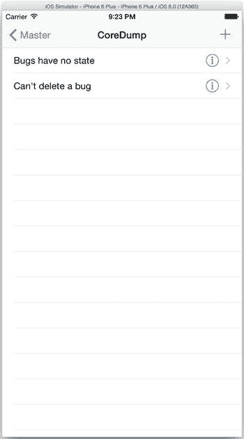

图 5-9. 一个 Bug 列表

### 存储图片

Core Data 提供了二进制数据类型（Binary Data）用于存储任何格式的二进制数据，因此它似乎是存储图片的自然选择。这种方法可行，并且在处理小图片时，效果可能不错。然而，在 Core Data 中存储较大的图片可能会导致性能问题，因为任何对这些托管对象的访问都必须加载图片数据，无论它们是否被使用。

为了解决在 Core Data 的二进制数据属性中存储图片可能带来的性能问题，许多开发人员选择将图片存储在应用程序 Documents 目录的文件中，然后在 Core Data 中为每个图片存储路径（String 属性）。这种方法同样有效，其优势在于访问托管对象时不会将整个图片加载到内存中。相反，您可以仅在需要时显式加载图片。这种两步法加载图片（先从 Core Data 获取图片路径，再从磁盘加载图片）有两个缺点：

*   代码会变得稍微复杂一些，并且
*   应用程序运行速度可能会稍慢，尤其是在加载多张小图片的情况下。

那么，应该使用哪种方法呢？应该将图片存储在 Core Data 的二进制数据属性中吗？还是应该将图片存储在磁盘上，只在 Core Data 中存储其路径的字符串属性？为什么必须要由您来决定？iPhone 和 iPad 不也是计算机吗？计算机不是更擅长决定这类事情吗？

从 iOS 5.0 开始，您确实可以让 Core Data 为您做这个决定。如果您的属性类型是二进制数据（Binary Data），在 Xcode 建模器中会出现一个标记为 **Allows External Storage** 的复选框，如图 5-10 所示。此复选框对应于`NSAttributeDescription`的`allowsExternalBinaryDataStorage`属性。如果选中该框，Core Data 将决定是将您的图片（或任何其他类型的二进制数据）存储在数据存储内部还是外部文件中，并且它将无缝管理所有访问。

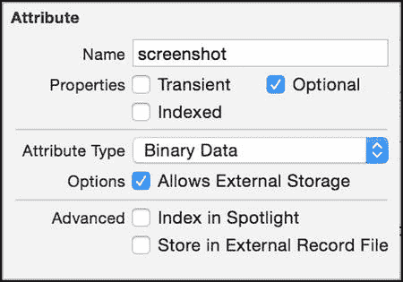

图 5-10. 在属性检查器中将属性设置为“允许外部存储”

### 向 CoreDump 添加截图

对 Bug 的文本描述可以帮助开发者了解出问题的地方以及需要修复的内容，但显示 Bug 及其后果的实际截图确实能提供很大帮助。在接下来的几个部分中，我们将为 CoreDump 中的 Bug 添加存储截图的功能。

#### 更新模型以存储图片

我们希望能为 CoreDump 中的每个`Bug`托管对象存储一个可选的截图。我们还希望利用 Core Data 无缝决定是将每个图片存储在 Core Data 存储内部还是外部记录中的能力。打开 Core Data 模型，向`Bug`实体添加一个名为`screenshot`的属性。将其设置为可选，类型设置为二进制数据（Binary Data）。勾选“允许外部存储”（Allows External Storage）复选框。最后，重新生成`Bug`类文件。请注意，截至撰写本文时，即使您选择替换现有文件，Xcode 实际上也不会重新生成文件，因此请务必检查文件是否包含了新的`screenshot`属性。列表 5-66 显示了更新后的头文件，列表 5-67（Objective-C）和列表 5-68（Swift）显示了更新后的实现文件。可以看出，唯一的区别是新增了一个名为`screenshot`、类型为`NSData`的属性。类文件中没有任何地方提到允许外部存储，或者对象是在 Core Data 存储中还是在单独的文件中。这些都是 Core Data 模型和运行时的一部分，您无需处理这些复杂性。如果您愿意，可以打开文件`CoreDump.xcdatamodeld/CoreDump.xcdatamodel/contents`，您会看到类似以下的行已被添加：

```xml
<attribute name="screenshot" optional="YES" attributeType="Binary" allowsExternalBinaryDataStorage="YES" syncable="YES"/>
```

您可以看到`screenshot`属性的`allowsExternalBinaryDataStorage`属性已被设置为`YES`。

***列表 5-66***. `Bug.h`


```objc
#import <Foundation/Foundation.h>
#import <CoreData/CoreData.h>

@class Project;

@interface Bug : NSManagedObject

@property (nonatomic, retain) NSString * title;
@property (nonatomic, retain) NSString * details;
@property (nonatomic, retain) NSData * screenshot;
@property (nonatomic, retain) Project *project;

@end
```

***列表 5-67***. `Bug.m`

```objc
#import "Bug.h"
#import "Project.h"

@implementation Bug

@dynamic title;
@dynamic details;
@dynamic screenshot;
@dynamic project;

@end
```

***列表 5-68***. `Bug.swift`

```swift
import Foundation
import CoreData

@objc(Bug)
class Bug: NSManagedObject {

@NSManaged var title: String
    @NSManaged var details: String
    @NSManaged var screenshot: NSData
    @NSManaged var project: Project

}
```

## 为用户界面添加截图

为截图更新用户界面涉及以下使用场景：

- 在 Bug 视图中，我可以添加或替换截图。
- 在 Bug 视图中，我可以查看当前的截图。

为了实现这些用户故事，我们向 Bug 视图屏幕添加一个 `UIImageView` 实例，用于显示存储在 `screenshot` 属性中的图像。同时，我们将该 `UIImageView` 设置为可点击。当用户点击时，允许从照片库中选择一张图像，并将其存储到 `screenshot` 中。在 Interface Builder 中打开 `BugViewController.xib`，调整 Details 文本框的宽度，以便在键盘显示时，旁边可以放置一个 Image 视图，且两者都能可见。然后，将图像视图拖入视图中，如图 5-11 所示，并务必勾选“用户交互已启用”复选框。

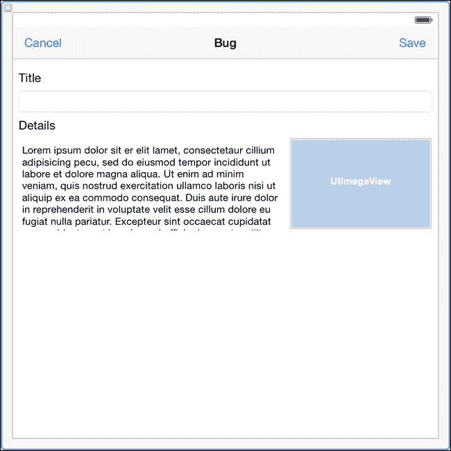

**图 5-11**. 向 Bug 视图添加 Image 视图

在 `BugViewController.h` 或 `BugViewController.swift` 中，你需要完成两件事。

- 添加一个输出口（`IBOutlet`）来连接你刚添加到视图中的 Image 视图。
- 声明 `BugViewController` 遵循 `UINavigationControllerDelegate` 和 `UIImagePickerControllerDelegate` 协议，以便在用户点击 Image 视图时允许他们选择图像。

更新后的 `BugViewController.h` 应与列表 5-69 一致，更新后的 `BugViewController.swift` 应与列表 5-70 一致。

***列表 5-69***. 包含输出口和协议声明的 `BugViewController.h`

```objc
#import <UIKit/UIKit.h>

@class Bug;
@class Project;

@interface CDBugViewController : UIViewController <UINavigationControllerDelegate, UIImagePickerControllerDelegate>

@property (strong, nonatomic) Bug *bug;
@property (strong, nonatomic) Project *project;
@property (weak, nonatomic) IBOutlet UITextField *bugTitle;
@property (weak, nonatomic) IBOutlet UITextView *details;
@property (weak, nonatomic) IBOutlet UIImageView *screenshot;

...

@end
```

***列表 5-70***. 包含输出口和协议声明的 `BugViewController.swift`

```swift
class BugViewController: UIViewController, UINavigationControllerDelegate, UIImagePickerControllerDelegate {

var project: Project? = nil
  var bug: Bug? = nil

@IBOutlet weak var bugTitle: UITextField!
  @IBOutlet weak var details: UITextView!
  @IBOutlet weak var screenshot: UIImageView!
  ...
}
```

在 Interface Builder 中，将 `screenshot` 输出口连接到 Image 视图。然后，打开 `BugViewController.m` 或 `BugViewController.swift` 来实现图像相关的代码。你需要编写代码完成以下操作：

- 在 Image 视图周围显示边框，以便在内容为空时也能清楚看到。
- 在 Image 视图中显示选中的图像。
- 在保存 Bug 时将图像保存到 Core Data。
- 当用户点击 Image 视图时启动图像选择器。
- 当用户关闭图像选择器时，妥善处理保存或取消操作。

列表 5-71 展示了 `BugViewController.m` 的更新内容，列表 5-72 展示了 `BugViewController.swift` 的更新内容。

***列表 5-71***. 在 `BugViewController.m` 中处理截图

```objc
#import "BugViewController.h"
#import "Project.h"
#import "Bug.h"

@interface BugViewController ()

@end

@implementation BugViewController

- (id)initWithBug:(Bug *)bug project:(Project *)project {
  self = [super init];
  if (self) {
    self.bug = bug;
    self.project = project;
  }
  return self;
}

- (void)viewWillAppear:(BOOL)animated {
  [super viewWillAppear:animated];
  if (self.bug != nil) {
    self.bugTitle.text = self.bug.title;
    self.details.text = self.bug.details;
    self.screenshot.image = [UIImage imageWithData:self.bug.screenshot];
  } else {
    self.details.text = @"";
  }
}

- (void)viewDidLoad {
  [super viewDidLoad];

self.screenshot.layer.borderColor = [UIColor blackColor].CGColor;
  self.screenshot.layer.borderWidth = 1.0f;

UITapGestureRecognizer *tapGestureRecognizer = [[UITapGestureRecognizer alloc] initWithTarget:self action:@selector(screenshotTapped:)];
  [self.screenshot addGestureRecognizer:tapGestureRecognizer];
}

- (void)didReceiveMemoryWarning
{
  [super didReceiveMemoryWarning];
  // 释放任何可以重新创建的资源。
}

- (void)screenshotTapped:(id)sender {
  UIImagePickerController *imagePickerController = [[UIImagePickerController alloc] init];
  imagePickerController.delegate = self;
  imagePickerController.sourceType = UIImagePickerControllerSourceTypePhotoLibrary;
  imagePickerController.allowsEditing = YES;
  [self presentViewController:imagePickerController animated:YES completion:nil];
}

- (IBAction)cancel:(id)sender {
  [self dismissViewControllerAnimated:YES completion:nil];
}

- (IBAction)save:(id)sender {
  if (self.bug == nil) {
    self.bug = [NSEntityDescription insertNewObjectForEntityForName:@"Bug" inManagedObjectContext:self.project.managedObjectContext];
  }

self.bug.project = self.project;
  self.bug.title = self.bugTitle.text;
  self.bug.details = self.details.text;
  self.bug.screenshot = UIImagePNGRepresentation(self.screenshot.image);

// 保存上下文。
  NSError *error = nil;
  if (![self.project.managedObjectContext save:&error]) {
    // 将此处实现替换为处理错误的适当代码。
    // abort() 会导致应用生成崩溃日志并终止。虽然开发过程中可能有用，但你不应在发布应用中使用此函数。
    NSLog(@"未解决错误 %@, %@", error, [error userInfo]);
    abort();
  }

[self dismissViewControllerAnimated:YES completion:nil];
}

#pragma mark - 图像选择器
- (void)imagePickerControllerDidCancel:(UIImagePickerController *)picker {
  [self dismissViewControllerAnimated:YES completion:nil];
}

- (void)imagePickerController:(UIImagePickerController *)picker didFinishPickingMediaWithInfo:(NSDictionary *)info {
  [self dismissViewControllerAnimated:YES completion:nil];
  UIImage *image = info[UIImagePickerControllerEditedImage];

dispatch_async(dispatch_get_main_queue(), ^{
    self.screenshot.image = image;
  });
}

@end
```

***列表 5-72***. 在 `BugViewController.swift` 中处理截图

```swift
import UIKit
import CoreData

class BugViewController: UIViewController, UINavigationControllerDelegate, UIImagePickerControllerDelegate {

var project: Project? = nil
  var bug: Bug? = nil

@IBOutlet weak var bugTitle: UITextField!
  @IBOutlet weak var details: UITextView!
  @IBOutlet weak var screenshot: UIImageView!

convenience init(project: Project, andBug bug: Bug?) {
    self.init(nibName: "BugViewController", bundle: nil)

self.project = project
    self.bug = bug
  }

override func viewWillAppear(animated: Bool) {
    super.viewWillAppear(animated)
```


```swift
if let bug = self.bug {
    self.bugTitle.text = bug.title
    self.details.text = bug.details
    self.screenshot.image = UIImage(data: bug.screenshot)
} else {
    self.details.text = ""
}
```

```swift
override func viewDidLoad() {
    super.viewDidLoad()

    self.screenshot.layer.borderColor = UIColor.blackColor().CGColor
    self.screenshot.layer.borderWidth = 1

    let tapGestureRecognizer = UITapGestureRecognizer(target: self, action: Selector("screenshotTapped:"))
    self.screenshot.addGestureRecognizer(tapGestureRecognizer)
}
```

```swift
override func didReceiveMemoryWarning() {
    super.didReceiveMemoryWarning()
    // Dispose of any resources that can be recreated.
}
```

```swift
func screenshotTapped(recognizer: UITapGestureRecognizer) {
    let imagePickerController = UIImagePickerController()
    imagePickerController.delegate = self
    imagePickerController.sourceType = .PhotoLibrary
    imagePickerController.allowsEditing = true
    self.presentViewController(imagePickerController, animated: true, completion: nil)
}
```

```swift
@IBAction func cancel(sender: AnyObject) {
    self.dismissViewControllerAnimated(true, completion: nil)
}
```

```swift
@IBAction func save(sender: AnyObject) {
    if let context = self.project?.managedObjectContext {
        if bug == nil {
            self.bug = NSEntityDescription.insertNewObjectForEntityForName("Bug", inManagedObjectContext: context) as? Bug
        }

        self.bug?.project = self.project!
        self.bug?.title = self.bugTitle.text
        self.bug?.details = self.details.text
        if self.screenshot.image != nil {
            self.bug?.screenshot = UIImagePNGRepresentation(self.screenshot.image)
        }

        var error: NSError? = nil
        if context.hasChanges && !context.save(&error) {
            // Replace this implementation with code to handle the error appropriately.
            // abort() causes the application to generate a crash log and terminate. You should not use this function in a shipping application, although it may be useful during development.
            NSLog("Unresolved error \(error), \(error!.userInfo)")
            abort()
        }
    }

    self.dismissViewControllerAnimated(true, completion: nil)
}
```

```swift
func imagePickerControllerDidCancel(picker: UIImagePickerController) {
    self.dismissViewControllerAnimated(true, completion: nil)
}
```

```swift
func imagePickerController(picker: UIImagePickerController, didFinishPickingMediaWithInfo info: [NSObject : AnyObject]) {
    self.dismissViewControllerAnimated(true, completion: nil)
    let image = info[UIImagePickerControllerEditedImage] as UIImage

    dispatch_async(dispatch_get_main_queue(), { () -> Void in
        self.screenshot.image = image
    })
}
```

启动`CoreDump`应用，添加一个 bug，然后使用你的新界面为该 bug 添加一张截图。你的 bug 视图应类似于图 5-12。

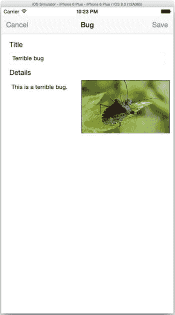

图 5-12 带有截图的 Bug

## 验证外部存储

根据你选择的图片大小，Core Data 可能已将截图作为外部记录存储，并在 SQLite 数据库中有一个唯一标识符。如果文件已存储在外部，你可以在与 SQLite 数据库文件相同的目录下的一个子目录中找到它，该目录名为 `.CoreDump_SUPPORT/_EXTERNAL_DATA`。例如，对于图 5-12 中截图所示的 bug，我们可以看到 Core Data 在 SQLite 中存储了一个指向外部文件的标识符。

```
sqlite> select * from zbug;1|1|5|1|This is a terrible bug|Terrible Bug|FC88541E-A362-40E2-8680-5D4553764B86
```

我们可以在 `.CoreDump_SUPPORT/_EXTERNAL_DATA/FC88541E-A362-40E2-8680-5D4553764B86` 处看到该文件，并能在预览中打开它，确认它确实是我们存储的图片。

## 在表格中搜索获取的结果

如果主视图中有很多项目，你可能会难以找到要查找的项目。用户希望能够搜索数据并过滤结果，以缩小结果集并更快地定位目标。对于表格中的搜索，iOS 8 弃用了旧的搜索栏和搜索显示控制器（`UISearchDisplayController`），并引入了一个用于搜索的新类：`UISearchController`。在接下来的几节中，我们将展示如何使用`UISearchController`为`CoreDump`的主视图添加搜索功能。

### 添加搜索控制器

Interface Builder 尚未添加新的`UISearchController`，因此你必须通过代码添加这种搜索支持。首先在`MasterViewController.h`或`MasterViewController.swift`中声明`MasterViewController`遵循`UISearchResultsUpdating`协议。在编辑该文件时，为`UISearchController`实例添加一个名为`searchController`的属性。另外，出于我们稍后将说明的原因，添加一个属性来存储一个`NSPredicate`实例，我们称之为`searchPredicate`。列表 5-73（Objective-C）和列表 5-74（Swift）展示了这些更改。

***列表 5-73*** 为`UISearchController`更新`MasterViewController.h`（Objective-C）

```
@interface MasterViewController : UITableViewController <NSFetchedResultsControllerDelegate, UISearchResultsUpdating>
...
@property (strong, nonatomic) UISearchController *searchController;
@property (strong, nonatomic) NSPredicate *searchPredicate;
...
@end
```

***列表 5-74*** 为`UISearchController`更新`MasterViewController.swift`（Swift）

```
class MasterViewController: UITableViewController, NSFetchedResultsControllerDelegate, UISearchResultsUpdating {
  ...
  var searchController: UISearchController!
  var searchPredicate: NSPredicate? = nil
  ...
}
```

在你的`viewDidLoad:`方法中，创建`UISearchController`实例并将其分配给`searchController`。初始化器接受一个参数，用于指定显示搜索结果的视图控制器；传递`nil`将在你正在搜索的同一视图中显示结果，在我们的例子中，就是显示项目的表格视图。我们还做了几件事：

- 告诉背景在搜索期间不要变暗
- 将搜索结果更新器（负责更新搜索结果的类）设置为我们的`MasterViewController`实例
- 调整搜索栏的大小以适配
- 将搜索栏设置为表格的标题
- 将表格视图的委托设置为我们的`MasterViewController`实例，这样无论是否正在搜索，都能处理点击事件
- 将自身设置为定义演示上下文

列表 5-75 展示了 Objective-C 的`viewDidLoad:`方法，列表 5-76 展示了 Swift 的`viewDidLoad:`函数。

***列表 5-75*** 创建 UISearchController（Objective-C）

```
- (void)viewDidLoad {
  [super viewDidLoad];

  self.navigationItem.leftBarButtonItem = self.editButtonItem;

  UIBarButtonItem *addButton = [[UIBarButtonItem alloc] initWithBarButtonSystemItem:UIBarButtonSystemItemAdd target:self action:@selector(insertNewObject:)];
  self.navigationItem.rightBarButtonItem = addButton;

  // 创建搜索控制器，由该控制器显示搜索结果
  self.searchController = [[UISearchController alloc] initWithSearchResultsController:nil];
  self.searchController.dimsBackgroundDuringPresentation = NO;
  self.searchController.searchResultsUpdater = self;
  [self.searchController.searchBar sizeToFit];
  self.tableView.tableHeaderView = self.searchController.searchBar;
  self.tableView.delegate = self;
  self.definesPresentationContext = YES;
}
```

***列表 5-76*** 创建 UISearchController（Swift）


```
override func viewDidLoad() {
  super.viewDidLoad()

self.navigationItem.leftBarButtonItem = self.editButtonItem()

let addButton = UIBarButtonItem(barButtonSystemItem: .Add, target: self, action: "insertNewObject:")
  self.navigationItem.rightBarButtonItem = addButton

// Create the search controller with this controller displaying the search results
  self.searchController = UISearchController(searchResultsController: nil)
  self.searchController.dimsBackgroundDuringPresentation = false
  self.searchController.searchResultsUpdater = self
  self.searchController.searchBar.sizeToFit()
  self.tableView.tableHeaderView = self.searchController?.searchBar
  self.tableView.delegate = self
  self.definesPresentationContext = true
}
```

## 检索搜索结果

不要急于返回 Core Data 存储区来获取搜索查询的结果。互联网上充斥着关于创建第二个获取结果控制器来检索搜索结果的建议，但这并非必要。你已经有了一个包含所有待搜索结果的获取结果控制器。你只需要将结果集从所有对象缩小到与搜索查询匹配的对象即可。

获取结果控制器有一个名为 `fetchedObjects` 的属性，其中包含所有结果。我们可以利用该属性以及关于谓词的知识，将获取到的对象过滤为仅与搜索查询匹配的对象。对于 CoreDump 应用，当用户搜索时，我们只想显示那些名称或 URL 包含搜索文本（不区分大小写）的项目。我们在 `MasterViewController` 上创建一个名为 `updateSearchResultsForSearchController:` 的新方法，以履行我们对遵循 `UISearchResultsUpdating` 协议的承诺。当搜索栏获得焦点或搜索文本发生变化时，会调用此方法，它会创建执行过滤的谓词。它首先获取搜索文本（包含在 `self.searchController.searchBar.text` 中），如果找到任何文本，则创建一个适当的谓词并将其存储在 `searchPredicate` 中。然后，它会重新加载表格。代码清单 5-77（Objective-C）和代码清单 5-78（Swift）展示了 `updateSearchResultsForSearchController:` 方法。

### 代码清单 5-77. 在 `MasterViewController.m` 中创建搜索谓词

```
- (void)updateSearchResultsForSearchController:(UISearchController *)searchController {
  NSString *searchText = self.searchController.searchBar.text;
  self.searchPredicate = searchText.length == 0 ? nil : [NSPredicate predicateWithFormat:@"name contains[c] %@ or url contains[c] %@", searchText, searchText];

[self.tableView reloadData];
}
```

### 代码清单 5-78. 在 `MasterViewController.swift` 中创建搜索谓词

```
func updateSearchResultsForSearchController(searchController: UISearchController) {
  let searchText = self.searchController?.searchBar.text
  if let searchText = searchText {
    self.searchPredicate = searchText.isEmpty ? nil : NSPredicate(format: "name contains[c] %@ or url contains[c] %@", searchText, searchText)

self.tableView.reloadData()
  }
}
```

## 显示搜索结果

由于我们使用同一个表格来显示常规结果和搜索结果，为了在两者之间切换，我们需要更新表格视图数据源中的方法，以检查 `searchPredicate` 是否为非 `nil`。如果 `searchPredicate` 非 `nil`，则将其应用于获取结果控制器中的 `fetchedObjects` 属性。否则，我们使用现有的获取结果控制器代码。

对于搜索结果，我们不进行分区，因此我们希望只有一个分区且不带分区标题。代码清单 5-79（Objective-C）和代码清单 5-80（Swift）展示了更新后的 `numberOfSectionsInTableView:` 和 `tableView:titleForHeaderInSection:` 方法，它们根据是否有搜索谓词返回不同的结果。

### 代码清单 5-79. 设置表格视图的分区（Objective-C）

```
- (NSInteger)numberOfSectionsInTableView:(UITableView *)tableView {
  return self.searchPredicate == nil ? [[self.fetchedResultsController sections] count] : 1;
}

- (NSString *)tableView:(UITableView *)tableView titleForHeaderInSection:(NSInteger)section {
  if (self.searchPredicate == nil) {
    id <NSFetchedResultsSectionInfo> sectionInfo = [self.fetchedResultsController sections][section];
    return [sectionInfo name];
  } else {
    return nil;
  }
}
```

### 代码清单 5-80. 设置表格视图的分区（Swift）

```
override func numberOfSectionsInTableView(tableView: UITableView) -> Int {
  return self.searchPredicate == nil ? self.fetchedResultsController.sections?.count ?? 0 : 1
}

override func tableView(tableView: UITableView, titleForHeaderInSection section: Int) -> String? {
  if self.searchPredicate == nil {
    let sectionInfo = self.fetchedResultsController.sections![section] as NSFetchedResultsSectionInfo
    return sectionInfo.name
  } else {
    return nil
  }
}
```

为了确定某个分区的行数，我们再次检查 `searchPredicate` 是否非 `nil`，以决定是否将谓词应用于获取结果控制器的已获取对象。代码清单 5-81（Objective-C）和代码清单 5-82（Swift）展示了更新后的 `tableView:numberOfRowsInSection:` 方法。

### 代码清单 5-81. 返回分区的行数（Objective-C）

```
- (NSInteger)tableView:(UITableView *)tableView numberOfRowsInSection:(NSInteger)section {
  if (self.searchPredicate == nil) {
    id <NSFetchedResultsSectionInfo> sectionInfo = [self.fetchedResultsController sections][section];
    return [sectionInfo numberOfObjects];
  } else {
    return [[self.fetchedResultsController.fetchedObjects filteredArrayUsingPredicate:self.searchPredicate] count];
  }
}
```

### 代码清单 5-82. 返回分区的行数（Swift）

```
override func tableView(tableView: UITableView, numberOfRowsInSection section: Int) -> Int {
  if self.searchPredicate == nil {
    let sectionInfo = self.fetchedResultsController.sections![section] as NSFetchedResultsSectionInfo
    return sectionInfo.numberOfObjects
  } else {
    let filteredObjects = self.fetchedResultsController.fetchedObjects?.filter() {
      return self.searchPredicate!.evaluateWithObject($0)
    }
    return filteredObjects == nil ? 0 : filteredObjects!.count
  }
}
```

对于返回要在表格中显示的单元格，我们保持现有的 `tableView:cellForRowAtIndexPath:` 方法不变，只需要更新 `configureCell:atIndexPath:` 方法，以决定是从过滤后的还是未过滤的已获取对象中获取项目，同样取决于是否存在搜索谓词。代码清单 5-83（Objective-C）和代码清单 5-84（Swift）展示了如何实现。

### 代码清单 5-83. 配置单元格（Objective-C）


```objc
- (void)configureCell:(UITableViewCell *)cell atIndexPath:(NSIndexPath *)indexPath {
  Project *project = nil;
  if (self.searchPredicate == nil) {
    project = [self.fetchedResultsController objectAtIndexPath:indexPath];
  } else {
    project = [self.fetchedResultsController.fetchedObjects filteredArrayUsingPredicate:self.searchPredicate][indexPath.row];
  }
  cell.textLabel.text = project.name;
  cell.detailTextLabel.text = project.url;
}
```

***代码清单 5-84*** 配置单元格 (Objective-C)

```swift
func configureCell(cell: UITableViewCell, atIndexPath indexPath: NSIndexPath) {
  let project = self.searchPredicate == nil ?
    self.fetchedResultsController.objectAtIndexPath(indexPath) as Project :
      self.fetchedResultsController.fetchedObjects?.filter() {
          return self.searchPredicate!.evaluateWithObject($0)
      }[indexPath.row] as Project

cell.textLabel.text = project.name
  cell.detailTextLabel?.text = project.url
}
```

由于我们不允许编辑搜索结果，我们更新 `tableView:canEditRowAtIndexPath:` 方法，使其仅在搜索谓词为 `nil` 时返回 `YES` 或 `true`，如代码清单 5-85 (Objective-C) 和代码清单 5-86 (Swift) 所示。

***代码清单 5-85*** 仅允许对未过滤结果进行编辑 (Objective-C)

```objc
- (BOOL)tableView:(UITableView *)tableView canEditRowAtIndexPath:(NSIndexPath *)indexPath {
  return self.searchPredicate == nil;
}
```

***代码清单 5-86*** 仅允许对未过滤结果进行编辑 (Swift)

```swift
override func tableView(tableView: UITableView, canEditRowAtIndexPath indexPath: NSIndexPath) -> Bool {
  return self.searchPredicate == nil
}
```

由于我们不允许在搜索视图中编辑，我们可以忽略所有响应表格视图处于编辑模式的方法。

你需要做的最后一个修改是 `prepareForSegue:sender:` 方法，以获取正确的项目并设置到详情控制器中。与 `configureCell:atIndexPath:` 方法一样，你通过检查搜索谓词是否存在来决定是否使用过滤后的对象。代码清单 5-87 (Objective-C) 和代码清单 5-88 (Swift) 展示了更新后的 `prepareForSegue:sender:` 方法。

***代码清单 5-87*** 点击项目时处理过滤后的结果 (Objective-C)

```objc
- (void)prepareForSegue:(UIStoryboardSegue *)segue sender:(id)sender {
  if ([[segue identifier] isEqualToString:@"showDetail"]) {
    NSIndexPath *indexPath = [self.tableView indexPathForSelectedRow];
    Project *project = nil;
    if (self.searchPredicate == nil) {
      project = [self.fetchedResultsController objectAtIndexPath:indexPath];
    } else {
      project = [self.fetchedResultsController.fetchedObjects filteredArrayUsingPredicate:self.searchPredicate][indexPath.row];
    }
    [[segue destinationViewController] setProject:project];
  }
}
```

***代码清单 5-88*** 点击项目时处理过滤后的结果 (Swift)

```swift
override func prepareForSegue(segue: UIStoryboardSegue, sender: AnyObject?) {
  if segue.identifier == "showDetail" {
    if let indexPath = self.tableView.indexPathForSelectedRow() {

let project = self.searchPredicate == nil ?
        self.fetchedResultsController.objectAtIndexPath(indexPath) as Project :
        self.fetchedResultsController.fetchedObjects?.filter() {
          return self.searchPredicate!.evaluateWithObject($0)
          }[indexPath.row] as Project

(segue.destinationViewController as DetailViewController).project = project
    }
  }
}
```

你现在应该可以运行 CoreDump 并使用搜索栏来过滤结果，如图 5-13 所示。

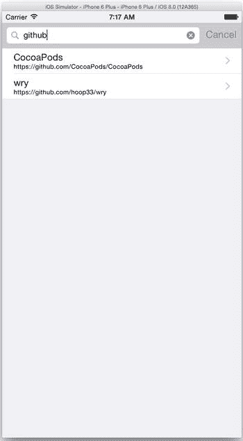

图 5-13 搜索“github”

## 总结

CoreDump 应用程序远称不上完整，但它演示了如何轻松地将来自 Core Data 存储的数据和图像集成到基于表格视图的应用程序中。由于大多数 iOS 应用程序都使用表格和图像，你将在应用程序开发中多次使用获取结果控制器和外部记录来创建性能良好的应用程序。

