# 数据版本控制与迁移

在开发基于 Core Data 的应用程序时，你通常无法在第一次就完全正确地设计出数据模型。你从创建一个看似满足应用数据需求的数据模型开始，但随着开发的深入，你常常会发现数据模型需要变更，以适应你对应用程序功能日益增长的愿景。在应用生命周期的这个阶段，根据你对应用数据的新认识来修改数据模型代价很小：你的应用将无法启动，会在启动时崩溃并显示以下消息：

```
用于打开存储的模型与用于创建存储的模型不兼容。
```

你解决这个问题的方法要么是在文件系统中找到数据库文件并删除它，要么是从 iPhone 模拟器或设备上删除你尚在雏形中的应用。无论采用哪种方式，使用旧版模式（Schema）的数据库文件以及持久化存储中的数据都会消失，而你的应用程序在下次启动时会重新创建数据库文件。在应用开发过程中，你可能需要这样做多次。

然而，一旦你发布了应用程序，用户开始使用它，他们会在其设备上的持久化存储中积累他们认为重要的数据。如果每次你想发布一个带有修改后数据模型的新版本应用时，都要求用户删除他们的数据存储，你的应用会立刻被评为一星（甚至可能更低），评论者会谴责苹果的评分系统不允许零星或负星评级。

这是否意味着发布应用会冻结其数据模型？你的应用 1.0 版本的数据模型是永久性的？你最好在第一个公开版本中就做到数据模型完美无缺，因为以后再也无法更改？谢天谢地，并非如此。苹果预见到了在应用生命周期中改进 Core Data 模型的需求，并内置了机制，让你能够更改数据模型，然后将用户的数据迁移到新模型，整个过程无需苹果的干预甚至知晓。本章将介绍数据模型版本控制的流程以及跨版本的数据迁移，无论你对模型做了多么复杂的修改。

## 版本控制

为了利用 Core Data 对数据模型版本控制以及跨版本数据迁移的支持，你首先要显式地创建一个数据模型的新版本。为了说明其工作原理，让我们从第 4 章中再次引入 BookStore 应用程序。复制一份，因为你将在本章中多次更改它的数据模型。在 BookStore 的原始版本中，你创建了一个数据模型，该模型的外观如图 6-1 所示。

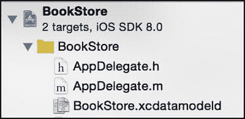

图 6-1 单版本数据模型
```


`BookStore.xcdatamodeld`包含数据模型，实际上是文件系统中的一个目录。它包含应用程序运行时创建 Core Data 存储所需的文件。由于对象模型只有一个版本，它自动成为当前版本。要添加新版本，请从 Xcode 菜单中选择 Editor  Add Model Version。此时会弹出一个面板，允许您输入版本名称并选择新版本所基于的模型，如图 6-2 所示。

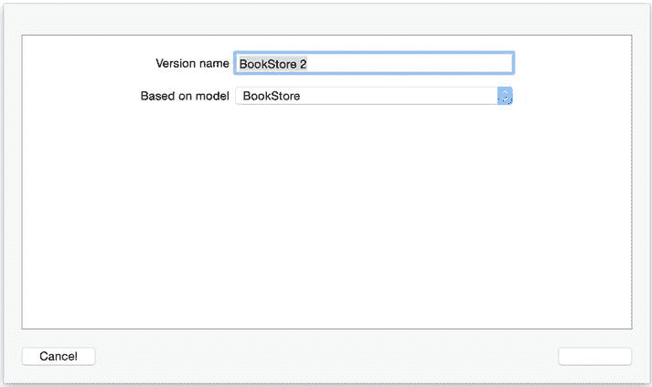

图 6-2. 创建新模型版本

接受默认设置并选择 Finish。Xcode 会在`BookStore.xcdatamodeld`内部创建一个名为`BookStore 2.xcdatamodel`的新目录，如图 6-3 所示。`BookStore.xcdatamodeld`下方的每个条目代表数据模型的一个版本；绿色勾选标记表示应用程序当前正在使用的版本。

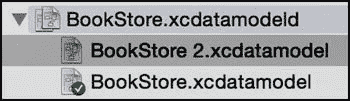

图 6-3. 包含两个版本的数据模型

您可以看到原始数据模型`BookStore.xcdatamodeld`是当前版本。在将当前版本从`BookStore.xcdatamodeld`更改为`BookStore 2.xcdatamodel`之前，请运行 BookStore 应用程序来创建书籍，以便有数据进行跨版本迁移。您需要在数据库中有数据来测试本章中的数据迁移是否正常工作。

最后，我们需要对 BookStore 应用程序进行一个小的更改。在第 4 章中，我们希望能够每次运行时都有干净的数据存储。由于我们现在想要测试迁移现有数据，需要确保旧数据存储在应用程序启动时不会被清除。打开`ViewController.m`或`ViewController.swift`，并编辑`viewDidAppear:`方法，注释掉以下代码行：

```
// [self initStore];// [self insertSomeData];
```

或

```
// self.initStore()
// self.insertSomeData()
```

再次启动应用程序，确保没有创建任何内容。它应该只显示`showExampleData`方法的输出。

```
Book fetched: The second bookTitle: The second book, price: 15.00Book fetched: The third bookTitle: The third book, price: 10.00Book fetched: The first bookTitle: The first book, price: 10.00Book fetched: The fourth bookTitle: The fourth book, price: 12.00
```

现在，假设您想要向`Book`实体添加一个新的`author`属性。如果您编辑当前模型并向`Book`实体添加`author`属性，您将会惊讶地发现应用程序在启动时崩溃。这是因为数据存储中的数据与新的 Core Data 模型不匹配。缓解此问题的一个方法是删除现有的数据存储。在开发应用程序时，这是一个可以接受的选项，但如果您的应用程序已经有用户在使用，这将会招致他们的愤怒。为了获得更流畅的体验，我们强烈建议对模型进行版本控制，并使用 Core Data 的迁移功能，通过将用户的数据从旧模型迁移到新模型来保留数据。您对数据模型所做的任何更改都应进入新版本的模型，而不是任何旧版本。这意味着，您需要在 BookStore 2 数据模型的`Book`实体中添加`name`属性。

要进行此更改，请选择 BookStore 2 数据模型，然后以常规方式向`Book`实体添加一个`String`类型的`author`属性。图 6-4 显示了 Xcode 窗口，其中包含新版本的 Core Data 模型以及添加到`Book`实体中的`author`属性。

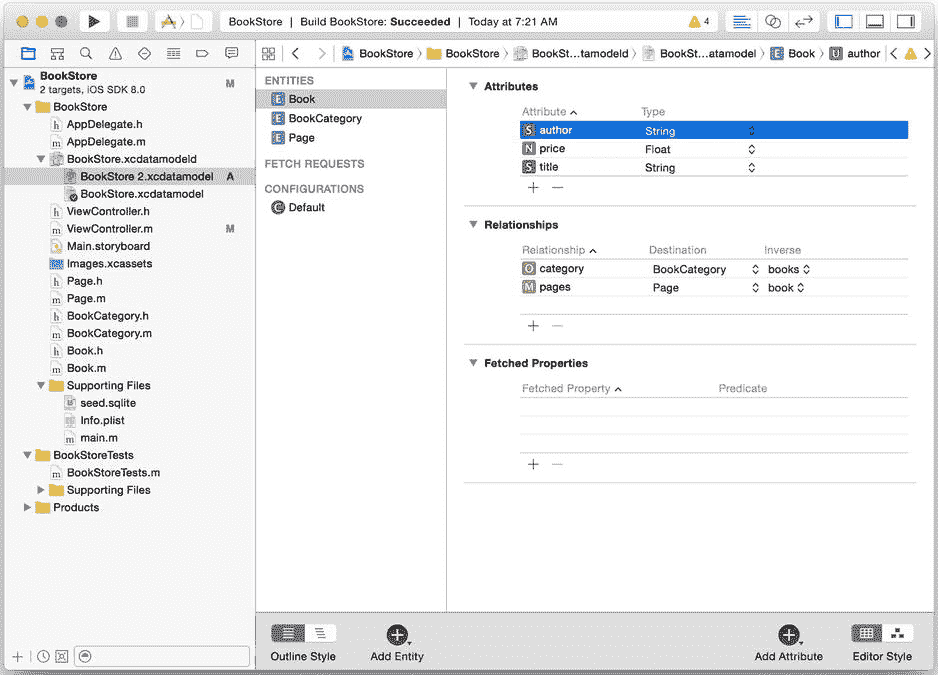

图 6-4. 包含模型第二个版本的 Xcode 窗口

要将模型的当前版本从 BookStore 更改为 BookStore 2，请选择`BookStore.xcdatamodeld`，并在 Utility 面板中将当前版本设置为 BookStore 2，如图 6-5 所示。

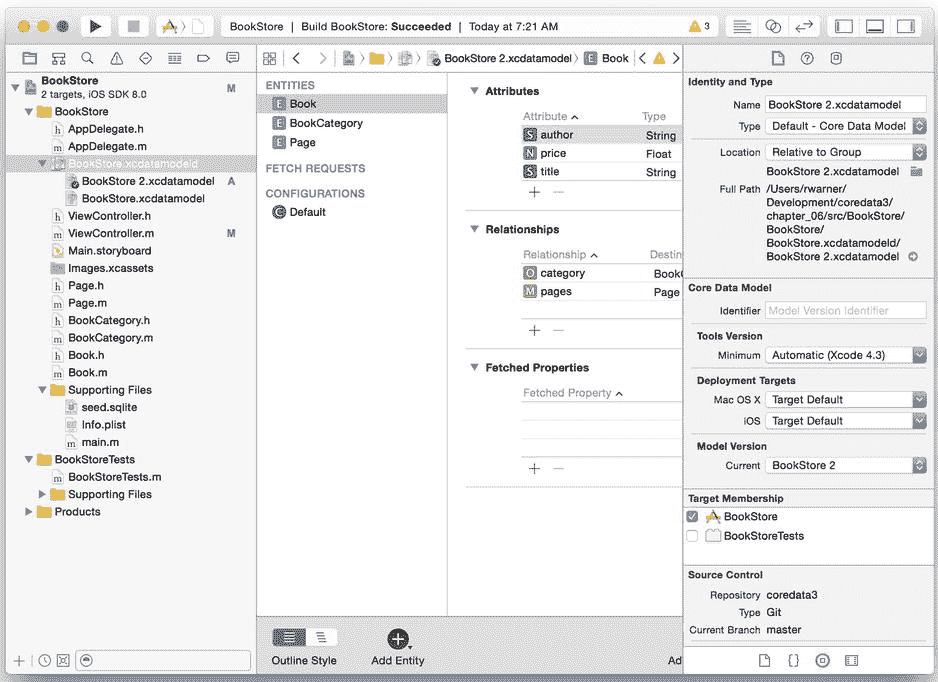

图 6-5. 将当前数据模型版本更新为 BookStore 2

此时，您的应用程序拥有一个新版本的当前数据模型，但尚未准备好运行。您需要定义一个策略，将数据从名为 BookStore 的模型版本迁移到名为 BookStore 2 的版本。如果您现在尝试运行应用程序，将会崩溃，因为就像更改第一个模型一样，数据存储与当前模型不匹配。需要告诉应用程序您希望它如何处理从旧模型到新模型的切换。本章的其余部分将讨论执行此操作的各种方法。

## 轻量级迁移

一旦您拥有版本化的数据模型，就可以利用 Core Data 对迁移的支持来演进您的数据模型。每次创建新的数据模型版本时，用户的应用程序数据都必须从旧数据模型迁移到新数据模型。为了进行迁移，Core Data 必须遵循规则来知道如何正确迁移数据。您可以使用“映射模型”来创建这些规则。Xcode 内置了对创建映射模型的支持。然而，对于某些简单的情况，Core Data 足够智能，可以自行推断出映射规则，而无需您创建映射模型。这些情况被称为轻量级迁移，对作为开发者的您而言工作量最小。Core Data 会完成所有工作并迁移数据。本节详细介绍了轻量级迁移过程，并逐步介绍了该过程支持的更改类型以及如何实现它们。

要使您的迁移符合轻量级迁移的条件，更改必须仅限于以下几类：

- 添加或删除属性（属性或关系）。
- 将非可选属性变为可选。
- 将可选属性变为非可选，前提是您提供了默认值。
- 添加或删除实体。
- 重命名属性。
- 重命名实体。

除了减少您的工作量之外，与使用 SQLite 数据存储的其他迁移相比，轻量级迁移运行速度更快，占用空间更少。由于 Core Data 可以发出 SQL 语句来执行这些迁移，因此它无需将所有数据加载到内存中即可进行迁移，也无需将数据从一个存储移动到另一个存储。Core Data 只需使用 SQL 语句就地修改 SQLite 数据库。如果可行，您应积极尝试将数据模型更改限制在轻量级迁移支持的范围内。如果不行，本章的其他部分将指导您完成更复杂的迁移。

## 迁移简单更改

在之前的“版本控制”部分中，您在 BookStore 应用程序中创建了一个名为 BookStore 2 的新模型版本，并在 BookStore 2 模型的`Book`实体中添加了一个名为`author`的新属性。使用此更改执行轻量级迁移的最后一步是告知持久化存储协调器两件事：

- 它应自动迁移模型。
- 它应推断映射模型。

您可以通过在持久化存储协调器的`addPersistentStoreWithType:`方法的`options`参数中传递这些指令来实现。首先按如下方式设置`options`（一个`字典`）：

```
NSDictionary *options = @{
  NSMigratePersistentStoresAutomaticallyOption: @YES,
  NSInferMappingModelAutomaticallyOption: @YES
}; // Objective-C 版本

let options = [NSMigratePersistentStoresAutomaticallyOption: true, NSInferMappingModelAutomaticallyOption: true] // Swift 版本
```

这段代码创建了一个包含两个条目的字典。


-   键为`NSMigratePersistentStoresAutomaticallyOption`、值为`YES`或`true`的选项，它告诉持久化存储协调器自动迁移数据。
-   键为`NSInferMappingModelAutomaticallyOption`、值为`YES`或`true`的选项，它告诉持久化存储协调器推断映射模型。

然后，你将这个`options`对象（而不是`nil`）作为`options`参数传递给`addPersistentStoreWithType:`调用。打开`AppDelegate.m`文件或`AppDelegate.swift`文件，将`persistentStoreCoordinator`方法修改为代码清单 6-1（Objective-C）所示的样子，或者将`managedObjectContext`闭包中初始化`persistentStoreCoordinator`的代码修改为代码清单 6-2（Swift）所示的样子。

**代码清单 6-1**. 创建带有迁移选项的持久化存储协调器 (Objective-C)

```
- (NSPersistentStoreCoordinator *)persistentStoreCoordinator {
    if (_persistentStoreCoordinator != nil) {
        return _persistentStoreCoordinator;
    }

_persistentStoreCoordinator = [[NSPersistentStoreCoordinator alloc] initWithManagedObjectModel:[self managedObjectModel]];
    NSURL *storeURL = [[self applicationDocumentsDirectory] URLByAppendingPathComponent:@"BookStoreEnhanced.sqlite"];

NSDictionary *options = @{
      NSMigratePersistentStoresAutomaticallyOption: @YES,
      NSInferMappingModelAutomaticallyOption: @YES
    };

NSError *error = nil;
    if (![_persistentStoreCoordinator addPersistentStoreWithType:NSSQLiteStoreType configuration:nil URL:storeURL options:options error:&error]) {
      [self showCoreDataError];
    }

return _persistentStoreCoordinator;
}
```

**代码清单 6-2**. 创建带有迁移选项的持久化存储协调器 (Swift)

```
// 初始化持久化存储协调器
let storeURL = AppDelegate.applicationDocumentsDirectory.URLByAppendingPathComponent("BookStoreEnhancedSwift.sqlite")
var error: NSError? = nil
let persistentStoreCoordinator = NSPersistentStoreCoordinator(managedObjectModel: managedObjectModel!)

let options = [NSMigratePersistentStoresAutomaticallyOption: true, NSInferMappingModelAutomaticallyOption: true]

if(persistentStoreCoordinator.addPersistentStoreWithType(NSSQLiteStoreType, configuration: nil, URL: storeURL, options: options, error: &error) == nil) {
    self.showCoreDataError()
    return nil
}
```

迁移数据只需这些操作。构建并运行应用程序，它不再崩溃，而是显示你创建的所有书籍。打开终端，导航到包含 BookStore 应用程序 SQLite 文件的目录。与 iOS 5 之前仅保留数据库文件迁移前和迁移后两个版本的早期 iOS 版本不同，较新的 iOS 版本只保留迁移后的版本。你会找到迁移后的文件`BookStoreEnhanced.sqlite`。使用`sqlite3`应用程序打开它，并运行`.schema`命令来查看`ZBOOK`表的定义。你可以看到`BookStoreEnhanced.sqlite`文件为`name`属性添加了一列：`ZAUTHOR VARCHAR`，如下所示。

```
sqlite> .schema ZBOOKCREATE TABLE ZBOOK ( Z_PK INTEGER PRIMARY KEY, Z_ENT INTEGER, Z_OPT INTEGER, ZCATEGORY INTEGER, ZPRICE FLOAT, ZAUTHOR VARCHAR, ZTITLE VARCHAR);CREATE INDEX ZBOOK_ZCATEGORY_INDEX ON ZBOOK (ZCATEGORY);
```

## 重命名实体和属性

轻量级迁移也支持重命名实体和属性，但这需要你付出更多一点的努力。除了修改你的模型之外，你还必须指定已重命名项目的旧名称。你可以通过以下两种方式之一来完成此操作。

- 在 Xcode 数据建模器中
- 在代码中

Xcode 数据建模器是更简单的选择。当你在 Xcode 数据建模器中选择一个实体或属性时，该实体或属性的常规信息会显示在右侧的实用工具面板中。显示实用工具面板后，打开数据模型检查器，然后打开版本控制部分。在重命名 ID 字段中，输入你更改的任何内容的旧名称（请参见图 6-6）。

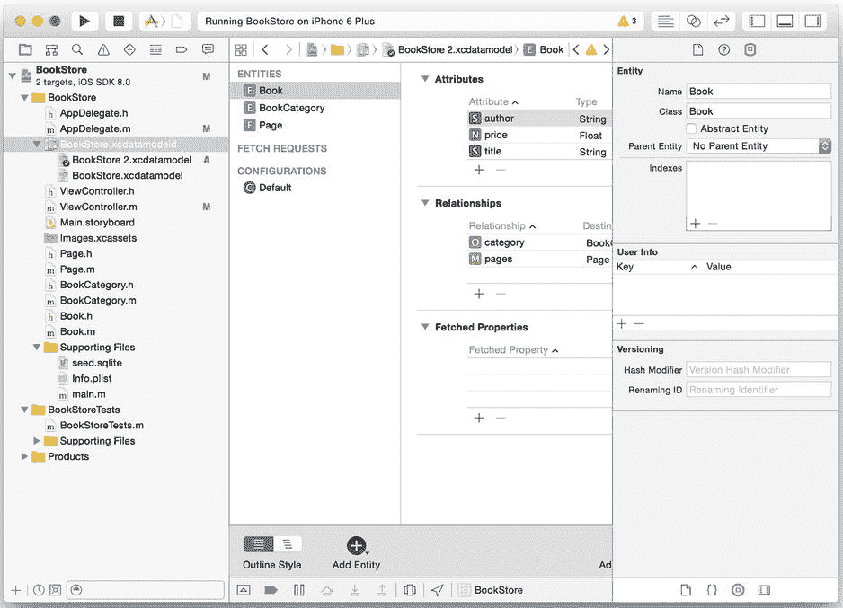

图 6-6. 带有重命名标识符字段的版本控制部分

如果你坚持要在代码中指定旧名称，则需要根据已重命名的内容，调用`NSEntityDescription`或`NSPropertyDescription`的`setRenamingIdentifier:`方法，并传入实体或属性的旧名称。你需要在模型加载之后、但在调用打开持久化存储（`addPersistentStoreWithType:`）之前执行此操作。例如，如果你想将`Book`实体的名称更改为`Publication`，你需要在调用`addPersistentStoreWithType:`之前添加以下代码：

```
// Objective-C
NSEntityDescription *publication = [[managedObjectModel entitiesByName] objectForKey:@"Publication"];
[publication setRenamingIdentifier:@"Book"];

// Swift
if let publication: NSEntityDescription? = managedObjectModel.entitiesByName["Publication"] as? NSEntityDescription {
  publication?.renamingIdentifier = "Book"
}
```

Core Data 负责迁移数据，但你仍有责任更新应用程序中任何依赖旧名称的代码。为了在实践中看到这一点，请基于 Bookstore 2 模型创建一个名为 Bookstore 3 的数据模型新版本，并将其设置为当前版本。你现在应该处于版本 3（BookStore 3）。在此版本的模型中，你将把`Book`实体重命名为`Publication`。进入你的新模型文件`BookStore 3.xcdatamodel`，将`Book`实体重命名为`Publication`。然后，转到数据模型检查器选项卡中的版本控制部分，在重命名 ID 字段中输入旧名称`Book`，以便 Core Data 知道如何迁移现有数据（如图 6-7 所示），并保存此模型。

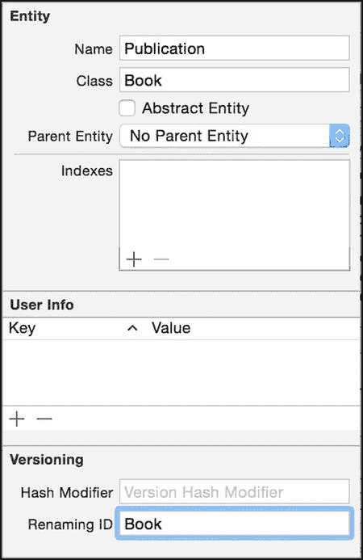

图 6-7. 将 Book 重命名为 Publication 并指定重命名 ID

等等！在运行应用程序之前，请记住，你有责任更改任何依赖旧名称`Book`的代码。你可以将自定义托管对象类名从`Book`更改为`Publication`，将`Page`实体中的关系名称从`book`更改为`publication`，并相应地更改任何变量名。为了简单起见，我们在这里只更改 BookStore 应用程序中引用`Book`实体名称的地方。你可以在`ViewController.m`或`ViewController.swift`中的`fetchRequestWithEntityName:`和`insertNewObjectForEntityForName:`调用中找到它们。在这些调用中，将实体名字符串从`Book`更改为`Publication`。

现在你可以构建并运行 BookStore 应用程序；所有现有的书籍应该仍然存在。你可以打开 SQLite 数据库，确认模式现在有一个`ZPUBLICATION`表。

```
CREATE TABLE ZPUBLICATION ( Z_PK INTEGER PRIMARY KEY, Z_ENT INTEGER, Z_OPT INTEGER, ZCATEGORY INTEGER, ZPRICE FLOAT, ZAUTHOR VARCHAR, ZTITLE VARCHAR);
```

并且没有`ZBOOK`表。

如你所见，轻量级迁移几乎不费力，至少对你来说是这样。Core Data 处理了弄清楚如何将数据从旧模型映射和迁移到新模型的艰巨工作。但是，如果你的模型更改超出了轻量级迁移所能处理的范围，则必须指定你自己的映射模型。

## 使用映射模型


当您的数据模型变更超出了 Core Data 推断如何将数据从旧模型映射到新模型的能力时，您无法使用轻量级迁移来自动迁移数据。相反，您必须创建一个“映射模型”来告诉 Core Data 如何执行迁移。本节将引导您完成为迁移创建映射模型所涉及的步骤。映射模型大致类似于数据模型——数据模型包含实体和属性，而映射模型（类型为`NSMappingModel`）包含实体映射（类型为`NSEntityMapping`）和属性映射（类型为`NSPropertyMapping`）。实体映射正如您所期望的那样：它们将源实体映射到目标实体。属性映射也同样如此：将源属性映射到目标属性。映射模型使用这些映射及其关联的类型和策略来执行迁移。

**注意**  Apple 的文档和代码中互换使用术语“destination”和“target”来指代新数据模型。在本章中，我们也遵循这一惯例，交替使用“destination”和“target”。

在典型的数据迁移中，大多数实体和属性从旧版本到新版本都没有改变。对于这些情况，实体映射只是将每个实体从源模型复制到目标模型。当您创建一个映射模型时，您会注意到 Xcode 会生成这些实体映射，以及它能够从您的模型变更中推断出的任何其他内容，并将这些映射存储在映射模型中。这些映射代表了 Core Data 在轻量级迁移中迁移数据的方式。您必须创建新的映射，或调整 Xcode 生成的映射，以更改数据的迁移方式。

## 理解实体映射

每个实体映射由`NSEntityMapping`实例表示，包含三部分内容：

*   一个源实体
*   一个目标实体
*   一个映射类型

当 Core Data 执行迁移时，它使用实体映射将源实体移动到目标实体，并使用映射类型来决定如何执行此操作。表 6-1 列出了映射类型、对应的 Core Data 常量及其含义。

| 类型 | Core Data 常量 | 含义 |
| :--- | :--- | :--- |
| Add | `NSAddEntityMappingType` | 该实体是目标模型中的新实体——它在源模型中不存在——并且应该被添加。 |
| Remove | `NSRemoveEntityMappingType` | 该实体在目标模型中不存在，应该被移除。 |
| Copy | `NSCopyEntityMappingType` | 该实体在源模型和目标模型中均存在且未改变，应原样复制。 |
| Transform | `NSTransformEntityMappingType` | 该实体在源模型和目标模型中都存在，但有所变更。该映射告诉 Core Data 如何将每个源实例迁移到目标实例。 |
| Custom | `NSCustomEntityMappingType` | 该实体在源模型和目标模型中都存在，但有所变更。 |

该映射告诉 Core Data 如何将每个源实例迁移到目标实例。`Add`、`Remove` 和 `Copy` 类型不太引人关注，因为轻量级迁移能处理这些实体映射类型。然而，`Transform` 和 `Custom` 类型正是本书本节存在的必要原因。它们告诉 Core Data，每个源实体实例必须根据任何指定的规则，转换为目标实体的实例。在本章中，您将看到 `Transform` 和 `Custom` 实体映射类型的示例。如果您为实体的某个属性指定了值表达式，则该实体映射属于 `Transform` 类型。如果您为实体映射指定了自定义迁移策略，则该实体映射变为 `Custom` 类型。在本章的学习过程中，请注意 Core Data 映射建模器根据您所做的更改对映射模型进行的类型更改。要为 `Custom` 实体映射类型指定规则，您需要创建一个迁移策略，即您编写的继承自`NSEntityMigrationPolicy`的类。然后，您在 Xcode 映射建模器中将您创建的类设置为该实体映射的自定义策略。

Core Data 分三个阶段运行您的迁移：

1.  它根据源模型中的对象，在目标模型中创建对象，包括它们的属性。
2.  它在目标模型中的对象之间创建关系。
3.  它验证目标模型中的数据并保存它们。

您可以通过自定义策略来定制 Core Data 如何执行这三个步骤。`NSEntityMigrationPolicy`类有七个方法，您可以重写它们来定制 Core Data 如何将数据从源实体迁移到目标实体，尽管您很少会重写所有方法。这些方法列在`NSEntityMigrationPolicy`类的 Apple 文档中，它们在迁移过程中的各个阶段提供了您可以重写和更改 Core Data 迁移行为的地方。您可以根据需要重写其中任意数量（或少或多）的方法，尽管一个不重写任何方法的自定义迁移策略是没有意义的。通常，如果您想更改目标实例的创建方式或属性填充数据的方式，您会重写`createDestinationInstancesForSourceInstance:`。如果您想自定义目标实体与其他实体之间的关系如何创建，您会重写`createRelationshipsForDestinationInstance:`。最后，如果您想在迁移过程中执行任何自定义验证，您会重写`performCustomValidationForEntityMapping:`。

`createDestinationInstancesForSourceInstance:`方法带有一个注意事项：如果您没有调用超类的实现（您很可能不会调用，因为您重写此方法是为了更改默认行为），则必须调用迁移管理器的`associateSourceInstance:withDestinationInstance:forEntityMapping:`方法来将源实例与目标实例关联起来。忘记执行此操作将导致迁移出现问题。您将在本章后面部分，通过 BookStore 应用程序，学习调用此方法的正确方式。

## 理解属性映射

属性映射与实体映射类似，它告诉 Core Data 如何将源数据迁移到目标数据。属性映射是`NSPropertyMapping`的一个实例，包含以下三部分内容：

*   源实体中属性的名称
*   目标实体中属性的名称
*   一个值表达式，告诉 Core Data 如何从源数据得到目标数据

要更改属性映射迁移数据的方式，您需要为属性映射提供值表达式。值表达式遵循与谓词相同的语法，并使用以下六个预定义的键来帮助检索值：


*   `$manager`，代表迁移管理器
*   `$source`，代表源实体
*   `$destination`，代表目标实体
*   `$entityMapping`，代表实体映射
*   `$propertyMapping`，代表属性映射
*   `$entityPolicy`，代表实体迁移策略

如你所见，这些键的名称使其用途易于推断。在创建映射模型时，你可以探索 Xcode 从源数据模型和目标数据模型中推断出的属性映射，从而更好地理解这些键的含义及其使用方式。

最简单的值表达式是将一个属性从源实体复制到目标实体。例如，如果你有一个 `Person` 实体，它有一个 `name` 属性，并且该 `Person` 实体在你的新旧模型版本之间没有变化，那么 `PersonToPerson` 实体映射中 `name` 属性的值表达式将如下所示：

```
$source.name
```

你也可以使用值表达式对源数据进行操作。例如，假设同一个 `Person` 实体有一个名为 `salary` 的属性，用于存储每个人的薪水。在新模型中，你想给每个人加薪 4%。你的值表达式将如下所示：

```
$source.salary*1.04
```

由于属性既代表属性也代表关系，因此属性映射同时代表属性和关系的映射。关系的一个典型值表达式是调用一个函数，传递迁移管理器、目标实例、实体映射以及源关系的名称。例如，如果你的旧数据模型在 `Person` 实体中有一个名为 `staff` 的关系，表示所有向此人汇报的人，并且你的新模型将此关系重命名为 `reports`，那么 `reports` 属性的值表达式将如下所示：

```
FUNCTION($manager, "destinationInstancesForEntityMappingNamed:sourceInstances:", "PersonToPerson", $source.staff)
```

请注意，你使用 `$manager` 键来传递迁移管理器，从实体映射中获取源实例的目标实例，传递适当的实体映射（`PersonToPerson`），并传递从 `$source` 键中获取的旧关系。

## 创建需要映射模型的新模型版本

轻量级迁移通常足够，你真的不需要深入了解 Core Data 迁移的机制。然而，有些时候你需要稍微“弄脏手”来帮助框架弄清楚该做什么。例如，当你意识到自己一直很懒，将本应拆分成多个字段的数据合并到了一个字段中时，就是这种情况。以 `author` 字段为例，它本应包含作者的全名（例如，John Doe）。如果你突然意识到想将其拆分为 `firstName` 和 `lastName` 字段，就必须创建一个映射模型。这正是我们将在本节中要做的事情。

在开始迁移之前，让我们花点时间填充 `Publication` 表中的 `author` 字段，以便有一些数据可以迁移。

打开 `ViewController.m` 或 `ViewController.swift`，并添加一个名为 `populateAuthors` 的新方法，如代码清单 6-3（Objective-C）和代码清单 6-4（Swift）所示。

***代码清单 6-3***. 填充作者（Objective-C）
```
- (void)populateAuthors {
  // 1. 创建一个要分配的作者名称列表
  NSArray *authors = @[@"John Doe", @"Jane Doe", @"Bill Smith", @"Jack Brown"];

// 2. 从数据存储中获取所有出版物
  NSFetchRequest *fetchRequest = [NSFetchRequest fetchRequestWithEntityName:@"Publication"];
  NSArray *books = [self.managedObjectContext executeFetchRequest:fetchRequest error:nil];
  for(int i=0; i<books.count; i++) {
    Book *book = books[i];
    book.price = 20+i;

// 3. 使用我们创建的数组中的名称之一设置作者
    [book setValue:authors[i % authors.count] forKey:@"author"];
  }

// 4. 将所有内容提交到存储
  [self saveContext];
}
```

***代码清单 6-4***. 填充作者（Swift）
```
func populateAuthors() {
    // 1. 创建一个要分配的作者名称列表
    let authors = ["John Doe", "Jane Doe", "Bill Smith", "Jack Brown"]

// 2. 从数据存储中获取所有出版物
    let fetchRequest = NSFetchRequest(entityName: "Publication")
    let books = self.managedObjectContext?.executeFetchRequest(fetchRequest, error: nil)
    if let books = books {
        for var i = 0; i<books.count; i++ {
            var book = books[i] as Book
            book.price = 20 + Float(i)
            // 3. 使用我们创建的数组中的名称之一设置作者
            book.setValue(authors[i % authors.count], forKeyPath: "author")
        }
    }

// 4. 将所有内容提交到存储
    saveContext()
}
```

请注意，我们还修改了价格，确保它大约为 15 美元，这样就不会触发我们在 BookStore 原始版本中设定的验证规则。

最后，编辑 `viewDidAppear:` 方法，使其看起来像代码清单 6-5（Objective-C）或代码清单 6-6（Swift）。

***代码清单 6-5***. 调用填充作者方法（Objective-C）
```
- (void)viewDidAppear:(BOOL)animated {
  [super viewDidAppear:animated];
  [self populateAuthors];
  [self showExampleData];
}
```

***代码清单 6-6***. 调用填充作者方法（Swift）
```
override func viewDidAppear(animated: Bool) {
    super.viewDidAppear(animated)
    if let managedObjectContext = self.managedObjectContext {
        self.populateAuthors()
        self.showExampleData()
    }
}
```

在运行应用程序之前，你可以在 `.sqlite` 数据库中看到 `author` 字段是空的。

```
sqlite> select ztitle,zauthor,zprice from zpublication;

ZTITLE              ZAUTHOR      ZPRICE    
---------------     --------     ----------
The second book     NULL         20.0
The third book      NULL         21.0
The first book      NULL         22.0
The fourth book     NULL         23.0
```

启动应用程序一次，然后再次运行相同的查询。

```
sqlite> select ztitle,zauthor,zprice from zpublication;

ZTITLE              ZAUTHOR      ZPRICE    
---------------     --------     ----------
The second book     John Doe     20.0
The third book      Jane Doe     21.0
The first book      Bill Smith   22.0
The fourth book     Jack Brown   23.0
```

现在回到 `viewDidAppear:` 中，移除对 `populateAuthors:` 的调用。

我们现在准备创建模型的新版本。继续创建数据模型的新版本；你应该升级到版本 4。在新模型（`BookStore 4.xcdatamodel`）中，在 `Publication` 实体中，删除 `author` 属性并创建两个新属性：`firstName` 和 `lastName`。两者都应具有 `String` 类型。你的模型应类似于图 6-8 所示。

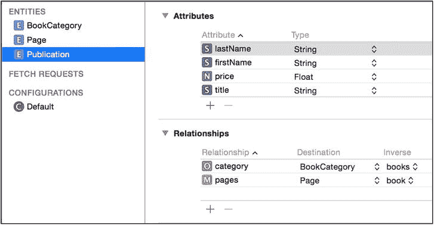

图 6-8. 在新模型中拆分两个字段


让我们花点时间，也确保实体类与新字段保持同步。如果你在 Objective-C 中执行此项目，请打开 `Book.h`，并添加两个新属性 `firstName` 和 `lastName` 的声明，如代码清单 6-7 所示。然后在 `Book.m` 中为这些属性添加动态访问器，如代码清单 6-8 所示。如果你使用的是 Swift，请将 `firstName` 和 `lastName` 的代码添加到 `Book.swift` 中，如代码清单 6-9 所示。

**代码清单 6-7**. 向 `Book.h` 添加 `firstName` 和 `lastName` 属性

```
@property (nonatomic, retain) NSString *firstName;
@property (nonatomic, retain) NSString *lastName;
```

**代码清单 6-8**. 向 `Book.m` 添加动态访问器

```
@dynamic firstName;
@dynamic lastName;
```

**代码清单 6-9**. 向 `Book.swift` 添加 `firstName` 和 `lastName`

```
@NSManaged var firstName: String
@NSManaged var lastName: String
```

模型和实体类都已更新完毕。现在我们继续进入迁移部分。

## 创建映射模型

要创建映射模型，请在 Xcode 中创建一个新文件。在随之弹出的对话框中，在左侧的 iOS 下选择 **Core Data**，在右侧选择 **Mapping Model**，如图 6-9 所示。点击 **Next**。

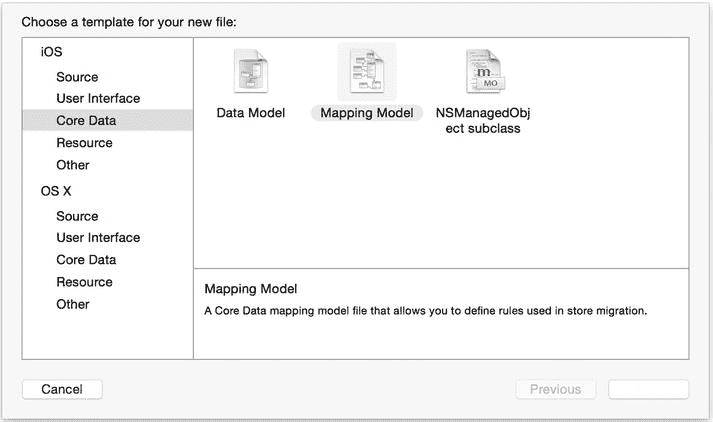

图 6-9. 创建映射模型文件

下一步是选择源模型。选择 `BookStore 3.xcdatamodel`，如图 6-10 所示，然后点击 **Next**。接着系统会要求你选择目标模型。选择 `BookStore 4.xcdatamodel` 作为目标模型，如图 6-11 所示，然后点击 **Next**。最后一步是为映射模型命名。将其命名为 `Model3To4.xcmappingmodel`，然后点击 **Create**。

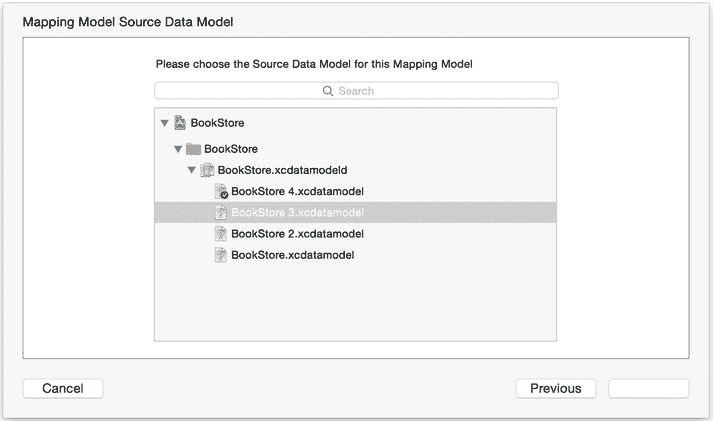

图 6-10. 选择源数据模型

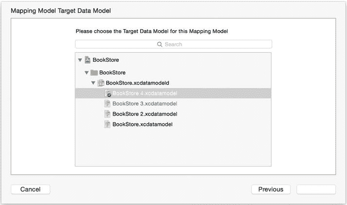

图 6-11. 选择目标数据模型

你现在应该能看到 Xcode 已创建好你的映射模型，其中包含了 Core Data 能推断出的所有实体映射和属性映射，如图 6-12 所示。

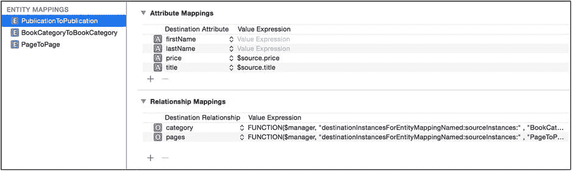

图 6-12. 新的映射模型

请注意，Xcode 已经做了一些工作来帮助进行迁移。创建映射模型让你处于与轻量级迁移相同的起点，提供了 Core Data 能从源数据模型和目标数据模型中推断出的映射。在找到匹配的实体时，它会自动将新的属性值设置为源属性的副本。由于我们移除了 `author` 属性并添加了两个新属性，它不太清楚该怎么做。这就需要你介入了。

下一步是自定义映射模型以迁移出版物。首先创建你将使用的自定义策略，该策略是 `NSEntityMigrationPolicy` 的子类。创建一个名为 `PublicationToPublicationMigrationPolicy` 的新 Cocoa Touch 类，该类继承自 `NSEntityMigrationPolicy`，如图 6-13 所示。

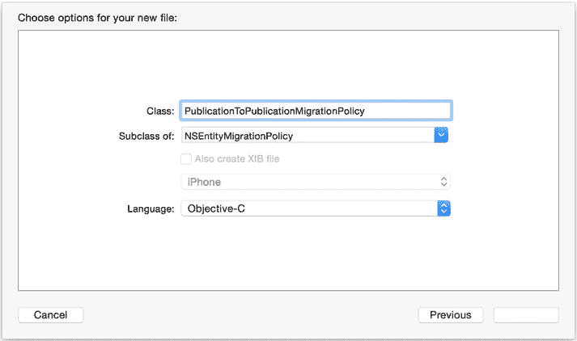

图 6-13. 创建新的迁移策略

在实现文件中（`PublicationToPublicationMigrationPolicy.m` 或 `PublicationToPublicationMigrationPolicy.swift`），你需要重写 `createDestinationInstancesForSourceInstance:` 方法。在执行迁移时，Core Data 每次要从一个源 `Publication` 实例创建一个 `Publication` 实例时，都会调用此方法。在你的实现中，你需要创建一个 `Publication` 实例，复制价格和标题，并将名字和姓氏分开。当然，我们的姓名分割方法有点粗糙，但这与主题无关。这个简单的实现将完美地说明我们想要做什么。

最后，你需要告诉迁移管理器源 `Publication` 实例与目标新 `Publication` 实例之间的关系，这是确保迁移正确进行的重要步骤。代码清单 6-10 展示了 Objective-C 版本，代码清单 6-11 展示了 Swift 版本。

**代码清单 6-10**. 自定义迁移映射 (Objective-C)

```
- (BOOL)createDestinationInstancesForSourceInstance:(NSManagedObject *)sourceInstance entityMapping:(NSEntityMapping *)mapping manager:(NSMigrationManager *)manager error:(NSError **)error {
  // 创建 book 托管对象
  NSManagedObject *book =
  [NSEntityDescription insertNewObjectForEntityForName:[mapping destinationEntityName]

inManagedObjectContext:[manager destinationContext]];
  [book setValue:[sourceInstance valueForKey:@"title"] forKey:@"title"];
  [book setValue:[sourceInstance valueForKey:@"price"] forKey:@"price"];

// 从源数据获取作者名字
  NSString *author = [sourceInstance valueForKey:@"author"];

// 将作者名字拆分为名字和姓氏
  NSRange firstSpace = [author rangeOfString:@" "];
  NSString *firstName = [author substringToIndex:firstSpace.location];
  NSString *lastName = [author substringFromIndex:firstSpace.location+1];

// 将名字和姓氏设置到 book 中
  [book setValue:firstName forKey:@"firstName"];
  [book setValue:lastName forKey:@"lastName"];

// 为迁移管理器建立旧 Publication 与新 Publication 之间的关联
  [manager associateSourceInstance:sourceInstance withDestinationInstance:book     forEntityMapping:mapping];
  return YES;
}
```

**代码清单 6-11**. 自定义迁移映射 (Swift)

```
override func createDestinationInstancesForSourceInstance(sInstance: NSManagedObject!, entityMapping mapping: NSEntityMapping!, manager: NSMigrationManager!, error: NSErrorPointer) -> Bool {
    // 创建 book 托管对象

var book = NSEntityDescription.insertNewObjectForEntityForName(mapping.destinationEntityName, inManagedObjectContext: manager.destinationContext) as NSManagedObject!

book.setValue(sInstance.valueForKey("title"), forKey: "title")
    book.setValue(sInstance.valueForKey("price"), forKey: "price")

// 从源数据获取作者名字
    let author = sInstance.valueForKey("author") as String?

// 将作者名字拆分为名字和姓氏
    let firstSpace = author?.rangeOfString(" ")
    if let firstSpace = firstSpace {
        let firstName = author?.substringToIndex(firstSpace.startIndex)
        let lastName = author?.substringFromIndex(firstSpace.endIndex)

// 将名字和姓氏设置到 book 中
        book.setValue(firstName, forKeyPath: "firstName")
        book.setValue(lastName, forKeyPath: "lastName")
    }

// 为迁移管理器建立旧 Publication 与新 Publication 之间的关联
    manager.associateSourceInstance(sInstance, withDestinationInstance: book, forEntityMapping: mapping)
    return true
}
```


### 排版后的内容

请注意，我们并未复制发布关系。在 `NSEntityMigrationPolicy` 的 `createRelationshipsForDestinationInstance:` 方法中，默认情况下关系会被复制。通过不重写该方法，我们让 Core Data 自动帮我们复制这些关系。

现在让我们回到映射模型。选择名为 `PublicationToPublication` 的实体映射。在右侧面板中，将自定义策略设置为 `PublicationToPublicationMigrationPolicy`（即我们刚刚创建的那个），如图 6-14 所示。

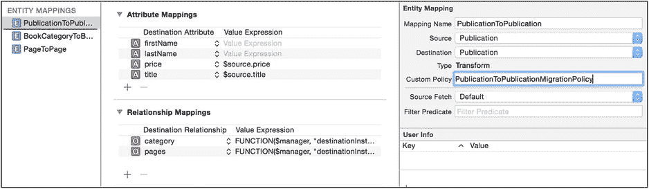

图 6-14。将新的迁移策略设置为映射模型

您的映射模型已准备好执行迁移。然而，与轻量级迁移一样，您需要在应用委托中添加一些代码，以告诉 Core Data 执行迁移。

## 迁移数据

创建映射模型是执行轻量级迁移无法处理的迁移的关键步骤，但您仍然需要执行实际的迁移。本节将解释如何操作，然后更新 BookStore 应用的代码以实际运行迁移。到本节结束时，您将得到一个 BookStore 应用，其中包含之前的所有书籍，但此时作者的名字和姓氏已被正确拆分。

告诉 Core Data 使用您创建的映射模型从旧模型迁移到新模型，与告诉 Core Data 使用轻量级迁移类似。正如您之前所学，告诉 Core Data 执行轻量级迁移的方式是传递一个选项字典，其中包含两个键，其值为 `YES` 或 `true`。

- `NSMigratePersistentStoresAutomaticallyOption`
- `NSInferMappingModelAutomaticallyOption`

第一个键告诉 Core Data 自动迁移数据，第二个键告诉 Core Data 推断映射模型。

对于使用您创建的映射模型进行迁移，您显然希望 Core Data 仍然自动执行迁移，因此您仍然将 `NSMigratePersistentStoresAutomaticallyOption` 设置为 `YES 或 true`。然而，由于您已经创建了映射模型，您不希望 Core Data 推断任何内容；您希望它使用您的映射模型。因此，您将 `NSInferMappingModelAutomaticallyOption` 设置为 `NO 或 false`，或者将其完全从选项字典中省略。

那么，如何指定 Core Data 用于执行迁移的映射模型呢？是在选项字典中设置吗？是通过某种方式传递给持久化存储协调器的 `addPersistentStoreWithType:` 方法吗？是将其设置到持久化存储协调器中？还是设置到托管对象模型或上下文中？

答案（可能有点令人惊讶）是：您什么都不用做。Core Data 会自行解决。它会搜索您的映射模型，找到适合从源模型迁移到目标模型的模型，并使用它。这使迁移变得异常简单。

## 运行您的迁移

要运行 BookStore 数据存储的迁移，请打开 `AppDelegate.m` 文件或 `AppDelegate.swift` 文件，并从选项字典中移除 `NSInferMappingModelAutomaticallyOption` 键。这就是让 Core Data 使用您的映射模型 `Model3To4.xcmappingmodel` 迁移数据所需的全部操作。如果尚未设置，请将当前模型版本设置为 `BookStore 4`，然后构建并运行 BookStore 应用；您应该会看到数据库中之前拥有的所有书籍。只是这一次，如果您查看数据存储，将会看到名称已被正确拆分：

```
sqlite> select ztitle,zfirstname,zlastname,zprice from zpublication;

ZTITLE           ZFIRSTNAME  ZLASTNAME   ZPRICE    
---------------  ----------  ----------  ----------
The second book  John        Doe         20.0      
The third book   Jane        Doe         21.0      
The fourth book  Jack        Brown       23.0      
The first book   Bill        Smith       22.0
```

## 自定义迁移

在大多数数据迁移案例中，使用默认的三步迁移过程（创建目标对象、创建关系、验证并保存）就足够了。数据对象会从前一版本在新数据存储中创建，然后所有关系被创建，最后数据被验证并持久化。然而，在某些情况下，您希望在迁移过程中进行干预。这时就需要自定义迁移。通常，当数据变更超出简单地将数据从旧实体移动到新实体时，您就需要考虑自定义迁移。例如，当迁移的顺序很重要，或者您希望让用户了解迁移进度的状态时，就是这样。

控制迁移过程的初始化意味着您需要执行所有通常由 Core Data 为您完成的工作。这意味着您需要执行以下操作：

- 确保确实需要迁移。
- 设置迁移管理器。
- 通过将模型拆分为独立部分来运行迁移。

本节将逐步介绍一个自定义迁移示例，向您展示如何进行非平凡的迁移。在迁移过程中，我们将在控制台日志中显示进度。

为此示例设置场景。首先，创建数据模型的新版本。此时您应该拥有 `BookStore 5.xcdatamodel`。在新模型中，我们做一些更改来触发迁移。打开 `Publication` 实体，添加一个名为 `synopsis` 的 `String` 类型的新属性。将 `BookStore 5.xcdatamodel` 设置为当前模型。

### 确保需要迁移

为了验证模型是否与持久化存储兼容，在将持久化存储添加到协调器之前，您可以使用 `NSManagedObjectModel` 类的 `isConfiguration:compatibleWithStoreMetadata:` 方法。可以通过使用协调器的 `metadataForPersistentStoreOfType:URL:error:` 方法查询协调器来检索数据存储的元数据。

打开 `AppDelegate.m` 或 `AppDelegate.swift`，编辑 `persistentStoreCoordinator` 的 getter 方法，如列表 6-12（Objective-C）或列表 6-13（Swift）所示。

***列表 6-12***。确定是否需要迁移（Objective-C）

```
- (NSPersistentStoreCoordinator *)persistentStoreCoordinator {
  if (_persistentStoreCoordinator != nil) {
      return _persistentStoreCoordinator;
  }

_persistentStoreCoordinator = [[NSPersistentStoreCoordinator alloc] initWithManagedObjectModel:[self managedObjectModel]];
  NSURL *storeURL = [[self applicationDocumentsDirectory] URLByAppendingPathComponent:@"BookStoreEnhanced.sqlite"];

NSError *error = nil;
  NSDictionary *sourceMetadata = [NSPersistentStoreCoordinator   metadataForPersistentStoreOfType:NSSQLiteStoreType URL:storeURL error:&error];

NSManagedObjectModel *destinationModel = [_persistentStoreCoordinator managedObjectModel];

BOOL pscCompatible = [destinationModel isConfiguration:nil   compatibleWithStoreMetadata:sourceMetadata];

if (!pscCompatible) {
    // 需要迁移

// ... 在此处执行迁移
  }

if (![_persistentStoreCoordinator addPersistentStoreWithType:NSSQLiteStoreType   configuration:nil URL:storeURL options:nil error:&error]) {
    [self showCoreDataError];
  }

return _persistentStoreCoordinator;
}
```

***列表 6-13***。确定是否需要迁移（Swift）


```swift
lazy var managedObjectContext: NSManagedObjectContext? = {
    // 初始化托管对象模型
    let modelURL = NSBundle.mainBundle().URLForResource("BookStoreSwift", withExtension: "momd")
    let managedObjectModel = NSManagedObjectModel(contentsOfURL: modelURL!)

    // 初始化持久化存储协调器
    let storeURL = AppDelegate.applicationDocumentsDirectory.URLByAppendingPathComponent("BookStoreEnhancedSwift.sqlite")

    var error: NSError? = nil
    let persistentStoreCoordinator = NSPersistentStoreCoordinator(managedObjectModel: managedObjectModel)

    let sourceMetadata = NSPersistentStoreCoordinator.metadataForPersistentStoreOfType(NSSQLiteStoreType, URL: storeURL, error: nil)

    let destinationModel = persistentStoreCoordinator.managedObjectModel
    let pscCompatible = destinationModel.isConfiguration(nil, compatibleWithStoreMetadata: sourceMetadata)

    if(!pscCompatible) {
        // 需要自定义迁移
        // ... 在此处执行迁移
    }

    if(persistentStoreCoordinator.addPersistentStoreWithType(NSSQLiteStoreType, configuration: nil, URL: storeURL, options: nil, error: &error) == nil) {
        self.showCoreDataError()
        return nil
    }

    var managedObjectContext = NSManagedObjectContext()
    managedObjectContext.persistentStoreCoordinator = persistentStoreCoordinator

    // 添加撤销管理器
    managedObjectContext.undoManager = NSUndoManager()

    return managedObjectContext
}()
```

如果不需要迁移，则可以直接将持久化存储注册到协调器。

## 设置迁移管理器

一旦确定确实需要迁移，下一步就是设置迁移管理器，它是`NSMigrationManager`的子类。为此，您需要检索与当前持久化存储匹配的模型：即模型的先前版本。此模型将作为迁移过程中的源模型。可以使用`mergedModelFromBundles:forStoreMetadata:`方法获取源模型，该方法会在应用程序主包中查找与给定元数据匹配的模型。

首先，创建一个扩展自`NSMigrationManager`的新类来创建自定义迁移管理器。在示例中，我们将它命名为`MyMigrationManager`。代码清单 6-14 显示了此新类的 Objective-C 头文件，代码清单 6-15 显示了 Objective-C 实现文件。代码清单 6-16 显示了 Swift 实现。迁移的实现重写了`associateSourceInstance:withDestinationInstance:forEntityMapping:`方法，该方法在迁移策略执行期间被调用，当为目标实例创建源实例时触发。您的实现会创建一个正在迁移的实例，并通过简单地复制`title`属性，在迁移过程中为实例分配`synopsis`属性。

***代码清单 6-14***. `MyMigrationManager.h`

```objc
#import <CoreData/CoreData.h>

@interface MyMigrationManager : NSMigrationManager

@end
```

***代码清单 6-15***. `MyMigrationManager.m`

```objc
#import "MyMigrationManager.h"
@implementation MyMigrationManager
- (void)associateSourceInstance:(NSManagedObject*)sourceInstance withDestinationInstance:(NSManagedObject *)destinationInstance forEntityMapping:(NSEntityMapping *)entityMapping {
    [super associateSourceInstance:sourceInstance withDestinationInstance:destinationInstance forEntityMapping:entityMapping];

    NSString *name = [entityMapping destinationEntityName];
    if([name isEqualToString:@"Publication"]) {
        NSString *title = [sourceInstance valueForKey:@"title"];
        [destinationInstance setValue:title forKey:@"synopsis"];
    }
}
@end
```

***代码清单 6-16***. `MyMigrationManager.swift`

```swift
import Foundation
import CoreData

class MyMigrationManager : NSMigrationManager {
    override func associateSourceInstance(sourceInstance: NSManagedObject, withDestinationInstance destinationInstance: NSManagedObject, forEntityMapping entityMapping: NSEntityMapping) {
        super.associateSourceInstance(sourceInstance, withDestinationInstance: destinationInstance, forEntityMapping: entityMapping)

        let name = entityMapping.destinationEntityName
        if name == "Publication" {
            let title = sourceInstance.valueForKey("title") as? String
            destinationInstance.setValue(title, forKeyPath: "synopsis")
        }
    }
}
```

## 运行迁移

在最后一步中，您需要将自定义类设置为负责执行迁移的管理器。对于 BookStore 的 Objective-C 版本，请在`AppDelegate.h`文件顶部添加`MyMigrationManager.h`的导入。对于 Objective-C 和 Swift，都需要添加一个新的`migrationManager`属性，如下所示：

```objc
@property (readonly, strong, nonatomic) MyMigrationManager *migrationManager; // Objective-C
```

```swift
var migrationManager: MyMigrationManager? // Swift
```

最后，在之前注明需要迁移并需要“在此处执行迁移”的位置，添加实际执行迁移的代码。代码清单 6-17 显示了 Objective-C 代码，代码清单 6-18 显示了 Swift 代码。

***代码清单 6-17***. 执行迁移（Objective-C）

```objc
if (!pscCompatible) {
    // 需要迁移
    NSManagedObjectModel *sourceModel = [NSManagedObjectModel mergedModelFromBundles:nil forStoreMetadata:sourceMetadata];
    _migrationManager = [[MyMigrationManager alloc] initWithSourceModel:sourceModel destinationModel:[self managedObjectModel]];
    [_migrationManager addObserver:self forKeyPath:@"migrationProgress" options:NSKeyValueObservingOptionNew context:NULL];
    NSMappingModel *mappingModel = [NSMappingModel inferredMappingModelForSourceModel:sourceModel destinationModel:[self managedObjectModel] error:nil];

    NSURL *tempURL = [[self applicationDocumentsDirectory] URLByAppendingPathComponent:@"BookStoreEnhanced-temp.sqlite"];

    if(![_migrationManager migrateStoreFromURL:storeURL
                                         type:NSSQLiteStoreType
                                       options:nil
                              withMappingModel:mappingModel
                              toDestinationURL:tempURL
                               destinationType:NSSQLiteStoreType
                            destinationOptions:nil
                                         error:&error]) {
        // 处理错误
        NSLog(@"%@", error);
    }
    else {
        // 删除旧存储，重命名新存储
        NSFileManager *fm = [NSFileManager defaultManager];
        [fm removeItemAtPath:[storeURL path] error:nil];
        [fm moveItemAtPath:[tempURL path] toPath:[storeURL path] error:nil];
    }
}
```

***代码清单 6-18***. 执行迁移（Swift）

```swift
if(!pscCompatible) {
    // 需要自定义迁移
    let sourceModel = NSManagedObjectModel.mergedModelFromBundles([NSBundle.mainBundle()], forStoreMetadata: sourceMetadata!)

    var appDelegate = UIApplication.sharedApplication().delegate as? AppDelegate

    let migrationManager = MyMigrationManager(sourceModel: sourceModel!, destinationModel: managedObjectModel!)

    migrationManager.addObserver(self, forKeyPath: "migrationProgress", options: .New, context: nil)

    appDelegate?.migrationManager = migrationManager

    let mappingModel = NSMappingModel.inferredMappingModelForSourceModel(sourceModel!, destinationModel: managedObjectModel!, error: nil)

    let tempURL = AppDelegate.applicationDocumentsDirectory.URLByAppendingPathComponent("BookStoreEnhancedSwift-temp.sqlite")
```


```swift
if !migrationManager.migrateStoreFromURL(storeURL, type: NSSQLiteStoreType, options:nil,     withMappingModel:mappingModel, toDestinationURL:tempURL, destinationType:NSSQLiteStoreType,     destinationOptions:nil, error:&error) {
        self.showCoreDataError()
        abort()
        //return nil
    }
    else {
        let fm = NSFileManager()
        fm.removeItemAtPath(storeURL.path!, error: nil)
        fm.moveItemAtPath(tempURL.path!, toPath: storeURL.path!, error: nil)
    }
}
```

注意，源和目标存储的 URL（统一资源定位符）是相同的，因为我们在为同一个持久化存储进行数据迁移。

我们还向`NSMigrationManager`添加了一个键值观察者来监控迁移进度。更新现有方法以观察该值并记录日志。Listing 6-19 展示了 Objective-C 方法，Listing 6-20 展示了 Swift 函数。

***Listing 6-19***. 监控迁移进度（Objective-C）

```objective-c
- (void)observeValueForKeyPath:(NSString *)keyPath
                      ofObject:(id)object
                        change:(NSDictionary *)change
                       context:(void *)context {
  if ([keyPath isEqualToString:@"migrationProgress"]) {
    NSMigrationManager *manager = (NSMigrationManager*)object;
    NSLog(@"Migration progress: %d%%", (int)(manager.migrationProgress * 100.0));
  }
}
```

***Listing 6-20***. 监控迁移进度（Swift）

```swift
override func observeValueForKeyPath(keyPath: String!,
  ofObject object: AnyObject,
  change: [NSObject : AnyObject],
  context: UnsafeMutablePointer<()>) {
  if keyPath == "migrationProgress" {
    let manager = object as NSMigrationManager
    println(String(format: "Migration progress: %d%%",manager.migrationProgress * 100.0))
  }
}
```

运行应用程序执行自定义迁移，你将在控制台看到迁移进度：`BookStore[21313:70b] Migration progress: 11%BookStore[21313:70b] Migration progress: 22%BookStore[21313:70b] Migration progress: 33%BookStore[21313:70b] Migration progress: 44%BookStore[21313:70b] Migration progress: 55%BookStore[21313:70b] Migration progress: 66%BookStore[21313:70b] Migration progress: 77%BookStore[21313:70b] Migration progress: 88%BookStore[21313:70b] Migration progress: 100%`

## 总结

虽然在其它编程环境中修改数据模型可能很痛苦，但 Core Data 让修改数据模型几乎无痛。通过支持模型版本、轻量级迁移以及用于非轻量级迁移的映射模型，你可以放心地更改数据模型，并让 Core Data 确保用户数据的完整性。然而，与应用程序的任何部分一样，请务必测试你的迁移。进行广泛测试。测试力度甚至要超过对应用程序代码的测试。用户可以容忍偶尔的应用崩溃，但如果他们升级到最新版本的应用后丢失了数据，你的应用和声誉可能永远无法恢复。

# 第 7 章：数据转换与加密

尽管 Core Data 提供了相当多的受支持数据类型，但并非所有数据都能完美地适配为字符串、布尔值、数字等。Core Data 提供了一种通用的数据类型——二进制数据（Binary Data），它可以存储任何类型的二进制数据。例如，我们在第 5 章中使用二进制数据类型来存储图像。Core Data 会将存储在二进制数据列中的所有数据编组到`NSData`实例中，反之亦然。这意味着 Core Data 可以在二进制数据列中存储任何形式的任意数据，但也意味着你的应用程序必须将`NSData`实例转换（或逆向转换）为对应用有用的表示形式。虽然有时这很简单——例如，对于图像，从`NSData`实例创建图像只需调用`UIImage imageWithData:`和`UIImagePNGRepresentation`——但在其它情况下，你可能会发现代码中充斥着在多个位置将原始数据转换为可用数据的逻辑。如果能让 Core Data 帮你完成这个转换工作，那岂不是很好？

在本章中，我们将探讨 Core Data 的 Transformable（可转换）类型，它允许你将转换的主动权交给 Core Data。我们还探讨了如何在特定的、专题性的用例中使用 Transformable：加密。通过本章的技术，你可以在这个社交媒体时代保护用户数据的安全。

### 使用可转换类型

在本节中，我们构建一个应用程序，每当用户点击屏幕时，它就会在屏幕上显示一个随机颜色的点。图 7-1 显示了包含许多点的最终应用程序。

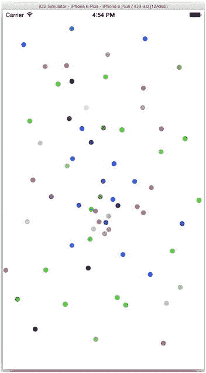

Figure 7-1. TapOut 应用

对于每次点击，Core Data 会存储三部分数据：

*   点击的 x 值，使用`Float`
*   点击的 y 值，使用`Float`
*   一个随机颜色，使用`Transformable`

#### 创建项目并添加 Core Data

使用 Single View Application 模板创建一个 Xcode 项目。将产品名称设置为`TapOut`，并取消勾选“Use Core Data”复选框。创建项目后，按照我们之前的步骤添加 Core Data 支持：

1.  添加 TapOut 数据模型`TapOut.xcdatamodeld`。
2.  添加`Persistence`类，该类封装了 TapOut 的 Core Data 交互。

Listing 7-1 展示了`Persistence`类的 Objective-C 头文件，Listing 7-2 展示了 Objective-C 实现文件。Listing 7-3 展示了 Swift 版本的`Persistence`。

***Listing 7-1***. `Persistence.h`

```objective-c
#import <Foundation/Foundation.h>
@import CoreData;

@interface Persistence : NSObject

@property (readonly, strong, nonatomic) NSManagedObjectContext *managedObjectContext;
@property (readonly, strong, nonatomic) NSManagedObjectModel *managedObjectModel;
@property (readonly, strong, nonatomic) NSPersistentStoreCoordinator *persistentStoreCoordinator;

- (void)saveContext;
- (NSURL *)applicationDocumentsDirectory;

@end
```

***Listing 7-2***. `Persistence.m`

```objective-c
#import "Persistence.h"

@implementation Persistence

- (id)init {
  self = [super init];
  if (self != nil) {
    // Initialize the managed object model
    NSURL *modelURL = [[NSBundle mainBundle] URLForResource:@"TapOut" withExtension:@"momd"];
    _managedObjectModel = [[NSManagedObjectModel alloc] initWithContentsOfURL:modelURL];

    // Initialize the persistent store coordinator
    NSURL *storeURL = [[self applicationDocumentsDirectory] URLByAppendingPathComponent:@"TapOut.sqlite"];
```


```objc
NSError *error = nil;
_persistentStoreCoordinator = [[NSPersistentStoreCoordinator alloc] initWithManagedObjectModel:self.managedObjectModel];
if (![_persistentStoreCoordinator addPersistentStoreWithType:NSSQLiteStoreType
                                               configuration:nil
                                                         URL:storeURL
                                                     options:nil
                                                       error:&error]) {
    NSLog(@"Unresolved error %@, %@", error, [error userInfo]);
    abort();
}

// 初始化托管对象上下文
_managedObjectContext = [[NSManagedObjectContext alloc] init];
[_managedObjectContext setPersistentStoreCoordinator:self.persistentStoreCoordinator];
}
return self;
}

#pragma mark - 辅助方法

- (void)saveContext {
NSError *error = nil;
if ([self.managedObjectContext hasChanges] && ![self.managedObjectContext save:&error]) {
    NSLog(@"Unresolved error %@, %@", error, [error userInfo]);
    abort();
}
}

- (NSURL *)applicationDocumentsDirectory {
return [[[NSFileManager defaultManager] URLsForDirectory:NSDocumentDirectory inDomains:NSUserDomainMask] lastObject];
}

@end
```

***清单 7-3***. `Persistence.swift`

```swift
import Foundation
import CoreData

class Persistence {
    // MARK: - Core Data 栈

lazy var applicationDocumentsDirectory: NSURL = {
        // 应用程序用于存储 Core Data 存储文件的目录。此代码在应用程序的文档 Application Support 目录中使用名为 "book.persistence.TapOutSwift" 的目录。
        let urls = NSFileManager.defaultManager().URLsForDirectory(.DocumentDirectory, inDomains: .UserDomainMask)
        return urls[urls.count-1] as NSURL
        }()

lazy var managedObjectModel: NSManagedObjectModel = {
        // 应用程序的托管对象模型。此属性不是可选的。如果应用程序无法找到并加载其模型，将导致致命错误。
        let modelURL = NSBundle.mainBundle().URLForResource("TapOutSwift", withExtension: "momd")!
        return NSManagedObjectModel(contentsOfURL: modelURL)!
        }()

lazy var persistentStoreCoordinator: NSPersistentStoreCoordinator? = {
        // 应用程序的持久化存储协调器。此实现会创建并返回一个协调器，并将应用程序的存储添加到其中。此属性是可选的，因为可能存在导致存储创建失败的合理错误情况。
        // 创建协调器和存储
        var coordinator: NSPersistentStoreCoordinator? = NSPersistentStoreCoordinator(managedObjectModel: self.managedObjectModel)
        let url = self.applicationDocumentsDirectory.URLByAppendingPathComponent("TapOutSwift.sqlite")
        var error: NSError? = nil
        var failureReason = "创建或加载应用程序的已保存数据时出错。"
        if coordinator!.addPersistentStoreWithType(NSSQLiteStoreType, configuration: nil, URL: url, options: nil, error: &error) == nil {
            coordinator = nil
            // 报告我们遇到的任何错误。
            let dict = NSMutableDictionary()
            dict[NSLocalizedDescriptionKey] = "无法初始化应用程序的已保存数据"
            dict[NSLocalizedFailureReasonErrorKey] = failureReason
            dict[NSUnderlyingErrorKey] = error
            error = NSError(domain: "YOUR_ERROR_DOMAIN", code: 9999, userInfo: dict)
            // 将此替换为适当处理错误的代码。
            // abort() 会导致应用程序生成崩溃日志并终止。在生产应用中不应使用此函数，但在开发过程中可能有用。
            NSLog("Unresolved error \(error), \(error!.userInfo)")
            abort()
        }

return coordinator
        }()

lazy var managedObjectContext: NSManagedObjectContext? = {
        // 返回应用程序的托管对象上下文（该上下文已绑定到应用程序的持久化存储协调器）。此属性是可选的，因为可能存在导致上下文创建失败的合理错误情况。
        let coordinator = self.persistentStoreCoordinator
        if coordinator == nil {
            return nil
        }
        var managedObjectContext = NSManagedObjectContext()
        managedObjectContext.persistentStoreCoordinator = coordinator
        return managedObjectContext
        }()

// MARK: - Core Data 保存支持

func saveContext () {
        if let moc = self.managedObjectContext {
            var error: NSError? = nil
            if moc.hasChanges && !moc.save(&error) {
                // 将此实现替换为适当处理错误的代码。
                // abort() 会导致应用程序生成崩溃日志并终止。在生产应用中不应使用此函数，但在开发过程中可能有用。
                NSLog("Unresolved error \(error), \(error!.userInfo)")
                abort()
            }
        }
    }

}
```

然后，在`AppDelegate`中添加一个`Persistence`实例的属性，如清单 7-4（Objective-C）和清单 7-5（Swift）所示，并在应用程序启动时对其进行初始化，如清单 7-6（Objective-C）和清单 7-7（Swift）所示。

***清单 7-4***. 在 `AppDelegate.h` 中添加 `Persistence` 属性

```objc
@class Persistence;
...
@property (strong, nonatomic) Persistence *persistence;
```

***清单 7-5***. 在 `AppDelegate.swift` 中添加 `Persistence` 属性

```swift
var persistence : Persistence?
```

***清单 7-6***. 在 `AppDelegate.m` 中初始化 Core Data 栈

```objc
#import "Persistence.h"

...

- (BOOL)application:(UIApplication *)application didFinishLaunchingWithOptions:(NSDictionary *)launchOptions {
  self.persistence = [[Persistence alloc] init];
  return YES;
}
```

***清单 7-7***. 在 `AppDelegate.swift` 中初始化 Core Data 栈

```swift
func application(application: UIApplication, didFinishLaunchingWithOptions launchOptions: [NSObject: AnyObject]?) -> Bool {
    persistence = Persistence()
    return true
}
```

为了完成 Core Data 的集成，请打开你的 Core Data 模型 `TapOut.xcdatamodeld`，并添加一个名为 `Tap` 的实体。为它设置三个属性。

*   `x`，类型为 `Float`
*   `y`，类型为 `Float`
*   `color`，类型为 `Transformable`

在 Xcode 中为其生成一个类，确保勾选基本类型使用标量属性 的复选框。如果你查看 Objective-C 头文件 `Tap.h` 或 Swift 文件 `Tap.swift`，你会注意到，如果你使用的是 Objective-C，Core Data 已将 `color` 的类型设置为 `id`；如果使用的是 Swift，则设置为 `AnyObject`。这是默认设置，因为 Core Data 不知道你计划从何种类型转换以及转换为何种类型。你可以安全地将此类型更新为你计划使用的类型，即 `UIColor *`（Objective-C）或 `UIColor`（Swift），这样 `Tap.h` 现在与清单 7-8 匹配，`Tap.swift` 与清单 7-9 匹配。

***清单 7-8***. `Tap.h`

```objc
#import <Foundation/Foundation.h>
#import <CoreData/CoreData.h>
#import <UIKit/UIKit.h>

@interface Tap : NSManagedObject

@property (nonatomic) float x;
@property (nonatomic) float y;
@property (nonatomic, retain) UIColor *color;

@end
```

***清单 7-9***. `Tap.swift`

```swift
import Foundation
import CoreData
import UIKit

@objc(Tap)
class Tap: NSManagedObject {
```


@NSManaged var color: UIColor  
`@NSManaged var x: Float`  
`@NSManaged var y: Float`  

## 创建点击事件

每当用户点击屏幕时，我们就在 Core Data 存储中创建一个 `Tap` 对象。我们将在视图控制器 `ViewController` 中处理点击事件，并在 `Persistence` 中添加一个方法来实际添加 `Tap` 对象。我们从 `Persistence` 开始。如果你使用 Objective-C，请打开 `Persistence.h` 并添加一个用于添加 `Tap` 对象的方法声明，如代码清单 7-10 所示。

***代码清单 7-10***. 在 `Persistence.h` 中声明添加 Tap 对象的方法

```
#import <UIKit/UIKit.h>
...
- (void)addTap:(CGPoint)point;
```

在 `Persistence.m` 或 `Persistence.swift` 中，添加 `addTap:` 方法的定义。该方法在托管对象上下文中创建一个 `Tap` 实例，将其 `x` 和 `y` 值设置为指定点中的对应值，使用辅助函数将 `color` 设置为随机颜色，然后保存托管对象上下文。代码清单 7-11 展示了该方法的 Objective-C 版本以及随机颜色生成辅助函数，代码清单 7-12 展示了 Swift 版本。

***代码清单 7-11***. 在 `Persistence.m` 中添加 `Tap` 对象

```
#import "Tap.h"
...
- (void)addTap:(CGPoint)point {
    Tap *tap = [NSEntityDescription insertNewObjectForEntityForName:@"Tap" inManagedObjectContext:self.managedObjectContext];
    tap.x = point.x;
    tap.y = point.y;
    tap.color = [self randomColor];
    [self saveContext];
}

- (UIColor *)randomColor {
    float red = (arc4random() % 256) / 255.0f;
    float green = (arc4random() % 256) / 255.0f;
    float blue = (arc4random() % 256) / 255.0f;
    return [UIColor colorWithRed:red green:green blue:blue alpha:1.0];
}
```

***代码清单 7-12***. 在 `Persistence.swift` 中添加 Tap 对象

```
func addTap(point: CGPoint) {
    var tap = NSEntityDescription.insertNewObjectForEntityForName("Tap", inManagedObjectContext: self.managedObjectContext!) as? Tap
    tap?.x = Float(point.x)
    tap?.y = Float(point.y)
    tap?.color = self.randomColor()
    self.saveContext()
}

func randomColor() -> UIColor {
    let red = CGFloat(arc4random() % UInt32(256)) / 255.0
    let green = CGFloat(arc4random() % UInt32(256)) / 255.0
    let blue = CGFloat(arc4random() % UInt32(256)) / 255.0
    return UIColor(red: red, green: green, blue: blue, alpha: 1.0)
}
```

现在，向视图控制器添加一个点击手势识别器，当点击视图时，最终会调用 `addTap:` 方法。代码清单 7-13 展示了更新后的 `ViewController.m` 文件，代码清单 7-14 展示了更新后的 `ViewController.swift` 文件。

***代码清单 7-13***. 带点击手势识别器的 `ViewController.m`

```
#import "ViewController.h"
#import "AppDelegate.h"
#import "Persistence.h"

@implementation ViewController

- (void)viewDidLoad {
    [super viewDidLoad];
    UITapGestureRecognizer *tapGestureRecognizer = [[UITapGestureRecognizer alloc] initWithTarget:self action:@selector(viewWasTapped:)];
    [self.view addGestureRecognizer:tapGestureRecognizer];
}

- (void)viewWasTapped:(UIGestureRecognizer *)sender {
    if (sender.state == UIGestureRecognizerStateEnded) {
        AppDelegate *appDelegate = (AppDelegate *)[[UIApplication sharedApplication] delegate];
        Persistence *persistence = appDelegate.persistence;
        CGPoint point = [sender locationInView:sender.view];
        [persistence addTap:point];
        [self.view setNeedsDisplay];
    }
}

@end
```

***代码清单 7-14***. 带点击手势识别器的 `ViewController.swift`

```
import UIKit

class ViewController: UIViewController {

    override func viewDidLoad() {
        super.viewDidLoad()
        let tapGestureRecognizer = UITapGestureRecognizer(target: self, action: "viewWasTapped:")
        self.view.addGestureRecognizer(tapGestureRecognizer)
    }

    func viewWasTapped(sender: UIGestureRecognizer) {
        if sender.state == .Ended {
            let appDelegate = UIApplication.sharedApplication().delegate as AppDelegate
            let point = sender.locationInView(sender.view)
            appDelegate.persistence?.addTap(point)
            self.view.setNeedsDisplay()
        }
    }
}
```

现在，你应该能够构建并运行 `TapOut` 项目，然后点击屏幕来创建 `Tap` 对象。你可以通过查看 SQLite 数据库来验证 `Tap` 对象是否已创建，但屏幕上暂时不会显示任何内容。在下一节中，我们将添加实际显示 Core Data 所存储的 `Tap` 对象的代码。

## 创建视图并显示点击事件

要显示 `Tap` 对象，我们首先从 Core Data 中获取它们。然后，遍历它们，使用标准绘图原语在视图上绘制它们。向 `Persistence` 添加一个名为 `taps` 的方法，该方法从 Core Data 存储中获取所有 `Tap` 对象。这段代码应该很熟悉，因为它是从 Core Data 获取对象的标准代码。代码清单 7-15 展示了 `Persistence.h` 中的方法声明，代码清单 7-16 展示了 `Persistence.m` 中的 Objective-C 定义，代码清单 7-17 展示了 `Persistence.swift` 中的 Swift 定义。

***代码清单 7-15***. 在 `Persistence.h` 中声明 `taps` 方法

```
- (NSArray *)taps;
```

***代码清单 7-16***. 在 `Persistence.m` 中获取所有 `Tap` 对象

```
- (NSArray *)taps {
    NSError *error = nil;
    NSFetchRequest *fetchRequest = [NSFetchRequest fetchRequestWithEntityName:@"Tap"];
    NSArray *taps = [self.managedObjectContext executeFetchRequest:fetchRequest error:&error];
    if (taps == nil) {
        NSLog(@"Error fetching taps %@, %@", error, [error userInfo]);
    }
    return taps;
}
```

***代码清单 7-17***. 在 `Persistence.swift` 中获取所有 `Tap` 对象

```
func taps() -> [Tap] {
    var error: NSError? = nil
    let fetchRequest = NSFetchRequest(entityName: "Tap")
    let taps = self.managedObjectContext?.executeFetchRequest(fetchRequest, error: &error)
    return taps as [Tap]
}
```

现在创建一个名为 `TapView` 的类，它继承自 `UIView`。在 `drawRect:` 方法中，使用刚刚创建的方法获取 `Tap` 对象，然后遍历它们，将它们绘制为屏幕上的圆形，圆心位于其 `x` 和 `y` 值处，颜色使用 Core Data 中存储的颜色。代码清单 7-18 展示了 `TapView.h`，代码清单 7-19 展示了 Objective-C 的 `TapView.m`，代码清单 7-20 展示了 Swift 的 `TapView.swift`。

***代码清单 7-18***. `TapView.h`

```
@interface TapView : UIView
@end
```

***代码清单 7-19***. `TapView.m`

```
#import "TapView.h"
#import "AppDelegate.h"
#import "Persistence.h"
#import "Tap.h"

@implementation TapView

- (void)drawRect:(CGRect)rect {
    static float DIAMETER = 10.0f;
    CGContextRef context = UIGraphicsGetCurrentContext();
    AppDelegate *appDelegate = (AppDelegate *)[[UIApplication sharedApplication] delegate];
    NSArray *taps = [appDelegate.persistence taps];
    for (Tap *tap in taps) {
        const CGFloat *rgb = CGColorGetComponents(tap.color.CGColor);
        CGContextSetRGBFillColor(context, rgb[0], rgb[1], rgb[2], 1.0f);
        CGContextFillEllipseInRect(context, CGRectMake(tap.x – DIAMETER/2, tap.y – DIAMETER/2, DIAMETER, DIAMETER));
    }
}

@end
```

***代码清单 7-20***. `TapView.swift`

```
import Foundation
import UIKit
```


```swift
class TapView : UIView {
    override func drawRect(rect: CGRect) {
        let DIAMETER = CGFloat(10.0)

        let context = UIGraphicsGetCurrentContext()

        let appDelegate = UIApplication.sharedApplication().delegate as? AppDelegate
        let taps = appDelegate?.persistence?.taps()
        if let taps = taps {
            for tap : Tap in taps {
                let rgb = CGColorGetComponents(tap.color.CGColor)
                CGContextSetRGBFillColor(context, rgb[0], rgb[1], rgb[2], 1.0)
                CGContextFillEllipseInRect(context, CGRectMake(CGFloat(tap.x - Float(DIAMETER/2)), CGFloat(tap.y - Float(DIAMETER/2)), DIAMETER, DIAMETER))
            }
        }
    }
}
```

更新应用的视图，使其使用这个新的视图类。

1.  打开 `Main.storyboard`。
2.  选中视图。
3.  在身份检查器中，将 Class 下拉框更改为 `TapView`。

现在，运行应用程序，你添加的所有 `Tap` 实例应该都会显示出来。你还可以点击屏幕添加更多圆点。你可以一直点击，直到你的 iPhone 看起来像是感染了麻疹！

## 嘿，等一下！我的颜色是怎么转换的？

你可能会注意到，我们并没有编写任何转换代码，将我们的 `UIColor` 实例转换进 Core Data 存储或从其中转换出来。Core Data 是怎么知道如何转换它的呢？

在 iOS 5 之前的时代，我们需要编写一个自定义转换器类来为 `UIColor` 实例执行转换。然而，从 iOS 5 开始，`UIColor` 遵循了 `NSCoding` 协议，因此它可以被自动正确地编码和解码。这简单得简直像是在作弊。

然而，对于我们的加密转换，我们就没有这么幸运了，必须编写一个自定义转换类来加密和解密我们的数据。我们将在下一节中完成这项工作。

## 加密数据

在这个社交媒体、身份盗窃和 NSA 监控的时代，人们越来越重视隐私。将你的设备保持物理安全可以保护你的数据——直到你把 iPhone 落在酒吧或者被小偷偷走。一旦他人控制了你的 iPhone 或 iPad，他们就可以导出 Core Data 在不同应用中使用的 SQLite 数据库，并使用本书中我们正在使用的工具之类的工具，读取你所有的数据——包括那些会让你脸红、甚至可能毁掉你生活的私密敏感数据。

保护这些数据的一种方法是使用已知的、业界强度的加密算法对它们进行加密。在本章的余下部分，我们将创建一个名为 `SecureNote` 的安全笔记应用，该应用将以加密格式存储所有笔记。我们将使用 Core Data 的 `Transformable` 数据类型和一个自定义转换类来管理数据的加密和解密。完成后的应用将类似于图 7-2。

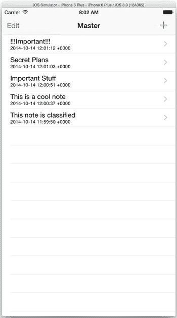

图 7-2。`SecureNote` 应用

## 创建项目并设置 Core Data 模型

在 Xcode 中使用 Master-Detail Application 模板创建一个新项目。将其命名为 `SecureNote`，并确保勾选了“Use Core Data”复选框。Xcode 创建好项目后，打开 Core Data 模型文件 `SecureNote.xcdatamodeld`，删除 Xcode 为你创建的 `Event` 实体。然后，添加一个名为 `Note` 的实体，并为其赋予三个属性。

*   `timeStamp`（`Date`）
*   `title`（`Transformable`）
*   `body`（`Transformable`）

我们不对 `timeStamp` 进行加密，但将使用一个自定义转换器类对 `title` 和 `body` 进行加密。下一节将讨论加密和解密，然后构建一个 Core Data 将用于加密和解密 `title` 和 `body` 的自定义转换器类。

然而，在我们继续讨论加密和解密之前，请更新 Xcode 为你生成的 `NSFetchedResultsController`，使其获取 `Note` 实例。你可以在 `MasterViewController.m` 或 `MasterViewController.swift` 中的 `fetchedResultsController` 访问器里找到这段代码。请将其修改为与代码清单 7-21 一致。

***代码清单 7-21***。获取 `Note` 实例

```objectivec
NSEntityDescription *entity = [NSEntityDescription entityForName:@"Note" inManagedObjectContext:self.managedObjectContext]; // Objective-C
```

```swift
let entity = NSEntityDescription.entityForName("Note", inManagedObjectContext: self.managedObjectContext!) // Swift
```

为 `Note` 实体生成一个 `NSManagedObject` 子类。生成的类会将 `body` 和 `title` 的类型设置为 `id (Objective-C)` 或 `AnyObject (Swift)`，因为它不知道该设置为什么其他类型，但你可以将两者的类型都改为 `NSString * (Objective-C)` 或 `String (Swift)`。代码清单 7-22 展示了 `Note.h` 头文件，代码清单 7-23 展示了 `Note.m` Objective-C 实现文件，代码清单 7-24 展示了 `Note.swift` Swift 实现文件。

***代码清单 7-22***。`Note.h`

```objectivec
#import <Foundation/Foundation.h>
#import <CoreData/CoreData.h>

@interface Note : NSManagedObject

@property (nonatomic, retain) NSString *body;
@property (nonatomic, retain) NSDate *timeStamp;
@property (nonatomic, retain) NSString *title;

@end
```

***代码清单 7-23***。`Note.m`

```objectivec
#import "Note.h"

@implementation Note

@dynamic body;
@dynamic timeStamp;
@dynamic title;

@end
```

***代码清单 7-24***。`Note.swift`

```swift
import Foundation
import CoreData

@objc(Note)
class Note: NSManagedObject {

@NSManaged var timeStamp: NSDate
    @NSManaged var title: String
    @NSManaged var body: String

}
```

我们希望主视图显示笔记的标题，并在其下方显示时间戳，因此请打开故事板（`Main.storyboard`），选中主视图中的原型单元格，并在属性检查器中将其样式从 Basic 更改为 Subtitle，如图 7-3 所示。

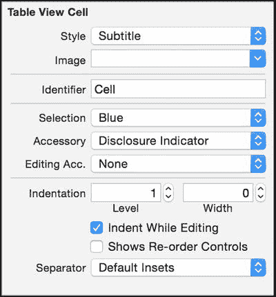

图 7-3。将表格视图单元格设置为 Subtitle 样式

现在，更新 `MasterViewController.m` 或 `MasterViewController.swift` 中的 `configureCell:atIndexPath:` 方法，使其在主文本标签中显示笔记的标题，在详细文本标签中显示时间戳，如代码清单 7-25（Objective-C）和代码清单 7-26（Swift）所示。

***代码清单 7-25***。在单元格中显示笔记标题和时间戳 (Objective-C)

```objectivec
#import "Note.h"

...

- (void)configureCell:(UITableViewCell *)cell atIndexPath:(NSIndexPath *)indexPath {
  Note *note = [self.fetchedResultsController objectAtIndexPath:indexPath];
  cell.textLabel.text = note.title;
  cell.detailTextLabel.text = [note.timeStamp description];
}
```

***代码清单 7-26***。在单元格中显示笔记标题和时间戳 (Swift)

```swift
func configureCell(cell: UITableViewCell, atIndexPath indexPath: NSIndexPath) {
    let note = self.fetchedResultsController.objectAtIndexPath(indexPath) as Note
    cell.textLabel.text = note.title
    cell.detailTextLabel?.text = note.timeStamp.description
}
```


你还需要同时更新 `MasterViewController.m` 或 `MasterViewController.swift` 中的 `insertNewObject:` 方法，以使用新的 `Note` 类，如代码清单 7-27（Objective-C）和代码清单 7-28（Swift）所示。在该方法中，我们创建了一个新的 `Note` 实例，并将时间戳设为当前日期和时间，标题设为“新笔记”，正文设为空字符串。同时，我们还会选中这条新笔记并跳转到其详情视图，这样一旦更新详情视图，就能编辑这条新笔记了。

***代码清单 7-27***. 创建新对象时使用 `Note` 类（Objective-C）

```
- (void)insertNewObject:(id)sender {
NSManagedObjectContext *context = [self.fetchedResultsController managedObjectContext];
  NSEntityDescription *entity = [[self.fetchedResultsController fetchRequest] entity];
  Note *note = [NSEntityDescription insertNewObjectForEntityForName:[entity name] inManagedObjectContext:context];

note.timeStamp = [NSDate date];
  note.title = @"New Note";
  note.body = @"";

// Save the context.
  NSError *error = nil;
  if (![context save:&error]) {
    NSLog(@"Unresolved error %@, %@", error, [error userInfo]);
    abort();
  }

// Select the new note and segue to its detail view
  NSIndexPath *indexPath = [NSIndexPath indexPathForRow:0 inSection:0];
  [self.tableView selectRowAtIndexPath:indexPath animated:YES scrollPosition:UITableViewScrollPositionTop];
  [self performSegueWithIdentifier:@"showDetail" sender:self];
}
```

***代码清单 7-28***. 创建新对象时使用 `Note` 类（Swift）

```
func insertNewObject(sender: AnyObject) {
    let context = self.fetchedResultsController.managedObjectContext
    let entity = self.fetchedResultsController.fetchRequest.entity
    let note = NSEntityDescription.insertNewObjectForEntityForName(entity!.name!, inManagedObjectContext: context) as Note

note.timeStamp = NSDate()
    note.title = "New Note"
    note.body = ""

// Save the context.
    var error: NSError? = nil
    if !context.save(&error) {
      abort()
    }

// Select the new note and segue to its detail view
    let indexPath = NSIndexPath(forRow: 0, inSection: 0)
    self.tableView.selectRowAtIndexPath(indexPath, animated: true, scrollPosition: .Top)
    self.performSegueWithIdentifier("showDetail", sender: self)
}
```

## 执行加密与解密

为了实现实际的加密与解密，我们使用 iOS 提供的 Common Crypto 库。本书并非加密专著，因此不会深入探讨加密的具体工作原理。如果你想了解更多，我们鼓励你自行研究加密相关知识。一些 iOS 加密相关的资源包括：

*   Apple 的《加密服务指南》，网址为 `https://developer.apple.com/library/mac/documentation/security/conceptual/cryptoservices/Introduction/Introduction.html`
*   Rob Napier 的博客文章：“Properly Encrypting With AES With CommonCrypto”，网址为 `http://robnapier.net/aes-commoncrypto/`

就本章而言，你应理解以下几点：

*   我们使用由用户提供的密码作为密钥进行对称加密。
*   对于每个要加密的字符串，我们都会生成一个随机盐值，并将其与密码结合，然后使用 SHA1 进行哈希处理。
*   我们使用 AES 算法进行加密。

我们使用一个用户提供的密码，并将其存储在应用委托的一个成员变量中，该变量被恰当地命名为 `password`。将其添加到 `AppDelegate.h` 或 `AppDelegate.swift` 中，如代码清单 7-29（Objective-C）和代码清单 7-30（Swift）所示。

***代码清单 7-29***. 在应用委托中添加密码（Objective-C）

```
@property (copy, nonatomic) NSString *password;
```

***代码清单 7-30***. 在应用委托中添加密码（Swift）

```
var password: String?
```

在我们讨论如何提示用户输入密码、如何验证密码是否正确，以及如何为每个字符串生成并存储盐值之前，我们先来构建实际的值转换器。在构建之前，我们必须了解值转换器的方法及其作用。

### 理解 NSValueTransformer 的方法

`NSValueTransformer` 有四个值得关注的方法：其中两个是静态方法，两个是实例方法。表 7-1 列出了这些方法及其功能。

表 7-1. `NSValueTransformer` 的方法

| 方法 | 描述 |
| --- | --- |
| `+ (BOOL)allowsReverseTransformation` | 静态方法，若该值转换器支持反向转换则返回 `YES`，否则返回 `NO`。默认值为 `YES`。 |
| `+ (Class)transformedValueClass` | 正向转换所返回值的类。 |
| `- (id)transformedValue:(id)value` | 被调用以将 `value` 转换为新值。 |
| `- (id)reverseTransformedValue:(id)value` | 被调用以进行反向转换，将 `value` 转换为新值。你的值转换器必须支持反向转换。如果无法通过简单重复调用 `transformedValue;` 来逆向转换，则应重写此方法。 |

### 实现加密/解密值转换器

对于我们的加密/解密值转换器，我们必须同时支持正向和反向转换——在将数据存入 Core Data 数据存储时进行加密（正向转换），在将数据读取到内存并显示在屏幕上时进行解密（反向转换）。因此，我们分别重写 `transformedValue:` 和 `reverseTransformedValue:` 来实现加密和解密。我们无需重写 `allowsReverseTransformation`，因为其默认返回值为 `YES`。我们将 `transformedValueClass` 的返回值设为 `NSData` 类，因为这是 `transformedValue:` 返回的对象类型。

一个有趣的问题是如何为每个要加密的字符串存储两条数据：盐值（salt）和初始化向量（IV），这两者都是随机数据。这些数据与密码结合使用，可以防止对数据进行彩虹表攻击。我们在加密字符串时创建它们，然后在解密时使用它们。由于解密每个字符串时都必须有盐值和 IV，因此我们必须为每个加密的字符串存储盐值和 IV。

你可能会想到在 Core Data 模型的 `Note` 实体中创建属性来存储每个托管对象的盐值和 IV，但请记住，我们是给 Core Data 提供一个派生自 `NSTransformer` 的类来读写我们的 `Transformable` 属性。实例化并调用转换器的是 Core Data 的代码，而不是我们的代码。此外，我们的转换器类对其被调用时所处的上下文一无所知——它不知道正在被用于哪个托管对象。它只知道接收一个值并返回一个值。我们无法在转换器中读取或写入模型中的其他属性，因为我们不知道正在处理哪个托管对象，甚至不知道正在加密或解密的是哪个属性。

因此，解决方案是在写入数据时将盐值、IV 和加密后的字符串合并成一个属性，在读取数据时再从数据中解析出盐值、IV 和加密后的字符串，以便执行解密。我们将按以下方式存储数据：

*   盐值（8 字节）
*   IV（16 字节）
*   加密后的字符串（剩余字节）

对于实际的加密和解密，我们创建一个参数化的辅助方法，名为 `transform:`，该方法允许我们指定是加密还是解密，因为执行这两种操作的代码非常相似。该方法将密码、盐值和 IV 作为参数。如前所述，我们不讨论实际加密和解密的细节，但在代码中添加了注释，供你参考。


要添加安全框架到 Objective-C 版本的项目，只需在需要引用安全代码的文件中添加以下语句：

```objc
@import SystemConfiguration;
```

将框架添加到 Swift 项目并不那么容易，至少在撰写本文时如此。要将安全框架添加到 Swift 项目，请执行以下操作：

1. 在项目中创建一个虚拟的 Objective-C 文件。
2. Xcode 会询问是否要创建桥接头文件，选择“是”。
3. 删除虚拟的 Objective-C 文件。
4. 打开桥接头文件`SecureNoteSwift-Bridging-Header.h`，并添加以下导入：

```objc
#import <CommonCrypto/CommonCryptor.h>
#import <CommonCrypto/CommonDigest.h>
#import "SSKeychain.h"
```

代码清单 7-31 展示了值转换器`EncryptionTransformer`的头文件，代码清单 7-32 展示了 Objective-C 实现文件，代码清单 7-33 展示了 Swift 实现文件。

**代码清单 7-31**. `EncryptionTransformer.h`

```objc
#import <Foundation/Foundation.h>

@interface EncryptionTransformer : NSValueTransformer

@end
```

**代码清单 7-32**. `EncryptionTransformer.m`

```objc
@import SystemConfiguration;

#import <CommonCrypto/CommonCryptor.h>
#import <CommonCrypto/CommonDigest.h>
#import "EncryptionTransformer.h"
#import "AppDelegate.h"

#define kSaltLength 8

@implementation EncryptionTransformer

+ (Class)transformedValueClass {
    return [NSData class];
}

- (id)transformedValue:(id)value {
    // 我们接收一个要加密的字符串（NSString）。
    // 返回的字节格式为：
    // salt（16 字节）| IV（16 字节）| 加密后的字符串
    NSData *salt = [self randomDataOfLength:kSaltLength];
    NSData *iv = [self randomDataOfLength:kCCBlockSizeAES128];
    NSData *data = [(NSString *)value dataUsingEncoding:NSUTF8StringEncoding];

    // 执行实际的加密操作
    NSData *result = [self transform:data
                            password:[self password]
                                salt:salt
                                  iv:iv
                           operation:kCCEncrypt];

    // 构建响应数据
    NSMutableData *response = [[NSMutableData alloc] init];
    [response appendData:salt];
    [response appendData:iv];
    [response appendData:result];
    return response;
}

- (id)reverseTransformedValue:(id)value {
    // 我们接收来自 Core Data 的字节（NSData），需要将其转换
    // 为字符串（NSString）并返回给应用程序。

    // 字节格式为：
    // salt（16 字节）| IV（16 字节）| 加密数据
    NSData *data = (NSData *)value;
    NSData *salt = [data subdataWithRange:NSMakeRange(0, kSaltLength)];
    NSData *iv = [data subdataWithRange:NSMakeRange(kSaltLength, kCCBlockSizeAES128)];
    NSData *text = [data subdataWithRange:NSMakeRange(kSaltLength + kCCBlockSizeAES128, [data length] - kSaltLength - kCCBlockSizeAES128)];

    // 获取解密后的数据
    NSData *decrypted = [self transform:text password:[self password] salt:salt iv:iv operation:kCCDecrypt];

    // 只返回解密后的字符串
    return [[NSString alloc] initWithData:decrypted encoding:NSUTF8StringEncoding];
}

- (NSData *)transform:(NSData *)value
               password:(NSString *)password
                   salt:(NSData *)salt
                     iv:(NSData *)iv
              operation:(CCOperation)operation {
    // 通过对密码加盐来获取密钥
    NSData *key = [self keyForPassword:password salt:salt];

    // 执行操作（加密或解密）
    size_t outputSize = 0;
    NSMutableData *outputData = [NSMutableData dataWithLength:value.length + kCCBlockSizeAES128];
    CCCryptorStatus status = CCCrypt(operation,
                                     kCCAlgorithmAES128,
                                     kCCOptionPKCS7Padding,
                                     key.bytes,
                                     key.length,
                                     iv.bytes,
                                     value.bytes,
                                     value.length,
                                     outputData.mutableBytes,
                                     outputData.length,
                                     &outputSize);

    // 成功则设置大小并返回数据，失败则返回 nil
    if (status == kCCSuccess) {
        outputData.length = outputSize;
        return outputData;
    } else {
        return nil;
    }
}

- (NSData *)keyForPassword:(NSString *)password
                      salt:(NSData *)salt {
    // 将盐附加到密码后
    NSMutableData *passwordAndSalt = [[password dataUsingEncoding:NSUTF8StringEncoding] mutableCopy];
    [passwordAndSalt appendData:salt];

    // 进行哈希处理
    NSData *hash = [self sha1:passwordAndSalt];

    // 使用哈希后的密码和盐创建密钥，使其符合 AES128 的适当大小（必要时补零）
    NSRange range = NSMakeRange(0, MIN(hash.length, kCCBlockSizeAES128));
    NSMutableData *key = [NSMutableData dataWithLength:kCCBlockSizeAES128];
    [key replaceBytesInRange:range withBytes:hash.bytes];
    return key;
}

- (NSData *)sha1:(NSData *)data {
    // 将 SHA1 结果存入数组
    uint8_t digest[CC_SHA1_DIGEST_LENGTH];
    CC_SHA1(data.bytes, (CC_LONG) data.length, digest);

    // 使用 SHA1 创建格式化字符串
    NSMutableString* sha1 = [NSMutableString stringWithCapacity:CC_SHA1_DIGEST_LENGTH * 2];
    for (int i = 0; i < CC_SHA1_DIGEST_LENGTH; i++) {
        [sha1 appendFormat:@"%02x", digest[i]];
    }
    return [sha1 dataUsingEncoding:NSUTF8StringEncoding];
}

- (NSString *)password {
    return ((AppDelegate *)[[UIApplication sharedApplication] delegate]).password;
}

- (NSData *)randomDataOfLength:(size_t)length {
    // SecRandomCopyBytes 成功时返回 0，失败时返回非零值
    // 如果调用失败，缓冲区将保留 NSMutableData dataWithLength: 留下的全零数据，安全性较低！
    // 正式发布的应用程序可以选择在此步骤失败时终止操作
    NSMutableData *randomData = [NSMutableData dataWithLength:length];
    SecRandomCopyBytes(kSecRandomDefault, length, randomData.mutableBytes);
    return randomData;
}

@end
```

**代码清单 7-33**. `EncryptionTransformer.swift`

```swift
import Foundation

import UIKit
import Security

@objc(EncryptionTransformer)
class EncryptionTransformer : NSValueTransformer {
    let saltLength : UInt = 8

    override class func transformedValueClass() -> AnyClass {
        return NSData.self
    }

    override func transformedValue(value: AnyObject?) -> AnyObject? {
        // 我们接收一个要加密的字符串（NSString）。
        // 返回的字节格式为：
        // salt（16 字节）| IV（16 字节）| 加密后的字符串

        let salt = self.randomDataOfLength(saltLength)
        let iv = self.randomDataOfLength(UInt(kCCBlockSizeAES128))

        let data = value?.dataUsingEncoding(NSUTF8StringEncoding)

        // 执行实际的加密操作
        let result = self.transform(data!, password: self.password()!, salt: salt, iv: iv, operation: UInt32(kCCEncrypt))

        // 构建响应数据
        var response = NSMutableData()
        response.appendData(salt)
        response.appendData(iv)
        response.appendData(result!)
        return response
    }
```


`override func reverseTransformedValue(value: AnyObject?) -> AnyObject?`  
`{`  
`        // 我们接收来自 Core Data 的字节数据（NSData），需要将其转换为字符串（NSString）并返回给应用。`  
`        let data = value as NSData?`  
`        if let data = data {`  
`            let salt = data.subdataWithRange(NSMakeRange(0, Int(saltLength)))`  
`            let iv = data.subdataWithRange(NSMakeRange(Int(saltLength), kCCBlockSizeAES128))`  
`            let text = data.subdataWithRange(NSMakeRange(Int(saltLength) + kCCBlockSizeAES128, data.length - Int(saltLength) - kCCBlockSizeAES128))`  

`// 获取解密后的数据`  
`            let decrypted = self.transform(text, password: self.password()!, salt: salt, iv: iv, operation: UInt32(kCCDecrypt))`  

`// 仅返回解密后的数据`  
`            return NSString(data: decrypted!, encoding: NSUTF8StringEncoding)`  
`        }`  
`        else {`  
`            return nil`  
`        }`  
`    }`  

`func transform(value: NSData, password: String, salt: NSData, iv: NSData, operation: CCOperation) -> NSData? {`  
`        // 通过加盐密码生成密钥`  
`        let key = self.keyForPassword(password, salt: salt)`  

`var outputSize :UInt = 0`  

`// 执行操作（加密或解密）`  
`        let outputData = NSMutableData(length: value.length + kCCBlockSizeAES128)`  
`        let status = CCCrypt(operation, UInt32(kCCAlgorithmAES128), UInt32(kCCOptionPKCS7Padding), key.bytes, UInt(key.length), iv.bytes, value.bytes, UInt(value.length), outputData!.mutableBytes, UInt(outputData!.length), &outputSize)`  

`// 成功则设置长度并返回数据`  
`        // 失败则返回 nil`  
`        if UInt32(status) == UInt32(kCCSuccess) {`  
`            outputData!.length = Int(outputSize)`  
`            return outputData`  
`        }`  
`        else {`  
`            return nil`  
`        }`  
`    }`  

`func sha1(data: NSData) -> NSData {`  
`        // 获取 SHA1 哈希值到数组中`  
`        var digest = UInt8, repeatedValue: 0)`  
`        CC_SHA1(data.bytes, CC_LONG(data.length), &digest)`  

`// 用 SHA1 哈希值创建格式化字符串`  
`        let sha1 = NSMutableString(capacity: Int(CC_SHA1_DIGEST_LENGTH))`  
`        for byte in digest {`  
`            sha1.appendFormat("%02x", byte)`  
`        }`  

`return sha1.dataUsingEncoding(NSUTF8StringEncoding, allowLossyConversion: false)!`  
`    }`  

`func keyForPassword(password: String, salt: NSData) -> NSData {`  
`        // 将盐值附加到密码后面`  
`        let passwordAndSalt = password.dataUsingEncoding(NSUTF8StringEncoding, allowLossyConversion: false)?.mutableCopy() as? NSMutableData`  
`        passwordAndSalt?.appendData(salt)`  

`// 计算哈希值`  
`        let hash = self.sha1(passwordAndSalt!)`  

`// 通过哈希后的密码和盐值创建密钥，`  
`        // 将其调整为 AES128 的适当大小（必要时用 0 填充）`  
`        let range = NSMakeRange(0, min(hash.length, kCCBlockSizeAES128));`  
`        let key = NSMutableData(length: kCCBlockSizeAES128)`  
`        key.replaceBytesInRange(range, withBytes: hash.bytes)`  
`        return key`  
`    }`  

`func randomDataOfLength(length: UInt) -> NSData {`  
`        let data = NSMutableData(length: Int(length))`  
`        var dataPointer = UnsafeMutablePointer<UInt8>(data.mutableBytes)`  
`        SecRandomCopyBytes(kSecRandomDefault, length, dataPointer);`  
`        return data`  
`    }`  

`func password() -> NSString? {`  
`        let appDelegate = UIApplication.sharedApplication().delegate as AppDelegate`  
`        return appDelegate.password`  
`    }`  
`}`  

虽然你已经找到了涵盖加密细节的代码，但也能看到你期望的 `NSValueTransformer` 方法：`transformedValue:` 接收一个待加密的字符串，并返回我们之前讨论过的数据结构——即盐值、初始向量（IV）和加密后的字符串。而 `reverseTransformedValue:` 方法则会接收相同的数据结构，从中解析出盐值、初始向量和加密字符串，并返回解密后的字符串。

打开 Core Data 模型文件 `SecureNote.xcdatamodeld`，将 `Note` 实体的 `title` 和 `body` 属性都设置为使用这个转换器。具体操作是：选中该属性，打开数据模型检查器（Data Model Inspector），在属性类型下拉框下方的名称字段中，输入转换器的类名 `EncryptionTransformer`，如图 7-4 所示。

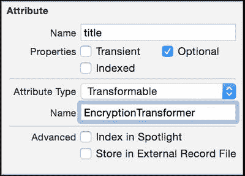

图 7-4. 将 `title` 属性设置为使用 `EncryptionTransformer`

## 设置详情视图以编辑笔记

现有的 SecureNote 详情视图显示的是所选实体的时间戳。但我们希望展示所选笔记的标题和正文，并将其放在可编辑的字段中。当用户点击返回按钮时，我们会将字段中的数据保存到 `Note` 实体中，然后保存托管对象上下文。

在 `DetailViewController.h` 文件中，将 `detailItem` 属性改为 `note`，类型为 `Note*`。删除现有的 `UILabel`，然后分别为笔记的标题和正文创建文本字段和文本视图。代码清单 7-34 显示了更新后的头文件。

***代码清单 7-34***.  包含笔记字段的 `DetailViewController.h`

```
#import <UIKit/UIKit.h>

@class Note;

@interface SNDetailViewController : UIViewController

@property (strong, nonatomic) Note *note;
@property (weak, nonatomic) IBOutlet UITextField *noteTitle;
@property (weak, nonatomic) IBOutlet UITextView *noteBody;

@end
```

更新 `DetailViewController.m` 文件，使其使用 `note` 实例以及 `noteTitle` 和 `noteBody` 控件，替代原有的 `detailItem` 和 `detailDescriptionLabel`。同时，在 `viewWillDisappear:` 方法中，更新 `note` 的 `body` 和 `title` 属性，并保存托管对象上下文。代码清单 7-35 显示了更新后的 Objective-C 实现文件。代码清单 7-36 显示了实现相应更改后的 `DetailViewController.swift`。

***代码清单 7-35***.  包含笔记字段的 `DetailViewController.m`

```
#import "DetailViewController.h"
#import "Note.h"

@implementation DetailViewController

#pragma mark - 管理笔记

- (void)setNote:(Note *)note {
  if (_note != note) {
    _note = note;
    [self configureView];
  }
}

- (void)configureView {
  if (self.note) {
    self.noteTitle.text = self.note.title;
    self.noteBody.text = self.note.body;
  } else {
    self.noteTitle.text = @"";
    self.noteBody.text = @"";
  }
}

- (void)viewDidLoad {
  [super viewDidLoad];
  [self configureView];
}

- (void)viewWillDisappear:(BOOL)animated {
  self.note.title = self.noteTitle.text;
  self.note.body = self.noteBody.text;

NSError *error;
  if (![[self.note managedObjectContext] save:&error]) {
    NSLog(@"保存笔记 %@ 时出错 -- %@ %@", self.noteTitle.text, error, [error userInfo]);
  }
}

@end
```

***代码清单 7-36***.  包含笔记字段的 `DetailViewController.swift`

```
import UIKit

class DetailViewController: UIViewController {
    @IBOutlet weak var noteTitle: UITextField!
    @IBOutlet weak var noteBody: UITextView!

var note: Note? {
        didSet {
            self.configureView()
        }
    }

func configureView() {
        if self.noteTitle != nil {
            if let note = self.note {
                self.noteTitle.text = note.title
                self.noteBody.text = note.body
            }
            else {
                self.noteTitle.text = ""
                self.noteBody.text = ""
            }
        }
    }

override func viewDidLoad() {
        super.viewDidLoad()
        self.configureView()
    }

override func viewWillDisappear(animated: Bool) {
        self.note?.title = self.noteTitle.text
        self.note?.body = self.noteBody.text
```


```swift
if let managedObjectContext = self.note?.managedObjectContext {
    var error: NSError? = nil
    if !managedObjectContext.save(&error) {
        NSLog("Error saving note \(self.noteTitle.text) -- \(error) \(error!.userInfo)")
    }
}

func setNote(note: Note) {
    if(self.note != note) {
        self.note = note
        self.configureView()
    }
}
```

将`MasterViewController.m`或`MasterViewController.swift`中的`prepareForSegue:sender:`方法更新为调用`setNote:`方法，而不是`setDetailItem:`方法，如代码清单 7-37（Objective-C）或代码清单 7-38（Swift）所示。

***代码清单 7-37***. 在`MasterViewController.m`中调用`setNote:`替代`setDetailItem:`

```
- (void)prepareForSegue:(UIStoryboardSegue *)segue sender:(id)sender {
  if ([[segue identifier] isEqualToString:@"showDetail"]) {
    NSIndexPath *indexPath = [self.tableView indexPathForSelectedRow];
    Note *note = [[self fetchedResultsController] objectAtIndexPath:indexPath];
    [[segue destinationViewController] setNote:note];
  }
}
```

***代码清单 7-38***. 在`MasterViewController.swift`中调用`setNote:`替代`setDetailItem:`

```
override func prepareForSegue(segue: UIStoryboardSegue, sender: AnyObject?) {
    if segue.identifier == "showDetail" {
        if let indexPath = self.tableView.indexPathForSelectedRow() {
            let note = self.fetchedResultsController.objectAtIndexPath(indexPath) as Note
            (segue.destinationViewController as DetailViewController).note = note
        }
    }
}
```

打开故事板文件`Main.storyboard`，更新用户界面。在详情视图中，删除现有的标签。在视图顶部添加一个无边框的文本字段，占位符文本为**Note Title**，将其字号增大至 18，并使其宽度横跨整个视图。在该文本字段下方，添加一个填充其余空间的文本视图。将这两个控件分别连接到`noteTitle`和`noteBody`。使用“解决自动布局问题”弹出菜单添加缺失的约束。图 7-5 展示了更新后的详情视图。

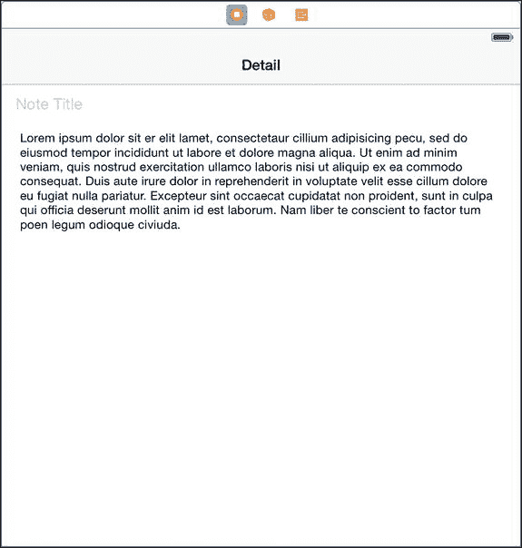

图 7-5. 显示笔记详情的详情视图

## 提示输入并验证密码

此前我们忽略了让用户输入`SecureNote`用于加密和解密笔记的密码这一需求，现在来处理这个问题。为了实现密码输入，我们执行以下步骤：

1.  在主导航视图控制器之前插入一个新的视图和视图控制器，该视图控制器显示一个密码输入字段和一个“登录”按钮。
2.  当用户尝试登录时，将应用程序委托中创建的`password`字段设置为输入的密码。
3.  如果用户尚未输入密码，则将任何输入内容视为正式密码，将其存储在 iOS 钥匙串中，并跳转到主导航视图。
4.  如果 iOS 钥匙串中已存在用户的密码，则将输入的密码与存储的密码进行比较，仅当两者匹配时，才跳转到主导航视图。

由于我们需要与 iOS 钥匙串交互，而钥匙串 API 是一堆混乱的 C 代码，这里我们稍微取巧一下，从`https://github.com/soffes/sskeychain`下载 Sam Soffes 的优秀库`SSKeychain`。通过 CocoaPods 或克隆仓库并添加源文件的方式，将此库添加到您的项目中。由于我们已经在项目中添加了安全框架，因此在添加源文件后，您就可以直接使用`SSKeychain`了。

## 添加密码视图控制器

创建一个新的`UIViewController`类（没有 XIB 文件），命名为`PasswordViewController`，该类将控制密码视图，接收密码输入，验证输入的密码，并决定是否跳转到主导航视图。该控制器还负责将主视图控制器中的托管对象上下文设置为应用程序的托管对象上下文。头文件`PasswordViewController.h`应包含一个密码文本字段的出口，以便我们能够提取用户输入的密码，如代码清单 7-39 所示。

***代码清单 7-39***. `PasswordViewController.h`，包含密码字段的出口

```
#import <UIKit/UIKit.h>

@interface PasswordViewController : UIViewController

@property (weak, nonatomic) IBOutlet UITextField *passwordField;

@end
```

实现文件（`PasswordViewController.m`或`PasswordViewController.swift`）重写了两个方法。

*   `prepareForSegue:sender:`，允许我们在执行跳转前进行任何准备工作。
*   `shouldPerformSegueWithIdentifier:sender:`，让我们有机会允许或拒绝执行跳转。

在`prepareForSegue:sender:`方法中，我们从应用程序委托获取托管对象上下文，并将其设置到主视图控制器上。

在`shouldPerformSegueWithIdentifier:sender:`方法中，我们确保用户确实在密码字段中输入了内容。我们将用户输入的任何内容设置到应用程序委托中。然后，我们从 iOS 钥匙串中获取存储的`SecureNote`密码。如果钥匙串中的密码为空，我们将用户输入的密码存储到钥匙串中，并通过返回`YES`来允许执行跳转。但是，如果在钥匙串中找到了`SecureNote`密码，则将其与用户输入的密码进行验证，仅当两者匹配时才允许执行跳转。代码清单 7-40 展示了`PasswordViewController.m`，代码清单 7-41 展示了`PasswordViewController.swift`。

***代码清单 7-40***. `PasswordViewController.m`

```
#import "PasswordViewController.h"
#import "AppDelegate.h"
#import "MasterViewController.h"
#import "SSKeychain.h"

@implementation PasswordViewController

#pragma mark - 导航

- (void)prepareForSegue:(UIStoryboardSegue *)segue sender:(id)sender {
  if ([segue.identifier isEqualToString:@"logIn"]) {
    // 设置主视图控制器中的托管对象上下文
    AppDelegate *appDelegate = (AppDelegate *)[[UIApplication sharedApplication] delegate];
    MasterViewController *controller = (MasterViewController *)[segue destinationViewController];
    controller.managedObjectContext = appDelegate.managedObjectContext;
  }
}

- (BOOL)shouldPerformSegueWithIdentifier:(NSString *)identifier sender:(id)sender {
  // 确保他们在密码字段中输入了内容
  NSString *enteredPassword = self.passwordField.text;
  if ([identifier isEqualToString:@"logIn"] && enteredPassword.length > 0) {

    // 将用户输入的任何内容存储到应用程序委托中
    AppDelegate *appDelegate = (AppDelegate *)[[UIApplication sharedApplication] delegate];
    appDelegate.password = enteredPassword;

    // 从钥匙串中检索密码
    NSString *password = [SSKeychain passwordForService:@"SecureNote" account:@"default"];

    // 如果用户从未输入过密码，则他们正在创建一个新密码
    if (password == nil) {
      // 将密码存储在钥匙串中并允许执行跳转
      [SSKeychain setPassword:enteredPassword forService:@"SecureNote" account:@"default"];
      return YES;
    } else {
      // 验证密码，仅验证通过才允许跳转
      return [password isEqualToString:enteredPassword];
    }
  } else {
    return NO;
  }
}

@end
```

***代码清单 7-41***. `PasswordViewController.swift`


## `PasswordViewController` 类

```
import Foundation
import UIKit

class PasswordViewController : UIViewController {
    @IBOutlet weak var passwordField: UITextField!

    override func prepareForSegue(segue: UIStoryboardSegue, sender: AnyObject?) {
        if segue.identifier == "logIn" {
            // Set the managed object context in the master view controller
            let appDelegate = UIApplication.sharedApplication().delegate as! AppDelegate
            let controller = segue.destinationViewController as! MasterViewController
            controller.managedObjectContext = appDelegate.managedObjectContext
        }
    }

    override func shouldPerformSegueWithIdentifier(identifier: String?, sender: AnyObject?) -> Bool {
        // Make sure they've entered something in the password field
        let enteredPassword = self.passwordField.text
        if identifier == "logIn" {
            // Store whatever they've entered in the application delegate
            let appDelegate = UIApplication.sharedApplication().delegate as! AppDelegate
            appDelegate.password = enteredPassword

            // Retrieve the password from the keychain
            let password = SSKeychain.passwordForService("SecureNote", account: "default")

            // If they've never entered a password, they're creating a new one
            if password == nil {
                // Store the password in the keychain and allow segue to be performed
                SSKeychain.setPassword(enteredPassword, forService: "SecureNote", account: "default")
                return true
            } else {
                // Verify password and allow segue only if verified
                return password == enteredPassword
            }
        }
        else {
            return false;
        }
    }
}
```

## 将密码视图添加到故事板

经过一番对故事板的调整以及对应用程序委托代码的微调后，我们终于可以运行 `SecureNote` 了。

1.  首先，编辑 `AppDelegate.m` 或 `AppDelegate.swift` 中的 `application:didFinishLaunchingWithOptions:` 方法，使其仅返回 `YES` 或 `true`，如代码清单 7-42（Objective-C）或代码清单 7-43（Swift）所示。

    ***代码清单 7-42***. 移除设置托管对象上下文的代码（Objective-C）

    ```
    - (BOOL)application:(UIApplication *)application didFinishLaunchingWithOptions:(NSDictionary *)launchOptions {
        return YES;
    }
    ```

    ***代码清单 7-43***. 移除设置托管对象上下文的代码（Swift）

    ```
    func application(application: UIApplication, didFinishLaunchingWithOptions launchOptions: [NSObject: AnyObject]?) -> Bool {
        return true
    }
    ```

2.  现在打开故事板 `Main.storyboard`，在导航控制器和主视图控制器之间拖入一个新的视图控制器。你可能需要将主视图控制器和详细视图控制器向右移动以腾出空间。
3.  在身份检查器中，将新视图控制器的自定义类设置为 `PasswordViewController`。
4.  在属性检查器中，将标题字段设置为 **Password**。在视图上拖入一个标签，并将其文本设置为 **Password:**。在标签下方拖入一个文本字段，将其大小调整为视图宽度，并将其连接到 `passwordField` 插座。同时，在属性检查器中，勾选**安全文本输入**复选框，以便用户输入时密码被遮蔽。最后，在密码字段下方拖入一个按钮，并将其文本设置为 **Log In**。从弹出菜单中添加缺失的约束。
5.  按住 Control 键并从按钮拖拽到主视图控制器，在弹出的菜单中选择 **show**，这样点击此按钮将触发到主视图控制器的 segue。同时，选中代表该 segue 的箭头，打开属性检查器，将其标识符设置为 **logIn**。图 7-6 展示了密码视图控制器。

    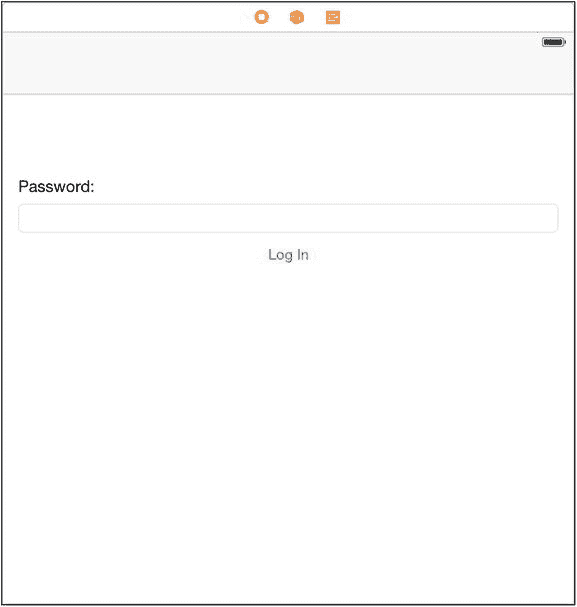

    *图 7-6. 密码视图控制器*

6.  最后一项任务是将导航控制器的 segue 指向密码视图控制器。选中导航控制器，打开连接检查器，断开与主视图控制器的连接。然后，从 **root view controller** 行末端的圆点拖拽到密码视图控制器，segue 将正确更新。完成后的故事板应类似于图 7-7。

    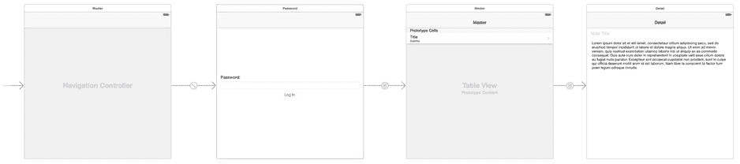

    *图 7-7. 完成后的故事板*

## 运行 `SecureNote`

现在你应该能够构建并运行 `SecureNote` 了。运行后，你应该会看到密码视图。输入任意内容设置密码，然后点击 **Log In**。接着，你应该能够点击 **+** 按钮添加笔记，或点击现有笔记进行编辑。

如果你重新运行应用程序，应再次看到密码视图。输入错误密码并点击 **Log In** 不应有任何反应。输入正确密码并点击 **Log In** 应进入包含笔记列表的主视图。

如果你打开 SQLite 数据库并查看数据，会发现 `ZNOTE` 表中的 `ZBODY` 和 `ZTITLE` 列包含难以理解的乱码——这是我们加密转换器的成果。

## Transformable 的替代方案：数据保护

在上一节中，我们使用值转换器和 Common Crypto 库对数据进行逐字段加密。苹果提供了另一种在 iPhone 或 iPad 上加密数据的方法，称为数据保护。如果在设备上启用了数据保护，当设备锁定时，iOS 会加密其部分数据存储，并在解锁时解密。要启用数据保护，请根据设备和 iOS 版本，在**设置** → **触控 ID 与密码**或**设置** → **密码**中设置设备密码。在该设置屏幕的最底部，你应该会看到以下信息：“数据保护已启用。”请注意，此功能仅在真实设备上可用，在 iOS 模拟器中不可用。


开启数据保护并不会自动加密设备上的所有存储空间。若需加密 Core Data 数据存储，必须通过设置持久化存储的属性来手动开启。具体做法是：向 `NSFileManager` 的 `setAttributes:ofItemAtPath:error` 方法传递一个字典，其中 `NSFileProtectionKey` 键对应的值为 `NSFileProtectionComplete`。相关实现可参考 代码清单 7-44（Objective-C）或 代码清单 7-45（Swift）。

***代码清单 7-44*** 设置 Core Data 持久化存储使用数据保护（Objective-C）

```
- (NSPersistentStoreCoordinator *)persistentStoreCoordinator {
  if (_persistentStoreCoordinator != nil) {
    return _persistentStoreCoordinator;
  }

NSURL *storeURL = [[self applicationDocumentsDirectory] URLByAppendingPathComponent:@"SecureNote.sqlite"];

NSError *error = nil;
  _persistentStoreCoordinator = [[NSPersistentStoreCoordinator alloc] initWithManagedObjectModel:[self managedObjectModel]];
  if (![_persistentStoreCoordinator addPersistentStoreWithType:NSSQLiteStoreType configuration:nil URL:storeURL options:nil error:&error]) {
    NSLog(@"Unresolved error %@, %@", error, [error userInfo]);
    abort();
  }

// 加密持久化存储
  NSDictionary *fileAttributes = @{ NSFileProtectionKey : NSFileProtectionComplete };
  if (![[NSFileManager defaultManager] setAttributes: fileAttributes
                                        ofItemAtPath:[storeURL path]
                                               error:&error]) {
    NSLog(@"Unresolved error with persistent store encryption %@, %@", error, [error userInfo]);
    abort();
  }

return _persistentStoreCoordinator;
}
```

***代码清单 7-45*** 设置 Core Data 持久化存储使用数据保护（Swift）

```
lazy var persistentStoreCoordinator: NSPersistentStoreCoordinator? = {
    var coordinator: NSPersistentStoreCoordinator? = NSPersistentStoreCoordinator(managedObjectModel: self.managedObjectModel)
    let url = self.applicationDocumentsDirectory.URLByAppendingPathComponent("SecureNoteSwift.sqlite")
    var error: NSError? = nil
    var failureReason = "There was an error creating or loading the application's saved data."
    if coordinator!.addPersistentStoreWithType(NSSQLiteStoreType, configuration: nil, URL: url, options: nil, error: &error) == nil {
        coordinator = nil
        // 报告捕获的错误
        let dict = NSMutableDictionary()
        dict[NSLocalizedDescriptionKey] = "Failed to initialize the application's saved data"
        dict[NSLocalizedFailureReasonErrorKey] = failureReason
        dict[NSUnderlyingErrorKey] = error
        error = NSError.errorWithDomain("YOUR_ERROR_DOMAIN", code: 9999, userInfo: dict)
        NSLog("Unresolved error \(error), \(error!.userInfo)")
        abort()
    }

// 加密持久化存储
    let fileAttributes = [NSFileProtectionKey : NSFileProtectionComplete]
    if !NSFileManager.defaultManager().setAttributes(fileAttributes, ofItemAtPath: url.path!, error: &error) {
      NSLog("Unresolved error with persistent store encryption \(error), \(error!.userInfo)")
      abort()
    }

return coordinator
}()
```

当应用在启用了数据保护的设备上运行时，设备锁定时持久化存储的数据库文件将自动被加密。这种方法实现成本较低，但需要注意的是，一旦设备解锁，文件会自动解密，因此数据库的安全程度取决于设备本身。若有人能猜出密码，数据库仍可被访问，尤其是在设备已越狱（即获取了 root 权限）的情况下。该加密方法的另一个不便之处在于：对于非常大的数据库，解锁和启动应用所需的时间可能较长，因为在使用前需解密庞大的文件。

## 总结

本章介绍了值转换器（Value Transformer）以及如何利用它扩展 Core Data，使其能够存储任意数据类型。如果数据类型支持 `NSCoding` 协议（例如 `UIColor`），则无需提供自定义的值转换器类。即使数据类型不支持 `NSCoding` 协议，我们也看到添加自定义值转换器非常简单，能够轻松实现对 Core Data 存储中任意数据类型的读写操作。

此外，我们还学习了如何通过设置 Core Data 存储文件的属性，利用 iOS 内置的数据保护功能。

掌握这些知识后，我们就能保护应用数据免受窥探，甚至可能避开 NSA 的监视！

# 第 8 章 与服务交互：iCloud 与 Dropbox

从 iOS 5 开始，苹果为 Core Data 引入了 iCloud 同步功能。iOS 开发者曾为这一即插即用的解决方案感到欣喜，它能在 iPhone 应用、iPad 应用和 Mac OS X 应用之间同步数据。然而，当他们真正开始使用 iCloud 同步 Core Data 数据存储时，喜悦便被泪水所取代。事实证明，同步是一个难以攻克的难题，而苹果目前尚未完美解决——至少对 Core Data 而言。不过，随着苹果对同步技术的不断迭代，它很可能会在未来的 SDK 版本中使 iCloud Core Data 同步正常运作。为了让读者有所了解，本章将介绍使用 iCloud Core Data 同步的相关信息。

其他 Core Data 同步解决方案也应运而生，包括诸如 `ParcelKit`（`https://github.com/overcommitted/ParcelKit`）、`Ensembles`（`www.ensembles.io/`）以及 `TICoreDataSync`（`http://timisted.github.io/TICoreDataSync/`）等库。我们建议你研究这些解决方案，并参考其官方网站上的文档，判断它们是否更适合你和你的应用。本书不会复制这些文档，也不会涵盖所有这些库。不过，我们会探讨 Dropbox 提供的同步解决方案，以及前面提到的、基于 Dropbox 同步 Core Data 的 `ParcelKit`。

## 集成 iCloud

虽然早期版本的 iCloud Core Data 同步需要绞尽脑汁才能勉强运行，但 iOS 7 使得 iCloud 同步的管理变得简单得多。在本节中，我们将使用 Xcode 的模板构建一个简单的应用，并使用 iCloud 将数据同步到云端。首先，在 Xcode 中使用“Master-Detail Application”模板创建一个新项目，如图 8-1 所示。

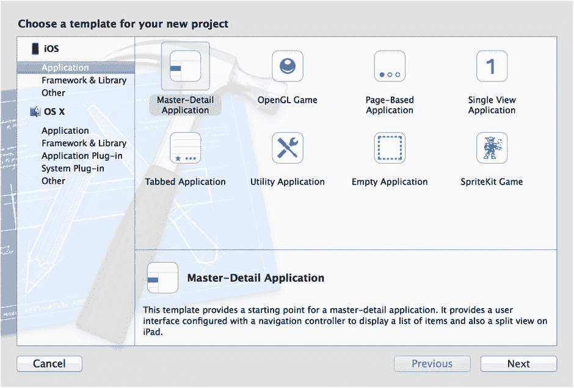

图 8-1 创建主从应用

在下一个界面中，将应用命名为 `iCloudApp`，设备选择 iPhone，并确保勾选“Use Core Data”复选框。至此，我们拥有一个使用本地 Core Data 存储的非常简单的应用。你可以启动应用进行测试。

**提示** 如果尚未完成，现在是在 iOS 模拟器中启用 iCloud 的好时机。在 iOS 模拟器中，启动“设置”应用并选择 iCloud 选项，输入您的凭据并登录。

### 使用 iCloud 的 Ubiquity 容器

在本小节中，我们将告知 iOS 数据存储文件需要保存在 iCloud 中，具体位置称为“Ubiquity 容器”。打开 `AppDelegate.m` 或 `AppDelegate.swift`，找到 `persistentStoreCoordinator` 方法，如 代码清单 8-1（Objective-C）和 代码清单 8-2（Swift）所示。

***代码清单 8-1*** 默认的 `persistentStoreCoordinator` 方法（Objective-C）

```
- (NSPersistentStoreCoordinator *)persistentStoreCoordinator
```

{  
    `// 应用的持久化存储协调器。此实现创建并返回一个协调器，并已为其添加了应用的数据存储。`  
    `if (_persistentStoreCoordinator != nil) {`  
        `return _persistentStoreCoordinator;`  
    `}`

`// 创建协调器和存储`


`_persistentStoreCoordinator = [[NSPersistentStoreCoordinator alloc] initWithManagedObjectModel:[self managedObjectModel]];`
`NSURL *storeURL = [[self applicationDocumentsDirectory] URLByAppendingPathComponent:@"iCloudApp.sqlite"];`
`NSError *error = nil;`
`NSString *failureReason = @"创建或加载应用的保存数据时出错。";`
`if (![_persistentStoreCoordinator addPersistentStoreWithType:NSSQLiteStoreType configuration:nil URL:storeURL options:nil error:&error]) {`
`// 报告遇到的任何错误。`
`NSMutableDictionary *dict = [NSMutableDictionary dictionary];`
`dict[NSLocalizedDescriptionKey] = @"初始化应用的保存数据失败";`
`dict[NSLocalizedFailureReasonErrorKey] = failureReason;`
`dict[NSUnderlyingErrorKey] = error;`
`error = [NSError errorWithDomain:@"YOUR_ERROR_DOMAIN" code:9999 userInfo:dict];`
`// 替换以下代码以适当处理错误。`
`// abort() 会导致应用生成崩溃日志并终止。在生产环境中不应使用此函数，尽管它在开发期间可能有用。`
`NSLog(@"未解决的错误 %@, %@", error, [error userInfo]);`
`abort();`
`}`

`return _persistentStoreCoordinator;`
`}`

### 列表 8-2. 默认的 `persistentStoreCoordinator` 方法（Swift）

`lazy var persistentStoreCoordinator: NSPersistentStoreCoordinator? = {`
`// 应用的持久化存储协调器。此实现会创建并返回一个协调器，并已为其添加了应用的存储。此属性是可选的，因为存在一些合理的错误条件可能导致创建存储失败。`
`// 创建协调器和存储`
`var coordinator: NSPersistentStoreCoordinator? = NSPersistentStoreCoordinator(managedObjectModel: self.managedObjectModel)`
`let url = self.applicationDocumentsDirectory.URLByAppendingPathComponent("iCloudAppSwift.sqlite")`
`var error: NSError? = nil`
`var failureReason = "创建或加载应用的保存数据时出错。"`
`if coordinator!.addPersistentStoreWithType(NSSQLiteStoreType, configuration: nil, URL: url, options: nil, error: &error) == nil {`
`coordinator = nil`
`// 报告遇到的任何错误。`
`let dict = NSMutableDictionary()`
`dict[NSLocalizedDescriptionKey] = "初始化应用的保存数据失败"`
`dict[NSLocalizedFailureReasonErrorKey] = failureReason`
`dict[NSUnderlyingErrorKey] = error`
`error = NSError(domain: "YOUR_ERROR_DOMAIN", code: 9999, userInfo: dict)`
`// 替换以下代码以适当处理错误。`
`// abort() 会导致应用生成崩溃日志并终止。在生产环境中不应使用此函数，尽管它在开发期间可能有用。`
`NSLog("未解决的错误 \(error), \(error!.userInfo)")`
`abort()`
`}`

`return coordinator`
`}()`

为了添加与 iCloud 的集成，我们需要告诉 Core Data 存储文件需要同步。更新该方法，向 `addPersistentStoreWithType` 调用传递一个选项字典，如列表 8-3（Objective-C）或列表 8-4（Swift）所示。

### 列表 8-3. 为 iCloud 同步更新后的 `persistentStoreCoordinator` 方法（Objective-C）

`if (![_persistentStoreCoordinator addPersistentStoreWithType:NSSQLiteStoreType configuration:nil URL:storeURL options:@{ NSPersistentStoreUbiquitousContentNameKey : @"iCloudApp" } error:&error]) {`

### 列表 8-4. 为 iCloud 同步更新后的 `persistentStoreCoordinator` 方法（Swift）

`let options = [NSPersistentStoreUbiquitousContentNameKey: "iCloudAppSwift"]`
`if coordinator!.addPersistentStoreWithType(NSSQLiteStoreType, configuration: nil, URL: url, options: options, error: &error) == nil {`

唯一的改动是将 `NSPersistentStoreUbiquitousContentNameKey` 设置为持久化存储协调器的一个选项。ubiquity 容器是一个自动管理与 iCloud 同步文件的组件。它是 iCloud 数据的本地表现形式，位于应用沙盒之外的文件系统中。通过设置此选项，你告诉 Core Data 持久化存储文件位于 ubiquity 容器中，因此会与 iCloud 同步。

如果你之前启动过 `iCloudApp`，请从 iPhone 模拟器中删除它，以便移除所有 SQLite 数据库文件。然后启动应用。你会注意到变化不大——它正常启动了。然而，不同之处在于数据存储文件的位置。如果你打开终端应用并导航到应用的 `Documents` 文件夹，你会发现没有 `iCloudApp.sqlite` 文件。

取而代之的是一个 `CoreDataUbiquitySupport` 目录，这是 iOS 为将你的文件附加到 ubiquity 容器而创建的。如果你导航浏览此目录，你会发现你的 SQLite 文件深藏于文件结构中。

```
find "$HOME/Library/Developer/CoreSimulator" -name "iCloudApp.sqlite"
```

### 同步内容

至此，我们有了一个将数据存储保存在 iCloud 中的应用。这对于备份数据来说是个很好的解决方案，但如果你在多台设备上使用应用，则效果不佳。不幸的是，云只会保留你最后使用的那台设备保存的数据，可能会覆盖你其他设备保存的数据。

为了让你的代码跨设备同步数据，你需要订阅 Core Data 为 iCloud 同步发送的通知。表 8-1 列出了这些通知。

### 表 8-1. 可用的通知类型

| **通知类型** | **描述** |
| --- | --- |
| `NSPersistentStoreUbiquitousTransitionTypeAccountAdded` | 当应用运行时添加了新的 iCloud 账户时发送。这有助于将存储迁移到新账户。 |
| `NSPersistentStoreUbiquitousTransitionTypeAccountRemoved` | 当应用运行时从设备移除了现有 iCloud 账户时发送。这告诉你持久化存储正在过渡到本地存储。 |
| `NSPersistentStoreUbiquitousTransitionTypeContentRemoved` | 当用户清除了 iCloud 账户的内容时发送，通常是通过设置中的“文稿与数据”使用“删除全部”操作。Core Data 集成将因此过渡到一个空的存储文件。 |
| `NSPersistentStoreUbiquitousTransitionTypeInitialImportCompleted` | 当 Core Data 完成构建与 iCloud 账户内容一致的存储文件时发送。 |

你可以通过使用存储通知，确保你的应用能响应 iCloud 的变化，从而正确合并所有内容。

打开 `AppDelegate.m` 或 `AppDelegate.swift`，在创建持久化存储之后、将其添加到协调器之前，立即向 `persistentStoreCoordinator` 方法中添加适当的通知。该方法应如列表 8-5（Objective-C）或列表 8-6（Swift）所示。


### **清单 8-5**. 将 iCloud 通知添加到 `persistentStoreCoordinator` 方法（Objective-C）

```
...
_persistentStoreCoordinator = [[NSPersistentStoreCoordinator alloc] initWithManagedObjectModel:[self managedObjectModel]];
NSURL *storeURL = [[self applicationDocumentsDirectory] URLByAppendingPathComponent:@"iCloudApp.sqlite"];
NSError *error = nil;
NSString *failureReason = @"There was an error creating or loading the application's saved data.";

// iCloud notification subscriptions
NSNotificationCenter *notificationCenter = [NSNotificationCenter defaultCenter];
[notificationCenter addObserver:self selector:@selector(storeWillChange:) name:NSPersistentStoreCoordinatorStoresWillChangeNotification object:_persistentStoreCoordinator];
[notificationCenter addObserver:self selector:@selector(storeDidChange:) name:NSPersistentStoreCoordinatorStoresDidChangeNotification object:_persistentStoreCoordinator];
[notificationCenter addObserver:self selector:@selector(storeDidImportUbiquitousContentChanges:) name:NSPersistentStoreDidImportUbiquitousContentChangesNotification object:_persistentStoreCoordinator];

if (![_persistentStoreCoordinator addPersistentStoreWithType:NSSQLiteStoreType configuration:nil URL:storeURL options:@{ NSPersistentStoreUbiquitousContentNameKey : @"iCloudApp" } error:&error]) {
...
```

### **清单 8-6**. 将 iCloud 通知添加到 `persistentStoreCoordinator` 函数（Swift）

```
...
var coordinator: NSPersistentStoreCoordinator? = NSPersistentStoreCoordinator(managedObjectModel: self.managedObjectModel)
let url = self.applicationDocumentsDirectory.URLByAppendingPathComponent("iCloudAppSwift.sqlite")
var error: NSError? = nil
var failureReason = "There was an error creating or loading the application's saved data."

let notificationCenter = NSNotificationCenter.defaultCenter()
notificationCenter.addObserver(self, selector: "storeWillChange:", 
    name: NSPersistentStoreCoordinatorStoresWillChangeNotification, 
    object: coordinator!)
notificationCenter.addObserver(self, selector: "storeDidChange:", 
    name: NSPersistentStoreCoordinatorStoresDidChangeNotification, 
    object: coordinator!)
notificationCenter.addObserver(self, selector: "storeDidImportUbiquitousContentChanges:", 
    name: NSPersistentStoreDidImportUbiquitousContentChangesNotification, 
    object: coordinator!)

let options = [NSPersistentStoreUbiquitousContentNameKey: "iCloudAppSwift"]
if coordinator!.addPersistentStoreWithType(NSSQLiteStoreType, configuration: nil, URL: url, options: options, error: &error) == nil {
...
```

当然，你必须创建通知选择器所引用的三个新方法，以消除编译警告（并最终避免运行时异常）。仍在 `AppDelegate.m` 或 `AppDelegate.swift` 中，添加**清单 8-7**（Objective-C）或**清单 8-8**（Swift）中所示的方法。

### **清单 8-7**. 处理 iCloud 通知（Objective-C）

```
- (void)storeDidImportUbiquitousContentChanges:(NSNotification*)notification {
}

- (void)storeWillChange:(NSNotification*)notification {
}

- (void)storeDidChange:(NSNotification*)notification {
}
```

### **清单 8-8**. 处理 iCloud 通知（Swift）

```
func storeDidImportUbiquitousContentChanges(notification: NSNotification) {
}

func storeWillChange(notification: NSNotification) {
}

func storeDidChange(notification: NSNotification) {
}
```

当然，让这些方法保持为空不会有什么实际作用。在下一节中，我们将完善这些方法，以从 iCloud 合并内容。

## 合并来自 iCloud 的内容

当其他使用与你当前设备相同 iCloud 帐户的设备上的数据发生更改时，应用程序需要知道并能够将来自云端的新内容与其当前内容合并。其当前内容也可能包括 iCloud 尚不了解的新创建内容。你在 `NSPersistentStoreDidImportUbiquitousContentChangesNotification` 通知的处理程序中合并设备与 iCloud 之间的更改。按**清单 8-9**（Objective-C）或**清单 8-10**（Swift）所示修改 `storeDidImportUbiquitousContentChanges` 方法以执行合并。

### **清单 8-9**. 为 iCloud 同步更新的 `storeDidImportUbiquitousContentChanges` 方法（Objective-C）

```
- (void)storeDidImportUbiquitousContentChanges:(NSNotification*)notification {
    NSLog(@"%@", notification.userInfo.description);

NSManagedObjectContext *moc = self.managedObjectContext;
    [moc performBlock:^{
        // Merge the content
        [moc mergeChangesFromContextDidSaveNotification:notification];
    }];

dispatch_async(dispatch_get_main_queue(), ^{
        // Refresh the UI here
    });
}
```

### **清单 8-10**. 为 iCloud 同步更新的 `storeDidImportUbiquitousContentChanges` 函数（Swift）

```
func storeDidImportUbiquitousContentChanges(notification: NSNotification) {
    print("did import: \(notification.userInfo?.description)")

if let moc = self.managedObjectContext {
        moc.performBlock({ () -> Void in
            // Merge the content
            moc.mergeChangesFromContextDidSaveNotification(notification)
        })

dispatch_async(dispatch_get_main_queue()) {
            // Refresh UI here
        }
    }
}
```

在此方法中，我们只需在托管对象上下文上调用 `mergeChangesFromContextDidSaveNotification:`，让 Core Data 处理合并。我们使用 `performBlock:` 方法执行此操作，以便在上下文的队列上异步执行更改，而不是在主队列上执行，以免降低用户界面的响应能力。

最后，如有必要，我们可以刷新用户界面（UI）。如果您的应用程序正在显示的视图需要修改，因为它们所显示的数据依赖于已更改的数据，那么这里是调用 UI 刷新的好地方。

## 处理 iCloud 帐户更改

如果您的应用程序在 iCloud 配置发生更改时正在运行（例如，如果您启用了 iCloud），那么您应该处理配置更改可能导致的潜在更改。为了处理此类更改，请对指示持久化存储更改的通知做出反应，这些更改位于 `storeWillChange:` 和 `storeDidChange:` 方法内部。按**清单 8-11**（Objective-C）或**清单 8-12**（Swift）所示更新这些方法中的代码。

### **清单 8-11**. 处理 iCloud 帐户更改（Objective-C）

```
- (void)storeWillChange:(NSNotification *)notification {
    NSLog(@"%@", notification.userInfo.description);
    NSManagedObjectContext *moc = self.managedObjectContext;
    [moc performBlockAndWait:^{
        NSError *error = nil;
        if ([moc hasChanges]) {
            [moc save:&error];
        }

[moc reset];
    }];

// This is a good place to let your UI know it needs to get ready
    // to adjust to the change and deal with new data. This might include
    // invalidating UI caches, reloading data, resetting views, etc...
}

- (void)storeDidChange:(NSNotification *)notification {
    NSLog(@"%@", notification.userInfo.description);
    // At this point it's official, the change has happened. Tell your
    // user interface to refresh itself
    dispatch_async(dispatch_get_main_queue(), ^{
        // Refresh the UI here
    });
}
```


***列表 8-12***. 处理 iCloud 账户的变更 (Swift)

```
func storeWillChange(notification: NSNotification) {
    print("will change: \(notification.userInfo?.description)")
    if let moc = self.managedObjectContext {
        moc.performBlockAndWait({ () -> Void in
            var error: NSError? = nil
            if moc.hasChanges {
                moc.save(&error)
            }
            moc.reset()
        })
    }
}

func storeDidChange(notification: NSNotification) {
    print("did change: \(notification.userInfo?.description)")
    // 此时已确定，变更已经发生。请告知你的用户界面进行自我刷新
    dispatch_async(dispatch_get_main_queue()) {
        NSFetchedResultsController.deleteCacheWithName("Master")
        // 在此处刷新 UI
    }
}
```

尽早为变更准备好 UI 通常更好，这样可以减少实际应用刷新所需的时间。因此，通知被分解为两个你可能已经熟悉的阶段（即将发生变更和已经发生变更）。

在我们的 `storeWillChange:` 实现中，我们保存托管对象上下文（如果它有变更），然后重置其状态，这会丢弃所有托管对象。这时，你就可以准备让你的 UI 进行变更了。

在我们的 `storeDidChange:` 实现中，我们异步更新 UI。

你的代码现在已经准备好处理 iCloud 集成了。在将应用程序提交给 Apple 之前，你需要在应用中添加 iCloud 授权。你可以在 Xcode 中通过选择项目并转到“Capabilities”选项卡来完成此操作。在该选项卡中，你会看到 iCloud 部分，旁边有一个开关。打开该开关，如图 8-2 所示，即可向你的应用添加 iCloud 授权。

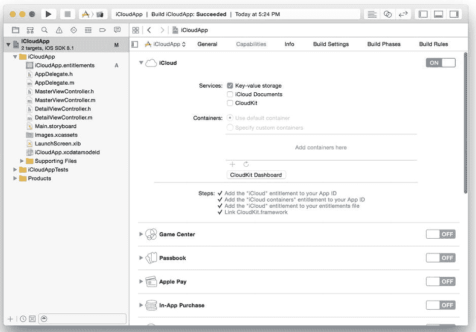

图 8-2. 添加 iCloud 授权

## 与 Dropbox Datastore API 集成

在 iOS 上，通常很关注与 iCloud 集成以实现持久化。然而，根据你的应用和目标受众，其他解决方案可能更适合你。Dropbox 发布了其 Datastore 应用程序编程接口 (API)，允许你将它的云服务用作通用的数据存储。与 iCloud 相比，使用 Dropbox 的一个明显优势是 Dropbox 拥有适用于多个平台的 API。Dropbox Datastore API 的功能不像 Core Data。它不打算充当在资源之间创建链接的关系数据库。相反，它是一个简单的键/值对存储，非常类似于 NoSQL 数据库，如 MongoDB 或 Cassandra。一个基本的特性是它允许你在没有模式（schema）的情况下工作，因此你无需过多担心模式更新和迁移。

### 设置 API 访问权限

对于 iOS，设置说明位于 `www.dropbox.com/developers/datastore/sdks/ios`。在你的应用中设置 Dropbox 的第一步是在 Dropbox 网站上创建一个 Dropbox 应用。登录到你的 Dropbox 账户，然后转到 `www.dropbox.com/developers/apps` 创建一个新应用。选择 **Dropbox API 应用** 和 **仅数据存储（Datastores only）**，然后为你的应用选择一个名称。对于名称，请确保不要违反 Dropbox 品牌指南。特别是，不要在应用名称中使用“Dropbox”或类似名称。该名称在所有 Dropbox 应用中必须是唯一的，因此你必须选择一个不同于“iOSPersistenceApp”的名称，这是我们选择的名称（参见图 8-3）。

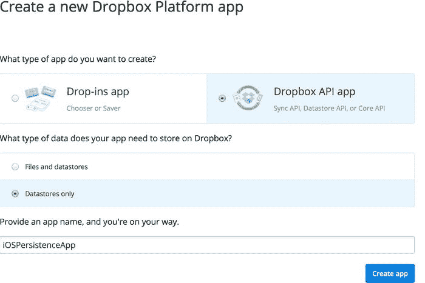

图 8-3. 创建一个 Dropbox 应用程序

创建应用后，下一个屏幕会显示你的应用密钥（app key）和应用密码（app secret），你的应用代码中需要这些信息才能与 Dropbox 通信。应用密码，顾名思义，应予以保密。

我们现在可以创建新应用了。

### 创建一个用于 Dropbox 的空白应用

既然我们正在尝试使用 Dropbox 作为持久化框架，我们将暂时离开 Core Data。

1.  在 Xcode 中，创建一个名为 DropboxPersistenceApp 的新“单视图应用”，并且不要选中“Core Data”复选框。
2.  Xcode 创建好应用后，将 Dropbox 框架添加到应用中。为此，请从 Dropbox 网站 (`www.dropbox.com/developers/datastore/sdks/ios`) 下载它，并将下载的文件解压到一个临时目录。然后，将 `Dropbox.framework` 拖放到你的 Xcode 项目中，放到 Products 文件夹下方。
3.  在出现的表单中，在点击“完成”之前，务必勾选 **如果需要，拷贝项目（Copy items if needed）**。
4.  然后，将 Dropbox SDK 所需的其他框架添加到你的项目中：`CFNetwork.framework`、`Security.framework`、`SystemConfiguration.framework`、`QuartzCore.framework`、`libc++.dylib` 和 `libz.dylib`。

你的项目结构应该类似于图 8-4。

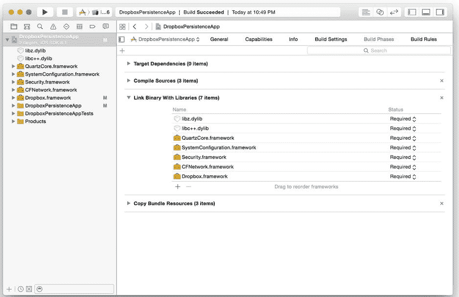

图 8-4. 向应用添加 Dropbox 框架

### 配置回调 URL

为了使你的应用能够针对 Dropbox 进行身份验证，你的应用会将控制权交给 Dropbox SDK 提供的 Dropbox 身份验证控制器。此身份验证控制器显示 Dropbox 登录屏幕，并在成功验证用户身份后，通过统一资源定位符 (URL) 回调的方式将控制权返回给你的应用。你的应用必须将其自身注册为该 URL 方案（scheme）的处理程序，以便 iOS 能够正确地将控制权交还给你的应用。

要将你的应用注册为 URL 方案的处理程序，请转到 Xcode，在“TARGETS”下选择你的项目，然后转到“Info”选项卡。展开“URL Types”部分，然后按 + 按钮创建一个新的 URL 类型。在“URL Schemes”字段中，输入 **db-应用密钥**，但要将“应用密钥”替换为 Dropbox 在创建应用时提供给你的应用密钥。它看起来应该像 **db-vp4jwudouxvhzz9**。保持其他字段不变。当你的应用安装后（无论是在模拟器还是真实设备上），它都会正确地进行注册。

### 使用 Datastore API 链接到 Dropbox

为了让你的代码使用 Dropbox Datastore API，它必须初始化存储管理器，即一个 `DBStoreManager` 实例。在你的应用委托中执行此初始化是一个好地方。如果你是用 Objective-C 构建此项目，请打开 `AppDelegate.m` 并添加两个导入指令：

```
#import "TargetConditionals.h"
#import <Dropbox/Dropbox.h>
```

然后编辑 `application: didFinishLaunchingWithOptions:` 方法以添加 Dropbox Datastore 初始化。列表 8-13 展示了 Objective-C 版本，列表 8-14 展示了 Swift 版本。

***列表 8-13***. 初始化 Dropbox Datastore API (Objective-C)

```
DBAccountManager *accountManager = [[DBAccountManager alloc]
                                   initWithAppKey:@"应用密钥" secret:@"应用密码"];
[DBAccountManager setSharedManager:accountManager];
```

***列表 8-14***. 初始化 Dropbox Datastore API (Swift)

```
let accountManager = DBAccountManager(appKey: "应用密钥", secret: "应用密码")
DBAccountManager.setSharedManager(accountManager)
```

请务必将 `应用密钥` 和 `应用密码` 替换为你在 Dropbox 网站上创建应用时由 Dropbox 提供的值。

完成此配置后，我们需要考虑让用户通过应用链接其 Dropbox 账户。我们通过在视图控制器中提供以下机制来实现用户链接 Dropbox 的功能：


1.  在 `ViewController.h` 中（如果使用 Objective-C 实现），按照代码清单 8-15 所示，添加用于处理点击以启动 Dropbox 登录窗口的方法声明。
2.  按照代码清单 8-16（Objective-C）或代码清单 8-17（Swift），在 `ViewController.m` 或 `ViewController.swift` 中实现该方法。此外，对于 Objective-C 版本，在 `ViewController.m` 中添加对 `"TargetConditionals.h"` 和 `<Dropbox/Dropbox.h>` 的导入语句。
3.  在 Interface Builder 中，向 `Main.storyboard` 的应用程序视图添加一个标签为“Link to Dropbox”的按钮，并通过 Touch Up Inside 事件将其连接到 `didPressLink` 方法。

***代码清单 8-15*** 在 `ViewController.h` 中声明事件处理器
```objc
- (IBAction)didPressLink;
```

***代码清单 8-16*** 处理按钮点击以登录 Dropbox（Objective-C）
```objc
- (IBAction)didPressLink {
  DBAccount *linkedAccount = [[DBAccountManager sharedManager] linkedAccount];
  if (linkedAccount) {
    NSLog(@"App already linked");
  }
  else {
    [[DBAccountManager sharedManager] linkFromController:self];
  }
}
```

***代码清单 8-17*** 处理按钮点击以登录 Dropbox（Swift）
```swift
@IBAction func didPressLink(sender: AnyObject) {
    if let linkedAccount = DBAccountManager.sharedManager().linkedAccount {
        println("App already linked")
    }
    else {
        DBAccountManager.sharedManager().linkFromController(self)
    }
}
```

现在你可以启动应用。启动后，点击“Link to Dropbox”按钮，Dropbox 登录界面就会出现。你可以使用自己的 Dropbox 凭据登录（注意，如果你在 Dropbox 中设置了双重认证，此界面也能处理），然后控制权将返回给我们的应用。不幸的是，当控制权从 Dropbox 登录界面返回时，我们的应用并不知道该如何处理。这是因为 Dropbox 登录界面正在对我们的应用执行回调，并且该回调是通过我们之前设置的 URL 完成的。我们必须指示我们的应用处理该回调并从该 URL 打开。为此，需要在 `AppDelegate.m` 或 `AppDelegate.swift` 中实现 `application:openURL:sourceApplication:annotation:` 方法，如代码清单 8-18（Objective-C）或代码清单 8-19（Swift）所示。

***代码清单 8-18*** 在 `AppDelegate.m` 中处理 URL 回调
```objc
- (BOOL)application:(UIApplication *)application openURL:(NSURL *)url sourceApplication:(NSString *)sourceApplication annotation:(id)annotation {
  DBAccount *account = [[DBAccountManager sharedManager] handleOpenURL:url];
  if (account) {
    NSLog(@"App linked successfully from %@", sourceApplication);
    return YES;
  }
  return NO;
}
```

***代码清单 8-19*** 在 `AppDelegate.swift` 中处理 URL 回调
```swift
func application(application: UIApplication, openURL url: NSURL, sourceApplication: String, annotation: AnyObject?) -> Bool {
    let account = DBAccountManager.sharedManager().handleOpenURL(url)
    if let account = account {
        println("App linked successfully from \(sourceApplication)")
        return true
    }
    return false
}
```

此时，你需要更新 UI 以显示 Dropbox 账户已链接，并准备好应用程序以启用 Dropbox 连接。我们将在下一节中执行此操作。

## 使用 Dropbox API 创建和同步数据

现在我们的应用已链接到 Dropbox，接下来使用 Dropbox Persistence API 做一些事情。在 `ViewController.h` 中（针对 Objective-C 版本）声明一个按钮属性，如代码清单 8-20 所示，然后在 Interface Builder 中将其连接到“Link to Dropbox”按钮。这样，我们就可以适当地更改其文本以反映 Dropbox 的连接状态。

***代码清单 8-20*** 在 `ViewController.h` 中声明按钮
```objc
@property (weak, nonatomic) IBOutlet UIButton *theButton;
```

在 `AppDelegate.m` 或 `AppDelegate.swift` 中，修改 `application:openURL:sourceApplication:annotation:` 方法，使其看起来像代码清单 8-21（Objective-C）或代码清单 8-22（Swift），以便在成功链接到 Dropbox 后将按钮的文本设置为“Store”。对于 Objective-C 的 `AppDelegate.m`，请添加对 `ViewController.h` 的导入。

***代码清单 8-21*** 在 `AppDelegate.m` 中将按钮标题设置为“Store”
```objc
- (BOOL)application:(UIApplication *)application openURL:(NSURL *)url sourceApplication:(NSString *)sourceApplication annotation:(id)annotation {
  DBAccount *account = [[DBAccountManager sharedManager] handleOpenURL:url];
  if (account) {
    NSLog(@"App linked successfully from %@", sourceApplication);

    ViewController *rvc = (ViewController*)self.window.rootViewController;
    [rvc.theButton setTitle:@"Store" forState:UIControlStateNormal];

    return YES;
  }
  return NO;
}
```

***代码清单 8-22*** 在 `AppDelegate.swift` 中将按钮标题设置为“Store”
```swift
func application(application: UIApplication, openURL url: NSURL, sourceApplication: String, annotation: AnyObject?) -> Bool {
    let account = DBAccountManager.sharedManager().handleOpenURL(url)
    if let account = account {
        println("App linked successfully from \(sourceApplication)")

        let controller = self.window?.rootViewController as? ViewController
        controller?.theButton?.setTitle("Store", forState: .Normal)

        return true
    }
    return false
}
```

然后，为了保持一致性，编辑 `ViewController.m` 或 `ViewController.swift` 中的 `viewDidLoad` 方法，将按钮的标签设置为当前链接状态，如代码清单 8-23（Objective-C）或代码清单 8-24（Swift）所示。

***代码清单 8-23*** 在 `ViewController.m` 中设置按钮文本
```objc
- (void)viewDidLoad {
  [super viewDidLoad];

  if ([[DBAccountManager sharedManager] linkedAccount]) {
    [self.theButton setTitle:@"Store" forState:UIControlStateNormal];
  }
  else {
    [self.theButton setTitle:@"Link Dropbox" forState:UIControlStateNormal];
  }
}
```

***代码清单 8-24*** 在 `ViewController.swift` 中设置按钮文本
```swift
override func viewDidLoad() {
    super.viewDidLoad()

    if let linkedAccount = DBAccountManager.sharedManager().linkedAccount {
        self.theButton?.setTitle("Store", forState: .Normal)
    }
    else {
        self.theButton?.setTitle("Link Dropbox", forState: .Normal)
    }
}
```

当然，此时我们还没有存储任何内容。如果你运行应用，链接到 Dropbox，然后按下“Store”按钮，你只会得到一条日志消息，说账户已经链接。这是因为在我们处理按钮触摸事件时，除了尝试链接到 Dropbox 外，没有做其他任何事情。所以让我们改变这一点。

在 `ViewController.m` 或 `ViewController.swift` 中，添加一个私有属性，该属性将包含对我们 Dropbox 数据存储的引用，如代码清单 8-25（Objective-C）或代码清单 8-26（Swift）所示。


**代码清单 8-25.** `ViewController.m` 中 Dropbox 数据存储的私有属性

```
@interface ViewController ()
@property (nonatomic, strong) DBDatastore *datastore;
@end
```

**代码清单 8-26.** `ViewController.swift` 中 Dropbox 数据存储的属性

```
var datastore: DBDatastore?
```

`DBDatastore` 属性代表将自动与 Dropbox 同步的数据容器。只要在你的应用中保留一个它的实例，数据存储就会自动同步。

现在，你可以编辑 `didPressLink:` 方法，使其在账户已关联的情况下表现出不同的行为，如代码清单 8-27（Objective-C）或代码清单 8-28（Swift）所示。如其注释所述，这个更新后的方法执行以下操作：

*   如果 Dropbox 中尚不存在数据存储，则创建一个
*   获取 Notes 表的句柄，必要时创建该表
*   使用当前日期作为文本创建一条新笔记，并将其存储在 Dropbox 中
*   同步数据存储

**代码清单 8-27.** 在 Dropbox 中创建笔记（Objective-C）

```
- (IBAction)didPressLink {
    DBAccount *linkedAccount = [[DBAccountManager sharedManager] linkedAccount];
    if (linkedAccount) {
        // 如果还没有存储对象，则创建一个
        if (!self.datastore) self.datastore = [DBDatastore openDefaultStoreForAccount:linkedAccount error:nil];

        // 如果 Notes 表已存在，则创建或获取其句柄
        DBTable *notes = [self.datastore getTable:@"Notes"];

        // 制作一条新笔记进行存储。在正常应用中，这来自键入的文本。为简单起见，
        // 我们仅用时间戳生成文本
        NSDate *now = [NSDate date];
        NSString *noteText = [NSDateFormatter localizedStringFromDate:now
                                                           dateStyle:NSDateFormatterShortStyle
                                                           timeStyle:NSDateFormatterFullStyle];

        // 将新笔记插入表中
        [notes insert:@{ @"details": noteText, @"createDate": now, @"encrypted": @NO }];

        NSLog(@"Inserted new note: %@", noteText);

        // 确保通知 Dropbox 同步存储对象
        [self.datastore sync:nil];
    } else {
        [[DBAccountManager sharedManager] linkFromController:self];
    }
}
```

**代码清单 8-28.** 在 Dropbox 中创建笔记（Swift）

```
@IBAction func didPressLink(sender: AnyObject) {
    if let linkedAccount = DBAccountManager.sharedManager().linkedAccount {
        // 如果还没有存储对象，则创建一个
        if self.datastore == nil {
            self.datastore = DBDatastore.openDefaultStoreForAccount(linkedAccount, error: nil)
        }

        // 如果 Notes 表已存在，则创建或获取其句柄
        let notes = datastore?.getTable("Notes")

        // 制作一条新笔记进行存储。在正常应用中，这来自键入的文本。为简单起见，
        // 我们仅用时间戳生成文本
        let now = NSDate()
        let noteText = NSDateFormatter.localizedStringFromDate(now, dateStyle: .ShortStyle, timeStyle: .FullStyle)

        // 将新笔记插入表中
        notes?.insert(["details": noteText, "createDate": now, "encrypted": false])

        println("Inserted new note \(noteText)")

        // 确保通知 Dropbox 同步存储对象
        datastore?.sync(nil)
    } else {
        DBAccountManager.sharedManager().linkFromController(self)
    }
}
```

此时，你可以运行应用，在关联 Dropbox 后，每次按下“Store”按钮，都会在数据存储中添加一条新笔记。你甚至可以通过 Dropbox 的网页视图 `www.dropbox.com/developers/apps/datastores` 验证一切是否顺利。你应该会看到创建的应用带有一个用于浏览数据存储的链接。如果你点击“Browse”链接，应该会看到你在应用中创建的笔记列表。

当然，你始终可以在应用代码中查询数据存储以取回记录。例如，要获取 Notes 表中的所有笔记，你可以编写如代码清单 8-29（Objective-C）或代码清单 8-30（Swift）所示的代码。

**代码清单 8-29.** 检索所有笔记（Objective-C）

```
NSError *error;
DBTable *notes = [self.datastore getTable:@"Notes"];
NSArray *myNotes = [notes query:nil error:&error];
```

**代码清单 8-30.** 检索所有笔记（Swift）

```
var error: DBError?
let notes = datastore?.getTable("Notes")
let myNotes = notes?.query(nil, error: &error)
```

请注意，我们传递给 `query` 的参数是 `nil`，因此数据存储将返回 Notes 表中的所有记录。`query` 参数接受一个 `NSDictionary`（Objective-C）或 `AnyObject`（Swift）实例来过滤其返回的结果集。我们可以通过传递一个包含要过滤字段的字典对象来过滤结果。例如，假设我们放入 Notes 表中的某些记录是加密的——即传递给 `insert:` 的字典中 `@"encrypted"` 设置为 `@YES`。要仅检索这些记录，我们可以使用如代码清单 8-31（Objective-C）或代码清单 8-32（Swift）所示的代码。

**代码清单 8-31.** 过滤结果集（Objective-C）

```
NSError *error;
DBTable *notes = [self.datastore getTable:@"Notes"];
NSArray *myNotes = [notes query:@{ @"encrypted": @YES } error:&error];
```

**代码清单 8-32.** 过滤结果集（Swift）

```
var error: DBError?
let notes = datastore?.getTable("Notes")
let myNotes = notes?.query(["encrypted": true], error: &error)
```

当然，你也可以在字典中设置多个值以在多个键上进行过滤。

## 将 Core Data 与 Dropbox Datastore API 结合使用：ParcelKit

我们已经了解了如何使用 iCloud 备份和同步 Core Data 存储。也了解了如何将 Dropbox 的 Datastore API 用作无模式存储。在本节中，我们将探讨如何将 Datastore API 用作 Core Data 存储中 iCloud 的替代方案。为此，我们将使用 ParcelKit 库（`https://github.com/overcommitted/ParcelKit`）。

为了演示完整流程，我们从一个全新的应用开始。在 Xcode 中，使用 Master-Detail Application 模板创建一个新项目。将项目命名为 DropboxEvents，并且这次务必勾选“Use Core Data”复选框。

当然，你可以启动应用，获得常规的 Master-Detail 示例应用，在其中可以点击 + 按钮创建新事件。

### 添加 Dropbox 和 ParcelKit 所需的框架

你可以通过 Cocoapods（`http://cocoapods.org`）添加 ParcelKit，或者从 `https://github.com/overcommitted/ParcelKit` 下载源代码，并按照该页面的说明构建框架。如果你使用 Cocoapods，可以跳过本节其余部分。

在上一节中，我们了解了如何集成 Dropbox 并添加其所需的框架。对于 DropboxEvents 应用，重复这些步骤，将 `Dropbox.framework` 和其他所需的标准框架添加到项目中。

*   `CFNetwork.framework`
*   `Security.framework`
*   `SystemConfiguration.framework`
*   `QuartzCore.framework`
*   `libc++.dylib`
*   `libz.dylib`

接下来，将 ParcelKit 库本身添加到你的项目中。依赖关系应如图 8-5 所示。

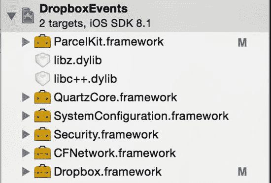

**图 8-5.** Dropbox/ParcelKit 应用的依赖关系


#### 作为 ParcelKit 配置的一部分，进入项目的 `Build Settings`，在 `Other Linker Flags` 中添加 `–ObjC` 标志，如图 Figure 8-6 所示。请注意，你需要为 Objective-C 和 Swift 版本都执行此操作。

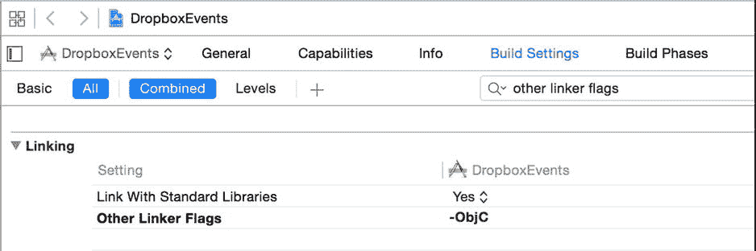

Figure 8-6. `Other Linker Flags` 条目

#### 将 `DropboxEvents` 与 Dropbox 集成

正如我们在 Dropbox Datastore API 部分构建的 `DropboxPersistenceApp` 应用一样，我们必须将 `DropboxEvents` 与 Dropbox 集成。让我们再走一遍流程。

1.  打开 `AppDelegate.m` 或 `AppDelegate.swift`，编辑 `application: didFinishLaunchingWithOptions:` 方法，如 Listing 8-33 (Objective-C) 或 Listing 8-34 (Swift) 所示，以初始化 Dropbox SDK。

**Listing 8-33**. 初始化 Dropbox SDK (Objective-C)
```objc
- (BOOL)application:(UIApplication *)application didFinishLaunchingWithOptions:(NSDictionary *)launchOptions {
    DBAccountManager *accountManager = [[DBAccountManager alloc] initWithAppKey:@"APP_KEY" secret:@"APP_SECRET"];
    [DBAccountManager setSharedManager:accountManager];

    UINavigationController *navigationController = (UINavigationController *)self.window.rootViewController;
    MasterViewController *controller = (MasterViewController *)navigationController.topViewController;
    controller.managedObjectContext = self.managedObjectContext;
    return YES;
}
```

**Listing 8-34**. 初始化 Dropbox SDK (Swift)
```swift
func application(application: UIApplication, didFinishLaunchingWithOptions launchOptions: [NSObject: AnyObject]?) -> Bool {
    let accountManager = DBAccountManager(appKey: "APP_KEY", secret: "APP_SECRET")
    DBAccountManager.setSharedManager(accountManager)

    // Override point for customization after application launch.
    let navigationController = self.window!.rootViewController as UINavigationController
    let controller = navigationController.topViewController as MasterViewController
    controller.managedObjectContext = self.managedObjectContext
    return true
}
```

2.  确保在 `AppDelegate.m` 顶部导入 `"TargetConditionals.h"` 和 `<Dropbox/Dropbox.h>`（如果适用），并将应用程序密钥和密钥替换为你从 Dropbox 获取的密钥和密钥。你可以重用用于 `DropboxPersistenceApp` 的应用程序密钥和密钥，或者也可以在 Dropbox 上创建一个新应用并获取新的应用程序密钥和密钥。
3.  此外，你必须在 `AppDelegate.m` 或 `AppDelegate.swift` 中添加处理从 Dropbox 身份验证控制器返回所需的方法，如 Listing 8-35 (Objective-C) 或 Listing 8-36 (Swift) 所示。

**Listing 8-35**. 处理 URL 回调 (Objective-C)
```objc
- (BOOL)application:(UIApplication *)application openURL:(NSURL *)url sourceApplication:(NSString *)sourceApplication annotation:(id)annotation {
    DBAccount *account = [[DBAccountManager sharedManager] handleOpenURL:url];
    if (account) {
        NSLog(@"App linked successfully from %@", sourceApplication);
        return YES;
    }
    return NO;
}
```

**Listing 8-36**. 处理 URL 回调 (Swift)
```swift
func application(application: UIApplication, openURL url: NSURL, sourceApplication: String, annotation: AnyObject?) -> Bool {
    let account = DBAccountManager.sharedManager().handleOpenURL(url)
    if let account = account {
        println("App linked successfully from \(sourceApplication)")
        return true
    }
    return false
}
```

4.  为了确保应用能够接收来自 Dropbox 身份验证控制器的回调，编辑 `DropboxEvents-Info.plist` 并添加 Dropbox URL 类型，正如我们在上一节中所做的那样，如图 Figure 8-7 所示。再次强调，请使用你从 Dropbox 获取的实际应用程序密钥，而不是 `"APP_KEY"`。

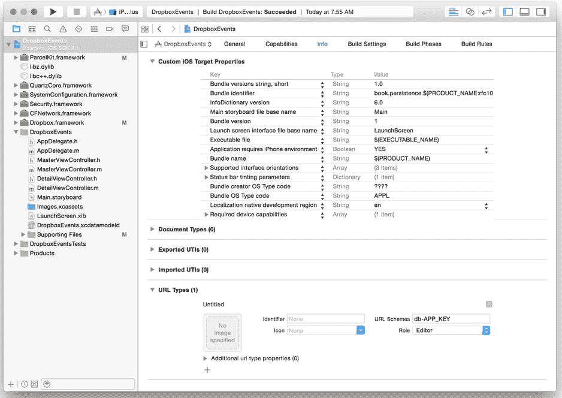

Figure 8-7. URL 类型

#### 使用 ParcelKit 进行编码

一旦设置工作完成，我们就可以开始考虑使用 ParcelKit 实际编码应用的持久化功能。幸运的是，ParcelKit 为我们完成了大部分繁重的工作，我们只需要通过代码进行配置。

1.  剩余的工作位于 `MasterViewController.m` 或 `MasterViewController.swift` 中，因此让我们打开相应的文件。我们需要做的第一件事是禁用 `NSFetchedResultsController` 的缓存，以防止在从云端接收数据时出现缓存不一致。这可能感觉有点奇怪，因为通常你应该为 `NSFetchedResultsController` 提供一个缓存以提高性能，但数据一致性胜过性能。转到 `fetchedResultsController` 方法，并将缓存名称从 `"Master"` 更改为 `nil`，如 Listing 8-37 (Objective-C) 或 Listing 8-38 (Swift) 所示。

**Listing 8-37**. 从 `fetchedResultsController` 中移除缓存 (Objective-C)
```objc
NSFetchedResultsController *aFetchedResultsController = [[NSFetchedResultsController alloc] initWithFetchRequest:fetchRequest managedObjectContext:self.managedObjectContext sectionNameKeyPath:nil cacheName:nil];
```

**Listing 8-38**. 从 `fetchedResultsController` 中移除缓存 (Swift)
```swift
let aFetchedResultsController = NSFetchedResultsController(fetchRequest: fetchRequest, managedObjectContext: self.managedObjectContext!, sectionNameKeyPath: nil, cacheName: nil)
```

2.  由于我们将使用 Dropbox 和 ParcelKit，因此在文件的顶部为 Objective-C 版本添加相应的 import 语句，如 Listing 8-39 所示。

**Listing 8-39**. 添加 Dropbox 和 ParcelKit 的 Import 语句
```objc
#import "TargetConditionals.h"
#import <Dropbox/Dropbox.h>
#import <ParcelKit/ParcelKit.h>
```

3.  仍在 `MasterViewController.m` 或 `MasterViewController.swift` 中，向私有接口添加两个属性，如 Listing 8-40 (Objective-C) 或 Listing 8-41 (Swift) 所示。

**Listing 8-40**. 为数据存储和同步管理器添加私有属性 (Objective-C)
```objc
@interface MasterViewController ()
@property (nonatomic, strong) DBDatastore *datastore;
@property (nonatomic, strong) PKSyncManager *syncManager;
@end
```

**Listing 8-41**. 为数据存储和同步管理器添加私有属性 (Swift)
```swift
var datastore: DBDatastore?
var syncManager: PKSyncManager?
```

4.  接下来我们需要关注链接过程。在我们的案例中，由于一切都依赖于 Dropbox 的链接状态，因此我们在主视图出现时检查链接状态——在 `viewDidAppear:` 方法中。将 Listing 8-42 (Objective-C) 或 Listing 8-43 (Swift) 中显示的代码添加到 `MasterViewController.m` 或 `MasterViewController.swift`。

**Listing 8-42**. 当视图出现时检查 Dropbox 链接状态 (Objective-C)
```objc
- (void)viewDidAppear:(BOOL)animated {
    [super viewDidAppear:animated];
```


```objectivec
DBAccount *linkedAccount = [[DBAccountManager sharedManager] linkedAccount];
if (linkedAccount) {
    if (!self.datastore) {
        NSLog(@"Initializing datastore with ParcelKit sync");
        self.datastore = [DBDatastore openDefaultStoreForAccount:linkedAccount error:nil];

        PKSyncManager *syncManager = [[PKSyncManager alloc] initWithManagedObjectContext:self.managedObjectContext datastore:self.datastore];

        [syncManager setTable:@"Events" forEntityName:@"Event"];
        [syncManager startObserving];
        self.syncManager = syncManager;
    }
} else {
    NSLog(@"Needs link");
    [[DBAccountManager sharedManager] linkFromController:self];
}
```

**代码清单 8-43.** 视图出现时检查 Dropbox 链接状态（Swift）

```swift
override func viewDidAppear(animated: Bool) {
    super.viewDidAppear()
    if let linkedAccount = DBAccountManager.sharedManager().linkedAccount {
        if datastore == nil {
            println("Initializing datastore with ParcelKit sync")

            self.datastore = DBDatastore.openDefaultStoreForAccount(linkedAccount, error: nil)

            self.syncManager = PKSyncManager(managedObjectContext: self.managedObjectContext, datastore: datastore)

            syncManager?.setTable("Events", forEntityName: "Event")
            syncManager?.startObserving()
        }
    } else {
        println("Needs link")
        DBAccountManager.sharedManager().linkFromController(self)
    }
}
```

让我们花点时间分析一下该方法的逻辑。首先，获取 Dropbox 链接账户。如果不存在任何账户（即值为 `nil`），则创建一个账户并启动链接流程。

如果应用已有链接账户，则直接使用该账户。我们按照上一节所述的方式设置 Dropbox 数据存储。接着创建 ParcelKit 的 `PKSyncManager` 实例，它负责监测 Core Data 托管对象的变更并与 Dropbox 同步，同时也会监测 Dropbox 中对象的变更并与 Core Data 托管对象同步。为了实现这一功能，ParcelKit 要求我们告知它需要监测哪些 Core Data 实体。本示例中只有一个实体：`Event`，我们需要将其与 Dropbox 数据存储中的 `Events` 表关联起来。请注意，虽然我们选择将 Core Data 实体的名称与 Dropbox 数据存储的表名保持一致，但这并非强制要求。`PKSyncManager` 的 `setTable:forEntityName:` 方法允许你使用任意名称来映射这两者。

`PKSyncManager` 实例完全配置完成后，必须将其赋值给 `syncManager` 属性，以保持其存活状态；否则它将会超出作用域并被销毁。

这就是我们需要编写的全部代码。正如之前所说，所有繁重工作都由 ParcelKit 完成！不过，还有最后一步操作需要完成才能让这一切正常运转：ParcelKit 要求在其监测的每个实体上设置一个名为 `syncID` 的额外属性。该属性是 ParcelKit 用于比较不同实体实例的关键，确保所有数据同步正确无误。打开 `DropboxEvents.xcdatamodeld`，在 `Event` 实体中添加一个类型为 `String` 的 `syncID` 属性，如图 8-8 所示。

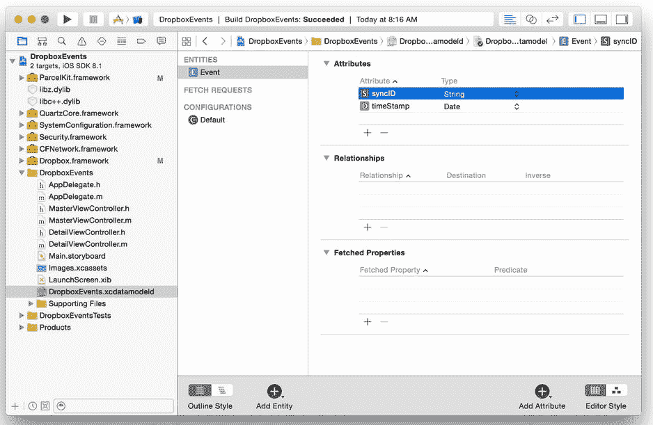

**图 8-8.** 为 ParcelKit 设置的 `syncID` 属性

由于我们修改了 Core Data 模型，因此需要从模拟器中删除现有的 Core Data 数据存储，以避免 Core Data 模型冲突。在 iPhone 模拟器中，长按应用图标，待图标晃动后，点击删除按钮卸载应用。然后按下 Home 键退出该模式。

现在一切就绪。运行应用，你会发现表面上似乎没有任何变化。请继续添加几个事件，它们会被顺利添加。为了观察差异，我们需要登录 Dropbox 的网页视图，网址为 `www.dropbox.com/developers/apps/datastores`。浏览你的数据存储，你应该能看到刚刚创建的事件，如图 8-9 所示。

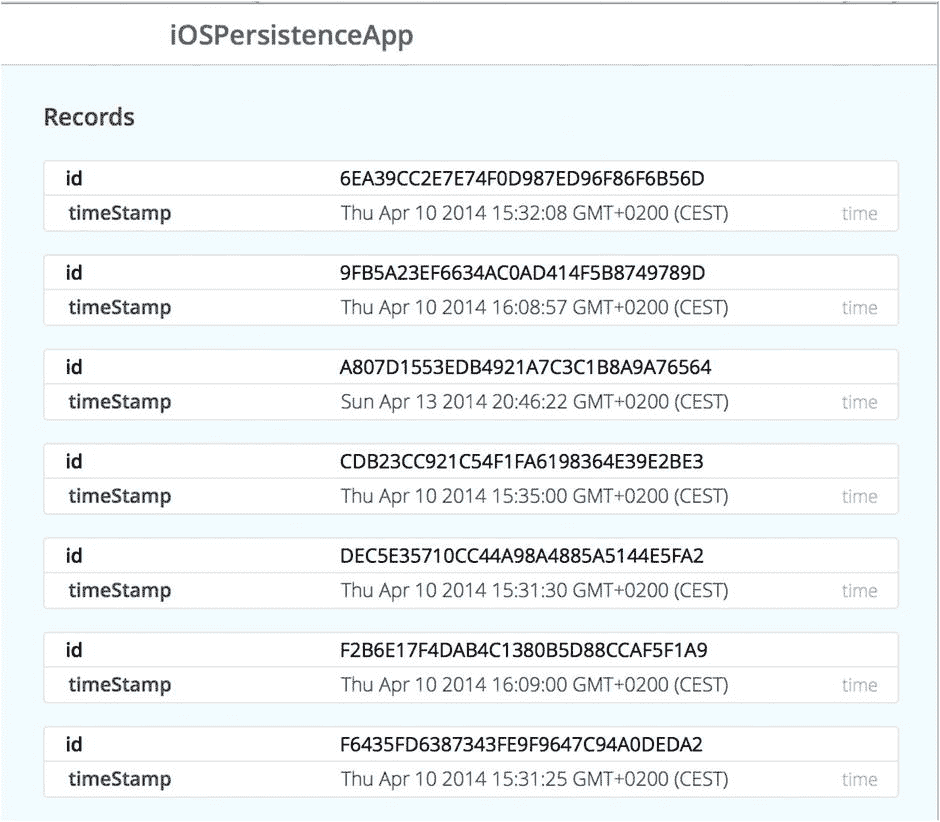

**图 8-9.** Dropbox 数据存储网页视图

当你在应用中添加新事件时，数据存储中也会出现新的记录。现在，你已创建了一些事件，请停止应用。按照之前的步骤，从 iPhone 模拟器中卸载该应用，这将清除本地的 Core Data 存储。如果是一个普通的 Core Data 应用，再次启动后事件将全部消失。现在，请启动应用，你会注意到所有事件依然存在。这是因为它们已通过 Dropbox 数据存储 API 完成了同步。

## 结论

如今，大多数消费者拥有多个设备，他们期望数据能在这些设备间无缝流通。本章介绍了三种云端数据存储方案，并额外提及了另外两种方案。实际上，还有更多云解决方案，范围从本章讨论的标准服务到你可能自行开发的定制服务。无论选择哪种方案，数据存储的发展趋势无疑指向了云端存储的需求。如果你的应用能处理好跨设备同步，用户就更有可能下载并使用它。在 iCloud、Dropbox 或其他方案之间做选择时，你需要根据目标用户、应用的特定特性，以及是否希望与非 Apple 设备上的应用同步数据来做出决定。

# 第 9 章：优化性能、内存使用与多线程

用户渴望即时得到答案。他们期望自己的设备能迅速提供这些答案。如果他们认为设备上的应用卡顿甚至只是运行缓慢，他们就会弃用甚至删除这些应用。你可以通过显示加载转轮来表明应用正在努力产出结果，这在一定程度上能安抚用户。提供设备正在工作的视觉提示，总比不给任何提示、让用户误以为设备死机要好；但更理想的做法是，永远不要出现让用户等待的缓慢情况。虽然你未必总能实现这一目标，但始终应尽力为之。

在持久化存储中获取和存储数据可能需要很长时间，尤其是在处理大量数据时。本章将确保你理解 Core Data 如何帮助你——以及你必须如何自助——以避免用户看到“请等待”的转轮，或更糟糕的情况：应用在检索或保存大型对象图时无响应，看似死机。你将学习如何运用各种工具和策略，例如缓存、故障、多线程以及 Xcode 自带的 Instruments 应用。

## 优化性能

“优化性能”这个词让人联想到一位机修工，他手拿扳手，俯身在操作台上的引擎旁，拧动螺栓、调整阀门，并测量这些调整对引擎性能的影响。在优化应用性能时，你同样需要具备这种严谨的学科精神：进行调整，并测量这些调整对整体性能的影响。本章将介绍多种提升应用性能的方法。你应该在自己编写的应用上尝试这些方法，并在模拟器和真实 iDevice 上测量其效果。

### 构建用于测试的应用


你需要一种方法来执行所有这些性能测试，以便验证结果。本节将引导你构建一个应用程序，该应用程序允许你运行各种测试并查看结果。如图 Figure 9-1 所示，该应用程序在一个标准的选择器视图中展示了一系列你可以运行的测试。要运行一项测试，请在选择器中选中它，点击 `Run Selected Test` 按钮，然后等待结果。测试运行后，你将看到开始时间、结束时间、测试经过的秒数，以及一些描述测试结果的文本。

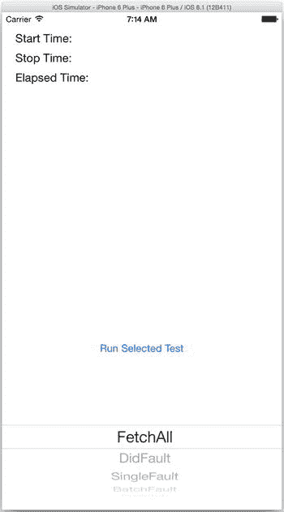

Figure 9-1。 PerformanceTuning 应用程序

## 创建项目

在 Xcode 中，创建一个名为 `PerformanceTuning` 的新 iPhone 单视图应用程序，并取消勾选 `User Core Data` 复选框。添加一个名为 `PerformanceTuning.xcdatamodeld` 的 Core Data 数据模型，以及一个名为 `Persistence` 的类来管理 Core Data 堆栈。Listings 9-1 和 9-2 分别展示了 `Persistence.h` 和 `Persistence.m`。Listing 9-3 展示了 `Persistence.swift`。

***Listing 9-1***。 `Persistence.h`

```
@import CoreData;

@interface Persistence : NSObject

@property (readonly, strong, nonatomic) NSManagedObjectContext *managedObjectContext;
@property (readonly, strong, nonatomic) NSManagedObjectModel *managedObjectModel;
@property (readonly, strong, nonatomic) NSPersistentStoreCoordinator *persistentStoreCoordinator;

- (void)saveContext;
- (NSURL *)applicationDocumentsDirectory;

@end
```

***Listing 9-2***。 `Persistence.m`

```
#import "Persistence.h"

@implementation Persistence

- (instancetype)init {
    self = [super init];
    if (self != nil) {
        // Initialize the managed object model
        NSURL *modelURL = [[NSBundle mainBundle] URLForResource:@"PerformanceTuning" withExtension:@"momd"];
        _managedObjectModel = [[NSManagedObjectModel alloc] initWithContentsOfURL:modelURL];

        // Initialize the persistent store coordinator
        NSURL *storeURL = [[self applicationDocumentsDirectory] URLByAppendingPathComponent:@"PerformanceTuning.sqlite"];

        NSError *error = nil;
        _persistentStoreCoordinator = [[NSPersistentStoreCoordinator alloc] initWithManagedObjectModel:self.managedObjectModel];
        if (![_persistentStoreCoordinator addPersistentStoreWithType:NSSQLiteStoreType
                                                       configuration:nil
                                                                 URL:storeURL
                                                             options:nil
                                                               error:&error]) {
            NSLog(@"Unresolved error %@, %@", error, [error userInfo]);
            abort();
        }

        // Initialize the managed object context
        _managedObjectContext = [[NSManagedObjectContext alloc] init];
        [_managedObjectContext setPersistentStoreCoordinator:self.persistentStoreCoordinator];
    }
    return self;
}

#pragma mark - Helper Methods

- (void)saveContext {
    NSError *error = nil;
    if ([self.managedObjectContext hasChanges] && ![self.managedObjectContext save:&error]) {
        NSLog(@"Unresolved error %@, %@", error, [error userInfo]);
        abort();
    }
}

- (NSURL *)applicationDocumentsDirectory {
    return [[[NSFileManager defaultManager] URLsForDirectory:NSDocumentDirectory inDomains:NSUserDomainMask] lastObject];
}

@end
```

***Listing 9-3***。 `Persistence.swift`

```
import Foundation
import CoreData

class Persistence {
    // MARK: - Core Data stack

    lazy var applicationDocumentsDirectory: NSURL = {
        // The directory the application uses to store the Core Data store file. This code uses a directory named "book.persistence.PerformanceTuningSwift" in the application's documents Application Support directory.
        let urls = NSFileManager.defaultManager().URLsForDirectory(.DocumentDirectory, inDomains: .UserDomainMask)
        return urls[urls.count-1] as NSURL
    }()

    lazy var managedObjectModel: NSManagedObjectModel = {
        // The managed object model for the application. This property is not optional. It is a fatal error for the application not to be able to find and load its model.
        let modelURL = NSBundle.mainBundle().URLForResource("PerformanceTuningSwift", withExtension: "momd")!
        return NSManagedObjectModel(contentsOfURL: modelURL)!
    }()

    lazy var persistentStoreCoordinator: NSPersistentStoreCoordinator? = {
        // The persistent store coordinator for the application. This implementation creates and return a coordinator, having added the store for the application to it. This property is optional since there are legitimate error conditions that could cause the creation of the store to fail.
        // Create the coordinator and store
        var coordinator: NSPersistentStoreCoordinator? = NSPersistentStoreCoordinator(managedObjectModel: self.managedObjectModel)
        let url = self.applicationDocumentsDirectory.URLByAppendingPathComponent("PerformanceTuningSwift.sqlite")
        var error: NSError? = nil
        var failureReason = "There was an error creating or loading the application's saved data."
        if coordinator!.addPersistentStoreWithType(NSSQLiteStoreType, configuration: nil, URL: url, options: nil, error: &error) == nil {
            coordinator = nil
            // Report any error we got.
            let dict = NSMutableDictionary()
            dict[NSLocalizedDescriptionKey] = "Failed to initialize the application's saved data"
            dict[NSLocalizedFailureReasonErrorKey] = failureReason
            dict[NSUnderlyingErrorKey] = error
            error = NSError(domain: "YOUR_ERROR_DOMAIN", code: 9999, userInfo: dict)
            // Replace this with code to handle the error appropriately.
            // abort() causes the application to generate a crash log and terminate. You should not use this function in a shipping application, although it may be useful during development.
            NSLog("Unresolved error \(error), \(error!.userInfo)")
            abort()
        }

        return coordinator
    }()

    lazy var managedObjectContext: NSManagedObjectContext? = {
        // Returns the managed object context for the application (which is already bound to the persistent store coordinator for the application.) This property is optional since there are legitimate error conditions that could cause the creation of the context to fail.
        let coordinator = self.persistentStoreCoordinator
        if coordinator == nil {
            return nil
        }
        var managedObjectContext = NSManagedObjectContext()
        managedObjectContext.persistentStoreCoordinator = coordinator
        return managedObjectContext
    }()

    // MARK: - Core Data Saving support

    func saveContext () {
        if let moc = self.managedObjectContext {
            var error: NSError? = nil
            if moc.hasChanges && !moc.save(&error) {
                // Replace this implementation with code to handle the error appropriately.
                // abort() causes the application to generate a crash log and terminate. You should not use this function in a shipping application, although it may be useful during development.
                NSLog("Unresolved error \(error), \(error!.userInfo)")
                abort()
            }
        }
    }
}
```


对于 Objective-C 版本，向`AppDelegate.h`添加一个`Persistence`属性，如代码清单 9-4 所示。对于 Swift 和 Objective-C，在`AppDelegate`的`application:didFinishLaunchingWithOptions:`方法中初始化`Persistence`属性，如代码清单 9-5（Objective-C）或代码清单 9-6（Swift）所示。如果使用 Objective-C，请确保在`AppDelegate.m`中导入`Persistence.h`。

***代码清单 9-4***. 带有`Persistence`属性的`AppDelegate.h`

```
#import <UIKit/UIKit.h>

@class Persistence;

@interface AppDelegate : UIResponder <UIApplicationDelegate>

@property (strong, nonatomic) UIWindow *window;
@property (strong, nonatomic) Persistence *persistence;

@end
```

***代码清单 9-5***. 在`AppDelegate.m (Objective-C)`中初始化 Core Data 栈

```
- (BOOL)application:(UIApplication *)application didFinishLaunchingWithOptions:(NSDictionary *)launchOptions {
  self.persistence = [[Persistence alloc] init];
  return YES;
}
```

***代码清单 9-6***. 在`AppDelegate.swift`（Swift）中初始化 Core Data 栈

```
var persistence: Persistence?

func application(application: UIApplication, didFinishLaunchingWithOptions launchOptions: [NSObject: AnyObject]?) -> Bool {
    self.persistence = Persistence()
    return true
}
```

## 创建数据模型和数据

此应用程序的数据模型用于追踪跨社交网络的人员和自拍（为自己拍摄的照片，可选地包含其他人），并由三个实体组成：`Person`、`Selfie`和`SocialNetwork`。每个人可以出现在多张自拍中，每张自拍可以标记多人。同时，每张自拍可以发布到多个社交网络，每个社交网络可以显示多张自拍。这意味着`Person`和`Selfie`具有可选的多对多关系，`Selfie`和`SocialNetwork`也具有可选的多对多关系。

我们还需要为每个实体添加一些属性，为简化模型，我们将为每个实体赋予一个类型为`String`的`name`属性和一个类型为`Integer 16`的`rating`属性。请继续创建此模型，它应与图 9-2 匹配。

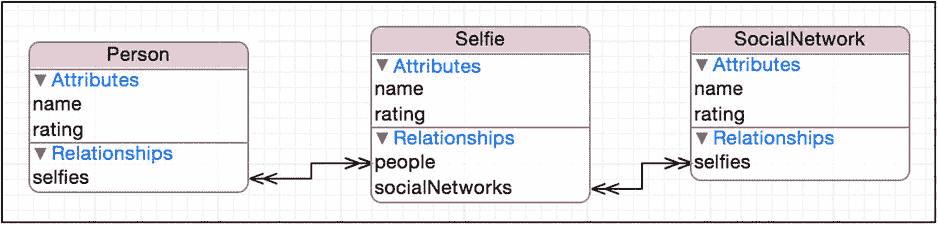

图 9-2. Core Data 模型

接下来，我们将向数据模型中填充足够的数据，以便运行性能测试并区分结果。创建 500 个人员、自拍和社交网络，并将它们全部关联起来就足够了——这将为我们提供三个各有 500 行的表（`Person`、`Selfie`和`SocialNetwork`）以及两个各有 250,000 行的连接表（`Person`-`Selfie`和`Selfie`-`SocialNetwork`）。

要插入数据，请打开`Persistence.h`（对于 Objective-C）并声明一个方法来加载数据。

```
- (void)loadData;
```

在`Persistence.m`或`Persistence.swift`中实现该方法。实现应检查持久化存储以确定数据是否已加载，以便后续的程序调用不会重复填充数据存储。如果数据尚未插入，`loadData`方法会创建 500 个人员，名称如`Person 1`、`Person 2`等；500 个自拍，名称如`Selfie 1`；以及 500 个社交网络，名称如`SocialNetwork 1`。它使用一个名为`insertObjectForName:index:`的辅助方法来实际创建对象。创建所有对象后，代码会遍历所有自拍，并添加与所有人员和所有社交网络的关系。最后，`loadData`将对象图保存到持久化数据存储中。代码清单 9-7 展示了 Objective-C 代码，代码清单 9-8 展示了 Swift 代码。

***代码清单 9-7***. 在`Persistence.m`中加载数据 (Objective-C)

```
- (void)loadData {
  static int NumberOfRows = 500;

// Fetch the people. If we have NumberOfRows, assume our data is loaded.
  NSFetchRequest *peopleFetchRequest = [NSFetchRequest fetchRequestWithEntityName:@"Person"];
  NSArray *people = [self.managedObjectContext executeFetchRequest:peopleFetchRequest
                                                             error:nil];
  if ([people count] != NumberOfRows) {
    NSLog(@"Creating objects");
    // Load the objects
    for (int i = 1; i <= NumberOfRows; i++) {
      [self insertObjectForName:@"Person" index:i];
      [self insertObjectForName:@"Selfie" index:i];
      [self insertObjectForName:@"SocialNetwork" index:i];
    }

// Get all the people, selfies, and social networks
    people = [self.managedObjectContext executeFetchRequest:peopleFetchRequest
                                                      error:nil];

NSFetchRequest *selfiesFetchRequest = [NSFetchRequest fetchRequestWithEntityName:@"Selfie"];
    NSArray *selfies = [self.managedObjectContext executeFetchRequest:selfiesFetchRequest
                                                                error:nil];

NSFetchRequest *socialNetworksFetchRequest = [NSFetchRequest fetchRequestWithEntityName:@"SocialNetwork"];
    NSArray *socialNetworks = [self.managedObjectContext executeFetchRequest:socialNetworksFetchRequest error:nil];

// Set up all the relationships
    NSLog(@"Creating relationships");
    for (NSManagedObject *selfie in selfies) {
      NSMutableSet *peopleSet = [selfie mutableSetValueForKey:@"people"];
      [peopleSet addObjectsFromArray:people];

NSMutableSet *socialNetworksSet = [selfie mutableSetValueForKey:@"socialNetworks"];
      [socialNetworksSet addObjectsFromArray:socialNetworks];
    }

[self saveContext];
  }
}

- (NSManagedObject *)insertObjectForName:(NSString *)name index:(NSInteger)index {
  NSManagedObject *object = [NSEntityDescription insertNewObjectForEntityForName:name
                                                          inManagedObjectContext:self.managedObjectContext];
  [object setValue:[NSString stringWithFormat:@"%@ %ld", name, (long)index]
            forKey:@"name"];
  [object setValue:[NSNumber numberWithInt:((arc4random() % 10) + 1)]
            forKey:@"rating"];
  return object;
}
```

***代码清单 9-8***. 在`Persistence.swift`中加载数据 (Swift)

```
func loadData() {
    let NumberOfRows = 500

// Fetch the people. If we have NumberOfRows, assume our data is loaded.
    let peopleFetchRequest = NSFetchRequest(entityName: "Person")
    var people = self.managedObjectContext?.executeFetchRequest(peopleFetchRequest, error: nil)
    if people?.count != NumberOfRows {
        println("Creating objects")
        // Load the objects
        for var i=1; i<=NumberOfRows; i++ {
            self.insertObjectForName("Person", index: i)
            self.insertObjectForName("Selfie", index: i)
            self.insertObjectForName("SocialNetwork", index: i)
        }

// Get all the people, selfies, and social networks
        people = self.managedObjectContext?.executeFetchRequest(peopleFetchRequest, error: nil)

let selfiesFetchRequest = NSFetchRequest(entityName: "Selfie")
        var selfies = self.managedObjectContext?.executeFetchRequest(selfiesFetchRequest, error: nil)

let socialNetworksFetchRequest = NSFetchRequest(entityName: "SocialNetwork")
        var socialNetworks = self.managedObjectContext?.executeFetchRequest(socialNetworksFetchRequest, error: nil)

// Set up all the relationships
        println("Creating relationships")
        for selfie in selfies as [NSManagedObject] {
            var peopleSet = selfie.mutableSetValueForKey("people")
            peopleSet.addObjectsFromArray(people!)
```


```objectivec
var socialNetworksSet = selfie.mutableSetValueForKey("socialNetworks")
socialNetworksSet.addObjectsFromArray(socialNetworks!)
}

self.saveContext()
}
}

func insertObjectForName(name: String, index: Int) -> NSManagedObject! {
var object = NSEntityDescription.insertNewObjectForEntityForName(name, inManagedObjectContext: self.managedObjectContext!) as NSManagedObject

object.setValue(NSString(format: "%@ %ld", name, index), forKey: "name")
object.setValue(NSNumber(int: Int(arc4random() % 10) + 1), forKey: "rating")

return object
}
```

每次应用启动时，我们调用 `loadData` 来加载数据（如有必要）。在 `AppDelegate.m` 或 `AppDelegate.swift` 中添加此调用，如代码清单 9-9（Objective-C）或代码清单 9-10（Swift）所示。

***代码清单 9-9***. 在 `AppDelegate.m` 中调用 `loadData`（Objective-C）

```objectivec
- (BOOL)application:(UIApplication *)application didFinishLaunchingWithOptions:(NSDictionary *)launchOptions {
  self.persistence = [[Persistence alloc] init];
  [self.persistence loadData];
  return YES;
}
```

***代码清单 9-10***. 在 `AppDelegate.swift` 中调用 `loadData`（Swift）

```swift
func application(application: UIApplication, didFinishLaunchingWithOptions launchOptions: [NSObject: AnyObject]?) -> Bool {
    // 应用启动后的自定义覆盖点。
    self.persistence = Persistence()
    self.persistence?.loadData()
    return true
}
```

构建并运行程序以创建持久化数据存储。你应该会在 Xcode 控制台中看到日志信息，显示程序正在创建对象和关系。如果你退出程序并重新运行，应该不会再看到此类日志信息。

## 创建测试视图

`PerformanceTuning` 应用提供一个选择器，其中包含可运行的测试列表，以及启动所选测试的按钮。运行测试时，应用会列出测试的开始时间、结束时间、已用时间以及测试结果的描述。打开 `ViewController.h`，声明它实现了选择器的协议，为用户界面（UI）元素添加属性，并为运行测试添加方法声明，如代码清单 9-11 所示。

***代码清单 9-11***. `ViewController.h`

```objectivec
@interface ViewController : UIViewController <UIPickerViewDataSource, UIPickerViewDelegate>

@property (nonatomic, weak) IBOutlet UILabel *startTime;
@property (nonatomic, weak) IBOutlet UILabel *stopTime;
@property (nonatomic, weak) IBOutlet UILabel *elapsedTime;
@property (nonatomic, weak) IBOutlet UITextView *results;
@property (nonatomic, weak) IBOutlet UIPickerView *testPicker;

- (IBAction)runTest:(id)sender;

@end
```

打开 `ViewController.m`，为选择器视图协议和 `runTest:` 方法添加占位实现，如代码清单 9-12 所示。

***代码清单 9-12***. `ViewController.m`

```objectivec
#import "ViewController.h"

@implementation ViewController

#pragma mark - UIPickerViewDataSource 方法

- (NSInteger)numberOfComponentsInPickerView:(UIPickerView *)pickerView {
  return 0;
}

- (NSInteger)pickerView:(UIPickerView *)pickerView numberOfRowsInComponent:(NSInteger)component {
  return 0;
}

#pragma mark - UIPickerViewDelegate 方法

- (NSString *)pickerView:(UIPickerView *)pickerView titleForRow:(NSInteger)row forComponent:(NSInteger)component {
  return nil;
}

#pragma mark - 事件处理

- (IBAction)runTest:(id)sender {
}

@end
```

如果你使用的是 Swift，请在 `ViewController.swift` 中进行相应的更改，如代码清单 9-13 所示。

***代码清单 9-13***. `ViewController.swift`

```swift
class ViewController: UIViewController, UIPickerViewDelegate, UIPickerViewDataSource {

@IBOutlet weak var startTime: UILabel!
    @IBOutlet weak var stopTime: UILabel!
    @IBOutlet weak var elapsedTime: UILabel!
    @IBOutlet weak var results: UITextView!
    @IBOutlet weak var testPicker: UIPickerView!

...

func numberOfComponentsInPickerView(pickerView: UIPickerView) -> Int {
        return 1
    }

func pickerView(pickerView: UIPickerView, numberOfRowsInComponent component: Int) -> Int {
        return self.tests.count
    }

func pickerView(pickerView: UIPickerView, titleForRow row: Int, forComponent component: Int) -> String! {
        let test = self.tests[row]
        let fullName = _stdlib_getDemangledTypeName(test)
        let tokens = split(fullName, { $0 == "." })
        return tokens.last
    }

@IBAction func runTest(sender: AnyObject) {
    }
}
```

打开 `Main.storyboard` 构建用户界面。为开始时间、停止时间和已用时间添加标签，以及右对齐且自动收缩设置为“最小字号”9 的标签，用于在运行测试时显示实际的开始时间、停止时间和已用时间。添加一个文本视图来显示测试结果，一个用于启动测试的按钮，最后添加一个选择器视图来显示可用的测试。将所有项目拖拽到视图中，并排列成与图 9-3 相似的样子。将视图的控件连接到代码中对应的属性，并将按钮连接到 `runTest:` 方法。同时，将选择器视图的数据源和代理连接到视图控制器。

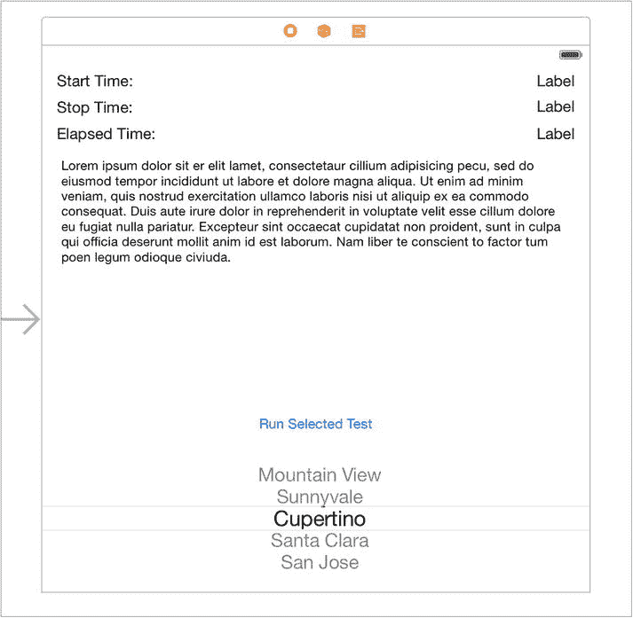

图 9-3. 构建 PerformanceTuning 的视图

## 构建测试框架

选择器视图将包含一个我们可以运行的测试列表。为了创建这个列表，我们定义一个名为 `PerfTest` 的协议，然后创建几个实现该协议的类。接着，我们创建一个数组来存储测试类的实例。应用将在选择器视图中显示这些测试类的名称，并在用户点击“运行所选测试”按钮时执行选中的测试。

首先，创建一个名为 `PerfTest` 的新协议，并声明一个必需方法 `runTestWithContext:`。代码清单 9-14 展示了 Objective-C 版本 `PerfTest.h`，代码清单 9-15 展示了 Swift 版本 `PerfTest.swift`。

***代码清单 9-14***. `PerfTest.h`

```objectivec
#import <Foundation/Foundation.h>
@import CoreData;

@protocol PerfTest <NSObject>

- (NSString *)runTestWithContext:(NSManagedObjectContext *)context;

@end
```

***代码清单 9-15***. `PerfTest.swift`

```swift
import Foundation
import CoreData

protocol PerfTest {
    func runTestWithContext(context: NSManagedObjectContext) -> String!
}
```

在将测试框架集成到应用之前，创建一个测试——如果你愿意，可以称之为“测试用测试”——这样我们就能在选择器视图中看到内容，并运行它。创建的第一个测试将从持久化存储中获取所有对象（人物、自拍和社交网络）。新建一个名为 `FetchAll` 的类，作为 `NSObject` 的子类，并使其实现 `PerfTest` 协议。然后，在 `runWithContext:` 实现中，只需获取所有对象并返回一个字符串，描述每个实体获取的对象数量。代码清单 9-16 展示 `FetchAll.h`，代码清单 9-17 展示 `FetchAll.m`，代码清单 9-18 展示 `FetchAll.swift`。

***代码清单 9-16***. `FetchAll.h`

```objectivec
#import "PerfTest.h"

@interface FetchAll : NSObject <PerfTest>

@end
```

***代码清单 9-17***. `FetchAll.m`

```objectivec
#import "FetchAll.h"

@implementation FetchAll
```


```markdown
- (NSString *)runTestWithContext:(NSManagedObjectContext *)context {
    NSFetchRequest *peopleFetchRequest = [NSFetchRequest fetchRequestWithEntityName:@"Person"];
    NSFetchRequest *selfiesFetchRequest = [NSFetchRequest fetchRequestWithEntityName:@"Selfie"];
    NSFetchRequest *socialNetworksFetchRequest = [NSFetchRequest fetchRequestWithEntityName:@"SocialNetwork"];

    NSArray *people = [context executeFetchRequest:peopleFetchRequest error:nil];
    NSArray *selfies = [context executeFetchRequest:selfiesFetchRequest error:nil];
    NSArray *socialNetworks = [context executeFetchRequest:socialNetworksFetchRequest error:nil];

    return [NSString stringWithFormat:@"Fetched %ld people, %ld selfies, and %ld social networks", [people count], [selfies count], [socialNetworks count]];
}

@end

***代码清单 9-18***. `FetchAll.swift`

```
import Foundation
import CoreData

class FetchAll : PerfTest {
    func runTestWithContext(context: NSManagedObjectContext) -> String! {
        let peopleFetchRequest = NSFetchRequest(entityName: "Person")
        let selfiesFetchRequest = NSFetchRequest(entityName: "Selfie")
        let socialNetworkFetchRequest = NSFetchRequest(entityName: "SocialNetwork")

        let people = context.executeFetchRequest(peopleFetchRequest, error: nil)!
        let selfies = context.executeFetchRequest(selfiesFetchRequest, error: nil)!
        let socialNetworks = context.executeFetchRequest(socialNetworkFetchRequest, error: nil)!

        return NSString(format: "Fetched %ld people, %ld selfies, and %ld social networks", people.count, selfies.count, socialNetworks.count)
    }
}
```

## 将测试框架集成到应用程序中

现在你需要修改视图控制器以使用测试框架。在 `ViewController.h` 中添加一个属性来保存所有测试实例。

```
@property (nonatomic, strong) NSArray *tests; // Objective-C
var tests = [PerfTest]() // Swift
```

在 `ViewController.m` 或 `ViewController.swift` 中，你需要执行以下操作：

- 添加必要的导入语句。
- 实现 `viewDidLoad` 方法以清空输入字段并创建 `tests` 数组。
- 更新 `UIPickerViewDataSource` 和 `UIPickerViewDelegate` 方法以填充选择器视图。
- 更新 `runTest:` 方法以运行选定的测试。

代码清单 9-19 展示了更新后的 `ViewController.m` 文件，代码清单 9-20 展示了更新后的 `ViewController.swift` 文件。你可以看到，在 `runTest:` 方法中，我们确定了选择器中选中的是哪个测试。我们获取应用程序托管对象上下文的指针，并重置它以确保测试时间一致。我们记录开始时间，运行选定的测试，然后记录结束时间。最后，更新用户界面以显示时间和结果。

***代码清单 9-19***. 更新了测试框架的 `ViewController.m`

```
#import "ViewController.h"
#import "FetchAll.h"
#import "AppDelegate.h"
#import "Persistence.h"

@implementation ViewController

- (void)viewDidLoad {
    [super viewDidLoad];

    self.startTime.text = @"";
    self.stopTime.text = @"";
    self.elapsedTime.text = @"";
    self.results.text = @"";

    self.tests = @[[[FetchAll alloc] init]];
}

#pragma mark - UIPickerViewDataSource methods

- (NSInteger)numberOfComponentsInPickerView:(UIPickerView *)pickerView {
    return 1;
}

- (NSInteger)pickerView:(UIPickerView *)pickerView numberOfRowsInComponent:(NSInteger)component {
    return [self.tests count];
}

#pragma mark - UIPickerViewDelegate methods

- (NSString *)pickerView:(UIPickerView *)pickerView titleForRow:(NSInteger)row forComponent:(NSInteger)component {
    id <PerfTest> test = self.tests[row];
    return [[test class] description];
}

#pragma mark - Handlers

- (IBAction)runTest:(id)sender {
    // 获取选中的测试
    id <PerfTest> test = self.tests[[self.testPicker selectedRowInComponent:0]];
    AppDelegate *delegate = (AppDelegate *)[[UIApplication sharedApplication] delegate];
    NSManagedObjectContext *context = delegate.persistence.managedObjectContext;

    // 清除所有对象以获得干净的测试结果
    [context reset];

    // 记录开始时间、运行测试、记录结束时间
    NSDate *start = [NSDate date];
    NSString *results = [test runTestWithContext:delegate.persistence.managedObjectContext];
    NSDate *stop = [NSDate date];

    // 使用测试结果更新用户界面
    self.startTime.text = [start description];
    self.stopTime.text = [stop description];
    self.elapsedTime.text = [NSString stringWithFormat:@"%.03f seconds", [stop timeIntervalSinceDate:start]];
    self.results.text = results;
}

@end
```

***代码清单 9-20***. 更新了测试框架的 `ViewController.swift`

```
import UIKit

class ViewController: UIViewController, UIPickerViewDelegate, UIPickerViewDataSource {

    @IBOutlet weak var startTime: UILabel!
    @IBOutlet weak var stopTime: UILabel!
    @IBOutlet weak var elapsedTime: UILabel!
    @IBOutlet weak var results: UITextView!
    @IBOutlet weak var testPicker: UIPickerView!

    var tests = [PerfTest]()

    func numberOfComponentsInPickerView(pickerView: UIPickerView) -> Int {
        return 1
    }

    func pickerView(pickerView: UIPickerView, numberOfRowsInComponent component: Int) -> Int {
        return self.tests.count
    }

    func pickerView(pickerView: UIPickerView, titleForRow row: Int, forComponent component: Int) -> String! {
        let test = self.tests[row]
        let fullName = _stdlib_getDemangledTypeName(test)
        let tokens = split(fullName, { $0 == "." })
        return tokens.last
    }

    @IBAction func runTest(sender: AnyObject) {
        // 获取选中的测试
        let test = self.tests[self.testPicker.selectedRowInComponent(0)]

        let appDelegate = UIApplication.sharedApplication().delegate as AppDelegate
        let context = appDelegate.persistence?.managedObjectContext
        if let context = context {
            // 清除所有对象以获得干净的测试结果
            context.reset()

            // 记录开始时间、运行测试、记录结束时间
            let start = NSDate()
            let testResults = test.runTestWithContext(context)
            let stop = NSDate()

            let formatter = NSDateFormatter()
            formatter.timeStyle = .MediumStyle

            // 使用测试结果更新用户界面
            self.startTime.text = formatter.stringFromDate(start)
            self.stopTime.text = formatter.stringFromDate(stop)
            self.elapsedTime.text = NSString(format: "%.03f seconds", stop.timeIntervalSinceDate(start))
            self.results.text = testResults
        }
    }

    override func viewDidLoad() {
        super.viewDidLoad()

        self.startTime.text = ""
        self.stopTime.text = ""
        self.elapsedTime.text = ""
        self.results.text = ""

        self.tests.append(FetchAll())
    }
}
```

至此，应用程序就完成了。在阅读本章后续内容时，你将添加测试以覆盖所介绍的各个场景。

## 运行你的第一个测试

构建并运行应用程序。运行时，你会在选择器中看到包含一个名为“FetchAll”测试的 iOS 模拟器。如果选择器为空，很可能是你忘记将选择器的 `dataSource` 和 `delegate` 属性连接到视图控制器。一切正常后，选中“FetchAll”，点击“Run Selected Test”。应用程序将获取所有对象并显示结果，如图 9-4 所示。

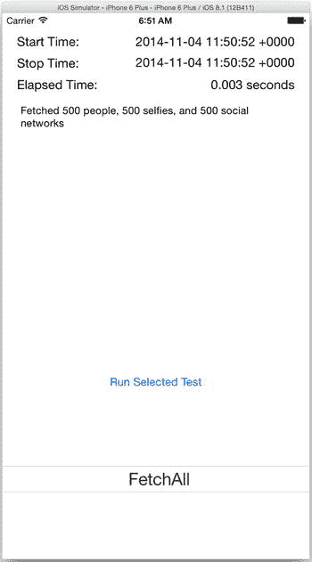

图 9-4. 获取所有对象的结果
```


## Core Data 中的性能考量

本章余下部分将阐述 Core Data 在 iOS 及其运行设备上所施加的各种性能考量。在学习这些性能考量时，你将向 `PerformanceTuning` 应用添加测试。你也可以随意添加自己的测试，以便始终为应用用户提供最佳体验。

## 故障机制

当针对数据库执行 SQL 查询时，你清楚所拉取数据的深度与范围。你了解是否正在联表查询，清楚要取回的列；如果足够谨慎，还能限制从数据库加载到工作内存中的行数。与使用 Core Data 相比，你可能需要付出更多努力来获取数据，但掌控力更强。你清楚用于存储所取数据的内存用量。

然而，使用 Core Data 时，你为了易用性而放弃了部分控制权。例如，在 `PerformanceTuning` 模型中，每个 `Selfie` 实例都关联着一个 `Person` 实例集合，你可以通过面向对象而非面向数据的方式访问该集合。你无需关心 Core Data 是在应用启动时、`Selfie` 加载时，还是在你首次访问 `Person` 对象时才从数据库拉取 `Person` 数据。但 Core Data 会关注这一点，并尝试尽可能推迟将数据从持久化存储加载到对象图的过程，从而减少获取时间和内存使用。它通过所谓的"故障"机制实现这一点。

可以将故障视为 Unix 文件系统中的符号链接——它既不是所指向的实际文件，也不包含文件的数据。但符号链接代表了该文件，在被调用时能够访问到文件及其数据，就像文件本身一样。与符号链接类似，故障是一个占位符，能够访问持久化存储的数据。故障既可以代表一个托管对象，也可以在表示对多关系时代表一个托管对象集合。作为数据的链接或影子，故障占用的内存远少于实际数据。请参阅 图 9-5，其中描绘了托管对象和故障。在此示例中，托管对象是 `Selfie` 的实例，而故障指向相关的 `Person` 对象集合。`Selfie` 以粗体显示，表示它已从持久化存储中取出并驻留在内存中。`Person` 对象（处于关系的"对多"一侧）则以浅灰色显示，因为它们尚未从持久化存储中取出，也不在内存中。


图 9-5. 一张自拍及其故障状态的联系人

## 触发故障

当 Core Data 必须从故障指向的持久化存储中拉取数据并将其放入内存时，会使用术语"触发故障"。Core Data 已经"触发"了一个从数据存储中获取数据的请求，而故障也已"被触发"，完成了代表实际数据的任务。每当你请求托管对象的持久化数据时——无论是通过 `valueForKey:` 还是通过自定义类中返回或访问对象持久化数据的方法——都会导致故障被触发。访问托管对象元数据但不访问持久化存储中任何数据的方法则不会触发故障。这意味着你可以查询托管对象的类、哈希值、描述、实体和对象 ID 等内容，而不会导致故障触发。有关哪些方法不会触发故障的完整列表，请参阅 Apple 文档 `http://developer.apple.com/library/ios/#documentation/Cocoa/Conceptual/CoreData/Articles/cdPerformance.html` 中的"故障行为"部分。

显式请求托管对象的持久化数据会触发故障，但调用任何从托管对象访问持久化数据的方法或构造也会如此。例如，你可以通过托管对象的关系访问集合而不触发故障。然而，对集合进行排序会触发故障，因为任何逻辑排序都会依据对象的某些持久化数据进行。你将在本节后面构建的测试将演示这一行为。

## 故障与缓存

我们之前说触发故障是从持久化存储中获取数据，这有点不准确。通常情况下确实如此，但在 Core Data 长途跋涉到持久化存储检索数据之前，它会先检查缓存中是否有它要找的数据。如果 Core Data 在缓存中找到目标数据，就会从缓存中拉取数据，跳过前往持久化存储的更长的路径。"缓存"和"缓存过期"部分将进一步详细讨论缓存。

## 重新故障化

控制应用程序持久化数据和内存使用的一种方法是将托管对象重新变回故障状态，从而释放其数据所占用的内存。通过调用托管对象上下文的 `refreshObject:mergeChanges:` 方法，并将要故障化的对象作为参数传入，同时将 `mergeChanges:` 参数设为 `NO`，即可将对象重新变回故障。例如，如果有一个名为 `foo` 的托管对象，我想将其重新变回故障，可以使用如下代码：

```
[context refreshObject:foo mergeChanges:NO]; // Objective-C
context.refreshObject(foo, mergeChanges:false) // Swift
```

调用之后，`foo` 现在是一个故障对象，`[foo isFault]`（Swift 中为 `foo.fault`）将返回 `YES`（Swift 中为 `true`）。理解 `mergeChanges` 参数至关重要。像前面的代码那样传入 `NO` 或 `false` 会丢弃所有尚未保存到持久化存储的更改数据。执行此操作时需谨慎，因为你会丢失正在故障化的对象中的所有数据更改，并且与该故障化对象相关的所有对象都会被释放。如果任何关系发生了变化并随后保存了上下文，那么故障化的对象将与其关系不同步，从而在持久化存储中造成数据完整性问题。

如果为 `mergeChanges` 传入 `YES` 或 `true`，则不会将对象故障化。相反，它会从持久化存储（或最后一个缓存状态）重新加载对象的所有持久化数据，然后重新应用在调用 `refreshObject:mergeChanges:` 之前存在但尚未保存的任何更改。

当你将托管对象变为故障时，Core Data 会向该托管对象发送两条消息。

- 对象故障化之前发送 `willTurnIntoFault:`
- 对象故障化之后发送 `didTurnIntoFault:`

如果为托管对象实现了自定义类，可以在这些类中实现其中一个或两个方法，以对对象执行某些操作。例如，假设你的自定义托管对象对某些持久化值执行了昂贵的计算并缓存了结果，并且你希望在所依赖的值不存在时清除该缓存结果。你可以在 `didTurnIntoFault:` 中清除该计算结果。

## 构建故障化测试

为了测试本节学到的关于故障化的知识，请构建一个测试，该测试将执行以下操作：

1. 从持久化存储中检索第一个自拍。
2. 从该自拍中获取一个社交网络。
3. 检查该社交网络是否处于故障状态。
4. 获取该社交网络的名称。
5. 检查该社交网络是否处于故障状态。
6. 将该社交网络重新变回故障状态。
7. 检查该社交网络是否处于故障状态。


首先，为所有 Core Data 实体生成 `NSManagedObject` 类。打开 `SocialNetwork.m` 或 `SocialNetwork.swift`，并实现 `willTurnIntoFault` 和 `didTurnIntoFault` 方法。在这些方法中，我们不会做任何特殊操作，只会简单地记录它们已被调用，以便验证它们被正确调用。代码清单 9-21（Objective-C）和代码清单 9-22（Swift）展示了这些方法的实现。

***代码清单 9-21***. 在 `SocialNetwork.m` 中处理故障状态变化

```objc
- (void)willTurnIntoFault {
  NSLog(@"%@ named %@ will turn into fault", [[self class] description], self.name);
}

- (void)didTurnIntoFault {
  NSLog(@"%@ did turn into fault", [[self class] description]);
}
```

***代码清单 9-22***. 在 `SocialNetwork.swift` 中处理故障状态变化

```swift
override func willTurnIntoFault() {
    println(NSString(format: "%@ named %@ will turn into fault", self, self.name))
}

override func didTurnIntoFault() {
    println(NSString(format: "%@ did turn into fault", self))
}
```

请注意，我们在 `willTurnIntoFault` 方法中记录了社交网络的名称。然而，在 `didTurnIntoFault` 方法中，我们没有记录名称。为什么？因为我们已经没有名称可以记录了。对象处于故障状态，还记得吗？它的属性（包括名称）都不在内存中。

现在，创建一个名为 `DidFault` 的测试，它遵循 `PerfTest` 协议，然后实现其 `runWithContext:` 方法来执行前面概述的七个步骤。代码清单 9-23 展示了 `DidFault.h`，代码清单 9-24 展示了 `DidFault.m`，代码清单 9-25 展示了 `DidFault.swift`。

***代码清单 9-23***. `DidFault.h`

```objc
#import "PerfTest.h"

@interface DidFault : NSObject <PerfTest>

@end
```

***代码清单 9-24***. 实现了故障测试的 `DidFault.m`

```objc
#import "DidFault.h"
#import "Selfie.h"
#import "SocialNetwork.h"

@implementation DidFault

-(NSString *)runTestWithContext:(NSManagedObjectContext *)context {
  NSString *result = nil;

// 1) 获取第一张自拍
  NSFetchRequest *fetchRequest = [NSFetchRequest fetchRequestWithEntityName:@"Selfie"];
  fetchRequest.predicate = [NSPredicate predicateWithFormat:@"name = %@", @"Selfie 1"];
  NSArray *selfies = [context executeFetchRequest:fetchRequest error:nil];
  if ([selfies count] == 1) {
    Selfie *selfie = selfies[0];

// 2) 从自拍中获取一个社交网络
    SocialNetwork *socialNetwork = [selfie.socialNetworks anyObject];
    if (socialNetwork != nil) {
      // 3) 检查它是否为故障状态
      result = [NSString stringWithFormat:@"Social Network %@ a fault\n",
                [socialNetwork isFault] ? @"is" : @"is not"];

// 4) 获取名称
      result = [result stringByAppendingFormat:@"Social Network is named '%@'\n",
                socialNetwork.name];

// 5) 检查它是否为故障状态
      result = [result stringByAppendingFormat:@"Social Network %@ a fault\n",
                [socialNetwork isFault] ? @"is" : @"is not"];

// 6) 将其恢复为故障状态
      [context refreshObject:socialNetwork mergeChanges:NO];
      result = [result stringByAppendingFormat:@"Turning Social Network into a fault\n"];

// 7) 检查它是否为故障状态
      result = [result stringByAppendingFormat:@"Social Network %@ a fault\n",
                [socialNetwork isFault] ? @"is" : @"is not"];
    } else {
      result = @"Couldn't find social networks for selfie";
    }
  } else {
    result = @"Failed to fetch first selfie";
  }
  return result;
}

@end
```

***代码清单 9-25***. 实现了故障测试的 `DidFault.swift`

```swift
import Foundation
import CoreData

class DidFault : PerfTest {
    func runTestWithContext(context: NSManagedObjectContext) -> String! {
        var result : String?

// 1) 获取第一张自拍
        let fetchRequest = NSFetchRequest(entityName: "Selfie")
        fetchRequest.predicate = NSPredicate(format: "name = %@", "Selfie 1")
        let selfies = context.executeFetchRequest(fetchRequest, error: nil)
        if selfies?.count == 1 {
            let selfie = selfies?[0] as Selfie

// 2) 从自拍中获取一个社交网络
            let socialNetwork = selfie.socialNetworks.anyObject() as SocialNetwork?
            if let socialNetwork = socialNetwork {
                // 3) 检查它是否为故障状态
                result = NSString(format: "Social Network %@ a fault\n", socialNetwork.fault ? "is" : "is not")

// 4) 获取名称
                result = result?.stringByAppendingFormat("Social Network is named '%@'\n", socialNetwork.name)

// 5) 检查它是否为故障状态
                result = result?.stringByAppendingFormat("Social Network %@ a fault\n", socialNetwork.fault ? "is" : "is not")

// 6) 将其恢复为故障状态
                context.refreshObject(socialNetwork, mergeChanges: false)
                result = result?.stringByAppendingFormat("Turning Social Network into a fault\n")

// 7) 检查它是否为故障状态
                result = result?.stringByAppendingFormat("Social Network %@ a fault\n", socialNetwork.fault ? "is" : "is not")
            }
            else {
                result = "Couldn't find social networks for selfie"
            }
        }
        else {
            result = "Failed to fetch first selfie"
        }

return result!
    }
}
```

这段代码正如承诺的那样，遵循了七个步骤。在第 4 步中访问社交网络的名称会触发故障，因此第 5 步中社交网络不再是故障状态。当然，第 6 步将社交网络恢复为故障状态。

要将这个新测试添加到选择器视图中，以便我们可以选择并运行它，请打开 `ViewController.m`，添加对 `DidFault.h` 的导入，并将 `DidFault` 的实例添加到 `tests` 数组中，如代码清单 9-26 所示。

***代码清单 9-26***. 在 `ViewController.m` 的 `viewDidLoad` 方法中添加 `DidFault` 实例

```objc
- (void)viewDidLoad {
  [super viewDidLoad];

self.startTime.text = @"";
  self.stopTime.text = @"";
  self.elapsedTime.text = @"";
  self.results.text = @"";

self.tests = @[[[FetchAll alloc] init],
                 [[DidFault alloc] init]];
}
```

对于 Swift，请在 `ViewController.swift` 中添加实例，如代码清单 9-27 所示。

***代码清单 9-27***. 在 `ViewController.swift` 的 `viewDidLoad` 方法中添加 `DidFault` 实例

```swift
override func viewDidLoad() {
    super.viewDidLoad()

self.startTime.text = ""
    self.stopTime.text = ""
    self.elapsedTime.text = ""
    self.results.text = ""

self.tests.append(FetchAll())
    self.tests.append(DidFault())
}
```

构建并运行应用程序。你应该能在选择器中看到 `DidFault`。选择它并点击“运行所选测试”。你应该会看到类似如下的输出：

```
Social Network is a fault
Social Network is named 'SocialNetwork 117'
Social Network is not a fault
Turning Social Network into a fault
Social Network is a fault
```

你还应该会在日志中看到 `willTurnIntoFault` 和 `didTurnIntoFault` 被调用时的输出，如下所示：

```
2014-11-04 07:25:57.149 PerformanceTuning[38171:2069648] SocialNetwork named SocialNetwork 387 will turn into fault
2014-11-04 07:25:57.151 PerformanceTuning[38171:2069648] SocialNetwork did turn into fault
```

## 掌握控制权：主动触发故障


本文关于故障的讨论一开始就指出，当你自己运行 SQL 查询时，对内存使用有更多的控制权，而不是让 Core Data 来管理数据获取。尽管确实如此，但你也可以通过自己触发故障来对 Core Data 的故障管理施加一定程度的控制。通过自己触发故障，你可以避免低效的情况，比如 Core Data 必须触发多个小故障来获取你的数据，从而导致多次访问持久化存储。

Core Data 提供了两种优化触发故障的方法：

-   批量故障处理
-   预取

我们将测试批量故障处理和预取。不过在此之前，我们先创建一个测试来触发单个故障，这样我们就能了解批量故障处理和预取带来的性能提升。添加一个名为`SingleFault`的类，使其遵循`PerfTest`协议。这个测试应该获取所有 selfie，并逐个循环遍历它们，同时执行以下操作：

-   访问`name`属性，以便仅为这个 selfie 触发一个故障。
-   遍历所有相关的社交网络并逐一访问它们的`name`属性，这样每次访问都会触发一个故障。
-   重置每个社交网络，以便下一个 selfie 必须为每个社交网络触发故障。
-   对所有相关人物执行相同操作。

列表 9-28 展示了头文件`SingleFault.h`，列表 9-29 展示了`SingleFault.m`。列表 9-30 展示了 Swift 实现`SingleFault.swift`。

**列表 9-28**. `SingleFault.h`

```
#import "PerfTest.h"

@interface SingleFault : NSObject <PerfTest>

@end
```

**列表 9-29**. `SingleFault.m`

```
#import "SingleFault.h"
#import "Selfie.h"
#import "SocialNetwork.h"
#import "Person.h"

@implementation SingleFault

- (NSString *)runTestWithContext:(NSManagedObjectContext *)context {
  // Fetch all the selfies
  NSFetchRequest *fetchRequest = [NSFetchRequest fetchRequestWithEntityName:@"Selfie"];
  NSArray *selfies = [context executeFetchRequest:fetchRequest error:nil];

// Loop through all the selfies
  for (Selfie *selfie in selfies) {
    // Fire a fault just for this selfie
    [selfie valueForKey:@"name"];

// Loop through the social networks for this selfie
    for (SocialNetwork *socialNetwork in selfie.socialNetworks) {
      // Fire a fault just for this social network
      [socialNetwork valueForKey:@"name"];

// Put this social network back in a fault
      [context refreshObject:socialNetwork mergeChanges:NO];
    }

// Loop through the people for this selfie
    for (Person *person in selfie.people) {
      // Fire a fault for this person
      [person valueForKey:@"name"];

// Put this person back in a fault
      [context refreshObject:person mergeChanges:NO];
    }
  }
  return @"Test complete";
}

@end
```

**列表 9-30**. `SingleFault.swift`

```
import Foundation
import CoreData

class SingleFault : PerfTest {
    func runTestWithContext(context: NSManagedObjectContext) -> String! {
        // Fetch all the selfies
        let fetchRequest = NSFetchRequest(entityName: "Selfie")
        let selfies = context.executeFetchRequest(fetchRequest, error: nil)

// Loop through all the selfies
        for selfie in selfies as [Selfie] {
            // Fire a fault just for this selfie
            selfie.valueForKey("name")

// Loop through the social networks for this selfie
            for obj in selfie.socialNetworks {
                let socialNetwork = obj as SocialNetwork

// Fire a fault just for this social network
                socialNetwork.valueForKey("name")

// Put this social network back in a fault
                context.refreshObject(socialNetwork, mergeChanges: false)
            }

// Loop through the people for this selfie
            for obj in selfie.people {
                let person = obj as Person
```


// 触发此人的错误状态
`person.valueForKey("name")`

// 将此人恢复为错误状态
`context.refreshObject(person, mergeChanges: false)`

```
return "Test complete"
```

与 `DidFault` 类一样，将 `SingleFault` 的一个实例添加到 `ViewController.m` 中的 `tests` 数组中，同时添加对 `SingleFault.h` 的导入。现在 `tests` 数组应匹配 Objective-C 的 列表 9-31 或 Swift 的 列表 9-32。

***列表 9-31***. 将 `SingleFault` 添加到 `Tests` 数组（Objective-C）

```
self.tests = @[[[FetchAll alloc] init],
               [[DidFault alloc] init],
               [[SingleFault alloc] init]];
```

***列表 9-32***. 将 `SingleFault` 添加到 `Tests` 数组（Swift）

```
self.tests.append(FetchAll())
self.tests.append(DidFault())
self.tests.append(SingleFault())
```

在构建并运行应用程序之前，请注释掉 `SocialNetwork` 的 `willTurnIntoFault` 和 `didTurnIntoFault` 方法，以免填满日志或影响计时结果。然后，构建并运行应用程序，运行 `SingleFault` 测试。在 iPhone 6 Plus 上运行此测试只需不到 30 秒的时间。我们来看看能否改进这些结果！

## 批量错误处理

当执行取请求时，你可以通过在执行取请求之前调用 `NSFetchRequest` 的 `setReturnsObjectsAsFaults:` 方法，告诉 Core Data 将对象作为错误状态或非错误状态返回。该方法接受一个布尔参数：向该方法传递 `YES` 或 `true` 可将获取的对象作为错误状态返回，或者传递 `NO` 或 `false` 将对象作为非错误状态返回。通过传递 `NO` 或 `false`，你将获取到所有关联属性都已加载的对象（但当然不包括其关系的所有属性）。

在本节中，我们将创建一个与 `SingleFault` 测试相似的测试，但不再逐个触发错误，而是批量触发。创建一个名为 `BatchFault` 的类，使其遵循 `PerfTest` 协议。到目前为止，你应该能够确定头文件的样子（它遵循与 `DidFault.h` 和 `SingleFault.h` 相同的模式），因此我们在此不再列出它或本章中编写的任何其他测试头文件。实现文件类似于 `SingleFault.m` 或 `SingleFault.swift`——它遍历自拍照，并为每张自拍照遍历社交网络和人员。然而不同的是，`BatchFault` 使用批量错误处理来一次性触发所有对象的错误状态。也就是说，它一次性触发所有自拍照的错误状态，然后对于每张自拍照，一次性触发其所有社交网络和人员的错误状态。它通过创建取请求并对其调用 `setReturnsObjectsAsFaults:` 方法（每次都传递 `NO` 或 `false`）来实现这一点。列表 9-33 展示了 `BatchFault.m` 的代码，列表 9-34 展示了 `BatchFault.swift` 的代码。

***列表 9-33***. `BatchFault.m`

```
#import "BatchFault.h"
#import "Selfie.h"
#import "SocialNetwork.h"
#import "Person.h"

@implementation BatchFault

- (NSString *)runTestWithContext:(NSManagedObjectContext *)context {
  // 获取所有自拍照
  NSFetchRequest *fetchRequest = [NSFetchRequest fetchRequestWithEntityName:@"Selfie"];

// 将自拍照作为非错误状态返回
  [fetchRequest setReturnsObjectsAsFaults:NO];
  NSArray *selfies = [context executeFetchRequest:fetchRequest error:nil];

// 遍历所有自拍照
  for (Selfie *selfie in selfies) {
    // 不会触发错误状态，因为数据已在内存中
    [selfie valueForKey:@"name"];

// 对于这张自拍照，触发所有社交网络的错误状态
    NSFetchRequest *snFetchRequest = [NSFetchRequest fetchRequestWithEntityName:@"SocialNetwork"];
    [snFetchRequest setReturnsObjectsAsFaults:NO];
    [context executeFetchRequest:snFetchRequest error:nil];
```


***列表 9-34***. `BatchFault.swift`

```objc
// For this selfie, fire faults for all the social networks
    NSFetchRequest *pFetchRequest = [NSFetchRequest fetchRequestWithEntityName:@"Person"];
    [pFetchRequest setReturnsObjectsAsFaults:NO];
    [context executeFetchRequest:pFetchRequest error:nil];

// Loop through the social networks for this selfie
    for (SocialNetwork *socialNetwork in selfie.socialNetworks) {
      // Doesn't fire a fault, the data are already in memory
      [socialNetwork valueForKey:@"name"];

// Put this social network back in a fault
      [context refreshObject:socialNetwork mergeChanges:NO];
    }

// Loop through the people for this selfie
    for (Person *person in selfie.people) {
      // Doesn't fire a fault, the data are already in memory
      [person valueForKey:@"name"];

// Put this person back in a fault
      [context refreshObject:person mergeChanges:NO];
    }
  }
  return @"Test complete";
}

@end
```

```swift
import Foundation
import CoreData

class BatchFault : PerfTest {
    func runTestWithContext(context: NSManagedObjectContext) -> String! {
        // Fetch all the selfies
        let fetchRequest = NSFetchRequest(entityName: "Selfie")

// Return the selfies as non-faults
        fetchRequest.returnsObjectsAsFaults = true
        let selfies = context.executeFetchRequest(fetchRequest, error: nil) as [Selfie]

// Loop through all the selfies
        for selfie in selfies {
            // Doesn't fire a fault, the data are already in memory
            selfie.valueForKey("name")

// For this selfie, fire faults for all the social networks
            let snFetchRequest = NSFetchRequest(entityName: "SocialNetwork")
            snFetchRequest.returnsObjectsAsFaults = false
            context.executeFetchRequest(snFetchRequest, error: nil)

// For this selfie, fire faults for all the people
            let pFetchRequest = NSFetchRequest(entityName: "Person")
            pFetchRequest.returnsObjectsAsFaults = false
            context.executeFetchRequest(pFetchRequest, error: nil)

// Loop through the social networks for this selfie
            for obj in selfie.socialNetworks {
                let socialNetwork = obj as SocialNetwork

// Doesn't fire a fault, the data are already in memory
                socialNetwork.valueForKey("name")

// Put this social network back in a fault
                context.refreshObject(socialNetwork, mergeChanges: false)
            }

// Loop through the people for this selfie
            for obj in selfie.people {
                let person = obj as Person

// Doesn't fire a fault, the data are already in memory
                person.valueForKey("name")

// Put this person back in a fault
                context.refreshObject(person, mergeChanges: false)
            }
        }

return "Test complete"
    }
}
```

在 `ViewController.m`（同时导入 `BatchFault.h`）或 `ViewController.swift` 的 `tests` 数组中添加一个 `BatchFault` 实例，如同我们对其他测试所做的那样，然后构建并运行程序。运行 `BatchFault` 测试并检查耗时。在我们的 iPhone 6 Plus 上，耗时略超 30 秒。这比 `SingleFault` 测试要慢。虽然结果令人失望，但这正说明了实践比理论更重要。理论上，批量触发故障应该比逐个触发快得多。然而在实践中，我们不仅没有获得任何性能提升——事实上反而有所损失——而且还让代码的可读性变差了。接下来我们看看预抓取的效果是否更好。

### 预抓取

与批量触发故障类似，预抓取可最大限度减少 Core Data 触发故障和抓取数据的次数。不过，使用预抓取时，你可以告诉 Core Data 在执行抓取操作时，一并抓取你指定的相关对象。例如，使用本章的数据模型，当你抓取自拍照时，你可以告诉 Core Data 预抓取相关的社交网络、相关人员，或两者都抓取。

要预抓取相关对象，请调用 `NSFetchRequest` 的 `setRelationshipKeyPathsForPrefetching:` 方法，并传入一个包含你想让 Core Data 预抓取的关联名称的数组。例如，要在抓取自拍照时预抓取相关的社交网络和人员，请使用以下 Objective-C 代码：

```objc
NSFetchRequest *fetchRequest = [NSFetchRequest fetchRequestWithEntityName:@"Selfie"];
[fetchRequest setRelationshipKeyPathsForPrefetching:@[@"socialNetworks", @"people"]];
NSArray *selfies = [context executeFetchRequest:fetchRequest error:nil];
```

在 Swift 中，代码如下所示：

```swift
let fetchRequest = NSFetchRequest(entityName: "Selfie")
fetchRequest.relationshipKeyPathsForPrefetching = ["socialNetwork", "people"]
let selfies = context.executeFetchRequest(fetchRequest, error: nil) as [Selfie]
```

粗体行指示 Core Data 在抓取自拍照时预抓取所有相关的社交网络和人员。请注意，如果你传入的字符串与任何现有关联名称不匹配，不会产生错误，因此请仔细检查你的拼写。你可能以为自己在预抓取关联，但一个错误的拼写可能会导致性能增益失效。

要测试预抓取，请创建一个名为 `Prefetch` 的类，该类遵循 `PerfTest` 协议。在 `runTestWithContext:` 的实现中，基本上使用与 `SingleFault` 相同的代码，但这次添加了对 `setRelationshipKeyPathsForPrefetching:` 的调用，并传入一个包含关联名称的数组。列表 9-35 展示了 `Prefetch.m` 的代码，列表 9-36 展示了 `Prefetch.swift` 的代码。

***列表 9-35***. `Prefetch.m`

```objc
#import "Prefetch.h"
#import "Selfie.h"
#import "SocialNetwork.h"
#import "Person.h"

@implementation Prefetch

- (NSString *)runTestWithContext:(NSManagedObjectContext *)context {
  // Set up the fetch request for all the selfies
  NSFetchRequest *fetchRequest = [NSFetchRequest fetchRequestWithEntityName:@"Selfie"];

// Prefetch the social networks and people
  [fetchRequest setRelationshipKeyPathsForPrefetching:@[@"socialNetworks", @"people"]];

// Perform the fetch
  NSArray *selfies = [context executeFetchRequest:fetchRequest error:nil];

// Loop through the selfies
  for (Selfie *selfie in selfies) {
    // Fire a fault just for this selfie
    [selfie valueForKey:@"name"];

// Loop through the social networks for this selfie
    for (SocialNetwork *socialNetwork in selfie.socialNetworks) {
      // Fire a fault just for this social network
      [socialNetwork valueForKey:@"name"];

// Put this social network back in a fault
      [context refreshObject:socialNetwork mergeChanges:NO];
    }

// Loop through the people for this selfie
    for (Person *person in selfie.people) {
      // Fire a fault for this person
      [person valueForKey:@"name"];

// Put this person back in a fault
      [context refreshObject:person mergeChanges:NO];
    }
  }
  return @"Test complete";
}

@end
```

***列表 9-36***. `Prefetch.swift`

```swift
import Foundation
import CoreData

class Prefetch : PerfTest {
    func runTestWithContext(context: NSManagedObjectContext) -> String! {
        // Set up the fetch request for all the selfies
        let fetchRequest = NSFetchRequest(entityName: "Selfie")

// Prefetch the social networks and people
        fetchRequest.relationshipKeyPathsForPrefetching = ["socialNetwork", "people"]

// Perform the fetch
        let selfies = context.executeFetchRequest(fetchRequest, error: nil) as [Selfie]

// Loop through the selfies
        for selfie in selfies {
            // For a fault just for the selfie
            selfie.valueForKey("name")

// Loop through the social networks for this selfie
            for obj in selfie.socialNetworks {
                let socialNetwork = obj as SocialNetwork
```


// 触发此社交网络的惰值
`socialNetwork.valueForKey("name")`

// 将此社交网络恢复为惰值
`context.refreshObject(socialNetwork, mergeChanges: false)`

// 遍历此自拍照中的人物
for `obj` in `selfie.people` {
    let `person` = `obj` as `Person`

    // 触发此人物的惰值
    `person.valueForKey("name")`

    // 将此人物恢复为惰值
    `context.refreshObject(person, mergeChanges: false)`
}

return "Test complete"

在 `ViewController.m` 或 `ViewController.swift` 的 `tests` 数组中添加一个 `Prefetch` 实例，同时为 `Prefetch.h` 添加导入（如果你使用的是 Objective-C），然后构建并运行应用程序。运行 `Prefetch` 测试。在我们的 iPhone 6 Plus 上，该测试耗时不到 3 秒——性能提升了约 90%！与批处理惰值加载类似，你应该使用自己的数据模型测试预取功能，而不是得出绝对结论。但对于具有关系的大数据模型，预取显然是提升获取速度的有效候选方案。

## 缓存

无论目标语言或平台是什么，大多数数据持久化框架和库都有内部缓存机制。合理实现的缓存可以显著提升性能，特别是对于需要重复检索相同数据的应用程序。Core Data 也不例外。`NSManagedObjectContext` 类是 Core Data 框架的内置缓存。当你从持久化存储中检索对象时，上下文会保留对该对象的引用以跟踪其变化。如果你再次检索该对象，上下文可以返回与首次调用相同的对象引用。

使用缓存带来的明显权衡是，在提升性能的同时，缓存会占用更多内存。如果没有缓存管理方案来限制其内存使用量，缓存可能会被对象填满，直至整个系统因内存不足而崩溃。为了管理内存，Core Data 上下文对其从持久化存储中提取的管理对象持有弱引用。这意味着，如果管理对象的引用计数因没有其他对象引用而降为零，则该管理对象将被丢弃。此规则的例外情况是对象已被修改过。在这种情况下，上下文会持有强引用（即向管理对象发送 retain 信号），并持续持有直到上下文提交或回滚，届时它又会恢复为弱引用。

**注** 默认的保留行为可以通过将 `NSManagedObjectContext` 的 `returnsObjectsAsFaults` 属性设置为 `YES` 或 `true` 来更改。将其设置为 `YES` 或 `true` 会导致上下文保留所有注册对象。默认行为仅在对象被插入、更新、删除或锁定后才保留注册对象。

在本节中，你将研究从持久化存储获取对象与从缓存获取对象之间的差异。你将构建一个执行以下操作的测试：

1. 检索所有自拍照。
2. 检索每张自拍照的所有社交网络。
3. 显示两次检索所花费的时间。
4. 再次检索所有自拍照（此时对象将被缓存）。
5. 再次检索每张自拍照的所有社交网络。
6. 显示两次检索所花费的时间。

创建一个名为 `Cache` 的测试类，并使其遵循 `PerfTest` 协议。代码清单 9-37 展示了 `Cache.m` 的代码，代码清单 9-38 展示了 `Cache.swift` 的代码。

***代码清单 9-37***. `Cache.m`

```
#import "Cache.h"
#import "Selfie.h"
#import "SocialNetwork.h"
#import "Person.h"

@implementation Cache

- (NSString *)runTestWithContext:(NSManagedObjectContext *)context {
    NSMutableString *result = [NSMutableString string];

// 在未缓存时加载数据
    NSDate *start1 = [NSDate date];
    [self loadDataWithContext:context];
    NSDate *end1 = [NSDate date];

// 记录结果
    [result appendFormat:@"无缓存: %.3f s\n", [end1 timeIntervalSinceDate:start1]];

// 在已缓存时加载数据
    NSDate *start2 = [NSDate date];
    [self loadDataWithContext:context];
    NSDate *end2 = [NSDate date];

// 记录结果
    [result appendFormat:@"有缓存: %.3f s\n", [end2 timeIntervalSinceDate:start2]];

return result;
}

- (void)loadDataWithContext:(NSManagedObjectContext *)context {
    // 加载自拍照
    NSFetchRequest *fetchRequest = [NSFetchRequest fetchRequestWithEntityName:@"Selfie"];
    NSArray *selfies = [context executeFetchRequest:fetchRequest error:nil];

// 遍历自拍照
    for (Selfie *selfie in selfies) {
        // 加载自拍照的数据
        [selfie valueForKey:@"name"];

// 遍历社交网络
        for (SocialNetwork *socialNetwork in selfie.socialNetworks) {
            // 加载社交网络的数据
            [socialNetwork valueForKey:@"name"];
        }
    }
}

@end
```

***代码清单 9-38***. `Cache.swift`

```
import Foundation
import CoreData

class Cache : PerfTest {
    func runTestWithContext(context: NSManagedObjectContext) -> String! {
        let result = NSMutableString()

// 在未缓存时加载数据
        let start1 = NSDate()
        self.loadDataWithContext(context)
        let end1 = NSDate()

// 记录结果
        result.appendFormat("无缓存: %.3f s\n", end1.timeIntervalSinceDate(start1))

// 在已缓存时加载数据
        let start2 = NSDate()
        self.loadDataWithContext(context)
        let end2 = NSDate()

// 记录结果
        result.appendFormat("有缓存: %.3f s\n", end2.timeIntervalSinceDate(start2))

return result
    }

func loadDataWithContext(context: NSManagedObjectContext) {
        // 加载自拍照
        let fetchRequest = NSFetchRequest(entityName: "Selfie")
        let selfies = context.executeFetchRequest(fetchRequest, error: nil) as [Selfie]

// 遍历自拍照
        for selfie in selfies {
            // 加载自拍照的数据
            selfie.valueForKey("name")

// 遍历社交网络
            for obj in selfie.socialNetworks {
                let socialNetwork = obj as SocialNetwork

// 加载社交网络的数据
                socialNetwork.valueForKey("name")
            }
        }
    }
}
```

我们来分析一下 `runWithContext:` 方法。它执行了两次相同的操作：获取所有自拍照和所有社交网络。第一次执行时，缓存会在每次测试前通过 `ViewController` 中 `runTest:` 处理程序调用的 `[context reset]` 或 `context.reset()` 被显式清除。第二次执行时，对象已在缓存中，因此数据返回速度会快得多。`loadDataWithContext:` 方法执行实际的获取操作。你显式获取了自拍照和社交网络的 `name` 属性，以强制 Core Data 加载对象的属性，必要时会触发惰值。

在 `ViewController.m` 或 `ViewController.swift` 的 `tests` 数组中添加一个 `Cache` 实例，如果使用 Objective-C，还要添加对 `Cache.h` 的导入。构建应用程序并运行 `Cache` 测试。在我们的 iPhone 5s 上，该测试在无缓存时约需 0.6 秒，有缓存时约需 0.09 秒，性能提升了约 85%。由此可见，在管理对象上下文中通过调用 `reset` 来谨慎地使缓存失效非常重要，因为其缓存机制可以显著提升性能。下一节将讨论缓存过期策略。

## 缓存过期


## Core Data 中的缓存过期与内存管理

任何使用缓存的应用程序都会面临缓存过期的问题：缓存中的对象何时应该过期，并从持久化存储中重新加载？确定过期间隔的难点在于，需要在长时间缓存对象所带来的性能提升、由此产生的额外内存消耗以及缓存数据可能过时之间进行权衡。本节将探讨使缓存过期并释放部分内存的两种可能方案之间的取舍。

## 内存消耗

随着越来越多的对象被放入缓存，内存使用量也会增加。即使一个托管对象完全处于"故障"状态，你也可以通过调用以下代码来确定一个`NSManagedObject`实例使用的最小内存量：

```objc
NSLog(@"%zu", class_getInstanceSize(NSManagedObject.class)); // Objective-C
```

```swift
println(String(format: "%zu", class_getInstanceSize(NSManagedObject.self))) // Swift
```

请注意，对于 `class_getInstanceSize()` 函数，你需要在 Objective-C 中导入 `<objc/objc-runtime.h>`。如果你在 32 位系统上运行，你会看到一个未填充数据的托管对象分配的大小是 48 字节。在 64 位系统上，大小是 96 字节。这是因为它持有指向其他对象（如实体描述、上下文和对象 ID）的引用（即 4 字节或 8 字节的指针，具体取决于操作系统的位数）。即使没有任何实际数据，一个托管对象也至少占用 48 字节（32 位操作系统）或 96 字节（64 位操作系统）。这是最佳情况，因为此估算不包括已填充的唯一对象 ID 所占用的内存。这意味着，如果你的缓存中有 100,000 个托管对象，即使它们都处于故障状态，你至少也要为数据以外的部分使用 5MB（32 位操作系统）或 10MB（64 位操作系统）的内存。如果你在未进行故障处理的情况下开始获取数据，可能会很快遇到内存问题。

这种平衡技巧的关键在于，当缓存中的数据不再需要时，或者在你能够承受再次需要时从持久化存储中检索对象的代价时，将其从缓存中移除。

## 粗暴的缓存过期策略

如果你不在乎丢失所有托管对象，你可以完全重置上下文。虽然这通常不是你想要的选项，但它的效率极高。正如我们所见，`NSManagedObjectContext` 有一个 `reset` 方法，可以一次性清空缓存。一旦你调用 `[context reset]` 或 `context.reset()`，你的内存占用将大幅减少，但如果你想再次检索任何对象，就必须付出访问持久化存储的代价。还请理解，与任何其他大规模销毁机制一样，在正在运行的应用程序中间重置缓存会产生严重的副作用和附带损害。例如，你在重置前使用的任何托管对象现在都失效了。如果你尝试对它们进行任何操作，将会遇到运行时错误。

## 通过故障处理使缓存过期

如故障处理部分所述，故障处理是一种更精细的选项。你可以通过调用 `[context refreshObject:managedObject mergeChanges:NO]`（或 Swift 中的等效方法）来使任何托管对象发生故障。此方法调用后，该对象变为故障状态，因此它在缓存中占用的内存被最小化，尽管不为零。然而，这种策略的一个不可忽视的优势是，当一个托管对象被转换为故障状态时，它所引用的任何托管对象（通过关系）都会被释放。如果这些相关的托管对象没有其他引用指向它们，它们将从缓存中移除，从而进一步减少内存占用。以这种方式使托管对象故障有助于修剪整个对象图。

## 唯一化

无论是商业界还是科技界都乐于将名词动词化，而"uniquing"这个生造词就证明了这一癖好。它试图定义使某物变得唯一或确保唯一性的行为。其用法不仅表明苹果公司并非该术语的发明者，而且其出现时间早于 Core Data。然而，苹果在其 Core Data 文档中采用了该术语，这让人担心有一天苹果会将听音乐的行为称为 *iPodding*。

科技行业将术语"uniquing"与内存对象及其在数据存储中的表示联系起来。在 Sameer Tyagi 和 Michael Vorburger 合著的《Core Java Data Objects》（Prentice Hall, 2003）一书中提到，唯一化"确保无论一个持久化对象被找到多少次，它在内存中都只有一个表示形式。在同一个 `PersistenceManager` 实例的范围内，对同一持久化对象的所有引用都指向同一个内存对象"。

Martin Fowler 在其《企业应用架构模式》（Addison-Wesley Professional, 2005）一书中，给它起了一个不那么花哨、更具描述性、更符合英语语法习惯的名字：*标识映射*。他解释说，标识映射"通过将每个已加载的对象保存在一个映射中，确保每个对象只被加载一次"。无论你怎么称呼或描述它，*唯一化*意味着 Core Data 通过确保内存中每个对象的唯一性来节省内存使用，并且不会有任何对象的两个内存实例指向持久化存储中的同一个实例。

例如，考虑本章应用程序中的 Core Data 模型。每个 `Selfie` 实例都与 500 个 `Person` 实例存在关系。当您运行应用程序并通过任何 `Selfie` 实例引用 `Person` 实例时，您总是会获得相同的 `Person` 实例，如图 9-6 所示。如果 Core Data 不使用唯一化，您可能会发现自己处于图 9-7 所示的情景：每个 `Person` 实例在内存中被多次表示（每个 `Selfie` 实例一次），而每个 `Selfie` 实例在内存中也被多次表示（每个 `Person` 实例一次）。

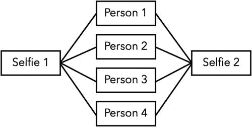

图 9-6. 自拍和人物的唯一化

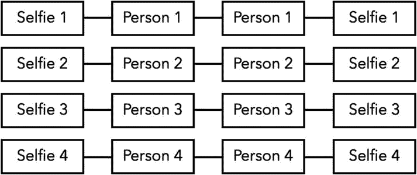

图 9-7. 自拍和人物的非唯一化

唯一化不仅节省内存，还消除了数据不一致的问题。试想一下，如果 Core Data 不采用唯一化，PerformanceTuning 应用程序中每个自拍都会有 500 个内存实例（每人一个），会发生什么情况。假设 `人员 1` 将某个自拍的评分改为 5，而 `人员 2` 将同一个自拍的评分改为 7。那么这个自拍的实际评分应该是什么？当应用程序将该自拍存入持久化存储时，它应该保存哪个评分？你可以想象，如果 Core Data 在内存中维护每个数据对象的多个实例，你将不得不追踪多少数据不一致的 Bug。

请注意，唯一化仅在单个托管对象上下文内进行，而不会跨托管对象上下文发生。然而，好消息是，Core Data 的默认行为就是进行唯一化，且你无法更改这一点。唯一化是 Core Data 免费提供的功能。


为了测试唯一性，创建一个名为`Uniquing`的测试（同时使其符合`PerfTest`协议），该测试从持久化存储中获取所有自拍，然后将每个自拍的相关人物与其他自拍的相关人物进行比较。测试通过的条件是：代码必须验证内存中只存在 500 个`Person`实例，并且每个自拍都指向相同的 500 个`Person`实例。为了简化这些比较，代码按确定顺序对人物进行排序，以便可以可预测地比较实例。在第一个自拍的首次循环中，代码将人物存储在一个引用数组中，以便所有后续循环都有可比较的对象。在每个后续循环中，代码提取当前自拍的人物并与引用数组进行比较。如果哪怕只有一个人物不匹配，测试就会失败。Listing 9-39 展示了`Uniquing.m`的代码，Listing 9-40 展示了`Uniquing.swift`的代码。

***Listing 9-39***. `Uniquing.m`

```
#import "Uniquing.h"
#import "Selfie.h"
#import "Person.h"

@implementation Uniquing

- (NSString *)runTestWithContext:(NSManagedObjectContext *)context {
  // Array to hold the people for comparison purposes
  NSArray *referencePeople = nil;

// Sorting for the people
  NSSortDescriptor *sortDescriptor  = [[NSSortDescriptor alloc] initWithKey:@"name"
                                                                  ascending:YES];

// Fetch all the selfies
  NSFetchRequest *fetchRequest = [NSFetchRequest fetchRequestWithEntityName:@"Selfie"];
  NSArray *selfies = [context executeFetchRequest:fetchRequest error:nil];

// Loop through the selfies
  for (Selfie *selfie in selfies) {
    // Get the sorted people
    NSArray *people = [selfie.people sortedArrayUsingDescriptors:@[sortDescriptor]];

// Store the first selfie's people for comparison purposes
    if (referencePeople == nil) {
      referencePeople = people;
    } else {
      // Do the comparison
      for (int i = 0, n = (int)[people count]; i < n; i++) {
        if (people[i] != referencePeople[i]) {
          return [NSString stringWithFormat:@"Uniquing test failed; %@ != %@",
                  people[i], referencePeople[i]];
        }
      }
    }
  }
  return @"Test complete";
}

@end
```

***Listing 9-40***. `Uniquing.swift`

```
import Foundation
import CoreData

class Uniquing : PerfTest {
    func runTestWithContext(context: NSManagedObjectContext) -> String! {
        // Array to hold the people for comparison purposes
        var referencePeople : [Person]?

// Sorting for the people
        let sortDescriptor = NSSortDescriptor(key: "name", ascending: true)

// Fetch all the selfies
        let fetchRequest = NSFetchRequest(entityName: "Selfie")
        let selfies = context.executeFetchRequest(fetchRequest, error: nil) as [Selfie]

// Loop through the selfies
        for selfie in selfies {
            // Get the sorted people
            let people = selfie.people.sortedArrayUsingDescriptors([sortDescriptor]) as [Person]

// Store the first selfie's people for comparison purposes
            if let referencePeople = referencePeople {
                // Do the comparison
                for var i=0, n = people.count; i<n; i++ {
                    if people[i] != referencePeople[i] {
                        return NSString(format: "Uniquing test failed; %@ != %@", people[i], referencePeople[i])
                    }
                }
            }
            else {
                referencePeople = people
            }
        }

return "Test complete"
    }
}
```

将`Uniquing`的一个实例添加到`ViewController.m`或`ViewController.swift`的`tests`数组中，如有必要添加对`Uniquing.h`的导入，构建并运行应用程序，然后运行新测试。你最终会看到“Test complete”消息，表明测试通过且唯一性验证成功。

## 使用更好的谓词提高性能

尽管电影片名《2001: 太空漫游》中提到了一年，但我们的机器还远未达到能智能地回应诸如“对不起，戴夫。我恐怕不能这样做。”之类话语的程度。在撰写本书时，程序员仍然需要进行大量辅助工作来引导机器完成其被要求执行的任务。这意味着代码的编写方式决定了其效率。通常有多种方法可以检索相同的数据，但所采用的解决方案会显著影响应用程序的性能。

### 使用更快的比较器

通常来说，字符串比较器的执行速度比原始类型比较器慢。当使用`OR`运算符组合谓词时，将原始类型比较器放在前面总是更高效，因为如果它们解析为`TRUE`，则不需要再评估其余的比较器。这是因为“`TRUE OR` 任何表达式”总是为真。类似的策略也可用于由`AND`组合的谓词。在这种情况下，如果第一个谓词失败，则第二个谓词将不会被评估，因为“`FALSE AND` 任何表达式”总是为假。

为了验证这一点，在你的性能测试应用程序中添加一个名为`Predicate`的新测试，并使其符合`PerfTest`协议。该测试包含两个获取请求，它们使用由`OR`组合的谓词检索相同的对象。在第一个测试中，字符串比较器`LIKE`用在原始类型比较器之前。在第二个测试中，比较器的顺序被调换。将每个测试运行 1000 次以获得有意义的计时；每次循环时，缓存被重置以保持干净上下文。Listing 9-41 展示了`Predicate.m`，Listing 9-42 展示了`Predicate.swift`。

***Listing 9-41***. `Predicate.m`

```
#import "Predicate.h"

@implementation Predicate

- (NSString *)runTestWithContext:(NSManagedObjectContext *)context {
  NSMutableString *result = [NSMutableString string];

// Set up the first fetch request
  NSFetchRequest *fetchRequest1 = [NSFetchRequest fetchRequestWithEntityName:@"Selfie"];
  fetchRequest1.predicate = [NSPredicate predicateWithFormat:@"(name LIKE %@) OR (rating < %d)", @"*e*ie*", 5];

// Run the first fetch request and measure
  NSDate *start1 = [NSDate date];
  for (int i = 0; i < 1000; i++) {
    [context reset];
    [context executeFetchRequest:fetchRequest1 error:nil];
  }
  NSDate *end1 = [NSDate date];
  [result appendFormat:@"Slow predicate: %.3f s\n", [end1 timeIntervalSinceDate:start1]];

// Set up the second fetch request
  NSFetchRequest *fetchRequest2 = [NSFetchRequest fetchRequestWithEntityName:@"Selfie"];
  fetchRequest1.predicate = [NSPredicate predicateWithFormat:@"(rating < %d) OR (name LIKE %@)", 5, @"*e*ie*"];

// Run the first fetch request and measure
  NSDate *start2 = [NSDate date];
  for (int i = 0; i < 1000; i++) {
    [context reset];
    [context executeFetchRequest:fetchRequest2 error:nil];
  }
  NSDate *end2 = [NSDate date];
  [result appendFormat:@"Fast predicate: %.3f s\n", [end2 timeIntervalSinceDate:start2]];

return result;
}

@end
```

***Listing 9-42***. `Predicate.swift`

```
import Foundation
import CoreData

class Predicate : PerfTest {
    func runTestWithContext(context: NSManagedObjectContext) -> String! {
        let result = NSMutableString()

// Set up the first fetch request
        let fetchRequest1 = NSFetchRequest(entityName: "Selfie")
        fetchRequest1.predicate = NSPredicate(format: "(name LIKE %@) OR (rating < %d)", "*e*ie*", 5)
```


```swift
let start1 = NSDate()
for var i=0; i<1000; i++ {
    context.reset()
    context.executeFetchRequest(fetchRequest1, error: nil)
}
let end1 = NSDate()
result.appendFormat("Slow predicate: %.3f s\n", end1.timeIntervalSinceDate(start1))

let fetchRequest2 = NSFetchRequest(entityName: "Selfie")
fetchRequest2.predicate = NSPredicate(format: "(rating < %d) OR (name LIKE %@)", 5, "*e*ie*")

let start2 = NSDate()
for var i=0; i<1000; i++ {
    context.reset()
    context.executeFetchRequest(fetchRequest2, error: nil)
}
let end2 = NSDate()
result.appendFormat("Fast predicate: %.3f s\n", end2.timeIntervalSinceDate(start2))

return result
```

将 `Predicate.h` 导入 `ViewController.m` 并向 `tests` 数组添加一个 `Predicate` 实例后，构建并运行应用程序，运行 `Predicate` 测试，注意慢谓词与快谓词的时间差异。在我们的 iPhone 6 Plus 上，慢谓词大约需要 6.3 秒，而快谓词所需时间约为慢谓词的三分之一：大约 2.3 秒。

## 使用子查询

你在第 3 章中已经了解到如何使用子查询来简化代码。在本节中，你将添加一个测试来展示使用子查询和手动检索相关数据之间的差异。考虑一个示例，你想要从某张自拍中找到符合特定条件的所有人物。如果不使用子查询，你必须首先获取所有符合条件的自拍。然后，你必须遍历每张自拍并提取人物。接着，你遍历这些人物并将他们添加到结果集中，同时确保如果同一个人出现在多张自拍中，你不会重复添加。清单 9-43 展示了 Objective-C 版的手动子查询代码，清单 9-44 展示了 Swift 版本。

**清单 9-43.** 手动执行子查询的笨办法 (Objective-C)

```objectivec
NSMutableDictionary *people = [NSMutableDictionary dictionary];

NSFetchRequest *fetchRequest = [NSFetchRequest fetchRequestWithEntityName:@"Selfie"];
fetchRequest.predicate = [NSPredicate predicateWithFormat:@"(rating < %d) OR (name LIKE %@)", 5, @"*e*ie*"];
NSArray *selfies = [context executeFetchRequest:fetchRequest error:nil];

for (Selfie *selfie in selfies) {
  for (Person *person in selfie.people) {
    [people setObject:person forKey:[[[person objectID] URIRepresentation] description]];
  }
}
```

**清单 9-44.** 手动执行子查询的笨办法 (Swift)

```swift
var people = [String: Person]()

let fetchRequest = NSFetchRequest(entityName: "Selfie")
fetchRequest.predicate = NSPredicate(format: "(rating < %d) OR (name LIKE %@)", 5, "*e*ie*")
let selfies = context.executeFetchRequest(fetchRequest, error: nil) as [Selfie]

for selfie in selfies {
    for obj in selfie.people {
        let person = obj as Person
        let key : String = person.objectID.URIRepresentation().description
        people[key] = person
    }
}
```

在这个实现中，`people` 字典包含了所有匹配的人物。你使用 `objectID` 作为键来消除重复项。这种方法的替代方案是让 Core Data 通过使用子查询为你完成匹配。清单 9-45 (Objective-C) 或清单 9-46 (Swift) 展示了使用子查询的相同结果集。

**清单 9-45.** 正确使用子查询的方法 (Objective-C)

```objectivec
NSFetchRequest *fetchRequest = [NSFetchRequest fetchRequestWithEntityName:@"Person"];
fetchRequest.predicate = [NSPredicate predicateWithFormat:@"(SUBQUERY(selfies, $x, ($x.rating < %d) OR ($x.name LIKE %@)).@count > 0)", 5, @"*e*ie*"];
NSArray *people = [context executeFetchRequest:fetchRequest error:nil];
```

**清单 9-46.** 正确使用子查询的方法 (Swift)

```swift
let fetchRequest = NSFetchRequest(entityName: "Person")
fetchRequest.predicate = NSPredicate(format: "(SUBQUERY(selfies, $x, ($x.rating < %d) OR ($x.name LIKE %@)).@count > 0)", 5, "*e*ie*")
let people = context.executeFetchRequest(fetchRequest2, error: nil) as [Selfie]
```

这里的主要区别之一是，你让持久化存储完成所有检索匹配人物的工作，这意味着大多数结果不会落入 Core Data 的 context 层供你进行后处理。使用子查询时，你实际上不需要像手动方法那样检索自拍，获取请求直接设置为获取人物。此外，手动选项在检索自拍后，还需要触发 fault 来获取人物。

为了演示子查询方法效率的提升，创建一个新的符合 `PerfTest` 协议的类 `Subquery`。清单 9-47 显示了 `Subquery.m`，清单 9-48 显示了 `Subquery.swift`。

**清单 9-47.** `Subquery.m`

```objectivec
#import "Subquery.h"
#import "Selfie.h"
#import "Person.h"

@implementation Subquery

- (NSString *)runTestWithContext:(NSManagedObjectContext *)context {
  NSMutableString *result = [NSMutableString string];

// 设置第一个获取请求，不使用子查询
  NSFetchRequest *fetchRequest1 = [NSFetchRequest fetchRequestWithEntityName:@"Selfie"];
  fetchRequest1.predicate = [NSPredicate predicateWithFormat:@"(rating < %d) OR (name LIKE %@)", 5, @"*e*ie*"];

// 记录时间并获取结果
  NSDate *start1 = [NSDate date];
  NSArray *selfies = [context executeFetchRequest:fetchRequest1 error:nil];
  NSMutableDictionary *people1 = [NSMutableDictionary dictionary];
  for (Selfie *selfie in selfies) {
    for (Person *person in selfie.people) {
      [people1 setObject:person forKey:[[[person objectID] URIRepresentation] description]];
    }
  }
  NSDate *end1 = [NSDate date];

// 记录手动请求的结果
  [result appendFormat:@"No subquery: %.3f s\n", [end1 timeIntervalSinceDate:start1]];
  [result appendFormat:@"People retrieved: %ld\n", [people1 count]];

// 重置 context 以获得干净的结果
  [context reset];

// 设置第二个获取请求，使用子查询
  NSFetchRequest *fetchRequest2 = [NSFetchRequest fetchRequestWithEntityName:@"Person"];
  fetchRequest2.predicate = [NSPredicate predicateWithFormat:@"(SUBQUERY(selfies, $x, ($x.rating < %d) OR ($x.name LIKE %@)).@count > 0)", 5, @"*e*ie*"];

// 记录时间并获取结果
  NSDate *start2 = [NSDate date];
  NSArray *people2 = [context executeFetchRequest:fetchRequest2 error:nil];
  NSDate *end2 = [NSDate date];

// 记录子查询请求的结果
  [result appendFormat:@"Subquery: %.3f s\n", [end2 timeIntervalSinceDate:start2]];
  [result appendFormat:@"People retrieved: %ld\n", [people2 count]];

return result;
}

@end
```

**清单 9-48.** `Subquery.swift`

```swift
import CoreData

class Subquery: PerfTest {
    func runTestWithContext(context: NSManagedObjectContext) -> String {
        var result = ""

        // 设置第一个获取请求，不使用子查询
        let fetchRequest1 = NSFetchRequest(entityName: "Selfie")
        fetchRequest1.predicate = NSPredicate(format: "(rating < %d) OR (name LIKE %@)", 5, "*e*ie*")

        // 记录时间并获取结果
        let start1 = NSDate()
        let selfies = context.executeFetchRequest(fetchRequest1, error: nil) as! [Selfie]
        var people1 = [String: Person]()
        for selfie in selfies {
            for person in selfie.people {
                let key = person.objectID.URIRepresentation().description
                people1[key] = person as? Person
            }
        }
        let end1 = NSDate()

        // 记录手动请求的结果
        result += "No subquery: \(end1.timeIntervalSinceDate(start1)) s\n"
        result += "People retrieved: \(people1.count)\n"

        // 重置 context 以获得干净的结果
        context.reset()

        // 设置第二个获取请求，使用子查询
        let fetchRequest2 = NSFetchRequest(entityName: "Person")
        fetchRequest2.predicate = NSPredicate(format: "(SUBQUERY(selfies, $x, ($x.rating < %d) OR ($x.name LIKE %@)).@count > 0)", 5, "*e*ie*")

        // 记录时间并获取结果
        let start2 = NSDate()
        let people2 = context.executeFetchRequest(fetchRequest2, error: nil) as! [Person]
        let end2 = NSDate()

        // 记录子查询请求的结果
        result += "Subquery: \(end2.timeIntervalSinceDate(start2)) s\n"
        result += "People retrieved: \(people2.count)\n"

        return result
    }
}
```


```objective-c
// 标记时间并获取结果
NSDate *start1 = [NSDate date];
NSArray *selfies = [context executeFetchRequest:fetchRequest1 error:nil];
NSMutableDictionary *people1 = [NSMutableDictionary dictionary];
for (Selfie *selfie in selfies) {
    for (Person *person in selfie.people) {
        [people1 setObject:person forKey:[[[person objectID] URIRepresentation] description]];
    }
}
NSDate *end1 = [NSDate date];

// 记录手动请求的结果
[result appendFormat:@"无子查询: %.3f s\n", [end1 timeIntervalSinceDate:start1]];
[result appendFormat:@"检索到的人数: %ld\n", [people1 count]];

// 重置上下文以获取干净的结果
[context reset];

// 设置第二个获取请求（带子查询）
NSFetchRequest *fetchRequest2 = [NSFetchRequest fetchRequestWithEntityName:@"Person"];
fetchRequest2.predicate = [NSPredicate predicateWithFormat:@"(SUBQUERY(selfies, $x, ($x.rating < %d) OR ($x.name LIKE %@)).@count > 0)", 5, @"*e*ie*"];

// 标记时间并获取结果
NSDate *start2 = [NSDate date];
NSArray *people2 = [context executeFetchRequest:fetchRequest2 error:nil];
NSDate *end2 = [NSDate date];

// 记录子查询请求的结果
[result appendFormat:@"子查询: %.3f s\n", [end2 timeIntervalSinceDate:start2]];
[result appendFormat:@"检索到的人数: %ld\n", [people2 count]];

return result;
}

@end
```

将你的导入文件（`Subquery.h`）和 `Subquery` 实例添加到 `ViewController` 中，然后运行测试。在我们的 iPhone 6 Plus 上，无子查询版本耗时略高于 30 秒，而子查询版本仅需约 1.5 秒——速度快了 20 倍以上！

谓词的编写方式会严重影响应用程序的性能。你应当时刻留意自己要求 Core Data 完成的任务，并思考如何用更高效的谓词实现相同的结果。

## 批量更新

在 iOS 之前的 Core Data 世界中，如果你想要更新大量 Core Data 对象，必须首先获取所有需要更新的对象，然后遍历它们，设置新值，最后保存托管对象上下文。根据所需更新数据集的大小，这可能是一个缓慢且消耗内存的操作，因为所有对象都必须先加载到内存中，再在循环中进行写入。对于大型更新——比如那些大到无法完全载入内存的更新——开发者必须创建自定义解决方案，将更新拆分成更小的批次。

iOS 8（以及 OS X Yosemite）引入了 Core Data 的批量更新功能，通过一个名为 `NSBatchUpdateRequest` 的类来弥补这一缺陷。令人惊讶的是，Apple 的文档（截至 Xcode 6.1 和 iOS 8.1）并未提供该类的任何详细说明，仅表明它继承自 `NSPersistentStoreRequest`。不过头文件 `NSBatchUpdateRequest.h` 提供了一些信息。以下是从头文件注释中获取的两个重要要点：

- `NSBatchUpdateRequest` 直接与底层持久化存储通信，无需将数据加载到内存中。并非所有持久化存储都支持这种方式，但既然你很可能使用的是 SQLite 持久化存储，应该没问题。
- 由于它直接与底层持久化存储通信，因此不会经过托管对象模型和托管对象上下文提供的验证过程。你需要自行负责实施验证规则。

要执行批量更新请求，你需要创建一个 `NSBatchUpdateRequest` 实例，指定请求要更新的模型实体。你可以选择为该请求设置一个谓词，以筛选需要更新的对象。然后，设置要更新的属性及其对应的新值，同时指定期望返回的结果类型。最后，执行更新。

你需要在字典中指定要更新的属性，其中键为要更新的属性名，值为目标值。这意味着对于某个给定属性，你只能指定一个单一值，所有匹配的对象都会被更新为该值——你无法为每个对象指定不同的值。这是合理的，因为 Core Data 会生成并执行类似如下的 SQL 语句：

```sql
UPDATE ZMYENTITY SET ZNAME = ?
```

当然，你可以同时设置多个属性进行更新。

对于执行批量更新后希望返回的结果类型，你可以指定以下三个值之一：

- `NSStatusOnlyResultType`——不返回任何内容。这是默认值。
- `NSUpdateObjectIDsResultType`——返回已更新对象的对象 ID。
- `NSUpdatedObjectsCountResultType`——返回已更新的对象数量。

需要指定的返回类型当然取决于应用程序的需求。不过，`NSUpdateObjectIDsResultType` 可能很有用，因为它可以让你在托管对象上下文中将更新后的对象转为故障状态。请记住，批量更新会绕过托管对象上下文，因此如果你已经在托管对象上下文中持有这些对象，它们仍然保留着旧值。你可以先将它们转为故障状态，然后重新获取以得到更新后的对象。

无论指定哪种类型，执行批量更新后，`NSBatchUpdateResult` 的 `result` 成员会被设置为相应的值。

为了测试批量更新，创建一个遵循 `PerfTest` 协议、名为 `BatchUpdate` 的类。在该类实现的测试方法中，我们将所有 selfie 的评分更新两次。第一次执行更新时，我们采用 iOS 8 之前的方式：逐个更新。先获取所有 selfie，然后遍历它们，将评分值设为 5。最后，保存托管对象上下文。第二次执行更新时，我们使用批量更新将评分值设为 7。列表 9-49 展示了 Objective-C 版本，列表 9-50 展示了 Swift 版本。

***列表 9-49***. `BatchUpdate.m`

```objective-c
#import "BatchUpdate.h"

@implementation BatchUpdate

- (NSString *)runTestWithContext:(NSManagedObjectContext *)context {
    NSMutableString *result = [NSMutableString string];

    // 逐个更新所有 selfie
    NSFetchRequest *fetchRequest = [NSFetchRequest fetchRequestWithEntityName:@"Selfie"];
    NSDate *start1 = [NSDate date];
    NSArray *selfies = [context executeFetchRequest:fetchRequest error:nil];
    for (NSManagedObject *selfie in selfies) {
        [selfie setValue:@5 forKey:@"rating"];
    }
    [context save:nil];
    NSDate *end1 = [NSDate date];
    [result appendFormat:@"逐个更新: %.3f s\n", [end1 timeIntervalSinceDate:start1]];

    // 批量更新 selfie

    // 为 Selfie 实体创建批量更新请求
    NSBatchUpdateRequest *batchUpdateRequest = [NSBatchUpdateRequest batchUpdateRequestWithEntityName:@"Selfie"];

    // 设置期望的结果类型为更新对象数量
    batchUpdateRequest.resultType = NSUpdatedObjectsCountResultType;

    // 将评分属性更新为 7
    batchUpdateRequest.propertiesToUpdate = @{ @"rating" : @7 };

    // 标记时间并执行更新
    NSDate *start2 = [NSDate date];
    NSBatchUpdateResult *batchUpdateResult = (NSBatchUpdateResult *)[context executeRequest:batchUpdateRequest error:nil];
    NSDate *end2 = [NSDate date];

    // 记录结果
    [result appendFormat:@"批量更新 (%@ 行): %.3f s\n", batchUpdateResult.result, [end2 timeIntervalSinceDate:start2]];

    return result;
}

@end
```

***列表 9-50***. `BatchUpdate.swift`

```swift
import Foundation
import CoreData

class BatchUpdate : PerfTest {
    func runTestWithContext(context: NSManagedObjectContext) -> String! {
        let result = NSMutableString()
```

```swift
// 逐一更新所有自拍
let fetchRequest = NSFetchRequest(entityName: "Selfie")
let start1 = NSDate()
let selfies = context.executeFetchRequest(fetchRequest, error: nil) as [Selfie]
for selfie in selfies {
    selfie.setValue(5, forKey: "rating")
}
context.save(nil)
let end1 = NSDate()
result.appendFormat("逐一更新耗时: %.3f s\n", end1.timeIntervalSinceDate(start1))

// 批量更新自拍

// 为 Selfie 实体创建批量更新请求
let batchUpdateRequest = NSBatchUpdateRequest(entityName: "Selfie")

// 将所需结果类型设为已更新对象计数
batchUpdateRequest.resultType = .UpdatedObjectsCountResultType

// 将评分属性更新为 7
batchUpdateRequest.propertiesToUpdate = ["rating": 7]

// 计时并运行更新
let start2 = NSDate()
let batchUpdateResult = context.executeRequest(batchUpdateRequest, error: nil) as NSBatchUpdateResult
let end2 = NSDate()

// 记录结果
result.appendFormat("批量更新 (\(batchUpdateResult.result!) 行): %.3f s\n", end2.timeIntervalSinceDate(start2))

return result
```

将 `BatchUpdate` 添加到你的 `tests` 数组中，构建并运行应用程序，然后运行 `BatchUpdate` 测试。在我们的 iPhone 6 Plus 上，逐一更新大约需要 0.07 秒，而批量更新大约需要 0.007 秒。有两件事需要注意。

- 批量更新速度快了大约 10 倍。
- 逐一更新仍然相当快。

我们在测试中只更新了 500 个对象，而 iOS 8 之前的方法处理这些只需要百分之几秒。这告诉我们，我们可能不应该通过批量方式来执行所有更新，因为那样会放弃 Core Data 提供的校验来换取一点性能提升。相反，我们应该在真正需要时使用批量更新：即必须更新数万个（或更多）对象时。

## 性能分析

尽管在编写代码之前深思熟虑，并理解故障、预取和内存使用等问题的影响，通常能让你编写出性能良好的可靠代码，但你常常需要一份关于应用程序性能的客观、无偏见的意见。关于应用程序性能最无偏见且最客观的意见来自运行它的计算机，因此让计算机测量应用程序 Core Data 交互的结果，能为优化性能提供重要洞察。

苹果提供了一款名为 `Instruments` 的工具，它可以测量应用程序的多个方面，包括与 Core Data 相关的项目。本节将展示如何使用 `Instruments` 来测量应用程序的 Core Data 方面。我们也鼓励你探索 `Instruments` 提供的其他测量功能。

### 启动 Instruments

要启动 `Instruments` 并开始分析应用程序，请从 Xcode 菜单中选择 Product  Profile。这将启动 `Instruments` 并显示一个对话框，询问你想要分析什么，如图 9-8 所示。

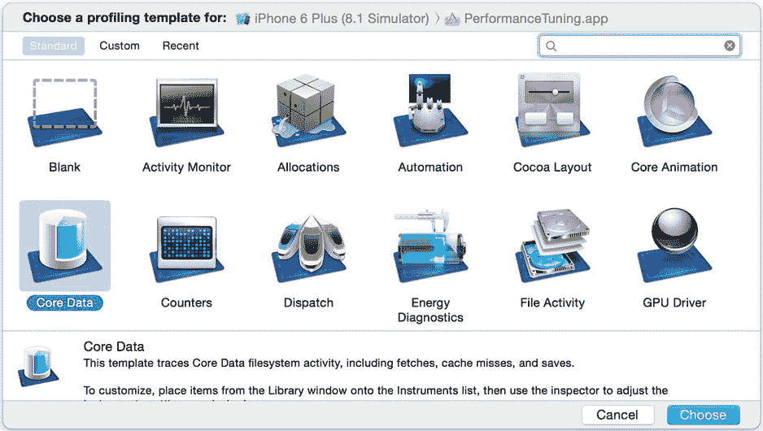

图 9-8. `Instruments` 要求你选择一个模板

选择 Core Data 模板并点击 Choose 按钮。这将打开主 `Instruments` 窗口，并在左侧边栏显示 Core Data 仪器，如图 9-9 所示。

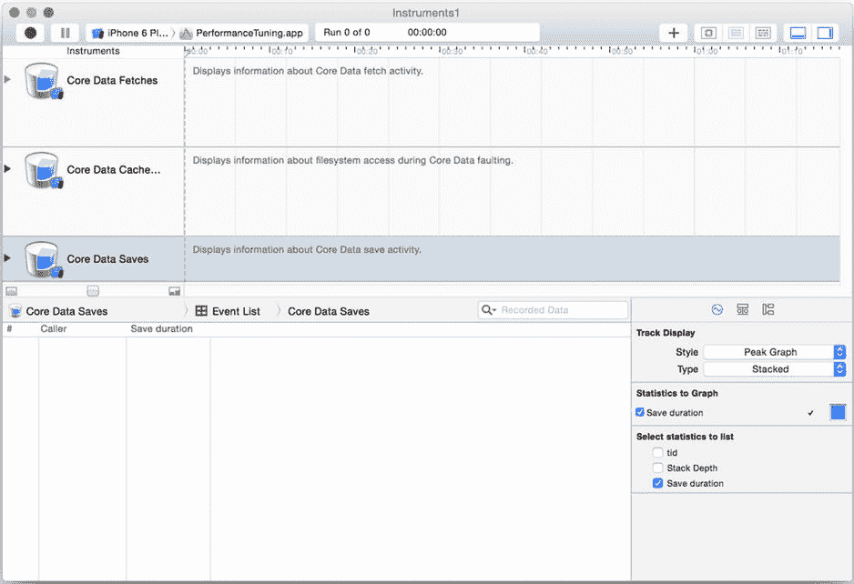

图 9-9. 包含 Core Data 仪器的主 `Instruments` 窗口

点击 `Instruments` 窗口左上角的 Record 按钮，启动 iOS 模拟器（`Instruments` 不支持在设备上分析 Core Data 仪器）和 `PerformanceTuning` 应用程序。

### 理解结果

`Instruments` 窗口显示它正在追踪的 Core Data 测量指标，包括：

- Core Data 获取
- Core Data 缓存未命中
- Core Data 保存

运行 `PerformanceTuning` 应用程序中的任意测试——例如 `Subquery`——然后等待测试完成。测试完成后，点击 `Instruments` 左上角的 Stop 按钮，停止应用程序并停止记录 Core Data 测量指标。然后你可以审查测试结果，查看关于保存、获取、故障和缓存未命中的信息。你可以通过选择 File  Save As 菜单将结果保存到文件系统以便进一步审查。之后可以在 `Instruments` 中使用标准的 File  Open 菜单项重新打开它们。

图 9-10 显示了运行 `Subquery` 后的 `Instruments` 窗口。如图 9-10 所示，通过选择左侧的 Core Data Fetches，你可以看到 Core Data 获取的获取次数和获取持续时间（以微秒为单位）。代码执行了三个获取请求（`Instruments` 会将一个获取调用列出两次：一次在调用开始时，一次在完成时）。第一个请求耗时 1,192 微秒，获取了 500 个人，这可以从获取实体 `Person` 和获取计数 500 中看出。

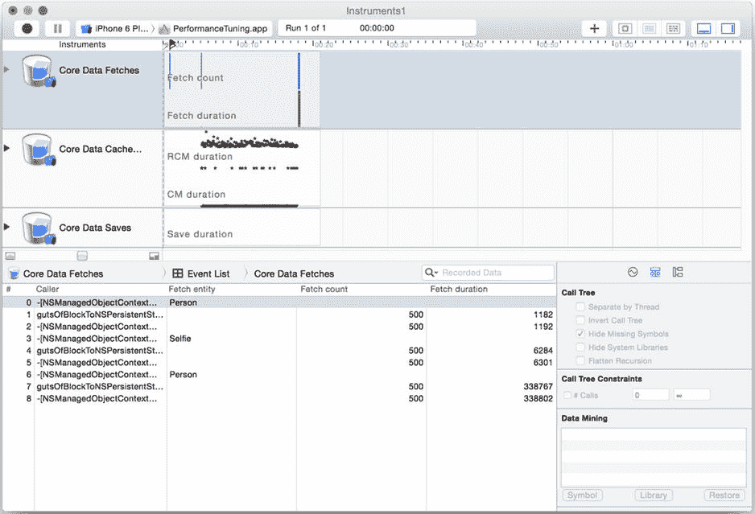

图 9-10. `Subquery` 的结果

通过将窗口中间的下拉菜单从 Event List 改为 Call Tree，你可以查看获取请求的调用树。通过勾选窗口右侧的 Hide System Libraries 复选框，可以减少查看应用程序代码中调用所需的导航深度。图 9-11 显示了获取请求的调用树。使用调用树，你可以确定代码的哪些部分正在从 Core Data 存储中获取数据。

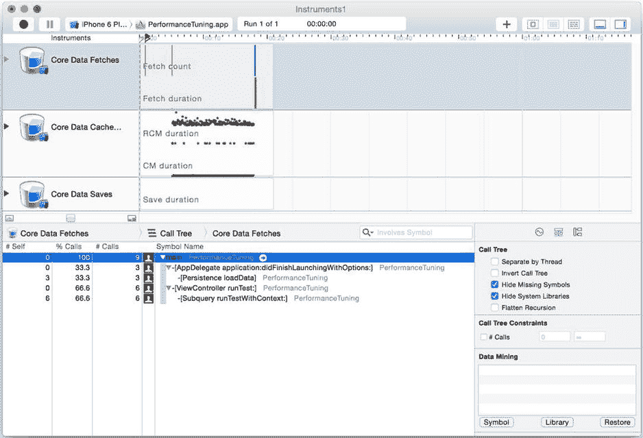

图 9-11. 获取请求的调用树

这只是 `Instruments` 能为你做的一小部分，它帮助你确定应用程序如何使用 Core Data，以及如何引导你找到 Core Data 性能低到需要优化努力的地方。我们鼓励你进一步研究 `Instruments` 工具，尝试其他 Core Data 仪器，查看缓存未命中和保存等情况，从而确定应用程序的热点区域。

## 处理多线程

在编写非平凡应用程序时，你难免会考虑使用多线程。通常这是出于性能原因——将任务卸载到后台——但性能提升是以增加复杂性为代价的。本节将展示如何识别在使用 Core Data 配合多线程时常见的一些问题，以及如何解决它们。

### 线程安全

大多数苹果应用程序编程接口（API）都不是线程安全的，除非它们明确声明。与苹果的一贯风格一致，Core Data **并非线程安全**。但这到底意味着什么？它意味着 Core Data 的开发人员没有采取任何预防措施来确保当你让两个线程共享 API 资源时代码不会崩溃。在我们的案例中，它意味着你不能在线程之间安全地共享 `NSManagedObject`、`NSManagedContext` 或任何其他 Core Data 对象。

不要将非线程安全视为缺乏关注或质量，而应将其视为责任的委托。苹果更倾向于保持简单并最大化性能。他们将管理线程安全的责任委托给你——开发者——在你需要的时候。

哦，拜托，能出什么乱子呢？


某些开发者有一种常见本能：只要问题看起来不会立刻造成损害，就会直接忽略复杂性。也许你觉得自己的线程表现良好且训练有素，不会争抢资源。也许你认为自己的应用并不复杂，所以跨线程传递 Core Data 对象应该没问题。又或者，你只是单纯觉得自己运气好。如果你符合上述任何一种情况，那么这一节就是为你准备的。

那些长期处理线上生产应用的开发者常说，只要应用真正到了用户手中，任何可能发生的情况都必然会发生。如果两个线程可能发生冲突，它们就一定会冲突。如果不加小心，你必然会遇到这些并发问题。本节将教你如何识别其中一些问题。

为了演示线程并发问题，我们构建了一个简单的应用，它既要写入大量数据，又要报告进度。你可能会想，我们可以先写一些数据，报告状态，再写一些，再报告状态，如此反复。确实，我们可以串行地分块执行写入和读取操作，但这会显著增加写入数据的时间，从而降低用户体验。通过使用线程，我们可以并行执行这些任务，同时保持 UI 的响应性。

打开 Xcode，使用单视图应用模板创建一个新应用。将其命名为 `MultiThread`。第一步是设置并初始化一个 Core Data 栈。创建一个名为 `MultiThread.xcdatamodeld` 的新数据模型。添加一个名为 `MyData` 的实体，并为其添加一个名为 `myValue` 的属性，类型为 `Integer 16`。你的数据模型应与图 9-12 一致。

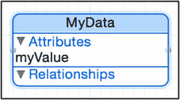

图 9-12. MultiThread 数据模型

为清晰起见，我们创建一个包含 Core Data 设置的类。创建一个名为 `Persistence` 的新类（作为 `NSObject` 的子类），并将 `Persistence.h` 修改为如代码清单 9-51 所示。

***代码清单 9-51***. `Persistence.h`

```
#import <Foundation/Foundation.h>
@import CoreData;

@interface Persistence : NSObject

@property (readonly, strong, nonatomic) NSManagedObjectModel *managedObjectModel;
@property (readonly, strong, nonatomic) NSPersistentStoreCoordinator *persistentStoreCoordinator;

- (NSManagedObjectContext*)createManagedObjectContext;

@end
```

这个头文件应该看起来很熟悉，不过你可能会注意到，我们用一个创建托管对象上下文的方法代替了托管对象上下文的属性。这样做是为了线程处理，我们将在本章后面解释。

接下来，打开 `Persistence.m` 或 `Persistence.swift`，并以前几章类似的方式实现初始化。代码清单 9-52 展示了 Objective-C 版本，代码清单 9-53 展示了 Swift 版本。

***代码清单 9-52***. `Persistence.m`

```
- (instancetype)init {
  self = [super init];
  if (self != nil) {
    // 初始化托管对象模型
    NSURL *modelURL = [[NSBundle mainBundle]
            URLForResource:@"MultiThread" withExtension:@"momd"];
    _managedObjectModel = [[NSManagedObjectModel alloc]
            initWithContentsOfURL:modelURL];

// 初始化持久化存储协调器
    NSURL *storeURL = [[self applicationDocumentsDirectory]
            URLByAppendingPathComponent:@"MultiThread.sqlite"];

// 如果已有存储则将其删除，以便从头开始
    NSFileManager *fm = [NSFileManager defaultManager];
    [fm removeItemAtURL:storeURL error:nil];

NSError *error = nil;
    _persistentStoreCoordinator = [[NSPersistentStoreCoordinator alloc]
             initWithManagedObjectModel:self.managedObjectModel];
    if (![_persistentStoreCoordinator addPersistentStoreWithType:NSSQLiteStoreType
                                                   configuration:nil
                                                             URL:storeURL
                                                         options:nil
                                                           error:&error]) {
      NSLog(@"未解决的错误 %@, %@", error, [error userInfo]);
      abort();
    }
  }
  return self;
}

- (NSURL *)applicationDocumentsDirectory {
  return [[[NSFileManager defaultManager]
        URLsForDirectory:NSDocumentDirectory
        inDomains:NSUserDomainMask] lastObject];
}

- (NSManagedObjectContext*)createManagedObjectContext {
  NSManagedObjectContext *managedObjectContext =
        [[NSManagedObjectContext alloc] init];
  [managedObjectContext
        setPersistentStoreCoordinator:self.persistentStoreCoordinator];

return managedObjectContext;
}

@end
```

***代码清单 9-53***. `Persistence.swift`

```
import Foundation
import CoreData

class Persistence {
    init() {
        println("假装在迁移");
        NSThread.sleepForTimeInterval(10)
        println("假装完成...");
    }

// MARK: - Core Data 堆栈

lazy var applicationDocumentsDirectory: NSURL = {
        // 应用程序用于存储 Core Data 存储文件的目录。此代码使用应用程序文档目录中名为 "book.persistence.MultiThreadSwift" 的目录。
        let urls = NSFileManager.defaultManager().URLsForDirectory(.DocumentDirectory, inDomains: .UserDomainMask)
        return urls[urls.count-1] as NSURL
        }()

lazy var managedObjectModel: NSManagedObjectModel = {
        // 应用程序的托管对象模型。此属性是必需的。如果应用程序无法找到并加载其模型，将发生致命错误。
        let modelURL = NSBundle.mainBundle().URLForResource("MultiThreadSwift", withExtension: "momd")!
        return NSManagedObjectModel(contentsOfURL: modelURL)!
        }()

lazy var persistentStoreCoordinator: NSPersistentStoreCoordinator? = {
        // 应用程序的持久化存储协调器。此实现创建并返回一个协调器，并已为其添加了应用程序的存储。此属性是可选的，因为存在可能导致创建存储失败的合法错误情况。
        // 创建协调器和存储
        var coordinator: NSPersistentStoreCoordinator? = NSPersistentStoreCoordinator(managedObjectModel: self.managedObjectModel)
        let url = self.applicationDocumentsDirectory.URLByAppendingPathComponent("MultiThreadSwift.sqlite")

// 如果已有存储则将其删除，以便从头开始
        let fm = NSFileManager.defaultManager()
        fm.removeItemAtURL(url, error: nil)
```


```swift
var error: NSError? = nil
var failureReason = "创建或加载应用程序保存的数据时出现错误。"
if coordinator!.addPersistentStoreWithType(NSSQLiteStoreType, configuration: nil, URL: url, options: nil, error: &error) == nil {
    coordinator = nil
    // 报告所有发生的错误。
    let dict = NSMutableDictionary()
    dict[NSLocalizedDescriptionKey] = "初始化应用程序的保存数据失败"
    dict[NSLocalizedFailureReasonErrorKey] = failureReason
    dict[NSUnderlyingErrorKey] = error
    error = NSError(domain: "YOUR_ERROR_DOMAIN", code: 9999, userInfo: dict)
    // 将此替换为处理错误的合适代码。
    // abort() 会导致应用程序生成崩溃日志并终止。您不应在正式发布的应用程序中使用此函数，尽管它在开发过程中可能很有用。
    NSLog("未解决的错误 \(error), \(error!.userInfo)")
    abort()
}

return coordinator
}()

lazy var managedObjectContext: NSManagedObjectContext? = {
    return self.createManagedObjectContext()
}()

func createManagedObjectContext() -> NSManagedObjectContext? {
    // 返回应用程序的管理对象上下文（该上下文已绑定到应用程序的持久存储协调器）。此属性是可选的，因为存在可能导致创建上下文失败的合法错误情况。
    let coordinator = self.persistentStoreCoordinator
    if coordinator == nil {
        return nil
    }

    var managedObjectContext = NSManagedObjectContext()
    managedObjectContext.persistentStoreCoordinator = coordinator
    return managedObjectContext
}

// MARK: - Core Data 保存支持

func saveContext () {
    if let moc = self.managedObjectContext {
        var error: NSError? = nil
        if moc.hasChanges && !moc.save(&error) {
            // 将此实现替换为处理错误的合适代码。
            // abort() 会导致应用程序生成崩溃日志并终止。您不应在正式发布的应用程序中使用此函数，尽管它在开发过程中可能很有用。
            NSLog("未解决的错误 \(error), \(error!.userInfo)")
            abort()
        }
    }
}
```

**重要提示：** 请注意代码如何通过调用 `NSFileManager` 的 `removeItemAtURL:error:` 方法来删除如果存在的 SQLite 文件。在实际的应用程序中，这显然是一种糟糕的做法，因为它会删除所有持久化数据。但在我们的场景中，这是非常有用的，因为它允许我们多次启动应用程序，而无需担心残留数据。

既然我们已经完成了 Core Data 设置代码，现在可以转到 `ViewController` 并试验代码，看看我们可以利用线程做些什么。

对于 Objective-C 版本，请编辑 `ViewController.m`，添加适当的导入语句、`Persistence` 和 `NSManagedObjectContext` 实例的私有属性，以及运行设置代码的初始化器，如代码清单 9-54 所示。对于 Swift，请对 `ViewController.swift` 进行类似的编辑，如代码清单 9-55 所示。

**代码清单 9-54.** `ViewController.m`

```objective-c
@import CoreData;
#import "ViewController.h"
#import "Persistence.h"

@interface ViewController ()
@property (nonatomic, strong) Persistence *persistence;
@property (nonatomic, strong) NSManagedObjectContext *managedObjectContext;
@end

@implementation ViewController

- (instancetype)initWithCoder:(NSCoder *)aDecoder {
    self = [super initWithCoder:aDecoder];
    if(self) {
        self.persistence = [[Persistence alloc] init];
        self.managedObjectContext = [self.persistence createManagedObjectContext];
    }

return self;
}

- (void)viewDidLoad {
    [super viewDidLoad];
    // 使用 nib 文件加载视图后，在此处执行任何额外的设置。
}

- (void)didReceiveMemoryWarning {
    [super didReceiveMemoryWarning];
    // 处置任何可以重新创建的资源。
}

@end
```

**代码清单 9-55.** `ViewController.swift`

```swift
import UIKit
import CoreData

class ViewController: UIViewController {

var persistence: Persistence?
    var managedObjectContext: NSManagedObjectContext?

required init(coder aDecoder: NSCoder) {
        super.init(coder: aDecoder)

self.persistence = Persistence()
        self.managedObjectContext = self.persistence?.managedObjectContext
    }

override func viewDidLoad() {
        super.viewDidLoad()
    }

override func didReceiveMemoryWarning() {
        super.didReceiveMemoryWarning()
        // 处置任何可以重新创建的资源。
    }
}
```

此时，您应该能够启动应用程序并看到一个空白屏幕。

仍然在 `ViewController` 中，我们现在创建一个用于写入数据的新方法。在此方法中，我们向存储区写入 10,000 个对象。写入完成后我们保存上下文，以便所有对象都将位于持久存储区中，这样任何其他管理对象上下文都能看到它们。代码清单 9-56 展示了 Objective-C 版本，代码清单 9-57 展示了 Swift 版本。

**代码清单 9-56.** 写入 10,000 个对象 (Objective-C)

```objective-c
- (void)writeData {
  NSManagedObjectContext *context = self.managedObjectContext;

NSLog(@"正在写入");
  for(int i=0; i<10000; i++) {
    NSManagedObject *obj = [NSEntityDescription
            insertNewObjectForEntityForName:@"MyData"
            inManagedObjectContext:context];
    [obj setValue:[NSNumber numberWithInt:i] forKey:@"myValue"];
  }

NSError *error;
  [context save:&error];
  if(error) {
    NSLog(@"写入时出错！%@", error);
  }

NSLog(@"完成");
}
```

**代码清单 9-57.** 写入 10,000 个对象 (Swift)

```swift
func writeData() {
    if let context = self.managedObjectContext {
        println("正在写入");
        for var i=0; i<10000; i++ {
            let obj = NSEntityDescription.insertNewObjectForEntityForName("MyData", inManagedObjectContext: context) as NSManagedObject
            obj.setValue(Int(i), forKey: "myValue")
        }

persistence?.saveContext()

println("完成")
    }
    else {
        println("缺少上下文。无法写入。")
    }
}
```

接下来，我们添加一个报告状态的方法——即一个读取已写入内容的方法。它返回已写入的 10,000 个对象所占的比例。代码清单 9-58 展示了 Objective-C 方法，代码清单 9-59 展示了 Swift 函数。

**代码清单 9-58.** 读取 10,000 个对象 (Objective-C)

```objective-c
- (CGFloat)reportStatus {
  NSManagedObjectContext *context = self.managedObjectContext;

NSFetchRequest *request = [[NSFetchRequest alloc] init];
  request.entity = [NSEntityDescription entityForName:@"MyData"
                inManagedObjectContext:context];

NSError *error;
  NSUInteger count = [context countForFetchRequest:request error:&error];

if(error) {
    NSLog(@"读取时出错！%@", error);
  }

return (CGFloat)count / 10000.0f;
}
```

**代码清单 9-59.** 读取 10,000 个对象 (Swift)

```swift
func reportStatus() -> Float {
    if let context = self.managedObjectContext {
        let request = NSFetchRequest(entityName: "MyData")
        var error: NSError? = nil
        let count = context.countForFetchRequest(request, error: &error)
        if error != nil {
            println("读取时出错")
        }

return Float(count) / 10000.0
    }
    else {
        println("缺少上下文。无法报告状态")
        return 0
    }
}
```


现在我们已经能够读写对象，只需调用相应代码即可。我们将在`viewDidAppear:`方法中实现这一操作，如代码清单 9-60（Objective-C）和代码清单 9-61（Swift）所示。

***代码清单 9-60***. 调用写入与读取方法（Objective-C）

```objective-c
- (void)viewDidAppear:(BOOL)animated {
    [super viewDidAppear:animated];

[self writeData];

CGFloat status = 0;
    while(status < 1.0) {
      status = [self reportStatus];
      NSLog(@"Status: %lu%%", (unsigned long)(status * 100));
    }

NSLog(@"All done");
}
```

***代码清单 9-61***. 调用写入与读取方法（Swift）

```swift
override func viewDidAppear(animated: Bool) {
    super.viewDidAppear(animated)

self.writeData()

var status : Float = 0
    while (status < 1) {
        status = self.reportStatus()
        println(NSString(format: "Status: %lu%%", Int(status * 100)))
    }
    println("All done")
}
```

显然，若此时启动应用，所有写入操作将在报告任何进度之前完成。一旦状态开始报告，你只会看到 100%。试试看。

```
09:35:11.586 MultiThread[3246:60b] Writing
09:35:11.738 MultiThread[3246:60b] Done
09:35:11.753 MultiThread[3246:60b] Status: 100%
09:35:11.754 MultiThread[3246:60b] All done
```

想必你已经知道发生了什么。由于所有操作都在同一线程中运行，数据写入会首先完成，只有在写入完成后我们才开始报告状态。我们也可以反过来，在写入数据前就开始报告状态，但那样写入部分将永远不会执行，因为状态循环会无限迭代下去。

这正是多线程的用武之地。解决方案是将写入和报告进度这两个操作分别分发到各自的线程中。使用 Grand Central Dispatch 编辑`viewDidAppear:`方法以采用多线程。一个线程负责写入数据，另一个线程则通过读取数据来报告状态。两个线程将异步运行，使我们能够在报告写入进度的同时进行数据写入。代码清单 9-62 展示了 Objective-C 版本，代码清单 9-63 展示了 Swift 版本。

***代码清单 9-62***. 在独立线程中写入与读取（Objective-C）

```objective-c
- (void)viewDidAppear:(BOOL)animated {
  [super viewDidAppear:animated];

dispatch_async(dispatch_get_global_queue(DISPATCH_QUEUE_PRIORITY_DEFAULT, 0), ^{
    [self writeData];
  });

dispatch_async(dispatch_get_global_queue(DISPATCH_QUEUE_PRIORITY_DEFAULT, 0), ^{
    CGFloat status = 0;
    while(status < 1.0) {
      status = [self reportStatus];
      NSLog(@"Status: %lu%%", (unsigned long)(status * 100));
    }

NSLog(@"All done");
  });
}
```

***代码清单 9-63***. 在独立线程中写入与读取（Swift）

```swift
override func viewDidAppear(animated: Bool) {
    super.viewDidAppear(animated)

dispatch_async(dispatch_get_global_queue(DISPATCH_QUEUE_PRIORITY_DEFAULT, 0), { () -> Void in
        self.writeData()
    })

dispatch_async(dispatch_get_global_queue(DISPATCH_QUEUE_PRIORITY_DEFAULT, 0), { () -> Void in
        var status : Float = 0
        while (status < 1) {
            status = self.reportStatus()
            println(NSString(format: "Status: %lu%%", Int(status * 100)))
        }
        println("All done")
    })
}
```

现在，当应用运行时，两个任务将同时执行。觉得自己运气不错？那就试试看，启动应用碰碰运气吧。

很可能你会得到类似下面的结果（如果没出现，我们希望你帮忙选彩票号码）：

```
09:40:03.120 MultiThread[3282:1303] Writing
09:40:03.122 MultiThread[3282:3603] Status: 0%
09:40:03.124 MultiThread[3282:3603] *** Terminating app due to uncaught exception 'NSGenericException', reason: '*** Collection <__NSCFSet: 0x1096122b0> was mutated while being enumerated.'
*** First throw call stack:
(
    0   CoreFoundation                      0x000000010194a495 __exceptionPreprocess + 165
    1   libobjc.A.dylib                     0x00000001016a999e objc_exception_throw + 43
    2   CoreFoundation                      0x00000001019ce68e __NSFastEnumerationMutationHandler + 126
    3   CoreData                            0x0000000101c2666b -[NSManagedObjectContext(_NSInternalAdditions) _countWithNoChangesForRequest:error:] + 1675
    4   CoreData                            0x0000000101c25d5b -[NSManagedObjectContext countForFetchRequest:error:] + 1211
    5   MultiThread                         0x00000001000022ae -[ViewController reportStatus] + 286
    6   MultiThread                         0x0000000100001ed9 __32-[ViewController viewDidAppear:]_block_invoke17 + 89
    7   libdispatch.dylib                   0x00000001020e7851 _dispatch_call_block_and_release + 12
    8   libdispatch.dylib                   0x00000001020fa72d _dispatch_client_callout + 8
    9   libdispatch.dylib                   0x00000001020eab27 _dispatch_root_queue_drain + 380
    10  libdispatch.dylib                   0x00000001020ead12 _dispatch_worker_thread2 + 40
    11  libsystem_pthread.dylib             0x0000000102447ef8 _pthread_wqthread + 314
    12  libsystem_pthread.dylib             0x000000010244afb9 start_wqthread + 13
)
libc++abi.dylib: terminating with uncaught exception of type NSException
```

这里的问题是，我们在上下文的缓存被写入的同时窥视了它。这不一定是 Core Data 的问题。你不能从两个不同线程同时遍历一个集合并窥视其内部。所以这绝对是一个线程安全问题。这个实验揭示了一个使用 Core Data 进行多线程编程时的基本原则：为每个线程分配独立的托管对象上下文。还记得我们创建的`createManagedObjectContext`方法吗？我们用该方法为`writeData`方法提供其自己的托管对象上下文，而不是使用`reportStatus`方法所使用的那个上下文。

当囚犯争斗时，他们会被隔离拘禁。他们失去了争斗的理由，因为没有可争夺的东西，也没有争斗的对象。线程隔离是处理线程之间“不协作”问题的常用策略。

在多线程中使用 Core Data 时，问题会迅速出现。管理并发性的方法很简单：避免共享线程之间争夺的资源。值得重申：最常见的解决方案是为每个线程创建一个上下文。

**重要提示** 每个上下文必须由即将使用它的线程创建。

我们对代码进行的另一项更改是在添加每个对象后保存托管对象上下文。这样做是为了将上下文的缓存写入持久化存储，以便`reportStatus`方法中使用的托管对象上下文能够看到这些对象。如果我们在保存上下文之前等待所有 10,000 个对象写入完毕，那么`reportStatus`方法在`writeData`线程完成写入之前将一直报告 0% 的状态，之后则会直接跳到 100%。

代码清单 9-64 展示了更新后的 Objective-C 版本，代码清单 9-65 展示了更新后的 Swift 版本。

***代码清单 9-64***. 每次写入后保存上下文（Objective-C）

```objective-c
- (void)writeData {
  NSManagedObjectContext *context = [self.persistence createManagedObjectContext];
```


```objectivec
NSLog(@"Writing");
for(int i=0; i<10000; i++) {
  NSManagedObject *obj = [NSEntityDescription insertNewObjectForEntityForName:@"MyData" inManagedObjectContext:context];
  [obj setValue:[NSNumber numberWithInt:i] forKey:@"myValue"];

  NSError *error;
  [context save:&error];
  if(error) {
    NSLog(@"Boom while writing! %@", error);
  }
}

NSLog(@"Done");
```

***列表 9-65***. 每次写入后保存上下文 (Swift)

```swift
func writeData () {
    if let context = self.persistence?.createManagedObjectContext() {
        println("Writing");
        for var i=0; i<10000; i++ {
            let obj = NSEntityDescription.insertNewObjectForEntityForName("MyData", inManagedObjectContext: context) as NSManagedObject
            obj.setValue(Int(i), forKey: "myValue")

            context.save(nil)
        }

        println("Done")
    }
    else {
        println("Missing context. Cannot write.")
    }
}
```

如果你现在构建并运行应用，会看到控制台中的状态百分比稳步攀升，直到达到 100%，然后显示"All done"消息。

## 免费的用户界面

既然我们已成功让应用支持多线程，接下来完成收尾工作：在用户界面上添加一个进度条，以便研究如何让用户直观地看到进度。

打开`Main.storyboard`，按照图 9-13 所示，向视图中添加一个进度条和一个标签。标签将以文本形式显示进度信息，而进度条则以图形方式同步反映相同进度。

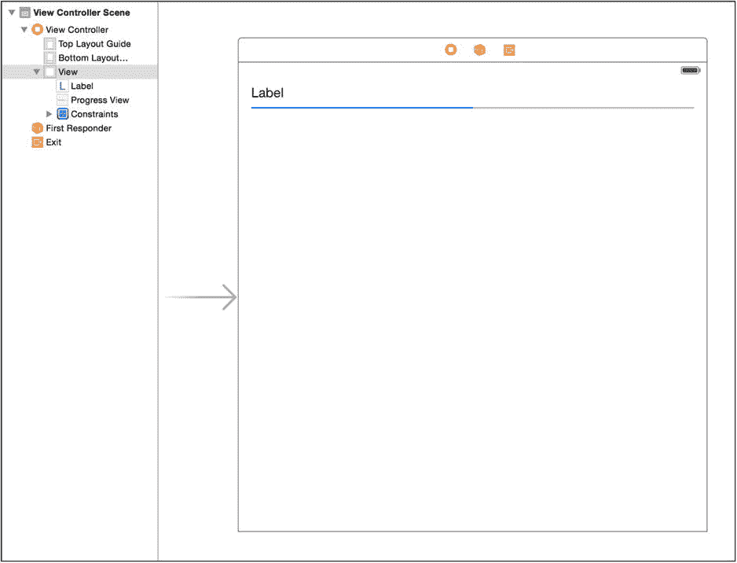

图 9-13. 进度条与标签的布局

现在，在`ViewController.m`（Objective-C）或`ViewController.swift`（Swift）中创建两个`IBOutlet`，分别命名为`label`和`progressView`。在 Interface Builder 中将它们连接到刚添加的标签和进度条。列表 9-66 显示了需要添加到`ViewController.h`的内容，列表 9-67 显示了需要添加到`ViewController.swift`的内容。

***列表 9-66***. 向`ViewController.m`添加输出口

```objectivec
@interface ViewController ()
@property (nonatomic, strong) Persistence *persistence;
@property (nonatomic, strong) NSManagedObjectContext *managedObjectContext;
@property (nonatomic, weak) IBOutlet UILabel *label;
@property (nonatomic, weak) IBOutlet UIProgressView *progressView;
@end
```

***列表 9-67***. 向`ViewController.swift`添加输出口

```swift
@IBOutlet weak var label: UILabel!
@IBOutlet weak var progressView: UIProgressView!
```

现在更新`viewDidAppear:`方法，使其能将报告状态反映到用户界面上。我们将标签设置为状态的文本版本，并同步移动进度条。由于我们是从非主线程（即用户界面所使用的线程）调用`reportStatus`方法，因此必须确保将更新派发到主队列，以便由主线程执行。所有界面更新都应在主线程完成——恰当的线程处理并不仅限于 Core Data 领域！

列表 9-68 展示了 Objective-C 版本的代码，列表 9-69 展示了 Swift 版本。

***列表 9-68***. 更新用户界面以显示进度 (Objective-C)

```objectivec
-(void)viewDidAppear:(BOOL)animated {
  [super viewDidAppear: animated];

  dispatch_async(dispatch_get_global_queue(DISPATCH_QUEUE_PRIORITY_DEFAULT, 0), ^{
    [self writeData];
  });

  dispatch_async(dispatch_get_global_queue(DISPATCH_QUEUE_PRIORITY_DEFAULT, 0), ^{
    CGFloat status = 0;
    while(status < 1.0) {
      status = [self reportStatus];
      dispatch_async(dispatch_get_main_queue(), ^{
        self.progressView.progress = status;
        self.label.text = [NSString stringWithFormat:@"%lu%%",
            (unsigned long)(status * 100)];
      });
    }

    NSLog(@"All done");
  });
}
```

***列表 9-69***. 更新用户界面以显示进度 (Swift)

```swift
override func viewDidAppear(animated: Bool) {
    super.viewDidAppear(animated)

    dispatch_async(dispatch_get_global_queue(DISPATCH_QUEUE_PRIORITY_DEFAULT, 0), { () -> Void in
        self.writeData()
    })

    dispatch_async(dispatch_get_global_queue(DISPATCH_QUEUE_PRIORITY_DEFAULT, 0), { () -> Void in
        var status : Float = 0
        while (status < 1) {
            status = self.reportStatus()
            dispatch_async(dispatch_get_main_queue(), { () -> Void in
                self.progressView.progress = status
                self.label.text = NSString(format: "Status: %lu%%", Int(status * 100))
            })
        }
        println("All done")
    })
}
```

现在再次启动应用，观察随着写入操作逐步完成，用户界面上的文本百分比和进度条如何实时更新。

## 在不同线程上初始化堆栈

良好的实践是考虑在主线程之外的线程上初始化 Core Data 堆栈。虽然 Core Data 的初始化通常很快，但在某些情况下（尤其是涉及大型存储迁移时），可能会耗费较长时间。如果在`application:didFinishLaunchingWithOptions:`中初始化且耗时较长，应用会崩溃。如果像我们这样在控制器中初始化，用户界面则会失去响应。无论哪种情况，都不是好事。为此，我们建议考虑在其他线程上执行初始化。

让我们将这一理念应用到 MultiThread 应用中。首先，我们添加一个 10 秒的暂停来模拟长时间启动。打开`Persistence.m`或`Persistence.swift`，将列表 9-70 所示的代码添加到`init`方法（Objective-C）的`if`块末尾，或创建列表 9-71 所示的`init`方法（Swift）。

***列表 9-70***. 模拟 10 秒迁移 (Objective-C)

```objectivec
NSLog(@"Pretending to do a migration");
[NSThread sleepForTimeInterval:10];
NSLog(@"Done with pretending...");
```

***列表 9-71***. 模拟 10 秒迁移 (Swift)

```swift
init() {
    println("Pretending to do a migration");
    NSThread.sleepForTimeInterval(10)
    println("Done with pretending...");
}
```

现在启动应用，观察启动画面显示多久后界面才出现——这会让用户疑惑到底发生了什么。

为了解决这个问题，我们在`ViewController`的`initWithCoder:`方法中，于不同线程上启动 Core Data 堆栈的初始化，如列表 9-72（Objective-C）或列表 9-73（Swift）所示。

***列表 9-72***. 在独立线程上初始化 Core Data (Objective-C)

```objectivec
- (instancetype)initWithCoder:(NSCoder *)aDecoder {
  self = [super initWithCoder:aDecoder];
  if(self) {
    [self addObserver:self forKeyPath:@"managedObjectContext" options:NSKeyValueObservingOptionNew context:NULL];

    dispatch_async(dispatch_get_global_queue(DISPATCH_QUEUE_PRIORITY_DEFAULT, 0), ^{
      self.persistence = [[Persistence alloc] init];
      dispatch_async(dispatch_get_main_queue(), ^{
        self.managedObjectContext = [self.persistence createManagedObjectContext];
      });
    });
  }

  return self;
}
```

***列表 9-73***. 在独立线程上初始化 Core Data (Swift)


```
required init(coder aDecoder: NSCoder) {
    super.init(coder: aDecoder)

    dispatch_async(dispatch_get_global_queue(DISPATCH_QUEUE_PRIORITY_DEFAULT, 0), { () -> Void in
        self.persistence = Persistence()
        dispatch_async(dispatch_get_main_queue(), { () -> Void in
            self.managedObjectContext = self.persistence?.managedObjectContext
        })
    })
}
```

这段代码做了几件事。首先，在 Objective-C 版本的代码中，我们为 `managedObjectContext` 属性添加了一个观察者（使用**键值观察**（KVO）API）。因为所有操作都将在不同的线程上执行，我们不能再依赖在 `viewDidAppear:` 中设置此值，因此我们将改为在收到通知时启动"写入"代码。然后，我们将初始化代码分发到另一个线程。当 Core Data 完成初始化后，我们在主线程上设置 `managedObjectContext` 属性。为何需要在主线程上设置它？因为正如之前所述，托管上下文必须在将要使用它的线程上创建。由于我们将在主线程上使用托管对象，因此我们在主线程上设置它。

当我们设置托管对象上下文属性值时，KVO 通知将被触发，因此我们还需要观察该属性变化并在属性更改时启动"写入"代码。我们针对 Objective-C 和 Swift 采用不同的方式，因为这两种语言的语义不同。对于 Objective-C，将 `viewDidAppear:` 中的所有代码移动到一个名为 `observeValueForKeyPath:ofObject:change:context:` 的新方法中，当我们正在观察的 `managedObjectContext` 属性发生变化时，该方法将被自动调用。代码清单 9-74 显示了该代码。

**代码清单 9-74**。观察 `managedObjectContext` (Objective-C)

```
- (void)observeValueForKeyPath:(NSString *)keyPath ofObject:(id)object change:(NSDictionary *)change context:(void *)context {
    dispatch_async(dispatch_get_global_queue(DISPATCH_QUEUE_PRIORITY_DEFAULT, 0), ^{
        [self writeData];
    });

    dispatch_async(dispatch_get_global_queue(DISPATCH_QUEUE_PRIORITY_DEFAULT, 0), ^{
        CGFloat status = 0;
        while(status < 1.0) {
            status = [self reportStatus];
            dispatch_async(dispatch_get_main_queue(), ^{
                self.progressView.progress = status;
                self.label.text = [NSString stringWithFormat:@"%lu%%",
                                   (unsigned long)(status * 100)];
            });
        }

        NSLog(@"All done");
    });
}
```

对于 Swift，我们为 `managedObjectContext` 属性创建一个 `didSet` 观察者，该观察者将调用我们创建的一个名为 `initiate` 的新方法。代码清单 9-75 显示了该代码。

**代码清单 9-75**。观察 `managedObjectContext` (Swift)

```
var managedObjectContext: NSManagedObjectContext? {
    didSet {
        self.initiate()
    }
}

func initiate() {
    dispatch_async(dispatch_get_global_queue(DISPATCH_QUEUE_PRIORITY_DEFAULT, 0), { () -> Void in
        self.writeData()
    })

    dispatch_async(dispatch_get_global_queue(DISPATCH_QUEUE_PRIORITY_DEFAULT, 0), { () -> Void in
        var status : Float = 0
        while(status < 1) {
            status = self.reportStatus()
            dispatch_async(dispatch_get_main_queue(), { () -> Void in
                self.progressView.progress = status
                self.label.text = NSString(format: "Status: %lu%%", Int(status * 100))
            })

            //println(NSString(format: "Status: %lu%%", Int(status * 100)))
        }

        println("All done")
    })
}
```

在这两种语言中，`viewDidAppear:` 方法现在都应该从代码中移除。为了让一切保持整洁，最后一步是确保我们为 UI 元素提供了默认值。我们在 `viewWillAppear:` 中设置初始值，如代码清单 9-76 (Objective-C) 和代码清单 9-77 (Swift) 所示。

**代码清单 9-76**。将 UI 元素设置为默认值 (Objective-C)

```
- (void)viewWillAppear:(BOOL)animated {
  [super viewWillAppear:animated];

  self.progressView.progress = 0;
  self.label.text = @"Initializing Core Data";
}
```

**代码清单 9-77**。将 UI 元素设置为默认值 (Swift)

```
override func viewWillAppear(animated: Bool) {
    super.viewWillAppear(animated)

    self.progressView.progress = 0
    self.label.text = "Initializing Core Data"
}
```

现在启动应用程序，注意启动画面只会短暂显示，然后应用程序界面出现并显示“Initializing Core Data”约 10 秒钟（在此期间执行模拟数据迁移），接着进度条从 0% 逐渐增加到 100%。

## 总结

从对象唯一性到故障处理再到托管对象缓存，Core Data 为您优化了大量数据访问性能。这些优化是免费的，无需您付出额外努力。然而，您应当了解 Core Data 提供的这些优化，这样才能确保与其协同工作，而非背道而驰。

然而，并非所有 Core Data 的性能提升都能自动获得。在本章中，您学习了如何使用诸如预抓取和谓词优化等技术，尽最大可能从 Core Data 中为您的应用榨取性能。您还学习了如何使用 Instruments 应用分析 Core Data 应用，从而了解应用如何使用 Core Data 以及问题出在哪里。最后，您学习了如何使用多线程来提高应用的响应性和感知性能。

其他 iOS 编程书籍可能会出色地展示如何在针对持久化存储执行长时间查询时显示旋转指示器和“请稍候”消息。而本书则向您展示如何完全避免使用旋转指示器和“请稍候”消息。

# 索引

  A, B

- 聚合表达式
- 聚合运算符
- 平均单词长度
- averageWordLengthFromExpressionDescription 方法
- Core Data 获取请求
- +expressionForFunction
- NSExpression
- NSExpressionDescription
- 预定义函数
- @count 函数
- @max(length) 聚合器
- 语法
- 类型

  C

- 缓存
- 暴力缓存过期
- Cache.swift
- 故障处理
- 内存使用
- 测试
- 用法
- 中央处理器 (CPU)
- 控制器代理
- BugViewController
- Bug 屏幕
- 取消方法
- insertNewObject 方法
- 保存方法
- tableView:accessoryButtonTappedForRowWithIndexPath: 方法


`BugViewController`类  
`init`函数  
`viewWillAppear`方法  
`Core Data`模型  
`CoreDump`应用程序  
`controllerWillChangeContent`方法  
删除操作  
`fetchedResultsController`  
`insertNewObject`方法  
`MasterViewController`类  
`NSManagedObject`实例  
`prepareForSegue:sender`方法  
表视图  
`DetailViewController`类  
`fetchedResultsController`  
错误列表  
`Master 视图项目`  
`ProjectViewController`  
`cancel`方法  
`host`方法  
`initWithProject:fetchedResultsController`方法  
`insertNewObject`方法  
`save`方法  
`tableView:accessoryButtonTappedForRowWithIndexPath:`方法  
`UITableViewDelegate`  
`viewWillAppear`方法  
表视图单元格  
属性  
托管服务  
Core Data  
类  
`CoreDataApp`项目（*参见* `CoreDataApp`项目，Xcode）  
`NSManagedObject`类  
`NSManagedObjectContext`类  
`NSManagedObjectModel`类  
`NSPersistentStore`类  
`NSPersistentStoreCoordinator`类  
`PersistenceApp`项目（*参见* `PersistenceApp`项目）  
`CoreDataApp`项目，Xcode  
`AppDelegate.h`  
`AppDelegate.swift`  
`applicationDocumentsDirectory`方法  
创建过程  
`managedObjectContext`属性  
托管对象模型（*参见* 托管对象模型）  
`managedObjectModel`属性  
`persistentStoreCoordinator`  
`saveContext`方法  
  D  
数据加密 *另请参阅* `SecureNote`应用程序  
数据模型  
`AppDelegate.m`/`AppDelegate.swift`  
`BookStore`应用程序  
属性  
创建过程  
实体  
键值编码（KVC）  
`NSManagedObject`实例  
关系（*参见* 关系）  
创建过程  
设计过程  
规范化过程  
通知  
`awakeFromFetch`方法  
`awakeFromInsert`方法  
数据更改  
收到的更改


- 注册观察者
- `Persistence.m`
- `Persistence.swift`
- 社交网络
- 存储和检索数据
- `deleteAllObjects` 方法
- 获取的属性
- `initStore` 方法
- 托管对象
- `NSPredicate` 类
- 检索对象
- `showExampleData` 方法
- 数据保护
- 数据质量
- 核心数据操作错误
- 优势
- `insertSomeData` 方法
- `persistentStoreCoordinator` 方法
- 属性
- `showCoreDataError`
- `ViewController.m`
- `ViewController.swift`
- `viewDidAppear` 方法
- 数据填充。数据填充
- 撤销与重做。撤销与重做
- 验证错误处理例程
- 验证错误
- `DRY`
- `Foo` 实体
- 在 `BookStore` 中
- `NSDetailedErrorsKey`
- `NSError` 消息
- 规则
- 数据填充
- `BookStore` 应用
- `BookStore` (Objective-C)
- `BookStore` (Swift)
- 已有用户更新
- 硬编码初始化代码
- `initStore` 方法
- `persistentStoreCoordinator` 方法
- `seed.sqlite`
- `showExampleData` 方法
- SQLite 数据库创建
- 后续版本
- `initStore` 方法
- `seed.sqlite` 文件
- `didPressLink` 方法
- `didTurnIntoFault` 方法
- `drawRect:` 方法
- Dropbox Datastore API
- `AppDelegate.m`/`AppDelegate.swift`
- 创建
- 定义
- `didFinishLaunchingWithOptions:` 方法
- 框架
- ParcelKit 库
- 配置
- `DropboxEvents`。`DropboxEvents`
- 框架
- 其他链接器标志
- 同步数据创建
- `didPressLink:` 方法
- `@encrypted` 设置为 `@YES`
- 笔记表
- `openURL:sourceApplication:annotation:` 方法
- 私有属性
- `ViewController.h`
- `viewDidLoad` 方法
- URL 配置


视图控制器

Dropbox 事件

数据仓库网页视图

didFinishLaunchingWithOptions\: 方法

fetchedResultsController 方法

导入语句

PKSyncManager

syncID 属性集

URL 回调

URL 类型

viewDidAppear\: 方法

 E, F, G, H

表达式、谓词与表达式

 I, J

iCloud

主从应用模板

同步内容

授权

persistentStoreCoordinator 方法

storeDidChange

storeDidImportUbiquitousContentChanges 方法

storeWillChange

类型

通用容器

addPersistentStoreWithType

persistentStoreCoordinator 方法

initWithCoder\: 方法

 K

键值编码（KVC）

键值观察（KVO）

 L

轻量级迁移

映射模型

映射模型. 映射模型

持久化存储协调器方法

重命名实体

SQLite 数据

Xcode 数据建模器

 M

托管对象模型

application\:didFinishLaunchingWithOptions\: 方法

空对象模型

实体

查找命令

映射模型

创建

代码实现

createDestinationInstancesForSourceInstance\: 方法

目标数据模型

实体映射

迁移出版物

迁移管理器

属性映射

源数据模型

数据迁移

数据存储元数据

实体映射

执行

迁移管理器

迁移过程

性能迁移

populateAuthors

动态访问器

出版物实体

viewDidAppear\: 方法

进度监控

属性映射

sqlite 数据库

多线程

Core Data 栈

init 方法


`initWithCoder:` 方法

`managedObjectContext` 属性

`viewWillAppear`

数据模型

目录

合理的错误条件

对象模型

`Persistence.h`

`Persistence.m`

`Persistence.swift`

线程安全

用户界面

进度条与标签

`ViewController.m`

`viewDidAppear`

`ViewController.m`

`ViewController.swift`

 N, O

`NSFetchedResultsController`

缓存名称参数

控制器委托。控制器委托

获取请求

托管对象上下文

`sectionNameKeyPath` 参数

 P, Q

性能调优

批量更新

`BatchUpdate.m`

`BatchUpdate.swift`

头文件注释

iOS 8

符合 `PerfTest` 协议的类

SQL 语句

缓存。捕获

比较器

故障

批量故障

缓存

定义

触发

重新故障

`SingleFault`

测试

工具

Core Data 测量

定义

启动

iOS 模拟器

预抓取

子查询

编码实现

符合 `PerfTest` 协议的类

使用结果集

测试

数据模型。数据模型

`FetchAll`

`PerfTest` 协议

项目创建

`runTestWithContext`

视图

视图控制器

唯一性

定义

自拍与人

`Uniquing.swift`

`PersistenceApp` 项目

`application:didFinishLaunchingWithOptions`

构建并运行

`createObjects` 方法

创建

`fetchObjects` 方法

框架

`Gadget` 实体

托管对象模型

`NSEntityDescription`


NSFetchRequest 实例

堆栈

AppDelegate.h

AppDelegate.swift 更新

application:didFinishLaunchingWithOptions 方法

init

Persistence.h

Persistence.m

Persistence.swift 文件

谓词和表达式

聚合表达式

聚合运算符

集合表达式

比较类型

endsWithGryWords 方法

修饰符

anyWordContainsZ 方法

类型

NSCompoundPredicate 类

逻辑运算符

静态初始化器

NSExpression 类

定义

Objective-C 编码

Swift 代码

单值表达式

排序

SQL 语句

字符串比较选项

按位或标志

caseInsensitiveFetch 方法

类型

使用子查询

wordCountForCategory: 方法

 R

关系

删除规则

一对多

有序属性

属性字段

runWithContext: 方法

 S

SecureNote 应用程序

应用程序委托

DetailViewController

EncryptionTransformer

执行

insertNewObject: 方法

iOS 加密资源

Note 实体

NSFetchedResultsController

NSManagedObject

NSValueTransformer 方法

PasswordViewController

安全框架

SSKeychain

故事板

时间戳

transformedValueClass

SELECT 语句

setReturnsObjectsAsFaults: 方法

存储图片

CoreDump 应用程序

Bug 实体

截图

外部存储

NSAttributeDescription

 T

TapOut 应用程序

添加 Core Data

AppDelegate

创建

UIColor 实例

视图与显示

Transformable Core Data。TapOut 应用程序

 U

UISearchController

单元格配置

创建

过滤结果

表格视图分区

未过滤结果

updateSearchResultsForSearchController 方法

viewDidLoad 方法

撤销与重做

BookStore 应用程序

分组

initStore 方法

insertSomeData 方法

showExampleData

堆栈

标准 Cocoa NSUndoManager

测试

追踪

统一资源定位符 (URL)

 V

版本管理

Book 实体

BookStore.xcdatamodeld

Core Data 存储

实用工具面板

viewDidAppear: 方法

viewDidLoad 方法

 W、X、Y、Z

willTurnIntoFault 方法

wordCount 方法

WordList 应用程序

创建

数据模型

定义

加载与分析

loadWordList: 方法

方法声明

resultType 属性

Swift 实现

谓词和表达式

关系查询

统计方法更新

按字母统计单词数

wordCountForCategory 方法

统计与显示

updateStatistics 方法

单词计数

UI 创建

用户界面 (UI)

wordCount 方法
