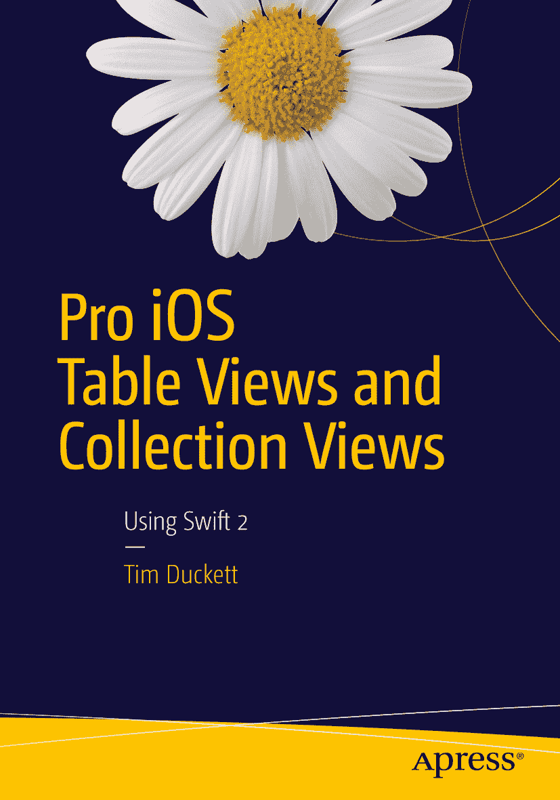

  
蒂姆·达克特  
精通 iOS 表格视图与集合视图  
使用 Swift 2

ISBN 978-1-4842-1243-1  
电子书 ISBN 978-1-4842-1242-4  
DOI 10.1007/978-1-4842-1242-4  
© Apress 出版社 2015

精通 iOS 表格视图与集合视图：使用 Swift 2  
常务董事：韦尔莫德·斯帕尔  
主编：米歇尔·洛曼  
开发编辑：詹姆斯·马卡姆  
技术审校：蒂亚戈·杜阿尔特与迈克尔·托马斯  
编辑委员会：史蒂夫·安格林、普拉米拉·巴兰、路易丝·科里根、乔纳森·格尼克、罗伯特·哈钦森、塞莱斯廷·苏雷什·约翰、米歇尔·洛曼、詹姆斯·马卡姆、苏珊·麦克德莫特、马修·穆迪、杰弗里·佩珀、道格拉斯·庞迪克、本·雷诺-克拉克、格温南·斯皮尔林  
协调编辑：马克·鲍尔斯  
文字编辑：玛丽·贝尔  
排版：SPi Global  
索引编制：SPi Global  
插图：SPi Global

如需了解翻译相关信息，请发送电子邮件至`rights@apress.com`，或访问[`www.apress.com`](http://www.apress.com/)。  
Apress 及 friends of ED 图书可批量购买用于学术、企业或促销用途。大多数图书也提供电子版及许可证。如需更多信息，请参考我们的特殊批量销售–电子书授权网页：[`www.apress.com/bulk-sales`](http://www.apress.com/bulk-sales)。  
本书作者引用的任何源代码或其他补充材料，读者均可通过[`www.apress.com/9781484212431`](http://www.apress.com/9781484212431)获取。关于如何找到本书源代码的详细说明，请访问[`www.apress.com/source-code/`](http://www.apress.com/source-code/)。读者也可在 SpringerLink 上每章的“补充材料”部分访问源代码。

本作品受版权保护。出版商保留所有权利，无论涉及全部或部分材料，特别是翻译权、重印权、插图再利用权、朗诵权、广播权、微缩胶片或其他任何物理形式的复制权，以及传输或信息存储与检索、电子改编、计算机软件，或现在已知或此后开发的任何类似或不同方法的权利。与评论或学术分析相关的简短摘录，或专门为输入计算机系统并执行而提供的材料（仅供购买者独家使用）除外，不在此法律保留范围内。本出版物或其部分的复制仅允许在出版者所在地现行版权法的规定下进行，且使用许可必须始终从 Springer 获取。使用许可可通过 RightsLink 在版权清点中心获得。违反者将根据各自版权法被起诉。

本书中可能出现商标名称、标识和图像。我们不以每次出现商标名称、标识或图像时都使用商标符号，而仅以编辑方式并在有利于商标所有者的情况下使用这些名称、标识和图像，无意侵犯商标权。本出版物中使用的商品名称、商标、服务标志及类似术语，即使未被标识为此类，也不应被视作对其是否受专有权利保护的看法。

尽管本书中的建议和信息在出版时被认为是真实准确的，但作者、编辑及出版商均不对可能存在的任何错误或遗漏承担法律责任。出版商对本书所含材料不作任何明示或暗示的担保。

本书通过 Springer Science+Business Media New York 在全球图书贸易中发行，地址：233 Spring Street, 6th Floor, New York, NY 10013。电话：1-800-SPRINGER，传真：(201) 348-4505，电子邮件：`orders-ny@springer-sbm.com`，或访问`www.springeronline.com`。Apress Media, LLC 是加利福尼亚州的有限责任公司，其唯一成员（所有者）是 Springer Science + Business Media Finance Inc (SSBM Finance Inc)。SSBM Finance Inc 是特拉华州的一家公司。

献给露西、凯丝和艾萨克

