# 表格视图快速入门

在本章中，你将开始探索表格视图（Table Views）。本章首先概述了什么是表格视图，以及它们在实践中的一些应用示例。接着，在第二节中，你将构建一个简单的“Hello, world”风格的表格视图应用，以便向你介绍用户界面背后的组件，并帮助你理解后续章节中将会涉及的细节内容。

如果你是初次接触表格视图，那么在深入那些复杂细节之前，花些时间从头构建一个非常简单的实例是值得的。然而，如果你已经到了对表格视图各组件的组合方式更有信心，并且想直接进入代码编写的阶段，可以完全跳过本章剩余部分。我将在后面详细讲解各个元素，所以你并不会错过什么。

## 什么是表格视图？

在 iOS 应用中，表格视图的示例随处可见。你已经熟悉了作为标准控件实现的简单表格，例如 iPhone 的“设置”应用或 iPad 的“邮件”应用，如图 1-1 所示。

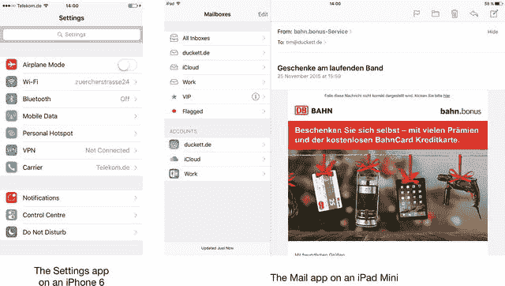

图 1-1. 一些基本的基于表格的应用

在另一个极端，表格视图和单元格的默认外观、感觉和行为可以被定制到几乎看不出它们原本是表格视图的程度。图 1-2 展示了一些示例。


图 1-2. iPhone 上表格视图在运行中的示例

## 表格视图的构成

表格视图显示一个可以垂直滚动的元素列表，这些元素也称为表格视图单元格。表格视图由两个物理部分组成：

*   容器部分——即 `tableView` 本身——是 `UIScrollView` 的一个子类，包含一个可垂直滚动的表格单元格列表。
*   表格单元格，可以是四种标准 `UITableViewCell` 类型之一的实例，也可以是可根据需要定制的 `UITableViewCell` 的自定义子类。

图 1-3 展示了表格视图的组成部分。

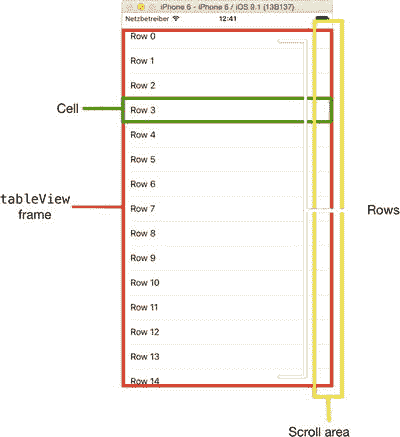

图 1-3. 表格视图的基本结构

不过，表格视图不能独立运行；它需要遵循两个 `UITableView` 协议的对象支持：

*   遵循 `UITableViewDatasource` 协议的对象为表格视图提供构建和配置自身所需的数据，例如分区和行数。它还创建并提供表格视图要显示的单元格对象。
*   遵循 `UITableViewDelegate` 协议的对象负责处理用户与表格的交互，例如选择、编辑和排序。

一种非常常见的模式是管理表格所在视图的 `UIViewController` 实例同时充当数据源和委托。正如你将在第 5 章中看到的，情况并非总是如此；如果这些功能由其他类提供，有助于使应用架构更清晰。

## 创建一个简单的表格视图应用

在本章的剩余部分，你将从头构建一个简单的“Hello, world”风格的表格视图应用。它将向你展示容器、单元格、数据源和委托是如何组合在一起的，并为你提供一个可以作为自己实验基础的应用。

我打算刻意放慢速度，并涵盖所有步骤。如果你是一个熟练的 Xcode 用户，就不需要这样的手把手指导了——只需专注于代码即可。

还在听吗？好的——接下来你要做的是：

*   创建一个简单的、基于窗口的应用骨架。
*   生成一些数据来填充表格。
*   创建一个简单的表格视图。
*   连接表格视图的数据源和委托。
*   实现一些非常简单的交互功能。

这是一个非常简单但有用的实践。开始吧！

## 创建应用骨架

对于这个应用，你将使用一个简单的结构：一个由视图控制器管理的单一视图，以及一个提供视图内容的 Storyboard 文件。启动 Xcode 并选择 Single View Application 模板，如图 1-4 所示。

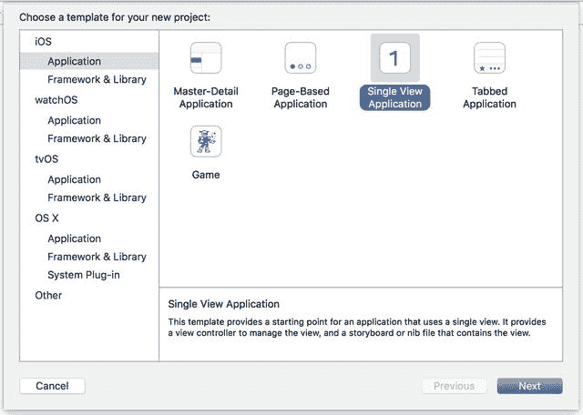

图 1-4. Xcode 的模板选择窗格

> **注意：** 随着 Xcode 的每次新版本发布，Apple 经常（且毫无意义地）更改包含的模板。你可能会看到与图 1-5 所示不同的模板集合。请检查模板的描述，找到提供单一视图应用的模板。

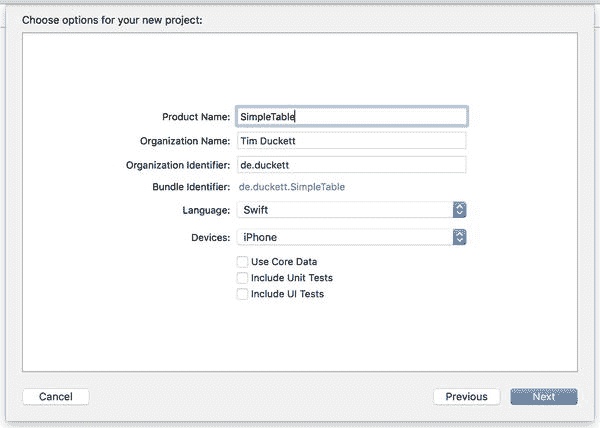

图 1-5. 为应用命名

将应用命名为 `SimpleTable`。你将构建一个 iPhone 版本，但不需要 Core Data 或任何测试。

确保根据需要选择了这些选项，如图 1-5 所示。

最后，你需要选择保存项目的位置。除非你特别需要，否则不必担心为此项目创建本地 Git 仓库。

到达这一步后，你将看到 Xcode 的项目视图，其中包含应用的初始骨架。假设你坚持使用了 `SimpleTable` 这个应用名，它看起来会像图 1-6 所示。

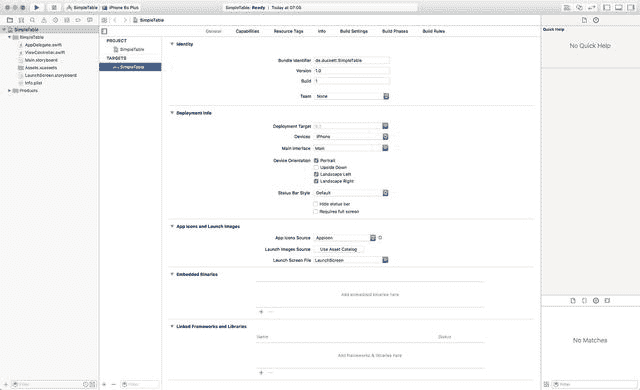

图 1-6. 显示新骨架应用的初始 Xcode 视图

你会看到项目中包含以下内容：

*   一个应用委托（`AppDelegate.swift`）
*   一个视图控制器（`ViewController.swift`）
*   一个 Storyboard 文件（`Main.storyboard`）

在本章结尾，你将再次审视这些文件是如何组合在一起的。目前，你将处理视图控制器和 Storyboard 文件。

此时，你可以运行应用来验证它是否能正确编译。前往 Product ➤ Run 或按下 Command+R，你将看到应用的启动屏幕和一个空白的白色视图。现在，你已经准备好开始构建表格视图了。


### 生成一些数据

在开始使用表格视图之前，你需要创建一些数据来填充它。由于这是一个简单的表格示例，数据也将很简单。你将创建一个字符串数组，其中包含要放入每个单元格的信息。

当表格视图调用数据源时，数据数组必须准备就绪，那么在哪里创建它呢？有几种选择，但一个显而易见的地方是在视图控制器的 `viewDidLoad` 函数中。在这里创建是安全的。

你还需要一种在应用程序中传递数据数组的方法。这个过程需要一个属性，该属性可以被需要访问数据的各种函数所访问。

让我们开始吧。打开图 1-7 中所示的 `ViewController.swift` 文件，并开始创建该属性。

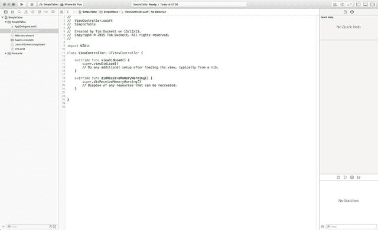

图 1-7. 编辑 `ViewController.swift` 文件

> **注意**：从现在开始，为了节省篇幅，我将不再展示完整的 Xcode 界面，只显示你需要输入的代码。

添加该属性的声明，使代码看起来如列表 1-1 所示。

**列表 1-1.** 声明属性

```
import UIKit

class ViewController: UIViewController {

    var tableData  = [String]()

    override func viewDidLoad() {
        super.viewDidLoad()
        // 执行额外的设置，通常从 nib 加载视图后执行
    }

    override func didReceiveMemoryWarning() {
        super.didReceiveMemoryWarning()
        // 处置任何可以重新创建的资源
    }

}
```

> **注意**：为了节省空间，在接下来的列表中，我将只显示新增或修改的代码，并附上足够的上下文行。

现在，你将创建实际的数据数组。你的数据数组将是一个包含十个字符串的简单数组。你将在 `viewDidLoad` 函数中添加这段代码，因为该函数作为 `UIViewController` 生命周期的一部分，在视图在屏幕上可见之前执行。在这里设置数据，将为表格提供在变得可见之前绘制自身所需的数据。添加列表 1-2 中所示的代码。

**列表 1-2.** 创建数据数组

```
override func viewDidLoad() {
    super.viewDidLoad()
    // 执行额外的设置，通常从 nib 加载视图后执行

    for count in 0...10 {
        // 单元格将包含字符串 "Item X"
        tableData.append("Item \(count)")
    }

    // 将数据数组的内容打印到日志中
    print("The tableData array contains \(tableData)")
}
```

让我们运行应用程序，看看数据数组是如何创建的。用户界面目前还没有做什么，但你可以看到将要提供给表格的数据。

通过按 Command+R 或选择 Product ➤ Run 在模拟器中运行应用程序，然后查看记录器输出：

```
The tableData array contains ["Item 0", "Item 1", "Item 2", "Item 3", "Item 4", "Item 5", "Item 6", "Item 7", "Item 8", "Item 9", "Item 10"]
```

### 创建表格视图

目前，你的应用程序的用户界面有点单调。你还没有添加表格！这需要修复。

在项目资源管理器中单击 `Main.storyboard` 文件，你将在 Interface Builder 面板中看到 Storyboard 打开，如图 1-8 所示。

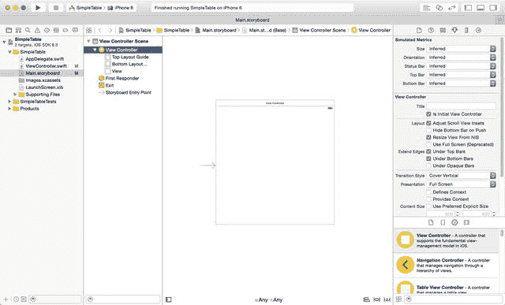

图 1-8. 在 Interface Builder 中编辑 Storyboard 文件

在右下角的对象浏览器中，找到 `TableView` 项，并将其拖到中央的视图上；这将作为表格视图的容器。场景的文档轮廓现在将如图 1-9 所示。

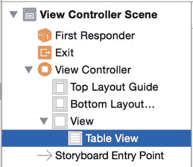

图 1-9. 添加 `UITableView` 后的场景文档轮廓

为了使表格在任何视图大小（以及设备旋转时）都能正确显示，你需要添加一些 AutoLayout 约束。

如果表格视图尚未被选中，请高亮它，然后点击 Storyboard 底部的 Pin 图标添加约束，并更新值，如图 1-10 所示。

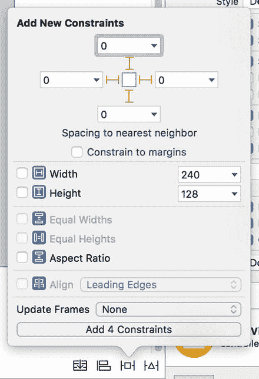

图 1-10. 添加表格视图的 AutoLayout 约束

信不信由你，这就是实现最基本的表格视图所需做的全部工作。它目前还不会显示任何数据，因为你尚未实现 `UITableViewDataSource` 协议函数，而且它肯定也不具备任何交互性——但应用程序可以运行。

为了证明这一点，再次运行它（Command + R），并在模拟器中惊叹于你强大的应用程序，如图 1-11 所示。

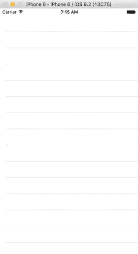

图 1-11. 一个功能齐全但不太令人印象深刻的表格视图应用程序

更有甚者，你甚至可以旋转模拟器，表格视图将自动调整大小（如图 1-12 所示）。

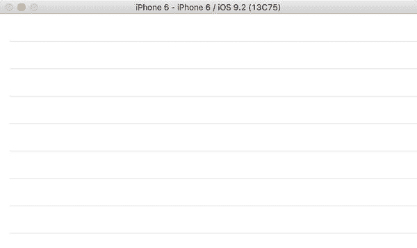

图 1-12. 旋转后的表格视图

好吧——也许这并不那么令人印象深刻。让我们完成表格视图的连接，使其真正发挥作用。

### 遵循表格视图协议

你刚刚创建的表格视图需要数据源和委托；数据源将为表格提供配置自身和显示单元格所需的信息，而委托将处理诸如单元格选择之类的交互。

你需要让你的 `ViewController` 类遵循 `UITableViewDataSource` 和 `UITableViewDelegate` 这两个协议。

> **注意**：数据源和委托将在第 3 章、第 4 章和第 5 章中详细介绍。

在类中，更新类声明，使其看起来像列表 1-3 所示。

**列表 1-3.** 让 Swift 类遵循 `UITableDelegate` 和 `UITableDataSource` 协议

```
class ViewController: UIViewController, UITableViewDataSource, UITableViewDelegate {
```

这将告诉编译器期望已实现所需的函数。你会立即看到 Xcode 显示一个警告，提示 `ViewController` 尚未遵循该协议（如图 1-14 所示）。

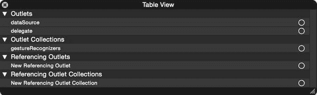

图 1-14. 表格视图属性 HUD


图 1-13. Xcode 错误

稍后你将修复这个问题，但首先，让我们将表格连接到 `ViewController` 类。


#### 连接数据源与委托

你的 `ViewController` 对象即将准备就绪，但表格视图本身还不知道视图控制器将同时充当数据源和委托。你需要将两者连接起来。

有两种方法可以做到这一点：可视化（通过 Interface Builder）或在代码中实现。对于这个示例应用，你将使用 Interface Builder，因此点击故事板文件再次将其打开。

右键单击表格视图对象（在主 Interface Builder 中或中间窗格的对象树中），你将看到表格视图属性 HUD，如图 1-14 所示。

它显示了你感兴趣的两个出口属性：`dataSource` 和 `delegate`。

要连接它们，将鼠标悬停在 `dataSource` 条目右侧的圆圈上。圆圈会变成一个加号符号。从该符号上点击并拖动，会伸出一条蓝色线。将鼠标悬停在对象树中的文件所有者项上，该项会高亮显示为蓝色。松开鼠标，`dataSource` 即连接成功。接下来，对 `delegate` 重复相同的过程：从加号符号拖动到文件所有者，松开并连接。

现在，表格视图属性 HUD 将显示 `dataSource` 和 `delegate` 都已连接到视图控制器，如图 1-15 所示。

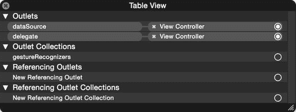

图 1-15. `dataSource` 和 `delegate` 现已连接到视图控制器

#### 显示数据

现在你已经将表格视图连接到其 `delegate` 和 `dataSource`，就可以开始让它执行操作了。合乎逻辑的下一步是让表格视图显示其数据。

当表格视图绘制自身时，它会要求其 `dataSource` 提供可供显示的单元格。我们将在第 3 章和第 5 章中更详细地探讨这个过程，但现在先让我们创建这些单元格。

`UITableViewDataSource` 协议包含两个必需函数和九个可选函数。由于这是一个简单的示例，你将只实现两个必需函数和一个可选函数。

- 第一个必需函数 `tableView(_:numberOfRowsInSection:)` 返回该分区最终将包含的行数。
- 第二个必需函数 `tableView(_:cellForRowAtIndexPath:)` 创建并返回单元格本身。
- 可选函数是 `numberOfSectionsInTableView(_:)`。在你的应用中它是可选的，因为你使用的是只有一个分区的表格，而默认情况下表格的分区数为 1。

稍后，当你处理更复杂的分区表格时，这个函数将变得必不可少，所以我在这里包含了它，尽管严格来说并非必需。

##### `numberOfSectionsInTableView( :)`

你有一个包含一个分区的简单表格，所以这个函数将非常简单。切换到 `ViewController.swift` 或 `ViewController.m`，在这里你可以创建该函数，如代码清单 1-4 所示。

代码清单 1-4. `numberOfSectionsInTableView( :)` 函数

```
//MARK: UITableViewDatasource functions

func numberOfSectionsInTableView(tableView: UITableView) -> Int {
    return 1
}
```

**注意：** `MARK` 行是编译器指令。它们在编译期间不会被使用，但会在编写过程中标记代码的各个部分。如果你下拉面包屑菜单或在编辑窗格顶部按 `Ctrl+6`，你会看到这些行将函数列表分隔开，使代码更易于导航。目前使用这些指令不是什么大事，但随着你的类不断增长，在众多函数中寻找特定函数时，它们可能会成为真正的救星。

##### `tableView:numberOfRowsInSection( :)`

为了成功绘制自身，表格视图需要知道该分区中将出现多少行（你的简单表格视图只有一个分区）。

之前，你创建了一个数组来保存数据，并用这个字符串填充了它。该分区的行数将与数组中的元素数量相同。`Array` 类有一个用于返回数组中元素数量的实用函数：`tableData.count`。在视图控制器类中，添加如代码清单 1-5 所示的函数。

代码清单 1-5. `tableView:numberOfRowsInSection:` 函数

```
func tableView(tableView: UITableView, numberOfRowsInSection section: Int) -> Int {
    return tableData.count
}
```

相当直接，对吧？

##### 创建单元格

现在你已经将表格视图连接到 `ViewController`，是时候开始创建单元格了。

每当表格需要一个单元格时，它都会通过调用 `cellForRowAtIndexPath:` 函数要求其数据源提供一个。数据源要么创建一个全新的单元格实例，进行配置，然后交还给表格视图，要么从其缓存中取出一个之前创建的实例，再进行配置并交还。

你将在第 5 章中更详细地研究缓存和出队机制，但现在只需记住，数据源利用其缓存来极大地提高表格视图的性能。

首先，将代码清单 1-6 中的函数添加到视图控制器类中，然后我将逐步解释其功能。

代码清单 1-6. `tableView:cellForRowAtIndexPath:` 函数

```
func tableView(tableView: UITableView, cellForRowAtIndexPath
indexPath: NSIndexPath) -> UITableViewCell {
    let cell = tableView.dequeueReusableCellWithIdentifier("CellIdentifier",
forIndexPath: indexPath)

    cell.textLabel!.text = tableData[indexPath.row]
    return cell
}
```

让我们先看看这个函数本身：

```
func tableView(tableView: UITableView, cellForRowAtIndexPath
indexPath: NSIndexPath) -> UITableViewCell {
```

该函数返回一个 `UITableViewCell` 实例，并接受以下两个参数：
- 调用该单元格的 `tableView`（因为此类可能是多个表格的数据源，所以需要标识当前处理的是哪个表格）
- 一个 `indexPath`，它具有一个 `row` 属性，用于标识请求单元格的表格行

函数的第一行尝试使用 `dequeueReusableCellWithIdentifier:` 函数从 `tableView` 的缓存中获取一个先前实例化的单元格：

```
let cell = tableView.dequeueReusableCellWithIdentifier("CellIdentifier", forIndexPath: indexPath)
```

**提示：** 关于单元格标识符的使用，你将在第 5 章中更深入地探索。现在，你可以将其理解为一个用于标识你正在使用哪种单元格的标签。该表格只有一种单元格，因此使用单一标识符。

在幕后，数据源要么会取出一个现有的单元格实例，要么会为你创建一个全新的实例。你无需为此担心，因为该函数保证会返回一个你可以操作的单元格实例，因此你可以准备配置其内容了。


### 创建原型单元格

原型单元格是一种“蓝图”，当被调用时，`UITableViewDataSource`会使用它来创建实际的单元格。数据源使用你在`cellForRowAtIndexPath`函数中提供的`cellIdentifier`字符串来确定哪个原型对应哪种类型的单元格。

切换到 **Storyboard**，并通过点击 **文档大纲** 中的 Table View 项来选择 `UITableView`。你会看到画布中的表格视图显示着“Prototype Content”，同时**属性检查器**的 Content 下拉菜单中显示着“Dynamic Protoypes”。

将 **Prototype Cells** 框中的数字增加到 1 来创建一个原型单元格，如图 1-16 所示。

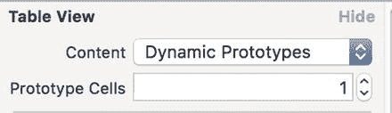

图 1-16. 增加原型单元格数量

现在，你可以通过在图 1-17 所示的**文档大纲**中选择，来选中这个新创建的原型单元格：

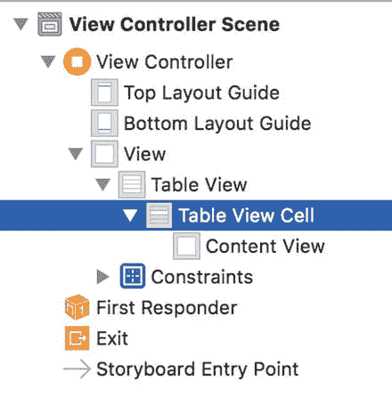

图 1-17. 选中原型单元格

**属性检查器**会显示该原型单元格的属性——因此你可以在此处添加单元格的 `Identifier`，以便数据源能够找到它。

如图 1-18 所示，将 `CellIdentifier` 添加到 `Identifier` 字段——确保单元格标识符与你之前在 ViewController 中使用的字符串完全一致。然后保存 Storyboard，并切换回 `ViewController`。

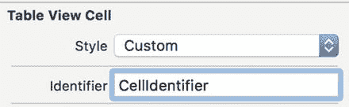

图 1-18. 设置单元格标识符

###### 配置单元格

一旦数据源创建或重用了一个单元格实例，你可以在将其交还给表格视图之前配置它的内容。

关于单元格的更多细节，将在第 6 章中深入探讨，但目前你只需要知道 `UITableViewCell` 包含一个名为 `textLabel` 的 `UILabel` 输出口，你可以像下面这样设置它的 `text` 属性：

```
cell.textLabel!.text = tableData[indexPath.row]
```

`tableView` 会向 `cellForRowAtIndexPath()` 函数传递一个 `NSIndexPath` 参数；该参数指明了单元格所属表格的 `section`（分区）和 `row`（行）。

你对 `section` 并不关心，因为你的表格只有一个分区，但你可以使用 `indexPath` 参数的 `row` 属性，从 `tableData` 数组中检索对应的 `String`（或 `NSString`）。

最后，将配置好的单元格通过以下方式返回给 `tableView`：

```
return cell
```

###### 运行应用

至此，你已经拥有了一些数据和表格视图，并且已经将向表格视图提供数据的函数连接起来。运行应用程序，你将看到表格视图充满了内容，如图 1-19 所示。

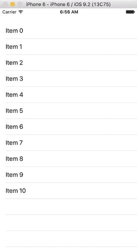

图 1-19. 充满内容的表格

在这个成功的节点上，是时候让表格对用户的输入做出响应了。

### 添加交互性

在这一点上，你完全有理由对自己感到满意。你已经拥有了一个能够接收数据、在屏幕上显示数据并且可以滚动（如果还没试过，可以尝试滚动表格）的表格视图。你还可以通过轻点来选择单元格，并且表格视图会高亮显示选中的行。

所有这些功能都是 `UITableView` 实例免费提供的，这为你启动并运行一个表格视图节省了大量时间。但最终，你肯定会希望它能做更多事情。这正是 `UITableViewDelegate` 发挥作用的地方。

每当表格接收到某种交互（例如轻点某一行以选中它）时，它都会请求其委托（delegate）来处理该交互。你可以将表格视图视为将如何响应的细节“外包”给了委托。

`UITableViewDelegate` 提供了大量函数，允许表格和单元格（以及其他组件）对用户输入做出反应。除了配置表格视图的外观外，这些函数还支持选中、编辑、重新排序和删除单元格。目前，我们只研究其中一个函数，它能让行在被用户轻点时做出响应。


#### `tableView:didSelectRowAtIndexPath:`

你的表格视图已经能以有限的方式响应用户输入。当你轻点某个单元格时，它会以浅灰色高亮显示。在后台，表格视图会向代理发送一个调用，表明两件事：某一行已被选中，以及选中的是哪一行。

如果代理实现了 `tableView:didSelectRowAtIndexPath:` 函数，它就可以利用该函数触发其他活动。例如，在 iPhone 的“通讯录”应用中，会显示一个展示联系人详情的视图。在 iTunes 中，该行所显示的歌曲会开始播放。诸如此类。

在这里，我们不会做如此复杂的事情。当某一行被轻点时，你将在调试器中记录该事件，然后弹出一个模态对话框，显示被轻点的是哪一行。

首先，将列表 1-7 中的函数输入到 `ViewController` 中。

列表 1-7. `tableView:didSelectRowAtIndexPath:` 函数

```
// MARK:
// MARK: UITableViewDelegate functions
func tableView(tableView: UITableView, didSelectRowAtIndexPath indexPath: NSIndexPath) {
    let messageString = "You tapped row \(indexPath.row)"
    let alertController = UIAlertController(title: "Row tapped", message: messageString, preferredStyle: .Alert)
    let okAction = UIAlertAction(title: "OK", style: .Default, handler: nil)
    alertController.addAction(okAction)
    self.presentViewController(alertController, animated: true) {
        print("\(messageString)")
    }
}
```

我们来拆解这个函数。`tableView(_:didSelectRowAtIndexPath:)` 函数不返回任何值，并接受以下两个参数：

*   调用该函数的 `UITableView` 实例（与数据源一样，代理可能响应多个表格视图，因此需要能够区分它们）
*   `indexPath`，其 `row` 属性对应于被轻点的那一行

首先，你创建了一个字符串，它将显示在日志和警告控制器中：

```
let messageString = "You tapped row \(indexPath.row)"
```

接着，你创建了 `UIAlertController`：

```
let alertController = UIAlertController(title: "Row tapped", message: messageString, preferredStyle: UIAlertControllerStyle.Alert)
```

警告控制器需要一个 `UIAlertAction` 按钮：

```
let okAction = UIAlertAction(title: "OK", style: UIAlertActionStyle.Default, handler: nil)
alertController.addAction(okAction)
```

最后，你呈现了 `UIAlertController`，并在呈现完成时向调试器发送一条消息：

```
self.presentViewController(alertController, animated: true) {
    print("\(messageString)")
}
```

**提示**

大多数开发者在查看调试器输出上所花的时间，与他们实际编写代码的时间差不多。如果调试器控制台尚未显示，可通过以下任一方式将其显示出来：从菜单中选择**视图 ➤ 调试区域 ➤ 显示调试区域**，键入 `Command+Shift+Y`，或单击 Xcode 工具栏左上角三个视图图标中的中间那个。

按 `Command + R` 运行代码（如果模拟器仍在运行，请选择退出选项）。然后随机轻点一行。如果一切顺利，你会看到类似图 1-20 的内容。

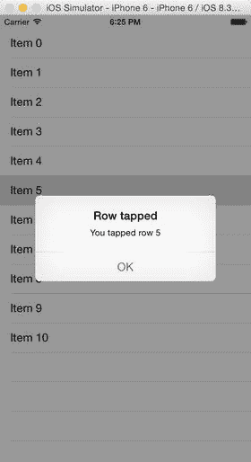

图 1-20. 轻点一行

恭喜——你刚刚构建了一个功能完备、响应灵敏的表格！

## 理解应用对象的组合方式

在离开 SimpleTable 应用去进行更具挑战性的练习之前，值得看看各个对象是如何组合在一起的。该应用有三个主要对象：

*   应用代理
*   视图控制器
*   视图（其中嵌入了表格视图）

图 1-21 展示了这三个对象如何关联，以及它们的出口。

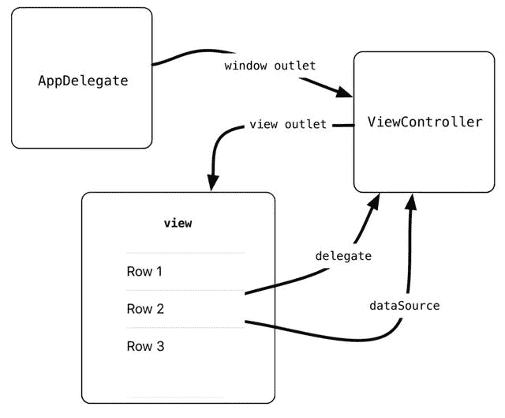

图 1-21. 对象图

`AppDelegate` 的 `window` 有一个 `rootViewController` 属性，它与 `ViewController` 对象相连。而该对象又有一个 `view` 出口，与 Storyboard 文件中的 `view` 对象相连。Storyboard 中嵌入了 `UITableView` 实例，它包含 `delegate` 和 `dataSource` 属性。这些属性又链接回 `ViewController`。

显然，这是一个非常简单的应用，但随着应用变得复杂，花时间勾勒出对象图是值得的。俗话说，一图胜千言，而一张对象图至少能抵过千行注释！

## 总结

在本章中，你逐步创建了一个非常基本的表格视图：

*   首先，你创建了一些要在表格中显示的数据。
*   然后，使用 Interface Builder 在窗口中创建了一个 `UITableView` 实例。
*   视图控制器遵循了 `UITableViewDataSource` 和 `UITableViewDelegate` 协议，以便能够提供表格数据和响应交互。
*   你实现了创建表格单元格所需的代码。
*   最后，你让表格对用户输入做出了响应。

接下来，我们将更详细地探讨表格和单元格的构建方式，以及如何对它们进行定制并使其响应用户交互。

