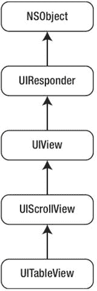
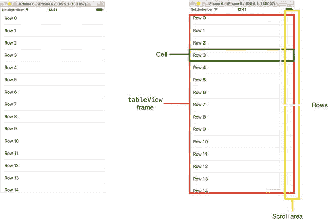
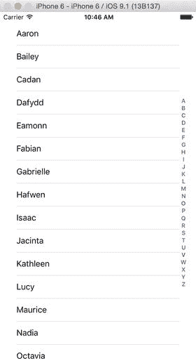
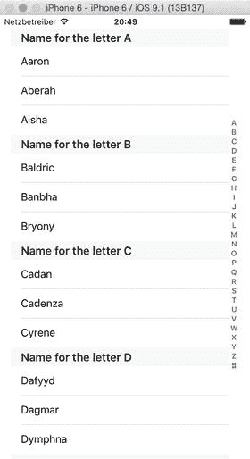
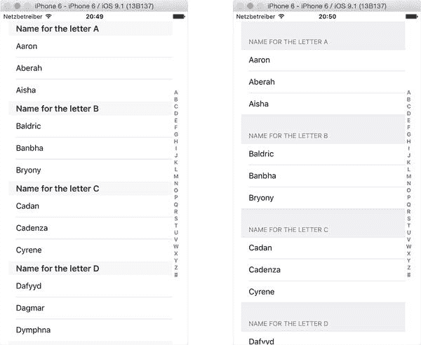
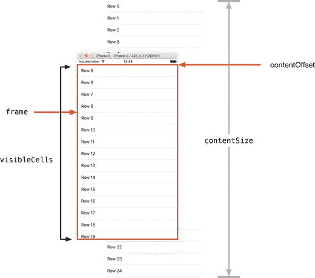

# 2. 表格视图的组成

在本章中，你将快速了解表格视图及其构成元素。尽管本章不会展示大量代码，但它将为后续定制表格视图提供有用的基础。

在此过程中，你将了解以下内容：

*   表格视图的类型和样式
*   表格视图的结构与尺寸
*   `UITableView` 与父类 `UIScrollView` 的关系
*   通过代码和 Interface Builder 创建表格视图
*   利用 `UITableViewController` 类的模板方法

## 理解表格视图

简单来说，表格视图是一个（通常）可以垂直滚动的项目列表。由于这是一种常见的界面设计模式，UIKit 提供了一套强大的类与协议，以尽可能简单高效地创建和管理表格视图。

表格视图的范围可以从使用 SDK 提供的标准样式创建的极简列表，到经过高度定制以至于几乎看不出是表格的样式。图 2-1 显示了一些表格视图的示例。


图 2-1. 表格视图示例——内置的“设置”应用、1Password 密码管理器以及 Collins 德语词典应用

“设置”应用使用了分组静态行，而 1Password 应用是一个带有搜索栏的普通表格视图。Collins 德语词典应用通过自定义单元格实现了独特的排版效果。尽管视觉外观各不相同，但这三个应用都基于 `UITableViews`，并具有相同的交互模式。


## 使用 `UITableView` 系列

表格视图的核心由构成 `UITableView` 系列的类、协议和视图对象组成：

- `UITableView` 和 `UITableViewController` 类
- `UITableViewDelegate` 和 `UITableViewDataSource` 协议
- `UITableView` 和 `UITableViewCell` 视图对象

这六个元素协同工作。类提供了表格视图的核心功能，协议定义了各种数据和交互方法，而视图对象则提供了具体的用户界面。

### `UITableView` 类层次结构

`UITableView` 类是 `UIScrollView` 的子类，而 `UIScrollView` 又继承自 `UIView`、`UIResponder`，最终继承自 `NSObject`，如图 2-2 所示。


*图 2-2. `UITableView` 继承链*

这意味着 `UITableView` 受益于其父类提供的许多功能。例如，`UIScrollView` 提供了表格的滚动功能，而 `UIResponder` 则允许表格单元格响应用户的触摸和滑动操作。

> **注意：** 为了减少混淆，当提到类时我会使用 `UITableView`，当提到 `UITableView` 的特定实例时我会使用 `tableView`，而在一般讨论表格视图时，我会使用“表格视图”。

## 选择表格视图的类型

尽管表格视图的视觉外观可以自定义到几乎难以认出是 `UITableView` 类的实例，但其基本形式只有两种：普通和分组。这些基本类型还有两种变体：索引和分段。

### 普通表格

普通表格是 `UITableView` 最基本的原生形式。图 2-3 展示了一个例子（内容可能是有史以来最枯燥的）。


*图 2-3. 普通表格视图及其组成部分*

当在 Interface Builder 中将表格拖入视图时，默认创建的就是普通表格，不过在代码中创建表格视图时可以指定类型：

```
var tableView: UITableView = UITableView(frame: tvFrame, style:.Plain)
```

如果 `tableView` 中的行数超出框架范围，可以滚动表格以显示更多行。当表格滚动时，右侧滚动区域会出现滚动指示器。

### 索引表格

索引表格在普通表格的基础上增加了额外的导航辅助工具，即索引，它出现在表格视图右侧、紧邻滚动区域的位置。图 2-4 展示了一个例子。


*图 2-4. 索引表格*

实现索引涉及 `UITableViewDataSource` 协议的方法，第 11 章将详细介绍。

### 分段表格

顾名思义，分段表格将其行分组为多个段。这些段可以带有标题。图 2-5 展示了一个相对简单的文本标题示例，如果需要，这些标题可以替换为复杂的 `UIView` 对象。


*图 2-5. 简单的分段表格*

这种类型的表格视图使用多个 `UITableViewDataSource` 协议方法来配置段的行为，第 11 章将介绍。

### 分组表格

分组表格更进一步，将各个段分隔成与表格视图背景风格不同的样式。图 2-6 展示了段和分组之间的区别。


*图 2-6. 比较段与分组*

每个段都有页眉和页脚。这些都是 `UIView` 对象，由两个 `UITableViewDelegate` 方法返回：

```
func tableView(tableView: UITableView, viewForFooterInSection section: Int) -> UIView?
func tableView(_ tableView: UITableView, viewForHeaderInSection section: Int) -> UIView?
```

虽然你可以操作构成整个页眉和页脚的视图，但通常只需能够设置标题即可。`UITableViewDataSource` 提供了两个方法来支持这一点：

```
func tableView(tableView: UITableView, titleForHeaderInSection section: Int) -> String?
func tableView(tableView: UITableView, titleForFooterInSection section: Int) -> String?
```

如果出于任何原因需要查找页眉和页脚的尺寸，`UITableView` 可以通过以下方法以 `CGRect` 值的形式返回：

```
func rectForHeaderInSection(_ section: Int) -> CGRect
func rectForFooterInSection(_ section: Int) -> CGRect
```

整个段（页眉、页脚和内容）的尺寸可通过调用以下方法获得：

```
func rectForSection(_ section: Int) -> CGRect
```

## 设置 `TableView` 的尺寸

将 `tableView` 形象化的一种方式是将其视为一个窗口，透过它可以看到由单元格组成的传送带。窗口中可见的单元格数量取决于窗口的大小（由 `tableView` 的 `frame` 属性指示）以及每个单元格的高度。`frame` 属性是一个包含高度和宽度值的 `CGRect`。

传送带的总长度——或者更准确地说，`tableView` 以点为单位的高度——可以通过 `contentSize` 属性获取，它返回一个 `CGSize`。然后你可以访问其 `width` 和 `height` 值。

在每条“传送带”的顶部和底部，你可以添加一个 `UIView` 作为静态页眉和页脚。这些分别通过 `tableHeaderView` 和 `tableFooterView` 属性设置。图 2-7 展示了 `tableView` 的尺寸。


*图 2-7. `tableView` 的尺寸*

在任何时刻可见的单元格可以通过 `tableView` 的 `visibleCells` 属性批量访问。这是一个 `Array`，并会随着表格上下滚动而更新。

## 控制 `UITableView` 的背景

为 `UITableView` 设置背景图像是可行的，虽然过程有些繁琐。步骤如下：

1. 创建一个 `UIImageView` 实例，并将其 `image` 属性设置为你希望显示在表格后面的图像：`let tableBackgroundImage = UIImageView(image: UIImage(named:"myImage"))`
2. 设置 `UIImageView` 的 `frame` 属性，使其与 `tableView` 的尺寸相同：`tableBackgroundImage.frame = tableView.frame`
3. 更新 `tableView` 的 `backgroundImage` 属性，使其指向新的 `UIImageView` 对象：`tableView.backgroundView = tableBackgroundImage`
4. 将表格单元格的背景色设置为 `clearColor`，以便背景图像可见：`cell.backgroundColor = UIColor.clearColor()`


